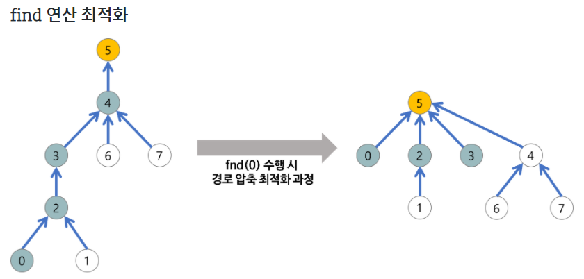
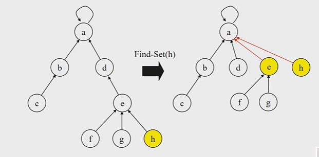

# MST_Algorithm

> MST는 노드 간 연결성을 보장하면서 노드 사이를 잇는 거리/비용 등을 최소로 하는 그래프

[toc]

## Union-Find Algorithm

- Disjoint Set을 표현할 때 사용하는 알고리즘
- 집합을 구현하는 데는 비트 벡텅, 배열, 연결 리스트를 이용할 수 있으나 그 중 가장 효율적인 트리 구조를 이용하여 구현한다.


### Path compression



- Find-Set을 행하는 과정에서 만나는 모든 노드들이 직접 root를 가리키도록 포인터를 바꿔준다.



- Make_Set() 연산
  - Make_Set(x) : 유일한 멤버 x를 포함하는 새로운 집합을 생성하는 연산

```python
p[x] : 노드 x의 부모 저장
rank[x] : 루트 노드가 x인 트리의 랭크 값 저장
    
Make_Set(x)
	p[x] <- x
    rank[x] <- 0
```

- Find_Set 연산
  - Find_Set(x) : x를 포함하는 집합을 찾는 오퍼레이션
  - 특정 노드에서 루트까지의 경로를 찾아가면서, 노드의 부모 정보를 갱신

```python
Find_Set(x)
	IF x != p[x] // x가 루트가 아닌 경우
    	p[x] <- Find_Set(p[x])
    RETURN p[x]
```

- Union 연산
  - Union(x,y) : x와 y를 포함하는 두 집합을 통합하는 오퍼레이션
  - x와 y중 rank가 높은 곳에 낮은 것을 연결시킴!!!

```python
Union(x,y)
	Link(Find_Set(x), Find_Set(y))
```

```python
Link(x,y)
	IF rank[x] > rank[y]	//rank는 트리의 높이
    	p[y] <- x
    ELSE
    	p[x] <- y
        IF rank[x] == rank[y]
        	rank[y]++
```


### Partition(분할)

- Kruskal MST 알고리즘에서 새로 추가할 간선의 양끝 정점이 같은 집합에 속해 있는지(사이클 형성 여부 확인)에 대해 검사하는 경우
- 초기에 {0}, {1}, {2}, … {n} 이 각각 n+1개의 집합을 이루고 있다. 여기에 합집합 연산과, 두 원소가 같은 집합에 포함되어 있는지를 확인하는 연산을 수행하려는 경우
  - 집합의 표현-백준1717번

#### BOJ_1717_집합의표현

> [BOJ1717집합의표현](https://www.acmicpc.net/problem/1717)

```python
import sys
input = sys.stdin.readline

def make_set(x):
    p[x] = x

def find_parent(x):
    if p[x] != x:
        p[x] = find_parent(p[x])
    return p[x]

def union(x,y):
    if find_parent(x) != find_parent(y):
        x = find_parent(x)
        y = find_parent(y)
        p[y] = x

n,m = map(int,input().split())
p = [x for x in range(n+1)]
for _ in range(m):
    #합집합 0 a가 포함된 집합과 b가 포함된 집합을 합침
    #두 원소가 같은 집합에 포함되어 있는지를 확인하는 연산 1
    check, a,b = map(int,input().split())
    #1dlaus find_parent
    if check:
        if find_parent(a) == find_parent(b):
            print('YES')
        else:
            print('NO')
    else:
        union(a,b)
```


- 어떤 사이트의 친구 관계가 생긴 순서대로 주어졌을 때, 가입한 두 사람의 친구 네트워크에 몇 명이 있는지 구하는 프로그램을 작성하는 경우
  - 친구 네트워크-백준4195번

#### BOJ_4195_친구의 네트워크

> [BOJ_4195_친구의 네트워크](https://www.acmicpc.net/problem/4195)

```python
import sys
sys.stdin= open('input.txt','r')
input = sys.stdin.readline

def find_parents(x):
    if p[x] != x:
        p[x] = find_parents(p[x])

    return p[x]

def union(x,y):
    if find_parents(x) != find_parents(y):
        x = find_parents(x)
        y = find_parents(y)
        p[x] = y
        cnts[y] += cnts[x]

T = int(input())
for tc in range(1,T+1):
    F = int(input())
    p = dict()
    cnts = dict()
    for _ in range(F):
        s,e = input().split()
        if s not in p:
            p[s] = s
            cnts[s] = 1
        if e not in p:
            p[e] = e
            cnts[e] = 1
        union(s,e)
        ans = find_parents(s)
        print(cnts[ans])

```


## MST(최소신장트리)

### Spanning Tree

- spanning Tree 중에서 사용된 간선들의 가중치 합이 최소인 트리
- MST = Minimum Spanning Tree = 최소 신장 트리
- 각 간선의 가중치가 동일하지 않을 때 단순히 가장 적은 간선을 사용한다고 해서 최소 비용이 얻어지는 것은 아니다.
- MST는 간선에 가중치를 고려하여 최소 비용의 Spanning Tree를 선택하는 것을 말한다.
- 즉, 네트워크(가중치를 간선에 할당한 그래프)에 있는 모든 정점들을 가장 적은 수의 간선과 비용으로 연결하는 것이다.


### MST 특징

1. 간선의 가중치의 합이 최소여야 한다.
2. n개의 정점을 가지는 그래프에 대해 반드시 (n-1)개의 간선만을 사용해야 한다.
3. 사이클이 포함되어서는 안된다.


### Prim 알고리즘

> 시작 정점에서 출발하여 신장트리 집합을 **단계적으로 확장** 해나가는 방법

- 하나의 정점에서 연결된 간선들 중에 하나씩 선택하면서 MST를 만들어 가는 방식

1. 임의 정점을 하나 선택해서 시작
2. 선택한 정점과 인접하는 정점들 중의 최소 비용의 간선이 존재하는 정점을 선택
3. 모든 정점이 선택될때(트리가 N-1개의 간선을 가질때)까지 `1,2`과정을 반복

- 서로소인 2개의 집합(2 disjoint-sets) 정보를 유지
  - 트리 정점들 - MST를 만들기 위해 선택된 정점들
  - 비트리정점들 - 선택되지 않은 정점들


#### prim 알고리즘 코드

1. 모든 간선 정보를 저장(adjacent_edges)
2. 임의의 정점을 선택, '연결된 노드 집합(connected_nodes)'에 삽입
3. 선택된 정점에 연결된 간선들을 간선 리스트(candidate_edge_list)에 삽입
4. 간선 리스트에서 최소 가중치를 가지는 간선부터 추출해서,
   - 해당 간선에 연결된 인접 정점이 '연결된 노드 집합'에 이미 들어있다면, 스킵함(cycle발생을 막기 위함)
   - 해당 간선에 연결된 인접 정점이 '연결된 노드 집합'에 들어 있지 않으면, 해당 간선을 선택하고, 해당 간선 정보를 '최소신장트리(MST)'에 삽입
     - 해당 간선에 연결된 인접 정점의 간선들 중, '연결된 노드 집합'에 없는 노드와 연결된 간선리스트에 삽입
       - '연결된 노드 집합'에 있는 노드와 연결된 간선들을 간선 리스트에 삽입해도, 해당 간선은 스킵될 것이기 때문
       - 어차피 스킵될 간선을 간선리스트에 넣지 않아서, 간선 리스트에서 최소 가중치를 가지는 간선부터 추출하기 위한 자료 구조 유지를 위한 effort를 줄일 수 있음
5. 선택된 간선은 간선 리스트에서 제거
6. 간선 리스트에 더 이상의 간선이 없을때까지 3~4번을 반복


##### SWEA_5249_최소신장트리

###### heapq라이브러리 활용을 통해 우선순위큐 사용하기

```python
import sys
import heapq
input = sys.stdin.readline

def MST_PRIM():
    visited = [False] * (V + 1)

    heap = []
    # 가중치와 점
    heapq.heappush(heap, (0, 0))
    ans = 0
    while heap:
        w, v = heapq.heappop(heap)
        if not visited[v]:
            ans += w
            visited[v] = True

            for weight,idx in adj[v]:
                if not visited[idx]:
                    heapq.heappush(heap, (weight, idx))

    return ans


for tc in range(1, int(input()) + 1):
    V, E = map(int, input().split())

    # 임의의 큰값으로 초기화된 값을 넣는다.
    adj = [[] for _ in range(V + 1)]
    for i in range(E):
        st, ed, weight = map(int, input().split())
        adj[st].append((weight,ed))
        adj[ed].append((weight,st))

    print("#{} {}".format(tc, MST_PRIM()))
```


###### heapq활용안함(다익스트라와 비슷한 방식)

```python
import sys
INF = sys.maxsize
input = sys.stdin.readline

def MST_PRIM():
    global ans
    key = [INF] * (V + 1)
    # p = [None] * (V + 1)
    visited = [False] * (V + 1)
    key[0] = 0
	
    for _ in range(V):
        # 최솟값찾기
        minIdx = -1
        min = 987654321
        for i in range(V + 1):
            #방문하지 않았고, MIN보다 더 짧다면 MIN값 갱신
            if not visited[i] and key[i] < min:
                min = key[i]
                minIdx = i
        ##min값 찾았으니 방문표시
        visited[minIdx] = True

        for i in range(V + 1):
            #방문하지 않았고, 갱신한 MIN에서 i로 향할때 더 작은 값이 있으면 key를 더 작은값으로 바꿔줌
            if not visited[i] and adj[minIdx][i] < key[i]:
                key[i] = adj[minIdx][i]
                # p[i] = minIdx

    for i in range(V + 1):
        ans += key[i]


T = int(input())
for tc in range(1, T + 1):
    V, E = map(int, input().split())

    # 임의의 큰값으로 초기화된 값을 넣는다.
    adj = [[INF] * (V + 1) for _ in range(V + 1)]
    for i in range(E):
        st, ed, weight = map(int, input().split())
        adj[st][ed] = adj[ed][st] = weight
    ans = 0

    MST_PRIM()

    print("#{} {}".format(tc, ans))
```


### Kruskal 알고리즘

1. 최초, 모든 간선을 가중치에 따라 오름차순으로 정렬
2. 가중치가 가장 낮은 간선부터 선택하면서 트리를 증가시킴
   - 사이클이 존재하면 다음으로 가중치가 낮은 간선 선택
3. n-1개의 간선이 선택될 때까지 `2.`를 반복


#### Kruskal 알고리즘의 구체적인 동작 과정

> Kruskal 알고리즘을 이용하여 MST(최소 비용 신장 트리)를 만드는 과정
>
> - 간선 선택을 기반 으로 하는 알고리즘
> - 이전 단계에서 만들어진 신장 트리와는 상관없이 무조건 최소 간선만을 선택하는 방법
>
> **주의!**
>
> - 다음 간선을 이미 선택된 간선들의 집합에 추가할 때 사이클을 생성하는지를 체크!
>   - 새로운 간선이 이미 다른 경로에 의해 연결되어 있는 정점들을 연결할 때 사이클이 형성된다.
>   - 즉, 추가할 새로운 간선의 양끝 정점이 같은 집합에 속해 있으면 사이클이 형성된다.
> - 사이클 생성 여부를 확인하는 방법
>   - 추가하고자 하는 간선의 양끝 정점이 같은 집합에 속해 있는지를 먼저 검사해야 한다.
>   - ‘union-find 알고리즘’ 이용


##### SWEA_5249_최소신장트리

###### Union-find알고리즘 이용

```python
def make_set(x):
    p[x] = x

#path compression기법
def find_set(x):
    if p[x] != x:
        p[x] = find_set(p[x])
    return p[x]

#path compression기법을 썼기때문에 rank상관없음!
def union(x,y):
    p[find_set(x)] = find_set(y)


for tc in range(1, int(input())+1):
    V, E = map(int,input().split())

    edges = [list(map(int , input().split())) for _ in range(E)]
    edges = sorted(edges, key=lambda x: x[2])
    p = [-1] * (V+1)

    for i in range(V+1):
        make_set(i)

    ans = 0
    cnt = 0
    idx = 0
    while cnt < V:
        if find_set(edges[idx][0]) != find_set(edges[idx][1]):
            union(edges[idx][0], edges[idx][1])
            cnt += 1
            ans += edges[idx][2]
        idx += 1

    print("#{} {}".format(tc, ans))
```

- 내가 다시 적어봄

```python
'''
kruskal algorithm
'''
import sys
sys.stdin = open('input.txt','r')

def make_set(node):
    parent[node] = node

#path compression기법
def find_set(node):
    if parent[node] != node:
        parent[node] = find_set(parent[node])
    return parent[node]

#path compression기법을 썼기때문에 rank상관없음!
def union(x,y):
    parent[find_set(x)] = find_set(y)


def kruskal(graph):
    global ans
    #1. 초기화
    for node in range(V+1):
        make_set(node)

    #2.간선 weight기반 sorting
    #kruskal은 가중치를 기준으로 정렬한 뒤 사용!!!
    graph = sorted(graph,key = lambda x:x[2])

    #3. 간선 연결(사이클 없는)
    for edge in graph:
        n1,n2,weight = edge
        if find_set(n1) != find_set(n2):
            union(n1,n2)
            ans += weight
    return ans


T = int(input())
for tc in range(1,T+1):
    V,E = map(int,input().split())
    #양끝노드 n1,n2,가중치w
    edges = [list((map(int,input().split()))) for _ in range(E)]
    parent = [-1]*(V+1)
    ans = 0
    print('#{} {}'.format(tc,kruskal(edges)))
```


### 관련문제

#### BOJ_1197_최소스패닝트리

```python
'''
MST
크루스칼, 프림 이용해서 풀기
'''
import sys
sys.stdin = open('input.txt','r')
import heapq

input = sys.stdin.readline
INF = sys.maxsize

def prim_heapq():
    visited = [False] *(V+1)
    heap = []
    heapq.heappush(heap,[0,1])
    ans = 0
    while heap:
        w,v = heapq.heappop(heap)
        if not visited[v]:
            ans += w
            visited[v] = True

            for weight, idx in adj[v]:
                if not visited[idx]:
                    heapq.heappush(heap,[weight,idx])
    return ans

##kruskal
# def make_set(x):
#     p[x] = x
#
def find_set(x):
    if p[x] != x:
        p[x] = find_set(p[x])
    return p[x]

def union(x,y):
    if find_set(x) != find_set(y):
        p[find_set(y)] = find_set(x)

def kruskal(graph):
    graph = sorted(graph,key = lambda x : x[2])
    # for i in range(V+1):
    #     make_set(i)
    ans = 0
#처음한개가 이미 연결돼있어서 1부터 시작
    cnt = 1
    idx = 0
    while cnt < V:
        x = graph[idx][0]
        y = graph[idx][1]
        if find_set(x) != find_set(y):
            union(x,y)
            cnt += 1
            ans += graph[idx][2]
        idx+=1
        # print('idx',idx)
    return ans


V,E = map(int,input().split())
adj = [[] for _ in range(V+1)]
edges = []
#make_set과정 포함하면 p만듦
p = [x for x in range(V+1)]
# print(p)
for _ in range(E):
    u,v,w = map(int,input().split())
    adj[u].append([w,v])
    adj[v].append([w,u])
    edges.append([u,v,w])
# print(edges)
primHeap = prim_heapq()
kruskalans = kruskal(edges)
print(primHeap)
print(kruskalans)
```

