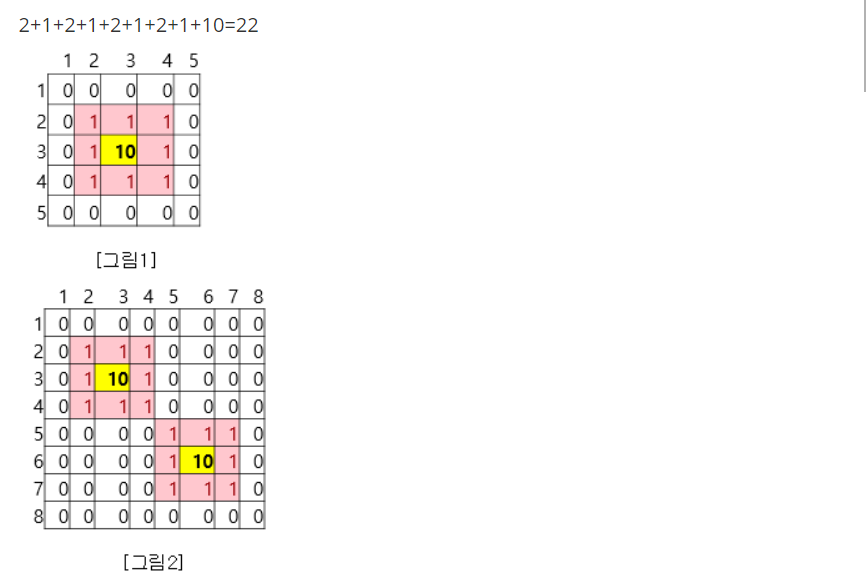
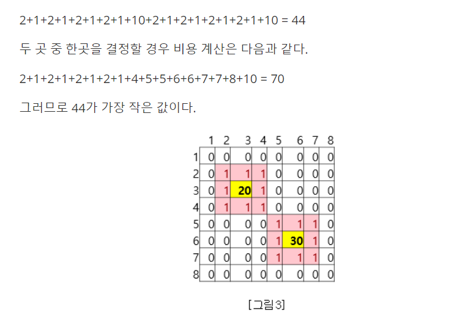
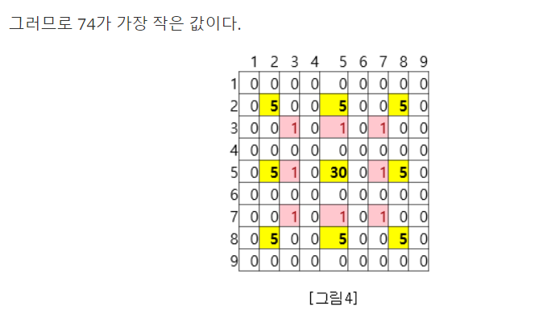

## 10888_음식배달

코로나로 식사를 배달해서 먹는 사례가 많아지고 있다. 한 배달음식 만을 전문으로 운영하는 프렌차이즈는 도시에 음식배달 집을 어떻게 배치하는 것이 최선인지 조사하고 있다.

크기가 N×N인 도시가 있다. 도시는 1×1크기의 칸으로 나누어져 있다. 도시의 각 칸은 빈 칸, 음식배달집, 집 중 하나이다. 도시의 칸은 (r, c)와 같은 형태로 나타내고, r행 c열 또는 위에서부터 r번째 칸, 왼쪽에서부터 c번째 칸을 의미한다. r과 c는 1부터 시작한다.

프렌차이즈에서는 **“****배달 거리****”**라는 말을 사용한다. **배달 거리**는 집과 가장 가까운 음식배달집 사이의 거리이다. 즉, 배달 거리는 집을 기준으로 정해지며, 음식배달집이 결정되면 각각의 집은 배달 거리가 결정된다.

임의의 두 칸 (r1, c1)과 (r2, c2) 사이의 거리는 |r1-r2| + |c1-c2|로 구한다.

또한 음식배달집은 임대료 및 기타 음식배달집을 운용하는데 비용이 발생한다. 이를 “**운용비****”**라고 한다.

도시에 집과 배달음식 집이 위치할 수 있는 장소 및 배달음식 집의 운용비가 표시된 지도가 주어진다. 프렌차이즈 본사에서는 주어진 지도를 기반으로 임의의 개수의 음식배달집을 선택하고 선택한 음식배달집을 기준으로 모든 집의 배달거리의 합과 선택한 음식배달집의 운영비의 합을 더하여 최소인 값을 찾고자 한다.

예를 들어 [그림1]을 살펴보자. 0은 빈칸을 1은 집을 2이상은 배달음식집의 위치 및 운영비를 의미한다. 배달음식집이 가능한 곳이 하나이므로 각 집까지의 거리의 합과 운영비의 합을 더하면 22가 된다.



[그림2]에서 음식배달집이 가능한 곳은 2 곳이다. 두 음식배달집을 모두 결정할 경우 비용 계산은 다음과 같다.

[그림3]에서 음식배달집이 가능한 곳은 2 곳이다. 두 음식배달집을 모두 결정할 경우 비용 계산은 다음과 같다.

2+1+2+1+2+1+2+1+20+2+1+2+1+2+1+2+1+30 = 74


두 곳 중 (3,3)의 음식배달집을 결정할 경우 비용 계산은 다음과 같다.

2+1+2+1+2+1+2+1+4+5+5+6+6+7+7+8+20 = 80

두 곳 중 (6,6)의 음식배달집을 결정할 경우 비용 계산은 다음과 같다.

2+1+2+1+2+1+2+1+4+5+5+6+6+7+7+8+30 = 90




[그림4]에서 음식배달집의 개수는 9개이며 여러 가지 경우를 고려할 수 있으며 그 중 몇 가지 예를 들어 보면 아래와 같다.

(5,5) 위치의 음식배달집을 결정할 경우 비용 계산은 다음과 같다.

4+2+4+2+4+2+4+2+30 = 54

(5,5) 위치의 음식배달집을 제외하고 남은 음식배달집을 결정할 경우 비용 계산은 다음과 같다.

2+1+2+1+2+1+2+1+5+5+5+5+5+5+5+5=52

(2,5), (8,5) 두 곳의 음식배달집을 결정할 경우 비용 계산은 다음과 같다.

(1+3+3+5+5+3+3+1)+(5+5)=34

34값이 가장 작은 값이다.

 

주어진 지도를 기반으로 임의의 개수의 음식배달집을 선택하고 선택한 음식배달집을 기준으로 모든 집의 배달거리의 합과 선택한 음식배달집의 운영비의 합을 더하여 최소인 값을 구하는 프로그램을 작성 하시오.

 

**[****입력****]**

첫 줄에 테스트 케이스 개수 T( 1 ≤ T ≤ 10)가 주어진다.

각 테스트 케이스의 첫째 줄에는 지도의 크기 N(5 ≤ N ≤ 20)가 주어진다. 각 테스트 케이스의 두 번째 줄부터 N줄에 걸쳐 N X N 크기의 지도 정보가 주어진다. 지도의 정보는 0은 빈 칸, 1은 집, 2이상은 음식배달집을 의미한다. 집의 개수는 100개를 넘지 않으며, 적어도 1개는 존재한다. 음식배달집의 개수는 10개를 넘지 않는다.

 

**[출력]**

\#과 1번부터인 테스트케이스 번호, 빈칸에 이어 임의의 개수의 음식배달집을 선택했을 때 배달거리의 합과 선택한 음식배달집의 운영비의 합을 더한 값 중 최소값을 출력한다.

 ```txt
3
5
0 0 0 0 0
0 1 1 1 0
0 1 10 1 0
0 1 1 1 0  
0 0 0 0 0
8
0 0 0 0 0 0 0 0
0 1 1 1 0 0 0 0
0 1 10 1 0 0 0 0
0 1 1 1 0 0 0 0
0 0 0 0 1 1 1 0
0 0 0 0 1 10 1 0
0 0 0 0 1 1 1 0
0 0 0 0 0 0 0 0
8
0 0 0 0 0 0 0 0
0 1 1 1 0 0 0 0
0 1 20 1 0 0 0 0
0 1 1 1 0 0 0 0
0 0 0 0 1 1 1 0
0 0 0 0 1 30 1 0
0 0 0 0 1 1 1 0
0 0 0 0 0 0 0 0


#1 22
#2 44
#3 74

 ```


 