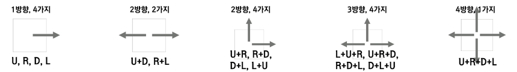
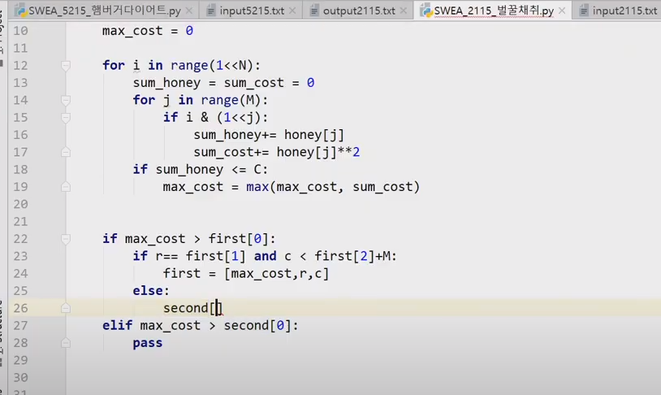

## 삼성SW역량기출

[toc]

## BOJ_13458_시험감독

> [BOJ_13458_시험감독](https://www.acmicpc.net/problem/13458)

```python
#시험장 개수 N
N = int(input())
#각 시험장 응시자 수
students = list(map(int,input().split()))
#총 감독관 감시가능 수, 부감독관 감시가능 수
B,C = map(int,input().split())
cnt = 0
for i in range(N):
    students[i] -=B
    cnt += 1
# print(students)
for i in range(N):
    if students[i] > 0:
        if students[i]%C:
            cnt += students[i]//C +1
        else:
            cnt += students[i]//C
print(cnt)
```


## SWEA_1953_탈주범검거(BFS)

> [SWEA_1953_탈주범검거](https://swexpertacademy.com/main/solvingProblem/solvingProblem.do)
>
> 다음에는 범위가 주어졌으니 딕셔너리같은 곳에 담아서 한번에 불러오쟈...ㅎㅎ

```python
import sys
sys.stdin = open('input.txt','r')

di = [0,1,0,-1]#우하좌상
dj = [1,0,-1,0]
def BFS(i,j):
    q = [(i,j)]
    dist[i][j] = 1
    while q:
        pi,pj = q.pop(0)
        if dist[pi][pj] >= L:
            return
        for d in range(4):
            ni = pi + di[d]
            nj = pj + dj[d]
            if ni < 0 or ni >= N or nj < 0 or nj >= M:
                continue
            if not tunnel[ni][nj]:
                continue
            if dist[ni][nj]:
                continue
            #우, 현재 위치가 1,3,4,5가 아니거나 다음 위치가 1,3,6,7이 아니면 못감
            if d ==0 and (tunnel[pi][pj] not in [1,3,4,5] or tunnel[ni][nj] not in [1,3,6,7]):
                continue
            #하, 현재 위치가 1,2,5,6가 아니거나 다음 위치가 1,2,4,7이 아니면 못감
            if d==1 and (tunnel[pi][pj] not in [1,2,5,6] or tunnel[ni][nj] not in [1,2,4,7]):
                continue
            #좌,현재 위치가 1,3,6,7가 아니거나 다음 위치가 1,3,4,5이 아니면 못감
            if d == 2 and (tunnel[pi][pj] not in [1,3,6,7] or tunnel[ni][nj] not in [1,3,4,5]):
                continue
            #상,현재 위치가 1,2,4,7가 아니거나 다음 위치가 1,2,5,6이 아니면 못감
            if d==3 and (tunnel[pi][pj] not in [1,2,4,7] or tunnel[ni][nj] not in [1,2,5,6]):
                continue
            dist[ni][nj] = dist[pi][pj] + 1
            q.append((ni,nj))


T = int(input())
for tc in range(1,T+1):
    #세로N, 가로M, 맨홀뚜껑 위치한 장소 세로위치R,가로위치,탈출후 소요된시간 L
    N,M,R,C,L = map(int,input().split())
    #N줄 터널 지도 정보 M개의 숫자
    tunnel = [list(map(int,input().split())) for _ in range(N)]
    dist = [[0 for j in range(M)] for i in range(N)]
    BFS(R,C)
    cnt = 0
    for i in range(N):
        for j in range(M):
            if 0 < dist[i][j] <= L:
                cnt+=1
    # from pprint import pprint
    # print('소요시간',L)
    # pprint(tunnel)
    # print('처음위치',R,C)
    # pprint(dist)
    print('#{} {}'.format(tc,cnt))

```

- 현우's code

```python
from collections import deque
from pprint import pprint
di = [0,0,1,-1] # 우,좌,하,상
dj = [1,-1,0,0]

go_dir = {1: [0,1,2,3], 2: [2,3], 3: [0,1], 4: [0,3],
          5: [0,2], 6: [1,2], 7: [1,3]}
next_pipe = {0: [1,3,6,7], 1: [1,3,4,5], 2: [1,2,4,7], 3: [1,2,5,6]}

T = int(input())
for tc in range(1,T+1):
    N,M,R,C,L = map(int,input().split())
    arr = [list(map(int,input().split())) for _ in range(N)]
    dist = [[0 for _ in range(M)] for _ in range(N)]
    q = deque()
    q.append([R,C])
    dist[R][C] = 1
    ans = 0
    while q:
        pi,pj = q.popleft()
        pipe = arr[pi][pj]
        if dist[pi][pj] > L:
            break
        for d in go_dir[pipe]:
            ni,nj = pi+di[d], pj + dj[d]
            if ni < 0 or nj < 0 or ni >= N or nj >= M:
                continue
            if dist[ni][nj] != 0:
                continue
            if arr[ni][nj] in next_pipe[d]:
                dist[ni][nj] = dist[pi][pj]+1
                q.append([ni,nj])
    #print()
    #pprint(dist)
    for i in range(N):
        for j in range(M):
            if dist[i][j] == 0:
                continue
            if dist[i][j] <= L:
                ans += 1
    print('#{} {}'.format(tc,ans))
```


- 승범's code

```python
from collections import deque
def bfs():
    global cnt
    q = deque()
    q.append((R, C, 1, maps[R][C]))
    maps[R][C] = 0
    while len(q):
        r, c, l, info_num = q.popleft()
        if l == L + 1: return
        else: cnt += 1;
        for i in info[info_num]:
            rr, cc = r + dr[i], c + dc[i]
            if 0 <= rr < N and 0 <= cc < M:
                #(i+2)%4 -> 다음 파이프가 상일때는 하, 좌일때는 우니까 방향을 상좌하우로 해주고 모듈연산사용..
                if maps[rr][cc] != 0 and (i + 2) % 4 in info[maps[rr][cc]]:
                    q.append((rr, cc, l + 1, maps[rr][cc]))
                    maps[rr][cc] = 0
dr = [-1, 0, 1, 0] # 상좌하우
dc = [0, -1, 0, 1]
info = [0, [0, 1, 2, 3], [0, 2], [1, 3], [0, 3], [2, 3], [2, 1], [0, 1]]
for t in range(1, 1 + int(input())):
    N, M, R, C, L = map(int, input().split())
    maps = [list(map(int, input().split())) for _ in range(N)]
    cnt = 0
    bfs()
    print('#{} {}'.format(t, cnt))
```


## SWEA_1249_보급로(BFS)

```python
'''
출발지에서 도착지까지 가는 bfs만듦
도로가 파여진 깊이에 비례해서 복구시간 증가
가장짧은 경로!

'''
import sys
sys.stdin = open('input.txt','r')
from collections import deque

di = [-1,1,0,0]#상하좌우
dj = [0,0,-1,1]
def BFS(i,j):
    q = deque()
    q.append([i,j])
    times[i][j] = 0
    while q:
        pi,pj = q.popleft()
        # print(pi,pj)
        if pi == N-1 and pj == N-1:
            continue
        for d in range(4):
            ni = pi + di[d]
            nj = pj + dj[d]
            if ni < 0 or ni >= N or nj < 0 or nj >= N:
                continue
            #  <= 에 '='을 붙이고 안붙이고 시간차이가 엄청 난당...
            if times[ni][nj] != -1 and times[ni][nj] <= times[pi][pj] + int(arr[ni][nj]):
                continue
            # print(int(arr[ni][nj]))
            times[ni][nj] = times[pi][pj] + int(arr[ni][nj])
            q.append([ni,nj])


T = int(input())
for tc in range(1,T+1):
    N = int(input())
    arr = [list(input()) for _ in range(N)]
    # for x in range(N):
    #     print(arr[x])
    times = [[-1 for j in range(N)] for i in range(N)]
    BFS(0,0)
    # print(times)
    print('#{} {}'.format(tc,times[N-1][N-1]))
```


## BOJ_14889_스타트와링크

> [BOJ_14889_스타트와링크](https://www.acmicpc.net/problem/14889)

```python
'''
14:11
조합 차 최소구하기
'''
import sys
input = sys.stdin.readline

def power(sel,ops):
    sans = 0
    lans = 0
    # print(sel,ops)
    for i in range(N//2):
        for j in range(N//2):
            if i != j:
                # print(sans,lans)
                sans += arr[sel[i]][sel[j]]
                lans += arr[ops[i]][ops[j]]
    return abs(sans-lans)


def comb(idx,sidx):
    global MIN
    if sidx == N//2:
        # print(steam)
        ops = []
        for i in range(N):
            if i not in steam:
                ops.append(i)
        ans = power(steam,ops)
        # print(ans)
        if ans < MIN:
            MIN = ans
        return
    if idx == N:
        return
    steam[sidx] = idx
    comb(idx+1,sidx+1)
    comb(idx+1,sidx)

N = int(input())
arr = [list(map(int,input().split())) for _ in range(N)]
steam = [0]*(N//2)
MIN = 987654321
comb(0,0)
print(MIN)

```

- 다른 사람 코드

```python
import sys
from itertools import combinations as cb
N = int(sys.stdin.readline()) // 2
M = 2*N
stat = [list(map(int, sys.stdin.readline().split())) for _ in range(M)]
newstat = [sum(i) + sum(j) for i, j in zip(stat, zip(*stat))]
print(newstat)
allstat = sum(newstat) // 2

mins = 65535
for l in cb(newstat[:-1], N):
    mins = min(mins, abs(allstat - sum(l)))
print(mins)
```


## BOJ_20055_컨베이러벨트위의로봇

```python
'''
15:45
로봇이 어떤칸에 올라가거나 이동 -> 내구도 -1
내구도0 -> 로봇갈수 없음
N에 도착하면 로봇은 땅에 내려가야됨
#내구도가 0인것 개수가 K가 되면  stage를 print
#1단계
#arr원소들 한칸씩 미룸,  N번이되면 로봇내려감 오르고 이동하면 내구도-1
#로봇 한칸씩 이동할수있으면 이동 그 다음 장소가 0이거나 로봇이 있으면 안됨
#1번에 로봇이 없으면 올리고 내구도 -1,종료조건인지 확인
#종료조건이 아니라면 다시 단계반복, 몇번째 단계인지 확인
'''
import sys
sys.stdin = open('input.txt','r')
input = sys.stdin.readline

def move(ans,robot,stage):
    global result
    while True:
        # ans = [0]*2*N
        # print('ans',ans)
        #arr원소를 한칸씩미룸
        # print('로봇이동전',robot)
        # print('벨트이동전',temp)
        # for i in range(2*N):
        #     ans[(i+1)%(2*N)] = temp[i]
        ans.insert(0,ans.pop())

        #로봇도 이동
        for i in range(N-1)[::-1]:
            if robot[i]:
                robot[i+1] = 1
                robot[i] = 0
        if robot[N-1]:
            robot[N-1] = 0
        # print('벨트이동후',ans)
        # print('벨트이동후로봇',robot)
        #로봇이 바뀐 배열이동가능한지 확인하고 1칸씩 이동시킴
        for i in range(N-1)[::-1]:
            if ans[i+1] > 0  and robot[i] and not robot[i+1]:
                robot[i] = 0
                robot[i+1] = 1
                ans[i+1] -=1
            if robot[N-1]:
                robot[N-1] = 0
        # print('로봇이동후',robot)
        # print('이동후벨트',ans)
        #첫번째가 올라갈수있고, 1번에 로봇이 없으면 올림 내구도-1
        if ans[0] and not robot[0]:
            ans[0] -= 1
            robot[0] = 1
            # print('로봇올라감',ans)
            # print('로봇올라감',robot)
        if robot[N-1]:
            robot[N-1] = 0
        cnt = 0
        #내구도 세어줌
        for i in range(2*N):
            if ans[i]<=0:
               cnt += 1
        if cnt >= K:
            result = stage
            return
        stage += 1
        # temp = ans[:]
        # print(stage,'다음단계',temp)


N,K = map(int,input().split())
arr = list(map(int,input().split()))
robotList = [0 for i in range(N)]
# robotList[0]=1
# print(arr)
result= 0
move(arr,robotList,1)
print(result)
```

- 현우's code

```python
N,K = map(int,input().split())
naegudos = list(map(int,input().split()))
robots = []
step = 1
# 0 올라가는 위치 N-1 내려가는 위치
while True:
    # 1. 벨트 한칸 회전
    naegudos.insert(0,naegudos.pop())
    for i in range(len(robots)):
        robots[i] = (robots[i]+1)%(2*N)
    # 내릴 로봇 있으면 내림
    if N-1 in robots:
        robots.remove(N-1)
    # 2. 로봇이 움직일 수 있으면 이동
    rbs = len(robots)
    for i in range(rbs):
        if (robots[i]+1)%(2*N) not in robots and naegudos[(robots[i]+1)%(2*N)] > 0:
            robots[i] = (robots[i]+1)%(2*N)
            naegudos[robots[i]] -= 1
    # 내릴 로봇 있으면 내림
    if N-1 in robots:
        robots.remove(N-1)
    # 로봇 올림
    if 0 not in robots and naegudos[0] > 0:
        robots.append(0)
        naegudos[0] -= 1
    if naegudos.count(0) >= K:
        break
    step += 1
print(step)
```


## BOJ_17142_연구소3

```python
'''
20:10 -> 22:05
0->빈칸
1->벽
2->바이러스위치

바이러스 위치를 받아서 start지점으로 두고, start에 넣어둠! + 빈칸 개수 세어둠
start 개수 중 M개를 조합으로 뽑음
그리고 bfs돌리고 모든 빈칸에 바이러스를 퍼뜨리면 최소시간 갱신!
모든 빈칸에 퍼뜨릴 수 없으면 -1 출력
'''
import sys
sys.stdin = open('input.txt','r')
from collections import deque
INF = sys.maxsize


def comb(idx):
    global MIN,order
    if sum(sel) > M:
        return
    if idx == S:
        if sum(sel) != M:
            return
        ans = 0
        for i in range(S):
            if sel[i]:
                order.append(start[i])
        # print(order)
        ans = BFS(order)
        if ans != -1 and MIN > ans:
            MIN = ans
        return
    sel[idx] = 1
    comb(idx+1)
    sel[idx] = 0
    comb(idx+1)

di = [-1,1,0,0] #상하좌우
dj = [0,0,-1,1]
def BFS(q):
    times = [[0 for j in range(N)] for i in range(N)]
    MAX = -INF
    cnt= 0
    for x in q:
        i,j = x
        times[i][j] = -1
    while q:
        pi,pj = q.popleft()
        for d in range(4):
            ni = pi + di[d]
            nj = pj + dj[d]
            #범위벗어나면 지나감
            if ni < 0 or ni >= N or nj < 0 or nj >= N:
                continue
            #방문했으면지나감
            if times[ni][nj]:
                continue
            #벽이면 지나감
            if virus[ni][nj] == 1:
                continue
            #빈칸만 세어줌
            if virus[ni][nj] !=2:
                cnt+=1
            #시작점이기 때문에 지나감
            if times[ni][nj] == -1:
                continue
            #현재가 시작점이기 때문에 다음 값은 1
            if times[pi][pj] ==-1:
                times[ni][nj] = 1
            else:
                times[ni][nj] = times[pi][pj] + 1
            #빈칸들 중에서 MAX를 갱신
            if not virus[ni][nj] and MAX < times[ni][nj]:
                MAX = times[ni][nj]
            q.append([ni,nj])
    if cnt != zero:
        MAX = -1
    # for x in times:
    #     print(x)
    # print(MAX)
    return MAX

N,M = map(int,input().split())
virus = [list(map(int,input().split())) for _ in range(N)]
start = deque()
order = deque()
zero = 0
MIN = INF
# for x in virus:
#     print(x)
#시작점을 담아주고 0인 값을 센다
for i in range(N):
    for j in range(N):
        if virus[i][j] == 2:
            start.append([i,j])
        if not virus[i][j]:
            zero += 1
S = len(start)
sel = [0] * S
#zero가 0이라면 안해줘도 되니까 바로 0출력
if not zero:
    print(0)
else:
    #조합으로 start중에서 M개를 뽑아서 BFS돌려주고, times중 최댓값이 작은거 갱신! -> 빈칸이 다 안채워지면 -1 출력
    comb(0)
    if MIN == INF:
        print(-1)
    else:
        print(MIN)

```


## BOJ_14503_로봇청소기

> 힌트봄...ㅠ
>
> 복잡할때는 나눠서 해보자!
>
> 가지 못하는 경우 후진을 해야될때와 아닐때로 나눠서 작성하자
>
> 한번에 처리하려고 하면 꼬이게 됨.......ㅠ

```python
'''
22:15
청소기 방향 있음 동(우)서(좌)남(하)북(상)
지도 각 칸 (r(행),c(열))
1:벽 0:빈칸
로봇청소기 작동
1. 현재 위치 청소
2. 현재 위치에서 현재 방향을 기준으로 왼쪽방향부터 차례대로 탐색
2-1. 왼쪽 방향에 아직 청소하지 않은 곳 있으면 그 방향으로 회전, 한칸 전진, 1번 진행
2-2. 왼쪽 청소 공간 없으면 그방향 회전 후 2번
2-3. 네방향 모두 청소 돼있거나 벽, 바라보는 방향 유지, 한칸 후진, 2번 돌아감
2-4. 네방향 모두 청소, 벽, 뒤도 벽, 작동 멈춤

#그래도 이건 내가 생각했당....ㅠ
DFS(r,c,dir)로 돌리는데  (dir+3)%4의 순서로 본다! 상(0) -> 좌(3), 우(1) -> 상(0), 하(2)->우(1), 좌(3)->하(2)
현재 방향에 아직 청소하지 않은 곳이 있으면 (dir+3)%4로 방향전환, 1칸 가고, 그 방향의 또 (dir+3)%4로 이동(갈수있다면)
청소할 공간 없다! -> (dir+3)%4회전 후 다시 (dir+3)%4로 넘어감!
네방향 모두 청소할 공간이 없다! 현재 방향에서 뒤로 한칸! (dir+2)%4로 방향 전환!
네방향 모두 청소, 벽, 뒤도 벽, 작동 멈춤
'''
import sys
sys.stdin = open('input.txt','r')
sys.setrecursionlimit(10**8)
input = sys.stdin.readline

di = [-1,0,1,0]#상우하좌
dj = [0,1,0,-1]
def DFS(i,j,dir,cnt):
    visited[i][j] = True
	#갈 곳이 없을 때 후진!
    if cnt == 4:
        #후진할 방향
        d = (dir+2)%4
        ni = i + di[d]
        nj = j + dj[d]
        #벽이면 못감
        if arr[ni][nj]:
            return
       	#벽이 아니라면 원래의 방향을 가지고 보냄
        else:
            DFS(ni, nj, dir,0)
    else:
        #현재 방향의 왼쪽먼저 살핌
        d = (dir + 3)%4
        ni = i + di[d]
        nj = j + dj[d]
        #앞으로 갈 곳이 갈수 있는 곳이라면 보냄
        if arr[ni][nj] == 0 and not visited[ni][nj]:
            DFS(ni,nj,d,0)
        #아니라면 cnt+1
        else:
            DFS(i,j,d,cnt+1)


#세로,가로
N,M = map(int,input().split())
#r,c좌표, 바라보는 방향 0:북(상), 1:동(우),2:남(하),3:서(좌)
r,c,d = map(int,input().split())
arr = [list(map(int,input().split())) for _ in range(N)]
# print(r,c,d)
# for x in arr:
#     print(x)
visited = [[False for j in range(M)] for i in range(N)]
DFS(r,c,d,0)
ans = 0
# for x in visited:
#     print(x)
for i in range(N):
    for j in range(M):
        if visited[i][j]:
            ans +=1
print(ans)
```

- 아래처럼 room(arr) 배열 자체에 방문처리를 하면 방문배열 안만들수도 됨!!!

```python
def DFS(R, C, D, fail):
    room[R][C] = '2'
    if fail == 4:
        nr = R + dr[(D+2)%4]
        nc = C + dc[(D+2)%4]
        if room[nr][nc] == 1:
            return
        else:
            DFS(nr, nc, D, 0)
    else:
        nr = R + dr[(D+3)%4]
        nc = C + dc[(D+3)%4]
        if room[nr][nc] == 0:
            DFS(nr, nc, (D+3)%4, 0)
        else:
            DFS(R, C, (D+3)%4, fail + 1)
```

- 다른사람 코드

```python
def clean(r,c,d):
    if visited[r][c] == 0:
        visited[r][c] = 1
    cnt = 1
    while True:
        for i in range(1,5):
            tmp_d = (d-i) % 4
            dr = r + d_row[tmp_d]
            dc = c + d_col[tmp_d]
            if visited[dr][dc]==0 and area[dr][dc] == 0:
                visited[dr][dc] = 1
                r = dr
                c = dc
                d = tmp_d
                cnt += 1
                break
        else:
            tmp_d = (d-2) % 4
            r += d_row[tmp_d]
            c += d_col[tmp_d]
            if area[r][c] == 1:
                return cnt

d_row = [-1,0,1,0]
d_col = [0,1,0,-1]
N,M = map(int,input().split())
r,c,d = map(int,input().split())
area = [list(map(int,input().split())) for _ in range(N)]
visited = [[0]*M for _ in range(N)]
print(clean(r,c,d))
```


## BOJ_17140_이차원배열과연산

```python
'''
23:00
R연산 : 배열의 모든 행에 대해서 정렬 수행, 행의 개수 >= 열의 개수일 때 적용
C연산 : 배열의 모든 열에 대해서 정렬 수행, 행의 개수 < 열의 개수인 경우 적용
각 수가 몇 번 나왔는지, 그 다음 등장 횟수가 커지는 순으로, 여러가지라면 수가 커지는 순으로 정렬 (수,등장횟수)
연산이 끝난 뒤, R ->가장큰행 기준, C->가장 큰 열 기준으로 0이 채워짐
수를 정렬할 떄는 0을 무시해야됨
행 또는 열의 크기가 100을 넘어가면 처음 100개를 제외하고는 버림
100초가 지나도 A[r][c]=k가 안되면 -1출력

1. R연산을 하는 함수 만들기
행의 개수가 열의 개수보다 같거나 클 때  한행당 열을 둘러보면서 (수,개수)를 나열하는데
등장횟수가 적은것부터 나열 만약 횟수가 같다면 수가 작은것부터! 그렇게 크기가 가장 큰 행을 기준으로 0을 붙임
(배열을 읽을때 0은 제외)
2. C연산을 하는 함수는 1과 마찬가지니까 배열을 돌리는 함수 만들기!(zip사용->그냥 함수도 만들어보기)
3. 연산을 계속하면서 행 또는 열의 크기가100을 넘어가면 100개 제외하고 버림
4. 100초가 지나기전까지 A[r][c] = k가 되는 최소값 찾기
'''
import sys
# sys.stdin = open('input.txt','r')
input = sys.stdin.readline

#배열돌리는 함수
def rotate(arr):
    temp = [[0 for j in range(len(arr))] for i in range(len(arr[0]))]
    for i in range(len(arr)):
        for j in range(len(arr[i])):
            temp[j][i] = arr[i][j]
    return temp

#연산함수
def calc(arr):
    result = []
    MAX_len= 0
    #수를 셈
    for i in range(len(arr)):
        cntNums = [0]*101
        l = 0
        for j in range(len(arr[i])):
            ans = arr[i][j]
            if ans:
                l += 1
                cntNums[ans] += 1
            if l >= 100:
                break
        temp = []
        for k in range(1,101):
            if cntNums[k]:
                temp.append((k,cntNums[k]))
        #적게나온 횟수로정렬, 같다면 수가 큰 순으로 정렬
        temp.sort(key = lambda x:(x[1],x[0]))
        # print(temp)
        #가장 긴것만큼 0을 붙여줘야돼서 수를 세어준다
        if MAX_len < len(temp)*2:
            MAX_len = len(temp)*2
        bin = []
        for i in range(len(temp)):
            bin.extend([temp[i][0],temp[i][1]])
        result.append(bin)
    #0을붙여줌
    # print(MAX_len)
    for i in range(len(result)):
        if len(result[i]) < MAX_len:
            result[i].extend([0]*(MAX_len-len(result[i])))
    # for x in result:
    #     print(x)
    # print('-----돌리기전')
    return result


# 왜 cnt를 return했는데 none값이 나오지??
#arr[r][c] = k값을 차는 함수
def find(arr,i,j,findnum):
    global time
    # print(cnt)
    #찾은지 100초가 넘어가면 끝냄
    if time > 100:
        time = -1
        return
    #행이 열보다 같거나 길다면 R연산, 아니라면 C연산(배열돌린뒤연산)
    if len(arr) >= len(arr[0]):
        result = calc(arr)
        time += 1
        # for x in result:
        #     print('r',x)
    else:
        result = rotate(calc(rotate(arr)))
        time+=1
        # for x in result:
        #     print('c',x)
    # print()
    if len(result) > i and len(result[0]) >j:
        if result[i][j] == findnum:
            return
    find(result,i,j,findnum)


r,c,k = map(int,input().split())
nums = [list(map(int,input().split())) for _ in range(3)]
# print('r',r-1,'c',c-1,k)
time=0
if r <= 3 and c <= 3:
    if nums[r-1][c-1] == k:
        print(0)
    else:
        ans = find(nums,r-1,c-1,k)
        print(time)
else:
    ans = find(nums,r-1,c-1,k)
    print(time)
```


- 다른사람 코드

```python
r,c,k = map(int,input().split())
r,c = r-1,c-1
matrix = [list(map(int,input().split())) for _ in range(3)]
result, row_len, col_len = -1, 3, 3

def r_cal(matrix,row_len,col_len):
	max_len = 0 
	length = []
	for y in range(row_len):
		dic = {}
		temp = list(matrix[y])
		for x in range(col_len):
			if temp[x] == 0:
				continue
			if temp[x] not in dic:
				dic[temp[x]] = 0
			dic[temp[x]] += 1
		sort = sorted(list(map(list,dic.items())),key = lambda x : (x[1],x[0]))
		sort = sum(sort,[])
		length.append(len(sort))
		max_len = max(max_len,len(sort))
		matrix[y] = sort
	for y in range(row_len):	
		matrix[y].extend((0,)*(max_len-length[y]))
	return max_len

for cnt in range(101):
	if r+1<=row_len and c+1<= col_len :
		if matrix[r][c] == k:
			result = cnt
			break
	if row_len >= col_len:
		col_len= r_cal(matrix,row_len,col_len)
	else:
		matrix = list(zip(*matrix))
		row_len = r_cal(matrix,col_len,row_len)
		matrix = list(zip(*matrix))
print(result)
```


## BOJ_20056_마법사상어와파이어볼

> 처음에는 temp초기화를 elif밑에다가 해줘서 만약 M이 0일때 continue가 되면 `temp[i][j]`가 초기화 되지 않아서 그대로 남아있다!!
>
> 각 기능별로 분리해서 짜자...ㅠㅠ 디버깅이 매우 힘들었음...ㅠ
>
> ```python
>             if len(temp[i][j])>=2:
>                 # print(i,j,temp[i][j])
>                 M,S=0,0
>                 odd=0
>                 for x in temp[i][j]:
>                     pd,ps,pm = x
>                     M += pm
>                     S += ps
>                     if pd % 2:
>                         odd += 1
>                 #질량
>                 M = M //5
>                 #M이 0이 되면 소멸
>                 if not M:
>                     continue
>                 #속력
>                 S = S// len(temp[i][j])
>                 #4방향으로 보내줌
>                 if odd == len(temp[i][j]) or odd ==0:
>                     D = [0,2,4,6]
>                 else:
>                     D = [1,3,5,7]
>                 for d in D:
>                     # print('변하고, 이동할좌표 i,j,d,S,M')
>                     # print(i,j,d,S,M)
>                     next.append([i,j,d,S,M])
>             #공이 한개만 있을때 한번 더 그 방향과 속력,질량을 갖고 보내기
>             elif temp[i][j]:
>                 # print(temp[i][j])
>                 for x in temp[i][j]:
>                     pd,ps,pm = x
>                     # print('그냥 이동할좌표 i,j,d,S,M')
>                     # print(i,j,pd,ps,pm)
>                     next.append([i,j,pd,ps,pm])
>             #초기화
>             temp[i][j] = []
> ```
>
> 

```python
'''
00:10
NxN 파이어볼 M개 r행 x열 질량 m, 방향 d, 속력 s
8방향 이동 상,우상,우,우하,하,좌하,좌,좌상
1. 모든 파이어볼 자신의 방향 d로 속력 s칸만큼 이동(이동하는 중, 같은칸 여러개의 파이어볼 있을 수 있음)
이동이 모두 끝난 뒤, 2개 이상의 파이어볼이 있다면,
2. 같은 칸에 있는 파이어볼은 하나로 합쳐짐
3. 파이어볼은 4개의 파이어볼로 나누어짐
4. 나누어진 파이어볼의 질량, 속력, 방향
4-1. 질량은 [(합쳐진 파이어볼 질량의 합)/5]
4-2 속력은 [(합쳐진 파이어볼 속력의 합)/(합쳐진 파이어볼의 개수)]
속력 %N번 하면 최소 움직이는횟수가 나오고 만약 범위를 벗어나면 +N(왼쪽방향), -N(오른쪽방향)을 해주면 됨!
4-3 합쳐지는 파이어볼의 방향이 모두 홀수, 모두 짝수, 방향은 0,2,4,6이 됨,
그렇지 않으면 1,3,5,7이 됨
5. 질량이 0인 파이어볼은 소멸
마법사 상어가 이동을 K번 명령한 후, 남아있는 파이어볼 질량의 합!

1. 배열에 놓고 각 방향으로 질량을 가지고, 속력 개수만큼 이동!
ni = r-1 + di[d]
nj = c-1 + dj[d]
2.이동이 끝난뒤 2개이상의 파이어볼이 같은 위치에 있다면 하나로 합쳐지고, 질량, 속력, 방향을 구함
3. 그런뒤에 4방향으로 이동시킴 - 이과정을 K번 반복한 뒤 남아있는 파이어볼 질량의 합! 구하기(질량0-소멸)
'''
import sys
sys.stdin= open('input.txt','r')
sys.setrecursionlimit(10**8)
from collections import deque
input = sys.stdin.readline
di = [-1,-1,0,1,1,1,0,-1] #상(0),우상(1),우(2),우하(3),하(4),좌하(5),좌(6),좌상(7)
dj = [0,1,1,1,0,-1,-1,-1]
#공위치시키기
def position(q):
    global cnt
    cnt += 1
    # print(cnt)
    while q:
        pi,pj,pd,ps,pm = q.popleft()
        # print('-현위치-i,j,pd,ps,pm-')
        # print(pi,pj,pd,ps,pm)
        ni = (pi + di[pd] * ps) % N
        nj = (pj + dj[pd] * ps) % N
        # print('-이동후-ni,nj,pd,ps,pm-')
        # print(ni,nj,pd,ps,pm)
        arr[ni][nj].append([pd,ps,pm])
    # for x in arr:
    #     print(x)
    move(arr)

#공움직이기
def move(temp):
    global cnt,ans
    next = deque()
    # print('움직여라')
    # for x in temp:
    #     print(x)
    for i in range(N):
        for j in range(N):
            if not temp[i][j]:
                continue
            #공이 두개이상 만났을떼 질량, 속력,방향 바꾸고 next에 담아주기
            ''''
            4-1. 질량은 [(합쳐진 파이어볼 질량의 합)/5]
            4-2 속력은 [(합쳐진 파이어볼 속력의 합)/(합쳐진 파이어볼의 개수)]
            4-3 합쳐지는 파이어볼의 방향이 모두 홀수, 모두 짝수, 방향은 0,2,4,6이 됨,
            그렇지 않으면 1,3,5,7이 됨
            '''
            if len(temp[i][j])>=2:
                # print(i,j,temp[i][j])
                M,S,flag,D=0,0,0,[]
                odd=0
                for x in temp[i][j]:
                    pd,ps,pm = x
                    M += pm
                    S += ps
                    if pd % 2:
                        odd += 1
                    # if flag == 3:
                    #     continue
                    # #방향이홀수
                    # if pd % 2 and flag !=2:
                    #     D = [0,2,4,6]
                    #     flag = 1
                    # #방향이 짝수
                    # elif not pd % 2 and flag !=1:
                    #     D = [0,2,4,6]
                    #     flag =2
                    # #홀수 짝수가 같이 있음
                    # else:
                    #     flag = 3
                    #     D = [1,3,5,7]
                #질량
                M = M //5
                #M이 0이 되면 소멸
                if not M:
                    continue
                #속력
                S = S// len(temp[i][j])
                #4방향으로 보내줌
                if odd == len(temp[i][j]) or odd ==0:
                    D = [0,2,4,6]
                else:
                    D = [1,3,5,7]
                for d in D:
                    # print('변하고, 이동할좌표 i,j,d,S,M')
                    # print(i,j,d,S,M)
                    next.append([i,j,d,S,M])
            #공이 한개만 있을때 한번 더 그 방향과 속력,질량을 갖고 보내기
            elif temp[i][j]:
                # print(temp[i][j])
                for x in temp[i][j]:
                    pd,ps,pm = x
                    # print('그냥 이동할좌표 i,j,d,S,M')
                    # print(i,j,pd,ps,pm)
                    next.append([i,j,pd,ps,pm])
    for i in range(N):
        for j in range(N):
            temp[i][j] = []
    # print('이동할 좌표')
    # for x in next:
    #     print(x)
    if cnt ==K:
        if not next:
            return
        for x in next:
            # print(x)
            ans += x[-1]
            # print(ans)
        return
    else:
        position(next)


N,M,K = map(int,input().split())
arr = [[[] for j in range(N)] for i in range(N)]
#r-1,c-1,m,s,d
cnt = 0
ans = 0
fireball= deque()
for i in range(M):
    r,c,m,s,d = map(int,input().split())
    fireball.append([r-1,c-1,d,s,m])
position(fireball)
# for x in arr:
#     print(x)
print(ans)
```

- 반복문으로 풀어보기

- 현우's code

```python
di = [-1,-1,0,1,1,1,0,-1]
dj = [0,1,1,1,0,-1,-1,-1]

N,M,K = map(int,input().split())
board = [[[] for _ in range(N)] for _ in range(N)]

for _ in range(M):
    r,c,m,s,d = map(int,input().split())
    board[r-1][c-1].append([m,s,d])

for _ in range(K):
    temp = [[[] for _ in range(N)] for _ in range(N)]
    # 파이어볼 이동
    for i in range(N):
        for j in range(N):
            if board[i][j]:
                while board[i][j]:
                    m,s,d = board[i][j].pop()
                    ni,nj = (i+s*di[d])%N,(j+s*dj[d])%N
                    temp[ni][nj].append([m,s,d])
    # 파이어볼 합치기
    for i in range(N):
        for j in range(N):
            if len(temp[i][j]) >= 2:
                tot_cnt = len(temp[i][j])
                total_m = 0
                total_s = 0
                holsu_cnt = 0
                while temp[i][j]:
                    m,s,d = temp[i][j].pop()
                    total_m += m
                    total_s += s
                    if d % 2 == 1:
                        holsu_cnt += 1
                total_m = total_m//5
                total_s = total_s//tot_cnt
                if total_m > 0:
                    if holsu_cnt == tot_cnt or holsu_cnt == 0:
                        for k in [0,2,4,6]:
                            temp[i][j].append([total_m,total_s,k])
                    else:
                        for k in [1,3,5,7]:
                            temp[i][j].append([total_m, total_s, k])
    for i in range(N):
        for j in range(N):
            board[i][j] = temp[i][j]

ans = 0
for i in range(N):
    for j in range(N):
        if board[i][j]:
            for each in board[i][j]:
                ans += each[0]
print(ans)
```

- 다른 사람 코드

```python
chkbit = 0b111111
D = [[0, -1], [1, -1], [1, 0], [1, 1], [0, 1], [-1, 1], [-1, 0], [-1, -1]]

N, M, K = map(int, input().split())
pl = [list(map(int, input().split())) for _ in range(M)]


while K and len(pl) > 1:
    K -= 1
    tpl = []
    temp_postion = dict()
    for planet in pl:
        y, x, m, s, d = planet
        tx, ty = (x + D[d][0] * s) % N, (y + D[d][1] * s) % N
        position = (tx << 6) + ty
        planet[0] = ty
        planet[1] = tx
        if temp_postion.get(position):
            temp_postion[position].append(planet)
        else:
            temp_postion[position] = [planet]
    for k, v in temp_postion.items():
        if len(v) == 1:
            tpl.append(v[0])
        else:
            x = k >> 6
            y = k & chkbit
            chk_value = v[0][4] & 1
            chk = False
            temp_mass = 0
            temp_speed = 0
            for planet in v:
                temp_mass += planet[2]
                temp_speed += planet[3]
                if planet[4] & 1 != chk_value:
                    chk = True
            temp_mass //= 5
            temp_speed //= len(v)
            if temp_mass:
                if not chk:
                    tpl.append([y, x, temp_mass, temp_speed, 0])
                    tpl.append([y, x, temp_mass, temp_speed, 2])
                    tpl.append([y, x, temp_mass, temp_speed, 4])
                    tpl.append([y, x, temp_mass, temp_speed, 6])
                else:
                    tpl.append([y, x, temp_mass, temp_speed, 1])
                    tpl.append([y, x, temp_mass, temp_speed, 3])
                    tpl.append([y, x, temp_mass, temp_speed, 5])
                    tpl.append([y, x, temp_mass, temp_speed, 7])
    pl = tpl
result = 0
for planet in pl:
    result += planet[2]

print(result)
```


## BOJ_14888_연산자끼워넣기

```python
'''
N개의 수 N-1연산자 더하기 빼기 곱하기 나누기로 주어짐
순서대로 수를 계산하고, 음수나누기는 양수로 바꾼 뒤 몫을 취하고 그 몫을 음수로 바꿈
나올수 있는 수들의 최대 최소 값을 구함

1. 연산자들을 보면서 0이 아닌 수 들 중 빼면서 순열!을 구함
2. 계산하는 함수를 만들어서 계산한 뒤, 최대 최소 값을 구함
'''
import sys
sys.stdin = open('input.txt','r')
input = sys.stdin.readline
INF = sys.maxsize

#계산하는 함수
def calc(opr):
    ans = numbers[0]
    # print(opr,'연산자')
    for s in range(N-1):
        o_idx = opr[s]
        if o_idx == 0:
            ans += numbers[s+1]
        elif o_idx == 1:
            ans -= numbers[s+1]
        elif o_idx== 2:
            ans *= numbers[s+1]
        else:
            if ans >= 0:
                ans //= numbers[s+1]
            else:
                ans = -(abs(ans)//numbers[s+1])
        # print(numbers[s],ans)
    return ans

#순열
def perm(idx):
    global MAX,MIN
    if idx == N-1:
        ans = calc(sel)
        if MAX < ans:
            MAX = ans
        if MIN > ans:
            MIN = ans
        return
    for o in range(4):
        if operators[o]:
            sel[idx] = o
            operators[o] -= 1
            perm(idx+1)
            operators[o] += 1
            sel[idx] =0


N = int(input())
numbers = list(map(int,input().split()))
# + - * //
operators = list(map(int,input().split()))
# print('연산자',operators)
sel = [0]*(N-1)
MAX,MIN = -INF,INF
perm(0)
print(MAX)
print(MIN)
```


## BOJ_14502_연구소

```python
'''
NxM연구소 바이러스 상하좌우로 퍼져나감, 새로 세울수 있는 벽 3개!
0은 빈칸, 1은 벽, 2는 바이러스
바이러스가 퍼질 수 없는 곳, 안전영역! 그 크기가 최대인 것을 구해라
완전탐색...0인것들 중 3곳씩만 1로 바꾼뒤 바이러스가 얼마나 퍼지는지 bfs돌리고, 0인곳 세기! 최댓값 갱신
'''
import sys
from collections import deque
import copy
sys.stdin = open('input.txt','r')
input = sys.stdin.readline

#조합!
def comb(idx,sidx):
    if sidx == 3:
        wall = []
        for s in sel:
            wall.append([bin[s][0],bin[s][1]])
        temp = copy.deepcopy(start)
        BFS(temp,wall)
        return
    if idx == len(bin):
        return
    sel[sidx] = idx
    comb(idx+1,sidx+1)
    sel[sidx] = 0
    comb(idx+1,sidx)

di = [-1,1,0,0]#상하좌우
dj = [0,0,-1,1]
def BFS(q,sel):
    global MAX
    visited = [[False for j in range(M)] for i in range(N)]
    #처음시작점 방문처리
    for v in q:
        i,j = v
        visited[i][j] = True
    #조합으로 뽑은 수 방문 처리(벽이 됐기 때문)
    for s in sel:
        i,j = s
        visited[i][j] = True
    # print(sel,q)
    cnt = zero
    while q:
        if cnt <=MAX:
            break
        pi,pj = q.popleft()
        for d in range(4):
            ni = pi + di[d]
            nj = pj + dj[d]
            if ni < 0 or ni >= N or nj < 0 or nj >= M:
                continue
            if visited[ni][nj]:
                continue
            if laboratory[ni][nj] == 1:
                continue
            if not visited[ni][nj] and not laboratory[ni][nj]:
                cnt+=1
            if cnt <= MAX:
                break
            # print(ni,nj)
            visited[ni][nj] = True
            q.append([ni,nj])
    # print('여기안오니')
    ans = 0
    for i in range(N):
        for j in range(M):
            if not visited[i][j] and not laboratory[i][j]:
                # print(ans,'여긴!!!!')
                ans += 1
    # for x in visited:
    #     print(x)

    if MAX < ans:
        MAX = ans
    return

N,M = map(int,input().split())
laboratory = [list(map(int,input().split())) for _ in range(N)]
start = deque()
bin = deque()
MAX = 0
#0인곳과, start(바이러스가 있는곳)위치 담기
for i in range(N):
    for j in range(M):
        if laboratory[i][j] == 2:
            start.append([i,j])
        if laboratory[i][j] == 0:
            bin.append([i,j])
zero = len(bin)-3
sel = [0]*3
comb(0,0)
print(MAX)
```

- 다른 사람 코드

```python
N,M = map(int,input().split())
matrix = []
#벽으로 둘러쌈
for i in range(N+2):
    if i == 0 or i == N+1:
        a = []
        for i in range(M+2):
            a.append(1)
        matrix.append(a)
    else:
        matrix.append([1]+list(map(int, input().split()))+[1])


zero = []
virus = []

def build_wall(r1,r2,r3,c1,c2,c3,m): # 리스트는 call by reference
    a = m[:]
    a[r1],a[r2],a[r3] = a[r1][:],a[r2][:],a[r3][:]
    a[r1][c1],a[r2][c2],a[r3][c3] = 1,1,1
    return a

#상하좌우로 바이러스로 전염됨
def search(r, c, mat):
    if r > N or c > M:
        return
    
    if mat[r][c+1] == 0:
        mat[r][c+1] = 2
        search(r,c+1,mat)
    
    if mat[r+1][c] == 0:
        mat[r+1][c] = 2
        search(r+1,c,mat)
        
    if mat[r-1][c] == 0:
        mat[r-1][c] = 2
        search(r-1,c,mat)
        
    if mat[r][c-1] ==0:
        mat[r][c-1] = 2
        search(r,c-1,mat)


# zero위치 및 virus위치탐지
for i in range(N+1):
    for j in range(M+1):
        if matrix[i][j]==0:
            zero.append((i,j))
        if matrix[i][j]==2:
            virus.append((i,j))

count = []
for i in range(len(zero)):
    for j in range(len(zero)-1-i):
        for k in range(len(zero)-2-j-i):
            #zero를 전부 돌면서 3개만 벽으로 바꿈!
            r1,c1 = zero[i][0],zero[i][1]
            r2,c2 = zero[j+i+1][0],zero[j+i+1][1]
            r3,c3 = zero[k+j+i+2][0],zero[k+j+i+2][1]
            
            a = build_wall(r1,r2,r3,c1,c2,c3,matrix)
            
            copy_a = a[:]
            for row in range(len(copy_a)):
                copy_a[row] = copy_a[row][:]

            for l in range(len(virus)): # 바이러스 위치
                r, c = virus[l][0],virus[l][1]                
                search(r,c,copy_a)
            count_zero = 0
            
            for cnt in range(len(copy_a)):
                count_zero += copy_a[cnt].count(0)
            count.append(count_zero)
print(max(count))
```

- 다른사람코드

```python
from collections import deque

n, m = map(int, input().split())
world = []
virus = []
safe_cnt = 0
for i in range(n):
    row = list(map(int, input().split()))
    world.extend(row)
    for j, v in enumerate(row):
        if v == 2:
            virus.append(i * m + j)
        elif v == 0:
            safe_cnt += 1


def spread_cnt(world, n, m, virus, safe_cnt):
    q = deque(virus)
    while q:
        now = q.popleft()
        if now - m >= 0 and world[now - m] == 0:
            world[now - m] = 2
            q.append(now - m)
            safe_cnt -= 1
        if now + m < n * m and world[now + m] == 0:
            world[now + m] = 2
            q.append(now + m)
            safe_cnt -= 1
        if now % m != 0 and world[now - 1] == 0:
            world[now - 1] = 2
            q.append(now - 1)
            safe_cnt -= 1
        if now % m + 1 != m and world[now + 1] == 0:
            world[now + 1] = 2
            q.append(now + 1)
            safe_cnt -= 1
    return safe_cnt


answer = 0

for i1 in range(n * m):
    if world[i1] == 0:
        world[i1] = 1
        for i2 in range(i1 + 1, n * m):
            if world[i2] == 0:
                world[i2] = 1
                for i3 in range(i2 + 1, n * m):
                    if world[i3] == 0:
                        world[i3] = 1
                        answer = max(answer, spread_cnt(world[:], n, m, virus, safe_cnt - 3))
                        world[i3] = 0
                world[i2] = 0
        world[i1] = 0

print(answer)
```


## BOJ_15686_치킨배달

> 답은 맞다고 나오는데....시간초과...ㅠㅠ 시간을 어떻게 줄일까.......ㅎㅎ
>
> 근데...반례도 틀림,,,,,,뭐가 틀렸지,,,ㅠ 다시 고민해보자....
>
> 하...엄청...멍청한 실수를 했다.... 치킨집은 1이아니고 2,,집은 1.............!!!!!!!!!!!

```python
'''
2020-11-28 21:07
NxN인 도시,각 칸 빈칸(0), 치킨집(2), 집(1) 중 하나
r행 c열 1부터 시작
치킨거리 = 집과 가장 가까운 치킨집 사이의 거리(|r1-r2|+|c1-c2|)
도시의 치킨거리는 모든 집의 치킨 거리의 합
M개의 치킨집만 고르고 나머지 치킨집 없애야 됨
어떻게 고르면 도시의 치킨 거리가 가장 작게 될까
출발점인 2를 전부 start에 담는다,
1인 점을 담고, 조합으로 3개의 좌표를 뽑는다
start와 store의 조합을 구한뒤 각각의 거리들을 구하고, 최소값을 뽑자!!!
'''

import sys
from collections import deque
sys.stdin = open('input.txt','r')
input = sys.stdin.readline


def comb(idx):
    global cnt,MIN
    # print(cnt,sel)
    temp = 0
    if cnt == M:
        # print(sel)
        # visited = [0]*len(store)
        for s in range(len(start)):
            # print('--MIN---',MIN)
            minans = sys.maxsize

            for e in range(len(store)):
                if sel[e]:
                    si,sj = start[s]
                    ei,ej = store[e]
                    ans = abs(si-ei) + abs(sj-ej)
                    if minans > ans:
                        minans = ans
                    # print(s,e,ans,minans,temp)
            temp += minans
            if temp > MIN:
                return
        if MIN > temp:
            MIN = temp
        return
    if idx == len(store):
        return
    sel[idx] = store[idx]
    cnt += 1
    comb(idx+1)
    sel[idx] = 0
    cnt -=1
    comb(idx+1)


N, M = map(int,input().split())
city = [list(map(int,input().split())) for _ in range(N)]
start,store = deque(),deque()
for i in range(N):
    for j in range(N):
        #집
        if city[i][j] == 1:
            start.append([i+1,j+1])
        #치킨집
        if city[i][j] == 2:
            store.append([i+1,j+1])
# print('start',start)
# print(N,M,'store',store)
# for x in city:
#     print(x)
sel = [0]*len(store)
cnt = 0 #몇개뽑았는지 세어줌
MIN = sys.maxsize
# visit = [0]*len(store)
comb(0)
print(MIN)
```


## BOJ_3190_뱀

```python
'''
2020-11-30 15:30-16:20
NxN 몇칸 사과, 상하좌우 끝에 벽이 있음
뱀이 이리저리 기어다니다가 벽 또는 자기자신의 몸과 부딪히면 게임이 끝난다.
뱀 맨위,맨좌측에서 위치, 길이는 1, 처음에 오른쪽을 향함
뱀이동규칙
1. 몸 길이를 늘려 머리를 다음 칸에 위치시킴
2. 이동한 칸에 사과가 있다면, 그 칸에 있던 사과가 없어지고 꼬리는 움직이지 않음
3. 만약 이동한 칸에 사과가 없다면, 몸 길이를 줄여서 꼬리가 위치한 칸을 비워줌
즉, 몸길이는 변하지 않음,
사과의 위치와 뱀의 이동경로가 주어질때 이 게임이 몇초에 끝나는지 계산

방향은 오른쪽부터! dir을 처음부터 pop해서  X를 -1씩 줄여나가며 0이됐을때 방향이 L(왼쪽)인지 D(오른쪽)인지 확인한 뒤 90도
우 -> L:상,D:하
하 -> L:우, D:좌
좌 -> L:하, D:상
상 -> L:좌,D:우
L 은 (d+3)%4, D는 (d+1)%4방향을 확인하면됨!!

뱀이 처음부터 이동할때 다음칸을 볼때 사과가 있으면 그 사과(2)를 0으로 바꾸고 뱀이 위치한 좌표 표시하며 계속하면서 움직임,
만약에 사과가 없다면 제일끝 뱀좌표pop함
만약 1인 백에 닿거나 자기몸에 부딪히면 게임 끝, 초 세어주기
'''

import sys
sys.stdin = open('input.txt','r')
input = sys.stdin.readline
from collections import deque
di =[0,1,0,-1] #우하좌상
dj = [1,0,-1,0]
def snake(i,j):
    global time
    visited.append([i,j])
    pi,pj,d = i,j,0
    px,pd = dir.popleft()
    while True:
        ni = pi + di[d]
        nj = pj + dj[d]
        # print('ni,nj',ni,nj,visited)
        # print('px,pd,time',px,pd,time)
        time +=1
        if arr[ni][nj] == 1 or [ni,nj] in visited:
            return
        if arr[ni][nj] == 0:
            visited.popleft()
            visited.append([ni,nj])
        if arr[ni][nj] == 2:
            arr[ni][nj] = 0
            visited.append([ni,nj])
        pi,pj = ni,nj
        if px == time:
            if pd == 'L':
                d = (d+3)%4
            else:
                d = (d+1)%4
            if dir:
                px,pd = dir.popleft()


N = int(input())
# 1로 둘러싸서 벽을 만듦
arr = [[1]+[0 for j in range(N)]+[1] for i in range(N)]
arr.insert(0,[1]*(N+2))
arr.insert(N+1,[1]*(N+2))
#사과개수
K = int(input())
#사과 위치, 정수행, 정수열 1행1열부터 시작(여긴 사과없음)
for k in range(K):
    r,c = map(int,input().split())
    arr[r][c] = 2
# for x in arr:
#     print(x)
#뱀의 방향 변환 횟수
dir = deque()
L = int(input())
for l in range(L):
    #정수  X, 문자  C
    X,C = input().split()
    # 게임시작시간으로부터 X초가 끝난 뒤 왼쪽 'L'또는 오른쪽'D'로 90도 회전시킨다는 뜻
    dir.append([int(X),C])
visited = deque()
time = 0
snake(1,1)
print(time)
```


## BOJ_15683_감시

> 하나하나 완전탐색해야될거같은데......복잡하다...이따 다시풀어야지ㅠ

```python
'''
2020-11-30 16:25
CCTV종류
1: 한 방향
2: 서로 반대 두 방향(상하,좌우)
3: 90도 두방향(우하,좌상,우상,좌하)
4: 세방향(한개제외)
5: 네 방향
cctv는 회전가능(대각선만안되면 됨)
벽(6)은 통과할수없지만 cctv는 통과가능
감시할 수 없는 사각지대가 최소인 크기를 구해라
dfs를 돌릴건데
각 cctv좌표가 갈수 있는 범위 까지 cnt를 세고 상하좌우 모두 돌려서 cnt센뒤 list에 담아주고
cctv번호에 따라 개수를 합해서 세어준뒤 제일 많은 cnt를 total에 더함
이걸 반복해서 전체 0의 수에서 빼줌

카메라가 큰번호부터 방문처리를 하는게 좋겠다
딕셔너리? 카메라번호 key : [각 d별 [cnt,방문한좌표]]
근데 딕셔너리로 했을 떄....중복되는 카메라 처리..해야돼서 다시 생각해보자
'''
import sys
input = sys.stdin.readline

di = [-1,1,0,0]#상하좌우
dj = [0,0,-1,1]

def cctv(i,j,num):
    pi,pj,d = i,j,0
    cnt = 0
    cntList = []
    visitList = [[] for _ in range(4)]
    while d<4:
        ni = pi + di[d]
        nj = pj + dj[d]
        # print(ni,nj)
        if office[ni][nj] == 6:
            cntList.append(cnt)
            pi,pj = i,j
            d+=1
            cnt = 0
            continue
        if not visited[ni][nj] and not office[ni][nj]:
            cnt += 1
            visitList[d].append([ni,nj])
        pi,pj = ni,nj
    # 겹치는 곳..표시하기
    # print(cntList)
    # print(visitList)
    if num == 1:
        total = [cntList.index(max(cntList))]

    elif num == 2:
        ans1 = sum(cntList[:2])
        ans2 = sum(cntList[2:])
        if ans1 > ans2:
            total = [0,1]
        else:
            total = [2,3]

    elif num == 3:
        total = []
        if cntList[0] > cntList[2]:
            total.append(0)
            if cntList[1] > cntList[3]:
                total.append(1)
            else:
                total.append(3)
        else:
            total.append(2)

    elif num == 4:
        total = []
        for i in range(4):
            if i != cntList.index(min(cntList)):
                total.append(i)
    else:
        total = [0,1,2,3]
    # print(cntList,num,total)
    for i in range(len(total)):
        for j in range(len(visitList[total[i]])):
            vi, vj = visitList[total[i]][j]
            visited[vi][vj] = True
    return

N,M = map(int,input().split())
# 벽 만듦
office = [[6]+list(map(int,input().split()))+[6] for _ in range(N)]
office.insert(0,[6]*(M+2))
office.insert(N+1,[6]*(M+2))

zero = 0
visited = [[False for j in range(M+2)] for i in range(N+2)]
# for x in office:
#     print(x)
cctvList = []
for i in range(1,N+1):
    for j in range(1,M+1):
        if office[i][j] == 0:
            zero += 1
        if office[i][j] != 0 and office[i][j] !=6:
            cctvList.append([office[i][j],i,j])
cctvList.sort(key=lambda x:-x[0])
# print(cctvList)
for x in cctvList:
    cctv(x[1],x[2],x[0])
# for x in visited:
#     print(x)
ans = 0
for i in range(1,N+1):
    for j in range(1,M+1):
        if visited[i][j]:
            ans += 1
print(zero-ans)
```


- 다른사람 코드

> **알고리즘 분류 : 브루트 포스** 
>
> 
>
> 5종류의 CCTV를 키고 끄면서, CCTV가 감시할 수 없는 영역인 사각지대의 최소 크기를 맞추는 문제다. 최대 8개의 CCTV가 주어지고, 각 CCTV는 일정한 방향성을 가지고 있다. CCTV는 90도로 회전하며 사용할 수 있고, 이에 따라서 감시 영역이 바뀐다. 이 문제는 N이 최대 8이기 때문에, 모든 경우의 수를 구해서 최소 크기를 구하면 된다.
>
> 
>
> 
>
> 
>
> - CCTV 1~5번에 해당하는 방향을 만든다. 아래 코드에서는 비트 연산을 통해 만들었다.
> - 위쪽 방향 : 0001 == 1<<0 (인덱스 0)
> - 오른쪽 방향 : 0010 == 1<<1 (인덱스 1)
> - 아래쪽 방향 : 0100 == 1<<2 (인덱스 2)
> - 왼쪽 방향 : 1000 == 1<<3 (인덱스 3)
> - 위 4가지를 정하고, OR 연산을 통해 각 CCTV의 방향성을 정했다.
> - DFS 방식으로 CCTV의 개수만큼 깊이 탐색을 시작한다.
> - 각 CCTV를 키고 끄는 방식으로 모든 경우의 수를 구한다.
> - CCTV를 키면 해당 CCTV에 대한 방향성을 토대로 감시 영역을 정해야 한다.
> - 이 경우, a배열에 원래 맵 정보가 들어있고, b배열을 별도로 만들어서 CCTV의 감시 정보를 저장했다.
> - CCTV는 벽(6)을 관통할 수 없다. 맵의 범위를 벗어나는 것을 처리하는 것은, 가장자리를 모두 벽(6)으로 만들면 편하다.
>
> 출처: https://rebas.kr/732 [PROJECT REBAS]

```python
from sys import stdin
input = stdin.readline

n, m = map(int, input().split())
a = [[6]*(m+2)]
b = [[0]*(m+2) for _ in range(n+2)]
v = []
ans = 1e9
dx, dy = (-1, 0, 1, 0), (0, 1, 0, -1)
U, R, D, L = 1, 2, 4, 8
direct = [[0],
         [U, R, D, L],
         [U|D, R|L],
         [U|R, R|D, D|L, L|U],
         [L|U|R, U|R|D, R|D|L, D|L|U],
         [U|R|D|L]]

def init():
    for _ in range(n):
        a.append([6]+list(map(int, input().split()))+[6])
    a.append(list([6]*(m+2)))
    for i in range(n+2):
        for j in range(m+2):
            if a[i][j] == 6:
                b[i][j] = 1
            elif a[i][j]:
                v.append((i, j, a[i][j]))

def observe(x, y, i, d):
    for k in range(4):
        if i & (1<<k):
            nx, ny = x, y
            while a[nx][ny] != 6:
                b[nx][ny] += d
                nx, ny = nx+dx[k], ny+dy[k]

def solve(index):
    global ans
    if index == len(v):
        area = 0
        for i in range(1, n+1):
            area += b[i].count(0)
        ans = min(ans, area)
        return
    x, y, ids = v[index]
    for i in direct[ids]:
        observe(x, y, i, 1)
        solve(index+1)
        observe(x, y, i, -1)

init()
solve(0)
print(ans)


출처: https://rebas.kr/732 [PROJECT REBAS]
```


## BOJ_16235_나무재테크

> 시간초과가 계속 났는데, deque()로 고치니까 됐다!

```python
'''
처음에는 NxN땅 모두 양분5씩
M개의 나무를 심었다
봄 -> 나무가 자신의 나이만큼 양분을 먹고, 나이가 1 증가
각 나무는 자기칸의 양분만 먹고, 여러 나무가 있을 경우 나이가 어린 나무부터 양분을 먹음
만약, 땅에 양분이 부족하다면 그 나무는 바로 죽고 여름에 죽은나무//2만큼 양분 추가
가을 -> 나무 번식, 번식하는 나무는 나이가 5의배수여야함, 인접한 8개 칸에 나이가 1인 나무가 생김
겨울 -> 땅을 돌아다니며 땅에 양분 추가, 각 칸에 추가되는 양분의 양은 A[r][c]이고, 입력으로 주어짐
K년이 지난 후 살아있는 나무 개수?
'''
import sys
sys.stdin= open('input.txt','r')
input = sys.stdin.readline
import heapq
from collections import deque

di = [-1,1,0,0,-1,1,-1,1]#상하좌우,우상대,우하대,좌상대,좌하대
dj = [0,0,-1,1,1,1,-1,-1]

def year():
    # print('--봄--')
    # for x in tree:
    #     print(x)
    for i in range(N):
        for j in range(N):
            food = land[i][j]
            temp = deque()
            if not tree[i][j]:
                continue
            while tree[i][j]:
                # print(type(tree[i][j]),i,j)
                t = tree[i][j].popleft()
                # print(i,j,t)
                ans = food-t
                # 여름 만약 양분이 부족하면 그 t//2만큼 양분 추가
                if ans < 0:
                    # print('---여름--')
                    land[i][j] += t//2
                    # print(t,t//2,land[i][j])
                # 봄 , 나이추가해서 다시 넣기
                else:
                    temp.append(t+1)
                    # print('나이듦',temp,ans)
                    land[i][j] = ans
                    food = ans
            # heapq.heapify(temp)
            # print(temp)
            tree[i][j].extend(temp)
            # for t in temp:
            #     heapq.heappush(tree[i][j],t)
            # print(i,j,tree[i][j])
    # for x in tree:
    #     print(x)
#     가을
#     print('----가을----')
    for i in range(N):
        for j in range(N):
            if not tree[i][j]:
                continue
            for t in tree[i][j]:
                # 나무가 5의 배수라면
                # print(t)
                # print(t)
                # print(tree[i][j])
                if not t % 5:
                    pi,pj = i,j
                    for d in range(8):
                        ni = pi + di[d]
                        nj = pj + dj[d]
                        if ni < 0 or ni >= N or nj < 0 or nj >= N:
                            continue
                        tree[ni][nj].insert(0,1)
#    겨울
#     print('---겨울----')
    for i in range(N):
        for j in range(N):
            land[i][j] += A[i][j]
    # for x in land:
    #     print(x)

N,M,K = map(int,input().split())
tree = [[deque() for j in range(N)] for i in range(N)]
land = [[5 for j in range(N)] for i in range(N)]
# 각 칸에 추가되는 양분의 양
A = deque()
# print('----땅양분----')
# for x in land:
#     print(x)
for _ in range(N):
    A.append(list(map(int,input().split())))
# print('----A-----')
# for x in A:
#     print(x)
info = deque()
for _ in range(M):
    # 심은 나무 i,j,나이age
    info.append(list(map(int,input().split())))
for t in info:
    i,j,age = t
    tree[i-1][j-1].append(age)

# print('----나무----')
# for x in tree:
#     print(x)
for _ in range(K):
    year()
cnt = 0
# for x in tree:
#     print(x)
for i in range(N):
    for j in range(N):
        if tree[i][j]:
            for t in tree[i][j]:
                cnt += 1
print(cnt)
```

- 다른코드(에릭)_python통과

```python
def one_year():
    global  ans
    for i in range(N):
        for j in range(N):
            if tree[i][j]:
                temp = dict()
                die = 0
                for year,tree_cnt in sorted(tree[i][j].items()): #key는 나이, value는 나무 수
                    if land[i][j] >= tree_cnt * year: #양분이 충분
                        land[i][j] -= tree_cnt * year
                        temp[year+1] = tree_cnt
                    else: #양분 부족
                        survive = land[i][j] // year
                        if survive == 0:
                            die += (year//2) * tree_cnt
                        else:
                            die += (year//2) * (tree_cnt - survive)
                            land[i][j] -= (survive * year)
                            temp[year+1] = survive
                        ans -= (tree_cnt - survive)
                land[i][j] += die
                tree[i][j] = temp

    for i in range(N):
        for j in range(N):
            if tree[i][j]:
                tree_res = 0
                for year,tree_cnt in tree[i][j].items():
                    if year % 5 == 0:
                        tree_res += tree_cnt
                if tree_res:
                    for d_i, d_j in [[0, 1], [0, -1], [1, 0], [-1, 0], [1, 1], [1, -1], [-1, 1], [-1, -1]]:
                        di = i + d_i
                        dj = j + d_j
                        if 0 <= di < N and 0 <= dj < N:
                            if tree[di][dj].get(1):
                                tree[di][dj][1] += tree_res
                            else:
                                tree[di][dj][1] = tree_res
                            ans += tree_res

    for i in range(N):
        for j in range(N):
            land[i][j] += val[i][j]


N,M,K = map(int,input().split())
val = [list(map(int,input().split())) for _ in range(N)]
land = [[5]*N for _ in range(N)]
tree = [[ dict() for _ in range(N)] for _ in range(N)]
ans = 0

for _ in range(M):
    x,y,year = map(int,input().split())
    if tree[x-1][y-1].get(year):
        tree[x-1][y-1][year]+=1
    else:
        tree[x-1][y-1][year]=1
    ans += 1

for _ in range(K):
    one_year()
print(ans)
```


## BOJ_16234_인구이동

> union이 여러개로 나눠져있다가 하나의 경계로 인해 합쳐지는 과정이 없는줄 몰라서 시간이 좀 걸렸다..ㅠ

```python
'''
2020-12-01 16:45
NxN 땅이 있음
각 칸 A[r][c]명이 산다
인구이동
1. 국경선을 공유하는 두 나라의 인구 차이가 L명 이상,R명이하
2. 국경선이 모두 열렸다면 인구이동시작
3. 국경선이 열려있다면 인접한칸으로 연합이라고 하고,
연합의 각 칸 인구수 = (연합의 인구수) // (연합을 이루고 있는 칸의 개수)
4. 연합을 해체하고 모든 국경선을 닫음
각 나라 인구수가 주어졌을때 인구 이동이 몇번 발생하나?
각 칸(a)을 돌면서 인접한 칸(b)이 인구이동 조건 1에 맞다면 국경선이 열린 좌표를 set([i,j,인구수])에 b를 담아줄건데
담아줄때 a가 이미 list안에 있으면 b만 넣어주면 되고, 만약에 없으면 새로운 연합! a와 b를 넣은 list을 list에 추가
모든 국경선을 다 연뒤에 인구이동 시작!
연합 list를 돌면서 조건에 맞게 인구이동시킨뒤 다시 값을 넣어줌
그리고 반복
'''
import sys
sys.stdin = open('input.txt','r')
input = sys.stdin.readline

di = [-1,1,0,0]#상하좌우
dj = [0,0,-1,1]
def checkunion(i,j,num):
    # print('연합있니',unionlist,i,j,num)
    for union in unionlist:
        for u in union:
            if [i,j,num] == u:
                # print(u,union,'같냐?')
                return union
    return False

def findunion(i,j,num):
    # print('연합찾아라',i,j,num)
    pi,pj = i,j
    for d in range(4):
        ni = pi + di[d]
        nj = pj + dj[d]
        if ni < 0 or ni >= N or nj < 0 or nj >= N:
            continue
        ans = abs(country[ni][nj] - num)
        if ans < L or ans > R:
            continue
        # pi,pj가 연합에 있다면 다음 연합 추가
        # print(pi,pj,num,'-->',ni,nj,country[ni][nj])
        punion = checkunion(pi, pj, num)
        nunion = checkunion(ni,nj,country[ni][nj])
        if punion:
            for u in punion:
                if [ni,nj,country[ni][nj]] == u:
                    break
            else:
                if nunion:
                    punion.extend(nunion)
                    unionlist.remove(nunion)
                else:
                    punion.append([ni,nj,country[ni][nj]])
                # print('--punion연합추가요--')
                # for x in unionlist:
                #     print(x)
            continue
        if nunion:
            for u in nunion:
                if [pi, pj, num] == u:
                    break
            else:
                if punion:
                    nunion.extend(punion)
                    unionlist.remove(punion)
                else:
                    nunion.append([pi, pj, num])
                # print('--nunion연합추가요--')
                # for x in unionlist:
                #     print(x)
            continue
        #연합에 없다면 새로운 연합 list에 넣어줌
        newunion = []
        newunion.append([pi,pj,num])
        newunion.append([ni,nj,country[ni][nj]])
        unionlist.append(newunion)
        # print('--연합추가요--')
        # for x in unionlist:
        #     print(x)


def move(ulist):
    global cnt
    # print('인구이동')
    cnt += 1
    for union in ulist:
        # print(union)
        if not union:
            continue
        people = 0
        for u in union:
            people+=u[2]
        ans = people //len(union)
        for u in union:
            i,j,num = u[0],u[1],u[2]
            country[i][j] = ans
    # for x in country:
    #     print(x)
    return

N,L,R = map(int,input().split())
country = [list(map(int,input().split())) for _ in range(N)]
unionlist = []
cnt =0
while True:
    # print(cnt+1,'여긴몇번')
    # for x in country:
    #     print(x)
    if cnt > 2000:
        break
    for i in range(N):
        for j in range(N):
            findunion(i,j,country[i][j])
    if unionlist:
        move(unionlist)
        unionlist=[]
    else:
        print(cnt)
        break

```


- 다른사람코드

```python
import sys
from collections import deque
read = sys.stdin.readline

N, L, R = map(int, read().split())
matrix = []
for _ in range(N):
    matrix.append(list(map(int, read().split())))

def BFS(memo, pos, matrix):

    global N, L, R
    i, j = pos
    memo[i][j] = 1
    nations = [(i, j)]
    q = deque([(i, j)])
    dx = [0, 0, 1, -1]
    dy = [1, -1, 0, 0]

    while q:
        i, j = q.popleft()
        for idx in range(4):
            new_i = i + dx[idx]
            new_j = j + dy[idx]
            if new_i < 0 or new_j < 0 or  new_i >= N or new_j >= N:
                continue
            elif memo[new_i][new_j] == 0 and (L <= abs(matrix[i][j] - matrix[new_i][new_j]) <= R):
                q.append((new_i, new_j))
                nations.append((new_i, new_j))
                memo[new_i][new_j] = 1

    if len(nations) == 1:
        return

    sum_v = 0
    for nation in nations:
        sum_v += matrix[nation[0]][nation[1]]
    avg = sum_v // len(nations)
    for nation in nations:
        matrix[nation[0]][nation[1]] = avg


def divide(matrix):
    dx = [0, 0, 1, -1]
    dy = [1, -1, 0, 0]
    global N
    memo = [[0]*N for _ in range(N)]
    k = 0
    for i in range(N):
        for j in range(N):
            if memo[i][j] == 0:
                k += 1
                need_bfs = False

                for idx in range(4):
                    new_i = i + dx[idx]
                    new_j = j + dy[idx]
                    if new_i < 0 or new_j < 0 or  new_i >= N or new_j >= N:
                        continue
                    elif memo[new_i][new_j] == 0 and (L <= abs(matrix[i][j] - matrix[new_i][new_j]) <= R):
                        need_bfs = True
                        break

                if need_bfs:
                    BFS(memo, (i, j), matrix)
                else:
                    memo[i][j] = 1

    return k


cnt = 0
while True:
    nations_list = []
    k = divide(matrix)
    if k == N*N:
        print(cnt)
        sys.exit()
    cnt += 1

```

- 다른사람코드

```python
'''
1, dfs 를 돌려서 그룹화하자
2, 그룹별로 이동을시키자
이걸 반복하되 1,2에서 변화가 없으면 그만하자
'''

import sys, copy
sys.setrecursionlimit(10**6)
N, L, R = map(int, input().split())
graph = [list(map(int, input().split())) for _ in range(N)]
dx = [-1, 0, 0, 1]
dy = [0, 1, -1, 0]
ans = 0
def print_board(board):
    for i in range(N):
        for j in range(N):
            print(board[i][j], end=" ")
        print("")

def dfs(y, x):
    global group, group_count_sum
    graph_group[y][x] = group
    # 그 그룹에 몇개가 있는지
    group_count_sum[group][0] += 1
    # 그 그룹에 인구가 얼마나 있는지
    group_count_sum[group][1] += graph[y][x]

    for i in range(4):
        ny, nx = y+dy[i], x+dx[i]
        if 0<=nx<N and 0<=ny<N and graph_group[ny][nx]==0:
            if L<= abs(graph[y][x] -graph[ny][nx]) <=R:
                graph_group[ny][nx] = group
                dfs(ny, nx)

def is_same(graph, graph_backup):
    for i in range(N):
        for j in range(N):
            if graph[i][j] !=  graph_backup[i][j]:
                return False
    return True

while True:
    graph_group = [[0] * N for _ in range(N)]
    # group_count_sum = [[0, 0]] * ((N**2)+1)
    group_count_sum = [[0]*2 for _ in range(N*N +1)]
    graph_backup = copy.deepcopy(graph)
    group = 1
    #그룹화하고 그룹별 갯수, 인구수 구하기
    for i in range(N):
        for j in range(N):
            if graph_group[i][j]==0:
                dfs(i, j)
                group +=1

    #인구 이동시키기
    for i in range(N):
        for j in range(N):
            graph[i][j] = group_count_sum[graph_group[i][j]][1] // group_count_sum[graph_group[i][j]][0]

    if is_same(graph, graph_backup):
        break
    else:
        ans +=1

print(ans)

```


## BOJ_17144_미세먼지안녕!

> pypy3으로 하니 통과하고 python으로는 시간초과남..

```python
'''
1. 미세먼지확산, 모든 칸 동시에 일어남
인접한 네방향으로 확산되는데 공기청정기가 있거나, 칸이 없으면 그 방향으로 확산 일어나지 않음
확산되는 양은 A[r][c]//5
A[r][c]에 남은 미세먼지의 양은 A[r][c]-A[r][c]//5*확산된방향개수
2. 공기청정기 작동
위쪽 공기청정기의 바람은 반시계방향으로 순환,
아래쪽 공기청정기의 바람은 시계방향으로 순환
바람 불면 미세먼지가 바람의 방향대로 한칸씩 이동
공기청정기에서 부는 바람은 미세먼지 없는 바람, 공기청정기로 들어간 미세먼지는 모두 정화됨
방의 정보가 주어졌을때, T초가 지난 후 남은 미세먼지의 양

1)미세먼지 확산 함수
for돌리다가 먼지가 있는곳 상하좌우 보면서 범위밖이거나 공기청정기가 있는 칸이 아니라면
A[r][c]//5를 추가해주고 cnt를 세어줌, 그런뒤 해당 칸은 A[r][c]//5*cnt만큼 빼줌

2) 공기청정기 함수
공기 청정기가 있는 위에칸은 반시계방향으로 순환하기때문에 처음부터 첫 -1이 있는행까지 반시계로 테두리만 돌림
temp에 해당 크기만큼 배열을 만든 뒤,
반시계방향
2-1.j가 0이고 i가 마지막이 아니라면 temp[i+1][j] = room[i][j]
2-2. i가 마지막이고, j가 마지막이 아니라면 temp[i][j+1] = room[i][j]
2-3. j가 마지막이고, i가 처음이 아니라면 temp[i-1][j] = room[i][j]
2-4. i가 처음이고,j가 처음이 아니라면 temp[i][j-1]= room[i][j]
시계방향
2-1 j가 0이고, i가 처음이 아니라면 temp[i-1][j] = room[i][j]
2-2 i가 0이고, j가 마지막이 아니라면 temp[i][j+1] = room[i][j]
2-3 j가 마지막이고, i가 마지막이 아니라면 temp[i+1][j] = room[i][j]
2-4 i가 마지막이고, j가 처음이 아니라면 temp[i][j-1] = room[i][j]

이동한 곳에 공기청정기가 있다면 0이됨
T초간 반복
'''
import sys
sys.stdin = open('input.txt','r')
input = sys.stdin.readline
from collections import deque

di = [0,1,0,-1]#우하좌상
dj = [1,0,-1,0]
def dust(q):
    while q:
        pi,pj,dustnum = q.popleft()
        cnt = 0
        for d in range(4):
            ni = pi + di[d]
            nj = pj + dj[d]
            if ni < 0 or ni >= R or nj < 0 or nj >= C:
                continue
            if room[ni][nj] == -1:
                continue
            if not dustnum//5:
                continue
            room[ni][nj] += (dustnum//5)
            # print(pi,pj,room[pi][pj],'-->',ni,nj,room[ni][nj])
            cnt+=1
        room[pi][pj] = room[pi][pj] - ((dustnum//5)*cnt)
        # print(cnt,room[pi][pj])
        # for x in room:
        #     print(x)


# 반시계
def revcleaner(row):
    temp = [[0 for j in range(C)] for i in range(row+1)]
    # for x in temp:
    #     print(x)
    for i in range(row+1):
        for j in range(C):
            # 공기청정기는 안움직임
            if room[i][j] == -1:
                temp[i][j] = room[i][j]
                continue
            # # 공기청정기에 닿아서 정화될 먼지
            # if i == row-1 and j == 0:
            #     room[i][j] = 0
            # 2-1.j가 0이고 i가 마지막이 아니라면 temp[i+1][j] = room[i][j]
            if (j==0 and i!= row):
                temp[i + 1][j] = room[i][j]
                continue
            # 2-2. i가 마지막이고, j가 마지막이 아니라면 temp[i][j+1] = room[i][j]
            if (i==row and j != C-1):
                temp[i][j + 1] = room[i][j]
                continue
            # 2-3. j가 마지막이고, i가 처음이 아니라면 temp[i-1][j] = room[i][j]
            if (j == C-1 and i != 0):
                temp[i - 1][j] = room[i][j]
                continue
            # 2-4. i가 처음이고,j가 처음이 아니라면 temp[i][j-1]= room[i][j]
            if (i == 0 and j != 0):
                temp[i][j - 1] = room[i][j]
                continue
            temp[i][j] = room[i][j]
    temp[row][0] = -1
    # for x in temp:
    #     print(x)
    return temp

# 시계
def clockcleaner(row):
    temp = [[0 for j in range(C)] for i in range(row,R)]
    for i in range(row,R):
        for j in range(C):
            # 공기청정기는 안움직임
            if room[i][j] == -1:
                temp[i-row][j] = room[i][j]
                continue
            # # 공기청정기에 닿아서 정화될 먼지
            # if i == row + 1 and j == 0:
            #     room[i][j] = 0
            #2-1 j가 0이고, i가 처음이 아니라면 temp[i-1][j] = room[i][j]
            if (j == 0 and i != row):
                temp[i-1-row][j] = room[i][j]
                continue
            # 2-2 i가 0이고, j가 마지막이 아니라면 temp[i][j+1] = room[i][j]
            if (i==row and j != C-1):
                temp[i-row][j + 1] = room[i][j]
                continue
            # 2-3 j가 마지막이고, i가 마지막이 아니라면 temp[i+1][j] = room[i][j]
            if (j==C-1 and i != R-1):
                temp[i + 1-row][j] = room[i][j]
                continue
            # 2-4 i가 마지막이고, j가 처음이 아니라면 temp[i][j-1] = room[i][j]
            if (i == R-1 and j !=0):
                temp[i-row][j - 1] = room[i][j]
                continue
            temp[i-row][j] = room[i][j]
    temp[0][0] = -1
    # for x in temp:
    #     print(x)
    return temp


R,C,T = map(int,input().split())
# 공기청정기 -1, 나머지는 미세먼지양
room = [list(map(int,input().split())) for _ in range(R)]
# for x in room:
#     print(x)
cleanerRow = 0
for i in range(R):
    for j in range(C):
        if room[i][j] == -1:
            cleanerRow = i
            break
    if cleanerRow:
        break
# print(cleanerRow)
while T:
    # 1단계 미세먼지 확산
    T-=1
    dustlist = deque()
    for i in range(R):
        for j in range(C):
            if room[i][j] != -1 and room[i][j]:
                dustlist.append([i,j,room[i][j]])
    dust(dustlist)
    # print('미세먼지확산')
    # for x in room:
    #     print(x)
    # 2단계 공기청정
    # print('반시계공기청정')
    temp1 = revcleaner(cleanerRow)
    # print('시계공기청정')
    temp2 = clockcleaner(cleanerRow+1)
    room = temp1+temp2
    # print('바뀐room')
    # for x in room:
    #     print(x)
total = 0
for i in range(R):
    for j in range(C):
        if room[i][j] != -1 and room[i][j]:
            total += room[i][j]

print(total)
```

- 파이썬 통과 다른코드

```python
def spreadDust(): #확산
    move = [[0] * C for _ in range(R)]
    for i in range(R):
        for j in range(C):
            if dust[i][j] >= 5:
                d = dust[i][j]//5
                for dx, dy in (-1,0), (1,0), (0,1), (0,-1):
                    ni, nj = i+dx, j+dy
                    if 0 <= ni < R and 0 <= nj < C and dust[ni][nj] != -1:
                        move[ni][nj] += d
                        dust[i][j] -= d
    for i in range(R):
        for j in range(C):
            dust[i][j] += move[i][j]

def cleanAir(start, dir): # 시작행, dir-방향 -1:위, 1:아래
    if dir == -1:
        # 1. 위로
        for i in range(start - 1, 0, -1):
            dust[i][0]= dust[i - 1][0]
        # 2. 오른쪽으로
        for j in range(0, C - 1):
            dust[0][j] = dust[0][j + 1]
        # 3. 아래로
        for i in range(0, start):
            dust[i][C - 1] = dust[i + 1][C - 1]
        # 4. 왼쪽으로
        for j in range(C - 1, 1, -1):
            dust[start][j] = dust[start][j - 1]
    else:
        for i in range(start + 1, R - 1):
            dust[i][0] = dust[i + 1][0]
        for j in range(0, C - 1):
            dust[R - 1][j] = dust[R - 1][j + 1]
        for i in range(R - 1, start, -1):
            dust[i][C - 1] = dust[i - 1][C - 1]
        for j in range(C - 1, 1, -1):
            dust[start][j] = dust[start][j - 1]
    dust[start][1] = 0

R, C, T = map(int, input().split()) # R:행, C:열, T:초
dust = [list(map(int, input().split())) for _ in range(R)]
cleaner = [] # 공기청정기
for i in range(R):
    if dust[i][0] == -1:
        cleaner.append(i)
        cleaner.append(i + 1)
        break
# T초 동안
for _ in range(T):
    spreadDust()
    cleanAir(cleaner[0], -1) # 반시계방향
    cleanAir(cleaner[1], 1) # 시계방향

dust[cleaner[0]][0], dust[cleaner[1]][0] = 0, 0
print(sum(map(sum, dust)))
```


## SWEA_1873_상호의 배틀필드

```python
'''
2020-12-02 10:20-11:30
문자	의미
.	평지(전차가 들어갈 수 있다.)
*	벽돌로 만들어진 벽
#	강철로 만들어진 벽
-	물(전차는 들어갈 수 없다.)
^	위쪽을 바라보는 전차(아래는 평지이다.)
v	아래쪽을 바라보는 전차(아래는 평지이다.)
<	왼쪽을 바라보는 전차(아래는 평지이다.)
>	오른쪽을 바라보는 전차(아래는 평지이다.)

문자	동작(사용자가 넣을 수 있는 입력의 종류)
U	Up : 전차가 바라보는 방향을 위쪽으로 바꾸고, 한 칸 위의 칸이 평지라면 위 그 칸으로 이동한다.
D	Down : 전차가 바라보는 방향을 아래쪽으로 바꾸고, 한 칸 아래의 칸이 평지라면 그 칸으로 이동한다.
L	Left : 전차가 바라보는 방향을 왼쪽으로 바꾸고, 한 칸 왼쪽의 칸이 평지라면 그 칸으로 이동한다.
R	Right : 전차가 바라보는 방향을 오른쪽으로 바꾸고, 한 칸 오른쪽의 칸이 평지라면 그 칸으로 이동한다.
S	Shoot : 전차가 현재 바라보고 있는 방향으로 포탄을 발사한다.

전차가 만약 게임맵의 밖이라면 전차는 이동하지 않음
전차가 포탄을 발사하면 포탄은 벽돌로 만들어진 벽 또는 강철로 만들어진 벽에 충돌하거나 게임 맵 밖으로 나갈때까지 직진
만약 벽에 부딪히면 포탄 소멸, 벽이 벽돌로 만들어진 벽이라면 이벽은 파괴되고 평지가 됨
강철로 만들어진 벽이라면 아무일도 일어나지 않음
게임 밖으로 나가면 아무일도 일어나지 않음
초기 게임 맴의 상태와 사용자가 넣을 입력이 순서대로 주어질때, 모든 입력을 처리하고 나면 게임 맴의 상태가 어떻게 되는가?

for 문을 돌리면서 ^ v < >모양이  전차의 위치와 바라보는 모양
그 방향대로 일단 움직이는데 앞에 .(평지)가 있을 때만 앞으로 갈 수 있다.
그전에 사용자의 입력에 따라 움직여야됨
포탄을 발사했을때 만나는게 벽돌로만들어진 벽이라면 그 벽은 평지가 됨
방향을 바꿨을때 그 칸이 평지라면 그 칸으로 이동, 아니라면 이동하지 않고 다음 input으로 넘어감
'''

di = [-1,1,0,0] #상하좌우
dj = [0,0,-1,1]
def move(i,j,d):
    pi,pj,pd = i,j,d
    while userinput:
        STR = userinput.pop(0)
        # print(STR)
        # for x in MAP:
        #     print(x)
        if STR =='S':
            wi,wj = pi,pj
            while True:
                ni = wi + di[pd]
                nj = wj + dj[pd]
                if ni < 0  or ni >= H or nj < 0 or nj >= W:
                    break
                if MAP[ni][nj] == '*':
                    MAP[ni][nj] = '.'
                    break
                if MAP[ni][nj] == '#':
                    break
                wi,wj = ni,nj
            continue
        if STR == 'U':
            pd = 0
            dir ='^'
            MAP[pi][pj] = dir
        if STR == 'D':
            pd = 1
            dir = 'v'
            MAP[pi][pj] = dir
        if STR == 'L':
            pd = 2
            dir = '<'
            MAP[pi][pj] = dir
        if STR == 'R':
            pd = 3
            dir = '>'
            MAP[pi][pj] = dir
        ni = pi + di[pd]
        nj = pj + dj[pd]
        if ni < 0 or ni >= H or nj < 0 or nj >= W:
            continue
        if MAP[ni][nj] != '.':
            continue
        MAP[pi][pj] = '.'
        # print(MAP[pi][pj],pi,pj)
        pi,pj = ni,nj
        MAP[pi][pj] = dir
        # print(MAP[pi][pj],pi,pj)


T = int(input())
for tc in range(1,T+1):
    # 게임맵의 높이가 H, 너비가 W
    H,W = map(int,input().split())
    MAP = [list(input()) for _ in range(H)]
    # 사용자 입력 개수
    N = int(input())
    userinput = list(input())
    # print(userinput)
    # for x in MAP:
    #     print(x)
    for i in range(H):
        for j in range(W):
            if MAP[i][j] == '^':
                move(i,j,0)
            if MAP[i][j] == 'v':
                move(i,j,1)
            if MAP[i][j] == '<':
                move(i,j,2)
            if MAP[i][j] == '>':
                move(i,j,3)
    # print('----전차이동----')
    print('#{}'.format(tc),end=' ')
    for x in MAP:
        print(''.join(x))
```


## SWEA_1868_파핑파핑지뢰찾기

> 한번에 하려고 하지말고 나눠서 차근차근 단계를 나눠서 하자....ㅠ

```python
'''
2020-12-02 11:40
표의 각 칸에는 지뢰가 있을 수도 있고, 없을 수도 있음
각 칸을 클릭했을때 지뢰가 있다면 파핑 파핑! 소리와 함께 끝남
지뢰가 없는 칸이라면 변이 맞닿아있거나 꼭지점이 맞닿아 있는 최대 8칸에 대해
몇 개의 지뢰가 있는지 0~8사이의 숫자로 클릭한 칸에 표시됨
만약 이 숫자가 0이라면 근처의 8방향에 지뢰가 없다는 것이 확장돼 그 방향의 칸도 자동으로 숫자를 표시해줌
지뢰의 위치를 알 수 잇을때
지뢰를 '*'로, 지뢰가 없는칸을 '.'로, 클릭한 지뢰가 없는 칸을 'C'로 나타냈을때
표가 어떻게 변하나?
파핑파핑 지뢰찾기를 할때 표의 크기와 표가 주어지고, 지뢰가 있는칸을 제외한
다른 모든 칸의 숫자들이 표시되려면 최소 몇 번 클릭을 해야하는지 구해라

8방향으로 보는데 주변에 지뢰의 개수를 세고 MAP에 입력해줌
0인 것 먼저 클릭
나머지 지뢰가 아닌것 클릭
'''
import sys
sys.stdin = open('input.txt','r')
from collections import deque
di = [-1,1,0,0,-1,1,-1,1] #상하좌우, 우상대 우하대 좌상대 좌하대
dj = [0,0,-1,1,1,1,-1,-1]

# 지뢰수 찾아 2차원리스트 갱신
def find(i,j):
    q = deque()
    q.append([i,j])
    while q:
        pi,pj = q.popleft()
        cnt = 0
        for d in range(8):
            ni = pi + di[d]
            nj = pj + dj[d]
            if ni < 0 or ni >= N or nj < 0 or nj >= N:
                continue
            if MAP[ni][nj] == '*':
                cnt += 1
                continue
        MAP[pi][pj] =cnt

def click(i,j):
    q = deque()
    q.append([i,j])
    visited[i][j] = True
    while q:
        pi,pj = q.popleft()
        for d in range(8):
            ni = pi + di[d]
            nj = pj + dj[d]
            if ni < 0 or ni >= N or nj < 0 or nj >= N:
                continue
            if visited[ni][nj]:
                continue
            if MAP[ni][nj] == 0:
                q.append([ni,nj])
            visited[ni][nj] = True


T = int(input())
for tc in range(1,T+1):
    N = int(input())
    MAP = [list(input()) for _ in range(N)]
    visited = [[False for j in range(N)] for i in range(N)]
    ans = 0
    zeroList = deque()
    for i in range(N):
        for j in range(N):
            if MAP[i][j] == '.':
                find(i,j)
            if MAP[i][j] == 0:
                zeroList.append([i,j])
    # print(zeroList)
    for r,c in zeroList:
        if not visited[r][c]:
            click(r,c)
            ans += 1
    for i in range(N):
        for j in range(N):
            if not visited[i][j] and MAP[i][j] != '*':
                ans+=1

    # for x in MAP:
    #     print(x)
    print('#{} {}'.format(tc,ans))
```


## SWEA_1949_등산로조성

> 51개 TC중에 49개 정답.....2개 뭐가 틀린거지ㅠㅠㅠㅠㅠ
>
> 이건 틀린 코드, 바로 아래에 정답코드 있음

```python
'''
2020-12-02 19:10
NxN 최대한 긴 등산로를 만들 계획
각 숫자는 지형의 높이
등산로를 만드는 규칙
1. 가장 높은 봉우리에서 시작
2. 산으로 올라갈 수 있도록 반드시 높은 지형에서 낮은 지형으로 가로또는 세로 방향으로 연결
즉, 높이가 같은곳 혹은 낮은 지형이나, 대각선 방향의 연결은 불가
3. 긴 등산로를 만들기 위해 딱 한 곳을 정해서 최대 K깊이만큼 지형을 깎는 공사를 할 수 있다

가장 긴 등산로를 찾아 그 길이를 출력
dfs 돌려서 제일 높은 봉우리에서 시작하고, 자기 수보다 낮은 칸으로만 dist센다
K를 같이 들고가면서 하나씩 다 꺠봄 깬곳 방문처리.. 깨는 것도 1~K번...이니까 방문처리를 그 개수만큼 하고
K만큼 했으면 거긴 지나가고 다른 곳 깨고,,, 엄청 많은 경우의 수 있을 듯...ㅎ
그렇게 해서 길이가 가장 긴것 갱신
'''
import sys
sys.stdin = open('input.txt','r')
from collections import deque

di = [0,1,0,-1]#우하좌상
dj = [1,0,-1,0]

def mountain(i,j,k,l):
    global longest
    pi,pj,pk = i,j,k
    visited[pi][pj] = True
    # print('-pi,pj,pk,MAP[pi][pj],l-')
    # print(pi,pj,pk,MAP[pi][pj],l)
    if longest < l:
        longest = l
    for d in range(4):
        ni = pi + di[d]
        nj = pj + dj[d]
        if ni < 0 or ni >= N or nj < 0 or nj >= N:
            continue
        if MAP[ni][nj] >= MAP[pi][pj] and pk and not visited[ni][nj]:
            for nk in range(1,K+1):
                if MAP[ni][nj]-nk >= MAP[pi][pj]:
                    continue
                MAP[ni][nj] -= nk
                # print('-K썼다 ni,nj,nk,MAP[ni][nj],l-')
                # print(ni, nj, nk, MAP[ni][nj], l+1)
                visited[ni][nj] = True
                mountain(ni,nj,0,l+1)
                visited[ni][nj] = False
                MAP[ni][nj] += nk
                # print('-K끝 ni,nj,nk,MAP[ni][nj],l-')
                # print(ni, nj, nk, MAP[ni][nj], l+1)
        if MAP[ni][nj] >= MAP[pi][pj]:
            continue
        # print('-ni,nj,pk,MAP[ni][nj],l-')
        # print(ni, nj, pk, MAP[ni][nj], l+1)
        visited[ni][nj] = True
        mountain(ni,nj,pk,l+1)


T = int(input())
for tc in range(1,T+1):
    N,K = map(int,input().split())
    MAP = [list(map(int,input().split())) for _ in range(N)]
    highest = deque()
    high = 0
    longest = 1
    for i in range(N):
        for j in range(N):
            if MAP[i][j] > high:
                high = MAP[i][j]
                highest = deque()
                highest.append([i,j])
            elif MAP[i][j] == high:
                highest.append([i,j])
    # print(highest,high)
    # for x in MAP:
    #     print(x)
    for r,c in highest:
        visited = [[0 for j in range(N)] for i in range(N)]
        mountain(r,c,K,1)
    print('#{} {}'.format(tc,longest))
```

- 이유를 찾았따.... 방문처리가 문제였다, 여러 곳을 보는거니 갈때 방문표시해주고 다시 돌아왔을 때 방문표시 해제를 해줘야됨...ㅠ

```python
'''
2020-12-02 19:10
NxN 최대한 긴 등산로를 만들 계획
각 숫자는 지형의 높이
등산로를 만드는 규칙
1. 가장 높은 봉우리에서 시작
2. 산으로 올라갈 수 있도록 반드시 높은 지형에서 낮은 지형으로 가로또는 세로 방향으로 연결
즉, 높이가 같은곳 혹은 낮은 지형이나, 대각선 방향의 연결은 불가
3. 긴 등산로를 만들기 위해 딱 한 곳을 정해서 최대 K깊이만큼 지형을 깎는 공사를 할 수 있다

가장 긴 등산로를 찾아 그 길이를 출력
dfs 돌려서 제일 높은 봉우리에서 시작하고, 자기 수보다 낮은 칸으로만 dist센다
K를 같이 들고가면서 하나씩 다 꺠봄 깬곳 방문처리.. 깨는 것도 1~K번...이니까 방문처리를 그 개수만큼 하고
K만큼 했으면 거긴 지나가고 다른 곳 깨고,,, 엄청 많은 경우의 수 있을 듯...ㅎ
그렇게 해서 길이가 가장 긴것 갱신
'''
from collections import deque

di = [0,1,0,-1]#우하좌상
dj = [1,0,-1,0]

def mountain(i,j,k,l):
    global longest
    pi,pj,pk = i,j,k
    visited[pi][pj] = True
    if longest < l:
        longest = l
    for d in range(4):
        ni = pi + di[d]
        nj = pj + dj[d]
        if ni < 0 or ni >= N or nj < 0 or nj >= N:
            continue
        if visited[ni][nj]:
            continue
        if MAP[ni][nj] >= MAP[pi][pj] and pk:
            for nk in range(1,K+1):
                if MAP[ni][nj]-nk >= MAP[pi][pj]:
                    continue
                MAP[ni][nj] -= nk
                visited[ni][nj] = True
                mountain(ni,nj,0,l+1)
                visited[ni][nj] = False
                MAP[ni][nj] += nk
        if MAP[ni][nj] >= MAP[pi][pj]:
            continue
        mountain(ni,nj,pk,l+1)
    #다시 돌아볼거니까 방문표시 해제해줌
    visited[pi][pj] = False

T = int(input())
for tc in range(1,T+1):
    N,K = map(int,input().split())
    MAP = [list(map(int,input().split())) for _ in range(N)]
    highest = deque()
    high = 0
    longest = 1
    for i in range(N):
        for j in range(N):
            if MAP[i][j] > high:
                high = MAP[i][j]
                highest = deque()
                highest.append([i,j])
            elif MAP[i][j] == high:
                highest.append([i,j])
    visited = [[False for j in range(N)] for i in range(N)]
    for r,c in highest:
        mountain(r,c,K,1)

    print('#{} {}'.format(tc,longest))
```


- 코드참고1

```python
def BFS(x, y, c, v, t):
    global result
    for d in delta:
        nx = x + d[0]
        ny = y + d[1]
        #범위 안에 있으면
        if 0 <= nx < N and 0 <= ny < N and visited[nx][ny] == 0:
            if v == 1: # 안깎았으면 깎을 수 있다는 말.
                # 깎고 가고
                if 0 < arr[nx][ny] - (t-1) <= K:
                    visited[nx][ny] = 1
                    BFS(nx, ny, c+1, 0, t-1)
                    visited[nx][ny] = 0
 
                # 안깎고 가고
                if t > arr[nx][ny]:
                    visited[nx][ny] = 1
                    BFS(nx, ny, c+1, 1, arr[nx][ny])
                    visited[nx][ny] = 0
 
            else:
                if 0 <= nx < N and 0 <= ny < N and t > arr[nx][ny] and not visited[nx][ny]:
                    visited[nx][ny] = 1
                    BFS(nx, ny, c + 1, 0, arr[nx][ny])
                    visited[nx][ny] = 0
 
        else:
            if c > result:
                result = c
 
 
 
for test_case in range(1, int(input()) + 1):
    N, K = map(int,input().split())
    arr = [list(map(int,input().split())) for _ in range(N)]
    start = []
    max_point = 0
    for i in range(N):
        for j in range(N):
            if arr[i][j] == max_point:
                start.append((i,j))
            elif arr[i][j] > max_point:
                max_point = arr[i][j]
                start = [(i,j)]
    result = -(10**1000)
    delta = [(0,-1),(0, 1), (1,0), (-1,0)] #좌우상하로 이동.
    visited = [[0] * N for _ in range(N)]
    for s in start:
        visited[s[0]][s[1]] = 1
        BFS(s[0], s[1], 1, 1, arr[s[0]][s[1]])
        visited[s[0]][s[1]] = 0
 
    print('#{} {}'.format(test_case, result))
```

- 코드참고2

```python
di = [0,0,1,-1]
dj = [1,-1,0,0]
 
def DFS(i,j,gongsa,dist):
    global ans
    visited[i][j] = True
    #print(i,j,gongsa,dist)
    if ans < dist:
        ans = dist
    if gongsa == 1:
        for k in range(4):
            ni,nj = i+di[k],j+dj[k]
            if ni < 0 or nj < 0 or ni >= N or nj >= N:
                continue
            if visited[ni][nj]:
                continue
            if board[ni][nj] < board[i][j]:
                DFS(ni,nj,gongsa,dist+1)
            elif abs(board[ni][nj] - board[i][j]) < K:
                backup = board[ni][nj]
                board[ni][nj] = board[i][j]-1
                DFS(ni,nj,0,dist+1)
                board[ni][nj] = backup
    else:
        for k in range(4):
            ni, nj = i + di[k], j + dj[k]
            if ni < 0 or nj < 0 or ni >= N or nj >= N:
                continue
            if visited[ni][nj]:
                continue
            if board[ni][nj] < board[i][j]:
                DFS(ni, nj, gongsa, dist + 1)
    visited[i][j] = False
 
T = int(input())
for tc in range(1,T+1):
    N,K = map(int,input().split())
    board = [list(map(int,input().split())) for _ in range(N)]
    visited = [[False for j in range(N)] for i in range(N)]
    mh = -1
    for i in range(N):
        for j in range(N):
           if mh < board[i][j]:
               mh = board[i][j]
    ans = 0
    for i in range(N):
        for j in range(N):
            if mh == board[i][j]:
                DFS(i,j,1,1)
    print('#{} {}'.format(tc,ans))
```


## SWEA_5215_햄버거다이어트

```python
'''
2020-12-03 11:05-11:13
맛에대한 점수 조합중 칼로리를 넘지 않는 가장 높은 점수 구하기
조합 함수 짜고 점수를 제한으로 걸자
'''
import sys
sys.stdin = open('input.txt','r')

def comb(idx,total):
    global MAX
    if total > L:
        return
    if idx == N:
        if sum(sel) > MAX:
            MAX = sum(sel)
        return
    sel[idx] = taste[idx][0]
    comb(idx+1,total+taste[idx][1])
    sel[idx] = 0
    comb(idx+1, total)

T = int(input())
for tc in range(1,T+1):
    #재료수, 제한칼로리
    N,L = map(int,input().split())
    # 재료에 대한 맛에 대한 점수와 칼로리
    taste = [list(map(int,input().split())) for _ in range(N)]
    sel = [0]*N
    MAX = 0
    comb(0,0)
    print("#{} {}".format(tc,MAX))
```

- 가지치기를 더 할 수 도 있다

```python
'''
2020-12-03 11:05-11:13
맛에대한 점수 조합중 칼로리를 넘지 않는 가장 높은 점수 구하기
조합 함수 짜고 점수를 제한으로 걸자
'''

def comb(idx,total,ans):
    global MAX
    if total > L:
        return
    if ans > MAX:
        MAX = ans
    if idx == N:
        return
    score,cal = taste[idx]
    comb(idx+1,total+cal,ans+score)
    comb(idx+1,total,ans)
    
T = int(input())
for tc in range(1,T+1):
    #재료수, 제한칼로리
    N,L = map(int,input().split())
    # 재료에 대한 맛에 대한 점수와 칼로리
    taste = [list(map(int,input().split())) for _ in range(N)]
    MAX = 0
    comb(0,0,0)
    print("#{} {}".format(tc,MAX))
```


## SWEA_2115_벌꿀채취

> 시간이 넘 오래 걸렸다..ㅠ, 그리고 너무 복잡하게 풀었따,,,다시 풀어보쟈....
>
> 선생님 풀이팁
>
> 2개의 겹치지 않는 최고 값을 가지고 다니면 한번돌아볼때 두개의 값을 구할 수 있음!(중복을 줄여준다)

```python
'''
2020-12-03 11:15-14:45
NxN개의 벌통이 정사각형 모양으로 배치됨
각칸 숫자 꿀의 양
최대한 많은 수익을 내야한다
1. 두명의 일꾼 꿀을 채취할 수 있는 벌통의 수 M 각각의 일꾼은 가로로 연속되도록 M개의 벌통을 선택하고, 선택한 벌통에서 꿀 채취 가능
단, 두명의 일꾼이 선택한 벌통 겹칠수없다
2.두 일 꾼 선택한 벌통에서 꿀 채취해 용기에 담음
단, 서로 다른 벌통에서 채취한 꿀이 섞이면 안됨 하나씩!
하나의 벌통에서 꿀을 채취할때 전부 채취해야됨
두 일꾼이 채취할 수 있는 꿀의 양 C
3.채취한 꿀은 시장에서 팔림, 하나의 용기에 있는 꿀의 양이 많을수록 상품가치 높아, 각 용기에 있는 꿀의 양의 제곱만큼 수익 생김
두 일꾼이 꿀을 채취해서 얻을 수 있는 수익의 합이 최대가 되는 경우와 최대수익 출력

1. 두개씩 고를때 방문처리해서 방문한 곳은 못고르게하고 일꾼이 연속된M개를 고름, 각자 sel을 만듦 -> 실패
1. M개 뽑을 수 있는 경우의 수를 모두 뽑고([i,j,honey[i][j]]), 겹치지 않는 것 두개 뽑기
2. 조합함수를 만들어서 그중에 각 합이 C를 넘지 않고 각 값을 제곱해서 더한 값이 최대가 되는 것을 고르기
'''
import sys
sys.stdin=open('input.txt','r')
from collections import deque

# M개를 뽑는 모든 경우의 수 list에 담기
def select(pi,pj,idx):
    global sellist
    for c in range(pj,N):
        sel[idx] = [pi,c,honey[pi][c]]
        # print(sel,idx,honey[pi][c])
        idx += 1
        if idx == M:
            temp = sel[:]
            sellist.append(temp)
            return

def comb(twolist,pidx,total,ans):
    global resultlist
    if total > C:
        return
    if pidx == M:
        if total <= C:
            resultlist.append(ans)
        return
    comb(twolist,pidx+1,total+twolist[pidx][2],ans+(twolist[pidx][2]**2))
    comb(twolist,pidx+1,total,ans)


# 두개를 뽑을건데 i,j가 겹치지 않는것 두개!
def choose(selectlist):
    global MAX,resultlist
    for x in sellist:
        # print('xxxxx',x)
        if len(x) >1:
            for s in x:
                # print('ssss',s,selectlist)
                if s in selectlist:
                    # print('같니',s,selectlist)
                    break
            # 겹치는게 하나도 없으면 추가
            else:
                anslist.append(x)
                result = 0
                comb(anslist[0],0,0,0)
                result += max(resultlist)
                resultlist=deque()
                comb(anslist[1],0,0,0)
                result += max(resultlist)
                # print(resultlist)
                if result > MAX:
                    MAX = result
                    # print('결과야아',result)
                resultlist=deque()
                anslist.pop()
        # 1개만 뽑은 거면
        else:
            if selectlist != x:
                anslist.append(x)
                result = 0
                comb(anslist[0], 0, 0, 0)
                result += max(resultlist)
                resultlist = deque()
                comb(anslist[1], 0, 0, 0)
                result += max(resultlist)
                # print(resultlist)
                if result > MAX:
                    MAX = result
                    # print('결과야아',result)
                resultlist = deque()
                anslist.pop()


T = int(input())
for tc in range(1,T+1):
    # 벌통의 크기, 선택 벌통 개수, 꿀최대양
    N,M,C = map(int,input().split())
    honey = [list(map(int,input().split())) for _ in range(N)]
    # for x in honey:
    #     print(x)
    # print('----')
    sellist = deque()
    MAX = 0
    resultlist = deque()
    visited = [[False for j in range(N)] for i in range(N)]
    for i in range(N):
        for j in range(N-M+1):
            sel = [0]*M
            select(i,j,0)
    # print(sellist)
    # 겹치지 않는 두개를 뽑아서 각 C개 뽑은 뒤 수익계산
    for x in sellist:
        anslist = deque()
        anslist.append(x)
        # print('하나들어감',anslist)
        choose(x)

    print('#{} {}'.format(tc,MAX))

```

- 다른코드

```python
def DFS(idx, total, cost, honey):
    global ans
    if total > C: return
    if ans < cost: ans = cost
 
    for i in range(idx + 1, M):
        if total + honey[i] <= C:
            DFS(i, total + honey[i], cost + (honey[i] ** 2), honey)
 
 
def choose(r, c):
    global A, B
    #c에서 M만큼 뽑은게 honey
    honey = arr[r][c:c + M + 1]
 	
    #한명이 C이하까지 채취한 벌꿀의 cost를 계산
    for i in range(M):
        DFS(i, honey[i], honey[i] ** 2, honey)
 	
    #갱신된 ans가 A의 cost보다 작고 
    if ans > A[2]:
        #겹친다면 A갱신, r이 같고 c가 A[1]+M안에 들어온건 겹친다는 뜻!
        if r == A[0] and c < A[1] + M:
            A[2] = ans
            A[0] = r
            A[1] = c
        #겹치지 않는다면 현재A는 두번째로 큰 B가 되고, A는 새로 갱신
        else:
            B = A[:]
            A[2] = ans
            A[0] = r
            A[1] = c
    #ans가 B의 cost보다 크다면
    elif ans > B[2]:
        #r이 A의 행이 아니거나 C가 A의 c+M보다 크지 않으면(A와 겹치지 않으면)
        if r != A[0] or c >= A[1] + M:
            #B값갱신
            B[2] = ans
            B[0] = r
            B[1] = c
 
 
for tc in range(1, int(input()) + 1):
    N, M, C = map(int, input().split())
 
    arr = [list(map(int, input().split())) for _ in range(N)]
    ans = 0
    A = [0, 0, 0]
    B = [0, 0, 0]
    for i in range(N):
        for j in range(N - M + 1):
            choose(i, j)
            ans = 0
 
    print("#{} {}".format(tc, A[2] + B[2]))
```

- 비트연산

```python
'''
비트연산으로 풀어보기
'''
```




## SWEA_4012_요리사

```python
'''
2020-12-03 15:20 -16:30
두명의 손님에게 음식 제공
최대한 비슷한 맛의 음식 만들어야됨
N개의 식재료, 식재료 각각 N//2로 나누어 두개의 요리 만듦 A,B
A,B의 차이가 최소가 되도록 재료를 배분!
각 음식의 맛은 Sij(식재료i,j)의 합
A,B차 최솟값 구하기

N//2개로 재료를 뽑고 합구함(A), 안뽑힌 것 합구함(B) -> 2중for문
두개의 차 최소 갱신
'''
import sys
sys.stdin = open('input.txt','r')

#각 값들의 합 구하기
def calc(select,opsselect):
    global MIN
    SUM,OSUM = 0,0
    for i in range(N//2):
        for j in range(i+1,N//2):
            pi,pj = select[i],select[j]
            SUM += food[pi][pj] + food[pj][pi]
            oi,oj = opsselect[i],opsselect[j]
            OSUM += food[oi][oj] + food[oj][oi]

    if MIN > abs(SUM-OSUM):
        MIN = abs(SUM-OSUM)
    return


def choose(idx,sidx):
    if sidx == N//2:
        opssel = []
        for i in range(N):
            if i not in sel:
                opssel.append(i)
        # print('결과',sel,opssel)
        calc(sel,opssel)
        return
    if idx == N:
        return
    sel[sidx] = idx
    choose(idx+1,sidx+1)
    sel[sidx] = 0
    choose(idx+1,sidx)

T = int(input())
for tc in range(1,T+1):
    N = int(input())
    food = [list(map(int,input().split())) for _ in range(N)]
    sel=[0]*(N//2)
    MIN = 987654321
    choose(0,0)
    print('#{} {}'.format(tc,MIN))
```


## SWEA_5658_보물상자의비밀번호

```python
'''
2020-12-03 18:10
각 변에 16진수 숫자가 적혀있는 보물상자가 있다
보물상자 뚜껑은 시계방향으로 돌릴 수 있고, 한번 돌릴 때마다 숫자가 시계방향으로 한칸씩 회전
각 변에 동일한 개수 숫자가 있고, 시계방향 순으로 높은 자리 숫자에 해당하며 하나의 수를 나타냄
보물상자에 자물쇠가 걸려있는데
이 자물쇠의 비밀번호는 보물상자에 적힌 수로 만들 수 있는 모든 수 중 K번째로 큰 수->10진수로 만든 수
N개의 숫자가 입력으로 주어짐, 보물상자의 비밀번호 출력
서로 다른 회전 횟수에서 동일한 수가 중복으로 생성될 수 있다
크기 순서를 셀 떄 같은 수를 중복으로 세지 않기

N//4만큼 numbers를 자르는데 한칸씩 옮겨가며 계속 그 구간내에서 나올 수 있는 16진수를 10진수로 바꿔서 list에 저장(중복안됨)
N//4번 회전하면 같으니까 끝!
만든 list 큰수대로 정렬한 뒤, K번째 수 출력
'''
import sys
sys.stdin = open('input.txt','r')
alpha = {'A':10,'B':11,'C':12,'D':13,'E':14,'F':15}

def calc(number):
    global numlist
    ans = 0
    nidx = 0
    for n in number[::-1]:
        if n.isalpha():
           ans += alpha[n]*(16**nidx)
        else:
            ans += int(n)*(16**nidx)
        # print(n,ans)
        nidx += 1
    for a,n in numlist:
        if num == n:
            return
    numlist.append([ans,num])
    # print(ans)
    return


T = int(input())
for tc in range(1,T+1):
    N,K = map(int,input().split())
    numbers = input()
    cnt = 0
    idx=0
    numlist = []
    # print(numbers)
    M = N//4
    while cnt < M:
        for i in range(0,N,M):
            if (i+idx+M)%N > (i+idx)%N:
                num = numbers[(i+idx)%N:(i+idx+M)%N]
            else:
                num = numbers[(i+idx)%N:]+numbers[:(i+idx+M)%N]
            # print(idx,i,N,(i+idx)%N,(i+idx+M)%N,num)
            # print(N,M,len(num),'길이이',num)
            calc(num)
        idx += 1
        cnt += 1
    numlist.sort(reverse=True)
    # print(numlist,K)
    print('#{} {}'.format(tc,numlist[K-1][0]))
```


## SWEA_6109_추억의2048게임

> 힌트봤따,,,ㅠ q에 넣고 빼면서 확인하는방법이 확실히 편할듯...

```python
'''
2020-12-03 19:20
최종적으로 2048을 만들어내는것이 목표
한번 타일을 밀때 상하좌우로 정해서 밀어야됨
방향을 정하면 모든 타일이 그 방향으로 밀림
밀리는 방향이 같고 겹칠때 두 타일에 적힌 숫자가 같다면 합쳐져 그 숫자 합의 타일이 새로됨(2개만)
만약 같은 숫자가 적힌 타일이 3개 이상일 경우 빨리 벽에 닿게 될 타일을 먼저 민다고 생각하자
격자에서 어떻게 타일을 이동시킬지 방향이 주어질때
타일을 모두 이동시키고 나면 격자가 어떻게 바뀌는지 출력

S를 입력받고 up,down,left, right에 따라 타일 이동 방향을 정함
방향에 따라 값이 있으면 순서대로 q에 담고, pop해서 보면서 같으면 더해서 담아주고
다르면 그냥 담아줌
'''
import sys
sys.stdin = open('input.txt','r')
from collections import deque
di = [-1,1,0,0]#상하좌우
dj = [0,0,-1,1]
def move(S):
    if S == 'up':
        for i in range(N):
            q = deque()
            for j in range(N):
                if arr[j][i]:
                    q.append(arr[j][i])
            idx = 0
            while q:
                if len(q)>1:
                    a,b = q.popleft(),q.popleft()
                    if a == b:
                        temp[idx][i] = a+b
                    else:
                        temp[idx][i] = a
                        # 제일앞에 다시 넣어줌->다음수와비교해야되니까
                        q.appendleft(b)
                    idx +=1
                else:
                    c=q.popleft()
                    temp[idx][i] = c

    if S == 'down':
        for i in range(N):
            q = deque()
            for j in range(N-1,-1,-1):
                if arr[j][i]:
                    q.append(arr[j][i])
            idx = N-1
            while q:
                if len(q)>1:
                    a,b = q.popleft(),q.popleft()
                    if a == b:
                        temp[idx][i] = a+b
                    else:
                        temp[idx][i] = a
                        q.appendleft(b)
                    idx -=1
                else:
                    c=q.popleft()
                    temp[idx][i] = c

    if S == 'left':
        for i in range(N):
            q = deque()
            for j in range(N):
                if arr[i][j]:
                    q.append(arr[i][j])
            idx = 0
            while q:
                if len(q)>1:
                    a,b = q.popleft(),q.popleft()
                    if a == b:
                        temp[i][idx] = a+b
                    else:
                        temp[i][idx] = a
                        q.appendleft(b)
                    idx +=1
                else:
                    c=q.popleft()
                    temp[i][idx] = c

    if S == 'right':
        for i in range(N):
            q = deque()
            for j in range(N-1,-1,-1):
                if arr[i][j]:
                    q.append(arr[i][j])
            idx = N-1
            while q:
                if len(q)>1:
                    a,b = q.popleft(),q.popleft()
                    if a == b:
                        temp[i][idx] = a+b
                    else:
                        temp[i][idx] = a
                        q.appendleft(b)
                    idx -=1
                else:
                    c=q.popleft()
                    temp[i][idx] = c

T = int(input())
for tc in range(1,T+1):
    N,S = list(input().split())
    N = int(N)
    arr = [list(map(int,input().split())) for _ in range(N)]
    temp = [[0 for j in range(N)] for i in range(N)]

    move(S)
    print('#{}'.format(tc))
    for x in temp:
        print(*x)
```


## BOJ_20057_마법사상어와토네이도

> a위치에 남은 비율과 밖으로 나간 모래를 제외한 만큼 보낸다는 걸 남은 비율로 생각해서 시간이 오래걸림....

```python
'''
20-12-13 14:16-14:45(밥-15:50)-18
토네이도가 x->y로 이동할때
y의 모래는 x의 위아래 1%만큼
y의 아래 위 7%만큼, 두칸 아래 위 2%
x->y진행방향 옆 ->a의 아래 위 10%, ->한칸 더 5%
a는 y의 55%모래를 더함
모두 소수점은 버림
범위를 벗어나는 모래의 수를 모두 더함

1. arr[N//2-1][N//2-1]에서 시작
2. 좌, 하, 우, 상 으로 움직임! 칸수 1,1,2,2,3,3,4,4,5,5,6,6 이렇게 움직임
3. 가야될칸만큼 갔을때 flag = true,  flag가 true이고 같은 수의 칸만큼 가면 칸수 다시 리셋한 뒤 가야될칸수  += 1, flag=false로 리셋
4. 이동을 할때 계산할 모래 값을 arr[ni][nj]로 갱신하고 그 그 값의 1%는 arr[pi][pj]의  아래 위에 1%.
arr[ni][nj]아래위 한칸에 7%, 두칸아래위 2%,
arr[ni][nj]의 방향만큼 한칸 더 간 곳에서 55%를 담고, 그 아래 위 10%,
그 한칸 더간 곳의 방향으로 한칸을 더 가서 5%.....
이것을 함수로 만들어서,,
pd가 0왼쪽일때
1% : (ni-1,nj+1),(ni+1,nj+1) // 7% : (ni-1,nj),(ni+1,nj) //2% : (ni-2,nj),(ni+2,nj) // 55% : (ni,nj-1) // 10% : (ni-1,nj-1),(ni+1,nj-1)//5%:(ni,nj-2)
pd가 2오른쪽
1% : (ni-1,nj-1),(ni+1,nj-1) // 7% : (ni-1,nj),(ni+1,nj) //2% : (ni-2,nj),(ni+2,nj) // 55% : (ni,nj+1) // 10% : (ni-1,nj+1),(ni+1,nj+1)//5%:(ni,nj+2)
pd가 3위
1% : (ni+1,nj-1),(ni+1,nj+1) // 7% : (ni,nj-1),(ni,nj+1) //2% : (ni,nj-2),(ni,nj+2) // 55% : (ni-1,nj) // 10% : (ni-1,nj-1),(ni-1,nj+1)//5%:(ni-2,nj)
pd가 1아래
1% : (ni-1,nj-1),(ni-1,nj+1) // 7% : (ni,nj-1),(ni,nj+1) //2% : (ni,nj-2),(ni,nj+2) // 55% : (ni+1,nj) // 10% : (ni+1,nj-1),(ni+1,nj+1)//5%:(ni+2,nj)
범위체크 다해주고 갈수 없다면 나간 모래 += 그 값만큼
bfs로 풀어보쟈...
'''
import sys
sys.stdin = open('input.txt','r')
input = sys.stdin.readline
from collections import deque
di = [0,1,0,-1] #좌하우상
dj = [-1,0,1,0]

tornado = [[(-1,1,0.01),(1,1,0.01),(-1,0,0.07),(1,0,0.07),(-2,0,0.02),(2,0,0.02),(-1,-1,0.1),(1,-1,0.1),(0,-2,0.05),(0,-1,0)],
    [(-1,-1,0.01),(-1,1,0.01),(0,-1,0.07),(0,1,0.07),(0,-2,0.02),(0,2,0.02),(1,-1,0.1),(1,1,0.1),(2,0,0.05),(1,0,0)],
    [(-1,-1,0.01),(1,-1,0.01),(-1,0,0.07),(1,0,0.07),(-2,0,0.02),(2,0,0.02),(-1,1,0.1),(1,1,0.1),(0,2,0.05),(0,1,0)],
    [(1,-1,0.01),(1,1,0.01),(0,-1,0.07),(0,1,0.07),(0,-2,0.02),(0,2,0.02),(-1,-1,0.1),(-1,1,0.1),(-2,0,0.05),(-1,0,0)]]

def check(i,j,sand,per,remain):
    global outsand
    if i < 0 or i >= N or j < 0 or j >= N:
        if per == 0:
            outsand += remain
        else:
            outsand += int(sand*per)
        # print('나간거',int(sand*per),outsand)
    else:
        if per == 0:
            arr[i][j] += remain
            # print(remain,'남은거')
        else:
            arr[i][j] += int(sand * per)


def BFS(i,j):
    q = deque()
    q.append((i,j))
    flag = False
    gocnt = 0
    togo = 1
    pd = 0
    while q:
        pi,pj = q.popleft()
        if pi == 0 and pj == 0:
            return
        ni = pi + di[pd]
        nj = pj + dj[pd]
        sand = arr[ni][nj]
        remain = sand
        arr[ni][nj]=0
        q.append((ni,nj))
        gocnt += 1
        if sand:
            for next in tornado[pd]:
                mi,mj,per = next
                check(ni+mi,nj+mj,sand,per,remain)
                remain -= int(sand * per)
        
        if gocnt == togo:
            #한번 이미 그만 큼 갔으면
            if flag:
                togo += 1
                flag = False
            else:
                flag = True
            gocnt = 0
            pd = (pd+1)%4


N = int(input())
arr = [list(map(int,input().split())) for _ in range(N)]
outsand = 0
BFS(N//2,N//2)
print(outsand)

```

- 다른코드

```python
import sys


def main():
    N = int(sys.stdin.readline())
    board = []
    for i in range(N):
        board.append(list(map(int, sys.stdin.readline().split())))
    tornado = [N // 2, N // 2] #최초 토네이도의 좌표
    distance = 1
    cnt = 0
    endflag = 0
    while 1: #좌상단으로 가면 종료
        for i in range(1, distance + 1): #좌로 이동
            tornado[1] -= 1
            if tornado[1] < 0: #토네이도가 밖으로 나감
                endflag = 1
                break
            cnt += movingdust(board, tornado, 2, N)
        if endflag:
            break
        for i in range(1, distance + 1): #하
            tornado[0] += 1
            cnt += movingdust(board, tornado, 3, N)
        distance += 1
        for i in range(1, distance + 1): #우
            tornado[1] += 1
            cnt += movingdust(board, tornado, 0, N)
        for i in range(1, distance + 1): #상
            tornado[0] -= 1
            cnt += movingdust(board, tornado, 1, N)
        distance += 1
    print(cnt)


def movingdust(board, pos, direction, N): #pos에 있는
    out = 0
    y, x = pos[0], pos[1]
    dust = board[y][x]
    left = dust
    if direction == 0:
        moving = dust * 5 // 100
        if 0 <= x + 2 < N:
            board[y][x + 2] += moving
        else:
            out += moving
        left -= moving
        moving = dust * 10 // 100
        if 0 <= y - 1 < N and 0 <= x + 1 < N :
            board[y - 1][x + 1] += moving
        else:
            out += moving
        left -= moving
        if 0 <= y + 1 < N and 0 <= x + 1 < N :
            board[y + 1][x + 1] += moving
        else:
            out += moving
        left -= moving
        moving = dust * 7 // 100
        if 0 <= y - 1 < N:
            board[y - 1][x] += moving
        else:
            out += moving
        left -= moving
        if 0 <= y + 1 < N:
            board[y + 1][x] += moving
        else:
            out += moving
        left -= moving
        moving = dust * 2 // 100
        if 0 <= y - 2 < N:
            board[y - 2][x] += moving
        else:
            out += moving
        left -= moving
        if 0 <= y + 2 < N:
            board[y + 2][x] += moving
        else:
            out += moving
        left -= moving
        moving = dust * 1 // 100
        if 0 <= y - 1 < N and 0 <= x - 1 < N:
            board[y - 1][x - 1] += moving
        else:
            out += moving
        left -= moving
        if 0 <= y + 1 < N and 0 <= x - 1 < N:
            board[y + 1][x - 1] += moving
        else:
            out += moving
        left -= moving
        if 0 <= x + 1 < N:
            board[y][x + 1] += left
        else:
            out += left
    if direction == 1:
        moving = dust * 5 // 100
        if 0 <= y - 2 < N:
            board[y - 2][x] += moving
        else:
            out += moving
        left -= moving
        moving = dust * 10 // 100
        if 0 <= y - 1 < N and 0 <= x - 1 < N:
            board[y - 1][x - 1] += moving
        else:
            out += moving
        left -= moving
        if 0 <= y - 1 < N and 0 <= x + 1 < N:
            board[y - 1][x + 1] += moving
        else:
            out += moving
        left -= moving
        moving = dust * 7 // 100
        if 0 <= x - 1 < N:
            board[y][x - 1] += moving
        else:
            out += moving
        left -= moving
        if 0 <= x + 1 < N:
            board[y][x + 1] += moving
        else:
            out += moving
        left -= moving
        moving = dust * 2 // 100
        if 0 <= x - 2 < N:
            board[y][x - 2] += moving
        else:
            out += moving
        left -= moving
        if 0 <= x + 2 < N:
            board[y][x + 2] += moving
        else:
            out += moving
        left -= moving
        moving = dust * 1 // 100
        if 0 <= y + 1 < N and 0 <= x - 1 < N:
            board[y + 1][x - 1] += moving
        else:
            out += moving
        left -= moving
        if 0 <= y + 1 < N and 0 <= x + 1 < N :
            board[y + 1][x + 1] += moving
        else:
            out += moving
        left -= moving
        if 0 <= y - 1 < N:
            board[y - 1][x] += left
        else:
            out += left
    if direction == 2:
        moving = dust * 5 // 100
        if 0 <= x - 2 < N:
            board[y][x - 2] += moving
        else:
            out += moving
        left -= moving
        moving = dust * 10 // 100
        if 0 <= y - 1 < N and 0 <= x - 1 < N:
            board[y - 1][x - 1] += moving
        else:
            out += moving
        left -= moving
        if 0 <= y + 1 < N and 0 <= x - 1 < N:
            board[y + 1][x - 1] += moving
        else:
            out += moving
        left -= moving
        moving = dust * 7 // 100
        if 0 <= y - 1 < N:
            board[y - 1][x] += moving
        else:
            out += moving
        left -= moving
        if 0 <= y + 1 < N:
            board[y + 1][x] += moving
        else:
            out += moving
        left -= moving
        moving = dust * 2 // 100
        if 0 <= y - 2 < N:
            board[y - 2][x] += moving
        else:
            out += moving
        left -= moving
        if 0 <= y + 2 < N:
            board[y + 2][x] += moving
        else:
            out += moving
        left -= moving
        moving = dust * 1 // 100
        if 0 <= y - 1 < N and 0 <= x + 1 < N:
            board[y - 1][x + 1] += moving
        else:
            out += moving
        left -= moving
        if 0 <= y + 1 < N and 0 <= x + 1 < N:
            board[y + 1][x + 1] += moving
        else:
            out += moving
        left -= moving
        if 0 <= x - 1 < N:
            board[y][x - 1] += left
        else:
            out += left
    if direction == 3:
        moving = dust * 5 // 100
        if 0 <= y + 2 < N:
            board[y + 2][x] += moving
        else:
            out += moving
        left -= moving
        moving = dust * 10 // 100
        if 0 <= y + 1 < N and 0 <= x - 1 < N:
            board[y + 1][x - 1] += moving
        else:
            out += moving
        left -= moving
        if 0 <= y + 1 < N and 0 <= x + 1 < N:
            board[y + 1][x + 1] += moving
        else:
            out += moving
        left -= moving
        moving = dust * 7 // 100
        if 0 <= x - 1 < N:
            board[y][x - 1] += moving
        else:
            out += moving
        left -= moving
        if 0 <= x + 1 < N:
            board[y][x + 1] += moving
        else:
            out += moving
        left -= moving
        moving = dust * 2 // 100
        if 0 <= x - 2 < N:
            board[y][x - 2] += moving
        else:
            out += moving
        left -= moving
        if 0 <= x + 2 < N:
            board[y][x + 2] += moving
        else:
            out += moving
        left -= moving
        moving = dust * 1 // 100
        if 0 <= y - 1 < N and 0 <= x - 1 < N:
            board[y - 1][x - 1] += moving
        else:
            out += moving
        left -= moving
        if 0 <= y - 1 < N and 0 <= x + 1 < N:
            board[y - 1][x + 1] += moving
        else:
            out += moving
        left -= moving
        if 0 <= y + 1 < N:
            board[y + 1][x] += left
        else:
            out += left
    return out


if __name__ == "__main__":
    main()
```


## BOJ_20058_마법사상어와파이어스톰

> 얼음을 녹이는 과정이 한번에 들어가야되는데 그걸 차례로 해줘서 틀렸던 거였다!!!ㅠㅠㅠㅠㅠ(이것때문에 시간 많이 듦...ㅠ)

```python
'''
20-12-13 18:25-20(잠시뷰...22:40)+14일 19-20
L의 크기에따라 arr을 2**L의 정사각형을 arr에서 나눠서 그 부분을 시계방향으로 90도 회전
파이어스톰을 시전하려면 단계L을 정함
파이어스톰을 Q번 시전
전부 회전시킨 다음, 각 칸마다 상하좌우를 봤을대 얼음이 없는 0 인 값이 하나라도 있으면 얼음의 양이 1줄어듦
모든 파이어스톰(L의 수만큼 돌린다음)
1. 남아있는 얼음 A[r][c]의 합
2. 남아있는 얼음 중 가장 큰 덩어리가 차지하는 칸의 개수
구해라

1. 2**N정사각형 배열을 temp로 만듦
2. 각 범위만큼 돌릴건데 arr[i][j] = temp[j][2**L-1-i]의 위치에 가는데
for i in range(0,2**N,2**L); for j in range(0,2**N,2**L);for r in range(2**L);for c in (2**L)
arr[i+r][j+c] = temp[i+c][j+2**L-1-r] 에 담는다
3. 각 칸을 회전시킬때 arr[i][j]가 0이 아닌 값을 q에 바뀐 좌표로 담아줌
4. 회전을 다한 뒤, q에 담긴 값들을 돌리면서 상하좌우에얼음이 아닌것이 2개이상 있으면 그 값을 -1해주고 그 값이 0이 아니면 다시 nextq에담아줌!
5. L을 전부 돌린 후 q에 담긴 값을 돌려보면서 연결된 덩어리 개수를 구하고 MAX값 갱신

'''
import sys
input = sys.stdin.readline
from collections import deque

di = [-1,1,0,0] #상하좌우
dj = [0,0,-1,1]
def rotate(L):
    temp = [[0 for j in range(2**N)] for i in range(2**N)]
    # 돌림
    q = deque()
    for i in range(0,2**N,2**L):
        for j in range(0,2**N,2**L):
            for r in range(2**L):
                for c in range(2**L):
                    temp[i+c][j+2**L-1-r] = arr[i+r][j+c]
                    if arr[i+r][j+c]:
                        q.append((i+c,j+2**L-1-r))

    #q를 바탕으로 상하좌우 돌아보며 얼음이 아닌것이 2개이상 있으면 1줄어든다.
    nextq = deque()
    while q:
        pi,pj = q.popleft()
        cnt = 0
        for d in range(4):
            ni = pi + di[d]
            nj = pj + dj[d]
            if ni < 0 or ni >= 2**N or nj < 0 or nj >= 2**N:
                cnt += 1
                continue
            if not temp[ni][nj]:
                cnt += 1
                continue
        if cnt >=2:
            nextq.append((pi,pj))
    #한번에 1씩 줄여주기 -> 이거때문에 시간이 엄청 오래 걸렸따...ㅠ문제이해가 잘안된다,,,
    while nextq:
        pi,pj = nextq.popleft()
        temp[pi][pj] -=1
        if temp[pi][pj] < 0:
            temp[pi][pj] = 0
    return temp

#bfs로 안하면 메모리 초과남
def check(pi,pj):
    global MAX,cnt
    q = deque()
    q.append((pi,pj))
    visited[pi][pj] = True
    while q:
        pi,pj = q.popleft()
        cnt+=1
        for d in range(4):
            ni = pi + di[d]
            nj = pj + dj[d]
            if ni < 0 or ni >= 2**N or nj < 0 or nj >= 2**N:
                continue
            if visited[ni][nj]:
                continue
            if not arr[ni][nj]:
                continue
            visited[ni][nj] = True
            q.append((ni,nj))
    if cnt > MAX:
        MAX = cnt
    return

N,Q = map(int,input().split())
arr = [list(map(int,input().split())) for _ in range(2**N)]
L_info = list(map(int,input().split()))

#돌리고 arr 다시 갱신
for l in L_info:
    arr = rotate(l)

# L다돌아본 뒤 얼음 뭉치개수 구하기
MAX = 0
visited = [[False for j in range(2**N)] for i in range(2**N)]
SUM = 0
for i in range(2**N):
    for j in range(2**N):
        SUM+=arr[i][j]
        if not visited[i][j] and arr[i][j]:
            cnt = 0
            check(i,j)

print(SUM)
print(MAX)
```


- 다른사람 코드

```python
from sys import*
input=stdin.readline
from collections import*
def bfs(x, y):
    global res
    visit[x][y]=1
    res += board[x][y]
    cnt = 1
    q=deque()
    q.append((x, y))
    while q:
        x, y = q.popleft()
        for dx, dy in [(0, 1), (0, -1), (-1, 0), (1, 0)]:
            nx, ny = x+dx, y+dy
            if nx<0 or ny<0 or nx>n-1 or ny>n-1 or visit[nx][ny] or not board[nx][ny]: continue
            res += board[nx][ny]
            visit[nx][ny]=1
            cnt += 1
            q.append((nx, ny))
    return cnt
N, K = map(int,input().split())
n = 1 << N
board = []
for i in range(n):
    board.append(list(map(int,input().split())))
L = list(map(int,input().split()))
for l in L:
    l = 1<<l
    zeros = [[1]*(n+2) for _ in range(n+2)]
    for sx in range(0, n, l):
        for sy in range(0, n, l):
            #여기서 90도 회전 해줘야함
            temp = [[0]*l for _ in range(l)]
            for i in range(l):
                for j in range(l):
                    temp[j][l-i-1] = board[i+sx][j+sy]
            for i in range(l):
                for j in range(l):
                    board[sx+i][sy+j] = temp[i][j]
                    if temp[i][j]: zeros[sx+i+1][sy+j+1]=0
    #n * n 돌면서 주위 0이하 두개이상인곳 체크
    for i in range(n):
        for j in range(n):
            if board[i][j] and (zeros[i][j+1] + zeros[i+1][j+2] + zeros[i+1][j] + zeros[i+2][j+1])>=2: board[i][j]-=1
#마지막 n*n 돌면서 BFS cnt 가장 큰거 구하고(그냥 전역변수로 구해도 됨), 전역변수로 sum 구하기
visit = [[0]*n for _ in range(n)]
res = 0
cnt = 0
for i in range(n):
    for j in range(n):
        if not visit[i][j] and board[i][j]:
            cnt = max(cnt, bfs(i, j))
print(res, cnt, sep='\n')

```

```python
def bfs(x,y,visit):
    res=1
    q=[(x,y)]
    visit[x][y]=True
    while q:
        r,c=q.pop(0)
        for dir in range(4):
            nr,nc=r+dx[dir],c+dy[dir]
            if nr<0 or nc<0 or nr>=2**n or nc>=2**n or visit[nr][nc] or maps[nr][nc]<=0: continue
            res+=1
            q.append((nr,nc))
            visit[nr][nc]=True
    return res
n,q=map(int, input().split())
maps=[list(map(int, input().split())) for _ in range(2**n)]
magics=list(map(int, input().split()))
dx,dy=(-1,1,0,0),(0,0,-1,1)
for l in magics:
    if l>0:
        tmp = [[0] * (2 ** l) for _ in range(2 ** l)]
        for i in range(0,2**n,2**l):
            for j in range(0,2**n,2**l):
                for r in range(2**l):
                    for c in range(2**l):
                        tmp[c][2**l-1-r]=maps[i+r][j+c]
                for r in range(2**l):
                    for c in range(2**l):
                        maps[i+r][j+c]=tmp[r][c]
    melting=[]
    for r in range(2**n):
        for c in range(2**n):
            if maps[r][c]==0: continue
            cnt=0
            for dir in range(4):
                nr,nc=r+dx[dir],c+dy[dir]
                if nr<0 or nc<0 or nr>=2**n or nc>=2**n : continue
                if maps[nr][nc]<=0: continue
                cnt+=1
            if cnt<3:
                melting.append((r,c))
    for x,y in melting:
        maps[x][y]-=1
remain=0
for row in maps:
    remain+=sum(row)
lump_cnt=0
visit=[[False]*(2**n) for _ in range(2**n)]
for x in range(2**n):
    for y in range(2**n):
        if not visit[x][y] and maps[x][y]!=0:
            lump_cnt=max(bfs(x,y,visit),lump_cnt)
if lump_cnt==1: lump_cnt=0
print(remain)
print(lump_cnt)
```


## BOJ_12100_2048

```python
'''
1.상하좌우 4방향을 5번 돈다
+ 2048규칙 ->
상 : 열을 보는데 위에서부터 보는데, 두개씩 비교해서 만약 수가 같으면 더해서 해당 행 배열 제일 앞에 넣어줌, 만약 다르면 앞의 수를 배열에넣고 그다음 수를 꺼내서 비교
하 : 열을보는데 아래서부터 봄
좌 : 행을 보는데 앞에서부터 봄
우 : 행을 보는데 뒤에서부터 봄
이렇게 한번 움직여서 한 배열에 넣은뒤, 재귀로 보냄(arr,cnt,max)이렇게 상하좌우 전부 돌리게 완전탐색
2. 바꾼 배열을 재귀돌림
'''
import sys
sys.stdin = open('input.txt','r')
from collections import deque
input = sys.stdin.readline


def move(arr,cnt):
    global result
    if cnt ==5:
        for i in range(N):
            if result < max(arr[i]):
                result = max(arr[i])
        return
    for d in range(4):
        temp = [[0 for j in range(N)] for i in range(N)]
        # 상
        if d == 0:
            for i in range(N):
                q = deque()
                for j in range(N):
                    if arr[j][i]:
                        q.append(arr[j][i])
                idx = 0
                while q:
                    if len(q) > 1:
                        a, b = q.popleft(), q.popleft()
                        if a == b:
                            temp[idx][i] = a + b
                        else:
                            temp[idx][i] = a
                            # 제일앞에 다시 넣어줌->다음수와비교해야되니까
                            q.appendleft(b)
                        idx += 1
                    else:
                        c = q.popleft()
                        temp[idx][i] = c
            # print('위',cnt,MAX,'---')
            # for x in temp:
            #     print(x)
            move(temp,cnt+1)
        # 아래
        elif d == 1:
            for i in range(N):
                q = deque()
                for j in range(N - 1, -1, -1):
                    if arr[j][i]:
                        q.append(arr[j][i])
                idx = N - 1
                while q:
                    if len(q) > 1:
                        a, b = q.popleft(), q.popleft()
                        if a == b:
                            temp[idx][i] = a + b
                        else:
                            temp[idx][i] = a
                            q.appendleft(b)
                        idx -= 1
                    else:
                        c = q.popleft()
                        temp[idx][i] = c
            # print('아래',cnt, MAX, '---')
            # for x in temp:
            #     print(x)
            move(temp, cnt + 1)
        # 왼쪽
        elif d == 2:
            for i in range(N):
                q = deque()
                for j in range(N):
                    if arr[i][j]:
                        q.append(arr[i][j])
                idx = 0
                while q:
                    if len(q) > 1:
                        a, b = q.popleft(), q.popleft()
                        if a == b:
                            temp[i][idx] = a + b
                        else:
                            temp[i][idx] = a
                            q.appendleft(b)
                        idx += 1
                    else:
                        c = q.popleft()
                        temp[i][idx] = c
            # print('왼',cnt, MAX, '---')
            # for x in temp:
            #     print(x)
            move(temp, cnt + 1)
        # 오른쪽
        else:
            for i in range(N):
                q = deque()
                for j in range(N - 1, -1, -1):
                    if arr[i][j]:
                        q.append(arr[i][j])
                idx = N - 1
                while q:
                    if len(q) > 1:
                        a, b = q.popleft(), q.popleft()
                        if a == b:
                            temp[i][idx] = a + b
                        else:
                            temp[i][idx] = a
                            q.appendleft(b)
                        idx -= 1
                    else:
                        c = q.popleft()
                        temp[i][idx] = c
            # print('오',cnt, MAX, '---')
            # for x in temp:
            #     print(x)
            move(temp, cnt + 1)


N = int(input())
arr = [list(map(int,input().split())) for _ in range(N)]
result = 0
move(arr,0)
print(result)
```


- 다른코드

```python
import sys
read = sys.stdin.readline

n = int(read())
r_q = [[] for _ in range(n)]
c_q = [[] for _ in range(n)]

for r in range(n):
    s = [*map(int, read().split())]
    for c in range(n):
        tmp = s[c]
        if tmp != 0:
            r_q[r].append(tmp)
            c_q[c].append(tmp)

def move(o, t= 1, b= True, n= n):
    o_r = []
    node = False

    for i in o:
        o_r.append(i.copy())
        k = 0
        while True:
            try:
                if i[k] == i[k+1]:
                    node = True
                    i[k] += i.pop(k+1)
                k += 1
            except: break

    if t == 5 or (node == False and b == False):
        tmp = 0
        for i in o:
            for j in i:
                if j > tmp:
                    tmp = j
        return tmp

    new_c = [[] for _ in range(n)]
    new_c_r = [[] for _ in range(n)]

    for i in o:
        k = 0
        for j in i:
            new_c[k].append(j)
            k += 1

    if node == False:
        for i in o:
            k = -1
            for j in i[::-1]:
                new_c_r[k].append(j)
                k -= 1

        return max(move(new_c, t+1, node),move(new_c_r, t+1, node))

    for i in o_r:
        k = -1
        while True:
            try:
                if i[k] == i[k-1]:
                    i[k] += i.pop(k-1)
                k -= 1
            except: break

    for i in o_r:
        k = -1
        for j in i[::-1]:
            new_c_r[k].append(j)
            k -= 1

    return max(move(o, t+1),move(o_r, t+1),move(new_c, t+1),move(new_c_r, t+1))

print(max(move(r_q), move(c_q)))

```

```python
from itertools import chain
import sys
read = sys.stdin.readline

n = int(read().strip())
blocks = [list(map(int, read().strip().split())) for _ in range(n)]


def move_blocks(now_blocks, depth, direction):
    # 위 아래 경우에는 transpose
    if direction == 0 or direction == 1:
        now_blocks = list(map(list, zip(*now_blocks)))

    nxt_blocks = []
    for line in now_blocks:
        non_zero = [i for i in line if i]

        # 왼쪽으로 move
        if direction == 0 or direction == 3:
            for i in range(1, len(non_zero)):
                if non_zero[i-1] == non_zero[i]:
                    non_zero[i-1] += non_zero[i]
                    non_zero[i] = 0

            non_zero = [i for i in non_zero if i]
            non_zero = non_zero + [0]*(n-len(non_zero))

        else:
            for i in range(len(non_zero)-1, 0, -1):
                if non_zero[i-1] == non_zero[i]:
                    non_zero[i] += non_zero[i-1]
                    non_zero[i-1] = 0

            non_zero = [i for i in non_zero if i]
            non_zero = [0] * (n - len(non_zero)) + non_zero

        nxt_blocks.append(non_zero)

    if direction == 0 or direction == 1:
        nxt_blocks = list(map(list, zip(*nxt_blocks)))

    if depth == 5:
        global max_value
        max_value = max(max_value, max(list(chain(*nxt_blocks))))
        return

    move_blocks(nxt_blocks, depth+1, 0)
    move_blocks(nxt_blocks, depth+1, 1)
    move_blocks(nxt_blocks, depth+1, 2)
    move_blocks(nxt_blocks, depth+1, 3)


max_value = 0
for i in range(4):
    move_blocks(blocks, 1, i)
print(max_value)

```

