# Vue-til-끝장내기

[toc]

## 1. 개발환경 설정 : NVM 설치 및 버전 변경 방법

> [NVM 깃헙 설치 링크](https://github.com/nvm-sh/nvm#installing-and-updating)
> 노드 버전을 그냥 전환하고 싶으면 `npm use 버전`을 쓰면됨

### 설치 절차

1. VSCode의 내장 터미널을 `bash`로 실행하고 아래 명령어를 입력한다.

```sh
curl -o- https://raw.githubusercontent.com/nvm-sh/nvm/v0.35.2/install.sh | bash
```

2. 설치가 완료되면 터미널에서 아래 명령어로 `nvm` 명령어를 시스템 레벨에 추가한다.

> - vi라는 편집기를 이용해 `~/.bashrc`라는 폴더를 편집하겠다고 bash에 적음
>
> ```sh
> $ vi ~/.bashrc
> ```
>
> - 그런뒤에 export를 붙여넣는다.
>
> ```sh
> export NVM_DIR="$([ -z "${XDG_CONFIG_HOME-}" ] && printf %s "${HOME}/.nvm" || printf %s "${XDG_CONFIG_HOME}/nvm")"
> [ -s "$NVM_DIR/nvm.sh" ] && \. "$NVM_DIR/nvm.sh" # This loads nvm
> ```
>
> - `i`를 쓰면 쓰기모드!
> - 붙여넣은 상태에서 `esc`누르면 쓰기모드 해제!  그런뒤에 `:wq`를 적으면 저장됨!
> - 다시 `$ vi ~/.bashrc`를 적어 저장됐는지 확인
> - 그냥 아무것도 안하고 나오고 싶을 땐 `:q` :종료, 
> - 만약 뭔가를 잘못해서 강제로 종료하고 싶을 땐 `:q!` : 강제종료

```sh
vi ~/.bashrc
# vi로 연 .bashrc 파일에 "i" 키를 입력하여 쓰기 모드로 진입합니다.
# 그리고 나서 아래 내용을 추가하고 ":"를 입력한 다음 "wq"를 입력하여 저장 후 종료합니다.
export NVM_DIR="$([ -z "${XDG_CONFIG_HOME-}" ] && printf %s "${HOME}/.nvm" || printf %s "${XDG_CONFIG_HOME}/nvm")"
[ -s "$NVM_DIR/nvm.sh" ] && \. "$NVM_DIR/nvm.sh" # This loads nvm
```

3. 이제 터미널에 `nvm` 명령어를 입력하면 인식이 되는지 확인한다.

4. 인식되면 아래의 명령어로 Node.js를 설치한다.

```sh
nvm install 10.16
```

5. 설치가 끝나면 아래의 명령어로 Node.js 버전을 변경한다.

```sh
nvm use 10.16
```

6. 설치한 이후 아래 명령어로 Node.js 버전이 잘 설정되었는지 확인한다.

```shell
node -v
```


### 서버 실행 절차

> 서버 실행 명령어 `npm run dev`
>
> `vue-til-server-master`폴더가 서버다! 프론트할때 같이 켜줘야 함

1. 로컬에 Node.js를 설치합니다.
2. 리포지토리를 클론한 다음 아래 명령어를 실행합니다.

```shell
# Node.js를 실행하기 위해 필요한 라이브러리를 설치하는 명령어
npm i
```

3. `package.json`에 정의되어 있는 실행 명령어를 입력합니다.

```shell
npm run dev
```

4. 명령어 실행 창에서 아래와 같은 메시지가 떴는지 확인합니다.


### API 문서 확인 절차

TIL 애플리케이션의 백엔드 API는 아래 주소에서 확인할 수 있다.

http://localhost:3000/api/docs

### Mongo Cloud 가입 절차

애플리케이션의 데이터는 몽고 DB에 저장한다. 실습 환경을 빠르게 구성하기 위해서 로컬에 몽고 DB를 설치하지 않고 몽고 DB 클라우드 서비스를 사용!

[몽고 DB 클라우드 서비스 사이트](https://cloud.mongodb.com/)

1. 다음 링크로 몽고 DB 클라우드 서비스에 가입한다. [가입 페이지](https://cloud.mongodb.com/user#/atlas/register/accountProfile)

2. 가입한 계정으로 로그인

3. 무료 인스턴스 생성. **꼭 Free Tier**를 선택!

4. Database Access - 데이터베이스 접속을 위한 계정 생성. 예시) test/1234

5. Network Access - `ADD IP ADDRESS` 버튼 클릭 후 `ALLOW ACCESS FROM ANYWHERE` 버튼 클릭 또는 현재 IP만 화이트리스트로 등록

6. Clusters

   1. 메인 페이지의 `CONNECT` 버튼 클릭
   2. Connect Your Application 클릭
   3. `DRIVER`에 `Node.js` 선택
   4. `VERSION`에 `3.0 or later` 선택
   5. Connection String 복사 후 `app.js` 파일의 아래 부분에 붙여넣기

   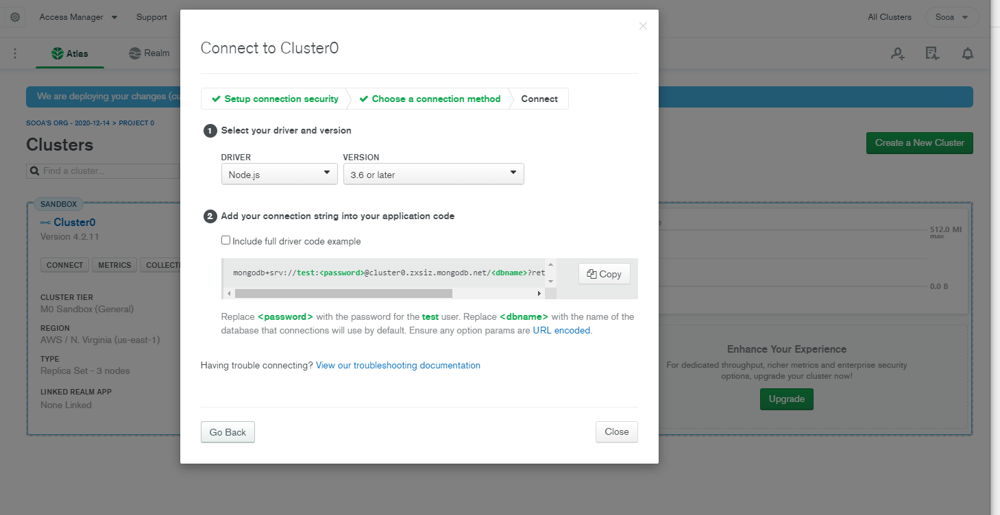

```sh
mongoose.connect('여기다가 붙여넣으세요.', {
  useNewUrlParser: true,
});
```

7. Node.js 서버 재 실행 후 API 동작 여부 확인

### API 문서 보는법 

> Swagger : 프론트앤드 개발자가 api node.js로직을 이해할 수 있게 명시해둠

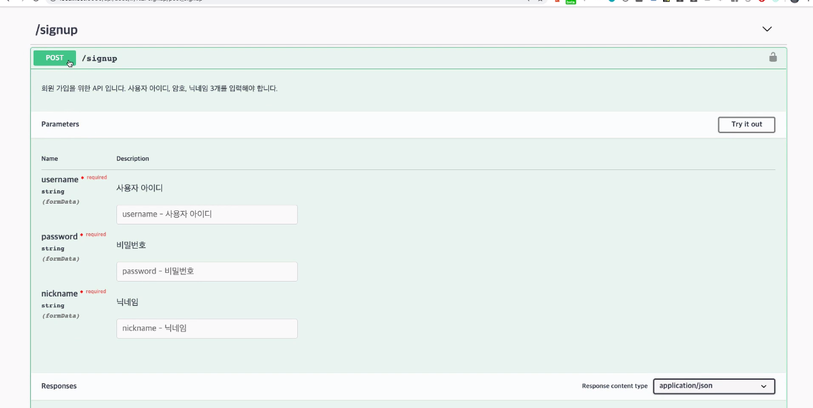

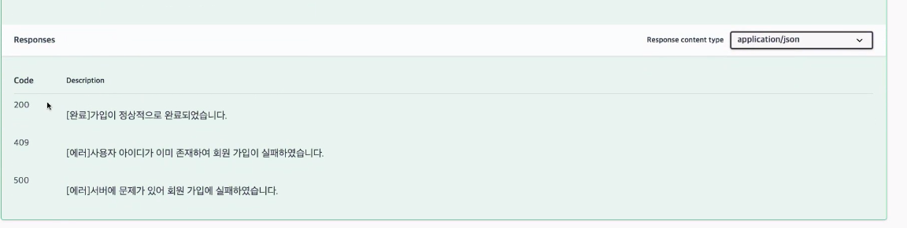

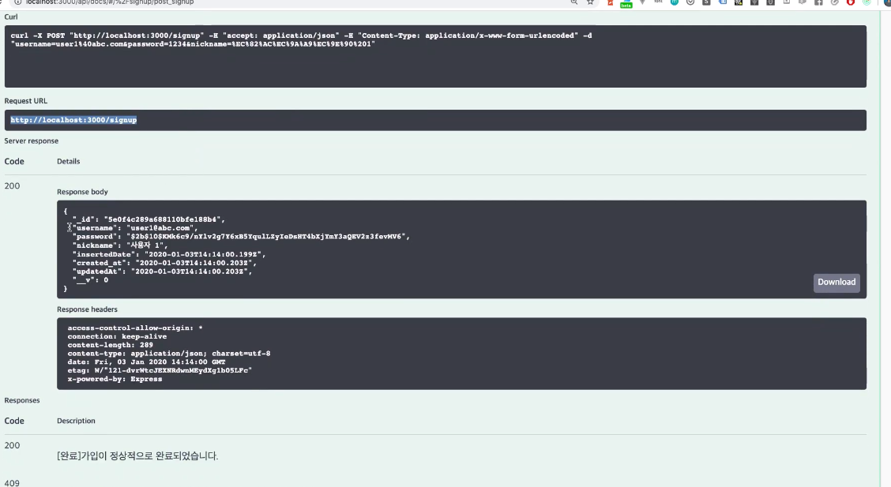


## Vue Cli project

> [Vue CLI 설치 안내 페이지](https://cli.vuejs.org/guide/installation.html)

```sh
//vue 최신버전 설치
npm install -g @vue/cli
vue create vue-til
```

- `Babel, Linter, Unit Testing`선택 -> `ESLint + Prettier`선택 -> `Lint on save`선택 -> `Jest`선택 -> `In dedicated config files`선택 -> `N`

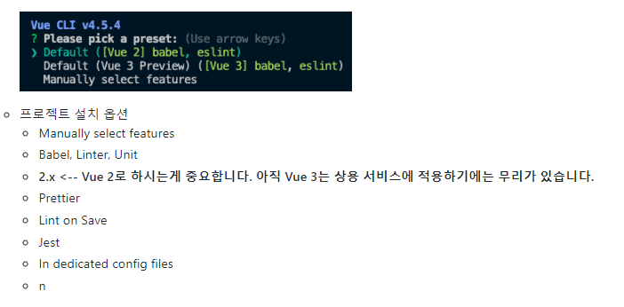

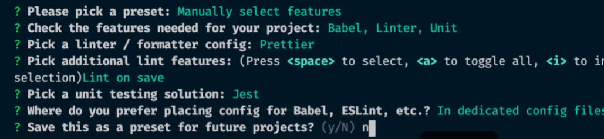

### ESLint

> [Vue.js 개발 생산성을 높여주는 도구 3가지](https://joshua1988.github.io/web-development/vuejs/boost-productivity/)
>
> [ESLint](https://eslint.org/) JavaScript 코드에서 발견 된 문제 패턴을 식별하기위한 정적 코드 분석 도구
>
> 린트(ESLint)는 잘못된 코드 스타일로 인해 에러가 나지 않게 코드 문법을 잡아주는 문법 검사기이다. 문장 뒤에 자동으로 세미콜론, 콤마를 붙여주기도 하고 의미 없는 변수, API 사용에 대해 경고해주는 등 여러 문법 오류에 대해서 미리 알려준다. 가급적 덜 에러가 나는 코드를 작성하면 자연스럽게 버그도 줄어들기 때문에 서비스 품질을 높이는데도 도움이 됨!

#### (참고) ESLint 에러 화면 표시안되게 하는 법

- 프로젝트 폴더 위치에 `vue.config.js`파일을 만든 뒤 아래의 코드를 적는다.

```js
// vue 설정파일을 추가로 만듦 돌아갔을때 화면에서 덮어쓰는 기능을 해지한다는 뜻
module.exports = {
	devServer: {
		overlay: false,
	},
};
```

이렇게 하면 에러는 콘솔에만 찍히고 화면에는 표현되지 않는다!

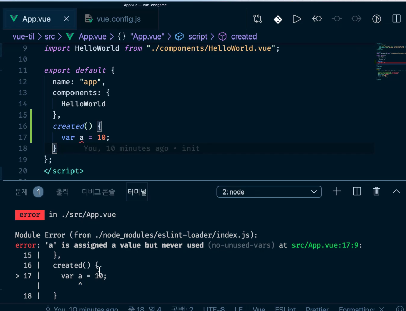

- `.eslintrc.js`

> 관리도구, 설정파일의 내용을 바꿨을 때는 서버를 껐다가 재실행 해야된다!

```js
module.exports = {
  root: true,
  env: {
    node: true
  },
   // node modules에 깔려있는 prettier 모듈을 가져와서 이부분에 들어와있다고 생각하면된다
  extends: ["plugin:vue/essential", "@vue/prettier"],
  rules: {
      //error라고 하면 무조건 콘솔있으면 에러가 남
      //off는 콘솔이 있더라도 에러가 나지 않는다.
    "no-console": "off",
      //개발모드일때 콘솔이 있으면 error를 내보내고, 일반 prototype 모드면 off란 뜻!
    // "no-console": process.env.NODE_ENV === "production" ? "error" : "off",
    // "no-debugger": process.env.NODE_ENV === "production" ? "error" : "off"
  
      //prettier설정에 대한 객체 [eslint의 log level,프리티어의 속성]
  "prettier/prettier": ['error', {
      singleQuote: true,
      semi: true,
      useTabs: false,
      tabWidth: 2,
      trailingComma: 'all',
      printWidth: 80,
      bracketSpacing: true,
      arrowParens: 'avoid',
    }]
  },
  parserOptions: {
    parser: "babel-eslint"
  },
  overrides: [
    {
      files: [
        "**/__tests__/*.{j,t}s?(x)",
        "**/tests/unit/**/*.spec.{j,t}s?(x)"
      ],
      env: {
        jest: true
      }
    }
  ]
};

```

#### Prettier

> https://prettier.io/
>
> 프리티어(Prettier)는 코드 스타일을 정리해주는 도구이다. ESLint와 함께 사용하면 좀 더 개인 취향에 맞는 코드 스타일로 전체 코드를 정리할 수 있다. VSCode(Visual Studio Code), Atom, Sublime 등 대중적인 텍스트 편집기에서 이미 플러그인 형태로 지원하고 있으며 VSCode에서는 아래와 같이 확장 플러그인으로 설치할 수 있다.
>
> `.prettierrc`라는 파일을 만들면, 프리티어에서 정의한 규칙대로 코드가 만들어짐! 처음 vue cli설치를 할 때 prettier를 설정했기 때문
>
> 하지만 이거를 `.eslintrc.js`에 프리티어를 포함시켜야된다!
>
> 왜냐하면 두개가 충돌이 일어날 수 있기 때문!
>
> 프리티어는 코드 작성 뒤 저장을 하면 알아서 문법적으로 자동으로 변환해줌

- VScode에서 `ctrl`+`,` 눌러서 설정으로 들어가 `settings.json`으로 들어가서 아래의 코드 추가함!

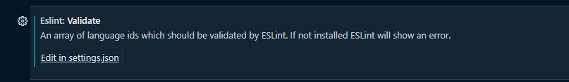

```json
{
    "editor.tabSize": 2,
    "[python]": {
        "editor.insertSpaces": true,
        "editor.tabSize": 4

    },

    "files.associations": {
        "**/*.html": "html",
        "**/templates/**/*.html": "django-html",
        "**/templates/**/*": "django-txt",
        "**/requirements{/**,*}.{txt,in}": "pip-requirements"
    },
    "emmet.includeLanguages": {
        "django-html": "html"
    },
    "terminal.integrated.shell.windows": "C:\\Program Files\\Git\\bin\\bash.exe",
    "atomKeymap.promptV3Features": true,
    "editor.multiCursorModifier": "ctrlCmd",
    "editor.formatOnPaste": true,
    "workbench.iconTheme": "material-icon-theme",
    "workbench.colorTheme": "Night Owl",
    "editor.fontSize": 20,
        
        //아래의 내용 추가
    "eslint.validate": [
        
        {
            "language": "vue",
            "autoFix": true
        },
        {
            "language": "javascript",
            "autoFix": true
        },
    ],

    "editor.codeActionsOnSave": {
        "source.fixAll.eslint": true
    },
    "eslint.workingDirectories": [
        {
            "mode": "auto"
        }
    ],

}
```

- Vs코드 prettier플러그인 설치돼있으면 오른쪽마우스키 눌러서 `작업영역에서 사용안함 클릭`
- `format on save`도 꺼줘야 됨!! 그래야 충돌안나게 `ESLint`사용 할 수 있음

> 위 속성은 코드를 작성하고 저장 버튼을 눌렀을 때 자동으로 코드를 정리해줌
>
> BUT!! 이렇게 플러그인으로 간단하게 코드를 정리할 수도 있지만 개인적으로는 ESLint와 결합하여 프로젝트 설정 파일로 관리하는 것을 추천
>
> ```json
> //settings.json파일에 추가하면 코드 작성시 자동 코드 정리
> {
>   "editor.formatOnSave": true,
>   "editor.formatOnType": true
> }
> ```
>
> 

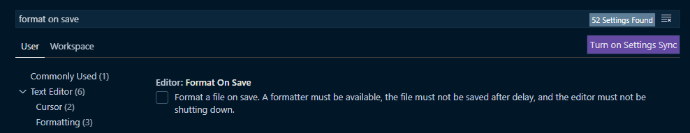


#### ESLint와 Prettier를 뷰 프로젝트에 적용하기

> 위에 프로젝트를 생성할 때 추가할 수 있지만 만약 프로젝트를 이미 생성했다면!! 아래와 같이 구성하면 됨

**1.**노드 패키지 매니저(NPM)로 린트 및 프리티어 라이브러리를 설치.

```bash
npm i eslint eslint-config-prettier eslint-plugin-prettier eslint-plugin-vue --save-dev
BashCopy
```

**2.**프로젝트 루트 레벨에 린트 설정 파일인 `.eslintrc.js`를 추가.

```js
// .eslintrc.js
module.exports = {
  // 현재 eslintrc 파일을 기준으로 ESLint 규칙을 적용
  root: true,
  // 추가적인 규칙들을 적용
  extends: [
    'eslint:recommended',
    'plugin:vue/essential',
    'prettier',
    'plugin:prettier/recommended',
  ],
  // 코드 정리 플러그인 추가
  plugins: ['prettier'],
  // 사용자 편의 규칙 추가
  rules: {
    'prettier/prettier': [
      'error',
      // 아래 규칙들은 개인 선호에 따라 prettier 문법 적용
      // https://prettier.io/docs/en/options.html
      {
        singleQuote: true,
        semi: true,
        useTabs: true,
        tabWidth: 2,
        trailingComma: 'all',
        printWidth: 80,
        bracketSpacing: true,
        arrowParens: 'avoid',
      },
    ],
    'no-console': process.env.NODE_ENV === 'production' ? 'error' : 'off',
  },
};
JsCopy
```

각 주요 속성 특징

- `root`: 현재 폴더 위치를 기준으로 하위의 파일에 린트를 적용한다. 상위 폴더에 린트를 적용하지 않는다.
- `extends`: 린트의 기본적인 문법 검사 규칙 이외에 추가적인 규칙들을 적용한다. 이미 누군가에 의해 정해진 몇 개의 규칙을 추가한다고 보면 된다.
- `plugins`: NPM으로 설치하여 사용할 수 있는 확장 규칙이다. 대중적인 라이브러리와 결합하여 린트를 사용할 수 있다.
- `rules`: 린트를 실행할 때 사용자가 임의로 규칙을 추가하여 검사에서 제외 또는 추가하는 속성이다.

참고로 린트 설정 파일 대신에 `package.json` 파일에 `eslintConfig` 속성을 사용해도 되지만 규칙 적용에 대한 우선순위는 린트 설정 파일이 더 높기 때문에 설정 파일을 따로 만들어서 사용하는 것 추천!

**3.** NPM 설정 파일인 `package.json` 파일에 아래의 NPM 커스텀 명령어를 추가한다.

```json
{
  "lint": "eslint --ext .js,.vue src"
}
JSONCopy
```

콘솔 창에서 위 명령어를 수행하면 src 폴더 밑의 js, vue 파일에 대해서 린트 검사를 수행한다. 앞에서 린트 설정에 프리티어 내용을 추가했기 때문에 린트의 기본 규칙과 함께 `rules`에 설정한 프리티어 규칙도 함께 적용되어 검사된다.

**4.**마지막으로 비주얼 스튜디오 코드의 프리티어 플러그인을 비활성화하고 `settings.json` 파일에 아래의 내용을 추가한다.

```json
{
  ...
  "editor.formatOnSave": false,
  "editor.codeActionsOnSave": {
      "source.fixAll.eslint": true
  },
  "eslint.alwaysShowStatus": true,
  "eslint.workingDirectories": [
      {"mode": "auto"}
  ],
  "eslint.validate": [
      "javascript",
      "typescript"
  ],
}
JSONCopy
```

프리티어 플러그인을 비활성화하지 않으면 VSCode의 Formatter 기능과 린트 검사 기능이 겹치게 되어 코드가 일관되게 정리되지 않는다. 꼭 프리티어 플러그인을 사용하지 않음으로 설정하고 VSCode의 오른쪽 아래에 있는 Formatting을 X로 전환한다.


### VScode에서 제공하는 절대경로 찾기 설정

> [VSCode의 jsconfig.json 파일 설명 글](https://code.visualstudio.com/docs/languages/jsconfig)

- 프로젝트 폴더 위치에 `jsonconfig.json` 파일을 생성

```json
{
  "compilerOptions": {
    // 현재 위치 기준으로 하려고 프로젝트 폴더에 이 파일을 만듦
    "baseUrl": ".",
    // 별칭이 들어감, 
    "paths": {
      "~/*": [
        "./*"
      ],
      // 이 프로젝트를 기준으로 @를 쓰면 src밑에 파일을 바로 확인할 수 있단 말
      "@/*": [
        "./src/*"
      ],
    }
  },
  // conpilerOptions에 해당하지 않을 폴더, 라이브러리폴더 등
  "exclude": [
    "node_modules",
    "dist"
  ]
}
```

- 아래와 같이 절대경로를 표시할 수 있음

```vue
<template>
	<div>header</div>
</template>

<script>
// 상대경로 ..는 한단계 올라간단말, 파일의 레벨이 깊어질수록 거슬러올라가는 것이 많이 붙게되는데 번거로워짐
import Demo from '../../demo/basic/Demo'
// 절대경로로 설정을 해서 찾아가는것이 더 좋다
import Demo from '@/demo/basic/Demo'
// import Demo from '@/demo/basic/Demo'

export default {};
</script>

<style></style>
```


### (참고)Vue.js 스타일 가이드

> [Vue.js 스타일 가이드 문서](https://kr.vuejs.org/v2/style-guide/index.html)


## 3. 뷰 라우터 및 컴포넌트 설계

> [뷰 라우터 오픈 소스](https://github.com/vuejs/vue-router)
>
> [뷰 라우터 History Mode 주의 사항 문서](https://router.vuejs.org/guide/essentials/history-mode.html)
>
> [Window History API](https://developer.mozilla.org/en-US/docs/Web/API/Window/history)
>
> [웹팩 코드 스플리팅 문서](https://webpack.js.org/guides/code-splitting/)
>
> [Vue.js 다이나믹 임포트 문서](https://vuejs.org/v2/guide/components-dynamic-async.html#ad)

- `src`폴더 아래에 `routes`폴더를 만들고, 그 아래에 `index.js`파일을 만든다.

> ### Code Spliting
>
> 화면의 개수가 많아졌을 때, 처음에는 지정한 페이지만 가져오고, 나머지 페이지도 해당 페이지로 이동했을 때만 불러오게 하는 것!
>
> `component: () => import('@/views/LoginPage.vue')`

```js
//index.js
import Vue from 'vue';
import VueRouter from 'vue-router';
// import LoginPage from '@/views/LoginPage.vue';
// import SignupPage from '@/views/SignupPage.vue';

// 플러그인을 초기화하기위한 코드라고 생각하면됨
Vue.use(VueRouter);

// 뷰 라우터 인스턴스를 만드는데, 그걸 export default로 꺼내게 되면 라우터 인스턴스가 현재 파일에서 나가게됨
export default new VueRouter({
	// url에 #이 제거됨,저 #을 떼면 서버입장에서 새로운 서버라고 생각을 함, 
	// 서버의 유형에따라 서버가 #이 없어도 놀라지 않게(?) 뷰 라우터 히스토리모드 주의사항 문서를 보고 적용을 해줘야됨
	mode: 'history',
	//라우트의 페이지 정보들을 적음!
	routes: [
		{
			// 뷰 라우터 오픈소스, 로컬host에 진입할때마다 바로 login페이지로감
			path: '/',
			redirect: '/login',
		},
		{
			path: '/login',
			//views 폴더를 새로 만들어서 그아래에 라우터 페이지 컴포넌트들을 생성
			// 이렇게 화살표함수를 써서 import를 하면 이게 code spliting이 된다, 그 곳으로 이동할때만 import를 해옴!
			component: () => import('@/views/LoginPage.vue'),
		},
		{
			path: '/signup',
			component: () => import('@/views/SignupPage.vue'),
		},
		// 라우터 콜백기능, 없는페이지를 접근할때의 라우터 처리
		{
			path: '*',
			// views폴더밑에 없는페이지로 가면 해당 페이지로 감!!
			component: () => import('@/views/NotFoundPage.vue'),
		},
	],
});


//main.js
import Vue from 'vue';
import App from './App.vue';
// export한 라우터를 가져와서 웹팩의 별칭옵션으로 절대경로 표시 .js붙이지 않더라도 자동으로 인식함
import router from '@/routes/index';

Vue.config.productionTip = false;

new Vue({
	render: h => h(App),
	//router등록(연결)
	router,
}).$mount('#app');
```

- App.vue

```vue
<template>
  <div>
    <header>
      <!-- to에 지정된 문자열로  url을 이동시켜줌 -->
      <router-link to="/login">로그인</router-link> |
      <router-link to="/signup">회원가입</router-link>
    </header>
    <!-- url이 변경됐을 때 해당 라우터 컴포넌트가 여기에 표시됨 -->
    <router-view></router-view>
  </div>
</template>

<script>
export default {};
</script>

<style></style>

```


## 4. 회원 가입 페이지 개발

- App.vue의 header ->`components` > `common` > `AppHeader.vue`

```vue
<template>
  <header>
    <router-link to="/login">로그인</router-link> |
    <router-link to="/signup">회원가입</router-link>
  </header>
</template>

<script>
export default {};
</script>

<style></style>
```

- `SignupPage.vue`

```vue
<template>
  <div>
    <h1>회원 가입 페이지</h1>
    <!-- 페이지는 가급적 각 기능별로 컴포넌트를 나눠 그 컴포넌트를 등록하는게 좋다 -->
    <SignupForm></SignupForm>
  </div>
</template>

<script>
import SignupForm from '@/components/SignupForm.vue';

export default {
  components: {
    SignupForm,
  },
};
</script>

<style></style>
```


### Signup API

- signup api문서를 통해 어떤 정보를 보내야되는지 알 수 있다

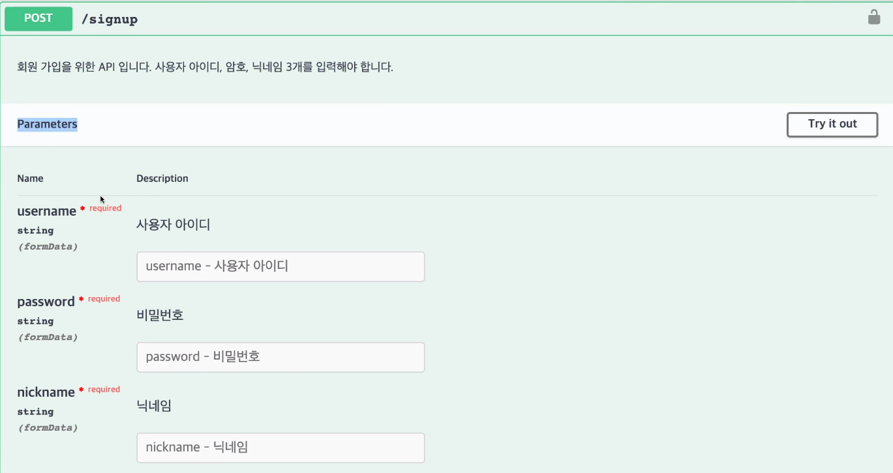

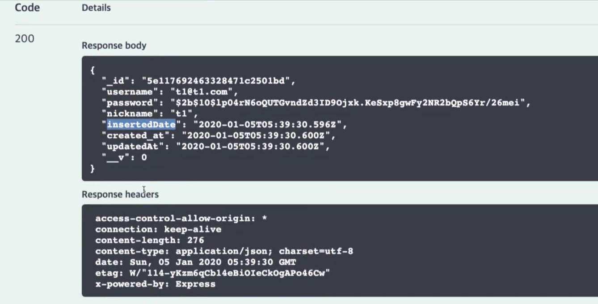

- axios설치

```sh
$ npm i axios
```

#### 비동기처리

> - [async await 정리글](https://joshua1988.github.io/web-development/javascript/js-async-await/)
> - [ES6 템플릿 리터럴(백틱) 정리글](https://joshua1988.github.io/es6-online-book/template-literal.html)
> - [ES6 Destructuring 정리글](https://joshua1988.github.io/es6-online-book/destructuring.html)

- `components` > `SignupForm.vue`

```vue
<template>
<!--.prevent를 하면 form의 기본 동작인 새로고침을 막을 수 있음 -->
  <form @submit.prevent="submitForm">
    <div>
      <label for="username">id: </label>
      <input id="username" type="text" v-model="username" />
    </div>
    <div>
      <label for="password">pw: </label>
      <input id="password" type="text" v-model="password" />
    </div>
    <div>
      <label for="nickname">nickname: </label>
      <input id="nickname" type="text" v-model="nickname" />
    </div>
    <button type="submit">회원 가입</button>
    <p>{{ logMessage }}</p>
  </form>
</template>

<script>
// 회원가입 api함수를 가져옴
import { registerUser } from '@/api/index';

export default {
  // vda입력후 tab하면 data속성 만들어짐
  data() {
    return {
      // form values
      // 이 data를 서버로 보내야됨, api문서의 parameter이름과 같게 적용해줘야된다!!
      username: '',
      password: '',
      nickname: '',
      // log
      logMessage: '',
    };
  },
  methods: {
    // form태그에 연결이되는 이벤트-> 폼태그에 버튼의 submit이벤트가 버블링에 의해 form태그로 올라옴 그래서 @submit으로 이벤트 인지할 수 있음!
    async submitForm() {
      const userData = {
        username: this.username,
        password: this.password,
        nickname: this.nickname,
      };
      // url은 이미 index.js에 적혀있으니 userData만 보내주면됨!
      // promise의 결과를 {data}로 받을 수 있게 await로 받음 
      // response.data = {data}
      const { data } = await registerUser(userData);
      // inpuutdata가 잘넘어갔는지 확인을 해야됨 -> api가 예상대로 동작을 안했을 때 -> network패널을보고 파라미터가 잘넘어갔는지 확인하고, response에 어떻게 떴는지까지 다 확인해봐라!!
      console.log(data.username);
      this.logMessage = `${data.username} 님이 가입되었습니다`;
      this.initForm();
    },
    // form데이터를 비우는 함수
    initForm() {
      // ''이게아니라 null로 작성해도됨, type이 정해져있기 때문! 그래도 bug를 줄이기 위해선 각 type을 지정해주는게 좋음
      this.username = '';
      this.password = '';
      this.nickname = '';
    },
  },
};
</script>

<style></style>
```


## 5. 실무 환경 구성

#### API 구조화

> [axios create() 문서](https://github.com/axios/axios#axioscreateconfig)
>
> 한 컴포넌트에 계속 `import axios from 'axios'`를 쓰는 것이 아니라, src폴더 아래에 api폴더를 만들고, axios에 대한 공통부분을 구조화하고, 가져와 편하게 쓸 수 있다.

- `src` > `api` > `index.js`

> [타입스크립트 핸드북](https://joshua1988.github.io/ts/)
>
> 타입스크립트는 자바스크립트에 타입을 부여한 언어다. 자바스크립트의 확장된 언어라고 볼 수 있다. 타입스크립트는 자바스크립트와 달리 브라우저에서 실행하려면 파일을 한번 변환해주어야 한다. 이 변환 과정을 우리는 **컴파일(complile)** 이라고 부른다
>
> 왜 써야되는가??
>
> - [에러의 사전 방지](https://joshua1988.github.io/ts/why-ts.html#에러의-사전-방지)
> - [코드 가이드 및 자동 완성(개발 생산성 향상)](https://joshua1988.github.io/ts/why-ts.html#코드-자동-완성과-가이드)
>
> - 예) 인자로 뭐가 들어가야되는지 알려줌
>
> 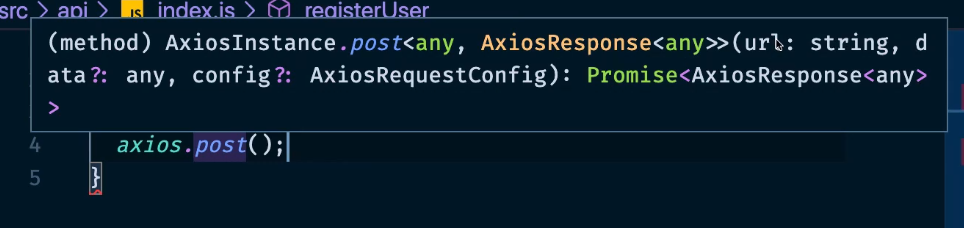

```js
import axios from 'axios';

// axios create api이용 공통설정을 여기에 넣음, instance에 넣어서 라이브러리 재사용가능 
const instance = axios.create({
  // url을 공통화, 환경변수에 저장 `VUE_APP`을 쓰면 자동으로 로드돼서 쓸 수 있음!
  baseURL: process.env.VUE_APP_API_URL,
});

// post로 회원가입을 요청을 날릴 수 있는 함수를 만듦
function registerUser(userData) {
  // signupform에서 export된 이 함수를 호출, 함수 결과가 promise이기 떄문에 return으로 해줘야 이후에 비동기동작을 수행할 수 있다
  // instance.post는 axios.post(url,data)를 다 적지않고 코드를 줄일 수 있음
  return instance.post('signup', userData);
}

export { registerUser };
```

##### 환경변수 만들기 프로젝트 폴더 위에 `.env`파일을 만듦

> `VUE_APP`접두사가 붙은 변수는 자동로드!
>
> [웹팩 DefinePlugin 문서](https://webpack.js.org/plugins/define-plugin/)
>
> - env파일 규칙
>
> [Vue CLI env 파일 규칙 문서](https://cli.vuejs.org/guide/mode-and-env.html#modes-and-environment-variables)

- `.env`

> 혹시나 development, production이 없을 때 공통으로 들어가는 url, develope나 production이 없을 때 우선순위를 가짐

```sh
VUE_APP_API_URL=https://vue-til.com/
```

- `.env.development`

> 개발용 환경변수, prototype때는 이 url씀
>
> 가장 높은 우선순위를 가짐

```sh
VUE_APP_API_URL=http://localhost:3000/
```

- `.env.production`

> 좀더 정확하게하려면 `npm run build`를 했을 때 porduction으로 들어감
>
> 배포에 해당하는 도메인 주소

```sh
VUE_APP_API_URL=https://vue-til.com/
```


## 6. 로그인 페이지 개발

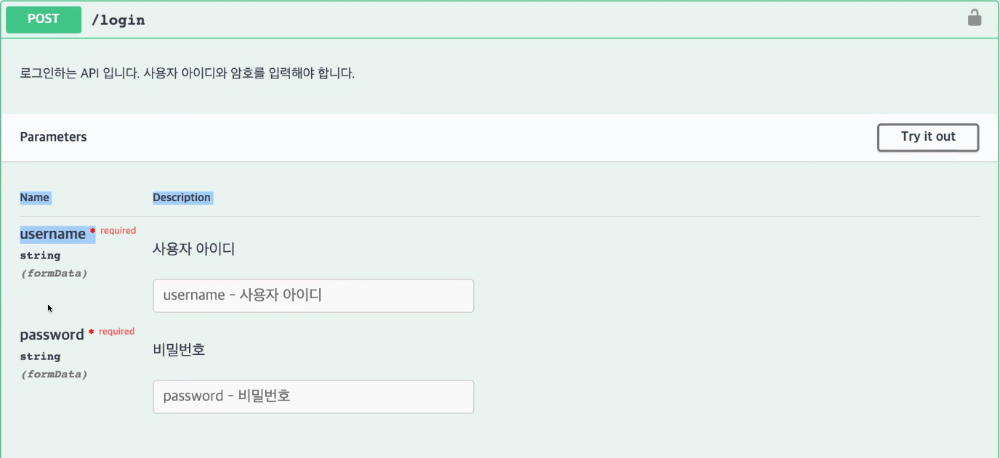

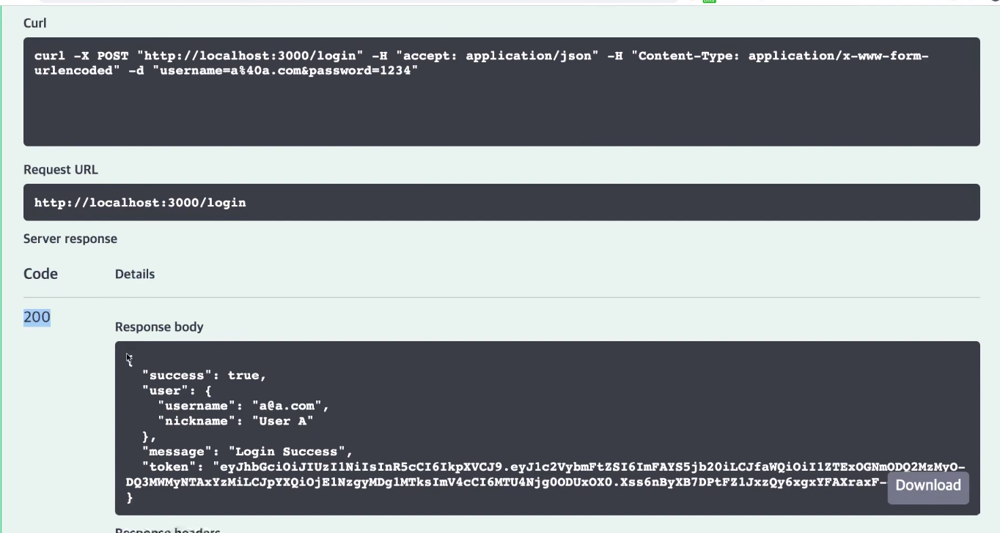

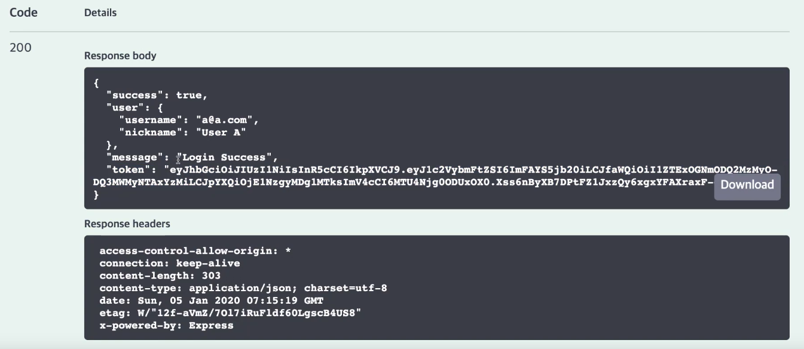

- index.js

```js
import axios from 'axios';

const instance = axios.create({
  baseURL: process.env.VUE_APP_API_URL,
});

function registerUser(userData) {
  return instance.post('signup', userData);
}

function loginUser(userData) {
  return instance.post('login', userData);
}

// 다른 컴포넌트에서 사용할 수 있게 내보냄
export { registerUser, loginUser };
```


### login 에러처리

> 실제로는 에러처리를 잘하는게 중요함
>
> 에러가 떴을 떄 네트워크 패널로 들어가서 어떤점이 문제인지 확인할 줄 알아야한다.
>
> 에러가 났을 때는 사용자가 알수있게 화면에 표시를 해줘야된다!

- `components` > `LoginForm.vue`

```vue
<template>
  <form @submit.prevent="submitForm">
    <div>
      <label for="username">id:</label>
      <input id="username" type="text" v-model="username" />
    </div>
    <div>
      <label for="password">pw:</label>
      <input id="password" type="text" v-model="password" />
    </div>
    <!-- disabled가 isUsernameValid가 true가 아닐때 효과가 나타나고, valid해야 선택가능함 -->
    <!-- ||는 or 둘중 하나라도 없다면 로그인 버튼 누를 수 없음 -->
    <button :disabled="!isUsernameValid || !password" type="submit">
      로그인
    </button>
    <p>{{ logMessage }}</p>
  </form>
</template>

<script>
import { loginUser } from '@/api/index';
// email이 맞는지 확인하는 코드 가져옴
import { validateEmail } from '@/utils/validation';

export default {
  data() {
    return {
      // form values
      username: '',
      password: '',
      // log
      logMessage: '',
    };
  },
  // data의 변화에 따라서 자동으로 계산해줌
  computed: {
    // Username이 유효한지 확인, 유효하면 True, 유효하지 않으면 false
    isUsernameValid() {
      // username이 valid한지 validateEmail이 확인해줌, username에 한글자한글자 변화가나타날때마다 computed의 isUsernameValid가 실행됨
      return validateEmail(this.username);
    },
  },
  methods: {
    // 에러를 잘 처리해야됨!! -> 에러가 나면 화면에 표시를 해줘야된다
    async submitForm() {
      // try-비즈니스로직, catch-에러 핸들링할 코드
      try {
        // 비즈니스 로직
        const userData = {
          username: this.username,
          password: this.password,
        };
        // 타입스크립트를 이용해 userData인자의 타입도 지정해 줄 수 있음
        const { data } = await loginUser(userData);
        console.log(data.user.username);
        this.logMessage = `${data.user.username} 님 환영합니다`;
        // this.initForm();
        // 에러가 error객체에 담겨서 catch로 넘어옴
      } catch (error) {
        // 에러 핸들링할 코드
        // error.response.data를 하면 어떤것이 문제있는지 잘못된 곳에 접근함(백엔드에서 에러를 넘겨줌)
        console.log(error.response.data);
        // error메세지를 담아줌
        this.logMessage = error.response.data;
        // this.initForm();
        // 폼초기화를 끝나면 다 일어나게 finally에 넣어줌
      } finally {
        this.initForm();
      }
    },
    initForm() {
      this.username = '';
      this.password = '';
    },
  },
};
</script>

<style></style>

```

#### (참고) id가 email인지 아닌지 확인하는법 email validation

> [Email Validation 정규 표현식 코드](https://stackoverflow.com/questions/46155/how-to-validate-an-email-address-in-javascript)

- id가 email인지 아닌지 확인하기 위해서는 signup에서부터 확인을 해야됨!!
- `src` 폴더 아래에 `utils`폴더를 만들어 `validation.js` 파일을 만듦

```js
function validateEmail(email) {
  var re = /^(([^<>()\[\]\\.,;:\s@"]+(\.[^<>()\[\]\\.,;:\s@"]+)*)|(".+"))@((\[[0-9]{1,3}\.[0-9]{1,3}\.[0-9]{1,3}\.[0-9]{1,3}\])|(([a-zA-Z\-0-9]+\.)+[a-zA-Z]{2,}))$/;
  return re.test(String(email).toLowerCase());
}

export { validateEmail };
```

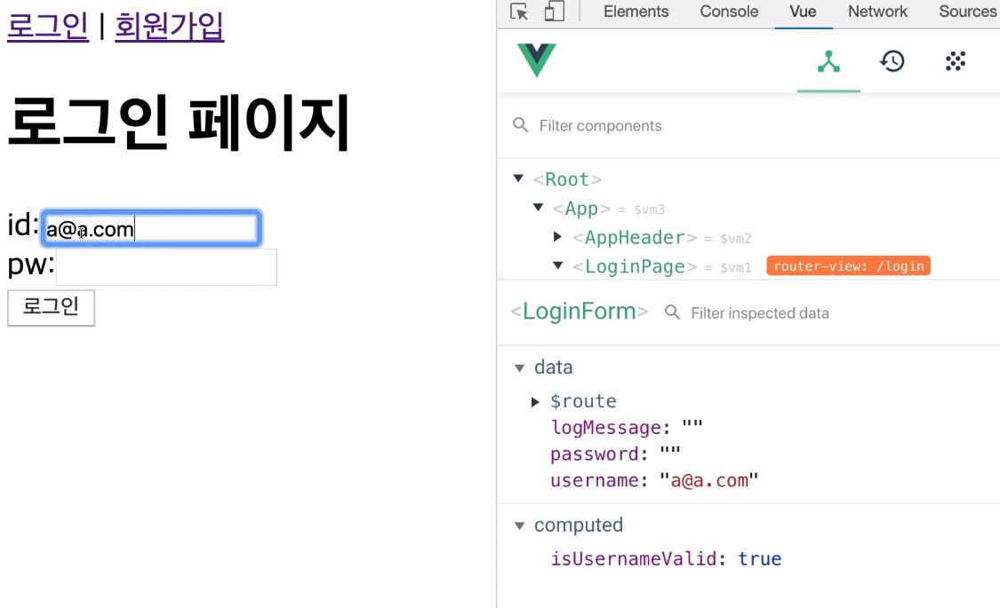

### (참고) styling

- `App.vue`에 `style`태그 아래에 css파일 import

```vue
<template>
  <div class="app">
    <AppHeader></AppHeader>
    <div class="app-contents">
      <router-view></router-view>
    </div>
  </div>
</template>

<script>
import AppHeader from '@/components/common/AppHeader.vue';

export default {
  components: {
    AppHeader,
  },
};
</script>

<style>
@import './css/reset.css';
@import './css/common.css';
</style>
```

- `src`>`css`>`common.css` , `reset.css`

```css
body {
  background: #F7F6F9;
}
.app {
	position: relative;
	width: 100%;
	height: 100%;
  font-size: 1.4rem;
}
.app-contents {
  height: calc(100% - 64px - 102px);
}
h1 {
	text-align: center;
	font-weight: 100;
}

/*--- LINK ---*/
a {
  color: #364f6b;
  text-decoration: none;
}
a:hover {
  color: #3fc1c9;
}

/*--- LAYOUT ---*/
.contents {
  max-width: 1020px;
  margin: 0 auto;
  padding: 0 5px;
  width: 100%;  
}
/*--- HEADER ---*/
.page-header {
  font-size: 45px;
	font-weight: 600;
	color: #456155;
	padding: 30px 5px 15px;
}

/*--- FORM ---*/
.form-container {
  display: flex;
  align-items: center;
}
.form-wrapper {
  background: white;
  -webkit-box-shadow: 0 20px 20px rgba(0, 0, 0, 0.08);
  box-shadow: 0 20px 20px rgba(0, 0, 0, 0.08);
  border-radius: 3px;
  padding: 15px 15px;
}
.form-wrapper.form-wrapper-sm {
  max-width: 500px;
  margin: 40px auto;
}
.form-wrapper-sm .page-header {
  padding: 0px 0 20px;
}
.form {
	width: 460px;
	height: 100%;
}
.form .validation-text {
	margin-top: -0.5rem;
	margin-bottom: 0.5rem;
	font-size: 1rem;
	display: flex;
	flex-direction: row-reverse;
	justify-content: space-between;
}
.form label {
  width: 100%;
  display: block;
  margin-bottom: 0.5rem;
  color: #364f6b;
  font-size: 90%;
}
.form input,
.form textarea {
  font-family: inherit;
  font-size: 100%;
  width: 100%;
  border: 1px solid #dae1e7;
  box-shadow: 0 2px 4px 0 rgba(0,0,0,.1);
  padding: 0.5rem 0.75rem;
  margin-bottom: 1rem;
}
.form input.valid {
  border: 1px solid #21b314;
}
.form input.invalid {
  border: 1px solid red;
}
.form div:nth-last-child(2) {
  margin-bottom: 0.5rem;
}
.btn {
  background: #FE9616;
  padding: 0.5rem 1.5rem;
  font-weight: 700;
  border-radius: .25rem;
  border: 0 solid #dae1e7;
}
.btn.disabled {
  opacity: 0.5;
  cursor: not-allowed;
}
.log {
  color: #ff4057;
  font-size: 1rem;
  text-align: center;
}
.warning {
  color: #ff4057;
}

/*--- LIST ---*/
.list-container {
	padding-top: 13px;
}
.list-container.sticky {
	margin-top: 76px;
}
.list-container > ul {
	display: flex;
	flex-wrap: wrap;
}
.list-container > ul > li {
	position: relative;
	flex-grow: 1;
	width: 320px;
	height: 250px;
	margin: 7px;
	padding: 10px 20px;
	background: white;
	box-shadow: 0 20px 20px rgba(0, 0, 0, 0.08);
	border-radius: 3px;
}
.post-title {
	font-size: 24px;
	font-weight: 600;
	margin-bottom: 0.5rem;
}
.post-contents {
	height: 160px;
	overflow-y: auto;
	font-size: 18px;
}
.post-time {
	position: absolute;
	bottom: 4px;
	right: 5px;
	font-size: 14px;
	color: #9e9e9e;
}
.icon {
	font-size: 1.3rem;
	cursor: pointer;
	color: #364f6b;
	padding-right: 0.4rem;
}
.icon:hover {
	color: #3fc1c9;
}
.icon:active {
	color: #fc5185;
}
.ion-md-create {
	padding-left: 0.1rem;
}
```

```css
html,
body {
	height: 100%;
	margin: 0;
	padding: 0;
	border: 0;
	font-size: 100%;
	font: inherit;
	vertical-align: baseline;
	font-family: 'Spoqa Han Sans', 'Sans-serif';
}

h1,
p,
ul {
	margin: 0;
	padding: 0;
}

input,
select,
textarea {
	border: 0;
	padding: 0;
	margin: 0;
	background: transparent;
	resize: none;
}

li {
	list-style: none;
}

button {
	font-family: inherit;
	font-size: 90%;
	margin: 0;
	cursor: pointer;
}

*,
*:after,
*:before {
	box-sizing: border-box;
	font-family: 'Spoqa Han Sans', 'Sans-serif';
}
```


### 컴포넌트간 데이터 전달 방법 3가지

> [뷰 라우터 Programmatic Navigation 문서](https://router.vuejs.org/guide/essentials/navigation.html#programmatic-navigation)
>
> 1.  event올리고 porps로 data내림
> 2. event bus를 보냄
> 3. Vuex의 store이용

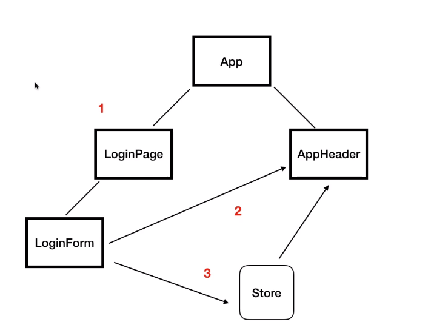

##  7. 로그인 상태 관리

#### 3. Vuex이용

> `package.json`에 dependencies에 들어감
>
> - dependencies : 애플리케이션 로직과 관련된 라이브러리 목록
> - devDependencies에 포함된 라이브러리는 `npm run build` 했을 떄 포함되지 않음(배포할 때 포함되지 않음) 
>
> [개발용 라이브러리와 배포용 라이브러리 구분하기 문서](https://joshua1988.github.io/webpack-guide/build/npm-module-install.html#개발용-라이브러리와-배포용-라이브러리-구분하기)

```sh
$ npm i vuex
```

- `src` > `store` > `index.js`

```js
import Vue from 'vue';
import Vuex from 'vuex';

Vue.use(Vuex);

export default new Vuex.Store({
  state: {
    username: '',
  },
  // state값이 변경됐을 때 특정 상태를 보여줌 -> computed라고 생각하면됨(return값이 있어야됨)
  getters: {
    isLogin(state) {
      // username의 값이 빈문자열이 아닐때 로그인이 됐다! -> true로 나옴
      return state.username !== '';
    },
  },
  // state를 바꿈
  mutations: {
    // username(setUsername을 호출할때 보내줄 인자)을 받아서 그 값을 state의 username에 담아줌
    setUsername(state, username) {
      state.username = username;
    },
    // logout기능, username을 비워줌, store의 기준은 username이 채워져있냐 없냐의 여부로 로그인을 알게해놨음(getters isLogin)
    clearUsername(state) {
      state.username = '';
    },
  },
});

```

- `main.js`

```js
import Vue from 'vue';
import App from './App.vue';
import router from '@/routes/index';
// vuex의 store를 쓰기 위해 가져옴
import store from '@/store/index';

Vue.config.productionTip = false;

new Vue({
  render: h => h(App),
  router,
  // store 연결
  store,
}).$mount('#app');
```

- AppHeader.vue

```vue
<template>
  <header>
    <div>
      <!-- logo를 누르면 기본/로 가서 login페이지로 감 -->
      <router-link to="/" class="logo">
        TIL
        <!-- username을 store에서 가져옴 -->
        <span v-if="isUserLogin">by {{ $store.state.username }}</span>
      </router-link>
    </div>
    <div class="navigations">
      <!-- 1 분기처리함 -->
      <!-- login이 됐을 때(true일때) 보임 -->
      <template v-if="isUserLogin">
        <!-- 클릭을 했을 때 로그아웃이 되게 만듦 -->
        <a href="javascript:;" @click="logoutUser" class="logout-button">
          Logout
        </a>
      </template>
      <!-- 2 -->
      <!-- 그렇지 않으면 이게 보임 -->
      <template v-else>
        <router-link to="/login">로그인</router-link>
        <router-link to="/signup">회원가입</router-link>
      </template>
    </div>
  </header>
</template>

<script>
export default {
  computed: {
    isUserLogin() {
      // store가 인스턴스에 연결돼있어서 this로 접근 가능, getters에 islogin을 가져옴
      return this.$store.getters.isLogin;
    },
  },
  methods: {
    // 로그아웃 메서드, clearUsername이란 mutation을 호출, login페이지로 넘어감
    logoutUser() {
      this.$store.commit('clearUsername');
      this.$router.push('/login');
    },
  },
};
</script>

<style scoped>
.username {
  color: white;
}
header {
  display: flex;
  justify-content: space-between;
  align-items: center;
  padding: 10px 20px;
  background-color: #927dfc;
  z-index: 2;
  box-shadow: 0px 3px 10px rgba(0, 0, 0, 0.05);
}
a {
  color: #dedede;
  font-size: 18px;
}
a.logo {
  font-size: 30px;
  font-weight: 900;
  color: white;
}
.logo > span {
  font-size: 14px;
  font-weight: normal;
}
.navigations a {
  margin-left: 10px;
}
.fixed {
  position: fixed;
  top: 0;
  width: 100%;
}
.logout-button {
  font-size: 14px;
}
a.router-link-exact-active {
  color: white;
  font-weight: bold;
}
</style>
```

- `MainPage.vue`

```vue
<template>
  <div>
    <div class="main list-container contents">
      <h1 class="page-header">Today I Learned</h1>
    </div>
  </div>
</template>

<script>
export default {};
</script>

<style></style>
```

- router등록 `index.js`

```js
 //routes에 코드추가
	{
      // code spliting을 이용해서 import
      path: '/main',
      component: () => import('@/views/MainPage.vue'),
    },
```

- `LoginForm.vue`수정

```vue
<template>
  <div class="contents">
    <div class="form-wrapper form-wrapper-sm">
      <form @submit.prevent="submitForm" class="form">
        <div>
          <label for="username">id:</label>
          <input id="username" type="text" v-model="username" />
          <p class="validation-text">
            <span class="warning" v-if="!isUsernameValid && username">
              Please enter an email address
            </span>
          </p>
        </div>
        <div>
          <label for="password">pw:</label>
          <input id="password" type="text" v-model="password" />
        </div>
        <button
          :disabled="!isUsernameValid || !password"
          type="submit"
          class="btn"
        >
          로그인
        </button>
      </form>
      <p class="log">{{ logMessage }}</p>
    </div>
  </div>
</template>

<script>
import { loginUser } from '@/api/index';
import { validateEmail } from '@/utils/validation';

export default {
  data() {
    return {
      // form values
      username: '',
      password: '',
      // log
      logMessage: '',
    };
  },
  computed: {
    isUsernameValid() {
      return validateEmail(this.username);
    },
  },
  methods: {
    async submitForm() {
      try {
        // 비즈니스 로직
        const userData = {
          username: this.username,
          password: this.password,
        };
        const { data } = await loginUser(userData);
        console.log(data.user.username);
        // commit, store의 mutations의 setUsername을 호출, 응답한 data의 username을 인자로 보내줌
        this.$store.commit('setUsername', data.user.username);
        // url로 이동시켜줌 '/main' 그 페이지로 이동함!
        this.$router.push('/main');
        // this.logMessage = `${data.user.username} 님 환영합니다`;
        // this.initForm();
      } catch (error) {
        // 에러 핸들링할 코드
        console.log(error.response.data);
        this.logMessage = error.response.data;
        // this.initForm();
      } finally {
        this.initForm();
      }
    },
    initForm() {
      this.username = '';
      this.password = '';
    },
  },
};
</script>

<style>
.btn {
  color: white;
}
</style>

```


## 8. API 인증 처리를 위한 토큰 관리

### 학습노트 조회 GET(`/posts`)

> [Json web 토큰 문서](https://jwt.io/)
>
> 401에러는 로그인토큰이 없어서 에러가 뜸!
>
> 로그인했을때 나오는 토큰이 필요하다!
>
> JWT 토큰 값을 복사해서 사용해야됨!

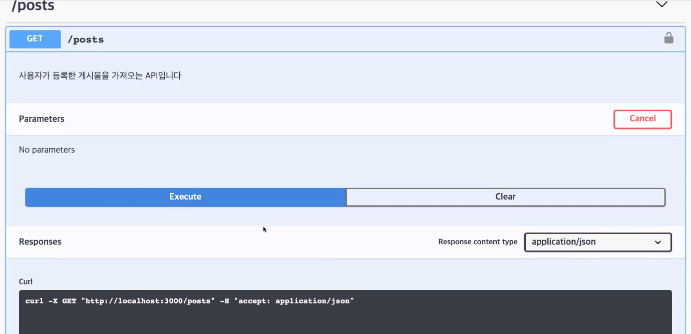

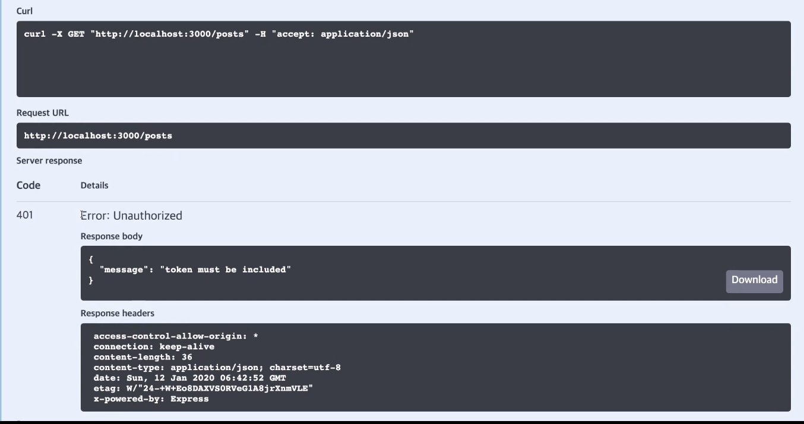

- 토큰이 없어서 Unauthorized에러가 뜬다 로그인시 발급되는 토큰을 아래 value에 넣어줌!

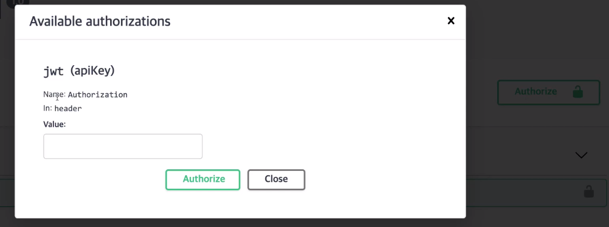

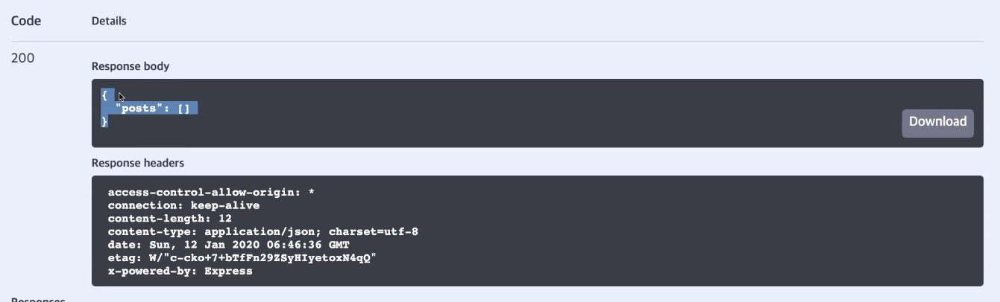


#### HTTP헤더에 토큰값을 실는 법

```js
import store from '@/store/index';
// instance로 axios를 요청할때마다 아래의 속성들이 정의된 상태로 수행을함
const instance = axios.create({
  baseURL: process.env.VUE_APP_API_URL,
//토큰은 headers에 Authorization에 실어주면됨! -> 토큰으로 api권한 인증 방법
  headers: {
    Authorization:'store.state.token,
  }, 
})

```


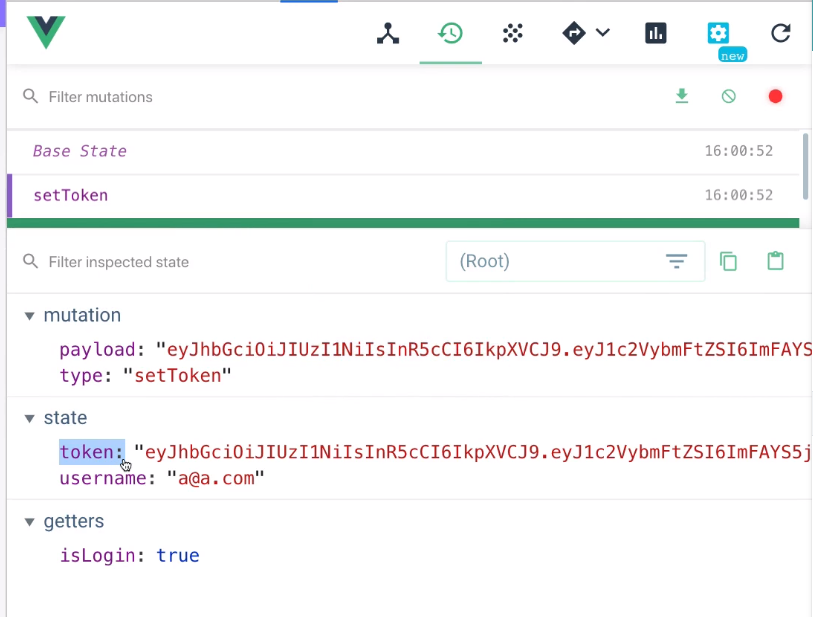

- 이렇게 저장된 토큰을 넘겨줘도 네트워크 패널에서 보면 `Authrization :`에 빈값이 들어있다!!

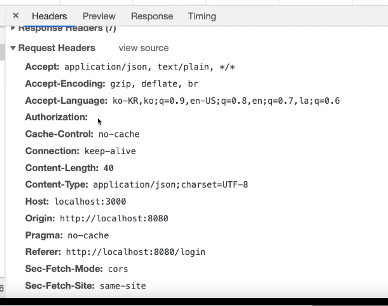

- WHY??? 저장된 토큰값이 아니라 초기 토큰값이 넘어간 것!

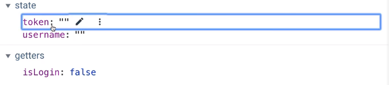

**이유!!**

- 로그인 폼에서 axios를 호출했을 때는 이미 토큰값을 저장하기 전에 `index.js`파일을 js내에서 호출하자마자 이미 instance변수에는 header값에는 store.state.token(초기값)이 들어가있음
- vue는 값이 바뀌면 갱신해주지만 javascript는 갱신해주지 않음!
- axios의 `interceptors` api를 사용

> [액시오스 인터셉터 문서](https://github.com/axios/axios#interceptors)
>
> : 서버로 요청을 보내는 것이나 서버에서 응답을 받을 때 화면단에(어떤 컴포넌트 단에서) 처리하기 전에 추가 로직을 넣을 수 있는 것
>
> ```js
> // Add a request interceptor
> axios.interceptors.request.use(function (config) {
>     // Do something before request is sent
>     //요청을 보내기전에 특정 코드를 넣을 수 있음
>     return config;
>   }, function (error) {
>     // Do something with request error
>     //그 요청이 실패했을 때 error를 화면에 보이기 전에 처리할 수 있음
>     return Promise.reject(error);
>   });
> 
> // Add a response interceptor
> axios.interceptors.response.use(function (response) {
>     // Any status code that lie within the range of 2xx cause this function to trigger
>     //응답을 받기전에 처리를 할 수 있고
>     // Do something with response data
>     return response;
>   }, function (error) {
>     // Any status codes that falls outside the range of 2xx cause this function to trigger
>     //에러가 났을 경우 전처리를 할 수 있다
>     // Do something with response error
>     return Promise.reject(error);
>   });
> ```

```js
//api>index.js
import axios from 'axios';
import store from '@/store/index';


//이러면 헤더에 토큰이 저장되지 않음!!
// instance로 axios를 요청할때마다 아래의 속성들이 정의된 상태로 수행을함
 const instance = axios.create({
   baseURL: process.env.VUE_APP_API_URL,
// 토큰은 headers에 Authorization에 실어주면됨! -> 토큰으로 api권한 인증 방법
   headers: {
     Authorization:'store.state.token,
   }, 
 })

// 회원가입 API
function registerUser(userData) {
  return instance.post('signup', userData);
}

// 로그인 API
function loginUser(userData) {
  return instance.post('login', userData);
}

// 학습 노트 데이터를 조회하는 API
function fetchPosts() {
  return instance.get('posts');
}

export { registerUser, loginUser, fetchPosts };
```

- inceptors.request.use에서 request를 보내기 전의 설정에 config를 console로 찍어보면 아래의 값이 나오고 headers에 Authorization의 키와 토큰값을 추가해주면 되는 것을 알수있다.

> ```js
> export function setInterceptors(instance) {
>   // Add a request interceptor
>   // axios.interceptors.request().use();
>   // instance를 사용했기때문에 위코드와 아래코드는 같은 것!
>   instance.interceptors.request.use(
>     function(config) {
>       // request에 요청을 보내기 직전의 설정을 해줌
>       // console.log(config);
>       // axios의 config에 headers가 존재함, headers에 Authorization이라는 속성이 있음
>       config.headers.Authorization = store.state.token;
>       return config;
>     },
>     function(error) {
>       // Do something with request error
>       return Promise.reject(error);
>     },
>   );
> ```


Authorization에 토큰 값이 잘 들어간 것을 알수 있다

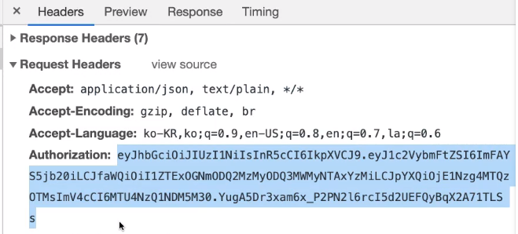

- LoginForm.vue

```vue
<template>
  <div class="contents">
    <div class="form-wrapper form-wrapper-sm">
      <form @submit.prevent="submitForm" class="form">
        <div>
          <label for="username">id:</label>
          <input id="username" type="text" v-model="username" />
          <p class="validation-text">
            <span class="warning" v-if="!isUsernameValid && username">
              Please enter an email address
            </span>
          </p>
        </div>
        <div>
          <label for="password">pw:</label>
          <input id="password" type="text" v-model="password" />
        </div>
        <button
          :disabled="!isUsernameValid || !password"
          type="submit"
          class="btn"
        >
          로그인
        </button>
      </form>
      <p class="log">{{ logMessage }}</p>
    </div>
  </div>
</template>

<script>
import { loginUser } from '@/api/index';
import { validateEmail } from '@/utils/validation';

export default {
  data() {
    return {
      // form values
      username: '',
      password: '',
      // log
      logMessage: '',
    };
  },
  computed: {
    isUsernameValid() {
      return validateEmail(this.username);
    },
  },
  methods: {
    async submitForm() {
      try {
        // 비즈니스 로직
        const userData = {
          username: this.username,
          password: this.password,
        };
        const { data } = await loginUser(userData);
        // login하면 나오는 토큰값! 이것을 어딘가에 저장하고 api를 호출할때마다 불러오면됨!
        console.log(data.token);
        // token을 setToken mutations를 실행시켜 저장함
        this.$store.commit('setToken', data.token);
        this.$store.commit('setUsername', data.user.username);
        this.$router.push('/main');
      } catch (error) {
        // 에러 핸들링할 코드
        console.log(error.response.data);
        this.logMessage = error.response.data;
      } finally {
        this.initForm();
      }
    },
    initForm() {
      this.username = '';
      this.password = '';
    },
  },
};
</script>

<style>
.btn {
  color: white;
}
</style>
```

- `store` > `index.js`

```js
import Vue from 'vue';
import Vuex from 'vuex';

Vue.use(Vuex);

export default new Vuex.Store({
  state: {
    username: '',
    token: '',
  },
  getters: {
    isLogin(state) {
      return state.username !== '';
    },
  },
  mutations: {
    setUsername(state, username) {
      state.username = username;
    },
    clearUsername(state) {
      state.username = '';
    },
    // token을 담아줌
    setToken(state, token) {
      state.token = token;
    },
  },
});
```

## 9. 학습 노트 데이터 조회

- `api` > `index.js`

> **여기서 instacne에 토큰값이 header에 들어있는데 회원가입과 로그인api에도 쓰고있다! 엄격한 백엔드면 오류가 났을수도 있다!  원래는 분리해주고 instance에 헤더값이 들어있어야되는 것은 로그인 이후의 api들이다!**

```js
import axios from 'axios';
// interceptors함수를 가져옴
import { setInterceptors } from './common/interceptors';

// 액시오스 초기화 함수
function createInstance() {
  // 함수안에서 생성된 변수라 함수 밖에서는 존재하지 않음
  const instance = axios.create({
    baseURL: process.env.VUE_APP_API_URL,
  });
  // instance를 만든 것을 setInterceptors의 인자로 넘겨줌!! 
  // -> setInterceptors함수의 반환결과로 instance가 나옴, -> createInstance의 return값이 바뀐 instance가 됨!
  return setInterceptors(instance);
}
// 바뀐 결과를 instance에 담아줌 -> setInterceptors에 설정된 값을 가지고 instance를 매번 요청하게 됨!!
const instance = createInstance();

// 회원가입 API
function registerUser(userData) {
  return instance.post('signup', userData);
}

// 로그인 API
function loginUser(userData) {
  return instance.post('login', userData);
}

// 학습 노트 데이터를 조회하는 API
function fetchPosts() {
  // posts는 api문서에 사용자가 등록한 게시물을 가져오는 API
  return instance.get('posts');
}

export { registerUser, loginUser, fetchPosts };

```

- `api` > `common` > `interceptors.js`

```js
import store from '@/store/index';

// common폴더를 만들어 interceptors.js를 만든다 -> api의 index.js가 너무 길어지면 가독성이 떨어지기 떄문

// 함수에 코드를 넣어주는게 좋음 
export function setInterceptors(instance) {
  // Add a request interceptor
  // axios.interceptors.request().use();
  // instance를 사용했기때문에 위코드와 아래코드는 같은 것!
  instance.interceptors.request.use(
    function(config) {
      // request에 요청을 보내기 직전의 설정을 해줌
      // console.log(config);
      // axios의 config에 headers가 존재함, headers에 Authorization이라는 속성이 있음
      // config의 headers에 Authorization이라는 키와 토큰값을 추가함 
      config.headers.Authorization = store.state.token;
      return config;
    },
    function(error) {
      // Do something with request error
      return Promise.reject(error);
    },
  );

  // Add a response interceptor
  instance.interceptors.response.use(
    function(response) {
      // Any status code that lie within the range of 2xx cause this function to trigger
      // Do something with response data
      return response;
    },
    function(error) {
      // Any status codes that falls outside the range of 2xx cause this function to trigger
      // Do something with response error
      return Promise.reject(error);
    },
  );
  // 다시 instance로 넘겨줌
  return instance;
}

```


- Mainpage.vue

```vue
<template>
  <div>
    <div class="main list-container contents">
      <h1 class="page-header">Today I Learned</h1>
      <!-- 만약에 로딩중이면 보여짐 -->
      <LoadingSpinner v-if="isLoading"></LoadingSpinner>
      <!-- 로딩중이 아니라면 ul이 뜸 -->
      <ul v-else>
        <!-- data의 키값 `_id`, `title` 등등을 이용해 html에서 접근할 수 있다 -->
        <!-- post를 하나의 컴포넌트로 만들어서 v-for로 돌림, postItem을 props로 넘겨줌 -->
        <PostListItem
          v-for="postItem in postItems"
          :key="postItem._id"
          :postItem="postItem"
        ></PostListItem>
      </ul>
    </div>
  </div>
</template>

<script>
import PostListItem from '@/components/posts/PostListItem.vue';
import LoadingSpinner from '@/components/common/LoadingSpinner.vue';
// api를 가져옴
import { fetchPosts } from '@/api/index';

export default {
  components: {
    PostListItem,
    LoadingSpinner,
  },
  data() {
    return {
      postItems: [],
      isLoading: false,
    };
  },
  methods: {
    async fetchData() {
      // fetchPosts를 불러오는 시간동안 로딩을 표시해줌
      this.isLoading = true;
      // data는 response.data
      const { data } = await fetchPosts();
      // 데이터를 받아오고나면 false로 바꿈
      this.isLoading = false;
      // 받아온posts배열을 담아줌
      this.postItems = data.posts;
    },
  },
  // 컴포넌트가 생성되자마자 data를 가져옴!
  created() {
    this.fetchData();
  },
};
</script>

<style></style>

```

- PostListItem.vue

```vue
<template>
  <li>
    <!-- postItem에 접근할때 api문서를 참고해 키값으로 접근 -->
    <div class="post-title">
      {{ postItem.title }}
    </div>
    <div class="post-contents">
      {{ postItem.contents }}
    </div>
    <div class="post-time">
      {{ postItem.createdAt }}
    </div>
  </li>
</template>

<script>
export default {
  // props로 받음
  props: {
    // postItem을 자세하게 적어야됨(실무)
    postItem: {
      type: Object,
      // 항상값이 넘어오는지 체크!
      required: true,
    },
  },
};
</script>

<style></style>

```

- LoadingSpinner.vue

```vue
<template>
  <div class="spinner-container">
    <div class="spinner" />
  </div>
</template>

<script>
export default {};
</script>

<style scoped>
.spinner-container {
  display: flex;
  justify-content: center;
  align-items: center;
  height: 240px;
}
.spinner {
  width: 50px;
  height: 50px;
  border-radius: 50%;
  border: 5px solid #e0e0e0;
  border-bottom: 5px solid #fe9616;
  animation: spin 1s linear infinite;
  position: relative;
}
@keyframes spin {
  from {
    transform: rotate(0deg);
  }
  to {
    transform: rotate(360deg);
  }
}
</style>
```


## 10. 브라우저 저장소를 이용한 인증 값 관리

> `src` > `utils` > `cookies.js`
>
> data store, token이나 username을 저장해놓고 사용하기위함!
>
> **왜 쿠키를 쓰는가?**
>
> 새로고침을 하게되면 에러가 뜬다 ->  Unauthorized
>
> 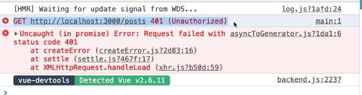
>
> WHY?? 로그인항 상태를 자바스크립트 상태에 저장을 했었다
>
> 그러니 당연히 새로고침을 하게되면 js가 리셋됨!
>
> 이런부분들을 쿠키로 처리할 수 있다
>
> ```js
> //cookies.js
> function saveAuthToCookie(value) {
>   document.cookie = `til_auth=${value}`;
> }
> 
> function saveUserToCookie(value) {
>   document.cookie = `til_user=${value}`;
> }
> 
> function getAuthFromCookie() {
>   return document.cookie.replace(
>     /(?:(?:^|.*;\s*)til_auth\s*=\s*([^;]*).*$)|^.*$/,
>     '$1',
>   );
> }
> 
> function getUserFromCookie() {
>   return document.cookie.replace(
>     /(?:(?:^|.*;\s*)til_user\s*=\s*([^;]*).*$)|^.*$/,
>     '$1',
>   );
> }
> 
> function deleteCookie(value) {
>   document.cookie = `${value}=; expires=Thu, 01 Jan 1970 00:00:01 GMT;`;
> }
> 
> export {
>   saveAuthToCookie,
>   saveUserToCookie,
>   getAuthFromCookie,
>   getUserFromCookie,
>   deleteCookie,
> };
> 
> ```
>
> - LoginForm.vue에 아래코드처럼 cookie에 정의된 함수를 import해와서 사용해도, 새로고침하면 사라진다!
>
> 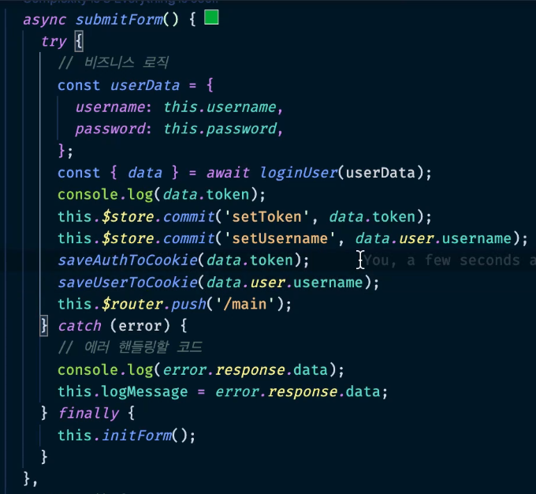
>
> 왜냐하면 쿠키에 저장된 값이 뷰의 store에 저장돼있지 않기 때문!
>
> 그렇기 때문에 store에 저장해줌
>
> ```js
> //store > index.js
> import Vue from 'vue';
> import Vuex from 'vuex';
> // cookie.js의 함수들을 모두 가져와 store에 저장함
> import {
>   getAuthFromCookie,
>   getUserFromCookie,
>   saveAuthToCookie,
>   saveUserToCookie,
> } from '@/utils/cookies';
> import { loginUser } from '@/api/index';
> 
> Vue.use(Vuex);
> 
> export default new Vuex.Store({
>   state: {
>     //매번 store를 생성할때마다 || or연산을 사용해서 getUser(Auth)FromCookie가 있으면 그 값을 없다면 빈값을 초기값으로 한다!
>     username: getUserFromCookie() || '',
>     token: getAuthFromCookie() || '',
>   },
>   getters: {
>     isLogin(state) {
>       return state.username !== '';
>     },
>   },
>   mutations: {
>     setUsername(state, username) {
>       state.username = username;
>     },
>     clearUsername(state) {
>       state.username = '';
>     },
>     setToken(state, token) {
>       state.token = token;
>     },
>   },
> 
> });
> ```
>
> 그러면 아래처럼 token과 username이 저장된 것을 볼 수 있다.
>
> 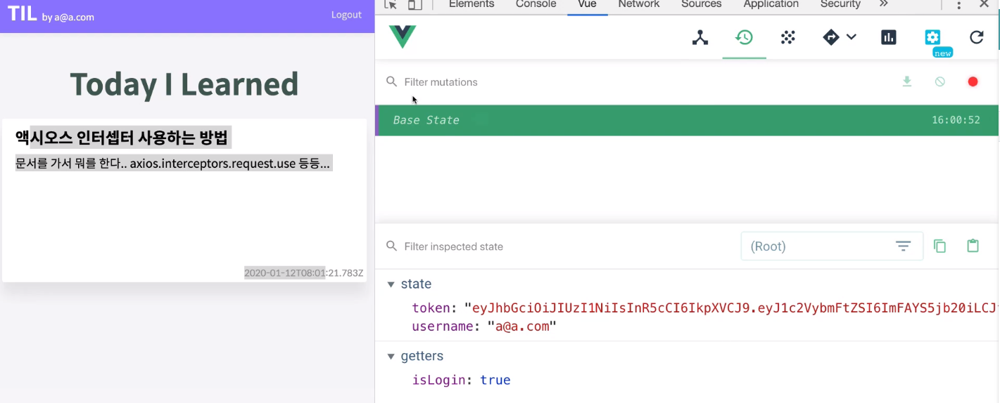
>
> 여기서 좀더 refactoring!!
>
> *loginForm에서 컴포넌트단에 너무 코드가 복잡해지는 것을 막기위해 actions활용(해도되고 loginform에 그냥 적어도됨)*
>
> ```js
> //store > index.js 밑에 actions추가
>   actions: {
>     // loginForm에서 컴포넌트단에 너무 코드가 복잡해지는 것을 막기위해 actions활용(해도되고 loginform에 그냥 적어도됨)
>     // 비동기처리 async await
>     // LOGIN을 dispatch로 호출할때 userData를 받아옴,
>     async LOGIN({ commit }, userData) {
>       const { data } = await loginUser(userData);
>       console.log(data.token);
>       // this.$store은 안적어도됨! store안이니까 commit만 적으면됨!
>       commit('setToken', data.token);
>       commit('setUsername', data.user.username);
>       saveAuthToCookie(data.token);
>       saveUserToCookie(data.user.username);
>       //  async는 무조건 Promise를 return, 하지만 나중에 활용될수 있는 data를 위해 data를 return!안넣어도 promise가 return돼서 안적어줘도됨!
>       return data;
>     },
>   },
> ```
>
> - LoginForm.vue
>
> ```vue
> ...
> <script>
> import { validateEmail } from '@/utils/validation';
> 
> export default {
>   data() {
>     return {
>       // form values
>       username: '',
>       password: '',
>       // log
>       logMessage: '',
>     };
>   },
>   computed: {
>     isUsernameValid() {
>       return validateEmail(this.username);
>     },
>   },
>   methods: {
>     async submitForm() {
>       try {
>         // 비즈니스 로직
>         const userData = {
>           username: this.username,
>           password: this.password,
>         };
>         // 브라우저저장소(쿠키)에 userData를 저장해두면 새로고침을 했을 때도 로그인이 풀리지 않는다!
>         // LOGIN action을 호출함, await가 붙어야함!! why?? action이 다 끝나고 rouoter로 main으로 이동해야되기때문에 비동기처리 해줘야됨!!
>         await this.$store.dispatch('LOGIN', userData);
>         this.$router.push('/main');
>       } catch (error) {
>         // 에러 핸들링할 코드
>         console.log(error.response.data);
>         this.logMessage = error.response.data;
>       } finally {
>         this.initForm();
>       }
>     },
>     initForm() {
>       this.username = '';
>       this.password = '';
>     },
>   },
> };
> </script>
> 
> <style>
> .btn {
>   color: white;
> }
> </style>
> 
> ```
>
> 


## 11. 학습 노트 데이터 생성

> [아이오닉 아이콘 사이트](https://ionicons.com/usage)
>
> template에 사용하려면 cdn을 가져와서 index.html에 등록하고, 원하는 아이콘을 찾아 class이름을 가져오오는데 그냥 코드 복붙이 아니라 Basic usage를 가져와 class를 적어주면됨!
>
> 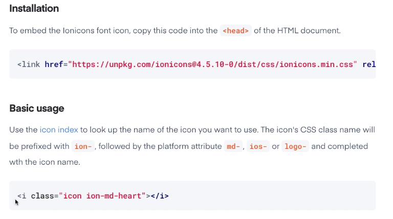

- PostAddPage.vue router등록

```js
import Vue from 'vue';
import VueRouter from 'vue-router';
// import LoginPage from '@/views/LoginPage.vue';
// import SignupPage from '@/views/SignupPage.vue';

Vue.use(VueRouter);

export default new VueRouter({
  mode: 'history',
  routes: [
...
    {
      path: '/add',
      component: () => import('@/views/PostAddPage.vue'),
    },
  ],
});

```

먼저 이렇게 눈에 보이는 화면부터 코딩한 후, data를 다룸!

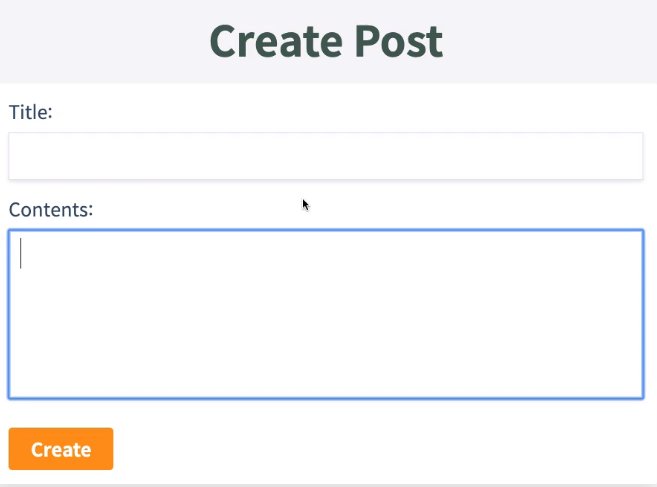

#### 학습노트 등록 API구현

> api > index.js
>
> ```js
> //추가
> // 학습 노트 데이터를 생성하는 API
> function createPost(postData) {
>   return instance.post('posts', postData);
> }
> 
> export { registerUser, loginUser, fetchPosts, createPost };
> ```

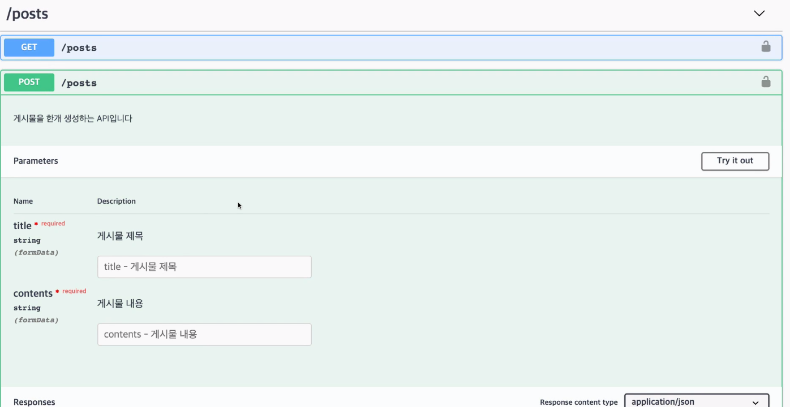

- data의 키값 `_id`, `title` 등등을 이용해 html에서 접근할 수 있다

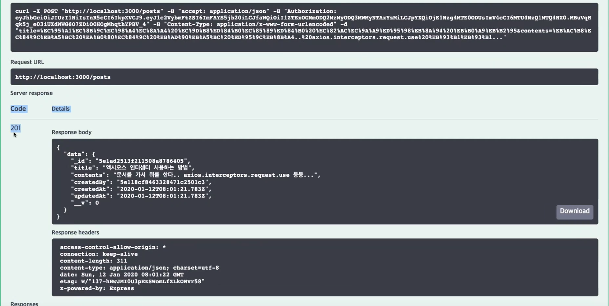

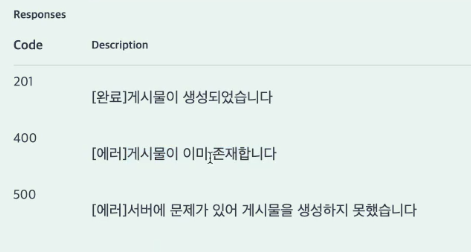

동일한 게시글이 존재하면 에러가 뜸! 

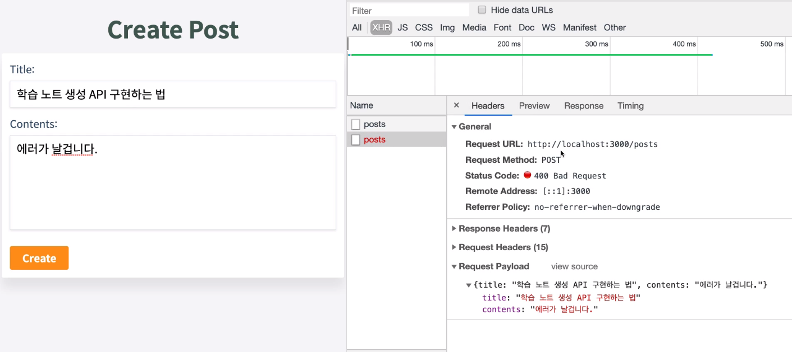

원래는 더 디테일한 error코드가 들어가겠지만 학습용이라 간단하게 표현

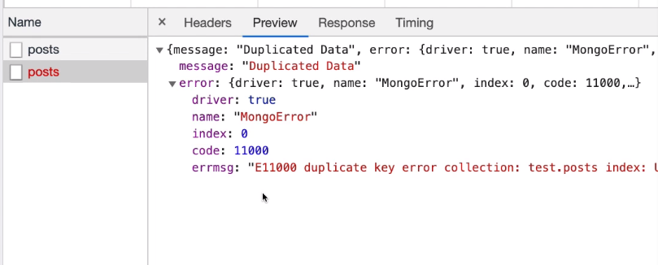

- PostAddPage.vue

```vue
<template>
  <div class="form-container">
    <PostAddForm></PostAddForm>
  </div>
</template>

<script>
import PostAddForm from '@/components/posts/PostAddForm.vue';

export default {
  components: {
    PostAddForm,
  },
};
</script>

<style></style>

```

- PostAddForm.vue

```vue
<template>
  <div class="contents">
    <h1 class="page-header">Create Post</h1>
    <div class="form-wrapper">
      <!-- submit이벤트일어나면 submitForm메소드 연결, .prevent(Form기능없앰) -->
      <form class="form" @submit.prevent="submitForm">
        <div>
          <label for="title">Title:</label>
          <input id="title" type="text" v-model="title" />
        </div>
        <div>
          <label for="contents">Contents:</label>
          <textarea id="contents" type="text" rows="5" v-model="contents" />
          <!-- content가 200자이상 넘을때만 길다고 표현! -->
          <p
            v-if="!isContentsValid"
            class="validation-text warning isContentTooLong"
          >
            Contents length must be less than 200
          </p>
        </div>
        <button type="submit" class="btn">Create</button>
      </form>
      <p class="log">
        {{ logMessage }}
      </p>
    </div>
  </div>
</template>

<script>
// api가져옴
import { createPost } from '@/api/index';

export default {
  data() {
    return {
      // vda 단축키
      title: '',
      contents: '',
      logMessage: '',
    };
  },
  computed: {
    isContentsValid() {
      // contents의 길이가 200자 이하로만 valid
      return this.contents.length <= 200;
    },
  },
  methods: {
    async submitForm() {
      try {
        // createPost에 바인딩된 title과 contents를 인자로 보내줌(비동기처리)
        const response = await createPost({
          title: this.title,
          contents: this.contents,
        });
        console.log(response);
      } catch (error) {
        // 에러가 들어옴
        console.log(error.response.data.message);
        this.logMessage = error.response.data.message;
      }
    },
  },
};
</script>

<style scoped>
.form-wrapper .form {
  width: 100%;
}
.btn {
  color: white;
}
</style>
```


## 12. 데이터 성격 별로 API 함수 모듈화

> 데이터 성격별로 API함수 모듈화 한 뒤,  각 컴포넌트에 import한 api주소 변경해줌!

- `api` > `index.js`

> **여기서 instacne에 토큰값이 header에 들어있는데 회원가입과 로그인api에도 쓰고있다! 엄격한 백엔드면 오류가 났을수도 있다!  원래는 분리해주고 instance에 헤더값이 들어있어야되는 것은 로그인 이후의 api들이다!**

```js
import axios from 'axios';
import { setInterceptors } from './common/interceptors';

// baseurl만 들어있는 기본 인스턴스 값!
function createInstance() {
  return axios.create({
    baseURL: process.env.VUE_APP_API_URL,
  });
}

// 액시오스 초기화 함수
// auth가 들어있는 instance
function createInstanceWithAuth(url) {
  const instance = axios.create({
    // instance의 baseURL에 공통적으로 들어가는 반복되는 url을 포함시킴
    baseURL: `${process.env.VUE_APP_API_URL}${url}`,
  });
  return setInterceptors(instance);
}
//instance, posts를 내보냄(api분리를위해)
export const instance = createInstance();
//기본 url이 posts가 되는 instance들을 posts인스턴스에 넣음
export const posts = createInstanceWithAuth('posts');

// api url
// GET - posts
// POST - posts
// PUT - posts {id}
// DELETE - posts {id}
```

- `api` > `auth.js`

> 사용자 관련 api분리

```js
// 로그인, 회원 가입, (ex) 회원 탈퇴
import { instance } from './index';

// 회원가입 API
function registerUser(userData) {
  return instance.post('signup', userData);
}

// 로그인 API
function loginUser(userData) {
  return instance.post('login', userData);
}

export { registerUser, loginUser };
```

- `api` > `posts.js`

> 학습노트 관련 api분리

```js
// 학습 노트 조작과 관련된 CRUD API 함수 파일
import { posts } from './index';

// 학습 노트 데이터를 조회하는 API
function fetchPosts() {
  return posts.get('/');
}

// 학습 노트 데이터를 생성하는 API
function createPost(postData) {
  return posts.post('/', postData);
}

export { fetchPosts, createPost };
```


## 13. 학습 노트 삭제 기능

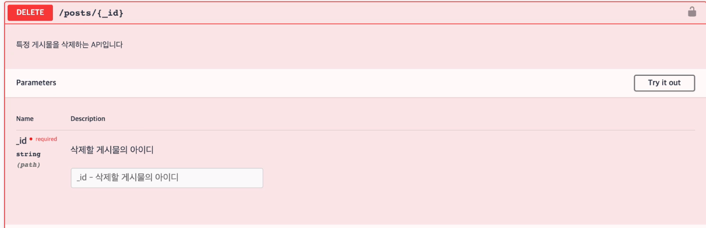

- `api` > `posts.js`

```js
//추가
// 학습 노트 데이터를 삭제하는 API
function deletePost(postId) {
  return posts.delete(postId);
}

export { fetchPosts, createPost, deletePost };
```

- `PostListItem.vue`

```vue
<template>
  <li>
    <div class="post-title">
      {{ postItem.title }}
    </div>
    <div class="post-contents">
      {{ postItem.contents }}
    </div>
    <div class="post-time">
      {{ postItem.createdAt }}
      <!-- 수정아이콘 -->
      <i class="icon ion-md-create"></i>
      <!-- 삭제아이콘 -->
      <i class="icon ion-md-trash" @click="deleteItem"></i>
    </div>
  </li>
</template>

<script>
import { deletePost } from '@/api/posts';

export default {
  props: {
    postItem: {
      type: Object,
      required: true,
    },
  },
  methods: {
    // 삭제메서드, 비동기처리
    async deleteItem() {
      // confirm을 이용해 삭제할건지 물어본다
      if (confirm('You want to delete it?')) {
        // _id가 키값
        await deletePost(this.postItem._id);
        // 삭제가 됐다고 화면에 반영하기 위해 refresh이벤트를 emit으로 MainPage컴포넌트로보냄!
        this.$emit('refresh');
      }
      // console.log('deleted');
    },
  },
};
</script>

<style></style>
```

- `MainPage.vue`

```vue
<template>
  <div>
    <div class="main list-container contents">
      <h1 class="page-header">Today I Learned</h1>
      <LoadingSpinner v-if="isLoading"></LoadingSpinner>
      <ul v-else>
        <!-- postlistitem에서 refresh이벤트가 발생하면 fetchData를 다시 호출해서 post갱신 -->
        <PostListItem
          v-for="postItem in postItems"
          :key="postItem._id"
          :postItem="postItem"
          @refresh="fetchData"
        ></PostListItem>
      </ul>
    </div>
    <router-link to="/add" class="create-button">
      <i class="ion-md-add"></i>
    </router-link>
  </div>
</template>
...
```


## 14. 학습 노트 데이터 수정

- `routes` > `index.js`

> PostListItem에서 수정router로 보낼때 id값을 같이 보내줌 'this.$router.push(`/post/${id}`)' url로 push

```js
//라우터 추가, id값을 params로 넘겨줌
	{
      // :id는 posteditpage에 $route에 보면 params로 id가 넘어감!
      path: '/post/:id',
      component: () => import('@/views/PostEditPage.vue'),
    },
```

- `PostListItem.vue`

```vue
<template>
  <li>
    <div class="post-title">
      {{ postItem.title }}
    </div>
    <div class="post-contents">
      {{ postItem.contents }}
    </div>
    <div class="post-time">
      {{ postItem.createdAt }}
      <!-- 수정아이콘을 클릭하면 editPage로이동 -->
      <i class="icon ion-md-create" @click="routeEditPage"></i>
      <i class="icon ion-md-trash" @click="deleteItem"></i>
    </div>
  </li>
</template>

<script>
import { deletePost } from '@/api/posts';

export default {
  props: {
    postItem: {
      type: Object,
      required: true,
    },
  },
  methods: {
    async deleteItem() {
      if (confirm('You want to delete it?')) {
        await deletePost(this.postItem._id);
        this.$emit('refresh');
      }
      // console.log('deleted');
    },
    routeEditPage() {
      // page의 id값을 router와 같이 보내줌
      const id = this.postItem._id;
      this.$router.push(`/post/${id}`);
    },
  },
};
</script>

<style></style>
```


- `PostEditPage.vue`

```vue
<template>
  <div class="form-container">
    <PostEditForm></PostEditForm>
  </div>
</template>

<script>
import PostEditForm from '@/components/posts/PostEditForm.vue';

export default {
  components: {
    PostEditForm,
  },
};
</script>

<style></style>
```

### 학습노트 수정을 위한 특정 게시물 조회 기능

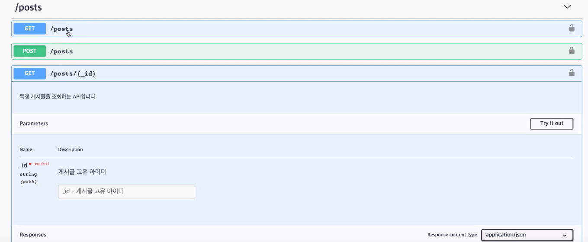

- `api` > `posts.js`

```js
//추가
// 특정 학습 노트(하나)를 조회하는 API
function fetchPost(postId) {
  return posts.get(postId);
}
export { fetchPosts, fetchPost, createPost, deletePost, editPost };
```

- `PostEditForm.vue`

> 
>
> id는 $route의 params의 id값!

```js
//추가
  // 원래있던 내용을 불러옴!
  async created() {
    // id는 route의 params의 id값을 가져옴
    const id = this.$route.params.id;
    // fetchPost(id) :해당 id값의 post를 응답 결과가 data에 저장됨, response.data
    const { data } = await fetchPost(id);
    // 그 data의 title,contents.의 값을 this.title과 contents에 저장
    this.title = data.title;
    this.contents = data.contents;
  },
```

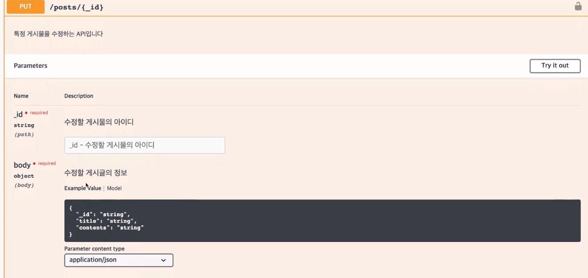


- `api` > `posts.js`

```js
// 학습 노트 데이터를 수정하는 API
function editPost(postId, postData) {
  return posts.put(postId, postData);
}

export { fetchPosts, fetchPost, createPost, deletePost, editPost };
```

- `PostEditForm.vue`

```js
  //...
  methods: {
    async submitForm() {
      const id = this.$route.params.id;
      try {
        // id,와 바꾼 title과 contents를 같이 인자로 보내줌!
        await editPost(id, {
          title: this.title,
          contents: this.contents,
        });
        this.$router.push('/main');
      } catch (error) {
        // 에러났을때 보여주는 코드
        console.log(error);
        this.logMessage = error;
      }
    },
  },
  //...
```


## 15. 날짜 형식 포맷팅 `filter`

> [뷰 필터 안내 문서](https://vuejs.org/v2/guide/filters.html#ad)
>
> ```html
> <!--데이터 | 필터이름-->
> {{ message | capitalize }}
> ```

- PostListItem.vue 

> 이렇게 쓰면 해당 컴포넌트만 쓸수있기 때문에 전역으로 설정해주는 것이 좋다.

```vue
<template>
  <li>
    <div class="post-time">
      {{ postItem.createdAt | formatDate }}
    </div>
  </li>
</template>

<script>
import { deletePost } from '@/api/posts';

export default {
    //...
// 이렇게쓸수도 있지만 이 filter는 이 컴포넌트에서만 쓸수있음 -> 다른곳에서도 쓸수있게 전역으로 설정하는게 좋다!
   filters:{
     formatData(value){
       return new Data(value);
     },
   },
//...
```

- `utils` > `filter.js`

```js
// 필터 관련 함수가 존재하는 파일
export function formatDate(value) {
  const date = new Date(value);
  const year = date.getFullYear();
  let month = date.getMonth() + 1;
  month = month > 9 ? month : `0${month}`;
  const day = date.getDate();
  let hours = date.getHours();
  hours = hours > 9 ? hours : `0${hours}`;
  const minutes = date.getMinutes();
  return `${year}-${month}-${day} ${hours}:${minutes}`;
}
```

- 위 filter.js를 `main.js`에 등록을 한다

```js
import Vue from 'vue';
import App from './App.vue';
import router from '@/routes/index';
import store from '@/store/index';
import { formatDate } from '@/utils/filters';

// formatDate는 이렇게하면 전역으로 설정됨
Vue.filter('formatDate', formatDate);
Vue.config.productionTip = false;

new Vue({
  render: h => h(App),
  router,
  store,
}).$mount('#app');
```


## 16. 라우터 심화

> [라우터 네비게이션 가드 문서](https://router.vuejs.org/guide/advanced/navigation-guards.html)
>
> [라우터 네비게이션 가드 관련 영상(완벽 가이드 수강 권한 필요)](https://www.inflearn.com/course/vue-js/lecture/17055)
>
> [데이터 호출 시점]
>
> 1. 라우터 네비게이션 가드
>
> - 특정 URL로 접근하기 전의 동작을 정의하는 속성(함수)
>
> 2. 컴포넌트 라이프 사이클 훅
>
> - created : (컴포넌트가 생성) 되자마자 호출되는 로직

- `routes` > `index.js`

```js
import Vue from 'vue';
import VueRouter from 'vue-router';
import store from '@/store/index';
// import LoginPage from '@/views/LoginPage.vue';
// import SignupPage from '@/views/SignupPage.vue';

Vue.use(VueRouter);

// 라우터 네비게이션 가드를 사용하기 위해 new VueRouter 인스턴스를 router 변수에 담아준다
const router = new VueRouter({
  mode: 'history',
  routes: [
    {
      path: '/',
      redirect: '/login',
    },
    {
      path: '/login',
      component: () => import('@/views/LoginPage.vue'),
    },
    {
      path: '/signup',
      component: () => import('@/views/SignupPage.vue'),
    },
    // 사용자가 로그인하지 않은 상태라면 들어갈수 없게 설정을해줌
    // meta속성에서 auth(임의로설정한이름, 내가 정함):true로 설정
    {
      path: '/main',
      component: () => import('@/views/MainPage.vue'),
      meta: { auth: true },
    },
    {
      path: '/add',
      component: () => import('@/views/PostAddPage.vue'),
      meta: { auth: true },
    },
    {
      path: '/post/:id',
      component: () => import('@/views/PostEditPage.vue'),
      meta: { auth: true },
    },
    {
      path: '*',
      component: () => import('@/views/NotFoundPage.vue'),
    },
  ],
});
// router네비게이션가드 beforeEach에 콜백함수의 인자로 to,from,next가 들어감
// to:이동하려는 페이지 , from:현재페이지 , next:페이지이동할때 호출하는 API
router.beforeEach((to, from, next) => {
  // 라우터페이지정보에(to).meta에.auth에 true 이고(&&:AND)
  // 그정보가 store의 getters에 isLogin에 사용자가 로그인했는지 여부가 true/false로 있음
  // auth:true인 라우터는 login했는지 확인하고 안했으면(False,!) 로그인페이지로 이동
  if (to.meta.auth && !store.getters.isLogin) {
    // log를찍고
    console.log('인증이 필요합니다');
    // next를 호출해야지 /login페이지로 이동
    next('/login');
    // return을 꼭 적어줘야됨! 그래야 아래에 있는 next()가 실행되지 않는다
    return;
  }
  next();
});

// router를 main.js에 등록해주면 export해줘야됨
export default router;
```

- `AppHeader.vue`

```vue
<template>
  <header>
    <div>
      <router-link :to="logoLink" class="logo">
        TIL
        <span v-if="isUserLogin">by {{ $store.state.username }}</span>
      </router-link>
    </div>
<!--...-->
</template>

<script>
import { deleteCookie } from '@/utils/cookies';

export default {
  computed: {
    isUserLogin() {
      return this.$store.getters.isLogin;
    },
    // 로그인이돼있다면 main으로, 아니라면 login페이지로 보냄
    logoLink() {
      return this.$store.getters.isLogin ? '/main' : '/login';
    },
  },
    //...
};
</script>
```

### (추가) 로그아웃했을 때 쿠키,토큰값 지우기

- `components` > `common` > `AppHeader.vue`

```js
//추가
import { deleteCookie } from '@/utils/cookies';
  methods: {
    logoutUser() {
      this.$store.commit('clearUsername');
      this.$store.commit('clearToken');
      // 로그아웃을하면, 쿠키를 지워주는 코드
      deleteCookie('til_auth');
      deleteCookie('til_user');
      this.$router.push('/login');
    },
  },
```


- `store` > `index.js`

```js
import Vue from 'vue';
import Vuex from 'vuex';
import {
  getAuthFromCookie,
  getUserFromCookie,
  saveAuthToCookie,
  saveUserToCookie,
} from '@/utils/cookies';
import { loginUser } from '@/api/auth';

Vue.use(Vuex);

export default new Vuex.Store({
//...
    // 로그아웃했을때 token값도 지워줌
    clearToken(state) {
      state.token = '';
    },
  },
//...
});

```


## 17. 프런트엔드 테스팅

> [State of JS 2019 - 테스팅](https://2019.stateofjs.com/testing/)
>
> [Jest 공식 사이트](https://jestjs.io/en/)

### 테스트 코드가 필요한 이유

> 예를들어, 로그인을 하는 로직에서 확인해야될 것이 아래의 두 가지이다.
>
> 1. id인풋박스에 이메일을 입력했을 때 이메일이 맞는지 확인하는 로직
> 2. id,pw가 맞는 경우에 로그인 처리가 된다. 다음페이지로 이동
>
> 이때 로그인 로직이 맞는지 확인하기위해 일일이 손으로 다 쳐야 됐는데, 
>
> **테스트 코드는 일일이 기능을 손으로 확인하는 시간을 줄여준다.**


### 테스팅 환경 구성

- `package.json`

> 명령어 만듦

```json
{
  "name": "vue-til",
  "version": "0.1.0",
  "private": true,
  "scripts": {
    "serve": "vue-cli-service serve",
    "build": "vue-cli-service build",
    // 기본적으로는 test:unit이라고 돼있는데 학습차원에서 test로 바꿈
    //  --watchAll vue-cli 서비스에서 jest(js test) 도구에서 test 코드를 실행할때 watchAll옵션을 붙여, test 코드 파일이 변화될때마다 자동으로 변환해줌
    "test": "vue-cli-service test:unit --watchAll",
    "lint": "vue-cli-service lint"
  },
  "dependencies": {
    "axios": "^0.19.0",
    "core-js": "^3.4.4",
    "vue": "^2.6.10",
    "vue-router": "^3.1.3",
    "vuex": "^3.1.2"
  },
  "devDependencies": {
    "@vue/cli-plugin-babel": "^4.1.0",
    "@vue/cli-plugin-eslint": "^4.1.0",
      //vue-cli를 create할때 test를 선택해서 자동으로 깔렸다
    "@vue/cli-plugin-unit-jest": "^4.1.0",
    "@vue/cli-service": "^4.1.0",
    "@vue/eslint-config-prettier": "^5.0.0",
      //vue-cli를 create할때 test를 선택해서 자동으로 깔렸다
    "@vue/test-utils": "1.0.0-beta.29",
    "babel-eslint": "^10.0.3",
    "eslint": "^5.16.0",
    "eslint-plugin-prettier": "^3.1.1",
    "eslint-plugin-vue": "^5.0.0",
    "prettier": "^1.19.1",
    "vue-template-compiler": "^2.6.10"
  }
}

```

- `jest.config.js`

```js
module.exports = {
  preset: '@vue/cli-plugin-unit-jest',
  testMatch: [
    // test파일의 대상을 지정할 수 있음
    '<rootDir>/src/**/*.spec.(js|jsx|ts|tsx)|**/__tests__/*.(js|jsx|ts|tsx)',
  ],
};
```

**js파일과 테스트코드와의 차이점은 파일명 중간에 `.spec` or `.test`가 들어가있는지의 여부**

**기본적으로 개인 선호도 차이지만 test파일과 폴더는 가까워야된다고 해서 `components`폴더 아래에 `__test__`폴더를 만들어서 그아래에 test파일들을 넣음!**

- `components` > `LoginForm.spec.js`

> `package.json`에 적은 명령어에 의해 아래의 코드를 bash에 적으면 `LoginForm.spec.js`가 실행이 됨!

```sh
$ npm t
```


### Javascript testcode예시

> [Jest describe() API 문서](https://jestjs.io/docs/en/api#describename-fn)
>
> - `main.js`
>
> ```js
> export function sum(a, b) {
>   return a + b;
> }
> ```
>
> **describe()** : 연관된 테스트 케이스를 그룹화하는 API
>
> **test()**:하나의 테스트 케이스를 검증하는 API
>
> **expect().toBe()**: 기대되는 값(expect괄호)에 실제 값(toBe)이 어떤값(toBe괄호)이다 라고 예상하는 API 
>
> 아래의 코드에 빨간줄이 쳐지는 이유는 ESLint에서 jest문법을 이해할 수 없어서  생김
>
> -> 이것은 `.eslintrc.js`파일에서 `env`에 `jest:true`를 추가해주면 됨
>
> ```js
>   env: {
>     node: true,
>     jest: true
>   },
> ```
>
> 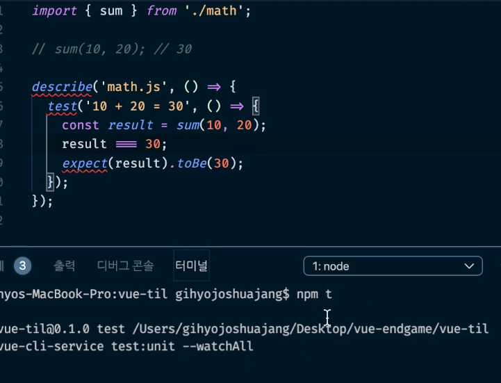
>
> 그 결과 값
>
> 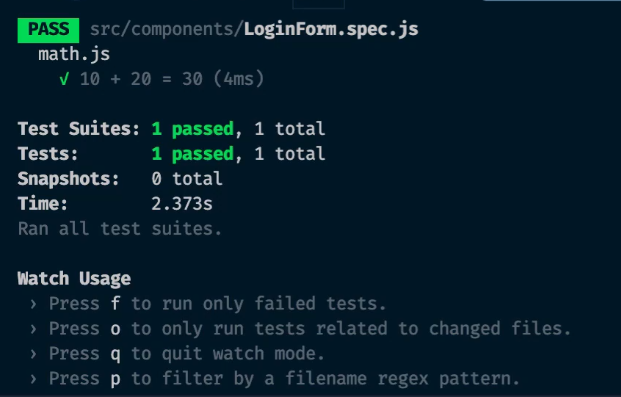
>
> -> 보통 아닌값을 넣어서 Fail이 어떻게 뜨는지 봄
>
> toBe앞에 not을 붙이면 쉽게 반대의 test를 할 수 있음
>
> `expect(result).not.toBe(30)`
>
> 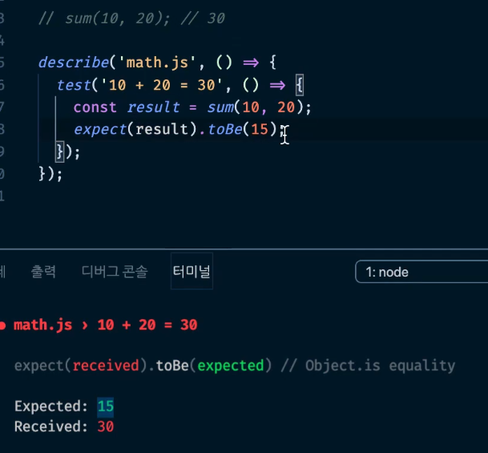


###  Vue 컴포넌트 테스트 방법

> ```js
> // 테스트 유틸 라이브러리 로딩
> // 컴포넌트 로딩
> 
> describe('컴포넌트 이름', () => {
>   test('테스트 할 동작이나 기능(컴포넌트가 마운팅되면 화면에 그려져야 )', () => {
>     // 내용 정의
>   });
> });
> ```

> #### (참고) el과 `.$mount()`의 차이
>
> new Vue에서 `el:'#app`으로 설정하면 뷰 인스턴스가 생성될 때 elment를 지정하는 것과 ,
>
> `$.mount(''#app')` : 인스턴스가 생성되고 인스턴스가 `#app`을 mount한다
>
> **+ jest는 좋은점이 console을 찍었을 때 instance의 내용들을 확인할 수 있다**
>
> 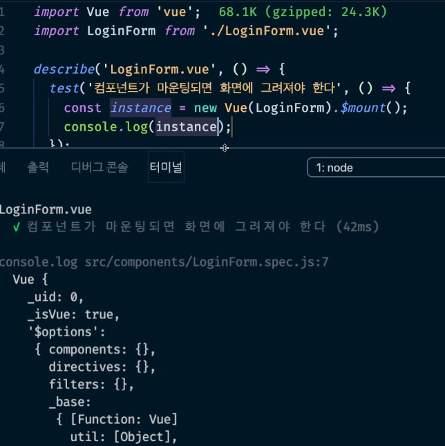
>
> 하지만 매번 이렇게 import하고  마운팅하기엔 너무 비효율적이다
>
> 이것을 도와주는 `vue test utils`라이브러리 `shallowMount`(특정 컴포넌트를 mounting한다)를 사용한다
>
> *보통 wrapper라고 씀, wrapper.vm은 instance와 같음! -> ex) wrapper.vm.username => username이 들어있다*
>
> 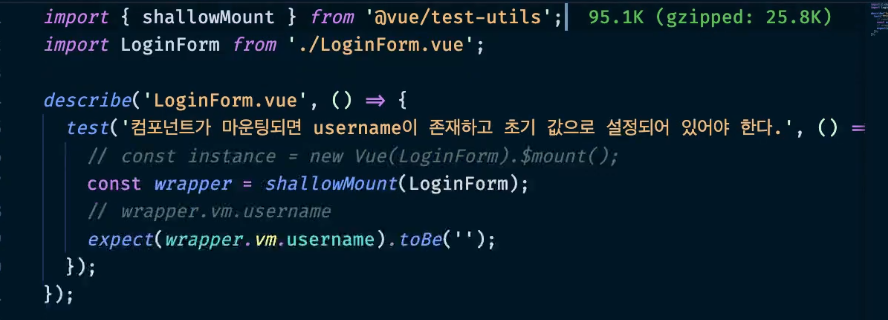
>
> [Vue Test Utils 공식 문서](https://vue-test-utils.vuejs.org/guides/)
>
> [find() API 문서](https://vue-test-utils.vuejs.org/api/wrapper/#find)
>
> 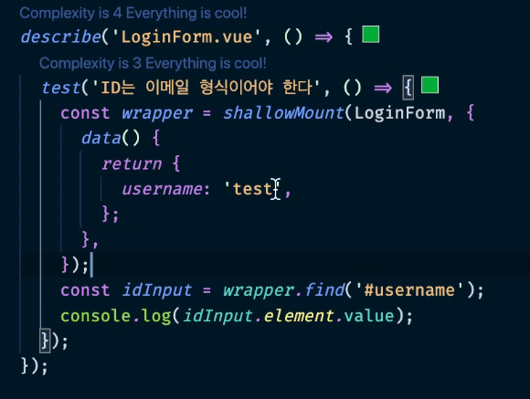
>
> *wrapper의 find api이용, 로그인 컴포넌트가 화면에 부착되었을 때 템플릿안에 있는 태그, html요소를 쫓아갈 수 있음*
>
>  *find안에 class가 warning인 html요소를 가져와 idInput에 담는다*
>
> *ex)loginForm에 data에 넣었던 username이 vue내부적으로 v-model을 이용해서 로그인폼에 있는 인풋박스까지 연결된 것을 알 수 있다.*
>
> *input값의 element의 value는 그 해당 input값의 값을 의미, html에 `value=` or `type=text`라고 돼있는 것의 바인딩된 값!*
>
>  

### 사용자관점의  테스트 코드 작성

> username에 값을 연결되는거라든지, computed가 잘돌아가는지 뷰라이브러리의 동작이기 때문에 이걸 테스트할 필요는 없고, 사용자가 에러를 어떻게 보는가를 사용자 입장에서 test하는 것이 중요하다!
>
> 예) username이 맞지 않았다면 class가 warning인 span태그가 뜨게해야된다!
>
> **find()**는 템플릿 태그 쪽에 있는 html 요소들을 css선택자를 이용해서 쫓아갈 수 있다
>
> 항상 반대케이스도 같이 넣어본다!

- ``components` > `LoginForm.spec.js`

```js
// vue test utils 라이브러리를 가져옴
// 특정 컴포넌트를 mounting할수있음
import { shallowMount } from '@vue/test-utils';
// loginForm에대해 test할거니까 import
import LoginForm from './LoginForm.vue';

// 컴포넌트의 이름이 최소 단위
describe('LoginForm.vue', () => {
  test('ID가 이메일 형식이 아니면 경고 메시지가 출력된다', () => {
  // loginForm을 바로 mount하는 라이브러리
  // 보통 wrapper라고 씀, wrapper.vm은 instance와 같음! -> ex) wrapper.vm.username => username이 들어있다
    const wrapper = shallowMount(LoginForm, {
      data() {
        return {
          username: 'test',
        };
      },
    });
    // wrapper의 find api이용, 로그인 컴포넌트가 화면에 부착되었을 때 템플릿안에 있는 태그, html요소를 쫓아갈 수 있음
    // find안에 class가 warning인 html요소를 가져와 warningText에 담는다
    const warningText = wrapper.find('.warning');
    // html()은 warningText의 html을 호출하면 해당 html태그가 뜸!
    // console.log(warningText.html());
    // waringText가 있으면(존재하면,.exists()) 있으면 true,
    expect(warningText.exists()).toBeTruthy();
  });

```

- `LoginForm.vue`

```vue
			<span class="warning" v-if="!isUsernameValid && username">
              Please enter an email address
            </span>
```

- ``components` > `LoginForm.spec.js`

```js
//추가
  test('ID와 PW가 입력되지 않으면 로그인 버튼이 비활성화 된다', () => {
    const wrapper = shallowMount(LoginForm, {
      data() {
        return {
          username: '',
          password: '',
        };
      },
    });
    // button element로 찾아도되고, .btn으로 찾아도됨
    const button = wrapper.find('button');
    //button element(요소에 접근해 )disabled가 true인지 아닌지 
    expect(button.element.disabled).toBeTruthy();
  });
});
```

- `LoginForm.vue`

```vue
<!-- class를 추가함, id가 이메일형태가 아니거나 password가 없으면 disabled class적용, 둘다 있으면 null -->
        <button
          :disabled="!isUsernameValid || !password"
          type="submit"
          class="btn"
          :class="!isUsernameValid || !password ? 'disabled' : null"
        >
```


### (추가) ToastPopup.vue

```vue
<template>
	<div class="toast" :class="toastAnimationClass">
		{{ message }}
	</div>
</template>

<script>
import bus from '@/utils/bus.js';
let toastTimer;
export default {
	data() {
		return {
			open: false,
			message: '',
		};
	},
	computed: {
		toastAnimationClass() {
			return this.open ? 'show' : null;
		},
	},
	methods: {
		showToast(message) {
			this.message = message;
			this.open = true;
			clearTimeout(toastTimer);
			toastTimer = setTimeout(this.hideToast, 2000);
		},
		hideToast() {
			this.open = false;
		},
	},
	created() {
		bus.$on('show:toast', this.showToast);
	},
	beforeDestroy() {
		bus.$off('show:toast', this.showToast);
	},
};
</script>

<style scoped>
.toast {
	position: fixed;
	width: 400px;
	height: 56px;
	background-color: #22252e;
	border-radius: 2px;
	box-shadow: 0 8px 20px 0 rgba(0, 0, 0, 0.2);
	color: white;
	bottom: -120px;
	margin-left: -200px;
	left: 50%;
	display: flex;
	justify-content: center;
	align-items: center;
	transition: transform 750ms ease-out;
}
.toast.show {
	transform: translateY(-150px);
	transition: transform 500ms ease-in-out;
}
</style>
```

