# Vue_intermediate

[toc]

## vue-todo

1. 뷰 cli로 프로젝트 생성하기

```sh
$ vue create vue-todo
```


### 반응형 웹

> [meta viewport](https://developers.google.com/search/mobile-sites/mobile-seo/responsive-design?hl=ko)
>
> [파비콘 생성 사이트](https://www.favicon-generator.org/)

- index.html `header`에 아래의 코드를 적는다.

> 페이지가 모든 기기에 맞춰 조정된다는 것을 브라우저에 알리려면 다음과 같이 문서의 헤드에 메타태그를 추가

```html
<meta name="viewport" content="width=device-width, initial-scale=1.0">
```

- Favicon생성

```html
<link rel="shortcut icon" href="/favicon.ico" type="image/x-icon">
<link rel="icon" href="/favicon.ico" type="image/x-icon">
```


### (참고) Todolist 

- localStoarge에 TodoInput 값들을 넣어왔을때 TodoList에 표시

> localStorage에 값이 있으면 하나씩 돌아보면서 키값을 todoItem에 넣어줌!, localStorage에 원래 들어있는 값 loglevel:webpack-dev-server는 빼주기 위해 if에 넣어줌

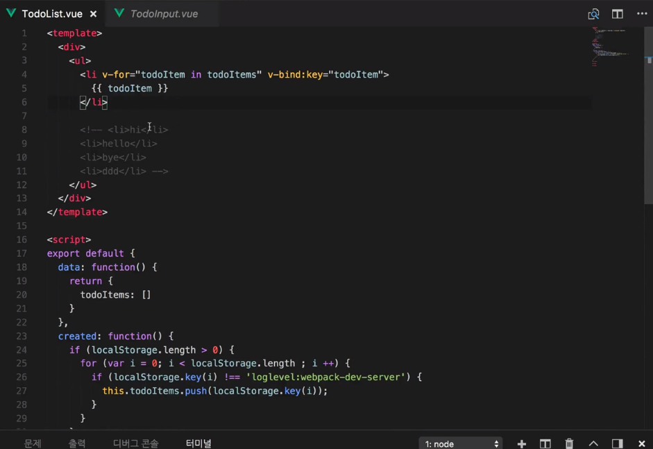

- `v-for`로 `(todoItem,index)`를 하면 todoItem과 그 값의 index도 같이 removeItem메소드에 넘겨줌

  removeTodo가 실행되면 localStorage에서 해당 todoItem키로 해당 item을 없애주고, 그것을 화면에 바로 반영하기 위해 this.todoItems에 해당 item을 지워주기 위해 `splice(시작index,몇개)` api를 이용

  `slice()`: 이건 기존 배열을 변화시키지 않음, 하지만 splice는 기존 배열을 변환시켜서 반환해줌

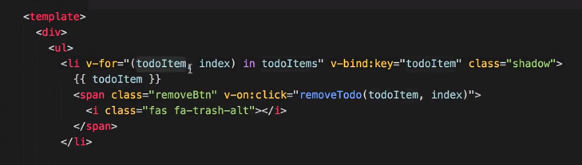

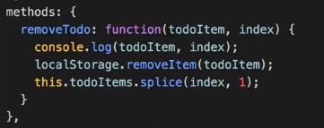

- js객체를 string으로 만들어주는 API(`JSON.stringify(obj)`) 이거를 사용하면 localStorage에 input값을 저장할 때 아래의 사진처럼 Value값을 String으로 저장해줘서 볼 수 있게 해줌

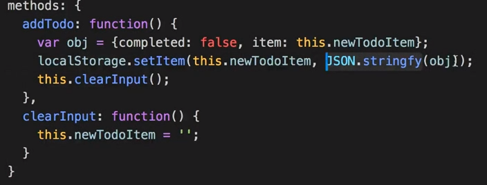

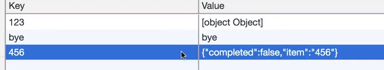


- 위와같이 설정하면 Todolist에서도 key값 말고 value에 저장된 items값으로 바꿔줌

> getItem을 하면 괄호안의 키값을 통해 value가 나오고  그것은 `string` type이고 이것을 `object`로 돌리려면 `JSON.parse`를 쓰면 된다

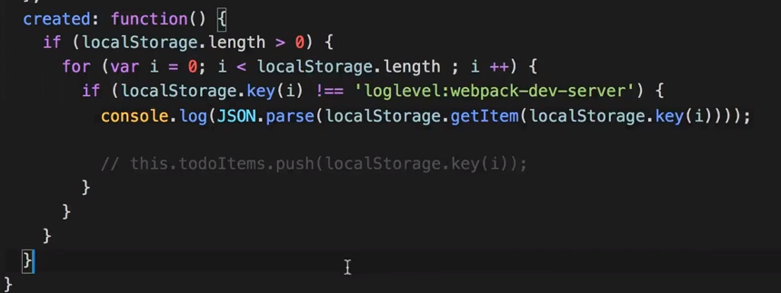

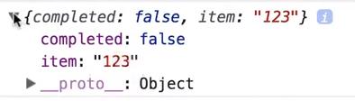

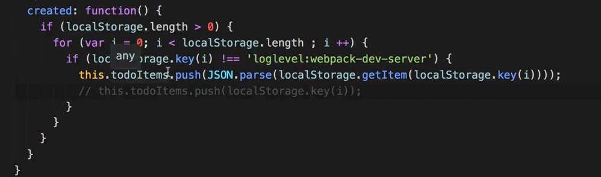

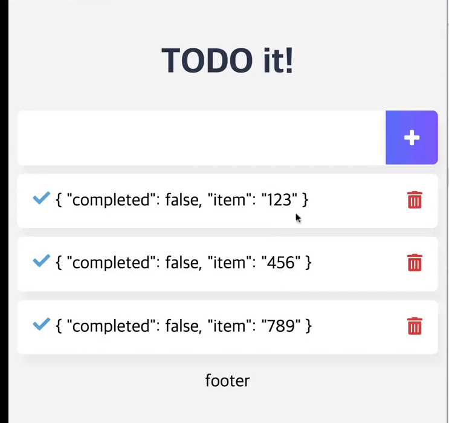

- todoItem값이 바뀌었기 때문에 todoItem.item으로 값에 접근한다.


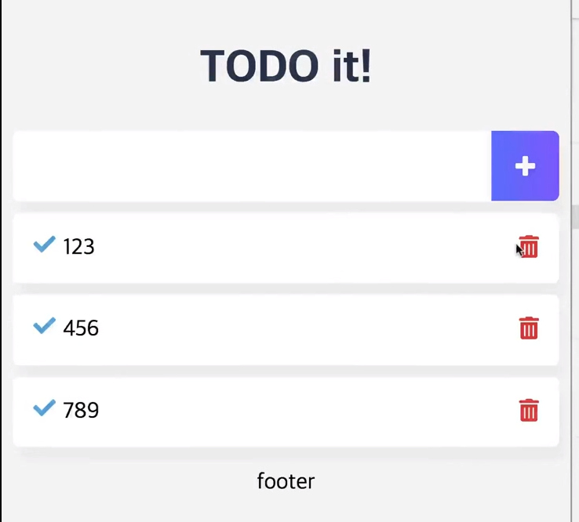

- todolist수정

> local스토리지는 수정이 없어서 remove를 하고 바뀐것을 다시 추가해줘야됨


- 로컬스토리지 내용 전부 지우기 `clear()`

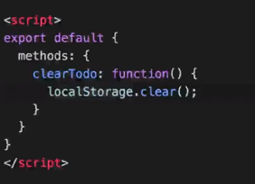


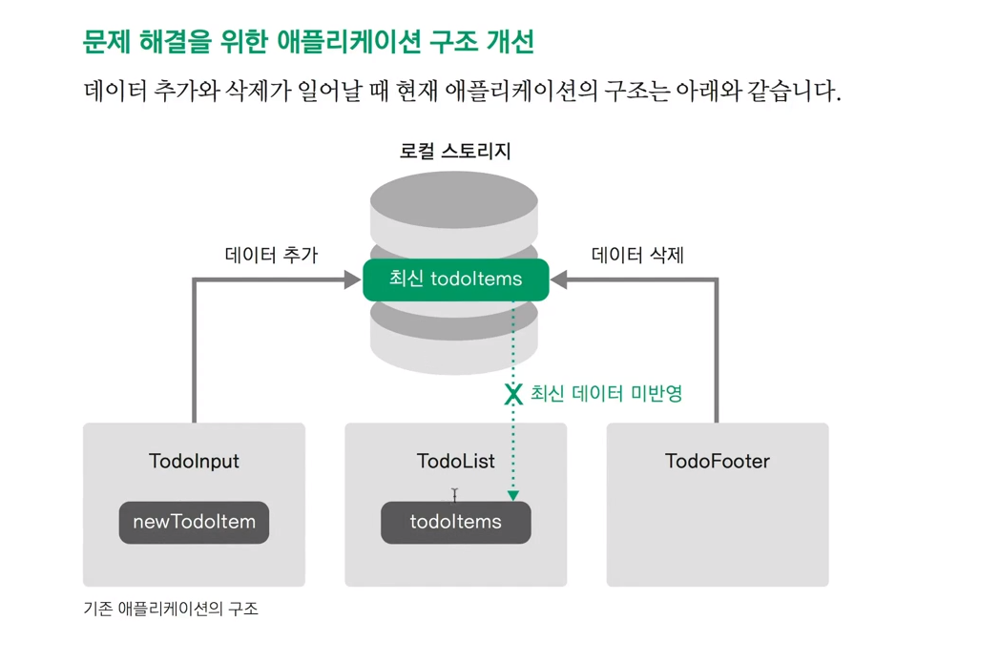

위와같은 방법은 여러 불편함이 있어서 아래와 같은 구조로 만들거다..

이렇게 하면 data들을 app에서 관리하게됨(props,emit을 통에 data전달)

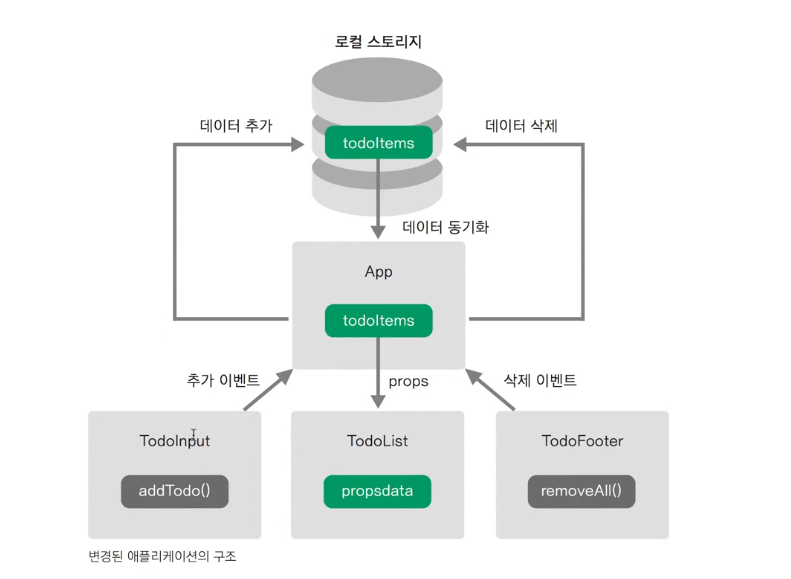

## Todo Refactoring

- App.vue

> Data는 App.vue에서 한번에 처리하는 것이 추적이 쉽고, 꼬이지 않는다.
>
> 한 컴포넌트에서 data를 관리하고 나머지 컴포넌트에선 요청으로 받음

```vue
<template>
  <div id="app">
    <TodoHeader></TodoHeader>
    <!-- 하위컴포넌트에서 addItem이라는 이벤트가 발생하면 현재컴포넌트의 메소드 addOneItem이 실행됨 -->
    <TodoInput v-on:addItem="addOneItem"></TodoInput>
    <!-- App에서 propsdata라는 이름으로 todoItems data를 보냄 -->
    <!-- removeItem 이벤트가 발생하면 removeOneItem 메소드 실행 -->
    <TodoList v-bind:propsdata="todoItems" v-on:removeItem="removeOneItem" v-on:toggleItem="toggleOneItem"></TodoList>
    <!-- clearAll 이벤트가 발생하면 clearAllItems 메소드 실행 -->
    <TodoFooter v-on:clearAll="clearAllItems"></TodoFooter>
  </div>
</template>

<script>
import TodoHeader from './components/TodoHeader.vue'
import TodoInput from './components/TodoInput.vue'
import TodoList from './components/TodoList.vue'
import TodoFooter from './components/TodoFooter.vue'

export default {
  data: function() {
    return {
      todoItems: []
    }
  },
  methods: {
    // 하위컴포넌트 TodoInput에서 보내준 인자 newTodoitem이 todoItem인자로 들어감
    addOneItem: function(todoItem) {
      // todoItem을 localStorage에 저장
      var obj = {completed: false, item: todoItem};
      localStorage.setItem(todoItem, JSON.stringify(obj));
      // localStorage에 목록과 화면을 동기화시킴
      // push todoItems의 배열에 obj요소 하나를 추가함
      this.todoItems.push(obj);
    },
    // TodoList에서 보낸 todoitem과 index를 인자로 받고 
    removeOneItem: function(todoItem, index) {
    // index로 todoITems배열[index]한개를 없앰
      this.todoItems.splice(index, 1);
      // todoItem.item문자열(키값과 같음) 그걸로 접근해서 지움 
      localStorage.removeItem(todoItem.item);
    },
    toggleOneItem: function(todoItem, index) {
      // completed true/false를 toggle한뒤, localStorage는 수정이 없기때문에 삭제하고 다시 바꾼 값으로 추가함
      // 이렇게 app에서 하위로 data내리고 하위에서 다시 todoitem을 올려서 바꾸는것은 좋지 않은 패턴,
      // todoItem.completed = !todoItem.completed;
      // 이렇게 index로 접근을 해서 그 값을 토글해주는 것이 더 좋다.
      this.todoItems[index].completed = !this.todoItems[index].completed;
      localStorage.removeItem(todoItem.item);
      localStorage.setItem(todoItem.item, JSON.stringify(todoItem));
    },
    // localStoarge를 비우고, todoItems를 리셋시킴
    clearAllItems: function() {
      this.todoItems = [];
      localStorage.clear();
    }
  },
  // App.vue의 컴포넌트가 생성되면 localStorage에서 data를 가져옴
  created: function() {
    if (localStorage.length > 0) {
      for (var i = 0; i < localStorage.length; i++) {
        if (localStorage.key(i) !== 'loglevel:webpack-dev-server') {
          this.todoItems.push(JSON.parse(localStorage.getItem(localStorage.key(i))));
        }
      }
    }
  },
  components: {
    TodoHeader: TodoHeader,
    TodoInput: TodoInput,
    TodoList: TodoList,
    TodoFooter: TodoFooter
  }  
}
</script>

<style>
body {
  text-align: center;
  background-color: #F6F6F8;
}
input {
  border-style: groove;
  width: 200px;
}
button {
  border-style: groove;
}
.shadow {
  box-shadow: 5px 10px 10px rgba(0, 0, 0, 0.03)
}
</style>

```


- TodoInput.vue

```vue
<template>
  <div class="inputBox shadow">
    <input type="text" v-model="newTodoItem">
    <span class="addContainer" v-on:click="addTodo">
      <i class="addBtn fas fa-plus" aria-hidden="true"></i>
    </span>
  </div>
</template>

<script>
export default {
  data: function() {
    return {
      newTodoItem: ''
    }
  },
  methods: {
    addTodo: function() {
      if (this.newTodoItem !== '') {
        // 부모한테 이벤트 이름 addItem으로 this.newTodoItem을 인자로 보냄
        this.$emit('addItem', this.newTodoItem);
        // newTodoItem을 다시 빈칸으로 리셋시키는 메소드실행
        this.clearInput();
      }
    },
    clearInput: function() {
      this.newTodoItem = '';
    }
  }
}
</script>

<style scoped>
input:focus {
  outline: none;
}
.inputBox {
  background: white;
  height: 50px;
  line-height: 50px;
  border-radius: 5px;
}
.inputBox input {
  border-style: none;
  font-size: 0.9rem;
}
.addContainer {
  float: right;
  background: linear-gradient(to right, #6478FB, #8763FB);
  display: block;
  width: 3rem;
  border-radius: 0 5px 5px 0;
}
.addBtn {
  color: white;
  vertical-align: middle;
}
</style>

```

- Todolist.vue

```vue
<template>
  <section>
    <ul>
      <li v-for="(todoItem, index) in propsdata" class="shadow" v-bind:key="todoItem.item">
        <i class="checkBtn fas fa-check" v-bind:class="{checkBtnCompleted: todoItem.completed}" v-on:click="toggleComplete(todoItem, index)"></i>
        <span v-bind:class="{textCompleted: todoItem.completed}">{{ todoItem.item }}</span>
        <span class="removeBtn" v-on:click="removeTodo(todoItem, index)">
          <i class="removeBtn fas fa-trash-alt"></i>
        </span>
      </li>
    </ul>
  </section>
</template>

<script>
export default {
  // App에서 보낸 데이터를 props로 받음('propsdata'이름으로)
  props: ['propsdata'],
  methods: {
    removeTodo: function(todoItem, index) {
      this.$emit('removeItem', todoItem, index);
    },
    toggleComplete: function(todoItem, index) {
      this.$emit('toggleItem', todoItem, index); 
    }
  }
}
</script>

<style scoped>
ul {
  list-style-type: none;
  padding-left: 0px;
  margin-top: 0;
  text-align: left;
}
li {
  display: flex;
  min-height: 50px;
  height: 50px;
  line-height: 50px;
  margin: 0.5rem 0;
  padding: 0 0.9rem;
  background: white;
  border-radius: 5px;
}
.checkBtn {
  line-height: 45px;
  color: #62acde;
  margin-right: 5px;
}
.checkBtnCompleted {
  color: #b3adad;
}
.textCompleted {
  text-decoration: line-through;
  color: #b3adad;
}
.removeBtn {
  margin-left: auto;
  color: #de4343;
}
</style>

```

- TodoFooter.vue

```vue
<template>
  <div class="clearAllContainer">
    <span class="clearAllBtn" v-on:click="clearTodo">Clear All</span>
  </div>
</template>

<script>
export default {
  methods: {
    // 버튼 클릭하면 clearAll이란 이벤트만 app으로 보냄
    clearTodo: function() { 
      this.$emit('clearAll');
    }
  }
}
</script>

<style scoped>
.clearAllContainer {
  width: 8.5rem;
  height: 50px;
  line-height: 50px;
  background-color: white;
  border-radius: 5px;
  margin: 0 auto;
}
.clearAllBtn {
  color: #e20303;
  display: block;
}
</style>

```


### Vue modal 컴포넌트, slot

> [모달컴포넌트](https://kr.vuejs.org/v2/examples/modal.html)

- components > common > Modal.vue

```vue
<template>
<!-- 모달을 html, css가져와서 복붙, TodoInput의 하위컴포넌트로 넣음 -->
  <transition name="modal">
    <div class="modal-mask">
      <div class="modal-wrapper">
        <div class="modal-container">
            <!-- 모달헤더 인데 이것을 input컴포넌트에서 각부분을 재정의할 수 있다 -->
          <div class="modal-header">
            <slot name="header">
              default header
            </slot>
          </div>
    <!-- 모달바디 -->
          <div class="modal-body">
            <slot name="body">
              default body
            </slot>
          </div>
        </div>
      </div>
    </div>
  </transition>
</template>

<style>
.modal-mask {
  position: fixed;
  z-index: 9998;
  top: 0;
  left: 0;
  width: 100%;
  height: 100%;
  background-color: rgba(0, 0, 0, .5);
  display: table;
  transition: opacity .3s ease;
}

.modal-wrapper {
  display: table-cell;
  vertical-align: middle;
}

.modal-container {
  width: 300px;
  margin: 0px auto;
  padding: 20px 30px;
  background-color: #fff;
  border-radius: 2px;
  box-shadow: 0 2px 8px rgba(0, 0, 0, .33);
  transition: all .3s ease;
  font-family: Helvetica, Arial, sans-serif;
}

.modal-header h3 {
  margin-top: 0;
  color: #42b983;
}

.modal-body {
  margin: 20px 0;
}

.modal-default-button {
  float: right;
}

/*
 * The following styles are auto-applied to elements with
 * transition="modal" when their visibility is toggled
 * by Vue.js.
 *
 * You can easily play with the modal transition by editing
 * these styles.
 */


.modal-enter {
  opacity: 0;
}

.modal-leave-active {
  opacity: 0;
}

.modal-enter .modal-container,
.modal-leave-active .modal-container {
  -webkit-transform: scale(1.1);
  transform: scale(1.1);
}
</style>

```

- TodoInput.vue

> `slot` 은 Modal.vue에서 `slot name`으로 지정한 값으로 `TodoInput`에서 `sloat="sloat이름"`을 통해 값을 정해줄 수 있다

```vue
<template>
  <div class="inputBox shadow">
    <input type="text" v-model="newTodoItem" @keyup.enter="addTodo">
    <span class="addContainer" v-on:click="addTodo">
      <i class="addBtn fas fa-plus" aria-hidden="true"></i>
    </span>
    <!-- 사용할 모달을 홈페이지에서 복붙해서 가져옴 ,모달컴포넌트를 등록함 -->
    <!-- showModal이 True일때 보여줌 -->
    <Modal v-if="showModal" @close="showModal = false">
      <!-- slot은 특정부분의 일부 ui를 재정의할 수 있다, modal컴포넌트에 정의된 slot이름으로 해당 부분을 재정의할 수 있다는 말 -->
      <h3 slot="header">
        경고 
        <i class="closeModalBtn fa fa-times" 
          aria-hidden="true" 
          @click="showModal = false">
        </i>
      </h3>
      <p slot="body">할 일을 입력하세요.</p>
    </Modal>
  </div>
</template>

<script>
import Modal from './common/Modal.vue'

export default {
  data: function() {
    return {
      newTodoItem: '',
      showModal: false
    }
  },
  methods: {
    addTodo: function() {
      if (this.newTodoItem !== '') {
        const item = this.newTodoItem.trim();
        //this.$emit('addItem', item);
        this.$store.commit('addOneItem', item);
        this.clearInput();
      } else {
        this.showModal = !this.showModal;
      }
    },
    clearInput: function() {
      this.newTodoItem = '';
    }
  },
  // 모달컴포넌트를 하위로 등록
  components: {
    Modal: Modal
  }
}
</script>

<style scoped>
input:focus {
  outline: none;
}
.inputBox {
  background: white;
  height: 50px;
  line-height: 50px;
  border-radius: 5px;
}
.inputBox input {
  border-style: none;
  font-size: 0.9rem;
}
.addContainer {
  float: right;
  background: linear-gradient(to right, #6478FB, #8763FB);
  display: block;
  width: 3rem;
  border-radius: 0 5px 5px 0;
}
.addBtn {
  color: white;
  vertical-align: middle;
}
.closeModalBtn {
  color: #42b983;
}
</style>

```


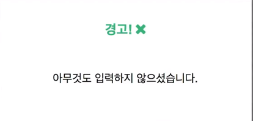

### (참고) vue transitions

> [뷰트랜지션](https://vuejs.org/v2/guide/transitions.html)
>
> 애니메이션을 넣어서 좀더 사용자가 보기 좋게 만들어줌

**트랜지션 클래스**

1. 진입 / 진출 트랜지션에는 네가지 클래스가 적용됨
   1. `v-enter`: enter의 시작 상태. 엘리먼트가 삽입되기 전에 적용되고 한 프레임 후에 제거된다.
   2. `v-enter-active`: enter에 대한 활성 및 종료 상태. 엘리먼트가 삽입되기 전에 적용된다. 트랜지션 / 애니메이션이 완료되면 제거된다.
   3. `v-enter-to`: **2.1.8 이상 버전에서 지원한다.** 진입 상태의 끝에서 실행된다. 엘리먼트가 삽입된 후 (동시에 `v-enter`가 제거됨), 트랜지션/애니메이션이 끝나면 제거되는 하나의 프레임을 추가했다.
   4. `v-leave`: leave를 위한 시작 상태. 진출 트랜지션이 트리거 될 때 적용되고 한 프레임 후에 제거된다.
   5. `v-leave-active`: leave에 대한 활성 및 종료 상태. 진출 트랜지션이 트리거되면 적용되고 트랜지션 / 애니메이션이 완료되면 제거된다.
   6. `v-leave-to`: **2.1.8 이상 버전에서 지원한다.** 진출 상태의 끝에서 실행된다. 진출 트랜지션이 트리거되고 (동시에 `v-leave`가 제거됨), 트랜지션/애니메이션이 끝나면 제거되는 하나의 프레임을 추가했다.

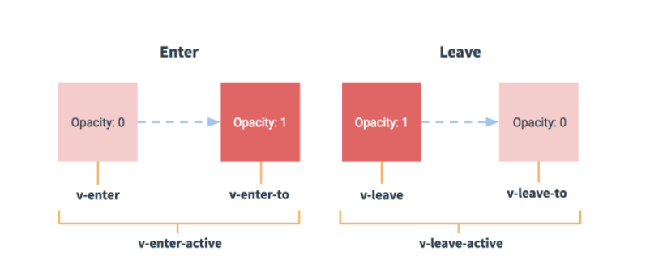

각 클래스에는 트랜지션 이름이 접두어로 붙는다. 여기서`v-`접두어는 이름없이 `<transition>` 엘리먼트를 사용할 때의 기본값이다. 예를 들어`<transition name = "my-transition">`을 사용하면`v-enter` 클래스는 `my-transition-enter` 가 된다.

일반적으로 `v-enter-to`와 `v-leave`는 같이씀

`v-enter-active` 와`v-leave-active` 는 입/출력 트랜지션을 위한 다른 easing curve를 지정할 수있는 기능을 제공한다.

- Todolist.vue

```vue
<template>
  <section>
    <!-- transition-group안에 트랜지션 효과가 들어가고 html 태그는 ul이다 -->
    <!-- name="list"는 css클래스(transition class)와 관련돼있다 아래의 style에서 보면 .list트랜지션에 관련된 코드가 있음 -->
    <transition-group name="list" tag="ul">
      <li v-for="(todoItem, index) in this.$store.state.todoItems" class="shadow" v-bind:key="todoItem.item">
        <i class="checkBtn fas fa-check" v-bind:class="{checkBtnCompleted: todoItem.completed}" v-on:click="toggleComplete(todoItem, index)"></i>
        <span v-bind:class="{textCompleted: todoItem.completed}">{{ todoItem.item }}</span>
        <span class="removeBtn" v-on:click="removeTodo(todoItem, index)">
          <i class="removeBtn fas fa-trash-alt"></i>
        </span>
      </li>
    </transition-group>
  </section>
</template>

<script>
...
</script>

<style scoped>
...
/* transition css */
.list-enter-active, .list-leave-active {
  transition: all 1s;
}
.list-enter, .list-leave-to /* .list-leave-active below version 2.1.8 */ {
  opacity: 0;
  /* Y축으로 살짝 빠짐 */
  transform: translateY(30px);
}
</style>

```


## ES6란?

- ECMAScript 2015와 동일한 용어
- 2015년은 ES5(2009년)이래로 진행한 첫 메이저 업데이트가 승인된 해
- 최신 Front-End Framework인 React,Angular,Vue에서 권고하는 언어 형식
- ES5에 비해 문법이 간결해져서 익숙해지면 코딩을 훨씬 편하게 할 수 있음


### Babel

> [Babel](https://babeljs.io/)

- 구버전 브라우저 중에서는 ES6의 기능을 지원하지 않는 브라우저가 있으므로 transpiling이 필요
- ES6의 문법을 각 브라우저의 호환 가능한 ES5로 변환하는 컴파일러


### const & let 새로운 변수 선언 방식

- 블록 단위 `{}`로 변수의 범위가 제한되었음

- `const` : 한번 선언한 값에 대해서 변경할 수 없음(상수개념)

- `let` : 한번 선언한 값에 대해서 다시 선언할 수 없음

  

### ES5특징 변수의 Scopte

- 기존 자바스크립트(ES5)는 `{}`에 상관없이 스코프가 설정됨

```js
var sum = 0;
for (var i=1; i<=5; i++) {
    sum = sum+i;
}
console.log(sum); //15
console.log(i) //6
```

### ES6특징 `{}`단위로 변수의 범위가 제한됨

```js
let sum = 0;
for (let i = 1; i <= 5; i++) {
    sum = sum + i;
}
console.log(sum); //10
console.log(i); // Uncaught ReferenceError: i is not defined
```


### ES6-`const`로 지정한 값 변경 불가능 But, 객체나 배열의 내부는 변경 가능

```js
const a = 10;
a = 20; // Uncaught TypeError: Assignment to constant variable

const b = {};
b.num = 10;
console.log(b); // {num:10}

const b = [];
b.push(20);
console.log(b); // [20]
```


### ES6-const,let

```js
function f(){
    {
        let x;
        {
            //새로운 블록안에 새로운 x의 스코프가 생김
            const x = "sneaky";
            x = "foo"; // 위에 이미 const로 x를 선언했으므로 다시 값을 할당하면 에러발생
        }
        //이전 블록 범위로 들어왔기 때문에 'let x'에 해당하는 메모리에 값을 대입
        x = "bar";
        let x = "inner"; //Uncaught SyntaxError:Ientifier 'x' has already been delclared
    }
}
```


### ES5특징 - Hoisting

- Hoisting이란 선언한 함수와 변수를 가장 상단에 있는 것처럼 인식한다
- js 해석기는 코드의 라인 순서와 관계 없이 **함수선언식**(함수 표현식은 적용안됨)과 변수를 위한 메모리 공간을 먼저 확보한다.
- 따라서, `function a()`와 `var`는 코드의 최상단으로 끌어 올려진 것(hoisted)처럼 보인다.

```js
function willBeOveridden(){
    return 10;
}
willBeOveridden(); //5
function willBeOveridden() {
    return 5;
}
```

함수 선언식(function statement)은 hoisting이 되지만 함수표현식(function expression)은 적용안됨

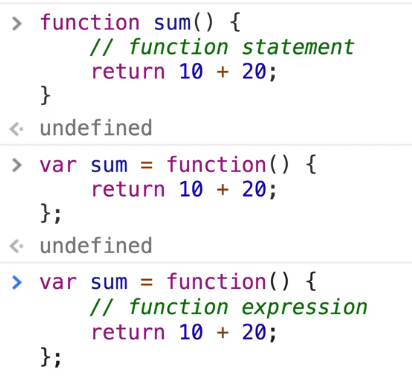


### 이전까지 썼던 코드 변수는 var -> const로 고치고 for문에 돌렸던 var -> let으로 고침!

> WHY ? 
>
> 변수는 다시 재할당 안되게 const로 바꿈
>
> 하지만 for문은 i값이 계속 달라져야 되기 때문에 let으로 바꿈!


### Arrow Function:화살표 함수

- 함수를 정의할 때 `function`이라는 키워드를 사용하지 않고, `=>`로 대체
- 흔히 사용하는 `콜백 함수`의 문법을 간결화
- 콜백함수 안에 들어가는 함수는  scope가 다름!, 콜백함수 안은 window객체를 바라보고있음, 이럴때 화살표함수를 이용하면 scope를 다시 연결할 수 있음

> ajax, axios,forEach를 쓸 떄 화살표함수를 많이 씀

```js
//ES5함수 정의 방식
var sum = function(a,b) {
  return  a+b;
};

var arr = [1,2,3];
arr.forEach(function(value) {
    console.log(value); // 1,2,3
});

//ES6 함수 정의 방식
var sum = (a,b) => {
    return a+b;
}
var arr = [1,2,3];
arr.forEach(value=>console.log(value)); // 1,2,3

sum(10,20);
```

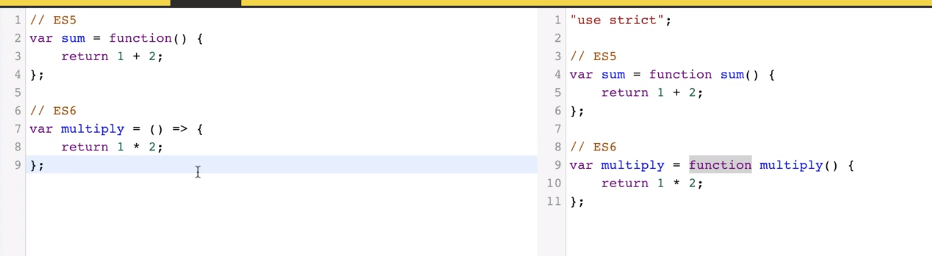


### Enhanced Object Literals : 향상된 객체 리터럴

- 객체의 속성을 메서드로 사용할 때 `function`예약어를 생략하고 생성 가능

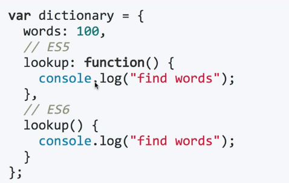


- 아래와 같이 축약할 수 있다 (`App.vue`)

```js
data() {
    return {
      todoItems: []
    }
  },
  methods: {
    addOneItem(todoItem) {
      const obj = {completed: false, item: todoItem};
      localStorage.setItem(todoItem, JSON.stringify(obj));
      this.todoItems.push(obj);
    },
    removeOneItem(todoItem, index) {
      this.todoItems.splice(index, 1);
      localStorage.removeItem(todoItem.item);
    },
    toggleOneItem(todoItem, index) {
      todoItem.completed = !todoItem.completed;
      localStorage.removeItem(todoItem.item);
      localStorage.setItem(todoItem.item, JSON.stringify(todoItem));
    },
    clearAllItems() {
      this.todoItems = [];
      localStorage.clear();
    }
  },
  created() {
    if (localStorage.length > 0) {
      for (let i = 0; i < localStorage.length; i++) {
        if (localStorage.key(i) !== 'loglevel:webpack-dev-server') {
          this.todoItems.push(JSON.parse(localStorage.getItem(localStorage.key(i))));
        }
      }
    }
  },
```

- 객체의 속성명과 값 명이 동일할 때 아래와 같이 축약 가능

```js
var figures = 10;
var dictionary = {
    //figures:figures,
    figsures
};
```

- App.vue의 컴포넌트를 지정할 떄 아래와 같이 바꿀 수 있다.

```js
components: {
    // 컴포넌트의 태그 이름과 컴포넌트의 내용이 같기 때문에 하나로 축약 가능!
    TodoHeader,
    TodoInput,
    TodoList,
    TodoFooter
  }
```


### Modules:자바스크립트 모듈화 방법

> 모듈화  : 재사용성이 좋은것을 묶어서 필요할때마다 가져다 쓰기위해 만듦!

- 자바스크립트 모듈 로더 라이브러리(AMD. Common JS)기능을 js언어 자체에서 지원
- 호출되기 전까지는 코드 실행과 동작을 하지 않는 특징이 있음

```js
// libs/math.js
export function sum(x,y) {
    return x+y;
}
export var pi = 3.141593;

//main.js
import {sum} from 'libs/math.js';
sum(1,2);
```

- Vue.js에서 마주칠 `default` export

> 한개의 파일에서 한번만 export됨, 모듈화를 한다고 생각하면 됨

```js
//util.js
export default function(x) {
    return console.log(x);
}

//main.js
import util from `util.js`;
console.log(util); //function(x) { return console.log(x); }
util("hi");

//app.js
import log from 'util.js';
console.log(log);
log("hi");
```


## Vuex_상태 관리 라이브러리

> 복잡한 애플리케이션의 컴포넌트들을 효율적으로 관리하는 Vuex라이브러리
>
> Flux + reactivity를 합침
>
> state : data, getters : computed, mutations: methods, actions:비동기 라고 생각하면 됨

### Vuex ?

- 무수히 많은 컴포넌트의 데이터를 관리하기 위한 상태관리 패턴이자 라이브러리
- React의 Flux 패턴에서 기인함
- Vue.js 중고급 개발자로 성장하기 위한 필수 관문

### Flux ?(단방향!!)

- MVC패턴의 복잡한 데이터 흐름 문제를 해결하는 개발 패턴 _ ***Unidirectional data flow***

> 한방향으로 움직임!
>
> 뷰가 액션을 호출하고 ->  액션 -> dispatcher 모델변경하기위한 메서드 실행 -> 모델 -> 뷰 이렇게 한방향!

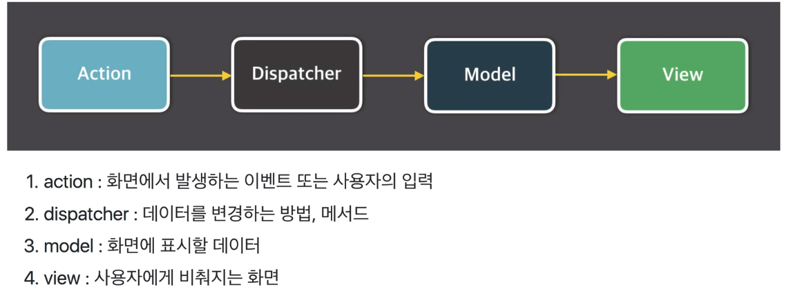

### MVC 패턴 VS Flux패턴

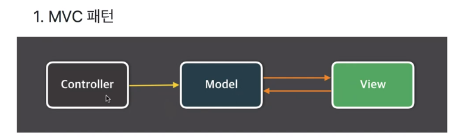

> 뷰 : 화면
>
> 모델 : 데이터가 담김
>
> controller :  모델과 뷰 대화하는 역할, 데이터 처리가 많은 방향으로 일어남

#### MVC 패턴의 문제점

- 기능 추가 및 변경에 따라 생기는 문제점을 예측할 수 없은 예) 페이스북 채팅 화면
- 앱이 복잡해지면서 생기는 업데이트 루프

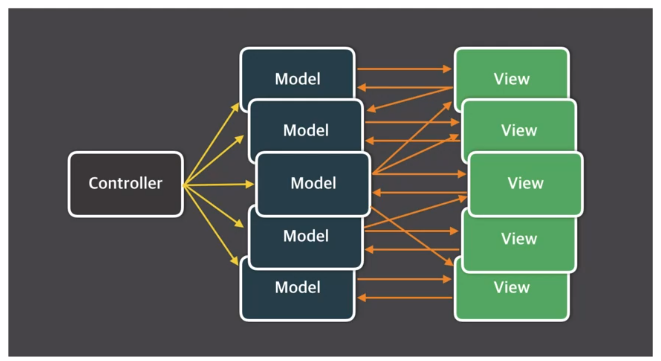

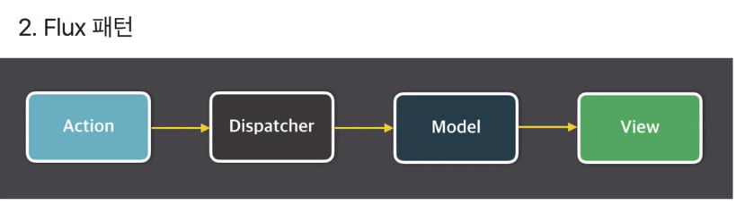

> 단방향!  안정성이 있음
>
> 액션 발생해서 dispatcher동작 이게 store(model)을 바꾸고, store에 의해 뷰(화면)가 갱신
>
> 화면에서 또 사용자가 입력을 하면 액션이 흘러감! 이러한 로직의 반복!

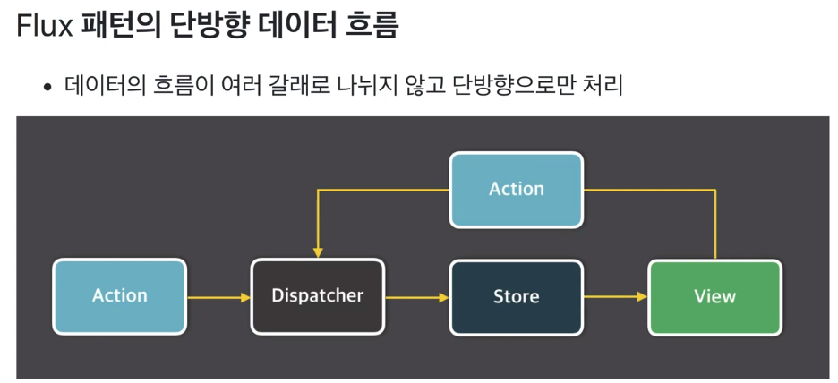


### Vuex가 왜 필요할까?

- 복잡한 애플리케이션에서 컴포넌트의 개수가 많아지면 컴포넌트간에 데이터 전달이 어려워진다.


#### 이것을 이벤트 버스로 해결?

- 어디서 이벤트를 보냈는지 혹은 어디서 이벤트를 받았는지 알기 어려움
- 컴포넌트 간 데이터 전달이 명시적이지 않음

```js
// Login.vue
eventBus.$emit('fetch',loginInfo);

// List.vue
eventBus.$on('display', data => this.displayOnScreen(data));

// Chart.vue
eventBus.$emit('refreshData', chartData);
```

#### Vuex로 해결할 수 있는 문제

1. MVC패턴에서 발생하는 구조적 오류
2. 컴포넌트 간 데이터 전달 명시
3. 여러 개의 컴포넌트에서 같은 데이터를 업데이트 할 때 동기화 문제

### Vuex 컨셉

- `State` : 컴포넌트 간에 공유하는 데이터 `data()`

> 여러 컴포넌트에서 사용하는 data property라고 생각하면됨

- `View` : 데이터를 표시하는 화면 `template`
- `Action` : 사용자의 입력에 따라 데이터를 변경하는 `methods`
- 단방향 데이터 흐름 처리를 단순하게 도식화한 그림

> 화면(template)에서 버튼을 클릭 -> 버튼이 액션을 발생시킴-> 그 액션이 data를 변경함 -> 그 변경한 data를 화면에 갱신

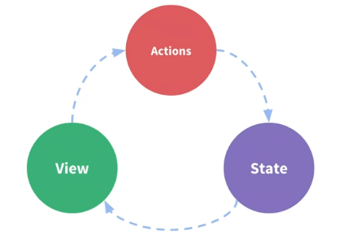

### Vuex 구조

> 아래의 링크 들어가서 기본적인 이론들 공부하기!
>
> [1탄 - 자바스크립트 비동기 처리와 콜백 함수](https://joshua1988.github.io/web-development/javascript/javascript-asynchronous-operation/)
>
> [2탄 - 자바스크립트 Promise 쉽게 이해하기](https://joshua1988.github.io/web-development/javascript/promise-for-beginners/)
>
> [3탄 - 자바스크립트 async와 await](https://joshua1988.github.io/web-development/javascript/js-async-await/)
>
> 컴포넌트 -> 비동기로직 -> 동기로직 -> 상태
>
> 컴포넌트에서 -> 액션(비동기로직:setTimeout, apicall...등) 은 data를 바꾸지 않음(액션은 데이터를 바꿀수 있는 mutation을 콜) -> mutations(동기, 메서드)에서만 state를 바꿀 수 있음!


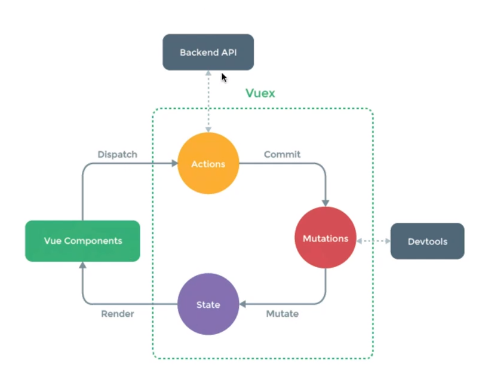

### Vuex 설치

```sh
npm i vuex --save
```

- src폴더 밑에  `store`라는 폴더를 만들고 그 아래에 `store.js` 파일 생성

```js
// 코어라이브러리를 가져옴
import Vue from 'vue'
import Vuex from 'vuex'
// use는 vue의 플러그인 기능, 뷰를 사용할때 전역으로 모든 영역에 특정기능을 추가하고 싶을때 사용
// global기능을 추가하고싶을때 사용함 
Vue.use(Vuex);
// export로 const를 하는 순간 store라는 변수를 밖에서 import 하면 쓸 수 있음 -> `main.js` import { store } from './store/store.js'

export const store = new Vuex.Store({
	// 다른 컴포넌트에서 `$store`로 쓰일 수 있다.
});

```

- main.js

```python
import Vue from 'vue'
import App from './App.vue'
// store에 있는 store.js의 stor 변수를 가져옴
import { store } from './store/store.js'

new Vue({
  el: '#app',
  // 변수 등록 store:store,(축약형)
  store,
  render: h => h(App)
})
```

### Vuex 기술 요소

- state : 여러 컴포넌트에 공유되는 데이터 `data`
- getters: 연산된 state값을 접근하는 속성 `computed`
- mutations : state 값을 변경하는 이벤트 로직, 메서드 `methods`
- actions : 비동기 처리 로직을 선언하는 메서드 `aysnc methods`

#### state란?

- 여러 컴포넌트간에 공유할 데이터- 상태

```js
// Vue
data : {
message: 'Hello Vue.js!'
}

//Vuex
state:{
message:'Hello Vue.js!'
}
```

```html
<!--template-->
<!--Vue-->
<p>
    {{message}}
</p>
<!--Vuex-->
<p>
    {{this.$store.state.message}}
</p>
```


#### getters란?

- state값을 접근하는 속성이자 `computed()`처럼 미리 연산된 값을 접근하는 속성

```js
//store.js
state :{
    num:10
},
getters :{
    getNumber(state) {
        return state.num;
    },
     doubleNumber(state){
         return state.num*2;
     }
}
```

```html
<p>
    <!--10-->
    {{this.$store.getters.getNumber}} 
    <!--20-->
    {{this.$store.getters.doubleNumber}}
</p>
```


#### mutations란?

- state의 값을 변경할 수 있는 **유일한 방법**이자 메서드
- mutation은 `commit()`으로 동작시킨다.

```js
//store.js
state : {num:10},
mutations : {
    printNumber(state) {
        return state.num
    },
    sumNumber(state,anotherNum) {
        return state.num + anotherNum;
    }
}

//App.vue
//commit으로 mutattions에 있는 메서드명을 실행시킴
this.$store.commit('printNumbers'); // 10
this.$store.commit('sumNumbers',20); // 30
```

##### mutations의 commit()형식

- state를 변경하기 위해 mutations를 동작시킬때 인자(payload)를 전달할 수 있음

```js
//store.js
state:{storeNum : 10},
mutations : {
    modifyState(state,payload) {
        console.log(payload.str); // 'passed from payload'
        return state.storeNum += payload.num; //30
    }
}

//App.vue
this.$store.commit('modifyState',{
    str:'passed from payload',
    num:20
});
```


### Todo를 Vuex로 리펙토링

- store.js

```js
// 코어라이브러리를 가져옴
import Vue from 'vue'
import Vuex from 'vuex'
// use는 vue의 플러그인 기능, 뷰를 사용할때 전역으로 모든 영역에 특정기능을 추가하고 싶을때 사용
// global기능을 추가하고싶을때 사용함 
Vue.use(Vuex);
// localStorage를 불러오는걸 여기 적을거야
	// fetch하면 localStorage에 들어있는 item을 arr안에 담아주고 그것을 반환해줌
const storage = {
	fetch() {
		const arr = [];
		if (localStorage.length > 0) {
      for (let i = 0; i < localStorage.length; i++) {
        if (localStorage.key(i) !== 'loglevel:webpack-dev-server') {
          arr.push(JSON.parse(localStorage.getItem(localStorage.key(i))));
        }
      }
    }
		return arr;
	}
}

// export로 const를 하는 순간 store라는 변수를 밖에서 import 하면 쓸 수 있음 -> `main.js` import { store } from './store/store.js'
	// 다른 컴포넌트에서 `$store`로 쓰일 수 있다.
export const store = new Vuex.Store({
	state: {
		todoItems: storage.fetch()
	},
	getters: {
		getTodoItems(state) {
			return state.todoItems;
		}
	},
	mutations: {
		addOneItem(state, todoItem) {
			const obj = {completed: false, item: todoItem};
			localStorage.setItem(todoItem, JSON.stringify(obj));
			// data에 접근하기 위해서는 this가 아니라 state로 접근!!
			state.todoItems.push(obj);
		},
		removeOneItem(state, payload) {
			state.todoItems.splice(payload.index, 1);
      localStorage.removeItem(payload.todoItem.item);
		},
		toggleOneItem(state, payload) {
			state.todoItems[payload.index].completed = !state.todoItems[payload.index].completed;
      localStorage.removeItem(payload.todoItem.item);
      localStorage.setItem(payload.todoItem.item, JSON.stringify(payload.todoItem));
		},
		clearAllItems(state) {
			state.todoItems = [];
			localStorage.clear();
		}
	}
});

```

- main.js

```js
import Vue from 'vue'
import App from './App.vue'
// store에 있는 store.js의 stor 변수를 가져옴
import { store } from './store/store.js'

new Vue({
  el: '#app',
  // 변수 등록 store:store,(축약형)
  store,
  render: h => h(App)
})

```

- App.vue

```vue
<template>
  <div id="app">
    <!-- store에서 data를 관리하기 때문에 emit, props할필요가 없어져서 다 지움 -->
    <TodoHeader></TodoHeader>
    <TodoInput></TodoInput>
    <TodoList></TodoList>
    <TodoFooter></TodoFooter>
  </div>
</template>

<script>
import TodoHeader from './components/TodoHeader.vue'
import TodoInput from './components/TodoInput.vue'
import TodoList from './components/TodoList.vue'
import TodoFooter from './components/TodoFooter.vue'

export default {
  components: {
    TodoHeader,
    TodoInput,
    TodoList,
    TodoFooter
  }
}
</script>


```

- TodoInput.vue

```vue
<template>
  <div class="inputBox shadow">
    <input type="text" v-model="newTodoItem" @keyup.enter="addTodo">
    <span class="addContainer" v-on:click="addTodo">
      <i class="addBtn fas fa-plus" aria-hidden="true"></i>
    </span>

    <Modal v-if="showModal" @close="showModal = false">
      <h3 slot="header">
        경고
        <i class="closeModalBtn fa fa-times"
          aria-hidden="true"
          @click="showModal = false">
        </i>
      </h3>
      <p slot="body">할 일을 입력하세요.</p>
    </Modal>
  </div>
</template>

<script>
import Modal from './common/Modal.vue'

export default {
  data() {
    return {
      newTodoItem: '',
      showModal: false
    }
  },
  methods: {
    addTodo() {
      if (this.newTodoItem !== '') {
        // trim()은 입력된 값의 앞 뒤 공백을 없애줌
        const item = this.newTodoItem.trim();
        // commit을 하면 store.js에 있는 mutation을 실행시키기 위해서!
        this.$store.commit('addOneItem', item);
        this.clearInput();
      } else {
        this.showModal = !this.showModal;
      }
    },
    clearInput() {
      this.newTodoItem = '';
    }
  },
  components: {
    Modal
  }
}
</script>


```

- TodoList.vue

```vue
<template>
  <section>
    <transition-group name="list" tag="ul">
      <li v-for="(todoItem, index) in this.storedTodoItems" class="shadow" v-bind:key="todoItem.item">
        <i class="checkBtn fas fa-check" v-bind:class="{checkBtnCompleted: todoItem.completed}" v-on:click="toggleComplete(todoItem, index)"></i>
        <span v-bind:class="{textCompleted: todoItem.completed}">{{ todoItem.item }}</span>
        <span class="removeBtn" v-on:click="removeTodo(todoItem, index)">
          <i class="removeBtn fas fa-trash-alt"></i>
        </span>
      </li>
    </transition-group>
  </section>
</template>

<script>
export default {
  methods: {
    removeTodo(todoItem, index) {
      this.$store.commit('removeOneItem', {todoItem, index});
    },
    toggleComplete(todoItem, index) {
      this.$store.commit('toggleOneItem', {todoItem, index});
    }
  },
  computed: {
    storedTodoItems() {
      // return this.$store.state.todoItems;
      return this.$store.getters.getTodoItems;
    }
  }
}
</script>

```

- TodoFooter.vue

```vue
<template>
  <div class="clearAllContainer">
    <span class="clearAllBtn" v-on:click="clearTodo">Clear All</span>
  </div>
</template>

<script>
export default {
  methods: {
    clearTodo() {
      this.$store.commit('clearAllItems');
    }
  }
}
</script>

```


#### state는 왜 직접 변경하지 않고 mutations로 변경할까?

- 여러 개의 컴포넌트에서 아래와 같이 state 값을 변경하는 경우 **어느 컴포넌트에서 해당 state를 변경했는지 추적하기가 어렵다**

```js
methods:{
    increaseCounter(){this.$store.state.counter++;}
}
```

- 특정 시점에 어떤 컴포넌트가 state를 접근하여 변경한건지 확인하기 어렵기 때문
- 따라서, 뷰의 반응성을 거스르지 않게 명시적으로 상태 변화를 수행. **반응성, 디버깅, 테스팅 혜택**

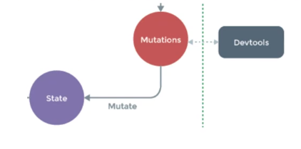

#### actions란?

- 비동기 처리 로직을 선언하는 메서드, 비동기 로직을 담당하는 `mutations`
- 데이터 요청, Promise, ES6 async과 같은 비동기처리는 모두 `actions`에 선언

```js
//store.js
state:{
    num:10
},
mutations: {
    doubleNumber(state){
        state.num*2;
    }
},
actions: {
    delayDoubleNumber(context) { // context로 store의 메서드와 속성 접금
        context.commit('doubleNumber');
    }
}

//App.vue
// dispatch를 쓰면 'delayDoubleNumber'라는 actions을 호출하고, commit을 하는데 'doubleNumber'라는 mutations를 실행시킴
this.$store.dispatch('delayDoubleNumber');
```


##### actions 비동기 코드 예제1

> incrementCounter가 실행되면 delayedAddcounter라는 액션이 호출되고 이 액션은 addCounter mutations를 2초 후에 실행시킴

```js
//store.js
mutations : {
    addCounter(state){
        state.counter++
    },
},
actions:{
    delayedAddcounter(context){
        setTimeout(()=>context.commit('addCounter'),2000);
    }
}

//App.vue
methods:{
    incrementCounter(){
        this.$store.dispatch('delayedAddCounter');
    }
}
```

##### actions 비동기 코드 예제2

> getProduct가 실행되면 dispatch로 액션에서 fetchProductData액션이 호출되고 axios가 get요청을 보내서 성공하면 response를 받아서 setData라는 mutations를 호출할때 인자(fetchData)로 넘겨주고 state.product에 그 fetchData를 담아준다

```js
//store.js
mutations : {
    setData(state,fetchedData){
        state.product = fetchedData;
    }
},
actions:{
    fetchProductData(context){
        retrun axios.get('https:domain.com/products/1')
        			.then(response => context.commit('setData',response));
    }
}


//App.vue
methods:{
    getProduct() {
        this.$store.dispatch('fetchProductData');
    }
}
```

#### 왜 비동기 처리 로직은 actions에 선언해야 할까?

- 언제 어느 컴포넌트에서 해당 state를 호출하고, 변경했는지 확인하기 어려움
- 여러 개의 컴포넌트에서 mutations로 시간 차를 두고 state를 변경하는 경우

> 결론 : state값의 변화를 추적하기 어렵기 때문에 mutations 속성에는 동기 처리 로직만 넣어야 한다.
>
> mutations에서는 동기적, actions에서는 비동기처리로직을 처리해! 비동기가 다 처리되면 무조건 mutation으로 가져와서 그 값을 처리해

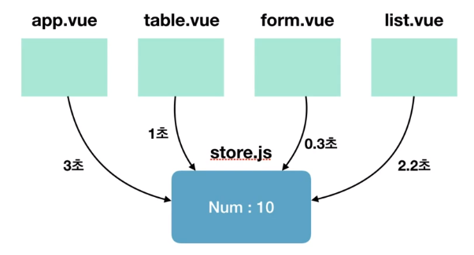

### 각 속성들을 더 쉽게 사용하는 방법 - Helper

> Store에 있는 아래 4가지 속성들을 간편하게 코딩하는 방법

- state -> mapState
- getters -> mapGetters
- mutations -> mapMutations
- actions -> mapActions


#### 헬퍼의 사용법

- 헬퍼를 사용하고자 하는 vue파일에서 아래와 같이 해당 헬퍼를 로딩

> `...`는 ES6의 Object Spread Operator 쓰는 이유?
>
> 기존에 computed나 methods에 들어있는 것을 그대로 가져오고, map헬퍼를 추가해주기 위해서 사용
>
> 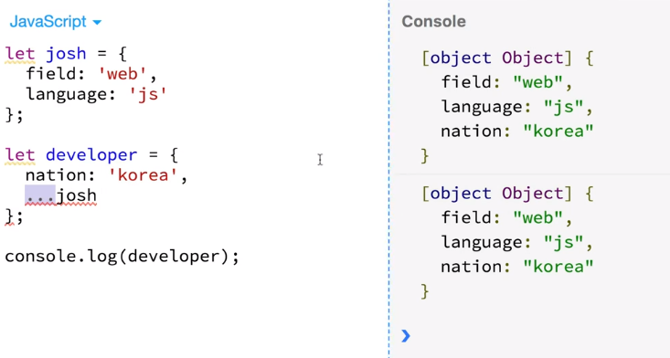
>
> ` ...mapState(['num'])`이렇게 쓰면 해당 컴포넌트의 template에서 `this.num`과같이 접근이 가능하다!
>
> state나 getters는 보통 상태 접근해서 템플릿에 표현해주는 것이라 computed과 관계있다!

```vue
//App.vue
import { mapState,mapGetters,mapMutations,mapActions } from 'vuex'
export defalut {
	computed() { ...mapState(['num']), ...mapGetters(['countedNum'])},
	methods:{...mapMutations(['clickBtn']), ...mapActions(['asyncClickBtn'])}
}
```

#### mapState

- Vuex에 선언한 state 속성을 뷰 컴포넌트에 더 쉽게 연결해주는 헬퍼

```js
//App.vue
import {mapState} from 'vuex'

computed() {
...mapState(['num'])
//num(){return this.$store.state.num;}가 같은 말
}

//store.js
state:{
    num:10
}
```

```html
<!--<p>{{this.$store.state.num}}</p>-->
<p>
    {{this.num}}
</p>
```


#### mapGetters

- Vuex에 선언한 getters속성을 뷰 컴포넌트에 더 쉽게 연결해주는 헬퍼

```js
//App.vue
import {mapGetters} from 'vuex'
computed(){...mapGetters(['reverseMessage'])}

//store.js
getters:{
    reverseMessage(state){
        return state.msg.split('').reverse().join('');
    }
}
```

```html
<!--<p>{{this.$store.getters.reverseMessage}}</p>-->
<p>
    {{this.reverseMessage}}
</p>
```


#### mapMutations

- Vuex에 선언한 mutations속성을 뷰 컴포넌트에 더 쉽게 연결해주는 헬퍼

```js
//App.vue
import { mapMutations } from 'vuex'

methods:{
    ...mapMutations(['clickBtn']),
        authLogin(){},
        displayTable(){}
}

//store.js
mutations: {
    clickBtn(state){
        alert(state.msg);
    }
}
```

```html
<button @click="clickBtn">
    popup message
</button>
```


#### mapActions

- Vuex에 선언한 actions속성을 뷰 컴포넌트에 더 쉽게 연결해주는 헬퍼

```js
//App.vue
import {mapActions} from 'vuex'
methods : {
    ...mapActions(['delayClickBtn']),
}

//store.js
 actions:{
     delayClickBtn(context){
         setTimeout(()=> context.commit('clickBtn'),2000);
     }
 }
```

```html
<button @click="delayClickBtn">
    delay popup message
</button>
```


#### 헬퍼의 유연한 문법

- Vuex에 선언한 속성을 그대로 컴포넌트에 연결하는 문법

```js
//배열 리터럴
...mapMutations([
    'clickBtn',//'clickBtn':clickBtn
    'addNumber' // addMuber(인자) 인자를 자연스럽게 넘겨줌
])
```

- Vuex에 선언한 속성을 컴포넌트의 특정 메서드에다가 연결하는 문법

```js
//객체 리터럴
...mapMutations({
    popupMsg:'clickBtn' // 컴포넌트 메서드명 : Store의 mutation 명
})
```


#### Todo helper이용해서 refactoring

- store.js

```js
import Vue from 'vue'
import Vuex from 'vuex'

Vue.use(Vuex);

const storage = {
	fetch() {
		const arr = [];
		if (localStorage.length > 0) {
      for (let i = 0; i < localStorage.length; i++) {
        if (localStorage.key(i) !== 'loglevel:webpack-dev-server') {
          arr.push(JSON.parse(localStorage.getItem(localStorage.key(i))));
        }
      }
    }
		return arr;
	}
}

export const store = new Vuex.Store({
	state: {
		todoItems: storage.fetch()
	},
	getters: {
		// todoItems를 가져옴
		getTodoItems(state) {
			return state.todoItems;
		}
	},
	mutations: {
		addOneItem(state, todoItem) {
			const obj = {completed: false, item: todoItem};
      localStorage.setItem(todoItem, JSON.stringify(obj));
			state.todoItems.push(obj);
		},
		removeOneItem(state, payload) {
			state.todoItems.splice(payload.index, 1);
      localStorage.removeItem(payload.todoItem.item);
		},
		toggleOneItem(state, payload) {
			state.todoItems[payload.index].completed = !state.todoItems[payload.index].completed;
      localStorage.removeItem(payload.todoItem.item);
      localStorage.setItem(payload.todoItem.item, JSON.stringify(payload.todoItem));
		},
		clearAllItems(state) {
			state.todoItems = [];
			localStorage.clear();
		}
	}
});

```

- TodoList.vue

```vue
<template>
  <section>
    <transition-group name="list" tag="ul">
      <li v-for="(todoItem, index) in this.storedTodoItems" class="shadow" v-bind:key="todoItem.item">
        <i class="checkBtn fas fa-check" v-bind:class="{checkBtnCompleted: todoItem.completed}" v-on:click="toggleComplete({todoItem, index})"></i>
        <span v-bind:class="{textCompleted: todoItem.completed}">{{ todoItem.item }}</span>
        <!-- mapMutations로 보내는 인자가 2개이기 떄문에 객체로 묶어서 {todoItem, index} 하나로 보내줌 -->
        <span class="removeBtn" v-on:click="removeTodo({todoItem, index})">
          <i class="removeBtn fas fa-trash-alt"></i>
        </span>
      </li>
    </transition-group>
  </section>
</template>

<script>
import { mapGetters, mapMutations } from 'vuex'

export default {
  methods: {
    ...mapMutations({
      // removeTodo가 일어났을 때 removeOneItem이라는 mutation일어남! 인자는 따로 적지 않아도 알아서 넘겨줌
      // 다만 인자가 하나가 아니라 여러개일떄는 객체{} 묶어서 보내줌!
      removeTodo: 'removeOneItem',
      toggleComplete: 'toggleOneItem'
    })
  },
  computed: {
    // 객체리터럴 -> getters의 이름과 실제 컴포넌트의 이름이 다를때 컴포넌트이름:getters이름
    ...mapGetters({
      storedTodoItems: 'getTodoItems'
    })
  }
}
</script>
```

- TodoFooter.vue

```vue
<template>
  <div class="clearAllContainer">
    <span class="clearAllBtn" v-on:click="clearTodo">Clear All</span>
  </div>
</template>

<script>
import { mapMutations } from 'vuex'

export default {
  methods: {
    ...mapMutations({
      clearTodo: 'clearAllItems'
    })
  }
}
</script>
```


### 프로젝트 구조화와 모듈화 방법1

- ES6의 Import & Export를 이용하여 속성별로 모듈화

```js
//store.js
import Vue from 'vue'
import Vuex from 'vuex'
// 해당 파일 전체를(*) as(별칭)으로 부르겠다
import * as getters from 'store/getters.js'
import * as mutations from 'store/mutations.js'
import * as actions from 'store/actions.js'

export const store = new Vuex.Store({
    state:{},
    getters:getters,
    mutations:mutations,
    actions:actions
});
```

- store.js

```js
import Vue from 'vue'
import Vuex from 'vuex'
import * as getters from './getters.js'
import * as mutations from './mutations.js'

Vue.use(Vuex);

const storage = {
	fetch() {
		const arr = [];
		if (localStorage.length > 0) {
      for (let i = 0; i < localStorage.length; i++) {
        if (localStorage.key(i) !== 'loglevel:webpack-dev-server') {
          arr.push(JSON.parse(localStorage.getItem(localStorage.key(i))));
        }
      }
    }
		return arr;
	}
}

export const store = new Vuex.Store({
	state: {
		todoItems: storage.fetch()
	},
	getters: getters,
	mutations: mutations
});

```

- getters.js

```js
export const getTodoItems = function(state) {
	return state.todoItems;
}
```

- mutations.js

```js
const addOneItem = function(state, todoItem) {
	const obj = {completed: false, item: todoItem};
	localStorage.setItem(todoItem, JSON.stringify(obj));
	state.todoItems.push(obj);
};

const removeOneItem = function(state, payload) {
	state.todoItems.splice(payload.index, 1);
	localStorage.removeItem(payload.todoItem.item);
};

const toggleOneItem = function(state, payload) {
	state.todoItems[payload.index].completed = !state.todoItems[payload.index].completed;
	localStorage.removeItem(payload.todoItem.item);
	localStorage.setItem(payload.todoItem.item, JSON.stringify(payload.todoItem));
};

const clearAllItems = function(state) {
	state.todoItems = [];
	localStorage.clear();
};

export { addOneItem, removeOneItem, toggleOneItem, clearAllItems };
```


### 프로젝트 구조화와 모듈화 방법2

- 앱이 비대해져서 1개의 store로는 관리가 힘들때 `modules`속성 사용
- store폴더 아래에 modules폴더 만듦

```js
//store.js
import Vue from 'vue'
import Vuex from 'vuex'
import todo from 'modules/todo.js'

export const store = new Vuex.Store({
    modules:{
        moduleA:todo,//모듈명칭: 모듈파일명
        todo//todo:todo
    }
});

//todo.js
const state={}
const getters={}
const mutations = {}
const actions= {}
```

- store.js

```js
import Vue from 'vue'
import Vuex from 'vuex'
import todo from './modules/todo.js'

Vue.use(Vuex);

export const store = new Vuex.Store({
	modules : {
		todo
	}
});
```

- `store`>`modules`>`todo.js`

```js
const storage = {
	fetch() {
		const arr = [];
		if (localStorage.length > 0) {
      for (let i = 0; i < localStorage.length; i++) {
        if (localStorage.key(i) !== 'loglevel:webpack-dev-server') {
          arr.push(JSON.parse(localStorage.getItem(localStorage.key(i))));
        }
      }
    }
		return arr;
	}
}

const state = {
	todoItems: storage.fetch()
};

const getters = {
	getTodoItems(state) {
		return state.todoItems;
	}
};

const mutations = {
	addOneItem(state, todoItem) {
		const obj = {completed: false, item: todoItem};
    localStorage.setItem(todoItem, JSON.stringify(obj));
		state.todoItems.push(obj);
	},
	removeOneItem(state, payload) {
		state.todoItems.splice(payload.index, 1);
    localStorage.removeItem(payload.todoItem.item);
	},
	toggleOneItem(state, payload) {
		state.todoItems[payload.index].completed = !state.todoItems[payload.index].completed;
    localStorage.removeItem(payload.todoItem.item);
    localStorage.setItem(payload.todoItem.item, JSON.stringify(payload.todoItem));
	},
	clearAllItems(state) {
		state.todoItems = [];
		localStorage.clear();
	}
};


// 한개의 파일에서 한번만 쓸수있음
export default {
	state,
	getters,
	mutations
};
```

