# Vue.js 시작하기

[toc]

## Vue란?

> MVVM  패턴의 뷰모델(ViewModel) 레이어에 해당하는 화면(View)단 라이브러리
>
> - View : 브라우저에서 사용자에게 비춰지는 화면(html -> DOM을 이용해 js로 조작함)
>
> - DOM Listeners : View화면에서 특정 사용자가 어떤 event(마우스로 클릭,키보드입력 등)가 발생하면 그 이벤트를 잡아 중간에서 Dom Listener로 Vue에서 청취하게됨 그 이벤트를 잡아서 js에 있는 data를 바꿔주거나 js에지정했던 특정 로직에서 실행을 하게 됨
>
> - Data Bindings : js에서 data가 변했을때 그 data가 변화된것을 바로 화면에 보여줌

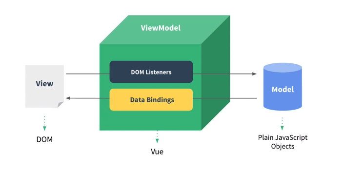

## vue의 핵심 reactivity

### Object.defineProperty(대상객체,객체의속성,{정의할내용})

> [Object.defineProperty_공식문서](https://developer.mozilla.org/en-US/docs/Web/JavaScript/Reference/Global_Objects/Object/defineProperty)
>
> 객체의 특정 속성의 동작을 재정의하는 api

```html
<!DOCTYPE html>
<html lang="en">
<head>
  <meta charset="UTF-8">
  <meta name="viewport" content="width=device-width, initial-scale=1.0">
  <title>Document</title>
</head>
<body>
  <div id="app"></div>

  <script>
    var div = document.querySelector('#app');
    var viewModel = {};

// 객체의 동작을 재정의 하는 api
    // Object.defineProperty(대상객체,객체의속성,{
    //   // 정의할내용
    // })
    Object.defineProperty(viewModel,'str',{
      // 속성(str)의 접근했을때의 동작을 정의
      get:function(){
        console.log('접근')
        // console에 viewModel.str를 적으면 '접근'이 찍힘
      },
      // 속성에 값을 할당했을 때의 동작을 정의
      set:function(newValue){
        console.log('할당',newValue)
        div.innerHTML = newValue;
      }
    });

  </script>
</body>
</html>
```


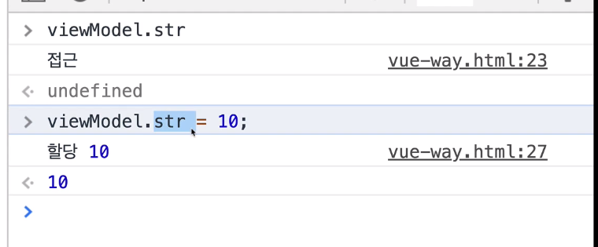

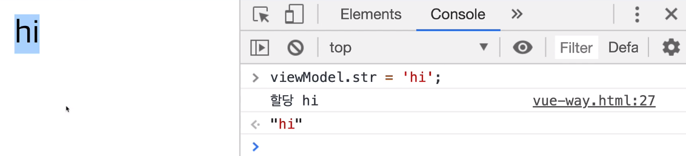


### Object.defineProperty의 라이브러리화

> [즉시실행함수_공식문서](https://developer.mozilla.org/ko/docs/Glossary/IIFE)
>
> **즉시 실행 함수 표현(IIFE, Immediately Invoked Function Expression)**은 정의되자마자 즉시 실행되는 Javascript Function 를 말한다.
>
> ```js
> (function () {
>     statements
> })();
> ```
>
> 첫 번째는 괄호(`()`, Grouping Operator)로 둘러싸인 익명함수(Anonymous Function)이다. 
>
> 이는 전역 스코프에 불필요한 변수를 추가해서 오염시키는 것을 방지할 수 있을 뿐 아니라 IIFE 내부안으로 다른 변수들이 접근하는 것을 막을 수 있는 방법이다.
>
> 두 번째 부분은 즉시 실행 함수를 생성하는 괄호`()`이다. 
>
> 이를 통해 자바스크립트 엔진은 함수를 즉시 해석해서 실행한다.
>
> **예시**
>
> 표현 내부의 변수는 외부로부터의 접근이 불가능하다.
>
> IIFE를 변수에 할당하면 IIFE자체는 저장되지 않고, 함수가 실행된 결과만 저장된다.
>
> ```js
> (function () {
>     var aName = "Barry";
> })();
> // IIFE 내부에서 정의된 변수는 외부 범위에서 접근이 불가능하다.
> aName // throws "Uncaught ReferenceError: aName is not defined"
> 
> var result = (function () {
>     var name = "Barry"; 
>     return name; 
> })(); 
> // 즉시 결과를 생성한다.
> result; // "Barry"
> ```

```html
<!DOCTYPE html>
<html lang="en">
<head>
  <meta charset="UTF-8">
  <meta name="viewport" content="width=device-width, initial-scale=1.0">
  <title>Document</title>
</head>
<body>
  <div id="app"></div>

  <script>
    var div = document.querySelector('#app');
    var viewModel = {};
    // 즉시실행함수 -> 기본적으로 init, render가 래플리케이션 로직에 노출되지 않게 코드를 또다른 유효범위(scsope)에 넣어줌
    (function() {
      function init(){
        Object.defineProperty(viewModel, 'str', {
          // 속성의 접근했을때의 동작을 정의
          get: function () {
            console.log('접근')
            // console.log(viewModel.str);
          },
          // 속성에 값을 할당했을 때의 동작을 정의
          set: function (newValue) {
            console.log('할당', newValue)
            // div.innerHTML = newValue;
            render(newValue);
          }
        });
      }
      
      function render(value) {
        div.innerHTML = value;
      }
      // 호출
      init();
    })();

  </script>
</body>
</html>
```


## Vue 인스턴스

> 인스턴스는 뷰로 개발할때 필수로 생성 해야하는 코드
>
> 기본적으로 Root 컴포넌트가 됨(`#app`)

```html
<!DOCTYPE html>
<html lang="en">
<head>
  <meta charset="UTF-8">
  <meta name="viewport" content="width=device-width, initial-scale=1.0">
  <title>Document</title>
</head>
<body>
  <div id="app">
    <!-- 여기 안은 vue의 속성을 쓸 수 있게 됨 -->
  </div>

  <script src="https://cdn.jsdelivr.net/npm/vue/dist/vue.js"></script>
  <script>
    // body태그 안에서 id가 app인 태그를 찾아 인스턴스를 붙이겠다는 말
    var vm = new Vue({
      el : '#app'
    });
  </script>
</body>
</html>
```

console에 vm을 치면

Vue가 제공하는 api(기능), 속성을 볼 수 있다.

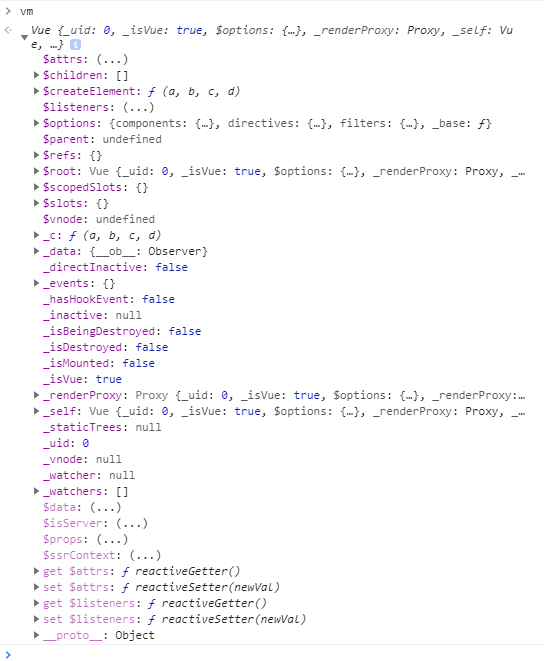


### Vue를 생성자함수로 쓰는 이유?

> [생성자함수_MDN](https://developer.mozilla.org/ko/docs/Web/JavaScript/Guide/Obsolete_Pages/Core_JavaScript_1.5_Guide/Creating_New_Objects/Using_a_Constructor_Function)
>
> 생성자 함수 만들기
>
> 1. 생성자 함수를 작성함으로써 개체를 정의.
> 2. new 키워드를 사용하여 개체의 인스턴스를 만듦.
>
> 함수 이름이 대문자면 생성자다! ex) `function Person(){}`
>
> 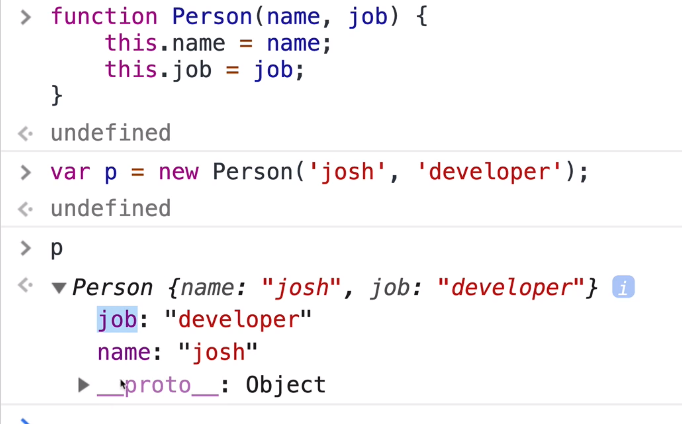

Vue를 아래와 같이 생성자 함수로 미리 정의해두면, vm으로 new Vue를 생성할때마다 매번 함수를 정의하지 않아도 Vue에서 이미 정의된 api, 함수, 속성들을 사용할 수 있고, 재사용할 수 있기 때문에 new Vue를 사용한다. 

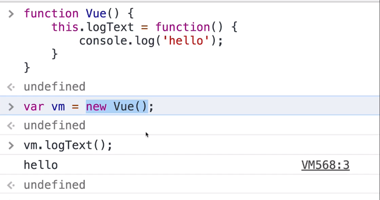


### Vue 인스턴스 옵션 속성

> 생성자 안에 객체를 넣어줌

```html
<!DOCTYPE html>
<html lang="en">
<head>
  <meta charset="UTF-8">
  <meta name="viewport" content="width=device-width, initial-scale=1.0">
  <title>Document</title>
</head>
<body>
  <div id="app">
    <!-- 여기 안은 vue의 속성을 쓸 수 있게 됨 -->
  </div>

  <script src="https://cdn.jsdelivr.net/npm/vue/dist/vue.js"></script>
  <script>
    // body태그 안에서 id가 app인 태그를 찾아 인스턴스를 붙이겠다는 말
    var vm = new Vue({
      el : '#app',
      data :{
        message:'hi'
      },
      methods:{
        
      },
    });
  </script>
</body>
</html>
```


## Vue 컴포넌트

> 컴포넌트는 화면의 영역을 구분하여 개발할 수 있는 뷰의 기능
>
> 컴포넌트 기반으로 화면을 개발하게 되면 재사용성이 올라가고 빠르게 화면을 제작할 수 있다.
>
> Root->부모컴포넌트
>
> header,content -> 하위컴포넌트

``` html
<!DOCTYPE html>
<html lang="en">

<head>
  <meta charset="UTF-8">
  <meta name="viewport" content="width=device-width, initial-scale=1.0">
  <title>Document</title>
</head>
<body>
  <div id="app">
    <app-header></app-header>
    <app-content></app-content>
    <app-footer></app-footer>
  </div>

  <script src="https://cdn.jsdelivr.net/npm/vue/dist/vue.js"></script>
  <script>
    // 전역 컴포넌트 등록
    // Vue.component('컴포넌트이름',컴포넌트내용);
    Vue.component('app-header', {
      template: '<h1>Header</h1>'
    });

    Vue.component('app-content', {
      template: '<div>content</div>'
    });


    new Vue({
      // 유일한 key값을 선택자로 정함
      el: '#app',
      // 지역컴포넌트, 여러개가 등록될거라 s가 붙음
      components:{
        // '컴포넌트이름':컴포넌트내용
        'app-footer':{
          template:'<footer>footer</footer>'
        }

      },

    });
  </script>
</body>

</html>
```

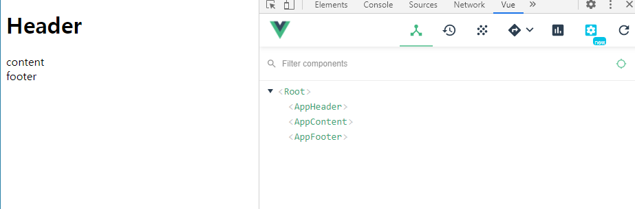


### 왜 지역 vs 전역 컴포넌트로 나누는가?

> 지역 컴포넌트는 하단에 어떤게 등록됐는지 컴포넌트 속성으로 바로 알 수 있음
>
> 실제로 많이 쓰이는 것은 지역 컴포넌트
>
> 전역컴포넌트는 대부분 플러그인, 라이브러리 형태로 전역으로 사용해야되는 컴포넌트만 사용됨


### 컴포넌트와 인스턴스의 관계(배경지식정도)

> 인스턴스는 여러개 생성할 수 있음(실제 서비스에서는 여러개 잘 생성하진 않음 ->그냥 이해를 위해)
>
> 인스턴스를 두개 만들고 둘다 app-header와 app-footer 컴포넌트를 넣어줌
>
> 여기서 app2에서는 app-footer는 뜨지 않음
>
> **전역컴포넌트**는 따로 등록하지 않아도 모든 인스턴스에 등록가능
>
> **지역 컴포넌트**는 각 인스턴스에 새로 등록을 해줘야됨!!

```html
<!DOCTYPE html>
<html lang="en">

<head>
  <meta charset="UTF-8">
  <meta name="viewport" content="width=device-width, initial-scale=1.0">
  <title>Document</title>
</head>
<body>
  <div id="app">
    <app-header></app-header>
    <app-footer></app-footer>
  </div>
  
  <div id="app2">
    <app-header></app-header>
    <app-footer></app-footer>
  </div>
  
  <script src="https://cdn.jsdelivr.net/npm/vue/dist/vue.js"></script>
  <script>
    // 전역 컴포넌트 등록
    // Vue.component('컴포넌트이름',컴포넌트내용);
    Vue.component('app-header', {
      template: '<h1>Header</h1>'
    });

    // Vue.component('app-content', {
    //   template: '<div>content</div>'
    // });


    new Vue({
      // 유일한 key값을 선택자로 정함
      el: '#app',
      // 지역컴포넌트, 여러개가 등록될거라 s가 붙음
      components:{
        // '컴포넌트이름':컴포넌트내용
        'app-footer':{
          template:'<footer>footer</footer>'
        }
      },
    });

    new Vue({
      el:'#app2',
    });
  </script>
</body>

</html>
```


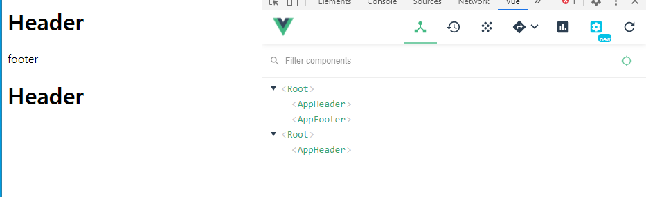


### 컴포넌트 통신방식

> 컴포넌트는 각각 고유한 데이터 유효 범위를 갖는다.
>
> 따라서, 컴포넌트 간에 데이터를 주고 받기 위해선 아래와 같은 규칙을 따름
>
> - 상위에서 하위로는 데이터를 내려줌, props속성
> - 하위에서 상위로는 이벤트를 올려줌, 이벤트 발생(`$emit`)
>
> 데이터의 방향이 정해져 있기 때문에 데이터의 흐름을 추적할 수 있다.
>
> 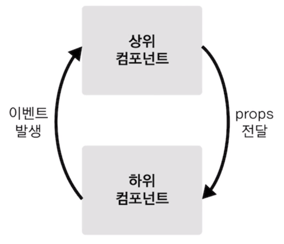

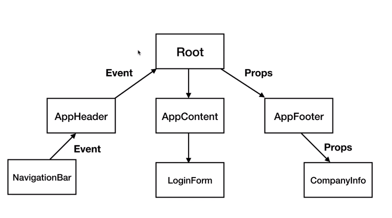


### props속성

> binding속성 때문에 root의 data를 바꾸는 순간 하위컴포넌트의 data도 같이 바뀜

```html
<!DOCTYPE html>
<html lang="en">

<head>
  <meta charset="UTF-8">
  <meta name="viewport" content="width=device-width, initial-scale=1.0">
  <title>Document</title>
</head>

<body>
  <div id="app">
    <!-- <app-header v-bind:프롭스속성이름="상위컴포넌트의데이터이름"></app-header> -->
    <app-header v-bind:propsdata="message"></app-header>
    <app-content v-bind:propsdata="num"></app-content>
  </div>

  <script src="https://cdn.jsdelivr.net/npm/vue/dist/vue.js"></script>
  <script>
    // camel-case는 다음단어가 대문자로 시작
    var appHeader = {
      template: '<h1>{{ propsdata }}</h1>',
      // 하위컴포넌트에 props속성으로 이름 정의
      props:['propsdata'],
    }
    var appContent = {
        template: '<div>{{ propsdata }}</div>',
          // header와 props이름 같게 설정해도, 컴포넌트는 각각의 data가 고유하기 때문에 구분이된다.
        props: ['propsdata']
      }

    new Vue({
      el: '#app',
      components: {
        // '컴포넌트이름':컴포넌트내용
        'app-header': appHeader,
        'app-content': appContent
      },
      data:{
        message:'hi',
        num:10
      },
    });
  </script>
</body>

</html>
```

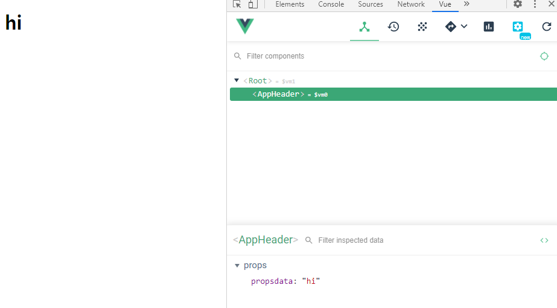

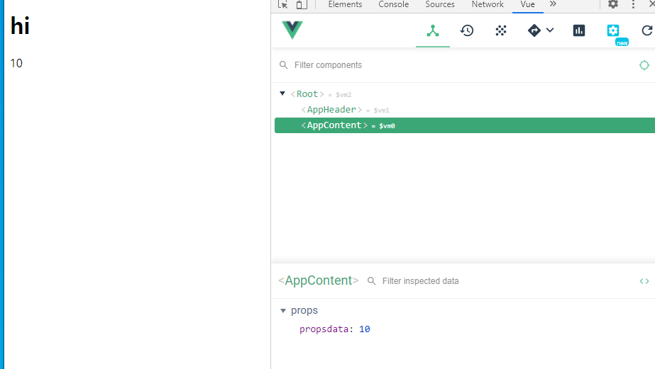


### event-emit

```html
<!DOCTYPE html>
<html lang="en">

<head>
  <meta charset="UTF-8">
  <meta name="viewport" content="width=device-width, initial-scale=1.0">
  <title>Document</title>
</head>

<body>
  <div id="app">
    <!-- <app-header v-on:하위컴포넌트에서 발생한 이벤트이름="상위컴포넌트의 메서드 이름"></app-header> -->
    <app-header v-on:pass="logText"></app-header>
    <app-content v-on:increase="increaseNumber"></app-content>
    <p>{{num}}</p>
  </div>

  <script src="https://cdn.jsdelivr.net/npm/vue/dist/vue.js"></script>
  <script>
    // camel-case는 다음단어가 대문자로 시작
    var appHeader = {
      template: '<button v-on:click="passEvent">Click me</button>',
      // 하위컴포넌트에 props속성으로 이름 정의
      methods:{
        passEvent: function () {
          this.$emit('pass');
        }
      },
    }
    var appContent = {
      template: '<button v-on:click="addNumber">add</button>',
      // 하위컴포넌트에 props속성으로 이름 정의
      methods: {
        addNumber: function () {
          this.$emit('increase');
        }
      },
    }

    new Vue({
      el: '#app',
      components: {
        // '컴포넌트이름':컴포넌트내용
        'app-header': appHeader,
        'app-content':appContent,
      },
      methods:{
        logText:function(){
          console.log('hi');
        },
        increaseNumber: function(){
          this.num =  this.num+1;
        },
      },
      data:{
        num:10
      }
    });
  </script>
</body>

</html>
```


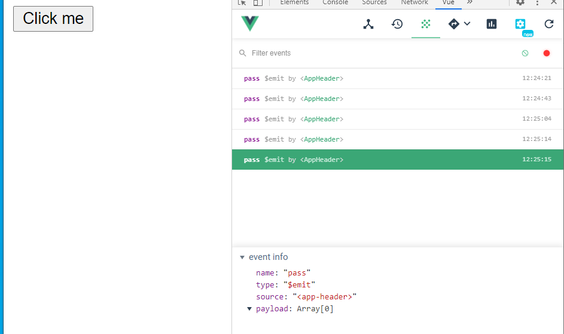

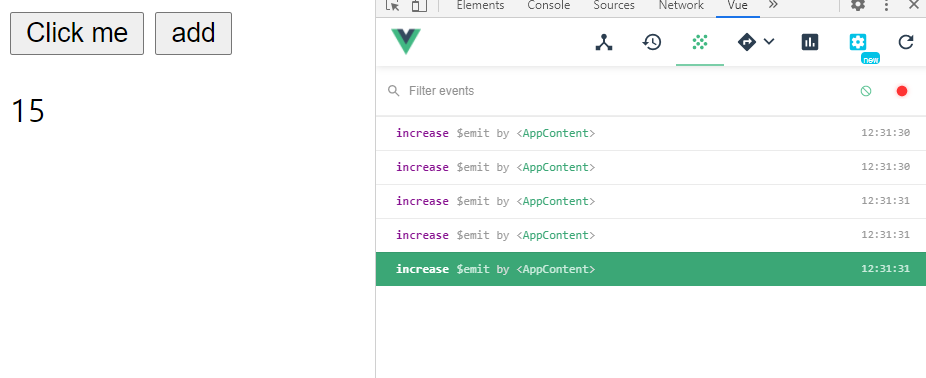

### this

> `this.num` : 해당 Vue 인스턴스의 data안의 num을 가리킴
>
> [this참고문서](https://www.w3schools.com/js/js_this.asp)

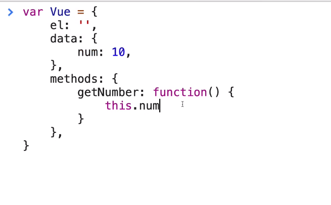

### 같은 컴포넌트 레벨 간의 통신 방법

> AppContent에서 10을 Root로 event-emit으로 보냄
>
> - content컴포넌트에서 버튼 pass를 클릭했을때, passNum메소드가 실행되고, passNum메소드는 pass라는 event이름으로 상위컴포넌트의 deliverNum메소드를 실행시키면서 10을 인자로 가져가 deliverNum의 인자에 담긴다 -> 그리고 Root의 data num을 this.num = value로 그 받은 값을 담아준다.
>
> Root에서 num을 props로 보냄
>
> - Content에서 받은 값을 Root의 num에 저장했으면, 그 num값을 propsdata라는 props이름으로 Header에 보내면 header는 num값을 받게 된다.

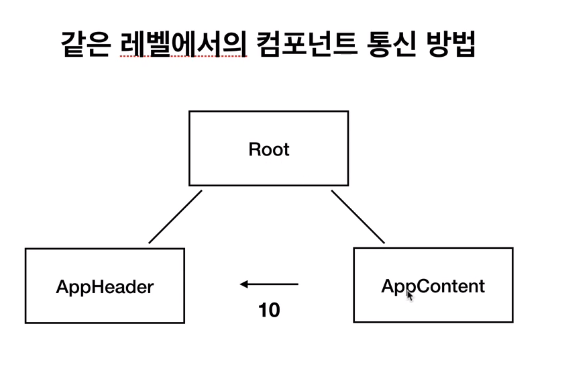

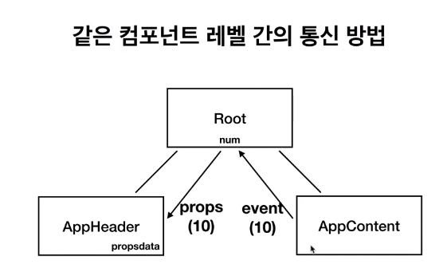

```html
<!DOCTYPE html>
<html lang="en">

<head>
  <meta charset="UTF-8">
  <meta name="viewport" content="width=device-width, initial-scale=1.0">
  <title>Document</title>
</head>

<body>
  <div id="app">
    <!-- <app-header v-on:하위컴포넌트에서 발생한 이벤트이름="상위컴포넌트의 메서드 이름"></app-header> -->
    <app-header v-bind:propsdata="num"></app-header>
    <app-content v-on:pass="deliverNum"></app-content>
  </div>

  <script src="https://cdn.jsdelivr.net/npm/vue/dist/vue.js"></script>
  <script>
    // camel-case는 다음단어가 대문자로 시작
    var appHeader = {
      template: '<div>header</div>',
      props:['propsdata']
    }
    var appContent = {
      template: '<div>content <button v-on:click="passNum">pass</button></div>',
      // 하위컴포넌트에 props속성으로 이름 정의
      methods: {
        passNum: function () {
          // 여기서 넘겨주는 인자 10은 deliverNum에서 value값으로 들어암
          this.$emit('pass',10);
        }
      },
    }

    new Vue({
      el: '#app',
      components: {
        // '컴포넌트이름':컴포넌트내용
        'app-header': appHeader,
        'app-content': appContent,
      },
      methods: {
        deliverNum: function(value){
          // 넘어온 value를 num에 담아줌
          this.num = value
        },
      },
      data: {
        num: 0
      }
    });
  </script>
</body>

</html>
```


## 뷰 라우터

> [뷰라우터공식문서](https://router.vuejs.org/kr/installation.html)
>
> 뷰라우터는 뷰 라이브러리를 이용하여 싱글 페이지 애플리케이션을 구현할 때 사용하는 라이브러리다.
>
> 페이지이동과 관련된 기능

```html
<!DOCTYPE html>
<html lang="en">
<head>
  <meta charset="UTF-8">
  <meta name="viewport" content="width=device-width, initial-scale=1.0">
  <title>Document</title>
</head>
<body>
  <div id="app">
    <div>
      <!-- router에서 페이지 이동을 위한 a태그라고 생각하면됨 -->
      <router-link to="/login">Login</router-link>
      <router-link to="/main">Main</router-link>
    </div>
    <!-- 뷰인스턴스에 뷰 라우터를 연결해야 보임, routes의 컴포넌트 값들이 보여질 곳 -->
    <router-view></router-view>
  </div>

  <!-- 뷰 CDN먼저 적고 -->
  <script src="https://cdn.jsdelivr.net/npm/vue/dist/vue.js"></script>
  <!-- 뷰 라우터 CDN을 다음으로 적는다 -->
  <script src="https://unpkg.com/vue-router/dist/vue-router.js"></script>
  <script>
    var LoginComponent = {
      template:'<div>login</div>'
    }
    
    var MainComponent = {
      template: '<div>main</div>'
    }
	//router인스턴스 생성
    var router = new VueRouter({
      // routes속성, 페이지 라우팅 정보가 들어감, 어떤 url로 들어갔을 때 뭐가 뜰지
      routes:[
        // 페이지의 개수만큼 객체가 필요함
        // 로그인페이지 정보
        {
          // 페이지의 url이름 속성 
        path:'/login',
        // router의 이름을 지정해줌
        name:'login',
        // 해당 url에서 표시될 컴포넌트('s'안붙음! 하나만 등록될것이기 때문)
        component:LoginComponent
        },
        // 메인페이지정보
        {
          path:'/main',
          component:MainComponent
        },
      ]
    });
      
	//Vue 인스턴스 생성
    new Vue({
      el:'#app',
      // router속성
      router:router
    });

  </script>
</body>
</html>
```

- login의url로 들어가면 router-view에서 login컴포넌트가 나오는것을 볼 수 있음

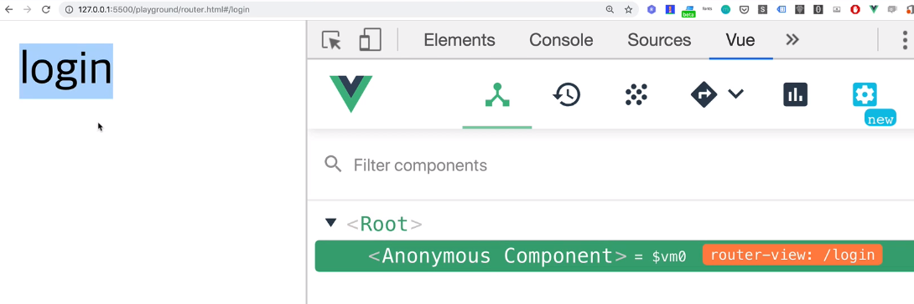

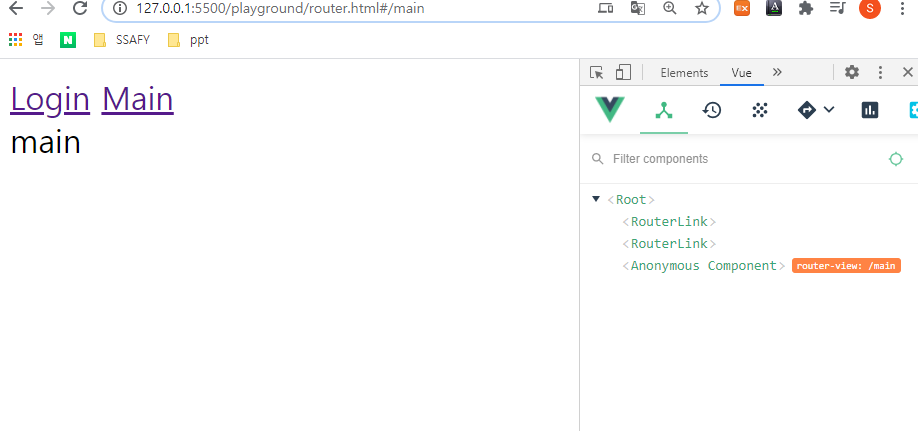

## Axios

>뷰에서 권고하는 HTTP 통신 라이브러리 [axios라이브러리](https://github.com/axios/axios):이걸많이씀(instance,errorhandling,요청취소, interceptors 등 추가로 보는게 좋음)
>
>- open source library를 쓸때 Star수와, Commit, Contributors, 언제수정이 됐는지를 보는 것이 중요함 그래야 믿고 쓸수 있는지 알 수 있다.
>
>[vue resource 공식라이브러리](https://github.com/pagekit/vue-resource)가 있었으나 예전 공식라이브러리고, 지금은 안씀 그래서 sample들이 예전 버전이라 그걸 참고하고 봐야됨
>
>Promise기반의 HTTP통신 라이브러리이며 상대적으로 다른 HTTP통신 라이브러리들에 비해 문서화가 잘 되어 있고, API가 다양하다.
>
>**Ajax**
>
>: 비동기적인 웹 애플리케이션의 제작을 위해 아래와 같은 조합을 이용하는 웹 개발 기법
>
>- 표현 정보를 위한 HTML, CSS
>- 동적인 화면 출력 및 표시 정보와의 상호작용을 위한 DOM, javascript
>- 웹서버와 비동기적으로 데이터를 교환하고 조작하기 위한 XML,XSLT,XSLT,XMLHttpRequest
>
>(참고)
>
>**자바스크립트의 비동기처리패턴**
>
>1. [callback](https://joshua1988.github.io/web-development/javascript/javascript-asynchronous-operation/)
>2. [promise](https://joshua1988.github.io/web-development/javascript/promise-for-beginners/)
>3. promise + generator
>4. [async & await](https://joshua1988.github.io/web-development/javascript/js-async-await/)

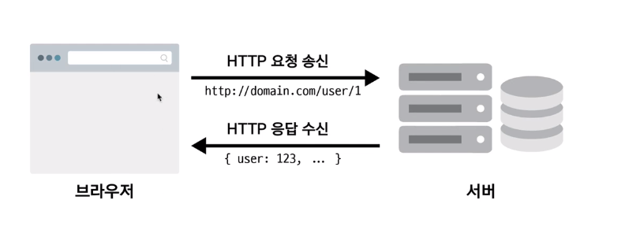


[front-end개발자가 알아야하는 HTTP프로토콜](https://joshua1988.github.io/web-development/http-part1/)

[구글크롬devTools](https://developers.google.com/web/tools/chrome-devtools/)

콘솔 네트워크 패널

어떤 요청이 갔고, 응답이 왔는지 볼수 있다! 자주볼거니까 익숙해지자

- Headers : 일반적인 정보를 담음, 특정 응답, 요청의 정보를 담음

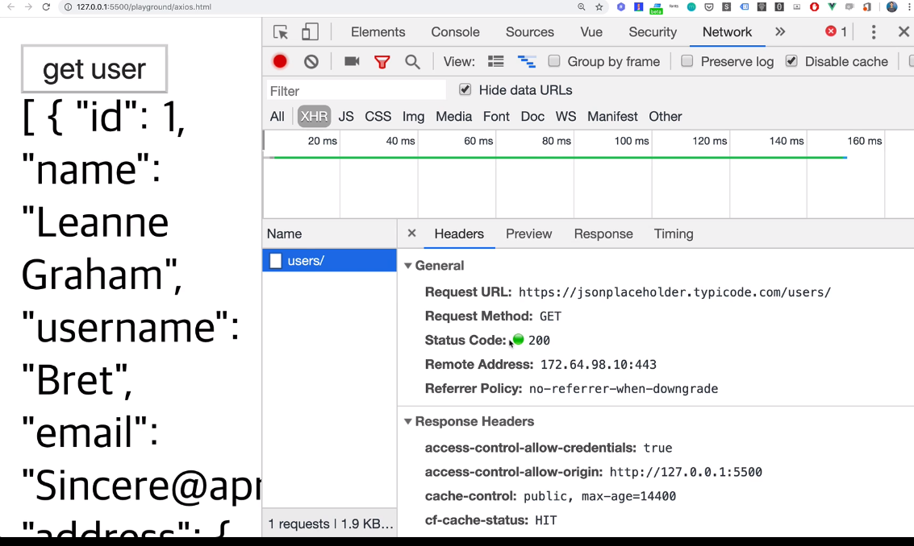

```html
<!DOCTYPE html>
<html lang="en">

<head>
  <meta charset="UTF-8">
  <meta name="viewport" content="width=device-width, initial-scale=1.0">
  <meta http-equiv="X-UA-Compatible" content="ie=edge">
  <title>Axios</title>
</head>

<body>
  <div id="app">
    <button v-on:click="getData">get user</button>
    <div>
      {{ users }}
    </div>
  </div>
<!-- vue cdn -->
  <script src="https://cdn.jsdelivr.net/npm/vue/dist/vue.js"></script>
  <!-- axios cdn -->
  <script src="https://unpkg.com/axios/dist/axios.min.js"></script>
  <script>
    new Vue({
      el: '#app',
      data: {
        users: []
      },
      methods: {
        getData: function () {
          // 여기서의 this는 기본적인 인스턴스의 this
          var vm = this;
          // user정보 samplejson api
          axios.get('https://jsonplaceholder.typicode.com/users/')
          // promise
            .then(function (response) {
              console.log(response.data);
              // then안에서의 this는 비동기처리를 성공했을때 바뀐 this이기 때문에 연결이 안됨, 그래서 vm이라는 변수에 담아서 접근
              // 아마 나중에 이거를 function()이라고 안적고 화살표함수를 이용하면 됨!
              vm.users = response.data;
            })
            .catch(function (error) {
              console.log(error);
            });
        }
      }
    })
  </script>
</body>

</html>
```


## 템플릿 문법

> [템플릿문법](https://kr.vuejs.org/v2/guide/syntax.html)
>
> **모르는 문법이 나온다면 Vue.js에 검색해서 찾아보기**
>
> [Form Input Bindings](https://vuejs.org/v2/guide/forms.html#ad)

### 데이터 바인딩

> 뷰인스턴스에서 정의한 속성들을 화면에 표시하는 방법
>
> 가장 기본적인 데이터 바인딩 방식은 콧수염 괄호(`{{}}`)다.


### 디렉티브

> 뷰로 화면의 요소를 더 쉽게 조작하기 위한 문법
>
> 화면 조작에서 자주 사용되는 방식들을 모아 디렉티브 형태로 제공함


```html
<!DOCTYPE html>
<html lang="en">
<head>
  <meta charset="UTF-8">
  <meta name="viewport" content="width=device-width, initial-scale=1.0">
  <meta http-equiv="X-UA-Compatible" content="ie=edge">
  <title>Document</title>
</head>
<body>
  <div id="app">
    <!-- id에 uuid와 연결, class에 name을 연결 -->
    <p v-bind:id="uuid" v-bind:class="name">{{ num }}</p>
    <!-- <p id="abc1234">{{ num }}</p> -->
    <p>{{ doubleNum }}</p>
    <!-- loading이 True면 나오고 아니면 else가 나옴, 이건 true이기 전까진 랜더링 되지 않음 -->
    <div v-if="loading">
      Loading...
    </div>
    <div v-else>
      test user has been logged in
    </div>
    <!-- show는 처음에 랜더링되지만 loading이 true이지 않으면 보이지 않음(display:none상태) -->
    <div v-show="loading">
      Loading...
    </div>
    <!-- TODO: 인풋 박스를 만들고 입력된 값을 p 태그에 출력해보세요 -->
    <input type="text" v-model="message">
    <p>{{ message }}</p>
  </div>

  <script src="https://cdn.jsdelivr.net/npm/vue/dist/vue.js"></script>
  <script>
    new Vue({
      el: '#app',
      data: {
        num: 10,
        uuid: 'abc1234',
        name: 'text-blue',
        loading: true,
        message: ''
      },
      // 한번 계산해 놓으면, 계산된 값만 계속 불러올 수 있게 된다
      computed: {
        doubleNum: function() {
          return this.num * 2;
        }
      }
    })
  </script>
</body>
</html>
```

### v-if or v-show

**둘의 결과 동작이 같은데  둘 중 어떤것을 사용해야 좋을까 ?**

> 두 가지 모두 원하는 결과는 같다. 하지만 동작하는 방식이 다른데, state 에 따라 보여졌다 안보여졌다하는 빈도가 많다면, `v-show` 를 이용하는 방법을 추천. `v-if` 의 경우 태그를 그렸다 지웠다 해야되기 때문에 브라우저가 많은 부담을 느낀다. 하지만 이런 경우를 제외한다면 `v-if` 를 이용하는 것을 추천.


### methods 속성

```html
<!DOCTYPE html>
<html lang="en">
<head>
  <meta charset="UTF-8">
  <meta name="viewport" content="width=device-width, initial-scale=1.0">
  <meta http-equiv="X-UA-Compatible" content="ie=edge">
  <title>Document</title>
</head>
<body>
  <div id="app">
    <!-- 버튼을 클릭했을때 method logText가 실행됨 -->
    <button v-on:click="logText">click me</button>
    <!-- key를 눌렀다가 올라오는 순간 logText가 실행됨, .enter는 이벤트 modifier로 엔터를 눌러도 적용됨 -->
    <input type="text" v-on:keyup.enter="logText">
    <button>add</button>
  </div>

  <script src="https://cdn.jsdelivr.net/npm/vue/dist/vue.js"></script>
  <script>
    new Vue({
      el: '#app',
      methods: {
        logText: function() {
          console.log('clicked');
        }
      }
    })
  </script>
</body>
</html>
```


### watch속성

> data의 변화에 따라 특정 함수를 실행할 수 있음

```html
<!DOCTYPE html>
<html lang="en">
<head>
  <meta charset="UTF-8">
  <meta name="viewport" content="width=device-width, initial-scale=1.0">
  <meta http-equiv="X-UA-Compatible" content="ie=edge">
  <title>Document</title>
</head>
<body>
  <div id="app">
    {{ num }}
    <!-- 버튼을 클릭했을때 숫자가 늘어남 -->
    <button v-on:click="addNum">increase</button>
  </div>

  <script src="https://cdn.jsdelivr.net/npm/vue/dist/vue.js"></script>
  <script>
    new Vue({
      el: '#app',
      data: {
        num: 10
      },
      // data의 변화에 따라 특정 함수를 실행할 수 있음
      watch: {
        // num이 바뀌면 logText가 계속 실행됨
        num: function() {
          this.logText();
        }
      },
      methods: {
        addNum: function() {
          this.num = this.num + 1;
        },
        logText: function() {
          console.log('changed');
        }
      }
    })
  </script>
</body>
</html>
```


###  Watch Vs Computed

> [watch와 computed공식문서](https://vuejs.org/v2/guide/computed.html#ad)
>
> watch보다 computed를 사용하는게 여러 방면에서 더 좋음
>
> computed 는 대상(ex. message) 을 따라 연산결과가 캐싱된다. 대상인 message 가 변경되지 않는다면 이미 연산처리된 즉, 캐싱처리되어있는 reversedMessage 를 가져온다.
> Method 에서도 같은 역할을 할 수 있지 않나 ?
> 물론 가능하고, 결과는 같다. 하지만 함수의 경우는 re-render 될 때마다 실행되기 때문에 캐싱 이득을 취할 수 없다.
> **watch VS computed**
> 두 가지 모두 같은 결과를 내는데 그러면 어떤걸 쓰면 좋을까? watch 는 언제 변하는지 예측이 어려울때 많이 사용된다. 예를 들어 비동기 통신이 있다. 우리가 어떤 데이터를 요청했을 때 이 값이 1초뒤에 올지 2초뒤에 올지 예측이 어려울때 그 값을 watch 를 통하여 감시하고 있다가 해당 값에 대한 응답이 왔을때 후처리를 해줄 수 있다. 
> computed 는 복잡한 연산같은 것을 캐싱처리하기 위해 사용된다.

```html
<!DOCTYPE html>
<html lang="en">
<head>
  <meta charset="UTF-8">
  <meta name="viewport" content="width=device-width, initial-scale=1.0">
  <meta http-equiv="X-UA-Compatible" content="ie=edge">
  <title>Document</title>
</head>
<body>
  <div id="app">
    {{ num }}
  </div>

  <script src="https://cdn.jsdelivr.net/npm/vue/dist/vue.js"></script>
  <script>
    new Vue({
      el: '#app',
      data: {
        num: 10
      },
      // data num에 2를 곱한 값 -> 빠르게 계산한다는 장점이 있음
      // 단순한 text값에 대한 validation 값을 계산할떄 많이 쓰임
      computed: {
        doubleNum: function() {
          return this.num * 2;
        }
      },
      // 무거운 로직, 매번 실행되기 부담스러울때 주로 사용
      watch: {
        // 현재값과, 이전값을 인자로 받을 수 있다-> 계속 num을 추적하기 때문
        num: function(newValue, oldValue) {
          this.fetchUserByNumber(newValue);
        }
      },
      methods: {
        fetchUserByNumber: function(num) {
          // console.log(num);
          axios.get(num);
        }
      }
    });
  </script>
</body>
</html>
```


### computed

```html
<!DOCTYPE html>
<html lang="en">
<head>
  <meta charset="UTF-8">
  <meta name="viewport" content="width=device-width, initial-scale=1.0">
  <meta http-equiv="X-UA-Compatible" content="ie=edge">
  <title>Document</title>
  <style>
  .warning {
    color: red;
  }
  </style>
</head>
<body>
  <div id="app">
    <!-- class warining이 isError가 True값일때 적용됨  -->
    <!-- <p v-bind:class="{ warning:isError }">Hello</p> -->
    <!-- 이렇게 표현하는것이 더 직관적이다 -->
    <p v-bind:class="errorTextColor">Hello</p>
  </div>
  
  <script src="https://cdn.jsdelivr.net/npm/vue/dist/vue.js"></script>
  <script>
    new Vue({
      el: '#app',
      data: {
        // cname: 'blue-text',
        isError: false
      },
      computed: {
        errorTextColor: function() {
          // if (isError) {
          //   return 'warning'
          // } else {
          //   return null;
          // }
          // isError가 True면 'warning'class추가 아니라면 null 삼항연산자
          return this.isError ? 'warning' : null;
        }
      }
    });
  </script>
</body>
</html>
```


## Vue cli

> [Vue cli 공식문서](https://cli.vuejs.org/)
>
> ```sh
> $ npm install -g @vue/cli
> #프로젝트 생성
> $ vue create '프로젝트 폴더 위치'
> # 2번 선택
> $ npm install
> $ npm run serve
> ```
> run serve를 하면 `public > index.html`파일이 보여짐

- main.js

```js
import Vue from 'vue'
import App from './App.vue'

Vue.config.productionTip = false

// var App = {
//   template: '<div>app</div>'
// }

new Vue({
  // render함수, App컴포넌트를 불러와서 render했다고 이해,,,,
  render: h => h(App),
  // 위와 아래 동일한 기능임(render, components)
  // components: {
  //   'app': App
  // }
}).$mount('#app')
// .$mount와 같은 것이 el:'#app'이다
// new Vue({
//   el: '#app',
//   render: h => h(App),
// })
```

- App.vue

```vue
<template>
<!-- HTML -->
  <div>
    <!-- <app-header v-bind:프롭스 속성 이름="상위 컴포넌트의 데이터 이름"></app-header> -->
    <!-- AppHeader 컴포넌트가 들어감 -->
    <!-- appheader에 propsdata 라는 이름으로 str data를 보냄-->
    <!-- revew라는 이벤트가 app-header에서 발생하면 renewStr메소드 실행 -->
    <app-header 
      v-bind:propsdata="str"
      v-on:renew="renewStr"></app-header>
  </div>
</template>

<script>
// 컴포넌트를 import, from 파일위치 가급적 .vue까지 적어줌
import AppHeader from './components/AppHeader.vue';

// var AppHeader = {
//   template: '<header><h1>Header</h1></header>'
// }

// new Vue({
//   data: {
//     str: 'hi'
//   }
// })

export default {
  // javascript-인스턴스옵션
  // 인스턴스옵션 속성 or 컴포넌트 옵션 속성
  data: function() {
    return {
      str: 'Header'
    }
  },
  components: {
    // AppHeader, 라고만 적어도됨
    'app-header': AppHeader
  },
  methods: {
    // 자식한테 event가 발생해서 renewStr이 실행돼서 str이 hi로 바뀜
    renewStr: function() {
      this.str = 'hi';
    }
  }
}
</script>

<style>
/* css */
</style>

```

- AppHeader.vue

```vue
<template>
  <header>
    <h1>{{ propsdata }}</h1>
    <!-- 버튼을 클릭하면 sendEvent 메소드 실행 -->
    <button v-on:click="sendEvent">send</button>
  </header>
</template>

<script>
export default {
  // 인스턴스 옵션속성
  // app에서 받은 str data를 propsdata라는 이름으로 받음
  props: ['propsdata'],
  methods: {
    // 이 메소드가 실행되면 'renew'라는 str값을 부모한테 보냄
    sendEvent: function() {
      this.$emit('renew');
    }
  }
}
</script>

<style>

</style>

```


## 사용자 입력 폼 만들기

> [이벤트 버블링, 이벤트 캡처 그리고 이벤트 위임까지](https://joshua1988.github.io/web-development/javascript/event-propagation-delegation/)

```vue
<template>
<!-- 이벤트 버블링! -->
<!-- form아래 button의 submit이 발생하면 submitForm메소드 실행 -->
<!-- .prevent는 form의 기본속성을 없애준 것 -->
  <form v-on:submit.prevent="submitForm">
    <div>
      <!-- label의 for와 input의 id값이 같으면 label을 선택했을때 input이 클릭됨 -->
      <label for="username">id: </label>
      <!-- v-model을 쓰면 bind와 on이벤트 같이 일어남 -->
      <input id="username" type="text" v-model="username">
    </div>
    <div>
      <label for="password">pw: </label>
      <input id="password" type="password" v-model="password">
    </div>
    <button type="submit">login</button>
  </form>
</template>

<script>
// axios를 불러옴 -> npm install axios
import axios from 'axios';

export default {
  // 컴포넌트간의 data가 공유되지 않게 객체가 아니라 함수형태로 많이 사용한다
  data: function() {
    return {
      username: '',
      password: '',
    }
  },
  methods: {
    submitForm: function() {
      // form의 기본 이벤트 새로고침을 없앰
      // 이건 바닐라js에서 주로 사용함 vue는 .prevent
      // event.preventDefault();
      console.log(this.username, this.password);
      var url = 'https://jsonplaceholder.typicode.com/users';
      var data = {
        username: this.username,
        password: this.password
      }
      // 브라우저에서 서버로 보내서 데이터 주고받기위한 라이브러리
      axios.post(url, data)
      // 요청이 성공했는지
        .then(function(response) {
          console.log(response);
        })
        // 실패했는지 보여줌
        .catch(function(error) {
          console.log(error);
        });
    }
  }
}
</script>

<style>

</style>

```


### Event Bubbling

> 특정 화면 요소에서 이벤트가 발생했을 때 해당 이벤트가 더 상위의 화면 요소들로 전달되어 가는 특성을 의미

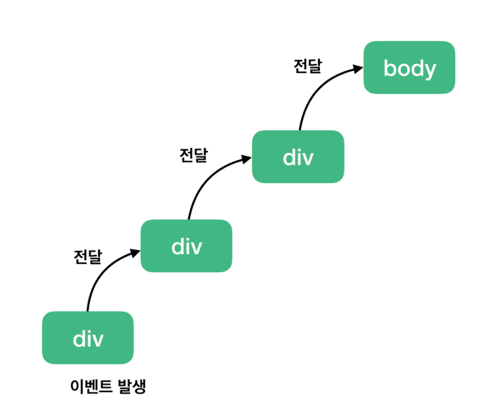

```html
<body>
	<div class="one">
		<div class="two">
			<div class="three">
			</div>
		</div>
	</div>
</body>
```

```js
var divs = document.querySelectorAll('div');
divs.forEach(function(div) {
	div.addEventListener('click', logEvent);
});

function logEvent(event) {
	console.log(event.currentTarget.className);
}
```

위 코드는 세 개의 div 태그에 모두 클릭 이벤트를 등록하고 클릭 했을 때 logEvent 함수를 실행시키는 코드

여기서 위 그림대로 최하위 div 태그 `<div class="three"></div>`를 클릭하면 아래와 같은 결과가 실행됨

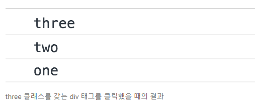

div 태그 한 개만 클릭했을 뿐인데 왜 3개의 이벤트가 발생될까?

그 이유는 브라우저가 이벤트를 감지하는 방식 때문!

브라우저는 특정 화면 요소에서 이벤트가 발생했을 때 그 이벤트를 최상위에 있는 화면 요소까지 이벤트를 전파시킴

따라서, 클래스 명 three -> two -> one 순서로 div 태그에 등록된 이벤트들이 실행된다. 

마찬가지로 two 클래스를 갖는 두 번째 태그를 클릭했다면 two -> one 순으로 클릭 이벤트가 동작한다.

여기서 주의해야 할 점은 각 태그마다 이벤트가 등록되어 있기 때문에 상위 요소로 이벤트가 전달되는 것을 확인할 수 있다. 

만약 이벤트가 특정 div 태그에만 달려 있다면 위와 같은 동작 결과는 확인할 수 없다.

이와 같은 하위에서 상위 요소로의 이벤트 전파 방식을 **이벤트 버블링(Event Bubbling)**이라고 한다.


### Event Capture

> 이벤트 버블링과 반대 방향으로 진행되는 이벤트 전파 방식

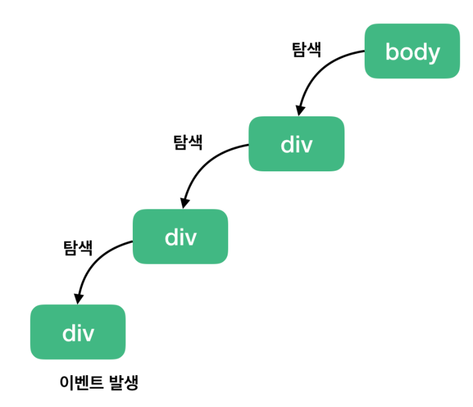

```html
<body>
	<div class="one">
		<div class="two">
			<div class="three">
			</div>
		</div>
	</div>
</body>
```

```js
var divs = document.querySelectorAll('div');
divs.forEach(function(div) {
	div.addEventListener('click', logEvent, {
		capture: true // default 값은 false입니다.
	});
});

function logEvent(event) {
	console.log(event.currentTarget.className);
}
```

`addEventListener()` API에서 옵션 객체에 `capture:true`를 설정하면 된다. 그러면 해당 이벤트를 감지하기 위해 이벤트 버블링과 반대 방향으로 탐색한다.

따라서, 아까와 동일하게 `<div class="three"></div>` 를 클릭해도 아래와 같은 결과가 나타납니다.

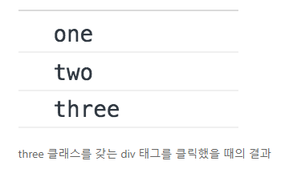

### event.stopPropagation()

> 위 API는 해당 이벤트가 전파되는 것을 막는다. 따라서, 이벤트 버블링의 경우에는 클릭한 요소의 이벤트만 발생시키고 상위 요소로 이벤트를 전달하는 것을 방해한다. 그리고 이벤트 캡쳐의 경우에는 클릭한 요소의 최상위 요소의 이벤트만 동작시키고 하위 요소들로 이벤트를 전달하지 않는다.
>
> 위와 같이 logEvent 함수에 `stopPropagation()` API를 사용한다면 앞의 ‘이벤트 버블링 예제’와 ‘이벤트 캡쳐 예제’에서 사용한 코드 기준으로 각각 three와 one이 찍힌다.

```js
function logEvent(event) {
	event.stopPropagation();
}
```

```js
// 이벤트 버블링 예제
divs.forEach(function(div) {
	div.addEventListener('click', logEvent);
});

function logEvent(event) {
	event.stopPropagation();
	console.log(event.currentTarget.className); // three
}

// 이벤트 캡쳐 예제
divs.forEach(function(div) {
	div.addEventListener('click', logEvent, {
		capture: true // default 값은 false입니다.
	});
});

function logEvent(event) {
	event.stopPropagation();
	console.log(event.currentTarget.className); // one
}
```


### Event Delegation-이벤트 위임

> 앞에서 살펴본 이벤트 버블링과 캡쳐는 사실 이벤트 위임을 위한 선수 지식이다. 이벤트 위임은 실제 바닐라 JS로 웹 앱을 구현할 때 자주 사용하게 되는 코딩 패턴이다.
>
> 이벤트 위임을 한 문장으로 요약해보면 ‘하위 요소에 각각 이벤트를 붙이지 않고 상위 요소에서 하위 요소의 이벤트들을 제어하는 방식’이다.

```html
<h1>오늘의 할 일</h1>
<ul class="itemList">
	<li>
		<input type="checkbox" id="item1">
		<label for="item1">이벤트 버블링 학습</label>
	</li>
	<li>
		<input type="checkbox" id="item2">
		<label for="item2">이벤트 캡쳐 학습</label>
	</li>
</ul>
```

```js
var inputs = document.querySelectorAll('input');
inputs.forEach(function(input) {
	input.addEventListener('click', function(event) {
		alert('clicked');
	});
});
```

자바스크립트 `querySelectorAll()`를 이용해 화면에 존재하는 모든 인풋 박스 요소를 가져온 다음 각 인풋 박스의 요소에 클릭 이벤트 리스너를 추가한다. 화면을 실행시키고 각 리스트 아이템의 인풋 박스(체크 박스)를 클릭하면 경고 창이 표시된다.

여기까지는 된다! 그런데 만약 여기서 할 일이 더 생겨서 리스트 아이템을 추가하면 어떻게 될까?

```js
var inputs = document.querySelectorAll('input');
inputs.forEach(function(input) {
	input.addEventListener('click', function(event) {
		alert('clicked');
	});
});

// 새 리스트 아이템을 추가하는 코드
var itemList = document.querySelector('.itemList');

var li = document.createElement('li');
var input = document.createElement('input');
var label = document.createElement('label');
var labelText = document.createTextNode('이벤트 위임 학습');

input.setAttribute('type', 'checkbox');
input.setAttribute('id', 'item3');
label.setAttribute('for', 'item3');
label.appendChild(labelText);
li.appendChild(input);
li.appendChild(label);
itemList.appendChild(li);
```

새로 추가된 리스트 아이템에는 클릭 이벤트 리스너가 동작하지 않는다. WHY????

코드를 다시 살펴보면, 인풋 박스에 클릭 이벤트 리스너를 추가하는 시점에서 리스트 아이템은 두 개다. 따라서, 새롭게 추가된 리스트 아이템에는 클릭 이벤트 리스너가 등록되지 않음. 이런 식으로 매번 새롭게 추가된 리스트 아이템까지 클릭 이벤트 리스너를 일일이 달아줘야 될까? NO!!

리스트 아이템이 많아지면 많아질수록 이벤트 리스너를 다는 작업 자체가 매우 번거롭다. 이 번거로운 작업을 해결할 수 있는 방법이 바로 **이벤트 위임(Event Delegation)**이다.

```js
// var inputs = document.querySelectorAll('input');
// inputs.forEach(function(input) {
// 	input.addEventListener('click', function() {
// 		alert('clicked');
// 	});
// });

var itemList = document.querySelector('.itemList');
itemList.addEventListener('click', function(event) {
	alert('clicked');
});

// 새 리스트 아이템을 추가하는 코드
var itemList = document.querySelector('.itemList');

var li = document.createElement('li');
var input = document.createElement('input');
var label = document.createElement('label');
var labelText = document.createTextNode('이벤트 위임 학습');

input.setAttribute('type', 'checkbox');
input.setAttribute('id', 'item3');
label.setAttribute('for', 'item3');
label.appendChild(labelText);
li.appendChild(input);
li.appendChild(label);
itemList.appendChild(li);
```

화면의 모든 인풋 박스에 일일이 이벤트 리스너를 추가하는 대신 이제는 인풋 박스의 상위 요소인 ul 태그, `.itemList`에 이벤트 리스너를 달아놓고 하위에서 발생한 클릭 이벤트를 감지한다. 이 부분이 앞에서 배웠던 **이벤트 버블링**

참고 : 위 코드는 현재 인풋 박스의 이벤트만 다루는 것이 아니라 label 태그의 이벤트도 감지한다


## Vue학습 방향

>\- [Vue.js 공식 문서](https://vuejs.org/v2/guide/)
>
>공식문서 정독 필요(최대한 영어로 보기)
>
>\- [Vue.js 스타일 가이드](https://vuejs.org/v2/style-guide/)
>
>이것도 정독,,,필요,,
>
>\- [Vue.js Cookbook](https://vuejs.org/v2/cookbook/)
>
>실용적인 문법, 고민들 적혀져있음
>
>\- [Vuex 공식 문서](https://vuex.vuejs.org/)
>
>\- [VueRouter 공식 문서](https://router.vuejs.org/)
>
>\- [Vue CLI 공식 문서](https://cli.vuejs.org/)