# Vue-Advanced

[toc]

## Vue_CLI

### Vue_CLI 2.x Vs CLI 3.x

> https://cli.vuejs.org/config/#lintonsave
>
> webpack 2점대에서는 있지만 3점대에 없는 이유는 너무 복잡해서 사용자가 안보이게 내부에서 해결하려고! 그래서 따로 설정을 추가하려면 홈페이지에 들어가서 다른 웹팩 설정방법을 알아야된다
>
> 3버전은 플러그인 기반으로 원하는 기능들을 추가하며 사용할 수 있다(더 유연해짐)
>
> (참고) 뒤에 `;`과 `trailing comma(,)`를 습관처럼 적기! 오류를 최소화!
>
> 3버전에서 ESLint설정 끄는 법 -> `vue.config.js`를 만들어서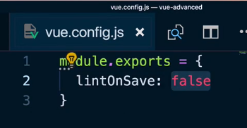 이렇게 꺼줌

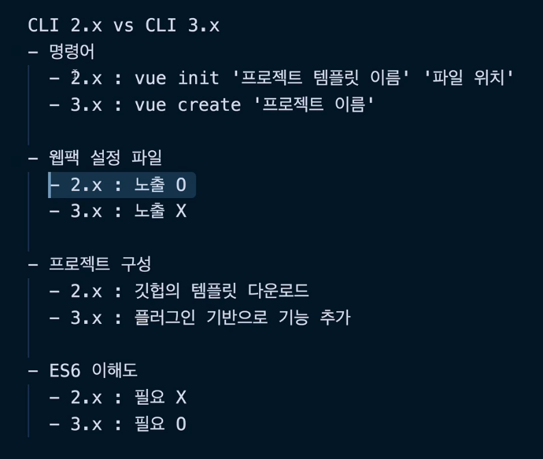

## Vue_router

> [Vue.js 중급 ES6 Modules 강좌 링크](https://www.inflearn.com/course/vue-pwa-vue-js-중급/lecture/11542)
>
> [Vue.js 중급 ES6 Enhanced Object Literal 강좌 링크](https://www.inflearn.com/course/vue-pwa-vue-js-중급/lecture/11537)
>
> `views`폴더는 라우터 링크 관련된 컴포넌트만 넣는게 좋다!

```sh
$ npm i vue-router --save
```

- `src` > `routes` > `index.js`

```js
import Vue from 'vue';
import VueRouter from 'vue-router';
import NewsView from '../views/NewsView.vue';
import AskView from '../views/AskView.vue';
import JobsView from '../views/JobsView.vue';
import ItemView from '../views/ItemView.vue';
import UserView from '../views/UserView.vue';

// Vue를 인식하기위해선 import해와야됨
Vue.use(VueRouter);
// vue 라우터 객체
export default new VueRouter({
   // hash값을 제거해줌
  mode: 'history',
  routes: [
    {
      // path는 url에 대한 정보(주소)
      // 기본url!
      path: '/',
      // news로 바로가게함
      // redirect : router기본속성, path가 들어가자마자 redirect(news)로 바로감
      redirect: '/news' 
    },
    {
      path: '/news',
      // url주소로갔을때 표시될 컴포넌트(페이지)
      component: NewsView,
    },
    {
      path: '/ask',
      component: AskView,
    },
    {
      path: '/jobs',
      component: JobsView,
    },
    {
      path: '/item',
      component: ItemView,
    },
    {
      path: '/user',
      component: UserView,
    }
  ]
})
```

- `main.js`

```js
import Vue from 'vue'
import App from './App.vue'
import router from './routes/index.js';

Vue.config.productionTip = false

new Vue({
  router,
  render: h => h(App)
}).$mount('#app')
// .$mount는 vue인스턴스가 생기고 나서 #app에 마운트 해준다는 뜻!
```

- `App.vue`

```vue
<template>
  <div id="app">
    <!-- router목록을 toobar컴포넌트에 넣음 -->
    <tool-bar></tool-bar>
      <!-- url이 만약 news면 router-view에 news컴포넌트가 들어감! -->
      <!-- url 주소에 따라 해당 컴포넌트가 들어감! -->
    <router-view></router-view>
  </div>
</template>

<script>
import ToolBar from './components/ToolBar.vue';

export default {
  components: {
    ToolBar
  }
}
</script>

<style>
body {
  margin: 0;
}

a {
  color: #34495e;
  text-decoration: none;
}
a:hover {
  color: #42b883;
  text-decoration: underline;
}
/* a router-link-active class */
a.router-link-active {
  text-decoration: underline;
}
</style>

```

- `ToolBar.vue`

```vue
<template>
  <div class="header">
    
    <router-link to="/news">News</router-link> |
    <router-link to="/ask">Ask</router-link> |
    <router-link to="/jobs">Jobs</router-link>
  </div>
</template>

<style scoped>
.header {
  background-color: #42b883;
  color: white;
  padding: 8px 8px 8px 25px;
  display: flex;
  align-items: center;
}
/* a태그 방문됐을때 */
.header a:visited {
  color: white;
}
/* 헤더 a태그가 active돼있을때 */
.header a:active {
  color: #35495e;
}
.fixed {
  position: fixed;
  width: 100%;
  z-index: 999;
}
.logo {
  width: 30px;
  margin-right: 18px;
}
a {
  margin: 0 5px;
}

</style>
```


## API구현

> [해커 뉴스 API 문서 주소](https://github.com/tastejs/hacker-news-pwas/blob/master/docs/api.md)
>
> [Vue.js 중급 강좌 화살표 함수 강의 링크](https://www.inflearn.com/course/vue-pwa-vue-js-중급/lecture/11534)
>
> [Reactivity in Depth](https://vuejs.org/v2/guide/reactivity.html#ad)Q
>
> axios를 쓸 때 화살표함수를 안쓰면 아래와 같이 this를 따로 변수에 정의해줘야됨
>
> 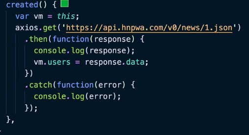

```sh
$ npm i axios --save
```

- `src` > `api` > `index.js`

```js
import axios from 'axios';

// const config = {
//   baseURL = 'https://api.hnpwa.com/v0/',
// };
//1. HTTP Request& Response와 관련된 기본 설정
const api = {
  news: 'https://api.hnpwa.com/v0/news/1.json',
  ask: 'https://api.hnpwa.com/v0/ask/1.json',
  jobs: 'https://api.hnpwa.com/v0/jobs/1.json',
  user: 'https://api.hnpwa.com/v0/user/',
  item: 'https://api.hnpwa.com/v0/item/'
};

// 2. API함수들을 정리
function fetchNews() {
  // api의 news url을 가져와서 axios get요청 보냄
  return axios.get(api.news);
  // return axios.get(`${config.baseURL}news.1.json`);
}

function fetchAsk() {
  return axios.get(api.ask);
}

function fetchJobs() {
  return axios.get(api.jobs);
}

function fetchUser(id) {
  const url = `${api.user}${id}.json`;
  return axios.get(url);
}

function fetchItem(id) {
  const url = `${api.item}${id}.json`;
  return axios.get(url);
}

export {
  fetchNews,
  fetchAsk,
  fetchJobs,
  fetchUser,
  fetchItem
}
```

- `NewsView.vue`

```vue
<template>
  <div>
    news
  </div>
</template>

<script>
import { fetchNews } from '../api/index.js';

export default {
  created() {
    fetchNews()
      .then(response => console.log(response))
      .catch(error => console.log(error));
  }
}
</script>

<style>

</style>

```

- `AskView.vue`

```vue
<template>
  <div>
    ask
  </div>
</template>

<script>
import { fetchAsk } from '../api/index.js';

export default {
  // 컴포넌트 생성되자마자 실행 (라이프사이클 훅)
  created() {
    // axios의 결과로 promise가 return됨, 그래서 .then,.catch사용가능
    fetchAsk()
      .then(response => console.log(response))
      .catch(error => console.log(error));
  }
}
</script>

<style>

</style>
```


### (참고) this

> JS는 기본적으로 전역(`window`)으로 변수가 시작함
>
> 예시) this
>
> 1. 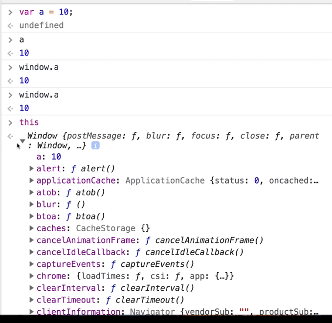
> 2. 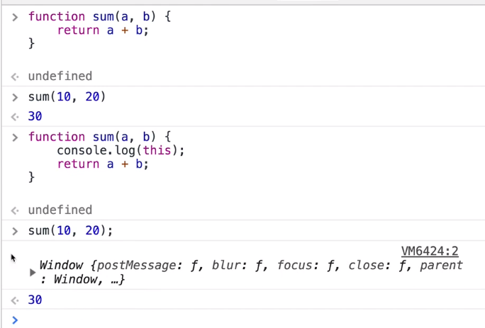
>
> 이렇게 this는 함수에서도 전역에서도 window를 가리킴
>
> 하지만 여기 `Vue`라는 함수의 this는 함수자체를 가리킴
>
> 3. 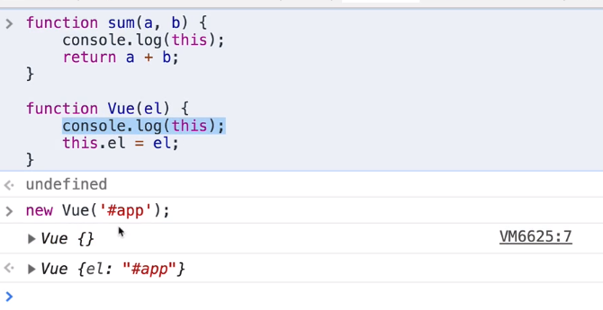
> 4. 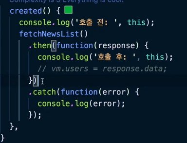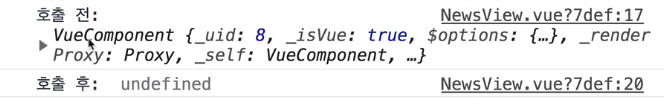
>
> 4번의 this는 호출전에는 Vue를 가리키지만, 호출 후에는 undefined! why??
>
> 비동기호출을 할때는 현재 위치에서 벗어난 this가 생김! 그래서 특히 callback함수에서! 그래서 this가 처리 후에는 undefined가 되는것, 그래서 이럴때 this를 변수에 담아줘서 쓰던가, 화살표함수로 사용한다! 그러면 뷰의 this가 됨!


### Callback

> 인자로 전달되는 함수
>
>  [비동기 처리와 콜백 함수](https://joshua1988.github.io/web-development/javascript/javascript-asynchronous-operation/)

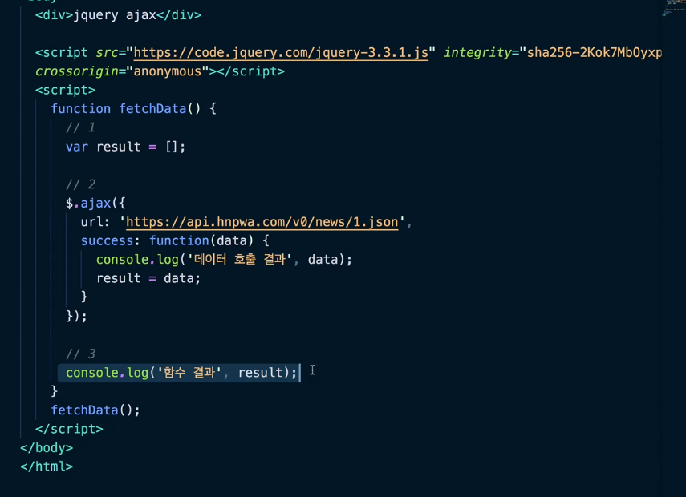

이렇게 callback함수를 ajax로 데이터 요청하고나서 요청한동안 3번이 먼저 찍히고, 성공한 2번이 찍히게됨 

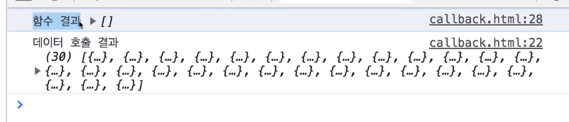

이럴때 비동기처리가 필요하다!, 그렇기때문에 Promise가 등장함

### Promise

>  [프로미스 쉽게 이해하기 글 주소](https://joshua1988.github.io/web-development/javascript/promise-for-beginners/)
>
> [Promise MDN 주소](https://developer.mozilla.org/ko-KR/docs/Web/JavaScript/Reference/Global_Objects/Promise)
>
> Promise객체가 .then, .catch를 쓸 수 있음

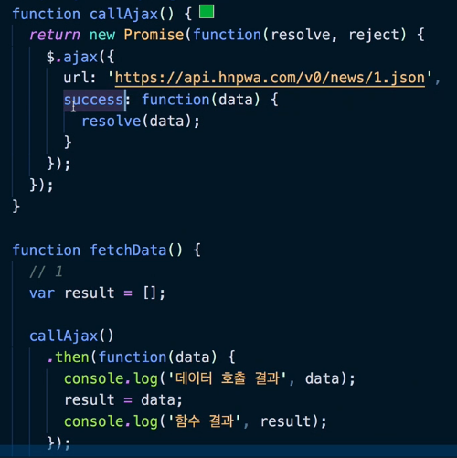

callAjax는 Promise객체를 반환해서 ajax가 성공한 결과가 resolve(data)에 담기게 되고 그게 .then의 data로 들어가게됨!


## Vuex

> Vuex를 거쳐서 newView로 data를 보냄
>
> 여러컴포넌트간 data를 조작하기 위해 store에 data를 관리하고 그것을 가져와 쓸 수 있게 한다. 
>
> \- [Vue.js 중급 강좌 Vuex 강의 링크](https://www.inflearn.com/course/vue-pwa-vue-js-중급/lecture/11544)
>
> \- [Vuex Data Flow](https://vuex.vuejs.org/)
>
> \- [ES6 Destructuring 설명 글(e북)](https://joshua1988.github.io/es6-online-book/destructuring.html)
> \- [Vue.js 중급 강좌 map 헬퍼 함수 강의 링크](https://www.inflearn.com/course/vue-pwa-vue-js-중급/lecture/11559)
>
> \- [ES6 Spread Operator 설명 글(e북)](https://joshua1988.github.io/es6-online-book/spread-operator.html)
>
> 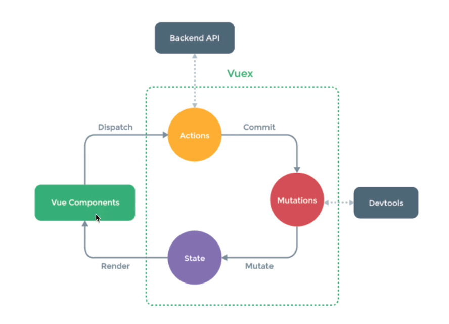

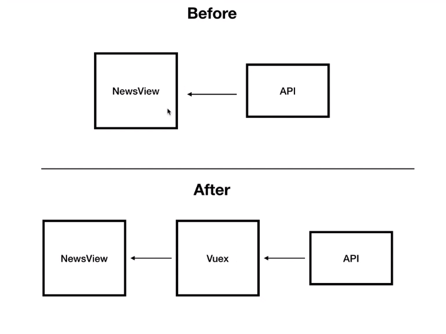

```sh
//dependencies에 vuex가 들어감
$ npm i vuex
```

- main.js에 store를 만들어도되지만 그러면 너무 복잡해지고 main.js는 전체를 그려주는데 본질을 흐리게됨, 관리하기 편하게 하기위해 `store` >`index.js`파일을 만들어 넣어줌

```js
//main.js
import Vue from 'vue'
import App from './App.vue'
import router from './routes/index.js';
import store from './store/index.js';

Vue.config.productionTip = false

new Vue({
  router,
  store,
  render: h => h(App)
}).$mount('#app')

```

### Vuex store속성 모듈화

- `store` > `index.js`

```js
import Vue from 'vue';
import Vuex from 'vuex';
import getters from './getters.js';
import mutations from './mutations.js';
import actions from './actions.js';

Vue.use(Vuex);

export default new Vuex.Store({
  strict: process.env.NODE_ENV !== 'production',
  state: {
    news: [],
    ask: [],
    jobs: [],
    user: {},
    item: {}
  },
  getters,
  mutations,
  actions,
})
```

- `store` > `actions.js`

```js
import {
  fetchNews,
  fetchAsk,
  fetchJobs,
} from '../api/index.js';

 
export default {
  // 이렇게 {commit}을 인자로 하면 context.commit이라고 안적어도됨
  // {data} === response.data와 같은원리
  FETCH_NEWS({ commit }) {
    // respnse.data를 state에 담고싶다. 하지만 vuex구조상, api에서 불러온 데이터를 actions에서(비동기호출) 호출하고 -> 그 data를 꺼내서 바로 state에 넣고싶지만, mutation을 지나서 state에 넣어주게끔 되어있다
    // 그래서 commit으로 SET_NEWS라는 mutations을 호출하고, response.data를 인자로 보냄
    return fetchNews().then(response => commit('SET_NEWS', response.data));
    // return fetchNews().then({data} => commit('SET_NEWS', data));
  },
  FETCH_ASK({ commit }) {
    return fetchAsk().then(response => commit('SET_ASK', response.data));
  },
  FETCH_JOBS({ commit }) {
    return fetchJobs().then(response => commit('SET_JOBS', response.data));
  },
}
```

- `store` > `mutations.js`

```js
export default {
  // 첫번째인자는 state
  SET_NEWS(state, news) {
    // data로 넘어온것을 state에 저장해줌
    state.news = news;
  },
  SET_ASK(state, ask) {
    state.ask = ask;
  },
  SET_JOBS(state, jobs) {
    state.jobs = jobs;
  }
}
```

- `NewsView.vue`

```vue
<template>
  <div>
    <!-- store에서 state에저장된 news를 가져옴 -->
    <p v-for="news in this.$store.state.news" :key="news.id">
      <a :href="news.url">{{ news.title }}</a><br>
      <small>{{ news.time_ago }} by {{ news.domain }}</small>
    </p>
  </div>
</template>

<script>
export default {
  created() {
    // FETCH_NEWS라는 actions호출
    this.$store.dispatch('FETCH_NEWS')
    // axios결과 promise가반환되고 성공하면.then으로, 실패헤면 error를 .catch로 가져감
      .then(() => console.log('success'))
      .catch(() => console.log('fail'));
  }
}
</script>

<style>

</style>

```

- `AskView.vue`

```vue
<template>
  <div>
    <p v-for="ask in this.$store.state.ask" :key="ask.id">
      <a :href="ask.url">{{ ask.title }}</a><br>
      <small>{{ ask.time_ago }} by {{ ask.user }}</small>
    </p>
  </div>
</template>

<script>
export default {
  created() {
    this.$store.dispatch('FETCH_ASK')
      .then(() => console.log('success'))
      .catch(() => console.log('fail'));
  }
}
</script>

<style>

</style>

```

- `UserView.vue`

```vue
<template>
  <div>
    user
  </div>
</template>

<script>
import { fetchUser } from '../api/index.js';

export default {
  created() {
    fetchUser('davideast')
      .then(response => console.log(response))
      .catch(error => console.log(error));
  }
}
</script>

<style>

</style>

```

- `ItemView.vue`

```vue
<template>
  <div>
    item
  </div>
</template>

<script>
import { fetchItem } from '../api/index.js';

export default {
  created() {
    fetchItem(1)
      .then(response => console.log(response))
      .catch(error => console.log(error));
  }
}
</script>

<style>

</style>

```

##  Dynamic router

> \- [Dynamic Route Matching 공식 문서](https://router.vuejs.org/guide/essentials/dynamic-matching.html)
>
> \- [해커 뉴스 API 문서 주소](https://github.com/tastejs/hacker-news-pwas/blob/master/docs/api.md)
>
> \- [ES6 템플릿 리터럴 설명 글(e북)](https://joshua1988.github.io/es6-online-book/template-literal.html)
>
> [Font awesome 사이트](https://fontawesome.com/)
>
> [v-html API 문서](https://vuejs.org/v2/api/#v-html)
>
> [v-html과 데이터 바인딩 차이점 문서](https://vuejs.org/v2/guide/syntax.html#Raw-HTML)

- `index.js`

```js
import Vue from 'vue';
import VueRouter from 'vue-router';
import NewsView from '../views/NewsView.vue';
import AskView from '../views/AskView.vue';
import JobsView from '../views/JobsView.vue';
import ItemView from '../views/ItemView.vue';
import UserView from '../views/UserView.vue';

Vue.use(VueRouter);

export default new VueRouter({
  mode: 'history',
  routes: [
    {
      path: '/',
      redirect: '/news' 
    },
    {
      path: '/news',
      component: NewsView,
    },
    {
      path: '/ask',
      component: AskView,
    },
    {
      path: '/jobs',
      component: JobsView,
    },
    {
      // item의 id값으로 itemview의 itemid를 넘겨줌
      path: '/item/:id',
      component: ItemView,
    },
    {
      // username이 params의 id값으로 넘어감
      path: '/user/:id',
      component: UserView,
    }
  ]
})
```

- `NewsView.vue`

```vue
<template>
  <div>
    <p v-for="news in this.$store.state.news" :key="news.id">
      <a :href="news.url">{{ news.title }}</a><br>
      <small>
        {{ news.time_ago }} 
        by 
        <!-- news.user를 클릭했을 때 user로 가기위해 router-link사용, user의 이름을 넘겨야되니까 new.user도 같이 넘김 -->
        <!-- <router-link :to="'/user/' + news.user">{{ news.user }}</router-link> -->
        <router-link :to="`/user/${news.user}`">{{ news.user }}</router-link>
      </small>
    </p>
  </div>
</template>

<script>
export default {
  created() {
    this.$store.dispatch('FETCH_NEWS')
      .then(() => console.log('success'))
      .catch(() => console.log('fail'));
  }
}
</script>

<style>

</style>

```

username 이렇게 path에 `:id`를 하면 news.user를 눌렀을 때 path에 user가 찍히고, user가 params의 id값으로 넘어감!

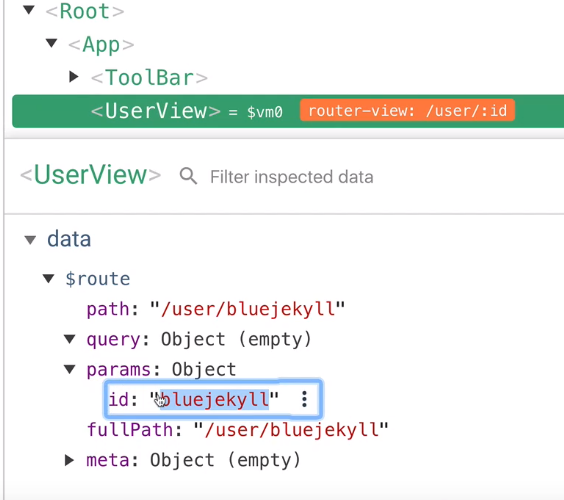

- `index.js`

```js
import axios from 'axios';

const api = {
  news: 'https://api.hnpwa.com/v0/news/1.json',
  ask: 'https://api.hnpwa.com/v0/ask/1.json',
  jobs: 'https://api.hnpwa.com/v0/jobs/1.json',
  user: 'https://api.hnpwa.com/v0/user/',
  item: 'https://api.hnpwa.com/v0/item/'
};

function fetchNews() {
  return axios.get(api.news);
}

function fetchAsk() {
  return axios.get(api.ask);
}

function fetchJobs() {
  return axios.get(api.jobs);
}
// id로 넘어온 user를 url에 넣어서 get요청
function fetchUser(id) {
  const url = `${api.user}${id}.json`;
  return axios.get(url);
}

function fetchItem(id) {
  const url = `${api.item}${id}.json`;
  return axios.get(url);
}

export {
  fetchNews,
  fetchAsk,
  fetchJobs,
  fetchUser,
  fetchItem
}
```


- `actions.js`

```js
import {
  fetchNews,
  fetchAsk,
  fetchJobs,
  fetchUser,
  fetchItem
} from '../api/index.js';

export default {
  FETCH_NEWS({ commit }) {
    return fetchNews().then(response => commit('SET_NEWS', response.data));
  },
  FETCH_ASK({ commit }) {
    return fetchAsk().then(response => commit('SET_ASK', response.data));
  },
  FETCH_JOBS({ commit }) {
    return fetchJobs().then(response => commit('SET_JOBS', response.data));
  },
  // userId로 user가 넘어옴
  FETCH_USER({ commit }, userId) {
    // SET_USER라는 mutations로 fetchUser를 get요청으로 보냈을때 결과 값을 인자로 보내서 state에 저장
    return fetchUser(userId).then(res => commit('SET_USER', res.data));
  },
  FETCH_ITEM({ commit }, itemId) {
    return fetchItem(itemId).then(res => commit('SET_ITEM', res.data));
  },

}
```

- `mutations.js`

```js
export default {
  SET_NEWS(state, news) {
    state.news = news;
  },
  SET_ASK(state, ask) {
    state.ask = ask;
  },
  SET_JOBS(state, jobs) {
    state.jobs = jobs;
  },
  SET_USER(state, user) {
    state.user = user;
  },
  SET_ITEM(state, item) {
    state.item = item;
  },
}
```

- `getters.js`

```js
export default {
  fetchedItem(state) {
    return state.item;
  },
  // fetchedUser는 state.user에 저장된값을 반환
  fetchedUser(state) {
    return state.user;
  }
}
```

- `UserView.vue`

```vue
<template>
  <div>
    <p>id : {{ fetchedUser.id }}</p>
    <p>karma : {{ fetchedUser.karma }}</p>
    <p>joined : {{ fetchedUser.created }}</p>
  </div>
</template>

<script>
import { mapGetters } from 'vuex';

export default {
  computed: {
    ...mapGetters(['fetchedUser']),
  },
  created() {
    // parms의 id를 꺼내면 user값이 나옴
    const userId = this.$route.params.id;
    // user를 FETCH_USER라는 actions의 인자로 보냄
    this.$store.dispatch('FETCH_USER', userId);
  },
}
</script>

<style>

</style>

```

- `AskView.vue`

```vue
<template>
  <div>
    <p v-for="ask in this.$store.state.ask" :key="ask.id">
      <!-- 질문id값인 url로 보내줌 -->
      <router-link :to="`item/${ask.id}`">{{ ask.title }}</router-link><br>
      <small>
        {{ ask.time_ago }} 
        by 
        <router-link :to="'/user/' + ask.user">{{ ask.user }}</router-link>
      </small>
    </p>
  </div>
</template>

<script>
export default {
  created() {
    this.$store.dispatch('FETCH_ASK')
      .then(() => console.log('success'))
      .catch(() => console.log('fail'));
  }
}
</script>

<style>

</style>

```

- `JobsView.vue`

```vue
<template>
  <div>
    <p v-for="job in this.$store.state.jobs" :key="job.id">
      <a :href="job.url">{{ job.title }}</a><br>
      <small>{{ job.time_ago }} by {{ job.domain }}</small>
    </p>
  </div>
</template>

<script>
export default {
  created() {
    this.$store.dispatch('FETCH_JOBS')
      .then(() => console.log('success'))
      .catch(() => console.log('fail'));
  }
}
</script>

<style>

</style>
```

- `ItemView.vue`

```vue
<template>
  <div>
    <section class="header-container">
      <!-- 질문 상세 정보 -->
      <div class="user-container">
        <div>
          <i class="fas fa-user-circle"></i>
        </div>
        <div class="user-description">
          <!-- 사용자프로필 -->
          <router-link :to="'/user/' + userName">{{ userName }}</router-link>
          <!-- 사용자 정보 -->
          <div class="time">{{ userTimeAgo }}</div>
        </div>
      </div>
      <h2>{{ userQuestion }}</h2>
    </section>
    <section>
      <!-- 질문댓글 -->
      <!-- v-html은 html태그를 text가 아니라 html태그로 인식함, 보안등 여러 문제있지만 공식문서 잘 보고 쓰기 -->
      <div v-html="userContent" class="content"></div>
    </section>
  </div>
</template>

<script>
import { mapGetters } from 'vuex';

export default {
  created() {
    const itemId = this.$route.params.id;
    this.$store.dispatch('FETCH_ITEM', itemId);
  },
  computed: {
    // fetchedITem을 꺼냄
    ...mapGetters(['fetchedItem']),
    userName() {
      return this.fetchedItem.user;
    },
    userTimeAgo() {
      return this.fetchedItem.time_ago;
    },
    userQuestion() {
      return this.fetchedItem.title;
    },
    userContent() {
      return this.fetchedItem.content;
    },
  },

}
</script>

<style scoped>
.user-container {
  display: flex;
  align-items: center;
}
.fa-user-circle {
  font-size: 2.5rem;
}
.user-description {
  padding-left: 8px;
}
.time {
  font-size: 0.7rem;
}
h3 {
  margin-bottom: 0.5rem;
  margin-left: 0.2rem;
}
.content {
  border: ridge;
  padding: 0.5rem;
}
</style>
```


### router transition

> \- [라우터 트랜지션 문서](https://router.vuejs.org/guide/advanced/transitions.html#per-route-transition)
>
> \- [뷰 트랜지션 문서](https://vuejs.org/v2/guide/transitions.html)
>
> \- [Vue.js 중급 강좌 뷰 트랜지션 강의 링크](https://www.inflearn.com/unit/d-뷰-트랜지션-및-애니메이션-효과-적용/?id=136498)

- `App.vue`

```vue
<template>
  <div id="app">
    <progress-bar :loading="loading"></progress-bar>
    <tool-bar></tool-bar>
    <!-- name이 routing-fade인 css가 적용됨 -->
    <transition name="routing-fade" mode="out-in">
      <router-view @on:progress="onProgress" @off:progress="offProgress"></router-view>
    </transition>
  </div>
</template>

<script>
import ToolBar from './components/ToolBar.vue';
import ProgressBar from './components/ProgressBar.vue';

export default {
  components: {
    ToolBar,
    ProgressBar
  },
  data() {
    return {
      loading: false,
    }
  },
  methods: {
    onProgress() {
      this.loading = true;
    },
    offProgress() {
      this.loading = false;
    }
  },

}
</script>

<style>
body {
  margin: 0;
}

a {
  color: #34495e;
  text-decoration: none;
}
/* a태크게 마우스 올리면 색바뀜 */
a:hover {
  color: #42b883;
  text-decoration: underline;
}
/* a태그 클릭됐을때 밑줄 */
a.router-link-active {
  text-decoration: underline;
}

/* Router Transition */
/* 부드러운 페이지 이동 */
.routing-fade-enter-active, .routing-fade-leave-active {
  transition: opacity .3s ease;
}
.routing-fade-enter, .routing-fade-leave-to
/* .routing-fade-leave-active below version 2.1.8 */ {
  opacity: 0;
}
</style>

```


## Component 공통화

> jobs, news, ask 전부listittem들이 내용만 달라졌지 구성하는건 유사하다! 이걸 listitem컴포넌트로 합쳐줘서 반복되는 코드를 줄일 수 있다.

- jobs, news, ask는 정보를 불러오는 api가 다르다! 이걸 분기처리 해줘야됨!

1. routes의 path로 처리

- `Listitem.vue`

```js
export default {
  computed: {
    listItems() {
      if (this.$route.path === "/news") {
        return this.$store.state.news;
      } else if (this.$route.path === "/ask") {
        return this.$store.state.ask;
      } else if (this.$route.path === "/jobs") {
        return this.$store.state.jobs;
      }
    }
  }
}
```

2. rouer에 name을 지정해줘서 name으로 처리

- `index.js`

```js
    {
      path: '/news',
      name: 'news',
      component: NewsView,
    },
    {
      path: '/ask',
      name: 'ask',
      component: AskView,
    },
    {
      path: '/jobs',
      name: 'jobs',
      component: JobsView,
    },
```

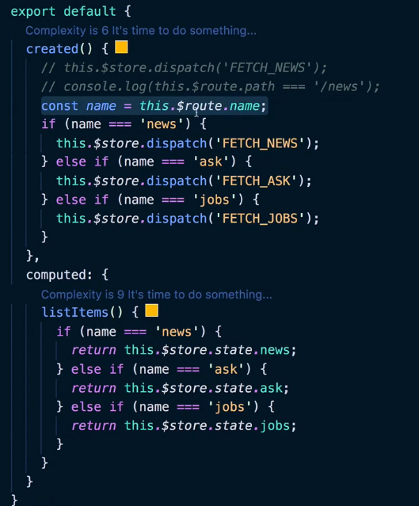

- `ListItem.vue`

```vue
<template>
  <ul class="news-list">
    <li v-for="news in listItems" :key="news.id" class="post">
      <div class="points">
        <!-- 뉴스의 포인트, 없으면 0 -->
        {{ news.points || 0 }}
      </div>
      <div>
        <!-- 기타 정보 영역 -->
        <p class="news-title">
          <!-- template은 가상의 태그, v-if가 true면, a태그 보여줌 -->
          <template v-if="news.domain">
            <a :href="news.url">{{ news.title }}</a><small class="link-text" v-if="news.domain">({{ news.domain }})</small>
          </template>
          <!-- 아니라면 이거 보여줌 -->
          <template v-else>
            <router-link :to="`/item/${news.id}`">{{ news.title }}</router-link><small><a class="link-text" :href="news.domain" v-if="news.domain">({{ news.domain }})</a></small>
          </template>
        </p>
        <small v-if="news.user" class="link-text">
          by
          <router-link :to="`/user/${news.user}`" class="link-text">{{ news.user }}</router-link>
        </small>
        <small v-if="news.time_ago" class="link-text">
          {{ news.time_ago }}
        </small>
      </div>
    </li>
  </ul>
</template>

<script>
export default {
  computed: {
    listItems() {
      if (this.$route.path === "/news") {
        return this.$store.state.news;
      } else if (this.$route.path === "/ask") {
        return this.$store.state.ask;
      } else if (this.$route.path === "/jobs") {
        return this.$store.state.jobs;
      }
    }
  }
}
</script>

<style scoped>
.news-list {
  padding: 0;
  margin: 0;
}
.post {
  list-style: none;
  display: flex;
  align-items: center;
  border-bottom: 1px solid #eee;
}
.points {
  width: 80px;
  height: 60px;
  color: #42b883;
  display: flex;
  align-items: center;
  justify-content: center;
}
.link-text {
  color: #828282;
}
.news-title {
  margin: 0;
}
</style>

```

- `NewsView.vue` 

> ask, jobs도 유사함

```vue
<template>
  <div>
    <list-item></list-item>
  </div>
</template>

<script>
import ListItem from '../components/ListItem.vue';

export default {
  components: {
    ListItem
  },
  created() {
    this.$emit('on:progress');
    this.$store.dispatch('FETCH_NEWS')
      .then(() => this.$emit('off:progress'))
      .catch(() => console.log('fail'));
  }
}
</script>

<style>

</style>

```


### 데이터 관리 방법 2가지

> Vuex에 더 적합한(?)부분은 1번, 
>
> 2번은 컨포넌트 태그 차원에서 명시적으로 보여주는 이점이 있음
>
> 둘다 틀린건 아님

#### UserVIew의 하위 컴포넌트가 UserProfile일때 UserProfile은 data를 어떻게 받을까?

##### 1. UserProfile에서 바로 computed로 store에 저장된user정보 가져오기

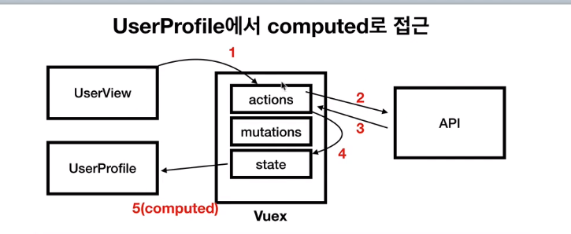

> 그전에 `UserView`에서 user정보를 `FETCH_USER` actions를 통해 state에 user 정보를 저장해둠
>
> 그 저장된 user를 UserProfile컴포넌트에서  store에서 꺼내기
>
> ```js
>     const userId = this.$route.params.id;
>     this.$store.dispatch('FETCH_USER', userId)
>       .then(() => this.$emit('off:progress'))
>       .catch(error => console.log('user fetch error', error));
> ```

``` vue
<template>
  <div class="user-container">
    <div>
      <i class="fas fa-user-circle"></i>
    </div>
    <div class="user-description">
      <slot name="userName"></slot>
      <router-link :to="'/user/' + userInfo.user">{{ userInfo.user }}</router-link>
      <div class="time">{{ userInfo.time_ago || 'Joined ' + userInfo.created + ','}}
        <span v-if="userInfo.points">, {{ userInfo.points }} points</span>
        <slot name="userKarma"></slot>
      </div>
    </div>
  </div>
</template>

<script>
export default {
  computed: {
     userInfo(){
       return this.$store.state.user;  
     },

};
</script>
```


##### 2. UserView에서 props로 내려서 UserProfile에서 사용

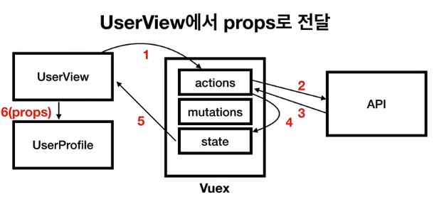

- `UserView.vue`

> `FETCH_USER`로 state에 user를 저장하고  userInfo props로 fetchedUser를 내려보냄

```vue
<template>
  <div class="container">
    <h2>User Profile</h2>
    <user-profile :userInfo="fetchedUser">
      <div slot="userName">{{ fetchedUser.id }}</div>
      <span slot="userKarma">{{ fetchedUser.karma }} karma</span>
    </user-profile>

  </div>
</template>

<script>
import { mapGetters } from 'vuex';
import UserProfile from '../components/UserProfile.vue';

export default {
  components: {
    UserProfile
  },
  created() {
    this.$emit('on:progress');
    const userId = this.$route.params.id;
    this.$store.dispatch('FETCH_USER', userId)
      .then(() => this.$emit('off:progress'))
      .catch(error => console.log('user fetch error', error));
  },
  computed: {
    ...mapGetters(['fetchedUser']),
  },
}
</script>
```

- `UserProfile.vue`

```vue
<template>
  <div class="user-container">
    <div>
      <i class="fas fa-user-circle"></i>
    </div>
    <div class="user-description">
      <slot name="userName"></slot>
      <router-link :to="'/user/' + userInfo.user">{{ userInfo.user }}</router-link>
      <div class="time">{{ userInfo.time_ago || 'Joined ' + userInfo.created + ','}}
        <span v-if="userInfo.points">, {{ userInfo.points }} points</span>
        <slot name="userKarma"></slot>
      </div>
    </div>
  </div>
</template>

<script>
/* eslint-disable */
import { mapGetters } from 'vuex';

export default {
  // 이렇게 props로 내려줘도 되고, 아니면 userprofile에서 바로 store에서 가져옴
  props: {
    userInfo: {
      type: Object
    }
  },
  computed: {
    ...mapGetters([
      'userContent', 'userQuestion', 'userName', 'userTimeAgo', 'contentPoints',
    ]),
  },
};
</script>
```


### (참고) slot 상위에서 하위의 내용을 채워줌

> \- [Props Validation API 문서](https://vuejs.org/v2/guide/components-props.html#Prop-Validation)
>
> \- [Vue.js 중급 강좌 slot 강의 링크](https://www.inflearn.com/course/vue-pwa-vue-js-중급/lecture/11520)
>
> ItemVIew -> info.user
>
> UserView -> info.id
>
> 이렇게 접근하는 방식이 다르기 때문에 v-if가 아니라  slot을 이용해서 표현함!

- 하위컴포넌트에서 slot name ="이름"을 지정하고, 상위컴포넌트에서 html 태그에 slot="이름"으로 지정해주면 하위컴포넌트의 그 영역에 값이 들어감

- `UserProfile.vue`(하위컴포넌트)

```vue
<template>
<!-- template태그는 보여줄때 태그없이 text로 보여줌 -->
  <div class="user-container">
    <div>
      <i class="fas fa-user-circle"></i>
    </div>
    <div class="user-description">
      <!-- slot이름 상위 컴포넌트에서 정의할 영역 -->
      <slot name="userName"></slot>
      <router-link :to="'/user/' + userInfo.user">{{ userInfo.user }}</router-link>
      <div class="time">{{ userInfo.time_ago || 'Joined ' + userInfo.created + ','}}
        <span v-if="userInfo.points">, {{ userInfo.points }} points</span>
        <slot name="userKarma"></slot>
      </div>
    </div>
  </div>
</template>
```

- UserView.vue

```vue
<template>
  <div class="container">
    <h2>User Profile</h2>
    <user-profile :userInfo="fetchedUser">
      <div slot="userName">{{ fetchedUser.id }}</div>
      <span slot="userKarma">{{ fetchedUser.karma }} karma</span>
    </user-profile>

  </div>
</template>
```


### (참고) 이벤트 버스를 이용한 spinner 컴포넌트 구현

- `src` > `utils` > `bus.js`

> **export const와, export default의 차이**
>
> ```js
> //export const와, export default의 차이
> //bus.js
> export const bus = new Vue();
> //App.vue
> import { bus } from './bus.js'
> //bus.js
> export default new Vue();
> // App.vue, export defalut를 썼을 때는 뭐를 선언하든지간에 바로 import해서 쓸 수 있음
> import Bus from './bus.js';
> ```

```js
import Vue from 'vue';
// 이벤트 버스는 빈 이벤트 객체를 만들어서 그 이벤트 객체를 통해 컴포넌트간 데이터를 전달하는 것을 의미
// 받는 쪽에서 bus를 선언하면 인스턴스 객체가 들어감

export default new Vue();
```

- `Spinner.vue`

```vue
<template>
  <div class="lds-facebook" v-if="loading">
    <div>
    </div>
    <div>
    </div>
    <div>
    </div>
  </div>
</template>

<script>
export default {
  props: {
    loading: {
      type: Boolean,
      required: true,
    },
  },
}
</script>

<style>
.lds-facebook {
  display: inline-block;
  position: absolute;
  width: 64px;
  height: 64px;
  top: 47%;
  left: 47%;
}
.lds-facebook div {
  display: inline-block;
  position: absolute;
  left: 6px;
  width: 13px;
  background: #42b883;
  animation: lds-facebook 1.2s cubic-bezier(0, 0.5, 0.5, 1) infinite;
}
.lds-facebook div:nth-child(1) {
  left: 6px;
  animation-delay: -0.24s;
}
.lds-facebook div:nth-child(2) {
  left: 26px;
  animation-delay: -0.12s;
}
.lds-facebook div:nth-child(3) {
  left: 45px;
  animation-delay: 0;
}
@keyframes lds-facebook {
  0% {
    top: 6px;
    height: 51px;
  }
  50%, 100% {
    top: 19px;
    height: 26px;
  }
}
</style>
```

- `routes` > `actions.js`

> 함수들 모두 return이 있어야된다! 화면에서 dispatch 호출하고나서 then(비동기처리)으로 chaining해줘야되는데 return이 안넘어오면 then으로 가지않음(promise객체가 아니라서)

```js
import {
  fetchNews,
  fetchAsk,
  fetchJobs,
  fetchUser,
  fetchItem,
  fetchList
} from '../api/index.js';

export default {
  FETCH_NEWS({ commit }) {
    return fetchNews().then(response => commit('SET_NEWS', response.data));
  },
  FETCH_ASK({ commit }) {
    return fetchAsk().then(response => commit('SET_ASK', response.data));
  },
  FETCH_JOBS({ commit }) {
    return fetchJobs().then(response => commit('SET_JOBS', response.data));
  },
  FETCH_USER({ commit }, userId) {
    return fetchUser(userId).then(res => commit('SET_USER', res.data));
  },
  FETCH_ITEM({ commit }, itemId) {
    return fetchItem(itemId).then(res => commit('SET_ITEM', res.data));
  },
  // hoc
  FETCH_LIST({ commit }, listType) {
    return fetchList(listType).then(res => commit('SET_LIST', res.data));
  },
}
```


- `NewsView.vue`

```vue
<template>
	<div>
    	<list-item></list-item>
    </div>
</template>
<script>
import ListItem from '../components/ListItem.vue';
import bus from '../utils/bus.js';
   	export default {
        components : {
            ListItem,
        },
        created() {
            bus.$emit.('start:spinner');
            this.$store.dispatch('FETCH_NEWS')
            	.then(() => this.$emit('end:spinner'))
      			.catch(() => console.log('fail'));
        }
    }
</script>
```


- `App.vue`

> 이벤트 버스는 이벤트를 등록하고 나면 off를 반드시 해줘야된다, 이벤트 버스는 이벤트 객체가 계속 쌓이기 떄문에 항상 앱, 컴포넌트의 역할이 끝나고나서 이벤트를 받았기 떄문에 off를 해줘야 이벤트 객체가 쌓잉지 않는다.

```vue
<template>
  <div id="app">
    <spinner :loading="loadingStatus"></spinner>
  </div>
</template>

<script>
import Spinner from './components/Spinner.vue';
import bus from './utils/bus.js';

export default {
  components: {
    Spinner,
  },
  data() {
    return {
      loadingStatus: false,
    }
  },
  methods: {
    startSpinner() {
      this.loadingStatus = true;
    },
    endSpinner() {
      this.loadingStatus = false;
    }
  },
  created() {
    //spinner시작
   	bus.$on('start:spinner', this.startSpinner);
    //spinner끝
    bus.$on('end:spinner', this.endSpinner);
  },
    //이벤트 버스는 이벤트를 등록하고 나면 off를 반드시 해줘야된다, 이벤트 버스는 이벤트 객체가 계속 쌓이기 떄문에 항상 앱, 컴포넌트의 역할이 끝나고나서 이벤트를 받았기 떄문에 off를 해줘야 이벤트 객체가 쌓잉지 않는다.
    beforeDestroy(){
    bus.$off('start:spinner', this.startSpinner);
    bus.$off('end:spinner', this.endSpinner);    
    }
}
</script>
```


## 컴포넌트의 코드마저 재사용하는 HOC(하이오더컴포넌트)

> [리액트 하이 오더 컴포넌트 공식 문서](https://reactjs.org/docs/higher-order-components.html)
>
> 뷰의 하이 오더 컴포넌트는 리액트의 하이 오더 컴포넌트에서 기원된 것
>
> **컴포넌트의 로직(코드)을 재사용하기 위한 고급 기술**
>
> 예) news, ask, jobs 컴포넌트들이 하는 행동이 같다! -> createListView로 재활용해보자

- `routes`>`index.js`

```js
// hoc
import createListView from '../views/CreateListView';

Vue.use(VueRouter);

export default new VueRouter({
  mode: 'history',
  routes: [
    // createListView를 재사용할 news,ask,jobs에 적음!, 기존에 있던 컴포넌트위에 createListView (하이오더)컴포넌트가 더 생겼다
    {
      path: '/news',
      name: 'news',
      component: createListView('NewsView'),
    },
    {
      path: '/ask',
      name: 'ask',
      component: createListView('AskView'),
    },
    {
      path: '/jobs',
      name: 'jobs',
      component: createListView('JobsView'),
    },
    {
```


- `api` > `index.js`

```js
// hoc
function fetchList(type) {
  const url = `https://api.hnpwa.com/v0/${type}/1.json`;
  return axios.get(url);
}
```

- `store` > `index.js`

```js
import Vue from 'vue';
import Vuex from 'vuex';
import getters from './getters.js';
import mutations from './mutations.js';
import actions from './actions.js';

Vue.use(Vuex);

export default new Vuex.Store({
  strict: process.env.NODE_ENV !== 'production',
  state: {
    // 추가
    list: [],
  },
  getters,
  mutations,
  actions,
})
```

- `actions.js`

```js
  // hoc
  // listType, 어떤 page인지 받음
  FETCH_LIST({ commit }, listType) {
    return fetchList(listType).then(res => commit('SET_LIST', res.data));
  },
}
```

- `mutations.js`

```js
  SET_LIST(state, list) {
    state.list = list;
  },
```


- `views` > `CreateListView.js`

> 중복되는 코드들을 전부 넣어줌
>
> 라우트에서 name을 줘서  createListView에서 name인자로 이름을 받아서 연결해주고, 재사용하는 로직을 created()에 넣어서 사용

```js
import ListView from './ListView.vue';
import bus from '../utils/bus.js';
// export default로 function을 꺼냄
// name이름을 받음
export default function createListView(name) {
  return {
    // 재사용할 인스턴스(컴포넌트) 옵션들이 들어갈 자리
    // el,data,created 등 다양한 것들이 올 수 있음
    // name은 어떤 data일지 구분하기 위해 넣어줌
    name,// newsView,jobsView등 이름을 받아서
    created() {
      bus.$emit.('start:spinner');
      // 이름을 같이 보내줌
      this.$store.dispatch('FETCH_LIST',this.$route.name)
        .then(() => this.$emit('end:spinner'))
        .catch(() => console.log('fail'));
    },
    render(createElement){
      return createElement(ListView);
    },
}
```

- `ListView.vue`

> ListItem 컴포넌트를 등록하는 역할만 한다!

```vue
<template>
  <div>
    <list-item></list-item>
  </div>
</template>

<script>
// listView에 기존에 있던 jobsView, askView, NewsView의 역할을 위임!
// data를 가져와서 뿌려주기!
import ListItem from '../components/ListItem.vue';

export default {
  components: {
    ListItem
  },
}
</script>
```


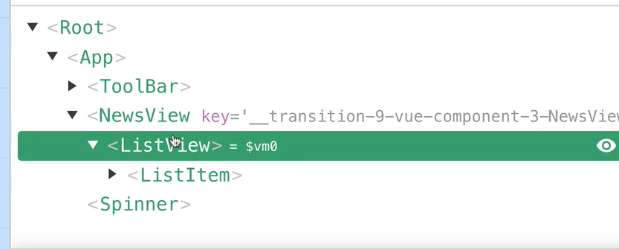

실제 하이오더 컴포넌트는 NewsView컴포넌트다,HOC컴포넌트는 name에 따라 이름이 달라지게 설정해둠

NewsView, Jobsview, ItemView는 지워도됨!

### HOC의 단점!

> 이렇게 HOC를 이용하면 컴포넌트 레벨이 깊어진다.
>
> newsView에서 재활용하던 로직들이 ListView에서 어떤식으로 변형하는 일이 생긴다던지 추가한다던지해서 통신하는 일이생기면 그때부터 레벨이 깊어지기 때문에 통신하기 까다로움
>
> HOC를 많이 쓸수록 깊이가 깊어지면서 자연스럽게 컴포넌트 통신에 있어서 불편한 현상들이 생김
>
> 그 부분에 있어서 더 편한게 Mixin

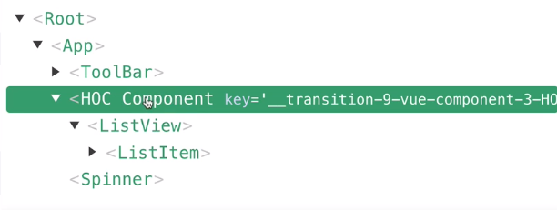

## Mixins

> **여러 컴포넌트 간에 공통으로 사용하고 있는 로직, 기능들을 재사용하는 방법**
>
> 믹스인에 정의할 수 있는 로직은 data, methods, created등과 같은 컴포넌트 옵션
>
> ```js
> //mixin
> export default {
>   //재사용할 컴포넌트 옵션 & 로직
> }
> 
> //hoc
> export default function create(){
>   // 재사용할 컴포넌트 옵션
> }
> ```

- `src` > `mixins`폴더 생성 후 > `ListMixin.js`

```js
import bus from '../utils/bus.js';
//mixin
export default {
  //재사용할 컴포넌트 옵션 & 로직
  created() {
    bus.$emit.('start:spinner');
    // 이름을 같이 보내줌
    this.$store.dispatch('FETCH_LIST', this.$route.name)
      .then(() => this.$emit('end:spinner'))
      .catch(() => console.log('fail'));
  },
}
```

- `NewVIew.vue`,

> jobsview, askview도 똑같이함

```vue
<template>
  <div>
    <list-item></list-item>
  </div>
</template>

<script>
import ListItem from '../components/ListItem.vue';
import ListMixin from '../mixins/ListMixin.js';
    
export default {
  components: {
    ListItem
  },
    mixins: [ListMixin],
}
</script>

<style>

</style>

```

이렇게 Mixins를 쓰면 NewsView아래 바로 ListItem이 옴

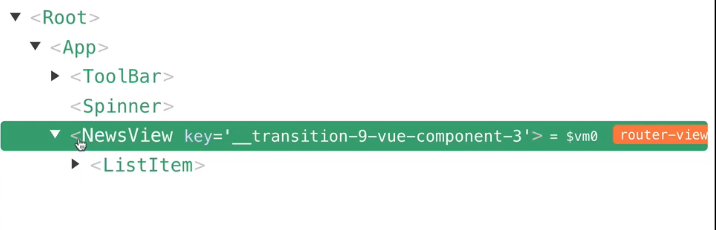

## 데이터 호출(router navigation vs created)

> \- [created 라이프 사이클 훅 API 문서](https://vuejs.org/v2/api/#created)
>
> \- [네비게이션 가드 블로그 글 링크](https://joshua1988.github.io/web-development/vuejs/vue-router-navigation-guards/)
>
> \- [네비게이션 가드 뷰 라우터 공식 문서](https://router.vuejs.org/guide/advanced/navigation-guards.html#global-guards)
>
> [데이터 호출 시점]
>
> 1. 라우터 네비게이션 가드(created보다 먼저 호출) -> *로딩시간동안 사용자에게 잠시 기다리라는 동작이 필요함(스피너, 로딩, 등)*
>
> - 특정 URL로 접근하기 전의 동작을 정의하는 속성(함수)
> - 사용자가 잠시 기다리더라도 데이터를 다 불러오고 화면을 전환하겠다!
>
> 2. 컴포넌트 라이프 사이클 훅
>
> - created : **컴포넌트가 생성** 되자마자 호출되는 로직
> - 일단 페이지부터 전환하고, 데이터를 뿌려주겠다!

예를 들어 URL이 NewsView에서 JobsView로 넘어가는데 이전 데이터가 보이면서 spinner 가 돈다! 

이건 보기에 좋지 않다! 내용을 불러오기 전 spinner가 돌게 만들어보자

HOC나 Mixin에서 created로 spinner를 호출하고 끄고 했다면 라우터 네비게이션 가드를 이용해보자!

스피너가 돌다가 데이터를 다 불러오면 스피너가 끝나고, 다음 URL로 이동!

- `routes` > `index.js`

```js
import Vue from 'vue';
import VueRouter from 'vue-router';
import { ItemView, UserView } from '../views';
import createListView from '../views/CreateListView';
import bus from '../utils/bus.js';
// this.$store는 인스턴스 안에서 사용가능하고, router에서 store를 접근하려면 store를 가져와야된다!(main.js에서 import하는것과 같이)
import store from '../store/index.js';

Vue.use(VueRouter);

export default new VueRouter({
  mode: 'history',
  routes: [
    {
      path: '/',
      redirect: '/news' 
    },
    {
      path: '/news',
      name: 'news',
      component: createListView('NewsView'),
      // to, from,next 3개의 인자를 받게됨
      // to : 이동할 URL의 라우팅 정보
      // from : 현재 URL의 라우팅 정보
      // next : 호출해줘야지 다음 URL로 이동하게됨
      beforeEnter(routeTo, routeFrom, next) {
        bus.$emit('on:progress');
        // this.$route.name도 특정 컴포넌트(인스턴스)에서 라우터에 대한 정보를 가져온 것
        // 그것은 이동할 URL의 라우팅정보의 name과 같으므로 to.name이다!
        store.dispatch('FETCH_LIST', routeTo.name)
        // 데이터를 다 불러왔을 떄 다음 URL로 이동
          .then(next())
          .catch((() => new Error('failed to fetch news items')));
      },
    },
//....
```

- `CreateListView.js`

> `mounted`를 이용해 spinner를 종료시킨다.
>
> data를 불러오는 순간 spinner가 꺼짐(거의동시에 일어남)
>
> 하지만 라우터네비게이션 가드에서 .then안에서 스피너를 끄고 next()를 호출하면 데이터가 보여지고나서도 살짝 스피너가 더 돈다
>
> 미묘한 차이지만 좀더 자연스럽게 만들려고!

```js
import ListView from './ListView.vue';
import bus from '../utils/bus.js';

export default function createListView(name) {
  return {
    name,
    // 인스턴스가 화면에 불러와서 나타나는게 완료됐을 때 spinner를 종료시킴!
    mounted() {
      bus.$emit('off:progress');
    },
    render(h) {
      return h(ListView);
    },
  };
}
```


## async & await

> [자바스크립트 async와 await](https://joshua1988.github.io/web-development/javascript/js-async-await/)
>
> async와 await는 자바스크립트의 비동기 처리 패턴 중 가장 최근에 나온 문법
>
> 기존의 비동기 처리 방식인 콜백 함수와 프로미스의 단점을 보완하고 개발자가 읽기 좋은 코드를 작성할 수 있게 도와줌
>
> ```js
> async function 함수명() {
>   await 비동기_처리_메서드_명();
> }
> ```
>
> 먼저 함수의 앞에 `async` 라는 예약어를 붙인다. 그러고 나서 함수의 내부 로직 중 HTTP 통신을 하는 비동기 처리 코드 앞에 `await`를 붙인다. 여기서 주의하셔야 할 점은 비동기 처리 메서드가 꼭 **프로미스 객체**를 반환해야 `await`가 의도한 대로 동작한다.
>
> 일반적으로 `await`의 대상이 되는 비동기 처리 코드는 [Axios](https://github.com/axios/axios) 등 프로미스를 반환하는 API 호출 함수다.
>
> 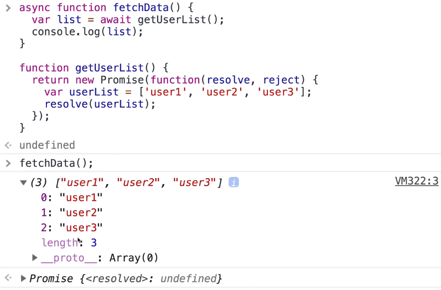

```vue
<template>
  <div>
    <button @click="loginUser">login</button>
    <h1>List</h1>
    <ul>
      <li v-for="item in items">{{ item }}</li>
    </ul>
  </div>
</template>

<script>
import axios from 'axios';

export default {
  data() {
    return {
      items: [],
    }
  },
  methods: {
    loginUser() {
      // open api
      axios.get('https://jsonplaceholder.typicode.com/users/1')
        .then(response => {
          if (response.data.id === 1){
            axios.get('https://jsonplaceholder.typicode.com/todos')
            .then(response => {
              this.items = response.data;
            })
          }
        })
        .catch(error => console.log(error));
    },
  },
}

</script>
```

위코드를 async & awiat로 바꿔보자 -> 더 직관적인 코드가됨!

위의 Promise 코드는 코드의 인덴팅이(깊이) 깊어질 뿐만 아니라 기본적으로 then, catch구조에 익숙해져야되지만

async, await는 결과값을 변수에 담고 요청하고 변수에 담고, 조건을 처리하고, 아주 직관적인 코드가 된다

```js
async loginUser1() {
      var response = await axios.get('https://jsonplaceholder.typicode.com/users/1');
      if (response.data.id === 1){
        var list = await axios.get('https://jsonplaceholder.typicode.com/todos');
        this.items = list.data;
      }
      // 위 비동기처리가 끝나고 콘솔도 찍힘, 저기서 멈춰버리지 않는다!
      // console.log(10);
    }
```

### async & await의 에러처리 (try, catch)

> try,catch는javascript의 에러 처리방법으로  then,catch보다 좋은게
>
>  Promise의 then,catch는 네트워크 요청에 대해서만 예외처리를 한다
>
> 반면에, try,catch는 비동기처리 분만 아니라 일반적인 js코드 에러까지 예외처리를 함,  더 포괄적이다

```js
    async loginUser1() {
      try {
        var response = await axios.get('https://jsonplaceholder.typicode.com/users/1');
        if (response.data.id === 1){
          var list = await axios.get('https://jsonplaceholder.typicode.com/todos');
          this.items = list.data;
        }
        
      } catch (error) {
        console.log(error);
      }
    }
```

#### (참고) 에러처리 공통화

> `src` > `utils` > `handler.js`파일을 만들어
>
> ```js
> export function handleException(status) {
>   // 받아온 status를 가지고 에러처리 공통화가 가능하다
> }
> ```
>
> handlerException을 import한 뒤 사용
>
> ```js
> import {handleException} from './utils/handler.js'
> //...
> async loginUser1() {
>       try {
>         var response = await axios.get('https://jsonplaceholder.typicode.com/users/1');
>         if (response.data.id === 1){
>           var list = await axios.get('https://jsonplaceholder.typicode.com/todos');
>           this.items = list.data;
>         }
>         
>       } catch (error) {
>         handleException(error);
>         console.log(error);
>       }
>     }
> ```


#### async 함수를 이용한 코드 리팩토링

> promise로 작성했던 코드에 async, await를 적용한 코드

```js
//promise
  FETCH_NEWS({ commit }) {
    return fetchNews().then(response => commit('SET_NEWS', response.data));
  },
  // async
  async FETCH_NEWS({ commit }) {
    const response = await fetchNews();
    commit('SET_NEWS',response.data);
    // 화면에서의 비동기 순서를 보장할 수 없기 때문에 항상 결과값을 return 해줘야한다. 그래야 이 FETCH_NEWS를 실행하고 나서, 그 결과값을 이용한 다음일(.then,.catch)을 할수 있게 된다!
    // Promise를 return함
    return response;
  },
  
```

- try~catch 예외처리 방법 2가지

> 비즈니스 로직을 많이 처리하는 컴포넌트단보다는 try,catch같은 예외처리를 api에서 한번 하고 들어오는게 더 깔끔(개인취향)

```js
//actions.js
//promise
  FETCH_ASK({ commit }) {
    return fetchAsk().then(response => commit('SET_ASK', response.data));
  },
  // 1. async try,catch actions에서 바로 처리
  async FETCH_ASK({ commit }) {
    try {
      const response = await fetchAsk();
      commit('SET_ASK', response.data);
      return response;
      
    } catch (error) {
      console.log(error)
    }
  },
  FETCH_JOBS({ commit }) {
    return fetchJobs().then(response => commit('SET_JOBS', response.data));
  },
  // 2. async api에서 처리
  // 비즈니스 로직을 많이 처리하는 컴포넌트단보다는 try,catch같은 예외처리를 api에서 한번 하고 들어오는게 더 깔끔(개인취향)
  async FETCH_JOBS({ commit }) {
    const response = await fetchJobs();
    commit('SET_JOBS', response.data);
    return response;
  },
```

```js
//api > index.js
async function fetchJobs() {
  try {
    const response = await axios.get(api.jobs);
    return response;
   // return await axios.get(api.jobs); // 이렇게만 적어도됨
  } catch (error) {
    console.log(error);
  }
}
```


## 라이브러리 모듈화

> \- [Chart.js 공식 문서](https://www.chartjs.org/docs/latest/)
>
> \- [State of JS 2018 사이트](https://2018.stateofjs.com/front-end-frameworks/overview/)

### 1.  외부 라이브러리 모듈화

이유

1. **Vue.js 관련 라이브러리가 없을 때 일반 라이브러리를 결합할 수 있어야함**

- react보다 커뮤니티가 더 작음 

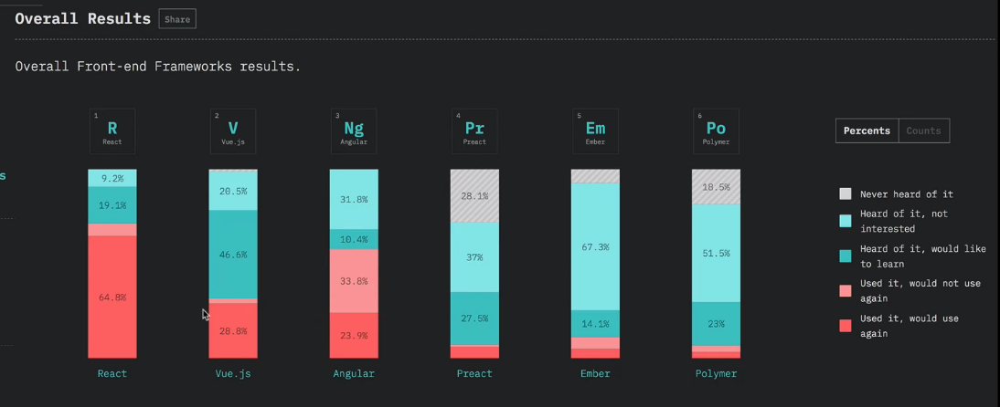

- 종류

1. 차트
2. 데이트 피커
3. 테이블
4. 스피너 등

#### 차트

##### 1. 차트라이브러리 NPM으로 설치

```sh
$ npm install chart.js --save #기본값이 --save라 안적어도됨
```

##### 2. 설치된 라이브러리를 import로 원하는 컴포넌트(여기서는 App.vue)에서 로딩

- 원하는 컴포넌트의 template에 넣는다

```html
<canvas id="myChart" width="400" height="400"></canvas>
```

##### 3. mounted() 라이프 사이클 훅에서 차트를 그림

- 해당 컴포넌트의 script단에 mounted()안에 코드를 넣는다.

> 인스턴스가 화면에 붙고나서 쓸수있는(유효한) `document.getElementById`를 썼기 때문에 `mounted`안에 넣어줌

```js
//chart를 import해와야됨
//package.json의 dependencies에 들어있는 라이브러리 이름과 동일해야됨!
//그걸 Chart라는 변수에 담아줘서 사용한다
import Chart from 'chart.js';

export default {
  mounted(){
    var ctx = document.getElementById('myChart');
    var myChart = new Chart(ctx, {
        type: 'bar',
        data: {
            labels: ['Red', 'Blue', 'Yellow', 'Green', 'Purple', 'Orange'],
            datasets: [{
                label: '# of Votes',
                data: [12, 19, 3, 5, 2, 3],
                backgroundColor: [
                    'rgba(255, 99, 132, 0.2)',
                    'rgba(54, 162, 235, 0.2)',
                    'rgba(255, 206, 86, 0.2)',
                    'rgba(75, 192, 192, 0.2)',
                    'rgba(153, 102, 255, 0.2)',
                    'rgba(255, 159, 64, 0.2)'
                ],
                borderColor: [
                    'rgba(255, 99, 132, 1)',
                    'rgba(54, 162, 235, 1)',
                    'rgba(255, 206, 86, 1)',
                    'rgba(75, 192, 192, 1)',
                    'rgba(153, 102, 255, 1)',
                    'rgba(255, 159, 64, 1)'
                ],
                borderWidth: 1
            }]
        },
        options: {
            scales: {
                yAxes: [{
                    ticks: {
                        beginAtZero: true
                    }
                }]
            }
        }
    });
  }
}
```

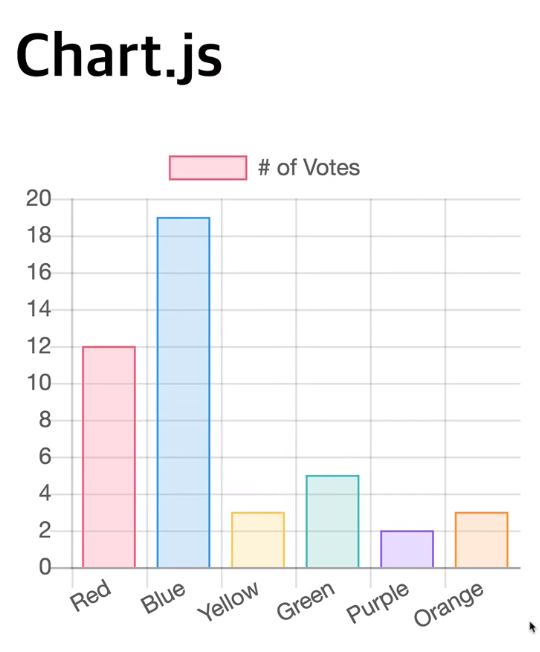

##### 4. 차트를 컴포넌트화(모듈화)

- `components` > `BarChart.vue`

> 차트를 App.vue에서 가져옴

```vue
<template>
  <div>
    <!--<canvas id="myChart" width="400" height="400"></canvas>-->
    <canvas id="BarChart" width="400" height="400"></canvas>
  </div>
</template>

<script>
import Chart from 'chart.js';
export default {
   mounted(){
    //var ctx = document.getElementById('myChart');
    var ctx = document.getElementById('BarChart');
    var myChart = new Chart(ctx, {
        type: 'bar',
        data: {
            labels: ['Red', 'Blue', 'Yellow', 'Green', 'Purple', 'Orange'],
            datasets: [{
                label: '# of Votes',
                data: [12, 19, 3, 5, 2, 3],
                backgroundColor: [
                    'rgba(255, 99, 132, 0.2)',
                    'rgba(54, 162, 235, 0.2)',
                    'rgba(255, 206, 86, 0.2)',
                    'rgba(75, 192, 192, 0.2)',
                    'rgba(153, 102, 255, 0.2)',
                    'rgba(255, 159, 64, 0.2)'
                ],
                borderColor: [
                    'rgba(255, 99, 132, 1)',
                    'rgba(54, 162, 235, 1)',
                    'rgba(255, 206, 86, 1)',
                    'rgba(75, 192, 192, 1)',
                    'rgba(153, 102, 255, 1)',
                    'rgba(255, 159, 64, 1)'
                ],
                borderWidth: 1
            }]
        },
        options: {
            scales: {
                yAxes: [{
                    ticks: {
                        beginAtZero: true
                    }
                }]
            }
        }
    });
  }
}
</script>
```

- App.vue

```vue
<template>
  <bar-chart></bar-chart>
</template>

<script>
import BarChart from './components/BarChart.vue';
export default {
  components:{
    BarChart
  }
  
}
</script>
```


#### LineChart

> \- [LineChart_Getting Started](https://www.chartjs.org/docs/latest/getting-started/)

- LineChart.vue

> 이렇게 했을 때 BarChart와 LineChart가 컴포넌트는 다르지만 둘다 mounted로 id가 myChart인 것에 접근하고 있다
>
> 그래서 순서상으로 마지막에 로딩된 차트에 자꾸 오버라이딩이 일어남, 그래서 id값을 다르게 해줘야된다!

```vue
<template>
  <div>
    <!--<canvas id="myChart"></canvas>-->
    <canvas id="LineChart"></canvas>
  </div>
</template>

<script>
import Chart from 'chart.js';
    
export default {
   mounted(){
   //var ctx = document.getElementById('myChart').getContext('2d');
   var ctx = document.getElementById('LineChart').getContext('2d');
	var chart = new Chart(ctx, {
    // The type of chart we want to create
    type: 'line',

    // The data for our dataset
    data: {
        labels: ['January', 'February', 'March', 'April', 'May', 'June', 'July'],
        datasets: [{
            label: 'My First dataset',
            backgroundColor: 'rgb(255, 99, 132)',
            borderColor: 'rgb(255, 99, 132)',
            data: [0, 10, 5, 2, 20, 30, 45]
        }]
    },

    // Configuration options go here
    options: {}
	});
  }
}
</script>
```

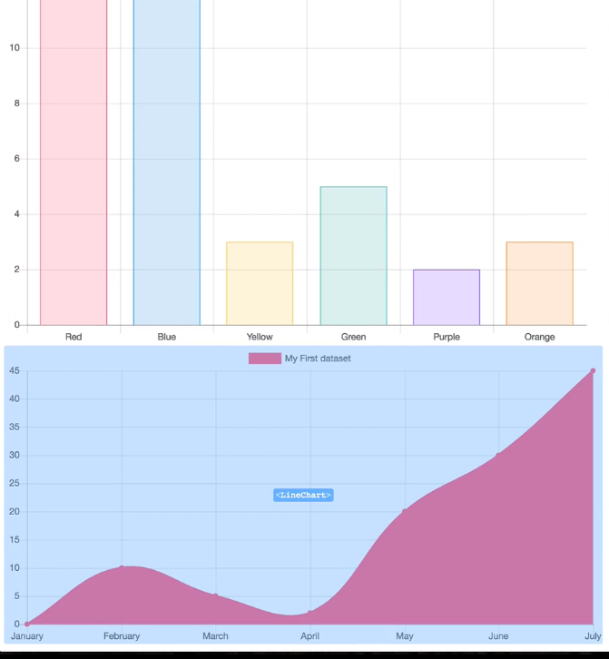

#### (참고) reference 속성

**reference는 각 컴포넌트에서만 접근할 수 있는 접근자이기 떄문에 다른 컴포넌트에의해 충돌되는 문제가 일어나지 않는다. **

> 일반적으로 javascript에서 DOM에 접근할때 `document.querySelector`를 이용함 혹은 `document.getElementById`를 이용함
>
> 이거는 화면에서 그려진 DOM에 다 접근해서 충돌될 위험이 크다
>
> 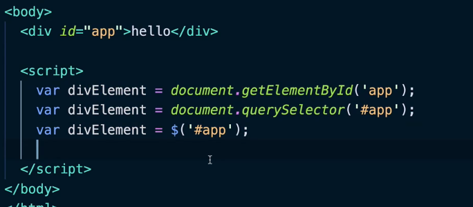 이렇게 3개는 같은 것을 가리킴
>
> Vue에서는 어떻게 접근할 수있을까?
>
> `ref`이용!
>
> ```vue
> <template>
> 	<div ref="app">
>         hello
>     </div>
> </template>
> <script>
> 	var divElement = this.$refs.app;
> </script>
> ```

- LineChart에 ref이용

```vue
<template>
  <div>
    <canvas ref="lineChart" id="LineChart"></canvas>
  </div>
</template>

<script>
import Chart from 'chart.js';
    
export default {
   mounted(){
   //var ctx = document.getElementById('LineChart').getContext('2d');
	var ctx = this.$refs.lineChart.getContext('2d');
    
   //var chart = new Chart(this.$refs.lineChart.getContext('2d'), {
    var chart = new Chart(ctx, {
       // The type of chart we want to create
    type: 'line',

    // The data for our dataset
    data: {
        labels: ['January', 'February', 'March', 'April', 'May', 'June', 'July'],
        datasets: [{
            label: 'My First dataset',
            backgroundColor: 'rgb(255, 99, 132)',
            borderColor: 'rgb(255, 99, 132)',
            data: [0, 10, 5, 2, 20, 30, 45]
        }]
    },

    // Configuration options go here
    options: {}
	});
  }
}
</script>
```


##### 5. 컴포넌트의 플러그인화

> 플러그인 : 인스턴스가 생성됐을때 모든 컴포넌트에서 사용하고 싶은 기능을 정의(라이브러리, `Vue.use`를 사용한 라이브러리는 뷰에서 제공한 플러그인을 이용한 것!)
>
> 왜 플러그인화를 진행하는가?
>
> \- [Vue.js 플러그인 문서](https://vuejs.org/v2/guide/plugins.html#ad)
>
> 라이브러리를 컴포넌트마다 일일이 다 import를 해야되는 불필요한 로직들이 생기는데 이걸 플러그인으로 모듈화를 할 수 있다

- `src` > `plugins`폴더를 만든 뒤 > `ChartPlugin.js`

```js
import Chart from 'chart.js';

export default{
	install(VUe){
        //prototype : 특정 메서드나 특정 객체의 속성을 확장하는 것
        Vue.prototype.$_Chart = Chart;
    }    
}
```

` Vue.prototype.$_Chart = Chart;` 이말은 다른 컴포넌트에서 `Chart`를 쓰고 싶을떄 `this.$_Chart`라고 쓰면 된다는 뜻!

- `main.js`에 등록을 해줘야 쓸 수 있다

```js
import Vue from 'vue'
import App from './App.vue'
import ChartPlugin from './plugins/ChartPlugin.js';

Vue.config.productionTip = false
//install(); 실행되면서 this.$_Chart가 어디서든 접근할 수 있게 됨 ($_플러그인명 : 스타일가이드 $와 _를 합쳐서 쓰면 충돌이 안남(혹시모를충돌..))
Vue.use(ChartPlugin);

new Vue({
  render: h => h(App),
}).$mount('#app')

```

- LineChart.vue를 고쳐보면 이렇다

```vue
<template>
  <div>
    <canvas ref="lineChart" id="LineChart"></canvas>
  </div>
</template>

<script>
export default {
   mounted(){
   var chart = new this.$_Chart(this.$refs.lineChart.getContext('2d'), {
       // The type of chart we want to create
    type: 'line',

    // The data for our dataset
    data: {
        labels: ['January', 'February', 'March', 'April', 'May', 'June', 'July'],
        datasets: [{
            label: 'My First dataset',
            backgroundColor: 'rgb(255, 99, 132)',
            borderColor: 'rgb(255, 99, 132)',
            data: [0, 10, 5, 2, 20, 30, 45]
        }]
    },

    // Configuration options go here
    options: {}
	});
  }
}
</script>
```


##### 6.컴포넌트 통신을 이용한 차트 컴포넌트 기능 결합

> 대부분의 경우 하위컴포넌트보다 상위컴포넌트에 데이터를 불러오는게 컴포넌트를 재활용하기 쉽다
>
> 예를 들어 차트의 data를 App.vue에서 불러와서 LineChart.vue로 data를 넘겨줘야된다고 해보자

- `App.vue`

> data를 받아왔다고 치자 -> 이런식으로 props로 보내줄 수 있다
>
> 만약  차트의 내용이 바뀐다면 이벤트속성을 이용해 emit을보내 app에서 하위컴포넌트에서 이벤트가발생했을때 data를 어떻게 바꾼다 이런식의 로직을 짜면 점점 더 두개는 결합력이 높아짐

```vue
<template>
  <line-chart :propsdata="chartDataSet"></line-chart>
</template>

<script>
import lineChart from './components/BarChart.vue';
export default {
  components:{
    lineChart
  },
    data(){
        return {
            chartDataSet : [{
            label: 'My First dataset',
            backgroundColor: 'rgb(255, 99, 132)',
            borderColor: 'rgb(255, 99, 132)',
            data: [0, 10, 5, 2, 20, 30, 45]
        }]
        }
    }
  
}
</script>
```

- `LineChart.vue`

```vue
<template>
  <div>
    <canvas ref="lineChart" id="LineChart"></canvas>
  </div>
</template>

<script>
export default {
    propse:['propsdata'],
   mounted(){
   var chart = new this.$_Chart(this.$refs.lineChart.getContext('2d'), {
       // The type of chart we want to create
    type: 'line',

    // The data for our dataset
    data: {
        labels: ['January', 'February', 'March', 'April', 'May', 'June', 'July'],
        datasets: this.propsdata
    },

    // Configuration options go here
    options: {}
	});
  }
}
</script>
```


## 컴포넌트 디자인 패턴

### 1. Common - 기본적인 컴포넌트 등록과 컴포넌트 통신

- `App.vue`

```vue
<template>
  <div>
    <app-header :title="appTitle"></app-header>
    <app-content :items="items" @renew="renewItems"></app-content>
  </div>
</template>

<script>
import AppHeader from './components/AppHeader.vue';
import AppContent from './components/AppContent.vue';

export default {
  components: {
    AppHeader,
    AppContent,
  },
  data() {
    return {
      appTitle: 'Common Approach',
      items: [10, 20, 30],
    }
  },
  methods: {
    renewItems() {
      this.items = [40, 50, 60];
    },
  },
}
</script>
```

- `common`>`AppHeader.vue`

```vue
<template>
  <header>
    <h1>{{ title }}</h1>
  </header>
</template>

<script>
export default {
  props: {
    // props를 선언할때, 좀더 유효성검사를 하기위해, props validation문법을 이용함
    title: String,
  }
}
</script>
```

- `common`>`AppContent.vue`

```vue
<template>
  <div>
    <ul>
      <li v-for="item in items">
        {{ item }}
      </li>
    </ul>
    <!-- 이렇게 바로 메소드정의안하고 이벤트를 보낼 수 있다 -->
    <button @click="$emit('renew')">renew items</button>
  </div>
</template>

<script>
export default {
  props: {
    items: {
      // items의 type은 배열, 그리고 무조건 들어와야됨
      type: Array,
      required: true,
    },
  },
}
</script>
```


### 2. Slot - 마크업 확장이 가능한 컴포넌트

- `Item.vue`

```vue
<template>
  <li>
    <slot>
      <!-- NOTE: 등록하는 곳에서 정의할 화면 영역 -->
    </slot>
  </li>
</template>
```

- `App.vue`

> 왼쪽이 App.vue이고 오른쪽이 Item.vue이다 
>
> App.vue에서 item을 v-for로 돌리면 slot태그가 없어지고 li아래에 `{{ item }}`이 들어간것과 같아진다

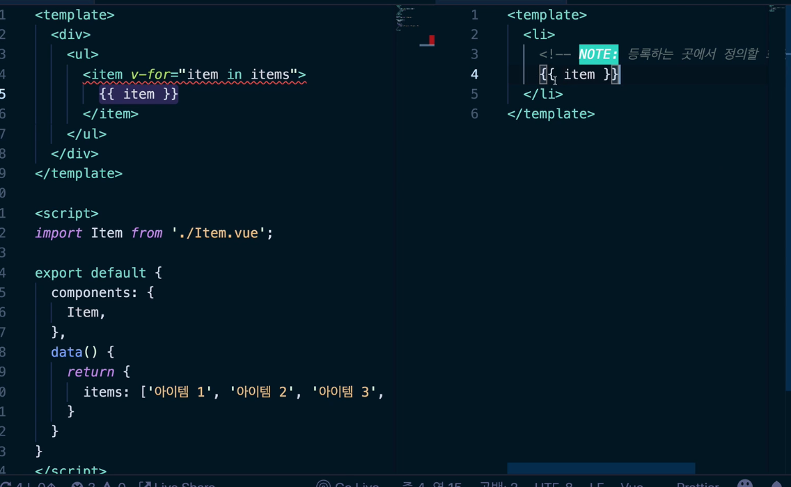

#### 왜 Slot을 쓰는가?

만약 요구사항으로 list중에 다른 하나에는 글뿐만아니라 사진도 넣고싶다고했을때 일반컴포넌트는 굳어있기 때문에 못쓴다!

하지만 slot은 유연하기때문에 화면의 영역을 확장할 수 있는게 slot이다

아래와 같이 다양하게 확장이 가능한게 slot이다!, style도 적용가능함

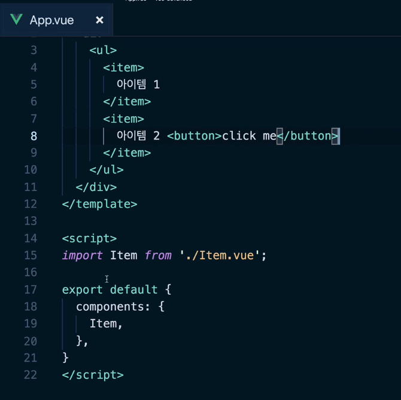


### 3. Controlled - 결합력이 높은 컴포넌트

> 세부적으로 컴포넌트를 쪼갤떄 유용한 방식

만약 App.vue에서 props로 checked:false를 보냈을때 checkBox.vue에서 v-model로 checked를 연결하고, 서버를 열었을때 체크박스를 누르면 아래와같은 에러가 뜬다

```vue
//App.vue
<template>
  <check-box :checked="checked"></check-box>
</template>

<script>
import CheckBox from './components/CheckBox.vue';

export default {
  components: {
    CheckBox
  },
  data(){
    return {
      checked:false,
    }
  }
}
</script>

//CheckBox.vue
<template>
  <input type="checkbox" v-model="checked">
  
</template>

<script>
export default {
  props:['checked']
}
</script>
```

컴포넌트의 data를 하위에서 바꾸지말란 말

v-model은 value라는 data와 input이라는 event를 이용해서 값을 바꾸고 있다 

따라서 checked를 바꾸게됨 그래서 error가 뜸!

컴포넌트간 통신은 data를 아래로porps를 내리고 emit으로 올려야됨

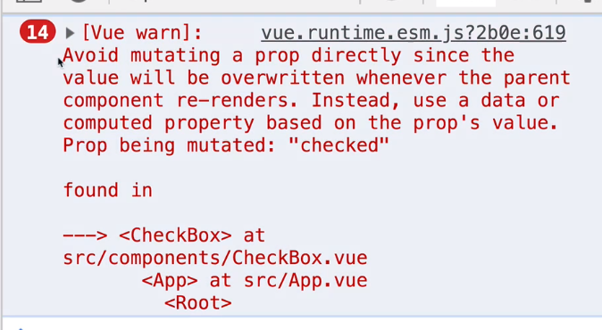

그럼 어떻게 고쳐야되는가?

- `App.vue`에서 props로 checked를 내리지말고 v-model로 내려라!

> v-model은 input 이벤트와 value 값으로 이루어짐
>
> 받을때는 :value로 받고 보낼때는 @input
>
> **하위에서 v-model로 관리가 되고있었던 data가 상위에서 관리가 됨!**
>
> 이렇게 하면 error가 안뜸, 바뀐 값을 다시 emit으로 올려서 다시 내려보냈기 떄문!(결합력 높은 컴포넌트가 됨)

```vue
<template>
  <check-box v-model="checked"></check-box>
</template>

<script>
import CheckBox from './components/CheckBox.vue';

export default {
  components: {
    CheckBox
  },
  data(){
    return {
      checked:false,
    }
  }
}
</script>
```

- `CheckBox.vue`

```vue
<template>
  <input type="checkbox" :value="value" @click="toggleCheckBox">
  
</template>

<script>
export default {
  props:['value'],
  methods:{
    toggleCheckBox(){
      this.$emit('input',!this.value);
    }
  }
}
</script>
```

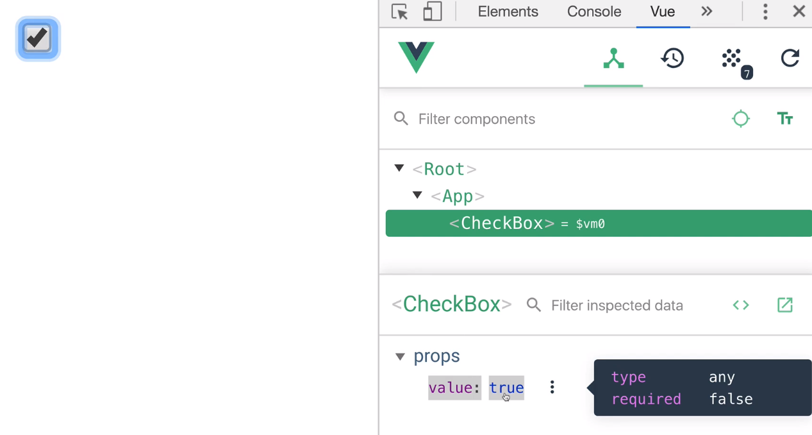


### 4. Renderless - 데이터 처리 컴포넌트

> [Render Function API 문서 링크](https://vuejs.org/v2/guide/render-function.html#ad)
>
> 표현하지 않는 컴포넌트(script밖에 없음)
>
> 데이터 제공만 함

#### (참고) render함수

```html
<html lang="en">
<head>
  <meta charset="UTF-8">
  <meta name="viewport" content="width=device-width, initial-scale=1.0">
  <meta http-equiv="X-UA-Compatible" content="ie=edge">
  <title>Render Function</title>
</head>
<body>
  <div id="app">
    <!-- 인스턴스 영역 -->
    <!-- <p>{{ message }}</p> -->
  </div>
  
  <script src="https://cdn.jsdelivr.net/npm/vue/dist/vue.js"></script>
  <script>
    new Vue({
      el: '#app',
      data:{
        message:'hello vue'
      },
      // 이렇게 적으면 body안에 적힌것과 같음
      // template: ' <p>{{ message }}</p>',
      render: function(createElement){
        // return createElement('태그이름','태그속성','하위태그내용');
        return createElement('p',this.message);
      }
    })
  </script>
</body>
</html>
```

- `main.js`

```js
import Vue from 'vue'
import App from './App.vue'

Vue.config.productionTip = false

new Vue({
  render: h => h(App),
  // 1 기본구조
  render: function(createElement) {
    return createElement(App);
  },
  // 2 h : hyperscript약자
  render: function(h) {
    return h(App);
  },
  // 3 화살표함수로 줄임
  render: (h) => {
    return h(App);
  },
  // 4 
  render: h => h(App),
}).$mount('#app')

```

#### 하위에서 data를 변경했을때 접근가능한 방법

- `FetchData.vue`

```vue
<script>
import axios from 'axios';

export default {
  // url받음
  props: ['url'],
  data() {
    return {
      response: null,
      loading: true,
    }
  },
  created() {
    // axios로 url get요청
    axios.get(this.url)
      .then(response => {
        // get요청 반환값을 response에 담음
        this.response = response.data;
        // 받아왔기때문에 loading중이아니다로 바꿈
        this.loading = false;
      })
      .catch(error => {
        alert('[ERROR] fetching the data', error);
        console.log(error);
      });
  },
  // 여기가 중요, render함수
  render() {
    // 컴포넌트를 그리는건데, 표현식을 그리는게 아니라 data를 넘겨줌 -> 등록하는 곳에다가 노출을 함(App.vue)
    // scopedSlots이란 문법을 이용해 App.vue에 scope-slot안에서 response와 loading접근 가능
    return this.$scopedSlots.default({
      response: this.response,
      loading: this.loading,
    });
  },
}
</script>
```

- `App.vue`

```vue
<template>
  <div>
    <!-- url이라는 props로 내려보냄 -->
    <fetch-data url="https://jsonplaceholder.typicode.com/users/1">
      <!-- slot-scope영역안에 fetchdata에서 render함수로 보낸 response와 loading에 접근할 수 있음 -->
      <div slot-scope="{ response,loading }">
        <div v-if="!loading">
          {{ response }}
        </div>
        <div v-if="loading">
          Loading...
        </div>
      </div>
    </fetch-data>
  </div>
</template>

<script>
import FetchData from './components/FetchData.vue'

export default {
  components: {
    FetchData
  },
}
</script>
```


## CLI로 생성한 프로젝트 배포

- 배포 명령어

> 상용서비스를 위한 build파일로 변환하겠다
>
> 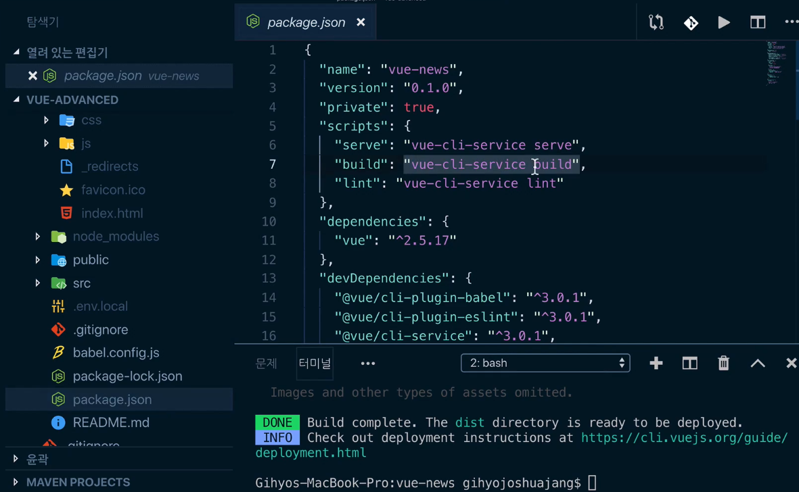

```sh
$ npm run build
```


### Netlify를 이용한 배포

> [Netlify 공식 사이트 주소](https://www.netlify.com/)

1. Github으로 signup을 한다
2. 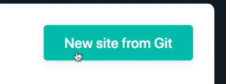 클릭
3. GitHub클릭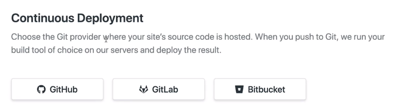

4. github의 전체 리포지토리에 권한을 줄건지, 특정 리포지토리에 권한을 줄건지 정함
5. 완성된 코드가 있는 branch를 고름!

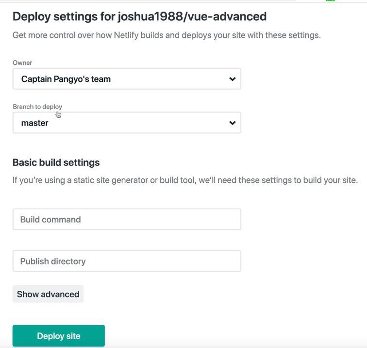

6. Build command는 빌드명령어 `npm run build`
7. publish directory는 빌드 결과물 directory의 이름 -> `dist`
8. 클릭
9.  클릭
10.  deploy가 잘못됐다면 그 이유를 말해줌!

왜 잘못됐을까?

11. 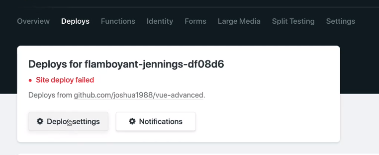
12. deploy settings에 들어가보면 Base directory에 아무것도 없다! 여기서 dist폴더나 npm run build는 해당 branch에 바로 쓸수 잇는게 아니라 프로젝트 폴더로 한단계 들어가야 적용됨! 그걸 base dirrectory로 설정해줘야됨

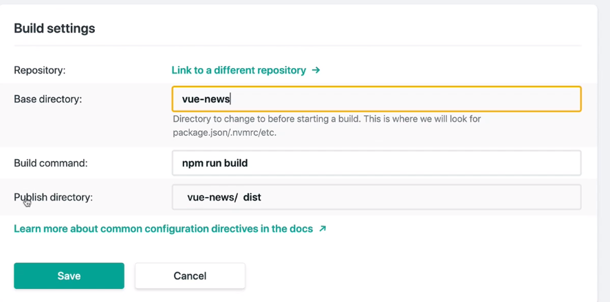

13. 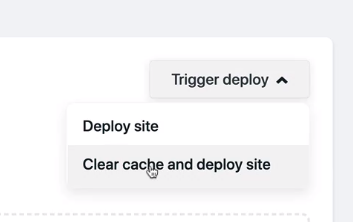 Clear cache and deploy site를 누름

14  클릭


### SPA 호스팅시에 서버에 추가해줘야되는 설정

> [Vue CLI 배포 설명 페이지 링크](https://cli.vuejs.org/guide/deployment.html#netlify)
>
> ### Netlify
>
> 1. On Netlify, setup up a new project from GitHub with the following settings:
>    - **Build Command:** `npm run build` or `yarn build`
>    - **Publish directory:** `dist`
> 2. Hit the deploy button!
>
> Also checkout [vue-cli-plugin-netlify-lambda](https://github.com/netlify/vue-cli-plugin-netlify-lambda).
>
> In order to receive direct hits using `history mode` on Vue Router, you need to create a file called `_redirects` under `/public` with the following content:
>
> ***single-page application은 특정 페이지 정보를 서버에서 가지고오는 것이 아니라 우리가 다 가지고 있다가 필요시에 javascript로 전환하는것***
>
> ```text
> # Netlify settings for single-page application
> /*    /index.html   200
> ```
>
> More information on [Netlify redirects documentation](https://www.netlify.com/docs/redirects/#history-pushstate-and-single-page-apps).
>
> If you are using [@vue/cli-plugin-pwa](https://cli.vuejs.org/core-plugins/pwa.html#vue-cli-plugin-pwa) make sure to exclude the `_redirects` file from being cached by the service worker. To do so, add the following to your `vue.config.js`:
>
> ```javascript
> // vue.config.js file to be placed in the root of your repository
> 
> module.exports = {
>   pwa: {
>       workboxOptions: {
>         exclude: [/_redirects/]
>       }
>     }
> }
> ```

예를 들어 `/ask`, `/jobs`등과 같은 url을 서버에서 알 길이 없다, 브라우저가 알려줘야됨!

페이지에 대한 정보는 브라우저에 있다. 다시말해 클라이언트의 정보를 서버에서는 알 길이 없다.

이것을 `프로젝트 폴더` > `public` > `_redirects`파일을 만들어 아래의 코드 복붙

Netlify에서는 서버에대한 설정을 아래와 같이 함

```
# Netlify settings for single-page application
/*    /index.html   200
```

모든 접근에 대해서 `/index.html`로 돌리겠다는 것을 서버마다 해줘야됨 -> 아니면 페이지를 찾을 수 없다고 뜸


### env 환경변수 파일을 이용한 옵션 변경 방법

> env파일 : CLI로 생성한 프로젝트로 개발 및 배포를 진행할 떄 `.env`라는 환경 변수 파일로 옵션들을 편하게 바꿀 수 있음
>
> 

- `.env`

> 원래는 App.vue에서 env에서 설정한 값을 사용하기 위해서 웹팩의 `DefinePlugin`을 이용해야됨
>
> 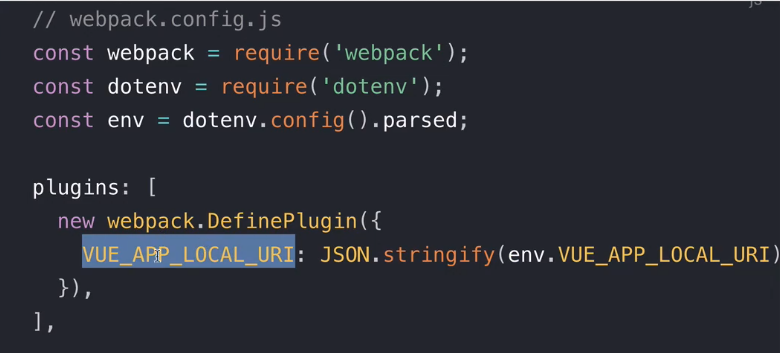
>
> VueCLI 3점대 이상 버전부터는 App.vue에서 바로 쓸 수 있는 방법이 있는데,
>
> 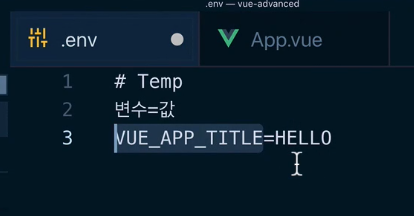 이렇게 `VUE_`를 쓰게되면 쓸 수 있다
>
> 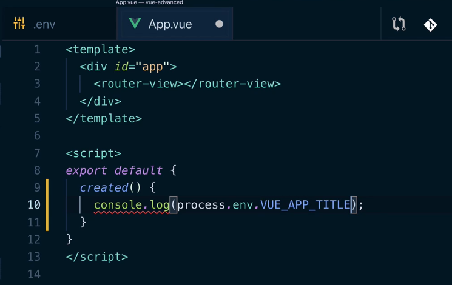


