# Webpack

[toc]

## Node.js vs NPM

> [Webpack handbook](https://joshua1988.github.io/webpack-guide/build/node-npm.html)
>
> 웹팩을 사용하기 위해서는 Node.js와 NPM이 컴퓨터에서 설치되어 있어야 한다.

### Node.js

> Node.js는 브라우저 밖에서도 자바스크립트를 실행할 수 있는 환경을 의미함
>
> Node.js가 나오기 전까지는 자바스크립트가 브라우저의 동작을 제어하는데 사용되었고 브라우저에서만 실행할 수 있었지만 이제는 Node.js로 자바스크립트를 브라우저 밖에서도 실행할 수 있게 되었다.

### NPM

> [npm_JS 라이브러리저장소](https://www.npmjs.com/)
>
> NPM(Node Package Manager)는 명령어로 자바스크립트 라이브러리를 설치하고 관리할 수 있는 패키지(라이브러리) 매니저다 
>
> NPM 공식 사이트에서도 안내가 되어 있지만 전 세계 자바스크립트 개발자들이 모두 자바스크립트 라이브러리를 공개된 저장소에 올려놓고 npm 명령어로 편하게 다운로드 받을 수 있다.
>
> **NPM장점**
>
> 1. 라이브러리가 필요해서 가져왔을때, html에 직접 cdn을 script 위에 적어서 관리하면 버전관리도 힘들고, 라이브러리들끼리 관리가 안될 수도 있다.
>
>    하지만 이렇게 npm으로 설치해서 `pacage.json`으로 정리가 깔끔하게 돼있다면, 관리하기 좋다.
>
> 2. 각 라이브러리를 찾아서 cdn을 하나하나 들고오는 것보다 시간도 적게 든다.(코드를 치기만 하면되니까)

```sh
#명령어
node -v
npm init
npm init -y
npm install jquery
npm install gulp
npm uninstall gulp
npm install gulp --global
npm install vue --save-dev
npm i vue -D
```

#### NPM 초기화 명령어

`npm init` : 다 엔터하고 마지막에 `y` 하면 `package.json`이 생성됨

또는 `npm init -y`치면 바로 생성됨!!!


#### NPM 설치

> `node_modules` 폴더가 생기며 아래에 `dist`폴더에 들어가고, `package.json`파일에 설치한 라이브러리와 버전을 확인할 수 있다.

```sh
$ npm intall 설치원하는라이브러리이름
#예시
$ npm install jquery
#Or
$ npm i jquery
```


#### NPM 삭제

> `package.json`에서도 사라짐

```sh
#설치
$ npm install gulp
#삭제
$ npm uninstall gulp
```


#### NPM전역 설치 명령어

> 이렇게 설치하면 gulp는 설치됐지만, `node-modules`폴더 안에는 안들어가있다.
>
> NPM 전역 설치는 위와 같이 프로젝트에서 사용할 라이브러리를 불러올 때 사용하는 것이 아니라 시스템 레벨에서 사용할 자바스크립트 라이브러리를 설치할 때 사용
>
> 보통 시스템 상에서 명령어를 인식할 수 있게 하기 위해 global설치를 함

```sh
$ npm install gulp --global
$ npm install gulp -g

#NPM 전역 설치 경로
# window
%USERPROFILE%\AppData\Roaming\npm\node_modules

# mac
/usr/local/lib/node_modules
```


#### NPM 지역 설치  옵션

> `-D`는 `devDependencies`

```sh
$ npm install jquery --save-prod
$ npm install jquery --save-dev
#축약 명령어
$ npm i jquery
$ npm i jquery -D
```


#### dependencies vs devDependencies

> `package.json`에서
>
> `npm i jquery` :  dependencies로 관리됨 
>
> `npm i vue -D` : devDependencies로 관리됨

- dependencies

  - ```bash
    # 배포용 라이브러리 설치
    npm i jquery
    ```

  - application의 로직과 연관됨

  - 화면의 Dom을 추적하기 위함

  - 화면의 로직과 직접적으로 연관됨

  - `npm run build`로 빌드하면 최종 애플리케이션 코드안에 포함됨!!

- devDependencies

  - `-D`를 붙임
  - webpack,js-compression, sass,,,

  - 개발을 할때 도움을 주는 개발 보조 라이브러리
  - 만약 반대로 설치 옵션에 `-D`를 주었다면 해당 라이브러리는 빌드하고 배포할 때 애플리케이션 코드에서 빠지게 된다. 따라서, 최종 애플리케이션에 포함되어야 하는 라이브러리는 `-D`로 설치하면 안 된다. 
  - 개발할 때만 사용하고 배포할 때는 빠져도 좋은 라이브러리의 예시
    - `webpack` : 빌드 도구
    - `eslint` : 코드 문법 검사 도구
    - `imagemin` : 이미지 압축 도구


## Webpack

> 웹팩이란 최신 프런트엔드 프레임워크에서 가장 많이 사용되는 [모듈 번들러(Module Bundler)](https://joshua1988.github.io/webpack-guide/webpack/what-is-webpack.html)다. 모듈 번들러란 웹 애플리케이션을 구성하는 자원(HTML, CSS, Javscript, Images 등)을 모두 각각의 모듈로 보고 이를 조합해서 병합된 하나의 결과물을 만드는 도구를 의미

### 모듈 번들링

> 웹 애플리케이션을 구성하는 몇십, 몇백개의 자원들을 하나의 파일로 병합 및 압축 해주는 동작을 모듈 번들링
>
> 왼쪽이 하나의 웹을 구성하는 여러 파일들
>
> 파일간의 연관관계를 다 파악해서
>
> 웹펙이 이걸 하나로 합쳐서 보여줌(모듈번들러!

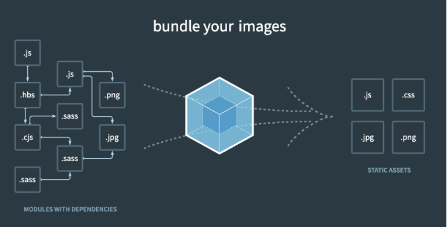


### Webpack 맛보기

1. 빈 폴더에서 아래 명령어로 `package.json` 파일을 생성

```bash
npm init -y
```

2. 아래 명령어로 해당 폴더에 웹팩 관련 라이브러리와 *lodash* 라이브러리 설치

```bash
#-D는 배포할때 빠짐
npm i webpack webpack-cli -D
#애플리케이션 로직과 관련된 라이브러리, js유틸리티라이브러리
npm i lodash
```

3. 폴더에 `index.html` 파일을 생성하고 아래 내용 추가

```html
<html>
  <head>
    <title>Webpack Demo</title>
    <script src="https://unpkg.com/lodash@4.16.6"></script>
  </head>
  <body>
    <script src="src/index.js"></script>
  </body>
</html>
```

4. 프로젝트 루트 레벨에 `src` 폴더를 생성하고 그 안에 `index.js` 파일 생성.

```js
function component() {
  var element = document.createElement('div');

  /* lodash is required for the next line to work */
  element.innerHTML = _.join(['Hello','webpack'], ' ');

  return element;
}

document.body.appendChild(component());
```

**웹팩 빌드를 위한 구성 및 빌드**

5. 웹팩 빌드 및 빌드 결과물로 실행하기 위해 각 파일에 아래 내용 반영

```js
// index.js
// lodash를 쓰기 위해 import해옴
import _ from 'lodash';

function component() {
  var element = document.createElement('div');

  /* lodash is required for the next line to work */
  element.innerHTML = _.join(['Hello','webpack'], ' ');

  return element;
}

document.body.appendChild(component());

```

```html
<!-- index.html -->
<html>
  <head>
    <title>Webpack Demo</title>
    <!-- <script src="https://unpkg.com/lodash@4.16.6"></script> -->
  </head>
  <body>
    <!-- <script src="src/index.js"></script> -->
      <!--dist폴더밑에 main.js-->
    <script src="dist/main.js"></script>
  </body>
</html>
```

6. 웹팩 빌드 명령어를 실행하기 위해 `package.json` 파일에 아래 내용 추가(` "build": "webpack"`)

   > (` "build": "webpack"`) 이 build커스텀 명령어를 추가했기때문에 
   >
   > npm run build를 shell에 적었을때 webpack명령어가 실행됨

```json
{
  "name": "getting-started",
  "version": "1.0.0",
  "description": "",
  "main": "index.js",
  "scripts": {
    "test": "echo \"Error: no test specified\" && exit 1",
      // "build": "webpack" 추가!!!!
    "build": "webpack--mode=none"
  },
  "keywords": [],
  "author": "",
  "license": "ISC",
  "devDependencies": {
    "webpack": "^4.42.0",
    "webpack-cli": "^3.3.11"
  },
  "dependencies": {
    "lodash": "^4.17.15"
  }
}

```

> ` "build": "webpack--mode=none"`mode값을 none으로 설정한것 ->  `dist 폴더의 main.js`가  눈으로 보기 쉽게 나옴
>
> 하지만 이렇게 webpack의 설정들을 하나하나 다적기엔 관리가 복잡하다 그래서 웹펙을 `webpack.config.js`파일 생성 한 뒤 관리함!

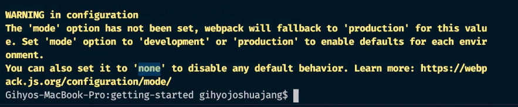

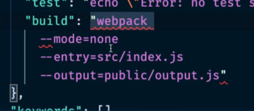

7. `npm run build` 명령어 실행 후 `index.html` 파일을 [라이브서버](https://marketplace.visualstudio.com/items?itemName=ritwickdey.LiveServer)로 실행

8. 프로젝트 폴더 루트 레벨에 `webpack.config.js` 파일 생성 후 아래 내용 추가

> [Node.js Path API문서](https://nodejs.org/api/path.html)

```js
// webpack.config.js
// `webpack` command will pick up this config setup by default
var path = require('path');

module.exports = {
  mode: 'none',
    //entry에 적힌 파일을 대상으로 웹펙을 돌려서
  entry: './src/index.js',
    // 문자열로 접근하기에는 파일에 대한 유효한 경로를 잡기 위해 파일이름, path(경로를 잡아주는 API)로 기록함 dist라는 폴더를 유효하게 경로를 잡아나감
  output: {
    filename: 'main.js',
    path: path.resolve(__dirname, 'dist')
  }
};
```

9. `package.json` 파일을 아래와 같이 수정

```json
"scripts": {
  "build": "webpack"
}
```

10. 다시 `npm run build` 명령어를 실행하여 빌드가 잘 되는지 확인


### (참고) 위 코드 분석 loadash

> [lodash join() API문서](https://lodash.com/docs/4.17.15#join)

- index.js

```html
<html>
  <head>
    <title>Webpack Demo</title>
    <!-- lodash cdn 가져옴 ->라이브러리를 깔았으니 import해서 쓰면됨 -->
    <!-- <script src="https://unpkg.com/lodash@4.16.6"></script> -->
  </head>
  <body>
    <!-- <script src="src/index.js"></script> -->
    <script src="./dist/main.js"></script>
  </body>
</html>
```

- index.js

```js
// ES6
// _ 로 lodash를 표현하겠다
import _ from 'lodash';
// ES5
// var _ = require('lodash');
// var path = require('path');

function component() {
  var element = document.createElement('div');

  /* lodash is required for the next line to work */
  // _는 lodash _.join(array, [separator=','])
  element.innerHTML = _.join(['Hello','webpack'], ' ');
  // element.innerHTML = 'Hello webpack';

  return element;
}

document.body.appendChild(component());
```


### Webpack 변환 전 후 비교

> 왼쪽(변환전), 오른쪽(변환 후)
>
> request의 수 차이가 확연히 난다. -> 페이지 로딩시간이 오래걸림

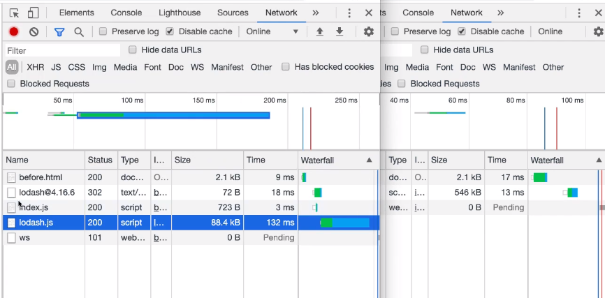


### Webpack 빌드 결과 파일분석

> dist폴더의 `main.js` 87번째 줄부터
>
> 그 위는 웹펙 내부로직 볼필요없음

- 0번은 index.js를 나타냄

```js
/* 0 */
/***/ (function(module, __webpack_exports__, __webpack_require__) {

"use strict";
__webpack_require__.r(__webpack_exports__);
/* harmony import */ var lodash__WEBPACK_IMPORTED_MODULE_0__ = __webpack_require__(1);
/* harmony import */ var lodash__WEBPACK_IMPORTED_MODULE_0___default = /*#__PURE__*/__webpack_require__.n(lodash__WEBPACK_IMPORTED_MODULE_0__);


function component() {
  var element = document.createElement('div');

  /* lodash is required for the next line to work */
  element.innerHTML = lodash__WEBPACK_IMPORTED_MODULE_0___default.a.join(['Hello','webpack'], ' ');

  return element;
}

document.body.appendChild(component());

/***/ }),
```

- 1번은 lodash 라이브러리파일이 들어감

이런식으로 들어가 있어야 되는 것을 웹팩이 `main.js`에 모두 넣어줌

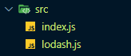

- [즉시실행함수](https://developer.mozilla.org/ko/docs/Glossary/IIFE)의 구조안에 웹팩이 담겨있다!

```js
// IIFE (Immediately Invoked Function Expression)
(function() {

})()
```


### 웹팩을 왜 써야되는가

> [webpack](https://www.youtube.com/watch?v=WQue1AN93YU)

하나의 어플이 만들어졌을때 사용된 폴더들

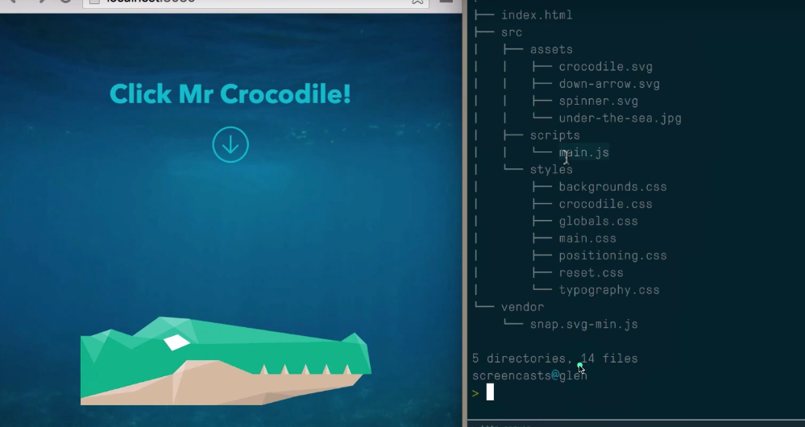

현재 와이파이가 정말 잘되는 곳에서는 이정도의 속도가 걸리지만

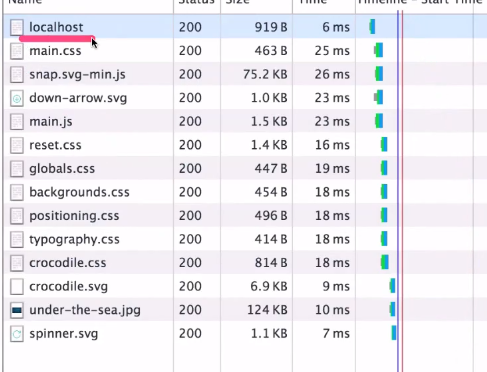

Network패널에서 Throttling설정을 달리해서 다른 인터넷이 잘 안되는 곳으로 바꿨을때

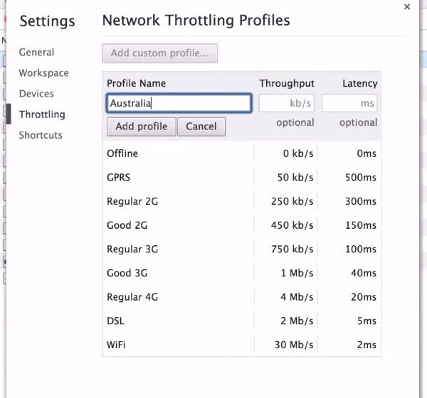

아래와 같이 느려진다는 것을 알 수 있다.

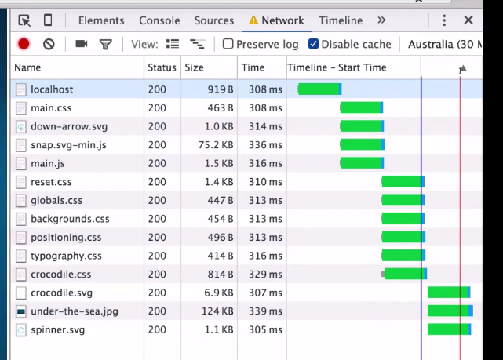

일반적인 브라우저의 로딩이 순서!

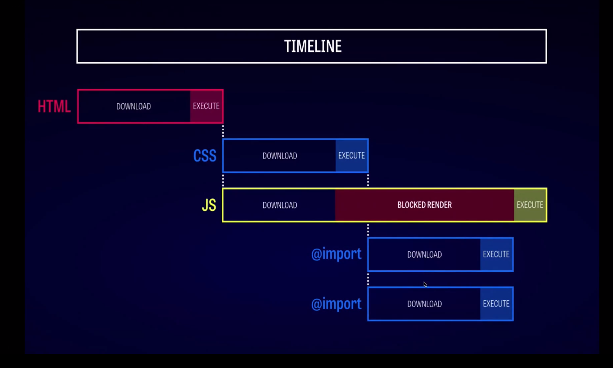

이걸 웹팩으로 해결할수 있다!

**웹팩은 JS뿐만아니라 모든 자원과 관계된 것이다!**

웹 자동화 도구들

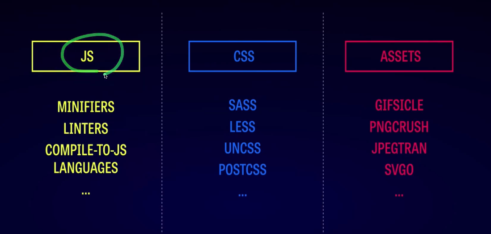

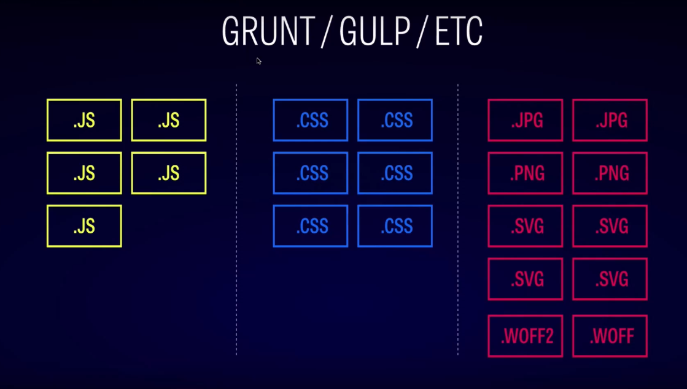

#### Gulp와 다른점

> [gulp](https://gulpjs.com/docs/en/getting-started/quick-start)

Gulp는 아래와 같이 코드들을 다 입력해줘야되는데 Webpack은 이렇게 직접 짜는 것이 아니라 설정이 돼있고 그 설정방법만 알면 훨씬 수월하게 모듈 번들러까지 관리를 하기 쉽고, 성능 등이 더 좋다.

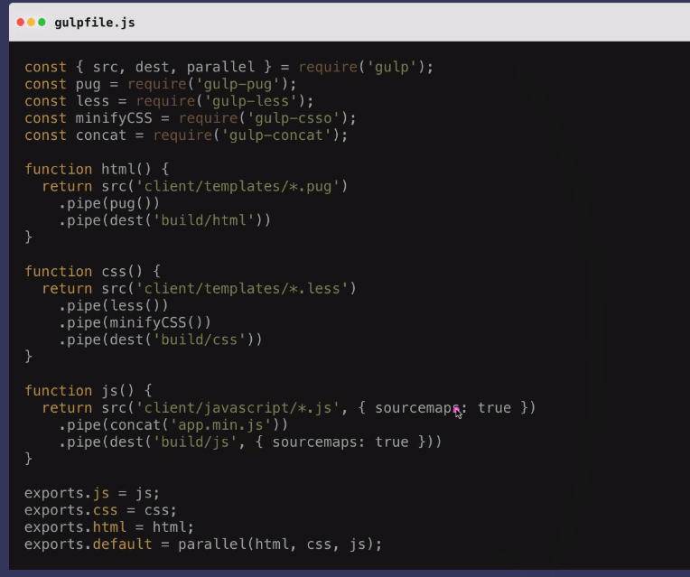

**Webpack은 진입점이 하나이다!**

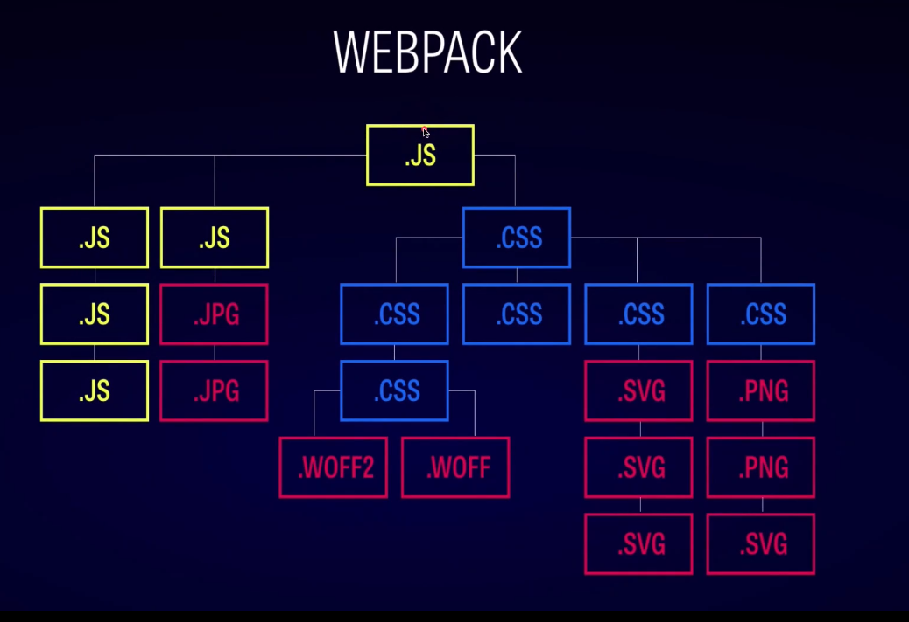

#### Webpack 적용 결과

여러개의 파일을 `bundle.js`로 묶어주고 60%정도 시간이 단축된 것을 볼 수 있다.

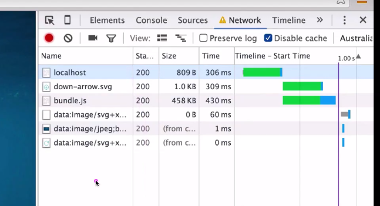

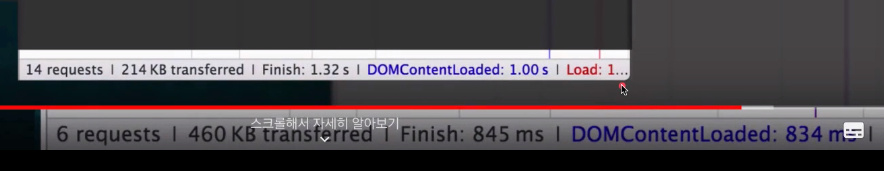


### Webpack 모듈

> [모듈](https://joshua1988.github.io/webpack-guide/webpack/what-is-webpack.html#%EC%9B%B9%ED%8C%A9%EC%9D%B4%EB%9E%80)
>
> 모듈이란 프로그래밍 관점에서 특정 기능을 갖는 작은 코드 단위를 의미함. 자바스크립트로 치면 아래와 같은 코드가 모듈

```js
// math.js
function sum(a, b) {
  return a + b;
}

function substract(a, b) {
  return a - b;
}

const pi = 3.14;

export { sum, substract, pi }
```

- 웹팩에서 지칭하는 모듈이라는 개념은 위와 같이 자바스크립트 모듈에만 국한되지 않고 웹 애플리케이션을 구성하는 모든 자원을 의미함 
- 웹 애플리케이션을 제작하려면 HTML, CSS, Javascript, Images, Font 등 많은 파일들이 필요하다. 이 파일 하나하나가 모두 모듈


### Webpack의 등장배경

웹팩이 등장한 이유는 크게 3가지

1. [파일 단위의 자바스크립트 모듈 관리의 필요성](https://joshua1988.github.io/webpack-guide/motivation/why-webpack.html#파일-단위의-자바스크립트-모듈-관리)
2. [웹 개발 작업 자동화 도구 (Web Task Manager)](https://joshua1988.github.io/webpack-guide/motivation/why-webpack.html#웹-개발-작업-자동화-도구)
3. [웹 애플리케이션의 빠른 로딩 속도와 높은 성능](https://joshua1988.github.io/webpack-guide/motivation/why-webpack.html#웹-애플리케이션의-빠른-로딩-속도와-높은-성능)

#### 파일 단위의 자바스크립트 모듈 관리

```js
var a = 10;
console.log(a); // 10

function logText() {
  console.log(a); // 10
}
```

자바스크립트의 변수 유효 범위는 기본적으로 전역 범위를 갖는다. 최대한 넓은 변수 범위를 갖기 때문에 어디에서도 접근하기가 편리하다.

그런데 이러한 장점이 실제로 웹 애플리케이션을 개발할 때는 아래와 같은 문제점으로 변한다.

```html
<!-- index.html -->
<html>
  <head>
    <!-- ... -->
  </head>
  <body>
    <!-- ... -->
    <script src="./app.js"></script>
    <script src="./main.js"></script>
  </body>
</html>
```

```js
// app.js
var num = 10;
function getNum() {
  console.log(num);
}
```

```js
// main.js
var num = 20;
function getNum() {
  console.log(num);
}
```

위와 같이 `index.html`에서 두 자바스크립트 파일을 로딩하여 사용한다고 해보자. 스크립트에 아래와 같이 코드를 실행하면 어떤 결과가 나올까?

```html
<!-- index.html -->
<html>
  <head>
    <!-- ... -->
  </head>
  <body>
    <!-- ... -->
    <script src="./app.js"></script>
    <script src="./main.js"></script>
    <script>
      getNum(); // 20
    </script>
  </body>
</html>
```

결과는 20이다.

 `app.js`에서 선언한 `num` 변수는 `main.js`에서 다시 선언하고 20을 할당했기 때문.

이러한 문제점은 실제로 복잡한 애플리케이션을 개발할 때 발생한다. 변수의 이름을 모두 기억하지 않은 이상 변수를 중복 선언하거나 의도치 않은 값을 할당할 수 있다.

또는 아래처럼 변수로 관리하면 각 js에서의 num으로 사용할 수 있다.

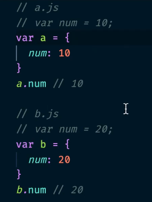

#### 웹 개발 작업 자동화 도구

이전부터 프런트엔드 개발 업무를 할 때 가장 많이 반복하는 작업은 텍스트 편집기에서 코드를 수정하고 저장한 뒤 브라우저에서 새로 고침을 누르는 것이었다. 그래야 화면에 변경된 내용을 볼 수 있었다.

이외에도 웹 서비스를 개발하고 웹 서버에 배포할 때 아래와 같은 작업들을 해야 했다.

- HTML, CSS, JS 압축
- 이미지 압축
- CSS 전처리기 변환

이러한 일들을 자동화 해주는 도구들이 필요했다. 그래서 Grunt와 Gulp 같은 도구들이 등장함


#### 웹 애플리케이션의 빠른 로딩 속도와 높은 성능

일반적으로 특정 웹 사이트를 접근할 때 5초 이내로 웹 사이트가 표시되지 않으면 대부분의 사용자들은 해당 사이트를 벗어나거나 집중력을 잃게 된다.

브라우저에서 서버로 요청하는 파일 숫자를 줄이는 것, 이를 위해 앞에서 살펴본 웹 태스크 매니저를 이용해 파일들을 압축하고 병합하는 작업들을 진행했다.

뿐만 아니라 초기 페이지 로딩 속도를 높이기 위해 나중에 필요한 자원들은 나중에 요청하는 레이지 로딩(Lazy Loading)이 등장했다.

웹팩은 기본적으로 필요한 자원은 미리 로딩하는게 아니라 그 때 그 때 요청한다!!


### Webpack으로 해결하려는 문제

[웹팩의 등장 배경](https://joshua1988.github.io/webpack-guide/motivation/why-webpack.html#웹팩의-등장-배경)에서도 살펴봤지만 웹팩에서 해결하고자 하는 기존의 문제점은 다음 4가지

- 자바스크립트 변수 유효 범위
- 브라우저별 HTTP 요청 숫자의 제약
- 사용하지 않는 코드의 관리
- Dynamic Loading & Lazy Loading 미지원

#### 브라우저별 HTTP 요청 숫자의 제약

|   **브라우저**    | **최대 연결 횟수** |
| :---------------: | :----------------: |
|   익스플로러 7    |         2          |
| 익스플로러 8 ~ 9  |         6          |
| 익스플로러 10, 11 |       8, 13        |
|       크롬        |         6          |
|      사파리       |         6          |
|    파이어폭스     |         6          |
|      오페라       |         6          |
|  안드로이드, iOS  |         6          |

HTTP 요청 숫자를 줄이는 것이 웹 애플리케이션의 성능을 높여줄 뿐만 아니라 사용자가 사이트를 조작하는 시간을 앞당겨 줌

웹팩을 이용해 여러 개의 파일을 하나로 합치면 위와 같은 브라우저별 HTTP 요청 숫자 제약을 피할 수 있다


## Babel

>[바벨 공식 사이트](https://babeljs.io/)
>
>JS 최신 문법을 변환해줌
>
>브라우저 호환가능한 코드로 변환해줌!

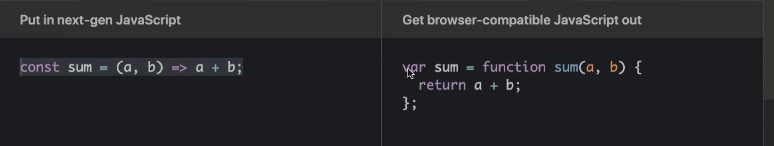


## ES6 Modules

>[ES6 Modules 문법 소개 글](https://joshua1988.github.io/es6-online-book/modules.html)

### Import & Export

> 임포트(Import)와 익스포트(Export)는 자바스크립트의 코드를 모듈화 할 수 있는 기능
>
> 모듈화 기능을 사용하기 위한 기본적인 import, export 문법
>
> 먼저 export 문법.
>
> ```js
> export 변수, 함수
> ```
>
> 다른 파일에서 가져다 쓸 변수나 함수의 앞에 `export` 라는 키워드를 붙인다. 익스포트된 파일은 임포트로 불러와 사용할 수 있다.
>
> import 문법.
>
> ```js
> import { 불러올 변수 또는 함수 이름 } from '파일 경로';
> ```
>
> 익스포트된 변수나 함수를 `{}`에 선언한 뒤 해당 파일이 있는 경로를 적어줌

```js
// math.js
export var pi = 3.14;
// app.js
import { pi } from './math.js';

console.log(pi); // 3.14
```

위 코드는 `math.js`라는 파일에서 `pi`를 익스포트하고 `app.js` 파일에서 임포트하여 콘솔에 출력하는 코드.

 만약 변수가 아니라 함수를 내보내고 싶다면 아래와 같이 코딩

```js
// math.js
export var pi = 3.14;
export function sum(a, b) {
  return a + b;
}
// app.js
import { sum } from './math.js';

sum(10, 20); // 30
```

위 코드는 `math.js`에 두 숫자의 합을 구하는 `sum()` 함수를 익스포트 한 뒤 `app.js`에서 임포트하여 사용한 코드


### ES6 Modules실습

- math.js

```js
// sum() 함수 구현 후 export 하세요.
export function sum(a, b) {
  return a + b;
}
```

- app.js

```js
// 할일 #1 - math.js 파일에서 두 숫자의 합을 구하는 sum 함수를 임포트하여 콘솔에 찍어보세요.
// 문법 참고 : import 불러올 기능 or 변수 from '파일의 위치'
// 상대경로를 잘 적용했다면 sum은 적다가 자동완성 tab으로 설정하는게 가장 정확함
// ./ 이것은 같은 폴더 위치라는 말
import { sum } from './math';
console.log('10+20 =',sum(10,20));

```

- 터미널창에 아래와 같은 코드를 치면 웹팩이 실행됨

```sh
$ npm run build
```

- build폴더에 `main.bundle.js`

> 0번 app.js
>
> 1번 math.js

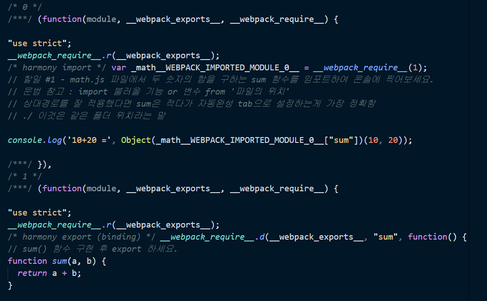

여기에 나오는 app.js의 코드는 어디서 오는 것인가?

index.html을 돌리기 위한 파일은 main.bundle.js인데 app.js를 눌렀을때 해당 코드로 바로 가는걸까?

**이유**

웹팩은 너가 build를 했다고 하더라도 원래 soure로 보내주는 기능이 있음 -> 아니면 난독화된 bundle.js의 코드는 하나하나 대조하는 시간의 소모가 있기에 유용하지 않다

> 
>
> - webpack.config.js에 아래의 코드를 적으면 됨
>
> 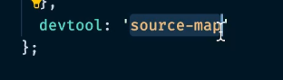

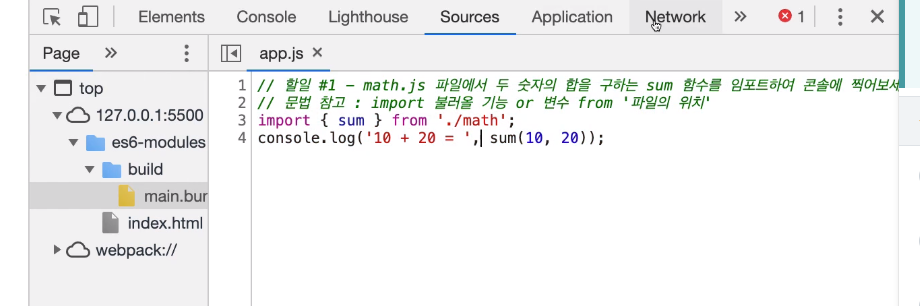


## Webpack의 주요 속성 4가지

웹팩의 빌드(파일 변환) 과정을 이해하기 위해서는 아래 4가지 주요 속성에 대해서 알고 있어야 함

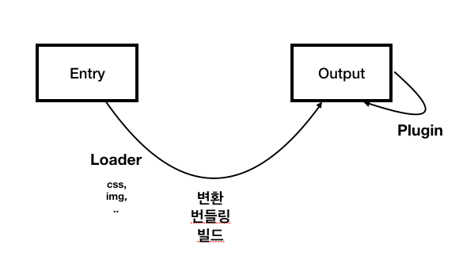

- **Entry** 속성은 웹팩을 실행할 대상 파일. 진입점
- **Output** 속성은 웹팩의 결과물에 대한 정보를 입력하는 속성. 일반적으로 `filename`과 `path`를 정의
- **Loader** 속성은 CSS, 이미지와 같은 비 자바스크립트 파일을 웹팩이 인식할 수 있게 추가하는 속성. 로더는 오른쪽에서 왼쪽 순으로 적용
- **Plugin** 속성은 웹팩으로 변환한 파일에 추가적인 기능을 더하고 싶을 때 사용하는 속성. 웹팩 변환 과정 전반에 대한 제어권을 갖고 있음

위 속성 이외에도 [resolve](https://webpack.js.org/configuration/resolve/#root), [devServer](https://webpack.js.org/configuration/dev-server/#root), [devtool](https://webpack.js.org/configuration/devtool/#devtool) 속성에 대해 알고 있으면 좋다.

### Entry

> [Entry](https://joshua1988.github.io/webpack-guide/concepts/entry.html#entry-%ED%8C%8C%EC%9D%BC%EC%97%90%EB%8A%94-%EC%96%B4%EB%96%A4-%EB%82%B4%EC%9A%A9%EC%9D%B4-%EB%93%A4%EC%96%B4%EA%B0%80%EC%95%BC-%ED%95%98%EB%82%98) 
>
> 웹팩에서 웹 자원을 변환하기 위해 필요한 최초 진입점이자 자바스크립트 파일 경로
>
> `빌드 = 변환 = 컴파일 = 번들링 다 같은말`

#### Entry 파일에는 어떤 내용이 들어가야 하나?

`entry` 속성에 지정된 파일에는 웹 애플리케이션의 전반적인 구조와 내용이 담겨져 있어야한다.

웹팩이 해당 파일을 가지고 웹 애플리케이션에서 사용되는 모듈들의 연관 관계를 이해하고 분석하기 때문에 애플리케이션을 동작시킬 수 있는 내용들이 담겨져 있어야 함

모듈 간의 의존 관계가 생기는 구조를 [디펜던시 그래프(Dependency Graph)](https://webpack.js.org/concepts/dependency-graph/)라고 한다.

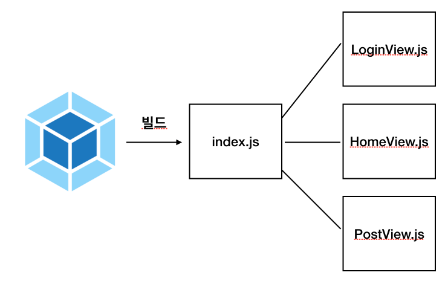

엔트리 포인트는 1개가 될 수도 있지만 아래와 같이 여러 개가 될 수도 있다.

```js
entry: {
  login: './src/LoginView.js',
  main: './src/MainView.js'
}
```

위와 같이 엔트리 포인트를 분리하는 경우는 싱글 페이지 애플리케이션이 아닌 특정 페이지로 진입했을 때 서버에서 해당 정보를 내려주는 형태의 멀티 페이지 애플리케이션에 적합하다.


### Output

> [Output](https://joshua1988.github.io/webpack-guide/concepts/output.html#output)
>
> `output` 속성은 웹팩을 돌리고 난 결과물의 파일 경로를 의미

#### Output 속성 옵션 형태

최소한 `filename`은 지정해줘야 하며 일반적으로 아래와 같이 `path` 속성을 함께 정의함

```js
// webpack.config.js
var path = require('path');

module.exports = {
  output: {
    filename: 'bundle.js',
    path: path.resolve(__dirname, './dist')
  }
}
```

여기서 `filename` 속성은 웹팩으로 빌드한 파일의 이름을 의미하고, `path` 속성은 해당 파일의 경로를 의미한다. 그리고 `path` 속성에서 사용된 `path.resolve()` 코드는 인자로 넘어온 경로들을 조합하여 유효한 파일 경로를 만들어주는 Node.js API이다.

#### Output 파일 이름 옵션

앞에서 살펴본 `filename` 속성에 여러 가지 옵션을 넣을 수 있다.

1. 결과 파일 이름에 `entry` 속성을 포함하는 옵션

```js
module.exports = {
  output: {
    filename: '[name].bundle.js'
  }
};
```

2. 결과 파일 이름에 웹팩 내부적으로 사용하는 모듈 ID를 포함하는 옵션

```js
module.exports = {
  output: {
    filename: '[id].bundle.js'
  }
};
```

3. 매 빌드시 마다 고유 해시 값을 붙이는 옵션

> hash 주의점! 내부파일과 관계없이 강제 새로고침해야되는 상황이 발생함 그래서 chunkhash와 같이 고유값, 구분자를 줘서 파일이 변환됐다고 인식시켜줘서 사용자가 강제새로고침하지 않아도 됨

```js
module.exports = {
  output: {
    filename: '[name].[hash].bundle.js'
  }
};
```

4. 웹팩의 각 모듈 내용을 기준으로 생생된 해시 값을 붙이는 옵션

```js
module.exports = {
  output: {
    filename: '[chunkhash].bundle.js'
  }
};
```

이렇게 생성된 결과 파일의 이름에는 각각 엔트리 이름, 모듈 아이디, 해시 값 등이 포함된다.


### loader

> [loader](https://joshua1988.github.io/webpack-guide/concepts/loader.html#loader)
>
> https://webpack.js.org/loaders/
>
> 로더(Loader)는 웹팩이 웹 애플리케이션을 해석할 때 자바스크립트 파일이 아닌 웹 자원(HTML, CSS, Images, 폰트 등)들을 변환할 수 있도록 도와주는 속성
>
> 엔트리나 아웃풋 속성과는 다르게 `module`라는 이름을 사용

```js
// webpack.config.js
module.exports = {
  module: {
    rules: []
  }
}
```

#### loader가 필요한 이유

웹팩으로 애플리케이션을 빌드할 때 만약 아래와 같은 코드가 있다

```js
// app.js
import './common.css';

console.log('css loaded');
```

```css
/* common.css */
p {
  color: blue;
}
```

```js
// webpack.config.js
module.exports = {
  entry: './app.js',
  output: {
    filename: 'bundle.js'
  }
}
```

위 파일을 웹팩으로 빌드하게 되면 아래와 같은 에러가 발생

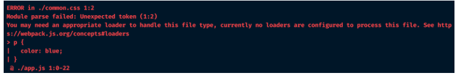

위 에러 메시지의 의미는 `app.js` 파일에서 임포트한 `common.css` 파일을 해석하기 위해 적절한 로더를 추가해달라는 것

##### CSS Loader 적용하기

이 때 해당 폴더에 아래의 NPM 명령어로 CSS 로더를 설치하고 웹팩 설정 파일 설정을 바꿔주면 에러를 해결할 수 있다

```sh
npm i css-loader -D
```

```js
// webpack.config.js
module.exports = {
  entry: './app.js',
  output: {
    filename: 'bundle.js'
  },
  module: {
    rules: [
      {
        test: /\.css$/,
        use: ['css-loader']
      }
    ]
  }
}
```

위의 `module` 쪽 코드를 보면 `rules` 배열에 객체 한 쌍을 추가했다. 그리고 그 객체에는 2개의 속성이 들어가 있는데 각각 아래와 같은 역할을 한다.

- `test` : 로더를 적용할 파일 유형 (일반적으로 정규 표현식 사용)
- `use` : 해당 파일에 적용할 로더의 이름

정리하자면 위 코드는 해당 프로젝트의 모든 CSS 파일에 대해서 CSS 로더를 적용하겠다는 의미다.

적용 후 빌드하면 정상적으로 실행되는 것을 알 수 있다.


##### 자주 사용되는 로더 종류

앞에서 살펴본 CSS 로더 이외에도 실제 서비스를 만들 때 자주 사용되는 로더의 종류

- [Babel Loader](https://webpack.js.org/loaders/babel-loader/#root)
- [Sass Loader](https://webpack.js.org/loaders/sass-loader/#root)
- [File Loader](https://webpack.js.org/loaders/file-loader/#root)
- [Vue Loader](https://github.com/vuejs/vue-loader)
- [TS Loader](https://webpack.js.org/guides/typescript/#loader)

로더를 여러 개 사용하는 경우에는 아래와 같이 `rules` 배열에 로더 옵션을 추가해주면 됨

```js
module.exports = {
  module: {
    rules: [
      { test: /\.css$/, use: 'css-loader' },
      { test: /\.ts$/, use: 'ts-loader' },
      // ...
    ]
  }
}
```

##### 로더 적용 순서

특정 파일에 대해 여러 개의 로더를 사용하는 경우 로더가 적용되는 **순서에 주의**해야 한다. 로더는 기본적으로 **오른쪽에서 왼쪽 순으로 적용**됩니다.

CSS의 확장 문법인 SCSS 파일에 로더를 적용하는 예시

```js
module: {
  rules: [
    {
      test: /\.scss$/,
      use: ['css-loader', 'sass-loader']
    }
  ]
}
```

위 코드는 scss 파일에 대해 먼저 Sass 로더로 전처리(scss 파일을 css 파일로 변환)를 한 다음 웹팩에서 CSS 파일을 인식할 수 있게 CSS 로더를 적용하는 코드다.

만약 웹팩으로 빌드한 자원으로 실행했을 때 해당 CSS 파일이 웹 애플리케이션에 인라인 스타일 태그로 추가되는 것을 원한다면 아래와 같이 [style 로더](https://webpack.js.org/loaders/style-loader/#root)도 추가할 수 있다.

```js
{
  test: /\.scss$/,
  use: ['style-loader', 'css-loader', 'sass-loader']
}
```

그리고, 위와 같이 배열로 입력하는 대신 아래와 같이 옵션을 포함한 형태로도 입력할 수 있다.

```js
module: {
  rules: [
    {
      test: /\.css$/,
      use: [
        { loader: 'style-loader' },
        {
          loader: 'css-loader',
          options: { modules: true }
        },
        { loader: 'sass-loader' }
      ]
    }
  ]
}
```


### Plugin

> https://webpack.js.org/plugins/

플러그인(plugin)은 웹팩의 기본적인 동작에 추가적인 기능을 제공하는 속성이다. 

로더랑 비교하면 로더는 파일을 해석하고 변환하는 과정에 관여하는 반면, 플러그인은 해당 결과물의 형태를 바꾸는 역할을 한다.

플러그인은 아래와 같이 선언

```js
// webpack.config.js
module.exports = {
  plugins: []
}
```

플러그인의 배열에는 생성자 함수로 생성한 객체 인스턴스만 추가될 수 있다. 

```js
// webpack.config.js
var webpack = require('webpack');
var HtmlWebpackPlugin = require('html-webpack-plugin');

module.exports = {
  plugins: [
    new HtmlWebpackPlugin(),
    new webpack.ProgressPlugin()
  ]
}
```

위의 두 플러그인은 각각 아래와 같은 역할을 한다.

- [HtmlWebpackPlugin](https://webpack.js.org/plugins/html-webpack-plugin/) : 웹팩으로 빌드한 결과물로 HTML 파일을 생성해주는 플러그인
- [ProgressPlugin](https://webpack.js.org/plugins/progress-plugin/#root) : 웹팩의 빌드 진행율을 표시해주는 플러그인

#### 자주 사용하는 플러그인

- [split-chunks-plugin](https://webpack.js.org/plugins/split-chunks-plugin/)
- [clean-webpack-plugin](https://www.npmjs.com/package/clean-webpack-plugin)
- [image-webpack-loader](https://github.com/tcoopman/image-webpack-loader)
- [webpack-bundle-analyzer-plugin](https://github.com/webpack-contrib/webpack-bundle-analyzer)


## Code Splitting

1. 빈 폴더에서 아래 명령어로 `package.json` 파일을 생성

```bash
npm init -y
```

2. 아래 명령어로 실습에 필요한 라이브러리 설치

```bash
npm i webpack webpack-cli css-loader style-loader mini-css-extract-plugin -D
```

3. 프로젝트 루트 레벨에 `index.html` 파일을 생성하고 아래 내용 추가

```html
<!DOCTYPE html>
<html>
  <head>
    <meta charset="utf-8">
    <title>CSS & Libraries Code Splitting</title>
  </head>
  <body>
    <header>
      <h3>CSS Code Splitting</h3>
    </header>
    <div>
      <!-- 웹팩 빌드 결과물이 잘 로딩되면 아래 p 태그의 텍스트 색깔이 파란색으로 표시됨 -->
      <p>
        This text should be colored with blue after injecting CSS bundle
      </p>
    </div>
    <!-- 웹팩의 빌드 결과물을 로딩하는 스크립트 -->
    <script src="./dist/bundle.js"></script>
  </body>
</html>
```

4. 프로젝트의 루트 레벨에 `base.css` 파일 생성 후 아래 내용 추가

```css
p {
  color : blue;
}
```

5. 프로젝트 루트 폴더에서 `index.js` 파일을 생성 후 아래 내용 추가

```js
//파일을 들고오겠다
import './base.css';
```

6. 프로젝트 루트 레벨에 웹팩 설정 파일 `webpack.config.js` 추가

```js
var path = require('path');

module.exports = {
  mode: 'none',
  entry: './index.js',
  output: {
    filename: 'bundle.js',
    path: path.resolve(__dirname, 'dist')
  },
  module: {
    rules: [
      {
        test: /\.css$/,
        use: ['style-loader', 'css-loader']
      }
    ]
  },
}
```

> `mode` 속성은 웹팩 버전 4 이상에서 추가된 속성. 웹팩으로 빌드할 때의 `development`, `production`, `none` 모드를 설정할 수 있다.

- `npm run build`를 쓰기 위해 `package.json`파일에 `"build": "webpack"`을 추가함

```json
 "scripts": {
    "test": "echo \"Error: no test specified\" && exit 1",
    "build": "webpack"
  },
```


- Entrypoint 아래의 숫자`[n]`가 모듈 해석 순서!

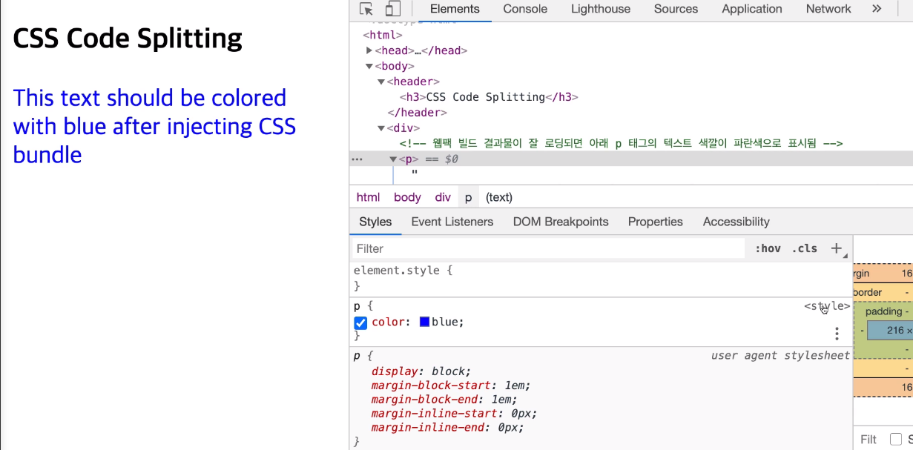

- 실제 `index.html`과 다르게 나옴!! `bundle.js`에 무슨 문제가 있는걸까?

- javascript가 아닌 코드를 webpack안으로 변환해주는 것이 `loader`

- >  이런식으로 들어갈수있게 해줌!

- 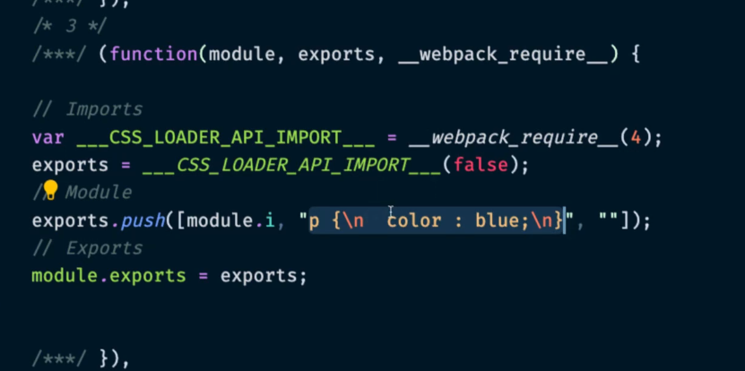

7. CSS 파일을 별도로 분리하기 위해 `MiniCssExtractPlugin` 플러그인 설정 추가

> 플러그인은 결과물에 대한 정보를 변화시켜서 제공해줌

```js
// webpack.config.js
var path = require('path');
var MiniCssExtractPlugin = require("mini-css-extract-plugin");

module.exports = {
  mode: 'none',
  entry: './index.js',
  output: {
    filename: 'bundle.js',
    path: path.resolve(__dirname, 'dist')
  },
  module: {
    rules: [
      {
        test: /\.css$/,
        use: [
          { loader: MiniCssExtractPlugin.loader },
          "css-loader"
        ]
      }
    ]
  },
  plugins: [
    new MiniCssExtractPlugin()
  ],
}
```


### Webpack Dev Server

> [웹팩 데브 서버 문서](https://joshua1988.github.io/webpack-guide/devtools/webpack-dev-server.html)
>
> 예를 들어 CSS에 코드를 바꿨는데 그건 `npm run build`를 추가로 하지 않으면 갱신되지 않음 
>
> 이런 번거러움을 줄이기 위해 사용하는게 웹팩 데브 서버
>
> 웹팩 데브 서버는 웹 애플리케이션을 개발하는 과정에서 유용하게 쓰이는 도구다. 웹팩의 빌드 대상 파일이 변경 되었을 때 매번 웹팩 명령어를 실행하지 않아도 코드만 변경하고 저장하면 웹팩으로 빌드한 후 브라우저를 새로고침 해준다.
>
> 매번 명령어를 치는 시간과 브라우저를 **새로 고침하는 시간 뿐만 아니라 웹팩 빌드 시간 또한 줄여주기 때문에 웹팩 기반의 웹 애플리케이션 개발에 필수로 사용**

#### 웹팩 데브 서버의 특징

웹팩 데브 서버는 일반 웹팩 빌드와 다른점이 있다. 

```json
"scripts": {
  "dev": "webpack-dev-server",
  "build": "webpack"
}
```

웹팩 데브 서버를 실행하여 웹팩 빌드를 하는 경우에는 빌드한 결과물이 파일 탐색기나 프로젝트 폴더에서 보이지 않는다. 좀 더 구체적으로 얘기하자면 웹팩 데브 서버로 빌드한 결과물은 메모리에 저장되고 파일로 생성하지는 않기 때문에 컴퓨터 내부적으로는 접근할 수 있지만 사람이 직접 눈으로 보고 파일을 조작할 순 없다.

따라서, 웹팩 데브 서버는 개발할 때만 사용하다가 개발이 완료되면 웹팩 명령어를 이용해 결과물을 파일로 생성해야 한다.

컴퓨터 구조 관점에서 파일 입출력보다 메모리 입출력이 더 빠르고 컴퓨터 자원이 덜 소모됨


### Webpack devserver 실습

1. 빈 폴더에서 아래 명령어로 `package.json` 파일을 생성

```bash
npm init -y
```

2. 아래 명령어로 필요 라이브러리 설치

```bash
npm i webpack webpack-cli webpack-dev-server html-webpack-plugin -D
```

3. `package.json` 파일에서 아래와 같이 `scripts` 속성에 커스텀 명령어를 추가

```json
{
  // ...
  "scripts": {
    "dev": "webpack-dev-server"
  },
}
```

4. 프로젝트 루트 레벨에 `index.html` 파일 생성 후 내용 추가

```html
<!DOCTYPE html>
<html>
  <head>
    <meta charset="utf-8">
    <title>Webpack Dev Server</title>
  </head>
  <body>
    <!-- 빌드 결과물이 정상적으로 로딩되면 아래 div 태그의 텍스트가 변경됨 -->
    <div class="container">
      TBD..
    </div>
    <!-- HTML Webpack Plugin에 의해 웹팩 빌드 내용이 아래에 추가됨 -->
  </body>
</html>
```

5. 프로젝트 루트 레벨에 `index.js` 파일 생성 및 아래 내용 추가

> container class에 접근해서 div의 innerText를 Webpack loaded!로 넣어줌

```js
var div = document.querySelector('.container');
div.innerText = 'Webpack loaded!!';
```

6. 웹팩 설정 파일 `webpack.config.js` 생성 후 아래 내용 추가

> [HTMLWebpackPlugin 문서](https://webpack.js.org/plugins/html-webpack-plugin/)
>
> 웹팩 빌드 결과물에 대해서 html 파일 만들어주고 그 안에 build내용을 포함해서 최종적으로 생성된 html파일을 돌리기만 하면 웹팩에 결과가 다 들어가있다

```js
var path = require('path');
//플러그인 라이브러리
var HtmlWebpackPlugin = require('html-webpack-plugin');

module.exports = {
  mode: 'none',
  entry: './index.js',
  output: {
    filename: 'bundle.js',
    path: path.resolve(__dirname, 'dist'),
  },
   //devSever를 쓸때 이 속성을 적어주면 되고, 추가적인건 API문서 참고하면됨
  devServer: {
    port: 9000,
  },
  plugins: [
    new HtmlWebpackPlugin({
      // index.html 템플릿을 기반으로 빌드 결과물을 추가해줌
      template: 'index.html',
    }),
  ],
};
```

7. 명령어 입력 창에 `npm run dev` 를 입력하여 웹팩 데브 서버 실행

> `package.json` 파일에서 `scripts` 속성에 커스텀 명령어를 추가했기때문에 쓸수 있음

8. [localhost:9000](localhost:9000)에 접속 후 아래와 같이 화면이 뜨는지 확인

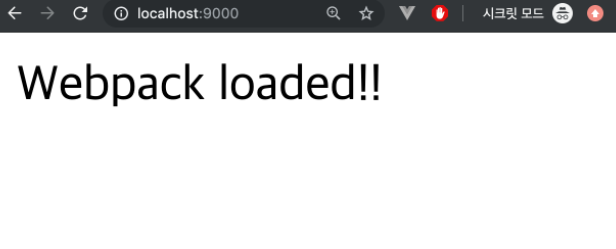

- 다른 값으로 바꾸고 저장을 하면 바로 컴파일링 되면서 알아서 바꿔줌

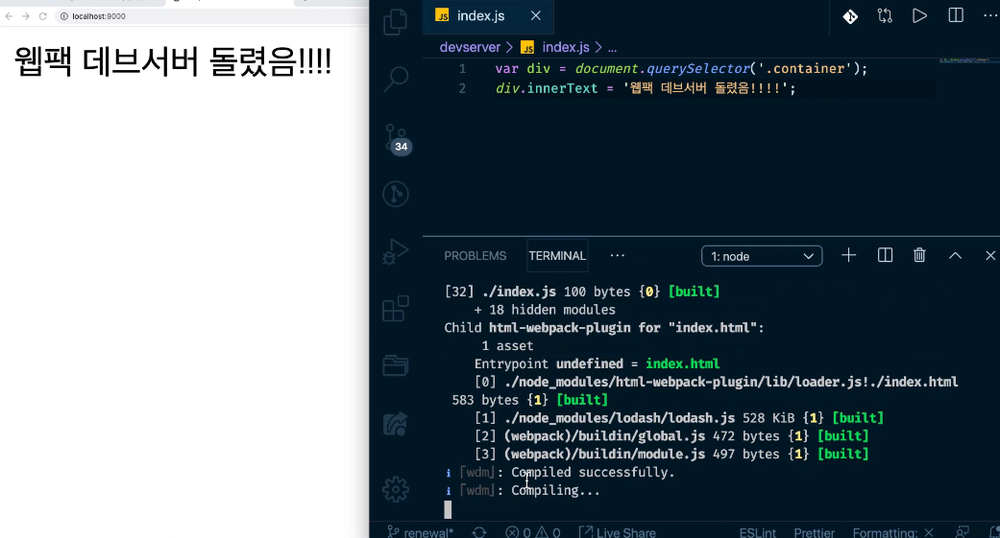

- 프로젝트 폴더에는 `dist`폴더와 `bundle.js`는 없지만 네트워크 패널에서 보면 있다!

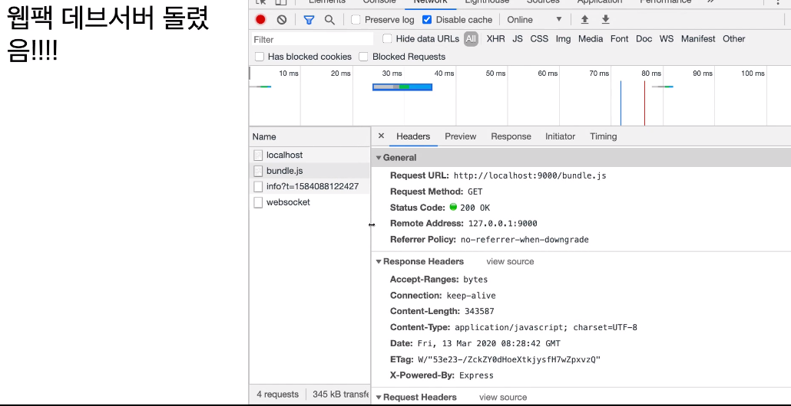

- bundle.js를 깔고 싶다면 scripts에 "build":"webpack" 커스텀 명령어 추가하고 `npm run build`하면 됨


## Webpack.config.js 설명

```js
// node path 라이브러리 가져옴
var path = require('path')
// webpack 라이브러리 가져옴
var webpack = require('webpack')

module.exports = {
  // mode가 새로생김-> bundle.js가 어떻게 보이게 할지
  mode: 'production',
  // 웹팩 변환 대상파일 진입점
  entry: './src/main.js',
  // 대상 파일 변환해서 웹팩 결과를 담을 속성
  output: {
    // node path라이브러리 resolve api를 이용해서 dist밑에 build.js를 만들겠다
    path: path.resolve(__dirname, './dist'),
    // cdn배포를 할때 그 cdn주소에 포함될 수 있게 속성을 정의하는 곳
    publicPath: '/dist/',
    filename: 'build.js'
  },
  // 로더의 속성을 정의하는 곳
  module: {
    // 여러개 속성이 정의됨
    rules: [
      {
        // css파일
        test: /\.css$/,
        use: [
          // 2nd css변환시킨 파일을 작업했다
          'vue-style-loader',
          // 1st 작동 js파일이 아닌 파일에 대해 css를 읽을 수 있게 로더를 넣어줌
          'css-loader'
        ],
      },      
      {
        // vue 확장파일
        test: /\.vue$/,
        loader: 'vue-loader',
        options: {
          loaders: {
          }
          // other vue-loader options go here
        }
      },
      {
        // js파일에 대해 바벨 로더를 돌렸는데 최대한 많은 브라우저가 호환될수있게 최신문법으로 변환해주는 도구
        // 바벨을 쉽게 웹펙에 넣을수 있어서 웹팩을 많이 사용함
        test: /\.js$/,
        loader: 'babel-loader',
        // 조심해야되는부분이 이 폴더는 라이브러리에 관계된 것이 들어있어서 이폴더까지 바벨로 변환할 필요없음
        exclude: /node_modules/
      },
      {
        // 이미지속성
        test: /\.(png|jpg|gif|svg)$/,
        loader: 'file-loader',
        options: {
          name: '[name].[ext]?[hash]'
        }
      }
    ]
  },
  // 웹팩으로 파일을 해석해나갈때 파일간 연관관곌르 해석할때 파일간의 해석방식을 정리함
  resolve: {
    alias: {
      // vue$ 표시가 들어가는 것은 뒤의 주소로 인지하겠다고 별칭을 주는 거라고 생각하면 됨
      'vue$': 'vue/dist/vue.esm.js'
    },
    // import를 할때 확장자, js, vue,jso는 붙이지 않아도 알아서 붙여줄게
    extensions: ['*', '.js', '.vue', '.json']
  },
  // devServer설정
  devServer: {
    historyApiFallback: true,
    noInfo: true,
    overlay: true
  },
  // 성능관련된 힌트를 주는 속성
  // 결과물의 사이즈가 초과가되면 웹팩에서 제한한 파일크기를 넘어가면 warning을 줌
  performance: {
    hints: false
  },
  // source-map여러가지 종류 중 하나를 선택해서 개발자도구에 빌드된 파일과 실제 파일을 연결해주는 링크를 제공해줌
  devtool: '#eval-source-map'
}

// 아래는 webpack버전 3까지의 옵션임 지금은 4이상이니까 이건 위에 mode:'production'이라고만 적어주면됨
// node.js의 실행 변수, 환경변수, 
// npm run build
// production용 배포가 node_env가 보통 production임
// 배포를 할때 추가적으로 우리가 이런것들을 넣겠다고 정의함
if (process.env.NODE_ENV === 'production') {
  module.exports.devtool = '#source-map'
  // http://vue-loader.vuejs.org/en/workflow/production.html
  module.exports.plugins = (module.exports.plugins || []).concat([
    new webpack.DefinePlugin({
      'process.env': {
        // node_env를 production으로 바꾼다
        NODE_ENV: '"production"'
      }
    }),
    new webpack.optimize.UglifyJsPlugin({
      sourceMap: true,
      compress: {
        warnings: false
      }
    }),
    new webpack.LoaderOptionsPlugin({
      minimize: true
    })
  ])
}

```

