# 컴퓨팅 사고력

> 당신이 Problem Solving 문제들 봤는데 어떻게 풀어야 하는지 전혀 감이 안옴

[toc]

## 0. 서론- 프로그래밍과 논리/수학

- 프로그래밍의 어려운 점 두 가지
  - 프로그래밍 언어 문법과 라이브러리 사용
  - 논리


## 1. 논리와 증명

> 명제 :  참이나 거짓을 알 수 있는 식이나 문장, ex) p,q,r ...로 표현
>
> 진리값 : 참이나 거짓을 표현, ex) T,F or 1,0
>
> [연산(결합)]
>
> - 부정 NOT
>   - p가 명제일 때, 명제의 진릿값이 반대
>   - ~p (not p or p의 부정이라고 읽음)
>
> - 논리곱 AND
>   - p,q가 명제일 때, p,q 모두 참일 때만 참이 되는 명제
>   - p ^ q(p and q)
> - 논리합 OR
>   - p,q가 명제일 때, p,q모두 거짓일 때만 거짓이 되는 명제
> - 배타적 논리합 XOR(exclusive OR)
>   - p,q가 명제일 때, p,q중 하나만 참일 때 참이 되는 명제
>
> [합성]
>
> 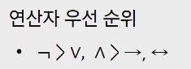
>
> - 항진명제 : 진리값이 항상 참
> - 모순 명제 : 진릿값이 항상 거짓
> - 사건명제 : 항진명제도 모순명제도 아닌 명제
> - 조건 명제
>   - p,q가 명제일 때, 명제 p가 조건(또는 원인), q가 결론(또는 결과)로 제시되는 명제
>   - p->q(p이면 q이다)
> - 쌍방조건명제
>   - p,q가 명제일 때, 명제p와 q가 모두 조건이면서 결론인 명제 p <->(p면 q고, q면 p다)
> - 조건명제의 역, 이, 대우
>   - 역 : q->p
>   - 이 : ~p ->~q
>   - 대우 : ~q ->~p
>
> 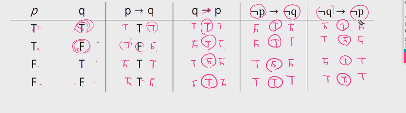

###  논리

- 문제1: 다음을 명제식 형태로 쓰고 참인지 거짓인지 판단
  - 만약 0이 홀수라면, 미국에서 2080년 월드컵이 열린다
    - **앞의 p가 거짓이라면 뒤의 q는 무조건 참**
  - 만약 19893827938274839ㄴ이 PrimeNumber라면, 2는 짝수다
    - 대우
    - 2가 홀수가 아니니까 앞의 p는 무조건 참
- 문제2 : p와 q가 명제이고, p->q가 거짓이라고 하자. 다음 명제식의 참 거짓은 어떻게 되는가?
  1. ~p->q : F
  2. pVq :T
  3. q->p :T
- 문제3 : 다음 명제들의 역, 이, 대우를 쓰시오
  1. 만약 0이 홀수라면, 미국에서 2080년 월드컵이 열림
  2. 만약 19893827938274839이 Prime Number라면, 2는 짝수이다

- 문제4 : 다음 명제식의 진리표를 만드시오

  

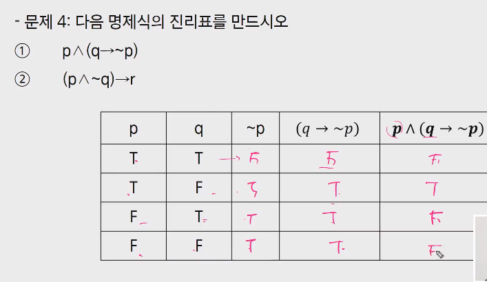

### 증명

- 증명은 정확한 명제식으로 표현할 수 있는 것
- 보통은 정확한 명제식까지 쓰지는 않으나 근본적으로는 명제식으로 바꿀 수 있음
- 증명에 대한 오해! p->q를 p<->와 혼동하는 것에서 일어남

Q. 모든 당구공은 색이 같다는 다음 증명에서 잘못된 것은?

- 수학적 귀납법 : P(1)이 참이고, P(n)->P(n+1)이 참이면 P(n)은 모든 자연수 n에 대해서 참
- 모든 자연수 n에 대해 당구공 n개가 들어있는 집합에서 그 집합에 포함된 당구공은 모두 색이 같다는 것을 증명함
- P(1): 당구공 1개가 들어있는 집합은 모두 색이 같음
- P(n) -> P(n+1)을 증명하기 위해 P(n)이 참이라고 가정
- 당구공 n+1개가 들어 있는 임의의 집합을 생각함
- 이 집합에서 하나를 빼면 당구공 n개가 있는 집합이 되므로 지금 상황에서 모든 당구공의 색이 같은
- 방금 뺀 원소를 다시 넣고, 다른 당구공을 빼면 역시 당구공 n개가 있는 집합이 되므로 지금 상황에서도 모든 당구공의 색이 같음
- 위의 두 상황에서 처음 뺀 당구공과 두번째로 뺀 당구공의 색이 같음을 알 수 있으므로 당구공 n+1개가 들어 있는 임의의 집합은 색이 같은것 만을 포함함
- 대부분의 사람들이 P(n)이 참이라고 가정할 수 없다고 반론
- 수학적 귀납법에서 필요한 것은 P(n) -> P(n+1)이 참임을 보이는것 뿐이므로 P(n)이 정말로 참일 필요는 없음
- 위 증명에서 실제로 잘못된 것은 처음 뺀 당구공과 두번째로 뺀 당구공의 색이 같음을 알 수 있음
- 공통부분이 있다는 것 실제로 n=1인 경우,즉 n+1=2인 경우 공통부분이 없음


### 수학적 귀납법과 증명의 수준

- 수학적 귀납법의 기본형 : P(1)이 참이고, P(n)->P(n+1)이 참이면 P(n)은 모든 자연수 n에 대해서 참
- 수학적 귀납법의 강한 형태 : P(1)이 참이고, P(1)^P(2)^...^P(n)->P(n+1)이 참이면 P(n)은 모든 자연수 n에 대해서 참

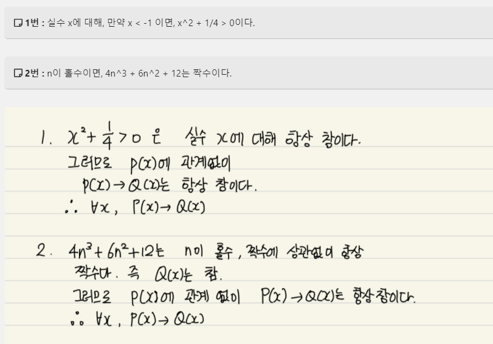

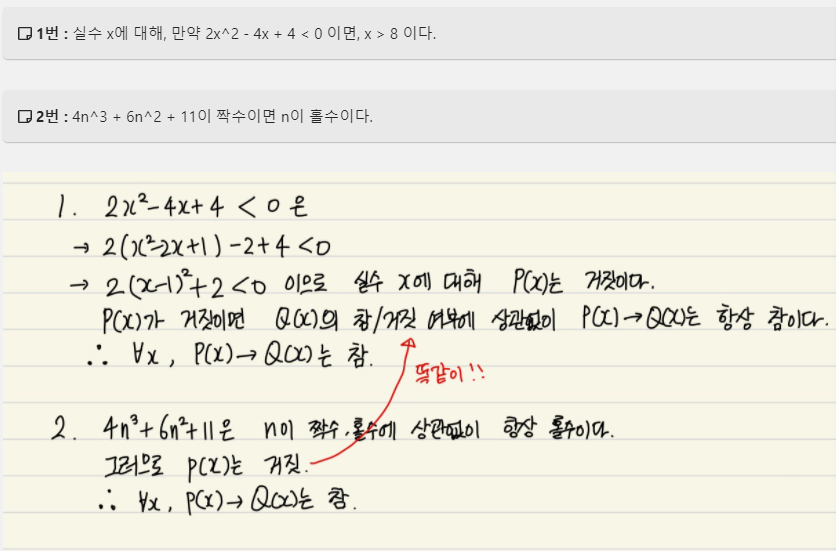

#### 문제1


1. 

| p    | q    | ~p   | ~p^q = N | ~N   | ~Nvq |
| ---- | ---- | ---- | -------- | ---- | ---- |
| T    | T    | F    | F        | T    | T    |
| T    | F    | F    | F        | T    | T    |
| F    | T    | T    | T        | F    | T    |
| F    | F    | T    | F        | T    | T    |

2. 


#### 문제2

> 모순 명제 : 논리식 혹은 합성명제에 있어서 그 명제를 구성하는 단순 명제들의 진리값에 관계없이 그 합성 명제의 진리값이 항상 거짓의 값을 가지는 것

1. 


2. 

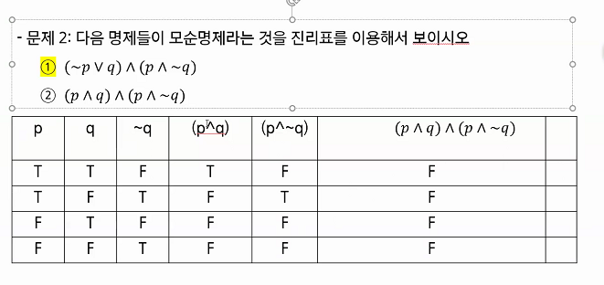

#### 문제3.

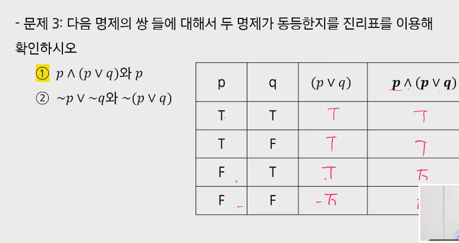

1. 동등하다

| p    | q    | pvq  | p^(pvq) |
| ---- | ---- | ---- | ------- |
| T    | T    | T    | T       |
| T    | F    | T    | T       |
| F    | T    | T    | F       |
| F    | F    | F    | F       |

2. 동등하지 않다

| p    | q    | ~p   | ~q   | ~pv~q | ~(pvq) |
| ---- | ---- | ---- | ---- | ----- | ------ |
| T    | T    | F    | F    | F     | F      |
| T    | F    | F    | T    | T     | F      |
| F    | T    | T    | F    | T     | F      |
| F    | F    | T    | T    | T     | T      |


#### 문제4.


```sh
1. (p^~q)v(p^q)
= p ^ (~qvq)
= p ^ T
= p

2. (pv~q)^(~pv~q)
= (p^~p)v~q
= Fv~q
= ~q
```


#### 문제5.

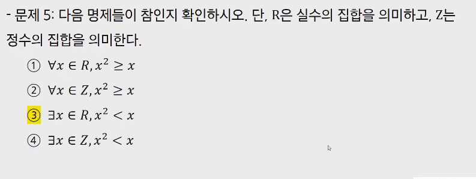

1.

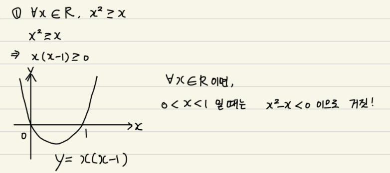

2. 


3. 


4. 


#### 문제6.

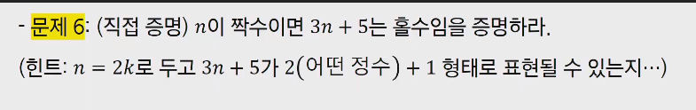

```sh
n이 짝수이므로 n=2k로 가정
3n+5 = 6k+5
=6k+4+1
=2(3k+2)+1
자연수 k에 대해 항상 짝수
=> 2(어떤 자연수) +1형태로 나타낼 수 있으므로 3n+5는 홀수이다.
```


#### 문제7. n이 홀수이면, n^2+n은 짝수임을 증명하라

```sh
n이 홀수라는 말은 어떤 자연수 k에 대해, n=2k-1로 표현할 수 있다.
n^2 + n = (2k-1)^2 +2k-1
=4k^2-4k+1+2k-1
=4k^2-2k
=2k(2k-1) : 자연수*홀수
=> 2 * 자연수 이므로 n^2+n은 항상 짝수
```


#### 문제8.

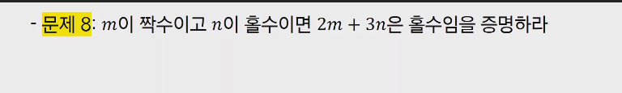

```sh
m = 2a, n=2b-1
2m+3n = 4a+6b-2-1
=2(2a+3b-1)-1
=2(자연수)-1
=>2m+3n은 항상 홀수!
```


#### 문제9. 자연수n에 대해 n^2+5가 홀수이면, n은 짝수임을 증명하라.

```sh
명제의 대우가 참이면 원래 명제 역시 참이 된다.
명제 : 자연수 n에 대해, n^2+5가 홀수이면, n은 짝수이다.
대우 : n이 홀수이면, n^2+5는 짝수이다.
n은 자연수 k에 대해 2k-1로 나타낼 수 있다.
n^2 + 5 = (2k-1)^2 +5
=4k^2-4k+6
=2(k^2-2k+3)
=>2*자연수이므로 대우명제는 참이됨. 대우가 참이므로 원래 명제 역시 참이됨
```


#### 문제10.


``` sh
대우 : n이 홀수이면 n^2은 홀수이다.
n은 자연수 k에 대해 n=2k-1로 나타낼 수 있다.
n^2 = (2k-1)^2
=4k^2-4k+1
=4k^2 -4k +2-1
=2(2k^2-2k+1)-1
=2*자연수-1이므로 n^2는 홀수이다.
대우 명제가 참이므로 원래 명제 역시 참이된다.
```

#### 문제11. 자연수n에 대해, n^2+5n+3은 항상 홀수임을 증명하라.

```sh
n이 짝수인 경우 = 2k
n이 홀수인 경우 = 2k-1

i. n이 짝수일 때,
n^2+5n+3 = 4k^2+10k+3
=4k^2+10k+4-1
2(2k^2+5k+2)-1
=>2*자연수-1형태이므로 n이 짝수일 때, n^2+5n+3은 홀수이다.

ii. n이 홀수일때,
n^2+5n+3 = (2k-1)^2+5(2k-1)+3
=4k^2-4k+1+10k-5+3
=4k^2+6k-1
=2(k^2+3k)-1
=> 2*자연수-1 형태이므로 n이 홀수일때 n^2+5n+3은 역시 홀수이다.
자연수 n에 대해 n^2+5n+3은 항상 홀수이다.
```


#### **문제12.**


``` sh
주어진 명제의 대우는 "n이 3의 배수가 아니면, n^2도 3의 배수가 아니다"가 된다.
n이 3의 배수가 아니라고 하면, n=3k+1 또는 3k+2(k=0,1,2...)
i. n=3k+1 일때
n^2 = (3k+1)^2 = 9k^2+6k+1 = 3(3k^2+2k)+1

ii. n=3k+2일때
n^2 = (3k+2)^2 = 9k^2+12k+4 = 3(3k^2+4k+1)+1

=>i과 ii에 의해 대우가 항상 참이므로 주어진 명제 역시 참이 됨
```


#### 문제13. n이 홀수이면, n^2을 8로 나눈 나머지는 1임을 증명하라.

```sh
n이 홀수라면, n을 4로 나눴을 때 나머지는 항상 1또는 3일 것이다.
즉, n=4k+1 또는 4k+3 (k=0,1,2,...)
i. n=4k+1일 때,
n^2 = 16k^2 +8k+1
=8(2k^2+k)+1

ii. n=4k+3일 때,
n^2 = 16k^2+24k+9
=16k^2+24k+8+1
=8(2k^2+3k+1)+1

=> i과 ii에 의해 주어진 명제는 참
```


#### 문제14. 어떤 자연수를 제곱하여도, 그 결과를 3으로 나눈 나머지는 2가 아님을 증명하라.

```sh
모든 자연수 n은 3k, 3k-1, 3k-2(k=1,2,3...)으로 표현할 수 있다.
i. 3k
n^2 = 9k^2 =3(3k^2)이므로 3으로 나눴을 때, 나머지0

ii. 3k-1
n^2 = (3k^2-1)^2 = 9k^2-6k+1 =3(3k^2-2k)+1이므로 3으로 나눴을 때, 나머지1

iii. 3k-2
n^2 = (3k-2)^2 = 9k^2-12k+4 =3(3k^2-4k+1)+1이므로 3으로 나눴을 때, 나머지1

i,ii,iii에 의해서, 주어진 명제는 참이 된다.
```


#### 문제 15. 유리수와 무리수의 합은 무리수임을 증명하라.

> 귀류법 : 어떤 주장에 대해 그 함의하는 내용을 따라가다보면 이치에 닿지 않는 내용 또는 결론에 이르게 된다는 것을 보여서 그 주장이 잘못된 것임을 보이는 것

```sh
귀류법을 통해 증명하기 위해, 어떤 유리수와 어떤 무리수의 합이 유리수가 된다고 가정하자.
유리수a, 무리수b가 있고, a+b=유리수c가 된다고 가정하자.
a+b=c, b=c-a가 되고, 이때, c-a값인 b는 유리수 성질에 의해 유리수여야한다.
따라서, b가 무리수라는 가정에 모순되므로, 유리수와 무리수의 합은 무리수이다.
```


#### 문제16. 루트2는 무리수임을 증명하라.

```sh
루트2를 유리수라고 가정하면, 기약분수 형태로 나타낼 수있다.
임의의 정수 a,b를 사용해 분수꼴로 나타내면 2^(1/2) = b/a(a,b는 서로소인 정수, a!=0)
양변을 제곱하면, 2=b^2/a^2 => 2a^2=b^2
그러므로 b^2은 짝수가 되고, b^2이 짝수이므로 b역시도 짝수가 된다.
b가 짝수이므로 b=2c로 나타낼 수 있고, 
2^a = 4^c 
a^2 = 2c^2이므로 a역시 짝수가 된다.
하지만 a도 짝수, b도 짝수이면, a와 b가 서로소라는 가정에 모순된다.
따라서 루트2는 유리수가 아니다.
```


#### 문제17. log2(5)가 무리수임을 증명하라.

```sh
log2(5)를 유리수라고 해보자.
그러면, log2(5) = b/a(a,b는 서로소인 정수, a!=0)
2^(b/a)=5로 나타낼 수 있고,
2^b = 5^a가 된다.
하지만 2^b는 짝수이고, 5^a는 홀수이므로 모순이 된다.
따라서 log2(5)는 무리수이다.
```


#### 문제18. 1+2+3+...+n = n(n+1)/2임을 증명하라.

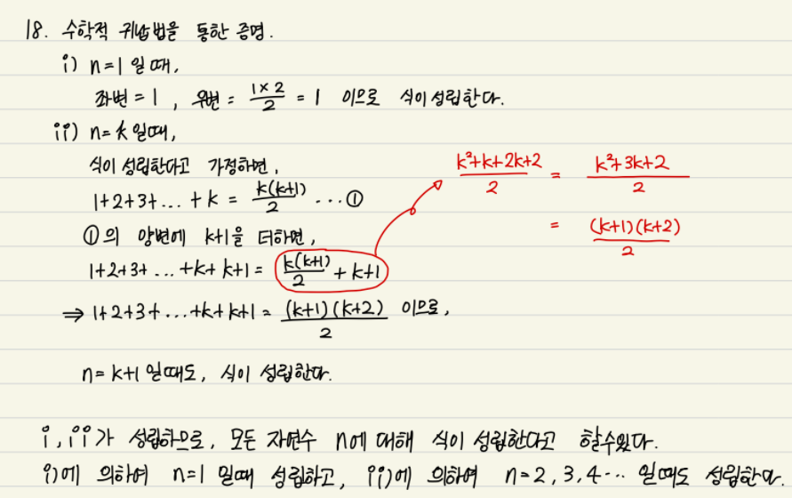


####  문제19. 1^2+2^2+...+n^2 = n(n+1)(2n+1)/6 임을 증명하라.

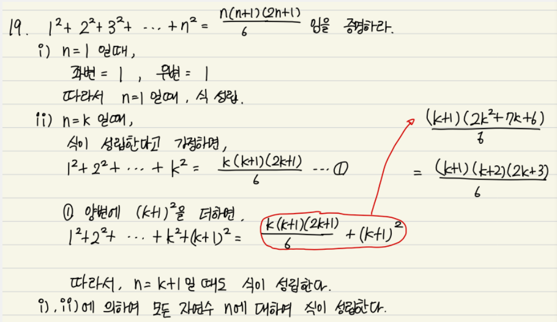


#### 문제20. 문제에 수식이 많아 아래 풀이에 써있는 문제 참고.


#### 문제21. 2이상의 모든 자연수n에 대해 n^3-n은 6으로 나누어 떨어짐을 증명하라.

```sh
n^3 -n = (n-1)n(n+1)이다.
즉, 연속된 세 자연수의 곱이다.
연속된 세 자연수 중 하나의 자연수는 무조건 3의 배수이고, 
하나의 자연수 역시 무조건 2의 배수이므로
n^3-n은 2이상의 모든 자연수 n에 대해 6으로 나누어 떨어진다.
```


#### 문제22.


#### 문제23.

> n*n 체스판이 있다. 시작 시점에 일부 칸들이 감염되어 있다. 매초마다 감염이 증가할 수 있다. 규칙은 다음과 같다. 어떤 감염되지 않은 칸은 상하나 좌우로 인접한 네개의 칸들 중 2개 이상이 감염된 상태일 때 감염된다. 이 규칙에 따라 모든 칸들을 감염시키기 위해서는 초기에 n개 이상의 칸들이 감염되어 있어야 함을 증명하라.


## 2. 수와 표현

- 컴퓨터는 0/1을 표현할 수 있는 비트들을 모아 수를 표현한다.

- k개의 비트를 사용하면 0부터 2^k - 1까지 표현 가능하다.
  - (항상 이 범위는 아니고 약속하는 방식에 따라 다르지만, 어떤 경우든 최대 2^k가지의 값을 표현하는 것은 가능하다.)

- 어떤 값 n을 표현하기 위해서 2^k -1 >= n이 성립해야 한다.

- 즉, k >= log2 (n+1) // 2는 밑이다.


#### 문제1. 2진수 표현에서 lon비트로 표현할 수 있는 숫자 범위는?

```sh
 일반적으로 0 ~ 2^logn -1만큼의 수를 표현 할 수 있다.
```


#### 문제2. 스무고개가 이상적으로 진행된다고 할 때, 맞출 수 있는 답의 종류는 몇 가지 인가?

```sh
한번 질문 할 때마다, 답의 종류가 2가지이므로, 2^20가지의 답이 나올 수 있다.
```


#### 문제3. n이 충분히 큰 값일 때, 다음 중 어느 값이 더 큰가? 각 쌍에 대해 비교하고 그 이유를 작성

1. 


2. 
3. 
4. 


#### 문제4. x = loga(yz)일때 x를 2를 밑으로 하는 로그들로 표현하시오. 단 로그 함수 인자는 모두 문자 하나여야 한다.

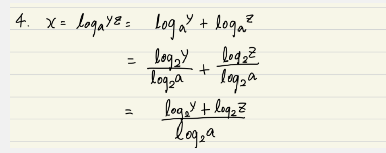


#### 문제5. 다음 함수들의 역함수를 구하시오

> 역함수를 구하는 순서
>
> 1. 함수 y=f(x)가 일대일 대응인지 확인.
> 2. y=f(x)를 x에 대해 푼다. x= f^(-1)(y)
> 3. x와 y를 바꾼다.

1. 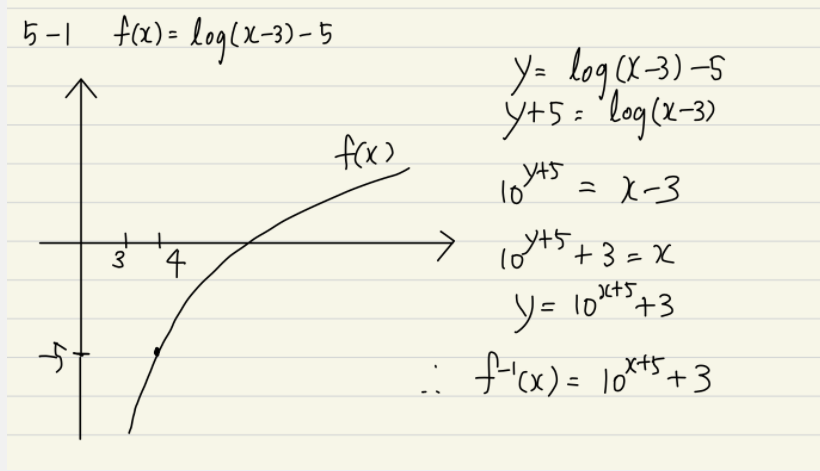
2. 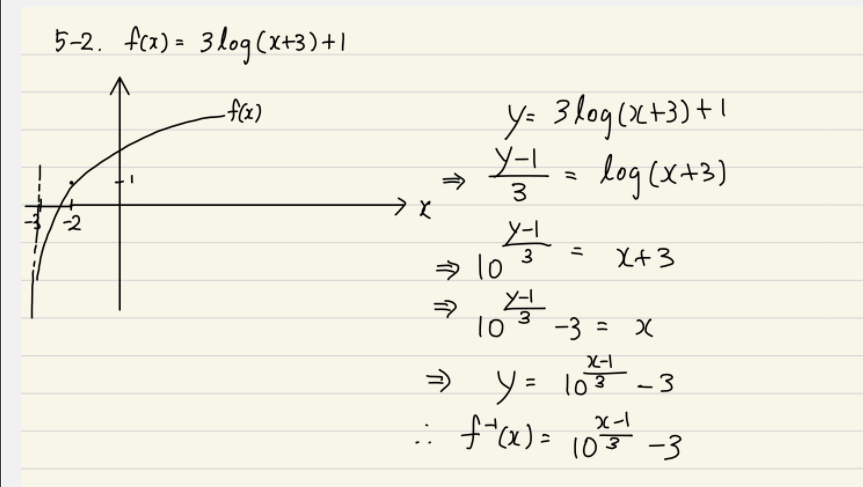
3. 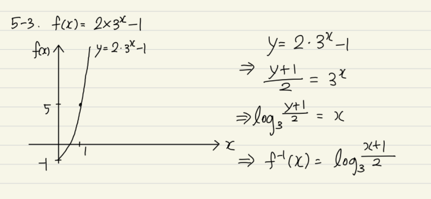


## 3. 집합과 조합론

- 두 집합 A, B에 대해 A가 B의 부분집합임을 증명한다는 것은 A의 임의의 원소가 B에 포함됨을 보이는 것과 같다.
- 예를 들어 모든 4의 배수는 2의 배수라는 것을 증명하려면, 4k=2(2k)임을 보이면 되는 것이다.
- 두 집합 A와 B가 같다는 것을 증명하기 위해서는 A가 B의 부분집합이고 B가 A의 부분집합임을 증명하면 된다. 
- 다음 두 집합이 같다는 것을 상세히 증명해 보자.

```sh
A = {x|x=2k+1,k는 자연수}, B={x|x=4k+1 혹은 x=4k+3,k는 자연수}
- A가 B의 부분집합이다.:
A에 포함되는 임의의 원소 x를 가정
x = 2k+1임.
k가 짝수(=2t)인 경우와 홀수(=2t+1)인 경우로 나눔
짝수인 경우 x= 2k+1 = 2(2t)+1=4t+1로서, x는 B에 포함
홀수인 경우 x = 2k+1 = 2(2t+1)+1=4t+3로서, x는 B에 포함됨.
모든 가능한 경우에 x는 B에 포함됨

- B가 A의 부분집합이다.:
B에 포함되는 임의의 원소 x를 가정
x= 4k+1인 경우, x=4k+1=2(2k)+1로서 x는 A에 포함됨. x=4k+3인 경우, 
x=4k+3=2(2k+1)+1로서 x는 A에 포함됨
모든 가능한 경우에 x는 B에 포함됨
- 위 두가지 증명에서 집합 A와 B는 같다.
```

- 조합론은 경우의 수를 따지는 문제들을 보통 말함
- 조합의 개수는 C를 이용하여 표현하기도 하지만 5C2=10과 같은 괄호 표현도 씀


#### 문제 1 : nCk + nC(k-1) = (n+1)Ck

```sh
nCk = nPk/k! = n!/(k!(n-k)!)

nC(k-1) = nP(k-1)/(k-1)! = n!/((k-1)!(n-k+1)!)

(n+1)Ck = (n+1)Pk/k! = (n+1)!/(k!(n-k+1)!)

 

n!/(k!(n-k)!) 여기에 n - k +1을 분모 분자에 곱해준다.

= (n!(n - k + 1))/(k!(n-k+1)!)

 

n!/((k-1)!(n-k+1)!) 여기에 k를 분모 분자에 곱해준다.

= (n!k)/(k!(n-k+1)!) 

 

분모가 동일해졌으므로 더해준다.

(n!(n-k+1 +k))/(k!(n-k+1)!) 

=(n!(n+1)) / (k!(n-k+1)!) 

=(n+1)! / (k!(n-k+1)!) 이된다.

(n+1)Ck = (n+1)Pk/k! = (n+1)!/(k!(n-k+1)!) 과 동일하므로 증명완료
```


#### 문제 2 : 수학적 귀납법으로 (x+y)^n = ∑ k=0부터 n까지 nCk * ((x^(n-k))*y^k)임을 증명하라.

```sh
1)  n = 0일때 (x+y)^0 = x^0 * y^0 = 1 성립

 

2) (x+y)^n = ∑ k=0부터 n까지 nCk * ((x^(n-k))*y^k) 양변에 (x+y)를 곱해준다.

(x+y)^(n+1) = (x+y)∑ k=0부터 n까지 nCk * ((x^(n-k))*y^k)

= x∑ k=0부터 n까지 nCk * ((x^(n-k))*y^k) + y∑ k=0부터 n까지 nCk * ((x^(n-k))*y^k)

=∑ k=0부터 n까지 nCk * ((x^(n-k+1))*y^k) + y∑ k=1부터 n+1까지 nC(k-1) * ((x^(n-k+1))*y^k)

이 형태는 문제 1번의  nCk + nC(k-1) = (n+1)Ck 꼴과 같다.

=> ∑ k=0부터 n+1까지 (n+1)Ck * ((x^(n-k+1))*y^k)

 

3) n = n+1

(x+y)^(n+1) = ∑ k=0부터 n+1까지 (n+1)Ck * ((x^(n-k+1))*y^k) 이므로 2번 식과 동일하다.
```


#### 문제 3 : 위의 결과를 이용해서 n개의 원소를 가진 집합의 가능한 부분집합의 종류는 2^n개임을 증명하라.

```sh
원소의 개수가 0개인 부분집합의 수 :  nC0

원소의 개수가 1개인 부분집합의 수 : nC1

원소의 개수가 2개인 부분집합의 수 : nC2

.....

원소의 개수가 n개인 부분집합의 수 : nCn

정리하면 ∑k =0부터 n까지  nCk이다.

위식과 동일하려면 x,와 y가 1이여야 한다.

그렇다면 (1+1)^n = 2^n

-------------------------

다른방식으로 증명해보겠습니다.

1) 원소의 개수가 0개( i = 0 )일때

가능한 조합은 { ø } , 2^0이므로 1개가 맞다.

i = 1일때

가능한 조합은 { ø }, { 1 } , 2^1이므로 2개가 맞다.

2) i = n일때

왼쪽항에 1을 추가하고 오른쪽항에 2^1을 추가한다.

그렇다면 n+1 = 2^n + 2^1이 될것이다.

계산하면 n+1 = 2^(n+1)

3) i = n+1 일때

n+1 = 2^(n+1) 이므로 위 식과 동일하다.
```


#### 문제 4 : 귀류법을 이용하여 (A-B)∩(B-A) = ø 임을 증명하라

```sh
1) A와 B가 겹치는 부분이 없을때

겹치는 부분이 없으므로 원소가 없다.

2) A와 B가 일정부분 겹칠때

아래 그림 참고

겹치는 부분이 없으므로 원소가 없다.

3) A와 B가 똑같을때

서로를 빼게되면 공집합이게 되고

ø ∩ ø은 원소가 없다.

 

명제의 결과과 공집합이 아니라고 가정하자

찾는 원소가 A에 있을때,-> 공집합이 된다.

찾는 원소가 B에 있을때 -> 공집합이 된다.

찾는 원소가 A, B에 있을때  -> 공집합이 된다.

찾는 원소가 A,B에 없을때 -> 공집합이 된다.

부분집합의 원소가 될수 없으므로 모순된다.
```


#### 문제 5 : ∃x( x ∈ A ∧ x ⊆ B ) ∨( x ∈ B ∧ x ⊆ A)

####  두 집합이 다르다는 것은 다음 명제와 동치임을 증명하라. 증명에는 앞에서 설명한 내용과 기본 논리만을 사용해야 한다.


#### 문제6.


#### 문제7.


#### 문제 8 : 8 X 8 체스 판에서 똑 같은 말 두개를 놓으려고 한다. 아무 곳에나 놓아도 되지만 한 칸에 두개가 들어가지는 못한다. 가능한 방법은 모두 몇가지 인가?

```sh
각각의 말을 a1, a2라고할때 둘의 위치가 바뀌는것을 중복허용한다면

64 * 63개의 수가 나온다.

중복허용을 하지않는다면

64C2로 계산할 수 있다.

64C2 = 64P2/2! = 64!/2!(64-2)! = 64!/2!(62)! = 64 * 63 / 2
```


#### 문제 9 : n개의 원소를 가진 집합의 가능한 부분집합의 종류는 2^n개임을 조합론을 이용해 증명하라.


#### 문제 10 : 비밀번호를 0부터 9까지의 숫자만 가지고 만든다고 하자. 4개이상 6개 이하의 숫자를 쓸 수 있다고 할 때 가능한 비밀번호의 가지수는 얼마인가?

```sh
중복순열을 이용하여 계산

4자리 만드는경우 : 10∏4 = 10^4 = 1만개

5자리 만드는 경우 : 10∏5 = 10^5 = 10만개

6자리 만드는 경우 : 10∏6=10^6 = 100만개

111만개의 가지수가 나온다.

 

중복을 하용하지 않는다면

10P4 + 10P5 + 10P6 = 5,040 + 30,240 + 151,200

= 186,480
```


#### 문제 11 : 원소가 m개인 집합에서 원소가 n개인 집합으로 가는 단사함수의 개수는 몇가지인가?

```sh
단사함수이므로 순열을 이용하여 풀면된다.

nPm = n!/(n-m)!
```


#### 문제 12 : 52 개의 트럼프 카드 한 세트를 이용해서 만들 수 있는 5개의 카드의 조합은 몇가지인가?

```sh
52C5로 볼 수 있다.

52!/5!47!

52*51*50*49*48 / 5*4*3*2

= 2,598,960
```


#### 문제 13 : 52개의 카드를 이용해서 만들 수 있는 5개 카드 조합 중 같은 무늬의 카드가 정확히 3개인 경우는 몇가지인가?

```sh
52개의 카드를 트럼프 카드라고 할때

13개의 숫자가 적힌 4종류의 모양이 있다.

13개의 카드중 다른 숫자를 뽑기을 확률은 13C5라고 볼수있다.

모양이 4개이므로 4∏5를 곱해야한다,

13!/(5! 8!) * 4∏5 = 13 * 11 * 9  * 4^5

 

따라서 1,317,888 의 경우의 수가 생긴다.
```


#### 문제 14 : x + y+ z = 100의 자연수 해는 몇가지인가?

```sh
99C2

-> 99!/2!97!

-> 99*98/2

-> 4851
```


#### 문제 15 : (포함 배제 원리) 5개의 원소를 가진 집합에서 3개의 원소를 가진 집합으로 가는 전사함수는 몇가지가 있는가?

 

#### 문제 16 : 52개 카드에서 5개 카드 조합을 만들 때, 숫자가 같은 카드가 한쌍도 없는 경우는 몇가지인가?

 

#### 문제 17 : n개의 원소를 가진 배열에서 연속된 구간을 잡으려고 한다. 잡을 수 있는 가능한 구간은 몇가지인가? 단 구간의 크기는 1 이상이다.

```sh
1칸씩 잡을때 = n개

2칸씩 잡을때 = n-1개

...

n칸씩 잡을때 = 1개

= n + n-1 + n-2 + ... + 2 + 1

= n(n-1)/2 
```


## 4. 기초 수식

> 알고리즘 시간 복잡도를 표현할 수 있는 다양한 수식들이 존재
>
> 풀이법을 익혀 두어야 알고리즘 시간 복잡도를 계산할 수 있고, 알고리즘 시간이 얼마나 걸릴지 예측할 수 있음

#### 다음 재귀식들을 O() notation 수준으로 풀어라.

#### 문제 1 : T(n) = T(n - 1) + 1

```sh
T(n) = T(n - 1) + 1

= T(n-2) + 1 +1

= .....

=T(1) + 1 + 1 + 1 + ... + 1

1이 n개 있으므로

O(n)
```


#### 문제 2 : T(n) = T(n - 1) + n

```sh
T(n) = T(n - 1) + n

= T(n-2) + n +n -1

= T(n-3) + n + n -1 + n - 2

= .....

=T(1) + n + n-1 + n-2 + ... + 1

<=T(1) + n + n + +n + ... + n

n이 n개 있으므로

O(n^2)
```


#### 문제 3 : T(n) = T(n - 1) log(n)

```sh
T(n) = T(n - 1) + log(n)

= T(n-2) + log(n) + log(n-1)

= T(n-3) + log(n) + log(n -1) + log(n - 2)

= .....

=T(1) + log(n) + log(n -1) + log(n - 2) + ... + log(2)

<=T(1) +  log(n) + log(n) + log(n) + ... + log(n)

log(n)이 n개 있으므로

O(nlog(n))
```


#### 문제 4 : T(n) = T(n/2) + 1

```sh
T(n) = T(n/2) + 1

T(n) = T(n/2^k) + k

n/2^k = 1 이어야 하므로

n = 2^k

k = log(n)

T(n) = T(1) + log(n)

따라서 O(log(n))
```


#### 문제 5 : T(n) = T(n/2) + n

```sh
T(n) = T(n/2) + n

T(n) = T(n/2^k) + n∑ i= 0부터 k까지 1/2^k

∑ i= 0부터 k까지 1/2^i 는 1로 생각할수있다.

따라서 O(n)
```


#### 문제 6 : T(n) = 2T(n/2) + n

```sh
1)T(n) = 2(T(n/2) +n

2) T(n/2) = 2T(n/2^2) + n/2

2식을 1번에 대입

 

T(n) = 2[2T(n/2^2) + n/2] + n

3) T(n)=(2^2)T(n/2^2) + n + n

 

4) t(n/2^2) = 2T(n/2^3) + n/2^2

4식을 3식에 대입

T(n) = (2^3)T(n/2^3) +3n

 

과정을 반복...

 

T(n) = (2^k)T(n/2^k) + kn

T(n/2^3) = T(1)이 되어야하므로

n/2^3 = 1

n = 2^k

k = log(n)

 

T(n) = (2^k)T(n/2^k) + kn = nT(1) + nlog(n)

따라서 O( nlog(n) )
```


#### 문제 7 : T(n) = 3T(n/2) + n

```sh
 T(n) = 3T(n/2) + n

T(n) = (3^k)T(n/2^k) + n∑ i=0부터 n까지  (3^i)/(2^i)

n/2^k = 1 이여야 하므로 n = 2^k

k = log(n)

 

=> O(n^log3)
```


#### 문제 8 : T(n) = T(n- 1) + 1/n

```sh
T(n) = T(n-1) + 1/n

T(n) = T(0) + ∑ k=1 부터 n까지 1/n

∑ k=1 부터 n까지 1/n <= 1+∫1부터 k까지 1/k dk

= 1 + log(n) - log1

= 1 + log(n)

따라서 O(log(n))
```


#### 문제 9 : T(n) = T(n/2) + T(n/4) + T(n/6) + T(n/12) + 1

```sh
T(n) = T(n/2) + T(n/4) + T(n/8) + n  <--(1)
T (n / 8) <T (n / 4) 및 T (n / 8) <T (n / 2) 때문에

따라서 T (n)> 3T (n / 8) + n

Master Theorem을 사용하면 T (n) = Omiga (n)를 얻을 수 있습니다.

T(n/2) = T(n/4) + T(n/8) + T(n/16) + n/2 <--(2)
(1)-(2) 다음을 얻을 수 있습니다.

T(n) - T(n/2) = T(n/2) - T(n/16) + n/2
T(n) = 2T(n/2) - T(n/16) + n/2
     < 2T(n/2) + n/2
Master Theorem을 사용하면 T (n) = O (n)을 얻을 수 있습니다.

따라서 T (n) = Theta (n)
```


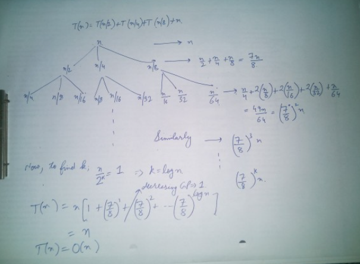

#### 문제 10 : T(n) = √n*T(√n) + n


T(2)=2T(2)=2이는 n의 최소값입니다. 그래서,

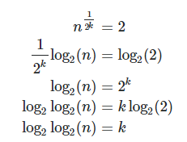

따라서 반복 관계는 다음과 같습니다.

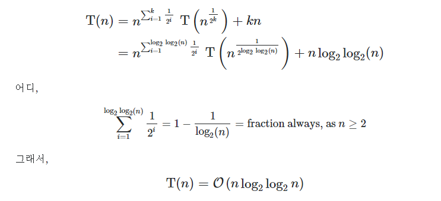


## 5. 재귀

> 재귀란 자기 자신을 호출하는 함수,
>
> 함수는 입력이 있으며, 자기 자신의 입력과 동일한 입력으로 자기 자신을 호출하면 당연히 끝나지 않음
>
> 하지만, 다른 입력으로 호출하면 끝날 수 있음
>
> ```c
> int abc(int x) // 이 함수는 안 끝남
> {
>     return abc(x);
> }
> 
> int sum(int x) // 이 함수는 끝남. 결과 값은?
> {
>     if (x <= 0) return 0;
>     return x + sum(x-1);
> }
> ```
>
> 함수란 어떤 문제를 해결하는 방법을 코딩한 것
>
> 함수가 어떤 문제의 단 한 케이스만을 해결하는 것이 아님
>
> 제대로 코딩 된 것이라면 해결하는 문제의 **모든 케이스들을** 해결해야 함
>
> 수학적 귀납법 증명 사용 가능
>
> (가) n이 0일 때 문제를 풀 수 있음
>
> (나) n-1에서 문제를 풀 수 있으면 n에서도 문제를 풀 수 있음
>
> 위 두가지가 사실이면 모든 가능한 n에 대해 문제를 풀 수 있다
>
> 위 박스이 함수 sum()을 보면 우의 두 가지를 코딩한 것임
>
> 따라서 sum()함수는 문제를 해결한다는 것을 증명
>
> 다르게 생각하는 방법 :
>
> 어떤 문제를 해결하려다 **부분 문제를** 만났는데, 원래 해결하려던 입력 케이스와 **동일한 문제**에 속하지만 '크기가 더 작은 입력케이스'를 해결하는 것이 문제
>
> 즉, 부분 문제가 동일한 문제인 경우!

#### 문제 1 : 피보나치 수열 : F(n) = F(n - 1) + F(m-2), F(1) = F(2) = 1

```c
int fibonacii(int x) {
    if (x == 1 || x == 2)        
        return 1;
    return fibonacii(x - 1) + fibonacii(x - 2);
}
```


```sh
fibonacii(1) 일때, fibonacii(2)일때 1이므로 위의 소스코드는 성립한다.

 

n = k일때,

fibonacii(1) .... fibonacii(k-1)이 F(1)... F(k-1)과 같다고 가정하자. 이때 F(k) = F(k-1) + F(k-2)이므로 fibonacii(k) = fibo(k-1) + fibo(k-2) = F(k) 가 성립한다.

따라서 fibonacii(n)을 호출하면 F(n)이 return 됨을 알 수 있다.

 

시간복잡도

T(n) = T(n-1) + T(n-2) +1 < 2T(n-1)+1

T(n) = O(2^n);
```


#### 문제 2 : Merge Sort, 크기 n인 배열을 입력으로 받아, 배열을 절반으로 두개로 나눈 후, 각 작은 배열을 재귀적으로 정렬하고, 그 결과를 Merge한다.

> [합병 정렬(merge sort) 알고리즘의 개념 요약](https://gmlwjd9405.github.io/2018/05/08/algorithm-merge-sort.html)
>
> - ‘존 폰 노이만(John von Neumann)’이라는 사람이 제안한 방법
> - 일반적인 방법으로 구현했을 때 이 정렬은 안정 정렬 에 속하며, 분할 정복 알고리즘의 하나 이다.
>   - 분할 정복(divide and conquer) 방법
>     - 문제를 작은 2개의 문제로 분리하고 각각을 해결한 다음, 결과를 모아서 원래의 문제를 해결하는 전략이다.
>     - 분할 정복 방법은 대개 순환 호출을 이용하여 구현한다.
> - 과정 설명
>   1. 리스트의 길이가 0 또는 1이면 이미 정렬된 것으로 본다. 그렇지 않은 경우에는
>   2. 정렬되지 않은 리스트를 절반으로 잘라 비슷한 크기의 두 부분 리스트로 나눈다.
>   3. 각 부분 리스트를 재귀적으로 합병 정렬을 이용해 정렬한다.
>   4. 두 부분 리스트를 다시 하나의 정렬된 리스트로 합병한다.
>
> **합병 정렬(merge sort) 알고리즘의 구체적인 개념**
>
> - 하나의 리스트를 두 개의 균등한 크기로 분할하고 분할된 부분 리스트를 정렬한 다음, 두 개의 정렬된 부분 리스트를 합하여 전체가 정렬된 리스트가 되게 하는 방법이다.
> - 합병 정렬은 다음의 단계들로 이루어진다.
>   - **분할(Divide):** 입력 배열을 같은 크기의 2개의 부분 배열로 분할한다.
>   - **정복(Conquer)**: 부분 배열을 정렬한다. 부분 배열의 크기가 충분히 작지 않으면 **순환 호출**을 이용하여 다시 분할 정복 방법을 적용한다.
>   - **결합(Combine)**: 정렬된 부분 배열들을 하나의 배열에 합병한다.
> - 합병 정렬의 과정
>   - 추가적인 리스트가 필요하다.
>   - 각 부분 배열을 정렬할 때도 합병 정렬을 순환적으로 호출하여 적용한다.
>   - 합병 정렬에서 실제로 정렬이 이루어지는 시점은 2개의 리스트를 합병(merge)하는 단계 이다.
>
> 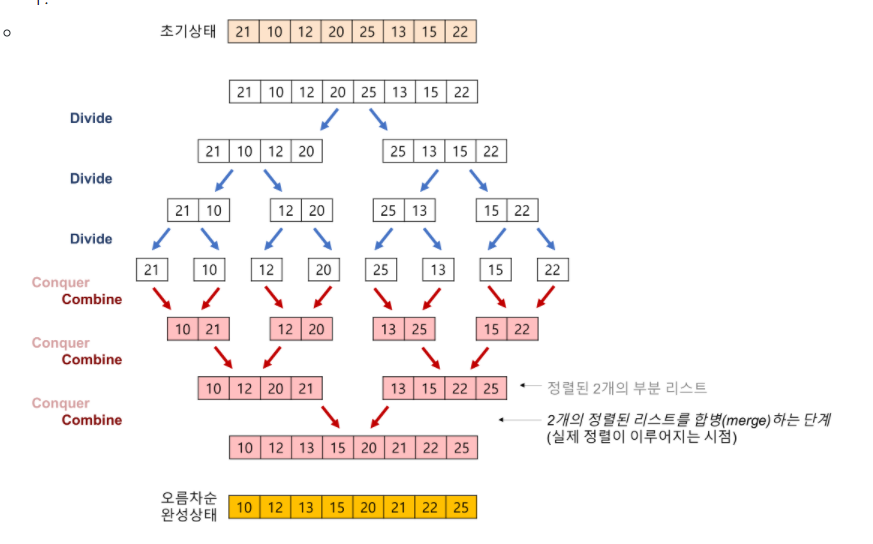
>
> **합병정렬 알고리즘 특징**
>
> - 단점
>   - 만약 레코드를 배열(Array)로 구성하면, 임시 배열이 필요하다.
>     - 제자리 정렬(in-place sorting)이 아니다.
>   - 레크드들의 크기가 큰 경우에는 이동 횟수가 많으므로 매우 큰 시간적 낭비를 초래한다.
> - 장점
>   - 안정적인 정렬 방법
>     - 데이터의 분포에 영향을 덜 받는다. 즉, 입력 데이터가 무엇이든 간에 정렬되는 시간은 동일하다. (O(nlog₂n)로 동일)
>   - 만약 레코드를 연결 리스트(Linked List)로 구성하면, 링크 인덱스만 변경되므로 데이터의 이동은 무시할 수 있을 정도로 작아진다.
>     - 제자리 정렬(in-place sorting)로 구현할 수 있다.
>   - 따라서 크기가 큰 레코드를 정렬할 경우에 연결 리스트를 사용한다면, 합병 정렬은 퀵 정렬을 포함한 다른 어떤 졍렬 방법보다 효율적이다.
>
> **합병 정렬의 시간복잡도**
>
> 시간복잡도를 계산한다면
>
> - 분할 단계
>   - 비교 연산과 이동 연산이 수행되지 않는다.
> - 합병 단계
>   - 비교 횟수
>
> 
>
> - 순환 호출의 깊이 (합병 단계의 수)
>   - 레코드의 개수 n이 2의 거듭제곱이라고 가정(n=2^k)했을 때, n=2^3의 경우, 2^3 -> 2^2 -> 2^1 -> 2^0 순으로 줄어들어 순환 호출의 깊이가 3임을 알 수 있다. 이것을 **일반화**하면 n=2^k의 경우, k(k=log₂n)임을 알 수 있다.
>   - k=log₂n
> - 각 합병 단계의 비교 연산
>   - 크기 1인 부분 배열 2개를 합병하는 데는 최대 2번의 비교 연산이 필요하고, 부분 배열의 쌍이 4개이므로 24=8번의 비교 연산이 필요하다. 다음 단계에서는 크기 2인 부분 배열 2개를 합병하는 데 최대 4번의 비교 연산이 필요하고, 부분 배열의 쌍이 2개이므로 42=8번의 비교 연산이 필요하다. 마지막 단계에서는 크기 4인 부분 배열 2개를 합병하는 데는 최대 8번의 비교 연산이 필요하고, 부분 배열의 쌍이 1개이므로 8*1=8번의 비교 연산이 필요하다. 이것을 **일반화**하면 하나의 합병 단계에서는 최대 n번의 비교 연산을 수행함을 알 수 있다.
>   - 최대 n번
> - 순환 호출의 깊이 만큼의 합병 단계 * 각 합병 단계의 비교 연산 = nlog₂n
> - 이동 횟수
>   - 순환 호출의 깊이 (합병 단계의 수)
>     - k=log₂n
>   - 각 합병 단계의 이동 연산
>     - 임시 배열에 복사했다가 다시 가져와야 되므로 이동 연산은 총 부분 배열에 들어 있는 요소의 개수가 n인 경우, 레코드의 이동이 2n번 발생한다.
>     - 순환 호출의 깊이 만큼의 합병 단계 * 각 합병 단계의 이동 연산 = 2nlog₂n
> - T(n) = nlog₂n(비교) + 2nlog₂n(이동) = 3nlog₂n = O(nlog₂n)

**합병정렬 알고리즘의 예제**

- 배열에 27, 10, 12, 20, 25, 13, 15, 22이 저장되어 있다고 가정하고 자료를 오름차순으로 정렬해 보자.
- 2개의 정렬된 리스트를 합병(merge)하는 과정

1. 2개의 리스트의 값들을 처음부터 하나씩 비교하여 두 개의 리스트의 값 중에서 더 작은 값을 새로운 리스트(sorted)로 옮긴다.
2. 둘 중에서 하나가 끝날 때까지 이 과정을 되풀이한다.
3. 만약 둘 중에서 하나의 리스트가 먼저 끝나게 되면 나머지 리스트의 값들을 전부 새로운 리스트(sorted)로 복사한다.
4. 새로운 리스트(sorted)를 원래의 리스트(list)로 옮긴다.


#### 문제 3 : 다음 소팅 알고리즘이 실제로 소팅에 항상 성공한다는 것을 증명하라.

```c
Stupid (A[0..n-1])
{
    if n=2 and A[0] > A[1]
        then swap A[0] and A[1]
    else
        m = ceiling(2n/3)
        Stupid(A[0..m-1])
        Stupid(A[n-m..n-1])
        Stupid(A[0..m-1])
}
```


#### 문제 4 : 위의 소팅 알고리즘에서 수행하는 Swap의 횟수는 최대 몇번인가?


#### 문제 5 : 어떤 배열 A[1..n]에 (음수포함) 정수 값이 증가하는 순서로 저장되어 있다. A[i] = i가 되는 인덱스 i가 존재하는지 찾는 알고리즘을 수도코드 수준으로 작성하고 정확성 증명 및 시간 복잡도 계산을 수행하라. 동일한 문제이지만, 저장된 값이 자연수로 제한되면 어떻게 풀 수 있는가?


#### 문제 6 : 루트 있는 트리를 입력으로 받아 아래와 같이 출력하는 알고리즘을 작성하라. 트리의 각 노드에는 1,000 미만의 자연수가 저장되어 있다. 트리의 노드 연결 관계는 다음과 같이 표현해야 한다. 아래 출력에서 루트에는 자식이 3개 있고 그 자식들 중 하나는 더 이상 자식이 없는 것임을 알 수 있을 것이다.


#### 문제 7 : (어려움) 무한한 크기의 물통이 3개 있다. 초기에 각 물통에는 자연수리터 만큼의 물이 들어 있다. 가능한 작업은 두개의 물통을 잡아서 그중 많거나 같은양의 물이 들어 있는 곳에서 작은 쪽으로 물을 부어서 작은 쪽의 물의 양을 두배로 만드는 것이다. 즉, 4리터, 3리터를 잡았다면 1리터, 6리터가 될 것이다. 입력으로 초기 물의 양을 받아서 한 물통에 들어 있는 물의 양을 0리터로 만들고 싶다. (실행 시간이 많이 걸려도 좋으니) 그렇게 만드는 과정을 계산하는 알고리즘을 작성하라.


## 6. 동적 프로그래밍

> Memoization : 간단하게 설명하면 재귀 함수에서 동일한 입력의 함수 호풀이 반복적으로 일어날 때 그 결과 값을 저장해 두고 불러 쓰는 것
>
> 최초 입력에서 파생되는 모든 가능한 입력에 대한 답을 모두 저장할 수 있는 메모리가 있어야함
>
> Dynamic Programming : 단순히 재귀에서 저장된 값을 찾아보는 것으로도 가능하지만, 결괏값을 순서를 정해서 계산할 수도 있음

#### 문제1. Memoization 피보나치 수열: 힌트- 계산되는 값이 n가지 밖에 없으므로 이 값들을 저장할 수 있는 배열을 만들어 두고 재귀 호출에 들어가기 전에 값이 있는지 확인

```sh
F(n) = F(n-1) + F(n-2)
F(1)=F(2)=1
```


#### 문제2. Dynamic Programming 피보나치수열 :F(n) = F(n-1) + F(n-2),(힌트 : 작은 값부터 순서대로 계산)


#### 질문 : 실제로 실행시키면 세 버전 중 어느 것이 가장 빠를까?


#### 문제3. 행렬곱하기, n개의 행렬을 곱하려고 한다. 크기가 axb인 행렬과 크기가 bxc인 행렬을 곱하는데 드는 계산량은 axbxc라고 한다. n개의 행렬들을 곱하는데 필요한 계산량을 최소화 하는 순서를 찾는 알고리즘을 작성하라. 행렬들의 크기는 다르고, 입력으로 주어진다고 가정하라. 물론 곱하기가 가능한 크기들만 주어짐


#### 문제4.(약간 어려움) 배열에 정수(음수 포함)들이 저장되어 있다. 연속인 구간들 중 그 합이 가장 큰 구간을 찾는 알고리즘을 작성하라. 단, 구간의 크기는 1이상이 허용됨


#### 문제5.(어려움) 배열에 정수(음수 포함)들이 저장되어 있다. 배열의 일부 값들을 골라서 배열에 있는 순서대로 보면 증가하는 순서가 될 수 있다. 이러한 것들 중 가장 긴 것을 찾는 알고리즘을 작성하라.


## 7. 조합론 프로그래밍 과제

#### 과제 1 : 52장의 카드에서 만들 수 있는 페어가 정확히 하나만 있는 5장 조합을 모두 출력하는 프로그램을 작성하라. 출력이 너무 많으면 카드 수를 줄일 수 있다.


#### 과제 2 : x + y + z = 100 의 자연수 해를 모두 출력하는 프로그램을 작성하라.

```c++
#include <iostream>
 
using namespace std;
 
int main() {
    int count = 0;
    for (int x = 0; x < 101; x++) {
        for (int y = 0; y < 101; y++) {
            for (int z = 0; z < 101; z++) {
                if (x + y + z == 100) {
                    cout << x << ", " << y << ", " << z << endl;
                    count++;
                    break;
                }
            }
        }
    }
    cout << count << endl;
    return 0;
}
```


#### 과제 3 : m개의 원소를 가진 집합에서 n개의 원소를 가진 집합으로 가는 전사함수의 개수를 출력하는 프로그램을 작성하라. m과 n의 값을 바꾸어 보면서 값이 너무 커지지 않는 입력의 범위가 어느 정도인지 확인해라.

#### 과제4 : m개의 원소를 가진 집합에서 n개의 원소를 가진 집합으로 가는 전사함수를 모두 출력하라. 출력을 어떻게 하는 것이 적절할 지 생각해 보아야 한다.

 

3번과 4번 통합해서 풀었습니다.

프로그램 하나안에 전사함수 모든 출력과 개수가 출력됩니다.

```c++
#include <iostream>
#include <string>
#include <time.h>
 
using namespace std;
//재귀함수를 이용한 문제풀이(dfs)
// m >= n
int n, m, f_count = 0;
 
void function(int current = 1, string list = "") {
    for (int j = 1; j <= n; j++) {
        if (current == m) {
            cout << ++f_count <<"번 : " <<list << "(" << current << "," << j << ") " << endl;;
        }
        else {
            string templist = list + "(" + to_string(current) + "," + to_string(j) + ") ";
            function(current + 1, templist);
        }
    }
}
 
int main() {
    clock_t start = clock(), end;
    cin >> m >> n;
    function();
    cout << "조합의 개수" << f_count << endl;
    end = clock();
    cout << (double)(end - start)/CLOCKS_PER_SEC << endl;
    return 0;
}
```


## 8. 기초 알고리즘 프로그래밍 과제

#### 과제 1 : 피보나치 수열을 계산하는 3가지 방법을 모두 작성해 보고 실행시간을 비교하라. 결과 값이 빨리 커지는 것에 주의하라.

```c++
#include <iostream>
#include <time.h>
using namespace std;
//일반 피보나치
int fibonacii(int x) {
    if (x == 1 || x == 2)        
        return 1;
    return fibonacii(x - 1) + fibonacii(x - 2);
}
 
int main() {
    int n;
    clock_t start = clock(), end;
    cin >> n;
    cout << fibonacii(n) << endl;
    end = clock();
    cout << (double)(end - start)/CLOCKS_PER_SEC << endl;
    return 0;
}
```


```c++
#include <iostream>
#include <time.h>
using namespace std;
 
int arr[100]{ 0 };
//동적 
int fibonacii(int x) {
    if (arr[x])
        return arr[x];
    if (x == 1 || x == 2)
        return 1;
    return arr[x] = fibonacii(x - 1) + fibonacii(x - 2);
}
 
int main() {
    int n;
    clock_t start = clock(), end;
    cin >> n;
    cout << fibonacii(n) << endl;
    end = clock();
    cout << (double)(end - start)/CLOCKS_PER_SEC << endl;
    return 0;
}
```


```c++
#include <iostream>
#include <time.h>
 
using namespace std;
 
int arr[100]{ 0 };
//메모이제이션
int main() {
    int n;
    clock_t start = clock(), end;
    cin >> n;
    arr[2] = arr[1] = 1;
    for (int i = 2; i <= n; i++) {
        arr[i] = arr[i - 1] + arr[i - 2];
    }
    cout << arr[n] << endl;
    end = clock();
    cout << (double)(end - start)/CLOCKS_PER_SEC << endl;
    return 0;
}
```


#### 과제 2 : n개의 행렬을 곱하려고 한다. 크기가 a x b 인 행렬과 크기가 b x c인 행렬을 곱하는 데 드는 계산량은 a x b x c 라고 한다. n개의 행렬들을 곱하는데 필요한 계산량을 최소화 하는 순서를 찾는 알고리즘을 작성하라. 행렬들의 크기는 다르고, 입력으로 주어진다고 가정하라. 물론 곱하기가 가능한 크기들만 주어진다.

 

#### 과제 3 : 배열에 정수(음수포함)들이 저장되어 있다. 연속인 구간들 중 그 합이 가장 큰 구간을 찾는 프로그램을 작성하라.


```c++
#include <iostream>
#include <vector>
#include <algorithm>
#include <time.h>
 
using namespace std;
//다이나믹 프로그래밍(동적 계획법)을
//이용한 연속된 구간합 구하기
 
int getMax(vector<int> &list, bool check) {
    int temp = 0, max = INT_MIN;
    for (int i = 0; i < list.size(); i++) {
        //양수인 원소가 하나라도 있을때
        if (check) {
            temp += list[i];
            if (temp > max)     max = temp;
            else if (check && temp < 0)        temp = 0;
        }
        else{    //모든 원소가 음수
            if (max < list[i])        max = list[i];
        }
    }
    return max;
}
 
int main() {
    clock_t start = clock(), end;
    vector<int> list{-2, 2, 4, -2, -6, 8, -1, 9, -3, -1};
    vector<int> list2 {-7, -2, -3, -4, -5, -6, -1 };
    bool check = true;
    //테스트케이스 1
    if (0 > *max_element(list.begin(), list.end()))     check = false;
    cout << "테스트케이스 1 : " <<getMax(list, check) << endl;
    //테스트케이스2
    //모든 원소가 음수라면 
    if (0 > * max_element(list2.begin(), list2.end()))     check = false;
    cout << "테스트케이스 2 : " <<getMax(list2, check) << endl;
    end = clock();
    cout << (double)(end - start)/CLOCKS_PER_SEC << endl;
    return 0;
}
```


#### 과제 4 : 배열에 정수(음수포함)들이 저장되어 있다. 배열의 일부값들을 골라서 배열에 있는 순서대로 보면 증가하는 순서가 될 수 있다. 이러한 것들 중 가장 긴 것을 찾는 프로그램을 작성하라.

 

#### 과제 5 : 루트 있는 트리를 입력으로 받아 아래와 같이 출력하는 프로그램을 작성하라. 트리의 각 노드에는 1,000 미만의 자연수가 저장되어 있다. 트리의 노드 연결 관계는 다음과 같이 표현해야 한다. 아래 출력에서 루트에는 자식이 3개 잇고 그 자식들 중 하나는 더이상 자식이 없는 것임을 알 수 있을 것이다.


## Reference

[컴퓨팅사고|논리와증명](https://sangwoo0727.github.io/computational%20thinking/ComputationalThinking-2/)

[컴퓨팅사고|집합과조합론](https://mungto.tistory.com/75)

[합병 정렬(merge sort) 알고리즘의 개념 요약](https://gmlwjd9405.github.io/2018/05/08/algorithm-merge-sort.html)