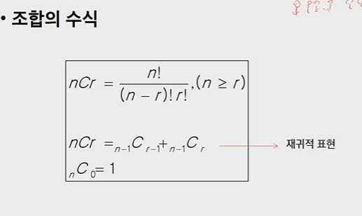

# Algorithm

> 재귀적 알고리즘의 특성을 이해하고 이를 구현하기 위한 재귀 호출에 대해 학습
>
> 완전 검색의 개념을 이해하고 완전 검색을 통한 문제 해결 방법에 대해 학습
>
> 조합적 문제에 대한 완전 검색 방법에 대해 이해
>
> 순열, 조합, 부분집합을 생성하는 알고리즘을 학습한다
>
> 탐욕 알고리즘 기법의 개념과 주요 특성을 이해한다


## 반복과 재귀

- 반복과 재귀는 유사한 작업을 수행할 수 있다
- 반복은 수행하는 작업이 완료될 때까지 계속 반복
  - 루프(for, while 구조)
- 재귀는 주어진 문제의 해를 구하기 위해 동일하면서 더 작은 문제의 해를 이용하는 방법
  - 하나의 큰 문제를 해결할 수 있는(해결하기 쉬운) 더 작은 문제로 쪼개고 결과들을 결합한다.
  - 재귀 함수로 구현

### 반복구조


- 초기화
  - 반복되는 명령문을 실행하기 전에(한번만) 조건 검사에 사용할 변수의 초기값 설정

- 조건 검사(check control expression)

- 반복할 명령문 실행(action)

- 업데이트(loop update)
  - 무한 루프가 되지 않게 조건이 거짓이 되게 한다.

### 반복을 이용한 선택정렬

```python
def SelectionSort(A):
    n = len(A)
    for i in range(0,n-1):
        min = i
       	for j in range(i+1,n):
            if A[j] < A[min]:
                min = j
        A[min],A[i] = A[i],A[min]
```


### 재귀를 이용한 선택정렬

```python
def selectionSort(arr,idx):
    if idx == len(arr)-1:
        return
    MIN = idx
    for i in range(idx,len(arr)):
        print('1',LIST)
        if arr[i] < arr[MIN]:
            MIN = i
    arr[idx], arr[MIN] = arr[MIN], arr[idx]

    selectionSort(arr,idx+1)

LIST = [10,2,4,3,6,39,32]

selectionSort(LIST,0)
print(LIST)
```


### 재귀적 알고리즘

- 재귀적 정의는 두 부분으로 나뉜다
- 하나 또는 그 이상의 기본 경우
  - 집합에 포함되어 잇는 원소로 induction을 생성하기 위한 seed역할
- 하나 또는 그 이상의 유도된 경우
  - 새로운 집합의 원소를 생성하기 위해 결합되어지는 방법


### 재귀함수

- 함수 내부에서 직접 혹은 간접적으로 자기 자신을 호출하는 함수
- 일반적으로 재귀적 정의를 이용해서 재귀 함수를 구현한다.
- 따라서, 기본 부분과 유도 부분으로 구성됨
- 재귀적 프로그램을 작성하는 것은 반복 구조에 비해 간결하고 이해하기 쉬움
  - 그러나, 재귀에 대해 익숙하지 않은 개발자들은 재귀적 프로그램이 어렵다고 느낌
- 함수 호출은 프로그램 메모리 구조에서 스택을 사용함, 따라서 재귀호출은 반복적인 스택의 사용을 의미하며 메모리 및 속도에서 성능저하가 발생함


### 팩토리얼 재귀 함수

- 재귀적 정의

```python
Basic Rule : N<=1경우, n =1
Inductive rule: N>1, n! = nx(n-1)!
```

- n!에 대한 재귀함수

```python
def fact(n):
    if n<=1:
        return 1
   	else:
        return n*fact(n-1)
```


### 반복 또는 재귀?

- 해결할 문제를 고려해서 반복이나 재귀의 방법을 선택
- 재귀는 문제 해결을 위한 알고리즘 설계가 간단하고 자연스럽다.
  - 추상 자료형(list,tree등)의 알고리즘은 재귀적 구현이 간단하고 자연스러운 경우가 많다
- 일반적으로, 재귀적 알고리즘은 반복 알고리즘보다 더 많은 메모리와 연산을 필요로 한다.

- **입력 값 n이 커질수록 재귀 알고리즘은 반복에 비해 비효율적일 수 있다**

|                | 재귀                                   | 반복                |
| -------------- | -------------------------------------- | ------------------- |
| 종료           | 재귀함수 호출이 종료되는 베이스 케이스 | 반복문의 종료 조건  |
| 수행시간       | (상대적) 느림                          | 빠름                |
| 메모리 공간    | (상대적) 많이 사용                     | 적게 사용           |
| 소스 코드 길이 | 짧고 간결                              | 길다                |
| 소스 코드 형태 | 선택구조(if...else...)                 | 반복구조(for,while) |
| 무한반복시     | 스택 오버플로우                        | CPU를 반복해서 점유 |


## 완전 검색기법

- 모든 경우의 수를 생성하고 테스트하기 때문에  수행 속도는 느리지만, 해답을 찾아내지 못할 확률이 작다.
  - 완전검색은 입력의 크기를 작게 해서 간편하고 빠르게 답을 구하는 프로그램을 작성한다.
- 이를 기반으로 그리디 기법이나 동적계획법을 이용해서 효율적인 알고리즘을 찾을 수 있다
- 검정등에서 주어진 문제를 풀 때, **우선 완전검색으로 접근하여 해답을 도출한 후, 성능 개선을 위해 다른 알고리즘을 사용하고 해답을 확인하는 것이 바람직하다.**

- 왕전 검색을 통한 Baby-gin 접근
- 고려할 수 있는 모든 경우의 수 생성하기
  - 6개의 숫자로 만들 수 있는 모든 숫자 나열(중복 포함)
  - 예) 입력으로 {2,3,5,7,7,7}을 받았을 경우, 아래와 같이 순열을 생성할 수 있다.
- 해답 테스트하기
  - 앞의 3자리와 뒤의 3자리를 잘라, run와 triplet 여부를 테스트하고 최종적으로 baby-gin을 판자


### 완전 검색

- 많은 종류의 문제들이 특정 조건을 만족하는 경우나 요소를 찾는 것이다
- 또한, 이들은 전형적으로 순열, 조합 그리고 부분 집합과 같은 조합적 문제들과 연관된다
- 완전검색은 조합적 문제에 대한 brute-force방법이다.


### 조합적 문제

#### 순열(Permutation)

- 서로 다른 것들 중 몇 개를 뽑아서 한 줄로 나열하는 것
- 서로 다른 n개 중 r개를 택하는 순열은 아래와 같이 표현함 nPr
- 그리고 nPr은  `n*(n-1)*(n-2)*...*(n-r+1)`

- nPn = n! 이라고 표기하며 Factorial이라 부름
- `n! = nx(n-1)x(n-2)x...x2x1`

- 다수의 알고리즘 문제들은 순서화된 요소들의 집합에서 최선의 방법을 찾는 것과 관련 있다.
- N개의 요소들에 대해서 n!개의 순열들이 존재한다.
- 단순하게 순열을 생성하는 방법
- 예) {1,2,3}을 포함하는 모든 순열을 생성하는 함수
  - 동일한 숫자가 포함되지 않았을 때, 각 자리 수 별로 loop을 이용해 아래와 같이 구현할 수 있다.

```python
for i1 in 1->3
	for i2 in 1->3
    	if i2 != i1
        	for i3 in 1->3
            	if i3 != i1 and i3 != i2
                	print(i1,i2,i3)
```

#### 순열 생성 방법

- 사전적 순서
  - {1,2,3}, n=3인 경우 다음과 같이 생성됨
  - [1 2 3] [1 3 2] [2 1 3] [3 1 2] [3 2 1]
- 최소 변경을 통한 방법
  - 각각의 순열들은 이전의 상태에서 단지 두 개의 요소들 교환을 통해 생성
  - [1 2 3] [3 2 1] [2 3 1] [2 1 3] [3 1 2] [1 3 2]


```python
def perm(n,k,m):
    if n == k:
        print(p)
    else:
        for i in range(m):
            if u[i] == 0:
                u[i] = 1
                p[n] = A[i]
                perm(n+1,k,m)
                u[i] = 0
A = [1,2,3,4,5]
p = [0]*3
u = [0]*5
perm(0,3,5)
```


### 부분집합

- 집합에 포함된 원소들을 선택
- 다수의 중요 알고리즘들이 원소들의 그룹에서 최적의 부분 집합을 찾는 것
- N개의 원소를 포함한 집합
  - 자기 자신과 공집합 포함한 모든 부분집합의 개수는 2^n 개
  - 원소의 수가 증가하면 부분집합의 개수는 지수적으로 증가

#### 바이너리 카운팅을 통한 사전적 순서

- 부분집합을 생성하기 위한 가장 자연스러운 방법
- 원소 수에  해당하는 N개의 비트열을 이용
- n번째 비트값이 1이면 n번째 원소가 포함되었음을 의미

```python
arr = [3,6,7,1,5,4]
n = len(arr)

for i in range(0,(1<<n)): # 1<<n : 부분집합의 개수
	for j in range(0,n): #원소의 수만큼 비트를 비교함
        if i & (1<<j): #i의 j번째 비트가 1이면 j번째 원소 출력
            print('%d'%arr[j],end ='')
    print()            
```


### 조합

- 서로 다른 n개의 원소 중 r개를 순서 없이 골라낸 것을 조합이라고 부름



