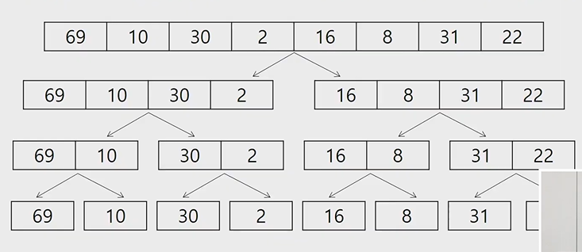

# Algorithm_분할정복/백트랙킹

[toc]

## 분할정복

### 설계전략

- 분할 : 해결할 문제를 여러 개의 작은 부분으로 나눈다.
- 정복 : 나눈 작은 문제를 각각 해결한다.
- 통합 : (필요하다면) 해결된 해답을 모은다.


### 거듭제곱

- 반복 알고리즘:`O(n)`

```sh
Iterative_power(x,n)
	result <- 1
	FOR i in 1 ->n
	result <-result*x
	
	RETURN result
```


### 분할정복 기반의 알고리즘 : `O(log2n)`

```sh
Recursive_Power(x,n)
	IF n==1 : RETURN x
	IF n is even
		y <- Recursive_Power(x,n/2)
		RETURN y*y
		
	ELSE 
		y <- Recursive_Power(x,(n-1)/2)
		RETURN y*y*x
```


### 병합정렬(Merge Sort)

- 여러 개의 정렬된 자료의 집합을 병합하여 한 개의 정렬된 집합으로 만드는 방식
- 분할 정복 알고리즘 활용
  - 자료를 최소 단위의 문제까지 나눈 후에 차례대로 정렬하여 최종 결과를 얻어냄.
  - top-down 방식

- 시간 복잡도
  - O(n log n)

#### 병합 정렬 과정

- {69, 10, 30, 2, 16, 8, 31, 22}를 병합 정렬하는 과정
- 분할 단계 : 전체 자료 집합에 대하여, 최소 크기 의 부분집합이 될 때까지 분할 작업을 계속한다.



- 병합 단계 : 2개의 부분 집합을 정렬하면서 하나의 집합으로 병합
- 8개의 부분집합이 1개로 병합될 때까지 반복함


#### 알고리즘:분할과정

```sh
merge_sort(LIST m)
	IF length(m) == 1 : RETURN m
	
	LIST left, right
	middle <- length(m)/2
	FOR x in m before middle
		add x to left
	FOR x in m after or equal middle
		add x to right
    
    left <- merge_sort(left)
    right <- merge_sort(right)
    
    RETURN merge(left,right)
```

#### 알고리즘:병합과정

```sh
merge (LIST left, LIST right)
	LIST result
	
	WHILE length(left) > 0 OR length(right) > 0
		IF length(left) > 0 AND length(right) > 0
			IF first(left) <= first(right)
				append popfirst(left) to result
			ELSE
				append popfirst(right) to result
       	ELIF length(left) > 0
       		append popfirst(left) to result
       	ELIF length(right) > 0
       		append popfirst(right) to result
    RETURN result
```


### 퀵정렬

- 주어진 배열을 두개로 분할하고, 각각 정렬한다.
  - 병합 정렬과 동일?
- 다른 점1 : 병합 정렬은 그냥 두 부분으로 나누는 반면에, 퀵정렬은 분할할 때, 기준 아이템(pivot item) 중심으로, 이보다 작은 것은 왼편, 큰 것은 오른편에 위치시킨다.
- 다른점 2: 각 부분 정렬이 끝난 후,병합 정렬은, '병합' 이란 후처리 작업이 필요하나, 퀵 정렬은 필요로 하지 않는다.

#### 퀵정렬 알고리즘

```sh
quickSort(A[],L,r)
	if L < r
		s <- partition(a,L,r)
		quickSort(A[],L,s-1)
		quickSort(A[],s+1,r)
```

#### Hoare-Partition 알고리즘

```sh
partition(A[],L,r)
	p <-A[L] //p:피봇값
	i <-L, j<-r
	
	WHILE i <=j
		WHILE i<=j and A[i] <= p : i++
		WHILE i <= j and A[j] >= p: j--
		IF i < j : swap(A[i],A[j])
		
	swap(A[L],A[j])
	RETURN j
```


#### 아이디어

- P(피봇) 값들 보다 큰 값은 오른쪽, 작은 값들은 왼쪽 집합에 위치하도록 한다.


- 피봇을 두 집합의 가운데에 위치시킨다.


- 피봇 선택
  - 왼쪽 끝/ 오른쪽 끝/ 임의의 세개 값 중에 중간 값


#### Lumuto partition 알고리즘

```sh
partition(A[],p,r)
	x <- A[r]
	i <- p-1
	
	FOR j in p -> r-1
		IF A[j] <= x
			i++,swap(A[i],A[j])
			
	swap(A[i+1],A[r])
	RETURN i+1
```


## 이진 검색(Binary Search)

- 검색 과정

1. 자료의 중앙에 있는 원소를 고름
2. 중앙 원소의 값과 찾고자 하는 목표 값을 비교한다
3. 목표 값이 중앙 원소의 값보다 작으면 자료의 왼쪽 반에 대해서 새로 검색을 수행하고, 크다면 자료의 오른쪽 반에 대해서 새로 검색을 수행한다.
4. 찾고자 하는 값을 찾을때까지 1~3의 과정을 반복한다.

### 알고리즘:반복구조

```sh
binarySearch(n,S[],k)
low <- 0
high <- n-1

WHILE low <= high AND location = 0
	mid <- low + (high - low) / 2
	
	IF S[mid] == key
		RETURN mid
	ELIF S[mid] > key
		high <- mid-1
	ELSE
		low <- mid +1
RETURN -1
```

### 알고리즘:재귀구조

``` sh
binarySearch(S[],low,high,key)
	IF low > high
		RETURN -1
	ELSE
		mid <- (low+high) / 2
		IF key == S[mid]
			RETURN mid
		ELIF key < a[mid]
			RETURN binarySearch(a[],low,mid-1,key)
		ELSE
			RETURN binarySearch(a[],mid+1,high,key)
```


### 분할정복의 활용

- 병합 정렬은 외부 정렬의 기본이 되는 정렬 알고리즘이다. 또한, 멀티코어 CPU나 다수의 프로세서에서 정렬 알고리즘을 병렬화하기 위해 병합 정렬 알고리즘이 활용됨
- 퀵정렬은 매우 큰 입력 데이터에 대해서 좋은 성능을 보이는 알고리즘


## 백트래킹

1. 상태 공간 트리의 깊이 우선 검색을 실시한다
2. 각 노드가 유망한지를 점검한다
3. 만일 그 노드가 유망하지 않으면, 그 노드의 부모 노드로 돌아가서 검색을 계속함

### 상태공간트리를 구축하여 문제를 해결

``` sh
bool backtrack(선택집합, 선택한 수, 모든선택수)
{
	if (선택한 수 == 모든 선택수) // 더 이상 탐색할 노드가 없다.
	{
		찾는 솔루션인지 체크;
		return 결과;
	}
	현재 선택한 상태집합에 포함되지 않는 후보 선택들(노드) 생성
	
	모든 후보 선택들에 대해
	{
		선택 집합에 하나의 후보선택을 추가
		선택한 수  = 선택한 수 + 1
		결과 = backtrack 호출(선택집합, 선택한 수, 모든 선택수)
		
		if (결과 == 성공)
			return 성공; // 성공한 경우 상위로 전달
	}
	return 실패;
}
```


#### {1,2,3}의 powerset을 구하는 백트래킹 알고리즘

```sh
backtrack(a[],k,input)
	c[MAXCANDIDATES] //후보군저장
	ncands // 후보의개수
	
	IF k == input : process_solution(a[],k)
	ELSE
		k++
		make_candiadates(a[],k,input,c[],ncands)
		FOr i in 0 -> ncands -1
			a[k] <- c[i]
			bactrack(a,k,input)
main()
	a[MAX] // powerset을 저장할 배열
	backtrack(a[],0,3) // 3개의 원소를 가지는 powerset

make_candidates(a[],k,n,c[],ncands)
	c[0] <- TRUE
	c[1] <- FALSE
	ncands <- 2
	
process_solution(a[],k)
	FOR i in 1 ->k
		IF a[i] == TRUE : print(i)
```


#### 백트래킹을 이용하여 순열 구하기

```sh
backtrack(a[],k,input)
	c[MAXCANDIDATES]
	ncands
	
	IF k == input: process_solution(a[],k)
	ELSE
		k++
		make_candidates(a[],k,input,c[],ncamds)
		FOR i in 0 -> ncands -1
			a[k]<-c[i]
			backtrack(a,k,input)

main()
	a[MAX] // 순열을 저장할 배열
	backtrack(a[],0,3) // 3개의 원소를 가지는 순열
	
make_candidates(a[],k,n,c[],ncands) // 추천한것을 c에 담고, 개수를 ncands에 담아
	in_perm[NMAX] <-FALSE
	
	FOR i in 1 -> k-1
		in_perm[a[i]] <-TRUE
		
	ncands <-0
	FOR i in 1 -> n
		IF in_perm[i] == FALSE
			c[ncands] <- i
			ncands++
			
process_solution(a[],k)
	FOR i in 1-> k : print(a[i])
```

 


## 트리

- 싸이클이 없는 무향 연결 그래프
  - 두 노드(or 정점) 사이에는 유일한 경로가 존대
  - 각 노드는 최대 하나의 부모 노드가 존재할 수 있다.
  - 각 노드는 자식 노드가 없거나 하나 이상이 존재할 수 있다-
- 비선형구조
  - 원소들 간에 1:n 관계를 가지는 자료구조
  - 원소들 간에 계층관계를 가지는 계층형 자료구조
- 한 개 이상의 노드로 이루어진 유한집합이며 다음 조건을 만족함

1. 노드 중 부모가 없는 노드를 루트라 함
2. 나머지 노드들은 n(>=0)개의 분리집합 T1,...TN으로 분리될 수 있다.

- 이들 각각 하나의 트리가 되며(재귀적 정의) 루트의 서브트리라 함

### 트리 용어

- 노드 : 트리의 원소이고 정점이라고도 함
- 간선 : 노드를 연결하는 선
  - 부모 노드와 자식 노드를 연결

- 루트 노드 : 트리의 시작 노드
- 형제노드 : 같은 부모 노드의 자식노드들
- 조상노드 : 간선을 따라 루트 노드까지 이르는 경로에 있는 모든 노드들
- 서브 트리 : 부모 노드와 연결된 간선을 끊었을 때 생성되는 트리
- 자손 노드 : 서브 트리에 있는 하위 레벨의 노드들
- 차수(degree)
  - 노드의 차수 : 노드에 연결된 자식 노드의 수
  - 트리의 차수 : 트리에 있는 노드의 차수 중에서 가장 큰 값
  - 단말 노드(리프노드) : 차수가 0인 노드, 자식 노드가 없는 노드
- 높이
  - 노드의 높이 : 루트에서 노드에 이르는 간선의 수, 노드의 레벨
  - 트리의 높이 : 트리에 있는 노드의 높이 중에서 가장 큰 값, 최대 레벨

### 이진 트리

- 모든 노드들이 최대 2개의 서브트리를 갖는 특별한 형태의 트리
- 각 노드가 자식 노드를 최대한 2개 까지만 가질 수 있는 트리
  - 왼쪽 자식 노드
  - 오른쪽 자식 노드
- 레벨 i에서의 노드의 최대 개수는 2^i개
- 높이가 h인 이진 트리가 가질 수 있는 노드의 최소 개수는 (h+1)개가 되며, 최대 개수는 (2^(h+1))개가 됨

- 구글링해서 공식을 볼 때 레벨이 어디부터 시작했는가를 봐야된다!

#### 포화이진트리

- 모든 레벨에 노드가 포화상태로 채워져 있는 이진 트리
- 높이가 h일때, 최대의 노드 개수인 (2^(h+1)-1)의 노드를 가진 이진 트리
- 높이가 3일때 2^(3+1)-1 = 15개의 노드
- 루트를 1번으로 하여 2^(h+1)-1 까지 정해진 위치에 대한 노드 번호를 가짐

#### 완전이진트리

- 높이가 h이고 노드 수가 n개 일때(단, 2^h <=n < 2^(h+1)-1), 포화 이진 트리의 노드 번호 1번부터 n번까지 빈 자리가 없는 이진 트리

#### 편향 이진 트리

- 높이 h에 대한 최소 개수의 노드를 가지면서 한쪽 방향의 자식 노드만을 가진 트리


#### 순회

- 트리의 각 노드를 중복되지 않게 전부 방문하는 것을 말함
- 비선형구조이기 때문에 선형구조에서와 같이 선후 연결 관계를 알 수 없음
- V: 루트, L : 왼쪽 서브 트리, R:오른쪽 서브트리

##### 전위순회:VLR

- 자손 노드보다 현재 노드를 먼저 방문함

###### 수행 방법

1. 현재 노드 n을 방문하여 처리함 : V
2. 현재 노드 n의 왼쪽 서브 트리를 순회함 : L
3. 현재 노드 n의 오른쪽 서브 트리를 순회함 : R

```sh
preorder_traverse(TREE T)
	IF T is not null
		visit(T)
		preorder_traverse(T.left)
		preorder_traverse(T.right)
```


##### 중위순회 :LVR

- 왼쪽 자손 노드, 현재 노드, 오른쪽 자손 노드 순으로 방문

###### 수행방법

1. 현재 노드 n의 왼쪽 서브트리를 순회 : L
2. 현재 노드 n을 방문하여 처리 : V
3. 현재 노드 n의 오른쪽 서브트리로 순회 : R

```sh
inorder_traverse(TREE T)
	IF T in not null
		inorder_traverse(T.left)
		visit(T)
		inorder_traverse(T.right)
```


##### 후위순회 : LRV

- 현재 노드보다 자손 노드를 먼저 방문

###### 수행순서

1. 현재 노드 n의 왼쪽 서브트리를 순회 : L
2. 현재 노드 n의 오른쪽 서브트리로 순회 : R
3. 현재 노드 n을 방문하여 처리 : V

```sh
postorder_traverse(TREE T)
	IF T is not null
		postorder_traverse(T.left)
		postorder_traverse(T.right)
		visit(T)
```


#### 트리의 표현

##### 배열을 이용한 이진 트리의 표현

- 이진 트리에 각 노드 번호를 다음과 같이 부여

- 루트의 번호를 1로 부여하고

- 레벨 n에 있는 노드에 대하여 왼쪽부터 오른쪽으로 2^n부터 2^(n+1)-1까지 번호를 차례로 부여

  

##### 노드번호의 성질

- 노드 번호가 i인 노드의 부모 노드 번호 `[i/2]`
- 노드 번호가 i인 노드의 왼쪽 자식 노드 번호 `[2*i]`

- 노드 번호가 i인 노드의 오른쪽 자식 노드 번호 `[2*i+1]`
- 레벨 n의 노드 번호 시작 번호 `2^n`


#### 이진탐색 트리의 연산

##### 탐색 연산

- 루트에서 탐색 시작
- 탐색할 키 값x를 루트 노드의 키 값k와 비교
  - x == k: 탐색 성공
  - x < k : 루트 노드의 왼쪽 서브트리에 대해서 탐색연산 수행
  - x > k :루트 노드의 오른쪽 서브 트리에 대해서 탐색 연산 수행
- 서브 트리에 대해서 순환적으로 탐색 연산을 반복
- 탐색 수행할 서브 트리가 없으면 탐색 실패


##### 삽입 연산

1. 먼저 탐색 연산을 수행
   - 삽입할 원소와 같은 원소가 트리에 있으면 삽입할 수 없으므로, 같은 원소가 트리에 있는지 탐색하여 확인
   - 탐색에서 탐색 실패가 결정되는 위치가 삽입 위치가 됨
2. 탐색 실패한 원소를 삽입


### 이진 탐색 트리- 성능

- 탐색, 삽입, 삭제 시간은 트리의 높이만큼 시간이 걸림

  - O(h), h :BST의 깊이

- 평균의 경우

  - 이진 트리가 균형적으로 생성되어 있는 경우
  - O(logn)

- 최악의 경우

  - 한쪽으로 치우친 편향 이진 트리의 경우
  - O(n)
  - 순차탐색과 시간복잡도가 같다.

  