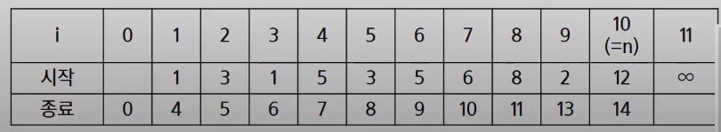
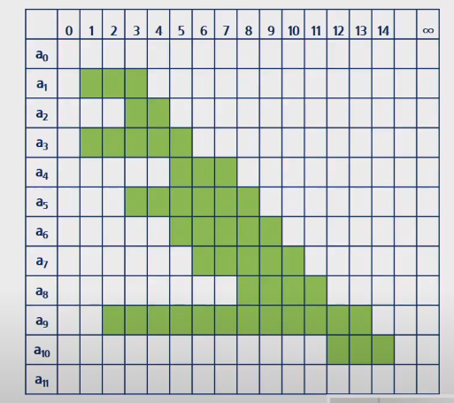

# Algorithm_활동선택문제

[toc]

## 개념

- 시작시간과 종료시간(si,fi)이 있는 n개의 활동들의 집합 A = {A1,A2,...,An}, 1 <= i <= n에서 서로 겹치지 않는 최대 갯수의 활동들의 집합 S를 구하는 문제
- 양립 가능한 활동들의 크기가 최대가 되는 S0,n+1의 부분집합을 선택하는 문제

1. 종료시간 순으로 활동들을 정렬한다.
2. S0,n+1는 a0의 종료시간부터 an+1의 시작시간 사이에 포함된 활동들
3. S0,n+1 = {a1,a2,a3,a4,a5,a6,a7,a8,a9,a10} = S




### 탐욕기법의 적용

- 공집합이 아닌 하위문제 Si,j가 있고 Si,j에 속한 활동 am은 종료 시간이 가장 빠른 활동이다.

- 그렇다면,

  1. 하위문제 Si,j에서 종료 시간이 가장 빠른 활동 am을 선택한다.
  2. Si,m은 공집합이므로, am을 선택하면 공집합이 아닌 하위문제 Sm,j가 남는다.
  3. 1,2 과정을 반복한다.

- Si,j를 풀기 위해

  1. 종료 시간이 가장 빠른 am선택
  2. Si,j = {am} U Sm,j의 해집합

  | .            | 탐욕적선택  | 탑다운 방식의 문제 해결 |
  | ------------ | ----------- | ----------------------- |
  | S0,11에 대해 | a1 선택하고 | S1,11을 푼다            |
  | S1,11에 대해 | a4 선택하고 | S4,11을 푼다            |
  | S4,11에 대해 | a8 선택하고 | S8,11을 푼다            |




### 탐욕 기법을 적용한 반복 알고리즘

```sh
A : 활동들의 집합, S: 선택된 활동(회의)들 집합
si : 시작시간, fi:종료시간, 1<=i<=n

Sort A by finish time
S <- {A1}
j <- 1
FOR i in 2 ->n
	IF si >=fi
		S <- SU{Aj}
		j <- i
```

- 종료 시간이 빠른 순서로 활동들을 정렬한다.
- 첫 번째 활동(A1)을 선택한다.
- 선택한 활동(A1)의 종료시간보다 빠른 시작 시간을 가지는 활동을 모두 저장한다.
- 남은 활동들에 대해 앞의 과정을 반복한다.


### 재귀 알고리즘

```sh
A: 정렬된 활동들의 집합
S: 선택된 활동(회의)들 집합
si: 시작시간,fi:종료시간, 0<=i<=n+1

Recursive_Selection(i,j)
	m <-i+1
	
	WHILE m < j AND sm < fi // 종료시간이 가장 빠른 활동 선택
		m <- m+1
	IF m <j : RETURN {am} U Recursive_Selection (m,j)
	ELSE : RETURN {} // 공집합
```


### 탐욕 알고리즘의 필수 요소

#### 탐욕적 선택 속성

- 탐욕적 선택은 최적해로 갈 수 있음을 보여라
- 즉, 탐욕적 선택은 항상 안전하다.


#### 최적 부분 구조

- 최적화 문제를 정형화하라
- 하나의 선택을 하면 풀어야 할 하나의 하위 문제가 남는다.


#### **[원문제의 최적해 = 탐욕적 선택 + 하위문제의 최적해] 임을 증명하라**


### 탐욕기법과 동적 계획법의 비교

| 탐욕기법                                                     | 동적계획법                                              |
| ------------------------------------------------------------ | ------------------------------------------------------- |
| 매 단계에서, 가장 좋게 보이는 것을 빠르게 선택한다.<br />-> 지역 최적 선택 | 매 단계의 선택은 해결한 하위 문제의 해를 기반으로 한다. |
| 하위 문제를 풀기 전에 (탐욕적) 선택이 먼저 이루어짐          | 하위 문제가 우선 해결됨                                 |
| Top-down 방식                                                | Bottom-up 방식                                          |
| 일반적으로,빠르고 간결하다.                                  | 좀 더 느리고, 복잡하다.                                 |


### 대표적인 탐욕 기법의 알고리즘

| 알고리즘           | 목적                                                         | 설명                                                         | 유형   |
| ------------------ | ------------------------------------------------------------ | ------------------------------------------------------------ | ------ |
| Prim               | N개의 노드에 대한 최소 신장 트리(MST)를 찾는다.              | 서브 트리를 확장하면서 MST를 찾는다.                         | 그래프 |
| Kruskal            | N개의 노드에 대한 최소 신장 트리(MST)를 찾는다.              | 싸이클이 없는 서브 그래프를 확장하면서 MST를 찾는다.         | 그래프 |
| Dijkstra           | 주어진 정점에서 다른 정점들에 대한 최단 경로를 찾는다.       | 주어진 정점에서 가장 가까운 정점을 찾고, 그 다음을 정점을 반복해서 찾는다. | 그래프 |
| Huffman Tree& code | 문서의 압축을 위해 문자들의 빈도수에 따라 코드값을 부여한다. | 출현 빈도가 낮은 문자부터 선택해서 이진트리를 완성하고 코드값을 부여한다. | 문자열 |


## 관련문제

### BOJ_1931_회의실배정

> [BOJ_1931_회의실배정](https://www.acmicpc.net/problem/1931)

```python
'''
방문배열을 만들어서
회의 시작시간~끝나는 시간에 표시해줌!
표시한 뒤, ans = []에 넣어줌
for문을 돌리는데 ans의 첫값부터 선택했다고 했을 떄 그다음 선택은 종료시간보다 같거나 커야됨! 그렇게 수를 세고 MAX갱신
'''

import sys
sys.stdin = open('input.txt','r')

#회의 수
N = int(input())
#회의 정보
conf = []
final = 0
for i in range(N):
    #시작시간, 끝나는시간
    start, end = map(int,input().split())
    conf.append([start,end])

#끝나는 시간이 빠른 순으로 정렬하고, 제일 처음 것을 선택한뒤, 그다음부터는
# print(conf)
# conf.sort(key=lambda x:(x[1],x[0]))
# print(conf)
s,e = conf[0]
cnt = 1
for c in range(1,len(conf)):
    if conf[c][0] >= e:
        # print(conf[c])
        cnt += 1
        s,e = conf[c]
print(cnt)
```


### SWEA_5202_화물도크

```python
'''
#1. 시작시간과 완료시간에서 완료시간이 빠른순으로 정렬!, 같다면 앞이 작은 순서로 나열!
#2. 다음 차례는 그 전차례의 완료시간보다 시작시간은 같거나 크면됨!(cnt+1)
'''
import sys
sys.stdin = open('input.txt','r')

T = int(input())
for tc in range(1,T+1):
    N = int(input())
    times = []
    for n in range(N):
        s,e = map(int,input().split())
        times.append([s,e])
    times.sort(key=lambda x:(x[1],x[0]))
    # print(times)
    start,end = times[0]
    cnt = 1
    for t in range(1,len(times)):
        if times[t][0] >= end:
            start,end = times[t]
            cnt+=1
    print('#{} {}'.format(tc,cnt))

```

