# Algorithm_분할정복

[toc]

## 분할정복

> 주어진 문제를 작은 사례로 나누고 각각의 작은 문제들을 해결하여 정복하는 방법

- 분할한 입력에 대하여 동일한 알고리즘을 적용하여 해를 계산하며 이들의 해를 취합하여 원래 문제의 해를 얻는다.
- 분할된 입력에 대한 문제를 **부분문제**라고 하고, 부분 문제의 해를 **부분해**라고 함
- **해를 구할 수 있을 만큼 충분히 더 작은 사례로 나누어 해결하는 방법**
- 하향식(top-down)접근 방법으로 최상위 사례의 해답은 아래로 내려가면서 작은 사례에 대한 해답을 구함으로써 구함


### **분할정복법의 설계전략**

1. Divide : 문제 사례를 하나 이상의 작은 사례로 분할(Divide)한다.
2. Conquer : 작은 사례들을 각각 정복(Conquer)한다. 작은 사례가 충분히 작지 않은 이상 재귀를 사용한다.
3. Combine : 필요하다면, 작은 사례에 대한 해답을 통합(Combine)하여 원래 사례의 해답을 구한다.


### 분할정복의 장단점

#### 장점

- 문제를 나눔으로 어려운 문제를 해결할 수 있다
- 문제를 나누어 해결한다는 특징상 병렬적으로 문제를 해결하는데 큰 강점이 있음


#### 단점

- 함수를 재귀적으로 호출한다는 점에서 함수 호출로 인한 오버헤드가 발생
- 스택에 다양한 데이터를 보관하고 있어야 하므로, 스택 오버플로우가 발생하거나 과도한 메모리 사용을 하게됨
- 공간복잡도 : `O(n)`
- 입력을 위한 메모리 공간(입력 배열) 외에 추가로 입력과 같은 크기의 공간 (임시 배열)이 별도로 필요
- 2개의 정렬된 부분을 하나로 합병하기 위해, 합병된 결과를 저장할 곳이 필요하기 때문


### 시간복잡도

`(층수)x O(n) = log2nxO(n) = O(nlogn)`

## 분할정복 응용

- **퀵정렬** : 문제가 2개로 분할, 부분문제의 크기가 일정하지 않은 크기로 감소하는 알고리즘
- **이진탐색** : 문제가 2개로 분할, 그 중에 1개의 부분 문제는 고려할 필요 없으며, 부분문제의 크기가 1/2로 감소하는 알고리즘
- **선택 문제 알고리즘** : 문제가 2개로 분할, 그 중에 1개의 부분문제는 고려할 필요 없으며, 부분문제의 크기가 일정하지 않은 크기로 감소하는 알고리즘
- **삽입정렬, 피보나치 수** : 부분문제의 크기가 1,2개씩 감소하는 알고리즘

### 1. 병합정렬(Merge Sort)

> 외부 정렬의 기본이 되는 정렬 알고리즘
>
> -> 멀티코어(Multi-Core) CPU나 다수의 프로세서에서 정렬 알고리즘 병렬화를 위해 병합 정렬 알고리즘 활용

- 시간복잡도는 `O(nlogn)`이고, 공간복잡도는 `O(n)`
- 입력이 2개의 부분 문제로 분할, 부분문제의 크기가 1/2로 감소하는 분할 정복 알고리즘
- n개의 숫자들을 n/2개씩 2개의 부분문제로 분할하고, 각각의 부분문제를 재귀적으로 합병 정렬한 후, 2개의 정렬된 부분을 합병하여 정렬(정복)함
- 합병 과정이 (문제를) 정복하는 것
- 2개의 각각 정렬된 숫자들을 1개의 정렬된 숫자들로 합치는 것

#### 알고리즘

1. 정렬할 데이터 집합의 크기가 0 또는 1이면 이미 정렬된 것으로 보고, 그렇지 않으면
2. 데이터 집합을 반으로 나눔
3. 원래 같은 집합에서 나뉘어져 나온 데이터 집합 둘을 병합하여 하나의 데이터 집합으로 만듦, (단, 병합할 때 데이터 집합의 원소는 순서에 맞춰 정렬함)
4. 데이터 집합이 다시 하나가 될 때까지 3을 반복함

예를 들어, 다음과 같은 데이터 집합이 있다고 해보자

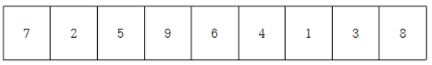

알고리즘 1~2의 과정을 반복하여 나눈다.

색칠한 부분은 나눈 기준이 되는 부분이다.

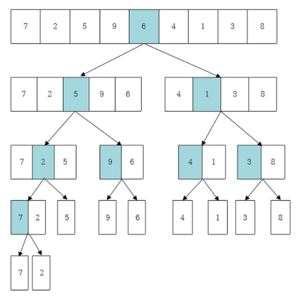

분할을 했으니 정복을 할 차례, 3~4과정을 반복해서 수행함

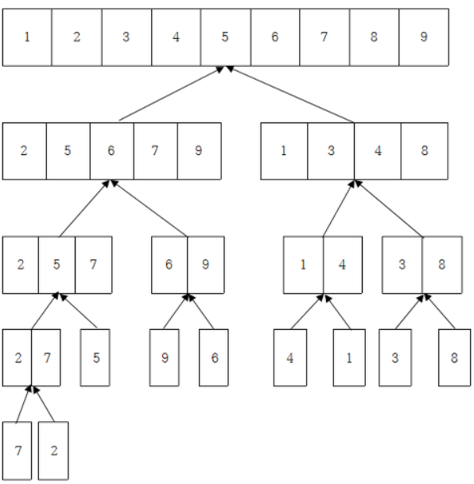


조각난 데이터 집합을 정렬해가면서 병합하면 결국 완전히 정렬된 하나의 데이터 집합을 얻는 알고리즘

**두 데이터 집합을 정렬하면서 합치는 방법**

1. 두 데이터 집합의 크기의 합만큼의 크기를 가지는 빈 데이터 집합을 만든다.
2. 두 데이터 집합의 첫 번째 요소들을 비교하여 작은 요소를 빈 데이터 집합에 추가한다. 그리고 새 데이터 집합에 추가한 요소는 원래 데이터 집합에서 삭제한다.
3. 원래 두 데이터 집합의 요소가 모두 삭제될 때까지 2를 반복

예를 들어 다음과 같은 데이터 집합 A,B와 이 두 데이터 집합의 크기의 합만큼의 크기를 가지는 빈 데이터 집합인 C가 있다.

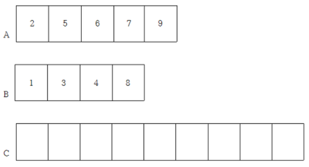

두 데이터 집합의 첫 번째 요소를 비교한다. A의 첫 번째 요소는 2,B의 첫번째 요소는 1이므로 B의 것이 더 작다. C에 1을 추가하고 B에서 1을 삭제한다.

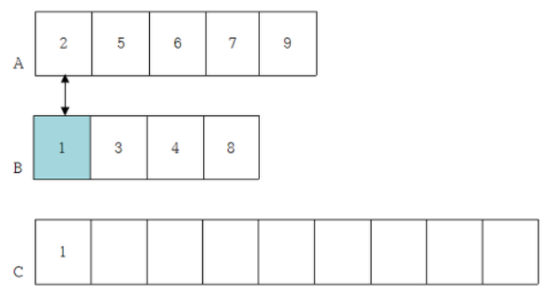

그 다음 A의 2와 B의 3을 비교한다. 2가 작으니 C에 2를 추가하고 A에서 2를 삭제한다.

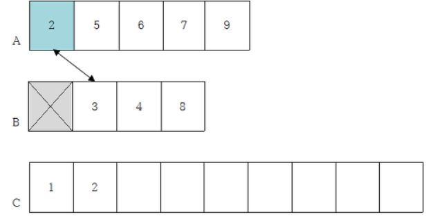

A의 5와 B의 3을 비교한다. 3이 작으니 C에 3을 추가하고 B에서 3을 삭제한다.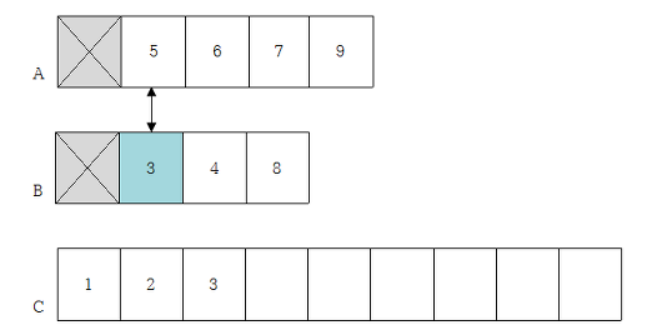

이렇게 데이터 A와 B의 요소들을 비교해서 C에 넣고 A와 B의 각 요소들을 삭제해나가다보면, A에 9 하나만 남게 됨,

 B에는 비교할 요소가 남아 있지 않으므로 그냥 9를 C에 추가하고 A에서 9를 삭제함

이롯써 A와 B의 요소들이 모두 삭제되었고, C는 정렬된 데이터 집합이 됨

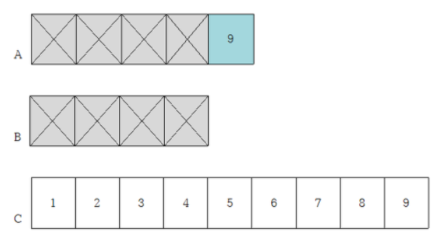


```sh
MergeSort(A,p,q)
입력 : A[p]~A[q]
출력 : 정렬된 A[p]~A[q]
if (p < q) {		//#1. 배열의 원소의 수가 2개 이상이면
	k = (p+q) / 2	//#2. k=반으로 나누기 위한 중간 원소의 인덱스
	MergeSort(A,p,k)	//#3. 앞부분 재귀 호출
	MergeSort(A,k+1,q)	//#4. 뒷부분 재귀 호출
	#5. A[p]~A[k]와 A[k+1]~A[q]를 합병한다.
}
```

**#1.**

정렬할 부분의 원소의 수가 2개 이상일 때에만 다음 단계 수행. 만일 n=1이면, 그 자체로 정렬된 것이므로 어떤 수행할 필요 없이 이전 호출했던 곳으로 리턴

**#2.**

정렬할 부분의 원소들을 1/2로 나누기 위해, k =  (p+q)/2를 계산. 즉, 원소의 수가 홀수인 경우에는 k는 소수점 이하는 버림

**#3~4.**

MergeSort(A,p,k)와 MergeSort(A,k+1,q)를 재귀 호출하여 각각 정렬

**#5.**

`#3~4.`에서 각각 정렬된 부분을 합병한다.

합병 과정의 마지막에는 임시 배열에 있는 합병된 원소들을 배열 A로 복사.

***즉, 임시 배열 B[p]~B[q]를 A[p]~A[q]로 복사***


#### 병합 정렬 알고리즘 코드

```python
def merge_sort(m):
    if len(m)<=1: #사이즈가 0이거나 1인 경우, 바로 리턴
        return m
    

    # 1. DIVIDE 부분
    mid = len(m)//2
    left = m[:mid]
    right = m[mid:]
    
    # 리스트의 크기가 1이 될 때까지 merge_sort 재귀 호출
    left = merge_sort(left)
    right = merge_sort(right)
    
    # 2. CONQUER 부분 : 분할된 리스트들 병합
    return merge(left,right)
```

#### 리스트나 연결 리스트 자료구조를 이용해서 구현한 병합정렬 코드

> 리스트를 사용하는 경우 :  분리,병합하는 과정에서 자료의 비교 연산과 이동 연산이 발생해 비효율적이다.
>
> 연결 리스트를 구현할 경우 : 리스트를 사용할 경우의 비효율적 단점을 극복하여 효과적 구현 가능
>
> 리스트로 할 경우 시간초과!!! 시간을 많이 잡아먹음, index로 하면됨

```python
def merge(left,right):
    #두개의 분할된 리스트를 병합하여 result를 만듦
    result = []
    
    #right, left리스트에 원소가 남아있을 때까지
    while len(left) > 0 and len(right) > 0:
        #두 서브 리스트의 첫 원소들을 비교하여 작은 것부터 result에 추가함
        if left[0] <= right[0]:
            result.append(left.pop(0))
        else:
            result.append(right.pop(0))
    #왼쪽 리스트에 원소가 남아있는 경우
    if len(left) > 0:
        result.extend(left)
        
    #오른쪽 리스트에 원소가 남아있는 경우
    if len(right) > 0:
        result.extend(right)
    return result
```

#### 병합 index로!!!

```python
#두개의 분할된 리스트를 병합하여 result를 만듦 -> 처음엔 빈리스트에 append했는데, 그러면 시간초과가남! 
#result는 left와 right의 원소 개수만큼 만들어질거니까 index로 다뤄보자!
def merge(left,right):
    global cnt
    result = [0]*(len(right)+len(left))
    left_idx = 0
    right_idx = 0
    result_idx =0
    #오른쪽,왼쪽 idx벗어나지 않을때까지
    while left_idx < len(left) and right_idx < len(right):
        #left리스트 값보다 right리스트 값이 같거나 클때 그 값을 넣어주고 idx+1
        if left[left_idx] <= right[right_idx]:
            result[result_idx] = left[left_idx]
            left_idx += 1
            # print('left',result)
        else:
            result[result_idx] = right[right_idx]
            right_idx += 1
            # print('right',result)
        #값을 넣었으니 다음 idx로 넘김
        result_idx += 1

    #왼쪽 리스트에 아직 정렬되지 않은 값들이 있을 경우
    #병합과정에서 왼쪽 마지막 원소가 오른쪽 마지막 원소보다 큰 경우의 수 셈
    if left_idx < len(left):
        cnt += 1
        result[result_idx:] = left[left_idx:]
    #오른쪽 원소가 남아있을 경우
    else:
        result[result_idx:] = right[right_idx:]
    return result
```


#### 병합정렬 관련 문제

##### SWEA_5204_병합정렬

```python
'''
병합과정에서 왼쪽 마지막 원소가 오른쪽 마지막 원소보다 큰 경우의 수를 출력
병합정렬 함수를 만들고, 왼쪽 마지막 원소가 오른쪽 마지막 원소보다 큰 경우를 세어준다!
result에 정렬한 원소들을 append하면 시간초과!!!
인덱스로 다뤄보자...ㅠㅠ
'''
import sys
sys.stdin = open('input.txt','r')

def mergesort(arr):
    #사이즈가 0이거나 1인 경우, 리턴
    if len(arr) <= 1:
        return arr

    #1. divide
    mid = len(arr) // 2
    left = arr[:mid]
    right = arr[mid:]

    # print('left',left,'right',right)
    #리스트의 크기가 1이 될 때까지 mergesort재귀호출
    left = mergesort(left)
    right = mergesort(right)

    # print('left',left,'right',right)
    #2. conquer: 분할된 리스트들 병합
    return merge(left,right)
    
#두개의 분할된 리스트를 병합하여 result를 만듦 -> 처음엔 빈리스트에 append했는데, 그러면 시간초과가남! 
#result는 left와 right의 원소 개수만큼 만들어질거니까 index로 다뤄보자!
def merge(left,right):
    global cnt
    result = [0]*(len(right)+len(left))
    left_idx = 0
    right_idx = 0
    result_idx =0
    #오른쪽,왼쪽 idx벗어나지 않을때까지
    while left_idx < len(left) and right_idx < len(right):
        #left리스트 값보다 right리스트 값이 같거나 클때 그 값을 넣어주고 idx+1
        if left[left_idx] <= right[right_idx]:
            result[result_idx] = left[left_idx]
            left_idx += 1
            # print('left',result)
        else:
            result[result_idx] = right[right_idx]
            right_idx += 1
            # print('right',result)
        #값을 넣었으니 다음 idx로 넘김
        result_idx += 1

    #왼쪽 리스트에 아직 정렬되지 않은 값들이 있을 경우
    #병합과정에서 왼쪽 마지막 원소가 오른쪽 마지막 원소보다 큰 경우의 수 셈
    if left_idx < len(left):
        cnt += 1
        result[result_idx:] = left[left_idx:]
    #오른쪽 원소가 남아있을 경우
    else:
        result[result_idx:] = right[right_idx:]
    return result


#병합!
# def merge(left,right):
#     global cnt
#     #두개의 분할된 리스트를 병합하여 result를 만듦 -> 처음엔 빈리스트에 append했는데, 그러면 시간초과가남! 
#     #result는 N개만큼 만들어질거니까 index로 다뤄보자!
#     result = []
#     while len(left) > 0 and len(right) > 0:
#     #right, left리스트에 원소가 남아있을 때까지
#     while len(left) > 0 and len(right) > 0:
#         if left[0] <= right[0]:
#             result.append(left.pop(0))
#         else:
#             result.append(right.pop(0))
# 
#     #왼쪽 리스트에 원소가 남아있는 경우
#     #병합과정에서 왼쪽 마지막 원소가 오른쪽 마지막 원소보다 큰 경우의 수 셈
#     if len(left) > 0:
#         cnt+=1
#         result.extend(left)
#         
#     #오른쪽 리스트에 원소가 남아있는 경우
#     if len(right) > 0:
#         result.extend(right)
#     return result


T= int(input())
for tc in range(1,T+1):
    #정수의 개수
    N = int(input())
    arr = list(map(int,input().split()))
    cnt = 0
    ans = mergesort(arr)
    print(ans)
    print('#{} {} {}'.format(tc,ans[N//2],cnt))
```


### 2. 거듭제곱(Exponentiation)

- n거듭 제곱은 자신을 n번 곱해야 함으로 `O(n)`의 시간이 소요됨

#### 일반 반복 알고리즘

```python
def iterative_Power(C,n):
    result = 1
    for _ in range(n):
        result= result*C
    return result
```

- 거듭제곱을 반씩 나누어서 곱해 나가는 방법으로 풀이

#### 분할정복 기반의 알고리즘

```python
def Recursive_Power(C,n):
    if n ==1:
        return C
    if n % 2==0:
        y = Recursive_Power(C,n/2)
        return y*y
    else:
        y= Recursive_Power(C,(n-1)/2)
        return y*y*C
```


### 3. 피보나치 수열

```sh
F0 = 0
F1 = 1
Fn = Fn-1 + Fn-2(n>1)
```

- 이 알고리즘으로는 걸리는 시간은 `O(2^n)`이다.
- 연산을 줄이기 위해 2차 정사각행렬을 이용한다.

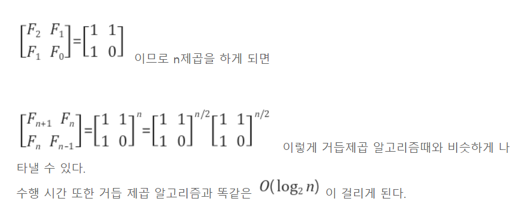


### 4. 퀵정렬

- 분할정복 알고리즘으로 분류되나, 사실 알고리즘이 수행되는 과정을 살펴보면 **정복 후 분할**하는 알고리즘
- 문제를 2개의 부분 문제로 분할하는데, 각 부분문제의 크기가 일정하지 않은 형태의 분할 정복 알고리즘
- `피봇(pivot)`이라 일컫는 배열의 원소(숫자)를 기준으로 피봇보다 작은 숫자들을 왼편으로, 피봇보다 큰 숫자들은 오른편에 위치하도록 분할하고, 피봇을 그 사이에 놓는다.
- 퀵 정렬은 분할된 부분문제들에 대하여서도 위와 동일한 과정을 재귀적으로 수행하여 정렬

- 병합정렬과 비교

| 병합정렬                                             | 퀵정렬                                                       |
| ---------------------------------------------------- | ------------------------------------------------------------ |
| 두 부분으로 나눔                                     | 분할시, 기준 아이템(Pivot item) 중심으로 이보다 작은 것은 왼편, 큰것은 오른편에 위치 |
| 각 부분은 정렬이 끝난 후, 병합하는 후 처리 작업 필요 | 각 부분 정렬이 끝난 후, 병합하는 후처리 작업 불필요          |

#### 시간복잡도

- 퀵정렬의 성능은 피봇 선택이 좌우함
- 피봇으로 **가장 작은 숫자** 또는 **가장 큰 숫자**가 선택되면, 한 부분으로 치우치는 분할을 야기함
- 입력의 크기가 n이라면, 퀵 정렬의 최악 경우 시간복잡도  : `O(n^2)`
- 최선의 경우 시간복잡도 : `O(nlog2n)`

#### 피봇 선정 방법

- 랜덤하게 선정하는 방법
- 숫자의 중앙값으로 선정하는 방법 
  - 가장 왼쪽 숫자, 중간 숫자, 가장 오른쪽 숫자 중에서 중앙값으로 피봇을 정함

#### 성능 향상 방법

- 입력의 크기가 매우 클 때, 퀵 정렬의 성능을 더 향상시키기 위해서, **삽입 정렬**이 동시에 사용
- 입력의 크기가 작을 때에는 퀵 정렬이 삽입 정렬보다 빠르지만은 않음, 왜냐하면 퀵 정렬은 재귀 호출로 수행되기 때문
  - 재귀 호출은 내부적으로 스택 메모리를 통해서 수행됨
  - 이때문에 메모리 부족 현상이 발생할 수 있음
- 부분 문제의 크기가 작아지면(ex, 25에서 50이 되면), 더 이생의 분할(재귀 호출)을 중단하고 삽입 정렬을 사용하는것

#### 응용 분야

- **커다란 크기의 입력에 대해서 가장 좋은 성능**을 보이는 정렬 알고리즘
- 실질적으로 어느 알고리즘보다 좋은 성능을 보임
- 생물정보공학에서 특정 유전자를 효율적으로 찾는데 접미 배열과 함께 퀵정렬 활용


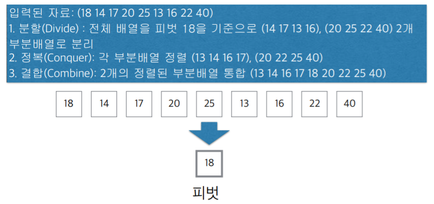

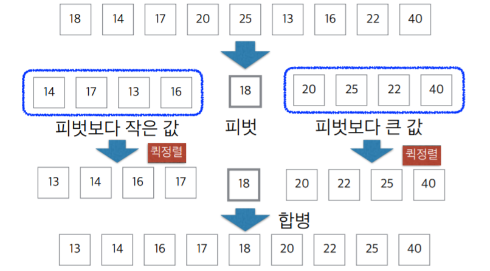

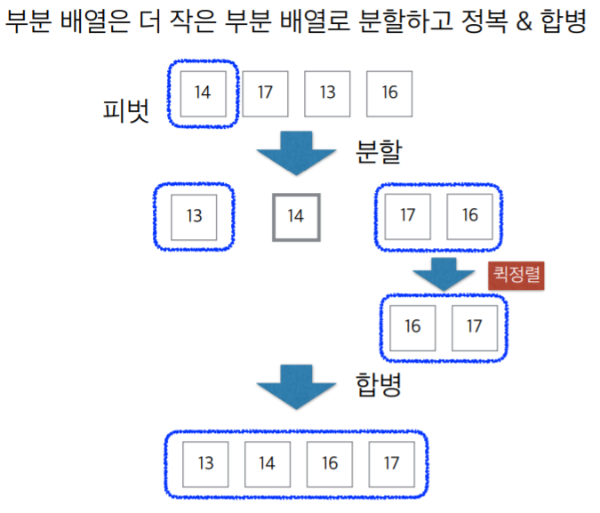

#### 퀵소트 알고리즘

```python
#list, 시작idx,끝idx
def quicksort(A,left,right):
    if left < right:
        pivot = hoare_partition(A,left,right)
        #pivot = lomuto_partition(A,left,right)
        quicksort(A,left,pivot-1)
        quicksort(A,pivot+1,right)
```


#### Hoare-Partition 알고리즘

> \- 1) 피봇 값보다 큰 값들은 오른쪽, 작은 값들은 왼쪽 집합에 위치시킴(아래에서 i와 j가 교차했을 때가 이것이 완성된 때임)
> \- 2) 피봇 값을 두 집합의 가운데에 위치시킴(아래서 i와 j가 교차했을 때 피봇의 값과 j의 위치와 swap해주는 것)
> '2)' 과정을 거친 피봇 값은 다음 정렬 과정에서 제외되며, 피봇 값이 위치한 곳은 정렬된 상태일 때 자기가 있어야 할 위치에 놓임

1. P(피봇)값들 보다 큰 값은 오른쪽, 작은 값들은 왼쪽 집합에 위치시킨다.


2. 피봇을 두 집합의 가운데에 위치시킨다.

> 피봇이 위치한 곳은 정렬된 상태일 때 자기가 있어야 할 위치에 놓인다.
>
> 피봇 값은 다음 정렬 과정에서 제외한다.

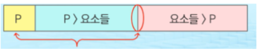

- Hoare-Partition 알고리즘

```python
def hoare_partition(A,left,right):
    pivot = A[left]
    #여기서 i = left+1를 했더니 틀렸다! 왜지?????
    i = left
    j = right

    while i <= j:
        #피봇보다 큰게 나올때까지
        while (i <= j and A[i] <= pivot):
            i += 1

        #피봇보다 작은게 나올때까지
        while (i <= j and A[j] >= pivot):
            j -= 1

        #i,j가 역전되지 않았으면, 피봇보다 큰값이랑 작은값 swap(뒤에 있는 작은값이앞으로옴)
        
        if i < j:
            A[i], A[j] = A[j],A[i]

    #i,j가 역전됐으면 피봇이랑 j(피봇보다 작은값) 바꿔주기(피봇은 값이니까 배열인 A[left]라고 씀)
    A[left],A[j] = A[j],A[left]
    return j
```

```python
def quick_sort(l,r):
    pivot = nums[l]
    i = l+1
    j = r

    while i<=j:
        while i <= j and nums[i] <= pivot: i+=1
        while i <= j and nums[j] >= pivot: j-=1
        if i < j: nums[i],nums[j] = nums[j],nums[i]
    nums[l],nums[j] = nums[j],nums[l]

    if l < j-1:quick_sort(l,j-1)
    if j+1 < r:quick_sort(j+1,r)


for t in range(1,int(input())+1):
    N = int(input())
    nums = list(map(int,input().split()))
    quick_sort(0,len(nums)-1)
    print("#{} {}".format(t,nums[len(nums)//2]))
```


1. 배열 A와 왼쪽끝인 l 오른쪽 끝인 r을 인수로 받는다.
2. 배열 피봇 p를 배열 A의 맨앞 인덱스로 둔다

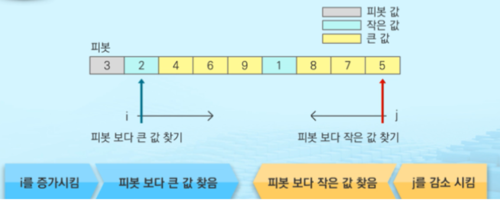

3. i는 왼쪽부터 피봇과 비교해서 크기를 확인하는 화살표의 위치이고 

4. j는 오른쪽 끝부터 피봇과 비교해서 크기를 확인하는 화살표의 위치이다

5. i=피봇이 l이니 l 저장 j는 오른쪽 끝을 저장한다.

6. 만약 i에 있는 값이 j보단 작고 피봇보다 작으면 화살표를 오른쪽으로 옮긴다. ( 피봇왼쪽에 있는게 피봇보다 작으니 옮길 필요가 없음)

7. 만약 j에 있는 값이 i보다 크고 피봇보다 크면 화살표를 왼쪽으로 옮긴다. (피봇 오른쪽에 있는 게 피봇보다 크니 옮길 필요가 없다

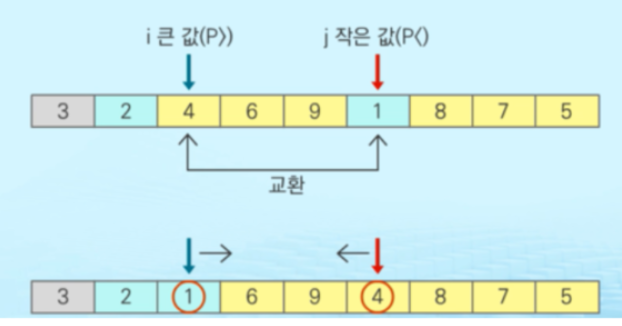

8. 만약에 화살표 i에 있는 값이 피봇보다 크면 이제 그 화살표는 탐색을 안하고 멈춘다. 마찬가지로 화살표 j에 있는 값이 피봇보다 작으면 더이상 탐색을 안하고 멈춘다.

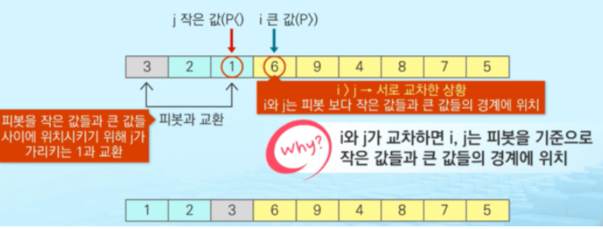

9. i가 j보다 작거나 같으면, ( 즉  while문을 다돌아 탐색을 다해서 i가 j보다 커진경우가 아니면 ) i에 있는 값과 j에 있는 값을 서로 swap해준다.
10. 이를 왼쪽 화살표 i 가 오른쪽 화살표 j를 넘지 않을 때 까지 해주고

11. 마지막으로 A[j]와 A[l]을 swap 해주는데 이건 피봇 위치가 l 이고 피봇 바로 왼쪽값( 피봇보다 작은 수 중 가장 큰 값) 이 j가 되어서 j를 기준으로 나눠서 정렬하도록 기준점이 되게 한다.

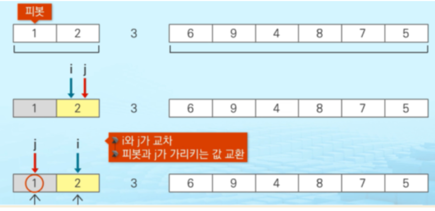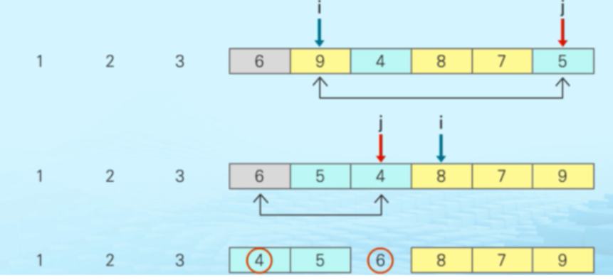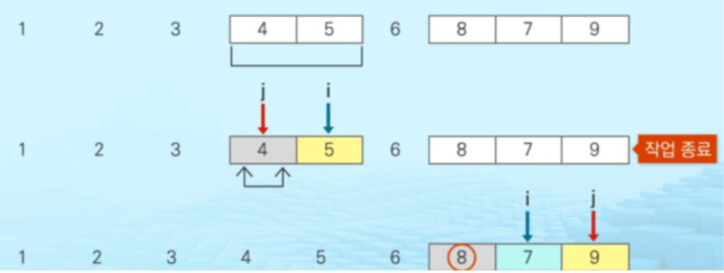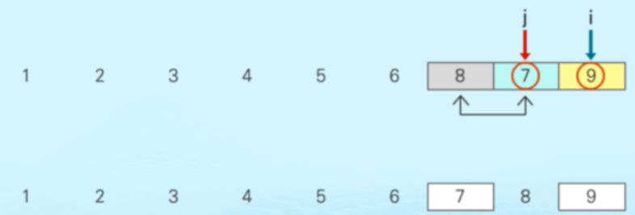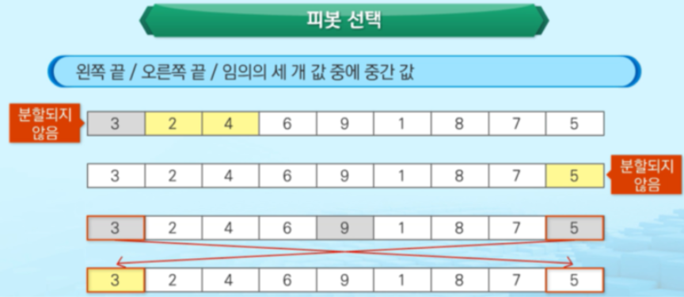


#### Lomuto 파티션

>  Hoare 방식과 가장 큰 차이점은 i와 j가 모두 증가하는 방식이라는 것이다.
>
> \- 1) 피봇 값보다 큰 값들은 오른쪽, 작은 값들은 왼쪽 집합에 위치시킴
> \- 2) 피봇 값을 두 집합의 가운데에 위치시킴(아래에서 j가 끝까지 진행되었고, i+1와 피폿값이 swap 될 때 이것이 완성된 때임)
> '2)' 과정을 거친 피봇 값은 다음 정렬 과정에서 제외되며, 피봇 값이 위치한 곳은 정렬된 상태일 때 자기가 있어야 할 위치에 놓임

```python
def lomuto_partition(A,left,right):
    pivot = A[right]
    i = left-1
    for j in range(left,right):
        #A[j]보다 pivot이 작을때 i값 +1을 늘려주고
        if A[j] <= pivot:
            i += 1
            #피봇보다 작은값들이 있는곳으로 옮김
            A[i],A[j] = A[j],A[i]
    #j가 피봇 전까지 다 돌고난 뒤, 피봇보다 큰값이 있는곳과 피봇을 바꿈
    A[i+1],A[right] = A[right],A[i+1]
    return i+1
```

- i와 j 두개의 변수를 사용하며 i와 j가 모두 증가하면서 작업 수행한다.

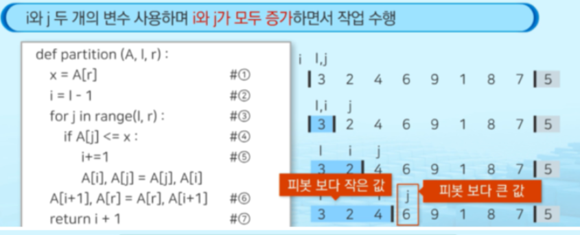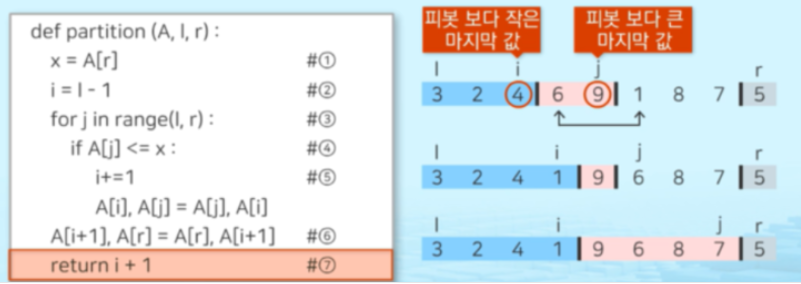

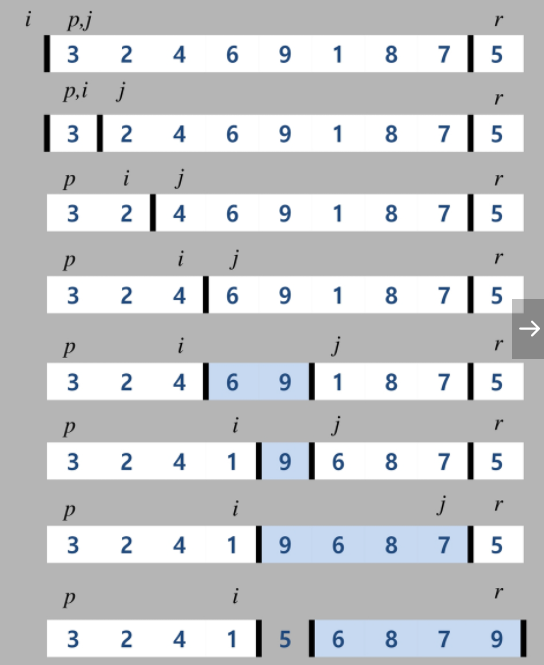

#### Hoare vs Lomuto 비교

- 특정 상황에 의해 Hoare방식이 더 효율적
-  Hoare Partiton 방식이 더 유리하다. 평균적으로 swap을 3배이상 덜 발생시키기 때문
-  배열의 모든 인자가 같은 수 일 경우에 모든 짝에 대해 swap을 발생시키기는 하지만 i와 j가 교차하는 순간 그만두기 때문에 `O(NlogN)`의 시간복잡도를 유지한다. 또한, 배열이 이미 정렬된 상태라면 한번도 swap을 일으키지 않는다.
- lomuto방식은 구현이 상대적으로 쉽지만 배열의 모든 인자가 같은 수이거나 이미 정렬된 배열에 대해 swap을 끝까지 계속 발생시키기 때문에 시간복잡도가 `O(N^2)`이 된다.

**최악의 시간복잡도 O(N^2)가 되는 경우**

- Hoare Partition 방식
  - 피봇의 값을 맨 왼쪽의 값으로 채택하는 경우, 레코드들 중 최소값이 피봇으로 선택되면 분할이 안일어나 다른 정렬 알고리즘과 다를게 없어지므로 효율이 떨어져 시간복잡도` O(N^2)`이 될 수 있다.

  -  (피봇을 맨 오른쪽 값으로 채택하는 경우는 그 반대)

 

-  Lomuto Partition 방식
  - 모든 인자가 같은 수이거나 이미 정렬된 배열일지라도 swap을 계속 발생시키기 때문에 시간복잡도가 `O(N^2)`이 될 수 있다.
  - Hoare Partition 방식과 마찬가지로 피봇의 잘못된 선택으로 분할이 안일어나면 효율이 떨어지게 됨.


### 5. Selection 알고리즘

- n개의 숫자들 중에서 k번째로 작은 숫자를 찾는 문제
- 분할정복알고리즘이기도 하지만 **랜덤알고리즘**이기도 하다.
- 피봇을 랜덤하게 정하기 때문
- 만일 피봇이 입력 리스트를 너무 한 쪽으로 치우치게 분할하면, 알고리즘의 수행시간이 길어짐
- 한쪽으로 치우치게 분할될 확률은 마치 동전을 던질 때 한쪽면이 나오는 확률과 같다.

#### 시간복잡도

- 피봇을 랜덤하게 정했을 때 good 분할이 될 확률이 1/2 이므로 평균 2회 연속해서 랜덤하게 피봇을 정하면 good 분할을 할 수 있다.
- 매 2회 호출마다 good 분할이 되므로, good 분할만 연속하여 이루어졌을 때만의 시간복잡도를 구하여, 그 값에 2를 곱하면 평균 경우 시간복잡도를 얻을 수 있다.
- `O(n)`

#### 아이디어

- **이진탐색**은 정렬된 입력의 중간에 있는 숫자와 찾고자 하는 숫자를 비교함으로써, 입력을 1/2로 나눈 두 부분 중에서 한 부분만을 검색
- 선택문제는 입력이 정렬되어 있지 않으므로, 입력 숫자들 중에서 (퀵정렬에서와 같이) **피봇**을 선택하여 아래와 같이 분할

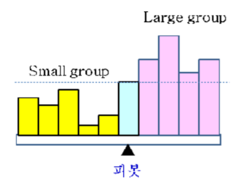

- Small group은 피봇보다 작은 숫자의 그룹이고, Large group은 피봇보다 큰 숫자의 그룹이다.
- 분할 후, 각 그룹의 크기를 알아야, k번째 작은 숫자가 어느 그룹에 있는지를 알 수 있고, 그 다음엔 그 그룹에서 몇 번째로 작은 숫자를 찾아야 하는지 알 수 있다.
- Small group에 k 번째 작은 숫자가 속한 경우: k 번째 작은 숫자를 Small group에서 찾는다. 
- Large group에 k 번째 작은 숫자가 있는 경우: `((k- Small group)-1))` 번째로 작은 숫자를 Large group에서 찾아야 한다. 여기서 Small group은 Small group에 있는 숫자의 개수이고, 1은 피봇에 해당된다.

#### 선택정렬 알고리즘

```sh
Selection(A, left, right, k)
입력: A[left]~A[right]와 k, 단, 1≤k≤|A|, |A|=right-left+1
출력: A[left]~A[right]에서 k 번째 작은 원소
#1. 피봇을 A[left]~A[right]에서 랜덤하게 선택하고, 피봇과 A[left]의 자리를 바꾼 후, 피봇과 배열의 각 원소를 비교하여 피봇보다 작은 숫자는 A[left]~A[p-1]로 옮기고, 피봇보다 큰숫자는 A[p+1]~A[right]로 옮기며, 피봇은 A[p]에 놓는다.
S = (p-1)-left+1 // #2. S = Small group의 크기
if ( k ≤ S ) Selection(A, left, p-1, k) // #3. Small group에서 찾기
else if ( k = S +1) return A[p] //#4.피봇 = k번째 작은 숫자
else Selection(A, p+1 right, k-S-1) // #5. large group에서 찾기
```

```python
def selection_sort(arr):
    for i in range(len(arr) - 1):
        min_idx = i
        for j in range(i + 1, len(arr)):
            if arr[j] < arr[min_idx]:
                min_idx = j
        arr[i], arr[min_idx] = arr[min_idx], arr[i]
```

**#1.**

피봇을 랜덤하게 선택하는 것을 제외하고는 퀵 정렬 알고리즘의 `#2.`와 동일

**#2.**

입력을 두 그룹으로 분할된 후, A[p]가 피 봇이 있는 곳이기 때문에 Small group의 크기를 알 수 있다. 즉, Small group의 가장 오른쪽 원소의 인덱스가 (p-1)이므로, Small group의 크기 S= (p-1)-left+1이 다. 

**#3.**

k 번째 작은 수가 Small group에 속한 경우이 므로 Selection(A, left, p-1, k) 호출

**#4.**

k 번째 작은 수가 피봇인 A[p]와 같은 경우이 므로 해 발견

**#5.**

k 번째 작은 수가 Large group에 속한 경 우이므로 Selection(A, p+1, right, k-S-1) 호출

**(k-S-1) 번째 작은 수를 Large group에서 찾아야됨, 왜냐하면 피봇이 k번째 작은 수보다 작고, S는 Small group의 크기이므로!**


#### 응용- 중앙값구하기

- 선택 알고리즘은 데이터 분석을 위한 **중앙값 (median)** 을 찾는데 활용된다. 
- 데이터 분석에서 평균값도 유용하지만, 중앙값이 더 설득력 있는 데이터 분석을 제공하기도 한다. 
- 예를 들어, 대부분의 데이터가 1이고, 오직 1개 의 숫자가 매우 큰 숫자 (노이즈 (noise), 잘못 측정된 데 이터)이면, 평균값은 매우 왜곡된 분석이 된다
- 실제로 대학 졸업 후 바로 취업한 직장인의 연간 소득을 분석할 때에 평균값보다 중앙값이 더 의미 있는 분석 자료가 된다


### 6. 이진검색

> **정렬한 리스트!!를 검색해야됨**

#### 이진 검색의 검색 과정

1. 자료의 중앙에 있는 원소를 고른다.

2. 중앙 원소의 값과 찾고자 하는 목표 값을 비교한다.

3. 목표 값과 중앙 원소값의 관계

**3-1 목표 값 < 중앙 원소 값 일때**

- 자료의 왼쪽 반에 대해서 새로 검색을 수행한다.

**3-2 목표 값 > 중앙 원소 값**

- 자료의 오른쪽 반에 대해서 새로 검색 수행

4. 찾고자 하는 값을 찾을 때까지 1-3의 과정 반복한다


#### 이진검색 알고리즘

```python
# a : 검색할 리스트(오름차순 정렬된 리스트!!!!)
# key : 검색하고자 하는 값

def binarySearch(a,key):
    start = 0
    end = len(a)-1
    while start <=end:
        middle = (start + end) // 2
        if key== a[middle]: # 검색 성공
            return middle
        elif key < a[middle]:
            end = middle-1
        else : #a[middle] <key
            start = middle + 1
    return -1 # 검색 실패
```

1. 맨처음 시작과 끝을 정한다. start=  0, end = len(a)-1

2. while문을 하나 추가한다. ( start<=end )

3. middle은 a의 중간 인덱스 값으로 한다 (start + (end+start)//2)

4. 만약 key값과 a[middle]값이 같다면 검색 성공

5. key값이 a[middle]보다 작다면  end값을 middle-1로 둬서 검색하는 배열을 반으로 자르면 왼쪽 반을 검색하게 한다.

6. key값이 a[middle]보다 크다면 end값을 middle+1로 둬서 검색하는 배열을 반으로 자르면 오른쪽 반을 검색하도록 한다.


#### 이진검색 재귀구조

```python
# a : 검색할 리스트
# key : 검색하고자 하는 값

def binarySearch2(a,low,high,key):
    if low>high: #검색 실패
        return -1 # 검색 실패 False
    else:
        middle =(low+high)//2
        if key==a[middle]: # 검색 성공
            return middle #True
        elif key<a[middle]:
            return binarySearch2(a,low,middle-1,key)
        else: # a[middle] < key :
            return binarySearch2(a,middle+1,high,key)
```

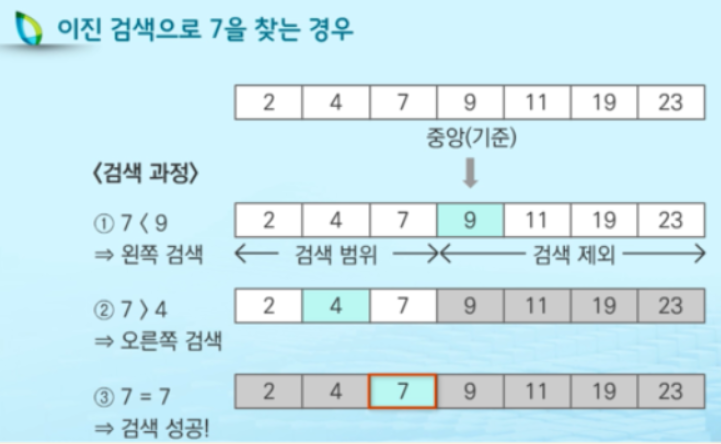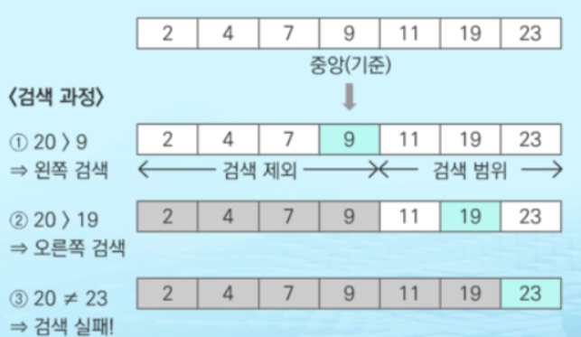


### 7. 최근접 점의 쌍 구하기(Closest Fair)

>2차원 평면상의 n개의 점이 입력으로 주어질 때, 거리가 가장 가까운 한 쌍의 점을 찾는 문제

```sh
ClosestPair(S)
입력: x-좌표의 오름차순으로 정렬된 배열 S에는 i개의 점 (단, 각 점은 (x,y)로
표현된다.)
출력: S에 있는 점들 중 최근접 점의 쌍의 거리
1. if (i ≤ 3) return (2 또는 3개의 점들 사이의 최근접 쌍)
2. 정렬된 S를 같은 크기의 SL과 SR로 분할한다. |S|가 홀수이면, |SL| = |SR|+1이 되도록 분할한다.
3. CPL = ClosestPair(SL) // CPL은 SL에서의 최근접 점의 쌍
4. CPR = ClosestPair(SR) // CPR은 SR에서의 최근접 점의 쌍
5. d = min{dist(CPL), dist(CPR)}일 때, 중간 영역에 속하는 점들 중에서 최근접 점의 쌍을 찾아서 이를 CPC라고 하자. 단, dist()는 두 점 사이의 거리
이다.
6. return (CPL, CPC, CPR) 중에서 거리가 가장 짧은 쌍
```

**#1.**

S에 있는 점의 수가 3개 이하이면 더 이상 분할하지 않는다. S에 2개의 점이 있으면 S를 그대로 리턴하고, 3개의 점이 있으면 3개의 쌍에 대하여 최근접 점 의 쌍을 리턴한다. 

**#2.**

x-좌표로 정렬된 S를 왼쪽과 오른쪽에 같은 개수의 점을 가지는 SL과 SR로 분할한다. 만일 S의 점의 수가 홀수이면 SL쪽에 1개 많게 분할

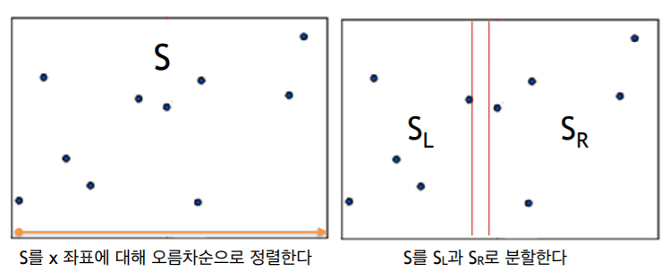

**#3~4.**

분할된 SL과 SR에 대해서 재귀적으로 최근접 점의 쌍을 찾아서 각각을 CPL과 CPR이라고 놓는다

**#5.**

d를 이용하여 중간 영역에 속하는 점들을 찾고, 이 점들 중에서 최근접 점의 쌍을 찾아서 이를 CPC라 고 놓는다. 

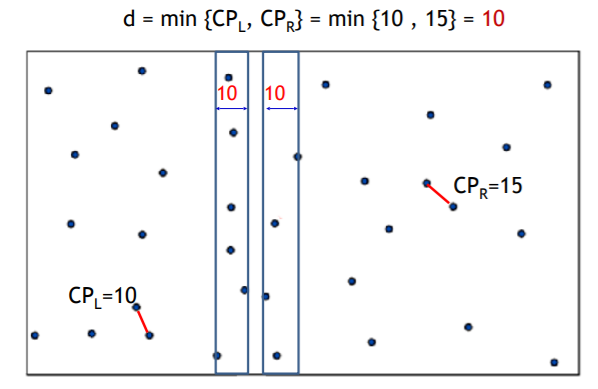

**#6.**

**#3~4.**에서 찾은 최근접 점의 쌍 CPL과 CPR과 **#5.**에서 찾은 CPC 중에서 가장 짧은 거리를 가진 쌍을 해로서 리턴

#### 시간복잡도

O(nlog2n)

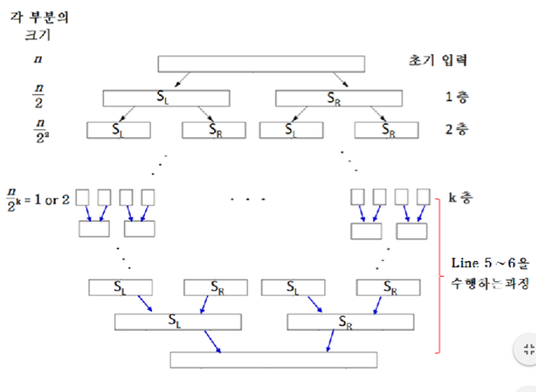

#### Closet Pair algorithm

**1)** 정렬 된 배열에서 중간 지점을 찾는다. *P [n / 2]* 를 중간 지점으로 사용할 수 있다.

**2)** 주어진 배열을 두 개의 반으로 나눈다. 첫 번째 부분 배열은 P [0]에서 P [n / 2]까지의 점을 포함한다. 두 번째 부분 배열은 P [n / 2 + 1]에서 P [n-1]까지의 점을 포함한다.

**3)** 두 하위 배열에서 가장 작은 거리를 재귀적으로 찾는다. 거리를 dl과 dr로 표시하고. dl과 dr의 최소값을 찾는다. 최소값 d

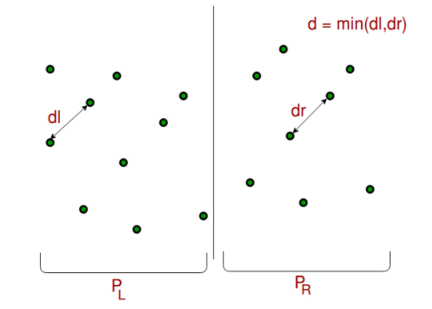

**4)** 위의 3 단계에서 최소 거리의 상한 d가 있다. 쌍의 한 점이 왼쪽 절반에 있고 다른 점이 오른쪽 절반에 있도록 쌍을 고려해야한다. P [n / 2]를 통과하는 수직선을 고려하고 x 좌표가 중간 수직선에 d보다 가까운 모든 점을 찾는다. 이러한 모든 지점의 배열 strip []을 만든다.

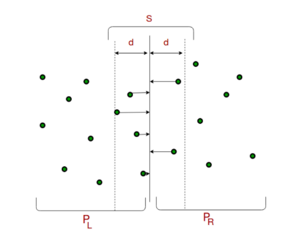

**5)** y 좌표에 따라 배열 strip []을 정렬한다. 이 단계는 `O (nLogn)`다. 재귀적으로 정렬하고 병합하여 O (n)에 최적화 할 수 있다.

**6)** strip []에서 가장 작은 거리를 찾는다. 처음 보면 `O (n ^ 2)` 단계 인 것 같지만 실제로는` O (n)`다. 스트립의 모든 지점에 대해 최대 7 개 지점만 확인하면된다는 기하학적으로 증명할 수 있다 (스트립은 Y 좌표에 따라 정렬된다).

**7)** 마지막으로 위 단계에서 계산 된 d와 거리의 최소값을 반환한다 (6 단계).


```python
import math 
import copy 
# A class to represent a Point in 2D plane 
#좌표를 나타냄
class Point(): 
    def __init__(self, x, y): 
        self.x = x 
        self.y = y 
  
# A utility function to find the  
# distance between two points  
#두점에서 거리를 구하는 함수
def dist(p1, p2): 
    return math.sqrt((p1.x - p2.x) * 
                     (p1.x - p2.x) +
                     (p1.y - p2.y) * 
                     (p1.y - p2.y))  
  
# A Brute Force method to return the  
# smallest distance between two points  
# in P[] of size n 
#두 포인트 사이의 가장 짧은 지점을 보여줌
def bruteForce(P, n): 
    #min초기값으로 최대값으로 줌
    min_val = float('inf')  
    for i in range(n): 
        for j in range(i + 1, n): 
            #P[i]와 P[j]사이 거리가 최소보다 작다면 갱신!
            if dist(P[i], P[j]) < min_val: 
                min_val = dist(P[i], P[j]) 
  
    return min_val 
  
# A utility function to find the  
# distance beween the closest points of  
# strip of given size. All points in  
# strip[] are sorted accordint to  
# y coordinate. They all have an upper  
# bound on minimum distance as d.  
# Note that this method seems to be  
# a O(n^2) method, but it's a O(n)  
# method as the inner loop runs at most 6 times 
'''
주어진 크기의 스트립에서 가장 가까운 지점 사이의 거리를 찾는 함수. strip []의 모든 점은 y 좌표에 따라 정렬. 모두 최소 거리에 대한 상한을 d로 가지고 있다. 이 메서드는 O (n ^ 2) 메서드처럼 보이지만 내부 루프가 최대 6 번 실행되므로 O (n) 메서드다.
'''
def stripClosest(strip, size, d): 
      
    # Initialize the minimum distance as d  
    #초기 최소거리
    min_val = d  
  
     
    # Pick all points one by one and  
    # try the next points till the difference  
    # between y coordinates is smaller than d.  
    # This is a proven fact that this loop 
    # runs at most 6 times  
    '''
    모든 점을 하나씩 선택하고 y 좌표의 차이가 d보다 작을 때까지!
    '''
    for i in range(size): 
        j = i + 1
        while j < size and (strip[j].y - 
                            strip[i].y) < min_val: 
            min_val = dist(strip[i], strip[j]) 
            j += 1
  
    return min_val  
  
# A recursive function to find the  
# smallest distance. The array P contains  
# all points sorted according to x coordinate 
'''
가장짧은 거리를 찾기위한 재귀함수
배열 P는 x 좌표에 따라 정렬 된 모든 점을 포함
'''
def closestUtil(P, Q, n): 
      
    # If there are 2 or 3 points,  
    # then use brute force  
    #n이 3이하면 bruteForce
    if n <= 3:  
        return bruteForce(P, n)  
  
    # Find the middle point  
    #중간지점찾기
    mid = n // 2
    midPoint = P[mid] 
  
    # Consider the vertical line passing  
    # through the middle point calculate  
    # the smallest distance dl on left  
    # of middle point and dr on right side  
    '''
    중간 지점을 통과하는 수직선을 고려하여 중간 지점의 왼쪽에서 가장 작은 거리 dl을 계산하고
    오른쪽에서 dr을 계산
    '''
    dl = closestUtil(P[:mid], Q, mid) 
    dr = closestUtil(P[mid:], Q, n - mid)  
  
    # Find the smaller of two distances  
    #dl과 dr중 작은 값 찾기
    d = min(dl, dr) 
  
    # Build an array strip[] that contains  
    # points close (closer than d)  
    # to the line passing through the middle point 
    '''
    중간 지점을 통과하는 선에 가까운 (d보다 더 가까운) 지점을 포함하는 배열 스트립 []을 만듦
    '''
    strip = []  
    for i in range(n):  
        if abs(Q[i].x - midPoint.x) < d:  
            strip.append(Q[i]) 
  
    # Find the closest points in strip.  
    # Return the minimum of d and closest  
    # distance is strip[]  
    '''
    스트립에서 가장 가까운 지점을 찾음. d의 최소값을 반환하고 가장 가까운 거리는 strip []
    '''
    return min(d, stripClosest(strip, len(strip), d)) 
  
# The main function that finds 
# the smallest distance.  
# This method mainly uses closestUtil() 
def closest(P, n): 
    P.sort(key = lambda point: point.x) 
    Q = copy.deepcopy(P) 
    Q.sort(key = lambda point: point.y)     
  
    # Use recursive function closestUtil()  
    # to find the smallest distance  
    #가장짧은 거리를 찾기위해 재귀함수 사용
    return closestUtil(P, Q, n) 
  
# Driver code 
P = [Point(2, 3), Point(12, 30), 
     Point(40, 50), Point(5, 1),  
     Point(12, 10), Point(3, 4)] 
n = len(P)  
print("The smallest distance is",  
                   closest(P, n)) 
 
```


- 다른 방법

```python
def find_closest_brute_force(array):
    
    result = {}
    result["p1"] = array[0]
    result["p2"] = array[1]
    result["distance"] = np.sqrt((array[0][0]-array[1][0])**2
                                +(array[0][1]-array[1][1])**2)
    
    for i in range(len(array)-1):
        for j in range(i+1, len(array)):
            distance = np.sqrt((array[i][0]-array[j][0])**2
                              +(array[i][1]-array[j][1])**2)
            if distance < result["distance"]:
                result["p1"] = array[i]
                result["p2"] = array[j]
                result["distance"] = distance
    return result
return result


def merge_sort(array, coordinate=0):
    
    length = len(array)
    if length == 1:
        return array
    if length == 2:
        if array[0][coordinate] > array[1][coordinate]:
            return np.array([array[1], array[0]])
        else:
            return array
    
    elif length > 2:
        array_l = array[:length//2]
        array_r = array[length//2:]
        array_l_sorted = merge_sort(array_l, coordinate)
        array_r_sorted = merge_sort(array_r, coordinate)
        
        l_length = len(array_l)
        r_length = len(array_r)
        l = 0
        r = 0
        
        sorted_list = []
        
        for i in range(length):
            if r == r_length:
                sorted_list.append(array_l_sorted[l])
                l += 1
            elif l == l_length:
                sorted_list.append(array_r_sorted[r])
                r += 1             
                
            elif array_l_sorted[l][coordinate] > array_r_sorted[r][coordinate]:
                sorted_list.append(array_r_sorted[r])
                r += 1
                
            elif array_l_sorted[l][coordinate] < array_r_sorted[r][coordinate]:
                sorted_list.append(array_l_sorted[l])
                l += 1
        
        return np.array(sorted_list)
    
    
def find_closest_nest(array):
    X = merge_sort(array, 0)
    length = len(X)
    if length < 4:
        return find_closest_brute_force(array)
    
    else:
        array_l = X[:length//2]
        array_r = X[length//2:]
        dict_l = find_closest_nest(array_l)
        dict_r = find_closest_nest(array_r)
                    
        if dict_l["distance"] > dict_r["distance"]:
            dict_both = dict_r
        else:
            dict_both = dict_l
          
        Y_list = []
        for i in range(length):
            if X[length//2-1][0]-dict_both["distance"] < array[i][0] < X[length//2-1][0]+dict_both["distance"]:
                Y_list.append(array[i])
        Y = merge_sort(np.array(Y_list), 1)
      
        
        if len(Y) == 1:
            dict_final = dict_both
        elif len(Y) < 8:
            dict_y = find_closest_brute_force(Y)
            if dict_both["distance"] > dict_y["distance"]:
                dict_final = dict_y
            else:
                dict_final = dict_both            
        else:
            for i in range(len(Y)-7):
                dict_y = find_closest_brute_force(Y[i:i+7])        
                
                if dict_both["distance"] > dict_y["distance"]:
                    dict_final = dict_y
                else:
                    dict_final = dict_both
    
        return dict_final
```


-------------

## Reference

https://janghw.tistory.com/entry/%EC%95%8C%EA%B3%A0%EB%A6%AC%EC%A6%98-Divide-and-Conquer-%EB%B6%84%ED%95%A0%EC%A0%95%EB%B3%B5

https://kimch3617.tistory.com/entry/%EC%95%8C%EA%B3%A0%EB%A6%AC%EC%A6%98-%EB%B6%84%ED%95%A0%EC%A0%95%EB%B3%B5%EB%B2%95-Divide-and-Conquer

http://ivis.kr/images/b/b0/3%EC%9E%A5%EB%B6%84%ED%95%A0%EC%A0%95%EB%B3%B5%EC%95%8C%EA%B3%A0%EB%A6%AC%EC%A6%98.pdf

https://m.blog.naver.com/sunbi5252/221977857377