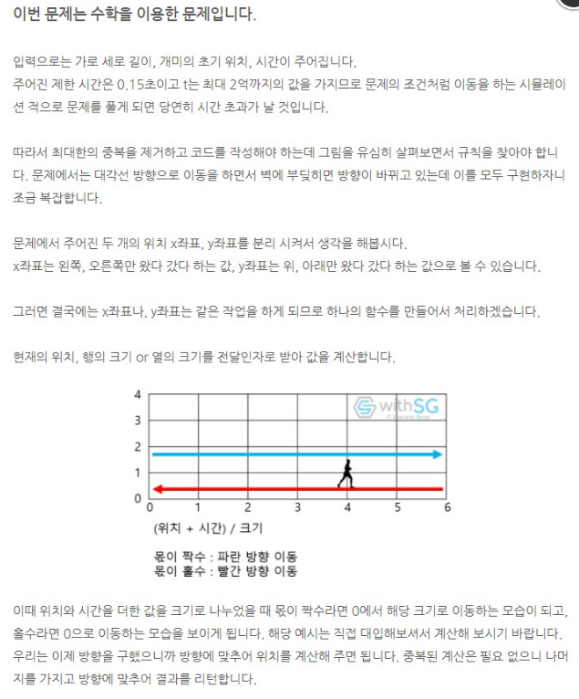

# IM대비

[toc]

## 2309_일곱난쟁이

- 조합으로 풀기

```python
'''
조합으로 하면 되지 않을깡
9개중에 7개를 뽑아서 그 합이 100인것 뽑기
'''
def combination(idx,sidx):
    if sidx == 7:
        if sum(R) == 100:
            for i in sorted(R):
                print(i)
            exit()
            return
        # print('못찾았나')
        return
    if idx == N:
        return
    R[sidx] = height[idx]
    combination(idx+1,sidx+1)
    combination(idx+1,sidx)

height = []
for t in range(9):
    height.append(int(input()))
# print(height)
N = 9
R = [0]*7
combination(0,0)
```

- itertools로 풀기

```python
import sys
from itertools import combinations
input = sys.stdin.readline

def solve(case):
    if sum(case) == 100:
        case = list(case)
        case.sort()
        for old in case:
            print(int(old))
        return True
    return False

if  __name__='__main__':
    child = set()
    for i in range(9):
        nai = int(input().strip())
        if nai <= 100:
            child.add(nai)
    for case in combinations(child,7):
        if solve(case):
            break
```

- 2중 for문으로 풀기(완전탐색)

```python
a = []
for i in range(9):
    a.append(int(input()))
res = sum(a)
a.sort()
for i in range(9):
    for j in range(i+1,9):
        if res-a[i]-a[j] == 100:
            for k in range(9):
                if k==i or k==j:
                    continue
                else:
                    print(a[k])
           	exit()
```

- 스윗...

```python
def combination(idx, sidx):
    global ans
    if ans:#이미 구했다면 수행 x
        return
    if sidx == 7:
        if sum(sel) == 100:
            ans = sel[:]
        return
    if idx == 9:
        return
    sel[sidx] = height[idx]
    combination(idx + 1, sidx + 1)#뽑고가고
    combination(idx + 1, sidx)#안뽑고가고


height = [int(input()) for _ in range(9)]

ans = []
sel = [0] * 7
height.sort()
combination(0, 0)
print("\n".join(map(str, ans)))#출력
```


## 2605_줄세우기

> 나중에 다시 풀기...생각안남...ㅠ

```python
'''
첫번째 ->무조건 0번
2번째-> 0또는 1(0: 그자리그대로, 1: 바로 앞의 학생 앞)
3->0,1,2(뽑은 번호만큼 앞자리로 가서 줄섬)
각자 뽑은 번호는 자기 번호보다 1 작은 범위 내
뽑은 번호를 순서대로 하나씩 보면서 뒤에들어온 수만큼 앞으로 보냄, idx를 순서대로 기록!...
'''

import sys
sys.stdin = open('input.txt','r')

N = int(input())
num = list(map(int,input().split()))
order=[1] #1번은 그자리 그대로니까 미리 넣어두고 시작
for i in range(2,len(num)+1):
    if num[i-1] > 0:
        pass
```


- idx를 다시 정하는 건 알겠는데, 어떻게 리스트에 넣는줄 몰라서 많이 헤맸다.......

- `insert`사용!
- insert : `리스트.insert(입력할index, 값)`

```python
a = [1, 2, 3]
a.insert(1, 5)
a
[1, 5, 2, 3]
```

```python
N = int(input())
choice = list(map(int, input().split()))
ans = []
num = 1
for i in range(N):
    idx = len(ans) - choice[i]
    ans.insert(idx, num)
    num += 1
print(*ans)
```


## 2578_빙고

> ㅎ..이거도 못품 큰일났다아ㅏ아ㅏ....

- 정말....ㅎ 어떻게 풀지..노가다...큰이ㅣㄹ.....ㅠ

```python
'''
25개 칸 빙고
사회자가 부르는 수 차례로 지워감
만약 가로,세로, 대각선 줄이 다 지워진 것이 3개이상 있다면 빙고!
사회자가 몇번쨰수를 부른 후 빙고를 외치는가
사회자가 부른 수를 0으로 바꿈!
for문을 돌면서 i가 같은데 다 0 이거나, j가 같은데 전부 0이거나, i==j인데 전부 0이거나, i==4-j 인데 전부0인것이
3개이상 있다면 빙고!
'''
import sys
sys.stdin = open('input.txt','r')
from pprint import pprint

bingo = [list(map(int,input().split())) for _ in range(5)]
num = [list(map(int,input().split())) for _ in range(5)]
# print(bingo)
# print(num)
#빙고조건에 맞다면 cnt += 1
cnt = 0
for r in range(5):
    for c in range(5):
        dae_l = 0 #대각선 수 셈
        dae_r = 0
        for i in range(5):
            zero_r=0
            zero_c=0
            for j in range(5):
                #num에서 차례대로 나오는 수와 빙고와 일치하는게 있다면 그거 0으로 바꿈
                if num[r][c] == bingo[i][j]:
                    bingo[i][j] = 0

                #for문을 돌면서 i가 같은데 다 0 이거나,
                if bingo[i][j] == 0:
                    # print(zero_r)
                    zero_r+=1

                # j(열)가 같은데 전부 0이거나,
                if bingo[j][i] == 0:
                    zero_c += 1

                # i==j인데 전부 0이거나,
                if i == j and bingo[i][j] == 0:
                    dae_l += 1

                # i==4-j 인데 전부0인것이
                if i == 4-j and bingo[i][j] == 0:
                    dae_r += 1

                if zero_r == 5:
                    print(i,'행 빙고')
                    pprint(bingo)
                    cnt += 1
                    zero_r=0

                if zero_c == 5:
                    print(i,'열 빙고')
                    pprint(bingo)
                    cnt += 1
                    zero_c=0

                if dae_l == 5:
                    print('왼대각선빙고')
                    pprint(bingo)
                    cnt += 1
                    dae_l=0

                if dae_r == 5:
                    print('오대각선빙고')
                    pprint(bingo)
                    cnt += 1
                    dae_r = 0

                #종료조건
                if cnt == 3:
                    print('빙고')
                    pprint(bingo)
                    print(zero_r,zero_c,dae_l,dae_r)
                    print(r*5+c,r,c)
                    exit()

```

> 위처럼 풀었다가 가로, 세로, 대각선을 분리하지 않으면 중복돼서 원하는 답이 나오지 않았다.
>
> 그래서 빙고인지를 체크하는 함수를 만든 뒤,
>
>  호출한 것을 지우고 빙고가 됐는지 체크하는 함수를 여기서 돌린 뒤
>
> return값으로  사회자 호출(nums)의 idx를 반환하게 했다. 

```python
'''
25개 칸 빙고
사회자가 부르는 수 차례로 지워감
만약 가로,세로, 대각선 줄이 다 지워진 것이 3개이상 있다면 빙고!
사회자가 몇번쨰수를 부른 후 빙고를 외치는가
사회자가 부른 수를 0으로 바꿈!
for문을 돌면서 i가 같은데 다 0 이거나, j가 같은데 전부 0이거나, i==j인데 전부 0이거나, i==4-j 인데 전부0인것이
3개이상 있다면 빙고!
'''
import sys
sys.stdin = open('input.txt','r')
from pprint import pprint

def check(arr):
    cnt = 0
    #가로
    for i in range(5):
        garo = 0
        for j in range(5):
            if arr[i][j] == 0:
                garo+=1
            else:
                break
        if garo == 5:
            cnt+=1

    #세로
    for j in range(5):
        sero = 0
        for i in range(5):
            if arr[i][j] == 0:
                sero += 1
            else:
                break
        if sero == 5:
            cnt += 1

    #대각선
    r_line = 0
    l_line = 0
    for i in range(5):
        for j in range(5):
            if i == j:
                if arr[i][j] == 0:
                    r_line += 1
            if i == 4-j:
                if arr[i][j]==0:
                    l_line += 1

    if r_line == 5:
        cnt += 1
    if l_line == 5:
        cnt += 1
    if cnt >=3:
        return True
    else:
        return False

def BINGO(bingo):
    idx= 0
    while idx < 25:
        for i in range(5):
            for j in range(5):
                if bingo[i][j] == nums[idx]:
                    bingo[i][j] = 0
                    # print(i,j)
                    if check(bingo):
                        return idx
                    idx += 1
                    # print('idx',idx)

bingo = [list(map(int,input().split())) for _ in range(5)]
nums = []
for _ in range(5):
    nums.extend(list(map(int,input().split())))

# pprint(bingo)
print(BINGO(bingo)+1)
```

> 선생님 풀이를 보면 가로세로 중복되는 코드는 하나로 줄이고
>
> 빙고 해당 수의 위치에 빙고의 좌표를 넣고 

```python
#선생님 풀이
def check():
    cnt = 0
    # 가로세로 확인
    for i in range(N):
        cnt_row = 0
        cnt_col = 0
        for j in range(N):
            if bingo[i][j] == 0: cnt_col += 1
            if bingo[j][i] == 0: cnt_row += 1

        if cnt_row == N: cnt += 1
        if cnt_col == N: cnt += 1

    # 대각선, 역대각선 확인
    cnt_l = 0
    cnt_r = 0
    for i in range(N):
        if bingo[i][i] == 0: cnt_l += 1
        if bingo[i][N - 1 - i] == 0: cnt_r += 1

    if cnt_l == N: cnt += 1
    if cnt_r == N: cnt += 1

    if cnt >= 3: return True
    return False


N = 5
bingo = [list(map(int, input().split())) for _ in range(N)]

pos = [0] * 26
#해당 번호 좌표 담기
for i in range(N):
    for j in range(N):
        pos[bingo[i][j]] = (i, j)

call = []

#사회자가 호출하는 번호 한줄로 만들기
for i in range(N):
    call += list(map(int, input().split()))

ans = 0

while not check():
    r, c = pos[call[ans]]
    bingo[r][c] = 0
    ans += 1
print(ans)

```


- 주아언니

```python
def countbingo(v):
    global countList
    a = b = 0
    flag = True
    for i in range(5):
        for j in range(5):
            if arr[i][j] == v:
                a = i
                b = j
                flag = False
                break
        if flag == False: break

    countList[a] += 1
    countList[5+b] += 1
    if a == 2 and b == 2:
        countList[10] += 1
        countList[11] += 1
    if a == b and a!=2 and b!=2:
        countList[10] += 1
    if a + b == 4 and a!=2 and b!=2:
        countList[11] += 1
    return

arr = [list(map(int, input().split())) for _ in range(5)]


countList = [0]*12

given = [list(map(int, input().split())) for _ in range(5)]


count = 0
flag2 = True
for i in range(5):
    for j in range(5):
        count += 1
        a = given[i][j]
        countbingo(a)

        if countList.count(5) >= 3:
            print(count)
            flag2 = False
            break
    if flag2 == False: break
```


## 2563_색종이

```python
'''
가로, 세로 100 정사각형
크기가 각 10
검은 영역 넓이를 구하는 프로그램
'''
N = int(input())
arr = [[0 for j in range(100)] for i in range(100)]
for i in range(N):
    #x는 열, y는 행
    y,x = map(int,input().split())
    for i in range(10):
        for j in range(10):
            arr[y+i][x+j] = 1
    
cnt = 0
for i in range(100):
    for j in range(100):
        if arr[i][j] == 1:
            cnt += 1


print(cnt)
```

- 스윗..

```python
N = int(input())

paper = [[0] * 102 for _ in range(102)]

for i in range(N):
    r, c = map(int, input().split())
    for j in range(r, r + 10):
        for k in range(c, c + 10):
            paper[j][k] = 1

ans = 0
for i in range(102):
    ans += paper[i].count(1)
print(ans)
```


## 2491_수열

```python
'''
수열중에서 다음 수가 연속해서 커지는 것 세고
연속해서 작아지는 것 세고
더 긴것 출력
'''
N = int(input())
# N = 6
arr = list(map(int,input().split()))
# arr = [3, 2, 1, 2, 3, 4]
MAX = 1
MIN = 1
len_list = []
for i in range(1,N):
    #다음수가 크거나 같다면
    if arr[i-1] <= arr[i]:
        # print(arr[i])
        MAX += 1
    #작은수가 나오면 0
    else:
        len_list.append(MAX)
        # print(len_list)
        MAX = 1
len_list.append(MAX)
for i in range(1,N):
    #다음수가 더 작은수가 나온다면
    if arr[i-1] >= arr[i]:
        MIN += 1
    else:
        len_list.append(MIN)
        # print(len_list)
        MIN = 1
len_list.append(MIN)
print(max(len_list))

'''
6
3 2 1 2 3 4
'''
```

- 스윗..

```python
def check(nums):
    global ans
    cnt = 1
    for i in range(1, N):
        if nums[i-1] <= nums[i]: cnt+=1
        else: cnt = 1

        if ans < cnt : ans = cnt


N = int(input())
arr = list(map(int, input().split()))

ans = 1

check(arr)
check(arr[::-1])
print(ans)
```


## 2669_직사각형 네개의 합집합 구하기

```python
'''
좌표가 해당 2차원배열의 idx번호
'''
arr = [[0 for j in range(100)] for i in range(100)]
for _ in range(4):
    x1,y1,x2,y2 = map(int,input().split())
    for i in range(y1,y2):
        for j in range(x1,x2):
            arr[i][j] = 1
cnt = 0
for i in range(100):
    for j in range(100):
        if arr[i][j] == 1:
            cnt += 1
print(cnt)
```

- 스윗..

```python
arr = [[0] * 102 for _ in range(102)]

for i in range(4):
    x1, y1, x2, y2 = map(int, input().split())

    for i in range(x1, x2):
        for j in range(y1, y2):
            arr[i][j] = 1
ans = 0
for i in range(102):
    ans += sum(arr[i])

print(ans)
```


## 13300_방배정

```python
'''
성별이 다르고, 학년이 같아야되고, K명을 넘을 수 없다
방의 최소 개수구하기
'''
N,K = map(int,input().split())
#학생의 성별S(0:여,1:남), 학년 Y
#학년별 idx
G_arr = [0 for _ in range(7)]
B_arr = [0 for _ in range(7)]
for _ in range(N):
    S,Y = map(int,input().split())
    #남자
    if S:
        B_arr[Y] += 1
    #여자
    else:
        G_arr[Y] += 1
# print(B_arr)
# print(G_arr)
#학년이 idx
room = 0
# cnt = 0
for i in range(1,7):
    if B_arr[i] > K:
        if B_arr[i]%K:
            room += B_arr[i]//K + 1
        else:
            room += B_arr[i]//K
    elif B_arr[i]:
        room += 1
    if G_arr[i] > K:
        if G_arr[i] % K:
            room += G_arr[i] // K + 1
        else:
            room += G_arr[i] // K
    elif G_arr[i]:
        room += 1
print(room)

'''
5 2
0 1
0 1
0 1
0 1
0 1
'''
```

- 스윗..

```python
N, K = map(int, input().split())

student = [[0] * 7 for _ in range(2)]

for i in range(N):
    gender, grade = map(int, input().split())

    student[gender][grade] += 1

room = 0

for i in range(2):
    for j in range(1, 7):
        room += student[i][j] // K
        if student[i][j] % K:
            room += 1

print(room)
```


## 2564_경비원

- 이거...ㅎ 못품...ㅎ 어떻게 풀지감도 안옴...

```python
'''
블록의 가로, 세로 길이가 주어짐
상점의 개수와 위치, 동근이의 위치도 주어짐(이동할 때 가로지를수 없음)
동근의 위치와 각 상점사이의 최단 거리 합을 구함
'''
import sys
sys.stdin=open('input.txt','r')
from pprint import pprint

#가로와 세로
c,r = map(int,input().split())
arr = [[0 for j in range(c)] for i in range(r)]
#테두리 1로 둘러주기
for i in range(r):
    for j in range(c):
        if i == 0 or i == r-1:
            arr[i][j] = 1
        else:
            if j == 0 or j == c-1:
                arr[i][j] = 1
# pprint(arr)
#상점의 개수
N = int(input())
# 상점의 위치 1은 블록의 북, 2는 블록의 남, 3은 블록의 서, 4는 블록의 동
#마지막 줄 동근이 위치
for n in range(N):
    x, dist = map(int,input().split())
    # print(x,dist)
    #상점의 위치 표시(N으로)
    if x == 1:
        arr[0][dist-1] = N
    if x == 2:
        arr[r-1][dist-1] = N
    if x == 3:
        arr[dist-1][0] = N
    if x == 4:
        arr[dist-1][c-1] = N
dong_x,dong_dist = map(int,input().split())

# pprint(arr)
#동근이의 위치와 각 상점사이의 최단거리 합...구하기
```

- 다시 선생님 코드 보고 품..후

```python
'''
블록의 가로, 세로 길이가 주어짐
상점의 개수와 위치, 동근이의 위치도 주어짐(이동할 때 가로지를수 없음)
동근의 위치와 각 상점사이의 최단 거리 합을 구함
'''
import sys
sys.stdin=open('input.txt','r')
from pprint import pprint

def clockwise(x,pos):
    if x == 1:#북
        return pos
    elif x == 2:#남
        return c+r+c-pos
    elif x == 3: #서
        return c+r+c+r-pos
    else: #동
        return c+pos

#가로와 세로
c,r = map(int,input().split())
N = int(input())
dist = []
for i in range(N+1):
    x,pos = map(int,input().split())
    dist.append(clockwise(x,pos))
my_dist = dist[-1]
cir = (r+c)*2

result = 0
for i in range(N):
    ans =abs(my_dist-dist[i])
    result += min(ans,cir-ans)
print(result)
```


- 

```python
#선생님은 이렇게 풀으셨더라...ㅠ
def dist_calc(idx, pos):
    if idx == 1:  # 북
        return pos
    elif idx == 2:  # 남
        return C + R + C - pos
    elif idx == 3:  # 서
        return C + R + C + R - pos
    else:  # 동
        return C + pos


C, R = map(int, input().split())
circumference= (C+R)*2

N = int(input())

dist = []
for i in range(N+1):
    idx, pos = map(int,input().split())
    dist.append(dist_calc(idx,pos))

my_dist = dist[-1]

ans = 0

for i in range(N):
    clockwise = abs(my_dist-dist[i])
    ans += min(clockwise,circumference-clockwise)
print(ans)

```


## IM대비

```python
import sys
sys.stdin = open('input.txt','r')
from pprint import pprint
'''
5개 항목 중 정답인 항목 고름
오지선다 형식 객관식 총 M개 문제 주어짐
맞힌 문제 하나당 1점, 연속으로 맞출 경우 1점 가산
가장 높은 점수 받은 학생과 가장 낮은 점수를 받은 학생의 점수차를 출력
정답 list를 받음
N명의 학생들이 제출한 답지를 훑어보면서 답이 맞다면 +1 
그다음 것도 맞다면 연속으로 맞은 개수만큼 곱한값을 더해주다가
틀리면  점수0, cnt도 0
'''

T = int(input())
for tc in range(1,T+1):
    N,M = map(int,input().split())
    score = list(map(int,input().split()))
    # print(score)
    students=[]
    for j in range(N):
        students.append(list(map(int,input().split())))
    # pprint(students)
    students_score=[]
    for student in students:
        S = 0#점수
        cnt = 0
        for i in range(M):
            #정답이라면
            if score[i] == student[i]:
                cnt += 1
                S += 1 *cnt
                # print(S,'정딥',end=' ')
            #오답이라면
            else:
                cnt=0
                # S = 0
                # print(S,'오답',end=' ')
        students_score.append(S)
        # print()
    # print(students_score)
    print('#{} {}'.format(tc,max(students_score)-min(students_score)))
```


## 2628_종이자르기

### 1. DFS로 풀어보기

> 이거 DFS로 풀었는데,,,,테케는 맞았지만 틀렷따!
>
> 아마 idx+1에서 문제가 생긴 것 같은데 IM끝나고 다시 해봐야갰다!
>
> 이거 날림.....너무 복잡하다...런타임에러뜸......ㅠ

```python
import sys
sys.stdin=open('input.txt','r')
from pprint import pprint

di = [0,0,1,-1]#우좌하상
dj = [1,-1,0,0]
def DFS(i,j):
    global cnt
    visited[i][j] = True

    for d in range(4):
        ni = i + di[d]
        nj = j + dj[d]
        if arr[ni][nj] == 0:
            continue
        if visited[ni][nj]:
            continue
        cnt += 1
        DFS(ni,nj)

C,R=map(int,input().split())
N=int(input())
#전체 색종이 배열을 만듦
arr=[[1]*C for _ in range(R)]
#0으로 띠를 둘러줌
arr.insert(0,[0]*C)
arr.append([0]*C)

for x in arr:
    x.insert(0,0)
    x.append(0)
# pprint(arr)

#색종이를 자르는 곳에 0으로 넣어주기
for _ in range(N):
    #가로,세로 & 점선번호
    dir, idx = map(int,input().split())
    #가로라면
    if dir==0:
        #해당 idx에 추가를 해주는데 가로에 추가된만큼 idx가 변동될수있음
        #만약 앞에 0이 들어온게 있다면 idx에 그 수만큼 더해줘야됨..->이걸 어떻게 처리할까?
        #idx앞에 0 이 있으면(제일앞 0 제외) 그 개수만큼 더해줌
        plus = 1
        for i in range(1,idx):
            if arr[1][i] == 0:
                plus += 1
        arr.insert(idx+plus,[0]*(len(arr[0])))
        print('가로추가',plus)
        pprint(arr)
    #세로라면
    else:
        #세로도 마찬가지 idx를 어떻게 지정해줄까...
        for x in arr:
            # 해당 idx에 추가를 해주는데 세로에 추가된만큼 idx가 변동될수있음
            # 만약 앞에 0이 들어온게 있다면 idx에 그 수만큼 더해줘야됨..->이걸 어떻게 처리할까?
            # idx앞에 0 이 있으면(제일앞 0 제외) 그 개수만큼 더해줌
            plus = 1
            for i in range(1, idx):
                if arr[i][1] == 0:
                    plus += 1
            x.insert(idx+plus,0)
        print('세로추가',plus)
        pprint(arr)
print()
pprint(arr)
#dfs돌리기
visited = [[False for j in range(len(arr[0]))] for i in range(len(arr))]
ans = []#넓이 값을 받을 리스트
#세로값이 변동됐으니 len으로 그 값을 받음
for i in range(len(arr)):
    #가로값도 바꼈으니 arr의 첫번째 리스트의
    for j in range(len(arr[0])):
        if arr[i][j] == 1 and visited[i][j] == False:
            cnt = 1
            DFS(i,j)
            ans.append(cnt)
print(max(ans))
```

- 띠를 둘러주는 법

```python
#1. 방법
#0이면 멈춰야되니까 전체 띠를 두름
# 제일 위와 제일 밑에 띠를 두른것처럼 0으로 만들어줌
arr = [0] * (N+2)
arr[0] = arr[N+1] = [0] * (N+2)
for i in range(N):
    #왼쪽 오른쪽에도 띠를 만들어줌
    arr[i+1] = [0]+list(map(int,input().split()))+[0]
    
    
    
#2. insert,append사용
arr = [[1,1,1],[1,1,1],[1,1,1]]
#위, 아래 배열에 0으로 채워줌
arr.insert(0,[0]*len(arr[0])) #3을곱한 배열을 0idx에 삽입해서 앞에 0으로 채움
arr.append([0]*len(arr[0])) #뒤에도 마찬가지로 그만큼 삽입
#오른쪽, 왼쪽 idx에도 0으로 채워줌
#for문을 돌면서 각 배열에 앞 뒤로 0삽입
for x in arr:
    #x배열 0idx에 0채우기
    x.insert(0,0)
    #x배열 제일 뒤에 0채우기
    x.append(0)
print(arr)
'''
[[0, 0, 0, 0, 0],
 [0, 1, 1, 1, 0],
 [0, 1, 1, 1, 0],
 [0, 1, 1, 1, 0],
 [0, 0, 0, 0, 0]]
'''
```


### 2. 현우's idea

> 현우's idea로 다시 풀어봄... 아니 근데 이거 왜 자꾸 런타임에러??????????화난다......후ㅠㅠㅠㅠㅠㅠㅠㅠㅠ

```python
#가로, 세로
c,r = map(int,input().split())
arr = [[1 for j in range(c)] for i in range(r)]
# pprint(arr)
#자를 점선의 개수
N = int(input())
C = [0,r] #가로 idx
R = [0,c] #세로 idx
for _ in range(N):
    #가로인지 세로인지, 점선idx
    dir, idx = map(int,input().split())
    #가로
    if dir == 0:
        C.append(idx)
    else: #세로
        R.append(idx)
R.sort()
C.sort()
# print(R,C)
MAX = 0
#넓이를 어떻게 구하자ㅣ이이이이이이이이
#가로는 리스트 안의 연속된 두개의 차, 세로도 마찬가지
for rr in range(len(R)-1):
    garo = R[rr+1]-R[rr]
    print('가로',garo)
    for cc in range(len(C)-1):
        sero = C[cc+1]-C[cc]
        print('세로',sero)
        area = garo*sero
        print('넓이',area)
        if area > MAX:
            MAX = area
print(MAX)
```


### 3. 자른 가로, 세로 길이를 리스트에 넣고 MAX값만 곱함

> 2번이랑 다를게 없어보이는데....2번은 런타임에러 뜨고 이건 정답...

```python
'''
또..다른 아이디어...
가로, 세로 자른 길이들을 담고 가장 큰 값들끼리 곱하기
'''

#가로, 세로
c,r = map(int,input().split())
arr = [[1 for j in range(c)] for i in range(r)]
# pprint(arr)
#자를 점선의 개수
N = int(input())
C = [0,r] #가로 idx
R = [0,c] #세로 idx

for _ in range(N):
    #가로인지 세로인지, 점선idx
    dir, idx = map(int,input().split())
    #가로
    if dir == 0:
        C.append(idx)
    else: #세로
        R.append(idx)
R.sort()
C.sort()
# print(R,C)
garo,sero = [],[]
#
#넓이를 어떻게 구하자ㅣ이이이이이이이이
#가로는 리스트 안의 연속된 두개의 차, 세로도 마찬가지
for rr in range(len(R)-1):
    garo.append(R[rr+1]-R[rr])
    # print('가로',garo)
    for cc in range(len(C)-1):
        sero.append(C[cc+1]-C[cc])
        # print('세로',sero)
print(max(garo)*max(sero))
```


### 2번 가로,세로 순서를 바꿨더니 됐다....! 왜지????????

> 선생님이 그냥 그대로 제출하니 성공했다고 한다...ㅠ 몰라...

```python
'''
이거도 망함....다시푼다..
가로,세로 자를 배열의 idx를 각각 리스트에 저장
제일 작은 idx부터 잘라진 사각형의 넓이를 구함
넓이를 비교하며 가장 큰 값을 구함
'''
#가로, 세로
c,r = map(int,input().split())
arr = [[1 for j in range(c)] for i in range(r)]
# pprint(arr)
#자를 점선의 개수
N = int(input())
C = [0,r] #가로 idx
R = [0,c] #세로 idx
for _ in range(N):
    #가로인지 세로인지, 점선idx
    dir, idx = map(int,input().split())
    #가로
    if dir == 0:
        C.append(idx)
    else: #세로
        R.append(idx)
R.sort()
C.sort()
# print(R,C)
MAX = 0

#2번에 가로세로 순서만 바꿈!
for cc in range(len(C)-1):
    sero = C[cc+1]-C[cc]
    # print('세로',sero)
    for rr in range(len(R)-1):
        garo = R[rr+1]-R[rr]
        # print('가로',garo)
        area = garo*sero
        # print('넓이',area)
        if area > MAX:
            MAX = area
print(MAX)
```


## 14696_딱지놀이

```python
'''
두 딱지의 별 개수가 다르면 별이 많은 쪽의 딱지가 이김
별의 개수가 같고 동그라미의 개수가 다르면 동그라미가 많은 쪽의 딱지가 이김
이런식으로
별(4) > 동그라미(3) > 네모(2) > 세모(1)의 순서!
A와 B의 딱지문양수를 리스트에 넣고 idx가 제일 큰게 더 클면 이김
'''
import sys
sys.stdin = open('input.txt','r')
#총 라운드 수
N = int(input())
arr = []
for _ in range(2*N):
    temp = list(map(int,input().split()))
    bin = [0]*4
    for i in range(1,len(temp)):
        bin[temp[i]-1] += 1
    arr.append(bin)
# print(arr)
for i in range(0,2*N,2):
    A = arr[i]
    B = arr[i+1]
    for j in range(3,-1,-1):
        if A[j] == B[j]:
            continue
        elif A[j] > B[j]:
            print('A')
            break
        else:
            print('B')
            break
    else:
        print('D')

```


## 2116_주사위쌓기

>이거 선생님 풀이보고 힌트...ㅠ 문제 더 많이 풀어봐야겠따.....
>
>선생님 풀이보고 힌트
>각 idx의 반대면 idx를 만들고
>옆면들 중 최대값만 뽑음!

```python
'''
주사위를 쌓는데 겹친 부분의 수가 같으면 됨
그렇게 쭉 쌓았을 때 옆면의 숫자의 합이 최대인 값을 구해라
겹친숫자가 1부터~6일때 모두 구함
그리고 각 경우의 수에서 옆면의 합중 최대값을 구함
옆면은 아래 위만 빼고 하나씩 뽑아서 다 더한 값의 최대값을 구하면 됨
A(0)-F(5) // B(1)-D(3) // C(2)-E(4)
아래 위가 정해지면 옆면들을 list에 담음...그리고 각 하나씩 값을 더해보면 되려나?
주사위 밑면은 1~6으로 6가지 경우의수를 가짐
예) 밑면이 1일때 해당 idx에 마주보는 면의 idx를 제외한 옆면들을 옆면list에 담는다
다음 주사위는 아래 주사위의 윗면과 같은 수의 idx와 해당 idx와 마주보는 idx를 제외하고 옆면 list에 담는다
이거반복....

'''
import sys
sys.stdin = open('input.txt','r')
from pprint import pprint

#주사위 밑면 idx와 주사위번호를 넣었을 때 그 주사위 옆면의 최고값 반환
def choice(idx,dice_num):
    max_num = 0
    oidx = o_index[idx]
    # print('idx',idx,'oidx',oidx)
    for i in range(6):
        if i == idx or i == oidx:
            continue
        if dice[dice_num][i] > max_num:
            max_num = dice[dice_num][i]
    # print('옆면 max',max_num)
    return max_num

#주사위개수
N = int(input())
dice = []
for _ in range(N):
    arr = list(map(int,input().split()))
    dice.append(arr)
# pprint(dice)
o_index = [5,3,4,1,2,0]

ans = 0
#경우의 수
for num in range(1,7):
    next = num
    temp = 0
    #주사위번호
    for n in range(N):
        #0~5까지의 idx
        for i in range(6):
            if dice[n][i] == next:
                temp += choice(i,n)
                # print(temp)
                next = dice[n][o_index[i]]
                break
    if temp > ans:
        ans = temp
print(ans)
```


## 10163_색종이

```python
'''
평면에 색이 서로 다른 직사각형 색종이 N장
비스듬 X
서로 평행, 수직 둘중 하나
순서대로 색종이가 쌓이면서 이전 것을 가림
N장의 색종이가 주어진 위치에 차례로 놓인 후 각 색종이가 보이는 부분의 면적을 구하는 프로그램 작성
N이 놓일 수 있는 곳의 배열은 100x100
첫번째 색종이부터 숫자를 입력(1)
두번째 -> 2
이렇게 해서 1인거 개수, 2인거 개수,,,N인거 개수 세서 출력!
'''
import sys
sys.stdin = open('input.txt','r')
# from pprint import pprint

#평면 배열
arr = [[0 for j in range(101)] for i in range(101)]
#색종이 장수
N = int(input())
for n in range(1,N+1):
    #색종이 x좌표(열), y좌표(행), 너비, 높이
    x, y, w, h =map(int,input().split())
    #좌표에 순서(n)를 입력
    #행 좌표(y)에서 높이(h)만큼
    for i in range(y,y+h):
        #열 좌표(x)에서 너비(w)만큼
        for j in range(x,x+w):
            #해당 순서를 배열에 넣어줌
            arr[i][j] = n
# pprint(arr)
#순서대로 숫자 개수 세어서 list에 담아주기
area = [0] *(N+1)
for n in range(1,N+1):
    for i in range(101):
        for j in range(101):
            if arr[i][j] == n:
                area[n] += 1
#순서대로 넓이 출력
for a in range(1,N+1):
    print(area[a])
```

- 선생님 풀이

```python
N = int(input())

paper = [[0] * 101 for _ in range(101)]

num = 1

for _ in range(N):
    x, y, w, h = map(int, input().split())
    for i in range(x, x+w):
        for j in range(y, y+h):
            paper[i][j] = num

    num += 1

for i in range(1, N + 1):
    cnt = 0
    for r in range(101):
        #한 행씩 i번째 색종이의 수를 셈(넓이)
        cnt += paper[r].count(i)
    #i번째 색종이 수를 다 세면 출력하고 cnt 다시 1로 리셋
    print(cnt)
```


## 1244_스위치 켜고 끄기

> 오래걸린 이유
>
> 1. 한 줄 에 20까지 출력하는 법
> 2. 남학생 스위치 번호에서 배수는 2배가 아니라 곱!

```python
'''
1은 스위치 켜져있음
0은 스위치 꺼져있음
학생들 1이상, 스위치 개수 이하인 자연수 나눠줌
학생들은 자신의 성별과 받은 수에 따라 스위치 조작
남-스위치번호가 자기가 받은 수의 배수이면 그 스위치 상태를 바꿈
여-자기가 받은 수와 같은 번호가 붙은 스위치를 중심으로 좌우 대칭이면서
가장 많은 스위치를 포함하는 구간을 찾아서 그 구간에 속산 스위치 상태 바꿈
스위치들 처음 상태 주어짐, 각 학생의 성별과 받은 수 주어짐 -> 스위치 마지막 상태 출력
'''
import sys
sys.stdin = open('input.txt','r')

#스위치 상태 바꾸는 함수
def change(num):
    #1, 켜져있으면 0으로
    if switch[num]:
        switch[num] = 0
    #0꺼져있다면
    else:
        switch[num] = 1
    return

#남학생 스위치 바꾸는 함수
def boy(num):
    #num의 배수들을 바꿈
    gop = num
    while num <= N:
        change(num)
        # print(num,'boy',gop)
        #이건 두배지 배수가 아니잖아....
        # num *= 2
        num += gop
    return


#여학생 스위치 바꾸는 함수
def girl(num):
    #방문한곳 방문 표시 후, 전부 바꿔줌
    visited = [False for _ in range(N+1)]
    #받은 num 방문표시
    visited[num] = True
    #그다음 idx에 지정해줄 값
    next = 1
    while True:
        #종료조건
        #범위를 벗어나거나 (num+next,num-next)까지 볼거니까
        if num-next <= 0 or num+next > N:
            break
        #좌우대칭일때까지 계속 상태를 바꿈
        # print(num-next,num+next)
        if switch[num-next] == switch[num+next]:
            visited[num-next] = True
            visited[num+next] = True
            #다음 idx로 넘어감
            next += 1
        #좌우대칭이 아니면 바로끝냄
        else:
            break
    #방문한 곳을 change함
    for v in range(len(visited)):
        #방문했다면
        if visited[v]:
            change(v)
    return

#스위치 개수
N = int(input())

#스위치 상태, index와 숫자 맞춤
switch = [0] + list(map(int,input().split()))

#학생 수
students = int(input())

for student in range(students):
    #학생 상별, 받은 숫자
    sex, num = map(int,input().split())

    #남학생(1) -> 받은숫자 배수 스위치 상태 바꿈
    if sex == 1:
        boy(num)
    #여학생(2) -> 좌우대칭, 가장 스위치 많이 포함 시킨 뒤-> 스위치 상태 바꿈
    else:
        girl(num)

    # print(switch)
# print()
# print(switch)
#20개까지 출력해야됨
s = 1
while s <= N:
    print(switch[s],end=' ')
    if s % 20 == 0:
        print()
    s += 1
```

- 승범's code

```python
import sys
sys.stdin = open("input.txt", "r")

#남학생 스위치 변환(처음 받은 수의 배수 : 1배, 2배, 3배..)
def men(x):
    help_x = x
    while x <= switch_num:
        #스위치 상태 바꾸기 1이라면 0으로, 0이라면 1로
        switchs[x] = (switchs[x] + 1) % 2
        #다음 x(스위치 번호)는 곱!이니까 현재 x에서 원래 스위치번호였던 help_x 더함
        x += help_x
        
#여학생 스위치 변환(처음 받은 수에서 좌우대칭으로 바꿈)
def women(x):
    #a는 좌우대칭으로 더하거나 뺄 idx값
    a = 1
    #스위치 상태 바꾸기
    switchs[x] = (switchs[x] + 1) % 2
    #다음 스위치 번호가 범위 내이고 좌우대칭이라면 while문 돌기
    while (x-a) > 0 and (x+a) <= switch_num and switchs[x-a] == switchs[x+a]:
        #스위치 상태 바꾸기
        switchs[x-a] = (switchs[x-a] + 1) % 2
        switchs[x+a] = (switchs[x+a] + 1) % 2
        a += 1
        
#스위치 개수
switch_num = int(input())
#스위치 처음 상태
switchs = [False] + list(map(int, input().split()))
#학생수
students = int(input())

for _ in range(students):
    #학생정보
    student = list(map(int, input().split()))
    #학생성별
    if student[0] == 1:
        #학생이 처음 받은 스위치 번호 = student[1]
        men(student[1])
    else:
        women(student[1])
        
#한 줄에 20개씩 출력
a = 0
for i in range(1, switch_num+1):
    a += 1
    print(switchs[i], end=' ')
    if a == 20:
        a = 0
        print()
```

- 선생님 코드

```python
#남학생일때 -> 원래 받은 수의 배수번호 스위치 변환
def man(num):
    #스위치 번호만큼 돈다
    for i in range(1, N + 1):
        #num의 배수라면 스위치 변환
        if i % num == 0:
            #1이면 0으로 0이라면 1로
            if onoff[i]:
                onoff[i] = 0
            else:
                onoff[i] = 1

#여학생일때 -> 원래 받은 수의 좌우대칭으로 스위치 변환
def woman(num):
    #오른쪽, 왼쪽 idx를 변수로 따로 지정
    left = num
    right = num
	
    while True:
        #좌우대칭으로 계속 나아감
        left -= 1
        right += 1
        #left, right가 범위 밖이거나 좌우대칭이 아니라면 left와 right는 이전상태로 돌려놓고 while문 종료
        if left <= 0 or right > N or onoff[left] != onoff[right]:
            left += 1
            right -= 1
            break
	#해당 left에서 right까지 스위치 변환
    for i in range(left, right + 1):
        if onoff[i]:
            onoff[i] = 0
        else:
            onoff[i] = 1

#스위치번호
N = int(input())
#스위치 처음 상태
onoff = [0] + list(map(int, input().split()))
#학생수
H = int(input())
for i in range(H):
    #학생성별, 처음 받은 수
    gender, num = map(int, input().split())
    #남학생
    if gender == 1:
        man(num)
    #여학생
    else:
        woman(num)
        
#한 줄에 20개씩 출력
for i in range(1, N + 1):
    print(onoff[i], end=" ")
    if i % 20 == 0:
        print()
```


## 2559_수열

- 이건 시간초과가 남!!!ㅠㅠㅠㅠㅠㅠㅠ`sum(temp[i:i+K])`를 계속하는 건 시간이 많이 드나봥.....
- 질문검색..힌트 봤당ㅜ

```python
'''
온도가 정수의 수열로 주어짐, 연속적인 며칠 동안의 온도의 합이 가장 큰 값
매일 측정한 온도가 정수의 수열로 주어짐
연속적인 며칠 동안의 온도의 합이 가장 큰 값?
N개 중에 처음부터 K개씩 잘라서 합을 구함,
근데 그 K개의 합들 중 최대값!
'''
import sys
sys.stdin = open('input.txt','r')


#온도를 측정한 전체 날짜의 수 N, 합을 구하기 위한 연속적인 날짜의 수 K
N, K = map(int,input().split())
#매일 측정한 온도 N개
temp = list(map(int,input().split()))

#N개를 k개씩 잘라서 합을 구하는데 그것의 최댓값!
MAX = 0#Max인 값을 넣음
#아래 for문 시간초과남....
for i in range(0,N-K):
    SUM = sum(temp[i:i+K])
    print(SUM)
    if SUM > MAX:
        MAX = SUM
print(MAX)
```

- SUM을 구할 때 다음 SUM은 이전 SUM의 제일 처음 값을 빼고 그다음 수를 더한 값!! => 시간이 적게 듬!

```python
'''
온도가 정수의 수열로 주어짐, 연속적인 며칠 동안의 온도의 합이 가장 큰 값
매일 측정한 온도가 정수의 수열로 주어짐
연속적인 며칠 동안의 온도의 합이 가장 큰 값?
N개 중에 처음부터 K개씩 잘라서 합을 구함,
근데 그 K개의 합들 중 최대값!
'''
import sys
sys.stdin = open('input.txt','r')


#온도를 측정한 전체 날짜의 수 N, 합을 구하기 위한 연속적인 날짜의 수 K
N, K = map(int,input().split())
#매일 측정한 온도 N개
temp = list(map(int,input().split()))

#N개를 k개씩 잘라서 합을 구하는데 그것의 최댓값!
# 질문검색 힌트 -> 다음 수의 부분합을 구할 때 이전 부분합에서 젤 첨 수 빼고, 그다음 수 더하기
SUM = sum(temp[:K])#처음 k개의 부분합
MAX = SUM #일단 처음 SUM값을 넣어둠
for i in range(K,N):
    start = temp[i-K]
    SUM = SUM - start + temp[i]
    # print(start,SUM)
    if SUM > MAX:
        MAX = SUM
print(MAX)
```

- 다른 풀이

```python
N, K = map(int, input().split())
# 온도 입력
temperature = list(map(int, input().split()))
# 초기 값
ans = sum(temperature[:K])
day = ans
for i in range(K, N):
    day += temperature[i]
    day -= temperature[i-K]
    if ans < day:
        ans = day

print(ans)
```


## 2567_색종이2

> 색종이...둘레구하는 문제인데 이거 너무 오래걸렸다 
>
> 나는 둘레만 표시해서 그 수를 세어주고 싶었는데 그렇게 하니까 겹치는 부분도 같이 사라져서 구하기가 힘들었따...결국 실패ㅠ 그래서 다른 사람들 코드 힌트 보고 그렇게 풀었다....ㅠ

- 실패한 코드

```python
'''
가로 세로 크기 100 정사각형
가로 세로 크기 10인 정사각형 색종이 여러장 붙인 후
색종이가 붙은 검은 영역의 둘레의 길이를 구하는 프로그램
색종이가 놓이는 순서대로 테두리에 수를 메기고
그다음 색종이가 놓일때 각 테두리 안에 자기 순서외의 숫자는 모두 0으로 바꿈!
근데 겹친 부분도 없애야 되므로 순서를 바꿔서도 check함수를 돌림
'''
import sys
sys.stdin = open('input.txt','r')
from pprint import pprint


#자기 테두리 영역 안에 0이아닌 다른수가 있는지 확인하는 함수
def check(X,Y,order):
    for i in range(Y,Y+10):
        for j in range(X,X+10):
            if paper[i][j] != 0 and paper[i][j] != order:
                paper[i][j] = 0

    return

#색종이 수
N = int(input())
#흰도화지
paper = [[0 for j in range(100)] for i in range(100)]
arr= []
#0이 아닌 수 세기
ans = 0
cnt = 0 #맞닿은면의 개수 세기
temp = []
#색종이 위치
#색종이의 왼쪽 변과 도화지의 왼쪽 변 사이의 거리 , 색종이의 아래쪽 변과 아래쪽 도화지의 아래쪽 변 사이의 거리
for n in range(1,N+1):
    #x(열),y(행)
    x, y = map(int,input().split())
    arr.append((x,y))
    # print(x,y,n)
    #색종이를 종이에 올림
    for i in range(y,y+10):
        for j in range(x,x+10):
            #테두리에만 각 순서를 메김!
            if i == y or i == y+9:
                if paper[i][j]:
                    cnt+= 1
                    temp.append((i,j))
                paper[i][j] = n

            else:
                if j == x or j == x+9:
                    if paper[i][j]:
                        cnt+= 1
                        temp.append((i,j))
                    paper[i][j] = n
    #자기 테두리 안에 자기 순서 외의 다른 수가 있다면 숫자를 0으로 바꿈
    check(x,y,n)
# print(paper)
print(cnt)
print(temp)
# 자기 테두리 안에 자기 순서 외의 다른 수가 있다면 숫자를 0으로 바꿈->순서를 반대로 해서 다른 영역안에 있는 테두리를 다 지움!
# 여기서 문제가 생김! 겹치는 부분의 꼭지점이 세어지지 않는다...이걸 어떻게 해결하지?
for i in range(len(arr)-1,-1,-1):
    check(arr[i][0],arr[i][1],i+1)
    # print(i+1)

#또 문제가 있다 -> 겹치는 부분이 같이 사라지는 문제! -> 어떻게 해결하지..ㅠ

for i in range(100):
    for j in range(100):
        if paper[i][j] != 0:
            print('둘레',i,j,ans)
            ans += 1
print(ans)

for i in range(26)[::-1]:
    for j in range(26):
        print(paper[i][j],end=' ')
    print()

'''
4
[(7, 5), (11, 12), (14, 15), (16, 22)]
둘레 2 5 0
둘레 2 6 1
둘레 2 7 2
둘레 2 8 3
둘레 2 9 4
둘레 2 10 5
둘레 2 11 6
둘레 2 12 7
둘레 2 13 8
둘레 2 14 9
둘레 3 5 10
둘레 3 14 11
둘레 4 5 12
둘레 4 14 13
둘레 5 5 14
둘레 5 14 15
둘레 6 5 16
둘레 6 14 17
둘레 7 3 18
둘레 7 4 19
둘레 7 14 20
둘레 7 15 21
둘레 7 16 22
둘레 7 17 23
둘레 7 18 24
둘레 7 19 25
둘레 7 20 26
둘레 7 21 27
둘레 7 22 28
둘레 7 23 29
둘레 7 24 30
둘레 8 3 31
둘레 8 14 32
둘레 8 15 33
둘레 8 24 34
둘레 9 3 35
둘레 9 14 36
둘레 9 15 37
둘레 9 24 38
둘레 10 3 39
둘레 10 14 40
둘레 10 15 41
둘레 10 24 42
둘레 11 3 43
둘레 11 13 44
둘레 11 14 45
둘레 11 15 46
둘레 11 24 47
둘레 12 3 48
둘레 12 12 49
둘레 12 15 50
둘레 12 24 51
둘레 13 3 52
둘레 13 12 53
둘레 13 15 54
둘레 13 24 55
둘레 14 3 56
둘레 14 12 57
둘레 14 13 58
둘레 14 14 59
둘레 14 24 60
둘레 15 3 61
둘레 15 12 62
둘레 15 13 63
둘레 15 24 64
둘레 16 3 65
둘레 16 4 66
둘레 16 5 67
둘레 16 6 68
둘레 16 7 69
둘레 16 8 70
둘레 16 9 71
둘레 16 10 72
둘레 16 11 73
둘레 16 12 74
둘레 16 13 75
둘레 16 23 76
둘레 16 24 77
둘레 17 13 78
둘레 17 22 79
둘레 18 13 80
둘레 18 22 81
둘레 19 13 82
둘레 19 22 83
둘레 20 13 84
둘레 20 22 85
둘레 21 13 86
둘레 21 22 87
둘레 22 13 88
둘레 22 22 89
둘레 23 13 90
둘레 23 14 91
둘레 23 15 92
둘레 23 16 93
둘레 23 17 94
둘레 23 18 95
둘레 23 19 96
둘레 23 20 97
둘레 23 21 98
둘레 23 22 99
100
0 0 0 0 0 0 0 0 0 0 0 0 0 0 0 0 0 0 0 0 0 0 0 0 0 0 
0 0 0 0 0 0 0 0 0 0 0 0 0 0 0 0 0 0 0 0 0 0 0 0 0 0 
0 0 0 0 0 0 0 0 0 0 0 0 0 4 4 4 4 4 4 4 4 4 4 0 0 0 
0 0 0 0 0 0 0 0 0 0 0 0 0 4 0 0 0 0 0 0 0 0 4 0 0 0 
0 0 0 0 0 0 0 0 0 0 0 0 0 4 0 0 0 0 0 0 0 0 4 0 0 0 
0 0 0 0 0 0 0 0 0 0 0 0 0 4 0 0 0 0 0 0 0 0 4 0 0 0 
0 0 0 0 0 0 0 0 0 0 0 0 0 4 0 0 0 0 0 0 0 0 4 0 0 0 
0 0 0 0 0 0 0 0 0 0 0 0 0 4 0 0 0 0 0 0 0 0 4 0 0 0 
0 0 0 0 0 0 0 0 0 0 0 0 0 4 0 0 0 0 0 0 0 0 4 0 0 0 
0 0 0 1 1 1 1 1 1 1 1 1 1 4 0 0 0 0 0 0 0 0 0 3 3 0 
0 0 0 1 0 0 0 0 0 0 0 0 1 4 0 0 0 0 0 0 0 0 0 0 3 0 
0 0 0 1 0 0 0 0 0 0 0 0 1 4 4 0 0 0 0 0 0 0 0 0 3 0 
0 0 0 1 0 0 0 0 0 0 0 0 1 0 0 3 0 0 0 0 0 0 0 0 3 0 
0 0 0 1 0 0 0 0 0 0 0 0 1 0 0 3 0 0 0 0 0 0 0 0 3 0 
0 0 0 1 0 0 0 0 0 0 0 0 0 2 2 3 0 0 0 0 0 0 0 0 3 0 
0 0 0 1 0 0 0 0 0 0 0 0 0 0 2 3 0 0 0 0 0 0 0 0 3 0 
0 0 0 1 0 0 0 0 0 0 0 0 0 0 2 3 0 0 0 0 0 0 0 0 3 0 
0 0 0 1 0 0 0 0 0 0 0 0 0 0 2 3 0 0 0 0 0 0 0 0 3 0 
0 0 0 1 1 0 0 0 0 0 0 0 0 0 2 3 3 3 3 3 3 3 3 3 3 0 
0 0 0 0 0 2 0 0 0 0 0 0 0 0 2 0 0 0 0 0 0 0 0 0 0 0 
0 0 0 0 0 2 0 0 0 0 0 0 0 0 2 0 0 0 0 0 0 0 0 0 0 0 
0 0 0 0 0 2 0 0 0 0 0 0 0 0 2 0 0 0 0 0 0 0 0 0 0 0 
0 0 0 0 0 2 0 0 0 0 0 0 0 0 2 0 0 0 0 0 0 0 0 0 0 0 
0 0 0 0 0 2 2 2 2 2 2 2 2 2 2 0 0 0 0 0 0 0 0 0 0 0 
0 0 0 0 0 0 0 0 0 0 0 0 0 0 0 0 0 0 0 0 0 0 0 0 0 0 
0 0 0 0 0 0 0 0 0 0 0 0 0 0 0 0 0 0 0 0 0 0 0 0 0 0 
'''
```

- Hint 보고 푼 코드

```python
#다시풀기 -> 방문, 델타 이용
'''
색종이가 놓이는 자리를 전부 True로 바꿈
델타 이용해서 True에서 이동한 위치가 False면 그 값을 세어주기!
만약 넘어간 곳이 범위 밖이라면 그래도 세어주기!
범위밖을 벗어나는 색종이는 없기 때문에 현재 위치가 끝이라 둘레를 세어줘야됨!
'''

#색종이 둘레 구하기
#델타
di = [0,0,1,-1] #우좌하상
dj = [1,-1,0,0]
def check(i,j):
    global width
    for d in range(4):
        ni = i + di[d]
        nj = j + dj[d]
        #범위를 벗어난다면 테두리니까 +1해줌
        if ni < 0 or ni > 99 or nj < 0 or nj > 99:
            width += 1
            #벗어났으니 다음 for문으로 넘어감
            continue
        #다음 위치가 False라면 cnt를 해줌
        if paper[ni][nj] == False:
            width += 1


#색종이 수
N = int(input())
#색종이를 받을 배열
paper = [[False for j in range(100)] for i in range(100)]

#색종이 입력받음
for n in range(N):
    #x열, y행
    x,y = map(int,input().split())
    for i in range(y,y+10):
        for j in range(x,x+10):
            paper[i][j] = True
width = 0 #둘레
for i in range(100):
    for j in range(100):
        #True이면 델타를 돌림
        if paper[i][j]:
            check(i,j)
for i in range(26)[::-1]:
    for j in range(26):
        print(paper[i][j],end=' ')
    print()

print(width)

for i in range(26)[::-1]:
    for j in range(26):
        print(paper[i][j],end=' ')
    print()
'''
False False False False False False False False False False False False False False False False False False False False False False False False False False 
False False False False False False False False False False False False False False False False False False False False False False False False False False 
False False False False False False False False False False False False False True True True True True True True True True True False False False 
False False False False False False False False False False False False False True True True True True True True True True True False False False 
False False False False False False False False False False False False False True True True True True True True True True True False False False 
False False False False False False False False False False False False False True True True True True True True True True True False False False 
False False False False False False False False False False False False False True True True True True True True True True True False False False 
False False False False False False False False False False False False False True True True True True True True True True True False False False 
False False False False False False False False False False False False False True True True True True True True True True True False False False 
False False False True True True True True True True True True True True True True True True True True True True True True True False 
False False False True True True True True True True True True True True True True True True True True True True True True True False 
False False False True True True True True True True True True True True True True True True True True True True True True True False 
False False False True True True True True True True True True True False False True True True True True True True True True True False 
False False False True True True True True True True True True True False False True True True True True True True True True True False 
False False False True True True True True True True True True True True True True True True True True True True True True True False 
False False False True True True True True True True True True True True True True True True True True True True True True True False 
False False False True True True True True True True True True True True True True True True True True True True True True True False 
False False False True True True True True True True True True True True True True True True True True True True True True True False 
False False False True True True True True True True True True True True True True True True True True True True True True True False 
False False False False False True True True True True True True True True True False False False False False False False False False False False 
False False False False False True True True True True True True True True True False False False False False False False False False False False 
False False False False False True True True True True True True True True True False False False False False False False False False False False 
False False False False False True True True True True True True True True True False False False False False False False False False False False 
False False False False False True True True True True True True True True True False False False False False False False False False False False 
False False False False False False False False False False False False False False False False False False False False False False False False False False 
False False False False False False False False False False False False False False False False False False False False False False False False False False 
96

Process finished with exit code 0
'''
```


- 승범's code

```python
import sys
sys.stdin = open("input.txt", "r")

white = [[False] * 100 for _ in range(100)]
visited = []
colored_papers = int(input())
cnt = 0
dr = [-1, 1, 0, 0]
dc = [0, 0, 1, -1]
for _ in range(colored_papers):
    h, v = map(int, input().split())
    for hh in range(h-1, h+9):
        for vv in range(v-1, v+9):
            #종이에 색종이가 올려지면 그부분 방문표시
            white[hh][vv] = True
for i in range(100):
    for j in range(100):
        #방문한 곳이라면 델타로 False인 곳을 찾고 cnt+1해줌
        if white[i][j] == True:
            for k in range(4):
                rr = i + dr[k]
                cc = j + dc[k]
                #범위를 벗어났다면 그래도 그 둘레를 세어줘야되기 때문에 cnt+1을 해주고 continue(다음 반복문으로 넘어감)
                if rr < 0 or rr > 99 or cc < 0 or cc > 99:
                    cnt += 1
                    continue
        		#why? 바로 옆이 False면 그 개수를 세면 둘레와 같기 때문
                elif white[rr][cc] == False:
                    cnt += 1
print(cnt)
```


## 2477_참외밭

> 큰 사각형은 구할수 있는데 작은 사각형을 어떤 규칙으로 구해야될지 몰라서 hint를 봤다......큰사각형이 시작되는 그 idx부터 3개 뒤에 무조건 작은사각형이 시작됨.....ㅠㅠㅠㅠㅠㅠㅠ

```python
'''
1m^2의 참외 개수를 육각형 전체 넓이에서 비율로 전체 수확할 수 있는 참외 수를 구함
둘레를 각 방향에 리스트로 담는다.
각 방향 리스트에 담긴 길이가 하나인 것이 가장 긴 사각형의 가로, 세로-> 전체 사각형 넓이 구함

'''
import sys
sys.stdin = open('input.txt','r')
#1m^2 넓이에 자라는 참외의 개수
K = int(input())
#임의의 한꼭지점에서 반시게방향 둘레 변의 방향과 길이
dist = [[] for _ in range(5)]
order=[]
for k in range(6):
    #1 동 2 서 3 남 4 북
    dir,width = map(int,input().split())
    dist[dir].append(width)
    order.append(width)
# print(dist)
# print(order)
#큰 사각형 넓이
BIG = 1
#긴사각형 시작되는 idx에서 3번째가 작은 사각형 idx
idx = []
for d in dist:
    if len(d) == 1:
        BIG *= d[0]
        idx.append(order.index(d[0]))
# print(idx)
#작은 사각형 넓이
small = order[(idx[0]+3)%6]*order[(idx[1]+3)%6]            
# print(BIG,small)
print((BIG-small)*K)
```

- 승범's code

```python
import sys
sys.stdin = open("input.txt", "r")

#소요시간 : 30m
#푼 날짜 : 20.10.18
N = int(input())
all_size = []
only_dir = []
big = 1
small = 1
for _ in range(6):
    info = list(map(int ,input().split()))
    only_dir.append(info[0])
    all_size.append(info)
for d in range(6):
    if only_dir.count(only_dir[d]) == 1:
        big *= all_size[d][1]
        small *= all_size[(d+3)%6][1]
print(N * (big - small))
```

- 다른 코드

```python
K = int(input())

pos = []
for i in range(6):
    dir, length = map(int, input().split())
    pos.append(length)

big = 0
small = 0
for i in range(6):
    tmp = pos[i] * pos[(i + 1) % 6]
    if big < tmp:
        big = tmp
        idx = i
small = pos[(idx + 3) % 6] * pos[(idx + 4) % 6]
print(K * (big - small))
```


## 2567_직사각형

- 이건 어렵다기보다...조건을 주는게 까다로웠따ㅠ

```python
'''
시간:2020/10/18/19:34
직사각형 왼쪽 아래 좌표, 오른쪽 위 좌표가 두개 주어짐
겹치는 부분이 직사각형(a)인지 선분(b)인지 점(c)인지 겹치는 부분이 없(d)는지 판단
'''

import sys
sys.stdin = open('input.txt','r')

def check(x1,y1,p1,q1,x2,y2,p2,q2):
    ans = 'a'
    #d
    if x2 > p1 or y2 >q1 or x1 >p2 or y1>q2:
        ans = 'd'
    #c
    elif (x2==p1 or x1==p2) and (y1==q2 or y2==q1):
        ans = 'c'
    #b
    elif (p1==x2 or x1==p2) or (y2==q1 or y1==q2):
        ans ='b'
    #그외는 a
    return ans

#4개의 줄
for _ in range(4):
    #x,y,p,q가 두개 입력됨
    x1,y1,p1,q1,x2,y2,p2,q2 = map(int,input().split())
    print(check(x1,y1,p1,q1,x2,y2,p2,q2))

```

- 승범's code

```python
import sys
sys.stdin = open("input.txt", "r")

# 소요시간 : 25m
# 푼 날짜 : 20.10.18

for _ in range(4):
    rectangle = list(map(int, input().split()))
    # computation_result : 0 = 논외, 1 = 같다,  2 = 안쪽
    # x축 연산
    if rectangle[0] < rectangle[4]:
        x1 = [rectangle[0], rectangle[2]]
        x2 = [rectangle[4], rectangle[6]]
    else:
        x1 = [rectangle[4], rectangle[6]]
        x2 = [rectangle[0], rectangle[2]]
    if x1[0] <= x2[0] < x1[1]:
        result_x = 2
    elif x1[1] == x2[0]:
        result_x = 1
    else:
        result_x = 0
    # y축 연산
    if rectangle[1] < rectangle[5]:
        y1 = [rectangle[1], rectangle[3]]
        y2 = [rectangle[5], rectangle[7]]
    else:
        y1 = [rectangle[5], rectangle[7]]
        y2 = [rectangle[1], rectangle[3]]
    if y1[0] <= y2[0] < y1[1]:
        result_y = 2
    elif y1[1] == y2[0]:
        result_y = 1
    else:
        result_y = 0
    # rsult : 0 = d, 1 = c, 2 = b, 4 = a
    if result_x * result_y == 0:
        print('d')
    elif result_x * result_y == 1:
        print('c')
    elif result_x * result_y == 2:
        print('b')
    elif result_x * result_y == 4:
        print('a')

```

- 다른 코드

```python
# 백준에서 제일 잘푼 code
def square(n):
    x1, y1, x2, y2, x3, y3, x4, y4 = n[0], n[1], n[2], n[3], n[4], n[5], n[6], n[7]
   if x2 < x3 or x4 < x1 or y2 < y3 or y4 < y1:
       return 'd'
    elif (x2 == x3 and y2 == y3) or (x3 == x2 and y1 == y4) or (x4 == x1 and y3 == y2) or (x4 == x1 and y4 == y1):
        return 'c'
    elif ((x3 == x2 or x4 == x1) and y3 < y2 and y4 > y1) or ((y2 == y3 or y4 == y1) and x4 > x1 and x3 < x2):
        return 'b'
    else:
        return 'a'
    
for _ in range(4):
    s_list = list(map(int, input().split()))
    print(square(s_list))
```


## 2304_창고다각형

> testcase는 맞는데 뭐가 틀릴까..ㅠ

- 하ㅠ 내가 생각한거로 하면....틀림...ㅠ 왤까..반례 찾아야겠따

```python
#첫번째 실패 코드
def check(r):
    global roof,now,p_height
    #다음 기둥까지의 면적
    roof += (column[r][0]-now)*p_height
    # print(column[r][0],now)
    # print('H',p_height,'지붕',roof,'현위치',now)
    #현재 기둥 높이,위치를 갱신
    p_height = column[r][1]
    now = column[r][0]
    return

#기둥 개수
N = int(input())
# 위치,높이 담을 list
column = []
MAX = 0#최대 높이
for n in range(N):
    #왼쪽 면의 위치 L, 높이 H
    column.append(list(map(int,input().split())))
    if column[n][1] > MAX:
        MAX = column[n][1]
#위치별로 다시 정렬
column = sorted(column)
# print(column)
# 처음 지붕 높이는 제일 처음 기둥의 높이로 설정
p_height = column[0][1]#유지될 높이
now = column[0][0]#위치
roof = 0 #초기 지붕면적
for r in range(1,len(column)):
    # print('현위치',now,'H',p_height,'지붕',roof)
    #다음 기둥이 현재 높이보다 높으면
    if column[r][1] > p_height:
        # print(p_height,'왜10아님?')
        # roof += column[r][1]
        check(r)
        continue
    #다음 기둥이 현재기둥보다 낮다면 남은 기둥높이들 중 제일 높은것을 현재 높이로 함
    else:
        if p_height == MAX:
            roof+=p_height
        for nr in range(r,len(column)):
            #남은것들 중 현재 높이보다 높다면
            second = [0,0]#아니라면 그다음으로 높은것 넣을 변수
            if column[nr][1] > p_height:
                check(nr)
                # print(p_height)
                #찾았으니 이 for문을 나와야됨
                break
            else:
                if column[nr][1] > second[1]:
                    second = column[nr]

        #현재 높이보다 높은 것이 없으면 그다음으로 높은 것을 찾아야됨!
        else:
            # print(second,p_height,'왜여기..?')
            p_height=second[1]
            # print(second[0]-now-1)
            roof += (second[0]-now)*p_height
            now = second[0]
            # print('현위치',now,'H',p_height,'지붕',roof)
        #종료조건, 현재위치가 가장 마지막 위치라면 끝
        if now == column[len(column)-1][0]:
            break


print(roof)
```

- 오른쪽 왼쪽에서 부터 제일 높은곳으로 높이 갱신하면서 오기기

```python
#두번째 실패코드
#기둥 개수
N = int(input())
# 위치,높이 담을 list
column = []
MAX = [0,0]#최대 높이 위치,높이
for n in range(N):
    #왼쪽 면의 위치 L, 높이 H
    column.append(list(map(int,input().split())))
    if column[n][1] > MAX[1]:
        MAX = column[n]
#위치별로 다시 정렬
column = sorted(column)
# print(column)
MAX_idx = column.index(MAX)
# print(MAX,MAX_idx)
l_height = [0,0]
r_height = [0,0]
roof=0
#왼쪽에서부터 높이 갱신하며 너비 구하기
for l in range(MAX_idx+1):
    #작은건 어차피 MAX_idx까지 갈거기 때문에 넘어감
    if column[l][1] >= l_height[1]:
        roof += (column[l][0]-l_height[0])*l_height[1]
        l_height = column[l]
        # print('lh',l_height[1])
        # print('l',roof)
#오른쪽에서부터 높이 갱신하며 너비 구하기
for r in range(MAX_idx,len(column))[::-1]:
    if column[r][1] >= r_height[1]:
        # print('확인',r,column[r][1])
        roof += (r_height[0]-column[r][0])*r_height[1]
        r_height = column[r]
        # print('rh',r_height[1])
        # print('r',roof)
cnt = 0
for i in range(len(column)):
    if column[i][1] == MAX[1]:
       cnt += 1
if cnt == 1:
    roof += MAX[1]
print(roof)
```


- 주아언니's code보고 hint...!! 언니천재야..

```python
N = int(input())
arr = []
height = [0]*1001
for n in range(N):
    L,H = map(int,input().split())
    arr.append(L)
    height[L] = H
# print(height)
start = min(arr)
end = max(arr)
# print(start,end)
l_MAX = 0
roof = 0
# 왼쪽에서 최댓값을 계속 갱신하면서 제일높은 높이일때 쭉 끝까지 다 더함
for l in range(start,end+1):
    if height[l] > l_MAX:
        l_MAX = height[l]
    roof += l_MAX
# print(l_MAX)
r_MAX = 0
minusroof = 0
# 오른쪽에서 최댓값을 갱신하면서 오는데 l_MAX에서 r_MAX를 빼준값을 쭉 더해서 나중에 roof에서 뺀다!(불필요한 너비 제거)
for r in range(end,start,-1):
    if height[r] > r_MAX:
        r_MAX = height[r]
        #최댓값이 같을때까지만 반복문 돈다
        if r_MAX == l_MAX:
            break
    minusroof += (l_MAX-r_MAX)
print(roof-minusroof)
```

- 다른 코드

```python
N = int(input())
#기둥 높이 받을 배열
pillar = [0] * 1001
#최고 높이
max_H = 0
#최고 높이의 idx
max_idx = 0
for _ in range(N):
    idx, height = map(int, input().split())
    #위치 idx에 높이 넣기
    pillar[idx] = height
    #MAX정보 넣기
    if max_H < height:
        max_H = height
        max_idx = idx
#현재높이
curr_H = 0
#결과를 담을 변수
ans = 0
for i in range(max_idx + 1):
    #다음 기둥 높이가 현재 높이보다 높다면 갱신
    if pillar[i] > curr_H:
        curr_H = pillar[i]
    #현재높이를 계속 더해줌
    ans += curr_H
#현재높이 오른쪽에서부터 max까지
curr_H = 0
for i in range(1000, max_idx, -1):
    #다음 기둥 높이가 현재높이보다 높다면 갱신
    if pillar[i] > curr_H:
        curr_H = pillar[i]
    ans += curr_H

print(ans)
```


## 10157_자리배정

> DFS로 풀려고 했는데 이거는 모든 자리마다 우,하,좌,상의 방향을 모두 보기 때문에 내가 원하는대로 한 방향으로만 흘러가지 않는다
>
> 그래서 나머지를 이용해 방향을 지정해줘야됨

- 실패코드

```python
'''
대기번호가 달팽이 채우기 처럼 상, 우, 하,좌 순서로 번호가 매겨진다
여기서 좌표 x,y 는 열,행값이다!
1,1부터 방문하면서 좌표모습으로 봤을 때 우, 하, 좌 상으로 이동!
방문하지 않았으면서 배열내에서 우, 하 , 좌, 상 순으로 번호를 매기며 그 방문배열에 번호를 매기며
K번째가 됐을 때 (x,y)를 출력
'''
import sys
sys.stdin = open('input.txt','r')
from pprint import pprint

#델타, 우하좌상
di = [0,1,0,-1]
dj = [1,0,-1,0]
def check(i,j):
    global num,result
    #방문했으니 방문표시
    num += 1
    visited[i][j] = num
    #종료조건
    if num == K:
        # print('들어왓따')
        result=[i,j]
        # return result
    print(num,i,j)
    #델타이동
    for d in range(4):
        ni = i + di[d]
        nj = j + dj[d]
        # #K가 num으로 나눴을 때 1이하가 아니면 건너뜀
        # if K // num >1:
        #     continue
        #범위밖이라면 건너뜀
        if ni < 1 or ni > C or nj <1 or nj > R:
            continue
        #방문한 곳이라면 지나감
        if visited[ni][nj]:
            continue
        check(ni,nj)

#공연장 격자 크기 C,R
C,R = map(int,input().split())
#방문배열
visited = [[False for j in range(R+1)] for i in range(C+1)]
#관객 대기번호
K = int(input())
num = 0
result = [0]
# 번호를 매김
#관객에게 좌석을 배정할 수 없는 경우 0 출력
if K >C*R:
    print(0)
    # exit()
else:
    for i in range(1,C+1):
        for j in range(1,R+1):
            # 런타임에러 나서 (C*R >= K) 이거 추가해주니까 33%까지는 정답 올라감
            if visited[i][j] == False:
                check(i,j)
                # result = [i,j]
    pprint(visited)
    print(result[0],result[1])
```

- 나머지 이용해서 다시풀기

> 여기서 `if  (ni < 0 or ni >= C or nj < 0 or nj >= R) and (visited[ni][nj] != False):` 이거는 `list out of range`가 뜸! 그 이유는 예를 들어 ni가 0보다 작은데 방문을 하지 않았다면(False)라면 둘다 참이어야 continue로 들어가게 된 격! 그래서 예외의 경우가 다음 숫자로 넘어감

```python
'''
대기번호가 달팽이 채우기 처럼 상, 우, 하,좌 순서로 번호가 매겨진다
여기서 좌표 x,y 는 열,행값이다!
1,1부터 방문하면서 좌표모습으로 봤을 때 우, 하, 좌 상으로 이동!
방문하지 않았으면서 배열내에서 우, 하 , 좌, 상 순으로 번호를 매기며 그 방문배열에 번호를 매기며
K번째가 됐을 때 (x,y)를 출력
'''
import sys
sys.stdin = open('input.txt','r')
from pprint import pprint


#공연장 격자 크기 C,R
C,R = map(int,input().split())
#방문배열
visited =[[False for j in range(R)] for i in range(C)]
#관객 대기번호
K = int(input())
num = 1

# 번호를 매김
#관객에게 좌석을 배정할 수 없는 경우 0 출력
if K >C*R:
    print(0)
    # exit()
else:
    #델타, 우하좌상
    di = [0,1,0,-1]
    dj = [1,0,-1,0]
    i,j,d = 0,0,0

    while True:
        visited[i][j] = num
        if num == K:
            print(i+1,j+1)
            break
        num += 1
        ni = i + di[d]
        nj = j + dj[d]

        if 0 <= ni < C and 0 <= nj < R and visited[ni][nj] == False:
            i,j = ni,nj

        else:
            d = (d+1) % 4
            i += di[d]
            j += dj[d]


    pprint(visited)

```


## 10158_개미

> 처음엔 위에서 푼것처럼 달팽이처럼 델타를 이용해서 풀었다! 제대로 잘 돌아갔지만 시간초과가 떴다!ㅠㅠ
>
> [다른 사람 풀이](https://beyond1.tistory.com/60)에서 힌트를 얻었다.

```python
'''
p,q가 주어지면 +1,+1로 좌표가 커지고 벽을 만나면 다음 방향중 갈수있는 방향으로 방향전환
di = [1,1,-1,-1]
dj = [1,-1,-1,1]
범위가 벗어나면 ni = i+di[d], nj=j+dj[d]에서 d=(d+1)%4로 방향을 바꿈
'''
import sys
sys.stdin = open('input.txt','r')
from pprint import pprint

#w: 가로, 열, h : 세로, 행
w,h = map(int,input().split())
#배열
arr = [[0 for j in range(w)] for i in range(h)]
# pprint(arr)
#개미 초기 위치값 p, q
p,q = map(int,input().split())

#개미가 움직일 시간t
t = int(input())

di = [1,1,-1,-1]
dj = [1,-1,-1,1]
i,j,d = q,p,0
#이전방향
bi,bj = i,j
#벽을 만나면 방향전환
while t>1:
    ni = i + di[d]
    nj = j + dj[d]
    if ni < 0 or ni > h or nj < 0 or nj > w:
        d = (d+1) % 4
        continue
    if ni == bi and nj == bj:
        d = (d+1) % 4
        continue

    t-=1
    bi,bj = i,j
    i,j = ni,nj
    # print('t',t,'d',d,'i',i,'j',j)
print(i,j)
```

- 명균썜 풀이



- 여기서 point!

1. 이동할 때 중복된 값을 빼줌!!!
2. 행과 열을 따로 지정해줘라!!

```python
#다른방법 ->수학을 이용해서 품(명균쌤힌트)
#1.중복을 제외시켜줘라
#2.행과 열을 따로지줭해줘라
# 행,열 따로 생각 둘다 처음 주어진 q,p값에서 시간을 더한 뒤
# 행과 열의 길이를 나눈 몫이 짝수면 + 홀수면 -방향
#그리고 나머지는 이동할 값
def ant(idx,length):
    dir = (idx+t) // length
    dist = (idx+t) % length
    #dir 홀수면 해당 length에서 나머지만큼 빼줌
    if dir % 2:
        return length-dist
    #dir가 짝수면 방향 그대로에서 나머지만큼 더해줌
    else:
        return dist


#w: 가로, 열, h : 세로, 행
w,h = map(int,input().split())
#개미 초기 위치값 p, q
p,q = map(int,input().split())

#개미가 움직일 시간t
t = int(input())

print(ant(p,w),ant(q,h))
```


## 2635_수이어가기

> 처음에는 규칙을 만들어 봤다.
>
> 1. 첫번째 수 양의 정수 주어짐
> 2. 두번째 수 양의 정수 중에서 하나를 선택
> 3. 세번째 이후에 나오는 모든 수 앞의 두 수를 순서대로 빼서 만듦 3=1-2, 4=2-3
> 4. 음의 정수가 만들어지면, 이 음의 정수를 버리고 더이상 수 만들지 않음
> 길이가 긴 것 중 하나만 출력
> 첫번째 부터 수를 a,b,c,d,e라고 했을 때
> a-b = c, b-c=d c-d=e, 수를 가장 길게 이어지는 b의 범위를 구해보도록 하자
> c>d 이어야 더 길게 이어지므로 a-b>b-c => a-b>b-(a-b)=>2a/3 > b
> d>e 이어야 더 길게 이어지므로 b-c > c-d => b-(a-b) > (a-b)-(b-(a-b)) =>2b-a >2a-3b =>b>3a/5
> 그러므로 두번째 수인 b의 범위는 2a/3 > b > 3a/5이다.

```python
import sys
sys.stdin = open('input.txt','r')

#첫번째 수
F = int(input())
#두번째 수의 범위를 list에 담고 큰 순서대로 돌려서 다음 순서들을 stack에 넣고 가장 긴 것을 출력
second=[]
for s in range(2*F//3,3*F//5,-1):
    second.append(s)
#print(second)
#while 문을 돌면서 stack에 수들을 넣을 건데 제일 긴것을 출력
idx,i = 0,0#넘어갈 second의 idx
#어떤 수든지 MAX_nums와 같이 4개까지는 나오기 떄문에 초기값으로 줌
MAX=4#길이 최댓값
MAX_nums=[F,F,0,F]
if second:
    stack=[F,second[0]]
while idx<len(second):
    #다음 수는 앞의 두 수를 뺀 것
    num = stack[i]-stack[i+1]
    if num >0:
        stack.append(num)
        i+=1
        continue
    else:
        if len(stack) > MAX:
            MAX = len(stack)
            MAX_nums = [*stack]
        idx += 1
        # print(stack,i,idx)
        if idx == len(second):
            break
        stack = [F,second[idx]]
        i=0
print(MAX)
print(*MAX_nums)
```

> 내가 생각한 규칙이 틀린 것 같다.
> 완전탐색으로 다시 풀자
> 두번째 수는 첫번째수보다 작거나 같다
>
> 정답!!

```python
#다시풀기.......
#첫번째 수
F = int(input())
second = F
MAX_list = []
MAX = 0
stack = [F,second]
i=0
while second >= 0:
    num = stack[i] - stack[i+1]
    if num >=0:
        stack.append(num)
        i+=1
        continue
    else:
        if len(stack) > MAX:
            MAX = len(stack)
            MAX_list = stack
        #다음 second로 넘어가고 초기화
        i = 0
        second -= 1
        stack = [F,second]
print(MAX)
print(*MAX_list)
```


