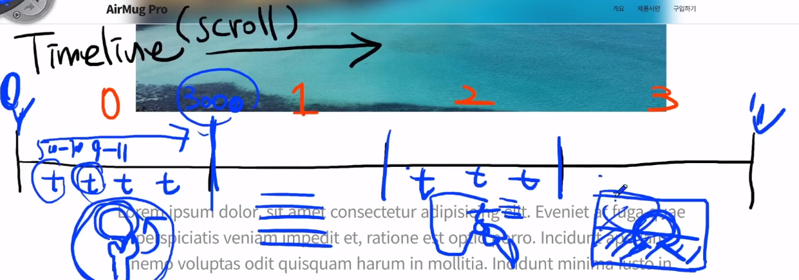
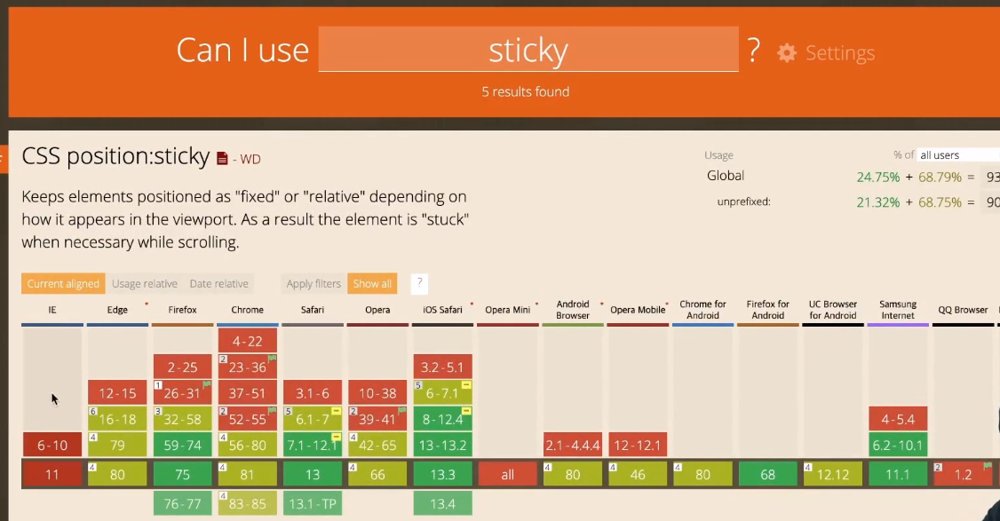
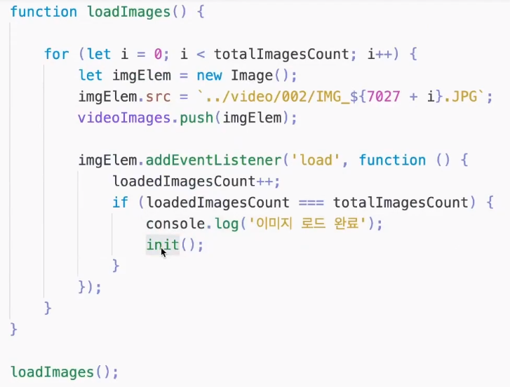
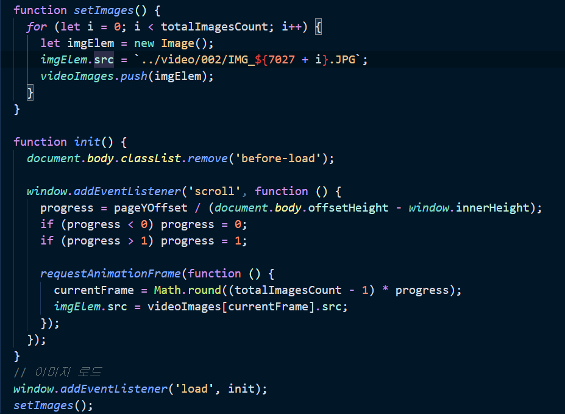
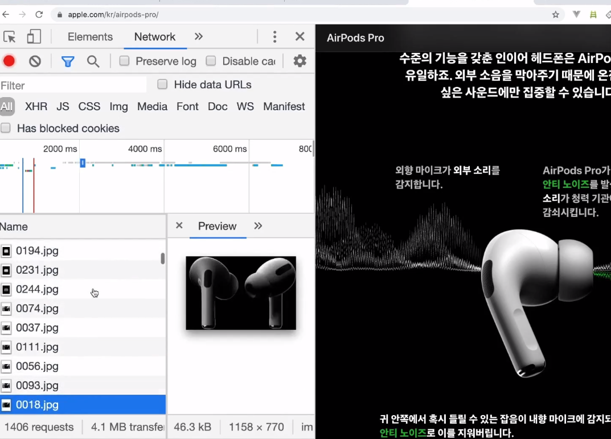
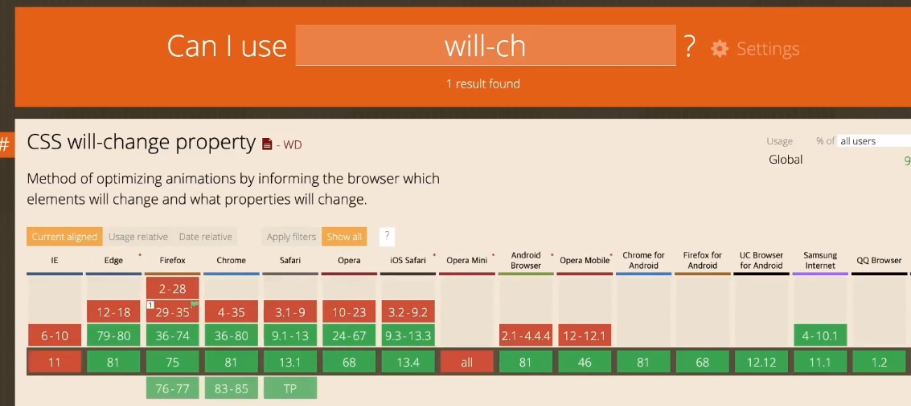
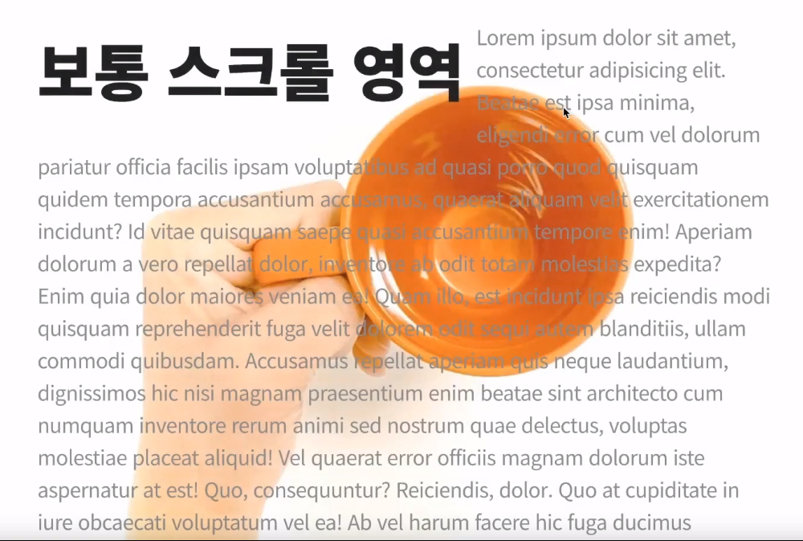
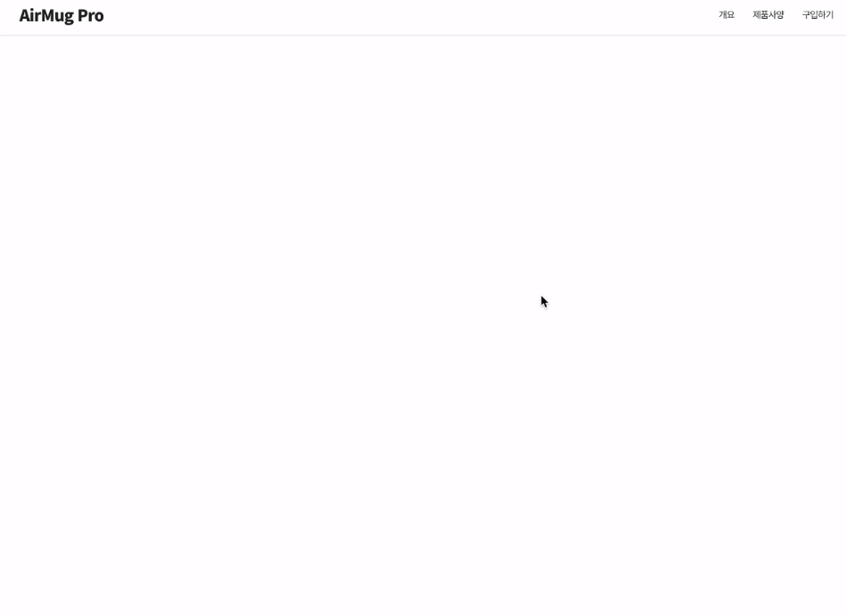
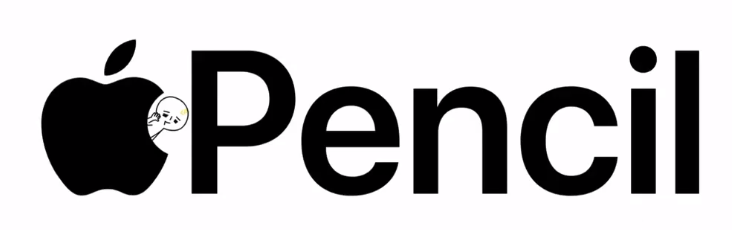

# Apple_Clonecoding

[toc]

>자바스크립트 문법은 ECMA2015(ES6) 기준으로 작성되었습니다.
>IE에서도 오류 없이 실행되는 이전 버전으로 변환하려면 자바스크립트 트랜스파일러인 Babel을 이용해야 하는데,
>Babel의 사용법이 궁금하시면 아래 링크의 영상을 참고하세요~
>https://youtu.be/VeK3a29x1hE
>
>[1분코딩사이트](https://studiomeal.com/)
>
>**모바일에서 보는 화면을 작성후 브라우저에서도 적용될 수 있게 만듦!(반대도 상관없음 개발자 도구에서 모바일 선택 후 보면서 하면됨)**
>
>첫 시작 html, default.css는 모든 값을 default 시켜주는 css
>
>```html
><!DOCTYPE html>
><html>
><head>
>	<meta charset="UTF-8">
>	<meta name="viewport" content="width=device-width, initial-scale=1.0">
>	<meta http-equiv="X-UA-Compatible" content="ie=edge">
>	<title>AirMug Pro</title>
>	<link rel="stylesheet" href="css/default.css">
></head>
><body>
>	
></body>
></html>
>```
>
>```css
>@charset 'utf-8';
>
>html {
>	font-family: 'Apple SD Gothic Neo', Roboto, 'Noto Sans KR', NanumGothic, 'Malgun Gothic', sans-serif;
>	line-height: 1.2;
>	word-wrap: break-word;
>}
>body {
>	-webkit-font-smoothing: antialiased;
>}
>html, body, div, span, applet, object, iframe,
>h1, h2, h3, h4, h5, h6, p, blockquote, pre,
>a, abbr, acronym, address, big, cite, code,
>del, dfn, em, img, ins, kbd, q, s, samp,
>small, strike, strong, sub, sup, tt, var,
>b, u, i, center,
>dl, dt, dd, ol, ul, li,
>fieldset, form, label, legend,
>table, caption, tbody, tfoot, thead, tr, th, td,
>article, aside, canvas, details, embed,
>figure, figcaption, footer, header, hgroup,
>menu, nav, output, ruby, section, summary,
>time, mark, audio, video {
>	margin: 0;
>	padding: 0;
>	border: 0;
>}
>article, aside, details, figcaption, figure, footer, header, hgroup, menu, nav, section {
>	display: block;
>}
>div, span, article, section, header, footer, aside, p, ul, li, fieldset, legend, label, a, nav, form {
>	box-sizing: border-box;
>}
>ol, ul, li {
>	list-style: none;
>}
>table {
>	border-collapse: collapse;
>	border-spacing: 0;
>}
>img {
>	max-width: 100%;
>	height: auto;
>	border: 0;
>}
>button {
>	border: 0;
>	background: transparent;
>	cursor: pointer;
>}
>```

## 폰트설정

> 구글 폰트 `noto sans KR(regular, black900)`
>
> link와 css rules 가져와서 사용
>
> 

- index.html

```html
<!DOCTYPE html>
<html>
<head>
	<meta charset="UTF-8">
	<meta name="viewport" content="width=device-width, initial-scale=1.0">
	<meta http-equiv="X-UA-Compatible" content="ie=edge">
	<title>AirMug Pro</title>
	<!-- google폰트 noto sans regular, black900을 가져옴 -->
	<link href="https://fonts.googleapis.com/css2?family=Noto+Sans+KR:wght@400;900&display=swap" rel="stylesheet">
	<!-- default.css는 default값으로 만든 css다 -->
	<link rel="stylesheet" href="css/default.css">
	<!-- 우리가 만든 적용할 css를 만들어줌 -->
	<link rel="stylesheet" href="css/main.css">
</head>
```

- main.css

```css
/* 만들어서 적용할 css */
@charset 'utf-8';
/* 폰트 sans폰트 가져오기 추가적으로 더 넣고싶으면 , 여기 그대로 넣으면 됨 */
html {
	font-family: 'Noto Sans KR', sans-serif;
	font-size: 14px;
}
```


## 메뉴(Navbar)

> [css flex 설명](https://studiomeal.com/archives/197)
>
> 
>
> 메뉴가 아래위 두개로 나뉘어져있고, 스크롤을 내리면 아래의 메뉴만 위에 고정돼있으며, 그 고정된 메뉴 뒤로는 블러처리가 된다.
>
> 

- `index.html`

```html
	<div class="container">
		<!-- 첫번째 nav, 전체 nav니까 global-nav -->
		<nav class="global-nav">
			<div class="global-nav-links">
				<a href="#" class="global-nav-item">Rooms</a>
				<a href="#" class="global-nav-item">Ideas</a>
				<a href="#" class="global-nav-item">Stores</a>
				<a href="#" class="global-nav-item">Contact</a>
			</div>
		</nav>
		<!-- 계속 따라올 nav! local-nav로 지정 -->
		<nav class="local-nav">
			<div class="local-nav-links">
				<a href="#" class="product-name">AirMug Pro</a>
				<a href="#">개요</a>
				<a href="#">제품사양</a>
				<a href="#">구입하기</a>
			</div>
		</nav>
```

- 위에 지정한 class값들을 `main.css`에 만들어주기

```css
/* 만들어서 적용할 css */
@charset 'utf-8';
/* 폰트 sans폰트 가져오기 */
html {
	font-family: 'Noto Sans KR', sans-serif;
	font-size: 14px;
}
body {
	/* 가로스크롤이 안생기게 설정 */
	overflow-x: hidden;
	/* apple 글자색과 같게 */
	color: rgb(29, 29, 31);
	/* 자간 줄임 */
	letter-spacing: -0.05em;
	/* 백그라운드 흰색 */
	background: white;
}
p {
	/* 문단 글자사이 거리 */
	line-height: 1.6;
}
/* a태그 글자색, text-decoration none은 밑줄 없앰 */
a {
	color: rgb(29, 29, 31);
	text-decoration: none;
}

body.before-load {
	overflow: hidden;
}
.container {
	/* iPhone 가로 스크롤 방지 */
	overflow-x: hidden;
}
.global-nav {
	position: absolute;
	top: 0;
	left: 0;
	z-index: 10;
	width: 100%;
	/* nav높이 44px(애플 직접 재봄) */
	height: 44px;
	padding: 0 1rem;
}
.local-nav {
	position: absolute;
	top: 45px;
	left: 0;
	z-index: 11;
	width: 100%;
	height: 52px;
	padding: 0 1rem;
	border-bottom: 1px solid #ddd;
}
.local-nav-sticky .local-nav {
	position: fixed;
	top: 0;
	background: rgba(255, 255, 255, 0.1);
	/* for iPhone */
	-webkit-backdrop-filter: saturate(180%) blur(15px);
	-moz-backdrop-filter: saturate(180%) blur(15px);
	-o-backdrop-filter: saturate(180%) blur(15px);
	backdrop-filter: saturate(180%) blur(15px);
}
/* 두개 겹치니까 공통으로 씀 */
.global-nav-links,
.local-nav-links {
	display: flex;
	/* main방향의 수직방향 중간 */
	align-items: center;
	/* 최대 width가 1000px로 지정 브라우저 크기가 그것보다 작아지면 그것에 맞게 작아지면되는데 더 커지지는 않게! */
	max-width: 1000px;
	/* 알아서 부모만큼 높이가 늘어나게 100%로 지정 */
	height: 100%;
	/* 중간으로 정렬해줘야되니까 0, 왼쪽오른쪽 auto */
	margin: 0 auto;
}
.global-nav-links {
	/* 이건 global에만 주면됨 왜냐면 global nav는 균일하게 띄어져있지만 local nav는 로고만 왼쪽, 나머지메뉴는 오른쪽에 붙어있음 */
	justify-content: space-between;
}
/* local nav의 로고 */
/* 이렇게 부모도 적어준 이유는 .product-name이라고 적으면 local-nav-links a 보다 우선순위가 낮기때문에 부모클래스 아래의 적용할 클래스를 적어줌 */
/* a그냥 태그 이름보다 클래스이름이 우선순위가 더 높음 */
.local-nav-links .product-name {
	/* 오른쪽 margin auto를 하면 margin 오른쪽을 다써서 나머지 메뉴들을 오른쪽에 붙임 */
	margin-right: auto;
	/* 이건 로고니까 폰트사이즈 더 크게함 */
	font-size: 1.4rem;
	/* 굵게 */
	font-weight: bold;
}
/* a태그인 local-nav-link에 적용,  */
.local-nav-links a {
	/* 폰트사이즈를 얘만 좀 줄임 */
	font-size: 0.8rem;
}
/* not은 class가 product-name을 제외하고, margin-left적용 */
.local-nav-links a:not(.product-name) {
	margin-left: 2em;
}
```


## scroll-section

> 
>
> 스크롤을 할 떄 처음과 끝의 section에서 각 0,1,2,3 구간의 값(스크롤높이)을 정하고 해당 스크롤이 시작될때만 애니메이션이 적용되고 나머지 영역은 실행안되고 있어야 부하가 덜걸림
>
> 스크롤 높이의 크기에 따라 속도가 빠르고 느림을 적용할 수 있다
>
> 비디오의 재생시간, 프레임수 등의 정보가 있어야됨
>
> text를 넣는 타이밍에 대한 정보
>
> 이 모든 정보들을 한배열에 넣어둘거다
>
> 배열의 정보만 보면 알아보고싶고, 관리하기 쉽기 때문

### rem VS em VS vw(vh)

> *fontsize는 rem으로 하고, margin, heghit은 em으로 하는 이유?*
>
> *em은 현재 내 폰트 사이즈(rem)의 몇배가 적용됨,* 
>
>  *만약 em을 rem으로 바꾸면 root(14px)의 몇배가 적용됨 내가 원하는건 현재 내 폰트에 비례한 사이즈를 적용하길 원하기 때문에 em을 씀* 
>
>  *0.2em은 storng의 폰트사이즈의 0.2배 정도로 오른쪽에 margin을 주고싶어서 em을 사용함* 
>
> *1rem이 14px 3rem(14\*3=42px)거기에 0.2배는 8.4px*
>
> *폰트사이즈가 브라우저 크기에 비례해서 달라지기 위해 vw(윈도우 사이즈의 9퍼센트크기)*
>
> *vw은 창크기에 따라 따라가겠다라는 의도, rem은 창의크기가 어떻든 어느정도 크기 제한을 하겠다란 의도로 사용* 
>
> *apple에서는 보통 title들을 vw로 함*

### position fixed vs sticky

> sticky는 IE에서 11에서도 지원을 안함, 최소 상업용 사이트라면 11에서는 적용할 수 있게 만드는게 좋기 때문에 fixed를 사용
>
> 애플은 IE에서는 정적인 이미지로 작동하고, 고급진 이미지처리는 크롬, 사파리, 파이어폭스에서 볼 수 있음
>
> 

### load vs DOMContentLoaded

> *'load'vs 'DOMContentLoaded', 둘차이는 load는 웹페이지 이미지,리소스 등 모두 로딩되고나서 실행, DOM은 html객체 돔구조가 로드되면 실행, 보통 이걸 많이 쓰지만 우리는 현재 이미지와 같은것이 다 로드되고 실행돼야 의미가 있어서 load사용*


## video

### scroll로 비디오 제어하기

> 비디오를 직접 넣으면 저화질로 했을때는 해상도가 깨지고, 고화질로 하면 버벅여서 다른 방법으로 할예정
>
> 그래도 비디오를 어떻게 적용하는지 js공부

```html
<!DOCTYPE html>
<html>
<head>
	<meta charset="UTF-8">
	<meta name="viewport" content="width=device-width, initial-scale=1.0">
	<title>Document</title>
	<style>
		* {
			margin: 0;
			padding: 0;
		}
		body {
			height: 500vh;
		}
		body.before-load {
			overflow-y: hidden;
		}
		.sample-video {
			/* fixed로 고정하고 스크롤에 따라 딱딱 나오게 함 */
			position: fixed;
			top: 0;
			left: 0;
			width: 100%;
		}
	</style>
</head>
<body class="before-load">
	<!-- 비디오를 직접 넣었을때 그래서 테스트를 할때는 저화질로 함 그래서 우린 다른 방법을 이용할거다 -->
	<!-- low vs high 차이, 고화질은 상당히 깨끗한 화질이지만 저화질은 크게하면 꺠짐  근데 스크롤하는데 너무 느리게 버벅임-->
	<video class="sample-video" src="../video/sample-low.mp4" muted></video>
	<!-- <video class="sample-video" src="../video/sample-high.mp4" muted></video> -->

	<script>
		const videoElem = document.querySelector('.sample-video');
		let progress;
		let currentFrame;
		function init() {
			document.body.classList.remove('before-load');

			window.addEventListener('scroll', function () {
				// 현재 얼만큼 스크롤됐는지 비율을 구함 (스크롤 가능 높이= 전체 body높이에서 맨마지막에 스크롤이 필요없는 화변높이만큼 뺀 높이 즉, 전체 스크롤 가능 범위 분에 현재 스크롤된 양)
				progress = pageYOffset / (document.body.offsetHeight - window.innerHeight);
				console.log(progress);
				// 바운스 효과로 0보다 작아지거나 1보다커지는 것을 막는 안전장치
				if (progress < 0) progress = 0;
				if (progress > 1) progress = 1;
				// videoduration은 비디오 전체 시간을 나타냄 거기에 지금 어느위치에 있는지 progress를 곱해 현재시간을 구함
				videoElem.currentTime = videoElem.duration * progress;
			});
		}
		// 비디오로드
		window.addEventListener('load', init);
	</script>
</body>
</html>
```


### 비디오를 이미지로 만들어서 보여줌

> **구글에 동영상을 이미지로 만들어주는 프로그램 찾아서 적용하면됨, 그리고 이미지 압축툴로 용량 최적화도 시켜줘야된다**
>
> 비디오를 이미지로 만들면 화질도 좋고, 용량도 오히려 덜 차지한다.
>
> 16초짜리 영상을 초당 60프레임의 이미지로 만듦!
>
> 
>
> 이렇게 하면 이미지 하나하나 로드되는 과정을 컨트롤 할 수 있음
>
> 근데 이렇게 안해도 전체 다 로드 되고 보여주는 과정만 할거면 아래와 같이 하면 됨
>
> 

```html
<!DOCTYPE html>
<html>
<head>
	<meta charset="UTF-8">
	<meta name="viewport" content="width=device-width, initial-scale=1.0">
	<title>Document</title>
	<style>
		* {
			margin: 0;
			padding: 0;
		}
		body {
			height: 500vh;
		}
		body.before-load {
			overflow-y: hidden;
		}
		.sample-img {
			position: fixed;
			top: 0;
			left: 0;
			width: 100%;
		}
	</style>
</head>
<!-- 이미지 순서로 비디오를 보여주는 방식, 스크롤을 몇프로 내리면 몇번째 이미지가 나올지 계산 -->
<body class="before-load">
	<!-- 16초 짜리를 초당 60프레임으로 이미지로 만듦 -->
	

	<script>
		// img를 잡음
		const imgElem = document.querySelector('.sample-img');
		const videoImages = [];
		// 총이미지 개수
		let totalImagesCount = 960;
		let progress;
		let currentFrame;
		// 이미지를 한장한장 넘어감
		function setImages() {
			for (let i = 0; i < totalImagesCount; i++) {
				let imgElem = new Image();
				imgElem.src = `../video/002/IMG_${7027 + i}.JPG`;
				videoImages.push(imgElem);
			}
		}

		function init() {
			document.body.classList.remove('before-load');

			window.addEventListener('scroll', function () {
				progress = pageYOffset / (document.body.offsetHeight - window.innerHeight);
				if (progress < 0) progress = 0;
				if (progress > 1) progress = 1;

				requestAnimationFrame(function () {
// 소수로 값이 나오니까 round로 반올림을 시켜서 0~959 index값을 나타내야되니까 현재프레임을 스크롤된 비율에 따라 인덱스번호로 만든것을 넣어줌
					currentFrame = Math.round((totalImagesCount - 1) * progress);
					imgElem.src = videoImages[currentFrame].src;
				});
			});
		}
		// 이미지 로드
		window.addEventListener('load', init);
		setImages();
	</script>
</body>
</html>
```


### canvas

> [1분코딩캔버스강의유튜브](https://www.youtube.com/watch?v=JFQOgt5DMBY&list=PLe9WXHRkq9p2Yl0z2zskv-FhP5sinISTc)
>
> apple에서는 이 방식 이용
>
> 

```html
<!DOCTYPE html>
<html>
<head>
	<meta charset="UTF-8">
	<meta name="viewport" content="width=device-width, initial-scale=1.0">
	<title>Document</title>
	<style>
		* {
			margin: 0;
			padding: 0;
		}
			height: 500vh;
		body {
		}
		body.before-load {
			overflow-y: hidden;
		}
		.sample-canvas {
			position: fixed;
			top: 0;
			left: 0;
			width: 100%;
		}
	</style>
</head>
<body class="before-load">
	<!-- 브라우저에 맞춰서 픽스됨 왜냐하면 width가 100%라서 -->
	<canvas class="sample-canvas" width="1920" height="1080"></canvas>

	<script>
		// canvas는 모든 드로잉 조작을 할때 getContext메서드를 호출해서 context객체를 이용. 이 두개(canvas,context) 기본
		const canvas = document.querySelector('.sample-canvas');
		const context = canvas.getContext('2d');

		const videoImages = [];
		let totalImagesCount = 960;
		let progress;
		let currentFrame;

		function setImages() {
			for (let i = 0; i < totalImagesCount; i++) {
				let imgElem = new Image();
				imgElem.src = `../video/002/IMG_${7027 + i}.JPG`;
				videoImages.push(imgElem);
			}
		}

		function init() {
			document.body.classList.remove('before-load');
			// 처음에 실행할때, 첫번째 이미지를 먼저 그려주고 시작!
			context.drawImage(videoImages[0], 0, 0);

			window.addEventListener('scroll', function () {
				progress = pageYOffset / (document.body.offsetHeight - window.innerHeight);
				if (progress < 0) progress = 0;
				if (progress > 1) progress = 1;

				currentFrame = Math.round((totalImagesCount - 1) * progress);
				// context객체에 drawImage메서드를 이용해 그림(그릴이미지객체, x좌표, y좌표)
				context.drawImage(videoImages[currentFrame], 0, 0);
			});
		}

		window.addEventListener('load', init);
		setImages();
	</script>
</body>
</html>
```


### 부드러운 감속의 원리

```html
<!DOCTYPE html>
<html>
<head>
	<meta charset="UTF-8">
	<meta name="viewport" content="width=device-width, initial-scale=1.0">
	<title>부드러운 스크롤</title>
	<!-- 스크롤을 내리거나 올릴때 동영상이 끊김 없이 부드럽게 표현되게하기위함 -->
	<style>
		body {
			height: 500vh;
		}
		.box {
			position: fixed;
			top: 100px;
			left: 0;
			width: 0;
			height: 100px;
			background: orange;
		}
	</style>
</head>
<body>
	<div class="box"></div>

	<script>
		const box = document.querySelector('.box');
		let acc = 0.1;
		let delayedYOffset = 0;
		// requestAnimationFrame id변수
		let rafId;
		// requestAnimationFrame상태를 나타내는 변수
		let rafState;
		// scroll이 일어나면
		window.addEventListener('scroll', () => {
			// box.style.width = `${window.pageYOffset}px`;
			// scroll이 일어났고, requestAnimation상태가 꺼져있으면 다시 실행시킴
			if (!rafState) {
				// 값이변할때만 rafId갱신
				rafId = requestAnimationFrame(loop);
				rafState = true;
			}
		});

		function loop() {
			// 속도를 감속시키는 식, 현재위치 + 목표지점(현재스크롤위치)에서 현재위치를 뺴고 *0.1로 현재위치를 계속 갱신,
			// 이거를 재귀처럼 계속 반복하면 끝날지점으로 갈수록 속도가 느려지면스 애니메이션이 부드러워진다
			delayedYOffset = delayedYOffset + (pageYOffset - delayedYOffset) * acc;
			box.style.width = `${delayedYOffset}px`;
			console.log('loop');

			rafId = requestAnimationFrame(loop);
			// 두 지점의 차이 절대값(목표, delayedYoffset)가 1px이하면 거의 같단말! 그때 requestAnimagionFrame을 취소함(cancelAnimationFrame)
			if (Math.abs(pageYOffset - delayedYOffset) < 1) {
				cancelAnimationFrame(rafId);
				rafState = false;
			}
		}

		loop();
	</script>
</body>
</html>
```


## (참고) will-change

> [will-change MDN](https://developer.mozilla.org/ko/docs/Web/CSS/will-change)
>
> 

**`will-change`** [CSS](https://developer.mozilla.org/en-US/docs/Web/CSS) 속성은 요소에 예상되는 변화의 종류에 관한 힌트를 브라우저에 제공케 한다.  그래서 실제 요소가 변화되기 전에 미리 브라우저는 적절하게 최적화할 수 있다. 이러한 종류의 최적화는 잠재적으로 성능 비용이 큰 작업을 그것이 실제로 요구되기 전에 미리 실행함으로써 페이지의 반응성을 증가시킬 수 있다.

이 속성을 적당하게 사용하는 것이 꽤 어려울 수 있다:

- ***너무 많은 요소에 will-change** 를 적용하지 말라.* 브라우저는 모든 것을 최적화하기 위해 가능한 모든 것을 이미 시도하고 있다. will-change 와 묶인 강한 최적화의 몇은 많은 기기 자원을 소모할 것이다. 또한 이 같은 과도한 사용은 페이지 속도를 늦추거나 엄청난 자원을 소비할 수 있다.
- ***아껴 사용하라.*** 브라우저가 만드는 최적화의 기본 행동은 가능한 바로 최적화를 제거하고 기본 상태로 돌리는 것이다. 그러나 will-change를 스타일시트에 직접 추가하는 것은 목표 요소가 곧 변경되어 (will-change 를 정의하지 않았을 때보다) 더 오랜 시간동안 최적화를 유지하리란 것을 암시한다. 스크립트 코드를 사용하여 변화발생의 전후로 will-change 의 활성/비활성을 바꿔주는 것이 좋다.
- ***서둘러 최적화하기 위해 will-change 를 적용하지 말라.*** 만약 페이지가 잘 돌아간다면 단지 조금 더 빨리하기 위해 will-change 속성을 추가하지 말라. `will-change` 는 당장의 성능 문제를 해결하기 위한 마지막 수단으로 사용되기 위해 계획된 것이다. 성능문제를 예상하며 사용되어선 안된다. will-change 의 초과사용은 브라우저가 가능한 변화에 대한 준비를 시도하기 때문에 과도한 메모리 사용과 더 복잡한 렌더링을 초래할 것이다. 더 열악한 성능을 이끌 것이다.
- ***작업할 충분한 시간을 줘라.*** 이 속성은 작성자로 하여금 사용자 에이전트가 변경가능한 속성을 미리 알 수 있게 하도록고안되었다. 그러면 브라우저는 실제 속성변화가 발생하기 전에 속성에 요구되는 어떠한 최적화던지 미리 적용하는 것을 선택할 수 있다. 그래서 브라우저가 실제 최적화를 할 시간을 주는 것은 중요하다. 변화가 발생하기 조금 전에라도 그 변화를 예상할 방법을 찾아 `will-change` 를 설정하라.


## 버그 수정

> `원하는 부분(js)에 debugger를 적으면 그 부분부터 멈춰서 디버깅할 수 있다`

### 스크롤을 하다가 중간에 새로고침을 할 경우

#### 1. 중간에 새로고침을 할경우 스크롤 위치가 달라짐(현 위치에서 바로 새로고침만 돼야되는데 위치가 달라진다)

> 
>
> **0,2,3 섹션은 나중에 스크립트로 계산되는 높이를 써야하고, 1 섹션(보통 스크롤 영역)은 처음부터 가진 높이를 바로 쓰는데 처음에 모든 섹션이 처음부터 가진 높이로 인지되기 때문에 발생하는 문제!**(`setLayout`함수가 실행되지 않았기 때문에 자기 높이만큼만 지정돼있음)
>
> 이럴떄는 그냥 setlayout함수가 실행되기 전까진 아무것도 안보이게 설정해두면 된다!
>
> ```css
> /* 로드가 되기 전에는 containerclass가 보이지 않게 설정 */
> .before-load .container {
>     display: none;
> }
> ```

#### 2. 다시 스크롤하기 전까지 아무것도 안보임

> 
>
> 스크롤을 자동으로 해주면 고칠 수 있음(스크립트에서 로드가 됐을 때 해줌)
>
> **setInterval과 scrollTo를 이용!**
>
> ```css
> 		// 중간에서 새로고침 했을 경우 자동 스크롤로 제대로 그려주기
> 		// 현재위치를 저장할 변수
> 				let tempYOffset = yOffset;
> 				// 스크롤이 몇번됐는지 셀 변수
> 				let tempScrollCount = 0;
> 				// 제일 처음일때는 일어나지않게함(스크롤이되면 안되기때문)
>         if (tempYOffset > 0) {
> 					// settimeout은 한번잠깐 지연, setInterval은 계속 반복시킴
>             let siId = setInterval(() => {
> 							// 현재위치로 스크롤을 보냄
> 								scrollTo(0, tempYOffset);
> 								// 스크롤을 5px씩 20번반복할거다
>                 tempYOffset += 5;
> 								// 20까지만 할거니까(0.02초) 20넘으면 멈춰라
>                 if (tempScrollCount > 20) {
>                     clearInterval(siId);
> 								}
> 								// temp가 몇번반복됐는지 세어줌
>                 tempScrollCount++;
>             }, 20);
> 				}
> ```

#### 3. 이미지 블랜딩같은 경우 진입시점에서 사이즈를 재서 효과를 줬는데 중간에 resize가 일어나면 다시 새로 바뀐것에서 적용이 안됨

> reload시킴!,(상황에 따라 결정하면됨)
>
> ```css
> // 윈도우 사이즈를 줄이면 다시 높이 조정(setlayout실행)
>   		window.addEventListener('resize', () => {
> 				// innerWidth가 900(폰들이 요즘 900까지 됨)보다 클때만 
>   			if (window.innerWidth > 900) {
> 					// reload를 시킴(새로고침)
> 				window.location.reload();
> 			}
>   		});
> 			// orientationchange는 모바일 가로 세로 방향 바꾸는 이벤트!가 일어나면 함수가 실행되게 처리
>   		window.addEventListener('orientationchange', () => {
> 			// 로드됐을때 자동으로 살짝 스크롤해줌(스크롤이벤트가 일어나야 보여지는 화면이 있기 떄문)
> 			// scrollTo(x,y)
> 			// 스크롤자체를 그냥 위로 올려줌
> 			scrollTo(0, 0);
> 			// orientation했을때 camvas크기가 제대로 안잡혀서 한템포 늦춰서 실행되게함
> 			setTimeout(() => {
> 				// 다시 reload시킴
> 				window.location.reload();
> 			}, 500);
>   		});
> ```


-----------

## 최종 코드

### index.html

```html
<!DOCTYPE html>
<html>
<head>
	<meta charset="UTF-8">
	<meta name="viewport" content="width=device-width, initial-scale=1.0">
	<meta http-equiv="X-UA-Compatible" content="ie=edge">
	<title>AirMug Pro</title>
	<!-- google폰트 noto sans regular, black900을 가져옴 -->
	<link href="https://fonts.googleapis.com/css2?family=Noto+Sans+KR:wght@400;900&display=swap" rel="stylesheet">
	<!-- default.css는 default값으로 만든 css다 -->
	<link rel="stylesheet" href="css/default.css">
	<!-- 우리가 만든 적용할 css를 만들어줌 -->
	<link rel="stylesheet" href="css/main.css">
</head>
<!-- 처음에 loading이 보여야되니까 before-load class적용 -> 로딩되면 제거하면됨-->
<body class="before-load">
	<!-- loading처리 -->
	<div class="loading">
		<!-- svg태그에 css적용-->
		<svg class="loading-circle">
			<!-- circle태그 원의 중점의 위치, 반지름 지정 -->
			<circle cx="50%" cy="50%" r="25"></circle>
		</svg>
	</div>
	<div class="container">
		<!-- 첫번째 nav, 전체 nav니까 global-nav -->
		<nav class="global-nav">
			<div class="global-nav-links">
				<a href="#" class="global-nav-item">Rooms</a>
				<a href="#" class="global-nav-item">Ideas</a>
				<a href="#" class="global-nav-item">Stores</a>
				<a href="#" class="global-nav-item">Contact</a>
			</div>
		</nav>
		<!-- 계속 따라올 nav! local-nav로 지정 -->
		<nav class="local-nav">
			<div class="local-nav-links">
				<a href="#" class="product-name">AirMug Pro</a>
				<a href="#">개요</a>
				<a href="#">제품사양</a>
				<a href="#">구입하기</a>
			</div>
		</nav>
		<!-- 스크롤 구간을 나눔 id로 스크롤섹션을 고유id로 만듦(나중에 몇번 scroll이 동작중인지 체크하기위해) -->
		<section class="scroll-section" id="scroll-section-0">
			<h1>AirMug Pro</h1>
			<!-- 스크롤에 따라 동작하지만 눈에 딱 고정시키는 요소들한테 모두 적용(sticky-elem) 
				스크롤값에 따라 변동이되는거지 자연스럽게 스크롤돼어 올라가는 요소들이 아님 -->
				<!-- 캔버스를 넣음, sticky-elem -->
			<div class="sticky-elem sticky-elem-canvas">
				<canvas id="video-canvas-0" width="1920" height="1080"></canvas>
			</div>
			<div class="sticky-elem main-message a">
				<p>온전히 빠져들게 하는<br>최고급 세라믹</p>
			</div>
			<div class="sticky-elem main-message b">
				<p>주변 맛을 느끼게 해주는<br>주변 맛 허용 모드</p>
			</div>
			<div class="sticky-elem main-message c">
				<p>온종일 편안한<br>맞춤형 손잡이</p>
			</div>
			<div class="sticky-elem main-message d">
				<p>새롭게 입가를<br>찾아온 매혹</p>
			</div>
		</section>
		<section class="scroll-section" id="scroll-section-1">
			<p class="description">
				<strong>보통 스크롤 영역</strong>
				<!-- lorem200 tab치면 200자 랜덤 글자들이 자동으로 들어감 -->
				Lorem ipsum dolor sit amet, consectetur adipisicing elit. Beatae est ipsa minima, eligendi error cum vel dolorum pariatur officia facilis ipsam voluptatibus ad quasi porro quod quisquam quidem tempora accusantium accusamus, quaerat aliquam velit exercitationem incidunt? Id vitae quisquam saepe quasi accusantium tempore enim! Aperiam dolorum a vero repellat dolor, inventore ab odit totam molestias expedita? Enim quia dolor maiores veniam ea! Quam illo, est incidunt ipsa reiciendis modi quisquam reprehenderit fuga velit dolorem odit sequi autem blanditiis, ullam commodi quibusdam. Accusamus repellat aperiam quis neque laudantium, dignissimos hic nisi magnam praesentium enim beatae sint architecto cum numquam inventore rerum animi sed nostrum quae delectus, voluptas molestiae placeat aliquid! Vel quaerat error officiis magnam dolorum iste aspernatur at est! Quo, consequuntur? Reiciendis, dolor. Quo at cupiditate in iure obcaecati voluptatum vel ea! Ab vel harum facere hic fuga ducimus sapiente dolore dolorem, nobis sint perferendis cumque esse! Omnis fugiat sint error laborum eveniet labore nam ducimus quisquam in repudiandae impedit excepturi dignissimos tenetur libero placeat rerum maxime tempore, aut nihil. Qui, quam? Voluptate fuga possimus itaque quas nesciunt iste, facilis mollitia illo qui placeat temporibus inventore obcaecati. Recusandae, sequi dignissimos in natus eum maiores dolorem, deleniti nobis accusantium, aspernatur beatae.
			</p>
		</section>
		<section class="scroll-section" id="scroll-section-2">
			<div class="sticky-elem sticky-elem-canvas">
				<canvas id="video-canvas-1" width="1920" height="1080"></canvas>
			</div>
			<div class="sticky-elem main-message a">
				<p>
					<small>편안한 촉감</small>
					입과 하나 되다
				</p>
			</div>
			<!-- 선 그어지고 설명하는 요소 -->
			<div class="sticky-elem desc-message b">
				<p>
					편안한 목넘김을 완성하는 디테일한 여러 구성 요소들, 우리는 이를 하나하나 새롭게 살피고 재구성하는 과정을 거쳐 새로운 수준의 머그, AirMug Pro를 만들었습니다. 입에 뭔가 댔다는 감각은 어느새 사라지고 오롯이 당신과 음료만 남게 되죠.
				</p>
				<!-- 선(js로 조절) -->
				<div class="pin"></div>
			</div>
			<div class="sticky-elem desc-message c">
				<p>
					디자인 앤 퀄리티 오브 스웨덴,<br>메이드 인 차이나
				</p>
				<div class="pin"></div>
			</div>
		</section>
		<section class="scroll-section" id="scroll-section-3">
			<p class="mid-message">
				<strong>Retina 머그</strong><br>
				아이디어를 광활하게 펼칠<br>
				아름답고 부드러운 음료 공간.
			</p>
			<!-- canvas처리 -->
			<canvas class="image-blend-canvas" width="1920" height="1080"></canvas>
			<p class="canvas-caption">
				Lorem ipsum dolor, sit amet consectetur adipisicing elit. Eveniet at fuga quae perspiciatis veniam impedit et, ratione est optio porro. Incidunt aperiam nemo voluptas odit quisquam harum in mollitia. Incidunt minima iusto in corporis, dolores velit. Autem, sit dolorum inventore a rerum distinctio vero illo magni possimus temporibus dolores neque adipisci, repudiandae repellat. Ducimus accusamus similique quas earum laborum. Autem tempora repellendus asperiores illum ex! Velit ea corporis odit? Ea, incidunt delectus. Sapiente rerum neque error deleniti quis, et, quibusdam, est autem voluptate rem voluptas. Ratione soluta similique harum nihil vel. Quas inventore perferendis iusto explicabo animi eos ratione obcaecati.
			</p>
		</section>
		<!-- 하단 콘텐츠 추가 -->
		<section class="normal-content">
			<p class="mid-message">
				Lorem ipsum dolor, sit amet consectetur adipisicing elit. Eveniet at fuga quae perspiciatis veniam impedit et, ratione
				est optio porro. Incidunt aperiam nemo voluptas odit quisquam harum in mollitia. Incidunt minima iusto in corporis,
				dolores velit. Autem, sit dolorum inventore a rerum distinctio vero illo magni possimus temporibus dolores neque
				adipisci, repudiandae repellat. Ducimus accusamus similique quas earum laborum. Autem tempora repellendus asperiores
				illum ex! Velit ea corporis odit? Ea, incidunt delectus. Sapiente rerum neque error deleniti quis, et, quibusdam, est
				autem voluptate rem voluptas. Ratione soluta similique harum nihil vel. Quas inventore perferendis iusto explicabo animi
				eos ratione obcaecati.
			</p>
		</section>
		<!-- footer -->
		<footer class="footer">
			2020, 1분코딩
		</footer>
	</div>
<!-- js를 넣음 -->
	<script src="js/main.js"></script>
</body>
</html>

```


### main.css

```css
/* 만들어서 적용할 css */
@charset 'utf-8';
/* 폰트 sans폰트 가져오기 */
html {
	font-family: 'Noto Sans KR', sans-serif;
	font-size: 14px;
}
body {
	/* 가로스크롤이 안생기게 설정 */
	overflow-x: hidden;
	/* apple 글자색과 같게 */
	color: rgb(29, 29, 31);
	/* 자간 줄임 */
	letter-spacing: -0.05em;
	/* 백그라운드 흰색 */
	background: white;
}
p {
	/* 문단 글자사이 거리 */
	line-height: 1.6;
}
/* a태그 글자색, text-decoration none은 밑줄 없앰 */
a {
	color: rgb(29, 29, 31);
	text-decoration: none;
}
/* body에 befor-load가 붙어있으면 스크롤이 되지 않게 overflow를 숨김(overflow면 스크롤이 될수있기때문) */
body.before-load {
	overflow: hidden;
}
.container {
	/* iPhone 가로 스크롤 방지 */
	overflow-x: hidden;
}
.global-nav {
	/* absolute를 하면 메뉴들이 공간을 차지하지 않아서 스크롤 영역의 섹션을 나눌때 오차가 사라짐(이렇게 해야 의외의 버그들을 없앨 수 있음) */
	position: absolute;
	top: 0;
	left: 0;
	/* canvas때문에 메뉴가 안보임, 포지션이 absolute니까 z-index로 앞으로 나오게함  */
	z-index: 10;
	/* absolute일땐 width를 강제로 높여줘야 적용됨 */
	width: 100%;
	/* nav높이 44px(애플 직접 재봄) */
	height: 44px;
	padding: 0 1rem;
}
.local-nav {
	position: absolute;
	top: 45px;
	left: 0;
	/* canvas때문에 메뉴가 안보임, 포지션이 absolute니까 z-index로 앞으로 나오게함  */
	z-index: 11;
	width: 100%;
	height: 52px;
	/* 좌우패딩을 줌(모바일로 봤을때 좌우에 너무 딱 붙어있어서) */
	padding: 0 1rem;
	border-bottom: 1px solid #ddd;
}
/* 이 클래스가 붙으면 위에 고정시키고 불투명처리 */
.local-nav-sticky .local-nav {
	position: fixed;
	top: 0;
	/* 투명도가 있는 흰색 */
	background: rgba(255, 255, 255, 0.1);
	/* for iPhone */
	/* ios에서는 -webkit-을 붙여줘야됨 */
	-webkit-backdrop-filter: saturate(180%) blur(15px);
	/* 파이어폭스 */
	-moz-backdrop-filter: saturate(180%) blur(15px);
	-o-backdrop-filter: saturate(180%) blur(15px);
	/* 뿌옇게 처리하는 것, 애플 개발자도구를 보고 그대로 가져옴 */
	backdrop-filter: saturate(180%) blur(15px);
}
/* 두개 겹치니까 공통으로 씀 */
.global-nav-links,
.local-nav-links {
	display: flex;
	/* main방향의 수직방향 중간 */
	align-items: center;
	/* 최대 width가 1000px로 지정 브라우저 크기가 그것보다 작아지면 그것에 맞게 작아지면되는데 더 커지지는 않게! */
	max-width: 1000px;
	/* 알아서 부모만큼 높이가 늘어나게 100%로 지정 */
	height: 100%;
	/* 중간으로 정렬해줘야되니까 0, 왼쪽오른쪽 auto */
	margin: 0 auto;
}
.global-nav-links {
	/* 이건 global에만 주면됨 왜냐면 global nav는 균일하게 띄어져있지만 local nav는 로고만 왼쪽, 나머지메뉴는 오른쪽에 붙어있음 */
	justify-content: space-between;
}
/* local nav의 로고 */
/* 이렇게 부모도 적어준 이유는 .product-name이라고 적으면 local-nav-links a 보다 우선순위가 낮기때문에 부모클래스 아래의 적용할 클래스를 적어줌 */
/* a그냥 태그 이름보다 클래스이름이 우선순위가 더 높음 */
.local-nav-links .product-name {
	/* 오른쪽 margin auto를 하면 margin 오른쪽을 다써서 나머지 메뉴들을 오른쪽에 붙임 */
	margin-right: auto;
	/* 이건 로고니까 폰트사이즈 더 크게함 */
	font-size: 1.4rem;
	/* 굵게 */
	font-weight: bold;
}
/* a태그인 local-nav-link에 적용,  */
.local-nav-links a {
	/* 폰트사이즈를 얘만 좀 줄임 */
	font-size: 0.8rem;
}
/* not은 class가 product-name을 제외하고, margin-left적용 */
.local-nav-links a:not(.product-name) {
	margin-left: 2em;
}
/* 스크롤섹션에 공통적용 */
.scroll-section {
	/* 자식들의 기준이 static이 아님 scroll-sction이 된다, offsetTop의 기준을 static(제일처음)이 아니라 section시작점이 되게하기 위해 */
	position: relative;
	/* 뷰포트높이(인터넷브라우저 창의 높이)에 절반만큼 padding top을 준단 말 각 요소들 사이사이에 padding-top이 여유롭게 생김 */
	padding-top: 50vh;
}
/* 스크롤-섹션-아이디값을 이용해서 h1태그에 적용 */
#scroll-section-0 h1 {
	/* 제일처음 등장하는 글은 position을 absolute로 적용안했기 때문에 기본인 static이다, static은 absolute보다 뒤로 깔리기 때문에 캔버스에 가려 보이지 않음
		z-index를 사용하려면 static이면 안됨, 그래서 relative로 바꿔줌 */
	position: relative;
	/* 스크롤색션에 padding이 절반만큼돼있어서 살짝 글이 내려가있다 조금 올려줌(position이 relative라 top 쓸 수 있음)  */
	top: -10vh;
	/* 캔버스 보다 위로 올리기 위해 적용 */
	z-index: 5;
	/* html이 14px로 적용돼있으니 14*4px이된다 */
	font-size: 4rem;
	/* 가운데정렬 */
	text-align: center;
}
.main-message {
	/* 수직,수평 가운데 정렬 */
	display: flex;
	align-items: center;
	justify-content: center;
	/* 높이의 35%에 위치 */
	top: 35vh;
	/* 각 요소들간 위아래에 margin을 줘서 띄움 */
	margin: 5px 0;
	/* height의 3배높이 */
	height: 3em;
	font-size: 2.5rem;
	/* 기본 투명도를 0으로 줌, 0~1로 스크롤비율에따라 커질건데 처음에 보이면안되니까 0 */
	opacity: 0;
}
.main-message p {
	font-weight: bold;
	/* 글자 가운데 정렬 */
	text-align: center;
	/* 행간을 좀 좁혀줌 */
	line-height: 1.2;
}
.main-message small {
	/* small자체를 block을 줘서 박스를 만들어줌 */
	display: block;
	margin-bottom: 0.5em;
	font-size: 1.2rem;
}
#scroll-section-2 .main-message {
	font-size: 3.5rem;
}
/* 설명 */
.description {
	/* 브라우저크기가 어떻든 max-width를 적용하기 위해, 어차피 브라우저에서는 1000px을 넘지않아서 여기에 적용해도 관계없다 */
	/* scroll-section에 바로 적용안한건, 이런 max-width를 두는건 컨테이너에 적용하는건 좋지 않다, 아래에 비디오나 사진요소로 꽉채울수도있기 때문에 해당 요소만 적용해줌 */
	max-width: 1000px;
	margin: 0 auto;
	/* 위 nav에 좌우 1rem을 줬기 때문에 그걸 맞춰줌 */
	padding: 0 1rem;
	font-size: 1.2rem;
	/* 연한회색 */
	color: #888;
}
/* 설명의 강조요소 */
.description strong {
	/* 작은 설명글자가 strong을 왼쪽에 감싸고 있음-> float:left */
	float: left;
	/* fontsize는 rem으로 하고, margin, heghit은 em으로 하는 이유? em은 현재 내 폰트 사이즈(rem)의 몇배가 적용됨, */
	/* 만약 em을 rem으로 바꾸면 root(14px)의 몇배가 적용됨 내가 원하는건 현재 내 폰트에 비례한 사이즈를 적용하길 원하기 때문에 em을 씀 */
	/* 0.2em은 storng의 폰트사이즈의 0.2배 정도로 오른쪽에 margin을 주고싶어서 em을 사용함 */
	/* 1rem이 14px 3rem(14*3=42px)거기에 0.2배는 8.4px */
	margin-right: 0.2em;
	/* 글자크기 3배 */
	font-size: 3rem;
	/* 색도 진한색 */
	color: rgb(29, 29, 31);
}
.sticky-elem.desc-message {
	width: 45%;
	font-weight: bold;
	/* 처음에 등장할때 부드럽게 등장하기위해 0부터시작 */
	opacity: 0;
}
/* 설명 선*/
.pin {
	/* 길쭉한 직사각형으로 만듦 */
	width: 1px;
	height: 100px;
	background: rgb(29, 29, 31);
}
#scroll-section-2 .b {
	top: 10%;
	left: 40%;
}
#scroll-section-2 .c {
	top: 15%;
	left: 45%;
}
.mid-message {
	/* 메뉴랑 크기를 맞추기 위해 */
	max-width: 1000px;
	margin: 0 auto;
	padding: 0 1rem;
	font-size: 2rem;
	color: #888;
}
/* strong은 색이 다르니까 따로처리 */
.mid-message strong {
	color: rgb(29, 29, 31);
}
.canvas-caption {
	max-width: 1000px;
	/* 마지막 문단, 좀 더 위에서 보여지게 하려고 margintop을 음수로줌 */
	margin: -24rem auto 0;
	padding: 0 1rem;
	font-size: 1.2rem;
	color: #888;
}
.footer {
	/* flex로 가로세로 중앙정렬 */
	display: flex;
	align-items: center;
	justify-content: center;
	/* font의 7배 높이 */
	height: 7rem;
	color: white;
	background: darkorange;
}
.sticky-elem {
	/* 현재 스크롤구간에 해당하는요소만 보여주기위해, js에 나중에 해당 section만 보여주게할거얌 */
	/* 기본적으로 none으로 안보이게 만들고, 해당 section이 되면 보이게 적용할거다 */
	display: none;
	/* sticky는 IE에서 11에서도 지원을 안함, 최소 상업용 사이트라면 11에서는 적용할 수 있게 만드는게 좋기 때문에 fixed를 사용 */
	position: fixed;
	/* 폭을 꽉차게 늘려줌 */
	left: 0;
	width: 100%;
}
/* 각 scroll 색션이 되면 display를 block으로 바꿈 */
#show-scene-0 #scroll-section-0 .sticky-elem,
#show-scene-1 #scroll-section-1 .sticky-elem,
#show-scene-2 #scroll-section-2 .sticky-elem,
#show-scene-3 #scroll-section-3 .sticky-elem {
	display: block;
	/* transform과 opacity를 바꿀거라고 미리 알려줌(브라우저가 미리 준비를함) 처리시 버벅임이 줄어듦 */
	/* 이페이지에 굳이 안써도 되지만 애플은 쓰고 있음, 근데 많이 사용하면 안됨(성능개선을 위한 최후의 수단) */
	will-change: transform, opacity;
}
.scroll-effect-end .sticky-elem {
	/* 스크롤 효과가 모두 끝나고, 아래 일반 콘텐츠 영역에서는 sticky-elem들을 모두 안보이도록 */
	/* 절대로 안보여지게 important로 지정 */
	display: none !important;
}
/* 꽉 채워야되니까 top으로 함 */
.sticky-elem-canvas {
	top: 0;
	/* canvas top위치가 올바르게 하려면 container의 height도 100%으로 맞춰줘야됨 */
	height: 100%;
}
/* sticky-elem-canvas안에 canvas에 적용 */
.sticky-elem-canvas canvas {
	position: absolute;
	/* top 0은 이미 클래스에 0이 적용돼있지만, scale을 조정했기 때문에 바뀐 스케일이라 top이 0이 아님 */
	/* position의 top,left 50%로 적용하고, js에서 translate를 이용해 -50%,-50%를 적용하면 가운데 정렬이 됨 */
	top: 50%;
	left: 50%;
}
/* 섹션3번 container를 가운데 정렬, 이건 height가 다 채워져야 fixed가 적용되기때문에 container를 가운데정렬해줘야됨 */
#scroll-section-3 {
	/* 그냥 flex는 기본적으로 가로배치이기때문에 column으로 세로배치로 바꿈 */
	display: flex;
	flex-direction: column;
	/* 가로방향으로 중간정렬해야됨 */
	align-items: center;
}
/* image-blend-canvas클래스에 sticky클래스가 붙으면 적용됨 */
.image-blend-canvas.sticky {
	position: fixed;
	/* top도 0으로 적용해도 canvas에 적용된 scale때문에 완전히 위에 붙지 않는다 이건 js에서 따로 적용하면됨! */
	top: 0;
	z-index: 10;
}
.loading {
	/* 가운데 위치 */
	display: flex;
	align-items: center;
	justify-content: center;
	/* 고정 */
	position: fixed;
	top: 0;
	right: 0;
	bottom: 0;
	left: 0;
	/* 제일 위로 */
	z-index: 100;
	background: white;
	/* 로딩이 끝나면 0으로 안보이게함 */
	opacity: 0;
	/* 사라질때  */
	transition: 0.5s;
}
/* 로드가 되기 전에는 containerclass가 보이지 않게 설정 */
.before-load .container {
    display: none;
}
/* 로딩되기전에는 1로 보이다가 */
.before-load .loading {
	opacity: 1;
}
@keyframes loading-spin {
	/* 끝날때 360도 돌림 */
	100% { transform: rotate(360deg); }
}
/* 애니메이션 만듦 */
@keyframes loading-circle-ani {
	/* 시작점 */
	0% { stroke-dashoffset: 157; }
	/* 끝부분에 속도를 느려지게하려고 75%에서 끊어줌 */
	75% { stroke-dashoffset: -147; }
	100% { stroke-dashoffset: -157; }
}
/* 로딩 원 container */
.loading-circle {
	/* 54인 이유 지름이 50이고, stroke가 2*2(선은 중앙에 있어 4가 아니라 2만 적용)이기 때문 */
	width: 54px;
	height: 54px;
	/* 3초 무한 반복 */
	animation: loading-spin 3s infinite;
}
/* loading-circle에 circle class */
.loading-circle circle {
	/* 테두리선 svg에서는 stroke */
	stroke: black;
	/* svg는 바깥 빈박스의 설정에 따라 크기가 달라지기때문에 단위를 따로 적지 않는다 */
	/* 예, html에서 viewBox(0,0,540,540)설정 하면 540에서 4만큼!그래서 매우 작게 나옴 */
	stroke-width: 4;
	/* js에서 getTotalLength()로 stroke의 길이를 얻어올 수 있음 */
	/* svg에 속성, 없던 선이 생기게 함(원의 둘레 157) */
	stroke-dasharray: 157, 157;
	/* 선을 사라지게 함 */
	stroke-dashoffset: 0;
	/* 안애 색 채우기, 색이 아예 안들어가려면 fill:none */
	/* transparent는 투명하게 */
	fill: transparent;
	/* 재생을 animation이나 transition을 이용해서 로딩 원 구현 */
	animation: loading-circle-ani 1s infinite;
	/* transition: 1s; */
}
/* transition을 쓰려면 아래의 코드를 써야됨 */
/* .loading-circle:hover circle {
	stroke-dashoffset: -157;
} */

.normal-content {
	/* 보기좋게 적당히 떨어지게 설정 */
	margin-bottom: 10rem;
}
/* 미디어의 크기도 맞춰줌 1024px기준, 1024이상이면 아래의 css가 적용된단 말 */
/* 브라우저가 되면, 아래의 css로 적용됨 */
@media (min-width: 1024px) {
	#scroll-section-0 h1 {
		/* 폰트사이즈가 브라우저 크기에 비례해서 달라지기 위해 vw(윈도우 사이즈의 9퍼센트크기) */
		/* vw은 창크기에 따라 따라가겠다라는 의도, rem은 창의크기가 어떻든 어느정도 크기 제한을 하겠다란 의도로 사용 */
		/* apple에서는 보통 title들을 vw로 함 */
		font-size: 9vw;
	}
	.main-message {
		font-size: 4vw;
	}
	.description {
		padding: 0;
		font-size: 2rem;
	}
	.description strong {
		font-size: 6rem;
	}
	#scroll-section-2 .main-message {
		font-size: 6vw;
	}
	.main-message small {
		font-size: 1.5vw;
	}
	.sticky-elem.desc-message {
		width: 20%;
	}
	#scroll-section-2 .b {
		top: 20%;
		left: 53%;
	}
	#scroll-section-2 .c {
		left: 55%;
	}
	.mid-message {
		width: 1000px;
		padding: 0;
		font-size: 4vw;
	}
	.canvas-caption {
		/* 모바일이 default라서 window로 바꼈을때 조정해줌 */
		margin-top: -8rem;
		padding: 0;
		font-size: 2rem;
	}
}

```


### main.js

```js
// 즉시호출 함수를 만듦!, 배열에 스크롤에 대한 정보를 다 넣어줌!
// 전역변수 사용을 피하기 위해 즉시호출함수이용
(() => {
// 변수 생성
	let yOffset = 0; // window.pageYOffset 대신 쓸 변수(상황에 따라 바로 쓸수도 있지만, 따로 조작한 뒤, 값을 쓰기 위해 변수를 만듦)
	let prevScrollHeight = 0; // 현재 스크롤 위치(yOffset)보다 이전에 위치한 스크롤 섹션들의 스크롤 높이값의 합
	let currentScene = 0; // 현재 활성화된(눈 앞에 보고있는) 씬(scroll-section)
	let enterNewScene = false; // 새로운 scene이 시작된 순간 true
	// 부드러운 감속 비디오에 적용하기 위한 변수
	let acc = 0.2;
	let delayedYOffset = 0;
	let rafId;
	let rafState;
// 각 scene에 대한 정보를 담을 배열
	const sceneInfo = [
		{
			// 0
			// 스크롤구간에 sticky
			type: 'sticky',
			heightNum: 5, // 브라우저 높이의 5배로 scrollHeight 세팅(각 디바이스마다 높이가 다르기때문에 그 해당 디바이스높이에 5배할거란 말)
			scrollHeight: 0,//스크롤높이(다른 함수로 높이 설정을 해줄거야, 이걸 스크롤 높이의 몇배수로 적용하기 위해, 바로 적용안힘, 창 사이즈 변경에도 대응해야되기 때문에 따로 함수 처리)
			// 각 섹션의 html정보를 넣음
			// 조작할 dom객체를 잡아둠
			objs: {
				container: document.querySelector('#scroll-section-0'),
				// 0번 섹션안에 main-message의a클래스 라고 적어줘야됨!아니면 헷갈림
				messageA: document.querySelector('#scroll-section-0 .main-message.a'),
				messageB: document.querySelector('#scroll-section-0 .main-message.b'),
				messageC: document.querySelector('#scroll-section-0 .main-message.c'),
				messageD: document.querySelector('#scroll-section-0 .main-message.d'),
				// canvas, context를 가져옴
				canvas: document.querySelector('#video-canvas-0'),
				context: document.querySelector('#video-canvas-0').getContext('2d'),
				// 이미지 순서 수백장을 여기에 넣을 예정
				videoImages: []
			},
			// 변화를 줄 obj마다 어떤값을 줄지 적어줌
			values: {
				// 이미지 개수,
				videoImageCount: 300,
				// 이미지 순서 변화,[초기값, 끝값]
				imageSequence: [0, 299],
				// 투명도와 translateY를 조절해줘야됨
				// 마지막에 사라질때 자연스럽게 사라지게하기위해 적용
				canvas_opacity: [1, 0, { start: 0.9, end: 1 }],
				// 투명도 시작값, 끝값, 타이밍(객체를 넣음, 소수점인 이유는 비율이기때문)
				// 들어가고(스크롤 위에서 아래로 내려감)
				messageA_opacity_in: [0, 1, { start: 0.1, end: 0.2 }],
				messageB_opacity_in: [0, 1, { start: 0.3, end: 0.4 }],
				messageC_opacity_in: [0, 1, { start: 0.5, end: 0.6 }],
				messageD_opacity_in: [0, 1, { start: 0.7, end: 0.8 }],
				// 살짝 위로 올라옴 자기높이의 20%만큼 살짝 올라감
				messageA_translateY_in: [20, 0, { start: 0.1, end: 0.2 }],
				messageB_translateY_in: [20, 0, { start: 0.3, end: 0.4 }],
				messageC_translateY_in: [20, 0, { start: 0.5, end: 0.6 }],
				messageD_translateY_in: [20, 0, { start: 0.7, end: 0.8 }],
				// 나가고(스크롤 아래에서 위로 올라감)
				messageA_opacity_out: [1, 0, { start: 0.25, end: 0.3 }],
				messageB_opacity_out: [1, 0, { start: 0.45, end: 0.5 }],
				messageC_opacity_out: [1, 0, { start: 0.65, end: 0.7 }],
				messageD_opacity_out: [1, 0, { start: 0.85, end: 0.9 }],
				// 사라질때는 위로(음수) 올라가면서 사라짐
				messageA_translateY_out: [0, -20, { start: 0.25, end: 0.3 }],
				messageB_translateY_out: [0, -20, { start: 0.45, end: 0.5 }],
				messageC_translateY_out: [0, -20, { start: 0.65, end: 0.7 }],
				messageD_translateY_out: [0, -20, { start: 0.85, end: 0.9 }]
			}
		},
		{
			// 1
			// 두번째는 sticky는 없음, 보통 스크롤
			type: 'normal',
			// heightNum: 5, // type normal에서는 필요 없음
			scrollHeight: 0,
			objs: {
				container: document.querySelector('#scroll-section-1'),
				content: document.querySelector('#scroll-section-1 .description')
			}
		},
		{
			// 2
			type: 'sticky',
			heightNum: 5,
			scrollHeight: 0,
			objs: {
				container: document.querySelector('#scroll-section-2'),
				messageA: document.querySelector('#scroll-section-2 .a'),
				messageB: document.querySelector('#scroll-section-2 .b'),
				messageC: document.querySelector('#scroll-section-2 .c'),
				pinB: document.querySelector('#scroll-section-2 .b .pin'),
				pinC: document.querySelector('#scroll-section-2 .c .pin'),
				canvas: document.querySelector('#video-canvas-1'),
				context: document.querySelector('#video-canvas-1').getContext('2d'),
				videoImages: []
			},
			values: {
				videoImageCount: 960,
				imageSequence: [0, 959],
				// 처음꺼는 시작부터 등장돼있기때문에 부드럽게 등장할 필요 없지만 이건 중간에 등장하기때문에 등장할때도 불투명도가 들어감!
				canvas_opacity_in: [0, 1, { start: 0, end: 0.1 }],
				canvas_opacity_out: [1, 0, { start: 0.95, end: 1 }],
				messageA_translateY_in: [20, 0, { start: 0.15, end: 0.2 }],
				messageB_translateY_in: [30, 0, { start: 0.6, end: 0.65 }],
				messageC_translateY_in: [30, 0, { start: 0.87, end: 0.92 }],
				messageA_opacity_in: [0, 1, { start: 0.25, end: 0.3 }],
				messageB_opacity_in: [0, 1, { start: 0.6, end: 0.65 }],
				messageC_opacity_in: [0, 1, { start: 0.87, end: 0.92 }],
				messageA_translateY_out: [0, -20, { start: 0.4, end: 0.45 }],
				messageB_translateY_out: [0, -20, { start: 0.68, end: 0.73 }],
				messageC_translateY_out: [0, -20, { start: 0.95, end: 1 }],
				messageA_opacity_out: [1, 0, { start: 0.4, end: 0.45 }],
				messageB_opacity_out: [1, 0, { start: 0.68, end: 0.73 }],
				messageC_opacity_out: [1, 0, { start: 0.95, end: 1 }],
				pinB_scaleY: [0.5, 1, { start: 0.6, end: 0.65 }],
				pinC_scaleY: [0.5, 1, { start: 0.87, end: 0.92 }]
			}
		},
		{
			// 3
			type: 'sticky',
			heightNum: 5,
			scrollHeight: 0,
			objs: {
				container: document.querySelector('#scroll-section-3'),
				canvasCaption: document.querySelector('.canvas-caption'),
				// 이미지 블랜드 캔버스가져옴
				canvas: document.querySelector('.image-blend-canvas'),
				context: document.querySelector('.image-blend-canvas').getContext('2d'),
				// 이미지경로
				imagesPath: [
					'./images/blend-image-1.jpg',
					'./images/blend-image-2.jpg'
				],
				// 이미지를 담을 배열
				images: []
			},
			values: {
				// 흰사각형 2개의 x좌표, 0인 이유, 지금 알 수 없기때문에 계산한 뒤 그 값을 넣어야됨
				// 종료시점도, 화면에 꽉찼을때 끝나야되기때문에 지금은 알 수 없음
				rect1X: [ 0, 0, { start: 0, end: 0 } ],
				rect2X: [ 0, 0, { start: 0, end: 0 } ],
				// 블랜딩되는 다음 이미지 -> 아래에서 계산해준 값을 넣을거다
				blendHeight: [ 0, 0, { start: 0, end: 0 } ],
				// scale이 축소되는 value
				canvas_scale: [ 0, 0, { start: 0, end: 0 } ],
				// 마지막 문단 애니메이션(시작,끝시간은 나중에 처리해줘야됨)
				canvasCaption_opacity: [ 0, 1, { start: 0, end: 0 } ],
				canvasCaption_translateY: [ 20, 0, { start: 0, end: 0 } ],
				// 여기에 나중에 Y값을 구한 뒤 첫 start값을 넣어줌!
				rectStartY: 0
			}
		}
	];
	// 이미지불러올 함수
	function setCanvasImages() {
		// 첫번째 씬이니까 [0]번째
		let imgElem;
		// 이미지개수만큼 반복문을 돌거다
		for (let i = 0; i < sceneInfo[0].values.videoImageCount; i++) {
			// 이미지 객체를 만듦 (new Image 대신 document.createElement('img')를 이용해도됨)
			imgElem = new Image();
			// 이미지 주소 순서대로 돼있음 시작번호에 i를 더함
			imgElem.src = `./video/001/IMG_${6726 + i}.JPG`;
			// 배열에 넣음
			sceneInfo[0].objs.videoImages.push(imgElem);
		}
		// 두번째 씬
		let imgElem2;
		for (let i = 0; i < sceneInfo[2].values.videoImageCount; i++) {
			imgElem2 = new Image();
			imgElem2.src = `./video/002/IMG_${7027 + i}.JPG`;
			sceneInfo[2].objs.videoImages.push(imgElem2);
		}
		// 세번째 씬
		let imgElem3;
		for (let i = 0; i < sceneInfo[3].objs.imagesPath.length; i++) {
			imgElem3 = new Image();
			imgElem3.src = sceneInfo[3].objs.imagesPath[i];
			sceneInfo[3].objs.images.push(imgElem3);
		}
	}

	function checkMenu() {
		// 문서전체에서 스크롤된 정도를 담은 변수
		// 첫번째 nav높이만큼(height가 44니까 44보다 크면 class붙임)
		if (yOffset > 44) {
			document.body.classList.add('local-nav-sticky');
		} else {
			document.body.classList.remove('local-nav-sticky');
		}
	}

	function setLayout() {
		// 각 스크롤 섹션의 높이 세팅
		// sceneIfo를 다 돌면서  네구간의 height를 다 적용해줌
		for (let i = 0; i < sceneInfo.length; i++) {
			if (sceneInfo[i].type === 'sticky') {
				// 스크롤높이를 윈도우높이(해당디바이스높이)의 heightNum만큼 곱한 수로 지정해줌(window는 생략가능)
				sceneInfo[i].scrollHeight = sceneInfo[i].heightNum * window.innerHeight;
				// normal인 것은 자기의 높이만큼만 scroll가게 만듦
			} else if (sceneInfo[i].type === 'normal')  {
				sceneInfo[i].scrollHeight = sceneInfo[i].objs.content.offsetHeight + window.innerHeight * 0.5;
			}
					// 각 섹센의 container높이를 스크롤hegith높이만큼 처리해줌
					// sticky, normal에 따라 scrolHeight가 따로 처리됨
            sceneInfo[i].objs.container.style.height = `${sceneInfo[i].scrollHeight}px`;
		}
// 새로고침을 해도 해당 scroll값의 id를 body에 넣기 위해 setLayout에도 해당 로직 적용
		yOffset = window.pageYOffset;
		// 현재 스크롤위치에 맞춰서 currentscene을 세팅해줌
		let totalScrollHeight = 0;
		for (let i = 0; i < sceneInfo.length; i++) {
			// 각 씬의 scrollheight를 다 더해줌
			totalScrollHeight += sceneInfo[i].scrollHeight;
			// totalScrollheight가 현재 scrollheight보다 크거나 같아졌을때 currentScene값을 정해주고 멈춤
			if (totalScrollHeight >= yOffset) {
				currentScene = i;
				break;
			}
		}
		document.body.setAttribute('id', `show-scene-${currentScene}`);
		// canvas의 크기를 조절! 어떠한 브라우저든 크기든 height를 100%로 맞추고 가운데 정렬을 할수있게 만들거다
		// 윈도우창높이/캔버스원래 height를 통해 비율을 구해서 그 비율대로 scale에 맞춰줌
		const heightRatio = window.innerHeight / 1080;
		// scale이 1이면 100% -> 스케일로 크기를 맞춤, 그리고 이제 가운데 정렬을 해줌
		// position의 top,left 50%로 적용하고, js에서 translate를 이용해 x:-50%,y:-50%를 적용하면 가운데 정렬이 됨 
		sceneInfo[0].objs.canvas.style.transform = `translate3d(-50%, -50%, 0) scale(${heightRatio})`;
		sceneInfo[2].objs.canvas.style.transform = `translate3d(-50%, -50%, 0) scale(${heightRatio})`;
	}
// 각 변화의 values(시작값과 끝값), 각 섹션마다 얼만큼의 비율로 scroll이 됐는지의 값이 필요함(현재씬에서 얼만큼 스크롤이 됐는지의 비율! 0~1, 그비율을 css값에 적용해줘야됨)
	function calcValues(values, currentYOffset) {
		let rv;
		// 현재 씬(스크롤섹션)에서 스크롤된 범위를 비율로 구하기
		const scrollHeight = sceneInfo[currentScene].scrollHeight;
		const scrollRatio = currentYOffset / scrollHeight;

		// values의 length가 3인건 시작,끝(객체)가 있단 말!
		if (values.length === 3) {
			// start ~ end 사이에 애니메이션 실행
			// 애니메이션 구간, 현재씬의 start와 end지점 구하기
			const partScrollStart = values[2].start * scrollHeight;
			const partScrollEnd = values[2].end * scrollHeight;
			// 그부분의 scrollheight를 끝지점에서 시작지점을 빼준 값
			const partScrollHeight = partScrollEnd - partScrollStart;
			// currentYOffset(현재씬에서 얼만큼 스크롤됐는지)이 start보다 크고 end보다 작을때!
			if (currentYOffset >= partScrollStart && currentYOffset <= partScrollEnd) {
				// value[1]에서 value[0]을 빼주면 처음과 끝 사이의 값을 구함 비율에 그만큼 곱해줘야 비율에 대한 값이 나오고 첫시작값을 더해줘야 그 해당 비율 만큼 시작값에서 더해짐
				// 현재 스크롤 된것에서 start만큼 빼주고 해당 부분 스크롤높이를 나눠주면 현재 파트에서 얼만큼 지났는지 비율이 나오고,
				// 그비율에서 내가 구하고자하는 값 시작과 끝의 차를 곱함(비율이니까 값을 구하기위해) 그리고 시작값을 더해줘야 해당 파트비율의 원하는 비율의 값이 됨
				rv = (currentYOffset - partScrollStart) / partScrollHeight * (values[1] - values[0]) + values[0];
				// 아직 시작전이면 rv는 초기값
			} else if (currentYOffset < partScrollStart) {
				rv = values[0];
				// 종료값보다 크면, rv는 끝값으로지정 
			} else if (currentYOffset > partScrollEnd) {
				rv = values[1];
			}
			// 시작점, 종료점이 없으면 스크롤비율만큼 값을 지정해줌!(현재씬이 시작됐을때부터 끝날때까지 적용해 줄것이기 떄문)
		} else {
			rv = scrollRatio * (values[1] - values[0]) + values[0];
		}

		return rv;
	}
// animation이 적용되는 함수
	function playAnimation() {
		// 현재씬의 각 값을 변수로 만듦
		const objs = sceneInfo[currentScene].objs;
		const values = sceneInfo[currentScene].values;
		// 현재YOffset은 yOffset값에서 이전까지 스크롤 height값을 빼주면 현재씬에서 얼만큼 scroll이 내려왔는지 알 수 있음
		const currentYOffset = yOffset - prevScrollHeight;
		// 현재씬의 scroll전체 높이
		const scrollHeight = sceneInfo[currentScene].scrollHeight;
		// 현재씬에서 얼만큼 scroll 했는지 비율
		const scrollRatio = currentYOffset / scrollHeight;
// 현재 scene만 실행되게 switch사용
		switch (currentScene) {
			case 0:
				// console.log('0 play');
				// 소수점이 아니라 정수로 index해줘야되기때문에 반올림
				// let sequence = Math.round(calcValues(values.imageSequence, currentYOffset));
				// videoImages 배열에 적혀있는 그림을, 0,0좌표부터 보여줌
				// objs.context.drawImage(objs.videoImages[sequence], 0, 0);
				// 불투명도를 calcvalues함수를 이용해서 canvas_opacity값의 불투명도만큼, 현재씬에서 얼만큼 스크롤됐는지 비율을 넣어 계산해서 넣어줌
				// 이미지는 처음부터 끝까지 다 보여줄거기 때문에 비율을 따로 안나눠도 됨!
				// 불투명도를 마지막에 끝낼때 자연스럽게 사라지게 하기 위해 적용
				objs.canvas.style.opacity = calcValues(values.canvas_opacity, currentYOffset);
				// 비율에 따라서 in과 out을 따로 적용해줌
				// 위에서 아래로 내려갈때는 in을 적용하고
				if (scrollRatio <= 0.22) {
					// in
					objs.messageA.style.opacity = calcValues(values.messageA_opacity_in, currentYOffset);
					// 3개가 필요함 x,y,z축이 필요함, 여기서 y만 조절, 3d는 하드웨어 가속이 보장됨, 그래서 3d를 많이씀!
					objs.messageA.style.transform = `translate3d(0, ${calcValues(values.messageA_translateY_in, currentYOffset)}%, 0)`;
					// 아래에서 위로 올라올땐 out을 적용해줘야 충돌이 일어나지 않는다
				} else {
					// out
					objs.messageA.style.opacity = calcValues(values.messageA_opacity_out, currentYOffset);
					objs.messageA.style.transform = `translate3d(0, ${calcValues(values.messageA_translateY_out, currentYOffset)}%, 0)`;
				}

				if (scrollRatio <= 0.42) {
					// in
					objs.messageB.style.opacity = calcValues(values.messageB_opacity_in, currentYOffset);
					objs.messageB.style.transform = `translate3d(0, ${calcValues(values.messageB_translateY_in, currentYOffset)}%, 0)`;
				} else {
					// out
					objs.messageB.style.opacity = calcValues(values.messageB_opacity_out, currentYOffset);
					objs.messageB.style.transform = `translate3d(0, ${calcValues(values.messageB_translateY_out, currentYOffset)}%, 0)`;
				}

				if (scrollRatio <= 0.62) {
					// in
					objs.messageC.style.opacity = calcValues(values.messageC_opacity_in, currentYOffset);
					objs.messageC.style.transform = `translate3d(0, ${calcValues(values.messageC_translateY_in, currentYOffset)}%, 0)`;
				} else {
					// out
					objs.messageC.style.opacity = calcValues(values.messageC_opacity_out, currentYOffset);
					objs.messageC.style.transform = `translate3d(0, ${calcValues(values.messageC_translateY_out, currentYOffset)}%, 0)`;
				}

				if (scrollRatio <= 0.82) {
					// in
					objs.messageD.style.opacity = calcValues(values.messageD_opacity_in, currentYOffset);
					objs.messageD.style.transform = `translate3d(0, ${calcValues(values.messageD_translateY_in, currentYOffset)}%, 0)`;
				} else {
					// out
					objs.messageD.style.opacity = calcValues(values.messageD_opacity_out, currentYOffset);
					objs.messageD.style.transform = `translate3d(0, ${calcValues(values.messageD_translateY_out, currentYOffset)}%, 0)`;
				}

				break;
// case1은 normal이라 control할게 없어서 뺌
			case 2:
				// console.log('2 play');
				// let sequence2 = Math.round(calcValues(values.imageSequence, currentYOffset));
				// objs.context.drawImage(objs.videoImages[sequence2], 0, 0);
				// canvas등장과 나감에 불투명도 따로 적용(0.5아니어도됨, 그냥 등장과 나감을 나눌수있을정도이면 됨)
				if (scrollRatio <= 0.5) {
					// in
					objs.canvas.style.opacity = calcValues(values.canvas_opacity_in, currentYOffset);
				} else {
					// out
					objs.canvas.style.opacity = calcValues(values.canvas_opacity_out, currentYOffset);
				}

				if (scrollRatio <= 0.32) {
					// in
					objs.messageA.style.opacity = calcValues(values.messageA_opacity_in, currentYOffset);
					objs.messageA.style.transform = `translate3d(0, ${calcValues(values.messageA_translateY_in, currentYOffset)}%, 0)`;
				} else {
					// out
					objs.messageA.style.opacity = calcValues(values.messageA_opacity_out, currentYOffset);
					objs.messageA.style.transform = `translate3d(0, ${calcValues(values.messageA_translateY_out, currentYOffset)}%, 0)`;
				}

				if (scrollRatio <= 0.67) {
					// in
					objs.messageB.style.transform = `translate3d(0, ${calcValues(values.messageB_translateY_in, currentYOffset)}%, 0)`;
					objs.messageB.style.opacity = calcValues(values.messageB_opacity_in, currentYOffset);
					objs.pinB.style.transform = `scaleY(${calcValues(values.pinB_scaleY, currentYOffset)})`;
				} else {
					// out
					objs.messageB.style.transform = `translate3d(0, ${calcValues(values.messageB_translateY_out, currentYOffset)}%, 0)`;
					objs.messageB.style.opacity = calcValues(values.messageB_opacity_out, currentYOffset);
					objs.pinB.style.transform = `scaleY(${calcValues(values.pinB_scaleY, currentYOffset)})`;
				}

				if (scrollRatio <= 0.93) {
					// in
					objs.messageC.style.transform = `translate3d(0, ${calcValues(values.messageC_translateY_in, currentYOffset)}%, 0)`;
					objs.messageC.style.opacity = calcValues(values.messageC_opacity_in, currentYOffset);
					objs.pinC.style.transform = `scaleY(${calcValues(values.pinC_scaleY, currentYOffset)})`;
				} else {
					// out
					objs.messageC.style.transform = `translate3d(0, ${calcValues(values.messageC_translateY_out, currentYOffset)}%, 0)`;
					objs.messageC.style.opacity = calcValues(values.messageC_opacity_out, currentYOffset);
					objs.pinC.style.transform = `scaleY(${calcValues(values.pinC_scaleY, currentYOffset)})`;
				}

				// currentScene 3에서 쓰는 캔버스를 미리 그려주기 시작(2번이 끝나갈떄 3번이 시작될수있게!)
				if (scrollRatio > 0.9) {
					// 변수 3번을 가져와야되는데 2번 변수와 충돌되지 않음(if안에 들어와있기 때문에)
					const objs = sceneInfo[3].objs;
					const values = sceneInfo[3].values;
					const widthRatio = window.innerWidth / objs.canvas.width;
					const heightRatio = window.innerHeight / objs.canvas.height;
					let canvasScaleRatio;

					if (widthRatio <= heightRatio) {
						// 캔버스보다 브라우저 창이 홀쭉한 경우
						canvasScaleRatio = heightRatio;
					} else {
						// 캔버스보다 브라우저 창이 납작한 경우
						canvasScaleRatio = widthRatio;
					}

					objs.canvas.style.transform = `scale(${canvasScaleRatio})`;
					objs.context.fillStyle = 'white';
					objs.context.drawImage(objs.images[0], 0, 0);
					
					// 캔버스 사이즈에 맞춰 가정한 innerWidth와 innerHeight
					// 캔버스에 적용된 scale비율로 inner 값을 따로 구함, 
					// why?? 캔버스크기 그대로 흰사각형을 만들면 실제 보이는 화면보다 캔버스가 크기때문에 잘려서 우리가 원한는대로 보이지 않을 수 있다,
					// 그렇기 떄문에 우리가 보이는 화면에 맞춘 사각형을 만들어줘야된다!
					// 창사이즈에 맞춘 캔버스 비율 Height, Width
					// 캔버스 사이즈에 맞춰 가정한 innerWidth와 innerHeight
					const recalculatedInnerWidth = document.body.offsetWidth / canvasScaleRatio;
					const recalculatedInnerHeight = window.innerHeight / canvasScaleRatio;
					// 하얀사각형 폭, 창사이즈에 맞춘 캔버스 비율에 15%(디자인에따라 바꾸면됨)
					const whiteRectWidth = recalculatedInnerWidth * 0.15;
					// 전체에서 안쪽화면을 뺀 후 절반(높이에 맞췄기 때문에 캔버스가 화면보다 더 커서 나간 캔버스의 한쪽크기(왼쪽,오른쪽)를 구할 수 있다)
					// 거기서 부터 그려야된다는말!(그래야 캔버스크기에서 화면에 보이는 곳부터 사각형이 그려짐)
					values.rect1X[0] = (objs.canvas.width - recalculatedInnerWidth) / 2;
					// 끝의 x좌표는 결국 흰사각형이 화면밖으로 나가야됨, 그러니까 시작하는 x좌표에서 흰사각형width만큼 빼주면됨
					values.rect1X[1] = values.rect1X[0] - whiteRectWidth;
					// 여긴 화면 오른쪽에 사각형을 만들어야되기때문에 화면의 시작부터 화면크기만큼 더한뒤(오른쪽 끝의좌표가 나옴) 여기서 사각형만큼 빼주면 거기서 부터 시작!
					values.rect2X[0] = values.rect1X[0] + recalculatedInnerWidth - whiteRectWidth;
					// 시작부터 사각형만큼 더한만큼 이동해야됨!
					values.rect2X[1] = values.rect2X[0] + whiteRectWidth;

					// 그림이 올라가면서 옆으로 커지는 듯한 느낌이 들게하는 방법중,
					// 1. 흰색 div두개를 좌우에 만들고 스크롤이 올라갈때 옆으로 벌리게 할 수도 있고(애플은 이방법 이용)
					// 2. canvas로 직접 그려서 표현할 수도있다
					// 좌우 흰색 박스 그리기(2번)
					// fillRect는 사각형을 그리는 메서드 fillRect(x좌표, y좌표,width,height)
					// parseInt(정수처리)
					// 높이는 캔버스크기만큼 꽉채움
					// 초기값으로 설정
					objs.context.fillRect(
						parseInt(values.rect1X[0]),
						0,
						parseInt(whiteRectWidth),
						objs.canvas.height
					);
					objs.context.fillRect(
						parseInt(values.rect2X[0]),
						0,
						parseInt(whiteRectWidth),
						objs.canvas.height
					);
				}

				break;

			case 3:
				// console.log('3 play');
				// step을 나눔!(구조가 복잡하니까 각 동작별로 나눈다)
				let step = 0;
				// (어떤브라우저든)가로/세로 모두 꽉 차게 하기 위해 여기서 세팅(계산 필요)
				// 너비비율
				const widthRatio = window.innerWidth / objs.canvas.width;
				// 높이비율
				const heightRatio = window.innerHeight / objs.canvas.height;
				let canvasScaleRatio;
				// 브라우저 비율에따라 캔버스비율 조절
				if (widthRatio <= heightRatio) {
					// 캔버스보다 브라우저 창이 홀쭉한 경우
					canvasScaleRatio = heightRatio;
				} else {
					// 캔버스보다 브라우저 창이 납작한 경우
					canvasScaleRatio = widthRatio;
				}
				// 캔버스 scale을 조절
				objs.canvas.style.transform = `scale(${canvasScaleRatio})`;
				// 사각형 색을 white로 지정
				objs.context.fillStyle = 'white';
				// 첫번째이미지를 캔버스에 먼저 그려줌
				objs.context.drawImage(objs.images[0], 0, 0);

				// 캔버스 사이즈에 맞춰 가정한 innerWidth와 innerHeight
				// 캔버스에 적용된 scale비율로 inner 값을 따로 구함, 
				// why?? 캔버스크기 그대로 흰사각형을 만들면 실제 보이는 화면보다 캔버스가 크기때문에 잘려서 우리가 원한는대로 보이지 않을 수 있다,
				// 그렇기 떄문에 우리가 보이는 화면에 맞춘 사각형을 만들어줘야된다!
				// 창사이즈에 맞춘 캔버스 비율 Height, Width
				// width를 window.innerWidth로 계산을 하면 스크롤바도 포함한 width라서 계산에 오차가 생긴다. 그래서 body.offsetWidth로 계산!
				const recalculatedInnerWidth = document.body.offsetWidth / canvasScaleRatio;
				const recalculatedInnerHeight = window.innerHeight / canvasScaleRatio;
				// rectStartY값이 아직 지정이 안돼있다면 -> 지정해줌
				if (!values.rectStartY) {
					// getBoundClientRect : 화면상에 보이는 object에 크기와 위치를 가져오는 메서드
					// 화면상에 보이는 캔버스의 top위치를 가져옴, 하지만 이건 스크롤할때마다 값이 바뀌어서 기준으로 사용할 수 없음 -> 시작시점에 한번만 가져옴!
					// 이렇게 해서 기준으로 해도되지만 문제점이 있다! 만약 스크롤 속도에 따라 값이 달라짐!!(정확성이 떨어진다)
					// values.rectStartY = objs.canvas.getBoundingClientRect().top;
					// offsetTop이용, canvas의 y위치를 가져옴(getBoundingClientRect보다 복잡함)
					// 스크롤을 빠르게 하나, 느리게하나 같은 값(고정값이라) 근데 기준이 스크롤 처음부터임
					// 3번 섹션이 시작됐을때 top이 얼만큼 떨어져있는지 구하고싶다 
					// offsetTop은 기준을 바꿀 수 있다
					// -> 부모의 position을 static이 아닌 값, 보통 relative로 만들어서 기준을 처음이아니라 section시작으로 되게 한다.
					// why? relative는 컨테이너 자체의 위치는 영향을 받지 않지만 안에있는 자식들의 기준이 나(relative인부모)로 된다
					// 이렇게 맞춰도 top높이가 맞지 않다 why? 캔버스를 tranlate scale을 이용해서 줄였기 때문
					// translate를 이용해 위치이동이나 크기를 줄여도 canvas 자체의 크기는 변하지 않음, 그래서 기본적인 canvas가 차지하는 공간은 시각적으로만 변한것이기 때문에 값이 화면상 보이는 값과 다르다!
					// 원래 canvas값의 offsetTop이란 말!
					// scale조정한 값만큼 또 적용해줘야됨
					// 원래 canvas높이에 줄어든canvas높이를 뺀 값에서 /2(위쪽만 구할거기떄문)그만큼 더해주면 됨!
					values.rectStartY = objs.canvas.offsetTop + (objs.canvas.height - objs.canvas.height * canvasScaleRatio) / 2;
					// 애니메이션 시작과 종료시점 구하기
					// 윈도우(화면) 높이의 절반부터 시작하게 만듦
					values.rect1X[2].start = (window.innerHeight / 2) / scrollHeight;
					values.rect2X[2].start = (window.innerHeight / 2) / scrollHeight;
					// 전체 스크롤높이에 rectStartY를 나눈값 만큼 진행됨(rectStartY값만큼 올라가면 끝남)
					values.rect1X[2].end = values.rectStartY / scrollHeight;
					values.rect2X[2].end = values.rectStartY / scrollHeight;
				}
				// 하얀사각형 폭, 창사이즈에 맞춘 캔버스 비율에 15%(디자인에따라 바꾸면됨)
				const whiteRectWidth = recalculatedInnerWidth * 0.15;
				// 0은 시작값, 1은 끝값
				values.rect1X[0] = (objs.canvas.width - recalculatedInnerWidth) / 2;
				values.rect1X[1] = values.rect1X[0] - whiteRectWidth;
				values.rect2X[0] = values.rect1X[0] + recalculatedInnerWidth - whiteRectWidth;
				values.rect2X[1] = values.rect2X[0] + whiteRectWidth;

				// 그림이 올라가면서 옆으로 커지는 듯한 느낌이 들게하는 방법중,
				// 1. 흰색 div두개를 좌우에 만들고 스크롤이 올라갈때 옆으로 벌리게 할 수도 있고(애플은 이방법 이용)
				// 2. canvas로 직접 그려서 표현할 수도있다
				// 좌우 흰색 박스 그리기(2번)
				// fillRect는 사각형을 그리는 메서드
				// calcValues를 사용해서 사각형 움직임
				objs.context.fillRect(
					parseInt(calcValues(values.rect1X, currentYOffset)),
					0,
					parseInt(whiteRectWidth),
					objs.canvas.height
				);
				objs.context.fillRect(
					parseInt(calcValues(values.rect2X, currentYOffset)),
					0,
					parseInt(whiteRectWidth),
					objs.canvas.height
				);
				// 스크롤 ratio가 cavas가 상단에 닿기전까진 step이 1
				if (scrollRatio < values.rect1X[2].end) {
					// console.log('캔버스 닿기 전');
					step = 1;
					// 캔버스에 닿기전 sticky클래스를 제거함
					objs.canvas.classList.remove('sticky');
				} else {
					// console.log('캔버스 닿은 후');
					step = 2;
					// 이미지 블렌드
					// values.blendHeight: [ 0, 0, { start: 0, end: 0 } ]
					//처음,끝,2(start,end) 초기값설정
					values.blendHeight[0] = 0;
					// 최종값은 canvas의 높이까지
					values.blendHeight[1] = objs.canvas.height;
					// 만든 사각형의 애니메이션이 끝날때 시작함
					values.blendHeight[2].start = values.rect1X[2].end;
					// 끝(end타이밍 -> 속도) 내가 정하면 됨 -> 20%정도 스크롤할때까지만!
					values.blendHeight[2].end = values.blendHeight[2].start + 0.2;
					// blendHeight는 위에서 정한 값으로 calcValues를 이용해 값을 구함(계속변함, 이걸 이용해 drawimage에 적용)
					const blendHeight = calcValues(values.blendHeight, currentYOffset);
					// 블랜드할 이미지를 그림, 
					// drawImage(image,sx,sy,sWidth,sHeight,dx,dy,dWidth,dHeight) 
					// s는 source(원래우리가 그릴 이미지), d(destination,캔버스에 실제로 그리는 이미지)
					// s는 원래 이미지에서 위치할 부분, d는 캔버스에 위치할 부분
					// 2번째 이미지를 sy(canvas높이에서 blendHeight만큼 뺀 값이 y좌표), sWidth는 전체, sHegit는 blendHeight만큼,
					// d는 s랑 같음! 왜냐하면 canvas크기랑 이미지 크기를 같게 만들었기 때문!
					// 여기서 blendHeight는 위의 계산한 결과값으로 들어옴
					objs.context.drawImage(objs.images[1],
						0, objs.canvas.height - blendHeight, objs.canvas.width, blendHeight,
						0, objs.canvas.height - blendHeight, objs.canvas.width, blendHeight
					);
					// class에 sticky를 추가
					objs.canvas.classList.add('sticky');
					// top을 offsetTop을 구했을때처럼 바꾼만큼 뺀 px을 적용해줌
					objs.canvas.style.top = `${-(objs.canvas.height - objs.canvas.height * canvasScaleRatio) / 2}px`;

					// scrollRatio가 blend가 끝난 시점에 scale축소가 시작됨
					if (scrollRatio > values.blendHeight[2].end) {
						// 캔버스scale 축소 시작은 원래 상태
						values.canvas_scale[0] = canvasScaleRatio;
						// 최종값은 얼마만큼 줄일건지, 브라우저의 폭을 기준으로함(브라우저가 달라져도 되게)
						// 분수니까 분모의 값을 증가시켜 결과값을 작게 만듦(내가 원하는 크기만큼)
						values.canvas_scale[1] = document.body.offsetWidth / (1.5 * objs.canvas.width);
						// 그전 애니메이션이 끝났을때 시작
						values.canvas_scale[2].start = values.blendHeight[2].end;
						// 끝도 내가 원하는 만큼까지만
						values.canvas_scale[2].end = values.canvas_scale[2].start + 0.2;
						// canvas의 scale을 조절해줌
						objs.canvas.style.transform = `scale(${calcValues(values.canvas_scale, currentYOffset)})`;
						// static에서 fixed로 다시 바꿀때(아래에서 위로 다시 올라올때) marginTop을 다시 0으로 바꿔줘야됨
						objs.canvas.style.marginTop = 0;
					}
					// scale축소 애니매이션이 끝났고,초기값이 0이기때문에 0보다 클때 stickyclass를 제거함,
					if (scrollRatio > values.canvas_scale[2].end
						&& values.canvas_scale[2].end > 0) {
						objs.canvas.classList.remove('sticky');
						// fixed인채로 이미 스크롤을 많이 내려버렸기 때문에 static이 됐을때 위에 위치하게 됨, 그래서 margintop 줌
						// 이미지가 블랜드되고, scale축소 시간을 합하면 (0.2+0.2) -> 0.4가 된다. 그만큼 margintop을 줌
						objs.canvas.style.marginTop = `${scrollHeight * 0.4}px`;

						// 마지막문단 애니메이션 처리
						// 캔버스축소가 끝날때 시작
						values.canvasCaption_opacity[2].start = values.canvas_scale[2].end;
						// 10%만큼 스크롤될동안
						values.canvasCaption_opacity[2].end = values.canvasCaption_opacity[2].start + 0.1;
						values.canvasCaption_translateY[2].start = values.canvasCaption_opacity[2].start;
						values.canvasCaption_translateY[2].end = values.canvasCaption_opacity[2].end;
						objs.canvasCaption.style.opacity = calcValues(values.canvasCaption_opacity, currentYOffset);
						objs.canvasCaption.style.transform = `translate3d(0, ${calcValues(values.canvasCaption_translateY, currentYOffset)}%, 0)`;
					} else {
						// 
						objs.canvasCaption.style.opacity = values.canvasCaption_opacity[0];
					}
				}

				break;
		}
	}

	function scrollLoop() {
		// 새로운 scene이 시작된 순간, 초기화(false)
		enterNewScene = false;
		// 0으로 초기화를 해줘야됨, 그래야 값이 누적안되고 계속 현재 scrollheight값으로 찍힘
		prevScrollHeight = 0;
// 현재 scrollhegit값을 구함, 현재 내 위치기준으로 더 위에있는 scrollheight값을 다 더함
		for (let i = 0; i < currentScene; i++) {
			prevScrollHeight += sceneInfo[i].scrollHeight;
		}
		// yOffset이 아니라 delayedYOffset을 기준으로!(비디오 감속처리를 위해)
		if (delayedYOffset < prevScrollHeight + sceneInfo[currentScene].scrollHeight) {
			// scrolleffect가 필요한 범위내에서는 다시 remove로 지워서 보이게 만듦
			document.body.classList.remove('scroll-effect-end');
		}

		if (delayedYOffset > prevScrollHeight + sceneInfo[currentScene].scrollHeight) {
			// 바뀌는 순간에 true로 바꿈
			enterNewScene = true;
			if (currentScene === sceneInfo.length - 1) {
				// 스크롤 효과가 모두 끝나고, 아래 일반 콘텐츠 영역에서는 sticky-elem들을 모두 안보이도록 지정한 class를 추가함
				document.body.classList.add('scroll-effect-end');
			}
			// currentScene이 마지막 index보다 하나 작을떄까지만 더해지게함
			if (currentScene < sceneInfo.length - 1) {
				currentScene++;
			}
			// currentScene에 맞춰서 해당 스크롤섹션의 내용의 id값으로 body에 id값으로 들어감 -> display:none에서 block으로 바뀜
			document.body.setAttribute('id', `show-scene-${currentScene}`);
		}

		if (delayedYOffset < prevScrollHeight) {
			enterNewScene = true;
			// 브라우저 바운스 효과로 인해 마이너스가 되는 것을 방지(모바일)
			if (currentScene === 0) return;
			currentScene--;
			document.body.setAttribute('id', `show-scene-${currentScene}`);
		}
// enterNEwScene(씬이 바뀌는 순간)이 true라면 바로 return -> 이렇게 처리하면 처음씬이 바뀌는 순간 음수값이 나올때 한턴 playAnimation이 걸러짐(계산의 오차를 해결)
// 오동작을 일으킬 원인이 되는 것을 사전에 막아줌
		if (enterNewScene) return;

		playAnimation();
	}
	// 부드러운 감속을 위한 함수
	function loop() {
		// pageyOffset => yOffset
		delayedYOffset = delayedYOffset + (yOffset - delayedYOffset) * acc;
		// 씬이 바뀌는 순간에만 오류가 나니까 씬이 바뀌는 순간은 적용안되게 함
		if (!enterNewScene) {
			// 현재 씬이 0이거나 2일때만 그려내게함
			if (currentScene === 0 || currentScene === 2) {
				// 가속도가 적용된 delayedYoffset을 pageyoffset대신 써야됨
				const currentYOffset = delayedYOffset - prevScrollHeight;
				// 각 씬의 value와 objs를 가져옴
				const objs = sceneInfo[currentScene].objs;
				const values = sceneInfo[currentScene].values;
				// 이미지를 부드럽게 그려내기 위해 여기에 적용
				let sequence = Math.round(calcValues(values.imageSequence, currentYOffset));
				// 이미지가 존재할때만 보여지게함
				if (objs.videoImages[sequence]) {
					objs.context.drawImage(objs.videoImages[sequence], 0, 0);
				}
			}
		}

        // 일부 기기에서 페이지 끝으로 고속 이동하면 body id가 제대로 인식 안되는 경우를 해결
        // 페이지 맨 위로 갈 경우: scrollLoop와 첫 scene의 기본 캔버스 그리기 수행
        if (delayedYOffset < 1) {
            scrollLoop();
            sceneInfo[0].objs.canvas.style.opacity = 1;
            sceneInfo[0].objs.context.drawImage(sceneInfo[0].objs.videoImages[0], 0, 0);
        }
        // 페이지 맨 아래로 갈 경우: 마지막 섹션은 스크롤 계산으로 위치 및 크기를 결정해야할 요소들이 많아서 1픽셀을 움직여주는 것으로 해결
        if ((document.body.offsetHeight - window.innerHeight) - delayedYOffset < 1) {
            let tempYOffset = yOffset;
            scrollTo(0, tempYOffset - 1);
        }

		rafId = requestAnimationFrame(loop);

		if (Math.abs(yOffset - delayedYOffset) < 1) {
			cancelAnimationFrame(rafId);
			rafState = false;
		}
	}
// 새로고침되면 setLayout이 실행됨
// 'load'vs 'DOMContentLoaded', 둘차이는 load는 웹페이지 이미지,리소스 등 모두 로딩되고나서 실행, DOM은 html객체 돔구조가 로드되면 실행, 보통 이걸 많이 쓰지만 우리는 현재 이미지와 같은것이 다 로드되고 실행돼야 의미가 있어서 load사용
	window.addEventListener('load', () => {
		setLayout(); // 중간에 새로고침 시, 콘텐츠 양에 따라 높이 계산에 오차가 발생하는 경우를 방지하기 위해 before-load 클래스 제거 전에도 확실하게 높이를 세팅하도록 한번 더 실행
	    document.body.classList.remove('before-load');
				setLayout();
				// 처음 새로고침했을때 캔버스에 제일 첫 사진이 보이게 가져옴
        sceneInfo[0].objs.context.drawImage(sceneInfo[0].objs.videoImages[0], 0, 0);

		// 중간에서 새로고침 했을 경우 자동 스크롤로 제대로 그려주기
		// 현재위치를 저장할 변수
				let tempYOffset = yOffset;
				// 스크롤이 몇번됐는지 셀 변수
				let tempScrollCount = 0;
				// 제일 처음일때는 일어나지않게함(스크롤이되면 안되기때문)
        if (tempYOffset > 0) {
					// settimeout은 한번잠깐 지연, setInterval은 계속 반복시킴
            let siId = setInterval(() => {
							// 현재위치로 스크롤을 보냄
								scrollTo(0, tempYOffset);
								// 스크롤을 5px씩 20번반복할거다
                tempYOffset += 5;
								// 20까지만 할거니까(0.02초) 20넘으면 멈춰라
                if (tempScrollCount > 20) {
                    clearInterval(siId);
								}
								// temp가 몇번반복됐는지 세어줌
                tempScrollCount++;
            }, 20);
				}
// 모든 과정은 load가 된 후 실행돼야 되니까 load 안에 넣어줌
// 스크롤시에 안에 함수가 실행됨
        window.addEventListener('scroll', () => {
					// 스크롤이 일어날 때 yOffset에 pageYOffset값을 할당해줌
						yOffset = window.pageYOffset;
						// 그 뒤에 scrollLoop함수가 실행됨
            scrollLoop();
  			checkMenu();
				// scroll이 일어났고, requestAnimation상태가 꺼져있으면 다시 실행시킴
  			if (!rafState) {
  				rafId = requestAnimationFrame(loop);
  				rafState = true;
  			}
  		});
// 윈도우 사이즈를 줄이면 다시 높이 조정(setlayout실행)
  		window.addEventListener('resize', () => {
				// innerWidth가 900(폰들이 요즘 900까지 됨)보다 클때만 
  			if (window.innerWidth > 900) {
					// reload를 시킴(새로고침)
				window.location.reload();
			}
  		});
			// orientationchange는 모바일 가로 세로 방향 바꾸는 이벤트!가 일어나면 함수가 실행되게 처리
  		window.addEventListener('orientationchange', () => {
			// 로드됐을때 자동으로 살짝 스크롤해줌(스크롤이벤트가 일어나야 보여지는 화면이 있기 떄문)
			// scrollTo(x,y)
			// 스크롤자체를 그냥 위로 올려줌
			scrollTo(0, 0);
			// orientation했을때 camvas크기가 제대로 안잡혀서 한템포 늦춰서 실행되게함
			setTimeout(() => {
				// 다시 reload시킴
				window.location.reload();
			}, 500);
  		});
			// 로딩이 끝난 뒤 로딩 자체를 없애야되는데 부드럽게 없어지게 하기 위해 transitionend이벤트(transition이 끝나면 없어지게 함)이용
  		document.querySelector('.loading').addEventListener('transitionend', (e) => {
				// event의 타겟을 없앰
				// (참고로, 화살표 함수를 사용했기 때문에 this는 사용할 수 없다, 화살표 함수 안에서의 this는 전역객체를 가리킴(?????))
  			document.body.removeChild(e.currentTarget);
  		});

	});

	setCanvasImages();

})();

```

----------

## (참고) SVG이용한 apple-pencil stroke effect

> svg 이미지나 스트로크를 직접 만들고 싶다면 어도비 일러스트레이터같은 SVG 제작이 가능한 그래픽툴을 사용하거나 코드로 만들기
>
> 
>
> 이 모양이 SVG다.

### index.html

```html
<!DOCTYPE html>
<html>
<head>
	<meta charset="UTF-8">
	<meta name="viewport" content="width=device-width, initial-scale=1.0">
	<meta http-equiv="X-UA-Compatible" content="ie=edge">
	<title>AirMug Pro</title>
	<link href="https://fonts.googleapis.com/css2?family=Noto+Sans+KR:wght@400;900&display=swap" rel="stylesheet">
	<link rel="stylesheet" href="css/default.css">
	<link rel="stylesheet" href="css/main.css">
</head>
<body class="before-load">
	<div class="loading">
		<svg class="loading-circle">
			<circle cx="50%" cy="50%" r="25"></circle>
		</svg>
	</div>
	<div class="container">
		<section class="scroll-section" id="scroll-section-0">
			<h1>Stroke Effect</h1>
			<!-- img대신 object태그 이용 data에 경로를 넣어서 사용하는게 css적용하기 쉽다 -->
			<object class="sticky-elem pencil-logo" data="images/pencil-logo.svg" type="image/svg+xml"></object>
			<div class="sticky-elem main-message a">
				<p>여기에</p>
			</div>
			<span class="sticky-elem ribbon-path">
				<!-- 빨간 stroke선 -->
				<svg id="Layer_1" xmlns="http://www.w3.org/2000/svg" viewBox="0 0 700 450">
					<path class="st1" d="M709,41.5c-194,38-387,122-455,159c-64.13,34.89-73.4,42.42,20,26c82.5-14.5,126.34-33.68,185-38 c47.5-3.5,69.22,7.98-11,39c-75,29-251,98-459,169"></path>
				</svg>
			</span>
			<div class="sticky-elem main-message b">
				<p>옵션으로</p>
			</div>
			
		</section>
		<div class="normal-content">
			<section>
				<p class="mid-message">
					Lorem ipsum dolor sit amet consectetur, adipisicing elit. Consequatur corrupti distinctio nulla explicabo. Molestiae, cum explicabo nisi architecto est animi corporis optio vel eligendi maxime temporibus, dicta, adipisci libero obcaecati error! Quidem quibusdam nesciunt aperiam qui reprehenderit distinctio est velit facere. Earum doloribus, maiores pariatur sequi alias repudiandae distinctio dolore voluptatibus, animi aliquid quos, repellendus ipsa tenetur id. Quam voluptatum nam consequuntur ratione fugit totam repellat, nulla velit omnis odio aperiam recusandae hic quibusdam officia. Iste ducimus voluptas culpa harum neque tenetur reiciendis ullam quae, quas numquam a sunt cupiditate exercitationem quod doloribus at. Id repudiandae dolor aut facilis pariatur!
				</p>
			</section>
		</div>
	</div>

	<script src="js/main.js"></script>
</body>
</html>
```

### main.css

```css
@charset 'utf-8';

html {
	font-family: 'Noto Sans KR', sans-serif;
	font-size: 14px;
}
body {
	overflow-x: hidden;
	color: rgb(29, 29, 31);
	letter-spacing: -0.05em;
	background: white;
}
p {
	line-height: 1.6;
}
a {
	color: rgb(29, 29, 31);
	text-decoration: none;
}

.container {
	/* iPhone 가로 스크롤 방지 */
	overflow-x: hidden;
}
.scroll-section {
	position: relative;
	padding-top: 50vh;
	color: #fff;
}
#scroll-section-0 h1 {
	position: relative;
	top: -10vh;
	z-index: 5;
	font-size: 3.5rem;
	text-align: center;
}
.main-message {
	top: 40vh;
	font-size: 2.5rem;
	opacity: 0;
}
.main-message.b {
	font-size: 3.5rem;
}
.main-message.c {
	font-size: 4.5rem;
}
.main-message p {
	font-weight: bold;
	text-align: center;
	line-height: 1.2;
}
.main-message small {
	display: block;
	margin-bottom: 0.5em;
	font-size: 1.2rem;
}
.mid-message {
	max-width: 1000px;
	margin: 0 auto;
	padding: 0 1rem;
	font-size: 2rem;
	color: #888;
}
.sticky-elem {
	display: none;
	position: fixed;
	left: 0;
	width: 100%;
}
#show-scene-0 #scroll-section-0 .sticky-elem,
#show-scene-1 #scroll-section-1 .sticky-elem {
	display: block;
	will-change: transform, opacity;
}
.scroll-effect-end .sticky-elem {
	/* 스크롤 효과가 모두 끝나고, 아래 일반 콘텐츠 영역에서는 sticky-elem들을 모두 안보이도록 */
	display: none !important;
}
.normal-content {
	padding: 20vh 0;
}
.loading {
	display: flex;
	align-items: center;
	justify-content: center;
	position: fixed;
	top: 0;
	right: 0;
	bottom: 0;
	left: 0;
	z-index: 100;
	background: white;
	opacity: 0;
	transition: 0.5s;
}
.before-load .container {
    display: none;
}
.before-load .loading {
	opacity: 1;
}
@keyframes loading-spin {
	100% { transform: rotate(360deg); }
}
@keyframes loading-circle-ani {
	0% { stroke-dashoffset: 157; }
	75% { stroke-dashoffset: -147; }
	100% { stroke-dashoffset: -157; }
}
.loading-circle {
	width: 54px;
	height: 54px;
	animation: loading-spin 3s infinite;
}
.loading-circle circle {
	stroke: black;
	stroke-width: 4;
	/* getTotalLength()로 stroke의 길이를 얻어올 수 있음 */
	stroke-dasharray: 157, 157;
	stroke-dashoffset: 0;
	fill: transparent;
	animation: loading-circle-ani 1s infinite;
}

.pencil-logo {
	left: 50%;
	top: 50%;
	width: 1000vw;
	transform: translate(-10%, -50%);
}
.pencil {
	left: auto;
	top: auto;
	right: -10%;
	bottom: -80%;
	width: 3.5vw;
	transform: rotate(-120deg);
}
.ribbon-path {
	left: 50%;
	top: 50%;
	min-width: 850px;
	transform: translate(-50%, -50%);
}
/* 여기서 stroke-dasharray, dashoffset을 이용해서 stroke선 표현 */
.ribbon-path path {
	fill: none;
	stroke: #FF0044;
	stroke-width: 62;
	stroke-linecap: round;
	stroke-linejoin: round;
	stroke-dasharray: 1401, 1401;
	stroke-dashoffset: 1401;
}

@media (min-width: 1024px) {
	#scroll-section-0 h1 {
		font-size: 9vw;
	}
	.main-message {
		font-size: 4vw;
	}
	.main-message.b {
		font-size: 7vw;
	}
	.main-message.c {
		font-size: 10vw;
	}
	.main-message small {
		font-size: 1.5vw;
	}
	.mid-message {
		width: 1000px;
		padding: 0;
		font-size: 4vw;
	}
}

```

### main.js

```js
(() => {

	let yOffset = 0; // window.pageYOffset 대신 쓸 변수
	let prevScrollHeight = 0; // 현재 스크롤 위치(yOffset)보다 이전에 위치한 스크롤 섹션들의 스크롤 높이값의 합
	let currentScene = 0; // 현재 활성화된(눈 앞에 보고있는) 씬(scroll-section)
	let enterNewScene = false; // 새로운 scene이 시작된 순간 true

	const sceneInfo = [
		{
			// 0
			type: 'sticky',
			heightNum: 3, // 브라우저 높이의 5배로 scrollHeight 세팅
			scrollHeight: 0,
			objs: {
				container: document.querySelector('#scroll-section-0'),
				messageA: document.querySelector('#scroll-section-0 .main-message.a'),
				messageB: document.querySelector('#scroll-section-0 .main-message.b'),
				pencilLogo: document.querySelector('#scroll-section-0 .pencil-logo'),
				pencil: document.querySelector('#scroll-section-0 .pencil'),
				ribbonPath: document.querySelector('.ribbon-path path')
			},
			values: {
				messageA_opacity_in: [0, 1, { start: 0.1, end: 0.2 }],
				messageB_opacity_in: [0, 1, { start: 0.4, end: 0.5 }],
				messageA_translateY_in: [20, 0, { start: 0.1, end: 0.2 }],
				messageA_opacity_out: [1, 0, { start: 0.3, end: 0.4 }],
				messageB_opacity_out: [1, 0, { start: 0.6, end: 0.7 }],
				messageA_translateY_out: [0, -20, { start: 0.3, end: 0.4 }],
				pencilLogo_width_in: [1000, 200, { start: 0.1, end: 0.4 }],
				pencilLogo_width_out: [200, 50, { start: 0.4, end: 0.8 }],
				pencilLogo_translateX_in: [-10, -20, { start: 0.2, end: 0.4 }],
				pencilLogo_translateX_out: [-20, -50, { start: 0.4, end: 0.8 }],
				pencilLogo_opacity_out: [1, 0, { start: 0.8, end: 0.9 }],
				pencil_right: [-10, 70, { start: 0.3, end: 0.8 }],
				pencil_bottom: [-80, 100, { start: 0.3, end: 0.8 }],
				pencil_rotate: [-120, -200, { start: 0.3, end: 0.8 }],
				path_dashoffset_in: [1401, 0, { start: 0.2, end: 0.4 }],
				path_dashoffset_out: [0, -1401, { start: 0.6, end: 0.8 }]
			}
		}
	];

	function setLayout() {
		// 각 스크롤 섹션의 높이 세팅
		for (let i = 0; i < sceneInfo.length; i++) {
			if (sceneInfo[i].type === 'sticky') {
				sceneInfo[i].scrollHeight = sceneInfo[i].heightNum * window.innerHeight;
			} else if (sceneInfo[i].type === 'normal')  {
                // objs.content가 없는 경우, sceneInfo에 objs.content를 추가해야 합니다.
				// 예를들어 아래의 구조라면, content는 섹션의 내용을 통째로 감싸는 .description으로 지정해주시면 됩니다.
				// 강의에서 진행하는 메인 소스(main.js)에 구현되어 있는 부분을 참고하시면 쉽습니다.
				// <section class="scroll-section">
				//     <div class="description">
				//         lorem ipsum
				//     </div>
				// </section>
				sceneInfo[i].scrollHeight = sceneInfo[i].objs.content.offsetHeight + window.innerHeight * 0.5;
			}
            sceneInfo[i].objs.container.style.height = `${sceneInfo[i].scrollHeight}px`;
		}

		yOffset = window.pageYOffset;

		let totalScrollHeight = 0;
		for (let i = 0; i < sceneInfo.length; i++) {
			totalScrollHeight += sceneInfo[i].scrollHeight;
			if (totalScrollHeight >= yOffset) {
				currentScene = i;
				break;
			}
		}
		document.body.setAttribute('id', `show-scene-${currentScene}`);
	}

	function calcValues(values, currentYOffset) {
		let rv;
		// 현재 씬(스크롤섹션)에서 스크롤된 범위를 비율로 구하기
		const scrollHeight = sceneInfo[currentScene].scrollHeight;
		const scrollRatio = currentYOffset / scrollHeight;

		if (values.length === 3) {
			// start ~ end 사이에 애니메이션 실행
			const partScrollStart = values[2].start * scrollHeight;
			const partScrollEnd = values[2].end * scrollHeight;
			const partScrollHeight = partScrollEnd - partScrollStart;

			if (currentYOffset >= partScrollStart && currentYOffset <= partScrollEnd) {
				rv = (currentYOffset - partScrollStart) / partScrollHeight * (values[1] - values[0]) + values[0];
			} else if (currentYOffset < partScrollStart) {
				rv = values[0];
			} else if (currentYOffset > partScrollEnd) {
				rv = values[1];
			}
		} else {
			rv = scrollRatio * (values[1] - values[0]) + values[0];
		}

		return rv;
	}

	function playAnimation() {
		const objs = sceneInfo[currentScene].objs;
		const values = sceneInfo[currentScene].values;
		const currentYOffset = yOffset - prevScrollHeight;
		const scrollHeight = sceneInfo[currentScene].scrollHeight;
		const scrollRatio = currentYOffset / scrollHeight;

		switch (currentScene) {
			case 0:
				if (scrollRatio <= 0.25) {
					// in
					objs.messageA.style.opacity = calcValues(values.messageA_opacity_in, currentYOffset);
					objs.messageA.style.transform = `translate3d(0, ${calcValues(values.messageA_translateY_in, currentYOffset)}%, 0)`;
				} else {
					// out
					objs.messageA.style.opacity = calcValues(values.messageA_opacity_out, currentYOffset);
					objs.messageA.style.transform = `translate3d(0, ${calcValues(values.messageA_translateY_out, currentYOffset)}%, 0)`;
				}

				if (scrollRatio <= 0.55) {
					// in
					objs.messageB.style.opacity = calcValues(values.messageB_opacity_in, currentYOffset);
				} else {
					// out
					objs.messageB.style.opacity = calcValues(values.messageB_opacity_out, currentYOffset);
				}

				// 크기가 커져도 깨지지 않는 SVG의 장점을 살리기 위해 transform scale 대신 width를 조정
				// 스크롤값에 따라 크기가 변하는데 width를 조정해서 변하게 했다 WHY? SVG는 벡터!(크기를 키워도 깨지지 않음!)
				// transform scale을 사용하면 SVG장점을 못살리고 뿌옇게 깨짐
				if (scrollRatio <= 0.4) {
					objs.pencilLogo.style.width = `${calcValues(values.pencilLogo_width_in, currentYOffset)}vw`;
					objs.pencilLogo.style.transform = `translate(${calcValues(values.pencilLogo_translateX_in, currentYOffset)}%, -50%)`;
				} else {
					objs.pencilLogo.style.width = `${calcValues(values.pencilLogo_width_out, currentYOffset)}vw`;
					objs.pencilLogo.style.transform = `translate(${calcValues(values.pencilLogo_translateX_out, currentYOffset)}%, -50%)`;
				}

				// 빨간 리본 패스(줄 긋기)
				if (scrollRatio <= 0.5) {
					objs.ribbonPath.style.strokeDashoffset = calcValues(values.path_dashoffset_in, currentYOffset);
				} else {
					objs.ribbonPath.style.strokeDashoffset = calcValues(values.path_dashoffset_out, currentYOffset);
				}

				objs.pencilLogo.style.opacity = calcValues(values.pencilLogo_opacity_out, currentYOffset);
				objs.pencil.style.right = `${calcValues(values.pencil_right, currentYOffset)}%`;
				objs.pencil.style.bottom = `${calcValues(values.pencil_bottom, currentYOffset)}%`;
				objs.pencil.style.transform = `rotate(${calcValues(values.pencil_rotate, currentYOffset)}deg)`;

				break;
		}
	}

	function scrollLoop() {
		enterNewScene = false;
		prevScrollHeight = 0;

		for (let i = 0; i < currentScene; i++) {
			prevScrollHeight += sceneInfo[i].scrollHeight;
		}

		if (yOffset < prevScrollHeight + sceneInfo[currentScene].scrollHeight) {
			document.body.classList.remove('scroll-effect-end');
		}

		if (yOffset > prevScrollHeight + sceneInfo[currentScene].scrollHeight) {
			enterNewScene = true;
			if (currentScene === sceneInfo.length - 1) {
				document.body.classList.add('scroll-effect-end');
			}
			if (currentScene < sceneInfo.length - 1) {
				currentScene++;
			}
			document.body.setAttribute('id', `show-scene-${currentScene}`);
		}

		if (yOffset < prevScrollHeight) {
			enterNewScene = true;
			// 브라우저 바운스 효과로 인해 마이너스가 되는 것을 방지(모바일)
			if (currentScene === 0) return;
			currentScene--;
			document.body.setAttribute('id', `show-scene-${currentScene}`);
		}

		if (enterNewScene) return;

		playAnimation();
	}

	window.addEventListener('load', () => {
        document.body.classList.remove('before-load');
		setLayout();

        window.addEventListener('scroll', () => {
            yOffset = window.pageYOffset;
            scrollLoop();
  		});

  		window.addEventListener('resize', () => {
  			if (window.innerWidth > 900) {
  				setLayout();
			}
  		});

  		window.addEventListener('orientationchange', () => {
  			setTimeout(setLayout, 500);
		});
		  
		document.querySelector('.loading').addEventListener('transitionend', (e) => {
			document.body.removeChild(e.currentTarget);
		});

	});

})();

```

