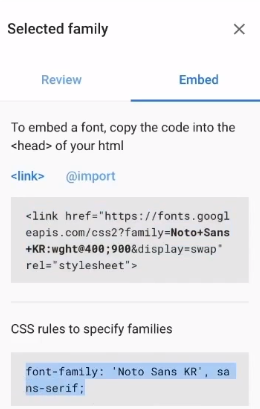
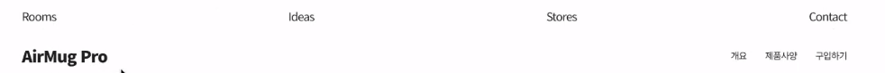

# Apple_Clonecoding

[toc]

>자바스크립트 문법은 ECMA2015(ES6) 기준으로 작성되었습니다.
>IE에서도 오류 없이 실행되는 이전 버전으로 변환하려면 자바스크립트 트랜스파일러인 Babel을 이용해야 하는데,
>Babel의 사용법이 궁금하시면 아래 링크의 영상을 참고하세요~
>https://youtu.be/VeK3a29x1hE
>
>[1분코딩사이트](https://studiomeal.com/)
>
>**모바일에서 보는 화면을 작성후 브라우저에서도 적용될 수 있게 만듦!(반대도 상관없음 개발자 도구에서 모바일 선택 후 보면서 하면됨)**
>
>첫 시작 html, default.css는 모든 값을 default 시켜주는 css
>
>```html
><!DOCTYPE html>
><html>
><head>
>	<meta charset="UTF-8">
>	<meta name="viewport" content="width=device-width, initial-scale=1.0">
>	<meta http-equiv="X-UA-Compatible" content="ie=edge">
>	<title>AirMug Pro</title>
>	<link rel="stylesheet" href="css/default.css">
></head>
><body>
>	
></body>
></html>
>```
>
>```css
>@charset 'utf-8';
>
>html {
>	font-family: 'Apple SD Gothic Neo', Roboto, 'Noto Sans KR', NanumGothic, 'Malgun Gothic', sans-serif;
>	line-height: 1.2;
>	word-wrap: break-word;
>}
>body {
>	-webkit-font-smoothing: antialiased;
>}
>html, body, div, span, applet, object, iframe,
>h1, h2, h3, h4, h5, h6, p, blockquote, pre,
>a, abbr, acronym, address, big, cite, code,
>del, dfn, em, img, ins, kbd, q, s, samp,
>small, strike, strong, sub, sup, tt, var,
>b, u, i, center,
>dl, dt, dd, ol, ul, li,
>fieldset, form, label, legend,
>table, caption, tbody, tfoot, thead, tr, th, td,
>article, aside, canvas, details, embed,
>figure, figcaption, footer, header, hgroup,
>menu, nav, output, ruby, section, summary,
>time, mark, audio, video {
>	margin: 0;
>	padding: 0;
>	border: 0;
>}
>article, aside, details, figcaption, figure, footer, header, hgroup, menu, nav, section {
>	display: block;
>}
>div, span, article, section, header, footer, aside, p, ul, li, fieldset, legend, label, a, nav, form {
>	box-sizing: border-box;
>}
>ol, ul, li {
>	list-style: none;
>}
>table {
>	border-collapse: collapse;
>	border-spacing: 0;
>}
>img {
>	max-width: 100%;
>	height: auto;
>	border: 0;
>}
>button {
>	border: 0;
>	background: transparent;
>	cursor: pointer;
>}
>```

## 폰트설정

> 구글 폰트 `noto sans KR(regular, black900)`
>
> link와 css rules 가져와서 사용
>
> 

- index.html

```html
<!DOCTYPE html>
<html>
<head>
	<meta charset="UTF-8">
	<meta name="viewport" content="width=device-width, initial-scale=1.0">
	<meta http-equiv="X-UA-Compatible" content="ie=edge">
	<title>AirMug Pro</title>
	<!-- google폰트 noto sans regular, black900을 가져옴 -->
	<link href="https://fonts.googleapis.com/css2?family=Noto+Sans+KR:wght@400;900&display=swap" rel="stylesheet">
	<!-- default.css는 default값으로 만든 css다 -->
	<link rel="stylesheet" href="css/default.css">
	<!-- 우리가 만든 적용할 css를 만들어줌 -->
	<link rel="stylesheet" href="css/main.css">
</head>
```

- main.css

```css
/* 만들어서 적용할 css */
@charset 'utf-8';
/* 폰트 sans폰트 가져오기 추가적으로 더 넣고싶으면 , 여기 그대로 넣으면 됨 */
html {
	font-family: 'Noto Sans KR', sans-serif;
	font-size: 14px;
}
```


## 메뉴(Navbar)

> [css flex 설명](https://studiomeal.com/archives/197)
>
> 
>
> 메뉴가 아래위 두개로 나뉘어져있고, 스크롤을 내리면 아래의 메뉴만 위에 고정돼있으며, 그 고정된 메뉴 뒤로는 블러처리가 된다.
>
> 

- `index.html`

```html
	<div class="container">
		<!-- 첫번째 nav, 전체 nav니까 global-nav -->
		<nav class="global-nav">
			<div class="global-nav-links">
				<a href="#" class="global-nav-item">Rooms</a>
				<a href="#" class="global-nav-item">Ideas</a>
				<a href="#" class="global-nav-item">Stores</a>
				<a href="#" class="global-nav-item">Contact</a>
			</div>
		</nav>
		<!-- 계속 따라올 nav! local-nav로 지정 -->
		<nav class="local-nav">
			<div class="local-nav-links">
				<a href="#" class="product-name">AirMug Pro</a>
				<a href="#">개요</a>
				<a href="#">제품사양</a>
				<a href="#">구입하기</a>
			</div>
		</nav>
```

- 위에 지정한 class값들을 `main.css`에 만들어주기

```css
/* 만들어서 적용할 css */
@charset 'utf-8';
/* 폰트 sans폰트 가져오기 */
html {
	font-family: 'Noto Sans KR', sans-serif;
	font-size: 14px;
}
body {
	/* 가로스크롤이 안생기게 설정 */
	overflow-x: hidden;
	/* apple 글자색과 같게 */
	color: rgb(29, 29, 31);
	/* 자간 줄임 */
	letter-spacing: -0.05em;
	/* 백그라운드 흰색 */
	background: white;
}
p {
	/* 문단 글자사이 거리 */
	line-height: 1.6;
}
/* a태그 글자색, text-decoration none은 밑줄 없앰 */
a {
	color: rgb(29, 29, 31);
	text-decoration: none;
}

body.before-load {
	overflow: hidden;
}
.container {
	/* iPhone 가로 스크롤 방지 */
	overflow-x: hidden;
}
.global-nav {
	position: absolute;
	top: 0;
	left: 0;
	z-index: 10;
	width: 100%;
	/* nav높이 44px(애플 직접 재봄) */
	height: 44px;
	padding: 0 1rem;
}
.local-nav {
	position: absolute;
	top: 45px;
	left: 0;
	z-index: 11;
	width: 100%;
	height: 52px;
	padding: 0 1rem;
	border-bottom: 1px solid #ddd;
}
.local-nav-sticky .local-nav {
	position: fixed;
	top: 0;
	background: rgba(255, 255, 255, 0.1);
	/* for iPhone */
	-webkit-backdrop-filter: saturate(180%) blur(15px);
	-moz-backdrop-filter: saturate(180%) blur(15px);
	-o-backdrop-filter: saturate(180%) blur(15px);
	backdrop-filter: saturate(180%) blur(15px);
}
/* 두개 겹치니까 공통으로 씀 */
.global-nav-links,
.local-nav-links {
	display: flex;
	/* main방향의 수직방향 중간 */
	align-items: center;
	/* 최대 width가 1000px로 지정 브라우저 크기가 그것보다 작아지면 그것에 맞게 작아지면되는데 더 커지지는 않게! */
	max-width: 1000px;
	/* 알아서 부모만큼 높이가 늘어나게 100%로 지정 */
	height: 100%;
	/* 중간으로 정렬해줘야되니까 0, 왼쪽오른쪽 auto */
	margin: 0 auto;
}
.global-nav-links {
	/* 이건 global에만 주면됨 왜냐면 global nav는 균일하게 띄어져있지만 local nav는 로고만 왼쪽, 나머지메뉴는 오른쪽에 붙어있음 */
	justify-content: space-between;
}
/* local nav의 로고 */
/* 이렇게 부모도 적어준 이유는 .product-name이라고 적으면 local-nav-links a 보다 우선순위가 낮기때문에 부모클래스 아래의 적용할 클래스를 적어줌 */
/* a그냥 태그 이름보다 클래스이름이 우선순위가 더 높음 */
.local-nav-links .product-name {
	/* 오른쪽 margin auto를 하면 margin 오른쪽을 다써서 나머지 메뉴들을 오른쪽에 붙임 */
	margin-right: auto;
	/* 이건 로고니까 폰트사이즈 더 크게함 */
	font-size: 1.4rem;
	/* 굵게 */
	font-weight: bold;
}
/* a태그인 local-nav-link에 적용,  */
.local-nav-links a {
	/* 폰트사이즈를 얘만 좀 줄임 */
	font-size: 0.8rem;
}
/* not은 class가 product-name을 제외하고, margin-left적용 */
.local-nav-links a:not(.product-name) {
	margin-left: 2em;
}
```


## scroll-section

> 
>
> 스크롤을 할 떄 처음과 끝의 section에서 각 0,1,2,3 구간의 값(스크롤높이)을 정하고 해당 스크롤이 시작될때만 애니메이션이 적용되고 나머지 영역은 실행안되고 있어야 부하가 덜걸림
>
> 스크롤 높이의 크기에 따라 속도가 빠르고 느림을 적용할 수 있다
>
> 비디오의 재생시간, 프레임수 등의 정보가 있어야됨
>
> text를 넣는 타이밍에 대한 정보
>
> 이 모든 정보들을 한배열에 넣어둘거다
>
> 배열의 정보만 보면 알아보고싶고, 관리하기 쉽기 때문

### rem VS em VS vw(vh..)

> *fontsize는 rem으로 하고, margin, heghit은 em으로 하는 이유?*
>
> *em은 현재 내 폰트 사이즈(rem)의 몇배가 적용됨,* 
>
>  *만약 em을 rem으로 바꾸면 root(14px)의 몇배가 적용됨 내가 원하는건 현재 내 폰트에 비례한 사이즈를 적용하길 원하기 때문에 em을 씀* 
>
>  *0.2em은 storng의 폰트사이즈의 0.2배 정도로 오른쪽에 margin을 주고싶어서 em을 사용함* 
>
> *1rem이 14px 3rem(14\*3=42px)거기에 0.2배는 8.4px*
>
> *폰트사이즈가 브라우저 크기에 비례해서 달라지기 위해 vw(윈도우 사이즈의 9퍼센트크기)*
>
> *vw은 창크기에 따라 따라가겠다라는 의도, rem은 창의크기가 어떻든 어느정도 크기 제한을 하겠다란 의도로 사용* 
>
> *apple에서는 보통 title들을 vw로 함*

### position fixed vs sticky

> sticky는 IE에서 11에서도 지원을 안함, 최소 상업용 사이트라면 11에서는 적용할 수 있게 만드는게 좋기 때문에 fixed를 사용
>
> 애플은 IE에서는 정적인 이미지로 작동하고, 고급진 이미지처리는 크롬, 사파리, 파이어폭스에서 볼 수 있음
>
> 

### load vs DOMContentLoaded

> *'load'vs 'DOMContentLoaded', 둘차이는 load는 웹페이지 이미지,리소스 등 모두 로딩되고나서 실행, DOM은 html객체 돔구조가 로드되면 실행, 보통 이걸 많이 쓰지만 우리는 현재 이미지와 같은것이 다 로드되고 실행돼야 의미가 있어서 load사용*