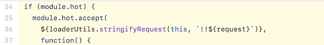

# 프론트엔드개발환경

[toc]

## 1. NPM

> [프론트엔드 개발환경의 이해 : NPM](https://jeonghwan-kim.github.io/series/2019/12/09/frontend-dev-env-npm.html)

### 1) 프론트엔드 개발에 Node.js가 필요한 이유?

- 최신 스펙으로 개발할 수 있다.
  - 자바스크립트 발전 > 브라우저 지원 속도
  - 웹팩, NPM 같은 노드 기술로 만들어진 환경에서 사용할 때 비로소 자동화된 프론트엔드 개발환경을 갖출 수 있다.
  - Typescript, SASS 또한 Node.js 환경이 뒷받침 되어야 된다.
- 빌드 자동화
  - 파일을 압축하고, 코드를 난독화하고, 폴리필을 추가하는 등 개발 이외의 작업을 거친 후 배포한다.
  - Node.js는 이런 빌드과정을 이해하게 하고, 라이브러리 의존성을 해결하고, 각종 테스트를 자동화하는데 사용된다.
- 개발 환경 커스터마이징
  - 커스터마이징을 하려면 Node.js 지식이 필요하다
  - Vue.js의 vue-cli, React.js의 CRA(create-react-app)를 사용하면 개발환경을 쉽게 갖출 수 있지만, 자동화된 도굴르 사용할 수 없는 환경이라면 직접 환경을 구축해야한다.

### 2) Node.js 설치

-  [Nodejs.org 사이트](https://nodejs.org/ko/)에서 노드 최신 버전을 설치가 가능하다.
- 짝수버전 : 안정적, 신뢰도 높음(LTS)
- 홀수버전 : 최신기능
- 개발환경이기 때문에 오른쪽 최신 버전을 선택해서 다운, Node.js로 서버를 구성하는 경우라면 어떤 버전을 사용할지 신중하게 선택(LTS)
- 터미널에 `node`를 치면 node.js를 쓸 수 있는`REPL(read-eval-print loop)` 프로그램이 실행됨
  - `.exit` 명령을 실행하거나 `ctrl + c`를 연속 두 번 입력하면 REPL 프로그램에서 빠져 나올 수 있다.


- Node를 설치하면 npm도 같이 설치된다.

### 3) 프로젝트 초기화

#### init

- `sample`폴더를 만든 뒤, 터미널에 `npm init`을 하면 프로젝트가 새로 생성된다.

```sh
$ npm init

package name:
version:
description:
entry point:
test command:
git repository:
keywords:
author:
license:
```

- 패키지 이름, 버전 등 프로젝트와 관련한 몇 가지 정보를 얻기 위한 질문을 볼 수 있다. 
- 답변하거나 혹은 빈 칸으로 남겨 두면 괄호 안의 기본값을 입력할 수 있다. 
- 모든 질문에 답하면 명령어를 실행한 폴더에 pacakge.json 파일이 생성된다. 
- 모두 기본값을 사용할 것이라면 `npm init -y` 명령어로 질문을 스킵하고 package.json 파일을 생성할 수 있다.

#### Package.json

- name: 프로젝트 이름
- version: 프로젝트 버전 정보
- description: 프로젝트 설명
- main: 노드 어플리케이션일 경우 진입점 경로. 프론트엔드 프로젝트일 경우 사용하지 않는다.
- scripts: 프로젝트 명령어를 등록할 수 있다.초기화시 test 명령어가 샘플로 등록되어 있다
- author: 프로그램 작성자
- license: 라이센스

```json
{
  "name": "sample",
  "version": "1.0.0",
  "description": "",
  "main": "index.js",
    // npm 명령어를 추가할 수 있다, 기본적으로 제공해주는 명령어 외에 추가하고 싶다면, scripts안에 추가!
  "scripts": {
    "test": "echo \"Error: no test specified\" && exit 1",
      // 명령어추가
     "build" : "echo \"여기에 빌드 스크립트를 추가합니다\""
  },
  "author": "",
  "license": "ISC"
}
```

### 4) 프로젝트 명령어

- 기본적으로 제공해주는 명령어외에 추가하고 싶다면 `scripts`안에 추가한 뒤, `npm run 명령어`를 터미널창에 치면, 실행된다.
- test: echo 명령어로 메세지 "Error: no test specified"를 출력한뒤 에러 코드 1을 던지면서 종료하는 동작이다. 에러 코드 1을 확인하면 에러("npm ERR!...")를 출력한다.


#### NPM 명령어

- start: 어플리케이션 실행
- test: 테스트
- install: 패키지 설치
- uninstall: 패키지 삭제
- 프론트엔드 개발 환경을 구축하기 위해 추가할 스크립트는 build, lint 정도가 있다.
  - build: 소스 빌드
  - lint: 소스 컨벤션 검사

```sh
Usage: npm <command>

where <command> is one of:
    access, adduser, audit, bin, bugs, c, cache, ci, cit,
    clean-install, clean-install-test, completion, config,
    create, ddp, dedupe, deprecate, dist-tag, docs, doctor,
    edit, explore, get, help, help-search, hook, i, init,
    install, install-ci-test, install-test, it, link, list, ln,
    login, logout, ls, org, outdated, owner, pack, ping, prefix,
    profile, prune, publish, rb, rebuild, repo, restart, root,
    run, run-script, s, se, search, set, shrinkwrap, star,
    stars, start, stop, t, team, test, token, tst, un,
    uninstall, unpublish, unstar, up, update, v, version, view,
    whoami
```

### 5) 패키지 설치

#### CDN(컨텐츠 전송 네트워크)을 이용한 방법

- CDN 서버 장애로 인해 외부 라이브러리를 사용할 수 없다면  웹 어플리케이션은 정상적으로 동작하지 않을 것이다

#### 직접 다운로드하는 방법

- CDN을 사용하지 않기 때문에 장애와 독립적으로 웹 어플리케이션을 제공.

- 라이브러리는 계속해서 업데이트 될 것이고 우리 프로젝트에서도 최신 버전으로 교체해야 한다. 매번 직접 다운로드해야하며, 버전에 따라 하위 호환성 여부까지 확인하려면 실수할 여지가 많다.

#### NPM을 이용한 방법

- `npm install` 명령어로 외부 패키지를 우리 프로젝트 폴더에 다운로드가 된다.

```sh
$ npm install react
```

- 최신 버전의 react를 [NPM 저장소](https://www.npmjs.com/)에서 찾아 우리 프로젝트로 다운로드 하는 명령어다. package.json에는 설치한 패키지 정보를 기록한다.

- package.json:

```json
{
  "dependencies": {
   // 버전 16.12.0을 설치했다는 의미 
     "react": "^16.12.0"
  }
}
```

##### `^` : 유의적 버전

- 만약 프로젝트에서 사용하는 패키지의 버전을 엄격하게 제한한다면 사용하는 패키지를 전부 버전업해야 하기 때문에 프로젝트 버전업이 힘들 수 있고, 현재 버전에 갖혀 버릴 수도 있다.
- 반면에, 패키지 버전을 느슨하게 풀어 놓으면 오히려 여러 버전별로 코드를 관리해야하는 혼란스러움을 겪게될 수 있다.
- 버전번호를 관리하기 위한 규칙 **유의적 버전(Semetic-Version)** 이라고 한다.
- 유의적 버전은 주(Major), 부(Minor), 수(Patch) 세 가지 숫자를 조합해 버전을 관리한다.
  - 16.12.0 : 주 버전이 16, 부 버전이 12, 수 버전이 0이다.
  - 주 버전(Major Version): 기존 버전과 호환되지 않게 변경한 경우
  - 부 버전(Minor version): 기존 버전과 호환되면서 기능이 추가된 경우
  - 수 버전(Patch version): 기존 버전과 호환되면서 버그를 수정한 경우

#### 버전의 범위

- NPM이 버전을 관리하는 방식은 유의적 버전 명세 뿐만아니라 버전의 범위를 자신만의 규칙으로 관리
- 특정 버전보다 높거나 낮을 경우

```sh
>1.2.3
>=1.2.3
<1.2.3
<=1.2.3
```

- 틸드(`~`)와 캐럿(`^`)

  ##### 틸드(`~`)

  - 마이너 버전이 명시되어 있으면 패치버전만 변경
  - 예를 들어 ~1.2.3 표기는 1.2.3 부터 1.3.0 미만 까지를 포함한다. 
  - 마이너 버전이 없으면 마이너 버전을 갱신한다. ~0 표기는 0.0.0부터 1.0.0 미만 까지를 포함한다.

  ##### 캐럿(`^`)

  - 정식버전에서 마이너와 패치 버전을 변경한다. 
  - 예를 들어 ^1.2.3 표기는 1.2.3부터 2.0.0 미만 까지를 포함한다. 
  - 정식버전 미만인 0.x 버전은 패치만 갱신한다. ^0 표기는 0.0.0부터 0.1.0 미만 까지를 포함한다.

- 보통 라이브러리 정식 릴리즈 전에는 패키지 버전이 수시로 변한다.
  - 부버전이 변하더라도 하위 호환성을 지키지 않고 배포하는 경우가 빈번하다
  - `~0`으로 버전 범위를 표기하면 `0.0.0`부터 `1.0.0`미만까지 사용하기 때문에 하위 호완성을 지키지 못하는 `0.2`로도 업데이트 되어버리는 문제가 생길 수 있다.
  - 반면 `^0.0`으로 표기한다면 `0.0.0`부터 `0.1.0` 미만 내에서만 버전을 사용하도록 제한해 하위 호완성을 유지할 수 있다.
- NPM으로 패키지를 설치하면 `package.json`에 설치한 버전을 기록하는데 **캐럿 방식**을 이용한다.


## 2.  웹팩

> [프론트엔드 개발환경의 이해 : 웹팩](https://jeonghwan-kim.github.io/series/2019/12/10/frontend-dev-env-webpack-basic.html)

### 1) 웹팩이 필요한 이유

이전에는 

`math.js`

```js
function sum(a, b) {
  return a + b
} // 전역 공간에 sum이 노출
```

`app.js`

```js
sum(1, 2) // 3
```

위 코드는 모두 하나의 HTML 파일 안에서 로딩해야만 실행된다. 

`index.html`

```html
<!DOCTYPE html>
<html lang="en">
<head>
  <meta charset="UTF-8">
  <meta http-equiv="X-UA-Compatible" content="IE=edge">
  <meta name="viewport" content="width=device-width, initial-scale=1.0">
  <title>Document</title>
</head>
<body>
  <script src="src/math.js"></script>
  <script src="src/app.js"></script>
</body>
</html>
```

math.js가 로딩되면 app.js는 이름 공간에서 'sum'을 찾은 뒤 이 함수를 실행한다. 문제는 'sum'이 전역 공간에 노출된다는 것. 다른 파일에서도 'sum'이란 이름을 사용한다면 충돌한다.


자바스크립트는 아래처럼 sum에 접근할 수 있고, 자바스크립트는 이런 함수 타입에 다른 값을 할당 할 수 있다. 할당한 뒤, 다시 sum함수를 호출하면 이렇게 타입에러가 발생한다. 이렇게 전역 스코프가 오염되면 어플리케이션이 예측을 할 수 없게 되고  **런타임에러가 발생한다.**


이런 문제를 해결하기 위해 **IIFE방식(즉시 실행 함수 표현)의 모듈을 사용한다.**

#### 1) IIFE 방식의 모듈

이러한 문제를 예방하기 위해 스코프를 사용한다. **함수 스코프를 만들어 외부에서 안으로 접근하지 못하도록 공간을 격리하는 것**이다. 스코프 안에서는 자신만의 이름 공간이 존재하므로 스코프 외부와 이름 충돌을 막을 수 있다.

`math.js`

```js
var math = math || {} // math 네임스페이스

;(function () {
  function sum(a, b) {
    return a + b
  }
  math.sum = sum // 네이스페이스에 추가
})()
```

같은 코드를 즉시실행함수로 감쌌기 때문에 다른 파일에서 이 안으로 접근할 수가 없다. 심지어 같은 파일일지라도 말이다. 자바스크립트 함수 스코프의 특징이다. 'sum'이란 이름은 즉시실행함수 안에 감추어졌기 때문에 외부에서는 같은 이름을 사용해도 괜찮다. 전역에 등록한 'math'라는 이름 공간만 잘 활용하면 된다.

`app.js`

```javascript
console.log(math.sum(1,2));
```


#### 2) 다양한 모듈 스펙

이러한 방식으로 자바스크립트 모듈을 구현하는 대표적인 명세가 AMD와 CommonJS다.

**[CommonJS](http://www.commonjs.org/)**는 자바스크립트를 사용하는 모든 환경에서 모듈을 하는 것이 목표다. exports 키워드로 모듈을 만들고 **require()** 함수로 불러 들이는 방식이다. 대표적으로 서버 사이드 플래폼인 Node.js에서 이를 사용한다.

`math.js`:

```js
exports function sum(a, b) { return a + b; }
```

`app.js`:

```js
const math = require("./math.js")
math.sum(1, 2) // 3
```

**[AMD](https://github.com/amdjs/amdjs-api/wiki/AMD)**(Asynchronous Module Definition)는 비동기로 로딩되는 환경에서 모듈을 사용하는 것이 목표다. 주로 브라우져 환경이다.

**[UMD](https://github.com/umdjs/umd)**(Universal Module Definition)는 AMD기반으로 CommonJS 방식까지 지원하는 통합 형태다.

이렇게 각 커뮤니티에서 각자의 스펙을 제안하다가 **[ES2015에서 표준 모듈 시스템](https://developer.mozilla.org/en-US/docs/Web/JavaScript/Reference/Statements/import)**을 내 놓았다. 지금은 바벨과 웹팩을 이용해 모듈 시스템을 사용하는 것이 일반적이다. 

##### ES2015 모듈 시스템

math.js:

```js
export function sum(a, b) {
  return a + b
}
```

app.js:

> `*`는 math안의 모두를 가져온다. sum만 가져오고 싶다면 `import {sum} from './math.js'`라고 쓰면 된다

```js
import * as math from "./math.js" 
math.sum(1, 2) // 3
```

`export` 구문으로 모듈을 만들고 `import` 구문으로 가져올 수 있다.

#### 3) 브라우져의 모듈 지원

모든 브라우져에서 모듈 시스템을 지원하지는 않는다. 인터넷 익스플로러를 포함한 몇 몇 브라우져에서는 여전히 모듈을 사용하지 못한다. 가장 많이 사용하는 크롬 브라우져만 잠시 살펴보자. ([버전 61부터 모듈시스템을 지원](https://developers.google.com/web/updates/2017/09/nic61#modules) 한다)

`index.html`:

```html
<script type="module" src="app.js"></script>
```

> `<script>`태그로 로딩할 때 type="text/javascript" 대신 type="module"을 사용한다. app.js는 모듈을 사용할 수 있다.
>
> 이렇게 모듈로 한 뒤 터미널에 `open index.html`을 하면 `CORS`에러가 난다.
>
> 브라우저가 바로 파일을 읽지 않고 서버를 돌려야한다.
>
> `lite-server`는 node패키지인데 `npx lite-server`를 하면 해당 파일을 서버를 간단하게 돌릴 수 있다.

그러나 브라우져에 무관하게 모듈을 사용하고 싶다면 이제 웹팩이 나올 차례다.

### 2) 엔트리/아웃풋

> [웹팩](https://webpack.js.org/)은 여러개 파일을 하나의 파일로 합쳐주는 번들러(bundler)다. 
>
> 하나의 시작점(entry point)으로부터 의존적인 모듈을 전부 찾아내서 하나의 결과물을 만들어 낸다. app.js부터 시작해 math.js 파일을 찾은 뒤 하나의 파일로 만드는 방식이다.

번들 작업을 하는 [webpack](https://github.com/webpack/webpack) 패키지와 웹팩 터미널 도구인 [webpack-cli](https://github.com/webpack/webpack-cli)를 설치한다.

> 웹팩 버전을 설정해주려면 `webpack@4`(4버전으로 설치하겠다)라고 명시해주면 된다.

```text
$ npm install -D webpack webpack-cli
```

설치 완료하면 `node_modules/.bin` 폴더에 실행 가능한 명령어가 몇 개 생긴다. 

webpack과 webpack-cli가 있는데 둘 중 하나를 실행하면 된다.

#####  `--help` 옵션으로 사용 방법

```text
$ node_modules/.bin/webpack --help

  --mode                 Enable production optimizations or development hints.
                                     [선택: "development", "production", "none"]
  --entry      The entry point(s) of the compilation.                   [문자열]
  --output, -o                  The output path and file for compilation assets
```

`--mode`, `--entry`, `--output` 세 개 옵션만 사용하면 코드를 묶을 수 있다.

```text
$ node_modules/.bin/webpack --mode development --entry ./src/app.js --output dist/main.js
```

- `--mode`는 웹팩 실행 모드는 의미하는데 개발 버전인 `development`를 지정한다
- `--entry`는 시작점 경로를 지정하는 옵션이다
- `--output`은 번들링 결과물을 위치할 경로다

위 명령어를 실행하면 dist/main.js에 번들된 결과가 저장된다.

> `--help` 해본 결과 `--output-path`가 웹팩 번들 결과가 저장되는 path를 설정하는 명령어였다.

이 코드를 index.html에 로딩하면 번들링 전과 똑같은 결과를 만든다.

index.html:

```html
<script src="dist/main.js"></script>
```

옵션 중 `--config` 항목을 보자.

```text
$ node_modules/.bin/webpack --help

  --config               Path to the config file
                         [문자열] [기본: webpack.config.js or webpackfile.js]
```

이 옵션은 웹팩 설정파일의 경로를 지정할 수 있는데 기본 파일명이 `webpack.config.js` 혹은 webpackfile.js다. `webpack.config.js` 파일을 만들어 방금 터미널에서 사용한 옵션을 코드로 구성해 보자.

webpack.config.js:

```js
const path = require("path") // path 절대경로를 가져온다.

module.exports = {
  mode: "development",
  entry: {
    main: "./src/app.js",
  },
  output: {
    filename: "[name].js",
    path: path.resolve("./dist"),
  },
}
```

터미널에서 사용한 옵션인 mode, entry, ouput을 설정한다.

- `mode`는 'development' 문자열을 사용했다.
- `entry`는 어플리케이션 진입점인 src/app.js로 설정한다.
- `ouput`에 설정한 '[name]'은 entry에 추가한 main이 문자열로 들어오는 방식이다.
  - `output.path`는 절대 경로를 사용하기 때문에 path 모듈의 resolve() 함수를 사용해서 계산했다. (path는 노드 코어 모듈 중 하나로 경로를 처리하는 기능을 제공한다)

웹팩 실행을 위한 NPM 커스텀 명령어를 추가한다.

`package.json`:

```json
{
  "scripts": {
    "build": "webpack" //  현재 프로젝트 있는 webpack파일을 읽어 실행함
  }
}
```

모든 옵션을 웹팩 설정 파일로 옮겼기 때문에 단순히 webpack 명령어만 실행한다. 이제부터는 `npm run build`로 웹팩 작업을 지시할 수 있다.


#### 실습

##### (1) 웹팩으로 빌드한 자바스크립트 로딩

1. 터미널에 `npm init -y`를 입력한다. (기본값을 다 사용해서 package.json 파일을 만든다.)
2. webpack 패키지를 설치한다. `npm install -D webpack webpack-cli`
3. package.json 파일에서 scripts에 build 명령어를 `webpack`으로 설정한다.

```json
{
  "scripts": {
    "build": "webpack"
  }
}
```

3. `webpack.config.js`파일을 프로젝트 상단에 만든다.

> ES6가 아니라 node가 사용하는 모듈시스템이라 `module.exports`를 쓴다는 것을 유념해야된다.

```javascript
const path = require('path');

module.exports = {
    mode: 'development',
    entry: {
        main: './src/app.js'
    },
    output: {
        filename: '[name].js',
        path: path.resolve('./dist')
    }
}
```

4. 터미널에 `npm run build`를 실행한다.
5. dist 폴더에 `main.js` 파일에 번들링 된 결과가 나온다. 해당 파일을 `index.html`에 로딩을 하면 된다.

```html
<body>
    <script src="./dist/main.js"></script>
</body>
```

6. 그리고 터미널에 `open index.html`을 통해 index파일을 연다


### 3) 로더

#### (1) 로더의 역할

웹팩은 모든 파일을 모듈로 바라본다. 자바스크립트로 만든 모듈 뿐만아니라 스타일시트, 이미지, 폰트까지도 전부 모듈로 보기 때문에 import 구문을 사용하면 자바스크립트 코드 안으로 가져올수 있다.

이것이 가능한 이유는 웹팩의 **로더** 덕분이다. 로더는 타입스크립트 같은 다른 언어를 자바스크립트 문법으로 변환해 주거나 이미지를 data URL 형식의 문자열로 변환한다. 뿐만아니라 CSS 파일을 자바스크립트에서 직접 로딩할수 있도록 해준다.

#### (2) 커스텀 로더 만들기

로더를 사용하기 전에 동작 원리를 이해하기 위해 로더를 직접 만들어 보자.

`my-webpack-loader.js`:

```js
module.exports = function myWebpackLoader(content) {
  console.log("myWebpackLoader가 동작함");
  return content;
}
```

함수로 만들수 있는데 로더가 읽은 파일의 내용이 함수 인자 content로 전달된다. 로더가 동작하는지 확인하는 용도로 로그만 찍고 곧장 content를 돌려 준다.

로더를 사용하려면 웹팩 설정파일의 `module` 객체에 추가한다.

`webpack.config.js`:

```js
module: {
  rules: [{
    test: /\.js$/, // .js 확장자로 끝나는 모든 파일에 이 로더를 적용하겠다.
    use: [
        path.resolve('./my-webpack-loader.js')
    ] // 방금 만든 로더를 적용한다
  }],
}
```

`module.rules` 배열에 모듈을 추가하는데 test와 use로 구성된 객체를 전달한다.

- `test`
  - 로딩에 적용할 파일을 지정한다. 
  - 파일명 뿐만아니라 파일 패턴을 정규표현식으로 지정할수 있는데 위 코드는 `.js` 확장자를 갖는 모든 파일을 처리하겠다는 의미다.

- `use`
  - 이 패턴에 해당하는 파일에 적용할 로더를 설정하는 부분이다. 
  - 방금 만든 `myWebpackLoader` 함수의 경로를 지정한다.

이제 `npm run build`로 웹팩을 실행해 보자.


터미널에 'myWebpackLoader가 동작함' 문자열이 찍힌다. `myWebpackLoader()` 함수가 동작한 것이다.

두 번 찍히는 이유는 모든 js파일마다 로더가 한번씩 실행되게 했기 때문에 app.js와 math.js에서 두번 실행되기 때문이다.

빌드결과를 살펴보면 이전과 동일하다. 로더가 뭔가를 처리하기 위해서 간단한 변환 작업을 추가해 보자. 소스에 있는 모든 console.log() 함수를 alert() 함수로 변경하도록 말이다.

`my-webpack-loader.js`:

```js
module.exports = function myWebpackLoader(content) {
  console.log("myWebpackLoader가 동작함");
  return content.replace("console.log(", "alert("); // console.log( -> alert( 로 치환
}
```

빌드후 확인하면 다음과 같이 console.log() 함수가 alert() 함수로 변경되었다.


### 4) 자주 사용하는 로더

로더의 동작 원리를 살펴 보았으니 이번에는 몇몇 자주 사용하는 로더를 소개하겠다.

#### (1) css-loader

웹팩은 모든것을 모듈로 바라보기 때문에 자바스크립트 뿐만 아니라 스타일시트로 import 구문으로 불러 올수 있다.

`app.js`:

```js
import "./style.css"
```

`style.css`:

```css
body {
  background-color: green;
}
```

CSS 파일을 자바스크립트에서 불러와 사용하려면 CSS를 모듈로 변환하는 작업이 필요하다. [css-loader](https://github.com/webpack-contrib/css-loader)가 그러한 역할을 하는데 우리 코드에서 CSS 파일을 모듈처럼 불러와 사용할 수 있게끔 해준다.

먼저 로더를 설치 하자.

```text
$ npm install -D css-loader
```

웹팩 설정에 로더를 추가한다.

`webpack.config.js`:

```js
module.exports = {
  module: {
    rules: [
      {
        test: /\.css$/, // .css 확장자로 끝나는 모든 파일
        use: ["css-loader"], // css-loader를 적용한다
      },
    ],
  },
}
```

웹팩은 엔트리 포인트부터 시작해서 모듈을 검색하다가 CSS 파일을 찾으면 css-loader로 처리할 것이다. use.loader에 로더 경로를 설정하는 대신 배열에 로더 이름을 문자열로 전달해도 된다.

빌드 한 결과 CSS코드가 자바스크립트로 변환된 것을 확인할 수 있다.


그런데 index.html을 열어보면 배경이 초록으로 적용이 안됐다.

html 코드가 DOM이라는 모습으로 변환되어야 브라우저에서 문서가 보이듯, css코드도 css om이라는 형태로 바뀌어야 적용된다.

#### (2) style-loader

모듈로 변경된 스타일 시트는 돔에 추가되어야만 브라우져가 해석할 수 있다. css-loader로 처리하면 자바스크립트 코드로만 변경되었을 뿐 돔에 적용되지 않았기 때문에 스트일이 적용되지 않았다.

[style-loader](https://github.com/webpack-contrib/style-loader)는 **자바스크립트로 변경된 스타일을 동적으로 돔에 추가하는 로더**이다. CSS를 번들링하기 위해서는 css-loader와 style-loader를 **함께** 사용한다.

먼저 스타일 로더를 다운로드 한다.

```text
$ npm install -D style-loader
```

그리고 웹팩 설정에 로더를 추가한다.

`package.json`:

```js
module.exports = {
  module: {
    rules: [
      {
        test: /\.css$/,
        use: ["style-loader", "css-loader"], // style-loader를 앞에 추가한다
      },
    ],
  },
}
```

배열로 설정하면 **뒤에서부터 앞으로 순서대로 로더가 동작**한다. 위 설정은 모든 .css 확장자로 끝나는 모듈을 읽어 들여 css-loader를 적용하고 그 다음 style-loader를 적용한다.




#### (3) file-loader

CSS 뿐만 아니라 소스코드에서 사용하는 모든 파일을 모듈로 사용하게끔 할 수 있다. 파일을 모듈 형태로 지원하고 웹팩 아웃풋에 파일을 옮겨주는 것이 [file-loader](https://github.com/webpack-contrib/file-loader)가 하는 일이다. 가령 CSS에서 url() 함수에 이미지 파일 경로를 지정할 수 있는데 웹팩은 file-loader를 이용해서 이 파일을 처리한다.

`style.css`:

```css
body {
  background-image: url(bg.png);
}
```

배경 이미지를 bg.png 파일로 지정했다.

웹팩은 엔트리 포인트인 app.js가 로딩하는 style.css 파일을 읽을 것이다. 그리고 이 스타일시트는 url() 함수로 bg.png를 사용하는데 이때 로더를 동작시킨다.

`webpack.config.js`:

```js
module.exports = {
  module: {
    rules: [
      {
        test: /\.png$/, // .png 확장자로 마치는 모든 파일
        loader: "file-loader", // 파일 로더를 적용한다
      },
    ],
  },
}
```

웹팩이 .png 파일을 발견하면 file-loader를 실행할 것이다. 로더가 동작하고 나면 아웃풋에 설정한 경로로 이미지 파일을 복사된다. 아래 그림처럼 파일명이 해쉬코드로 변경 되었다. 웹팩은 빌드를 할 때마다 유니크한 값을 생성하는데 그게 앞에 있는 이 해쉬값이다. 캐쉬 갱신을 위한 처리로 보인다. 파일 내용이 다른데 이름이 같으면 이전 값을 브라우저가 사용하기 때문에 이런 것을 예방하는 방법 중 하나가 이름을 변경하는 것이다.


하지만 이대로 index.html 파일을 브라우져에 로딩하면 이미지를 제대로 로딩하지 못할 것이다. CSS를 로딩하면 `background-image: url(bg.png)` 코드에 의해 동일 폴더에서 이미지를 찾으려고 시도할 것이다. 그러나 웹팩으로 빌드한 이미지 파일은 output인 dist 폴더 아래로 이동했기 때문에 이미지 로딩에 실패할 것이다.

file-loader 옵션을 조정해서 경로를 바로 잡아 주어야 한다.

```js
module.exports = {
  module: {
    rules: [
      {
        test: /\.png$/, // .png 확장자로 마치는 모든 파일
        loader: "file-loader",
        options: {
          publicPath: "./dist/", // prefix를 아웃풋 경로로 지정
          name: "[name].[ext]?[hash]", // 파일명 형식
        },
      },
    ],
  },
}
```

- `publicPath` 옵션
  -  file-loader가 처리하는 파일을 모듈로 사용할 때 경로 앞에 추가되는 문자열이다. 
  - output에 설정한 'dist' 폴더에 이미지 파일을 옮길 것이므로 publicPath 값을 이것으로로 지정했다. 
  - 파일을 사용하는 측에서는 'bg.png'를 'dist/bg.png'로 변경하여 사용할 것이다.

- `name` 옵션
  - 이것은 로더가 파일을 아웃풋에 복사할때 사용하는 파일 이름이다. 
  - hash는 매번 달라지는 hash값으로 변경되도록 설정했다.
  - 기본적으로 설정된 해쉬값을 쿼리스트링으로 옮겨서 'bg.png?6453a9c65953c5c28aa2130dd437bbde' 형식으로 파일을 요청하도록 변경했다.


이렇게 스타일시트에서 불러온 파일이 동작한다.


#### (4) url-loader

사용하는 이미지 갯수가 많다면 네트웍 리소스를 사용하는 부담이 있고 사이트 성능에 영향을 줄 수도 있다. **만약 한 페이지에서 작은 이미지를 여러 개 사용한다면** [Data URI Scheme](https://en.wikipedia.org/wiki/Data_URI_scheme)을 이용하는 방법이 더 나은 경우도 있다. 이미지를 Base64로 인코딩하여 문자열 형태로 소스코드에 넣는 형식이다.

[url-loader](https://github.com/webpack-contrib/url-loader)는 이러한 처리를 자동화해준다.

- `app.js`

```javascript
import './style.css';
import nyancat from './nyancat.jpg';

document.addEventListener('DOMContentLoaded',() => {
    document.body.innerHTML = `
		`
})
```

이렇게 하면 build를 할 때 저장이 된다.


하지만 작은 파일은 `url-loader`를 사용하는 것이 좋다.

먼저 로더를 설치한다.

```text
$ npm install -D url-loader
```

그리고 웹팩 설정을 추가한다.

 `webpack.config.js`:

```js
{
  test: /\.(png|jpg|gif|svg)$/,
  use: {
    loader: 'url-loader', // url 로더를 설정한다
    options: {
      publicPath: './dist/', // file-loader와 동일
      name: '[name].[ext]?[hash]', // file-loader와 동일
      limit: 5000 // 5kb 미만 파일만 data url로 처리
    }
  }
}
```

file-loader와 옵션 설정이 거의 비슷하고 마지막 `limit` 속성만 추가했다. 모듈로 사용한 파일중 크기가 5kb 미만인 파일만 url-loader를 적용하는 설정이다. 만약 이보다 크면 file-loader가 처리하는데 옵션 중 [fallback](https://github.com/webpack-contrib/url-loader#options) 기본값이 file-loader이기 때문이다.

**빌드 결과를 보면 small.png 파일이 문자열로 변경되어 있는 것을 확인 할 수 있다. 반면 5kb 이상인 bg.png는 여전히 파일로 존재한다.**


브라우저에서도 확인하면 스타일스트에 small.png가 Data url형태로 변환되어 있다.


아이콘처럼 용량이 작거나 사용 빈도가 높은 이미지는 파일을 그대로 사용하기 보다는 Data URI Scheeme을 적용하기 위해 url-loader를 사용하면 좋다.


#### 실습

##### css파일을 엔트리포인트(app.js)에서 로딩, 웹팩에서 로딩할수 있도록 로더를 설정해야된다.

1. css 파일을 웹팩에서 로딩하기 위해 보통 style-loader와 css-loader가 필요하다.

```sh
$ npm install style-loader css-loader
```

2. `webpack.config.js`

```javascript
const path = require('path');

module.exports = {
    mode:'development',
    entry: {
        main:'./src/app.js'
    },
    output: {
        filename: '[name].js'm
        path: path.resolve.('./dist'),
    },
    // 로더를 등록할 때는 모듈 객체를 추가
    module: {
        rules: [
            {
                test: /\.css$/,
                use: ['style-loader','css-loader'] // 순서가 중요!(css-loader를 먼저 쓰고, style-loader를 쓴다.)
            }
        ]
    }
}
```

3. 이렇게 설정하면 `app.js`에서 `main.css`를 가져올 수 있다.

```javascript
import MainController from './controllers/MainController.js';
// 이렇게 가져올 수 있음
import './main.css';

document.addEventListener("DOMControlLoaded", ()=>{
    new MainController();
});
```


##### 파일을 로딩할 수 있도록 웹팩 로더 설정을 추가(file-loader나 image-loader)

1. `ResultView.js`파일 에서 아래처럼 `defaultImage`를 불러오려면 `file-loader`나 `image-loader`가 필요하다.

```javascript
import View from './View.js';
import defaultImage from '../images/default-image.jpg';
```

2. `file-loader`를 설치

```sh
$ npm install file-loader
```

3. `webpack.config.js`

```javascript
const path = require('path');

module.exports = {
    mode:'development',
    entry: {
        main:'./src/app.js'
    },
    output: {
        filename: '[name].js'm
        path: path.resolve.('./dist'),
    },
    // 로더를 등록할 때는 모듈 객체를 추가
    module: {
        rules: [
            {
                test: /\.css$/,
                use: ['style-loader','css-loader']
            },
            // file-loader 추가
            {
                test: /\.(jpg|png)$/,
                loader: 'file-loader',
                options: {
                    name:'[name].[ext]?[hash]',
                    publicPath:'./dist' //prefix를 준다.
                }
            }
        ]
    }
}
```

4. 크기가 작은 이미지는 url로 표시하자

```sh
$npm install url-loader
```

5. file-loader를 url-loader로 바꾼다.

```javascript
const path = require('path');

module.exports = {
    mode:'development',
    entry: {
        main:'./src/app.js'
    },
    output: {
        filename: '[name].js'm
        path: path.resolve.('./dist'),
    },
    // 로더를 등록할 때는 모듈 객체를 추가
    module: {
        rules: [
            {
                test: /\.css$/,
                use: ['style-loader','css-loader']
            },
            // file-loader 추가
            {
                test: /\.(jpg|png)$/,
                loader: 'url-loader',
                options: {
                    name:'[name].[ext]?[hash]',
                    publicPath:'./dist', //prefix를 준다.
                    limit: 10000, //10kb미만은 url로 표시하고, 그 이상은 file-loader가 처리한다.
                }
            }
        ]
    }
}
```

6. 빌드를 해보자

### 5) 플러그인

#### (1) 플러그인의 역할

웹팩에서 알아야 할 마지막 기본 개념이 플러그인이다. 로더가 파일 단위로 처리하는 반면 플러그인은 **번들된 결과물을 처리**한다. 번들된 자바스크립트를 난독화 한다거나 특정 텍스트를 추출하는 용도로 사용한다.

이것도 사용하기에 앞서 동작 원리를 이해하기 위해 플러그인을 직접 만들어 보자.

#### (2) 커스텀 플러그인 만들기

웹팩 문서의 [Writing a plugin](https://webpack.js.org/contribute/writing-a-plugin/)을 보면 클래스로 플러그인을 정의 하도록 한다. [헬로월드 코드](https://webpack.js.org/contribute/writing-a-plugin/#basic-plugin-architecture)를 가져다 그대로 실행 붙여보자.

`myplugin.js`:

> 자바스크립트에서 class를 만들때 보통 앞에 대문자를 사용

```js
class MyPlugin {
  apply(compiler) {
    compiler.hooks.done.tap("My Plugin", stats => {
      console.log("MyPlugin: done")
    })
  }
}

module.exports = MyPlugin
```

로더와 다르게 플러그인은 클래스로 제작한다. apply 함수를 구현하면 되는데 이 코드에서는 인자로 받은 compiler 객체 안에 있는 tap() 함수를 사용하는 코드다. 플러그인 작업이 완료되는(done) 시점에 로그를 찍는 코드인것 같다.

플러그인을 웹팩 설정에 추가한다.

`webpack.config.js`:

```js
// 플러그인 파일을 가져옴
const MyPlugin = require("./myplugin")

module.exports = {
  // 가져온 MyPlugin 생성자 함수를 plugins배열에 new를 이용해 생성해줌
  plugins: [new MyPlugin()],
}
```

웹팩 설정 객체의 `plugins` 배열에 설정한다. 클래스로 제공되는 플러그인의 생성자 함수를 실행해서 넘기는 방식이다.

웹팩으로 빌드해 보자.


로그가 찍힌걸 보니 플러그인이 동작했다.

그런데 파일이 여러 개인데 로그는 한 번만 찍혔다. 모듈이 파일 하나 혹은 여러 개에 대해 동작하는 반면 플러그인은 하나로 번들링된 결과물을 대상으로 동작 한다. 우리 예제에서는 main.js로 결과물이 하나이기 때문에 플러그인이 한 번만 동작한 것이라 추측할 수 있다.

그러면 어떻게 번들 결과에 접근할 수 있을까? 웹팩 내장 플러그인 [BannerPlugin 코드](https://github.com/lcxfs1991/banner-webpack-plugin/blob/master/index.js)를 참고하자.

`myplugin.js`:

```js
class MyPlugin {
  apply(compiler) {
    compiler.hooks.done.tap("My Plugin", stats => {
      console.log("MyPlugin: done")
    })

    // compiler.plugin() 함수로 후처리한다
    compiler.plugin("emit", (compilation, callback) => {
      const source = compilation.assets["main.js"].source()
      console.log(source)
      callback()
    })
  }
}
```

compiler.plugin() 함수의 두번재 인자 콜백함수는 emit 이벤트가 발생하면 실행된다. 번들된 결과가 compilation 객체에 들어 있는데 `compilation.assets['main.js'].source()` 함수로 접근할 수 있다. 실행하면 터미널에 번들링된 결과물을 확인할 수 있다.

이걸 이용해서 번들 결과 상단에 아래와 같은 배너를 추가하는 플러그인으로 만들어 보자.

myplugin.js:

```js
class MyPlugin {
  apply(compiler) {
    compiler.plugin('emit', (compilation, callback) => {
      const source = compilation.assets['main.js'].source();
      compilation.assets['main.js'].source = () => {
        const banner = [
          '/**',
          ' * 이것은 BannerPlugin이 처리한 결과입니다.',
          ' * Build Date: 2019-10-10',
          ' */'
          ''
        ].join('\n');
        return banner + '\n' + source;
      }

      callback();
    })
  }
}
```

번들 소스를 얻어오는 함수 source()를 재정의 했다. 배너 문자열과 기존 소스 코드를 합친 문자열을 반환하도록 말이다.

빌드하고 결과물을 확인해 보면 다음과 같다.


### 6) 자주 사용하는 플러그인

개발하면서 플러그인을 직접 작성할 일은 거의 없었다. 웹팩에서 직접 제공하는 플러그인을 사용하거나 써드파티 라이브러리를 찾아 사용하는데 자주 사용하는 플러그인에 대해 알아보자.

#### (1) BannerPlugin

MyPlugin와 비슷한 것이 [BannerPlugin](https://webpack.js.org/plugins/banner-plugin/)이다. 결과물에 빌드 정보나 커밋 버전같은 걸 추가할 수 있다.

`webpack.config.js`:

```js
const webpack = require('webpack'); // webpack모듈을 가져와 webpack이란 이름을 붙임

module.exports = {
  plugins: [
    new webpack.BannerPlugin({
      banner: '이것은 배너 입니다',
    })
  ]
```

생성자 함수에 전달하는 옵션 객체의 banner 속성에 문자열을 전달한다. 웹팩 컴파일 타임에 얻을 수 있는 정보, 가령 빌드 시간이나 커밋정보를 전달하기위해 함수로 전달할 수도 있다.

```js
new webpack.BannerPlugin({
  banner: () => `빌드 날짜: ${new Date().toLocaleString()}`,
})
```

배너 정보가 많다면 별로 파일로 분리하자.

```js
const banner = require("./banner.js")

new webpack.BannerPlugin(banner)
```

빌드 날짜 외에서 커밋 해쉬와 빌드한 유저 정보까지 추가해 보자.

`banner.js`:

```js
const childProcess = require("child_process")

module.exports = function banner() {
    // git commit 버전을 넣는다.
  const commit = childProcess.execSync("git rev-parse --short HEAD")
  //작성자를 넣는다.
  const user = childProcess.execSync("git config user.name")
  const date = new Date().toLocaleString()

  return (
    `commitVersion: ${commit}` + `Build Date: ${date}\n` + `Author: ${user}`
  )
}
```

빌드한뒤 플러그인이 처리한 결과는 다음과 같다.


#### (2) DefinePlugin

어플리케이션은 개발환경과 운영환경으로 나눠서 운영한다. 가령 환경에 따라 API 서버 주소가 다를 수 있다. 같은 소스 코드를 두 환경에 배포하기 위해서는 이러한 **환경 의존적인 정보를 소스가 아닌 곳에서 관리하는 것이 좋다**. 배포할 때마다 코드를 수정하는 것은 곤란하기 때문이다.

웹팩은 이러한 환경 정보를 제공하기 위해 [DefinePlugin](https://webpack.js.org/plugins/define-plugin/)을 제공한다.

`webpack.config.js`

```js
const webpack = require("webpack")

export default {
  plugins: [new webpack.DefinePlugin({})],
}
```

빈 객체를 전달해도 기본적으로 넣어주는 값이 있다. 노드 환경정보인 `process.env.NODE_ENV `인데 웹팩 설정의 mode에 설정한 값이 여기에 들어간다. "development"를 설정했기 때문에 어플리케이션 코드에서 `process.env.NODE_ENV` 변수로 접근하면 "development" 값을 얻을 수 있다.

`app.js`

```js
console.log(process.env.NODE_ENV) // "development"
```

이 외에도 웹팩 컴파일 시간에 결정되는 값을 전역 상수 문자열로 어플리케이션에 주입할 수 있다.

```js
new webpack.DefinePlugin({
  TWO: "1+1",
})
```

TWO라는 전역 변수에 `1+1` 이란 코드 조각을 넣었다. 실제 어플리케이션 코드에서 이것을 출력해보면 2가 나올 것이다.

`app.js`

```js
console.log(TWO) // 2
```

코드가 아닌 값을 입력하려면 문자열화(`JSON.stringify`) 한 뒤 넘긴다.

```js
new webpack.DefinePlugin({
  VERSION: JSON.stringify("v.1.2.3"),
  PRODUCTION: JSON.stringify(false),
  MAX_COUNT: JSON.stringify(999),
  "api.domain": JSON.stringify("http://dev.api.domain.com"),
})
```

`app.js`:

```js
console.log(VERSION) // 'v.1.2.3'
console.log(PRODUCTION) // true
console.log(MAX_COUNT) // 999
console.log(api.domain) // 'http://dev.api.domain.com'
```

빌드 타임에 결정된 값을 어플리이션에 전달할 때는 이 플러그인을 사용하자.

#### (3) HtmlWebpackPlugin

이번엔 써드 파티 패키지에 대해 알아보자. [HtmlWebpackPlugin](https://github.com/jantimon/html-webpack-plugin/)은 HTML 파일을 후처리하는데 사용한다. 빌드 타임의 값을 넣거나 코드를 압축할수 있다.

먼저 패키지를 다운로드 한다.

```text
$ npm install -D html-webpack-plugin
```

이 플러그인으로 빌드하면 HTML파일로 아웃풋에 생성될 것이다. index.html 파일을 `src/index.html`로 옮긴뒤 다음과 같이 작성해 보자.

> index.html 파일을 src폴더 아래로 넣는다면 이미지 경로 또한 webpack.config.js에서 맞게 변경시켜줘야 된다.

`src/index.html`:

```html
<!DOCTYPE html>
<html>
  <head>
    <title>타이틀<%= env %></title>
  </head>
  <body>
    <!-- 로딩 스크립트 제거 -->
    <!-- <script src="dist/main.js"></script> -->
  </body>
</html>
```

타이틀 부분에 ejs 문법을 이용하는데 `<%= env %>` 는 전달받은 env 변수 값을 출력한다. HtmlWebpackPlugin은 이 변수에 데이터를 주입시켜 동적으로 HTML 코드를 생성한다.

뿐만 아니라 웹팩으로 빌드한 결과물을 자동으로 로딩하는 코드를 주입해 준다. 때문에 스크립트 로딩 코드도 제거했다.

`webpack.config.js`:

```js
const HtmlWebpackPlugin = require('html-webpack-plugin');

module.exports {
  plugins: [
    new HtmlWebpackPlugin({
        //옵션 전달
      template: './src/index.html', // 템플릿 경로를 지정
      templateParameters: { // 템플릿에 주입할 파라매터 변수 지정
        env: process.env.NODE_ENV === 'development' ? '(개발용)' : '',
      },
    })
  ]
}
```

환경 변수에 따라 타이틀 명 뒤에 "(개발용)" 문자열을 붙이거나 떼거나 하도록 했다. `NODE_ENV=development` 로 설정해서 빌드하면 빌드결과 "타이틀(개발용)"으로 나온다. `NODE_ENV=production` 으로 설정해서 빌드하면 빌드결과 "타이틀"로 나온다.


개발 환경과 달리 운영 환경에서는 파일을 압축하고 불필요한 주석을 제거하는 것이 좋다.

`webpack.config.js`:

```js
new HtmlWebpackPlugin({
    // production일때만, 아닐때는 false로 끄기
  minify: process.env.NODE_ENV === 'production' ? {
    collapseWhitespace: true, // 빈칸 제거
    removeComments: true, // 주석 제거
  } : false,
}
```

([문서에는 minifiy 옵션이 웹팩 버전 3 기준으로 되어 있다](https://github.com/jantimon/html-webpack-plugin/issues/1094))

환경변수에 따라 minify 옵션을 켰다. `NODE_ENV=production npm run build`로 빌드하면 아래처럼 코드가 압축된다. 물론 주석도 제거 되었다.


정적파일을 배포하면 즉각 브라우져에 반영되지 않는 경우가 있다. 브라우져 캐쉬가 원인일 경우가 있는데 이를 위한 예방 옵션도 있다.

`webpack.config.js`:

```js
new HtmlWebpackPlugin({
  hash: true, // 정적 파일을 불러올때 쿼리문자열에 웹팩 해쉬값을 추가한다
})
```

`hash: true` 옵션을 추가하면 빌드할 시 생성하는 해쉬값을 정적파일 로딩 주소의 쿼리 문자열로 붙여서 HTML을 생성한다.


#### (4) CleanWebpackPlugin

[CleanWebpackPlugin](https://github.com/johnagan/clean-webpack-plugin)은 빌드 이전 결과물을 제거하는 플러그인이다. 빌드 결과물은 아웃풋 경로에 모이는데 과거 파일이 남아 있을수 있다. 이전 빌드내용이 덮여 씌여지면 상관없지만 그렇지 않으면 아웃풋 폴더에 여전히 남아 있을 수 있다.

임시로 아웃풋 폴더에 foo.js 파일을 만든 후 다시 빌드해 보면 아직 파일이 남아 있다.

이러한 현상을 CleanWebpackPlugin으로 해결해 보자. 먼저 패키지를 설치한다.

```text
$ npm install -D clean-webpack-plugin
```

웹팩 설정을 추가한다.

`webpack.config.js`:

```js
const { CleanWebpackPlugin } = require("clean-webpack-plugin")

module.exports = {
  plugins: [new CleanWebpackPlugin()],
}
```

빌드 결과 foo.js가 깨끗히 사라졌다. 아웃풋 폴더인 dist 폴더가 모두 삭제된후 결과물이 생성되었기 때문이다.

#### (5) MiniCssExtractPlugin

스타일시트가 점점 많아지면 하나의 자바스크립트 결과물로 만드는 것이 부담일 수 있다. 번들 결과에서 스트일시트 코드만 뽑아서 별도의 CSS 파일로 만들어 역할에 따라 파일을 분리하는 것이 좋다. 브라우져에서 큰 파일 하나를 내려받는 것 보다, 여러 개의 작은 파일을 동시에 다운로드하는 것이 더 빠르다.

개발 환경에서는 CSS를 하나의 모듈로 처리해도 상관없지만 프로덕션 환경에서는 분리하는 것이 효과적이다. [MiniCssExtractPlugin](https://github.com/webpack-contrib/mini-css-extract-plugin)은 CSS를 별로 파일로 뽑아내는 플러그인이다.

먼저 패키지를 설치한다.

```text
$ npm install -D mini-css-extract-plugin
```

웹팩 설정을 추가한다.

`webpack.config.js`:

```js
const MiniCssExtractPlugin = require("mini-css-extract-plugin")

module.exports = {
  plugins: [
    ...(process.env.NODE_ENV === "production"
      ? [new MiniCssExtractPlugin({ filename: `[name].css` })]
      : []),
  ],
}
```

프로덕션 환경일 경우만 이 플러그인을 추가했다. `filename`에 설정한 값으로 아웃풋 경로에 CSS 파일이 생성될 것이다.

개발 환경에서는 css-loader에의해 자바스크립트 모듈로 변경된 스타일시트를 적용하기위해 style-loader를 사용했다. 반면 프로덕션 환경에서는 별도의 CSS 파일으로 추출하는 플러그인을 적용했으므로 다른 로더가 필요하다.

```js
module.exports = {
  module: {
    rules: [
      {
        test: /\.css$/,
        use: [
          process.env.NODE_ENV === "production"
            ? MiniCssExtractPlugin.loader // 프로덕션 환경
            : "style-loader", // 개발 환경
          "css-loader",
        ],
      },
    ],
  },
}
```

플러그인에서 제공하는 MiniCssExtractPlugin.loader 로더를 추가한다.

`NODE_ENV=production npm run build`로 결과를 확인해보자.


`dist/main.css`가 생성되었고 index.html에 이 파일을 로딩하는 코드가 추가되었다.

### 플러그인 실습

#### 플러그인을 추가해서 번들 결과를 만들어라. 

#### 1) BannerPlugin: 결과물에 빌드 시간을 출력

1. `wepack.config.js` 상단에 `const webpack = require("webpack");`을 가져옴
2. 하단에 plugins를 추가하여 BannerPlugin 생성자함수를 실행

```js
const webpack = require("webpack")

module.exports = {
  plugins: [
   new webpack.BannerPlugin({
       banner:`Build Time: ${new Date().toLocalString()}`
   })
  ],
}
```

3. `npm run build`로 확인
4. `dist`의 `main.js`에 웹팩을 실행했던 Build Time이 주석으로 적혀있다.

#### 2) HtmlWebpackPlugin: 동적으로 html파일을 생성

1.  webpack기본 플러그인이 아니라 따로 설치해야된다.
2. `npm install html-webpack-plugin`
3. `webpack.config.js`파일 상단에 가져오고, plugins배열에 추가한다.

> template 경로를 지정한 뒤, build를 하면 dist의 src폴더에 index.html body에 `<sript type="text/javascript" src="main.js"></script>`가 추가돼있다.

```js
const HtmlWebpackPlugin = require("html-webpack-plugin")

module.exports = {
  plugins: [
   new HtmlWebpackPlugin({
       // template경로를 지정 
       template: './src/index.html',
       templateParameters: {
           // env변수설정
           env: process.env.NODE_ENV === 'development' ? '(개발용)' : ''
       }
   })
  ],
}
```

4. HtmlWebpackPlugin에서 빌드 환경을 주입하기 위해서는 `index.html` `title`에  `ejs문법으로 <%= env %>`를 통해 build할 때`NODE_ENV=development npm run build`를 하면  `title`에  `(개발용)`으로 뜬다.

#### 3) CleanWebpackPlugin: 빌드 전에 아웃풋 폴더를 깨끗하게 정리

1. `npm install clean-webpack-plugin`을 통해 설치
2. `webpack.config.js`

```js
const {CleanWebpackPlugin} = require("clean-webpack-plugin")

module.exports = {
  plugins: [
   new CleanWebpackPlugin()
  ],
}
```


#### 4) MiniCssExtractPlugin: 모듈에서 css파일을 분리

1. `npm install mini-css-extract-plugin`
2. `webpack.config.js`

> build환경이 production일때만 실행되도록 한다.
>
> 이 플러그인은 로더도 설정해줘야된다.

```js
const MiniCssExtractPlugin = require("mini-css-extract-plugin")

module.exports = {
  // 로더 설정 변경
  modules: {
      rules: [
          {
              test:/\.css$/,
              use: [
                  process.env.NODE_ENV === 'production' ? MiniCssExtractPlugin.loader : 'style-loader',
                  'css-loader'
              ]
          }
      ]
  },
  plugins: [
   ...(
       process.env.NODE_ENV === 'production' ? [new MiniCssExtractPlugin({
       // 생성될 파일의 이름
       filename:'[name].css'
   })] : []
  )
  ],
}
```

3. build를 하면 `main.css`가 나와있고, index.html head에 `<link href="main.css" rel="stylesheet">`가 자동으로 로딩 추가돼있다.


### 7. 정리

ECMAScript2015 이전에는 모듈을 만들기 위해 즉시실행함수와 네임스페이스 패턴을 사용했다. 이후 각 커뮤니티에서 모듈 시스템 스펙이 나왔고 웹팩은 ECMAScript2015 모듈시스템을 쉽게 사용하도록 돕는 역할을 한다.

엔트리포인트를 시작으로 연결되어 었는 모든 모듈을 하나로 합쳐서 결과물을 만드는 것이 웹팩의 역할이다. 자바스크립트 모듈 뿐만 아니라 스타일시트, 이미지 파일까지도 모듈로 제공해 주기 때문에 일관적으로 개발할 수 있다.

웹팩의 로더와 플러그인의 원리에 대해 살펴보았고 자주 사용하는 것들의 기본적인 사용법에 대해 익혔다.


## 3. Babel

> [프론트엔드 개발환경의 이해 : Babel](https://jeonghwan-kim.github.io/series/2019/12/22/frontend-dev-env-babel.html)

### 1) 배경

#### **크로스 브라우징**

: 브라우저마다 사용하는 언어가 달라서 프론트엔드 코드는 일관적이지 못하다. 최근까지만 해도 사파리 최신 브라우저는 `Promise.prototype.finally` 메소드를 사용할 수 없었다. 이런 크로스브라우징의 혼란을 해결해 줄 수 있는 것이 **바벨**이다.

**ECMAScript2015+로 작성한 코드를 모든 브라우저에서 동작하도록 호환성을 지켜준다. 타입스크립트, JSX처럼 다른 언어로 분류되는 것도 포함한다.**

#### **트랜스파일과 빌드**

: 이렇게 변환하는 것을 "트랜스파일" 한다고 한다. 다른 빌드와는 달리 트랜스파일은 추상화 수준을 유지한 상태로 코드를 변환한다. `타입스크립트 -> 자바스크립트`, `JSX -> 자바스크립트`처럼 트랜스파일 후에도 여전히 코드를 읽을 수 있다.

### 2) 바벨의 기본 동작

#### (1) Babel 설치

바벨은 ECMAScript2015 이상의 코드를 적당한 하위 버전으로 바꾸는 것이 주된 역할이다. 

이렇게 바뀐 코드는 인터넷 익스프로러나 구버전 브라우져처럼 최신 자바스크립트 코드를 이해하지 못하는 환경에서도 잘 동작한다.

바벨을 이용해 아래 코드를 인터넷 익스플로러가 이해할 수 있는 코드로 바꿔 보겠다.

```js
// src/app.js:
const alert = msg => window.alert(msg)
```

먼저 바벨 최신 버전를 설치한다. 터미널 도구를 사용하기 위해 커맨드라인 도구(`bable/cli`)도 함께 설치하자.

```sh
$ npm install -D @babel/core  @babel/cli
```

설치를 완료후 node_modules/.bin 폴더에 추가된 바벨 명령어를 사용할 수 있다.

```sh
$ node_modules/.bin/babel
# 또는
$ npx babel app.js
```

위 명령어를 터미널에 쳐서 실행시킬 수 있다.

```sh
npx babel app.js
# 아래 결과가 나왔다.
const alert = msg => window.alert(msg);
```

바벨은 세 단계로 빌드를 진행한다.

1. 파싱(Parsing) : 코드를 읽고 추상 구문 트리(AST)로 변환하는 단계, 코드 한 구문구문을 분해함
   - 빌드 작업을 처리하기에 적합한 자료구조인데 컴파일러 이론에 사용되는 개념
2. 변환(Transforming) : `ES6 -> ES5`로 변환,  실제로 코드를 변경하는 작업을 함
   - 추상 구문 트리를 변경
3. 출력 (Printing) : 변경된 결과물을 출력함

### 3) 플러그인

> **변환**을 담당함

기본적으로 바벨은 코드를 받아서 코드를 반환한다. 바벨 함수를 정의한다면 이런 모습이 될 것이다.

```js
const babel = code => code
```

바벨은 파싱과 출력만 담당하고 변환 작업은 다른 녀석이 처리하데 이것을 **"플러그인"** 이라고 부른다.

#### (1) 커스텀 플러그인

(출처: [바벨 홈페이지의 예제 코드](https://babeljs.io/docs/en/plugins#plugin-development)).

```js
// myplugin.js:
module.exports = function myplugin() {
  return {
    visitor: {
      Identifier(path) {
        const name = path.node.name

        // 바벨이 만든 AST 노드를 출력한다
        console.log("Identifier() name:", name)

        // 변환작업: 코드 문자열을 역순으로 변환한다
        path.node.name = name.split("").reverse().join("")
      },
    },
  }
}
```

플러그인 형식은 visitor 객체를 가진 함수를 반환해야 한다. 이 객체는 바벨이 파싱하여 만든 추상 구문 트리(AST)에 접근할 수 있는 메소드를 제공한다. 그중 Identifier() 메소드의 동작 원리를 살펴보는 코드다.

플러그인 사용법을 알아보자.

```text
npx babel --help

  --plugins [list]                            A comma-separated list of plugin names.
```

`--plugins` 옵션에 플러그인을 추가하면 된다.

```text
npx babel app.js --plugins ./myplugin.js

Identifier() name: alert
Identifier() name: msg
Identifier() name: window
Identifier() name: alert
Identifier() name: msg

const trela = gsm => wodniw.trela(gsm);
```

Identifier() 메소드로 들어온 인자 path에 접근하면 코드 조각에 접근할 수 있는 것 같다. path.node.name의 값을 변경하는데 문자를 뒤집는 코드다. 결과의 마지막 줄에서 보는것 처럼 이 코드의 문자열 순서가 역전되었다.

우리가 하려는것은 ECMASCript2015로 작성한 코드를 인터넷 익스플로러에서 돌리는 것이다. 먼저 const 코드를 var로 변경(`ES6 -> ES5`로 변경)하는 플러그인을 만들어 보겠다.

```js
// myplugin.js:
module.exports = function myplugin() {
  return {
    visitor: {
     VariableDeclaration(path) {
        console.log("VariableDeclaration() kind:", path.node.kind) // const
		
        // const => var 변환
        if (path.node.kind === "const") {
          path.node.kind = "var"
        }
      },
    },
  }
}
```

이번에는 vistor 객체에 VariableDeclaration() 메소드를 정의했다. path에 접근해 보면 키워드가 잡히는 걸 알 수 있다. path.node.kind가 const 일 경우 var로 변환하는 코드다.

이 플러그인으로 다시 빌드해보자.

```text
npx babel app.js --plugins ./myplugin.js

VariableDeclaration() kind: const

var alert = msg => window.alert(msg);
```

마지막 줄에 보면 const 코드가 var로 변경되었다.

#### (2) 플러그인 사용하기

이러한 결과를 만드는 것이 [block-scoping](https://babeljs.io/docs/en/babel-plugin-transform-block-scoping) 플러그인이다. const, let 처럼 블록 스코핑을 따르는 예약어를 함수 스코핑을 사용하는 var 변경한다.

NPM 패키지로 제공하는 플러그인을 설치하고,

```text
npm install -D @babel/plugin-transform-block-scoping
```

설치한 플러그인을 사용해보면,

```text
npx babel app.js --plugins @babel/plugin-transform-block-scoping

var alert = msg => window.alert(msg);
```

커스텀 플러그인과 같은 결과를 보인다.

인터넷 익스플로러는 화살표 함수도 지원하지 않는데 [arrow-functions](https://babeljs.io/docs/en/babel-plugin-transform-arrow-functions) 플러그인을 이용해서 일반 함수로 변경할 수 있다.

```text
npm install -D @babel/plugin-transform-arrow-functions

npx babel app.js --plugins @babel/plugin-transform-block-scoping --plugins @babel/plugin-transform-arrow-functions

var alert = function (msg) {
  return window.alert(msg);
};
```

ECMAScript5에서부터 지원하는 엄격 모드를 사용하는 것이 안전하기 때문에 `"use strict"` 구문을 추가해야 겠다. [strict-mode](https://babeljs.io/docs/en/babel-plugin-transform-strict-mode) 플러그인을 사용하자.

그전에 커맨드라인 명령어가 점점 길어지기 때문에 설정 파일로 분리하는 것이 낫겠다. 웹팩 webpack.config.js를 기본 설정파일로 사용하듯 바벨도 [babel.config.js](https://babeljs.io/docs/en/config-files#project-wide-configuration)를 사용한다.

프로젝트 루트에 `babel.config.js` 파일을 아래와 같이 작성하자.

```js
// babel.config.js:
module.exports = {
  plugins: [
    "@babel/plugin-transform-block-scoping",
    "@babel/plugin-transform-arrow-functions",
    "@babel/plugin-transform-strict-mode",
  ],
}
```

커맨드라인에서 사용한 block-scoping, arrow-functions 플러그인을 설정 파일로 옮겼는데 plugins 배열에 추가하는 방식이다. strict-mode 플러그인을 마지막 줄에 추가했다.

다시 빌드해보자.

```text
npx babel app.js

"use strict";

var alert = function (msg) {
  return window.alert(msg);
};
```

상단에 "use strict" 구문이 추가되어 엄격모드가 활성화 되었다. 이제야 비로소 인터넷 익스플로러에서 안전하게 동작하는 코드로 트랜스파일하였다.

이처럼 변환을 위한 플러그인 목록은 공식 문서의 [Plugins](https://babeljs.io/docs/en/plugins) 페이지에서 확인할 수 있다.

### 4) 프리셋

ECMAScript2015+으로 코딩할 때 필요한 플러그인을 일일이 설정하는 일은 무척 지난한 일이다. 코드 한 줄 작성하는데도 세 개 플러그인 세팅을 했으니 말이다. **목적에 맞게 여러가지 플러그인을 세트로 모아놓은 것을  `"프리셋"`**이라고 한다.

#### (1) 커스텀 프리셋

사용한 세 개 플러그인을 하나의 프리셋으로 만들어 보겠다. mypreset.js 파일을 다음과 같이 작성하자.

```js
// mypreset.js
module.exports = function mypreset() {
  return {
    plugins: [
      "@babel/plugin-transform-arrow-functions",
      "@babel/plugin-transform-block-scoping",
      "@babel/plugin-transform-strict-mode",
    ],
  }
}
```

plugins 배열에 사용한 세 개 플러그인을 담았다.

프리셋을 사용하기 위해 바벨 설정을 약간 수정한다.

```js
// babel.config.js
module.exports = {
  presets: ["./mypreset.js"],
}
```

플러그인 세팅 코드를 제거하고 presets에 방금 만든 mypreset.js를 추가했다. 실행해보면 동일한 결과를 출력할 것이다.

이건 바벨 동작이 어떤지 이해를 위한 이론이었고, 실제로는 이런식으로 잘 사용안한다. 아래에서 실무에서 많이 사용하는 방법을 볼 수 있다.

#### (2) 프리셋 사용하기(실제 실무에서 많이 사용)

이처럼 바벨은 목적에 따라 몇 가지 [프리셋](https://babeljs.io/docs/en/presets)을 제공한다.

- preset-env
- preset-flow
- preset-react
- preset-typescript

`preset-env`는 ECMAScript2015+를 변환할 때 사용한다. 바벨 7 이전 버전에는 연도별로 각 프리셋을 제공했지만(babel-reset-es2015, babel-reset-es2016, babel-reset-es2017, babel-reset-latest) 지금은 env 하나로 합쳐졌다.

preset-flow, preset-react, preset-typescript는 flow, 리액트, 타입스크립트를 변환하기 위한 프리셋이다.

인터넷 익스플로러 지원을 위해 env 프리셋을 사용해 보자. 먼저 패키지를 다운로드한다.

```text
npm install -D @babel/preset-env
```

설치한 바벨 설정을 조금만 더 바꿔본다.

```js
// babel.config.js:
module.exports = {
  presets: ["@babel/preset-env"],
}
```

그리고 빌드하면,

```text
npx babel app.js

"use strict";

var alert = function alert(msg) {
  return window.alert(msg);
};
```

우리가 만든 mypreset.js와 같은 결과를 출력한다.

### 5) env 프리셋 설정과 폴리필

#### (1) 타겟 브라우져(`targets`)

우리 코드가 크롬 최신 버전(2019년 12월 기준)만 지원하다고 하자. 그렇다면 인터넷 익스플로러를 위한 코드 변환은 불필요하다. `target` 옵션에 브라우져 버전명만 지정하면 env 프리셋은 이에 맞는 플러그인들을 찾아 최적의 코드를 출력해 낸다.

```js
// babel.config.js
module.exports = {
  presets: [
    [
      "@babel/preset-env",
      {
        targets: {
          chrome: "79", // 크롬 79까지 지원하는 코드를 만든다
        },
      },
    ],
  ],
}
```

```sh
npx babel app.js

"use strict";

const alert = msg => window.alert(msg);
```

크롬은 블록 스코핑과 화살표 함수를 지원하기 때문에 코드를 변환하지 않고 이러한 결과물을 만들었다. 만약 인터넷 익스플로러도 지원해야 한다면 바벨 설정에 브라우져 정보만 하나 더 추가하면 된다.

```js
// babel.config.js :
module.exports = {
  presets: [
    [
      "@babel/preset-env",
      {
        targets: {
          chrome: "79",
          ie: "11", // ie(인터넷 익스플로러) 11까지 지원하는 코드를 만든다
        },
      },
    ],
  ],
}
```

#### (2) 폴리필

이번엔 변환과 조금 다른 플리필에 대해 알아보자.

ECMASCript2015의 Promise 객체를 사용하는 코드다.

```js
// app.js:
new Promise()
```

바벨로 처리하면 어떤 결과가 나올까?

```text
npx babel app.js

"use strict";

new Promise(); # 변환되지 않았다.
```

env 프리셋으로 변환을 시도했지만 Promise 그대로 변함이 없다. target에 `ie 11`을 설정하고 빌드한 것인데 인터넷 익스플로러는 여전히 프라미스를 해석하지 못하고 에러를 던진다.


브라우져는 현재 스코프부터 시작해 전역까지 Promise라는 이름을 찾으려고 시도할 것이다. 그러나 스코프 어디에도 Promise란 이름이 없기 때문에 레퍼런스 에러를 발생하고 프로그램이 죽은 것이다.

플러그인이 프라미스를 ECMAScript5 버전으로 변환할 것으로 기대했는데 예상과 다르다. 바벨은 ECMAScript2015+를 ECMAScript5 버전으로 변환할 수 있는 것만 빌드한다. 그렇지 못한 것들은 "**폴리필**"이라고 부르는 코드조각을 추가해서 해결한다.

가령 `ECMAScript2015의 블록 스코핑은 ECMASCript5의 함수 스코핑으로 대체`할 수 있다. 화살표 함수도 일반 함수로 대체할 수 있다. 이런 것들은 바벨이 변환해서 ECMAScript5 버전으로 결과물을 만든다.

한편 프라미스는 ECMAScript5 버전으로 대체할 수 없다. 다만 ECMAScript5 버전으로 구현할 수는 있다(참고: [core-js promise](https://github.com/zloirock/core-js/blob/master/packages/core-js/modules/es.promise.js)).

env 프리셋은 폴리필을 지정할 수 있는 옵션을 제공한다.

```js
// babel.config.js:
module.exports = {
  presets: [
    [
      "@babel/preset-env",
      {
        useBuiltIns: "usage", // 폴리필 사용 방식 지정, 'entry',false
        corejs: {
          // 폴리필 버전 지정
          version: 2,
        },
      },
    ],
  ],
}
```

`useBuiltIns`는 어떤 방식으로 `폴리필을 사용할지 설정하는 옵션`이다. "usage" , "entry", false 세 가지 값을 사용하는데 기본값이 false 이므로 폴리필이 동작하지 않았던 것이다. 반면 usage나 entry를 설정하면 폴리필 패키지 중 core-js를 모듈로 가져온다(이전에 사용하던 babel/polyfile은 바벨 7.4.0부터 사용하지 않음).

corejs 모듈의 버전도 명시하는데 기본값은 2다. 버전 3과 차이는 확실히 잘 모르겠다. 이럴 땐 그냥 기본값을 사용하는 편이다.

자세한 폴리필 옵션은 바벨 문서의 [useBuiltIns](https://babeljs.io/docs/en/babel-preset-env#usebuiltins)와 [corejs](https://babeljs.io/docs/en/babel-preset-env#corejs) 섹션을 참고하자.

폴리필이 추가된 결과물을 확인해 보자.

```text
npx babel src/app.js
"use strict";

require("core-js/modules/es6.promise");
require("core-js/modules/es6.object.to-string");

new Promise();
```

core-js 패키지로부터 프라미스 모듈을 가져오는 임포트 구문이 상단에 추가되었다. 이제야 비로소 인터넷 익스플로러에서 안전하게 돌아가는 결과물을 만들었다.

### 6) 웹팩으로 통합

실무 환경에서는 바벨을 직접 사용하는 것보다는 웹팩으로 통합해서 사용하는 것이 일반적이다. 로더 형태로 제공하는데 [babel-loader](https://github.com/babel/babel-loader)가 그것이다.

먼저 패키지를 설치하고,

```text
npm install -D babel-loader
```

웹팩 설정에 로더를 추가한다.

```js
// webpack.config.js:
module.exports = {
  module: {
    rules: [
      {
        test: /\.js$/,
        exclude: /node_modules/,
        loader: "babel-loader", // 바벨 로더를 추가한다
      },
    ],
  },
}
```

.js 확장자로 끝나는 파일은 babel-loader가 처리하도록 설정했다. 사용하는 써드파티 라이브라리가 많을수록 바벨 로더가 느리게 동작할 수 있는데 node_modules 폴더를 로더가 처리하지 않도록 예외 처리했다([참고](https://github.com/babel/babel-loader#babel-loader-is-slow)).

폴리필 사용 설정을 했다면 core-js도 설치해야한다. 웹팩은 바벨 로더가 만든 아래 코드를 만나면 core-js를 찾을 것이기 때문이다.

```js
require("core-js/modules/es6.promise")
require("core-js/modules/es6.object.to-string")
```

버전 2로 패키지를 추가하자.

> 특정 패키지를 설치하기 위해서 `@버전`으로 설치한다.

```text
npm i core-js@2
```

그리고 웹팩으로 빌드하면,

```text
npm run build

> webpack

Hash: a30cff5fbf53027423a0
Version: webpack 4.41.2
Time: 718ms
Built at: 2019. 12. 16. 오전 8:52:05
  Asset      Size  Chunks             Chunk Names
main.js  59.7 KiB    main  [emitted]  main
Entrypoint main = main.js
[./src/app.js] 166 bytes {main} [built]
```

미리 등록해 놓은 NPM build 스크립트의 webpack 명령어가 동작한다. ./src/app.js의 엔트리 포인트가 바벨 로더에 의해 빌드되고 결과물이 dist/main.js로 옮겨졌다.

```text
cat ./dist/main.js | grep 'var alert' -A 5

var alert = function alert(msg) {
  return window.alert(msg);
};

new Promise();
```

웹팩으로 번들링되면서 변경된 부분 찾기가 어려울수 있는데 grep으로 변경되 부분만 확인했다.

### 7) 정리

바벨은 일관적인 방식으로 코딩하면서, 다양한 브라우져에서 돌아가는 어플리케이션을 만들기 위한 도구다.

바벨의 코어는 파싱과 출력만 담당하고 변환 작업은 플러그인이 처리한다.

여러 개의 플러그인들을 모아놓은 세트를 프리셋이라고 하는데 ECMAScript+ 환경은 env 프리셋을 사용한다.

바벨이 변환하지 못하는 코드는 폴리필이라 부르는 코드조각을 불러와 결과물에 로딩해서 해결한다.

babel-loader로 웹팩과 함께 사용하면 훨씬 단순하고 자동화된 프론트엔드 개발환경을 갖출 수 있다.

### 8) Babel 실습

#### (1) babel-loader를 구성해보고, IE 11에서도 동작하는 자바스크립트로 변환할 수 있게 바벨을 구성하세요.

1. babel-loader 설치

> babel을 실행하기 위해 `@bable/core`가 필요하다.

```sh
$ npm i babel-loader @babel/core
```

2.  webpack.config.js

```js
// rules에 추가
{
    test: /\.js$/,
    // loader: "babel-loader" 또는 use:["babel-loader"]
    use: ["babel-loader"],
    exclude: /node_modules/, // node_modules에 있는 js는 제외시킴(이미 빌드처리된 코드기때문)
}
```

3. `@babel/core`가 참조할 `babel.config.js`파일 설정

```js
module.exports = {
    presets: [
        "@babel/preset-env"
    ]
}
```

4. 사용할 프리셋을 패키지로 설치

```sh
$npm i @babel/preset-env
```

5. 빌드

```sh
$ npm run build
```

6. 아직 빌드한 코드에 Promise가 있다.`Promise`는 바벨로 변환할 수 없기 때문에 **폴리필**을 추가해줘야됨

```js
// babel.config.js
module.exports = {
    presets: [
        ["@babel/preset-env",{
        	targets: {
                ie:"11" // 변환할 수준을 ie 11에서 동작할 수 있도록 변환.
            },
            //폴리필
            useBuiltIns: "usage", // ie가 인식하지 못하는(ex. Promise) 코드가 있는 부분에 폴리필을 import하는 코드를 추가
            // import되는 라이브러리가 corejs
           	corejs: {
                version:2
            }
        }]
    ]
}
```

7. core-js 버전 2를 설치해줘야된다.

```sh
$ npm i core-js@2
```

이렇게 해도 build가 실패한다.

 IE 11에서는 **`async` , `await`** 를 사용하려면 **regenerator-runtime**라이브러리가 필요하다.

8. `regenerator-runtime`는 generator와 `async` function을 지원해주는 라이브러리다.

```sh
$npm i regenerator-runtime
```


### 9) SASS 실습

>  sass에는 sass와 scss(sass + css 둘다 사용할거면 scss) 확장자가 있다 

#### SASS코드를 사용할 수 있게 sass-loader를 구성

> `nomallize.scss` : 브라우저마다 다른 스타일 정의를 초기화하는 부분

1. sass-loader 설치
   - sass/scss 파일을 로딩하고 css로 로딩
   - `sass-loader`는 웹팩에서 sass파일을 만나면 node_sass를 돌리게 해줌
   - `node_sass`는 sass 코드를 css로 컴파일

```sh
$ npm i sass-loader node_sass
```

2. `webpack.config.js`
   - 뒤에서부터 앞으로 읽기 때문에 sass-loader가 제일 뒤에 적혀야되며 적힌 순서가 중요하다. 

> ```js
> // sass-loader gitHub 코드
> modules.exports = {
>     module: {
>         rules: [
>             {
>                 test: /\.s[ac]ss$/i, // sass or scss확장자
>                 use: [
>                     // style코드를 HTML syle로 변환
>                     'style-loader',
>                     // CSS를 CommonJS로 변환
>                     'css-loader',
>                     // Sass를 CSS로 컴파일
>                     'sass-loader'
>                 ]
>             }
>         ]
>     }
> }
> ```

- 실습코드 => 기존의 css확장자를 scss도 사용할 수 있게 변경

```js
// webpack.config.js
// style-loader, css-loader rules 변경
{
    test:/\.(scss|css)$/,
    use: [
        process.env.NODE_ENV === "production" ? MiniCssExtractPlugin.loader : "style-loader",
        "css-loader",
        "sass-loader"
    ]
}
```

3. 빌드

```sh
$ npm run build
```


## 4. 린트

> [프론트엔드 개발환경의 이해: 린트](https://jeonghwan-kim.github.io/series/2019/12/30/frontend-dev-env-lint.html)

### 1) 린트가 필요한 상황

오래된 스웨터의 보푸라기 같은 것을 린트(Lint)라고 부른다. 코드에서도 이런 보프라기가 있다. 들여쓰기를 맞추지 않은 경우, 선언한 변수를 사용하지 않은 경우 등 코드의 가독성이 떨어지고 점점 유지보수하기 어려워진다.

보푸라기를 제거하는 린트 롤러(Lint roller)처럼 코드의 오류나 버그, 스타일 따위를 점검하는 것을 [린트(Lint) 혹은 린터(Linter)](https://en.wikipedia.org/wiki/Lint_(software))라고 부른다.

console.log() 함수를 실행하고 다음 줄에서 즉시 실행함수를 실행하려는 코드다.

```js
console.log()(function () {})()
```

하지만 이 코드를 브라우져에서 실행해 보면 TypeError가 발생한다. 브라우져는 코드에 세미콜론를 자동으로 넣는 과정(ASI)을 수행하는데, 위와 같은 경우는 우리의 의도대로 해석하지 못하고 아래 코드로 해석한다([Rules of Automatic Semicolon Insertion](http://www.ecma-international.org/ecma-262/7.0/index.html#sec-rules-of-automatic-semicolon-insertion)을 참고).

```js
console.log();(function () {})()
// 또는
console.log();(function () {})();
```

console.log()가 반환하는 값이 함수가 아닌데 함수 호출을 시도했기 때문에 타입에러가 발생할 것이다. 모든 문장에 세미콜론을 붙였다면, 혹은 즉시 함수호출 앞에 세미콜론을 붙였다면 예방할 수 있는 버그다.

린트는 코드의 가독성을 높이는 것 뿐만 아니라 동적 언어의 특성인 런타임 버그를 예방하는 역할도 한다.

### 2) ESLint

#### (1) 기본 개념

ESLint는 ECMAScript 코드에서 문제점을 검사하고 일부는 더 나은 코드로 정정하는 린트 도구 중의 하나다. 코드의 가독성을 높이고 잠재적인 오류와 버그를 제거해 단단한 코드를 만드는 것이 목적이다. 과거 JSLint, JSHint에 이어서 최근에는 ESLint를 많이 사용하는 편이다.

코드에서 검사하는 항목을 크게 분류하면 아래 두 가지다.

- 포맷팅
- 코드 품질

**포맷팅**은 일관된 코드 스타일을 유지하도록 하고 개발자로 하여금 쉽게 읽히는 코드를 만들어 준다. 이를 테면 "들여쓰기 규칙", "코드 라인의 최대 너비 규칙"을 따르는 코드가 가독성이 더 좋다.

한편, **코드 품질**은 어플리케이션의 잠재적인 오류나 버그를 예방하기 위함이다. 사용하지 않는 변수 쓰지 않기, 글로벌 스코프 함부로 다루지 않기 등이 오류 발생 확률을 줄여 준다.

린트 도구를 사용해서 코드를 검사하고 더 나아가 단단한 하고 읽기 좋은 코드를 만드는 방법을 알아보자.

#### (2) 설치 및 사용법

먼저 노드 패키지로 제공되는 ESLint 도구를 다운로드 한다.

```sh
$ npm i -D eslint
```

환경설정 파일을 프로젝트 최상단에 생성한다.

```js
// .eslintrc.js
module.exports = {}
```

빈 객체로 아무런 설정 없이 모듈만 만들었다. ESLint로 코드를 검사 하면

```sh
$ npx eslint app.js
```

아무런 결과를 출력하지 않고 프로그램을 종료한다.

#### (3) 규칙(Rules)

> 코드를 검사하는 규칙

ESLint는 검사 규칙을 미리 정해 놓았다. 문서의 [Rules](https://eslint.org/docs/rules/) 메뉴에서 규칙 목록을 확인할 수 있다.

우리가 우려했던 문제와 관련된 규칙은 [no-unexpected-multiline](https://eslint.org/docs/rules/no-unexpected-multiline)이다. 설정 파일의 rules 객체에 이 규칙을 추가한다.

```js
// .eslintrc.js
module.exports = {
  rules: {
    "no-unexpected-multiline": "error",
  },
}
```

규칙에 설정하는 값은 세 가지다. "off"나 0은 끔, "warn"이나 1은 경고, "error"나 2는 오류. 설정한 규칙에 어긋나는 코드를 발견하면 오류를 출력하도록 했다.

다시 검사해 보자.

```text
$ npx eslint app.js
2:1 error  Unexpected newline between function and ( of function call  no-unexpected-multiline

✖ 1 problem (1 error, 0 warnings)
```

예상대로 에러가 발생하고 코드 위치와 위반한 규칙명을 알려준다. 함수와 함수 호출의 괄호 "(" 사이에 줄바꿈이 있는데 이것이 문제라고 한다. 코드 앞에 세미콜론을 넣거나 모든 문의 끝에 세미콜론을 넣어 문제를 해결할 수 있다. 수정한 다음 다시 검사하면 검사에 통과할 것이다.

#### (4) 자동으로 수정할 수 있는 규칙

자바스크립트 문장 뒤에 세미콜론을 여러 개 중복 입력해도 어플리케이션은 동작한다. 그러나 이것은 코드를 읽기 어렵게 하는 장애물일 뿐이다. 이렇게 작성한 코드가 있다면 실수로 입력한게 틀림 없다.

이 문제와 관련된 규칙은 [no-extra-semi](https://eslint.org/docs/rules/no-extra-semi) 규칙이다.

문장 뒤에 세미콜론을 더 추가한 뒤,

```js
// app.js
console.log();; // 세미콜론 연속 두 개 붙임
```

린트 설정에 no-extra-semi 규칙을 추가하고,

```js
// .eslintrc.js
module.exports = {
  rules: {
    "no-extra-semi": "error",
  },
}
```

코드를 검사하면 오류를 출력한다.

```text
npx eslint app.js
1:15  error  Unnecessary semicolon  no-extra-semi

✖ 1 problem (1 error, 0 warnings)
  1 error and 0 warnings potentially fixable with the `--fix` option.
```

마지막 줄의 메세지를 보면 이 에러는 "잠재적으로 수정가능(potentially fixable)"하다고 말한다. `--fix` 옵션을 붙여 검사해보면,

```text
npx eslint app.js --fix
```

검사 후 오류가 발생하면 코드를 자동으로 수정한다.

이렇듯 ESLint 규칙에는 수정 가능한 것과 그렇지 못한 것이 있다.

[규칙 목록](https://eslint.org/docs/rules/) 중 왼쪽에 렌치 표시가 붙은 것이 `--fix` 옵션으로 자동 수정할 수 있는 규칙이다.


이렇게 옆에  이 표시가 있다면 **자동 수정** 가능하다.

#### (5) Extensible Config

이러한 규칙을 여러게 미리 정해 놓은 것이 eslint:recommended 설정이다. [규칙 목록](https://eslint.org/docs/rules/) 중에 왼쪽에 체크 표시되어 있는것이 이 설정에서 활성화되어 있는 규칙이다.

이것을 사용하려면 extends 설정을 추가한다.

```js
// .eslintrc.js
module.exports = {
  extends: [
    "eslint:recommended", // 미리 설정된 규칙 세트을 사용한다(기본제공)
  ],
}
```

만약 이 설정 외에 규칙이 더 필요하다면 rules 속성에 추가해서 확장할 수 있다.

ESLint에서 기본으로 제공하는 설정 외에 자주 사용하는 두 가지가 있다.

- airbnb
- standard

**airbnb** 설정은 [airbnb 스타일 가이드](https://github.com/airbnb/javascript)를 따르는 규칙 모음이다. [eslint-config-airbnb-base](https://github.com/airbnb/javascript/tree/master/packages/eslint-config-airbnb-base) 패키지로 제공된다.

**standard** 설정은 [자바스크립트 스탠다드 스타일](https://standardjs.com/)을 사용한다. [eslint-config-standard](https://github.com/standard/eslint-config-standard) 패키지로 제공된다.

#### (6) 초기화

사실 이러한 설정은 `--init` 옵션을 추가하면 손쉽게 구성할 수 있다.

```sh
$ npx eslint --init

? How would you like to use ESLint? To check syntax and find problems
? What type of modules does your project use? JavaScript modules(import/export)
? Which framework does your project use? None of these
? Does your project use TypeScript? No
? Where does your code run? Browser
? What format do you want your config file to be in? JavaScript
Local ESLint installation not found.
The config that you've selected requires the following dependencies:

eslint@latest
? Would you like to install them now with npm? Yes
```

대화식 명령어로 진행되는데 모듈 시스템을 사용하는지, 어떤 프레임웍을 사용하는지, 어플리케이션이 어떤 환경에서 동작하는지 등에 답하면 된다. 답변에 따라 .eslintrc 파일을 자동으로 만들 수 있다.


이렇게 자동으로 `.eslintrc.js`가 작성된다.

### 린트 실습

1. eslint설치 및 초기화

```sh
$ npm i eslint
$ npx eslint --init
? How would you like to use ESLint? To check syntax and find problems
? What type of modules does your project use? JavaScript modules(import/export)
? Which framework does your project use? None of these
? Does your project use TypeScript? No
? Where does your code run? Browser
? What format do you want your config file to be in? JavaScript
Local ESLint installation not found.
The config that you've selected requires the following dependencies:

eslint@latest
? Would you like to install them now with npm? Yes
```

2. `package.json`에 `scripts`에 `lint`추가

```json
"scripts": {
    "build": "webpack --progress",
    // 추가 eslint파일과 src폴더 모두 체크 --fix옵션으로 자동으로 수정가능한 것은 자동으로 수정
    "lint" : "eslint src --fix"
}
```

3. `npm run lint`로 eslint실행으로 오류 확인

### 3) Prettier

프리티어는 코드를 **"더"** 예쁘게 만든다. ESLint의 역할 중 포매팅과 겹치는 부분이 있지만 프리티터는 좀 더 일관적인 스타일로 코드를 다듬는다. 반면 코드 품질과 관련된 기능은 하지 않는 것이 ESLint와 다른 점이다.

#### (1) 설치 및 사용법

프리티어 패키지를 다운로드 하고

```text
npm i -D prettier
```

코드를 아래 처럼 작성한다.

```js
// app.js
console.log("hello world")
```

Prettier로 검사해 보자.

```text
npx prettier app.js --write
```

`--write` 옵션을 추가하면 파일을 재작성한다. 그렇지 않을 경우 결과를 터미널에 출력한다.

변경된 모습을 보면,

```js
// app.js
console.log("Hello world")
```

작은 따옴표를 큰 따옴표로 변경했다. 문장 뒤에 세미콜론도 추가했다. 프리티어는 ESLint와 달리 규칙이 미리 세팅되어 있기 때문에 설정 없이도 바로 사용할 수 있다.


#### (2) 포매팅(더 예쁘게)

다음 코드를 보자.

```js
// app.js
console.log(
  "----------------매 우 긴 문 장 입 니 다 80자가 넘 는 코 드 입 니 다.----------------"
)
```

ESLint는 [max-len](https://eslint.org/docs/rules/max-len) 규칙을 이용해 위 코드를 검사하고 결과만 알려 줄 뿐 수정하는 것은 개발자의 몫이다. 반면 프리티어는 어떻게 수정해야할지 알고 있기 때문에 아래처럼 코드를 다시 작성한다.

```js
// app.js
console.log(
  "----------------매 우 긴 문 장 입 니 다 80자가 넘 는 코 드 입 니 다.----------------"
)
```

아래 코드는 어떻게 변환할까?

```js
foo(
  reallyLongArg(),
  omgSoManyParameters(),
  IShouldRefactorThis(),
  isThereSeriouslyAnotherOne()
)
```

프리티어는 코드를 문맥을 어느 정도 파악하고 상황에 따라 최적의 모습으로 스타일을 수정한다.

```js
foo(
  reallyLongArg(),
  omgSoManyParameters(),
  IShouldRefactorThis(),
  isThereSeriouslyAnotherOne()
)
```

더 멋진 예제도 있는데 프리티어를 만든 [James Long의 글](https://jlongster.com/A-Prettier-Formatter)을 참고하자. 이러한 포매팅 품질은 ESLint보다는 프리티어가 훨씬 좋은 결과를 만든다. 사람에게 더 친숙하도록 말이다.

#### (3) 통합방법

여전히 ESLint를 사용해야 하는 이유는 남아 있다. 포맷팅은 프리티어에게 맡기더라도 코드 품질과 관련된 검사는 ESLint의 몫이기 때문이다. 따라서 이 둘을 같이 사용하는 것이 최선이다. 프리티어는 이러한 ESLint와 통합 방법을 제공한다. [eslint-config-prettier](https://github.com/prettier/eslint-config-prettier) 는 프리티어와 충돌하는 ESLint 규칙을 끄는 역할을 한다. 둘 다 사용하는 경우 규칙이 충돌하기 때문이다.

패키지를 설치한뒤,

```text
npm i -D eslint-config-prettier
```

설정파일의 extends 배열에 추가한다.

```js
// .eslintrc.js
{
  extends: [
    "eslint:recommended",
    "eslint-config-prettier"
  ]
}
```

예를 들어 ESLint는 중복 세미콜론 사용을 검사한다. 이것을 프리티어도 마찬가지다. 따라서 어느 한쪽에서는 규칙을 꺼야하는데 eslint-config-prettier를 extends 하면 중복되는 ESLint 규칙을 비활성화 한다.

```js
var foo = "" // 사용하지 않은 변수. ESLint가 검사
console.log() // 중복 세미콜론 사용. 프리티어가 자동 수정
```

ESLint는 중복된 포매팅 규칙을 프리티어에게 맞기고 나머지 코드 품질에 관한 검사만 한다. 따라서 아래처럼 두 개를 동시에 실행해서 코드를 검사한다.

```text
npx prettier app.js --write && npx eslint app.js --fix

1:5  error  'foo' is assigned a value but never used  no-unused-vars

✖ 1 problem (1 error, 0 warnings)
```

프리터에서 의해 코드가 아래과 같이 포매팅 되었고

```js
var foo = ""
console.log()
```

ESlint에 의해 코드 품질과 관련된 오류(no-unused-vars)를 리포팅한다.

한편, [eslint-plugin-prettier](https://github.com/prettier/eslint-plugin-prettier)는 프리티어 규칙을 ESLint 규칙으로 추가하는 플러그인이다. 프리티어의 모든 규칙이 ESLint로 들어오기 때문에 ESLint만 실행하면 된다.

패키지를 설치하고

```text
npm i -D eslint-plugin-prettier
```

설정 파일에서 pulugins와 rules에 설정을 추가한다.

```js
// .eslintrc.js
{
  plugins: [
    "prettier"
  ],
  rules: {
    "prettier/prettier": "error"
  },
}
```

프리티어의 모든 규칙을 ESLint 규칙으로 가져온 설정이다. 이제는 ESLint만 실행해도 프리티어 포매팅 기능을 가져갈 수 있다.

```text
npx eslint app.js --fix
```

프리티어는 이 두 패키지를 함께 사용하는 [단순한 설정](https://prettier.io/docs/en/integrating-with-linters.html)을 제공하는데 아래 설정을 추가하면 된다.

```js
// .eslintrc.js
{
  "extends": [
    "eslint:recommended",
    "plugin:prettier/recommended"
  ]
}
```

### 4) 자동화

린트는 코딩할 때마다 수시로 실행해야하는데 이러한 일은 자동화 하는 것이 좋다. "깃 훅을 사용하는 방법"과 "에디터 확장 도구"를 사용하는 방법을 각각 소개한다.

#### (1) 변경한 내용만 검사

소스 트래킹 도구로 깃을 사용한다면 깃 훅을 이용하는 것이 좋다. 커밋 전, 푸시 전 등 깃 커맨드 실행 시점에 끼여들수 있는 훅을 제공한다. [husky](https://github.com/typicode/husky)는 깃 훅을 쉽게 사용할 수 있는 도구다. (Git 2.13.0 이상 버전을 지원) 커밋 메세지 작성전에 끼어들어 린트로 코드 검사 작업을 추가하면 좋겠다.

먼저 패키지를 다운로드 한다.

```text
npm i -D husky
```

허스키는 패키지 파일에 설정을 추가한다.

`package.json`:

```json
{
  "husky": {
    "hooks": {
      "pre-commit": "echo \"이것은 커밋전에 출력됨\""
    }
  }
}
```

훅이 제대로 동작하는지 빈 커밋을 만들어 보자.

```text
git commit --allow-empty -m "빈 커밋"
husky > pre-commit (node v13.1.0)
이것은 커밋전에 출력됨  ----> 깃 훅이 동작함
[master db8b4b8] empty
```

pre-commit에 설정한 내용이 출력되었다. 출력 대신에 린트 명령어로 대체하면 커밋 메세지 작성 전에 린트를 수행할 수 있겠다.

`package.json`:

```json
{
  "husky": {
    "hooks": {
      "pre-commit": "eslint app.js --fix"
    }
  }
}
```

만약 린트 수행중 오류를 발견하면 커밋 과정은 취소된다. 린트를 통과하게끔 코드를 수정해야만 커밋할 수 있는 환경이 되었다.

한편, 코드가 점점 많아지면 커밋 작성이 느려질 수 있는데 커밋전에 모든 코드를 린트로 검사하는 시간이 소요되기 때문이다. 커밋시 변경된 파일만 린트로 검사하면 더 좋지 않을까? [lint-staged](https://github.com/okonet/lint-staged)는 변경된(스테이징된) 파일만 린트를 수행하는 도구다.

패키지를 설치하고,

```text
npm i -D lint-staged
```

패키지 파일에 설정을 추가한다.

`package.json`:

```json
{
  "lint-staged": {
    "*.js": "eslint --fix"
  }
}
```

내용이 변경된 파일 중에 .js 확장자로 끝나는 파일만 린트로 코드 검사를 한다.

pre-commit 훅도 아래처럼 변경한다.

`package.json`:

```json
{
  "husky": {
    "hooks": {
      "pre-commit": "lint-staged"
    }
  }
}
```

커밋 메세지 작성전에 lint-staged를 실행할 것이다. 이제 커밋하면 모든 파일을 검사하는 것이 아니라 변경되거나 추가된 파일만 검사한다. 커밋 과정이 훨씬 가벼워질 것이다.

#### (2) 에디터 확장도구

코딩할때 실시간으로 검사하는 방법도 있다. vs-code의 eslint와 prettier 익스텐션이 그러한 기능을 제공한다. 우리는 프리티어 규칙을 ESLint와 통합했기 때문에 ESLint 익스텐션을 사용해 보겠다.

먼저 [ESLint 익스텐션](https://marketplace.visualstudio.com/items?itemName=dbaeumer.vscode-eslint) 부터 설치해 보자.


설치를 마친 뒤 eslint를 활성화 설정을 추가한다.

`.vscode/settings.json`:

```json
{
  "eslint.enable": true
}
```

설치하면 자동으로 ESLint 설정파일을 읽고 파일을 검사한다.

eslint 익스텐션 동작


툴팁 메뉴를 클릭해서 문제를 수정한다.

에디터 설정중 저장시 액션을 추가할 수 있는데 ESLint로 코드를 정정할 수 있다.

`.vscode/settings.json`:

```json
{
  "editor.codeActionsOnSave": {
    "source.fixAll.eslint": true
  }
}
```

이렇게 ESLint 익스텐션으로는 실시간 코드 품질 검사를 하고 저장시 자동 포메팅을 하도록 하면 실시간으로 코드 품질을 검사하고 포맷도 일관적으로 유지할 수 있다.

### 5) 정리

읽기 좋은 코드는 유지보수 하기좋다. 그만큼 어플리케이션의 수명은 오래갈 수 있다. 여럿이서 함께 일하는 환경에서 손으로 코드를 관리하는 것은 무척 번거럽고 어쩌면 불가능한 일일지도 모른다. 규칙이 정해졌고 자동화할 수 있다면 도구의 도움을 받는 것이 현명하다.

ESLint는 오류와 버그의 가능성을 찾아 코드 품질을 높이는 역할을 한다. 프리티어는 코드를 일관적으로 포매팅하기 때문에 읽기 수월한 코드를 만들어 준다. 이러한 도구를 개발 플로우의 적절한 시점에 통합하여 자동화하면 개발자는 좀 더 본질적인 코딩에 집중할 수 있을 것이다.