# DOM_완전정복

> **DOM**(Document Object Model)
>
> https://developer.mozilla.org/en-US/docs/Web/API/Document_Object_Model/Introduction
>
> **DOM API**
>
> https://developer.mozilla.org/en-US/docs/Web/API/HTML_DOM_API

- Node object는 EventTarget을 상속함
- document도 Node를 상속하기때문에 event가 발생할 수 있다
- 모든 요소는 event가 발생할 수 있다


## 우리의 조상 eventTarget

> **Node**
>
> https://developer.mozilla.org/en-US/docs/Web/API/Node
>
> **Event Target**
>
> https://developer.mozilla.org/en-US/docs/Web/API/EventTarget
>
> **Event Target Methods**
>
> - [`EventTarget.addEventListener()`](https://developer.mozilla.org/en-US/docs/Web/API/EventTarget/addEventListener)
>
>   Registers an event handler of a specific event type on the `EventTarget`
>
> - [`EventTarget.removeEventListener()`](https://developer.mozilla.org/en-US/docs/Web/API/EventTarget/removeEventListener)
>
>   Removes an event listener from the `EventTarget`.
>
> - [`EventTarget.dispatchEvent()`](https://developer.mozilla.org/en-US/docs/Web/API/EventTarget/dispatchEvent)
>
>   Dispatches an event to this `EventTarget`.
>
> 모든 노드는 이벤트를 발생할 수도 있고, 이벤트를 들을수도 있다.
>
> 이것이 가능한 이유는?
>
> **모든 Node는 EventTarget이다!**


## CSSOM

> **CSSOM**
>
> https://developer.mozilla.org/en-US/docs/Web/API/CSS_Object_Model
>
> DOM + CSS = CSSOM
>
> DOM + CSSOM(CSS파일을 읽은뒤 전부 계산해서 최종적 확정된 CSS Tree) = Render Tree(사용자에게 궁극적으로 보여지는 아이들만 보임(ex. body))
>
> ex) span태그(opacity: 0; visibility:hidden) -> 요소가 거기 있지만 투명도가 0이거나 보이지않음 -> Render tree에 포함됨
>
> span(display:none;) 아예 사용자 눈에 보이지 않아서 RenderTree에 포함되지 않음

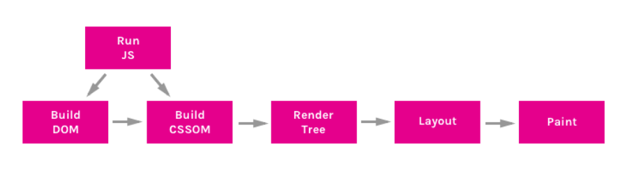

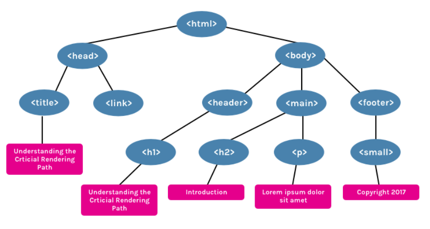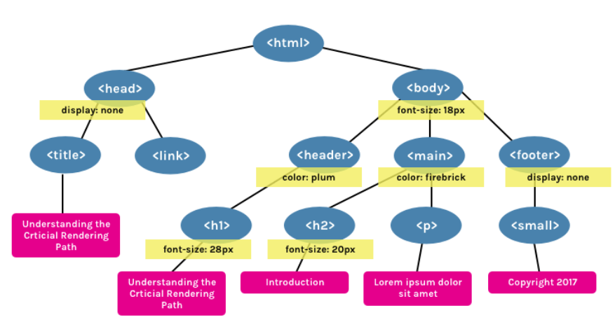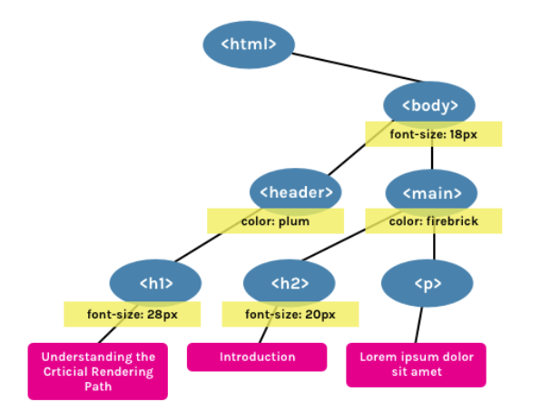

## ⭐⭐(정말중요!) 성능보장 렌더링 순서

> http://csstriggers.com/ 참고
>
> - 움직일떄는 translate이용해서 움직이는게 좋음
>
> **Construction** : HTML을 브라우저만의 언어로 바꾸는 Construction파트 (DOM, CSSOM,RenderTree)
>
> **Operation ** : 이해할 수 있는 Rendering tree를 이용해서 구조를 작성하고 어디에 배치할건지 계산을 한 다음 실제로 브라우저 window에 그림을 그려주는 rendering 하는 파트(layout, paint, composition)
>
> **layout** : RenderTree에는 DOM요소뿐만 아니라 CSS스타일 최종적으로 계산된 CSS스타일이 포한되어져 있다
>
> **paint** : layout을 바로 브라우저에 그림을 그리는 것이 아니라 우리가 이 요소들을 어떻게 배치했느냐에 따라 paint부분에서는 각각 부분을 조금씩 잘게 나누어서 이미지를 준비해 놓음, 즉 각각의 요소들을 이미지를 비트맵이라고 함, 즉 컴퓨터가 이해할 수 있는 이미지를 비트뱁 데이터 형태로 변환
>
>  css는 layout별로 paint를 준비만 해두면 됨
>
> 브라우저가 조금 성능개선을 위해 스스로 layout별로준비를 해둠
>
> 만약 레이어 기능을 이용하지 않고 전체적으로 그림을 그리게 되면 브라우저는 이 전체 웹페이지를 즉 우리가 전체적으로 그림을 그렸다면 브라우저 한부분만 바꾸기 위해 다시 전체적으로 그림을 그리고 업데이트된 것을 변경해줘야됨
>
> **composition**  : 미리준비한 레이어를 순서대로 차곡차곡 브라우저 위에다가 표기하면 됨

```html
<!DOCTYPE html>
<html lang="en">
  <head>
    <meta charset="UTF-8" />
    <meta name="viewport" content="width=device-width, initial-scale=1.0" />
    <title>Document</title>
    <style>
      html {
        padding: 0px;
        margin: 0px;
      }

      body {
        background-color: black;
        text-align: center;
      }
      section {
        width: 50%;
        margin: 50px auto;
        background-color: brown;
        border-radius: 20px;
        padding: 20px;
      }
      img {
        z-index: 100;
        /* 나중에 opacity가 변결될 수도 있음 */
        will-change: opacity;
      }
      h1,
      h3,
      span {
        color: white;
      }
    </style>
  </head>
  <body>
    <section>
      
      <h1 id="brand">Dream Coding</h1>
      <h3>Don't forget to code your dream</h3>
    </section>
    <span>Hello World!</span>
  </body>
</html>

```


### 좌표실습 성능 개선

> 어떤 애니메이션을 쓰거나 동적으로 요소를 움직이거나 할때
>
> **Operation** : layout -> paint -> composition 이 3단계를 거쳐 브라우저에 표기다 되기 때문에  composite만 발생하면 너무 좋고, **paint부터 발생하거나 layout부터 발생하면 조금씩 성능이 나빠질 수 있다**

- 개선이 필요한 실습 코드

> 마우스가 조금만 움직여도 수많은 이벤트가 발생함! 그럴때마다 left와 top을 바꿔주면 layout이 변경돼서 paint도 다시 해야되고 composite도 다시 일어나야 되니까 너무 나쁨!
>
> => 그래서 이런요소를 움직일 때는 left와 top보다 translate을 이용해서 composite만 발생할 수 있게 만드는것이 더 효율적이다!

```js
const vertical = document.querySelector('.vertical');
const horizontal = document.querySelector('.horizontal');
const target = document.querySelector('.target');
const tag = document.querySelector('.tag');

document.addEventListener('mousemove', (event)=>{
  const x = event.clientX;
  const y = event.clientY;

  vertical.style.left = `${x}px`;
  horizontal.style.top = `${y}px`;
  target.style.left = `${x}px`;
  target.style.top = `${y}px`;
  tag.style.left = `${x}px`;
  tag.style.top = `${y}px`;
  tag.innerHTML = `${x}px, ${y}px`;
})
```

- 개선된 코드
- `main.js`

```js
const vertical = document.querySelector('.vertical');
const horizontal = document.querySelector('.horizontal');
const target = document.querySelector('.target');
const tag = document.querySelector('.tag');

//성능 개선 후
addEventListener('load',()=>{

  const targetRect = target.getBoundingClientRect();
  const targetHalfWidth = targetRect.width /2;
  const targetHalfHeight = targetRect.height /2;

  document.addEventListener('mousemove', (event)=>{
    const x = event.clientX;
    const y = event.clientY;

    vertical.style.transform = `translateX(${x}px)`;
    horizontal.style.transform =`translateY(${y}px)`;
    target.style.transform = `translate(${x - targetHalfWidth}px,${y - targetHalfHeight}px)`;
    tag.style.transform = `translate(${x + 20}px,${y + 20}px)`;
    tag.innerHTML = `${x}px, ${y}px`;
  })

  
})
```

- `style.css`

```css
body {
  background-color: black;
  margin: 0;
}

.line {
  position: absolute;
  background-color: white;
}

.horizontal {
  width: 100%;
  height: 1px;
  /* 이전에는 left, top을 갱신했지만 이제는 translate을 이용해서 left와 top을 업데이트 하지 않기 때문에 지정값을 없애줌 */
  /* top: 50%; */
}

.vertical {
  height: 100%;
  width: 1px;
  /* left: 50%; */
}

.target {
  position: absolute;
  /* top: 50%;
  left: 50%; */
  transform: translate(-50%,-50%);
}

.tag {
  color: white;
  position: absolute;
  /* top: 50%;
  left: 50%; */
  font-size: 38px;
  transform: translate(20px,20px);
  /*  tag가 너무 붙지 않게 */
  margin: 20px;
}
```

**성능이 개선됐는지 확인**

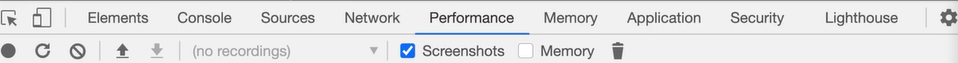

**Performance**탭에서  녹화를 하면 아래와 같이 됨 빨간색이 안좋은 것!

성능 개선 전 Performance

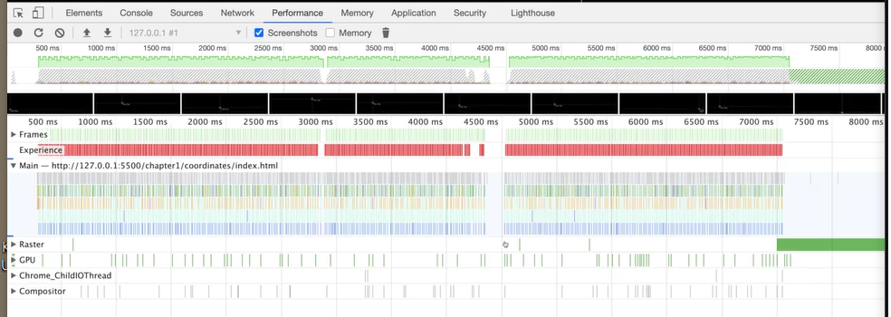

사용자가 원활하게 느끼게 하기 위해선 **1초당 60개의 프레임이 화면에 계속 보여져야됨** 그렇게 하려면 한 프레임이 보여질 때 16.67ms동안 이뤄져야된다

즉 처음부터 무언가 이벤트를 처리하고, 다시 브라우저에 표기 될 때 16ms동안 끝내야된다

하지만 성능 개선전 코드는 22.1ms로 그 이상 걸림, 그리고 아래 `Layout Shift`를 클릭하면 자세한 설명이 나옴(사용자에게 좋지않다고 뜸)

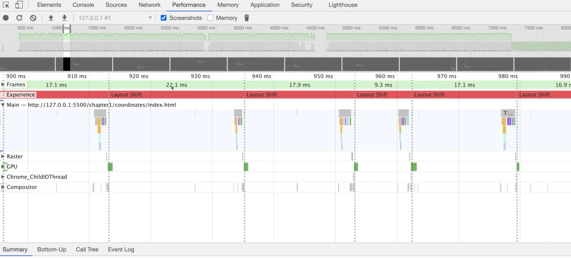

`ctrl + shift + P`윈도우 개발자 툴에 치면 `Rendering Show layout shift regions`를 검색하면 나옴 이걸 클릭하면 layout이 어떻게 지금 발생하고 있는지 나옴

**성능 개선 후 코드**

performance -> 빨간색 warning없음!

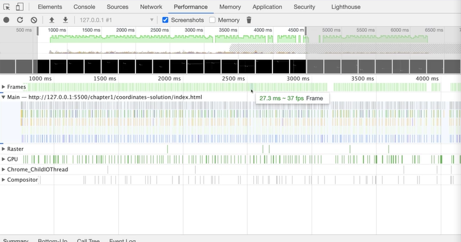

`ctrl + shift + P`윈도우 개발자 툴에 치면 `Rendering Show layout shift regions`를 해도 layout이 발생되지 않는걸 알 수 있다


## DOM 조작하기

> `querySelector`는 요소 중 찾은 첫번째 반환
>
> `document.querySelector('img[src="img/avatar.png"]')`이런식으로도 접근 가능
>
> `querySelectorAll`이건 해당되는 것 전부 가져옴

```html
<!DOCTYPE html>
<html lang="en">
  <head>
    <meta charset="UTF-8" />
    <meta name="viewport" content="width=device-width, initial-scale=1.0" />
    <title>Document</title>
    <style>
      html {
        padding: 0px;
        margin: 0px;
      }

      body {
        background-color: black;
        text-align: center;
      }
      section {
        width: 50%;
        margin: 50px auto;
        background-color: brown;
        border-radius: 20px;
        padding: 20px;
      }
      img {
        z-index: 100;
        /* 나중에 opacity가 변결될 수도 있음 */
        will-change: opacity;
      }
      h1,
      h3,
      span {
        color: white;
      }
    </style>
  </head>
  <body>
    <section>
      
      <h1 id="brand">Dream Coding</h1>
      <h3>Don't forget to code your dream</h3>
    </section>
    <span>Hello World!</span>
    <script>
      const section = document.querySelector('section');
      const h2 = document.createElement('h2');
      // class title을 h2에 속성 추가
      h2.setAttribute('class','title'); // <h2 class="title"></h2>
      h2.textContent = 'This is a title'; // <h2 class="title">This is a title</h2>
      // section에 자식요소로 추가
      section.appendChild(h2); // section의 제일 끝부분에 추가됨
      // insertBefore은 노드를 어떤 reference노드 전에 추가해줌
      // parent컨테이너 박스에 insertbefore를 호출한 다음 새로 추가하고자 하는 노드, 그리고 우리가 참고하는 노드 이거 두개를 전달하면 새로운 노드를 이 reference노드 이전에 추가해줌
      const h3 = document.querySelector("h3");
      section.insertBefore(h2,h3);
    </script>
  </body>
</html>

```


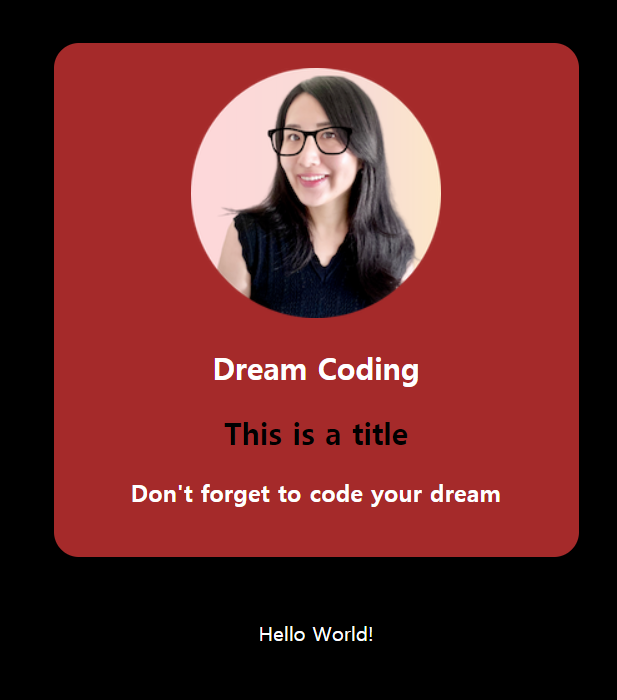

**innerHtml vs element**

> Element의 reference 즉 Element의 변수를 가지고 있으면서 조금 더 많은 동작을 해야된다면 **createElement**를 만들어 쓰는것이 좋고,
>
> 한번 업데이트한 다음에 다시는 변경할 일이 없다면 **innerHtml**이용해서 동적으로 추가해도 됨


## DOM 실습 쇼핑목록앱 만들기

> **FontAwesome**
>
> https://fontawesome.com/
>
> https://www.youtube.com/watch?v=X91jsJyZofw&feature=youtu.be&t=340
>
> **CSS Gradient**
>
> https://cssgradient.io/
>
> **Box Shadow CSS Generator**
>
> https://www.cssmatic.com/box-shadow
>
> https://color.adobe.com/ko/create/color-wheel
>
> 
>
> 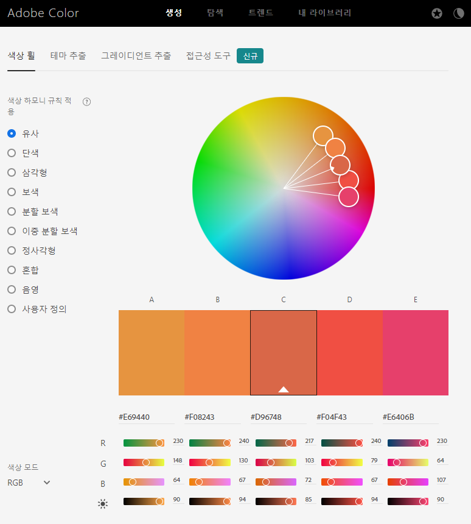
>
> 
>
> 컬러 휠으로 여러가지 색깔을 조합할 수 있습니다.
>
> 좌측 사이드 바에 저의 감각을 보충해줄 유용한 아이들이 배치되어 있습니다. 나중에 사이트를 만드실 때, 테마 색깔을 선정하고 싶을 때 사용하시면 아주 유용하실겁니다.

- `index.html`

> 먼저 템플릿을 만듦

```html
<!DOCTYPE html>
<html lang="en">
<head>
  <meta charset="UTF-8">
  <meta http-equiv="X-UA-Compatible" content="IE=edge">
  <meta name="viewport" content="width=device-width, initial-scale=1.0">
  <title>Shopping List</title>
  <script src="main.js" defer></script>
  <link rel="stylesheet" href="https://use.fontawesome.com/releases/v5.15.2/css/all.css"
    integrity="sha384-vSIIfh2YWi9wW0r9iZe7RJPrKwp6bG+s9QZMoITbCckVJqGCCRhc+ccxNcdpHuYu" crossorigin="anonymous">
  <link rel="stylesheet" href="style.css">
</head>
<body>
  <section class="list">
    <header class="header">Shopping List</header>
    <ul class="items">
      <li class="item__row">
        <div class="item">
          <span class="item_name">Egg</span>
          <button class="item__delete"><i class="fas fa-trash-alt"></i></button>
        </div>
        <div class="item__divider"></div>
      </li>
    </ul>
    <footer class="footer">
      <input type="text" class="footer__input">
      <button class="footer__button">
        <i class="fas fa-plus"></i>
      </button>
    </footer>
    
  </section>
</body>
</html>
```

- `style.css`

> css로 꾸밈

```css
* {
  box-sizing: border-box;
}

ul {
  padding:0;
}

button {
  outline: none;
  background: transparent;
  border: none;
}

body {
  background-color: #ced3df;
  text-align: center;
}

.list {
  width: 400px;
  margin: auto;
  background-color: #f1f0f7;
  border-radius: 20px;
  -webkit-box-shadow: 11px 9px 5px -4px rgba(0,0,0,0.75);
  -moz-box-shadow: 11px 9px 5px -4px rgba(0,0,0,0.75);
  box-shadow: 11px 9px 5px -4px rgba(0,0,0,0.75);
}

.header {
  height: 48px;
  padding: 8px;
  font-size: 24px;
  background: rgba(237, 193, 211);
  background: linear-gradient(
    166deg,
    rgba(237, 193, 211, 1) 0%,
    rgba(219, 192, 216, 1) 35%,
    rgba(127, 188, 242, 1) 100%
  );
  /* 위에만 둥글게 함 */
  border-radius: 20px 20px 0 0;
  color: white;
}

.items {
  height: 500px;
  overflow-y: auto;
}

.item {
  display: flex;
  justify-content: space-between;
  padding: 8px 32px;
}

.item__divider {
  width: 90%;
  height: 1px;
  background-color: lightgray;
  margin: auto;
}

.item__delete { 
  font-size: 16px;
  transition: all 300ms ease-in;
  cursor: pointer;
}

.item__delete:hover {
  color: red;
  transform: scale(1.1);
}

.footer {
  background: rgba(237, 193, 211);
  background: linear-gradient(
    166deg,
    rgba(237, 193, 211, 1) 0%,
    rgba(219, 192, 216, 1) 35%,
    rgba(127, 188, 242, 1) 100%
  );
  border-radius: 0 0 20px 20px;
}

.footer__input {
  width: 100%;
  height: 32px;
  border: none;
  outline: none;
  font-size: 24px;
  padding: 0 16px;
}

.footer__button {
  width: 48px;
  height: 48px;
  font-size: 28px;
  background-color: black;
  border-radius: 50%;
  color: white;
  transition: transform 300ms ease-in;
}

.footer__button:hover {
  transform: scale(1.1);
}
```

- `main.js`로 동적으로 만듦

> 어떤 기능?
>
> 1. input에 사용자가 입력
> 2. `+` 버튼 눌러서 등록
> 3. `enter` 쳐도 등록 가능
> 4. 휴지통 눌러서 삭제기능

```js
// 필요한 DOM요소 정의
const items = document.querySelector('.items');
const input = document.querySelector('.footer__input');
const addBtn = document.querySelector('.footer__button');

// 함수
// click을 하는 함수는 보통 'on'으로 시작함
function onAdd() {
  // 1. 사용자가 입력한 텍스트를 받아옴
  const text = input.value;
  // 사용자가 입력하지 않으면 focus만 하고 return
  if (text === '') {
    input.focus();
    return;
  }
  // 2. 새로운 아이템을 만듦(텍스트 + 삭제 버튼)
  const item = createItem(text);
  // 3. items 컨테이너 안에 새로 만든 아이템을 추가
  items.appendChild(item);
  // 4. 새로 추가된 아이템으로 스크롤링
  item.scrollIntoView({block:'center'});
  // 5. input 초기화 함
  input.value = ''
  // focus를 줘야 추가할 수 있음 아니면 마우스로 input창 클릭해야됨
  input.focus();
}

function createItem(text) {
  const itemRow = document.createElement('li');
  itemRow.setAttribute('class','item__row');

  const item = document.createElement('div');
  item.setAttribute('class','item');
  
  const name = document.createElement('span');
  name.setAttribute('class','item__name');
  name.innerText = text;

  const deleteBtn = document.createElement('button');
  deleteBtn.setAttribute('class','item__delete');
  deleteBtn.innerHTML = '<i class="fas fa-trash-alt"></i>';
  deleteBtn.addEventListener('click',()=>{
    items.removeChild(itemRow);
  })

  const itemDivider = document.createElement('div');
  itemDivider.setAttribute('class','item__divider');

  item.appendChild(name);
  item.appendChild(deleteBtn);

  itemRow.appendChild(item);
  itemRow.appendChild(itemDivider);
  
  return itemRow;
}
addBtn.addEventListener('click',()=>{
  onAdd();
})

input.addEventListener('keypress',(event)=>{
  if (event.key === 'Enter') {
    onAdd();
  }
})
```

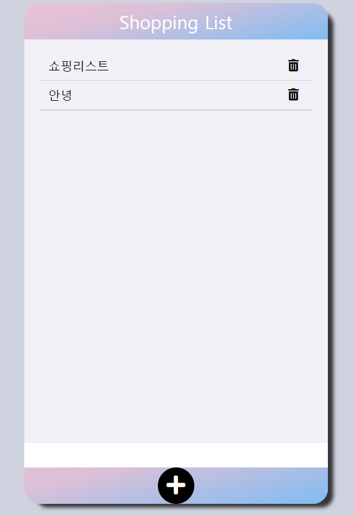

### source 콘솔 디버깅 툴

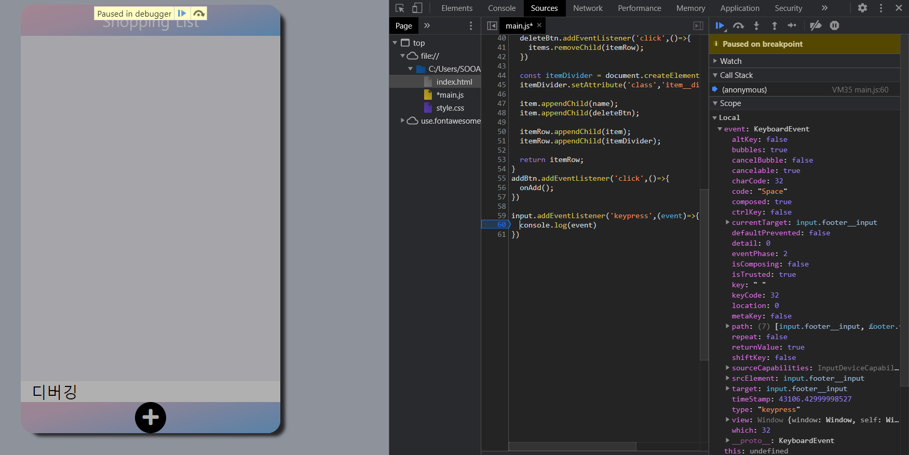


### 쇼핑앱 개선하기

> id값을 지정해줘서 불필요한 코드들을 줄임(addEventListener 등..)

```js
const items = document.querySelector('.items');
const input = document.querySelector('.footer__input');
const addBtn = document.querySelector('.footer__button');

function onAdd() {
  const text = input.value;
  if (text === '') {
    input.focus();
    return;
  }
  const item = createItem(text);
  items.appendChild(item);
  item.scrollIntoView({ block: 'center' });
  input.value = '';
  input.focus();
}

let id = 0; // UUID(고유한 ID)
function createItem(text) {
  const itemRow = document.createElement('li');
  itemRow.setAttribute('class', 'item__row');
  // 가장 큰 부모에 data-id를 id값으로 줌!
  itemRow.setAttribute('data-id', id);
  itemRow.innerHTML = `
        <div class="item">
            <span class="item__name">${text}</span>
            <button class="item__delete">
                <i class="fas fa-trash-alt" data-id=${id}></i>
            </button>
        </div>
        <div class="item__divider"></div>`;
  // id가 새로 만들어질때마다 1씩 늘어남
  id++;
  return itemRow;
}

addBtn.addEventListener('click', () => {
  onAdd();
});

input.addEventListener('keypress', event => {
  if (event.key === 'Enter') {
    onAdd();
  }
});

items.addEventListener('click', event => {
  const id = event.target.dataset.id;
  // id가 있으면!해당 id의 값을 삭제할 수 있게함
  if (id) {
    // .item__row클래스의 data-id가 지정한id값을 가져와서 없앰!
    const toBeDeleted = document.querySelector(`.item__row[data-id="${id}"]`);
    toBeDeleted.remove();
  }
});

```


## Events

> **Events 개념**
>
> https://developer.mozilla.org/en-US/docs/Learn/JavaScript/Building_blocks/Events
>
> **Events 종류**
>
> https://developer.mozilla.org/en-US/docs/Web/Events
>
> `addEventListener` : event가 발생했을때
>
> `dispatchEvent` : 인공적으로 event를 발생시킴
>
> `removeEventListener` : eventListener를 지움

### Event 실습

> **Bubbling and Capturing** 
>
> https://developer.mozilla.org/en-US/docs/Learn/JavaScript/Building_blocks/Events#Event_bubbling_and_capture
>
> **stopPropagation() or stopImmediatePropagation()은 정말 위험하고 가능하면 사용하지마라!**
>
> 이거를 사용하지 않아도 버블링을 막을 수 있다!
>
> 부모한테 처리해줌(target이 같지않으면 처리하지 않겠다.) : 내가 관심있는 target만 처리하겠다
>
> ```js
> if (event.target !== event.currentTarget) {
>     return;
> }
> ```

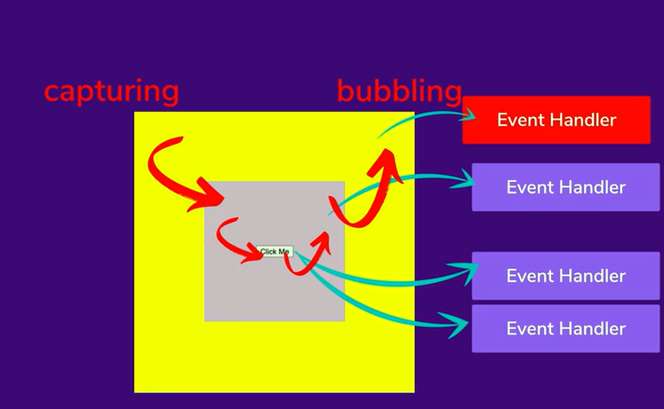

```html
<!DOCTYPE html>
<html lang="en">
  <head>
    <meta charset="UTF-8" />
    <meta name="viewport" content="width=device-width, initial-scale=1.0" />
    <title>Document</title>
    <style>
      .outer {
        width: 500px;
        height: 500px;
        background-color: yellow;
      }

      .middle {
        width: 50%;
        height: 50%;
        margin: auto;
        background-color: thistle;
        transform: translateY(50%);
      }

      button {
        position: relative;
        top: 50%;
        left: 50%;
        transform: translate(-50%, -50%);
      }
    </style>
  </head>
  <body>
    <div class="outer">
      <div class="middle">
        <button>Click Me</button>
      </div>
    </div>
    <script>
      const outer = document.querySelector('.outer');
      const middle = document.querySelector('.middle');
      const button = document.querySelector('button');

      outer.addEventListener('click', event => {
        if (event.target !== event.currentTarget) {
          return;
        }
        console.log(`outer: ${event.currentTarget}, ${event.target}`);
      });
      middle.addEventListener('click', event => {
        if (event.target !== event.currentTarget) {
          return;
        }
        console.log(`middle ${event.currentTarget}, ${event.target}`);
      });
      button.addEventListener('click', event => {
        console.log(`button1 ${event.currentTarget}, ${event.target}`);
        // button1,2만 클릭되고 버블링은 일어나지 않음
        // event.stopPropagation();
        // button1만 일어남(내가 최고야 다른애들은 다 취소해) 
        // event.stopImmediatePropagation();
      });
      button.addEventListener('click', event => {
        console.log(`button2 ${event.currentTarget}, ${event.target}`);
        // button2에는 등록해도 1은 계속 console에 찍힘 why? 1이 먼저 등록됐기 때문! 그래서 캡쳐링될때 버튼1->버튼2되고 이제그만해라고 해봤자 1은 이미 일어났음
        // event.stopImmediatePropagation();
      });
    </script>
  </body>
</html>

```


### 브라우저 취소

```html
<!DOCTYPE html>
<html lang="en">
  <head>
    <meta charset="UTF-8" />
    <meta name="viewport" content="width=device-width, initial-scale=1.0" />
    <title>Document</title>
    <style>
      div {
        width: 250px;
        height: 250px;
        background-color: yellow;
        margin-bottom: 5px;
      }
    </style>
  </head>
  <body>
    <div>
      <input type="checkbox" />
    </div>
    <div></div>
    <div></div>
    <div></div>
    <div></div>
    <div></div>
    <div></div>
    <div></div>
    <div></div>
    <div></div>
    <script>
      document.addEventListener('wheel', event => {
        console.log('scrolling');
        // wheel은 passive event 이기 때문에 preventDefault를 이용할 수 없다
        // wheel은 사용자가 행동을 다할때까지 기다릴수 없는 이벤트이기 때문에 스크롤에 관련된것, 빠르게 뭔가가 동작을 해야되는 이벤트는 브라우저가 '야 나는 내 할일 먼저 할게 너는 나중에 뭘 하든 말든 상관없어 그리고 내가 먼저 할때는 니가 preventDefault를 해도 난 무시할거야' -> 그래서 scroll되는 기본값은 취소할 수 없다
        // 하지만 취소할 수 있는 방법이 있다!
        // addEventListener 의 passive옵션이 true이면 preventDefault()가 무시됨
        event.preventDefault();
        // {passive:false}를 추가하면 이제 active가 돼서 preventDefault를 쓸 수 있음 하지만 웬만해서는 이렇게 안하는게 좋음
      },{passive:false});
      const checkbox = document.querySelector('input');
      checkbox.addEventListener('click', event => {
        // long
        console.log('checked');
        // 브라우저에서 기본적으로 발생하는 행동을 취소함 -> 체크박스가 체크가안됨
        event.preventDefault();
      });
    </script>
  </body>
</html>

```


### event delegation

```html
<!DOCTYPE html>
<html lang="en">
  <head>
    <meta charset="UTF-8" />
    <meta name="viewport" content="width=device-width, initial-scale=1.0" />
    <title>Document</title>
    <style>
      .selected {
        background-color: yellow;
      }
    </style>
  </head>
  <body>
    <ul>
      <li>1</li>
      <li>2</li>
      <li>3</li>
      <li>4</li>
      <li>5</li>
      <li>6</li>
      <li>7</li>
      <li>8</li>
      <li>9</li>
      <li>10</li>
    </ul>
    <script>
      // Bad
      // const lis = document.querySelectorAll('li');
      // lis.forEach(li => {
      //   li.addEventListener('click', () => {
      //     li.classList.add('selected');
      //   });
      // });

      // 이벤트 delegation(위임)
      // Coooooooool 🙌
      const ul = document.querySelector('ul');
      ul.addEventListener('click', event => {
        if (event.target.tagName == 'LI') {
          event.target.classList.add('selected');
        }
      });
    </script>
  </body>
</html>

```

