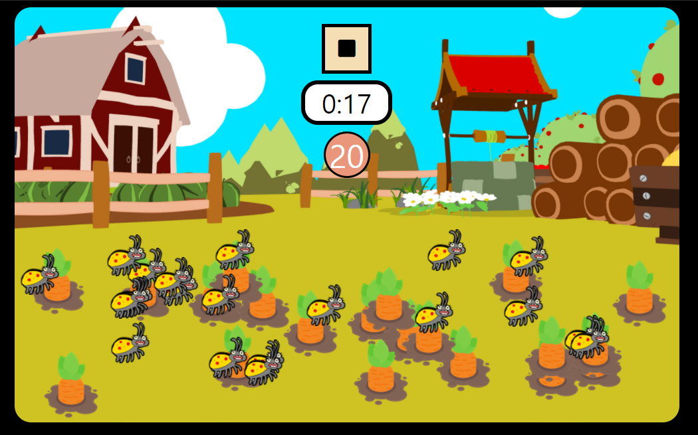
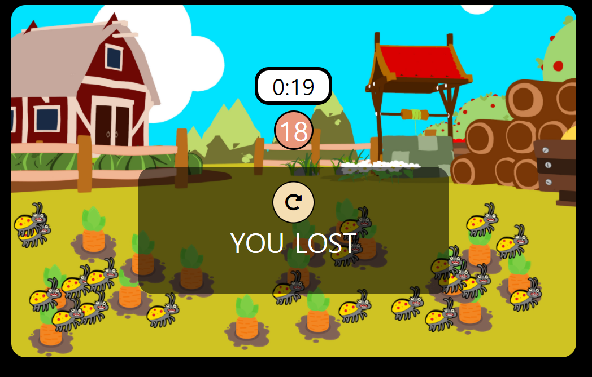
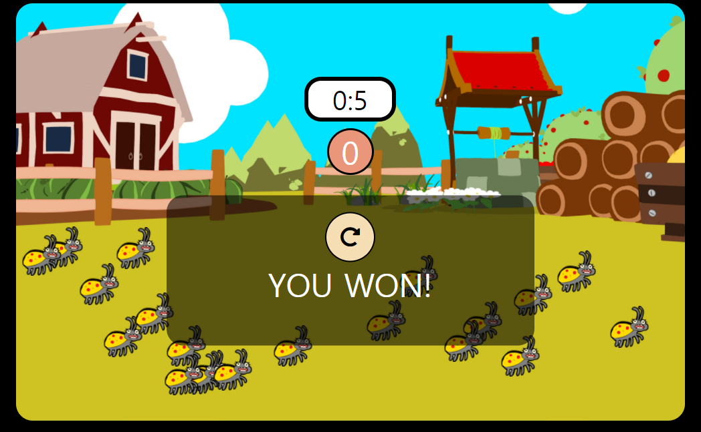

# Fun Game 실습

[toc]







- `index.html` 마크업

> `defer`이 없으면 html이 준비되기 이전에 실행이 되기 때문에 안됨

```html
<!DOCTYPE html>
<html lang="en">
<head>
  <meta charset="UTF-8">
  <meta http-equiv="X-UA-Compatible" content="IE=edge">
  <meta name="viewport" content="width=device-width, initial-scale=1.0">
  <title>Fun Game</title>
  <link rel="stylesheet" href="style.css">
  <script src="main.js" defer></script>
  <link rel="stylesheet" href="https://use.fontawesome.com/releases/v5.15.2/css/all.css"
    integrity="sha384-vSIIfh2YWi9wW0r9iZe7RJPrKwp6bG+s9QZMoITbCckVJqGCCRhc+ccxNcdpHuYu" crossorigin="anonymous">
</head>
<body>
  <section class="game">
    <header class="game__header">
      <button class="game__button">
        <i class="fas fa-play"></i>
      </button>
      <span class="game__timer">0:0</span>
      <span class="game__score">9</span>
    </header>
    <section class="game__field"></section>
  </section>
  <section class="pop-up pop-up--hide">
    <button class="pop-up__refresh">
      <i class="fas fa-redo-alt"></i>
    </button>
    <span class="pop-up__message">Hello</span>
  </section>
</body>
</html>
```

- `style.css`

```css
button {
  border: none;
  outline: none;
  cursor: pointer;
}

body {
  text-align: center;
  background-color: black;
}

.game {
  display: flex;
  flex-direction: column;
  width: 800px;
  height: 500px;
  margin: auto;
  /* 배경 center로 / 사이즈는 cover */
  background: url(img/background.png) center/cover;
  border-radius: 20px;
}

.game__header {
  display: flex;
  flex-direction: column;
  align-items: center;
  padding: 20px;
}

.game__button {
  width: 60px;
  height: 60px;
  background-color: wheat;
  border: 4px solid black;
  font-size: 24px;
  transition: transform 300ms ease-in;
}

.game__button:hover {
  transform: scale(1.1);  
}

.game__timer {
  width: 100px;
  background-color: white;
  text-align: center;
  border: 5px solid black;
  border-radius: 20px;
  font-size: 32px;
  margin-top: 8px;
  visibility: hidden;
  /* 선택되지않게하기위해(드래그되는거?) */
  user-select: none;
  cursor: auto;
}

.game__score {
  text-align: center;
  width: 50px;
  height: 50px;
  margin-top: 8px;
  font-size: 38px;
  border-radius: 50%;
  border: 3px solid black;
  background-color: darksalmon;
  color: white;
  visibility: hidden;
    /* 선택되지않게하기위해(드래그되는거?) */
  user-select: none;
  cursor: auto;
}


.game__field {
  position: relative;
  width: 100%;
  height: 100%;
  margin-top: 40px;
}

.pop-up {
  display: block;
  width: 400px;
  height: 140px;
  margin: auto;
  padding: 20px;
  /* opacity: 0.7; */
  /* 000000 색상 90은 투명도 -> 이러면 배경색만 투명도가 생김*/
  background-color: #00000090;
  border-radius: 20px;
  color: white;
  text-align: center;
  transform: translateY(-150%);
}

.pop-up--hide {
  display: none;
}

.pop-up__refresh {
  width: 60px;
  height: 60px;
  font-size: 24px;
  background-color: wheat;
  border: 2px solid black;
  border-radius: 50%;
}

.pop-up__message {
  display: block;
  font-size: 38px;
}

.carrot,
.bug {
  transition: transform 100ms ease-in;
}

.carrot:hover,
.bug:hover {
  transform: scale(1.1);
}
```

- `main.js`

```js
'use strict';

const CARROT_SIZE = 80;
const CARROT_COUNT = 20;
const BUG_COUNT = 20;
const GAME_DURATION_SEC = 20;

const field = document.querySelector('.game__field');
const fieldRect = field.getBoundingClientRect();
const gameBtn = document.querySelector('.game__button');
const gameTimer = document.querySelector('.game__timer');
const gameScore = document.querySelector('.game__score');

const popUp = document.querySelector('.pop-up');
const popUpText = document.querySelector('.pop-up__message');
const popUpRefresh = document.querySelector('.pop-up__refresh');

const carrotSound = new Audio('./sound/carrot_pull.mp3');
const alertSound = new Audio('./sound/alert.wav');
const bgSound = new Audio('./sound/bg.mp3');
const bugSound = new Audio('./sound/bug_pull.mp3');
const winSound = new Audio('./sound/game_win.mp3');


let started = false;
let score = 0;
let timer = undefined;

field.addEventListener('click', onFiledClick);
gameBtn.addEventListener('click',()=>{
  if (started) {
    stopGame();
  } else {
    startGame();
  }
});
popUpRefresh.addEventListener('click', ()=>{
  startGame();
  hidePopUp();
})

function startGame() {
  started = true;
  initGame();
  showStopButton();
  showTimerAndScore();
  startGameTimer();
  playSound(bgSound);
}
function stopGame() {
  started = false;
  stopGameTimer();
  hideGameButton();
  showPopUpWithText('REPLAY?');
  playSound(alertSound);
  stopSound(bgSound);
};

function finishGame(win) {
  started = false;
  hideGameButton();
  if (win) {
    playSound(winSound); 
  } else {
    playSound(bugSound);
  }
  stopGameTimer();
  stopSound(bgSound);
  showPopUpWithText(win ? 'YOU WON!' : 'YOU LOST');
};

function showStopButton() {
  const icon = gameBtn.querySelector('.fas');
  icon.classList.add('fa-stop');
  icon.classList.remove('fa-play');
  gameBtn.style.visibility = 'visible';
};

function hideGameButton() {
  gameBtn.style.visibility = 'hidden';
};

function showTimerAndScore() {
  gameTimer.style.visibility = 'visible';
  gameScore.style.visibility = 'visible';
};

function startGameTimer() {
  // setInterval api이용
  // timer를 함수 밖에서도 사용해야되니까 global변수로 사용
  let remainingTimeSec = GAME_DURATION_SEC;
  updateTimerText(remainingTimeSec);
  timer = setInterval(()=>{
    if (remainingTimeSec <= 0) {
      clearInterval(timer);
      finishGame(CARROT_COUNT === score);
      return
    }
    //remainingTimeSec 1초씩 줄어들어야됨
    updateTimerText(--remainingTimeSec)
  },1000);
};

function stopGameTimer() {
  clearInterval(timer);
};

function updateTimerText(time) {
  const minutes = Math.floor(time/60);
  const seconds = time % 60;
  gameTimer.innerText = `${minutes}:${seconds}`
};

function showPopUpWithText(text) {
  popUpText.innerText = text;
  popUp.classList.remove('pop-up--hide');
};

function hidePopUp() {
  popUp.classList.add('pop-up--hide')
};

function initGame() {
  score = 0;
  field.innerHTML = '';
  gameScore.innerText = CARROT_COUNT;
  // 벌레와 당근을 생성한뒤 field에 추가해줌
  addItem('carrot',CARROT_COUNT,'img/carrot.png');
  addItem('bug',BUG_COUNT,'img/bug.png');
}

function onFiledClick(event) {
  if (!started) {
    return;
  }
  const target = event.target;
  // matches란 함수는 css셀렉터가 해당하는지 확인함
  // carrot클래스를 가진 타겟이면
  if (target.matches('.carrot')) {
    // 당근!
    target.remove();
    score++;
    playSound(carrotSound);
    updateScoreBoard();
    if (score === CARROT_COUNT) {
      finishGame(true);
    }
  } else if(target.matches('.bug')) {
    // 벌레!
    finishGame(false);
  } 
}

function playSound(sound) {
  // 시작을 처음부터하게 설정
  sound.currentTime = 0;
  sound.play();
};

function stopSound(sound) {
  sound.pause();
};

function updateScoreBoard() {
  gameScore.innerText = CARROT_COUNT - score;
}

function addItem(className,count,imgPath) {
  const x1 = 0;
  const y1 = 0;
  // 필드의 끝값에서 당근 사이즈만큼 빼줘야 필드안에 들어감
  const x2 = fieldRect.width-CARROT_SIZE;
  const y2 = fieldRect.height-CARROT_SIZE;
  for (let i = 0; i < count; i++) {
    const item = document.createElement('img');
    item.setAttribute('class',className);
    item.setAttribute('src',imgPath);
    item.style.position = 'absolute';
    const x = randomNumber(x1,x2);
    const y = randomNumber (y1,y2);
    item.style.left = `${x}px`;
    item.style.top = `${y}px`;
    field.appendChild(item); 
  }
}
// 랜덤숫자를 만들어주는 함수
function randomNumber(min,max) {
  return Math.random() * (max-min) + min;
}

initGame();
```


### 리팩토링

