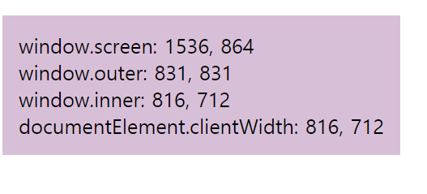
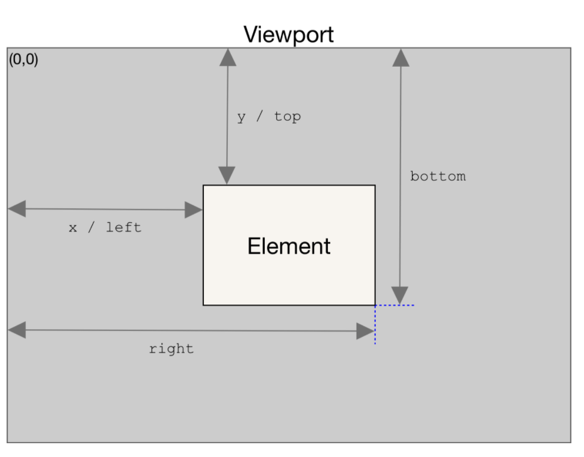
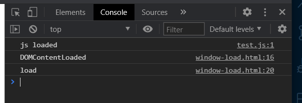
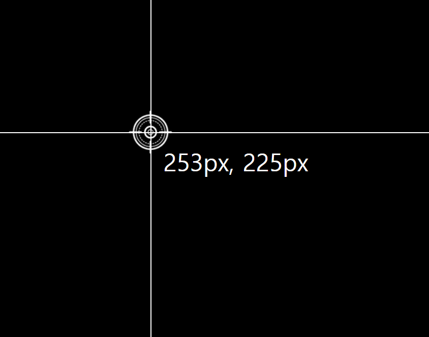
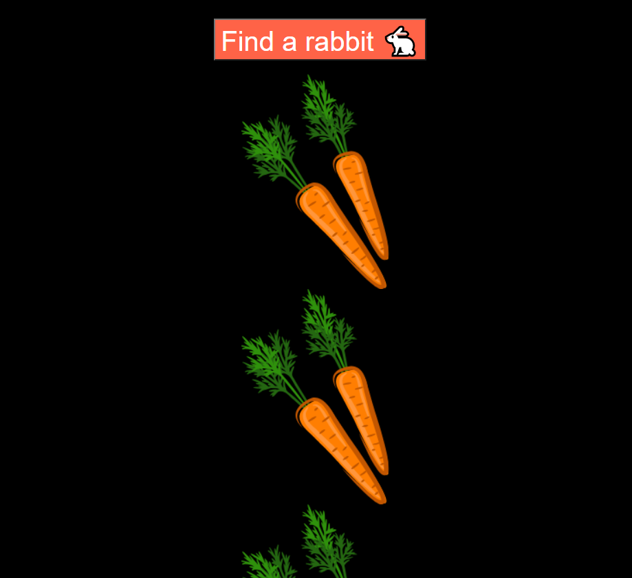
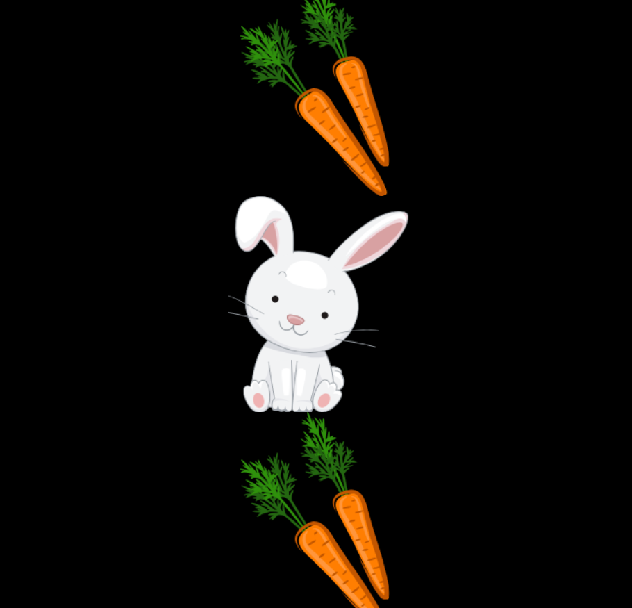

# Web_API(Application Programming Interfaces)

> **MDN Web API:**
>
> https://developer.mozilla.org/en-US/docs/Learn/JavaScript/Client-side_web_APIs/Introduction
>
> **Web API collection:**
>
> https://developer.mozilla.org/en-US/docs/Web/API
>
> **Security:**
>
> https://www.thoughtco.com/what-javascript-cannot-do-2037666

## WEB APIS : 브라우저 자체에서 제공하는 API

> DOM APIs / Networ APIs/ Graphics APIs/Audio&Video APIs/ Device APIs/ File APIs/ Storage APIs
>
> Web APIs Security : 사용자의 권한 요청이나 HTTPs를 요구할 수 있음
>
> `HTTPS` : Hypertext Transfer Protocal Secure(보안처리가 돼있음), http는 보안처리가 되지않음

## Browser 구조 분석

> **Document** : html에 작성한 문서가 표기되는 부분
>
> https://developer.mozilla.org/en-US/docs/Web/API/Document
>
> **Window** : 글로벌 object라 따로 선언해주지 않아도 자동으로 변환됨!
>
> https://developer.mozilla.org/en-US/docs/Web/API/Window
>
> **Viewport**
>
> https://developer.mozilla.org/en-US/docs/Glossary/layout_viewport
>
> **Navigator** : 사용자눈에는 보이지않지만 전체적으로 Window에 관련된 즉 브라우저 자체에 관련된 정보들이 담겨있는 유용한 오브젝트
>
> https://developer.mozilla.org/en-US/docs/Web/API/Navigator


## Window size

> `Window.screen` : 모니터의 해상도 즉 브라우저 바깥에 있는 아이들까지 다 합한 모니터 사이즈
>
> `window.outer` : 브라우저에 있는 url그리고 탭, 전체적인 브라우저의 사이즈
>
> `window.inner` : 보고있는 웹페이지 뿐만 아니라 웹페이지 수직에 스크롤바가 있다면 스크롤바가 표기되는 그 모든것을 합한 페이지가 표기되는 이 부분 전체
>
> `documentElement.clientWidth` : 문서 자체를 의미, 전체적인 페이지긴 하지만 스크롤바가 있다면, 스크롤바를 제외한 영역 사이즈를 말함

```html
<!DOCTYPE html>
<html lang="en">
<head>
  <meta charset="UTF-8">
  <meta http-equiv="X-UA-Compatible" content="IE=edge">
  <meta name="viewport" content="width=device-width, initial-scale=1.0">
  <title>Window Size</title>
  <style>
    .tag {
      display: inline-block;
      background-color: thistle;
      padding: 16px;
      margin-top: 16px;
      font-size: 20px;
    }
  </style>
</head>
<body>
  <div class="tag">Window Size</div>
  <script>
    const tag = document.querySelector('.tag');
    function updateTag() {
      tag.innerHTML = `
      window.screen: ${window.screen.width}, ${window.screen.height} <br/>
      window.outer: ${window.outerWidth}, ${window.outerHeight}<br/>
      window.inner: ${window.innerWidth}, ${window.innerHeight}<br/>
      documentElement.clientWidth: ${document.documentElement.clientWidth}, ${document.documentElement.clientHeight}
      `;
    }
    
    window.addEventListener('resize', () => {
      updateTag();
    })
    updateTag();
  </script>
</body>
</html>
```



## ⭐⭐ 브라우저 좌표(중요!!)

> X는 수평축, Y는 수직축,왼쪽제일 위에서부터 좌표가 (0,0), y는 밑으로 내려갈수록 숫자가 커지고, x는 오른쪽으로 갈수록 숫자가 커짐

### `Element.getBoundingClientRect()`

> 요소한테 모두 적용할 수 있음
>
> 요소의 정보를 알 수 있다, Width와 Height, top,left,right,bottom 포지션에 대해 얻어옴(좌표(x,y) = (left,top),(right,bottom))
>
> **js : getBoundingClientRect**
>
> right : 브라우저 제일 왼쪽에서 가장 오른쪽이 얼마나 떨어졌는지
>
> bottom : 브라우저 제일 위에서 얼마만큼 떨어졌는지
>
> **css와 다른점**
>
> right : 브라우저에서 제일 오른쪽으로부터 떨어져있는 거리
>
> bottom : 브라우저 밑에서부터 떨어져있는 거리



### Client x,y vs Page x,y

> 클릭했을 때, event에는 client X, Y값이 들어있다
>
> **client X, Y**
>
> 사용자가 보고 있는 페이지와 관계없이(스크롤된값과 관계없이) 브라우저 window창에서 X와 Y가 얼마나 떨어져 있는지가 전달됨
>
> **Page X, Y**
>
> Client에 들어있느 사이즈가 아니라 바로 페이지 자체에서 떨어져있는 X,Y좌표, 브라우저 이상의 문서의 제일 시작점부터 계산된 X,Y 좌표

```html
<!DOCTYPE html>
<html lang="en">
<head>
  <meta charset="UTF-8">
  <meta http-equiv="X-UA-Compatible" content="IE=edge">
  <meta name="viewport" content="width=device-width, initial-scale=1.0">
  <title>Coordinates</title>
  <style>
    body {
      background-color: black;
      /* overflow: hidden; 스크롤이 안되게 하고싶다면 */
    }
    div {
      width: 250px;
      height: 250px;
      background-color: blanchedalmond;
      margin-bottom: 4px;
      border-radius: 4px;
    }
    .special {
      background-color: lightsalmon;
    }
  </style>
</head>
<body>
  <div></div>
  <div></div>
  <div></div>
  <div></div>
  <div></div>
  <div></div>
  <div></div>
  <div class="special"></div>
  <div></div>
  <div></div>
  <script>
    const special = document.querySelector('.special');
    special.addEventListener('click', (event) => {
      const rect = special.getBoundingClientRect();
      console.log(rect);
      console.log(`page : ${event.pageX},${event.pageY}`);
      console.log(`client : ${event.clientX},${event.clientY}`);

    })
  </script>
</body>
</html>
```


### scroll apis

```html
<!DOCTYPE html>
<html lang="en">
<head>
  <meta charset="UTF-8">
  <meta http-equiv="X-UA-Compatible" content="IE=edge">
  <meta name="viewport" content="width=device-width, initial-scale=1.0">
  <title>Coordinates</title>
  <style>
    body {
      background-color: black;
      /* overflow: hidden; 스크롤이 안되게 하고싶다면 */
    }
    div {
      width: 250px;
      height: 250px;
      background-color: blanchedalmond;
      margin-bottom: 4px;
      border-radius: 4px;
    }
    .special {
      background-color: lightsalmon;
    }
    aside {
      /* 오른쪽 상단에 고정 */
      position: fixed;
      top: 20px;
      right: 20px;
    }
  </style>
</head>
<body>
  <div></div>
  <div></div>
  <div></div>
  <div></div>
  <div></div>
  <div></div>
  <div></div>
  <div class="special"></div>
  <div></div>
  <div></div>
  <aside>
    <button class="scroll-by">Scroll by 100px(y)</button>
    <button class="scroll-to">Scroll to 100px(y)</button>
    <button class="scroll-into">Scroll into special</button>
  </aside>
  <script>
    const special = document.querySelector('.special');
    special.addEventListener('click', (event) => {
      const rect = special.getBoundingClientRect();
      console.log(rect);
      console.log(`page : ${event.pageX},${event.pageY}`);
      console.log(`client : ${event.clientX},${event.clientY}`);
    })
    const scrollBy = document.querySelector('.scroll-by');
    const scrollTo = document.querySelector('.scroll-to');
    const scrollInto = document.querySelector('.scroll-into');
    // mdn javascript scroll로 검색
    scrollBy.addEventListener('click', () => {
      // x좌표 0, y좌표 100씩으로 이동
      // window.scrollBy(0,100);
      // properties로 object를 줄 수있다
      // top 100씩 smooth하게 이동한다
      window.scrollBy({top:100,left:0,behavior:'smooth'})
    });
    scrollTo.addEventListener('click', () => {
      // x좌표 0, y좌표 100으로 이동
      window.scrollTo(0,100);
    });
    scrollInto.addEventListener('click', () => {
      // 스페셜로 이동
      special.scrollIntoView();
    });

  </script>
</body>
</html>
```


### window load

```html
<!DOCTYPE html>
<html lang="en">
<head>
  <meta charset="UTF-8">
  <meta http-equiv="X-UA-Compatible" content="IE=edge">
  <meta name="viewport" content="width=device-width, initial-scale=1.0">
  <title>Window load</title>
  <!-- test.js console.log('js loaded'); -->
  <script src="test.js" defer></script>
</head>
<body>
  
  <script>
    //only document, 즉 HTML만 다 완료가 되면 호출됨
    window.addEventListener('DOMContentLoaded', () => {
      console.log('DOMContentLoaded');
    });
    //after resources, 즉 페이지 안에서 쓰여지고 있는 폰트나 이미지 같은 것들, css나 모든것들이 다 다운로드가 완료가 되면 그때 호출
    window.addEventListener('load',()=>{
      console.log('load');
    });
    // load가 안될때 페이지가 끝날 때 불려짐(사용자가 페이지를 나가기전에 불려지는 함수), 
    // before unload
    window.addEventListener('beforeunload', () => {
        console.log('beforeunload');
      });
      // 페이지가 unload가 될 때 불려짐
      // resource in being unloaded
    window.addEventListener('unload', () => {
      console.log('unload');
    });
  </script>
</body>
</html>
```



- `defer`옵션을 쓰게 되면 HTML이 전부 다 이렇게 파싱 다 분석이 완료된 다음에 contentLoaded가 출력되기 이전에 즉 

1. contentLoaded라는 이벤트가 발생하기 이전에 먼저 호출됨
2. 그다음에 contentLoaded 출력
3. 그다음 페이지에서 쓰여지는 이미지나 폰트나 이런 리소스가 다 다운받아지면 load가 호출됨

**JS파일이 어떤 리소스에 대해서 이미지나 폰트에 대해서 뭔가를 수행하지 않는 이상 DOMContentLoaded안에서 동작을 수행하는 것이 조금 더 빠르게 사용자가 볼 수 있는 장점이 있다.**

defer옵션을 이용하게 되면 DOMContentLoaded 이전에, 즉 이게 발생하는 시점 즈음에 서로 비슷하게 발생이 되기 때문에 효율적으로 쓰여진다고 볼 수있다


### 실습1

- `index.html`

```html
<!DOCTYPE html>
<html lang="en">
  <head>
    <meta charset="UTF-8" />
    <meta name="viewport" content="width=device-width, initial-scale=1.0" />
    <title>Coordinates</title>
    <script src="main.js" defer></script>
    <link rel="stylesheet" href="style.css" />
  </head>
  <body>
    <div class="line horizontal"></div>
    <div class="line vertical"></div>
    
    <span class="tag"></span>
  </body>
</html>
```

- `style.css`

```css
body {
  background-color: black;
}

.line {
  position: absolute;
  background-color: white;
}

.horizontal {
  width: 100%;
  height: 1px;
  top: 50%;
}

.vertical {
  height: 100%;
  width: 1px;
  left: 50%;
}

.target {
  position: absolute;
  top: 50%;
  left: 50%;
  transform: translate(-50%,-50%);
}

.tag {
  color: white;
  position: absolute;
  top: 50%;
  left: 50%;
  font-size: 38px;
  transform: translate(20px,20px);
}
```

- `main.js`

```js
const vertical = document.querySelector('.vertical');
const horizontal = document.querySelector('.horizontal');
const target = document.querySelector('.target');
const tag = document.querySelector('.tag');

document.addEventListener('mousemove', (event)=>{
  const x = event.clientX;
  const y = event.clientY;

  vertical.style.left = `${x}px`;
  horizontal.style.top = `${y}px`;
  target.style.left = `${x}px`;
  target.style.top = `${y}px`;
  tag.style.left = `${x}px`;
  tag.style.top = `${y}px`;
  tag.innerHTML = `${x}px, ${y}px`;
})
```



### Find a rabbit 실습

- `index.html`

```html
<!DOCTYPE html>
<html lang="en">
  <head>
    <meta charset="UTF-8" />
    <meta name="viewport" content="width=device-width, initial-scale=1.0" />
    <title>Scroll</title>
    <style>
      body {
        background-color: black;
        text-align: center;
      }
      img {
        display: block;
        margin: auto;
      }
      button {
        outline: none;
        background-color: tomato;
        color: white;
        font-size: 32px;
        margin: 16px 0;
        cursor: pointer;
      }
    </style>
  </head>
  <body>
    <button>Find a rabbit 🐇</button>
    
    
    
    
    
    
    
    
    
    
    
    
    <script>
      const button = document.querySelector('button');
      const rabbit = document.querySelector('#rabbit');
      button.addEventListener('click',()=>{
        // rabbit으로 smooth하게 scroll
        // block:'center'하면 눌렀을때 토끼가 중앙으로 옴
        // block:'end'하면 토끼가 제일 밑으로 옴
        rabbit.scrollIntoView({behavior:'smooth',block:'center'});
      })
    </script>
  </body>
</html>

```




