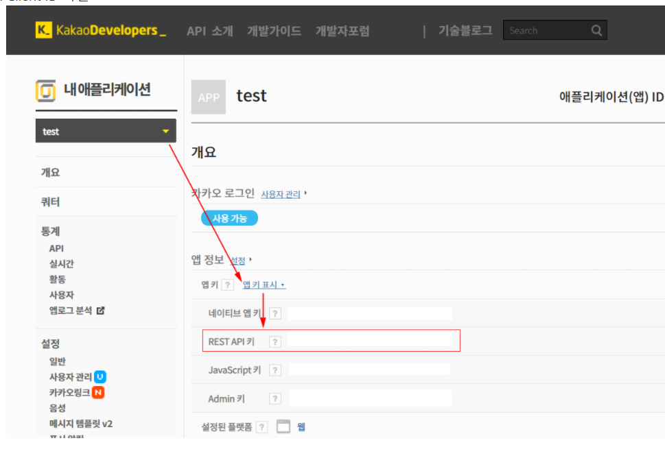
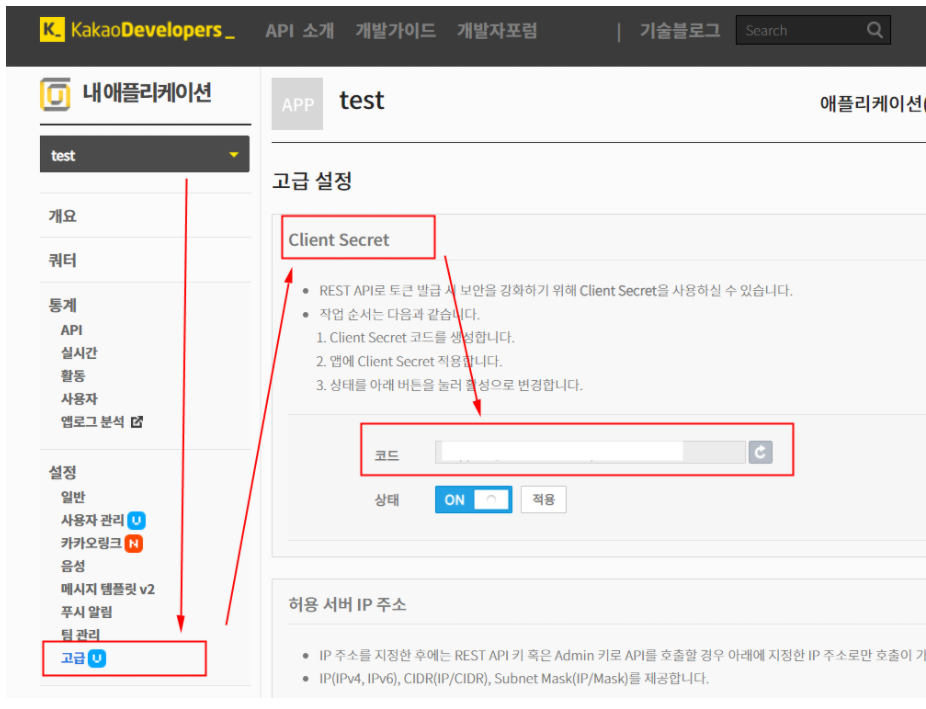
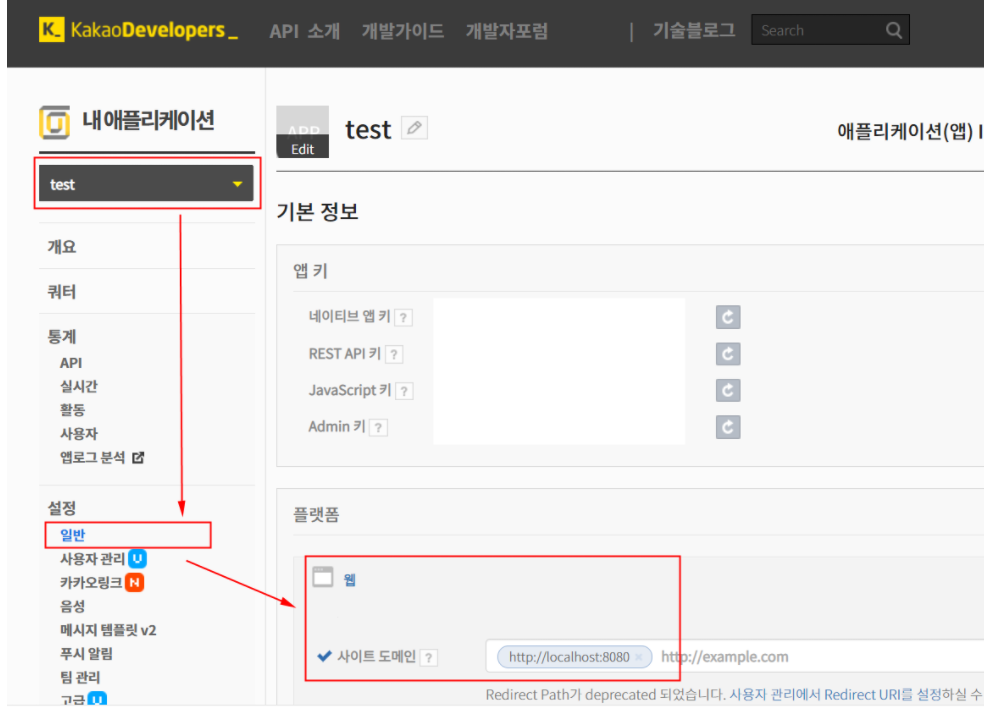
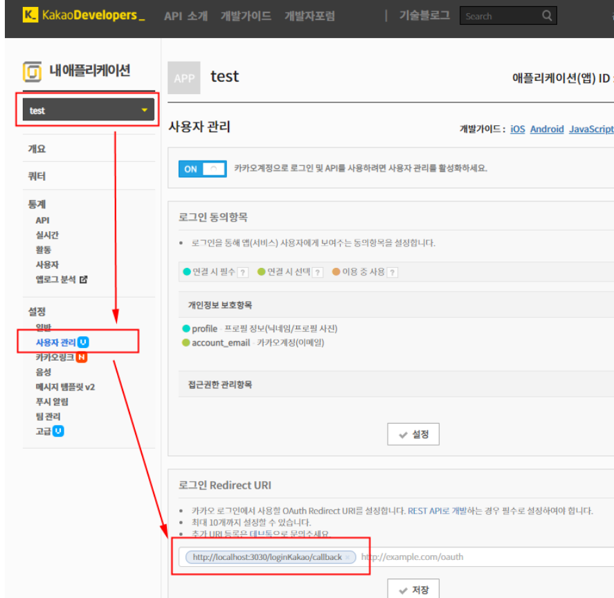
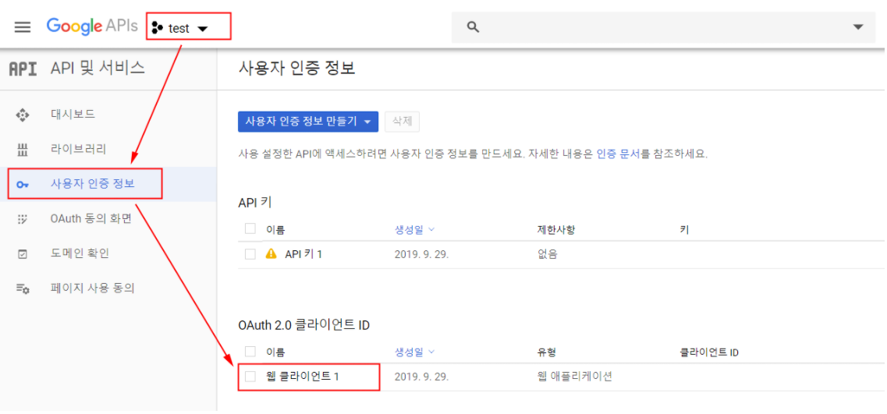
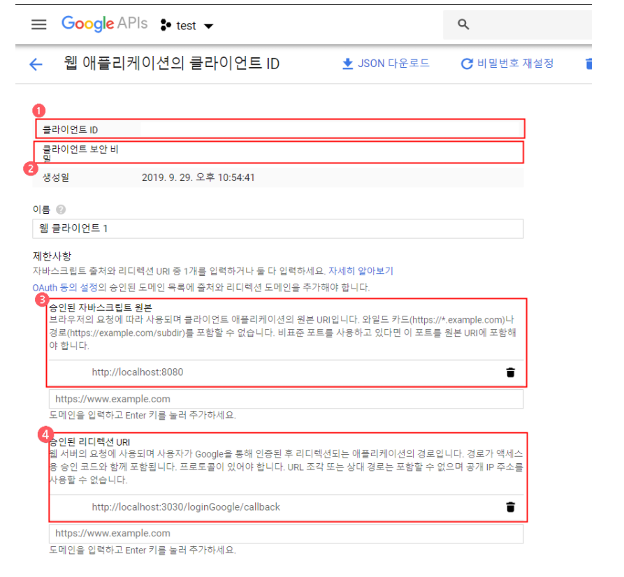

# SNS Login with Vue js

[toc]

## Developers - App setting

> 각 플랫폼 개발자 센터에서 앱 생성 후 설정을 완료. 
>
> 필요한 ClientID 및 Key 값을 가져온다.

**개발자 센터에서 SNS 로그인을 위한 설정**

### Kakao Developers

> 각 플랫폼 개발자 센터에서 앱 생성 후 설정을 완료한다. 
>
> 필요한 ClientID 및 Key 값을 가져온다.
> [Kakao Developers](https://developers.kakao.com/apps)에 로그인 후 앱을 만들고 아래 항목을 확인하고 설정한다.

#### App setting

1. Client ID 확인



2. Client Secret 확인



3. Service URL 설정



4. Callback URL 설정




## env

앱 설정 시 확인/설정한 값들을 .env에 세팅한다.

#### client/.env.dev

```
VUE_APP_CLIENT_ID_KAKAO=
VUE_APP_CALLBACK_URL_KAKAO=http://localhost:8080/
```

#### server/.env

```
CLIENT_ID_KAKAO=
CLIENT_SECRET_KAKAO=
CALLBACK_URL_KAKAO=http://localhost:8080/
```


## 참고

- [Kakao 로그인 이해하기](https://developers.kakao.com/docs/latest/ko/kakaologin/common)
- [Kakao REST API 개발가이드 : 로그인](https://developers.kakao.com/docs/restapi/user-management#로그인)
- [Kakao REST API 개발가이드 : 사용자 정보 요청](https://developers.kakao.com/docs/restapi/user-management#사용자-정보-요청)


## Google console

각 플랫폼 개발자 센터에서 앱 생성 후 설정을 완료한다. 필요한 ClientID 및 Key 값을 가져온다.
[Google console](https://console.developers.google.com/apis/credentials)에 로그인 후 앱을 만들고 아래 항목을 확인하고 설정한다.


## App Setting



1. Client ID 확인
2. Client Secret 확인
3. Service URL 설정
4. Callback URL 설정



#### env

앱 설정 시 확인/설정한 값들을 .env에 세팅한다.

#### client/.env.dev

```
VUE_APP_CLIENT_ID_GOOGLE=
VUE_APP_CALLBACK_URL_GOOGLE=http://localhost:8080/
```

#### server/.env

```
CLIENT_ID_GOOGLE=
CLIENT_SECRET_GOOGLE=
CALLBACK_URL_GOOGLE=http://localhost:8080/
```


## 참고

- [OAuth 2.0 Flow: Server-side web apps](https://developers.google.com/youtube/v3/guides/auth/server-side-web-apps?hl=ko)


-----


------

## Reference

[SNS Login with Vue js](https://github.com/sinyya/sns-login-vuejs)

[Vue.js 소셜 로그인](https://parkjihwan.tistory.com/9)