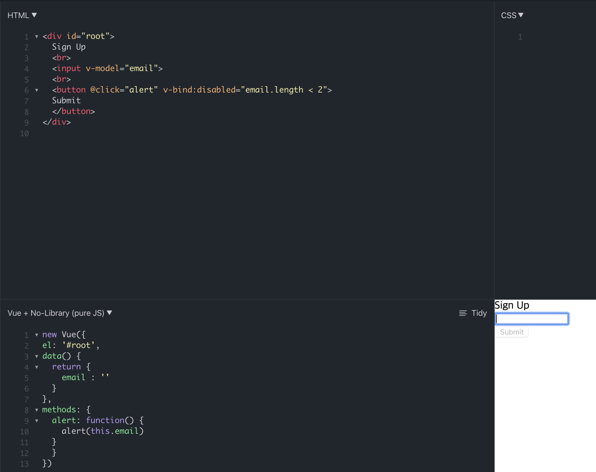

#  TIL

[toc]

## 참고

### 1. v-bind:disabled

- disabled="쌍따옴표안의 특정 조건을 만족하는 경우 비활성화됨"
- `v-bind:disabled="email.length < 2"`
  - 이메일의 길이가 2보다 작을 경우 버튼이 비 활성화 됨
  - Sign Up 아래의 input창의 email length가 2보다 작으면 버튼이 비활성화 되어 있음
  - 

### 2. v-bind:class

> ## 클래스와 스타일 바인딩(Class and Style Bindings)
>
> 데이터 바인딩은 엘리먼트의 클래스 목록과 인라인 스타일을 조작하기 위해 사용되며 v-bind 로 처리함
>
> ## HTML 클래스 바인딩하기(HTML Class Bindings)
>
> ### 객체 구문
>
> 클래스를 동적으로 토글하기 위해 `v-bind:class`에 객체를 전달할 수 있습니다.
>
> ```vue
> <div v-bind:class="{ active: isActive }"></div>
> ```
>
> 위 구문은 `active` 클래스의 존재 여부가 데이터 속성 `isActive` 의 참 속성에 의해 결정되는 것을 의미합니다.
>
> 객체에 필드가 더 있으면 여러 클래스를 토글 할 수 있습니다. 또한`v-bind:class` 디렉티브는 일반 `class` 속성과 공존할 수 있습니다. 그래서 다음과 같은 템플릿이 가능합니다:
>
> ```vue
> <div
>   class="static"
>   v-bind:class="{ active: isActive, 'text-danger': hasError }"
> ></div>
> ```
>
> 그리고 데이터는:
>
> ```js
> data: {
>   isActive: true,
>   hasError: false
> }
> ```
>
> 아래와 같이 렌더링 됩니다:
>
> ```vue
> <div class="static active"></div>
> ```
>
> `isActive` 또는 `hasError` 가 변경되면 클래스 목록도 그에 따라 업데이트됩니다. 예를 들어, `hasError` 가 `true` 가 되면 클래스 목록은 `"static active text-danger"` 가됩니다.
>
> 바인딩 된 객체는 인라인 일 필요는 없습니다.
>
> ```vue
> <div v-bind:class="classObject"></div>
> data: {
>   classObject: {
>     active: true,
>     'text-danger': false
>   }
> }
> ```
>
> 같은 결과로 렌더링 됩니다. 또한 객체를 반환하는 계산된 속성에도 바인딩 할 수 있습니다. 이것은 일반적이며 강력한 패턴입니다.
>
> ```vue
> <div v-bind:class="classObject"></div>
> data: {
>   isActive: true,
>   error: null
> },
> computed: {
>   classObject: function () {
>     return {
>       active: this.isActive && !this.error,
>       'text-danger': this.error && this.error.type === 'fatal'
>     }
>   }
> }
> ```
>
> ### 배열 구문
>
> v-bind:class=”[ ]” 와같이 배열로 담을 수 잇고 이때는 data 에 참, 거짓 속성이 아닌 원하는 클래스명의 이름을 적어주면 그대로 렌더링 되어 결과로 나타남. 아래의 예제로 이해를 해보자
>
> ```html
> //HTML
> <div v-bind:class="[activeClass, errorClass]"></div>
> 
> //JavaScript
> data: {
>     activeClass: 'active',
>     errorClass: 'text-danger'
> }
> <div class="active text-danger"></div>
> ```
>
> 또한 조건부 토글도 가능하며 이는 삼항 연산자를 사용함
>
> ```html
> <div v-bind:class="[isActive ? activeClass : '', errorClass]">
> <div v-bind:class="[isActive && activeClass, errorClass]">
> <div v-bind:class="[{ active: isActive }, errorClass]">
> ```
>
> 이런식으로도 줄여서 작성이 가능하다고 함
> 위에서 isActive 가 참이면 active 클래스가 적용되고, 거짓이면 error 클래스가 적용됨
>
> ### 컴포넌트(Component)와 함께 사용하는 방법
>
> - 컴포넌트란?
>   기본 HTML 엘리먼트를 확장해 재사용 가능한 코드를 캡슐화 하는데 사용
>
> 컴포넌트를 어떤식으로 생성을 하나보면
>
> ```html
> Vue.component('my-component', {
>     template: '<p class="foo var">Hi</p>'
> })
> ```
>
> 이렇게 컴포넌트를 정의를 하면 HTML에서 작성할 수 있음
>
> ```html
> <my-component class="baz boo"></my-component>
> ```
>
> 위와 같이 작성을 하면 렌더링 되어 아래 코드로 나타남
>
> ```html
> <p class="foo bar baz boo">Hi</p>
> ```
>
> 클래스 바인딩도 동일함
>
> ```html
> <my-component v-bind:class=" { active: isActive }"></my-component>
> ```
>
> 여기서 isActive 가 참일 때 렌더링 된 HTML은 아래 코드와 같다
>
> ```html
> <p class="foo bar active">Hi</p>
> ```
>
> ## 인라인 스타일 바인딩
>
> ------
>
> ### 객체 구문
>
>  v-bind:style 객체 구문은 CSS 처럼 보이지만 JavaScript 객체이다
> 속성 이름에는 **camelCase**와 **kebab-case**를 사용해야함
> camelCase는 들어봤는데 kebab-case는 처음 들어봐서 검색을 해봄
>
> - camelCase에서 대문자 대신에 소문자로 고치고 - 를 붙인다
>   camelCase => ‘camel-case’
>   이때 kebab-case를 사용하려면 따옴표를 함께 사용해야 함
>
> ```vue
> <div v-bind:style=" { color: activeColor, fontSize: fontSize + 'px' }"></div>
> data: {
>     activeColor: 'red',
>     fontSize: 30
> }
> ```
>
> ### 배열 구문
>
>  v-bind:style 에 대한 배열 구문은 같은 스타일의 엘리먼트에 여러 개의 스타일 객체를 사용 할 수 있음
>
> ```html
> <div v-bind:style="[baseStyles, overridingStyles]">
> ```
>
> ### 자동 접두사
>
>  v-bind:style 에 브라우저 벤더 접두어(ex: -webkit-, -moz- 등등)가 필요한 CSS 속성을 사용하면 Vue는 자동으로 해당 접두어를 감지해 스타일을 적용함
>
> 출처: https://takeuu.tistory.com/27 [워너비스페셜]

- `v-bind:class="[email.length < 2 ? 'red', 'green']"`
  - 이메일의 length가 2보다 작으면 red , 아니면 green 클래스를 적용 시킴

### 3. v-text

- email의 값이 text형식으로 나옴

  ```html
  <p v-text="email"></p>
  ```

### 4. v-html

- email의 값이 html형식으로 나옴

  ```html
  <p v-html="email"></p>
  ```

### 5. @click="이벤트"
  - 버튼 클릭시 이벤트 실행

```html
	<button @click="addCat">Submit</button>
//버튼 클릭시 이벤트 실행
```

### 6. @keyup.enter || @keyup.13

- 인풋에서 enter키 누를때 이벤트 실행

```html
<input @keyup.enter="addCat" />
//또는
<input @keyup.13="addCat" />
// 키 유니코드로 이벤트 실행 가능
```

### 7. v-on: => @

```html
v-on:click === @click
<button v-on:click="addCat">Submit</button>
//같다
<button @click="addCat">Submit</button>
// v-on: 을 @ 로 축약 가능
```

### 8. v-bind: => :

```html
<div v-bind:class="cats.length === 0 ? 'red' : 'green'"> 헬로우 </div>
//같다
<div :class="cats.length === 0 ? 'red' : 'green'"> 헬로우 </div>
```

### 9. filters : {}

- Vue data를 변형시킴

## login

1. 모바일에서 입력 시 이메일 Input의 첫 글자가 대문자가 되는 현상으로 인해 로그인 실패가 발생하지 않도록 구현

> `autocapitalize` 전역 특성은 사용자가 입력하거나 수정하는 텍스트를 자동으로 대문자로 바꾸는 방식을 제거하는 열거형 특성
>
> - `off` 또는 `none`: 대문자로 변환하지 않음 (모든 문자의 기본값 소문자)
> - `on` 또는 `sentences`: 각 문장의 첫 번째 문자는 기본값 대문자, 다른 모든 문자는 기본값 소문자
> - `words`: 각 단어의 첫 번째 문자는 기본값 대문자, 다른 모든 문자는 기본값 소문자.
> - `characters`: 모든 문자의 기본값 대문자

```html
<input type="text|email|속성값" autocapitalize="off">
```


2. 로그인 실패 시 사용자에게 실패 사유 에러메시지 노출


## Page Not Found

1. 존재하지 않는 URL요청 시 Page Not Found페이지로 이동

- `routes.js`에 아래구문 추가

> 모든 페이지들을 경로와 매칭시킨 이후, route 포함되지 않은 모든 경로(default 값)에 대해서 `NotFoundPage`로 보냄. `'*'` 의 의미는 위에서 어떤 경로와도 매칭이 되지 않은 경우 해당 경로로 이동하라는 의미로 이해하면 된다

```js
 {
        path: '*',
        component: () => import('@/views/NotFoundPage.vue'),
    },
```

- `views` > `NotFoundPage.vue`

```vue
<template>
  <div>
    Page is not found
  </div>
</template>

<script>
export default {};
</script>

<style></style>
```

