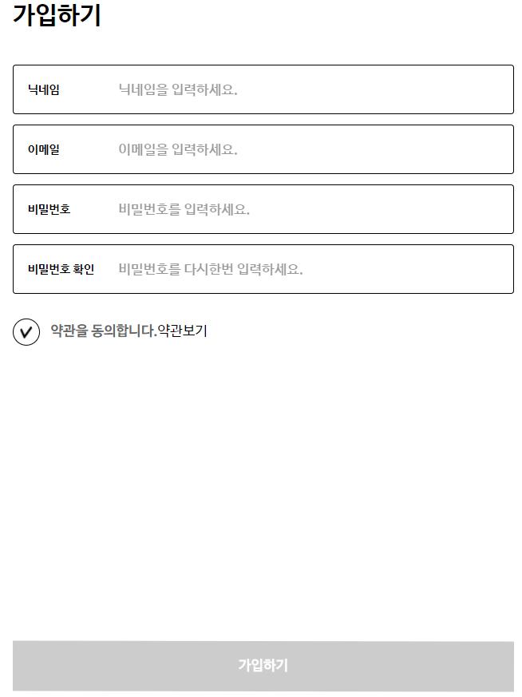
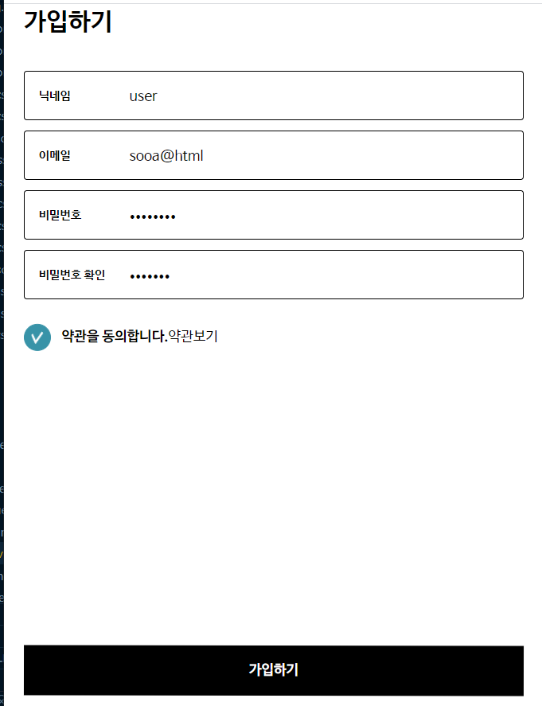
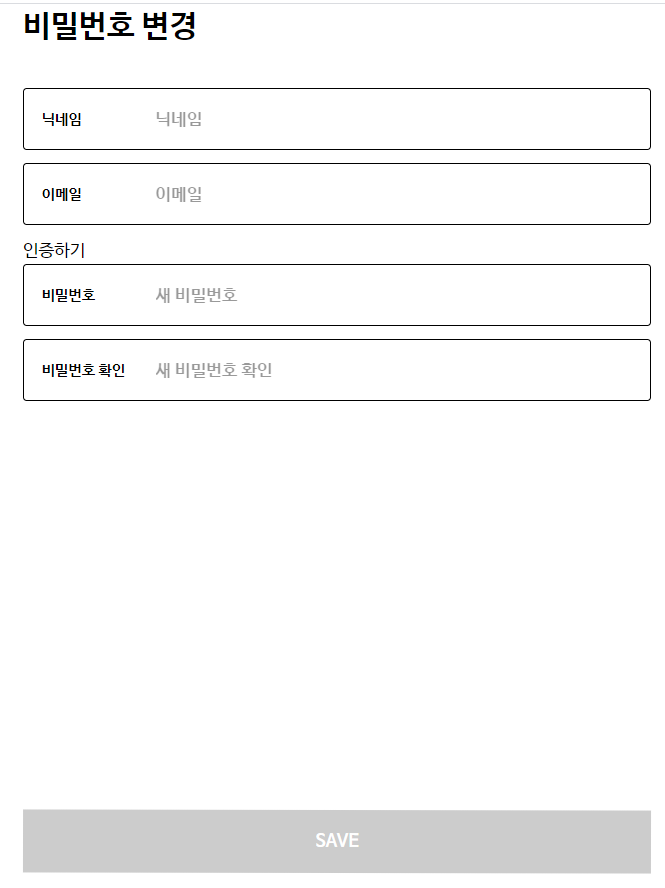
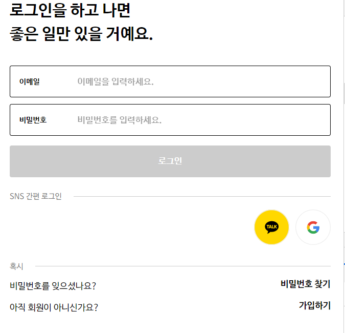
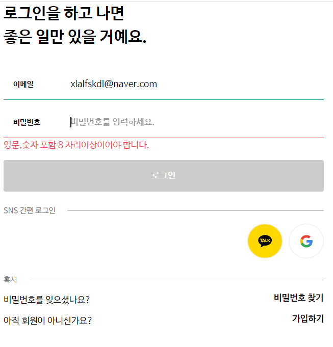
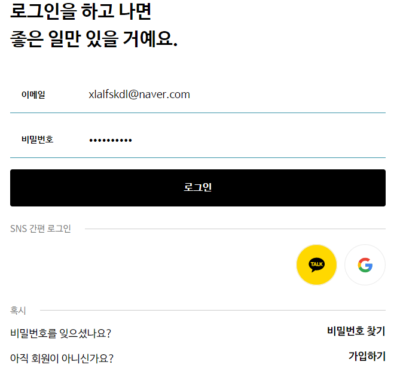
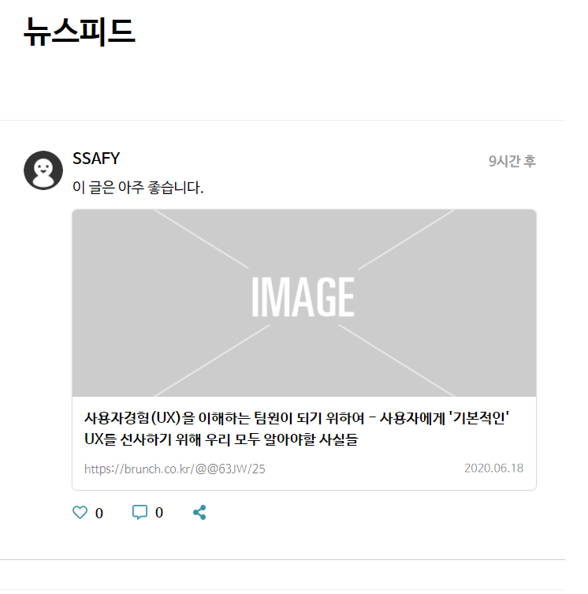
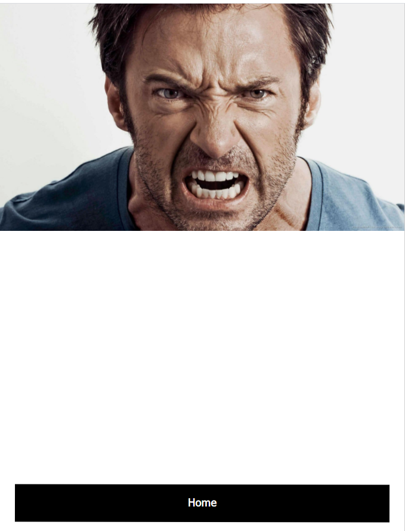

#  TIL

[toc]

## 기능 추가

### CodeSplit

- `routes.js`

```js
import Vue from 'vue'
import VueRouter from 'vue-router'


Vue.use(VueRouter)

export default new VueRouter ({
    mode:'history',
    routes: [
    {
        path : '/',
        name : 'Login',
        component : () => import('./views/user/Login.vue'),
    },
    {
        path : '/user/join',
        name : 'Join',
        component: () => import('./views/user/Join.vue'),
    },
    {
        path : '/feed/main',
        name : 'FeedMain',
        component: () => import('./views/feed/IndexFeed.vue'),
    },
    {
        path : '/components',
        name : 'Components',
        component : () => import('./views/Components.vue'),
    },
    // pageNotFound로 가기
    {
        path : '/user/joinComplete',
        name : 'JoinComplete',
        component: () => import('./views/user/JoinComplete.vue'),
    },
    {
        path : '/user/ChangePw',
        name : 'ChangePw',
        component: () => import('./views/user/ChangePw.vue'),
    },
    {
        path : '/Error',
        name : 'Error',
        component: () => import('./views/Error.vue'),
    },
    {
        path: '*',
        component: () => import('./views/NotFoundPage.vue'),
    },
    ]
})
```


## Join

1. 가입 필수 항목 모두 입력 시에만 '가입 완료' 버튼 활성화

> 회원 가입 회원 관리에 필요한 최소 정보는 필수로 포함 필수항목 : 이메일, 비밀번호, 비밀번호 확인, 이름, 약관선택유무
>
> 모두 충족시켜야 가입 완료 버튼 활성화
>
> `:disabled`로 `isButtonDisabled`가 false여야 버튼이 활성화되고
>
> `class`를 통해 `btn-bottom의 scss`에 `&.disabled` 코드를 통해  `isButtonDisabled`가 true면 disabled class를 붙여 비활성화된 상태로 보이게 함
>
> ```scss
> .btn-bottom {
>  width: calc(100% - 40px);
>  background: #000;
>  color: #fff;
>  height: 50px;
>  text-align: center;
>  line-height: 50px;
>  font-weight: $f600;
>  position: fixed;
>  left: 20px;
>  bottom: 17px;
>  cursor: pointer;
>  transform: rotate(.1deg);
>  &.disabled {
>      background: $grey;
>      cursor: default;
>  }
> ```

```vue
<template>
	<!-- 수정 -->
    <button 
        class="btn-bottom"
        :class="{disabled:isButtonDisabled}"
        :disabled="isButtonDisabled"
        @click= "joinComplete"
        >가입하기
    </button>
</template>
<script>
export default {
    //추가
    computed : {
    isButtonDisabled (){
      if (!this.nickName || !this.email || !this.password || !this.passwordConfirm || !this.isTerm) {
       return true
      }
      return false
    }
  },
    methods: {
    joinComplete() {
      console.log("회원가입완료!")
      this.$router.push("/user/JoinComplete");
    }
  }
};
</script>
```

2. 회원 가입 완료 회원가입을 완료 했을 때 보이는 페이지 "인증 메일이 발송되었습니다. 이메일을 확인해주세요" 문구를 화면에 노출

> 이메일 인증: 회원가입 완료 시 인증 이메일 발송 메일 발송은 웹메일의 SMTP 서비스 이용 ( ex. Gmail ) 메일 발송 성공 및 실패 시 메시지 출력

- `JoinComplete.vue`

```vue
<template>
  <div class="user join wrapC">
    <h1>가입완료</h1>
    <p class="mail-text">회원가입 인증 메일이 발송되었습니다. <br/>이메일을 확인해 주세요.</p>
    <button class="btn-bottom">메일 재발송</button>
    
    <button class="btn-bottom" @click="goHome">Home</button>
  </div>
</template>

<script>
export default {
  methods:{
    goHome() {
      this.$router.push("/");
    }
  }
};
</script>
```

3. 비밀번호 변경 페이지 제작

>  비밀번호 입력 기준이 충족되었을 때 '저장'버튼 활성화
>
>  - `Login.vue`에서 `비밀번호 찾기`클릭 
>
>  ```vue
>  <div class="wrap">
>           <p>비밀번호를 잊으셨나요?</p>
>           <router-link to="/user/ChangePw" class="btn--text">비밀번호 찾기</router-link>
>  </div>
>  ```

```vue
<template>
  <div class="user join wrapC">
    <h1>비밀번호 변경</h1>
    <div class="form-wrap">
      <div class="input-with-label">
        <input v-model="nickName" id="nickname" placeholder="닉네임" type="text" />
        <label for="nickname">닉네임</label>
      </div>

      <div class="input-with-label">
        <input v-model="email" id="email" placeholder="이메일" type="text" />
        <label for="email">이메일</label>
      </div>
      <h4 class = "auth">인증하기</h4>

      <div class="input-with-label">
        <input v-model="password" id="password" :type="passwordType" placeholder="새 비밀번호" />
        <label for="password">비밀번호</label>
      </div>

      <div class="input-with-label">
        <input
          v-model="passwordConfirm"
          :type="passwordConfirmType"
          id="password-confirm"
          placeholder="새 비밀번호 확인"
        />
        <label for="password-confirm">비밀번호 확인</label>
      </div>
    </div>


    <button 
    class="btn-bottom"
    :class="{disabled:isButtonDisabled}"
    :disabled="isButtonDisabled"
    @click= "joinComplete">SAVE</button>
  </div>
</template>

<script>
export default {
  data: () => {
    return {
      email: "",
      password: "",
      passwordConfirm: "",
      nickName: "",
      passwordType: "password",
      passwordConfirmType: "password",
      termPopup: false
    };
  },
  methods: {
    joinComplete() {
      console.log("비밀번호변경!")
      this.$router.push("/user/joinComplete");
    }
  },
  computed : {
    isButtonDisabled (){
      if (!this.nickName || !this.email || !this.password || !this.passwordConfirm) {
       return true
      }
      return false
    }
  }
};
</script>
```

### 가입페이지





### 가입완료페이지


### 비밀번호 변경페이지




## login

1. 모바일에서 입력 시 이메일 Input의 첫 글자가 대문자가 되는 현상으로 인해 로그인 실패가 발생하지 않도록 구현

> `autocapitalize` 전역 특성은 사용자가 입력하거나 수정하는 텍스트를 자동으로 대문자로 바꾸는 방식을 제거하는 열거형 특성
>
> - `off` 또는 `none`: 대문자로 변환하지 않음 (모든 문자의 기본값 소문자)
> - `on` 또는 `sentences`: 각 문장의 첫 번째 문자는 기본값 대문자, 다른 모든 문자는 기본값 소문자
> - `words`: 각 단어의 첫 번째 문자는 기본값 대문자, 다른 모든 문자는 기본값 소문자.
> - `characters`: 모든 문자의 기본값 대문자

```html
<input type="text|email|속성값" autocapitalize="off">
```


2. 이메일 형식 입력 및 비밀번호 입력 기준 충족 시에만 `로그인`버튼 활성화

> `:disabled`로 `isButtonDisabled`가 false여야 버튼이 활성화되고
>
> `class`를 통해 `btn-bottom의 scss`에 `&.disabled` 코드를 통해  `isButtonDisabled`가 true면 disabled class를 붙여 비활성화된 상태로 보이게 함
>
> ```scss
> // &.disabled추가 grey로 보이게 만듦
> .btn--back {
>  width: $c100;
>  background-color: #000;
>  border-radius: 3px;
>  font-weight: $f600;
>  box-shadow: none;
>  height: 50px;
>  line-height: 50px;
>  &.disabled {
>      background: $grey;
>      cursor: default;
>  }
> ```

```vue
<template>
	<!-- 수정 -->
    <!-- isSubmit이 false이면 disabled 클래스 적용, isSubmit이 false이면 버튼 비활성화 -->
      <button
        class="btn btn--back btn--login"
        @click="onLogin"
        :disabled="isButtonDisabled"
        :class="{disabled : isButtonDisabled }"
      >로그인
    </button>
</template>
<script>
import "../../components/css/user.scss";
// password유효성검사
import PV from "password-validator";
// email유효성검사
import * as EmailValidator from "email-validator";
// sns로그인기능
import KakaoLogin from "../../components/user/snsLogin/Kakao.vue";
import GoogleLogin from "../../components/user/snsLogin/Google.vue";
import UserApi from "../../api/UserApi";

export default {
  components: {
    KakaoLogin,
    GoogleLogin
  },
  created() {
    this.component = this;
    // 비밀번호 8자~100자사이 숫자, 문자 포함(비밀번호형식)
    this.passwordSchema
      .is()
      .min(8)
      .is()
      .max(100)
      .has()
      .digits()
      .has()
      .letters();
  },
  watch: {
    // password에 변화가 있으면 checkForm함수 실행
    password: function(v) {
      this.checkForm();
    },
    // email에 변화가 있으면 checkForm함수 실행
    email: function(v) {
      this.checkForm();
    }
  },
  methods: {
    goError() {
      console.log('에러!');
      this.$router.push("/Error");
    },
    checkForm() {
      // email.length가 0이상이고 email이 이메일형식이 false라면(맞다면 true,아니면 false)
      if (this.email.length >= 0 && !EmailValidator.validate(this.email))
        this.error.email = "이메일 형식이 아닙니다.";
      else this.error.email = false;
      // password.length가 0이상이고, password형식이 false라면(틀리다면)
      if (
        this.password.length >= 0 &&
        !this.passwordSchema.validate(this.password)
      )
        this.error.password = "영문,숫자 포함 8 자리이상이어야 합니다.";
      else this.error.password = false;
      // isSubmit 변수 true로 할당
      let isSubmit = true;
      // error객체 하나하나(email, password가 v에 들어감)
      Object.values(this.error).map(v => {
        // email이나 password가 true(에러!, 에러가아니라면 false임)라면 isSubmit은 false
        if (v) isSubmit = false;
      });
      // isSubmit이 true면 이메일,비밀번호 valid!, false라면 하나라도 valid하지 않음
      this.isSubmit = isSubmit;
    },
    onLogin() {
      // isSubmit이 true라면(valid하다면)
      if (this.isSubmit) {
        // email, password를 data 변수에 넣음
        let { email, password } = this;
        let data = {
          email,
          password
        };

        //요청 후에는 버튼 비활성화
        this.isSubmit = false;
        // UserApi에 requestLogin으로 data를 보냄
        UserApi.requestLogin(
          data,
          res => {
            //통신을 통해 전달받은 값 콘솔에 출력
            //console.log(res);

            //요청이 끝나면 버튼 활성화
            this.isSubmit = true;
            // 요청성공했으니 main으로 이동
            this.$router.push("/feed/main");
          },
          // login실패
          error => {
            //요청이 끝나면 버튼 활성화
            this.isSubmit = true;
            // 요청실패했으니 Error으로 이동
            this.$router.push("/Error");
          }
        );
      }
    }
  },
  data: () => {
    return {
      email: "",
      password: "",
      passwordSchema: new PV(),
      error: {
        email: false,
        passowrd: false
      },
      isSubmit: false,
      component: this,
    };
  },
  //추가
  computed : {
    isButtonDisabled (){
      if (!this.email || !this.password || !this.isSubmit) {
       return true
      } 
      return false
    }
  }
};
</script>
```

### Login 결과페이지







### 로그인완료 후 메인페이지로 이동



## Page Not Found

1. 존재하지 않는 URL요청 시 Page Not Found페이지로 이동

- `routes.js`에 아래구문 추가

> 모든 페이지들을 경로와 매칭시킨 이후, route 포함되지 않은 모든 경로(default 값)에 대해서 `NotFoundPage`로 보냄. `'*'` 의 의미는 위에서 어떤 경로와도 매칭이 되지 않은 경우 해당 경로로 이동하라는 의미로 이해하면 된다

```js
 {
        path: '*',
        component: () => import('@/views/NotFoundPage.vue'),
    },
```

- `views` > `NotFoundPage.vue`

```vue
<template>
  <div>
    Page is not found
  </div>
</template>

<script>
export default {};
</script>

<style></style>
```


2. Error 페이지

> 웹 페이지에 오류가 발생하는 경우 Error 페이지로 이동



## 주소지정

- 프로젝트폴더 위치에 `jsconfig.json`파일 추가

```json
{
  "compilerOptions": {
    "baseUrl": ".",
    "paths": {
      "~/*": [
        "./*"
      ],
      "@/*": [
        "./src/*"
      ],
    }
  },
  "exclude": [
    "node_modules",
    "dist"
  ]
}
```


## 참고

### 1. v-bind:disabled

- disabled="쌍따옴표안의 특정 조건을 만족하는 경우 비활성화됨"
- `v-bind:disabled="email.length < 2"`
  - 이메일의 길이가 2보다 작을 경우 버튼이 비 활성화 됨
  - Sign Up 아래의 input창의 email length가 2보다 작으면 버튼이 비활성화 되어 있음
  - 

### 2. v-bind:class

> ## 클래스와 스타일 바인딩(Class and Style Bindings)
>
> 데이터 바인딩은 엘리먼트의 클래스 목록과 인라인 스타일을 조작하기 위해 사용되며 v-bind 로 처리함
>
> ## HTML 클래스 바인딩하기(HTML Class Bindings)
>
> ### 객체 구문
>
> 클래스를 동적으로 토글하기 위해 `v-bind:class`에 객체를 전달할 수 있습니다.
>
> ```vue
> <div v-bind:class="{ active: isActive }"></div>
> ```
>
> 위 구문은 `active` 클래스의 존재 여부가 데이터 속성 `isActive` 의 참 속성에 의해 결정되는 것을 의미합니다.
>
> 객체에 필드가 더 있으면 여러 클래스를 토글 할 수 있습니다. 또한`v-bind:class` 디렉티브는 일반 `class` 속성과 공존할 수 있습니다. 그래서 다음과 같은 템플릿이 가능합니다:
>
> ```vue
> <div
>   class="static"
>   v-bind:class="{ active: isActive, 'text-danger': hasError }"
> ></div>
> ```
>
> 그리고 데이터는:
>
> ```js
> data: {
>   isActive: true,
>   hasError: false
> }
> ```
>
> 아래와 같이 렌더링 됩니다:
>
> ```vue
> <div class="static active"></div>
> ```
>
> `isActive` 또는 `hasError` 가 변경되면 클래스 목록도 그에 따라 업데이트됩니다. 예를 들어, `hasError` 가 `true` 가 되면 클래스 목록은 `"static active text-danger"` 가됩니다.
>
> 바인딩 된 객체는 인라인 일 필요는 없습니다.
>
> ```vue
> <div v-bind:class="classObject"></div>
> data: {
>   classObject: {
>     active: true,
>     'text-danger': false
>   }
> }
> ```
>
> 같은 결과로 렌더링 됩니다. 또한 객체를 반환하는 계산된 속성에도 바인딩 할 수 있습니다. 이것은 일반적이며 강력한 패턴입니다.
>
> ```vue
> <div v-bind:class="classObject"></div>
> data: {
>   isActive: true,
>   error: null
> },
> computed: {
>   classObject: function () {
>     return {
>       active: this.isActive && !this.error,
>       'text-danger': this.error && this.error.type === 'fatal'
>     }
>   }
> }
> ```
>
> ### 배열 구문
>
> v-bind:class=”[ ]” 와같이 배열로 담을 수 잇고 이때는 data 에 참, 거짓 속성이 아닌 원하는 클래스명의 이름을 적어주면 그대로 렌더링 되어 결과로 나타남. 아래의 예제로 이해를 해보자
>
> ```html
> //HTML
> <div v-bind:class="[activeClass, errorClass]"></div>
> 
> //JavaScript
> data: {
>     activeClass: 'active',
>     errorClass: 'text-danger'
> }
> <div class="active text-danger"></div>
> ```
>
> 또한 조건부 토글도 가능하며 이는 삼항 연산자를 사용함
>
> ```html
> <div v-bind:class="[isActive ? activeClass : '', errorClass]">
> <div v-bind:class="[isActive && activeClass, errorClass]">
> <div v-bind:class="[{ active: isActive }, errorClass]">
> ```
>
> 이런식으로도 줄여서 작성이 가능하다고 함
> 위에서 isActive 가 참이면 active 클래스가 적용되고, 거짓이면 error 클래스가 적용됨
>
> ### 컴포넌트(Component)와 함께 사용하는 방법
>
> - 컴포넌트란?
>   기본 HTML 엘리먼트를 확장해 재사용 가능한 코드를 캡슐화 하는데 사용
>
> 컴포넌트를 어떤식으로 생성을 하나보면
>
> ```html
> Vue.component('my-component', {
>     template: '<p class="foo var">Hi</p>'
> })
> ```
>
> 이렇게 컴포넌트를 정의를 하면 HTML에서 작성할 수 있음
>
> ```html
> <my-component class="baz boo"></my-component>
> ```
>
> 위와 같이 작성을 하면 렌더링 되어 아래 코드로 나타남
>
> ```html
> <p class="foo bar baz boo">Hi</p>
> ```
>
> 클래스 바인딩도 동일함
>
> ```html
> <my-component v-bind:class=" { active: isActive }"></my-component>
> ```
>
> 여기서 isActive 가 참일 때 렌더링 된 HTML은 아래 코드와 같다
>
> ```html
> <p class="foo bar active">Hi</p>
> ```
>
> ## 인라인 스타일 바인딩
>
> ------
>
> ### 객체 구문
>
>  v-bind:style 객체 구문은 CSS 처럼 보이지만 JavaScript 객체이다
> 속성 이름에는 **camelCase**와 **kebab-case**를 사용해야함
> camelCase는 들어봤는데 kebab-case는 처음 들어봐서 검색을 해봄
>
> - camelCase에서 대문자 대신에 소문자로 고치고 - 를 붙인다
>   camelCase => ‘camel-case’
>   이때 kebab-case를 사용하려면 따옴표를 함께 사용해야 함
>
> ```vue
> <div v-bind:style=" { color: activeColor, fontSize: fontSize + 'px' }"></div>
> data: {
>     activeColor: 'red',
>     fontSize: 30
> }
> ```
>
> ### 배열 구문
>
>  v-bind:style 에 대한 배열 구문은 같은 스타일의 엘리먼트에 여러 개의 스타일 객체를 사용 할 수 있음
>
> ```html
> <div v-bind:style="[baseStyles, overridingStyles]">
> ```
>
> ### 자동 접두사
>
>  v-bind:style 에 브라우저 벤더 접두어(ex: -webkit-, -moz- 등등)가 필요한 CSS 속성을 사용하면 Vue는 자동으로 해당 접두어를 감지해 스타일을 적용함
>
> 출처: https://takeuu.tistory.com/27 [워너비스페셜]

- `v-bind:class="[email.length < 2 ? 'red', 'green']"`
  - 이메일의 length가 2보다 작으면 red , 아니면 green 클래스를 적용 시킴

### 3. v-text

- email의 값이 text형식으로 나옴

  ```html
  <p v-text="email"></p>
  ```

### 4. v-html

- email의 값이 html형식으로 나옴

  ```html
  <p v-html="email"></p>
  ```

### 5. @click="이벤트"
  - 버튼 클릭시 이벤트 실행

```html
	<button @click="addCat">Submit</button>
//버튼 클릭시 이벤트 실행
```

### 6. @keyup.enter || @keyup.13

- 인풋에서 enter키 누를때 이벤트 실행

```html
<input @keyup.enter="addCat" />
//또는
<input @keyup.13="addCat" />
// 키 유니코드로 이벤트 실행 가능
```

### 7. v-on: => @

```html
v-on:click === @click
<button v-on:click="addCat">Submit</button>
//같다
<button @click="addCat">Submit</button>
// v-on: 을 @ 로 축약 가능
```

### 8. v-bind: => :

```html
<div v-bind:class="cats.length === 0 ? 'red' : 'green'"> 헬로우 </div>
//같다
<div :class="cats.length === 0 ? 'red' : 'green'"> 헬로우 </div>
```

### 9. filters : {}

- Vue data를 변형시킴

## login

1. 모바일에서 입력 시 이메일 Input의 첫 글자가 대문자가 되는 현상으로 인해 로그인 실패가 발생하지 않도록 구현

> `autocapitalize` 전역 특성은 사용자가 입력하거나 수정하는 텍스트를 자동으로 대문자로 바꾸는 방식을 제거하는 열거형 특성
>
> - `off` 또는 `none`: 대문자로 변환하지 않음 (모든 문자의 기본값 소문자)
> - `on` 또는 `sentences`: 각 문장의 첫 번째 문자는 기본값 대문자, 다른 모든 문자는 기본값 소문자
> - `words`: 각 단어의 첫 번째 문자는 기본값 대문자, 다른 모든 문자는 기본값 소문자.
> - `characters`: 모든 문자의 기본값 대문자

```html
<input type="text|email|속성값" autocapitalize="off">
```


2. 로그인 실패 시 사용자에게 실패 사유 에러메시지 노출


## Page Not Found

1. 존재하지 않는 URL요청 시 Page Not Found페이지로 이동

- `routes.js`에 아래구문 추가

> 모든 페이지들을 경로와 매칭시킨 이후, route 포함되지 않은 모든 경로(default 값)에 대해서 `NotFoundPage`로 보냄. `'*'` 의 의미는 위에서 어떤 경로와도 매칭이 되지 않은 경우 해당 경로로 이동하라는 의미로 이해하면 된다

```js
 {
        path: '*',
        component: () => import('@/views/NotFoundPage.vue'),
    },
```

- `views` > `NotFoundPage.vue`

```vue
<template>
  <div>
    Page is not found
  </div>
</template>

<script>
export default {};
</script>

<style></style>
```

