# SCSS

[toc]

[Sass홈페이지](https://sass-lang.com/)

[Sass공식문서_한글](https://sass-guidelin.es/ko/)

## emit

```html
<!DOCTYPE html>
<html lang="en">
<head>
  <meta charset="UTF-8">
  <meta name="viewport" content="width=device-width, initial-scale=1.0">
  <title>Document</title>
</head>
<body>
  <!-- emit -->
    
  <!-- div*5 -->
  <div></div>
  <div></div>
  <div></div>
  <div></div>
  <div></div>
    
  <!-- div.box*3 -->
  <div class="box"></div>
  <div class="box"></div>
  <div class="box"></div>
    
  <!-- ul>li.list*5 -->
  <ul>
    <li class="list"></li>
    <li class="list"></li>
    <li class="list"></li>
    <li class="list"></li>
    <li class="list"></li>
  </ul>
</body>
</html>
```

## VS code 설정

> 해당 프로젝트 설정만 바꾸고 싶다면 작업영역(workspace)에서 설정 바꿔주면 된다

### Live Sass Compiler 설치

>  예를들어 `test.scss`파일을 만들어 아래의 코드를 작성한 뒤
>
> ```scss
> $fs:16px;
> 
> body {
>   font-sixe:$fs;
> }
> ```
>
> 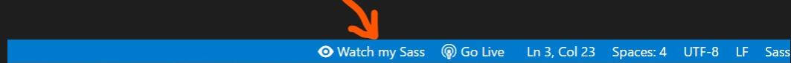
>
> `Watch my Sass`를 누르면 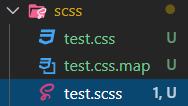 이렇게 `test.css`, `test.css.map`파일이 생긴다.
>
> ```css
> /* test.css */
> body {
>   font-size: 16px;
> }
> /*# sourceMappingURL=test.css.map */
> 
> /* test.css.map */
> {
>     "version": 3,
>     "mappings": "AAEA,AAAA,IAAI,CAAC;EACH,SAAS,EAHP,IAAI;CAIP",
>     "sources": [
>         "test.scss"
>     ],
>     "names": [],
>     "file": "test.css"
> }
> ```
>
> 같은 폴더에서 변환되는것을 바꾸고 싶다면 `Live Sass Compiler`확장에 들어가면 바꾸는 법이 적혀있음
>
> 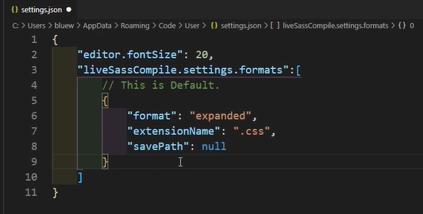
>
> ```json
> {
>   "liveSassCompile.settings.formats": [
>     {
>       "format": "expanded",
>       "extensionName": ".css",
>       "savePath": "/css"
>     },
>   ],
>   "liveSassCompile.settings.excludeList": [
>     "**/node_modules/**",
>     ".vscode/**"
>   ],
>   "liveSassCompile.settings.generateMap": true,
>   "liveSassCompile.settings.autoprefix": [
>     "> 1%",
>     "last 2 versions"
>   ]
> }
> ```
>
> 사용자 설정으로 `setting.json`파일에 위처럼 복붙!
>
> 여기서 `liveSassCompile.settings.formats`를 붙여넣고, `savePath`의 경로를 `null`이 아니라 
>
> `"/"` 이렇게 하면 프로젝트의 root에 저장이되고 아니면 
>
> `"/css"`라고하면 root아래의 css폴더를 만들어 그안에 저장, 
>
> `"~/css"` 해당 sass파일 아래의 css라는 폴더안에 저장
>
> `"~/../css"` `~`는 해당 sass파일 위치 `..`는 해당 폴더의 위에 `/css`css폴더

##  Sass

> CSS작성(생성)을 위한 작고 가벼운 언어이고, Sass와 SCSS가 있다.
>
> **Sass**
>
> SCSS와 작성하는데 있어서 구조적 차이가 있고 작성이 번거롭고 복잡할 수 있다.
>
> **SCSS**
>
> 기존에 알던 CSS와 유사하게 작성할 수 있기 때문에 친근하게 느껴져 배우기가 쉽다

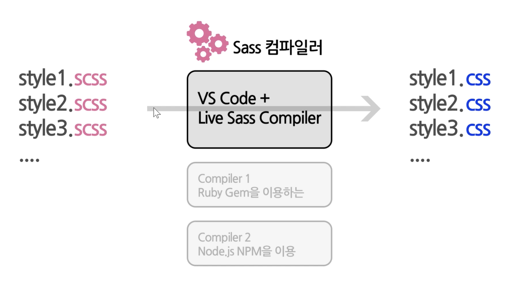

`test.scss`파일을 `watching`을 이용해 바뀐 코드를 자동을 `test.css`로 변환됨

그리고 `sass-test.html`의 head에 `<link rel="stylesheet" href="sass/test.css">`로 연결하면 `live-server`에 의해 자동으로 변환된 값이 새로고침됨

`$원하는 이름:원하는설정`하면 아래에 변수처럼 적용시킬 수 있다

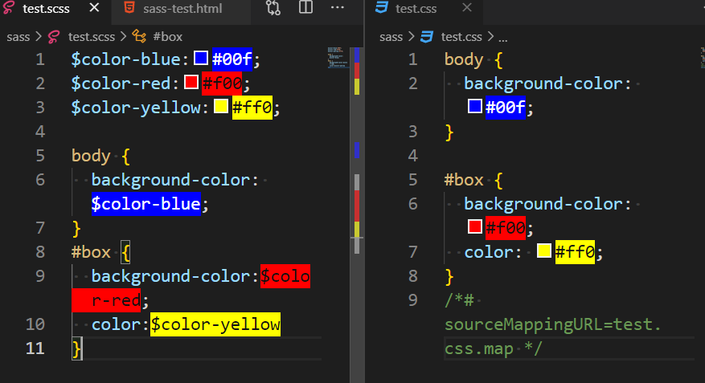


## Scss 문법

### vars

> (참고) html body에 `div#box$*5`를 쓰면 id가 box1부터 box5인 div가 자동 생성
>
> 처음 배울 때는 css랑 똑같이 적어도됨! 그러다가 익숙해지면 개선!
>
> 반복되는 코드가 나올때 예를들어 아래의 글자색, 배경색, width 등
>
> ```scss
> body {
>   background-color: #ddd;
> }
> 
> #box1 {
>   color:#ff0;
>   background-color: #00f;
>   width:100px;
> }
> 
> #box2 {
>   color:#f00;
>   background-color: #00f;
>   width:100px;
> }
> 
> #box3 {
>   color:#ff0;
>   background-color: #00f;
>   width:300px;
> }
> 
> #box4 {
>   color :#f00;
>   background-color: #00f;
>   width:300px;
> }
> 
> #box5 {
>   color:#0f0;
>   background-color: #00f;
> }
> ```
>
> 이렇게 적으면 파란색을 노란색으로 고치고 싶다면 다 바꿔줘야됨! 이걸 변수로 처리하면 한번만 바꾸면 된다!
>
> ```scss
> $bg-color:rgb(73, 83, 221);
> 
> body {
>   background-color: #ddd;
> }
> 
> #box1 {
>   color:#ff0;
>   background-color: $bg-color;
>   width:100px;
> }
> 
> #box2 {
>   color:#f00;
>   background-color: $bg-color;
>   width:100px;
> }
> 
> #box3 {
>   color:#ff0;
>   background-color:$bg-color;
>   width:300px;
> }
> 
> #box4 {
>   color :#f00;
>   background-color:$bg-color;
>   width:300px;
> }
> 
> #box5 {
>   color:#0f0;
>   background-color:$bg-color;
> }
> ```
>
> 

- 변수 이름 규칙

  - `변수 : css에 들어갈 수 있는 모든 값;`

  - `$영문`으로 시작, 영문,숫자,`-`,`_`이렇게만 들어갈 수 있다 

### Nesting

> 포함관계

- `sass-basic.html`

```html
<!DOCTYPE html>
<html lang="en">
<head>
  <meta charset="UTF-8">
  <meta name="viewport" content="width=device-width, initial-scale=1.0">
  <title>Document</title>
  <link rel="stylesheet" href="/css/sass-basic.css">
</head>
<body>
  <div id="box1">
    box1<br>
    <a href="#">button1</a>
    <div id="box2">
      box2<br>
      <a href="#">button2</a>
    </div>
  </div>
</body>
</html>
```

- `sass-basic.scss`

```scss
html {
  font-size: 18px; 
}

body {
  margin: 20px;
  background-color: #fff4ef;
}

div {
  color: #333;
  padding: 20px;
}

a {
  display: inline-block;
  margin: 10px 0;
}

#box1 {
  font-size: 40px;
  background-color: #ffcccc;
  // 모서리둥글게함
  border-radius: 20px;
  // 모서리,테두리
  border: 3px solid #f00;
  // 그림자
  box-shadow: 0px 3px 11px 0px rgba(0, 0, 0, 0.75);
}

#box1 > a {
  color: #a22;
  text-decoration: none;
}

#box1 > a:hover {
  color: #000;
  text-decoration: underline;
}

#box1:hover {
  background-color: #ccc;
}

#box1 #box2 {
  font-size: 20px;
  background-color: #e9e9e9;
  
  border-radius: 20px;
  border: 3px solid #f00;
  box-shadow: 0px 3px 11px 0px rgba(0, 0, 0, 0.75);
}

#box1 #box2 > a {
  color: #ee6633;
  text-decoration: none;
}

#box1 #box2 > a:hover {
  color: #a22;
  text-decoration: underline;
}
```

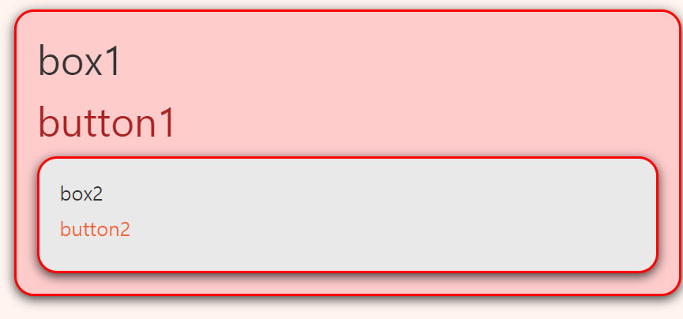

- 여기서 scss는 포함관계를 나타낼 수 있는데 만약 아래처럼 `box1`id 아래에 `a`를 적고 css를 적는다면, 변환된 css파일에는 box1id아래 모든 a태그를 가리키는 css로 변환된다!

- scss파일

```scss
#box1 {
  font-size: 40px;
  background-color: #ffcccc;
  // 모서리둥글게함
  border-radius: 20px;
  // 모서리,테두리
  border: 3px solid #f00;
  // 그림자
  box-shadow: 0px 3px 11px 0px rgba(0, 0, 0, 0.75);
  a {
  color: #a22;
  text-decoration: none;
  };
  a:hover {
  color: #000;
  text-decoration: underline;
  };
}
```

- css파일

```css
#box1 a {
  color: #a22;
  text-decoration: none;
}

#box1 a:hover {
  color: #000;
  text-decoration: underline;
}
```

- 하지만 이렇게 하면 box1id아래 모든  `a`가 해당되기 때문에 바로 아래의 a만 적용하고 싶다면 `&`를 이용!

#### `&`(자기자신)

> `&`를 이용하면`#box1` 아래에 
>
> `&:hover`는 `#box1:hover`
>
> `& > a` 는 `#box1 > a`, 그 아래 또 `&:hover`를 한다면 `#box1 > a:hover`
>
> `&,&-title` , 자기자신(`#box1`)과 `#box-title`에 중복되는 코드를 `,`로 묶어서 적을 수 있다.
>
> `#box1-title` 은 `&-title`로도 표시할 수 있다

- scss

```scss
#box1 {
  font-size: 40px;
  background-color: #ffcccc;
  // 그림자
  box-shadow: 0px 3px 11px 0px rgba(0, 0, 0, 0.75);
  &:hover {
    background-color: #ccc;
  }
  // 중복되는코드 넣어주기
  &,&-title {
    border-radius: 20px;
    // 모서리,테두리
    border: 3px solid #f00;
  }
  // #box1-title
  &-title {
    font-style: italic;
    text-decoration: underline;
  }
  & > a {
  color: #a22;
  text-decoration: none;
  &:hover {
      color: #000;
      text-decoration: underline;
    }
  };
}
```

- css

```css
#box1 {
  font-size: 40px;
  background-color: #ffcccc;
  -webkit-box-shadow: 0px 3px 11px 0px rgba(0, 0, 0, 0.75);
          box-shadow: 0px 3px 11px 0px rgba(0, 0, 0, 0.75);
}

#box1:hover {
  background-color: #ccc;
}

#box1, #box1-title {
  border-radius: 20px;
  border: 3px solid #f00;
}

#box1-title {
  font-style: italic;
  text-decoration: underline;
}

#box1 > a {
  color: #a22;
  text-decoration: none;
}

#box1 > a:hover {
  color: #000;
  text-decoration: underline;
}
```

### 코드작성 알아보기 쉽게 유연하게 하면됨

```html
<div class="box1">
    <div class="box2">
      <div class="box3">
        
      </div>
    </div>
  </div>
```

여기서 scss작성법 3가지

```scss
// 1.
.box1 .box2 .box3 {
}
// 2.
.box1 {
  .box2 {
    .box3 {

    }
  }
}
// 3.
.box1 {
  .box2 .box3 {

  }
}
```


### Media Queries

> 반응형페이지(뷰포트에 따라 화면을 다르게 보여줌)

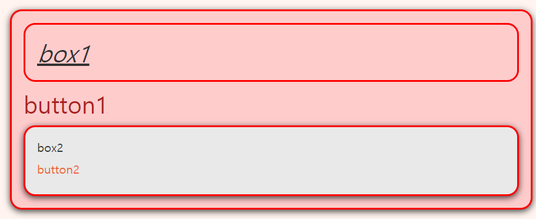

```scss
// 미디어쿼리
// 화면이 500px보다 작아지면 #box1의 font-size줄임
@media screen and (max-width:500px) {
  #box1 {
    font-size:14px
  }
}
```


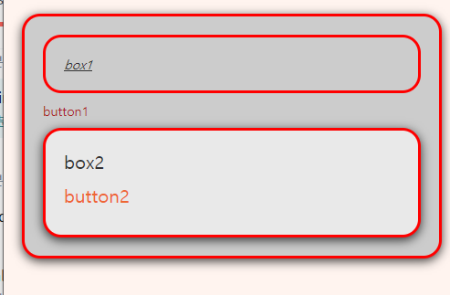

```scss
// 501~900px까지 폰트 지정
@media screen and (min-width:501px) and (max-width:900px) {
  #box1 {
    font-size:24px
  }
}
```

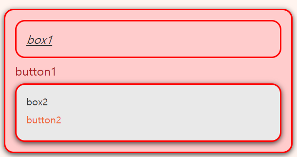

위와 같은 scss를 `#box1`에 `Nesting`으로 넣어주면 됨!

```scss
#box1 {
  font-size: 40px;
  background-color: #ffcccc;
  // 그림자
  box-shadow: 0px 3px 11px 0px rgba(0, 0, 0, 0.75);
  @media screen and (max-width:500px) {
    font-size:14px
  }
  @media screen and (min-width:501px) and (max-width:900px) {
    font-size:24px
  }
  // hover에 media query추가
  &:hover {
    background-color: #ccc;
    @media screen and (max-width:500px) {
      background-color:#999;
    }
  }
```

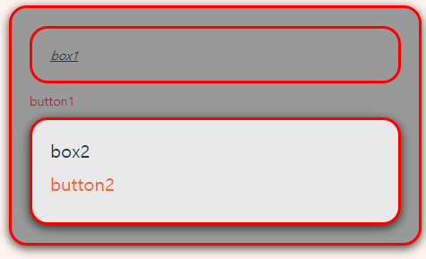


## Mixin

> **속성은 같은데 바꿀 값이 다를때 이것을 하나의 블록으로 만들어서 재사용할 수 있게 만듦**
>
> `@mixin mixin이름(변수) {속성:변수}`로 선언 -> 기본값지정 가능 `(변수:기본값)`
>
> `@include mixin이름(값)`으로 설정 -> 값을 적지 않으면 기본값 적용됨

```scss
// mixin
// 영어로시작 중간에 숫자,-,_가능
// 괄호안에 변수만들기($로시작:기본값), 블록안에서만 사용
@mixin fontSizeBgColor($fontSize:20px,$bgColor:#fff) {
  font-size: $fontSize;
  background-color: $bgColor;
}

@mixin linkStyle($textcolor,$textDeco:none) {
  color: $textcolor;
  text-decoration: $textDeco;
}

#box1 {
  // font-size: 40px;
  // background-color: #ffcccc;
  // mixin사용
  @include fontSizeBgColor(40px,#ffcccc);
  & > a {
    // color: #a22;
    // text-decoration: none;
    @include linkStyle(#a22);
    &:hover {
        // color: #000;
        // text-decoration: underline;
        @include linkStyle(#000,underline);

      }
  }
#box1 #box2 {
  @include fontSizeBgColor(20px,#e9e9e9);
  // font-size: 20px;
  // background-color: #e9e9e9;
  & > a {
    // color: #ee6633;
    // text-decoration: none;
    @include linkStyle(#ee6633);
    &:hover {
      // color: #a22;
      // text-decoration: underline;
      @include linkStyle( #a22,underline);
    }
  }
}
```


## extend

> 코드의 재사용성에 좋음
>
> **완전히 같은 코드를 하나로 묶어서 재사용할 수 있게 하는 것**
>
> `%이름 {같은코드}`
>
> 사용 : `@extend %이름;`

- scss

```scss
// extend (%뒤에 적음)
%boxShape {
  border-radius: 20px;
  border: 3px solid #f00;
  box-shadow: 0px 3px 11px 0px rgba(0, 0, 0, 0.75);
}

#box1 #box2 {
  @extend %boxShape;
  // border-radius: 20px;
  // border: 3px solid #f00;
  // box-shadow: 0px 3px 11px 0px rgba(0, 0, 0, 0.75);
}
```

- css

> 같은것 한번에 표시됨

```css
#box1, #box1-title, #box1 #box2 {
  border-radius: 20px;
  border: 3px solid #f00;
  -webkit-box-shadow: 0px 3px 11px 0px rgba(0, 0, 0, 0.75);
          box-shadow: 0px 3px 11px 0px rgba(0, 0, 0, 0.75);
}
```


## Partial

> 코드를 묶어서 별도로 다른 파일로 나눠서 저장하고 그 파일을 쓸 수 있게 함
>
> `mixin`,`extend`등 각 코드를 파일에 넣어두면 다른 파일에서도 해당 파일을 불러와 사용하면 되기 때문에 코드 중복이 줄어든다
>
> 파일명 예시: `_mixins.scss` 이렇게 앞에 `_`를 붙여서 파일을 만들고 안에 코드를 작성한 뒤 저장을 해도 `css`파일로 자동 컴파일되던 것이 이건 적용이 안된다!
>
> **`_`로 시작하는 파일은 컴파일이 안됨** WHY?? 어차피 이걸 다른파일에서 사용하면 거기서 컴파일될것이기 때문에 이건 컴파일 적용안되게 해둠

- `_mixins.scss`

```scss
@mixin fontSizeBgColor($fontSize:20px,$bgColor:#fff) {
  font-size: $fontSize;
  background-color: $bgColor;
}

@mixin linkStyle($textcolor,$textDeco:none) {
  color: $textcolor;
  text-decoration: $textDeco;
}
```

- `_mixins`를 불러와 적용할 파일

>파일불러오기(Partial) _제외한 파일이름만 적으면 됨

```scss
// mixin
// 영어로시작 중간에 숫자,-,_가능
// 괄호안에 변수만들기($로시작:기본값), 블록안에서만 사용
// @mixin fontSizeBgColor($fontSize:20px,$bgColor:#fff) {
//   font-size: $fontSize;
//   background-color: $bgColor;
// }

// @mixin linkStyle($textcolor,$textDeco:none) {
//   color: $textcolor;
//   text-decoration: $textDeco;
// }
// 파일불러오기(Partial) _제외한 파일이름만 적으면 됨
@import "mixins";
```

- `partial`폴더 아래 `_styles.scss`파일이 있을 떄 불러오는 경로

`partial폴더` > `_styles.scss`

```scss
//extend
%boxShape {
  border-radius: 20px;
  border: 3px solid #f00;
  box-shadow: 0px 3px 11px 0px rgba(0, 0, 0, 0.75);
}
```

- `partialtest.scss`

```scss
// 같은경로
@import "mixins";
// 같은경로의 partial파일 아래 _styles.scss파일
@import "partial/styles";

#test {
  @include fontSizeBgColor(100px,rgb(224, 0, 0));
  @extend %boxShape;
}
```


### Partial Import Error Solution

> VScode `Color Highlight`확장 때문 : 사용안하면됨 -> `colorize`확장으로 바꿈


## if

> 경우에 따라 다른 스타일을 적용하고 싶을때

- `if.html`

```html
<!DOCTYPE html>
<html lang="en">
<head>
  <meta charset="UTF-8">
  <meta name="viewport" content="width=device-width, initial-scale=1.0">
  <title>Document</title>
  <link rel="stylesheet" href="css/if.css">
</head>
<body>
  <div id="box1">box1</div>
  <div id="box2">box2</div>
  <div id="box3">box3</div>

</body>
</html>
```

- `if.scss`

```scss
body {
  margin:50px;
}

//mixin
@mixin textAndBgcolor($textColor,$bgColor) {
  color : $textColor;
  background-color: $bgColor;
}

@mixin theme($mood) {
  // if 조건 인자 mood가 `light`라는 글자와 같다면
  @if $mood == 'light' {
    @include textAndBgcolor(#333,#ff0 )
  }
  // mood가 'dark'와 같다면
  @else if $mood == 'dark' {
    @include textAndBgcolor(#fff,#000 )

  }
  // mood가 그외일때
  @else {
    @include textAndBgcolor(#f00,#aaa )

  }
}

#box1 {
  @include theme('light');
}
#box2 {
  @include theme('dark');
}
#box3 {
  @include theme('아무거나');
}
```

- `if.css`

```css
body {
  margin: 50px;
}

#box1 {
  color: #333;
  background-color: #ff0;
}

#box2 {
  color: #fff;
  background-color: #000;
}

#box3 {
  color: #f00;
  background-color: #aaa;
}
/*# sourceMappingURL=if.css.map */
```


## Boxes Project

> 작업영역에서 설정
>
> 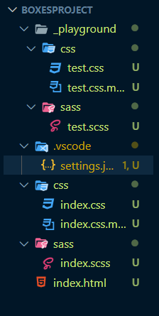
>
> ```json
> {
>   "editor.semanticTokenColorCustomizations": null,
>   "liveSassCompile.settings.formats": [
>     // This is Default.
>     {
>       "format": "expanded",
>       "extensionName": ".css",
>       // ~은 해당 sass파일이 있는 폴더(~)의 상위폴더(../)에 css파일
>       "savePath": "~/../css"
>     },
>     // You can add more
>     // min.css 공백없이 용량줄이기 위한 파일 -> 필요없으면 지워도됨
>     // {
>     //   "format": "compressed",
>     //   "extensionName": ".min.css",
>     //   "savePath": "/dist/css"
>     // },
>     // // More Complex
>     // {
>     //   "format": "compressed",
>     //   "extensionName": ".min.css",
>     //   "savePath": "~/../css/"
>     // }
>   ]
> }
> ```
>
> - `_playground`폴더 `test`용 임시 코드를 넣고 작성함

- `index.html`

> `div.box>div.box-inner*3>div.box-inner-title `에밋
>
> ```html
> <div class="box">
> 
>     <div class="box-inner">
>       <div class="box-inner-title">box-inner-1</div>
>     </div>
> 
>     <div class="box-inner">
>       <div class="box-inner-title">box-inner-2</div>
>     </div>
> 
>     <div class="box-inner">
>       <div class="box-inner-title">box-inner-3</div>
>     </div>    
>   </div>
> ```

```html
<!DOCTYPE html>
<html lang="en">
<head>
  <meta charset="UTF-8">
  <meta name="viewport" content="width=device-width, initial-scale=1.0">
  <title>Boxes</title>
  <link rel="stylesheet" href="css/index.css">
</head>
<body>
  <h1>Boxes</h1>
  <!-- div.box>div.box-inner*3>div.box-inner-title 에밋 -->
  <div class="box">

    <div class="box-inner">
      <div class="box-inner-title">box-inner-1</div>
    </div>

    <div class="box-inner">
      <div class="box-inner-title">box-inner-2</div>
    </div>

    <div class="box-inner">
      <div class="box-inner-title">box-inner-3</div>
    </div>
    
  </div>
</body>
</html>
```

- `index.scss`

### 위치조절

> box를 `position:absolute`로 하고 `left:50%; top:50%`를 하면 기준점이 중간으로 오기때문에 정가운데에 위치하고 있지 않다
>
> 그래서 상자 높이의 반만큼 top에서 빼주고 가로의 반만큼 left에서 빼주면 가운데로 옴

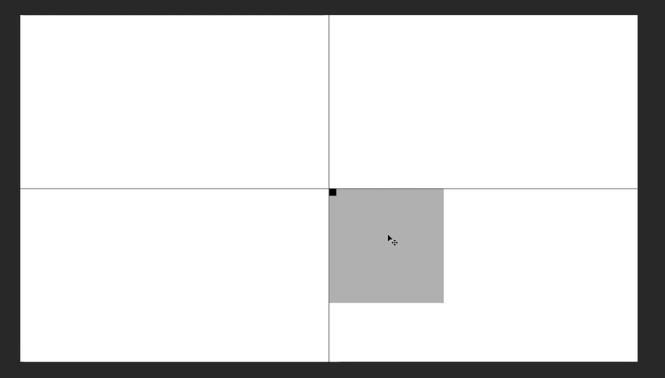

```scss
.box {
  position:absolute;
  // absolute는 부모를 기준으로 기준점이 가운데로 오게됨 -> 정가운데가 아님
  left:50%;
  top:50%;
  // translate(x,y)는 자기자신의 위치를 조절
  // 자기자신 너비의 반만큼 좌우(x), 자기자신 높이의 반만큼 상하(y)
  transform: translate(-50%,-50%);
}
```

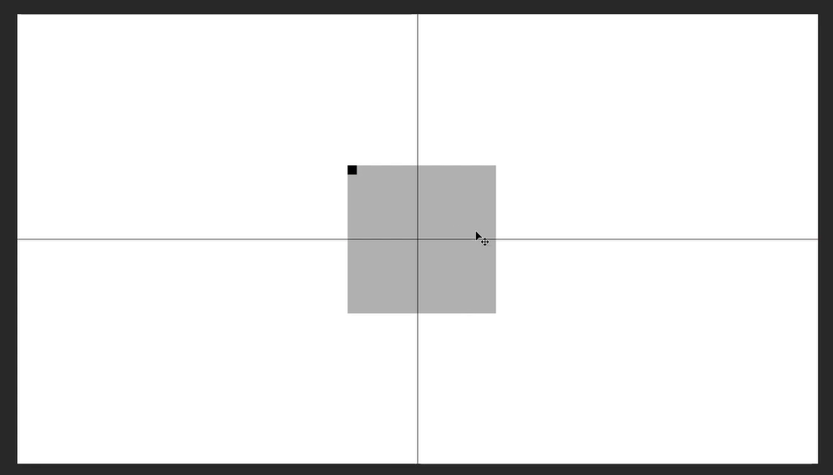


### Partial 분할 폴더 구조

> - `abstracts` : Sass가 제공하는 기능적인 것들에 대한 정의
>   - `@mixin`과 변수와 같은 CSS로 구체적 변환 전 추상적 정의들
> - `base` : CSS의 기본적이고 기능적인 설정들
> - `components` : 버튼이나 메뉴같은 마우스 컨트롤 요소들
>   - `a(button)`,`nav`
> - `layout` : 페이지 내용 구성에 따른 각 부분별 요소
>   - `header`, `main`, `footer`

#### abstracts

> `sass`폴더 아래에 
>
> `abstracts`폴더(추상적이란 뜻, css로 구체화되기 전에 변수를 만들어 둔 것들 담음, sass로 작성)를 만든 뒤 `_variables.scss`, `_mixins.scss`파일을 만든다

- `abstracts` > `_variables.scss`

```scss
// 변수
$color-white: #fff;
$color-black: #000;
$color-grey: #ccc;
$color-grey-light: #efefef;
$color-red: #f00;
$color-blue: #00f;

$border-color: $color-blue;
```

- `abstracts` > `_mixins.scss`

```scss
// mixin
@mixin width-height-padding($w,$h,$p) {
  width: $w;
  height: $h;
  padding: $p;
}
// 상하좌우 가운데 정렬
@mixin pos-abs-center() {
  position:absolute;
  // absolute는 부모를 기준으로 기준점이 가운데로 오게됨 -> 정가운데가 아님
  left:50%;
  top:50%;
  // translate(x,y)는 자기자신의 위치를 조절
  // 자기자신 너비의 반만큼 좌우(x), 자기자신 높이의 반만큼 상하(y)
  transform: translate(-50%,-50%);
}
// 좌우 가운데 정렬
@mixin pos-abs-center-horizontal() {
  position:absolute;
  left:50%;
  transform: translateX(-50%);
}
// 상하 가운데 정렬
@mixin pos-abs-center-vertical() {
  position:absolute;
  top:50%;
  transform: translateY(-50%);
}
```


#### base

> css에 가까운 구조, 기본적인 설정에 대한 내용
>
> `sass`폴더 아래에 `base`폴더를 만든 뒤 `_base.scss`파일

```scss
// css그대로 코드를 가지고 있으면
body {
  margin:0;
  background-color: $color-grey-light;
  // sans-serif 고딕체, serif-명조체
  font-family: sans-serif;
}
```


### index.scss

```scss
@import "abstracts/variables";
@import "abstracts/mixins";

@import "base/base";

// Nesting
.box {
  @include width-height-padding(300px, 300px, 20px);
  @include pos-abs-center();
  
  &, &-inner {
    border:3px solid $border-color;
  }
  // .bix-inner
  &-inner {
    // width:initial; -> 따로 설정안하면 default값
    @include width-height-padding(initial,40px , 10px);


    background-color:$color-grey;
    // .box-inner-title
    &-title {
      font-size: 20px;
      color:$color-white;
      background-color: rgba($color-black,5);
    }
  }
}
```

### media query

```scss
// desktop-big
@media screen and (min-width:1201px){
  .box {
    border:10px solid $border-color;
  }
  .box-inner {
    height:50px;
  }
}
// tablet-land(tablet옆으로)
@media screen and (min-width:601px) and (max-width:899px) {
  .box {
    border:2px solid $border-color;
  }
  .box-inner {
    height:30px;
  }
}
// phone
@media screen and (max-width:600px) {
  .box {
    border:none;
  }
  .box-inner {
    height:10px;
  }
}
```


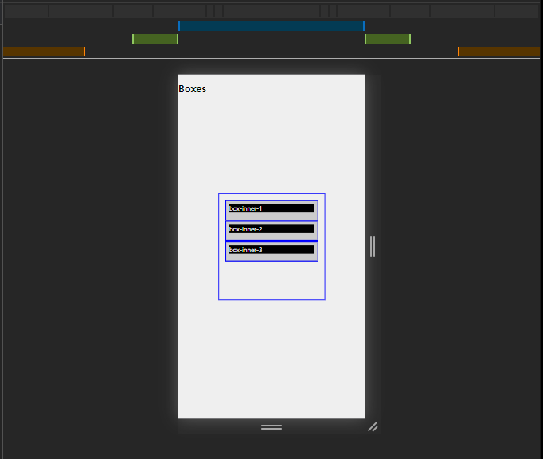

- `sass`의 `Nesting`이용

```scss
@import "abstracts/variables";
@import "abstracts/mixins";

@import "base/base";

// Nesting
.box {
  @include width-height-padding(300px, 300px, 20px);
  @include pos-abs-center();
  
  &, &-inner {
    border:3px solid $border-color;
  }
  // Media query Nesting -> 기본구간 아래에 정의돼야한다 아래로 읽기때문에 위 코드가 나중에 읽히게 되면 그게 적용됨!
  // desktop-big
  @media screen and (min-width:1201px){
    border:10px solid $border-color;
  }
  // tablet-land(tablet옆으로)
  @media screen and (min-width:601px) and (max-width:899px) {
    border:2px solid $border-color;
  }
  // phone
  @media screen and (max-width:600px) {
    border:none;
  }

  // .bix-inner
  &-inner {
    // width:initial; -> 따로 설정안하면 default값
    @include width-height-padding(initial,40px , 10px);

    @media screen and (min-width:1201px){
      height:50px;
    }
    // tablet-land(tablet옆으로)
    @media screen and (min-width:601px) and (max-width:899px) {
      height:30px;
    }
    // phone
    @media screen and (max-width:600px) {
      height:10px;
    }

    background-color:$color-grey;
    // .box-inner-title
    &-title {
      font-size: 20px;
      color:$color-white;
      background-color: rgba($color-black,5);
    }
  }
}
```

####  `partial의 @content`이용

- `_mixins.scss`

```scss
// @content를 하게되면 @include mq() {css코드 작성가능} 가져가서 css코드 작성 가능하게 됨
@mixin mq($screen-width) {
  @if $screen-width == 'phone' {
  // phone
    @media screen and (max-width:600px) {
      @content;
    }
  }
  @else if $screen-width == 'tablet-land' {
    // tablet-land(tablet옆으로)
    @media screen and (min-width:601px) and (max-width:899px) {
      @content;
    }
  }
  @else if $screen-width == 'desktop-big' {
    // desktop-big
    @media screen and (min-width:1201px){
      @content;
    }
  }
  @else { //일반 기본 desktop

  }
}
```

- `index.scss` 수정 예시

```scss
  // Media query Nesting -> 기본구간 아래에 정의돼야한다 아래로 읽기때문에 위 코드가 나중에 읽히게 되면 그게 적용됨!
  // desktop-big
  @include mq('desktop-big') {
    border:10px solid $border-color;
  }
  // @media screen and (min-width:1201px){
  //   border:10px solid $border-color;
  // }
  // tablet-land(tablet옆으로)
   @include mq('tablet-land') {
    border:10px solid $border-color;
  }
  // @media screen and (min-width:601px) and (max-width:899px) {
  //   border:2px solid $border-color;
  // }
  // phone
  @include mq('phone') {
    border:10px solid $border-color;
  }
  // @media screen and (max-width:600px) {
  //   border:none;
  // }
```

- `index.scss` 수정

```scss
@import "abstracts/variables";
@import "abstracts/mixins";

@import "base/base";

// Nesting
.box {
  @include width-height-padding(300px, 300px, 20px);
  @include pos-abs-center();
  
  &, &-inner {
    border:3px solid $border-color;
  }
  // Media query Nesting -> 기본구간 아래에 정의돼야한다 아래로 읽기때문에 위 코드가 나중에 읽히게 되면 그게 적용됨!
  // desktop-big
  @include mq('desktop-big') {
    border:10px solid $border-color;
  }
  // @media screen and (min-width:1201px){
  //   border:10px solid $border-color;
  // }
  // tablet-land(tablet옆으로)
  @include mq('tablet-land') {
    border:10px solid $border-color;
  }
  // @media screen and (min-width:601px) and (max-width:899px) {
  //   border:2px solid $border-color;
  // }
  // phone
  @include mq('phone') {
    border:10px solid $border-color;
    width: 100%;
  }
  // @media screen and (max-width:600px) {
  //   border:none;
  // }

  // .bix-inner
  &-inner {
    // width:initial; -> 따로 설정안하면 default값
    @include width-height-padding(initial,40px , 10px);
    // desktop-big
    @include mq('desktop-big') {
      height:50px;
    }
    // @media screen and (min-width:1201px){
    //   height:50px;
    // }
    // tablet-land(tablet옆으로)
    @include mq('tablet-land') {
      height:30px;
    }
    // @media screen and (min-width:601px) and (max-width:899px) {
    //   height:30px;
    // }
    // phone
    @include mq('phone') {
      height:55px;
    }
    // @media screen and (max-width:600px) {
    //   height:10px;
    // }

    background-color:$color-grey;
    // .box-inner-title
    &-title {
      font-size: 20px;
      color:$color-white;
      background-color: rgba($color-black,5);
      @include mq('tablet-land') {
        font-size: 30px;
      }
      @include mq('phone') {
        font-size: 40px;
      }
      }
  }
}
```


---------

## Lorem Project

> 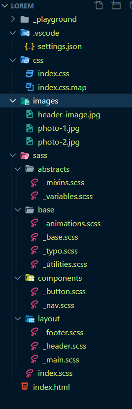

- 환경설정
- `settings.json`

```json
{
    "liveSassCompile.settings.formats":[
       {
           "format": "expanded",
           "extensionName": ".css",
            // 해당 sass파일의 한폴더 위의 css폴더   
           "savePath": "~/../css"
       }
   ],
   "liveSassCompile.settings.excludeList": [
      "**/node_modules/**",
      ".vscode/**"
   ],
   "liveSassCompile.settings.generateMap": true,
   "liveSassCompile.settings.autoprefix": [
       "> 1%",
       "last 2 versions"
],
"[json]": {

    "editor.quickSuggestions": {
        "strings": true
    },
    "editor.suggest.insertMode": "replace"
}
}
```


### (참고)`_playground`

### `unit` css기본단위

#### px

> 절대적 크기
>
> **기본 브라우저 폰트 사이즈 16px**

#### em

> **해당요소에 지정된 폰트 사이즈가 `1em`**

```scss
#box1 {
    font-size:30px; // 1em = 30px;
    width:25em;
    background-color:#aaa:
}
```

#### rem

> **root(최상위)에 지정된 폰트 사이즈**
>
> `html`에 지정된 font-size가 `1rem`
>
> **편리함, 효율적 : 반응형 웹페이지를 만들 때 rem단위를 사용하면 html의 font-size만 바꿔주면 상대적으로 단위를 모두 바꿀 수 있다!**

```scss
html {
    // 기본 브라우저 폰트 사이즈는 16px
    //font-size: 10px; // 1rem
    font-size: 20px; // 10px = 1rem
}

#box2 {
    font-size: 2rem;
    width: 25rem;
    background-color: #777;
}
```

#### vw(viewport width), vh(viewport height)

> `viewport`는 브라우저의 내용이 보이는 부분

```scss
#box1 {
    // viewport넓이의 80%
    width: 80vw;
    // viewport넓이의 50%
    height: 50vh;
}
```


- `unit.html`

```html
<!DOCTYPE html>
<html lang="en">
<head>
    <meta charset="UTF-8">
    <meta name="viewport" content="width=device-width, initial-scale=1.0">
    <meta http-equiv="X-UA-Compatible" content="ie=edge">
    <link rel="stylesheet" href="css/unit.css">
    <title>Document</title>
</head>
<body>
    <h1>CSS 기본단위</h1>
    <div id="box1">box1</div>
    <div id="box2">box2</div>
</body>
</html>
```

- `unit.scss`

```scss

// px (절대적크기)
// em(해당요소에 지정된 폰트사이즈 = 1em), rem
// vw(viewport width), vh(viewport height)

html {
    // 기본 브라우저 폰트 사이즈는 16px
    //font-size: 10px; // 1rem
    font-size: 20px; // 10px = 1rem
}

#box1 {
    // viewport넓이의 80%
    width: 80vw;
    // viewport넓이의 50%
    height: 50vh;
    font-size: 3rem;
    background-color: #aaa;
}

#box2 {
    font-size: 2rem;
    width: 25rem;
    background-color: #777;
}
```

### css gradient generator

> [css gradient generator](https://www.colorzilla.com/gradient-editor/)

```scss
    // 배경이미지 url(원하는 이미지 위치)
    // css로 그라데이션 설정(linear-gradient), to right(왼쪽에서 오른쪽으록 가라), 왼쪽원하는색 0%, 오른쪽 원하는색 100%
    background-image: linear-gradient(
        to right,
        $color-primary 0%,
        $color-secondary 100%
    ), url(../images/header-image.jpg);
    // background-blend-mode의 multiply는 이미지와 그라데이션을 합성시킴
    background-blend-mode: multiply;
    // 배경이미지 사이즈 : contain은 전체 이미지 다보이게, cover는 요소안에 꽉차게 이미지를 키움
    background-size: cover;
    // absolute의 부모(header)가 됨
    position: relative;
```

마우스를 올렸을 때 그라데이션 효과 주기! 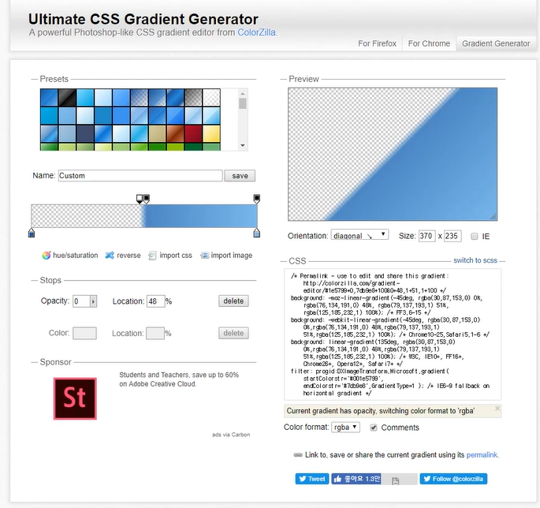

`background-size:220%`하면 2배이상 커진 상태로 있다가 마우스를 올렸을 때 위치를 이동시키면서 자연스럽게 꺾인 사각형처럼 그라데이션 애니메이션 형태로 보이게 됨

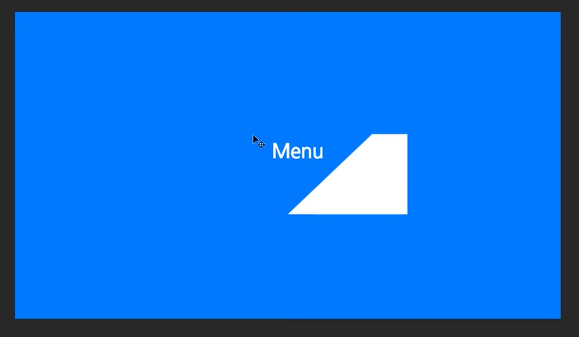


```scss
&-link {
        display: inline-block;
        font-size: 3rem;
        font-weight: 300;
        padding: 1rem 2rem; // 상하, 좌우
        color: $color-white;
        text-decoration: none; // 밑줄없음
        text-transform: uppercase; // 대문자

        transition: all .4s; // hover 매끄럽게
        // 그라데이션 응용
        // 꺾인 사각형 배경 표시
        // 첫요소 120도, 투명도, 색
        background-image: linear-gradient(
            120deg,
            transparent 0%,
            transparent 50%,
            $color-white 50%
        );
        background-size: 220%; // background-size를 키움 -> 마우스 올라가면 이동시키게 함
        // 마우스가 올라갔을 때
        &:hover {
            color: $color-primary; // 글자색 변경
            background-position: 100%; // 위치를 내 위치로
            transform: translateX(1rem); // 글자 살짝 오른쪽으로 이동
        }
```


### CSS의 Animation과 Transition

```html
<!DOCTYPE html>
<html lang="en">
<head>
    <meta charset="UTF-8">
    <meta name="viewport" content="width=device-width, initial-scale=1.0">
    <meta http-equiv="X-UA-Compatible" content="ie=edge">
    <title>Document</title>
    <link rel="stylesheet" href="css/anim_trans.css">
</head>
<body>
    <h1>CSS의 Animation과 Transition</h1>

    <h2>Transition</h2>
    <a href="#" class="btn">Transition 버튼</a>

    <h2>Animation</h2>
    <div id="box1" class="box">box1</div>
    <div id="box2" class="box">box2</div>
</body>
</html>
```

#### transition

```scss
// transition
.btn {
    font-size: 30px;
    text-decoration: none; // 및줄없앰
    opacity: 1; //기본은 1(안적어도됨)
    // all은 바뀌는 속성(hover안의 3가지 속성) 5초동안
    transition: all .5s; 
    // transition: font-size 5s, opacity 10s; // 이렇게 나눠서 적용도 가능
    // 버튼에 마우스가 올라왔을때
    &:hover {
        font-size: 50px;
        text-decoration: underline; //마우스올리면 밑줄
        opacity: .2; //투명도
    }
}
```

#### animation

```scss
// animation
// @keyframes로 시작(css3에서 제공하는 애니메이션 기능) anim1(애니메이션이름)
@keyframes anim1 {
    // 주어진 시간에 대한 %로 기술
    0% { // 처음
        opacity: .2; //투명도(20%)
        // transform : 그 요소의 위치(translate)나 크기(scale)를 바꾸는 속성
        transform: translate(100px, -30px); // 요소 위치 (x : 왼쪽이 '-'&오른쪽이 '+',y: 위쪽이 '-' &아래쪽이 '+')
    }

    50% { // 중간
        opacity: 1; //투명도(100%)
    }

    100% { // 끝나는 위치
        opacity: .1; // 투명도(10%)
    }
}

#box1 {
    // 애니메이션 지정
    animation-name: anim1; // 애니메이션이름
    animation-duration: 5s; // 애니메이션 지속시간
    animation-fill-mode: both; // forwards: 딜레이가 없고 애니메이션 끝나고 마지막상태 지속하고 싶을 때 , backwords : 딜레이가 있을 때 딜레이시간동안 처음 0%로 이동 후 시작, both : forwards + backwords(딜레이 후 처음 0%로 시작하고, 끝나도 마지막 100%상태 유지) 
    animation-iteration-count: 1; // 애니메이션 실현 횟수
    animation-delay: 3s; // 애니메이션 바로 시작이 아니라 몇s뒤에 시작
}
```


### pseudo element

> 가상 element
>
> (참고) `float:left`
>
> ```scss
> .box-parent {
> 
>     padding: 20px;
>     background-color: #00f;
> 
>     .box-child {
>         width: 200px;
>         height: 200px;
>         background-color: #f00;
>         border: 1px solid #ff0; // 테두리
>         float: left; // box-child가 left로 뜬상태(float)로 정렬 -> 부모(box-parent)는 자식이 떠서 영역이 없다고 생각해서 영역이 줄어듦
>     }
> }
> ```
>
> 
>
> 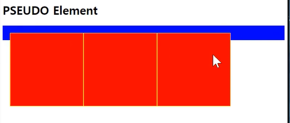
>
> `clearfix`처리를 한다
>
> ```scss
> // float됐을 때 부모가 자식 영역이 없다고 생각해서 영역의 크기가 줄어드는 것을 방지하기 위해 clearfix 처리를 한다()
> @mixin clearfix() {
>     // 해당요소의 마지막에 가상의 element를 추가
>     &::after {
>         content: '';
>         display: block;
>         // 부모가 다시 자식영역까지 인지하고 영역높이를 맞추게 됨
>         clear: left;
>     }
> 
> .box-parent {
> 
>     padding: 20px;
>     background-color: #00f;
> 
>     .box-child {
>         width: 200px;
>         height: 200px;
>         background-color: #f00;
>         border: 1px solid #ff0; // 테두리
>         float: left; // box-child가 left로 뜬상태(float)로 정렬 -> 부모(box-parent)는 자식이 떠서 영역이 없다고 생각해서 영역이 줄어듦
>     }
>     @include clearfix();
> }
> ```
>
> 


```html
<!DOCTYPE html>
<html lang="en">
<head>
    <meta charset="UTF-8">
    <meta name="viewport" content="width=device-width, initial-scale=1.0">
    <meta http-equiv="X-UA-Compatible" content="ie=edge">
    <title>Document</title>
    <link rel="stylesheet" href="css/pseudo.css">
</head>
<body>
    
    <h1>PSEUDO Element</h1>


    <div class="box-parent">
        <div class="box-child"></div>
        <div class="box-child"></div>
        <div class="box-child"></div>
    </div>

</body>
</html>
```

```scss

#box {
    background-color: #00f;
    width: 300px;
    height: 300px;
    color: #fff;

    // :: 콜론 두개를 입력 
    // before, after이 두 요소를 pseudo element라고 함
    // 해당요소의 앞과 뒤에 가상의 요소 앞(before)과 뒤(after)에 추가
    &::before { // 처음에 어떤 내용을 추가
        content: "before"; // 내용
        display: block; // display속성을 block으로 줌
    }
    &::after { // 마지막에 어떤 내용을 추가
        content: "after"; // 내용
        display: block; // block으로 지정(한줄)
        background-color: #ff0;
    }
}

// float됐을 때 부모가 자식 영역이 없다고 생각해서 영역의 크기가 줄어드는 것을 방지하기 위해 clearfix 처리를 한다()
@mixin clearfix() {
    // 해당요소의 마지막에 가상의 element를 추가
    &::after {
        content: '';
        display: block;
        // 부모가 다시 자식영역까지 인지하고 영역높이를 맞추게 됨
        clear: left;
    }
}

.box-parent {

    padding: 20px;
    background-color: #00f;

    .box-child {
        width: 200px;
        height: 200px;
        background-color: #f00;
        border: 1px solid #ff0; // 테두리
        float: left; // box-child가 left로 뜬상태(float)로 정렬 -> 부모(box-parent)는 자식이 떠서 영역이 없다고 생각해서 영역이 줄어듦
    }
    .box-child:not(:last-child) {
        margin-right: 40px;
    }

    @include clearfix();
}
```


### Code

- `index.html`

```html
<!DOCTYPE html>
<html lang="en">
<head>
    <meta charset="UTF-8">
    <meta name="viewport" content="width=device-width, initial-scale=1.0">
    <meta http-equiv="X-UA-Compatible" content="ie=edge">
    <!-- index.css연결 -->
    <link rel="stylesheet" href="css/index.css">

    <title>Lorem</title>
</head>

<body>
    
    <nav class="nav">
        <!-- id를 준 이유는 checkbox의 label의 for에 id를 적어서 연결시키기 위함 -->
        <input type="checkbox" class="nav-checkbox" id="nav-toggle">
        <!-- label 요소를 체크박스처럼 사용할 수있음 라벨을 누르면 체크 됨 -->
        <label for="nav-toggle" class="nav-button">
            <!-- &nbsp는 빈 공백 문자를 나타냄 -->
            <!-- 이게 메뉴 3선모양으로 바뀔거다 -->
            <!-- 가운데 선 한개를 만들고 psuedo element를 이용해 위 아래도 선을 만들어 3선으로 만들어줌 -->
            <span class="nav-icon">&nbsp;</span>
        </label>
        <!-- nav누르면 나오는 배경역할 -->
        <div class="nav-bg">&nbsp;</div>

        <div class="nav-body">
            <ul class="nav-list">
                <li class="nav-item">
                    <a href="#" class="nav-link"><span>01</span>About Lorem</a>
                </li>
                <li class="nav-item">
                    <a href="#" class="nav-link"><span>02</span>Commades Sanos</a>
                </li>
                <li class="nav-item">
                    <a href="#" class="nav-link"><span>03</span>Ryusin Magnetas Aloha</a>
                </li>
            </ul>
        </div>
    </nav>
    
    <!-- 헤더 -->
    <header>
        <div id="logo-text">Lorem</div>
        <div id="header-text">
            <div id="header-text-main">
                Lorem ipsum dolor sit amet, <br>consectetur
            </div>
            <div id="header-text-sub">
                Duis aute irure dolor in reprehenderit in voluptate
            </div>
        </div>
    </header>

    <main>
        
        <section id="section-about">
            <h2>Tellus orci ac auctor augue mauris augue neque</h2>
            <div id="section-about-words">
                <h3>commodo sed egestas egestas fringilla</h3>
                <p>Non blandit massa enim nec dui nunc mattis enim ut. Vulputate odio ut enim blandit volutpat maecenas volutpat
                    blandit. Adipiscing vitae proin sagittis nisl rhoncus mattis. Consectetur adipiscing elit pellentesque
                    habitant. Ut tellus elementum sagittis vitae et leo duis. Dolor sit amet consectetur adipiscing. Porttitor
                    lacus luctus accumsan tortor posuere ac. Montes nascetur ridiculus mus mauris vitae ultricies leo integer.</p>
                <!-- 버튼간 margin을 utilities로 만들어 class적용 -->
                <a href="#" class="btn-text u-margin-right-small">Read More</a>
                <a href="#" class="btn-text">Read More</a>
            </div>
            <div id="section-about-photo">
                <div class="photo"></div>
                <div class="photo"></div>
            </div>
        </section>

        <section id="section-etc">
            <div id="etc-1" class="etc">
                <div class="etc-icon">
                    <i class="material-icons">loyalty</i>
                </div>
                <div class="etc-text">
                    <h3>Consequ Amar Yeti</h3>
                    <p>ac odio tempor orci dapibus ultrices in. Velit aliquet sagittis id consectetur. Vitae proin sagittis nisl rhoncus mattis volutpat</p>
                </div>
            </div>
            <div id="etc-2" class="etc">
                <div class="etc-icon">
                    <i class="material-icons">extension</i>
                </div>
                <div class="etc-text">
                    <h3>Consequ Amar Yeti</h3>
                    <p>ac odio tempor orci dapibus ultrices in. Velit aliquet sagittis id consectetur. Vitae proin sagittis nisl rhoncus mattis volutpat</p>
                </div>
            </div>
            <div id="etc-3" class="etc">
                <div class="etc-icon">
                    <i class="material-icons">av_timer</i>
                </div>
                <div class="etc-text">
                    <h3>Consequ Amar Yeti</h3>
                    <p>ac odio tempor orci dapibus ultrices in. Velit aliquet sagittis id consectetur. Vitae proin sagittis nisl rhoncus mattis volutpat</p>
                </div>
            </div>
        </section>

    </main>

    <footer>
        <div id="logo-text-footer">Lorem</div>
        <div id="copyright">
            <p>Tincidunt id aliquet risus feugiat in. Faucibus purus in massa tempor nec. Aliquet bibendum enim facilisis gravida. Dolor sit amet consectetur adipiscing. Odio pellentesque diam volutpat commodo sed egestas egestas fringilla phasellus. Dolor sit amet</p>
            <!-- &copy; 는 html 속성 동그라미 안에 C 들어있는 모양 -->
            <p>Copyright &copy; 2018 Lorem. All Rights Reserved.</p>
        </div>
    </footer>

</body>
</html>
```

- `sass` > `index.scss`

```scss
// index.html을 기준으로 폴더 위치 지정 "폴더이름/파일이름('_'제외, 확장자제외)"

// 그룹을 나누는 방식(보통 이렇게 많이함! 정답은 아니지만 이런식으로 알아보기 쉽게 나누는게 좋다)
// sass의 특별한 기능 폴더 abstracts
@import "abstracts/variables"; // 변수
@import "abstracts/mixins";

// 모든 css에서 다 쓸수 있는 기본이 되는 폴더 base
@import "base/base";
@import "base/animations"; // animation은 css에서 제공하는 기능
@import "base/typo"; // 글자 text style
@import "base/utilities"; // 자주 주는 margin을 따로 설정

// 컴포넌트 폴더
@import "components/button";
@import "components/nav";

// html의 요소별로 나눔
@import "layout/header";
@import "layout/main";
@import "layout/footer";
```

- `sass` > `abstracts` > `_variables.scss`

```scss
// 변수
$color-primary: #285a91; // 그라데이션 첫 색
$color-secondary: #1f9cfd; // 그라데이션 두번째 색
$color-white: #fff;

$color-blue-1: #a8d8ff;
$color-blue-2: #c1e1ff;
$color-blue-3: #d6eaff;
$color-blue-dark: #3f4a56;

$color-grey-light: #b9b9b9;
$color-grey-dark: #474747;
```


- `sass` > `abstracts` > `_mixins.scss`

```scss
// float로 띄웠을 때 부모가 자식의 영역을 인지하게 하기위함
@mixin clearfix() {
    &::after {
        content: '';
        display: block;
        clear: both; // float : right&left둘다 적용
    }
}
// 반응형 페이지
@mixin mq($screen-width) {
    @if $screen-width == 'small-screen-1' {
        // 900~1200px 사이
        @media screen and (min-width: 900px) and (max-width: 1200px) {
            @content;
        }
    }
    @else if $screen-width == 'small-screen-2' {
        // 701~899px사이
        @media screen and (min-width: 701px) and (max-width: 899px) {
            @content;
        }
    }
    @else if $screen-width == 'small-screen-3' {
        // 700px이하
        @media screen and (max-width: 700px) {
            @content;
        }
    }
}
```

- `sass` > `base` > `_base.scss`

```scss
// 구글폰트(select this font하고 customize모두 선택한 뒤, @import 복사) - 나눔고딕, Lato
// sass는 모든 css를 다 포함하고 있기 때문에 외부에서 가져오는것도 바로 @import해서 쓸 수 있음
@import url('https://fonts.googleapis.com/css?family=Lato:100,300|Nanum+Gothic:400,700,800&subset=korean');

// Icon Font
// https://material.io/icons
@import url("https://fonts.googleapis.com/icon?family=Material+Icons");

//모든요소(*)에 margin, padding,box-sizing을 초기화시킴
* {
    margin: 0;
    padding: 0;
    // border-box는 넓이, 높이를 설정할 때 margin,padding등 모두 포함시킴 -> 원하는 크기로 만들 수 있음
    box-sizing: border-box;
}

html {
    font-size: 62.5%; // (기본브라우저의 font-size)16px의 62.5% = 10px = 1rem
}

body {
    // 안쪽으로 padding을 30px줌
    padding: 3rem;
    // 가져온 글꼴을 사용
    font-family: 'Nanum Gothic', sans-serif;
}
```

- `sass` > `base` > `_animations.scss`

```scss
// animation
// 왼쪽에서 나옴
@keyframes moveInLeft {
    0% {
        opacity: .1; // 살짝 보이게 0.1
        transform: translateX(-8rem); // X값만 주면됨, 처음위치에서 왼쪽으로 80px
    }
    80% {
        // 끝에 살짝 오른쪽으로 넘어갔다가 다시 왼쪽으로가는 효과를 주기위해 기존위치에서 10px 오른쪽으로 이동 
        transform: translateX(1rem); 
    }
    100% {
        opacity: 1; // 다보임
        transform: translate(0); // 기존 위치로
    }
}
// 오른쪽으로 나옴
@keyframes moveInRight {
    0% {
        opacity: .1;
        transform: translateX(10rem);
    }
    80% {
        transform: translateX(-1rem);
    }
    100% {
        opacity: 1;
        transform: translate(0);
    }
}
```

- `sass` > `base` > `_typo.scss`

```scss
// typo 글자 text 스타일 지정
h2 {
    padding: 1rem 0; // 위아래, 좌우
    font-size: 2.4rem;
    font-weight: 800;
    text-transform: uppercase; // 대문자
    // 그라데이션효과
    background: linear-gradient(left, $color-primary, $color-secondary); // 왼쪽에서 시작, 시작, 끝 색
    -webkit-background-clip: text; // 글자 부분에만 그라데이션을 입힘
    -webkit-text-fill-color: transparent; // 기본적인 text color를 transparent(투명)하게 함

    // hover(애니메이션) 움직일때 매끄럽게 움직임
    transition: all .5s; // padding-left가 5초동안 움직임
    // 마우스 올라감
    &:hover {
        // 살짝 왼쪽으로 움직임
        padding-left: 1.5rem;
    }
}

h3 {
    padding: .5rem 0; // 상하,좌우
    color: $color-grey-dark;
    font-size: 1.6rem;
    font-weight: 700;
    text-transform: uppercase;
}
```

- `sass` > `base` > `_utilities.scss`

```scss
// margin class 생성
.u-margin-right-small {
    margin-right: 1rem; //10px
}

.u-margin-right-medium {
    margin-right: 2rem; // 20px
}

.u-margin-right-big {
    margin-right: 3rem; // 30px
}
```

- `sass` > `components` > `_button.scss`

```scss

.btn-text {
    font-size: 1.6rem; // 16px
    font-weight: 700;
    text-decoration: none; // 밑줄 없앰
    color: $color-primary;
    display: inline-block; // 인라인요소면서 block이 될수 있게 함
    padding-bottom: 3px; // 아래쪽만 3px
    border-bottom: 1px solid $color-primary;

    transition: all .5s; // hover 지정 요소 전부 5초동안

    &:hover {
        color: $color-white;
        background-color: $color-secondary;
        border-bottom: none; // 올라갔을 때 버튼 밑줄 없앰
    }
}
```

- `sass` > `components` > `_nav.scss`

```scss
// nav bar 스타일
.nav {

    &-checkbox {
        display: none;
    }

    &-button {
        background-color: #c4e3ff;
        width: 7rem;
        height: 6rem;
        position: fixed; // 계속 특정위치에 고정시키기 위해
        top: 7rem;
        right: 8rem;
        z-index: 2000; // 제일 위로 올림
        cursor: pointer; // 마우스 올리면 손모양으로 바뀜
        border-radius: 2px; // 테두리 살짝 둥글게
        box-shadow: 0 1rem 1rem rgba(#000, 0.1); // 그림자
        text-align: center; // icon(3선 메뉴-span)을 중간으로 오게 함
    }
    // nav버튼 누르면 나오는 배경 버튼과 포개져있기 때문에 위치 같게 함
    &-bg {
        // 그라데이션 radial-gradient(가운데서 원형으로 퍼져나가는 그라데이션)
        background-image: radial-gradient($color-primary, $color-secondary);
        width: 7rem;
        height: 6rem;
        position: fixed;
        top: 7rem;
        right: 8rem;
        z-index: 1000;
        border-radius: 2px;

        transition: all .8s; // 체크박스 선택됐을 떄 커졌다가 작아졌다가 하는 것을 부드럽게 표현
    }

    //체크박스가 체크가 됐나 안됐나 판별 가능
    // :checked(체크된상태) ~(같은 위치의 형제 요소를 선택 할 수 있음) and &-bg
    // 체크박스가 체크됐을 때 같은 위치의 &-bg도  같이 아래의 스타일 적용됨
    &-checkbox:checked ~ &-bg {
        // 크기가 엄청 커지게 만듦(체크해제되면 사라짐)
        transform: scale(80);
    }

    // ICON(3선 메뉴)
    &-icon {
        position: relative; // 자식 선(absolute)이 icon을 기준(relative)으로 위치하기 위해
        // 중간 선 위치
        margin-top: 3rem;
        // 위에선
        &::before {
            top: -0.8rem; // 부모를 기준으로 -0.8rem올라감
        }
        // 아래선
        &::after {
            top: 0.8rem;
        }
        // 위, 아래 둘다 공통으로 스타일 주기 위해
        &::before, &::after {
            content: '';
            position: absolute; // absolute, 부모(-icon)를 기준으로 위치하기 위해
            left: 0;
            transition: all .2s; // hover일때 자연스럽게 하기 위해
        }
        // 3선 전부 적용할 스타일
        &, &::before, &::after {
            width: 3rem;
            height: 2px;
            background-color: #333;
            display: inline-block; // span태그는 inline요소기 때문에 inline-block으로 바꿔줌
        }
    }
    // button에 마우스가 올라갔을 때, icon(3선메뉴)의 첫줄은 위로 조금 올림
    &-button:hover &-icon::before {
        top: -1rem;
    }
    // button에 마우스가 올라갔을 때, icon(3선메뉴)의 아랫줄은 아래로 조금 내림
    &-button:hover &-icon::after {
        top: 1rem;
    }
    // 체크박스가 체크되고(메뉴가 활성화됨) 같은 위치의 &-button &-icon에 적용
    &-checkbox:checked ~ &-button &-icon {
        background-color: transparent; // 가운데 선이 투명하게 됨
    }
    // 메뉴가 눌려지면 3선이 X표시가 됨
    // 체크박스가 체크되고(메뉴가 활성화됨) 같은 위치의 &-button &-icon의 첫줄에 적용
    &-checkbox:checked ~ &-button &-icon::before {
        top: 0; // top이 벌어져있으니까 0으로 돌림
        transform: rotate(135deg); // deg(도), 135도 돌림 -> 45도 돌려도 되지만 더 크게 회전시키기 위해 (180-45)
    }
    // 체크박스가 체크되고(메뉴가 활성화됨) 같은 위치의 &-button &-icon의 마지막 줄에 적용
    &-checkbox:checked ~ &-button &-icon::after {
        top: 0; // top이 벌어져있으니까 0으로 돌림
        transform: rotate(-135deg);
    }

    // .nav-body
    &-body {
        position: fixed; // 메뉴도 고정된 위치로 따라 내려가야되기 때문
        top: 0;
        left: -120%; // 자기 넓이 이상으로 왼쪽으로 보냄 -> 체크됐을 때 메뉴 위로 올릴거야
        width: 100vw; // body의 영역을 꽉차게함
        height: 100vh; // body의 영역을 꽉차게함
        z-index: 1500;
        opacity: 0; // 기본투명도를 0 -> 체크되면 1로 하면 점점 진해짐
        transition: all .8s; // left가 변하는 것을 자연스럽게 함
    }
    // .nav-body아래에 적어도 되고 이렇게 독립적으로 적어도 됨
    &-list {
        position: absolute;
        // 가운데 정렬
        left: 50%; // 기준점이 중간에 위치
        top: 50%;
        transform: translate(-50%, -50%); // 자기자신의 반(width,height)만큼 이동시켜서 가운데 정렬
        list-style: none; // 목록(ul)의 점 사라짐
        width: 100%; // 넓이 꽉참
        text-align: center; // 글자 가운데 정렬
    }

    &-item {

    }

    &-link {
        display: inline-block;
        font-size: 3rem;
        font-weight: 300;
        padding: 1rem 2rem; // 상하, 좌우
        color: $color-white;
        text-decoration: none; // 밑줄없음
        text-transform: uppercase; // 대문자

        transition: all .4s; // hover 매끄럽게
        // 그라데이션 응용
        // 꺾인 사각형 배경 표시
        // 첫요소 120도, 투명도, 색
        background-image: linear-gradient(
            120deg,
            transparent 0%,
            transparent 50%,
            $color-white 50%
        );
        background-size: 220%; // background-size를 키움 -> 마우스 올라가면 이동시키게 함
        // 마우스가 올라갔을 때
        &:hover {
            color: $color-primary; // 글자색 변경
            background-position: 100%; // 위치를 내 위치로
            transform: translateX(1rem); // 글자 살짝 오른쪽으로 이동
        }
        // 숫자 span으로 감싸서 margin을 줌
        span {
            display: inline-block; // block요소여야 margin을 줄 수 있음
            margin-right: 1.5rem;
        }
    }
    // 체크됐고 해당 위치의 &-body
    &-checkbox:checked ~ &-body {
        opacity: 1;
        left: 0; // left : 0으로 바꿔서 나타나게 함
    }

}
```

- `sass` > `layout` > `_header.scss`

```scss
//헤더
header {

    width: 100%;
    // viewport의 90%
    height: 90vh;
    // 배경이미지 url(원하는 이미지 위치)
    // css로 그라데이션 설정(linear-gradient), to right(왼쪽에서 오른쪽으록 가라), 왼쪽원하는색 0%, 오른쪽 원하는색 100%
    background-image: linear-gradient(
        to right,
        $color-primary 0%,
        $color-secondary 100%
    ), url(../images/header-image.jpg);
    // background-blend-mode의 multiply는 이미지와 그라데이션을 합성시킴
    background-blend-mode: multiply;
    // 배경이미지 사이즈 : contain은 전체 이미지 다보이게, cover는 요소안에 꽉차게 이미지를 키움
    background-size: cover;
    // absolute의 부모(header)가 됨
    position: relative;

    #logo-text {
        // 부모(#header)를 기준으로 위치함
        position: absolute;
        left: 7rem; //70px
        top: 4rem; // 40px
        font-size: 5.6rem; // 56px
        text-transform: uppercase; // 대문자로 만듦
        font-family: 'Lato', sans-serif; // 글꼴 설정
        font-weight: 100;
        color: $color-white;
        letter-spacing: -0.1rem;

        // animation
        animation-name: moveInLeft; // 이름
        animation-duration: 1s; // 지속시간 
        animation-iteration-count: 5; // 5번반복
        animation-delay: 2s; // 2초 후 시작
        animation-fill-mode: backwards; // delay시간 후 animation 0%에서 바로 시작
    }

    #header-text {
        // header기준으로 위치를 잡기위해 absolute
        position: absolute;
        left: 7rem; // 70px
        bottom: 23%; //밑에서부터 높이의 23%의 위치
        color: $color-white; // 글자색 흰색
        letter-spacing: -.1rem; // 글자간격 -0.1rem(==-.1rem)
        font-weight: 700; // 굵기

        // #header-main
        &-main {
            font-size: 7.2rem; // 72px
            line-height: 7.2rem; // 줄간격 72px

            animation-name: moveInRight;
            animation-duration: 1s;
            animation-delay: 1s;
            animation-fill-mode: backwards;
        }
        // #header-sub
        &-sub {
            margin-top: 3rem; //30px
            font-size: 2.4rem;

            animation-name: moveInLeft;
            animation-duration: 1s;
            animation-delay: 1.5s;
            animation-fill-mode: backwards;
        }
    }
}
```

- `sass` > `layout` > `_main.scss`

```scss
// main
main {
    // section-about패널과 section-etc 패널을 옆으로 보이게 하기 위해 float:left해서 clearfix처리
    @include clearfix(); 

    //
    #section-about {
        background-color: #ededed; // 일시적으로 잠깐 쓰이는 색은 그냥 적어도 되고, 변수로 만들어도 됨
        padding: 7rem 0 6.5rem 6rem;
        width: 66.66666%; // section-etc와 함께 100% 중 분배해서 가짐(그래야 width가 더 커서 아래로 내려가거나 하지 않고 계속 옆으로 보임)
        min-height: 42rem; // min-height는 최소 높이가 42rem이고, 더 커질 수 있다
        float: left;

        @include clearfix(); // float:left 자식 두개(words,photo)의 영역을 확보하기 위해
        // 화면 900~1200px
        @include mq('small-screen-1') {
            // @content;안의 자리에 "{}" 안의 코드가 들어옴
            width: 100%; // 하나하나가 100%를 다 차지해서 아래로 쌓이게 됨
        }
        @include mq('small-screen-2') {
            width: 100%;
            height: 54rem; // section 높이를 보기좋게 높임
            padding: 7rem 6rem 6.5rem 6rem;
        }
        @include mq('small-screen-3') {
            width: 100%;
            height: 60rem;
            padding: 7rem 6rem 6.5rem 6rem;
        }

        &-words {
            width: 65%; // photo의 width와 합하면 100%가 됨
            padding: 2rem 2rem 0 0;
            float: left;

            @include mq('small-screen-2') {
                width: 100%; // words가 100%라 photo는 아래로 내려감
            }
            @include mq('small-screen-3') {
                width: 100%;
            }

            // &-words 아래 p태그
            p {
                padding: 1.5rem 0;
                font-size: 1.4rem;
                font-weight: 700;
                text-align: justify;
            }
        }

        &-photo {
            position: relative; // .photo가 부모 위치를 기준으로 위치하기위해 relative로 설정
            width: 35%;
            float: left;

            @include mq('small-screen-2') {
                width: 100%; // photo도 100%
            }
            @include mq('small-screen-3') {
                width: 100%;
            }

            .photo { 
                position: absolute; // 그림이 포개짐
                width: 18rem;
                height: 12rem;
                transition: all .5s; // 부드럽게 hover가 바뀌게 하기 위해

                @include mq('small-screen-2') {
                    // photo 위치를 바꿈(!important로 우선순위 제일 높게 만듦, 아래의 다른 값들에 의해 달라지는 것 방지하기 위해)
                    top: 3rem !important;
                    left: 50% !important;
                }
                @include mq('small-screen-3') {
                    top: 3rem !important;
                    left: 50% !important;
                }
                // 마우스가 올라갔을 때
                &:hover {
                    transform: scale(1.1); // scale 110%하면 그림의 크기가 커짐
                    padding: 1rem;
                    border: 3px solid $color-primary; // 테두리 설정
                    z-index: 10; // 위로 올라오게 함
                }
                // 1번째 그림(pseudo element이용)
                &:nth-child(1) {
                    left: 1rem;
                    top: 3rem;
                    // 2구간에서 첫사진 위치 이동
                    @include mq('small-screen-2') {
                        transform: translateX(-120%);
                    }
                    @include mq('small-screen-3') {
                        transform: translateX(-120%);
                    }
                }
                // 2번째 그림
                &:nth-child(2) {
                    left: 6rem;
                    top: 10rem;
                }

                img {
                    // .photo의 width: 18rem; height: 12rem;에 맞춰서 가득참(100%)
                    width: 100%;
                    height: 100%;
                    box-shadow: 3px 3px 9px 0px rgba(0, 0, 0, 0.5); // 그림자
                }
            }
        }
    }

    //
    #section-etc {
        width: 33.33334%;
        float: left;

        @include mq('small-screen-1') {
            width: 100%;
        }
        @include mq('small-screen-2') {
            width: 100%;
        }
        @include mq('small-screen-3') {
            width: 100%;
        }

        // [속성값^="공통으로 시작하는 이름"]
        // [src^="images1/"] {} 이렇게 하면 src속성이 "images1/"로 시작하는 특정 속성에 적용됨
        // #section-etc 아래 자식들 중 id가 "etc-"로 시작("^(캐럿)")하는 것을 모두 가리킴
        [id^="etc-"] {
            height: 14rem;
        }

        .etc {
            // small-screen-3을 따로 설정 안해 놓으면 자동으로 100%로 아래로 쌓이게 됨
            @include mq('small-screen-1') {
                width: 33.33333%; // section-etc하나하나는(3개) 1/3씩 차지하게 함
                float: left; // 옆으로 띄워짐
            }
            @include mq('small-screen-2') {
                width: 33.33333%;
                height: 22rem;
                float: left;
            }
            // 1번째 자식
            &:nth-child(1) {
                background-color: $color-blue-1;
            }
            // 2번째 자식
            &:nth-child(2) {
                background-color: $color-blue-2;
            }
            // 3번째 자식
            &:nth-child(3) {
                background-color: $color-blue-3;
            }

            .etc-icon {
                padding-top: 3.5rem; // 위에 padding을 줌(상하 가운데 위치시키기 위해)
                width: 30%; // 넓이의 30%
                text-align: center; // 아이콘 가운데 정렬(좌우)
                float: left; // 아이콘 왼쪽 글 오른쪽 띄움
                // 아이콘 크기 키움
                i {
                    font-size: 6rem;
                }
            }

            .etc-text {
                padding-top: 1rem;
                width: 70%; // 넓이의 70%
                float: left;

                p { // etc-text아래의 p태그
                    margin: 0.5rem 0;
                    padding-right: 3.5rem; // 오른쪽 공간 확보
                    text-align: justify;
                    font-size: 1.4rem;
                }
            }
        }
    }
}
```

- `sass` > `layout` > `_footer.scss`

```scss
// footer
footer {

    color: $color-grey-light;
    background-color: $color-blue-dark;
    padding: 9rem 7rem 3rem 7rem; // 상 우 하 좌

    @include mq('small-screen-3') {
        padding: 9rem 2rem 3rem 7rem;
    }

    @include clearfix(); // float된 자식을 부모가 인지할 수 있게 함

    #logo-text-footer {
        width: 25%; // 넓이의 25%
        font-size: 4rem; // 40px
        font-family: 'Lato', sans-serif;
        font-weight: 100; // 굵기
        text-transform: uppercase; // 전부 대문자로 표시
        // 옆으로 띄우기 위해
        float: left;

        @include mq('small-screen-3') {
            margin-right: 6rem;
            width: 20%;
        }
    }

    #copyright {
        width: 75%; // 넓이의 75%
        font-size: 1.2rem; // 12px
        float: left;

        @include mq('small-screen-3') {
            width: 60%;
        }
        // :ntn-child(n) -> n번째 자식
        // :first-child라고 해도 됨
        p:nth-child(1) {
            margin-bottom: 2rem;
            word-break: break-all; // break-all 단어가 길더라도 줄이 바뀌면 그대로 잘려서 줄이 바뀜
            text-align: justify; // 양쪽 가장자리가 딱 맞게

            // 단 표시
            column-count: 3; // 단 개수
            column-gap: 3rem; // 30px
            column-rule-style: dashed; // gap 사이에 나누는 선 (dashed : 점선)
            column-rule-width: 1px; // 선 두께
            column-rule-color: #888; // 선 색
            column-width: 1rem; // 크게 의미 없는데 1rem이 기본으로 들어간다고 생각하면 됨
        }
    }
}
```

- `css` > `index.css`

```css
@import url("https://fonts.googleapis.com/css?family=Lato:100,300|Nanum+Gothic:400,700,800&subset=korean");
@import url("https://fonts.googleapis.com/icon?family=Material+Icons");
* {
  margin: 0;
  padding: 0;
  -webkit-box-sizing: border-box;
          box-sizing: border-box;
}

html {
  font-size: 62.5%;
}

body {
  padding: 3rem;
  font-family: 'Nanum Gothic', sans-serif;
}

@-webkit-keyframes moveInLeft {
  0% {
    opacity: .1;
    -webkit-transform: translateX(-8rem);
            transform: translateX(-8rem);
  }
  80% {
    -webkit-transform: translateX(1rem);
            transform: translateX(1rem);
  }
  100% {
    opacity: 1;
    -webkit-transform: translate(0);
            transform: translate(0);
  }
}

@keyframes moveInLeft {
  0% {
    opacity: .1;
    -webkit-transform: translateX(-8rem);
            transform: translateX(-8rem);
  }
  80% {
    -webkit-transform: translateX(1rem);
            transform: translateX(1rem);
  }
  100% {
    opacity: 1;
    -webkit-transform: translate(0);
            transform: translate(0);
  }
}

@-webkit-keyframes moveInRight {
  0% {
    opacity: .1;
    -webkit-transform: translateX(10rem);
            transform: translateX(10rem);
  }
  80% {
    -webkit-transform: translateX(-1rem);
            transform: translateX(-1rem);
  }
  100% {
    opacity: 1;
    -webkit-transform: translate(0);
            transform: translate(0);
  }
}

@keyframes moveInRight {
  0% {
    opacity: .1;
    -webkit-transform: translateX(10rem);
            transform: translateX(10rem);
  }
  80% {
    -webkit-transform: translateX(-1rem);
            transform: translateX(-1rem);
  }
  100% {
    opacity: 1;
    -webkit-transform: translate(0);
            transform: translate(0);
  }
}

h2 {
  padding: 1rem 0;
  font-size: 2.4rem;
  font-weight: 800;
  text-transform: uppercase;
  background: -webkit-gradient(linear, left top, right top, from(#285a91), to(#1f9cfd));
  background: linear-gradient(left, #285a91, #1f9cfd);
  -webkit-background-clip: text;
  -webkit-text-fill-color: transparent;
  -webkit-transition: all .5s;
  transition: all .5s;
}

h2:hover {
  padding-left: 1.5rem;
}

h3 {
  padding: .5rem 0;
  color: #474747;
  font-size: 1.6rem;
  font-weight: 700;
  text-transform: uppercase;
}

.u-margin-right-small {
  margin-right: 1rem;
}

.u-margin-right-medium {
  margin-right: 2rem;
}

.u-margin-right-big {
  margin-right: 3rem;
}

.btn-text {
  font-size: 1.6rem;
  font-weight: 700;
  text-decoration: none;
  color: #285a91;
  display: inline-block;
  padding-bottom: 3px;
  border-bottom: 1px solid #285a91;
  -webkit-transition: all .5s;
  transition: all .5s;
}

.btn-text:hover {
  color: #fff;
  background-color: #1f9cfd;
  border-bottom: none;
}

.nav-checkbox {
  display: none;
}

.nav-button {
  background-color: #c4e3ff;
  width: 7rem;
  height: 6rem;
  position: fixed;
  top: 7rem;
  right: 8rem;
  z-index: 2000;
  cursor: pointer;
  border-radius: 2px;
  -webkit-box-shadow: 0 1rem 1rem rgba(0, 0, 0, 0.1);
          box-shadow: 0 1rem 1rem rgba(0, 0, 0, 0.1);
  text-align: center;
}

.nav-bg {
  background-image: radial-gradient(#285a91, #1f9cfd);
  width: 7rem;
  height: 6rem;
  position: fixed;
  top: 7rem;
  right: 8rem;
  z-index: 1000;
  border-radius: 2px;
  -webkit-transition: all .8s;
  transition: all .8s;
}

.nav-checkbox:checked ~ .nav-bg {
  -webkit-transform: scale(80);
          transform: scale(80);
}

.nav-icon {
  position: relative;
  margin-top: 3rem;
}

.nav-icon::before {
  top: -0.8rem;
}

.nav-icon::after {
  top: 0.8rem;
}

.nav-icon::before, .nav-icon::after {
  content: '';
  position: absolute;
  left: 0;
  -webkit-transition: all .2s;
  transition: all .2s;
}

.nav-icon, .nav-icon::before, .nav-icon::after {
  width: 3rem;
  height: 2px;
  background-color: #333;
  display: inline-block;
}

.nav-button:hover .nav-icon::before {
  top: -1rem;
}

.nav-button:hover .nav-icon::after {
  top: 1rem;
}

.nav-checkbox:checked ~ .nav-button .nav-icon {
  background-color: transparent;
}

.nav-checkbox:checked ~ .nav-button .nav-icon::before {
  top: 0;
  -webkit-transform: rotate(135deg);
          transform: rotate(135deg);
}

.nav-checkbox:checked ~ .nav-button .nav-icon::after {
  top: 0;
  -webkit-transform: rotate(-135deg);
          transform: rotate(-135deg);
}

.nav-body {
  position: fixed;
  top: 0;
  left: -120%;
  width: 100vw;
  height: 100vh;
  z-index: 1500;
  opacity: 0;
  -webkit-transition: all .8s;
  transition: all .8s;
}

.nav-list {
  position: absolute;
  left: 50%;
  top: 50%;
  -webkit-transform: translate(-50%, -50%);
          transform: translate(-50%, -50%);
  list-style: none;
  width: 100%;
  text-align: center;
}

.nav-link {
  display: inline-block;
  font-size: 3rem;
  font-weight: 300;
  padding: 1rem 2rem;
  color: #fff;
  text-decoration: none;
  text-transform: uppercase;
  -webkit-transition: all .4s;
  transition: all .4s;
  background-image: linear-gradient(120deg, transparent 0%, transparent 50%, #fff 50%);
  background-size: 220%;
}

.nav-link:hover {
  color: #285a91;
  background-position: 100%;
  -webkit-transform: translateX(1rem);
          transform: translateX(1rem);
}

.nav-link span {
  display: inline-block;
  margin-right: 1.5rem;
}

.nav-checkbox:checked ~ .nav-body {
  opacity: 1;
  left: 0;
}

header {
  width: 100%;
  height: 90vh;
  background-image: -webkit-gradient(linear, left top, right top, from(#285a91), to(#1f9cfd)), url(../images/header-image.jpg);
  background-image: linear-gradient(to right, #285a91 0%, #1f9cfd 100%), url(../images/header-image.jpg);
  background-blend-mode: multiply;
  background-size: cover;
  position: relative;
}

header #logo-text {
  position: absolute;
  left: 7rem;
  top: 4rem;
  font-size: 5.6rem;
  text-transform: uppercase;
  font-family: 'Lato', sans-serif;
  font-weight: 100;
  color: #fff;
  letter-spacing: -0.1rem;
  -webkit-animation-name: moveInLeft;
          animation-name: moveInLeft;
  -webkit-animation-duration: 1s;
          animation-duration: 1s;
  -webkit-animation-iteration-count: 5;
          animation-iteration-count: 5;
  -webkit-animation-delay: 2s;
          animation-delay: 2s;
  -webkit-animation-fill-mode: backwards;
          animation-fill-mode: backwards;
}

header #header-text {
  position: absolute;
  left: 7rem;
  bottom: 23%;
  color: #fff;
  letter-spacing: -.1rem;
  font-weight: 700;
}

header #header-text-main {
  font-size: 7.2rem;
  line-height: 7.2rem;
  -webkit-animation-name: moveInRight;
          animation-name: moveInRight;
  -webkit-animation-duration: 1s;
          animation-duration: 1s;
  -webkit-animation-delay: 1s;
          animation-delay: 1s;
  -webkit-animation-fill-mode: backwards;
          animation-fill-mode: backwards;
}

header #header-text-sub {
  margin-top: 3rem;
  font-size: 2.4rem;
  -webkit-animation-name: moveInLeft;
          animation-name: moveInLeft;
  -webkit-animation-duration: 1s;
          animation-duration: 1s;
  -webkit-animation-delay: 1.5s;
          animation-delay: 1.5s;
  -webkit-animation-fill-mode: backwards;
          animation-fill-mode: backwards;
}

main::after {
  content: '';
  display: block;
  clear: both;
}

main #section-about {
  background-color: #ededed;
  padding: 7rem 0 6.5rem 6rem;
  width: 66.66666%;
  min-height: 42rem;
  float: left;
}

main #section-about::after {
  content: '';
  display: block;
  clear: both;
}

@media screen and (min-width: 900px) and (max-width: 1200px) {
  main #section-about {
    width: 100%;
  }
}

@media screen and (min-width: 701px) and (max-width: 899px) {
  main #section-about {
    width: 100%;
    height: 54rem;
    padding: 7rem 6rem 6.5rem 6rem;
  }
}

@media screen and (max-width: 700px) {
  main #section-about {
    width: 100%;
    height: 60rem;
    padding: 7rem 6rem 6.5rem 6rem;
  }
}

main #section-about-words {
  width: 65%;
  padding: 2rem 2rem 0 0;
  float: left;
}

@media screen and (min-width: 701px) and (max-width: 899px) {
  main #section-about-words {
    width: 100%;
  }
}

@media screen and (max-width: 700px) {
  main #section-about-words {
    width: 100%;
  }
}

main #section-about-words p {
  padding: 1.5rem 0;
  font-size: 1.4rem;
  font-weight: 700;
  text-align: justify;
}

main #section-about-photo {
  position: relative;
  width: 35%;
  float: left;
}

@media screen and (min-width: 701px) and (max-width: 899px) {
  main #section-about-photo {
    width: 100%;
  }
}

@media screen and (max-width: 700px) {
  main #section-about-photo {
    width: 100%;
  }
}

main #section-about-photo .photo {
  position: absolute;
  width: 18rem;
  height: 12rem;
  -webkit-transition: all .5s;
  transition: all .5s;
}

@media screen and (min-width: 701px) and (max-width: 899px) {
  main #section-about-photo .photo {
    top: 3rem !important;
    left: 50% !important;
  }
}

@media screen and (max-width: 700px) {
  main #section-about-photo .photo {
    top: 3rem !important;
    left: 50% !important;
  }
}

main #section-about-photo .photo:hover {
  -webkit-transform: scale(1.1);
          transform: scale(1.1);
  padding: 1rem;
  border: 3px solid #285a91;
  z-index: 10;
}

main #section-about-photo .photo:nth-child(1) {
  left: 1rem;
  top: 3rem;
}

@media screen and (min-width: 701px) and (max-width: 899px) {
  main #section-about-photo .photo:nth-child(1) {
    -webkit-transform: translateX(-120%);
            transform: translateX(-120%);
  }
}

@media screen and (max-width: 700px) {
  main #section-about-photo .photo:nth-child(1) {
    -webkit-transform: translateX(-120%);
            transform: translateX(-120%);
  }
}

main #section-about-photo .photo:nth-child(2) {
  left: 6rem;
  top: 10rem;
}

main #section-about-photo .photo img {
  width: 100%;
  height: 100%;
  -webkit-box-shadow: 3px 3px 9px 0px rgba(0, 0, 0, 0.5);
          box-shadow: 3px 3px 9px 0px rgba(0, 0, 0, 0.5);
}

main #section-etc {
  width: 33.33334%;
  float: left;
}

@media screen and (min-width: 900px) and (max-width: 1200px) {
  main #section-etc {
    width: 100%;
  }
}

@media screen and (min-width: 701px) and (max-width: 899px) {
  main #section-etc {
    width: 100%;
  }
}

@media screen and (max-width: 700px) {
  main #section-etc {
    width: 100%;
  }
}

main #section-etc [id^="etc-"] {
  height: 14rem;
}

@media screen and (min-width: 900px) and (max-width: 1200px) {
  main #section-etc .etc {
    width: 33.33333%;
    float: left;
  }
}

@media screen and (min-width: 701px) and (max-width: 899px) {
  main #section-etc .etc {
    width: 33.33333%;
    height: 22rem;
    float: left;
  }
}

main #section-etc .etc:nth-child(1) {
  background-color: #a8d8ff;
}

main #section-etc .etc:nth-child(2) {
  background-color: #c1e1ff;
}

main #section-etc .etc:nth-child(3) {
  background-color: #d6eaff;
}

main #section-etc .etc .etc-icon {
  padding-top: 3.5rem;
  width: 30%;
  text-align: center;
  float: left;
}

main #section-etc .etc .etc-icon i {
  font-size: 6rem;
}

main #section-etc .etc .etc-text {
  padding-top: 1rem;
  width: 70%;
  float: left;
}

main #section-etc .etc .etc-text p {
  margin: 0.5rem 0;
  padding-right: 3.5rem;
  text-align: justify;
  font-size: 1.4rem;
}

footer {
  color: #b9b9b9;
  background-color: #3f4a56;
  padding: 9rem 7rem 3rem 7rem;
}

@media screen and (max-width: 700px) {
  footer {
    padding: 9rem 2rem 3rem 7rem;
  }
}

footer::after {
  content: '';
  display: block;
  clear: both;
}

footer #logo-text-footer {
  width: 25%;
  font-size: 4rem;
  font-family: 'Lato', sans-serif;
  font-weight: 100;
  text-transform: uppercase;
  float: left;
}

@media screen and (max-width: 700px) {
  footer #logo-text-footer {
    margin-right: 6rem;
    width: 20%;
  }
}

footer #copyright {
  width: 75%;
  font-size: 1.2rem;
  float: left;
}

@media screen and (max-width: 700px) {
  footer #copyright {
    width: 60%;
  }
}

footer #copyright p:nth-child(1) {
  margin-bottom: 2rem;
  word-break: break-all;
  text-align: justify;
  -webkit-column-count: 3;
          column-count: 3;
  -webkit-column-gap: 3rem;
          column-gap: 3rem;
  -webkit-column-rule-style: dashed;
          column-rule-style: dashed;
  -webkit-column-rule-width: 1px;
          column-rule-width: 1px;
  -webkit-column-rule-color: #888;
          column-rule-color: #888;
  -webkit-column-width: 1rem;
          column-width: 1rem;
}
/*# sourceMappingURL=index.css.map */
```


## 반응형 페이지 제작 media-queries

> 화면 크기에 따라 각 화면별 디자인을 어떻게 구성할지 시안을 만들어 놓은 뒤 작업을 해야된다.
>
> 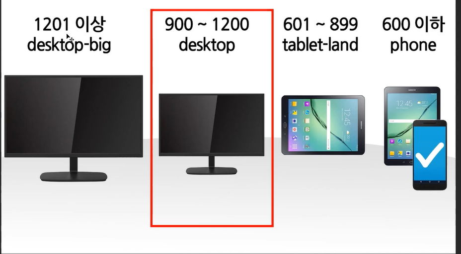
>
> 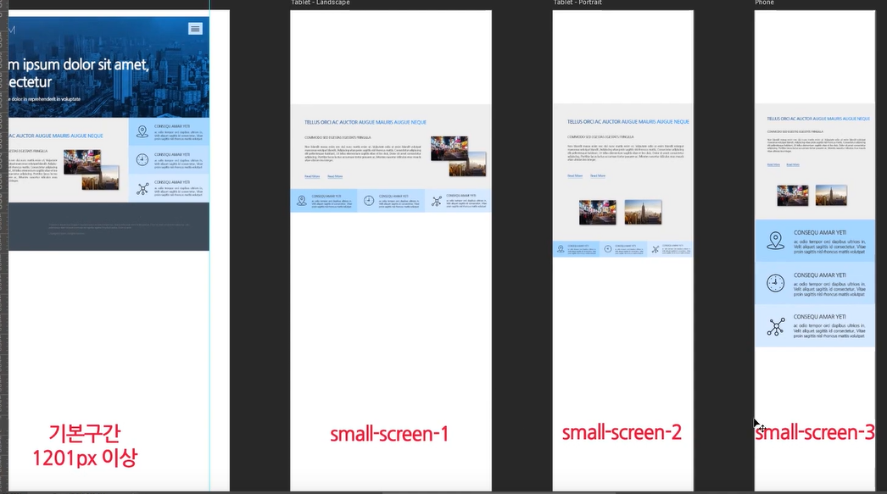
>
> 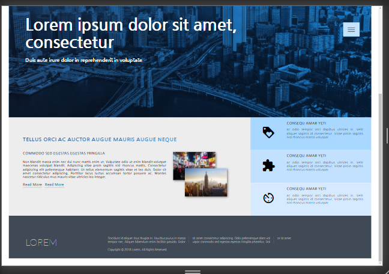
>
> 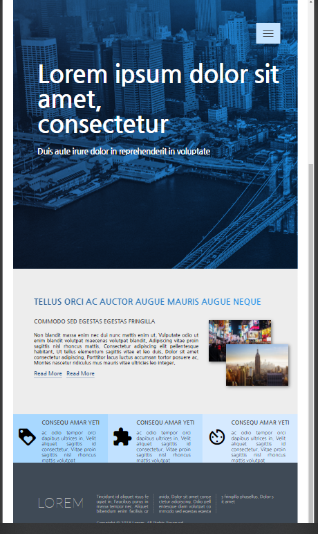
>
> 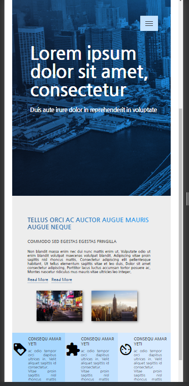
>
> 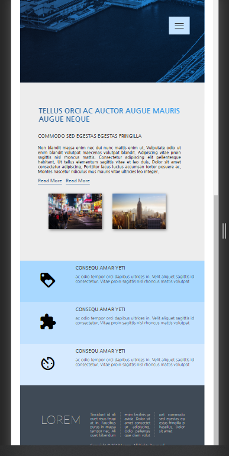