# Git

[toc]

>Git은 분산버전관리시스템입니다.

## 준비하기

- 윈도우에서 Git을 활용하기 위해 [git bash](https://git-scm.com/downloads)를 설치합니다.

- 초기 설치를 완료한 이후에, 계정설정을 진행합니다.

``` sh
$  git config --global user.email {이메일주소}
```


## 로컬 저장소 활용하기

> ## 생성하기
>
> - 새로운 로컬 저장소를 생성하기
>
>   ```
>     $ git init [project_name]
>   ```
>
> - 저장소 가져오기
>
>   ```
>     $ git clone [url]
>   ```
>
> ## 살펴보기
>
> - 작업 디렉토리에 변경된 파일 보기
>
>   ```
>   $ git status
>   ```
>
> - 변경된 staged 파일 보기
>
>   ```
>   $ git diff
>   ```
>
> - 변경 이력 보기
>
>   ```
>   $ git log
>   ```
>
> ## 브랜치 작업하기
>
> - 로컬 브랜치 보기
>
>   ```
>   $ git branch
>   ```
>
> - 로컬과 원격 브랜치 보기
>
>   ```
>   $ git branch -av
>   ```
>
> - 브랜치 변경하기
>
>   ```
>   $ git checkout <branch>
>   ```
>
> - 브랜치 생성하기
>
>   ```
>   $ git branch <new-branch>
>   ```
>
> - 브랜치 삭제하기
>
>   ```
>   $ git branch -d <branch>
>   ```
>
> - 원격 브랜치를 추적하는 새로운 브랜치 만들기
>
>   ```
>   $ git checkout --track <remote/branch>
>   ```
>
> - 원격 브랜치 추적하기
>
>   ```
>   $ git branch -u <remote/branch>
>   ```
>
> - 현재 커밋에 태그 달기
>
>   ```
>   $ git tag <tag-name>
>   ```
>
> ## 변경하기
>
> - 파일의 변경 사항을 다음 커밋에 반영하기
>
>   ```
>   $ git add [file]
>   ```
>
> - 모든 변경 사항을 다음 커밋에 반영하기
>
>   ```
>   $ git add .
>   ```
>
> - 메시지와 함께 커밋하기
>
>   ```
>   $ git commit -m "commit message"
>   ```
>
> - 모든 변경 사항을 반영하면서 커밋하기
>
>   ```
>   $ git commit -a
>   ```
>
> - 마지막 커밋 수정하기(published commit에는 하지 말 것!)
>
>   ```
>   $ git commit --amend
>   ```
>
> ## 취소하기
>
> - 작업 디렉토리에 모든 변경 버리기
>
>   ```
>   $ git reset --hard HEAD
>   ```
>
> - 커밋 되돌아가기
>
>   ```
>   $ git revert <commit>
>   ```
>
> ## 동기화하기
>
> - 원격 저장소의 변경사항 가져오기
>
>   ```
>   $ git fetch <remote>
>   ```
>
> - 원격 저장소의 변경사항을 가져오고 머지하기
>
>   ```
>   $ git pull <remote> <branch>
>   ```
>
> - 원격 저장소의 변경사항을 가져오고 리베이스하기
>
>   ```
>   $ git pull --rebase
>   ```
>
> - 원격 저장소에 변경사항 발행하기
>
>   ```
>   $ git push
>   ```
>
> - 원격 저장소에 태그 발행하기
>
>   ```
>   $ git push --tags
>   ```
>
> ## 병합하기와 리베이스하기
>
> - 병합하기
>
>   ```
>   $ git merge <branch>
>   ```
>
> - 리베이스하기
>
>   ```
>   $ git rebase <branch>
>   ```
>
> ## 변경사항 저장하고 복원하기
>
> - 임시로 변경사항 저장하기
>
>   ```
>   $ git stash
>   ```
>
> - 임시 변경사항 복원하기
>
>   ```
>   $ git stash pop
>   ```
>
> - 임시 변경사항 보기
>
>   ```
>   $ git stash list
>   ```
>
> ## References
>
> - https://jrebel.com/rebellabs/git-commands-and-best-practices-cheat-sheet/
> - https://www.git-tower.com/blog/git-cheat-sheet/
> - https://github.github.com/training-kit/downloads/github-git-cheat-sheet.pdf

### 1. 저장소 초기화

> 이제부터 이 디렉토리를  git으로 관리하겠다!(변경 이력을 감시하겠다!)

``` sh
$ git init
```

- `$`은 shell이란 뜻입니다.
- `.git` 디렉토리가 생성되며, 여기에 git과 과나련된 모든 정보가 저장됩니다.
- 초기화를 하고나면 git bash에 `(master)`라고 표시가 되는데, 이는 이 디렉토리는 이미 git이 관리하고 있다는 뜻으로 생각할 수 있습니다.
- 이미 초기화 한 repo에서는 다시 `git init`을 하지 않습니다.


### 2. add

> working directory 작업공간에서 변경된 사항을 이력으로 관리하기 위해서는 반드시 staging area를 거쳐야 합니다.

```sh
$ git add {staging 할 파일}
```


### 3. Commit

> 이력을 확정 짓는, 즉 기록을 남기는 명령어입니다.

```sh
$ git commit -m '커밋 메세지'
```

- `-m`을 반드시 입력하세요.

- 커밋 기록을 확인하고 싶다면 아래의 명령어를 참고하세요.

  ```sj
  $ git log
  ```


### 4. Status

> git을 쓰면서 가장 많이 사용해야 하는 명령어, 현재 상황을 확인할 수 있습니다.

```sh
$ git status
```


## 원격 저장소 활용하기

> 여러 서비스 중, github을 기준으로 설명합니다.

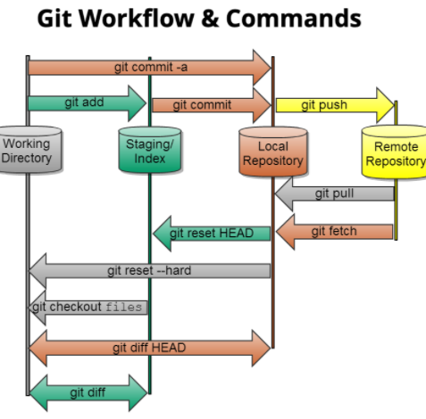

### 1. 준비사항

- github에 회원가입후, 빈 repo를 만들어 둡니다.


### 2. 원격 저장소 등록

- 로컬 저장소와 원격 저장소를 연결하는 일입니다.

```sh
$ git remote add origin {github repo url}
```

- 원격 저장소(remote)를 등록할건데, `origin`이라는 이름으로 원격 저장소를 등록하겠다는 의미입니다.
- 원격 저장소 등록 현황을 확인하려면 아래의 명령어를 참고하세요.

```sh
$ git remote -v
```


### 3. 원격 저장소에 업로드

- 아래의 명령어를 통해 원격 저장소에 commit된 코드를 업로드 할 수 있습니다.

```sh
$ git push origin master
```


### 4. 원격 저장소에서 로컬로 가져오기

- github이나 gitlab의 repo 주소를 복사한 뒤,

```sh
$ git clone {가져오고자 하는 repo url}
```


### 5. 변경사항 다운로드

```sh
$ git pull origin master
```


## Git Branch

### Git Flow

>  가로축은 소스코드가 얼마나 안정돼있는지 문제가 생기면 비용이 얼마나 발생하는지
>
> 세로축은 시간
>
> Branch는 Master와 Develop는 있지만 나머지는 다 생성됐다가 합쳐지는 용도
>
> Master(정식출시): 고객, 사용자(End user)
>
> Develop(알파테스트): 개발자,개발
>
> Release(베타테스트): 테스터,QA,기획자

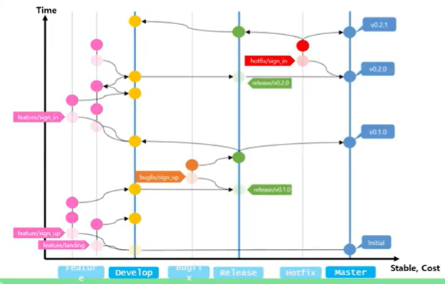

#### Git Flow 시작하기

> git bash에 `git flow init`
>
> 아래와 같이 설정하게 됨
>
> 설정을 하고나면 branch가 develop로 바뀜!
>
> 버전 : `major.miner.petch`순서

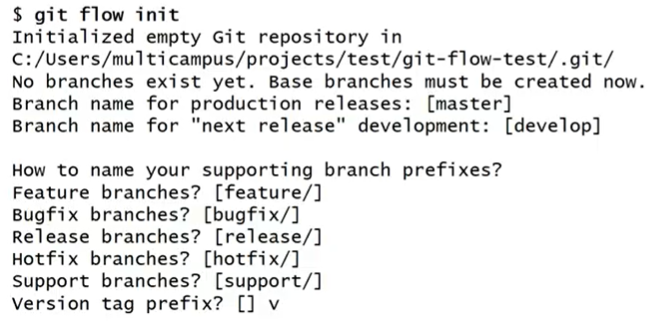

- sign_up 브랜치를 만들겠다! develop브랜치에서 sign_up 브랜치를 만들겠다

```sh
$ git flow feature start sign_up
# 작업이 끝나면
$ git flow feature finish sign_up
```

***하지만..Git Flow 명령어 사용안하겠다...!! 이러면 바로 Merge가 됨, 우리는 코드리뷰를 하기 위해 MR을 해서 merge를 하자! 안전하게 만들기 위해!***

아래와 같은 Git Flow(권장)

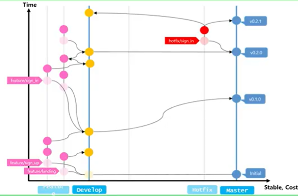

### Trunk based

> Git Flow와 다른 소스코드 브랜칭 모델(참고)
>
> 브랜치를 짧게 만들고 바로 배포할 수 있는 용도로 Master브랜치를 만들어라
>
> 그리고 Relese의 브랜치가 배포됨
>
> 빠르게 기능을 내보내는 용도

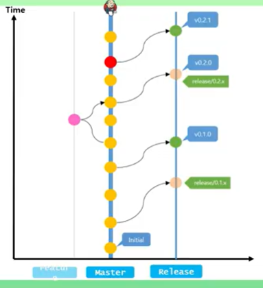

----------

## 참고

### Git commit 사전 작업

> 이름과 이메일(SSAFY에서 쓸 이메일)
>
> 프로젝트할때 이름을 통일해야 어떻게 commit했는지 알 수 있음

```sh
#전역설정
$ git config --global user.name "이름"
$ git config --global user.email "이메일"
#만약 이미 git hub으로 쓰는게 있다면 이 프로젝트의 user.name과 email을 따로 설정
$ git config user.name "이름"
$ git config user.email "이메일"
```


### Git 연습하기

> https://learngitbranching.js.org/?locale=ko
>
> [Git 연습](https://ssafyprj.github.io/)
>
> [Git 명령어](https://git-scm.com/book/ko/v2)
>
> - commit
> - branch
> - checkout
> - cherry-pick
> - reset
> - revert
> - rebase
> - merge

#### commit

> 커밋은 Git 저장소에 여러분의 디렉토리에 있는 모든 파일에 대한 스냅샷을 기록하는 것. 디렉토리 전체를 복사하여 붙여넣는것과 유사하지만, 훨씬 유용한 방법
>
> Git은 가능한 한 커밋을 가볍게 유지하고자 하기때문에, 커밋할 때마다 디렉토리 전체를 복사하진 않는다. 각 커밋은 저장소의 이전 버전과 다음 버전의 변경내역("delta"라고도 함)을 저장한다. 그래서 대부분의 커밋이 그 커밋 위의 부모 커밋을 가리킨다. 
>
> 저장소를 복제(clone)하려면 모든 변경분(delta)를 풀어내야 하는데, 이 때문에 명령행 결과로 아래 문구를 볼 수 있다.
>
> `resolving deltas`
>
> 커밋은 매우 가볍고 커밋 사이의 전환도 매우 빠르다는 것을 기억!

#### branch

> 깃의 브랜치도 놀랍도록 가볍다. 브랜치는 특정 커밋에 대한 참조(reference)에 지나지 않는다.
>
> `브랜치를 서둘러서, 그리고 자주 만들어라`
>
> 브랜치를 많이 만들어도 메모리나 디스크 공간에 부담이 되지 않기 때문에, 작업을 커다른 브랜치로 만들기 보다, 작은 단위로 잘게 나누는 것이 좋다.
>
> 브랜치와 커밋을 같이 쓸 때, 어떻게 두 기능이 조화를 이루는지 알아보자. 하지만 우선은, 단순히 브랜치를 "하나의 커밋과 그 부모 커밋들을 포함하는 작업 내역"이라고 기억하시면 된다.
>
> git branch 명령어를 통해 branch를 만들고 commit을 해도 master에서 branch를 옮기지 않았기 때문에 새로운 branch가 아니라 master branch에 적용된다
>
> ```sh
> $ git branch [생성할 브랜치명]
> $ git checkout [브랜치명]
> $ git commit
> ```
>
> 위 명령어를 사용하면 변경분을 커밋하기 전에 새 브런치로 이동하게 된다
>
> 위 과정을 줄일 수 있는 명령어
>
> ```sh
> # checkout 명령에 -b 옵션을 넣으면 브랜치 작성과 체크아웃을 한꺼번에 실행할 수 있습니다.
> $ git checkout -b <branch name>
> ```
>
> 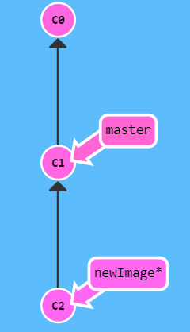

#### Merge

> 이제 두 별도의 브랜치를 합치는 방법
>
> 브랜치를 따고, 새 기능을 개발 한 다음 합칠 수 있게 된다.
>
> 처음으로 살펴볼 방법은 `git merge`다. Git의 합치기(merge)는 두 개의 부모(parent)를 가리키는 특별한 커밋을 만들어 낸다. 두개의 부모가 있는 커밋이라는 것은 "한 부모의 모든 작업내역과 나머지 부모의 모든 작업, 그리고 그 두 부모의 모든 부모들의 작업내역을 포함한다"라는 의미가 있다.
>
> 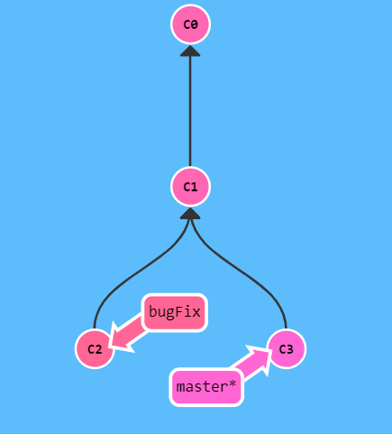
>
> 여기에 브랜치가 두 개 있다. 각 브랜치에 독립된 커밋이 하나씩 있다. 그 말은 이 저장소에 지금까지 작업한 내역이 나뉘어 담겨 있다. 
>
> `bugFix` 브랜치를 `master` 브랜치에 합쳐(merge) 보겠다.
>
> ```sh
> $ git merge bugFix
> ```
>
> 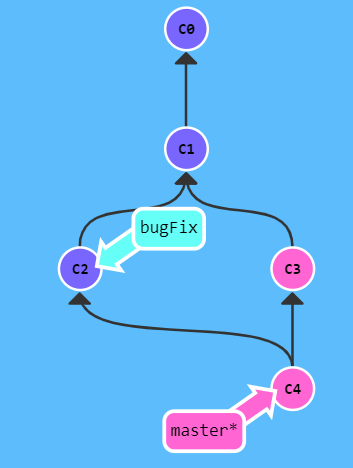
>
> 우선, `master`가 두 부모가 있는 커밋을 가리키고 있다.
>
> 각 브랜치는 그 브랜치만의 색상으로 그렸다. 브랜치가 합쳐지는 커밋의 경우에는, 그 브랜치들의 색을 조합한 색상으로 표시 했다.
>
> 그런식으로 여기에 `bugFix`브랜치 쪽을 제외한 나머지 커밋만 `master` 브랜치의 색으로 칠해져 있다. 
>
> ```sh
> $ git checkout bugFix
> $ git merge master
> ```
>
> `bugFix`가 `master`의 부모쪽에 있었기 때문에, git이 별다른 일을 할 필요가 없다. 간단히 `bugFix`를 `master`가 붙어 있는 커밋으로 이동시켰다.
>
> 이제 모든 커밋의 색이 같아졌고, 이는 두 브랜치가 모두 저장소의 모든 작업 내역을 포함하고 있다는 뜻이다.
>
> 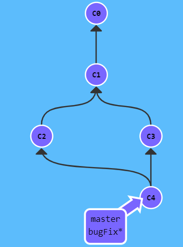

```sh
$ git checkout -b bugFix
$ git commit
$ git checkout master
$ git commit
$ git merge bugFix
```

#### Rebase

> 브랜치끼리의 작업을 접목하는 두번째 방법은 *리베이스(rebase)*다. 리베이스는 기본적으로 커밋들을 모아서 복사한 뒤, 다른 곳에 떨궈 놓는 것이다.
>
> 조금 어렵게 느껴질 수 있지만, 리베이스를 하면 커밋들의 흐름을 보기 좋게 한 줄로 만들 수 있다는 장점이 있다. 리베이스를 쓰면 저장소의 커밋 로그와 이력이 한결 깨끗해진다
>
> 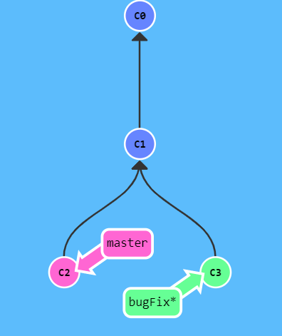
>
> 여기 또 브랜치 두 개가 있다
>
> `bugFix` 브랜치가 현재 선택됐다(별표 표시)
>
> `bugFix` 브랜치에서의 작업을 `master` 브랜치 위로 직접 옮겨 놓으려고 한다. 그렇게 하면, 실제로는 두 기능을 따로따로 개발했지만, 마치 순서대로 개발한 것처럼 보이게 된다.
>
> ```sh
> $ git rebase master
> ```
>
> 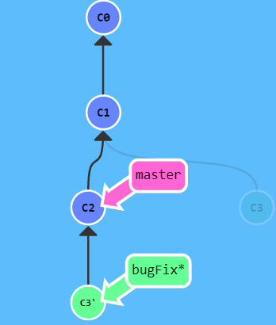
>
> 이제 bugFix 브랜치의 작업 내용이 master의 바로 위에 깔끔한 한 줄의 커밋으로 보인다.
>
> C3 커밋은 어딘가에 아직 남아있고(그림에서 흐려짐), C3'는 master 위에 올려 놓은 복사본이다.
>
> 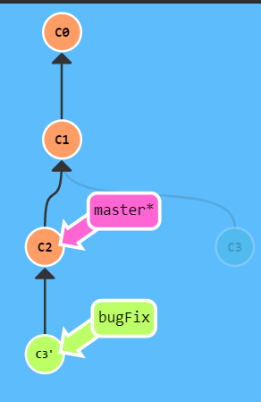
>
> 지금 `master` 브랜치를 선택한 상태다. `bugFix` 브랜치쪽으로 리베이스 한다
>
> ``` sh
> $ git rebase bugFix
> ```
>
> 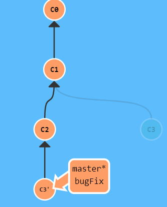
>
> `master`가 `bugFix`의 부모쪽에 있었기 때문에, 단순히 그 브랜치를 더 앞쪽의 커밋을 가리키게 이동하는 것이 전부다.

- `bugFix`라는 새 브랜치를 만들어 선택하세요
- 커밋 한 번 합니다
- `master`로 돌아가서 또 커밋합니다
- bugFix를 다시 선택하고 master에 리베이스 하세요

```sh
$ git checkout -b bugFix
$ git commit
$ git checkout master
$ git commit
$ git checkout bugFix
$ git rebase master
```

### git commit tree

> 깃 여기저기로 옮겨다니기

#### HEAD

> HEAD는 현재 체크아웃된 커밋을 가리킨다.  현재 작업중인 커밋이다.
>
> HEAD는 항상 작업트리의 가장 최근 커밋을 가리킨다. 작업트리에 변화를 주는 git 명령어들은 대부분 HEAD를 변경하는것으로 시작한다.
>
> 일반적으로 HEAD는 브랜치의 이름을 가리키고있다(bugFix와 같이). 커밋을 하게 되면, bugFix의 상태가 바뀌고 이 변경은 HEAD를 통해서 확인이 가능하다.
>
> ```sh
> $ git checkout C1
> $ git checkout master
> $ git commit
> $ git checkout C2
> ```
>
> 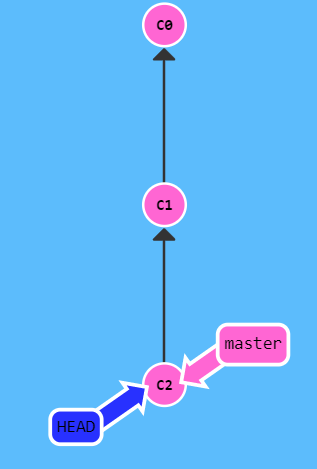
>
>  HEAD가 `master`브랜치 아래에 숨어있다.

##### Head 분리하기

> HEAD를 분리한다는 것은 HEAD를 브랜치 대신 커밋에 붙이는 것을 의미한다. 명령을 사용하기 전의 모습은 다음과 같습니다:
>
> `HEAD -> master -> C1`
>
> ```sh
> $ git checkout C1
> ```
>
> 이렇게 바뀜
>
> 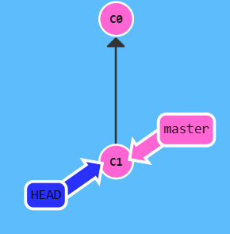
>
> `HEAD -> C1`

#### 상대 참조

> Git에서 여기저기 이동할 때 커밋의 해시를 사용하는 방법은 조금 귀찮다. 실제로 Git을 사용할 때는 터미널화면 옆에 예쁘장하게 커밋트리가 보이진 않는다. 매번 해시를 확인하려고 `git log` 명령어를 치고 있다.
>
> 나아가서, 실제 Git에서는 해시들이 훨씬 더 길다. 예를 들어 이전 레벨에 소개했던 커밋의 해시는 `fed2da64c0efc5293610bdd892f82a58e8cbc5d8`다.
>
> 다행히도, Git은 똑똑하다. 해시가 커밋의 고유한 값임을 보여줄 수 있을 만큼만 명시해주면 된다. 위의 긴 문자열 대신 `fed2`만 입력해도 된다.
>
> 커밋들을 해시로 구분하고 사용하는것이 아주 편하다고 볼 수는 없다. Git의 상대 참조(Relative Ref)가 여기서 등장한다. 
>
> 상대 참조로 우리가 기억할 만한 지점(브랜치 `bugFix`라던가 `HEAD`라던가)에서 출발해서 이동하여 다른 지점에 도달해 작업을 할 수 있다.
>
> 상대 커밋은 강력한 기능인데, 여기서 두가지 간단한 방법이 있다.
>
> - 한번에 한 커밋 위로 움직이는 `^`
> - 한번에 여러 커밋 위로 올라가는 `~<num>`

##### 캐럿 (^) 연산자

> 참조 이름에 하나씩 추가할 때마다, 명시한 커밋의 부모를 찾게 된다.
>
> `master^`는 "`master`의 부모"와 같은 의미
>
> `master^^` 는 "`master`의 조부모(부모의 부모)"를 의미
>
> master 위에 있는 부모를 체크아웃 해보자
>
> ```sh
> $ git checkout master^
> ```
>
> 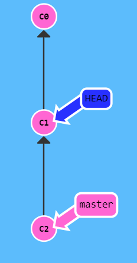
>
> 커밋의 해시를 입력하는 것보다 훨씬 쉬운 방법이다
>
> 또한 참조인 `HEAD`도 상대참조를 위해 사용할 수 있다. 커밋트리 위쪽으로 움직이기위해 여러번 사용 해보자.
>
> ``` sh
> $ git checkout C3
> $ git checkout HEAD^
> $ git checkout HEAD^
> $ git checkout HEAD^
> ```
>
> 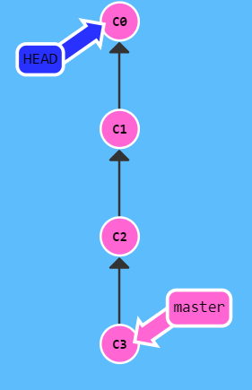
>
>  `HEAD^`를 통해 시간을 거슬러 올라갈 수 있다.

##### 틸드(~) 연산자

> 커밋트리에서 위로 여러 단계를 올라가고 싶을 수 있다. `^`를 계속 입력해서 올라가는것 말고 좋은 방법이 있다. Git 에는 `틸드 (~) 연산자`가 있다.
>
> (~) 틸드 연산자는 (선택적) 올라가고 싶은 부모의 갯수가 뒤에 숫자가 온다
>
> 돌아가고 싶은 커밋의 갯수를 `~`뒤의 숫자로 명시하면 됨
>
> ```sh
> $ git checkout HEAD~4
> ```
>
> 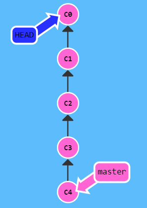


#### 브랜치 강제로 옮기기 `-f`

> 상대 참조를 사용하는 가장 일반적인 방법은 브랜치를 옮길 때이다. `-f` 옵션을 이용해서 브랜치를 특정 커밋에 직접적으로 재지정 할 수 있다. 
>
> ```sh
> $ git branch -f master HEAD~3
> ```
>
> (강제로) master 브랜치를 HEAD에서 세번 뒤로 옮겼다. 
>
> 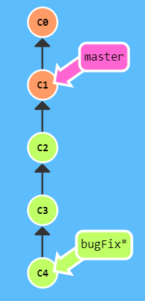
>
> 상대 참조를 통해 `C1`을 간결한 방법으로 참조할 수 있었고 브랜치 강제(`-f`)를 통해 브랜치를 저 위치로 빠르게 옮길 수 있다

`HEAD`와 `master`와 `bugFix`를 제시되는 골지점으로 옮기기

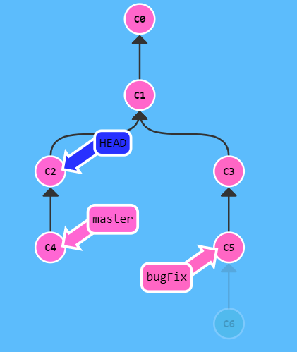

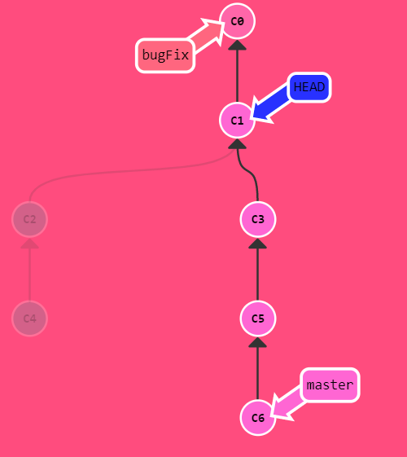

### (참고) Git 되돌리기

Git을 익히면서 헷갈렸던 것들 중의 하나가 이력을 되돌리기 입니다. Git에서 이력을 되돌리는 방법은 여러가지가 있지만, 그 중에 대표적인게 Reset과 Revert 입니다. 단어 의미만 보고는 둘 사이의 차이를 알기 쉽지 않은데, 풀어서 설명해보면 Reset은 시계를 다시 맞추드시 이력을 그 당시로 되돌리는 것이고, Revert는 이전 이력은 그대로 두고, 그 되돌릴 커밋의 코드만 원복시킵니다. 이 개념을 이리온님께서 만화로 설명해 주신게 있는데 참고하시면 이해하는데, 더 도움이 됩니다.

( 

 

\1. Reset

앞에서 설명한대로 Reset은 시계를 다시 맞추는 것입니다. 돌아 가려는 커밋으로 리파지토리는 재설정되고, 해당 커밋 이후의 이력은 사라집니다. 예를 한번 들어볼까요? ( 일반적인 개발 이력과는 차이가 있지만, 이해가 쉽게 하기 위해 영화 “유주얼 서스펙트”를 이용했고 이에 대한 스포일러를 포함합니다. 하지만, 이미 보셨거나 들어보셨을 것이라 생각합니다. )

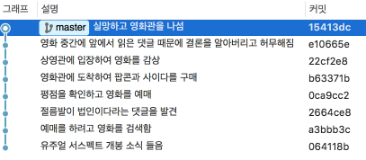

그림1. 기대했으나 스포일러 때문에 실망했던 이력

[그림1]을 보시면 기대했던 영화를 예매하였으나 스포일러 때문에 실망했던 이력을 볼 수 있습니다. 그래서 스포일러를 보기 전으로 이력을 되돌리기로 합니다. 마치 내가 기억하고 있는 내용을 변경하는 거죠. 커밋 a3bbb3c 이후의 기억은 지우고 싶습니다. Reset은 다음과 같이 사용합니다.

 

```
$ git reset <옵션> <돌아가고싶은 커밋>
```

 

여기에 옵션이 몇가지 있는데 자주 쓰는 것 hard, mixed, soft 세가지가 있습니다. 영화를 예매하고 검색한 이력인 a3bbb3c 이후에 발생했던 ( 표를 예매하고, 팝콘과 사이다를 구매 같은)변화에 대해서 어떻게 할지에 대한 것입니다.

 

(1) hard

돌아가려는 이력이후의 모든 내용을 지워 버립니다. 이렇게 하면 표를 예매하고, 팝콘과 사이다를 구매했던 모든 것들이 지워지고 모든것이 초기화 됩니다.

 

```
$ git reset --hard  a3bbb3c
```

 

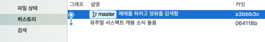

그림2. hard 옵션으로 reset한 후의 이력

 

(2) soft

돌아가려 했던 이력으로 되돌아 갔지만, 이후의 내용이 지워지지 않고, 해당 내용의 인덱스(또는 스테이지)도 그대로 있습니다. 바로 다시 커밋할 수 있는 상태로 남아있는 것입니다. 기억은 되돌려졌지만, 표와 팝콘과 사이다는 손에 들려있는 상태입니다.

 

```
$ git reset --sorf a2bbb3c
```

 


그림3. soft옵션으로 reset한 후의 이력

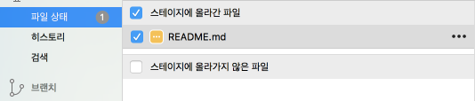

그림4. soft옵션으로 reset한 후의 파일 상태


(3) mixed ( 옵션을 적지 않으면 mixed로 동작합니다. )


역시 이력은 되돌려집니다. 이후에 변경된 내용에 대해서는 남아있지만, 인덱스는 초기화 됩니다. 커밋을 하려면 다시 변경된 내용은 추가해야 하는 상태입니다. 기억도 되돌려 졌고, 표와 팝콘 그리고 사이다는 사야겠다는 마음만 남아있다고 할 수 있습니다.

 

```
$ git reset --mixed a2bbb3c
```

 

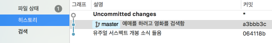

그림5. mixed 옵션으로 reset한 후의 이력

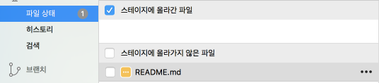

그림6. mixed 옵션으로 reset한 후의 파일 상태

 

또 되돌아가는 커밋을 커밋 해쉬를 통해서 직접 지정할 수도 있고 현재부터 몇개의 커밋을 되돌릴 수도 있습니다 [그림1]에서 처럼 15413dc 부터 a3bbb3c로 돌아가려면

 

```
$ git reset HEAD~6
```

 

위와 같이 현재부터 6개 이전 이력으로 돌아가라라고 상대적으로 지정할 수도 있습니다.

 

\2. Revert

Revert는 상태를 되돌린다고 볼 수 있습니다. 스포를 당한 커밋을 revert하고 현재 작성중인 코드만 본다면 reset과 동일한 (hard 옵션 준거만 빼고) 결과를 가집니다. 하지만 이력은 같지 않습니다. 먼저 결과를 먼저 보고 이어가겠습니다. (reset과 동일하게 스포일러를 당한 것을 되돌립니다)

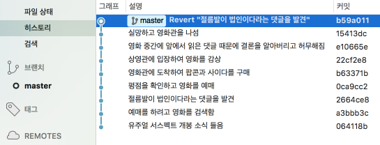

그림7. 스포일러 당한 커밋을 되돌림

이전 이력은 그대로 있고, 스포일러를 당했던 커밋만을 되돌렸습니다. 마치 스포일러 당한것에 대한 것을 기억하고 있지만, 그 내용은 알지 못하는 것처럼 말이죠. ( 이 내용은 앞에서 언급했던 Devpools의 설명에 나온 모나리자 눈썹의 내용이 더 이해가 쉬울것 같습니다. )

revert 를 하는 방법과 스포일러 댓글의 커밋을 되돌리는 것은

 

```
# git revert <되돌릴 커밋> 
git revert 2664ce8
```

 

이고 되돌릴 커밋이 여러개라면 범위를 주어서 여러개를 선택할 수도 있습니다. [그림1]에서 예를 들면 댓글을 읽은 것부터 영화관을 나설때까지 모두 되돌리려면 아래 코드처럼 범위를 주시면 됩니다.

 

```
git revert 2664ce8..15413dc
```

 

3. 언제 reset을 하고 언제 revert를 해야하나?

단순하게 생각하면 reset을 하는 것이 revert를 하는 것보다 이력을 더 단순하게 만들어주기 때문에 revert의 장점이 많지 않아 보입니다. 하지만 이력 중간에 로그 출력하도록 한 커밋이 있고 그 커밋만을 취소하려고 한다면 reset을 사용하여 이후의 이력을 모두 제거하는 것은 이후 이력을 모두 날려버리는 결과를 나을 것입니다. 이런 때 revert를 사용하여 해당 커밋의 내용만 되돌릴 수 있습니다. 또한 이미 원격 리파지토리에 push 를 한 상태라면 reset을 사용하면 reset 하기 이전으로 되돌리기 전까지는 push 할 수 없게됩니다. (물론 force라는 무시무시한 옵션이 있기는 합니다. ) 그래서 이미 push 한 코드라면 미련을 버리고 revert를 하셔야 합니다.

### 추가학습자료

> [git with d3](https://onlywei.github.io/explain-git-with-d3/)
>
> [개발바보들 1화 — git “Back to the Future ”](http://devpools.kr/2017/01/31/개발바보들-1화-git-back-to-the-future/)