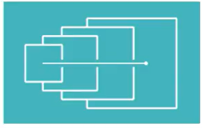

# UX/UI

> UX(User Experience) : 사용자경험
>
> UI(User Interface) : 사용자 상호 작용
>
> 어느 플랫폼에서 누가 어떻게 사용할건지 고민하는 일
>
> UX/UI 디자인
>
> 타고난 감각보다는 관심과 학습의 영역
>
> 뛰어난 개발자는 UI/UX 이해가 높음

[toc]

## 현업에서 UX/UI 

> 기획자 -> 디자이너 -> 개발자

### 현엽 관점에서 유능한 개발자

- 가능/불가능한 기능 및 예외 사항에 대한 인식
- 이를 정확하게 납득시킬 수 있는 설득력(가장 중요하지만 설득이 잘 안됨)
  - 설명할 수준으로 알고 있기 힘듦
  - 개발자에 대한 인식(수동적인태도"그건 안돼요")
  - 지속적인 협업을 통해 나에 대한 신뢰 확보
- 그 기능을 요구하게된 기획자/디자이너 의도 파악
- 최대한 요구와 일정에 맞출 수 있는 개발 실력

### UI 이해의 중요성

- 각 영역에 대한 이해가 높을 수록 일을 하기 수월함(개발자 출신 기획자,개발자 출신 디자이너)
- 한가지 전문적인 영역 +알파가 높은 연봉을 만든다

### 백엔드 개발자에게 UI/UX

- 만들고 있는 기능이 어디에 쓰일 것인지 알고 있어야 함(API설계 및 예외 처리 등)

## 개발 플랫폼 별 UI 비교

### 윈도우 앱

- 넓은 화면(많은 정보 표현 가능)
- 키보드를 통한 조작 가능(단축키)
- 그래픽 카드 최대 효율 사용 가능

### 웹

- 인터넷 속도 영향
- 서버 비용 발생 => 이미지, 동영상 줄여야 함
- 웹 개발 환경 한계(웹 프레임워크 이전)
- 한정된 자원으로 효율적인 설계 필요

### 모바일 앱

- 상대적으로 좁은 화면
- PC와는 다른 화면 비(세로가 긴 화면)
- 터치를 통한 조작
- 기존과는 다른 UX/UI 필요
- 동일한 기능 다른 조작

### 웹/ 모바일 UX/UI 고려할 점

- 웹/모바일 모두 지원할 것인지? (모바일 우선 비중이 많음)
- 반응형/적응형(규모 큰 회사 적응형 선호)
- 컨포넌트 설계(디자이너와 개발자의 충돌 지점)
- 디자인 시스템(최종 목적지)

### 게임  UI

- 게임 장르, 플랫폼 , 조작 방식에 따라 다양하고 , 같은 장르라도 차이가 있음(몰입형/ㅣ비몰입형)
- 어떤 경험을 주고 싶은지에 따라 UI결정
- 고객이 누구인지 항상 생각

## UI/UX 향상 방법

### 1. 디자이너는 어떻게 일할까?

1. 아이템 주제에 대한 사전 조사

- 아이템 주제의 특징 파악
- 비슷한 서비스 찾아보기
- 제일 잘 나가는 서비스 특징
- 우리의 차별점은 무엇인가
- 예시
  - OTT(넷플릭스)계정 공유 서비스를 만든다면?
  - PC/Mobile 결정
  - 결재방식
  - 아이디에 대한 보안
  - 우리 서비스의 장점?

2. 디자인 영감 얻기

- [Behance](https://www.behance.net/)
  - ex) app ui 검색
- [Dribbble](https://dribbble.com/)
- [Pinterest](https://www.pinterest.co.kr/)
- 검색키워드
  - netflix ui redesign
  - Sharing App ui
  - Co work app ui

3. 대략적인 레이아웃 잡기

- 화면 설계/프로통타입 툴 사용
  - 디자인보단 화면 설계 초첨 -> 디자인이 포함되면 핵심 가치 파악이 힘들 수 있음
- 발사믹 목업, **파워포인트(애니메이션,공유쉬움)** = > 화면설계툴

- invision, framer =>프로토 타입 툴
  - 실 서비스 처럼 구성하여, 개발 완료 했을 대 모습을 볼 수 있음

4. 키 컬러 정하기

- 고객이 누구인지? 어떤 느낌을 주고 싶은지

5. 상세 화면 디자인 및 아이콘 디자인

- 포토샵
- 스케치
  - MAC OS 전용이라는 단점
  - 와이어 프레임 형식 디자인
  - 아이콘 심볼 등 객체 지향적인 기능

### 2. 레이아웃 & 컴포넌트

- 레이아웃

- 레이이웃을 나누고 컴포넌트의 재사용성이 좋은게 좋다
- 컴포넌트 디자인
  - 디자인 프레임워크사용(Vuetify, Material UI)
- 디자인 프레임워크 단점
  - 서비스에 맞는 원하는 다지안 커스텀 어려움 -> 자체 컴포넌트 개발 도전
  - **컴포넌트 주도 개발(CDD)** -> 최종 목표인 디자인 시스템까지
  - 작은단위에서 큰단위로!

- 디자인 시스템
  - Vuetify/ Material-ui와 비슷함
  - 불필요한 커뮤니케이션을 줄일 수 있다
  - 서비스 디자인에 대한 일관성을 유지할 수 있다
  - 효율적인 업무를 위한 "시스템"
  - 말과 생각은 쉽지만 구축은 굉장히 어려움(기획/디자인/개발의 융합)

#### 레이아웃을 잘 짜는 방법

- 플랫폼 개발사의 공식 문서 디자인 가이드를 배우자
- 공식문서를 많이 봐야됨!!
- [Google Material Design](https://material.io/design)
- [apple developer](https://developer.apple.com/kr/design/)
- 훌륭한 UI서비스를 분석해보자(디스코드)
- 복잡한 서비스를 분석해보자(카카오)
- 규칙을 발견하자
- 평소 습관을 기르자, 관심의 영역

### UI/UX 중요성

- 현업에서는 다양한 이해관계 등 고려할 것은 더 많아짐
- 기본기를 확실하게 쌓으면 도움됨

