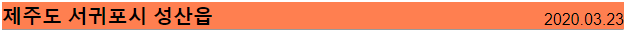
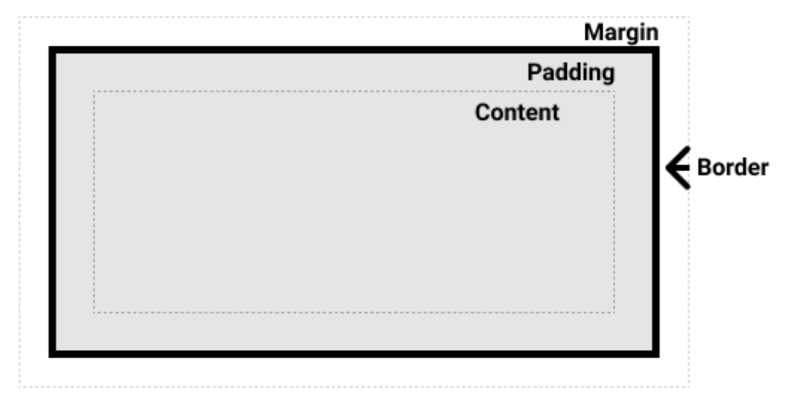

# Web(0811)

## 추가로 이해한 것

## CSS Position (중요)

[(출처)CSS position MDN 참고](https://developer.mozilla.org/ko/docs/Web/CSS/position)

#### 위치 지정 요소

- `position`의 계산값이 `relative`, `absolute`, `fixed`, `sticky` 중 하나인 요소
- 값이 `static`이 아닌 모든 요소


#### 상대 위치 지정 요소

- `position`의 계산값이 `relative`인 요소
-  `top`과 `bottom`은 원래 위치에서의 세로축 거리를, `left`와 `right`은 원래 위치에서의 가로축 거리를 지정
- `relative` : `static 위치`를 기준으로 이동(상대 위치)
  
  - 설정된 조상의 position이 default값(=static으로 설정됨)이라면.
  - 이전 기존 위치(static)도 기억하고 있음, 옮겨져도 다른 것들의 위치는 바뀌지 않음
  
  

#### 절대 위치 지정 요소

- `absolute` : static이 아닌 `가장 가까이 있는 부모/조상 요소`를 기준으로 이동(절대위치)
  - 설정된 조상의 position이 default값(=static으로 설정됨)이 아니라면 바로 위 조상을 기준으로!
  - 이전 기존 위치가 없어짐, 옮겨지면 다른 것들의 위치도 바뀜
  - body안에 있는 것처럼 보이지만 따로 떨어진 존재...
- `position`의 계산값이 `absolute` 또는 `fixed`인 요소
- `top`, `right`, `bottom`, `left`는 요소의 컨테이닝 블록(위치의 기준점이 되는 조상 요소) 모서리로부터의 거리를 지정
  - 요소의 크기와 위치는 컨테이닝 블록의 영향을 자주 받음
  - 백분율 값을 사용한 `width`, `height` ,`padding` ,`margin` 속성의 값과 절대적 위치(`absolute`나 `fixed` 등)로 설정된 요소의 오프셋 속성 값은 자신의 컨테이닝 블록으로부터 계산됨
  - ``height`와 `width`가 `auto`로 지정된 절대 위치 지정 요소는 내용에 맞도록 크기를 조절
- 비대체 절대 위치 지정 요소는`top`과 `bottom`을 지정하고, `height`는 지정하지 않음으로써 (즉, `auto`로 두어서) 사용 가능한 수직 공간을 채울 수 있음
- `left`와 `right`를 지정하고, `width`는 `auto`로 두면, 사용 가능한 모든 수평 공간을 채움
- 위에서 설명한 경우(공간을 꽉 채우는 경우)가 아니라면 다음 규칙을 따름
- `top`과 `bottom`을 지정한 경우(`auto`가 아닌 경우), `top`이 우선 적용
- `left`와 `right`를 지정한 경우, `direction`이 `ltr`(영어, 한국어 등)이면 `left`를 우선 적용하고, `direction`이면 `right`를 우선 적용
- 요소가 바깥 여백을 가진다면 거리에 더함
- 절대 위치 지정 요소는 새로운 블록 서식 맥락을 생성


## input

- `placeholder` : 입력전 초기값인데 클릭하면 글자가 사라짐
- 줄바꾸고 싶다면 `<br>`를 하던지, `<div>` 안에 넣어줌

```html
<body>
  <section>
    <form action="">
      <div>
        <label for="username">USERNAME : </label>
        <input type="text" id="username" placeholder="아이디를 입력 해 주세요.">
      </div>
      <div>
        <label for="PWD">PWD : </label>
        <input type="password" id="PWD">
      </div>
      <input type="submit" value="로그인">
    </form>
  </section>
</body>
```


## Box model

- `relative`를 기준으로 `absolute`로 위치를 정함
- 가운데 정렬할 시 
  - top, bottom, right, left를 0으로 주고, margin을 auto로 주면 가운데 정렬 할 수 있음

```css
.big-box {
  position: relative;
  margin: 100px auto 500px;
  border: 5px solid black;
  width: 500px;
  height: 500px;
}

.small-box {
  width: 100px;
  height: 100px;
}

#red {
  background-color: red;
  position: absolute;
  bottom: 0px;
  right: 0px;

  /* 큰 사각형 내부의 우측 하단 모서리에 빨간 사각형 위치시키기 */
  
}

#gold {
  background-color: gold;
  position: fixed;
  right: 50px;
  bottom: 50px;
  /* 브라우저의 하단에서 50px, 우측에서 50px 위치에 고정하기 */
  
}

#green {
  background-color: green;
  position:absolute;
  top: 0;
  left: 0;
  bottom:0;
  right:0:
  margint:auto;
  
}

  /* 큰 사각형의 가운데 위치시키기 */


#blue {
  background-color: blue;
  position: absolute;
  top: 100px;
  left: 100px;
  /* 큰 사각형 좌측 상단 모서리에서 100px, 100px 띄우기 */

}

#pink {
  background-color: pink;
  /* 큰 사각형 내부의 좌측 상단 모서리로 옮기기*/
  position: absolute;


}

```


## CSS styling

- `border-box` VS `content-box`

  - `border-box`는 테두리와 안쪽 여백의 크기도 요소의 크기로 고려
  - 너비를 100 픽셀로 설정하고 테두리와 안쪽 여백을 추가하면, 콘텐츠 영역이 줄어들어 총 너비 100 픽셀을 유지
  - 대부분의 경우 이 편이 크기를 조절할 때 쉬움
  - `content-box`는 기본 CSS 박스 크기 결정법을 사용
  - 요소의 너비를 100 픽셀로 설정하면 콘텐츠 영역이 100 픽셀 너비를 가지고, 테두리와 안쪽 여백은 이에 더해짐

  

- `font-family` : 글꼴 설정

- `border-style` : 테두리 스타일

- `text-aline` : 인라인 정렬

- `width : 100%` 

  - 크기를 꽉 채우게 줌

```css
* {
  box-sizing: border-box;
  margin: 0;
  padding: 0;
}

h4 {
  font-size: 20px;
  font-weight: bold;
  font-family: Arial; 
}

p {
  font-family: Arial;
}

.container {
  width: 1200px;
  margin: 200px auto;
}

.card {
  width: 700px;
  border-style: dashed;
}

.card-nav {
  background-color: green;
  text-align: center;
}

.card-header {
  margin: 18px;
  height: 400px;
  background-color: limegreen;
}

.card-img {
  height: 330px;
  width: 100%;
}

.card-img-description {
  text-align: center;
  color: white;
  height: 70px;
}

.card-body {
  margin: 36px;
}

.card-body-content {
  background-color: wheat;
  padding: 5px;
}
.card-footer {
  background-color: darkgreen;
  color: white;
  text-align: right;
  padding: 5px;
}
```




- 이렇게 한 class에 있는데 h4와 p를 따로 지정해 줘야될 때!

```html
<div class="card-body-title">
    <h4>제주도 서귀포시 성산읍</h4>
    <p>2020.03.23</p>
</div>
```

- `card-body-title`을 `relative`로 설정해서 아래의 p가 그 위치에 맞게 움직일 수 있게 변경해줌
-  `.card-body-title p`는 그 클래스 아래의 p태그 모두를 지칭함
  - `absolute`를 지정해 `relative`인 `card-body-title`를 기준으로 오른쪽, 밑 여백을 0으로 지정하여 오른쪽 정렬을 만들어줌
- `.card-body-title *`는  그 클래스 안의 모든 요소들에게 적용을 해줌
  - 그냥 클래스에 준다면 클래스 전체에만 적용되고 요소 각각에 `inline-block`을 주고 싶으면 이렇게 따로 써서 만들어야됨

```css
.card-body-title {
  position: relative;  
}
.card-body-title p {
  position: absolute;
  right: 0;
  bottom: 0;
}

.card-body-title * {
  display: inline-block;
}
```

- 위 코드를 줄이면 이건 내일 할 예정

```css
.card-body-title {
  display: flex;
  justify-content: space-between;
  align-items: center;
}
```


## Box model

- **Contendt** : 
  - 콘텐츠가 표시되는 영역으로 그 크기는 `width`와 `height`와 같은 속성을 사용해서 정할 수 있음.
- **Padding**
  - 콘텐츠 주변을 마치 공백처럼 자리잡음
  - 패딩의 크기는 `padding`와 관련 속성을 사용해 제어 가능
- **Border**
  - 콘텐츠와 패딩까지 둘러쌈
  - 테두리의 크기와 스타일은 `border`와 관련 속성을 사용하여 제어할 수 있음
- **Margin**
  - 가장 바깥 쪽 레이어로 콘텐츠와 패딩, 테두리를 둘러싸면서 당 상자와 다른 요소 사이 공백 역할을 함
  - 크기는 `margin`와 관련 속성을 사용하여 제어될 수 있음



-  auto는 각 값마다 다르게 적용될 수 있음....

## Block

- **inline**
  - width와 height가 적용되지 않음
  - 옆으로 쌓임
  - ``<span>`은 인라인이기 때문에 전체 문단이 끊기지 않고 하나로 그려짐
  - 보통 인라인 요소는 데이터와 다른 인라인 요소만 포함할 수 있으며, 블록 요소는 포함할 수 없음
  - ex) 링크용 `<a>` 요소와 `<span>`, `<em>` 및 `<strong>` 요소는 모두 기본적으로 인라인으로 표시됩니다.
- **block**
  - width와 height가 적용됨
  - 한 줄에 적용됨
  - 위에서 밑으로 쌓임
  - ex) `<div>`, `<s>`
- **inline-block**
  - 옆으로 쌓이는데 block의 특성도 갖춰 widh와 height가 적용됨
  - `padding`와 `margin`과 `border` 속성으로 인해 다른 요소가 상자에서 밀려남