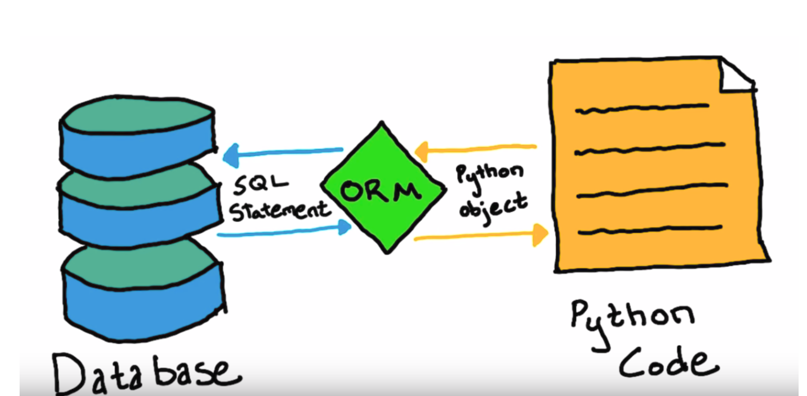
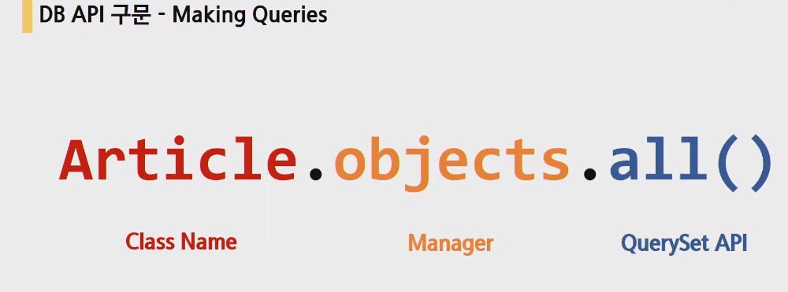
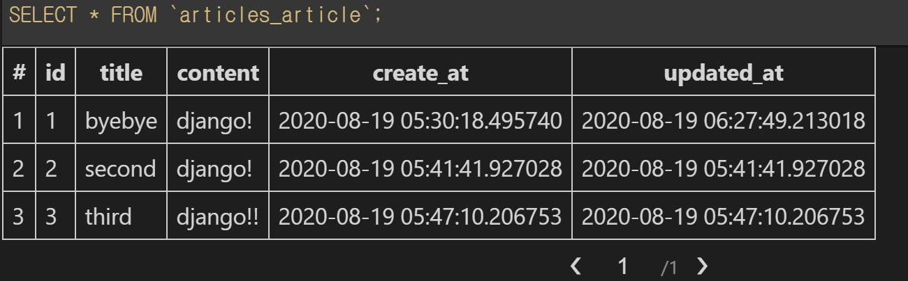

# Django


## Model

- 데이터에 대한 단 하나의 정보 소스
- 저장된 데이터베이스의 구조를 의미
- 장고는 모델을 통해 데이터에 접속하고 관리
- 사용자가 저장하는 데이터들의 필수적인 필드들과 동작들을 포함
- 일반적으로 각각의 모델은 하나의 데이터베이스 테이블에 매핑

- 모델은 데이터베이스와 다른 것이다


## 데이터베이스

- 체계화된 데이터의 모임

- 기본구조
- 스키마(뼈대)
  
  - 데이터베이스의 구조와 제약조건(자료의 구조, 표현 방법, 관계)에 관련한 전반적인 명세를 기술한 것
- 테이블
  - 열(컬럼/필드)과 행(레코드/값)의 모델을 사용해 조작된 데이터 요소들의 SQL데이터베이스에서는 테이블을 관계라고도 함
  - 필드/컬럼/속성/열 : 고유한 데이터 형식이 지정됨 ex) int, text, null(값이 없음)
  - 레코드/행/튜플 : 테이블의 데이터는 행에 저장
  - PK(기본키) : 각 행(레코드)의 고유값으로 Primary Key로 불림, 반드시 설정하여야 하며, 데이터베이스 관리 및 관계 설정시 주요하게 활용(데이터의 무결성)
  
    

## 쿼리

- 데이터를 조회하기 위한 명령어

- 조건에 맞는 데이터를 추출하거나 조작하는 명령어


## ORM

> 'object-Relational-Mapping'은 객체 지향 프로그래밍 언어를 사용하여 호환되지 않는 유형의 시스템간에(Django-SQL)데이터를 변환하는 프로그래밍 기술
>
> 이것은 프로그래밍 언어에서 사용할 수 있는 가상 객체 데이터베이스를 만들어 사용함
>
> 장고는 파이썬을 이용하고 데이터베이스는 SQL을 사용하는데 이것을 변환하여 사용할 수 있게 장고가 ORM을 통해 DB를 조작할 수 있음!



- 장점
  - SQL을 잘 알지 못해도 DB조작이 가능
  - SQL의 절차적 접근(순서중요)이 아닌 객체 지향적 접근으로 인한 높은 생산성
- 단점
  - ORM만으로 완전한 서비스를 구현하기 어려운 경우가 있음
  - 규모가 커지거나 복잡해질 때.
- 현대 웹 프레임워크의 요점은 웹 개발의 속도를 높이는 것(생산성)
- 데이터베이스를 객체로 사용하기 위해 ORM을 사용한다!


## 필드

```python
from django.db import models
#articles는 게시글을 만드는 앱임
# Create your models here.
class Article(models.Model): 
    #상속을받음(우리가 보지못하는 model이라는 부모가 있음) 
    #클래스 이름은 보통 앱이름의 단수형
    #한줄한줄이 필드, 열을작성중
    
    #게시글의 제목을 최대10자까지 저장을함
    title = models.CharField(max_length=10) 
    content = models.TextField() 
    create_at = models.DateTimeField(auto_now_add=True) #작성일자
```


- charfield()
  - *class* `CharField`**(***max_length=None***,** ***options***)
  - 기본값 : max_length=None
  - 길이에 제한이 있는 문자열을 넣을 때 사용
  - max_length가 필수인자
  - 필드의 최대 길이, 데이터베이스와 django의 유효성 검사할 때 사용됨

- TextField()
  - *class* `TextField`(**options)
  - 글자수가 많을 때 사용
  - 필수인자 없음
  - `<textarea>`를 기본 태그로 가지고 있음

- DateTimeField()
  - *class* `DateTimeField`**(***auto_now=False***,** *auto_now_add=False***,** ***options***)
  - auto_now와 auto_now_add는 다름!
  - 최초의 생성 일자 :  `auto_now_add=True`
    - 기본값은 `False`
    - django ORM이 최초 데이터 입력시에만 현재 날짜와 시간으로 갱신
    - 테이블에 어떤 데이터를 최초로 넣을 때 
  - 최종 수정 일자 : `auto_now=True`
    - django ORM이 save를 할 때마다 현재 날짜와 시간으로 갱신


## Migrations

> 장고가 모델에 생긴 변화를 반영하는 법

- django가 model에 생긴 변화(필드를 추가했다던가 모델을 삭제했다던가 등)을 반영하는 방법

- 마이그레이션 실행 및 DB 스키마를 다루기 위한 몇가지 명령어

- `makemigrations`, `migrate`가 중요 필수!!

- 우리가 만든 클래스로 migrations를 만들고, migrate로 DB를 만듦

- `makemigrations`

  - model을 변경한 것에 기반한 새로운 마이그레이션(설계도)을 만들 때 사용
  - 모델을 활성화 하기 전에 DB설계도를 작성
  - 생성된 마이그레이션 파일은 데이터베이스 스키마를 위한 버전 관리 시스템이라고 생각
  - 모델의 변경사항을 기록을 해두는 역사라고 생각하면 됨
  - 데이터베이스가 비어있음(migrate를 해야 채워짐)

  ```sh
  $ python manage.py makemigrations
  Migrations for 'articles':
    articles\migrations\0001_initial.py
      - Create model Article
  
  $ python manage.py makemigrations
  Migrations for 'articles':
    articles\migrations\0002_article_updated_at.py
      - Add field updated_at to article
  ```

  

- `migrate`

  - 작성된 마이그레이션 파일들을 기반으로 실제 DB에 반영
  - `db.sqlite3`라는 데이터베이스 파일에 테이블을 생성
  - 모델에서의 변경 사항들과 DB의 스키마가 동기화를 이룸
  - 빈 DB를 채워줌

  ```sh
  $ python manage.py migrate
  
  테이블이 만들어짐(기존에 있는 것들 + 우리가 만든 것들)
  --
  Running migrations:
    Applying contenttypes.0001_initial... OK
    Applying auth.0001_initial... OK
    Applying admin.0001_initial... OK
    Applying admin.0002_logentry_remove_auto_add... OK
    Applying admin.0003_logentry_add_action_flag_choices... OK
    Applying articles.0001_initial... OK
    Applying articles.0002_article_updated_at... OK
    Applying contenttypes.0002_remove_content_type_name... OK
    Applying auth.0002_alter_permission_name_max_length... OK
    Applying auth.0003_alter_user_email_max_length... OK
    Applying auth.0004_alter_user_username_opts... OK
    Applying auth.0005_alter_user_last_login_null... OK
    Applying auth.0006_require_contenttypes_0002... OK
    Applying auth.0007_alter_validators_add_error_messages... OK
    Applying auth.0008_alter_user_username_max_length... OK
    Applying auth.0009_alter_user_last_name_max_length... OK
    Applying auth.0010_alter_group_name_max_length... OK
    Applying auth.0011_update_proxy_permissions... OK
    Applying auth.0012_alter_user_first_name_max_length... OK
    Applying sessions.0001_initial... OK
  ```

  - `appname_classname`으로 테이블들이 만들어짐

  - 테이블과  그 아래엔 스키마가 있다

  

- sqlmigrate

  - 마이그레이션에 대한 SQL구문을 보기 위해 사용
  - 해당 마이그레이션 파일이 SQL문으로 어떻게 해석되어서 동작할지 미리 확인 하기 위한 명령어

  ```sh
  $ python manage.py sqlmigrate articles 0001
  --
  db의 sql문을 보여줌
  
  BEGIN;
  --
  -- Create model Article
  --
  CREATE TABLE "articles_article" ("id" integer NOT NULL PRIMARY KEY AUTOINCREMENT, "title" varchar(10) NOT NULL, "content" text NOT NULL, "create_at" datetime NOT NULL);
  COMMIT;
  ```

- showmigrations

  - 프로젝트 전체의 마이그레이션과 각각의 상태를 확인하기 위해 사용
  - 마이그레이션 파일들의 migrate 여부를 확인하기 위한 명령어
  - migration이 안됐다면 체크됨

  ```sh
  $ python manage.py showmigrations
  admin
   [X] 0001_initial
   [X] 0002_logentry_remove_auto_add
   [X] 0003_logentry_add_action_flag_choices
  articles
   [X] 0001_initial
   [X] 0002_article_updated_at
  auth
   [X] 0001_initial
   [X] 0002_alter_permission_name_max_length
   [X] 0003_alter_user_email_max_length
   [X] 0004_alter_user_username_opts
   [X] 0005_alter_user_last_login_null
   [X] 0006_require_contenttypes_0002
   [X] 0007_alter_validators_add_error_messages       
   [X] 0008_alter_user_username_max_length
   [X] 0009_alter_user_last_name_max_length
   [X] 0010_alter_group_name_max_length
   [X] 0011_update_proxy_permissions
   [X] 0012_alter_user_first_name_max_length
  contenttypes
   [X] 0001_initial
   [X] 0002_remove_content_type_name
  sessions
   [X] 0001_initial
  ```

  ## Model의 중요 3단계

  > 가장 중요한 핵심

  1. models.py : 변경사항(작성, 수정, 삭제...) 발생

  `python manage.py makemigrations`

  2. makemigrations : 마이그레이션(설계도) 만들기

  `python manage.py migrate`

  3. migrate : DB에 적용

## DB API

- django가 기본적으로 ORM을 제공함에 따른 것으로 DB를 편하게 조작할 수 있도록 도와줌
- Model을 만들면 django는 객체들을 만들고 읽고 수정하고 지울 수 있는(CRUD) database-abstract API를 자동으로 만듦


#### DB API 구문-Making Queries



- Article(Class Name)
- objects(Manager)
  - 중간소통역할
  - 명령어 고정, article과 all만 원하는 것에 따라 바뀜
  - django 모델에 데이터베이스 query작업이 제공되는 인터페이스
  - 기본적으로 모든 django 모델 클래스에 objects라는 manager를 추가
- all(QuerySet API)
  - 데이터베이스로부터 전달받은 `객체` 목록
  - queryset 안의 객체는 0개, 1개 혹은 여러 개일 수 있음
    - 전달받는게 없을지라도 데이터타입은 queryset이다!
  - 데이터베이스로부터 조회, 필터, 정렬 등을 수행 할 수 있음
  - 데이터베이스 조작을 위한 다양한 QuerySet API method들은 해당 공식문서를 반드시 참고!


## CRUD

> create, read, update, delete

- 대부분 컴퓨터 소프트웨어가 가지는 기본적인 데이터 처리 기능인 Create(생성), Read(읽기), Update(갱신), Delete(삭제)를 묶어서 일컫는 말

### CREATE

> 데이터를 작성하는 3가지 방법

1. 첫번째 방법
   - `article = Article()`: 모델 클래스로부터 인스턴스 생성
   - article 인스턴스로 클래스 변수에 접근해 해당 인스턴스 변수를 변경(`article.title = 'first'`)
   - 여기까진 아직 데이터베이스에 저장이 안됨
   - `article.save()`메서드 호출 -> db에 실제로 저장이 끝

2. 두번째 방법
   - 클래스로 인스턴스 생성 시 keyword인자를 함께 작성
   - `article = Article(title='second', content='django!')`
   - `article.save()`메서드 호출-> db에 실제로 저장이 끝
3. 세번째 방법
   - `create()`메서드를 사용하면 쿼리셋 객체를 생성하고 save하는 로직이 한번의 step으로 가능
   - `Article.objects.create(title='third', content='django!!')`

> CRUD를 하기 위해 DB API를 하고 있음

```sh
$ pip install ipython django-extensions
```

- 설치 후 `settings.py`에 추가해줌(`ipython`은 추가안해도 됨)

```python
INSTALLED_APPS = [
    'articles',
    'django_extensions',
```

- 필요한 모듈이 자동으로 import됨
  - `shell`만 치면 import를 직접 쳐서 불러옴

```sh
$ python manage.py shell_plus
```

- `.all()`: 전체를 조회, 전부 다 보여줘

```sh
In[1]: Article.objects.all()
Out[1]: <QuerySet []>
```

#### 첫 번째 방법

``` sh
#게시글 작성이라고 생각하면 됨
In [2] : article = Article() #인스턴스를 만들어줌
In [3]: article
Out[3]: <Article: Article object (None)> #None은 PK값 아직 값이 없기 때문
In [4] : article.title = 'first'
In [5]: article.content = 'django!'
In [7]: article
Out[7]: <Article: Article object (None)>
In [8]: article.save() #이거를 반드시 적어줘야됨 그래야 저장이 됨
In [9]: article
Out[9]: <Article: Article object (1)> #PK가 1이됨
```

#### 두 번째 방법

- 키워드인자로 한번에 침

```sh
In [1]: article = Article(title='second', content='django!')
In [2]: article
Out[2]: <Article: Article object (None)>
In [3]: article.save()
In [4]: article
Out[4]: <Article: Article object (2)> #아까 1을 만들어서 자동을 2번이 됨

In [5]: article.pk #장고에서는 id보다는 pk로 쓰는것을 권장(article.id = article.pk 같은 것이다)
Out[5]: 2

In [6]: article.title
Out[6]: 'second'

In [7]: article.content
Out[7]: 'django!
```

#### 3번째 방법

```sh
In [8]: Article.objects.create(title='third', content='django!!')
Out[8]: <Article: Article object (3)>
```


- CRUD를 하기 위해 DB를 object로 관리한다
- 저장된 object를 볼 수 있다

```sh
In [9]: Article.objects.all()
Out[9]: <QuerySet [<Article: Article object (1)>, <Article: Article object (2)>, <Article: Article object (3)>]>
```

- object를 사람이 읽을 수 있는 문자열로 바꿔보자!
  - `articles`폴더의 `models.py`에 들어가 `class` 안에 함수(`__str__`)를 만들어줌
  - 이건 makemigrations 해도 변경사항이 없다
  - 보통은 인스턴스의 첫번째 클래스변수로 지정, 편한대로 해도됨
  -  `return f'{self.pk}번글의 제목은 {self.title}'` 이렇게 해도됨

```python
class Article(models.Model):
    title = models.CharField(max_length=10)
    content = models.TextField()
    create_at = models.DateTimeField(auto_now_add=True) 
    updated_at = models.DateTimeField(auto_now=True) 
	def __str__(self):
        return self.title 
```

- 만든 뒤 shell_plus를 껐다가(`exit`) 다시 켜야 됨
- object들이 구별할 수 있게 각 title로 변경됨

```sh
In [1]: Article.objects.all()
Out[1]: <QuerySet [<Article: first>, <Article: second>, <Article: third>]>
```

### READ

### `all()`

- `QuerySet` return
- 리스트는 아니지만 리스트와 거의 비슷하게 동작(조작할 수 있음)

### `get()`

- `QuerySet` return아님 
- 객체가 없으면 `DoesNotExist`에러가 발생
- 객체가 여러개일 경우는 `MultipleObjectReturned` 에러가 발생
- 위와 같은 특징을 가지고 있기 때문에 unique한 값(`ex) pk`) 혹은 Not Null 특징을 가지고 있으면 사용할 수 있다.
- 쿼리셋이 아니라 하나의 object로 리턴함(리턴이 있는 건 변수에 할당이 가능하다는 말)

### `filter()`

- 지정된 조회 매개 변수와 일치하는 객체를 포함하는 `QuerySet`을 return
- 값이 없어도 `None`을 return하는 것이 아니라 빈 `QuerySet`을 return함

```sh
In [2]: Article.objects.get(pk=1)
Out[2]: <Article: first>
#Null 값일 때 뜨는 오류
DoesNotExist: Article matching query does not exist
#값이 여러 개일 때 뜨는 오류
MultipleObjectsReturned: get() returned more than one Article -- it returned 2!
#여러 개일 때 조회하려면 filter()사용-찾는게 없어도 무조건 쿼리셋
In [7]: Article.objects.filter(content='django!')
Out[7]: <QuerySet [<Article: first>, <Article: second>]>
#조회하려는 값이 없어도 퀴리셋 리턴!!!
In [8]: Article.objects.filter(content='django!!!!!')
Out[8]: <QuerySet []> 
```


### Update

> 수정이 가장 어려움...

- 1번글 선택

```sh
#1번글 선택
In [10]: article = Article.objects.get(pk=1)
#선택됐는지 확인
In [11]: article.pk
Out[11]: 1
In [12]: article
Out[12]: <Article: first>
In [13]: article.title
Out[13]: 'first'
```

- 제목 값 수정
  - `save()`를 해주지 않는다면 DB에서 수정되지 않음!!!

```sh
#제목수정
In [14]: article.title = 'byebye'
#저장을 꼭 해줘야 됨 그렇지 않으면 DB에서 바뀌지 않음!!
In [15]: article.save()
#수정 됐는지 확인
In [16]: article.title
Out[16]: 'byebye'
```




### Delete

> 가장 간단함

- 삭제할 object를 선택하고 `delete()`를 해주면 됨

```sh
#delete할 object를 선택
In [18]: article = Article.objects.get(pk=1)
#삭제
In [19]: article.delete()
Out[19]: (1, {'articles.Article': 1})
#삭제한 것 찾아보기, 없는값이라고 오류남
In [20]: Article.objects.get(pk=1)
---------------------------------------------------------------------------
DoesNotExist                              Traceback (most recent call last)
<ipython-input-20-00adbda49bfd> in <module>
----> 1 Article.objects.get(pk=1)

~\AppData\Local\Programs\Python\Python37\lib\site-packages\django\db\models\manager.py in manager_method(self, *args, **kwargs)
     83         def create_method(name, method):
     84             def manager_method(self, *args, **kwargs):
---> 85                 return getattr(self.get_queryset(), name)(*args, **kwargs)
     86             manager_method.__name__ = method.__name__
     87             manager_method.__doc__ = method.__doc__

~\AppData\Local\Programs\Python\Python37\lib\site-packages\django\db\models\query.py in get(self, *args, **kwargs)
    429             raise self.model.DoesNotExist(
    430                 "%s matching query does not exist." %
--> 431                 self.model._meta.object_name
    432             )
    433         raise self.model.MultipleObjectsReturned(

DoesNotExist: Article matching query does not exist.
# object를 전체 출력하면 삭제한 것은 사라짐
In [22]: Article. objects.all()
Out[22]: <QuerySet [<Article: second>, <Article: third>]>
```

- 삭제된 pk는 재사용하지 않음(권장)
- 그다음 게시물을 추가하면 pk가 4로 들어감

```sh
#새로운 게시글 추가
In [23]: Article. objects.create(title='fourth', content='django!!!!')
Out[23]: <Article: fourth>
#전체 조회
In [24]: Article. objects.all()
Out[24]: <QuerySet [<Article: second>, <Article: third>, <Article: fourth>]>
#새로 만든 것 변수에 할당해서 pk 확인
In [25]: article = Article.objects.get(content='django!!!!')
In [26]: article.pk
Out[26]: 4
```


## admin 관리자페이지 user등록

- 반드시 DB구축하고(migrate 작업 끝난 뒤) createsuperuser를 만들기!!!
- 그렇지 않으면 등록한 것들이 저장이 안됨

```sh
$ python manage.py createsuperuser
사용자 이름 (leave blank to use 'sooa'): admin
이메일 주소: #옵션값이라 등록안하고 엔터치면 다음으로 넘어감
Password: #비밀번호 admin1234를 쳤지만 보안상 보여주지 않음
Password (again): 
#유효성 검사를 장고 스스로 하고 알려줌
비밀번호가 사용자 이름와 너무 유사합니다.
비밀번호가 너무 일상적인 단어입니다.     
Bypass password validation and create user anyway? [y/N]: y
Superuser created successfully.
```

- `auth_user`테이블에 계정정보를 적어둠
  - 장고도 우리의 비밀번호를 알지 못함
  - 비밀번호 잊는다면 creatsuperuser을 다시 하면됨!


- admin에 Article을 등록 `admin.py`
  - 장고 명시적 상대경로 표현 법 : 같은 위치에 있는 곳을 표현할 때 (.)을 사용
  - `admin.site.register(모델명)` : admin에 site에 등록하겠다(특정모델을) 이렇게 외우면 됨

```python
from django.contrib import admin
from .models import Article #장고 명시적 상대경로 표현법

admin.site.register(Article)
```

- `__str__`을 해놔서 object가 아니라 글로 표현됨

