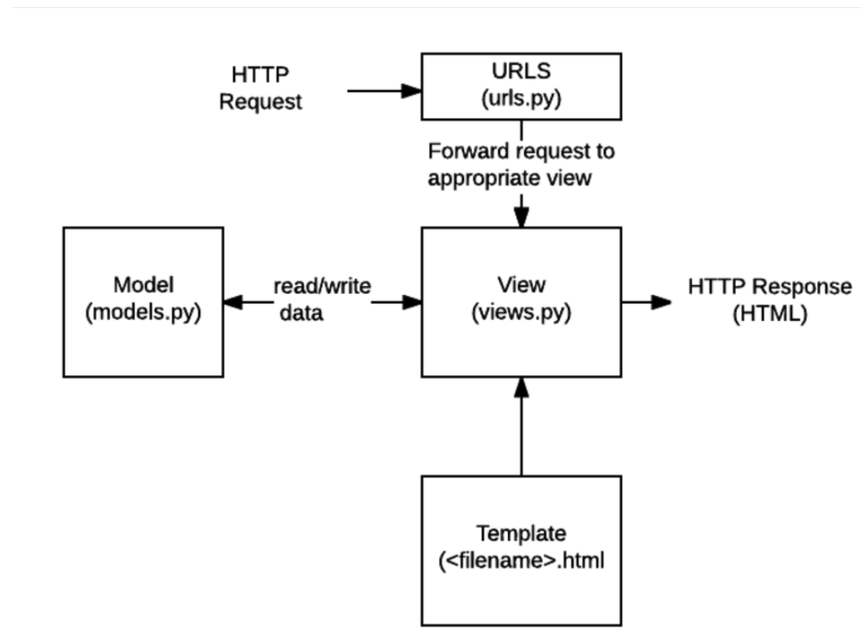
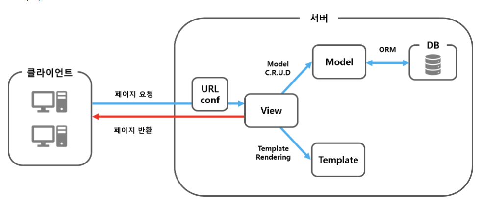
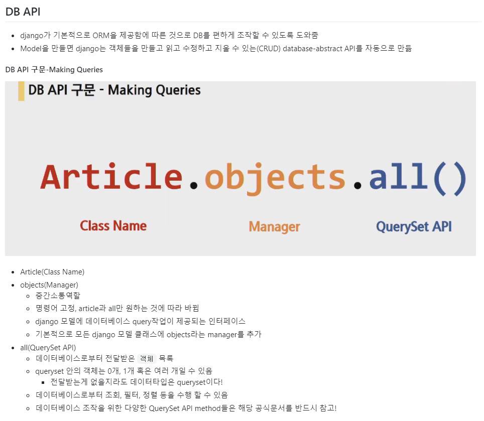
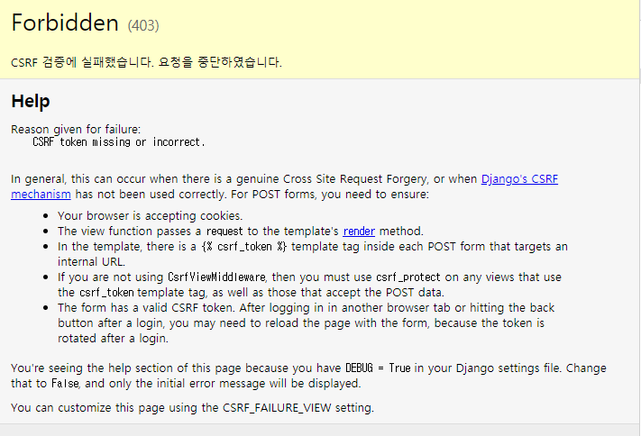
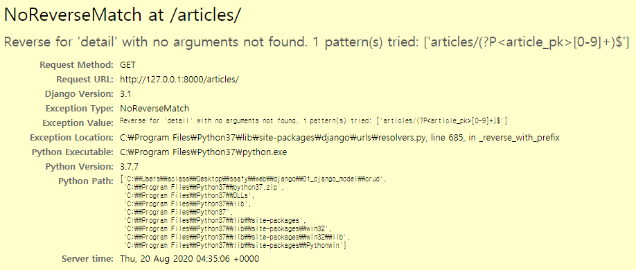

# Django

##  새로알게 된 것

- html에서 list indexing = `list.indexing` 사용 ex) 2중 list라면 `list.indexing.indexing`

- `a`link에서 클릭 시 하이퍼링크 이동경로 `/html이름/` 을 `href=`에 적어주면 됨
- 리스트를 딕셔너리로 만들 때 아래와 같이 만들면 됨

```python
articles = [
        ['test title1', 'test content1'],
        ['test title2', 'test content2'],
        ['test title3', 'test content3'],
        ['test title4', 'test content4'],
        ['test title5', 'test content5'],
    ]  
    
    context = {
        'articles' : articles,
    }
```

- `for`문
  - 딕셔너리의 key를 통해 반복문을 돈다

```html
<table class="table">
    <thead>
      <tr> 
 articles('key'값을 통해 indexing으로 값들을 불러옴)       
        <th scope="col">{{ articles.0.0 }}</th>
        <th scope="col">{{ articles.0.1 }}</th>
        <th scope="col">{{ articles.0.2 }}</th>
        <th scope="col">{{ articles.0.3 }}</th>
      
      </tr>
      
    </thead>
    
    <tbody>
      
        
       첫번째 루프면 건너뛰고 
        
          <tr>
            <th scope="row">{{ forloop.counter0 }}</th>
            <td>{{ article.0}}}}</td>
            <td>{{ article.1 }}</td>
            <td>{{ article.2 }}</td>
          </tr>
        
      
    </tbody>
  </table>
```


## 추가로 배움

> 만드는 과정 제대로 정리해보쟈
>
> - 커뮤니티게시판
> - 글보여주는페이지
> - 글쓰기 페이지
> - 글쓰기 버튼 누르면
> - 실제 DB에다가 글을 등록
> - 글써짐
> - `admin.py`
>   - 관리자용 페이지 관련 기능을 작성 하는 곳.
> - `apps.py`
>   - 앱의 정보가 있는 곳. 
>   - 우리는 수정할 일이 없다.
> - `models.py`
>   - 앱에서 사용하는 Model(Database)를 정의하는 곳.
> - `tests.py`
>   - 테스트 코드를 작성하는 곳.
> - `views.py`
>   - view가 정의 되는 곳. 

1. 프로젝트 생성

```sh
$ django-admin startproject {원하는이름}
```

- 서버 열기

```sh
$ python manage.py runserver
```

2. 앱 등록

- 앱 생성

```sh
$ python manage.py startapp {원하는 앱이름}
```

- 앱 등록
  - django에서 만든 프로젝트 폴더의 `settings.py`에 만든 앱을 `INSTALLED_APPS`에 적어줌
  - django에서는 마지막에 `,`가 들어감 안들어가도 오류가 나진 않지만 적어줘야됨

```python
# Application definition

INSTALLED_APPS = [
    #1. local apps 내가 만든 앱
    'articles',
    #2. 3rd party apps
    
    #3. django apps
    'django.contrib.admin',
    'django.contrib.auth',
    'django.contrib.contenttypes',
    'django.contrib.sessions',
    'django.contrib.messages',
    'django.contrib.staticfiles',
]
```


3. model

   - 모델은 데이터에 대한 단 하나의 정보 소스이고, 장고는 모델을 통해 데이터에 접속하고 관리함. 그래서 해당 app의 model.py 안에서 class를 만든다.

     `model.py`의 Article class를 만들었다.

     ```python
     from django.db import models
     #articles는 게시글을 만드는 앱임
     # Create your models here.
     class Article(models.Model): 
         #상속을받음(우리가 보지못하는 model이라는 부모가 있음) 
         #클래스 이름은 보통 앱이름의 단수형
         #한줄한줄이 필드, 열을작성중
         
         #게시글의 제목을 최대10자까지 저장을함
         title = models.CharField(max_length=10) 
         content = models.TextField() 
         create_at = models.DateTimeField(auto_now_add=True) #작성일자
         updated_at = models.DateTimeField(auto_now = True)
         
         def __str__(self):
             return self.title
     ```

     ​	**참고** 

     - `def __str__(self): return self.title` 이건 뭐냐면, 쿼리셋이 objects 타입으로 되어 있어서 self.title이라고 하는건 그 object가 제목으로 보일 수 있게 만들어주는 함수이다.


4. ​	Migrations는 장고가 모델에 생긴 변화를 반영하는 방법이다. 

   `makemigrations` 은 모델 변경사항을 기록해두는 역사라고 생각하면 된다. 그런데 이 명령어만 치면 db에 기록이 안된다. 따라서 `migrate`를 해줘야 한다. 두개를 다 하면 `db.sqlite3`라는 데이터베이스 파일에 테이블이 생성된다.

   ```sh
   $ python manage.py makemigrations 
   
   $ python manage.py migrate
   ```

   ##### Model의 중요 3단계

   > 가장 중요한 핵심

   1. models.py : 변경사항(작성, 수정, 삭제...) 발생

   ```
   python manage.py makemigrations
   ```

   2. makemigrations : 마이그레이션(설계도) 만들기

   ```
   python manage.py migrate
   ```

   3. migrate : DB에 적용


5. `urls.py` 분리

   - migrate를 끝내면 url을 분리한다

   - 프로젝트 단위에서 url을 관리하면 복잡함. 그래서 app에 urls.py를 따로 만들어준다. 

   - 우선 프로젝트의 urls.py로 먼저 들어감

   - `from django.urls import path, include `  모듈을 불러온다. 

   - 해당 app을 호출헀을때 article에 있는 url에 들어가게 하기 위해서 

     `path('articles/', include('articles.urls'))`를 `urlpatterns`안에 쓴다.

   ```python
   #프로젝트 urls.py
   from django.contrib import admin
   from django.urls import path, include 
   
   urlpatterns = [
       path('admin/', admin.site.urls),
       # url이름이 articles/이면 articles에 있는 urls로 가라
       path('articles/', include('articles.urls'))
   ]
   ```

   

   - 그 다음에 app안의 urls.py 파일로 들어감

   - 그리고 `from django.urls import path` 을 복붙해옴(프로젝트의 urls.py에서)

   - `from . import views`이 코드를 써줘야 하는데, 지금 내가 있는 폴더 안에서 가져올때는 `.`을 쓴다. 그리고 거기서 `views.py`를 불러온다.

   - 세번째로 `app_name`을 등록해줘야 한다. 왜냐면 위치의 오류를 //////////??

   - 그리고 `urlpatterns`라는 이름으로 적어줘야 함. 그래야 장고가 인식할 수 있음. 

   - 그 밑에 우리가 원하는 url주소와 가져올 뷰 함수를 적기. 예를 들면

     ` path('', views.index, name='index'),`

     - url에 articles만 입력했을때, 바로 articles app의 views.py의 우리가 만든 index 함수를 불러온다는 뜻임
     - `name=index`이 키워드 인자를 설정해준 이유는 같은 이름을 방지하기 위해서이다. 여러 앱이 있을때, 주소가 혼동될 수 있음을 방지한다. 

   ```python
   from . import views
   from django.urls import path
   
   app_name = 'articles'
   urlpatterns = [
       # 제일 기본 페이지를 보여줄 때 공백
       path('', views.index, name='index'),
       path('new/', views.new, name="new"), #throw- 정보를 보내는 역할
       path('create/', views.create, name='create'), #catch-정보를 받는 역할
   ]
   ```

   

​        

6. views.py

   - urls.py 이후에 views.py로 들어온다. 

   - 아주 중요한게 있음. `from .models import Article` 을 이 파일에서 해야함. 왜냐면,  아까 모델에서 만들었던 클래스를 가져와서 사용하려고!!

     **참고**

     - DB API 구문을 쓰기 위해서!! 
     - DB API는 장고가 DB를 편안하게 조작하게 하기 위해서!!  
     - 밑에 그림을 참고해보자. 
     - 뷰의 역할: 템플릿은 html이라고 생각하면 되고 단순히 웹페이지를 만든것임.  데이터를 끌어와 페이지를 바꿔주는게 필요한데 데이터를 저장하는건 디비고 그 저장한 데이터를 끌어올 수단이 뷰고 쉽게 말하면 뷰는 **모델과 템플릿을 연결할 수있는 통로!!**

     

     

   

   

   ​	

   

   

   - 그리고 우리가 원하는 url주소와 같은 이름의 함수를 만들어준다.

   ```python
   from .models import Article
   from django.shortcuts import render #뷰함수 쓸거면 너 반드시 render함수를 써야될거야
   
   # Create your views here.
   def index(request):
       articles = Article.objects.all()[::-1]
       #articles=Article.objects.order_by('-pk')
       context = {
           'articles':articles,
       }
       return render(request,'articles/index.html',context)
   
   ```

   

   - articles을 다 가져와서 목록을 보여줄꺼야

   - index의 파라미터인 request는 요청간의 모든 정보를 담고 있는 변수이다!! 

   - 데이터베이스에서 가져올거야!이건 model.py에서 적어둠

   - `articles = Article.objects.all()` 

     > 위 코드가 Article이라는 클래스의 데이터베이스로부터 전달받은 객체 목록을 모두! 불러옴. 
     >
     > 위에서 사용한 `all()`은 데이터타입이 쿼리셋이다. 
     >
     > 
     >
     > 

     

   - 만약 최신글을 먼저 보여주고 싶다면 아래 두개중에 하나를 쓰면 되는데 차이가 있다.

     `articles = Article.objects.all()[::-1]`

     - 이건 파이썬을 통해 정렬을 한 것인데, 슬라이싱을 통해 역순으로 보여줌.

     `articles=Article.objects.order_by('-pk')`

     - 이건 디비에서 정렬을 하는건데 괄호안에 있는 원하는 것 순으로 정렬을 해줌. 근데 앞에 `-`를 붙이면 역순이 된다. 

   - `  context = {'articles':articles,}` 

     - 이건 무슨 의미? 이건 render()의 세번째 인자로 들어가는데, {'key':value}와 같이 딕셔너리 형태로 넘겨주며, 여기서 정의한 key에 해당하는 문자열이 template에서 시용 가능한 변수명이 된다. 
     - key값으로 있는 `articles`고, value값인 `articles`는 DB API 구문으로 불러온 인스턴스이다.

   - `return render(request,'articles/index.html',context)`

     - 일단 render함수의 첫번째 인자에는 request가 들어오고
     - 두번째 인자에는 `artcles/index.html`이 들어오는데, 이건 articles안에 있는 폴더안에 index.html을 불러올 거야
     - 이말은 뭐냐면 app인 articles의 templates 폴더를 생성하고, template이라고 불리는 html 파일을 그 폴더안에 위치시킴.그러면 장고가 읽는다. (폴더주소를 읽을때  `templates/`를 안적어도 위에처럼 폴더 안으로 들어갈 수 있다. 보통은 명시해줘야함)

     - articles 안에 템플릿 폴더안에 articles라는 폴더를 왜 만들지? 왜냐면 앱이 두개 이상일 경우 먼저 등록한 템플릿의 파일을 먼저 읽어와 발생하는 문제를 대비하기 위해, 그냥 명확하기 위해서라고 이해하자!! 
     - templates 폴더 안에 articles안에 우리가 만든 articles 관련된 html 파일을 다 넣자
     - 마지막으로 `return render(request,'articles/index.html',context)`이건 render()를 사용하여 views.py에서 정의한 변수를 template 파일을 넘겨 사용한다!! 

     

7. html

   - 우선 본 프로젝트의 templates 폴더를 만들고, `base.html`을 만들다.  

   -   `
       ` 

     - 이 블락 사이는 각각 만드는 html 마다 들어갈 내용임

   - 그리고 base.html을 settings.py에 등록되야 하는데, 

     `DIRS':[BASE_DIR/'first_project'/'templates']` 처럼 등록하자!

   ```html
   #부트스트랩의 html 가져옴
   <!doctype html>
   <html lang="en">
     <head>
       <meta charset="utf-8">
       <meta name="viewport" content="width=device-width, initial-scale=1, shrink-to-fit=no">
       <link rel="stylesheet" href="https://stackpath.bootstrapcdn.com/bootstrap/4.5.2/css/bootstrap.min.css" integrity="sha384-JcKb8q3iqJ61gNV9KGb8thSsNjpSL0n8PARn9HuZOnIxN0hoP+VmmDGMN5t9UJ0Z" crossorigin="anonymous">
       <title>first project</title>
     </head>
     <body>
    
     
     
    
       <script src="code.jquery.com/jquery-3.5.1.slim.min.js" integrity="sha384-DfXdz2htPH0lsSSs5nCTpuj/zy4C+OGpamoFVy38MVBnE+IbbVYUew+OrCXaRkfj" crossorigin="anonymous"></script>
       <script src="https://cdn.jsdelivr.net/npm/popper.js@1.16.1/dist/umd/popper.min.js" integrity="sha384-9/reFTGAW83EW2RDu2S0VKaIzap3H66lZH81PoYlFhbGU+6BZp6G7niu735Sk7lN" crossorigin="anonymous"></script>
       <script src="https://stackpath.bootstrapcdn.com/bootstrap/4.5.2/js/bootstrap.min.js" integrity="sha384-B4gt1jrGC7Jh4AgTPSdUtOBvfO8shuf57BaghqFfPlYxofvL8/KUEfYiJOMMV+rV" crossorigin="anonymous"></script>
     </body>
   </html>
   ```

​     


- 그리고 `articles/index.html`에서 제일 상단에 

  - `` 써 준 뒤 ``~`` 사이에 본 내용을 써주고 `content`는 원하는 content를 적음
  - 본 프젝의 `templates/base.html`에 써둔 block사이에 쓰여짐
  - 이런식으로 블락을 여러개 사용할 수 있음
  - ``는 반드시 제일 상단에 적어야 됨

  ```html
  
  
  
    <h1 class="text-center">Articles</h1>
    <hr>
    <a href="">새 글쓰기</a>
    
    <p>글 번호: {{article.pk}}</p>
    <p>글 제목: {{article.title}}</p>
    <a href="">상세 페이지</a>
    <hr>  
    
  
  ```

  - `<a href="">새 글쓰기</a>` 
    
    - `앱이름:html`, articles안에 있는 new.html로 들어간다는 뜻임. 새글쓰기 글자를 눌렀을때 !! 
  - ``
  
  - articles에 있는 데이터 수만큼 for문을 통해 반복한다는 뜻임!! 
    
- `<p>글 번호: {{article.pk}}</p>`
    
  - pk는 id라고 써도 똑같은데 보통 pk라고 쓰고, primary key의 약자임
  
  - `<p>글 제목: {{article.title}}</p>`
  
  - title은 article의 title을 불러오는 것임
  
  - `<a href="">상세 페이지</a>`
  
    - 상세페이지를 누르면 articles의 detail로 가는데, 여기서는 특정 페이지로 가야하기 때문에 동적 url을 사용한다. 그걸 사용하려면,  반드시 위처럼 한칸 띄우고, `article.pk`를 적어준다. 
  -  위를 다 수행한 뒤 보낼곳 url이름을 적어줌 article.pk를 넘겨줘 articles의 pk디테일로 보내짐
    
    

8. `new`(정보를 보내고)/ `create`(정보를 받는 역할)

   -  urls.py에 아래처럼 적어줌

     ```python
     urlpatterns = [
         #(전략)
         path('new/',views.new, name='new'), #throw- 정보를 보내는 역할
         path('create/',views.create,name='create'),#catch- 정보를 받는 역할
         #(후략)
     ```

     

   - 그리고 views.py로 넘어간다.

     ```python
     def new(request):
         return render(request, 'articles/new.html')
     
     
     def create(request):
         title = request.POST.get('title') #new에서 보낸 정보
         content = request.POST.get('content') #new에서 보낸 정보를 POST에서 찾음
         #받은 정보를 db에 저장(DB API 적는 방법)
         #1.
         article = Article() ㅔ
         article.title = title 
         article.content = content
         article.save()
         #2
         # Article.objects.create(title=title, content=content)
         #3
         #aricle = ARticle(title=title,content=content)
         #article.save()
        
        	#글이 다 써졌으면, 해당 글 디테일 페이지로 redirecting해줌(모듈불러옴)
         return redirect('articles:detail', article.pk)
     ```
     

   

    #### GET vs POST

   - GET은 검색/조회, POST는 db에 변화를 일으킴(POST는 요청할때마다 DB에 변화를 일으킴)
     - 여기서 중요한건, DB에 영향을 주는 여부임. GET을 쓸 때는 `a태그`를 쓰고, POST를 쓸때는 보통 `form`태그를 보통 쓴다.

   


## POST

> 앞으로는 내용을 쓸 때 GET이 아니라 POST로 써야됨

/create/ -> db 데이터를 쓰는 일

클라우드서비스, aws, firebase, azur 등등 서비스를 이용해서 db를 사용할건데 데이터를 쓸 때마다 비용(돈)이 나감 쓴만큼 비용이 발생함

누군가가 내 creat에 마구마구 요청을 보내요 -> 내 돈 왕창 나감....

장고에서 아무나 내 creat에 요청을 보낼 수 없게 장치를 해둠

그것이 바로 `csrf_token` 이다

**사이트 간 요청 위조**(또는 **크로스 사이트 요청 위조**, [영어](https://ko.wikipedia.org/wiki/영어): Cross-site request forgery, **CSRF**, **XSRF**)는 [웹사이트](https://ko.wikipedia.org/wiki/웹사이트) [취약점 공격](https://ko.wikipedia.org/wiki/취약점_공격)의 하나로, 사용자가 자신의 의지와는 무관하게 공격자가 의도한 행위(수정, 삭제, 등록 등)를 특정 웹사이트에 요청하게 하는 공격을 말한다.ㄴ

name=csrfmiddlewaretoken

value=내가적은값

두개가 같이 전달 됨

/create/에서 정당한 토큰이다/아니다를 판별함

정당한 토큰 없이 요청을 했다? 403에러가 남



정당한 토큰을 받으려면?

/new/페이지로 들어와서 글을 써야만 이 토큰을 받을 수 있다

GET/POST

GET = 요청을 아무리 여러번 해도 DB에 변화가 없는 요청- 검색, 조회(있는 것을 가져올 뿐 내 데이터에 변환ㄴ 없음)

POST=요청할때마다 DB에 변화가 일어나는 요청-글쓰기, 수정, 삭제, 아무나 db를 변경할 수없도록 보안장치-csrf token


세부 내용을 구성할 때 `html`에 




detail -삭제버튼!서버로 요청 서버에서 해당db의 아이템 삭제

-index 페이지로 redirect

detail - 수정하기- 수정할 수 있는 화면- 수정끝나면 요청(수정하기버튼)- 그요청대로 수정-detail보여줌

수정을 했더니 번호가 달라지면서 새글이 써졌다. why?` <form action="" method="POST"> `이기 때문, create로 되기 때문 다른 이름인 modify로 바꿔줌

