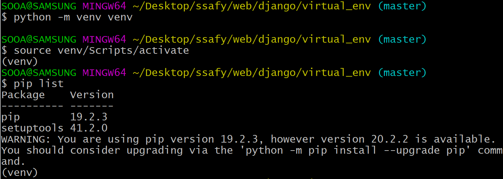
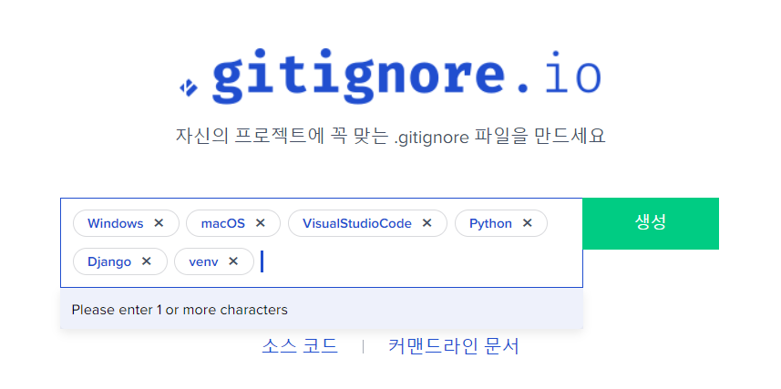

# Django

## 가상환경(Virtual Environment)

- 파이썬 인터프리터, 라이브러리 및 스크립트가 "시스템파이썬"(운영 체제 일부로 설치되어 있는 것)에 설치된 모든 라이브러리와 격리 되어 있는 파이썬 환경
- 각 가상 환경은 고유한 파이썬 환경을 가지며 독립적으로 설치된 패키지 집합을 가짐
- venv, virtualenv, conda, pyenv, 파이썬 3.3부터 venv가 기본 모듈로 내장
- 왜 사용할까?
  - pip로 설치한 패키지들은 Lib/site-packages안에 저장되는데 이는 모든 파이썬 스크립트에서 사용할 수 있음
  - 여러 프로젝트 진행하게 되면 프로젝트마다 다른 버전의 라이브러리가 필요할 수도 있는데 파이썬에서는 한 라이브러리에 대해 하나의 버전만 설치가 가능
  - 각 라이브러리나 모듈은 `서로에 대한 의존성이 다르기 때문에` 알 수 없는 충돌이나 다른 문제를 일으킬 수 있음

### 가상환경 명령어

- 가상환경이름은 보통 venv인데 이건 되도록이면 지켜줘야 됨!!!

```sh 
$ python -m venv 가상환경이름(보통 venv)
```

- 활성화
  - Windows(git bash) : 가상환경이름\Scripts\activate
  - 치다가 `tab`누르면 됨

  ```sh
  $ source venv\Scripts\activate
  ```

  - macOS : 가상환경이름/bin/activate

- 비활성화

  - deactivate

- 글로벌 환경에 영향을 받지 않는 완전한 독립적인 공간에 존재함



- venv를 같은 venv라는 이름으로 여러개 만들어도 문제없음

- **주의사항** 가상환경 폴더를 만든곳이 있다면 옮기면 안됨!!!!! 경로가 저장되어 있기 때문, 위치는 고정시켜야된다!!!!!
- 폴더 자체가 하나의 환경이다

```sh
$ which python
/c/Users/박수아/AppData/Local/Programs/Python/Python37/python
```

- 가상환경을 `visualcode`에서 켜려면 `ctrl+shift+p` 후 Python:select Interpreter를 누름
- 그리고 python 3.7.7('venv':venv)를 누른뒤 terminal를 켜면 알아서 가상환경을 켜줌

1. git bash로 가상환경 만든 뒤
2. vscode-interpreter(`ctrl+shift+p`)
3. terminal 켜기(좌측하단에 잘 켜져있는지 확인)
4. `pip list`를 찍어보면 목록이 2개정도 밖에 안나오며 새로운 환경인지 알 수 있음
5. 그 상태로 장고에 프로젝트를 설치할거야
6. 가상환경을 쓸 때는 가상환경폴더와 동일한 위치에서 프젝을 진행할거기 떄문에 `.`을 뒤에 붙여줌
   - django는 설치를 한 후(`pip install django`) 프젝을 시작해야됨
   - 안해도 글로벌환경으로 찾아서 만들어는 주지만 그렇게 하면 안됨!

```sh
# 가상환경에서 진행을 할 때만 .을 뒤에 붙여줌
$ django-admin startproject crud .
```

- 가상환경에 새로 깔아줌

```sh
$ pip install django
$ pip install requests
$ pip install ipython django-extensions
```


- 다음부터는 가상환경을 만들고 프로젝트를 진행할거야!!!

- `.vscode/,db.sqlite3, venv/`git hub에 올릴때 이 세가지는 올리지 않음

- 만약 협업하는 입장에서 환경이 안올라갈건데 어떻게 동기화를 시켜줄거야?

- 여기서 패키지를 어떻게 관리하는지 학습이 필요하다!

- `.gitignore.io` 를 활용하자

  - 구글에서 치고 들어감
  - os, 개발환경, 사용언어,프로그램, 가상환경 등 사용하고 있는 것을 적고 생성을 누르면 .gitignore에 작성해야될 문서들을 자동으로 만들어 줌
  - 그 후 해당 폴더에 `.gitignore`에 붙여넣으면 된다!!

  

### 패키지 관리

- `pip freeze`

  - 현재 환경에 설치된 패키지를 requirements format으로 출력
  - 각 패키지들은 대소문자를 구분하지 않는 순서로 나열

- 패키지 요구사항 파일 생성

  - 다른이름으로 해도 만들어지지만 반드시 이 이름으로 만들어라!!!
  - 이 컴퓨터에 저장된 모든 라이브러리르 보여줘요

  ```sh
  #패키지 요구사항 저장
  $ pip freeze > requirements.txt
  ```

  - `>`는 redirect 란 뜻
  - 가상환경에 대한 패키지 목록이다, git에 올릴때 같이 올려줘야됨
  - 깃에 올린 걸 clone으로 받고 가상환경을 설치 한 뒤, 아래의 명령어를 입력하면 환경이 동기화가 됨
  - 장고같은 것을 따로 설치하지 않아도 알아서 잘 됨
  - 혹시 추가로 설치한게 있으면 push하고 다시 pull로 받은 뒤 다시 아래의 명령어로 동기화를 시켜줌
  - 그래서 글로벌이 아니라 가상환경에서 프로젝트를 만든다!

  ```sh
  #패키지 요구사항 설치
  $ pip install -r requirements.txt
  ```

## fixture

- Django가 데이터베이스로 import 할 수 있는 데이터 모음

- 앱을 처음 설정할 때 데이터베이스를 미리 채워야 하는 상황이 존재하는데 이러한 초기 데이터를 제공하는 방법 중 하나

- `dumpadata`

  - 특정 앱의 관련된 데이터베이스의 모든 데이터를 출력(`>`를 써주야됨)

- `loaddata`

  - dumpdata를 통해 만들어진 fixtures파일을 데이터베이스에 import
  - fixtures파일은 반드시 app디렉토리 안에 fixtures 디렉토리에 위치

- 명령어

  ```sh
  $ python manage.py dumpdata app_name.ModelName[--options]
  #사용예시
  $ python manage.py dumpdata ariticles.Article --indent 4 > articles.json
  ```

  - 최근엔 json으로 많이 하는 편
  - 원래 option값에 `--format`이 있는데 json의 경우 default기 때문에 안적어도 됨
  - `--indent 4`는 그냥 보기 좋으라고 하는거야
  - 이름은 아무거나해도 되지만 `.json`은 지켜줘야됨
  - 위 명령어를 입력하면 json파일로 더미데이터가 만들어짐


## 순서

0. ptj03 폴더 만들기
1. git init(pjt03에서)
2. .gitignore 만들기, django,venv등등 추가

3. 가상환경 만들기

```sh
$ python -m venv venv
```

4. 가상환경 활성화하기

```sh
$ source venv\Scripts\activate
```

5. 필요한 모듈/라이브설치 

```sh
$ pip install django
$ pip install requests
$ pip install ipython django-extensions
```

6. 프로젝트 작성

```sh
# 가상환경에서 진행을 할 때만 .을 뒤에 붙여줌
$ django-admin startproject pjt03 .
```

7. 최종제출

```sh
#패키지 요구사항 저장
$ pip freeze > requirements.txt
```

