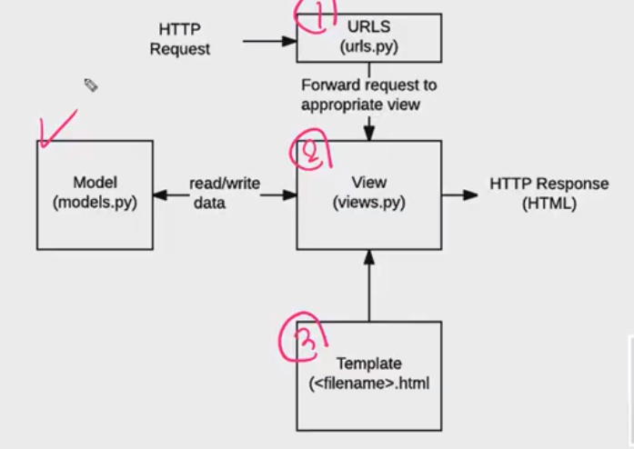

# Django

## 지난시간 복습

- framework
- MTV pattern
  - 원래는 MVC패턴이지만 장고만 MTV, 이름만 다름
- variable routing
- django namespace
  - app_name, url name, template namespace
- template inheritance
  - base.html
  - block 태그로 상속받아 사용

#### django model

- Database
  - SQL
- ORM
  - ORM의 문법 -> DB API

- Migrations
  - model에 변화
  - make migrations
  - migrate
- DB API
  - Article
  - objects
- Queryset API
  - all(), filter, get

- CRUD 작업을 하기위해 사전에 모델을 조작하는 방법을 배움
- Virtual Environment 가상환경
- 패키지 관리  pip 
  - requirements.txt
  - 이거를 통해 팀원과 같은 환경을 만들 수 있음
- django fixtures
  - 장고의 초기데이터에 사용
- programming fonts
  - 요건 그냥 재밌으라고 했었음...ㅎ
- 위 수업중 가장 중요했던 건 **CRUD**!!! 이건 다시 복습해 봐야됨!!! 
- 아래의 그림 순서가 중요함!




## djago Form

- Form은 django  프로젝트 주요 유효성 검사 도구들 중 하나
- 공격 및 우연한 데이터 손상에 대한 중요한 방어 수단
- django는 Form에 관련된 작업의 아래 세 부분을 처리해 줌(Form + input 태그)
  1. 렌더링을 위한 데이터 준비 및 재구성
  2. 데이터에 대한 HTML forms 생성
  3. 클라이언트로부터 받은 데이터 수신 및 처리


## Form Class

- django Form 관리 시스템의 핵심
- form 내 field, field 배치, 디스플레이 widget, label, 초기값, 유효하지 않는 field에 관련된 에러메세지를 결정
- django 는 사용자의 데이터를 받을 때 해야 할 과중한 작업(데이터 유효성 검증, 필요시 입력된 데이터 검증 결과 재출력, 유효한 데이터에 대해 요구되는 동작 수행 등 )과 반복 코드를 줄여 줌

##  

## django 프로젝트 시작 시 할 것,,

1. 처음에는 가상환경을 만들어줌

```sh
$ python -m venv venv
```

2. vscode에서 가상환경 select

3. terminal 켜줌(반드시 2번 한 뒤, 켜줘야됨!)

4. requirements에 있는 것들을 모두 설치를 함, 이러면 버전관리가 쉬워짐

```sh
$ pip install -r requirements.txt
```

- 서버를 켜줌

```sh
$ python manage.py runserver
```

- 모델 migrate함 -> DB업데이트

```sh
$ python manange.py makemigrations
$ python manage.py migrate
```


## Django Form

> Form을 만들어보쟈..

- Django working with forms 공식문서 보기!

- method GET VS POST

  - GET
    - 쿼리스트링이 url에 담겨짐
  - POST
    - url에 담기지 않음
    - CSRF토큰을 같이 써줘야됨!
    - 보안이 필수적으로 들어가야되기 때문


## Form VS ModelForm

#### ModelForm

- model을 통해 Form Class를 만들 수 있는 Helper
- 일반 form class와 완전히 같은 방식(객체 생성)으로 view에서 사용 가증
- django가 해당 model에서 양식에 필요한 대부분의 정보를 이미 정의
- 어떤 레코드를 만들어야 할 지 알고 있으므로 바로 `.save()`호출 가능
- Meta Class
  - Model의 정보를 작성하는 곳
  - 해당 model에 정의한 field 정보를 form에 적용하기 위함

#### Form

> 위치는 어디에 있든 관계없지만 앱아래 forms.py를 만들어주는게 좋다!

- 어떤 model에 저장해야 하는지 알 수 없으므로 유효성 검사 이후 cleaned_data딕셔너리 생성
- cleaned_data딕셔너리에서 데이터를 가져온 후, `.save()`호출
- model에 연관되지 않은 데이터를 받을 때 사용 ex)인증


- Form 작성

  - 모델이랑 비슷하게 생김..
  - 모델의 필드와 비슷하긴하지만 조금 다르고, 개수가 적음 이걸 대체할 수 있는게 존재함

  ```python
  #기본 예시
  from django import forms
  
  class NameForm(forms.Form):
      your_name = forms.CharField(label='Your name', max_length=100)
  ```

- 파일을 app폴더에 `forms.py`를 만듦(이름이 같을필요없지만 일반적!)

- 원하는 폼 형식 만듦

```python
class ArticleForm(forms.Form): #모델.py와 비슷하게 작성, new.html을 장고의 form으로 대체할거야, 
    title  = forms.CharField(max_length=10) #input text
    content = forms.CharField() #여기엔 모델에 있는 textfiled가 존재하지 않음, 일단 charfield 사용
```

- views.py에 폼 적용, 모델처럼 사용하면 됨

```python
from .forms import ArticleForm #현재 폴더에 있는 form을 가져올거야
def new(request):
    #여기에 폼 이용
    form  = ArticleForm() #인스턴스를 만듦, input태그임
    #이 딕셔너리를 new.html로 넘겨준
    context = {
        'form' : form,
    }
    #렌더함수의 3번째 인자로 넣어줌
    return render(request, 'articles/new.html', context)
```

- `new.html`에 폼 적용해줌
- `{{ form.as_table }}`
  - `<tr>` tags로 감싸줌
- `{{ form.as_p }}` 
  -  `<p>` tags로 감싸줌
- `{{ form.as_ul }}` 
  -  `<li>` tags로 감싸줌

```html



  <h1 class="text-center">NEW</h1>
  <form action="" method="POST">
    
      
     form을 적용해줌 form 하나만 적어줘도됨 
    {{ form }}
    
     하나하나의 폼요소(label과 input 세트를)를 p태그로 감쌈,  
    {{ form.as_p }}
      
     아래의 input태그 위까지의 내용을 form.py에서 대신 작성해줌! 
     <label for="title">Title: </label>
    <input type="text" name="title"><br>
    <label for="content">Content: </label>
    <textarea name="content" cols="30" rows="5"></textarea><br> 
    <input type="submit">
  </form>
  <hr>
  <a href="">[back]</a>

```

- 세부적으로 나눌 수 있음
- 꾸밀때 각각 나눠서 꾸며야될 때 사용!

```html
  <hr>
  <a href="">[back]</a>
 위와 똑같지만 세부적으로 나눠져서 꾸밀 수 있게 만들었다 
  <hr>
  <form action="" method="POST">
    
    <div>
      {{ form.title.errors }}
      {{ form.title.label_tag }}
      {{ form.title }}
    </div>
    <div>
      {{ form.content.errors }}
      {{ form.content.label_tag }}
      {{ form.content }}
    </div>
    
    <input type="submit">
  </form>
```

- for 태그 사용

```html
 for태그, 같은거 많을떄 
  <hr>
    <form action="" method="POST">
      
      <div class="form-group">
        
          {{field.errors}} 
          {{filed.label_tag}}
          {{filed}}
        
        
      </div>
      <input type="submit">
    </form>
```


### Form fileds

> 공식문서를 보면서 하기!

- Char filed
  - default = TextInput
  - input type이 text임
  - 그래서 textarea가 출력되지 않았음
  - max_length, min_length가 있음

#### Widget

- 타입바꿈

- content가 input태그로 돼있는데 원래는 textarea로 돼있어서 바꿔줘야됨! 어떻게 바꾸냐 input 타입요소를 바꿔주는 건 `widget`
- 폼은 html에서 따로 태그를 붙일 수 없음, 그렇기 때문에 form.py에서 처리를 다 해줘야됨!

```python
#forms.py
class ArticleForm(forms.Form): #모델.py와 비슷하게 작성, new.html을 장고의 form으로 대체할거야, 
     #일반적으로 대문자로 적음
     #DB에 넘어갈 값
     REGION_A = 'seoul'
     REGION_B = 'deajeon'
     #사용자 출력, 앞에 키값은 스트링으로 적으면 안되기 때문에 변수를 사용
     REGIONS = [
         (REGION_A,'서울'),
         (REGION_B,'대전'),
     ]
     title  = forms.CharField(max_length=10) #input text
     content = forms.CharField(widget=forms.Textarea) #여기엔 모델에 있는 textfiled가 존재하지 않음, charfield 사용, 이걸 textarea로 바꾸려면 widget을 이용해야됨!
     region = forms.ChoiceField(choices=REGIONS, widget=forms.RadioSelect) #default가 select, select태그를 만들어줌, widget으로 radio스타일로 바꿈!
```


## ModelForm

> 위처럼 작성하면 모델과 중복됨
>
> 반복을 없애기 위해 폼을 작성한건데 모델에도 적은거 또 적음, 모델에 관한 폼을 작성해야됨
>
> 장고는 modelform을 제공해줘서 이미 정의한 모델필드에 대해 매칭되는 폼을 제공

```python
from django import forms
from .models import Article
# class ArticleForm(forms.Form): 
#     REGION_A = 'seoul'
#     REGION_B = 'deajeon'
#     REGIONS = [
#         (REGION_A,'서울'),
#         (REGION_B,'대전'),
#     ]
#     title  = forms.CharField(max_length=10) #input text
#     content = forms.CharField(widget=forms.Textarea)
#     region = forms.ChoiceField(choices=REGIONS, widget=forms.RadioSelect)
    
    #모델과 중복되지 않나?
    #반복을 없애기 위해 폼을 작성한건데 모델에도 적은거 또 적자나?
    #모델에 관한 폼을 작성해야됨
    #modelform 제공, 이미 정의한 모델필드에 대한 그거에 매칭되는 폼을 제공
    #위 폼을 아래처럼 간단하게 사용 가능
    
    
class ArticleForm(forms.ModelForm):
    #클래스 artcie에 대한 정보, 데이터에 대한 데이터
    class Meta:
        #이 폼은 아티클 모델에 대해서 만들어질거다
        model = Article
        feilds = '__all__' #모델의 필드 전부다 사용
        #textarea도 장고가 알아서 모델을 읽고, 형태, 유효성 검사 등 알아서 만들어줌
```


### Views.py

- 모델폼을 사용하면, views.py의 모습도 바뀜

```python
#예시
from django.http import HttpResponseRedirect
from django.shortcuts import render

from .forms import NameForm

def get_name(request):
    # if this is a POST request we need to process the form data
    if request.method == 'POST':
        # create a form instance and populate it with data from the request:
        form = NameForm(request.POST)
        # check whether it's valid:
        if form.is_valid():
            # process the data in form.cleaned_data as required
            # ...
            # redirect to a new URL:
            return HttpResponseRedirect('/thanks/')

    # if a GET (or any other method) we'll create a blank form
    else:
        form = NameForm()

    return render(request, 'name.html', {'form': form})
```


## CREATE

- 이렇게 바뀜
- 이렇게 하면서 new에 관련 된 다른 것들도 바꿈, urls.py index.py등 관련된 것 전부...ㅎnew.html의 이름도 바꿈-> create.html

```python
#crud의 c의 역할(new, create) -> 이거를 하나로 합칠거야
#원래 작성했던 view 주석처리로 비교
# def new(request):
#     #여기에 폼 이용
#     form  = ArticleForm() #인스턴스를 만듦, input태그임
#     #이 딕셔너리를 new.html로 넘겨준
#     context = {
#         'form' : form,
#     }
#     #렌더함수의 3번째 인자로 넣어줌
#     return render(request, 'articles/new.html', context)


# def create(request):
#     title = request.POST.get('title') 
#     content = request.POST.get('content')
#     article = Article(title=title, content=content)
#     article.save()
#     return redirect('articles:detail', article.pk)

def create(request):
    #new에서 제출을 누르면 post로 감 같은 주소로 넘어가! 하나로 합쳤기 때문
    
    if request.method == 'POST':
        #받아온 데이터를 통째로 넣어줌, 모델폼이기 떄문에 가능
        form = ArticleForm(request.POST)
        #모델에 관한 모든 유효성 검사를 해줌
        if form.is_valid():
            #맞다면 저장해줌, 
            article = form.save()
            return redirect('articles:detail', article.pk)

    else: #new 함수
        form = ArticleForm()
    #이건 else밖에 적어줘야됨
    context = {
        'form' : form
    }
    return render(request, 'articles/create.html', cotext)
```

- urls.py

```python
urlpatterns = [
    path('', views.index, name='index'),
    #이거 뉴 필요없어짐
    # path('new/', views.new, name='new'),
    path('create/', views.create, name='create'), #NEW(GET), CREATE(POST) 두개를 합침
    path('<int:pk>/', views.detail, name='detail'),
]
```

- index.html

```html



  <h1 class="text-center">Articles</h1>
   new가 create로 바뀜 
  <a href="">NEW</a>
  <hr>
  
    <p>글 번호: {{ article.pk }}</p>
    <p>글 제목: {{ article.title }}</p>
    <p>글 내용: {{ article.content }}</p>
    <a href="">[detail]</a>
    <hr>
  

```

- create.html
  -   이거도 action이 없어도 됨, 어차피 같은 위치로 보낼거기 때문

```html



  <h1 class="text-center">NEW</h1>

  <form action="" method="POST">
    
     form을 적용해줌 form 하나만 적어줘도됨 
    {{ form }}
     하나하나의 폼요소(label과 input 세트를)를 p태그로 감쌈,  
    {{ form.as_p }}
     아래의 input태그 위까지의 내용을 form.py에서 대신 작성해줌! 
     <label for="title">Title: </label>
    <input type="text" name="title"><br>
    <label for="content">Content: </label>
    <textarea name="content" cols="30" rows="5"></textarea><br> 
    <input type="submit">
  </form>
  
  <hr>
  <a href="">[back]</a>

```


##### 왜 post를 먼저 거를까? 왜 나머지를 else로 보내는지, 왜 context가 바깥에 있는지? 생각해보기

> 왜쓰는지 알아야됨! 외워서 쓰지말고 큰 틀 먼저 짜고 그 뒤에 안 세부 내용을 작성!

- 원래 views.py 적는 방식

```python
def create(request):
   #http method가 POST 일때 
    if request.method == 'POST':
        #받아온 데이터를 통째로 넣어줌, 모델폼이기 떄문에 가능
        form = ArticleForm(request.POST)
        #유효성 검증
        if form.is_valid():
            #맞다면 저장해줌, 모델폼이기 떄문에 가능
            article = form.save()
            #그게 아니라 그냥 폼일때 값을 아래와 같이 다 넣어줘야됨
            #title = form.cleaned_data.get('title')
            #content = form.cleaned_data.get('content')
            #article = Article(title=title,content=content)
            #article.save()
            return redirect('articles:detail', article.pk)
 #http method가 POST가 아닌 다른 메서드일때(GET,..)
    else: 
        form = ArticleForm() #form인스턴스 생성
    #이건 else밖에 적어줘야됨
    context = {
        # 1. is_valid에서 내려온 form : 에러메세지 포함
        #2. else 구문에서 내려온 form
        'form' : form
    }
    return render(request, 'articles/create.html', cotext)
```

- GET을 먼저 하면?

```python
def create(request):
    #new에서 제출을 누르면 post로 감 같은 주소로 넘어가! 하나로 합쳤기 때문
    
    if request.method == 'GET':
        form = ArticleForm()
    else: #유효성 검사, 저장, DB조작
        form = ArticleForm(request.POST)
        if form.is_valid():
            article = form.save()
            return render(request, 'articles:detail', article.pk)
```

- 메소드들이 GET과 POST 말고도 많은데 POST만 적용해야되는 것이라서 POST만 뺴줘서 작성을 하게 된 것
- context위치 이유?
- post에서 유효성 검증에 실패를 했을 때(`if form is_valid()`) else로 가지않음 다음코드로 넘어가야되는데 context가 else에 포함돼있다면 error가 뜸 -> render에 적힌 context가 없기 때문
- POST의 유효성검사에 실패했을 때 context로 에러메세지를 붙인 폼을 내보내고 그래서 return했을 떄 그 에러메세지를 뜨게 함! 그래서 context의 위치는 else밖이어야 됨!


### 모델폼도 widget 사용

1. meta태그 안에서 작성(권장되지 않음)
2. meta태그 위에 씀!(권장)

```python
class ArticleForm(forms.ModelForm):
    #클래스 artcie에 대한 정보, 데이터에 대한 데이터
    title = forms.CharField( 
        label='제목',
        widget=forms.TextInput(attrs={
            'class' : 'my-title',
            'placeholder' : 'Enter the title',
            'maxlength' : 10, #widget을 따로 적어줬기 떄문에 이걸 여기안에 적어줘야됨!
        }),#forma.as_p밖에 안적기 때문에 form에서 속성들을 적어줘야됨! html에 class='my-title'이거 여기에 적어줌

    )
    content = forms.CharField(
        label='내용',
        widget=forms.Textarea(attrs={
            'class' : 'my-content',
            'rows' : 5,
            'cols' : 50,
        }),
        error_messages={
            'required' : '내용 넣어라...',
        },
    )
    class Meta:
        #이 폼은 아티클 모델에 대해서 만들어질거다
        model = Article
        fileds = '__all__' #모델의 필드 전부다 사용
        #textarea도 장고가 알아서 모델을 읽고, 형태, 유효성 검사 등 알아서 만들어줌
```


## update

- urls.py

```python
urlpatterns = [
#(전략)
    path('<int:pk>/update/',views.update,name='update'), #Edit(GET),UPDATE(POST)
]
```

- views.py
- (참고) no reversematch error-> url 문제

```python
def update(request,pk):
    #article을 정보를 가져와야됨
    article = Article.objects.get(pk=pk)
    
    if request.method == 'POST': #update
    # Create a form to edit an existing Article, but use
    # POST data to populate the form.
    #수정을 위한 form instance 이걸 빼버리면 계속 새로운글만 작성됨, 기존데이터를 같이 넘겨줘야됨
        form = ArticleForm(request.POST, instance=article)
        if form.is_valid():
            #수정은 다시한번 변수에 담을 필요 없음, 새로운 것이 아니기때문
            form.save()
            return redirect('articles:detail',article.pk)
    else: #edit
    #'instance=article'이렇게 넣어주면 과거의 내용을 가져옴!
    # Creating a form to change an existing article.
        form = ArticleForm(instance=article)
    context = {
        'form' : form,
        'article':article,
    }
    return render(request,'articles/update.html',context)
```

- update.html
  - action이 비어있으면 현재 위치의 url로 요청이 post로 감, 작성해도되고 생략가능

```html



  <h1 class="text-center">UPDATE</h1>
  <form action="" method="POST">
    
    
    {{ form }}
    {{ form.as_p }}
    <input type="submit">
  </form>
  <hr>
  <a href="">[back]</a>

```


## DELETE

- urls.py

```python
urlpatterns = [
    #(전략)
    path('<intLpk>/delete/',views.delete,name='delete'),
]
```

- views.py
  - else가 필요없음 post가 아니라면 바로 디테일로 보냄, url에 delete적으면 그냥 detail에 있음, delete버튼을 눌러야지 삭제가 됨  

```python
def delete(request, pk):
    article = Artile.objects.get(pk=pk)
    if request.method == 'POST':
         article.delete()
         return redirect('articles:index')
     return redirect('articles:detail',article.pk)
```

- detail.html

```html



  <h2 class='text-center'>DETAIL</h2>
  <h3>{{ article.pk }} 번째 글</h3>
  <hr>
  <p>제목: {{ article.title }}</p>
  <p>내용: {{ article.content }}</p>
  <p>작성 시각: {{ article.created_at|date:"SHORT_DATE_FORMAT" }}</p>
  <p>수정 시각: {{ article.updated_at|date:"M j, Y" }}</p>
  <hr>
  <a href="">[UPDATE]</a><br>
   a는 get방식이기 떄문에 form을 이용해야됨 
   삭제를 누르면 삭제를 시키는 url로 보내야됨 
  <form action="" method='POST'>
  
  <input type="submit" value='DELETE'>
  </form>
  <a href="">[back]</a>

```


## 부트스트랩폼에 적용하고싶다

1. widget으로 추가
   - 부트스트랩의 클래스 이름을 공백 후 적음

```python
#forms.py
class ArticleForm(forms.ModelForm):
    #클래스 artcie에 대한 정보, 데이터에 대한 데이터
    title = forms.CharField( 
        label='제목',
        widget=forms.TextInput(attrs={
            'class' : 'my-title form-control',
            #(후략)
```

2. 라이브러리

```sh
$pip install django-bootstrap4
```

- 새로 설치했으니 requirements에 업데이트해야됨

```sh
$ pip freeze > requirements.txt
```

- settings.py에 installed_apps에 `'bootstrap4',`추가해줌
- base.html 수정
  - 부트스트랩 CDN 링크 대신 적어줌
  - ``,``, ` `

```html


<!DOCTYPE html>
<html lang="en">
<head>
  <meta charset="UTF-8">
  <meta name="viewport" content="width=device-width, initial-scale=1.0">
  <title>Document</title>
  

</head>
<body>
  <div class="container">
    
    
  </div>
  
  </script>
</body>
</html>
```

- update.html
  - base.html은 항상 최상단, load는 필요한 곳에 계속 load해줘야됨

```html





  <h1 class="text-center">UPDATE</h1>
   action이 비어있으면 현재 위치의 url로 요청이 post로 감, 작성해도되고 생략가능 
  <form action="" method="POST">
    
    
    {{ form }}
    {{ form.as_p }}
    
    
    
    <button type="submit" class="btn btn-primary">Submit</button>
  
  </form>
  <hr>
  <a href="">[back]</a>


```


## View decorators

> 단단한 웹사이트를 만드는 과정

### decorator(데코레이터)`@`

- 어떤 함수에 기능을 추가하고 싶을 때, 해당 함수를 수정하지 않고 기능을 '연장'하게 해주는 함수
- django는 다양한 기능을 지원하기 위해 view함수에 적용할 수 있는 여러 데코레이터를 제공

### Allowed HTTP methods

- 요청 메서드에 따라 view함수에 대한 엑세스를 제한
- 요청이 조건을 충족시키지 못하면 HttpResposeNotAllowed을 return

> [`405 Method Not Allowed`](https://developer.mozilla.org/ko/docs/Web/HTTP/Status/405)
>
> 하이퍼텍스트 전송 프로토콜(HTTP)의 `**405 Method Not Allowed**` 응답 상태 코드는 요청 방법이 서버에 의해 알려졌으나, 사용 불가능한 상태임을 가리킵니다.
>
> 요청한 메소드는 서버에서 알고 있지만, 제거되었고 사용할 수 없습니다. 예를 들어, 어떤 API에서 리소스를 삭제하는 것을 금지할 수 있습니다. 필수적인 메소드인 `GET`과 `HEAD`는 제거될 수 없으며 이 에러 코드를 리턴할 수 없습니다.

- require_http_method()
  - 여러개를 쓸 때 사용
- require_GET()
  - 이 뷰함수는 GET방식일떄만 들어옴
- require_POST()
  - 이 뷰함수 POST방식만
- require_safe()
  - require_GET()을 사용하는것보다 safe가 좋음


- views.py
- `from django.views.decorators.http import require_http_methods, require_POST,require_safe`

```python
from django.shortcuts import render, redirect
from django.views.decorators.http import require_http_methods, require_POST,require_safe
from .models import Article
from .forms import ArticleForm #현재 폴더에 있는 form을 가져올거야

@require_safe
def index(request):
	#(생략)

@require_http_methods(["GET", "POST"])
def create(request):
	#(생략)
    
@require_POST
def delete(request, pk):
    #else가 필요없음 post가 아니라면 바로 디테일로 보냄, url에 delete적으면 그냥 detail에 있음, delete버튼을 눌러야지 삭제가 됨
    article = Artile.objects.get(pk=pk)
    #데코레이터를 사용하면 아래 코드 필요없음
    # if request.method == 'POST':
    #     article.delete()
    #     return redirect('articles:index')
    # return redirect('articles:detail',article.pk)
    
    #클라이언트에게 삭제가 왜 안되는지 정확하게 에러와 함께 보여줘야됨! redirect detail로 가면 안됨
    article.delete()
    
    return redirect('articles:index')
```


----------------------------

## CRUD

[CRUD순서 정리 참고](https://github.com/irissooa/irissooa-TIL/blob/master/web/0820_django.md)

> 지금 뭘 하는가? 웹사이트를 만듦
>
> 게시판을 갖고 있는 웹사이트
>
> 글(articles)
>
> 메인페이지 - 글 리스트
>
> 글쓰기 - 글 쓸 수 있는 곳
>
> ​	글을 쓸 수 있는 페이지를 보여주는 녀석
>
> ​	사용자가 보낸 글을 저장하는 녀석
>
> 상세페이지- 글 상세정보
>
> CR(CRUD의 CR까지만)
>
> 데이터 베이스 - 글정보가 저장됨

> 뭘 통해서 이걸 만들까?
>
> django
>
> 게시판(articles)
>
> 유저관리 - users app
>
> 이런식으로 기능별로 나눠서 장고는 관리를 함

- 흐름이해

1. 가상환경 만들기

```sh
$ python -m venv venv
```

2. 프로젝트 생성

```sh
$ django-admin startproject crud
```

3. django 설치

```sh
$ pip install django
```

- `pip freeze`를 적으면 해당 가상환경에 깔린 것을 보여줌

4. app 만들기

```sh
$ python manage.py startapp articles
```

5. app 등록

- setings.py에 installed_apps에 'articles'적기

6. url

- 앱별로 url분리!

```python
from django.urls import path, include
urlpatterns = [
    #보통 헷갈리지 않기 위해 앱이름으로 적음, 
    #include : articles라는 url에 app안의 urls.py에 적어두고, 그걸 자동으로 뒤에 붙여주겠다!
    path('articles/',include('articles.urls')),
]
```

- articles앱 안에 urls.py 만들어줌

```sh
from django.urls import path
from . import views

app_name = 'articles'

urlpatterns = [
    # path('', 어떤 화면을 보여주는 로직), articles url에 들어가면 바로 index가 나옴
    path('',views.index, name='index')
]
```


7. view

```python
from django.shortcuts import render

# Create your views here.
def index(request):
    return render(request, 'articles/index.html')
```

- render template을 기반으로 html을 만들어줌!

7-1) model

> 목적: 정보를 읽고 쓰게 하기 위해!

- 데이터는 테이블 형식으로 생김
- 이 글 은 제목, content,언제만들어졌는지, 등  원하는 내용을 적으면 됨
- `models.py`
- 여기에 원하는 클래스들을 여러개 만들 수 있음

```python
from django.db import models

# Create your models here.
class Article(models.Model):
    title = models.CharField(max_length=100) #charfiled는 항상 글자 제한을 둬야됨
    content = models.TextField()
    created_at = models.DateTimeField(auto_now=True)
    #이렇게 원하는게 있다면 공식문서에서 찾아보기!
```


7-2) view

- 이거를 읽고 쓰기위해 views.py에 `from .models import Aricle`적고 사용

```python
from django.shortcuts import render
from .models import Aricle

# Create your views here.
def index(request):
    #전부 다 가져옴
    articles = Article.objects.all()
    context = {
        'articles':articles,
    }
    #템플릿과 조합하는건 render가 해줌
    return render(request, 'articles/index.html',context)
```


8. template

- templates 폴더를 만들고 그안에 앱이름과 같은 articles폴더를 또 만들어준 뒤 그 안에 html을 만들어줌
- `! + tab`하면 기본 설정값 나옴
- views.py의 context에 적었던 키를 `{{ key이름 적기 }}`이렇게 사용

```html
<!DOCTYPE html>
<html lang="en">
<head>
  <meta charset="UTF-8">
  <meta name="viewport" content="width=device-width, initial-scale=1.0">
  <title>Document</title>
</head>
<body>
  {{ articles }}
</body>
</html>
```

9. DB업데이트

```sh
$python manage.py makemigrations
$python manage.py migrate
```

10. 설정한 뒤 서버 연다

```sh
$python manage.py runserver
```

11. base.html만듦

> manage.py랑 같은 위치에 templates폴더를 만든 뒤 그 아래에 base.html을 만듦

```html
<!DOCTYPE html>
<html lang="ko">
<head>
  <meta charset="UTF-8">
  <meta name="viewport" content="width=device-width, initial-scale=1.0">
  <title>CRUD</title>
</head>
<body>
  
  

</body>
</html>
```

- settings에서dir적어줌

```python
#settings.py
TEMPLATES = [
    {
        'BACKEND': 'django.template.backends.django.DjangoTemplates',
        #~~~/crud/templates 와 같음
        'DIRS': [BASE_DIR / 'templates'],
        #True라서, App에 있는건 자동으로 읽고있음
        'APP_DIRS': True,
 #(후략)
```

- 다른 html 만들때 형식 달라짐
- index.html

```html


 앱이름:name 
<a href="">새글쓰기</a>
<hr>

  <h1>{{article.title}}</h1>
  <p>{{article.content}}</p>



```

12. create

- urls.py

```python
from django.urls import path
from . import views

app_name = 'articles'

urlpatterns = [
    # path('', 어떤 화면을 보여주는 로직)
    path('',views.index, name='index'),
    path('create/',views.create,name='create'),
]
```

- views.py

```python
from django.shortcuts import render,redirect
from .models import Article

def create(request):
    if request.method == 'POST':
        #글을 쓰는 로직!
        title = request.POST.get('title')  
        content = request.POST.get('content') 
        article = Article()
        article.title = title
        article.content = content
        article.save()
        #def index를 가리킴, 마치 index를 요청한 것 처럼 됨
        return redirect('articles:index')
    #글을 쓸 수 있는 페이지를 보여주는 녀석, create.html
    else:
        return render(request,'articles/create.html')
```

- create.html

```python



<form action="" method='POST'>
  
  <label for="title">title : </label>
  <input type="text" name='title' id='title'>
  <label for="content">content :</label>
  <textarea name="content" id="content" cols="30" rows="10"></textarea>
  <input type="submit" value='제출하기'>
</form>

```

13. 설치한 모듈 저장

```sh
$ pip freeze > requirements.txt
```

14. `.gitignore`
    - `gitignore.io`에 들어가면 뭐 적어야되는지 알 수 있음

```txt
venv/
.vscode/
db.sqlite3
```


## WEB을 왜 배우는가!

> 무언가를 만든다
>
> python, javascript, html, css, django, vue
>
> 어떻게 사용하는지가 중요한게 아니라 도구일뿐 목표로 하는 걸 스스로 만들어낼 수 있도록 하는 것이 목표!
>
> 전체 흐름! 
>
> 내 프로젝트와 연관해서 뭐가 필요한지! 알아야됨
>
> 공부를 계속 해야됨! 
>
> 서버, db, 크롬 익스텐션 등 검색을 하고 그걸 공부해서 구현할 수 있다
>
> 내프로젝트를 할떄마다 계속 공부해야됨 
>
> 혼자서 도전해보는 것! 
>
> 내가 만들수 있는 것을 직접 만들어보기!
>
> 예시, 수업 자료를 그대로 따라하기, 그 과정에서 에러가 났다 하면 질문, 검색을 할 수 있지만 자기가 생각을 해보고, 에러 메세지 읽어보고, 어떻게 해결할 수 있을 까 반드시 고민해봐야됨!! 이 습관이 들어야된다 -> 아니면 시키는대로 일만하는 사람 됨....
>
> 고민을 하고 나면 검색의 범위 또한 줄어들고 질문 또한 명확해짐!

