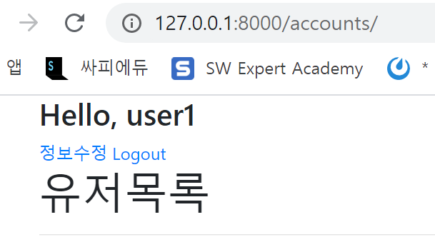
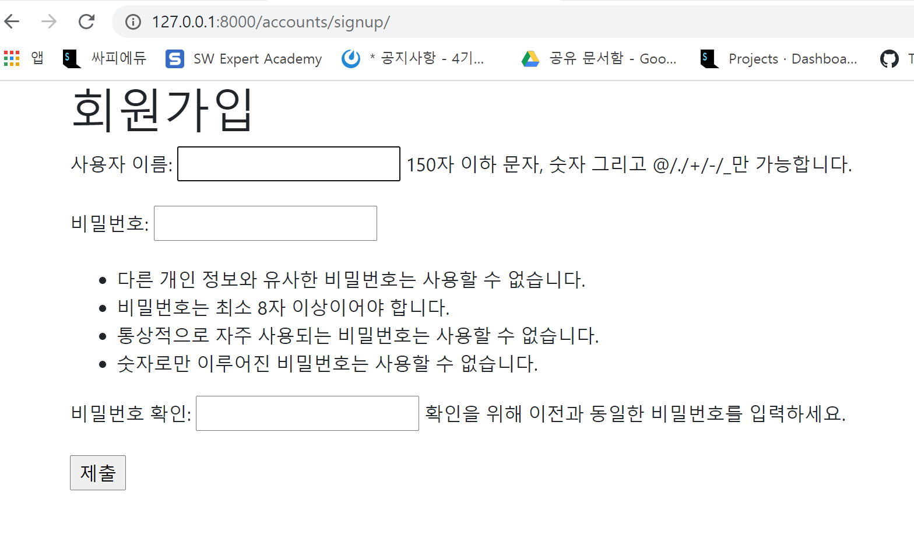
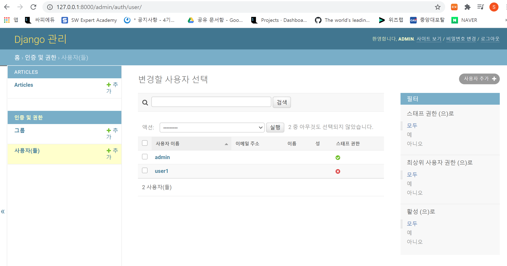
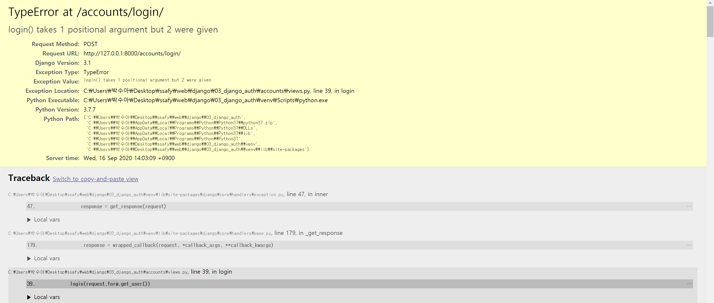
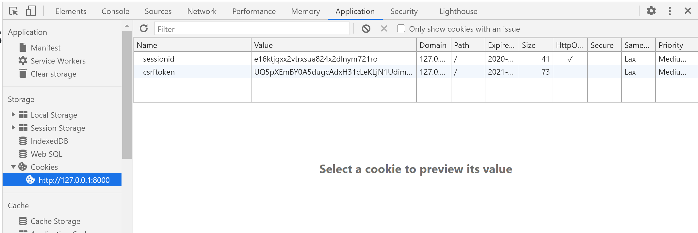
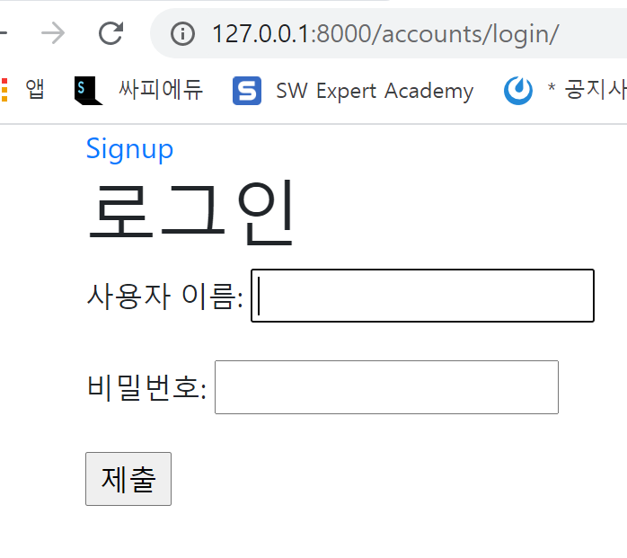
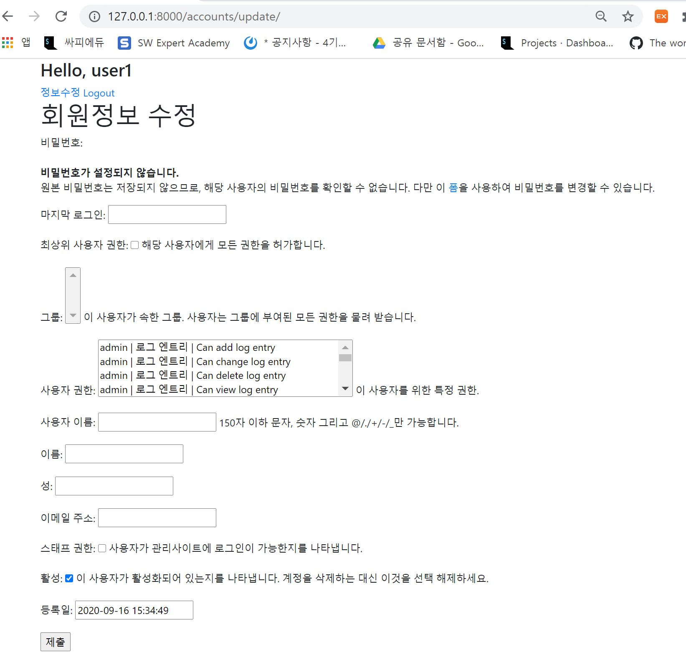
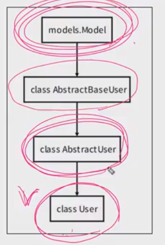
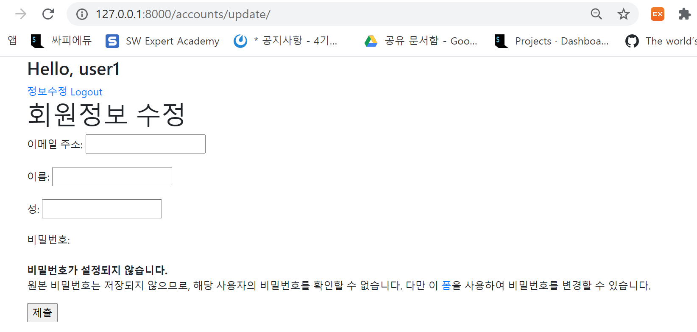

# django Auth

> 사용자 인증 및 권한
>
> 다른 사람인척을 못하게끔 세션 기반 인증

## Authendtication & Authorization

- Authentication
  - 인증
  - 자신이 누구라고 주장하는 사람의 신원을 확인하는 것
- Authorization
  - 권한,허가
  - 가고 싶은 곳으로 가도록 혹은 원하는 정보를 얻도록 허용하는 과정


## Django Authentication System

- 인증과 권한 부여를 함께 제공하며, 이러한 기능이 어느 정도 결합 되어 있기 떄문에 일반적으로 authentication system(인증시스템)이라고 함
- 크게 1) User object, 2) Web request에 대한 인증 시스템을 알아보자
- 1) User object 보통 앱이름 `accounts`


## Authentication Built-in Forms

> 회원가입 user create
>
> 로그인 session create
>
> 로그아웃 session delete
>
> 회원 탈퇴 user delete

- django는 기본적으로 인증에 관련된 built-in form들을 제공

- 회원가입(UserCreationForm), 로그인(AuthenticationForm) 등

- UserCreationForm

  - ModelForm

  - 3가지 fields

    - username
    - password1
    - password2(확인)

    

#### AuthenticationForm VS UsercreationForm

> AuthenticationForm : model과 밀접한 관계가 없을 때  Form을 사용
>
> UsercreationForm : ModelForm은 밀접한 관계가 있을 때 사용

- AuthenticationForm는 모델폼이 아니라 그냥 폼이기때문에 첫번째 인자로 request가 들어가고,

- AuthenticationForm는 인증을 하기위해서 받은 폼이지 로그인은 아님->로그인함수는 따로 있음

- AuthenticationForm은 인증만 받는 폼이기때문에 그냥 폼, User model과는 관계없음

- UsercreationForm은 모델폼이기 때문에 Meta클래스가 존재함

- UserCreationForm 모델폼은 첫번째 인자로 User 필드에 맞도록 data를 받아야됨


## Cookie & Session

>  매번 새로운 인증을 해야하는 번거로움이 발생하는데 이를 해결하기 위해 상태를 기억하는 방법 중 `쿠키`와 `세션`이 있다.

> - Http(HyperText Transfer Protocol)
>   - HTML문서와 같은 리소스들을 가져올 수 잇도록 해주는 프로토콜(규칙,약속)
>   - 웹에서 이루어지는 모든 데이터 교환의 기초
> - HTTP특징
>   - 비연결지향(connectionless) : 서비는 응답 후 접속을 끊음
>   - 무상태(stateless) : 접속이 끊어지면 클라이언트와 서버간의 통신이 끝나며 상태를 저장하지 않음
>
> - 클라이언트(=브라우저) : 서버로부터 응답을 받는 컴퓨터(응답을 주는 애)
> - 서버 : 클라이언트에게 네트워크(http)를 통해 정보나 서비스를 제공하는 컴퓨터 시스템, 장치(응답을 받는애)

- Cookie(쿠키)

- > 클라이언트 로컬에 파일로 저장

  - 클라이언트의 로컬에 저장되는 `키(key)-값(value)`의 작은 데이터 파일
  - 웹 페이지에 접속하면 요청한 웹 페이지를 받으며 쿠키를 로컬에 저장하고, 클라이언트가 재요청시에 웹페이지 요청과 함께 쿠키 값도 같이 전송
  - HTTP는 비연결지향이기 떄문에 상태가 존재하지 않음, 그래서 쿠키에 정보를 저장한 뒤 나중에 정보를 다시 보내줌(상태를 만들어줌, 클라이언트와 서버가 연결이 돼있는 것처럼 보이게 함!)
  - 사용예시
    - 아이디 자동완성, 공지 하루 안보기, 팝업 체크, 비로그인 장바구니 담기 등
    - 편의를 위하되 지워지거나 유출 돼도 큰 일은 없을 정보들을 저장

- **Session(세션)**

- > 서버에 저장(이때 session id는 쿠키의 형태로 클라이언트 로컬에 저장)

  - 사이트와 특정 브라우저 사이의 `state(상태)`를 유지시킴
  - 클라이언트가 서버에 접속하면 서버가 특정 session id를 발급하고 클라이언트는 session id를 쿠키를 사용해 저장
  - 클라이언트가 다시 서버에 접속할 때 해당 쿠키(session id가 저장된)를 이용해 서버에 session id를 전달
  - Django는 특정 session id를 포함하는 쿠키를 사용해서 각각의 브라우저와 사이트가 연결된 세션을 알아냄
  - 세선 정보는 django DB의 django_session 테이블에 저장(보안상 서버가 가지고 있음)
  - 주로 로그인 사태 유지에 사용

**(가장중요!!) HTTP `쿠키`는 상태가 있는 `세션`을 만들도록 해준다**

- 크롬(클라이언트), 장고(서버)

> 아래와 같은 구조때문에 연결된 것처럼 보일 뿐! 연결된 상태는 아님!!
>
> 쿠키가 지워지면 session_id가 지워지기 때문에 로그아웃이 됨!

1. 로그인(크롬->장고)
2. 로그인성공, session_id (세션정보) 만든 뒤, 발급(장고->크롬)
3. index/+쿠키(쿠키에 session_id 저장)(크롬->장고)
4. index.html+로그인된 상태(장고->크롬)


## Accounts

> User에 관한 앱
>
> why? 이름이 Accounts인가?
>
> 처음에 user앱 이름을 accounts, login뷰함수를 login으로 한 이유
>
> 인증시스템에 관한 기본 이름이랑 일치하게 하려고! 아니면 하나하나 바꿔줘야됨!

-----------------

> Index 만들어봄...근데 signup부터는 모든 accounts > Index는 base.html에 항상 있어야 될 것들 적고, articles > Index로 보낼 예정

#### index

- urls.py

```python
path('',views.index,name='index'),
```

- views.py

> User를 def밖에 정의하는 이유?
>
> 한번만 쓰면 되기때문에 굳이 안에 넣을 이유가 없음 
>
> User자체가 바뀌지 않기 때문
>
> `users = User.objects.all()`이거는 밖에 있으면 서버가 켜질때 한번만 업데이트 됨, 근데 계속 업데이트를 해야되는 정보이기 때문에 def함수 안에 넣어줌!

```python
from django.contrib.auth import get_user_model

#user모델에 있는 모든 유저를 다 긁어와서 보여줘야됨
User = get_user_model()

def index(request):
    users = User.objects.all()
    context = {
        'users':users,
    }
    return render(request,'accounts/index.html',context)
```

- index.html

> `<h1>{{request.user}}님, 반갑습니다.</h1>` 여기서 request는 생략가능!

```html




<a href="">회원정보수정</a>
<a href="">로그아웃</a>

<a href="">회원가입하기</a>
<a href="">로그인</a>

<h1>{{request.user}}님, 반갑습니다.</h1>
<h1>유저목록</h1>
<hr>

<h2>{{user.first_name}}</h2>
<h2>{{user.last_name}}</h2>
<h2>{{user.email}}</h2>
<hr>


```





----------------------

#### signup

> signup 유저 create
>
> user table에 새로 뭔가 만드는 일

- urls.py

```python
from django.urls import path
from . import views

app_name = 'accounts'

urlpatterns = [
    #회원가입위한 사이트
    path('signup/', views.signup, name='signup'),
]
```

- views.py

> CRUD 중 Create와 동일한 구조를 가짐 ->User를 Create한거다!
>
> model, form  두가지를 이미 django에서 만들어 놓은 걸 쓸거다!
>
> 역할 2가지 필요
> 1. 회원가입 작성 페이지(GET)
>
> 2. 회원가입을 실제로 하는 회원가입 로직(POST)

```python
from django.shortcuts import render, redirect
from django.contrib.auth import login
from django.contrib.auth.forms import UserCreationForm,AuthenticationForm
from django.views.decorators.http import require_http_methods, require_POST

@require_http_methods(['GET','POST'])
def signup(request):
    if request.method == 'POST':
        #data= 이렇게 keyword 생략가능, 위치로 알기 때문
        form = UserCreationForm(request.POST)
        if form.is_valid():
            form.save()
            #유효성 맞다면 메인페이지로 가기
            return redirect('articles:index')
    else:
        #빌트인 폼(UserCreationForm)을 이용할거라 import해옴
        form = UserCreationForm()
    context = {
        'form' : form,
    }
    return render(request,'accounts/signup.html',context)
```

- signup.html

> 해당html로 보내기 때문에 action 안적어도 됨
>
> 정확히는 페이지를 보여주는 url이랑 로직을 처리하는 url이 같아서 

```html



  <h1>회원가입</h1>
  <form action="" method='POST'>
  
  {{ form.as_p }}
  <input type="submit">
  </form>

```



#### admin

> `admin` 페이지 > `인증 및 권한` > `사용자(들)`에 새로운 user가 생성됨을 확인할 수 있다. 새로 생성된 user는 스태프가 아니고 일반 user이다

```sh
$ python manage.py createsuperuser
사용자 이름 (leave blank to use 'sooa'): admin
이메일 주소: 
Password: 
Password (again): 
비밀번호가 사용자 이름와 너무 유사합니다.
비밀번호가 너무 짧습니다. 최소 8 문자를 포함해야 합니다.
비밀번호가 너무 일상적인 단어입니다.
Bypass password validation and create user anyway? [y/N]: y
Superuser created successfully.
```




#### Login

> login : session을 create

- urls.py

```python
from django.urls import path
from . import views

app_name = 'accounts'

urlpatterns = [
    #회원가입위한 사이트
    path('signup/', views.signup, name='signup'),
    path('login/',views.login, name='login'),
]
```

- views.py

> 얘는 몇가지의 역할을 하게 되나?
>
> 1. 로그인페이지가 필요함(GET)
>
> 2. 실제로 로그인 로직이 작성(POST) 
>
> login도 create 이건 user를 만드는건 아님, 이건 session을 create함
>
> 첫번째 인자로 request가 들어가야됨
>
> 사용자가 입력한 데이터가 필요하니까 request.POST를 인자로 가져옴         
>
> login 함수
>
> 현재 세션에 연결하려고 하는 인증된 사용자가 있는 경우 `login()`를 제공할거다
>
> 사용법
>
> login(request,user,backend=None) -> 첫번째 두번째 인자는 필수!

```python
from django.shortcuts import render, redirect
from django.contrib.auth import login
from django.contrib.auth.forms import UserCreationForm,AuthenticationForm
from django.views.decorators.http import require_http_methods, require_POST

@require_http_methods(['GET','POST'])
def login(request):
    if request.method == 'POST':
        form=AuthenticationForm(request,request.POST)
        if form.is_valid():
            #로그인 용 폼을 만들어 템플릿에게 준다
            #로그인 : 아이디, 비번 통해 user가 있는지 체크
            #cliend - 쿠키에 세션아이디도 적어줘야됨
            #server-세션아이디-사용자정보-적어야됨
            #이렇게 하면 에러가 남, why? user의 정보를 가져옴(form.get_user())
            login(request,form.get_user()) #get_user(self) -> user 정보
            return redirect('articles:index')

    else:
        form = AuthenticationForm()
    context = {
        'form':form,
    }
    return render(request,'accounts/login.html',context)
```

- `login(request,form.get_user())`이렇게 쓰면 오류가남!!
- def login의 이름과 같기 때문, 뷰함수를 바꾸기 보다 내장함수의 이름을 `as`를 통해 바꿈!



- 바뀐 views.py

> 내장함수 이름을 바꿀거야 `from django.contrib.auth import login as auth_login`
>
> ` auth_login(request,form.get_user())` 이거로 바꿈!

```python
from django.shortcuts import render, redirect
from django.contrib.auth import login as auth_login
from django.contrib.auth.forms import UserCreationForm,AuthenticationForm

@require_http_methods(['GET', 'POST'])
def login(request):
    if request.method == 'POST':
        form=AuthenticationForm(request,request.POST)
        if form.is_valid():
            #로그인 : 아이디, 비번 통해 user가 있는지 체크
            #client - 쿠키에 세션아이디도 적어줘야됨
            #server-세션아이디-사용자정보-적어야됨
            auth_login(request,form.get_user())
            return redirect('articles:index')

    else:
        form = AuthenticationForm()
    context = {
        'form':form,
    }
    return render(request,'accounts/login.html',context)
```

- 내장함수 이름을 바꾸면 이제 로그인 가능! 로그인 성공했다면 쿠키에 `sessionid`가 발급됨
- 계속해서 로그인돼 있다고 알려줌! 로그아웃-> sessionid를 지우면 됨



- DB에 저장된 `django_session`에 session이 저장돼있음
- 장고는 기본적으로 session_data를 2주간 저장하고 있음!(expire_date) -> user가 session_id를 지우지 않고 남겨두면 2주간 저장하고 있는 것!
- `e16ktjqxx2vtrxsua824x2dlnym721ro` 이 session key로 해당 서버 session에 매칭을 하는 것! 쿠키와 session이 http상태를 유지시키는 방법!

- login.html

>  GET이나 POST나 같은 url로 보내기 떄문에 action없어도 됨
>
>  정확히는 페이지를 보여주는 url이랑 로직을 처리하는 url이 같아서 
>
>  =>이런경우 그냥 action을 입력하지 않는게 좋은 것같다! 나중에 next~이런 거 뒤에 올때 그 페이지로 가야 되기 때문에! 만약 입력해두면 딱!! 그 페이지로만 감!

```html



<h1>로그인</h1>
  <form action="" method='POST'>
  
  {{ form.as_p }}
  <input type="submit">
  </form>
  <a href="">메인페이지</a>

```



-  `base.html`

> - `container` 클래스 안에 구문 추가
> - 세션을 가지고 있으므로 다른 페이지를 왔다갔다해도 username이 유지된다.
> -  특정 context에서 user를 key로 보내줘야되는데 이건 왜 그냥 적어도 됐나? 
> - 자주사용하는 것들을 기본적으로 제공해줌 그게 user, request! setting.py에 context_processors에 적혀있음!
>
> ```html
> <h3>Hello, {{ user.username }}</h3>
> ```


## logout

- 만약 logout함수로 지웠을 때는 쿠키, db에서 모두 session_id 삭제!
- 하지만 만약에 크롬에서 쿠키를 강제로 지운다면 db에는 남겨져있음!

- urls.py

```python
path('logout/',views.logout, name='logout'),
```

- views.py

> 아래와 같이 적는다면 오류가 난다!
>
> Why? 
>
> redirect (GET요청!) - /accounts/logout/
>
> 근데 POST만 적으라고 돼있다? -> 405 error!
>
> 
>
> login_required가 있으면 로그인창으로 가게 됨 => 로그인 성공 -> `return redirect(request.GET.get('next') or 'articles:index')` => account:logout 로 redirect가 되는데 -> redirect는 get방식 -> 근데 logout함수는 post만 받음 -> method not allowed 405 error가 뜬다 ! 
>
> -> 그래서 login_required를 없앤다! 
>
> 
>
> 그렇기 때문에 login_required 데코레이터를 쓰지않고! `if request.user.is_authenticated:`(함수X, 속성O)를 이용함!

```python
from django.contrib.auth import logout as auth_logout
from django.views.decorators.http import require_http_methods, require_POST

#session만 지우는 것!
#로그아웃용 페이지 보여줘야? ㄴㄴ
#로그아웃-session table해당 row를 삭제
#팔찌도 떼준다-쿠키에서 세션아이디를 삭제해줌
def logout(request):
    auth_logout(request)
    return redirect('articles:index')

#아래와 같이 수정!
@require_POST
#session만 지우는 것!
def logout(request):
    if request.user.is_authenticated:
        auth_logout(request)
    return redirect('articles:index')
```

-  `base.html`

  - 하지만 로그아웃을 하면 로그아웃 버튼이 여전히 살아있음, 이를 위한 인증 처리가 필요함!

  - 아래에 방법이 나옴!

    


>  참고 `settings.py`

```python
#이거는 약간의 센스! 누군가 내코드를 봤을때 하루가 86400인지 알게 하기 위해 변수에다가 저장해서 보여줌!
DAYS_IN_SECONDS = 86400
SESSION_COOKIE_AGE = DAYS_IN_SECONDS
#사용자가 우리가 요청을 계속 할때마다 하루를 계속 유지시켜줌
SESSION_SAVE_EVERY_REQUEST = True
```


## 로그인 사용자에 대한 접근 권한

> 로그인을 했는데 signup, login 안뜨게 해야됨

- django는 session과 middleware를 통해 인증시스템을 request객체에 연결

> middleware는 클라이언트와 서버가 요청과 응답 중간에 작용하는 시스템
>
> 데이터 관리, 어플리케이션 서비스, 인증, 보안 , 와이파이 등 
>
> 이건 settings.py에 MIDDLEWARE이 적혀있음
>
> 요청은 위에서 아래로, 응답은 아래에서 위 순서로 코드를 읽음
>
> 그냥 참고 정도...ㅎ

- `is_authenticated`(메서드 아님, user객체의 속성임)
  - User class의 속성
  - 사용자가 인증되었는지 확인하는 방법
  - User에 항상 True이며, AnonymousUser에 대해서만 항상 False
  - 단, 이것은 권한과는 관련없으며 사용자가 활성화 상태(active) 이거나 유효한 세션(valid session)을 가지고 있는지도 확인하지 않음
  - 일반적으로` request.user` 에서 이 속성을 사용하여 미들웨어의 `django.contrib.auth.middleware.AuthenticationMiddleware` (`settings.py` > `MIDDLEWARE` 내부에 있는 있음)를 통과했는지 확인한다

- login required decorator

  - 사용자가 로그인 했는지 확인하는 view를 위한 데코레이터
  - 로그인 하지 않은 사용자를 settings.LOGIN_URL에 설정된 경로로 redirect시킴
  - LOGIN_URL의 기본값은 '/accounts/login/'

  > 처음에 user앱 이름을 accounts, login뷰함수를 login으로 한 이유
  >
  > 인증시스템에 관한 기본 이름이랑 일치하게 하려고! 아니면 하나하나 바꿔줘야됨!

  - 로그인된 사용자의 경우 해당 view함수를 실행


-  `base.html`
  
  - `is_authenticated` True면 로그인돼있다면 logout버튼, 아니라면 로그인,signup보여주기
  
  > 여기 문제!logout을 a태그로 하면 a는 GET방식이기 때문에 FORM태그로 배꿔 줘야됨!!!!!!!!

```html

	<a href="">정보수정</a>
	<a href="">Logout</a>

	<a href="">Signup</a>
	<a href="">Login</a>

```


- **템플릿안에서 가리는 것 말고 직접 url적고 들어가지 못하게 함**
  - `accounts` > `views.py` 
  - `signup`, `login` 뷰함수 바로 아래에 다음 구문 추가

```python
if request.user.is_authenticated:
        return redirect('articles:index')
```


- **로그인 없이 NEW를 누른다면 로그인 페이지로 옮김**

> 로그인하지 않은 상태로 `articles/create/`를 url에 적는다면 아래와 같은 로그인 주소로 보내짐
> `http://127.0.0.1:8000/accounts/login/?next=/articles/create/`
>
> 그냥 redirect된게 아니라 `?next=/articles/create/` 이게 더 붙었음
>
> 이거는 너가 login을 한다면 바로 너가 가려고 했던 `articles/create/`로 바로 보내줄게!라는 뜻
>
> 하지만 로그인해도 가지 않음!
>
> 로그인 뷰함수를 봄 로그인했을 때 index로 가는게 아니라 next의 키를 받아줘야됨
>
> (GET방식, next라는 키값에 접근해야됨)

- `articles` > `view.py`

```python
from django.contrib.auth.decorators import login_required

@login_required # create, delete, update view위에 데코레이터 추가
```

- `index.html`
  - 현재 상태에서는 비로그인일 때 주소를 직접 입력하면 회원가입 페이지로 이동할 수 있어 문제생김!

```html

  <a href="">[NEW]</a>

  <a href="">[새 글을 작성하려면 로그인하세요]</a>

```


- `accounts` > `views.py` > `login 뷰함수`
  - `@login_required` 데코레이터가 기본적으로 인증 성공 후 사용자를 redirect 할 경로를 `next`라는 문자열 매개 변수에 저장
  - 우리가 url로 접근하려고 했던 그 주소가 로그인하지 않으면 볼 수 없는 곳이라서, django가 로그인 페이지로 강제로 redirect!
  - 로그인을 다시 정상적으로 하고 나면 원래 요청했던 주소로 보내주기 위해 keep 해준 것
  - `request.GET.get('next')` 있으면 request.GET.get('next')
  - 없으면? `'articles:index'`
  
  > Q. 근데 `return redirect(request.GET.get('next') or 'articles:index')` 처리했음에도 왜 로그인하면 메인페이지로 가는가?
  >
  > A. 로그인 안한상태에서
  >
  > 1. update로 요청이 감
  >
  > 2. login required가 동작함
  >
  > 3. login page로 redirect가 동작하는데, next=원래 있던곳(update)를 넣어서 보내줌
  >
  > 4. login url : GET요청
  >
  > 5. 로그인 요청 - POST 보냄
  >
  > 6. 지금 현재 request url에 next가 있으면? next로,
  >
  > 7. 없으면? index로 보냄
  >
  > 8. 근데!!!print(request.GET.get('next'))를 해보니 None이 뜸
  >
  >    1) request.GET.get('next') 잘못되거나 -> 잘못된것 없음!!!!
  >
  >    2) login.html의 form에서 next를 전달하지 못하고 있는거 아닐까? -> 이게 문제!!!! action에서 accounts:login으로 가니까 뒤에 next=~ 이 url과 일치하지 않음!!! 그래서 그냥 action을 지우면 해당 url로 알아서 감
  >
  >    

```sh
#views.py > login 함수
if request.method == 'POST':
 	form=AuthenticationForm(request,request.POST)
    if form.is_valid():
    	auth_login(request,form.get_user())
    	#아래와같이 바꿔줌!
        return redirect(request.GET.get('next') or 'articles:index')
```

- login.html

> action을 적고 안적고의 차이!!
>
> 적게된다면 해당 url로 가게되니까 그 뒤에 next~가 나오게 됐을 때 `request.GET.get('next')`이 값이 None이 됨!
>
> 그렇기 때문에 액션을 적지 않으면 해당 url로 이동!

```html



  <h1>로그인</h1>
   GET이나 POST나 같은 url로 보내기 떄문에 action없어도 됨 
  <form action="" method='POST'>
  
  {{ form.as_p }}
  <input type="submit">
  </form>
  <a href="">메인페이지</a>

```


- 문제가 있음!

> 1. 비로그인상태로 POST로 delete 요청
> 2. login_required로 인해서 로그인 페이지로 redirect + next파라미터(/delete/)가지고
> 3. 로그인페이지에서 로그인 성공
> 4. next파라미터 주소로 redirect됨
> 5. require_POST로 인해 405 에러 발생
> 6. 405error! , redirect는 무조건 url요청이기에 GET!근데 POST만 들어갈 수있기 떄문에 에러!(method not allowed)로직상 같이 붙어 있으면 안됨!
>
> - 그리고 만약 html에서 GET방식(a태그,,)으로 받으면 똑같이 405에러나서 form태그로 바꿔줘야됨!
>
> 7. 위의 다른 경우들은 다 GET도 처리할 수 있기 때문에 괜찮지만 delete는 post만이기 때문에 걸림
>
> 결론: login_required 데코레이터는 GET method요청을 처리할 수 있는 view에서만 사용

- `articles` > `views.py` > `delete 뷰함수`

```python
@login_required
@require_POST
def delete(request, pk):
    article = Article.objects.get(pk=pk)
    article.delete()
    return redirect('articles:index')

#아래처럼 고침
@require_POST
def delete(request, pk):
    if request.user.is_authenticated:
        article = Article.objects.get(pk=pk)
        article.delete()
    return redirect('articles:index')
```


## 회원 수정

> UserChangeForm(form.ModelForm) 모델폼임

- 이건 admin의 권한 상속을 받아서 custom을 해야됨 -> accounts에 forms.py를 만들어야됨



### User

> User objects

- django 인증 시스템의 핵심

- Users가 django 인증 시스템에서 표현되는 모델

- 일반적으로 사이트와 상호작용 하는 사람들을 나타냄

- django 인증 시스템에서는 오직 하나의 User Class만 존재

- AbstractUser Class의 상속을 받음

- User model을 구현하는 완전한 기능을 갖춘 기본 클래스

  

- Django 공식문서!

```python
class User(AbstractUser):
    """
    Users within the Django authentication system are represented by this
    model.
    Username and password are required. Other fields are optional.
    """
    class Meta(AbstractUser.Meta):
        swappable = 'AUTH_USER_MODEL'

```

- user model에 대한 모든 권한이 있음
- user필드들을 얘가 들고 잇음 그래서 active돼있는 user를 직접참조 해야됨,  `get_user_model()`이라는 함수를 import해서 써야됨!

```python
class AbstractUser(AbstractBaseUser, PermissionsMixin):
    """
    An abstract base class implementing a fully featured User model with
    admin-compliant permissions.
    Username and password are required. Other fields are optional.
    """
    username_validator = UnicodeUsernameValidator()

    username = models.CharField(
        _('username'),
        max_length=150,
        unique=True,
        help_text=_('Required. 150 characters or fewer. Letters, digits and @/./+/-/_ only.'),
        validators=[username_validator],
        error_messages={
            'unique': _("A user with that username already exists."),
        },
    )
    first_name = models.CharField(_('first name'), max_length=150, blank=True)
    last_name = models.CharField(_('last name'), max_length=150, blank=True)
    email = models.EmailField(_('email address'), blank=True)
    is_staff = models.BooleanField(
        _('staff status'),
        default=False,
        help_text=_('Designates whether the user can log into this admin site.'),
    )
    is_active = models.BooleanField(
        _('active'),
        default=True,
        help_text=_(
            'Designates whether this user should be treated as active. '
            'Unselect this instead of deleting accounts.'
        ),
    )
    date_joined = models.DateTimeField(_('date joined'), default=timezone.now)

    objects = UserManager()

    EMAIL_FIELD = 'email'
    USERNAME_FIELD = 'username'
    REQUIRED_FIELDS = ['email']

    class Meta:
        verbose_name = _('user')
        verbose_name_plural = _('users')
        abstract = True

    def clean(self):
        super().clean()
        self.email = self.__class__.objects.normalize_email(self.email)

    def get_full_name(self):
        """
        Return the first_name plus the last_name, with a space in between.
        """
        full_name = '%s %s' % (self.first_name, self.last_name)
        return full_name.strip()

    def get_short_name(self):
        """Return the short name for the user."""
        return self.first_name

    def email_user(self, subject, message, from_email=None, **kwargs):
        """Send an email to this user."""
        send_mail(subject, message, from_email, [self.email], **kwargs)

```

- User 참조 -> 다음주 수업내용
  - `get_user_model()`
    - `User` model을 직접 참조하는 대신 `django.contrib.auth.get_user_model()`을 사용하여 `User` model을 참조해야함
    - **현재 프로젝트에서 활성화된(active)된 User model을 return**


### 회원정보수정 코드

- urls.py

> `articles`와는 달리 pk가 필요하지 않은 것은 index.html에서 update.html로 갈때 ``여기의 user에 어떤 user인지 나와있음!

```python
path('update/', views.update, name='update'),
```

- `accounts` > `forms.py`

> model = User 존재하는데, 이렇게 직접 참조 할 수 없음!!! 
>
> why? User는 장고의 인증시스템에서 이용되는 이름일뿐 안에 아무것도 없음
>
> 이건 AbstractUser의 상속을 받음 이게 좀더 본질적인것
>
> fields = ? ? ? ? 우리가 원하는 필드만 보고싶음
>
> 우리가 사용할 필드는 first_name, last_name, email -> 튜플로 묶어줌!

```python 
from django.contrib.auth.forms import UserChangeForm
from django.contrib.auth import get_user_model

class CustomUserChangeForm(UserChangeForm):
    class Meta:
        model = get_user_model() # return User
        fields =('email', 'first_name', 'last_name')
```

- views.py

> `@ login_required`비로그인 상태에서 강제로 url로 회원 정보 수정 페이지 들어가면 로그인 페이지로 넘어가고 로그인하면 자동으로 회원 정보 수정 페이지로 redirect 해준다.
>
> =>**update.html의 `<form action="" method="POST">`에서 action이 공백이어야 해당 페이지로 이동**
>
> why? 만약 `accounts:update`로 action을 지정하면 절대경로가 되어  `/accounts/update/`로 밖에 안가지만 만약 로그인 뒤에 `next~`페이지로 가려면 상대경로가 돼야함!

```python
from django.contrib.auth.decorators import login_required
from .forms import CustomUserChangeForm

@ login_required
def update(request):
    if request.method == 'POST':
         #모델폼이기 떄문에 첫번쨰 인자가 data, form이면 request가 첫번째 인자
        form = CustomUserChangeForm(request.POST, instance=request.user)
        if form.is_valid():
            form.save()
            return redirect('articles:index')
    else:
         #instance=request.user기존의 사용자 정보를 가져옴
        form = CustomUserChangeForm(instance=request.user)
    context = {
        'form':form,
    }
    return render(request,'accounts/update.html', context)
```

- `update.html`

```html



  <h1>회원정보 수정</h1>
  <form action="" method='POST'>
  
  {{ form.as_p }}
  <input type="submit" value='수정하기'>
  </form>

```


- 회원정보는 `admin`에 가서 이메일주소, 이름, 성을 입력해야 보임!



- 비밀번호 `폼`여기를 누르면 `http://127.0.0.1:8000/accounts/password/` 이 페이지로 감 주소를 보면 accouts, password 이 이름 떄문에 일부러 app이름을 accounts라고 한거야! password를 만들거면 이름을 password로 일치시켜주자


### Password

0. password를 내가 그대로 저장하면 무슨 일어날까?
1. 나(관리자)-db에 접속가능, 모든 데이터 확인가능

> 모든 유저의 아이디와 비번 내가 get할 수 있음

2. db가 털렸을 때, 모든 내 이용자의 password 털림
3. 원래 password가 뭔지 모르게끔 해야됨! -> 해시 함수

> 암호용 해시 함수는 매핑된 해싱 값만을 알아가지고는 원래 입력 값을 알아내기 힘들다는 사실에 의해 사용될 수 있음


##### 비밀번호 변경 기능 추가

- `accounts`>`urls.py`

>`password/`가 돼야하는 이유는 위에 나온 `폼`을 눌렀을 때 해당 주소로 일치시켜주기 위해서!! 함수이름은...무슨 함수인지 알게하기 위해? 모르겠당...ㅎ

```python
path('password/', views.change_password, name='change_password'),
```

- `accounts` > `views.py`

> `PasswordChangeForm(user=request.user,data=request.POST)` 원래 앞이 user값, 두번째가 request.post 근데 만약 위치 모르면 둘다 key값주면 위치 바껴도 괜춘!!!

```python
from django.contrib.auth.forms import UserCreationForm,AuthenticationForm,PasswordChangeForm

def change_password(request):
    if request.method == 'POST':
        form = PasswordChangeForm(request.user, request.POST)
        if form.is_valid():
            form.save()
            return redirect('articles:index')
    else:
        form = PasswordChangeForm(request.user)
    context = {'form': form,}
    return render(request, 'accounts/change_password.html', context)
```

- change_password.html

```html



  <h1>비밀번호 변경</h1>
  <form action="" method="POST">
    
    
  </form>

```

- base.html

```html
<a href="">비번변경</a>
```


##### 로그인 유지! update_session_auth_hash

- 비밀번호 변경 후 로그아웃 되버리는 증상 발생
  - 원인 : 비밀번호가 변경되면서 기존 세션과의 회원 인증 정보가 일치하지 않게 되어 버렸기 때문
- `update_session_auth_hash` 메서드를 사용하면 해결할 수 있다.
  - 현재 사용자의 인증 세션이 무효화 되는 것을 막고, 세션을 유지한 상태로 업데이트.
  - 현재 request와 새로운 session hash가 생긴 업데이트 된 user 객체를 적절히 업데이트.

- `accounts` > `views.py`

> 인자 순서 주의!!!
>
> `PasswordChangeForm(user=request.user,data=request.POST)`
>
> `update_session_auth_hash(request,form.user)`

```python
from django.contrib.auth import get_user_model,update_session_auth_hash


@login_required
def change_password(request):
    if request.method == 'POST':
        form = PasswordChangeForm(request.user, request.POST) 
        if form.is_valid():
            form.save()
            update_session_auth_hash(request, form.user) 
            return redirect('articles:index')
    else:
        form = PasswordChangeForm(request.user)
    context = {'form': form,}
    return render(request, 'accounts/change_password.html', context)
```


## 회원 탈퇴

- `accounts` > `urls.py`

```python
path('delete/',views.delete,name='delete'),
```

- `accounts` > `views.py`

> 아래와 같이 적는다면 오류가 난다!
>
> Why? 
>
> redirect (GET요청!) - /accounts/delete/
>
> 근데 POST만 적으라고 돼있다? -> 405 error!
>
> 
>
>  `@required_POST`가 있는 함수 `@login_required`가 설정된다면 로그인 이후 next 매개변수를 해당 함수로 다시 redirect되면서 `@required_POST` 때문에 405에러 발생
>
> 
>
> 그렇기 때문에 login_required 데코레이터를 쓰지않고! `if request.user.is_authenticated:`(함수X, 속성O)를 이용함!

```python
@login_required
@require_POST
def delete(request):
    #이미 request에 id가 담겨있다!(update와 같음)
    request.user.delete()
    return redirect('accounts:index')

#아래와 같이 수정
@require_POST
def delete(request):
    #이미 request에 id가 담겨있다!(update와 같음)
    if request.user.is_authenticated:
        request.user.delete()
    return redirect('articles:index')
```


--------------

- `accounts`> `index.html`

```html




  <a href="">회원정보수정</a>
  <form action="" method='POST'>
  
  <button>회원탈퇴하기</button>
  </form>
   <a href="">로그아웃</a> 
  <form action="" method="POST">
  
  <button>로그아웃</button>
</form>
<a href="">비밀번호 변경하기</a>

<a href="">회원가입하기</a>
<a href="">로그인</a>

<h1>{{request.user}}님, 반갑습니다.</h1>
<h1>유저목록</h1>
<hr>

<h2>{{user.first_name}}</h2>
<h2>{{user.last_name}}</h2>
<h2>{{user.email}}</h2>
<hr>


```


