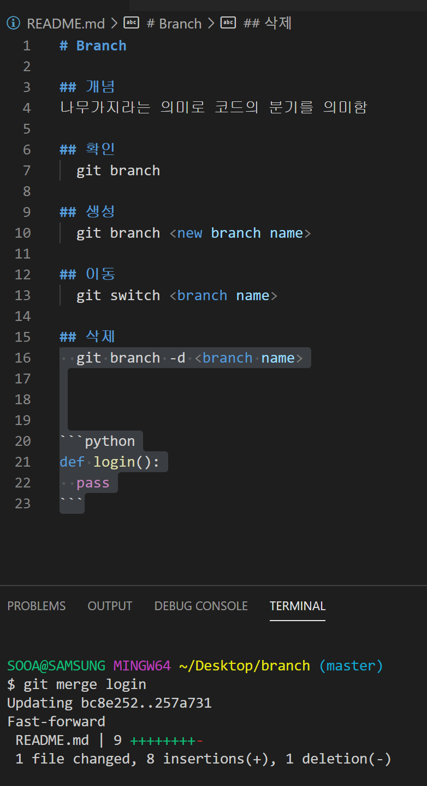
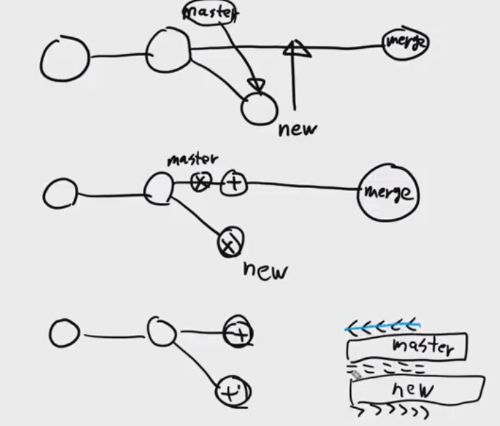

# Django Project

> pair programming(**협업**/분업)


## Git

> add, commit, push


### branch

> 1. 나뭇가지
> 2. **지사, 분점**(코드의 분기)
>
> branch name -> 기능별, 버전별로 이름을 지음
>
> master : 메인 줄기, 함부로 건드리면 안됨


#### git branch

```sh
SOOA@SAMSUNG MINGW64 ~/Desktop/branch
$ git init
Initialized empty Git repository in C:/Users/박수아/Desktop/branch/.git/

SOOA@SAMSUNG MINGW64 ~/Desktop/branch (master)
$ git add .

SOOA@SAMSUNG MINGW64 ~/Desktop/branch (master)
$ git commit -m'create README.md'
[master (root-commit) ba590a0] create README.md
 1 file changed, 1 insertion(+)
 create mode 100644 README.md

SOOA@SAMSUNG MINGW64 ~/Desktop/branch (master)
$ git log --oneline
ba590a0 (HEAD -> master) create README.md

SOOA@SAMSUNG MINGW64 ~/Desktop/branch (master)
$ git add .

SOOA@SAMSUNG MINGW64 ~/Desktop/branch (master)
$ git commit -m'add'
[master cf64208] add
 1 file changed, 3 insertions(+)

SOOA@SAMSUNG MINGW64 ~/Desktop/branch (master)
$ git branch
* master

SOOA@SAMSUNG MINGW64 ~/Desktop/branch (master)
$ git branch crud

SOOA@SAMSUNG MINGW64 ~/Desktop/branch (master)
$ git branch
  crud
* master

SOOA@SAMSUNG MINGW64 ~/Desktop/branch (master)
$ git switch crud
Switched to branch 'crud'
M       README.md

SOOA@SAMSUNG MINGW64 ~/Desktop/branch (crud)
$ git switch master
Switched to branch 'master'
M       README.md

SOOA@SAMSUNG MINGW64 ~/Desktop/branch (master)
$ git log --oneline
cf64208 (HEAD -> master, crud) add
ba590a0 create README.md

SOOA@SAMSUNG MINGW64 ~/Desktop/branch (master)
$ git add .

SOOA@SAMSUNG MINGW64 ~/Desktop/branch (master)
$ git commit -m'add command'
[master fb5668e] add command
 1 file changed, 10 insertions(+), 1 deletion(-)
```


- git branch -> 가지들의 목록을 보여줌

- git branch crud -> crud 라는 이름의 branch를 만들어줌

- git switch crud 하면 master에서 crud로 바뀜

- 우리가 남겼던 commit들이 있는데 crud, master라는 branch가 있음 근데 각 상태마다 branch가 코드를 다르게 가지고 있음 


#### git switch

```sh
SOOA@SAMSUNG MINGW64 ~/Desktop/branch (master)
$ git switch crud
Switched to branch 'crud'

SOOA@SAMSUNG MINGW64 ~/Desktop/branch (crud)
$ git switch master
Switched to branch 'master'
```

- 그래서 위와 같이 가지를 바꿔주면 다른 가지에서 만들었던 코드들이 잠시 사라졌다가 다시 메인 가지로 돌아오면 다시 나타남

- git branch -d crud : crud라는 이름의 branch가 삭제됨


#### 예시, login 함수를 만든다면....

```sh
SOOA@SAMSUNG MINGW64 ~/Desktop/branch (master)
$ git branch login

SOOA@SAMSUNG MINGW64 ~/Desktop/branch (master)
$ git branch
  login
* master

SOOA@SAMSUNG MINGW64 ~/Desktop/branch (master)
$ git switch login
Switched to branch 'login'

SOOA@SAMSUNG MINGW64 ~/Desktop/branch (login)
$ git log --oneline
257a731 (HEAD -> login) login
bc8e252 (master) add delete command
fb5668e add command
cf64208 add
ba590a0 create README.md
```


```sh
SOOA@SAMSUNG MINGW64 ~/Desktop/branch (login)
$ git switch master
Switched to branch 'master'
```

- 위처럼 brach를 옮기면 login branch에서 commit 했던 python 코드가 사라짐

> 코드가 완전히 결점이 없는지 보장할 수 없을 때 master(메인 branch)에 바로 작성하는것이 아니라, login이라는 새로운 branch에 commit을 함!


#### oneline

```sh
SOOA@SAMSUNG MINGW64 ~/Desktop/branch (master)
$ git log --onelinge
fatal: unrecognized argument: --onelinge

SOOA@SAMSUNG MINGW64 ~/Desktop/branch (master)
$ git log --oneline
bc8e252 (HEAD -> master) add delete command
fb5668e add command
cf64208 add
ba590a0 create README.md

SOOA@SAMSUNG MINGW64 ~/Desktop/branch (master)
$ git log --all --oneline
257a731 (login) login
bc8e252 (HEAD -> master) add delete command
fb5668e add command
cf64208 add
ba590a0 create README.md
```

- git log --oneline
  - 현 branch(HEAD)의 과거부터 최근까지 기록을 보여줌
- git log --all --oneline
  - 모든 branch의 과거부터 최근까지의 commit기록을 보여줌


#### merge

> 가지를 하나로 합함
>
> git merge login -> master와 login하나로 합침
>
> 코드를 작성하고, master와 병합해도 되는 상태면, 병합해서 과거의 데이터와 현재의 데이터의 싱크를 맞춰줌 이런식으로 계속 merge해가며 하나의 branch로 만듦



- branch를 하나로 합해 commit들이 다 보여짐

```sh
SOOA@SAMSUNG MINGW64 ~/Desktop/branch (master)
$ git log --oneline
257a731 (HEAD -> master, login) login
bc8e252 add delete command
fb5668e add command
cf64208 add
ba590a0 create README.md
```

- 병합이 끝났다면 branch를 삭제시켜줌

```sh
SOOA@SAMSUNG MINGW64 ~/Desktop/branch (master)
$ git branch -d login
Deleted branch login (was 257a731).

SOOA@SAMSUNG MINGW64 ~/Desktop/branch (master)
$ git log --oneline
257a731 (HEAD -> master) login
bc8e252 add delete command
fb5668e add command
cf64208 add
ba590a0 create README.md
```


#### 만약, branch가 나눠졌는데 각 branch에 코드가 작성된 상태라면?

##### logout

> branch가 여러개일 때 어떤 branch인지 잘 확인하고 코드작성, commit

```sh
SOOA@SAMSUNG MINGW64 ~/Desktop/branch (master)
$ git log --oneline --all
41430c1 (HEAD -> master) add
154dc9e (logout) logout
257a731 login
bc8e252 add delete command
fb5668e add command
cf64208 add
ba590a0 create README.md

SOOA@SAMSUNG MINGW64 ~/Desktop/branch (master)
$ git log --oneline --all --graph
* 41430c1 (HEAD -> master) add
| * 154dc9e (logout) logout
|/
* 257a731 login
* bc8e252 add delete command
* fb5668e add command
* cf64208 add
* ba590a0 create README.md
```

- graph는 좀더 시각적으로 보여줌
- merge를 하려고 보니까 각 commit에 내용들이 따로 있으니 병합할 때 문제가 되지 않을까?

>  logout코드는 밑쪽
>
> 위에 새로 작성한건 위쪽

```sh
SOOA@SAMSUNG MINGW64 ~/Desktop/branch (master)
$ git merge logout
Auto-merging README.md
Merge made by the 'recursive' strategy.
 README.md | 5 +++++
 1 file changed, 5 insertions(+)
```

- 병합을 했더니 위와 같이 자동으로 코드끼리 비교를 하고 이 둘간의 문제가 없다고 판단을 한다면 `Auto-merging`이라는 기능으로 자동으로 비교하고 merge함

- 일단 merge했으니 logout branch는 삭제(`git branch -d logout`)

```sh
SOOA@SAMSUNG MINGW64 ~/Desktop/branch (master)
$ git log --oneline
9d71c86 (HEAD -> master) Merge branch 'logout'
41430c1 add
154dc9e logout
257a731 login
bc8e252 add delete command
fb5668e add command
cf64208 add
ba590a0 create README.md
```

- 코드끼리 충돌이 없다면 merge 새로운 commit의 결과로 `9d71c86 (HEAD -> master) Merge branch 'logout'`가 기록됨


#### 만약 코드끼리 충돌이 일어난다면?

> 앞으로 코드작성할 때 많이 일어나는 일....ㅠ 절망편......ㅎ

##### signup을 만든다고 가정

- 만약  signup으로 branch를 이동하고 아래와 같이 작성함

```sh
SOOA@SAMSUNG MINGW64 ~/Desktop/branch (master)
$ git branch signup

SOOA@SAMSUNG MINGW64 ~/Desktop/branch (master)
$ git switch signup
Switched to branch 'signup'

SOOA@SAMSUNG MINGW64 ~/Desktop/branch (signup)
$ git add .

SOOA@SAMSUNG MINGW64 ~/Desktop/branch (signup)
$ git commit -m'signup'
[signup ad9c3e7] signup
 1 file changed, 5 insertions(+)

SOOA@SAMSUNG MINGW64 ~/Desktop/branch (signup)
$ git switch master
Switched to branch 'master'

SOOA@SAMSUNG MINGW64 ~/Desktop/branch (master)
$ git add .

SOOA@SAMSUNG MINGW64 ~/Desktop/branch (master)
$ git commit -m'signup'
[master 7a80d3e] signup
 1 file changed, 5 insertions(+)
```


- `SOOA@SAMSUNG MINGW64 ~/Desktop/branch (master|MERGING)`
- 현재 merge된 코드들 충돌이 일어나면 위처럼 보여짐
- 코드의 줄 순서가 중요한게 아니라 변경사항을 비교함!

- `HEAD`와 `signup` 를 보여주며 코드가 뭐가 다른 지 물어봄
- 코드가 이렇게 다른데 뭐가 맞나요?라고 물어봄
- 사실은 이코드가 맞다고 보여주면 됨



> 1, 2번 방법은 새로운 코드이기 때문에 병합해도 관계없음
>
> 3번은 비슷한(?) 코드가 있어서 충돌이 일어나 두개를 비교해서 내가 선택한 뒤 하나로 합치면 merge가 됨

- vscode는 현재 current를 반영할지 병합하려는 코드를 반영할지, 둘다 반영할지  코드들을 보여주며 비교해주는 기능이 있음, 일반적으로는 둘중에 하나를 선택하는 경우가 많음 Head 위의 버튼을 눌러 수정을 해도 되고,
- 만약 vscode가 아니라면 어떤 코드를 지워주나면 필요한 코드만 남기고 나머지 필요없는 것들은 다 지워주면 됨

```sh
SOOA@SAMSUNG MINGW64 ~/Desktop/branch (master|MERGING)
$ git status
On branch master
You have unmerged paths.
  (fix conflicts and run "git commit")
  (use "git merge --abort" to abort the merge)

Unmerged paths:
  (use "git add <file>..." to mark resolution)
        both modified:   README.md

no changes added to commit (use "git add" and/or "git commit -a")
```

- 충돌하는 코드들을 해결하고 merge를 했다면 다시 add, commit을 하면 master branch로 됨

```sh
SOOA@SAMSUNG MINGW64 ~/Desktop/branch (master|MERGING)
$ git add .

SOOA@SAMSUNG MINGW64 ~/Desktop/branch (master|MERGING)
$ git commit -m 'merge signup'
[master e9d3675] merge signup

SOOA@SAMSUNG MINGW64 ~/Desktop/branch (master)
$ git log --oneline
e9d3675 (HEAD -> master) merge signup
7a80d3e signup
ad9c3e7 (signup) signup
9d71c86 Merge branch 'logout'
41430c1 add
154dc9e logout
257a731 login
bc8e252 add delete command
fb5668e add command
cf64208 add
ba590a0 create README.md
```


-------------------

- 프로젝트 만듦
- `git branch template`
- `git switch template`
- `base.html`
- 할일 끝나면 
- `git commit - m ~`
- `git merge`
- `git branch -d template`
- `git push`
- `git pull`
- 다른 팀원 추가(B)
- git remote add pjt04~ origin이 아니라 다른 이름으로 remote함
- git remote하면 origin(A), pjt04(B) 이렇게 git push 뒤에 뭐가 나오는 지 알수있게 함