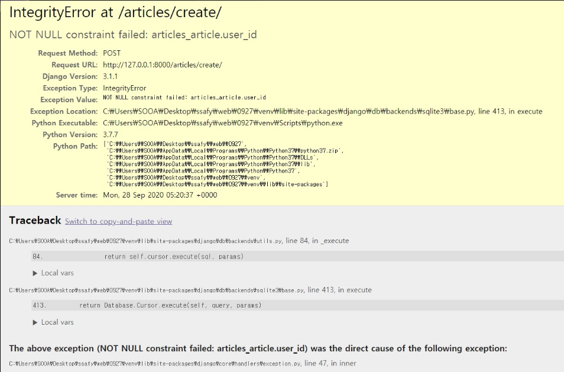
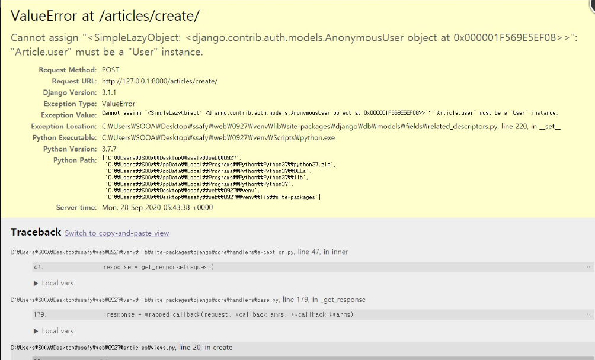

# 0927_django_월말평가준비

> model Vs form
>

## Model Vs Form

- 모델은 데이터베이스에 데이터를 저장하는 역할을 함(DB를 읽고 쓰는데 사용!). 그리고 폼은 보여주는 역할.

- 폼을 굳이 쓸 필요는 없지만, 폼이 제공하는 유효성검사나 html에서 길게 안써도 되기 때문에(반복코드 줄임) 폼을 쓴다

- 모델이랑 연관이 깊은 create같은 경우는 모델폼으로 쓰고, password 리셋같은건 아이디랑 비번만 필요하니까 모델에 접근이 필요는 하지만 직접적으로 접근을 할 필요는 없다고 장고가 생각함.

- 그래서 그냥 일반 폼으로 쓰라고 하는거임.


## AUTH_USER_MODEL 

>User모델을 accounts앱의 models.py에 등록한 뒤 평소대로 articles앱에 내용을 작성하고 accounts앱을 작성하면 NULL오류가 떴다!

- `articles` > `models.py`

```python
from django.db import models
from django.conf import settings

class Article(models.Model):
    user = models.ForeignKey(settings.AUTH_USER_MODEL, on_delete=models.CASCADE)
    title = models.CharField(max_length=100)
    content = models.TextField()
    created_at = models.DateTimeField(auto_now_add=True)
    updated_at = models.DateTimeField(auto_now=True)
```


- `articles` > `views.py`

> 이렇게 user를 내가 새로 등록하고 models.py에 필수 키 값으로 줬다
>
> 근데 애초에 articles부터 만들었기 때문에 로그인한 유저가 없기 때문에 애초부터 설계를 할 때 accounts를 먼저 작성하는 것이 맞다!!

```python
def create(request):
    if request.method=='POST':
        form = ArticleForm(request.POST)
        if form.is_valid():
            article = form.save()
            return redirect('articles:detail',article.pk)
    else:
        form = ArticleForm()
    context = {
        'form':form,
    }
    return render(request,'articles/create.html',context)
```



- `articles` > `views.py`

> 그리고 accounts를 작성한 뒤 유저를 만들었다면, articles의 create도 로그인한 user만 글을 작성하게 만들어야 되기 때문에 아래와 같이 create함수를 바꿈

```python
def create(request):
    if request.method=='POST':
        form = ArticleForm(request.POST)
        if form.is_valid():
            article = form.save(commit=False)
            article.user = request.user
            article.save()
            return redirect('articles:detail',article.pk)
    else:
        form = ArticleForm()
    context = {
        'form':form,
    }
    return render(request,'articles/create.html',context)
```




## Form Customizing

> 아래처럼 `Class Meta:`만 먼저 해보고 만약 오류가 난다면 [django github](https://github.com/django/django/blob/master/django/contrib/auth/forms.py)에 들어가서 찾아본다!

```python
from django.contrib.auth.forms import UserCreationForm,UserChangeForm
from django.contrib.auth import get_user_model

class CustomUserCreationForm(UserCreationForm):
    # class Meta(UserCreationForm.Meta): #수업때는 이렇게 했지만 헷갈리니까
    class Meta:#일단 이렇게 먼저 써볼래...
        model = get_user_model()
        fields = UserCreationForm.Meta.fields + ('email',)
        

class CustomUserChangeForm(UserChangeForm):
    class Meta:
        model = get_user_model()
        fields = ('email','last_name','first_name',)
```

