# Django hwws 정리

> 현우 & 수아 같이 정리함..답틀릴 수 있음...ㅎ


### 서버 시간을 한국 시간으로 바꾸려면?

>django 서버를 실행하고 첫 페이지에 접속했을 때 터미널에 출력된 서버 시간이 현재
>한국 시간과 다른 시간으로 출력된다. 이를 한국 시간으로 바꾸려면 settings.py의 어떤
>변수에 어떤 값을 할당해야 하는지 작성하시오.

```django
settings.py에서,
USE_TZ = True
TIME_ZONE = 'ASIA/SEOUL'
```


### urls

>다음은 어떤 django 프로젝트의 urls.py의 모습이다. 주소 ’/ssafy’로 요청이 들어왔을 때
>실행되는 함수가 pages 앱의 views.py 파일 안 ssafy 함수라면, 요청에 응답하기 위해
>빈칸 __(a)__에 추가되어야 할 코드를 작성하시오.

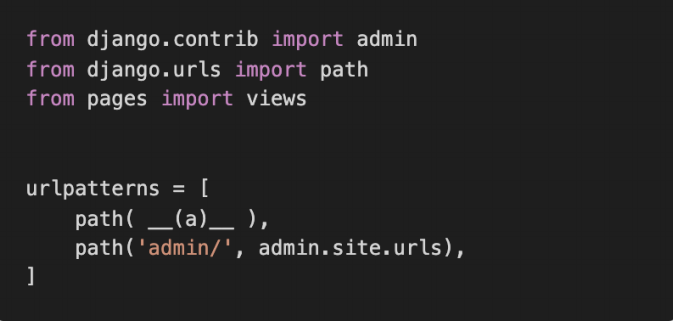

```sh
'ssafy/', views.ssafy
```


### Django Template Language

> 아래 링크를 참고하여 각 문제들을 해결하기 위한 코드를 작성하시오.
> https://docs.djangoproject.com/en/3.0/ref/templates/builtins/

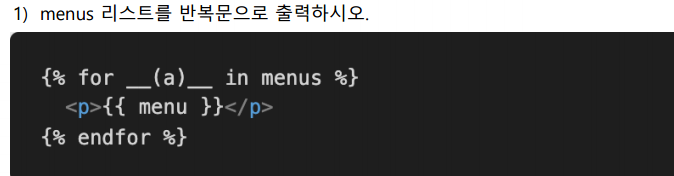

```sh
(a) menu
```

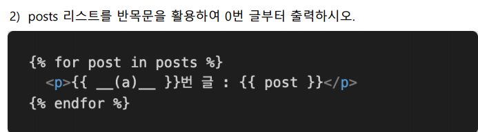

```sh
(a) forloop.counter0
```

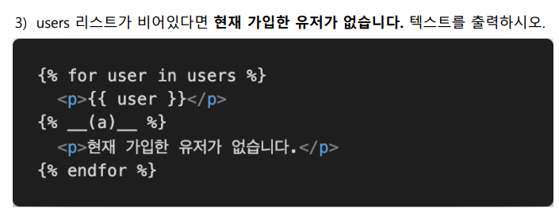

```sh
(a) empty
```

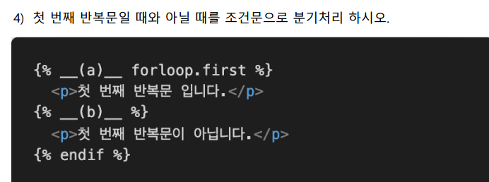

```sh
(a) if (b) else
```

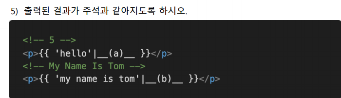

```sh
(a) length (b) title
```

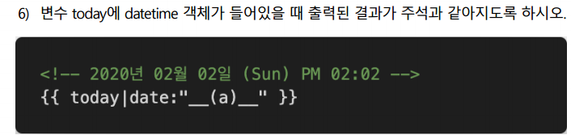

```sh
(a) Y년 m월 d일 (D) A h:i
```

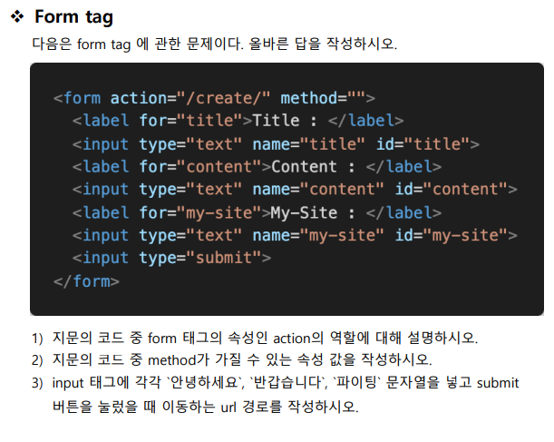

```sh
1) action은 해당 폼을 보낼 곳을 설정하는 역할이다./create/로 입력받은 정보를 보냄
2) GET,POST
3) 127.0.0.1:8000/create/?title ='안녕하세요'&content='반갑습니다'&my-site='파이팅'
```


### MTV

>Django는 MTV 디자인 패턴으로 이루어진 Web Framework이다. 여기서 MTV는 무엇의
>약자이며 각각 MVC 디자인 패턴과 어떻게 매칭이 되는지 작성하시오.

|         구분         | MVC(소프트웨어 디자인 패턴) | django(MTV) |
| :------------------: | :-------------------------: | :---------: |
|      데이터관리      |            Model            |    Model    |
|   인터페이스(화면)   |            View             |  Template   |
| 중간 관리(상호 동작) |         Controller          |    View     |

```sh
M : model - model , 데이터 관리
T: Template - View, 인터페이스(화면)
V: View - Controller, 중간 관리(상호 동작)
```


### URL

> __(a)__는 Django에서 URL 자체를 변수처럼 사용해서 동적으로 주소를 만드는 것을
> 의미한다. __(a)__는 무엇인지 작성하시오.

```sh
variable routing
```

- url의 변수화

```python
path('hello/<str(변수의 type):name(변수이름)>/', views.hello)
```

- `view.py`

```python
def hello(request, name): #path에 적은 변수의 이름과 같아야됨
    context ={
        'name' : name
    }
    return render(request, 'hello.html', context)
```

- `hello.html`

```html
<!DOCTYPE html>
<html lang="en">
<head>
  <meta charset="UTF-8">
  <meta name="viewport" content="width=device-width, initial-scale=1.0">
  <title>Document</title>
</head>
<body>
  <h1>안녕하세요, {{ name }}님</h1>
</body>
</html>
```


### template

> Django 프로젝트는 render할 template 파일들을 찾을 때, 기본적으로 settings.py에
> 등록된 각 앱 폴더 안의 __(a)__ 폴더 내부를 탐색한다. __(a)__에 들어갈 폴더 이름을
> 작성하시오

```sh
templates
```


### Static web and Dynamic web

> Static web page와 Dynamic web page의 특징을 간단하게 서술하시오.

```sh
static : 서버에 미리 저장된 파일이 그대로 전달되는 웹 페이지

사용자는 고정된 웹 페이지를 보게 됨.

dynamic : 서버에 있는 데이터들을 스크립트에 의해 가공처리한 후 생성되어 전달되는 웹페이지

사용자는 상황,시간,요청에 따라 달라지는 웹 페이지를 보게 됨.
```

- 정적 웹 사이트

  - 서버(웹 서버)에 `미리 저장된 파일`(HTML파일, 이미지, JavaScript 파일 등) 그대로 전달되는 웹 페이지
  - 서버는 사용자가 요청(Request)에 해당하는 저장된 웹 페이지를 보냄
  - 사용자는 서버에 저장된 데이터가 변경되지 않는 한 고정된 웹 페이지를 보게 됨

- 동적 웹 사이트

  - 서버에 있는 데이터들을 스크립트에 의해 `가공처리한 후 생성`되어 전달되는 웹 페이지
  - 서버는 사용자의 요청(Request)을 해석하여 데이터를 가공한 후 생성되는 웹 페이지를 보냄
  - 사용자는 상황, 시간, 요청 등에 따라 달라지는 웹 페이지를 보게 됨

  

### Model 반영하기

> 아래 그림과 같이 Django에서 선언한 Model을 실제 Database에 반영하는 과정을 뜻하
> 는 용어와 이와 관련된 명령어들을 작성하시오.

```sh
$ python manage.py makemigrations
$ python manage.py migrate
```


```python
from django.db import models
#articles는 게시글을 만드는 앱임
# Create your models here.
class Article(models.Model): #상속을받음(우리가 보지못하는 model이라는 부모가 있음) #클래스 이름은 보통 앱이름의 단수형
    #한줄한줄이 필드, 열을작성중
    title = models.CharField(max_length=10) #게시글의 제목을 최대10자까지 저장을함
    content = models.TextField() #필수인자는 따로 없음
```

- charfield()

  - *class* `CharField`**(***max_length=None***,** ***options***)
  - 기본값 : max_length=None
  - 길이에 제한이 있는 문자열을 넣을 때 사용
  - max_length가 필수인자
  - 필드의 최대 길이, 데이터베이스와 django의 유효성 검사할 때 사용됨

- TextField()

  - *class* `TextField`(**options)
  - 글자수가 많을 때 사용
  - 필수인자 없음
  - `<textarea>`를 기본 태그로 가지고 있음

  

### Model 변경사항 저장하기

> 위에서 선언한 Model을 Database에 최종 반영하기 전에 Model의 변경 사항을 저장하
> 고자 한다. 이를 위한 명령어를 수행했을 때 생성되는 파일의 내용을 확인하고, 해당 내
> 용에 대응되는 SQL문을 확인하여 작성하시오.

```sh
$ python manage.py sqlmigrate {앱이름}
```

`makemigrations`

- model을 변경한 것에 기반한 새로운 마이그레이션(설계도)을 만들 때 사용
- 모델을 활성화 하기 전에 DB설계도를 작성
- 생성된 마이그레이션 파일은 데이터베이스 스키마를 위한 버전 관리 시스템이라고 생각
- 모델의 변경사항을 기록을 해두는 역사라고 생각하면 됨
- 데이터베이스가 비어있음(migrate를 해야 채워짐)

```sh
$ python manage.py makemigrations
Migrations for 'articles':
  articles\migrations\0001_initial.py
    - Create model Article

$ python manage.py makemigrations
Migrations for 'articles':
  articles\migrations\0002_article_updated_at.py
    - Add field updated_at to article
```


### Python Shell

> Django에서 사용 가능한 모듈 및 메서드를 대화식 Python Shell에서 사용하려고 할 때, 
> 어떠한 명령어를 통해 해당 Shell을 실행할 수 있는지 작성하시오.

```sh
$ python manage.py shell_plus
```


### Django Model Field

> Django에서 Model을 정의할 때 사용할 수 있는 필드 타입을 5가지 이상 작성하시오.

```sh
charField,TextField,DateTimeField,booleanField,binaryField
```

- charfield()
  - *class* `CharField`**(***max_length=None***,** ***options***)
  - 기본값 : max_length=None
  - 길이에 제한이 있는 문자열을 넣을 때 사용
  - max_length가 필수인자
  - 필드의 최대 길이, 데이터베이스와 django의 유효성 검사할 때 사용됨
- TextField()
  - *class* `TextField`(**options)
  - 글자수가 많을 때 사용
  - 필수인자 없음
  - `<textarea>`를 기본 태그로 가지고 있음
- DateTimeField()
  - *class* `DateTimeField`**(***auto_now=False***,** *auto_now_add=False***,** ***options***)
  - auto_now와 auto_now_add는 다름!
  - 최초의 생성 일자 :  `auto_now_add=True`
    - 기본값은 `False`
    - django ORM이 최초 데이터 입력시에만 현재 날짜와 시간으로 갱신
    - 테이블에 어떤 데이터를 최초로 넣을 때 
  - 최종 수정 일자 : `auto_now=True`
    - django ORM이 save를 할 때마다 현재 날짜와 시간으로 갱신
- BigIntegerField
- BinaryField

### Django Model

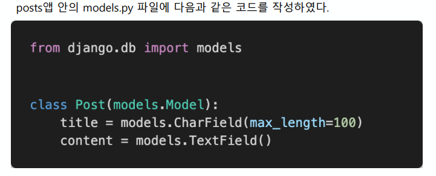

1) models.py를 작성한 후 마이그레이션 작업을 위해 터미널에 작성해야 하는 두 개의
명령어를 작성하시오.

```sh
$ python manage.py makemigrations
$ python manage.py migrate
```


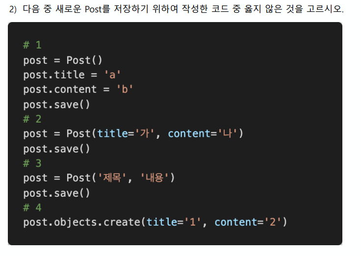

```sh
3
```

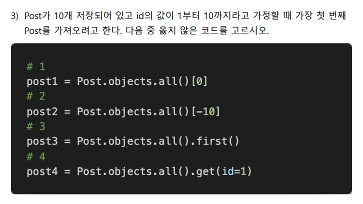

```sh
2 Negative index는 허용하지 않음
```

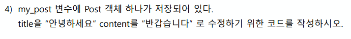

```sh
my_post.title = "안녕하세요"
my_post.content = "반갑습니다"
my_post.save()
```

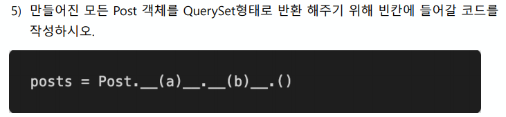

```sh
(a) objects (b) all
 posts = Post.objects.all()
```


### Django Model Form

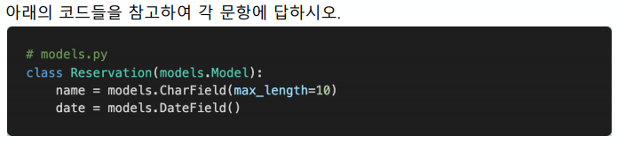


```sh
 (a) forms.ModelForm (b) Meta
```

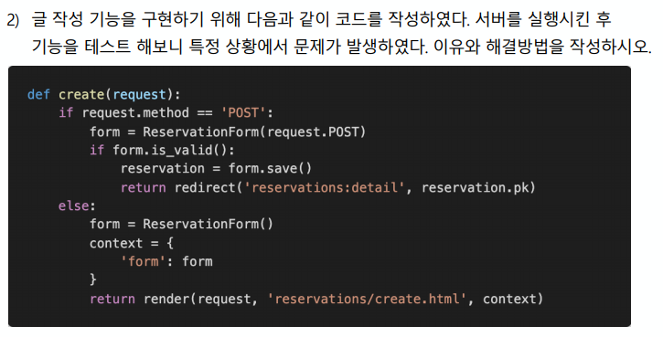

```sh
 method가 POST이고 유효성 검사를 통과하지 못하는 경우 return하질 않는다. context를 선언하는 부분과 return 부분을 else절 밖으로 옮겨야 한다.
 
 context랑 return이 else구문 안에 들어있어서, POST지만 유효성검사에서 실패한 form들의 return값도 없고 context도 에러메세지를 담은 form을 받아야됨
```

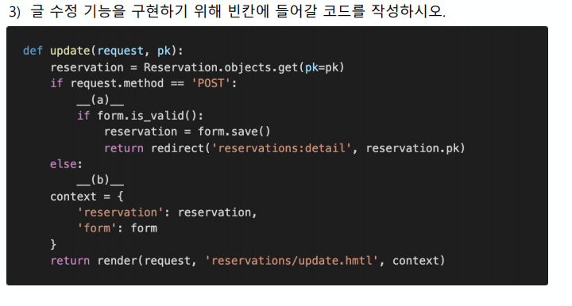

```sh
(a) form = ReservationForm(data=request.POST,instance=reservation)
(b) form = ReservationForm(instance=reservation)
```

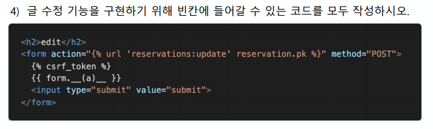

```sh
as_table, as_p, as_ul
```

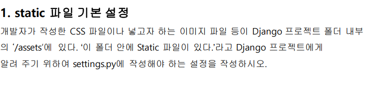

```sh
STATIC_URL = '/assets/'
STATICFILES_DIRS = BASE_DIR / 'assets'
#구글링해서 보면
STATICFILES_DIRS = os.path.join(BASE_DIRS,'assets')
#os.path.join는 경로 두개를 합치는 것...`/`를 사이사이에 넣어줌
```

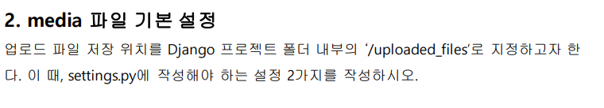

```sh
MEDIA_URL = '/uploaded_files/'
MEDIA_ROOT = BASE_DIR / 'uploaded_files'
#구글링해서 보면
MEDIA_ROOT = os.path.join(BASE_DIR,'uploaded_files')
```

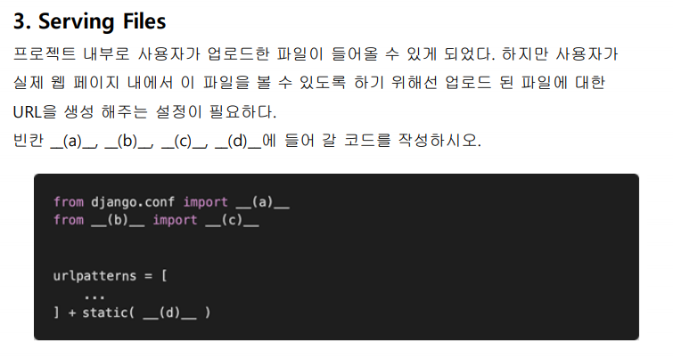

```sh
(a) settings
(b) django.conf.urls.static
(c) static
(d) settings.MEDIA_URL.document_root = settings.MEDIA_ROOT
```

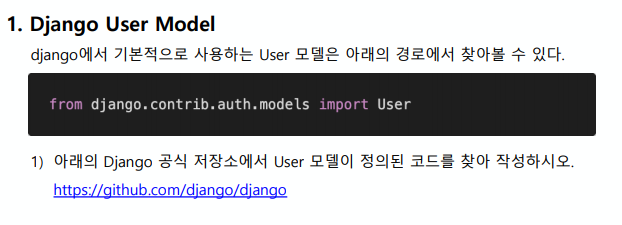

```sh
class User(AbstractUser):
    """
    Users within the Django authentication system are represented by this
    model.
    Username and password are required. Other fields are optional.
    """
    class Meta(AbstractUser.Meta):
        swappable = 'AUTH_USER_MODEL'

```

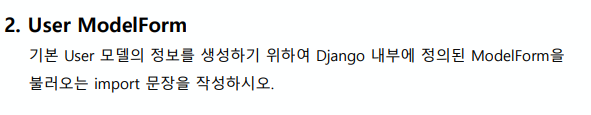

```sh
from django import forms
```

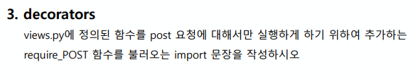

```sh
from django.views.decorators.http import require_POST
```

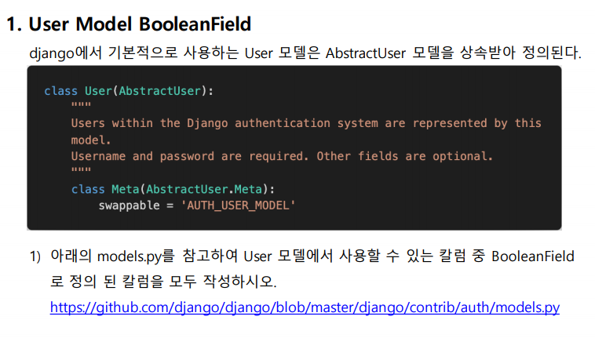

```sh
is_superuser, is_staff, is_active
```

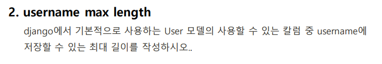

```sh
150
```

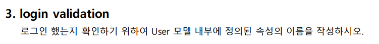

```sh
is_authenticated
```

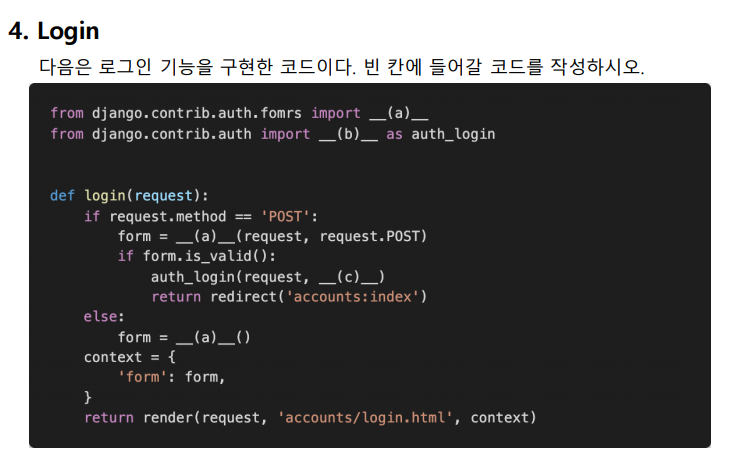

```sh
(a) UserCreationForm, AuthenticationForm
(b) login
(c) form.get_user()
```

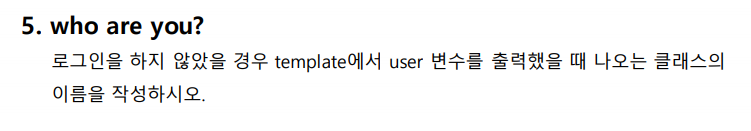

```sh
django.contrib.auth.models.AnonymousUser 클래스
```

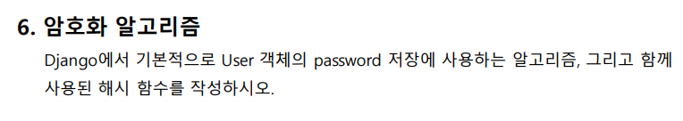

```sh
SHA256
```

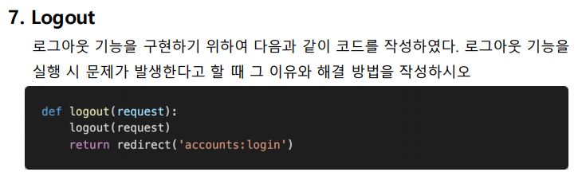

```sh
logout 이름이 겹쳐서 재귀함수로 호출이 된다.
그래서 import할 때 as를 써서 auth_logout으로 불러온 뒤 사용한다.

from django.contrib.auth import logout as auth_logout
# ~~~~

def logout(request):
	auth_logout(request)
	return redirect('accounts:login')
```


### media 파일 경로

> 사용자가 업로드한 파일이 저장되는 위치를 Django 프로젝트 폴더(crud) 내부의
> /uploaded_files로 지정하고자 한다. 이 때, settings.py에 작성해야 하는 설정 2가지를
> 작성하시오.

```sh
MEDIA_URL='/uploaded_files/'
MEDIA_ROOT=BASE_DIR/'uploaded_files'
```


### DB True or False

>각 문항을 읽고 맞으면 T, 틀리면 F를 작성하시오. 
>1) RDBMS를 조작하기 위해서 SQL문을 사용한다.
>2) SQL에서 명령어는 반드시 대문자로 작성해야 동작한다. 
>3) 일반적인 SQL문에서는 세미콜론( ; )까지를 하나의 명령어로 간주한다.
>4) SQLite에서 .tables, .headers on과 같은 dot( . )로 시작하는 명령어는 SQL문이 아니다. 
>5) 하나의 데이터베이스 안에는 반드시 한 개의 테이블만 존재해야 한다.

```sh
(1) T	
(2) F, 반드시는 아님, 컨벤션일 뿐	
(3) T	
(4) T, SQLite에서만 나타나는 특수문법	
(5) F, 여러 개 테이블 존재 할 수 있음
```


### on_delete

> 게시글과 댓글의 관계에서 댓글이 존재하는 게시글은 삭제할 수 없도록 __(a)__에 들어갈
> 코드를 작성하시오. 그리고 이러한 설정이 되어있는 상황에서 Article 객체를 삭제하려고
> 할 때 발생하는 오류를 작성하시오.

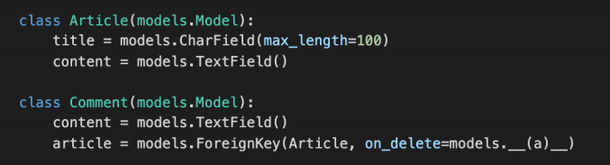

```sh
PROTECT- foreignkey로 연결되어 있는 article이 사라지면 안됨(ProtectedError발생시킴)
```


### like

> Article 모델과 User 모델을 M:N 관계로 설정하여 ‘좋아요’ 기능을 구현하려고 한다.
> __(a)__와 __(b)__에 들어갈 내용을 작성하시오. 추가적으로 아래의 상황에서 __(b)__를
> 반드시 작성 해야 하는 이유를 함께 작성하시오.

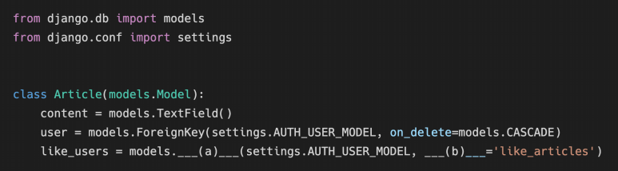

```sh
(a) ManyToManyField	
(b) related_name
```


### follow

> follow 기능을 구현하기 위해 accounts app의 models.py에 아래와 같은 모델을
> 작성하였다. Migration 작업 이후에 Database에 만들어지는 중개 테이블의 이름을 작성
> 하고 이 테이블의 id를 제외한 필드 이름을 각각 작성하시오

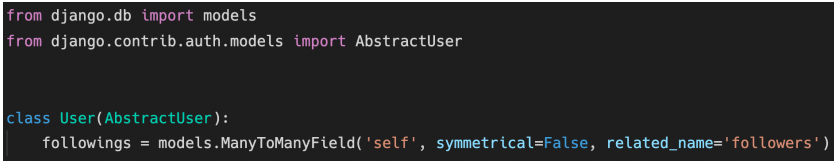

```sh
accounts_user_followings - from_user_id, to_user_id
```


### MTV

> Django는 MTV로 이루어진 Web Framework다. MTV가 무엇의 약자이며 Django에서
> 각각 어떤 역할을 하고 있는지 작성하시오.

```sh
Model: DB에 저장되는 데이터
Template: 사용자에게 보여지는 부분
View: 전달받은 데이터를 함수의 로직으로 가공하여 그 결과를 템플릿에 보내줌
```


### 404 Page not found

> 기본적으로 ‘/ ’ 페이지에 접속하게 되면 아래 사진처럼 Page not found 에러가 발생한다. 
> ‘/ ’ 페이지에 접속했을 때 index.html를 렌더링 하고자 한다. 아래 빈칸에 알맞은 코드를
> 작성하시오. (프로젝트의 이름은 crud 이며 app 이름은 articles이다. index.html 파일을
> 렌더링 하는 함수의 이름은 index라고 가정한다.)

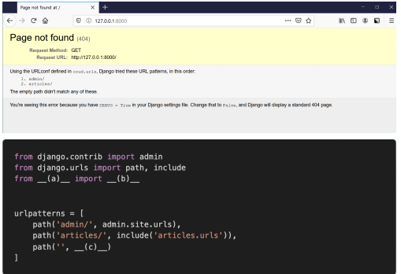

```sh
(a) articles
(b) views
(c) views.index, name='index'
```


### templates and static

> Django 프로젝트는 기본적으로 render 할 html과 같은 template 파일과 css, js와 같은
> static 파일을 앱 폴더 내부의 templates와 static 이름의 폴더에서 찾는다. 만약 해당
> 위치가 아닌 임의의 위치에 파일을 위치 시키고 싶으면 __(a)__ 파일의 __(b)__과 __(c)__ 
> 이라는 변수에 담긴 리스트의 요소를 수정하면 된다. 빈칸 (a), (b), (c)에 들어갈 내용을
> 작성하시오. 

```sh
(a) settings.py	
(b) TEMPLATES	
(c) STATICFILES_DIRS
```


### migration

> 아래는 그림과 같이 Django에서 선언한 Model을 Database에 반영하는 과정에서
> 사용하는 명령어에 대한 설명이다. 각 설명에 해당하는 명령어를 작성하시오. 
>
> 1) 마이그레이션 생성
> 2) 마이그레이션 DB 반영 여부 확인
> 3) 마이그레이션에 대응되는 SQL문 출력
> 4) 마이그레이션 파일의 내용을 DB에 최종 반영

```sh
1) python manage.py makemigrations
2) python manage.py showmigrations
3) python manage.py sqlmigrate
4) python manage.py migrate
```


### ModelForm True or False

> 각 문항을 읽고 맞으면 T, 틀리면 F를 작성하시오. 
> 1) POST와 GET 방식은 의미론상의 차이이며 실제 동작 방식은 동일하다.
> 2) ModelForm과 Form Class의 핵심 차이는 Model의 정보를 알고 있는지의 여부이다.
> 3) AuthenticationForm은 User 모델과 관련된 정보를 이미 알고 있는 ModelForm으로
> 구성되어 있다.
> 4) ModelForm을 사용할 때 Meta 클래스에 fields 관련 옵션은 반드시 작성해야 한다.

```sh
1) F, POST는 DB에 변화가 있을 때, GET은 변화가 없음
2) T	
3) F, 일반폼
4) T
```


### M:N True or False

>  문항을 읽고 맞으면 T, 틀리면 F를 작성하고 틀렸다면 그 이유도 함께 작성하시오.
> 1) Django에서 1:N 관계는 ForeignKeyField를 사용하고 M:N 관계는 ManyToManyField를
> 사용한다.
> 2) ManyToManyField를 설정하고 만들어지는 테이블 이름은 앱이름_클래스이름_지정한
> 필드이름의 형태로 만들어진다. 
> 3) ManyToManyField의 첫번째 인자는 모델, 두번째 인자는 related_name이 들어가는 데
> 두 가지 모두 필수적으로 들어가야 한다.

```sh
1) T
2) T
3)F, related_name은 옵션
```


### like

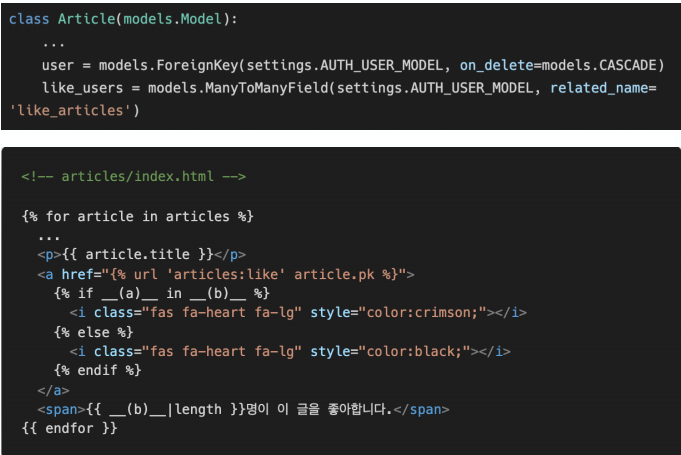

```sh
(a) request.user

(b) article.like_users.all
```


### follow

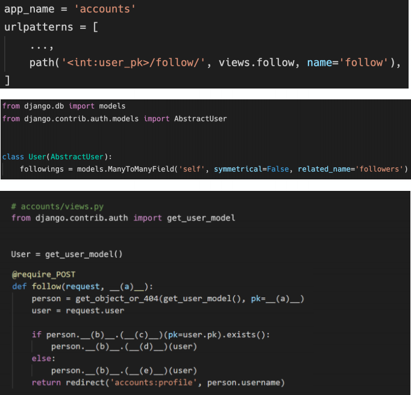

```python
(a) user_pk
(b) followers
(c) filter
(d) remove
(e) add
```


### User AttributeError

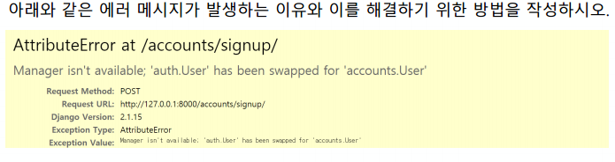

```sh
UserCreationForm은 auth.User에서 사용하는 폼인데 auth.User를 안쓰고 내가 만든 accounts.User를 사용해서 이폼을 쓸 수가 없다.
그래서 모델폼을 하나 만들어서 UserCreationForm을 상속받고 모델에서 User를 데려와서 모델폼의 모델로 사용해야 한다.
```


### related_name

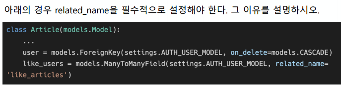

```sh
역참조할 때 외래키가 여러개가 생길 때 그이름이 겹치면 오류가 생김
```

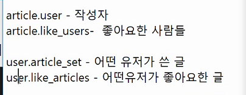


### follow logic in template

>Person에는 view에서 넘어온 유저 정보가 담겨 있고 모델 정보가 아래와 같을 때, 
>빈칸에 들어갈 코드를 각각 작성하시오.

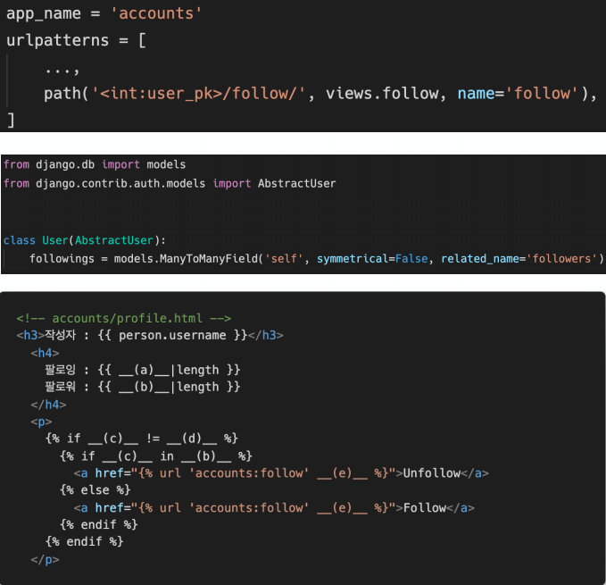

```sh
(a) person.followings.all
(b) person.followers.all
(c) request.user
(d) person
(e) person.pk
```


### 1:N True or False

> 각 문항을 읽고 맞으면 T, 틀리면 F를 작성하고 틀렸다면 그 이유도 함께 작성하시오.
> 1) ForeignKey는 부모 테이블의 데이터를 참조하기 위한 키이다.
> 2) 1:N 관계에서 1은 N의 데이터를 직접 참조 할 수 있다.
> 3) on_delete 속성은 ForeignKey 필드의 필수 인자이다.
> 4) 1:N 관계에서 ForeignKey는 반드시 부모 테이블의 PrimaryKey여야 한다.

```sh
1) T
2) F,직접 참조할 수 없음
'article.comment_set' 역참조 해야함
Article 테이블에는 comment에 대한 정보가 없다
따라서 직접 참조할 수 없다
3) T
4) T
```


### ForeignKey column name

> 다음과 같이 이름이 articles인 app의 models.py에 작성된 코드를 바탕으로 테이블이
> 만들어 졌을 때, 데이터베이스에 저장되는 ForeignKey 컬럼의 이름과 테이블의 이름이
> 무엇인지 작성하시오.


```sh
ForiegnKey : answer_id #원래는 헷갈리지 않게 question으로 변수명을 지정해 줘야됨!
table : quetion_comment
```


### 1:N ORM in template

> 위 2번 문제 모델 관계를 바탕으로 어느 template 페이지가 다음과 같이 작성되어 있을
> 때, 질문(Question)에 작성된 모든 댓글(Comment)을 출력하고자 한다. 해당 template에서
> Question 객체를 사용할 수 있다면 빈칸 __(a)__에 들어갈 알맞은 코드를 작성하시오.

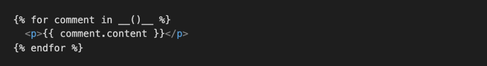

```sh
question.comment_set.all #템플릿에서는 all 뒤에 '()' 없어도 됨! 템플릿 문법
```


## 4. POST와 login_required 데코레이터를 같이 쓰면 안되는 이유

> ?next=
> 다음과 같이 게시글을 삭제하는 delete 함수와 로그인을 위한 login 함수가 작성되어 있다. 
> 만약 비로그인 사용자가 삭제를 시도한다면 django는 해당 사용자를 url에 next 파라미터가
> 붙은 login 페이지로 redirect 한다.
> § /accounts/login/?next=/articles/1/delete/
> 1) redirect된 로그인 페이지에서 로그인에 성공했을 때 발생하는 HTTP response status 
> code를 작성하고 발생한 원인과 해결을 위해 코드를 수정하시오.
>
> - 게시글 삭제는 HTTP POST method로만 가능하다.
> - 인증되지 않은 사용자는 메인페이지로 redirect 되어야 한다.

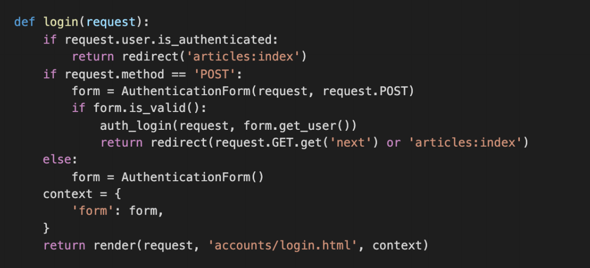

```sh
1. 비로그인상태로 POST로 delete 요청

2. login_required로 인해서 로그인 페이지로 redirect + next파라미터(/delete/)가지고 로그인페이지에서 로그인 성공

3. next파라미터 주소로 redirect됨

4. require_POST로 인해 405 에러 발생
405error! , redirect는 무조건 url요청이기에 GET!근데 POST만 들어갈 수있기 떄문에 에러!(method not allowed)로직상 같이 붙어 있으면 안됨!
그리고 만약 html에서 GET방식(a태그,,)으로 받으면 똑같이 405에러나서 form태그로 바꿔줘야됨!

5. 위의 다른 경우들은 다 GET도 처리할 수 있기 때문에 괜찮지만 delete는 post만이기 때문에 걸림

결론: login_required 데코레이터는 GET method요청을 처리할 수 있는 view에서만 사용
```


### SQL 용어 및 개념

> 아래의 보기에서 각 문항의 설명에 맞는 용어를 고르시오.
> 1) 관계형 데이터베이스에서 구조와 제약조건에 관련한 전반적인 명세를 기술 한 것
> 2) 열과 행의 모델을 사용해 조직된 데이터 요소들의 집합
> 3) 고유한 데이터 형식이 지정되는 열
> 4) 단일 구조 데이터 항목을 가리키는 행
> 5) 각 행의 고유값

```sh
(1) 스키마 
(2) 테이블 
(3) 컬럼 
(4) 레코드 
(5) 기본키
```


### SQL문법_DML이 아닌것

> 아래의 보기 (1) ~ (4) 중에서, DML이 아닌 것을 고르시오.
>
> (1) CREATE
> (2) UPDATE
> (3) DELETE
> (4) SELECT

```sh
(1) CREATE
```


### RDBMS, NOSQL

> RDBMS와 NOSQL을 비교하여 작성하시오

```sh
RDBMS: 스키마가 있음, 
관계형 데이터 저장, 테이블 관리, 스키마로 규격화되어있기 때문에 탐색이 빠르다 -- MySQL, SQLite

NOSQL: 스키마가 없음, 메모장느낌, 데이터 스키마를 결정짓지 못할 때 사용,
비관계형 데이터 저장(사진, 영상 등에 특화), 컬렉션 관리, 스키마가 없기 때문에 비교적 자유로운 자료 관리가 가능하지만, 규격화된 결과를 얻기 어렵다 -- MongoDB, Cassand, Redis
```


### INSERT INTO

> 다음과 같은 스키마를 가지는 테이블이 있을 때, 아래의 보기 (1) ~ (4) 중 틀린
> 문장을 고르시오.

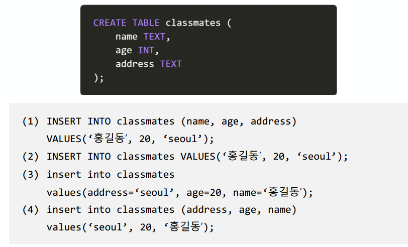

```sh
(3)소문자로 해도 잘 동작함
```


### 와일드카드 문자

> SQL에서 사용가능한 와일드카드 문자인 %와 _을 비교하여 작성하시오.

```sh
`%`은 그 자리에 0이상의 문자가 들어감을 의미
`_`는 딱 하나의 문자가 들어간다는 것을 의미한다
```


### lookup

> 지문의 코드에서 ‘__gt’ 부분을 lookup이라고 한다. 링크를 참고하여 Django에서 사용
> 가능 한 lookup 세가지와 그 의미를 작성하시오.
>
> [https://docs.djangoproject.com/en/3.0/ref/models/querysets/#field-lookups](https://docs.djangoproject.com/en/3.0/ref/models/querysets/#field-lookups)

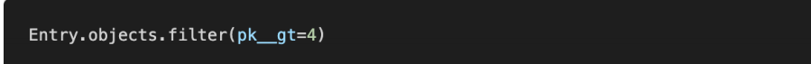

```sh
1) filter() : 조건에 해당하는 쿼리셋을 불러옴, lookup필드 포맷도 가능하며 or조건을 적용해야할 경우 Q객체도 사용 가능
2) exclude() : 조건에 해당하지 않는 퀴리셋을 불러옴! lookup필드 포맷 가능
3) get() : 쿼리셋을 호출하지 않는 메서드
```


### 1:N관계설정

> 지문은 1:N 관계 설정을 하기 위하여 정의된 모델이다. 링크를 참고하여 빈 칸에 들어갈
> 수 있는 값 세가지와 그 의미를 작성하시오.
> https://docs.djangoproject.com/en/3.0/ref/models/fields/#arguments

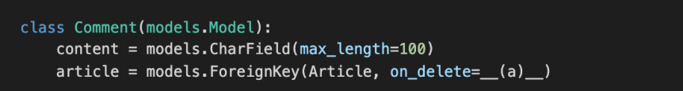

```sh
on_delete 옵션

- 외래키가 참조하고 있는 부모객체가 삭제되었을 때 연결된 N의 애들을 어떻게 처리할거냐?
- 만약 게시글이 삭제되고 댓글이 8개가 달렸다면 그 8개의 댓글은 어떻게 처리할거냐? 
```

##### ForeignKey's Arguments on_delete

- **CASCADE**
  - 보통 이거 적음
  - **부모 객체(참조 된 객체)가 삭제 됐을 때 이를 참조하는 객체도 삭제**
- PROTECT
  - 참조가 되어 있는 경우 오류 발생
- SET_NULL
  - 부모 객체가 삭제 됐을 때 모든 값을 NULL로 치환(NOT NULL 조건 시 불가능)
- SET()
  - 특정 함수 호출
- DO_NOTHING
  - 아무것도 하지 않음
  - 다만, 데이터베이스 필드에 대한 SQL ON DELETE제한 조건을 설정
- RESTRICT(new in 3.1)
  - RestrictedError를 발생시켜 참조된 객체의 삭제를 방지


### comment create

> 지문은 댓글 기능을 작성하기 위한 코드이다. 빈 칸에 들어갈 코드를 작성하시오.

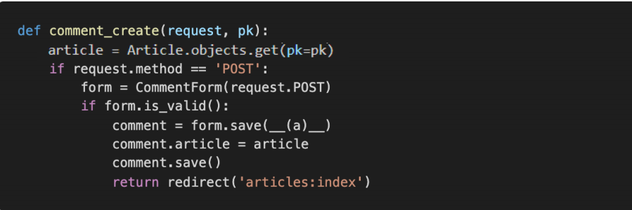

```sh
(a) commit=False
기본값은 true인데 `comment_form.save(commit=False)`이거는 commit을 하지 않음 save는 하긴 할건데 아직 db에 작성하지말고 인스턴스만 만들어주되 저장은 좀만 기다려달라
```


### 1:N ORM

> 게시물 아래에 댓글을 출력하려고 한다. post와 comment 모델이 1:N으로 관계설정이
> 되어 있다고 가정 할 때 아래의 빈칸에 적절한 코드를 작성하시오.

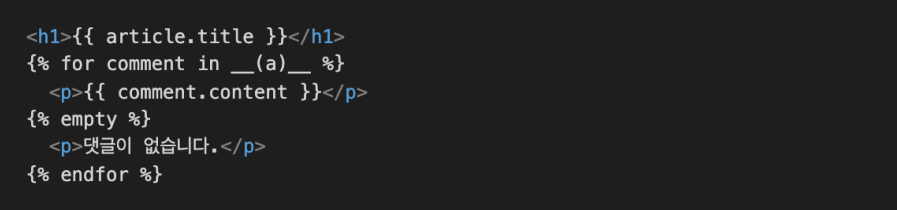

```sh
(a) comments
```

```html

  <ul>
    <li>{{comment.content}}</li>
    <form action="" method='POST' class='d-inline'>
    
    <input type="submit" value='DELETE'>
    </form>
  </ul>
    
    <p>댓글이 아직 없어요.</p>
  
```


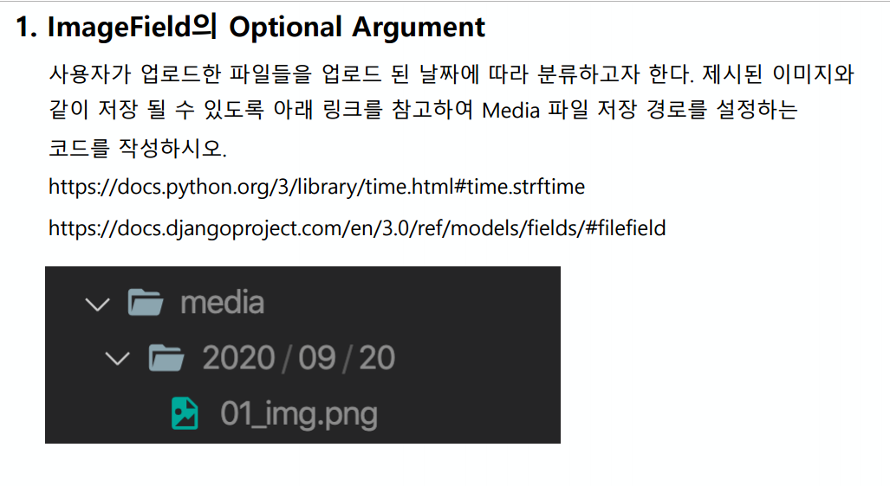

```python
from django.db import models 
class Article(models.Model):    
    title = models.CharField(max_length=100)    
    content = models.TextField()    
    image = models.ImageField(blank=True, upload_to="%Y/%m/%d")    
    created_at = models.DateTimeField(auto_now=True)    
    updated_at = models.DateTimeField(auto_now_add=True)

```

- image모델을 정의할때  `upload_to=%Y/%m/%d `와 같은 형식을 사용함
- `/`를 적으면 폴더가 3개 생김! Y/M/D폴더 이렇게 3개로 만들어짐
- media / 20200915 / 이미지 파일 형태로 저장된다
- 그리고 모델을 변경했기 때문에 makemigrations, migrate를 해야됨!!

```sh
$python manage.py makemigrations
$python manage.py migrate
$python manage.py runserver
```


###  Password Change
> /accounts/password/
> 비밀번호 수정 기능을 구현한다.
>
> 이거는 로그인이 유지되는 코드!

```python
from django.contrib.auth.forms import UserCreationForm,AuthenticationForm,PasswordChangeForm
from django.contrib.auth.decorators import login_required
from django.contrib.auth import get_user_model,update_session_auth_hash
@require_http_methods(['GET','POST'])
def password(request):
	if request.method == 'POST':
        #이거 원래 앞이 user값, 두번째가 request.post 근데 만약 위치 모르면 둘다 key값주면 위치 바껴도 괜춘!!!
        form = PasswordChangeForm(user=request.user, data=request.POST)
        if form.is_valid():
            #이렇게 로그인이 유지됨
            user = form.save()
            update_session_auth_hash(request,request.user)
            return redirect('accounts:index')
    else:
        form = PasswordChangeForm(request.user)
    context = {
        'form' : form,
    }
    return render(request,'accounts/password.html',context)
```


### Model

```python
from django.db import models

# Create your models here.
class Article(models.Model): # 상속
    title = models.CharField(max_length=10)
    content = models.TextField()
    created_at = models.DateTimeField(auto_now_add=True)
    updated_at = models.DateTimeField(auto_now=True)
    
    def __str__(self):
        return self.title


class Comment(models.Model):
    #article(외래키) 필수 인자: 참조하는 클래스,on_delete옵션!,  related_name='comments'역참조시 원하는 이름으로 바꿀 수 있음 이렇게 하면 comment_set 명령어는 더이상 못씀
    article = models.ForeignKey(Article,on_delete=models.CASCADE)
    comment = models.CharField(max_length=200)
    created_at = models.DateTimeField(auto_now_add=True)
    updated_at = models.DateTimeField(auto_now=True)
    
    def __str__(self):
        return self.content

```

### Comment Create

```python
from django.shortcuts import render, redirect,get_object_or_404
from django.contrib.auth.decorators import login_required
from django.views.decorators.http import require_http_methods, require_POST
from .models import Article,Comment
from .forms import ArticleForm, CommentForm

@require_POST
def comments_create(request,pk):
     #댓글작성은 detail 페이지에서 보여짐
    # article = Article.objects.get(pk=pk)
    article = get_object_or_404(Article,title__startswith='A',pk=1)
    comment_form = CommentForm(request.POST)
    if comment_form.is_valid():
        #기본값은 true인데 comment_form.save(commit=False)이거는 commit을 하지 않음 save는 하긴 할건데 아직 db에 작성하지말고 인스턴스만 만들어주되 저장은 좀만 기다려달라
        comment = comment_form.save(commit=False)
        #그러면 db에 저장이 안됐기 때문에 인스턴스에 값을 추가로 넣을 수 있음
        comment.article = article
        #넣을 거 다 넣었으니 이제 save, data를 받을 떄 내용+외래키를 받아와야되기 때문에 잠시 시간을 준거임
        comment.save()
        return redirect('articles:detail',article.pk)
    context = {
        'comment_form':comment_form,
        'article':article,
    }
    #에러메세지를 담고 detail페이지로 넘어감
    return render(request,'articles/detail.html',context)

```


### Comment Read

```html
 <h4>댓글 목록</h4>
  
  <ul>
    <li>{{comment.content}}</li>
  </ul>
  
  <hr>
  <h4>댓글작성</h4>
  <form action="" mehtod='POST'>
  
  {{comment_form}}
  <input type="submit">
  </form>


```


### Comment Delete

```python
@require_POST
def comments_delete(request,article_pk,comment_pk):
    # comment = Comment.objects.get(pk=comment_pk)
    comment = get_object_or_404(Comment,pk=comment_pk)
    comment.delete()
    #인자로 받은 article_pk를 가져옴
    #만약 article=comment.article로 받아온다면-> article.pk로 받아도되지만 최적화를 위해 인자로 받아라(?)
    return redirect('articles:detail',article_pk)

```


### Auth_User

- accounts > models

> settings.py에 AUTH_USER_MODEL = 'accounts.User'씀
> 프로젝트 시작 전 User모델을 미리 만들고 시작해야됨!

```python
from django.db import models
from django.contrib.auth.models import AbstractUser
# Create your models here.

#기본유저 모델을 쓰면 추가를하거나 대체를 할 수 없기 때문에 프로젝트 시작전에 대체를 먼저 하고 시작함!
#아래의 기능은 나중에 써도됨, 기존의 User와 기능적으로는 완전히 동일하지만 대체를 해야되는건 나중에 수정가능하게 하기 위해서
class User(AbstractUser):
    pass
```


- accounts > forms

```python
from django.contrib.auth.forms import UserChangeForm,UserCreationForm
from django.contrib.auth import get_user_model


class CustomUserChangeForm(UserChangeForm):

    class Meta:
        model = get_user_model()
        fields = ('email', 'first_name', 'last_name',)


class CUstomUserCreationForm(UserCreationForm):

    class Meta(UserCreationForm.Meta):
        model = get_user_model()#현재 프로젝트에 활성화된 모델임, 이거쓰는거 권장
        field = UserCreationForm.Meta.fields + ('email',)
```

- articles > models

```python
from django.db import models
from django.conf import settings

# Create your models here.
class Article(models.Model): # 상속
#여기는 get_user_model을 참고하지 못하고 Auth_user_model을 적어야됨, user_id defalut를 1로 줌, 
    user = models.ForeignKey(settings.AUTH_USER_MODEL,on_delete=models.CASCADE,defalut=1)
    title = models.CharField(max_length=10)
    content = models.TextField()
    created_at = models.DateTimeField(auto_now_add=True)
    updated_at = models.DateTimeField(auto_now=True)
    
    def __str__(self):
        return self.title


class Comment(models.Model):
    #article(외래키) 필수 인자: 참조하는 클래스,on_delete옵션!,  related_name='comments'역참조시 원하는 이름으로 바꿀 수 있음 이렇게 하면 comment_set 명령어는 더이상 못씀
    article = models.ForeignKey(Article,on_delete=models.CASCADE)
    #하나의 모델에는 여러 외래키가 있어도됨
    user = models.ForeignKey(settings.AUTH_USER_MODEL,on_delete=models.CASCADE)
    comment = models.CharField(max_length=200)
    created_at = models.DateTimeField(auto_now_add=True)
    updated_at = models.DateTimeField(auto_now=True)
    
    def __str__(self):
        return self.content
```


- articles > forms

```python
from django import forms
from .models import Article,Comment


class ArticleForm(forms.ModelForm):
    
    class Meta:
        model = Article
        fields = ['title','content']
        # exclude = ['user']
#detial페이지에서 보여져야됨->detail view에 적힘
class CommentForm(forms.ModelForm):

    class Meta:
        model = Comment
        # fields = '__all__'
        #제외할 것을 적어줘도됨, 이건 foreign key이기 때문에 안보여지게 할거야
        exclude = ['article','user',]
```


- articles > urls

```python
from django.urls import path
from . import views


app_name = 'articles'
urlpatterns = [
    path('', views.index, name='index'),
    path('create/', views.create, name='create'),
    path('<int:pk>/', views.detail, name='detail'),
    path('<int:pk>/update/', views.update, name='update'),
    path('<int:pk>/delete/', views.delete, name='delete'),
    path('<int:pk>/comments/',views.comments_create,name='comments_create'),
    path('<int:article_pk>/comments/<int:comment_pk>/delete/',views.comments_delete,name='comments_delete'),
]
```


- articles > views

```python
from django.shortcuts import render, redirect,get_object_or_404
from django.contrib.auth.decorators import login_required
from django.views.decorators.http import require_http_methods, require_POST
from .models import Article,Comment
from .forms import ArticleForm, CommentForm

# Create your views here.
def index(request):
    articles = Article.objects.order_by('-pk')
    context = {
        'articles': articles,
    }
    return render(request, 'articles/index.html', context)


@login_required
@require_http_methods(['GET', 'POST'])
def create(request):
    if request.method == 'POST':
        form = ArticleForm(request.POST) 
        if form.is_valid():
            article = form.save(commit=False)
            article.user = request.user #user_id라고 적지않고 객체를 넣음
            article.save()
            return redirect('articles:detail', article.pk)
    else:
        form = ArticleForm()
    context = {
        'form': form,
    }
    return render(request, 'articles/create.html', context)

#이제 폼이름 여러개니까 구분지어줌 comment_form
def detail(request, pk):
    # article = Article.objects.get(pk=pk)
    article = get_object_or_404(Article,pk=pk)
    comment_form = CommentForm()
    #역참조 일어남, pk게시글이 가진 모든 댓글 가져옴
    comments = article.commet_set.all()
    context = {
        'article': article,
        'comment_form':comment_form,
        'comments':comments,
    }
    return render(request, 'articles/detail.html', context)


@login_required
@require_http_methods(['GET', 'POST'])
def update(request, pk):
    # article = Article.objects.get(pk=pk)
    article = get_object_or_404(Article,pk=pk)
    #수정하는 유저와,게시글 작성 유저가 같은지 확인!
    if request.user == article.user:
        if request.method == 'POST':
            form = ArticleForm(request.POST, instance=article)
            if form.is_valid():
                form.save()
                return redirect('articles:detail', article.pk)
        else:
            form = ArticleForm(instance=article)
    else:
        return redirect('articles:index')
    context = {
        'form': form,
        'article': article,
    }
    return render(request, 'articles/update.html', context)


@require_POST
def delete(request, pk):
    if request.user.is_authenticated:
        # article = Article.objects.get(pk=pk)
        article = get_object_or_404(Article,pk=pk)
        #user가 같아야 삭제
        if request.user == article.user:
            article.delete()
            return redirect('articles:index')
    return redirect('articles:detail',article.pk)


@require_POST
def comments_create(request,pk):
     #댓글작성은 detail 페이지에서 보여짐
    # article = Article.objects.get(pk=pk)
    if request.user.is_authenticated:
        article = get_object_or_404(Article,title__startswith='A',pk=1)
        comment_form = CommentForm(request.POST)
        if comment_form.is_valid():
            #기본값은 true인데 comment_form.save(commit=False)이거는 commit을 하지 않음 save는 하긴 할건데 아직 db에 작성하지말고 인스턴스만 만들어주되 저장은 좀만 기다려달라
            comment = comment_form.save(commit=False)
            #그러면 db에 저장이 안됐기 때문에 인스턴스에 값을 추가로 넣을 수 있음
            comment.article = 
            #user에 대한 정보를 받아옴, 사실상 들어가는 정보는 user_id임 클래스변수 user에 객체 자체를 넣어줌
            comment.user = request.user
            #넣을 거 다 넣었으니 이제 save, data를 받을 떄 내용+외래키를 받아와야되기 때문에 잠시 시간을 준거임
            comment.save()
            return redirect('articles:detail',article.pk)
        context = {
            'comment_form':comment_form,
            'article':article,
        }
        #에러메세지를 담고 detail페이지로 넘어감
        return render(request,'articles/detail.html',context)
    #로그인하지 않았을때
    return reirect('accounts:login')

@require_POST
def comments_delete(request,article_pk,comment_pk):
    # comment = Comment.objects.get(pk=comment_pk)
    if request.user.is_authenticated:
        comment = get_object_or_404(Comment,pk=comment_pk)
        if request.user == comment.user:
            comment.delete()
    #인자로 받은 article_pk를 가져옴
    #만약 article=comment.article로 받아온다면-> article.pk로 받아도되지만 최적화....를 위해...인자로 받아라??
    return redirect('articles:detail',article_pk)
```


- articles > index.html

```html



  <h1 class="text-center">Articles</h1>
  
    <a href="">NEW</a>
  
    <a href="">[새 글을 작성하려면 로그인 하세요]</a>
  
  <hr>
  
   .user까지만 적어도 출력되는것이 같음 
    <p><b>작성자 : {{article.user.username}}</b></p>
    <p>글 번호: {{ article.pk }}</p>
    <p>글 제목: {{ article.title }}</p>
    <p>글 내용: {{ article.content }}</p>
    <a href="">[detail]</a>
    <hr>
  

```


- articles > detail.html

```html



  <h2 class="text-center">DETAIL</h2>
  <h3>{{ article.pk }} 번째 글</h3>
  <hr>
  <p>제목: {{ article.title }}</p>
  <p>내용: {{ article.content }}</p>
  <p>작성 시각: {{ article.created_at }}</p>
  <p>수정 시각: {{ article.updated_at }}</p>
  <hr>
   requst없이 사용할수 있지만 명확하게 하기 위해서 써주는 편! 
  
    <a href="">UPDATE</a><br>
    <form action="" method="POST">
      
      <input type="submit" value="DELETE">
    </form>
  
  <a href="">[back]</a>
  <hr>
  <h4>댓글 목록</h4>
  
    {{comments|length}} 개의 댓글이 있습니다.
  
  {{comments.count}} 개
  
  <ul>
    {{ comment.user }}<li>{{comment.content}}</li>
    
      <form action="" method='POST' class='d-inline'>
      
      <input type="submit" value='DELETE'>
      </form>
    
  </ul>
    
    <p>댓글이 아직 없어요.</p>
  
  <hr>
  
    <h4>댓글작성</h4>
    <form action="" mehtod='POST'>
    
    {{comment_form}}
    <input type="submit">
    </form>a
    
    <a href="">[댓글을 작성하려면 로그인 하세요.]</a>
  

```


- accounts > views.py

```python
from django.shortcuts import render, redirect
from django.contrib.auth import login as auth_login
from django.contrib.auth import logout as auth_logout
from django.contrib.auth.forms import (
    AuthenticationForm,
    PasswordChangeForm,
)
from django.contrib.auth.decorators import login_required
from django.views.decorators.http import require_POST, require_http_methods, require_safe
from django.contrib.auth import update_session_auth_hash
from .forms import CustomUserChangeForm,CustomUserCreationForm

# Create your views here.
@require_http_methods(['GET', 'POST'])
def signup(request):
    if request.user.is_authenticated:
        return redirect('articles:index')

    if request.method == 'POST':
        form = CustomUserCreationForm(request.POST)
        if form.is_valid():
            user = form.save()
            auth_login(request, user)
            return redirect('articles:index')
    else:
        form = CustomUserCreationForm()
    context = {
        'form': form,
    }
    return render(request, 'accounts/signup.html', context)


@require_http_methods(['GET', 'POST'])
def login(request):
    if request.user.is_authenticated:
        return redirect('articles:index')
        
    if request.method == 'POST':
        form = AuthenticationForm(request, request.POST)
        if form.is_valid():
            # 로그인
            auth_login(request, form.get_user())
            print(request.GET.get('next'))
            return redirect(request.GET.get('next') or 'articles:index')
    else:
        form = AuthenticationForm()
    context = {
        'form': form,
    }
    return render(request, 'accounts/login.html', context)


@require_POST
def logout(request):
    auth_logout(request)
    return redirect('articles:index')


@login_required
@require_http_methods(['GET', 'POST'])
def update(request):
    if request.method == 'POST':
        form = CustomUserChangeForm(request.POST, instance=request.user)
        if form.is_valid():
            form.save()
            return redirect('articles:index')
    else:
        form = CustomUserChangeForm(instance=request.user)
    context = {
        'form': form,
    }
    return render(request, 'accounts/update.html', context)


@require_POST
def delete(request):
    if request.user.is_authenticated:
        request.user.delete()
    return redirect('articles:index')


@login_required
@require_http_methods(['GET', 'POST'])
def change_password(request):
    if request.method == 'POST':
        form = PasswordChangeForm(request.user, request.POST)
        if form.is_valid():
            user = form.save()
            update_session_auth_hash(request, user)
            return redirect('articles:index')
    else:
        form = PasswordChangeForm(request.user)
    context = {'form': form}
    return render(request, 'accounts/change_password.html', context)
```


### Like

- views.py

```python
@require_POST
def like(request, article_pk):
    if request.user.is_authenticated:
        article = get_object_or_404(Article, pk=article_pk)
       
        if article.like_users.filter(pk=request.user.pk).exists():
            article.like_users.remove(request.user)
        else:
            article.like_users.add(request.user)
        return redirect('articles:index')
    return redirect('accounts:login')
```

- models.py

```python
class Article(models.Model):
    user = models.ForeignKey(settings.AUTH_USER_MODEL, on_delete=models.CASCADE)
    like_users = models.ManyToManyField(settings.AUTH_USER_MODEL, related_name='like_articles')
    title = models.CharField(max_length=10)
    content = models.TextField()
    created_at = models.DateTimeField(auto_now_add=True)
    updated_at = models.DateTimeField(auto_now=True)
    
    def __str__(self):
        return self.title
```

- index.html

```html



  <h1 class="text-center">Articles</h1>
  
    <a href="">NEW</a>
  
    <a href="">[새 글을 작성하려면 로그인 하세요]</a>
  
  <hr>
  
    <p><b>작성자 : <a href="">{{ article.user }}</b></a></p>
    <p>글 번호: {{ article.pk }}</p>
    <p>글 제목: {{ article.title }}</p>
    <p>글 내용: {{ article.content }}</p>
    <form action="" method="POST" class="d-inline">
      
      
        <button class="btn btn-link" style="color: crimson;">
          <i class="fas fa-heart"></i>
        </button>
      
        <button class="btn btn-link" style="color: black;">
          <i class="fas fa-heart"></i>
        </button>
      
    </form>
    {{ article.likes }} 명이 이 글을 좋아합니다.
    <br>
    <a href="">[detail]</a>
    <hr>
  

```


------------

1. 쿠키와 세션
2. 필터로 머하는거
3. render,redirect
4. form, model
5. 왜 auth_user_model? 주관식
6. customusercreationform 이런거
7. static,image,media
8. MTV
9. many to many 필드 이름
10. get_object_or_404 왜 쓰는지?
11. decorator
12. login_required ,require_post 같이 못쓰는거

13. GET,POST 차이
14. template 분리
15. url 분리
16. HTML if 태그
17. redirect(request.GET.get('next') or 'articles:index')
18. admin site 관리할건데 User은 모델이름 

19. media 파일 경로

```django
MEDIA_URL = '/media/'
MEDIA_ROOT = [BASE_DIR/'media']
```


19. on_delete
20. manytomanyfield, related_name 은 역참조할 떄 이름

21. follow할 때 symmetrical = False
22. templates and static - TEMPLATES, STATICFILES_DIRS


----

### 