# Django_Rest API

> 다시보기필요...함....ㅠ

> API Server


> 이제는 json을 우리가 줄거야!
>
> "프로그래밍을 통해 요청에 `JSON을 응답`하는 서버를 만들자"

## RESTful API

> REpresentational State Transfer =**자원과 주소의 지정 방법**
>
> 엄격한 의미로 REST는 네트워크 아키텍처 원리의 모음
>
> 여기서 '네트워크 아키텍처 원리'란 **자원**을 정의하고 자원에 대한 **주소**를 지정하는 방법 전반을 일컫는다
>
> 간단한 의미로는, 웹 상의 자료를 **HTTP**위에서 *(중략)* 전송하기 위한 아주 간단한 인터페이스를 말함
>
> 자원표현 집중(URI+계층)
>
> 행위(자원조작)-> HTTP Method
>
> 표현 -> JSON

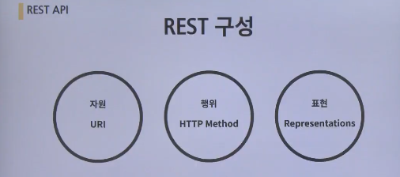

### REST 중심 규칙

1. URL는 정보의 자원을 표현해야 함
2. 자원에 대한 (어떠한)행위는 HTTP Method로 표현함


## REST API

> [참고하면 좋은 페이지](https://gmlwjd9405.github.io/2018/09/21/rest-and-restful.html)

### REST, API [(참고하면 좋은 페이지)](https://gmlwjd9405.github.io/2018/09/21/rest-and-restful.html)

- `REST(Repersentational State Transfer)`
  - 각 요청이 어떠한 동작&정보를 위한 것인지 **요청 형식 자체(주소)로 파악이 가능**한 것
  - 자원의 표현에 의한 상태 전달
  - HTTP URI를 통해 자원을 명시하고, HTTP Method를 통해 해당 자원에 대한 CRUD Operation을 적용하는 것
- `API(Application Programming Interface)`
  - 데이터와 기능의 집합을 제공하여 컴퓨터 프로그램간 상호작용을 촉진하며, 서로 정보를 교환 가능하도록 하는 것
- `REST API`
  - REST 기반으로 서비스 API를 구현한 것
  - 최근 Open API, 마이크로 서비스 등을 제공하는 업체 대부분은 REST API를 제공한다.


## URI

- URI(Uniform Resource Identifier) : 통합 자원 식별자
- "인터넷에 있는 자원을 나타내는 유일한 주소"
- URI 안에 URL과 URN이 있음, 근데 URN은 별로 안쓰고 보통 URL은 URI지만 같은것은 아니라는 걸 알아야 됨

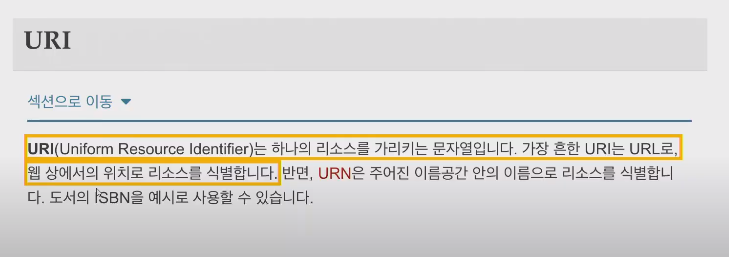

- (참고) **URL**

- Uniform Resource Locator(파일 식별자)

- "네트워크 상에서 자원이 어디에 있는지를 알려주기 위한 규약"

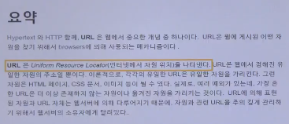

- 아래는 서버로 요청이 날라가는 것이 아니라 브라우저에서 제공해주는 기능

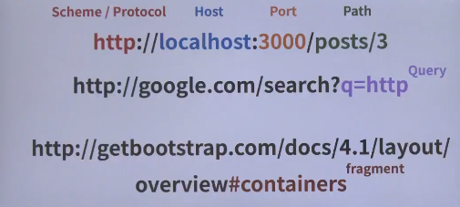


## HTTP Method

> HTTP(Hyper Text Transfer Protocol)
>
> 컨텐츠를 전송하기 위한 프로토콜(규약)

| HTTP 기본 속성 |                       비고                        |
| :------------: | :-----------------------------------------------: |
|   Stateless    |             상태 정보가 저장되지 않음             |
|  Connectless   | 서버에 요청을 하고 응답을 한 이후에 연결은 끊어짐 |

| HTTP Method |                         비고                          |
| :---------: | :---------------------------------------------------: |
|     GET     | 지정 리소스의 표시를 요청하며, 오직 데이터를 받기만함 |
|    POST     |            클라이언트 데이터를 서버로 보냄            |
|  PUT/PATCH  | 서버로 보낸 데이터를 저장/지정 리소스의 부분만을 수정 |
|   DELETE    |                  지정 리소스를 삭제                   |

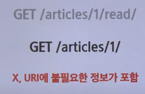

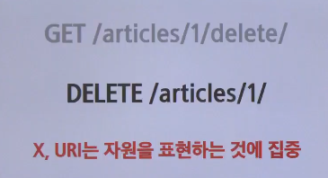

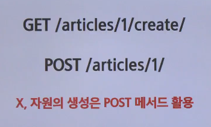

## Representations

> 표현, 좀어렵
>
> 데이터를 표현하고, 메타데이터를 표현하고, 그 메타데이터를 표현하는 메타데이터를 포함함......
>
> 일단 심플하게 json을 표현이라고 함....

- JSON

  - {'KEY':Value}
  - JavaScript Object Notation
  - JavaScript객체 표기법
  - 단순 문자열
  - 가벼운 데이터 교환 형식
  - 언어독립적은 Text
  - 데이터 덩어리, 각 언어별로 받아서 개발을 하겠다

  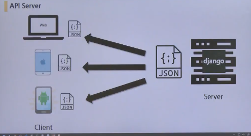

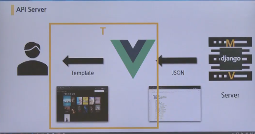

**"프로그래밍을 통해 요청에 `RESTful한 방식`으로 `JSON을 응답`하는 서버를 만들자"**

#### Django seed

> [github공식자료](https://github.com/Brobin/django-seed)
>
> Data 더미들을 자동으로 만들어줌

##### Installation

```sh
$ pip install django-seed
```

-  `settings.py`

```python
INSTALLED_APPS = (
    ...
    #추가
    'django_seed',
)
```

- seed15개를 만들겠다
  - Ex: Seed 15 of each model for the app `api`:

```sh
$ python manage.py seed api --number=15
```


## Django REST Framework(DRF)

> [공식홈페이지](https://www.django-rest-framework.org/)
>
> Rest - url과 method를 정의하는 방식 중 하나
>
> restful - 모든 게시글을 보여주는 서버 기능
>
> method(행위), url(자원)
>
> DRF
>
> - Serializers
>   - 다른 환경, 포맷변환은 어떤 데이터타입을 JSON,XML 이러한 다른 데이터타입으로 바꾸는 것을 직렬화 라고 하는구나!
>
> 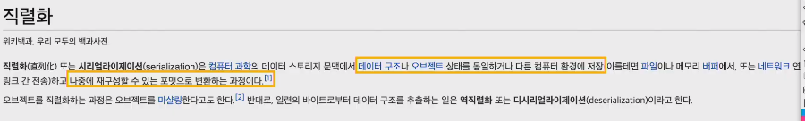
>
> 

|   구분   |  Django   |       DRF       |
| :------: | :-------: | :-------------: |
| Response |   HTML    |      JSON       |
|  Model   | ModelForm | ModelSerializer |

- 이제는 html을 안쓸거야!

- `articles` > `urls.py`

```python
from django.urls import path 
from . import views 


urlpatterns = [
    path('html/', views.article_list_html),
    #아래 세개 비교!
    path('json_1/', views.article_list_json_1),
    path('json_2/', views.article_list_json_2),
    path('json_3/', views.article_list_json_3),
]
```


#### 1. json을 만드는 첫번째 방법

> 이렇게 처음 했을 때 에러가 나는 이유 return에 두번째 인자로 safe=False안해서, 
>
> [공식문서보기]( https://docs.djangoproject.com/en/3.1/ref/request-response/)
>
> 이렇게 직접 적는 것은 너무 번거로움, 나중에 데이터 훨씬 많음...

```python
def article_list_json_1(request):   
    articles = Article.objects.all()
    articles_json = []
    for article in articles:
        articles_json.append({
            'id': article.id,
            'title': article.title,
            'content': article.content,
            'created_at': article.created_at,
            'updated_at': article.updated_at,
        })
    #응답이 텍스트로나옴, 리스트안에 딕셔너리가 각 요소로 들어감, 키:값형태로 들어옴
    return JsonResponse(articles_json,safe=False)
```

#### 2. 두번째 방법

> 그래서 위 과정을 줄여서 아래처럼 serialize해서 적음
>
> #db -> queryset instance(객체)
>
> `print(type(data))` : str으로 나옴!,문자열임, serialize된 data는 문자열이다!
>
> 결과적으로 받은건 json, 위 방법처럼 하나하나 적지 않아도 만들 수 있구나를 알 수 있음
> 직접필드를 만들지 않아도 우리가 받은 articles라는 쿼리셋을 django가 알아 serialization해서 json으로 만들어줌
>
> [공식문서](https://docs.djangoproject.com/en/3.1/topics/serialization/)

```python
from django.core import serializers
from django.http import HttpResponse
def article_list_json_2(request): 
    #아래의 articles는 사실 정보가 다 떨어져있음
    articles = Article.objects.all()
    #serializers가 흩어진 정보들을 뭉쳐줌
    data = serializers.serialize("json", articles)
    #HttpResponse의 인자로 data는 문자열이니 넣고, 응답할것을 적음
    return HttpResponse(data,content_type='application/json')
```

- `HttpResponse` objects[¶](https://docs.djangoproject.com/en/3.1/ref/request-response/#httpresponse-objects)
  - *class* `HttpResponse`
  - view에 적은 request가 이거의 인스턴스!
  - 아래처럼 사용(인자로 str값을 넣음!)

```python
>>> from django.http import HttpResponse
>>> response = HttpResponse("Here's the text of the Web page.")
>>> response = HttpResponse("Text only, please.", content_type="text/plain")
>>> response = HttpResponse(b'Bytestrings are also accepted.')
>>> response = HttpResponse(memoryview(b'Memoryview as well.'))
```


#### 3. **세번째 방법**

> 위 방법들은 그냥 이런 방법들이 있다이고, 이런건 불편하기때문에 아래의 이 코드를 쓴다고 생각하면 됨!
> `ArticleSerializer`는 장고의 기존의 serializer보다 훨씬 더 많은 기능을제공하기 때문에 이걸 쓴다는 것만 알면됨
>
> `@require_POST`와 같은 데코레이터는 POST요청만 받게만듦, 장고에서는 없어도, 동작하는데 문제가 없었지만 
>
> `DRF`는 `@api_view()`이 데코레이터가 없으면 작동을 안함

#### Django REST Framework install process

> https://www.django-rest-framework.org/
>
> json을 drf라는 framework를 이용해 조작할거야

- project명 : `api`, app명 : `musics`

  ```sh
  $ pip install djangorestframework
  ```

  ```python
  INSTALLED_APPS = [
      ...
      'rest_framework', # settings.py의 INSTALLED_APPS에 추가
  ]
  ```

- `articles` > `serializers.py`

>직렬화를 어떻게 하면 더 쉽게할 수 있는지 아래의 코드덕분에 가능한것
>
>깃헙 공식문서
>
>> 내부구현과정까진 굳이 알필요없다
>>
>> 사용법에 집중해라
>>
>> 모델폼과 유사하게 생겼다는 것만 알아라....
>
>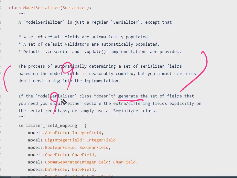

```python
from rest_framework import serializers
from .models import Article

class ArticleSerializer(serializers.ModelSerializer):
    class Meta:
        model = Article
        fields = ('id', 'title', 'content', 'created_at','updated_at',)
```

- `articles` > `views.py`

```python
from articles.serializers import ArticleSerializer
from rest_framework.decorators import api_view
from rest_framework.response import Response

@api_view(['GET']) #GET요청만 받을게욤
def article_list_json_3(reqeust):
    #임의로 pk1번가져옴(예시보여주기위해)
    aricle = Article.objects.get(pk=1)
    serializer = ArticleSerializer(article)
    #만들어놨으니 응답을 해야됨!
    #python(django)의 정보를 직렬화
    return Response(serializer.data)
```


-----------

postman

send보낼때 마지막에 `/`꼭 붙여야됨


## CRUD

- `articles.py` > `serializers.py` 만들고

> `python manage.py seed articles --number=20` ->articles앱 안에 더미 20개 만듦

```sh
$ python manage.py makemigrations
$ python manage.py migrate
$ python manage.py seed articles --number=20
```

- shell_pluse켜봄(그냥 앞으로 할거 보여주려고 함...넘어가도됨..)

>  이거 장점은 우리가 만든 모델을 편하게 바로 가져와서 사용할 수 있도록 만들어줌serializer를 이용해보고 싶은데 이건 우리가 직접 가져와야됨 
>
> 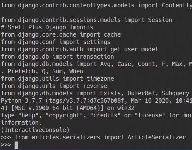
>
> 
>
> 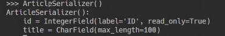
>
> 우리는 serializer를 정의햇을뿐인데 어떻게 알고있징
>
> 공식문서에 나와있듯 필드를 만들어주고, validation을 제공해준다...
>
> 
>
> **serialization : 직렬화 , translate-> django에서 썼던 QuerySet, model, instance같은 것들을 JSON형태로 바꿔주는, 번역을해주는 작업!**
>
> article인스턴스에 정보를 가져와 담고 serializer를 하면 번역된 결과가 나옴
>
> 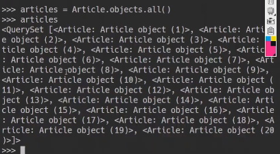
>
> articles도 serialize해보자
>
> serializer = ArticleSerializer(articles)
>
> selializer.data하면 오류가 생김!
>
> 왜냐하면 이건 articles가 쿼리셋이기 때문 
>
> 단일객체가 아니라 여러 객체일 때 `many=True` flag를 넣어줘야됨
>
> ```sh
> serializer = ArticleSerializer(articles,many=True)
> 
> serializer.data
> ```
>
> -> 단일한 객체일 땐 그냥 적어도 되지만 여러 객체일 땐 `many=True`를 넣어줘야됨!
>
> - 이건 view에 적을 serializer response 나중에 정리할때 쓰쟈
>
> 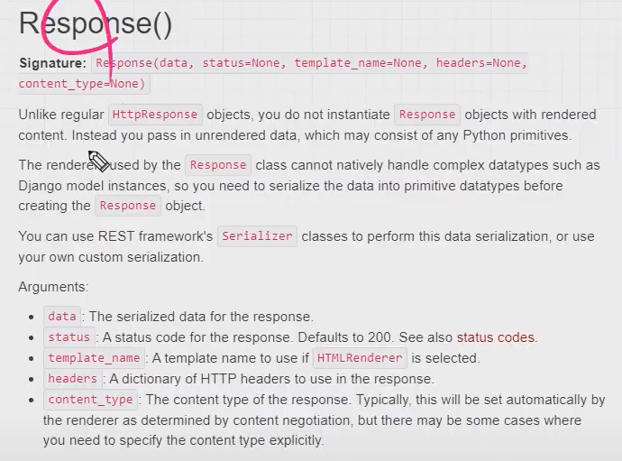


### Read

> list, detail만듦
>
> Create를 먼저 안만드는 것은 seed로 더미를 만들어줘서 그냥 Read먼저...ㅎ

- `api(프로젝트명)` > `urls.py`

```python
from django.contrib import admin
from django.urls import path, include

urlpatterns = [
    path('admin/', admin.site.urls),
    #api의 버전이라고 생각하면됨, 해당 api의 버전명/articles/...
    path('api/v1/articles/', include('articles.urls')),
]
```

##### List만듦

- `articles` > `urls.py`

```python
from django.urls import path
from . import views 

#templates를 사용하지 않기때문에 app_name없음

urlpatterns = [
    path('',views.article_list),
]
```

- `articles` > `serializers.py`

```python
from rest_framework import serializers
from .models import Article

class ArticleSerializer(serializers.ModelSerializer):
    #모델폼과 매우 유사함
    class Meta:
        model = Article
        fields = ('id','title',)
```

- `articles` > `views.py`

> `모델에서 가져온 데이터를 serializing한다.` 이 말은 aritlces에 쿼리셋을 넣었는데 그 정보는 정리가 안돼있다고 생각하면 됨
>
> 그래서 정리가 안된 정보들을 serializing을 통해 깔끔하게 정리를 함!
>
> 하나의 객체면 `many=True`가 없어도 내가 `serializers.py`에서 정의한대로 바로 정보가 정리가 되지만 쿼리셋은 여러 객체가 있기 때문에 인자로 `many=True`를 적어줘야됨
>
> 그 정보를 serializer에 넣고 이거 자체는 data가 아님
>
> `serializer.data`를 하면 정보가 정리된 것을 반환해줌~~(일단 이렇게 이해....ㅠ)~~

```python
#template 없기때문에 render필요없음!

from rest_framework.decorators import api_view
from rest_framework.response import Response

from .serializers import ArticleSerializer
from .models import Article

#DRF에서는 이 데코레이터를 달아주지 않으면 오류가남!
@api_view(['GET'])
def article_list(request):
    #1. 모델에서 데이터를 가져온다(articles는 쿼리셋)
    articles = Article.objects.all()

    #2. 모델에서 가져온 데이터를 serializing한다.
    #many=True라는 걸 통해 여러개의 데이터가 들어간다는걸 알려줌
    serializer = ArticleSerializer(articles,many=True)

    #serializer 자체는 data가 아님 serializer.data를 해야됨
    #3. 응답해준다(공식문서 Response)
    return Response(serializer.data)
```

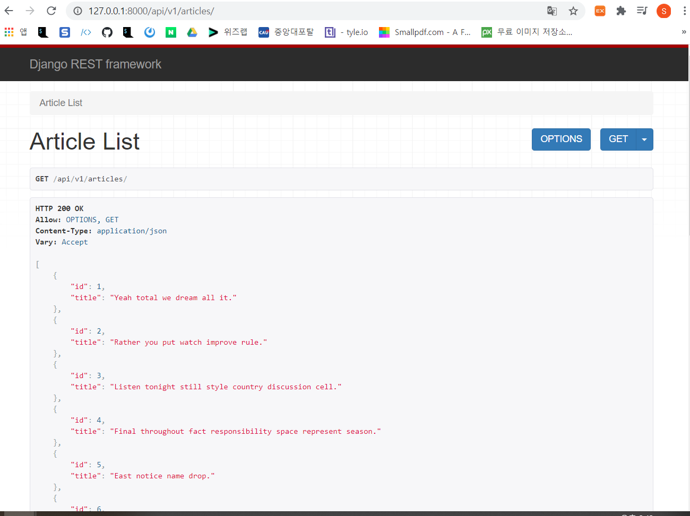


#### Detail 만듦

- `articles` > `urls.py`

```python
#구문추가
path('<int:article_pk>/',views.article_detail),
```

- `articles` > `views.py`

> 결국 모델에 있는데이터를 가져와서 하는건데
>
> list 코드와 비슷하지 않을까?
>
> 차이점은 pk가 인자로 들어오는것과, 단일 객체이라는것

```python
#상세요청 하나이기 때문에 GET요청
@api_view(['GET']) #default는 GET 괄호안에 안넣어도됨
def article_detail(request,article_pk):
    article = get_object_or_404(Article,pk=article_pk)
    serializer = ArticleSerializer(article)
    return Response(serializer.data)
```

>여기서 뭐가 좀 아쉽다
>
>바로 list페이지와 detail페이지가 같은게 계속 나온다는게 아쉽네
>
>detail만 수정하고싶은데 어떻게 수정해야될까?
>
>serializer라는 거로 json을 만들어가고있는데
>
>여러개의 serializers.py모델을 만들어도됨!

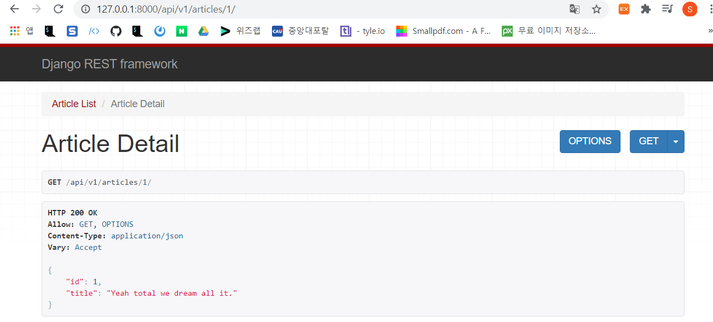

- `articles` > `serializers.py`

> list에 적을 것은 List에서 사용할 serializer라는 뜻으로 ArticleListSerializer이라고 이름을 바꾸고
>
> detail에 쓸 serializer는 ArticleSerializer는 fields를 추가해서 적음

```python
from rest_framework import serializers
from .models import Article

#여러개의 serializer모델을 만들어도됨
#이건 list에서 사용할 serializer이니까 List를 적어둠
class ArticleListSerializer(serializers.ModelSerializer):
    #모델폼과 매우 유사함
    class Meta:
        model = Article
        fields = ('id','title',)


class ArticleSerializer(serializers.ModelSerializer):
    #모델폼과 매우 유사함
    class Meta:
        model = Article
        fields = ('id','title','content','created_at','updated_at',)
```

- `serializer`의 이름이 바꼈기 때문에 원래 views.py에 적었던 serializer의 이름을 바꿔줌

```python
#template없기때문에 render필요없음!
from django.shortcuts import get_object_or_404

#아래모듈 import해옴
from rest_framework.decorators import api_view
from rest_framework.response import Response

from .serializers import ArticleListSerializer,ArticleSerializer
from .models import Article

#DRF에서는 이 데코레이터를 달아주지 않으면 오류가남!
@api_view(['GET'])
def article_list(request):
    #1. 모델에서 데이터를 가져온다(articles는 쿼리셋)
    articles = Article.objects.all()

    #2. 모델에서 가져온 데이터를 serializing한다.
    #many=True라는 걸 통해 여러개의 데이터가 들어간다는걸 알려줌
    serializer = ArticleListSerializer(articles,many=True)

    #serializer 자체는 data가 아님 serializer.data를 해야됨
    #3. 응답해준다(공식문서 Response)
    return Response(serializer.data)

#상세요청 하나이기 때문에 GET요청
@api_view(['GET']) #default는 GET 괄호안에 안넣어도됨
def article_detail(request,article_pk):
    #결국 모델에 있는데이터를 가져와서 하는건데
    #위코드와 비슷하지 않을까?
    #차이점은 pk가 인자로 들어오는것과, 단일 객체이라는것
    #1. 모델에서 데이터를 가져온다(articles는 쿼리셋)
    article = get_object_or_404(Article,pk=article_pk)

    #2. 모델에서 가져온 데이터를 serializing한다.
    #단일객체 데이터가 들어간다는걸 알려줌
    serializer = ArticleSerializer(article)

    #serializer 자체는 data가 아님 serializer.data를 해야됨
    #3. 응답해준다(공식문서 Response)
    return Response(serializer.data)
```


- 그러면 이렇게 변화된 detial을 볼 수 있음

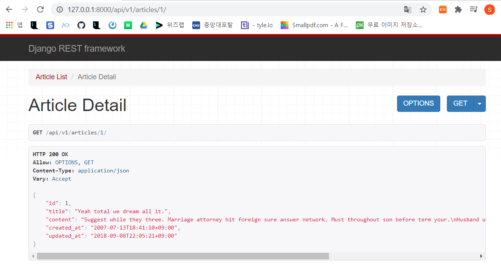


#### Create

- `articles` > `urls.py`

```python
#구문추가
path('create/',views.create_article),    
```

- `articles` > `views.py`

```python
@api_view(['POST'])
def create_article(request):
    # print(request.data)
    serializer = ArticleSerializer(data=request.data)
    if serializer.is_valid():
        serializer.save()
        return Response(serializer.data)
```

> 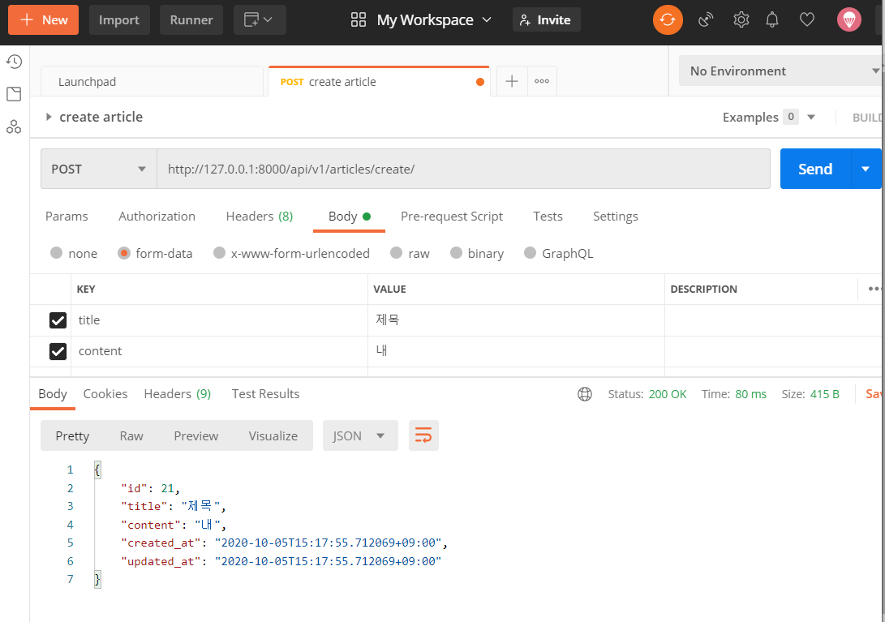
>
> 여기서 한가지 아쉬운게 있음, content를 빼고 정보를 보내면 오류가 남
>
> 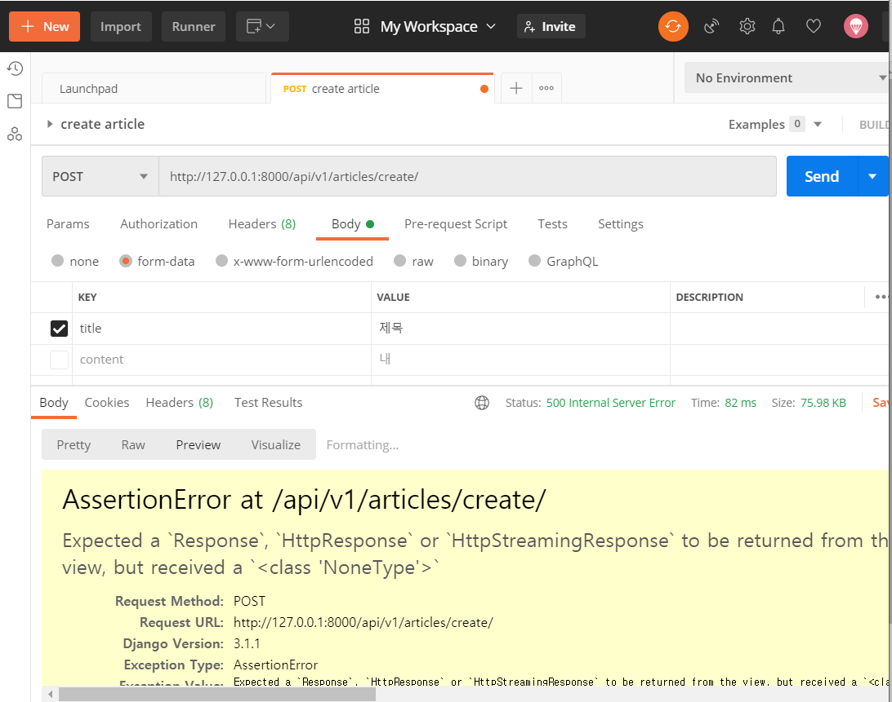
>
> 위를 해결해주기 위한 수단으로 장고는 `raise_exception`이라는 키워드를 제공함

```python
@api_view(['POST'])
def create_article(request):
    # print(request.data)
    serializer = ArticleSerializer(data=request.data)
    if serializer.is_valid(raise_exception=True):
        serializer.save()
        return Response(serializer.data)
```

> 이렇게 적는다면 400에러를 보여줌! content는 필수항목이라고 에러페이지 대신에 알려줌!
>
> 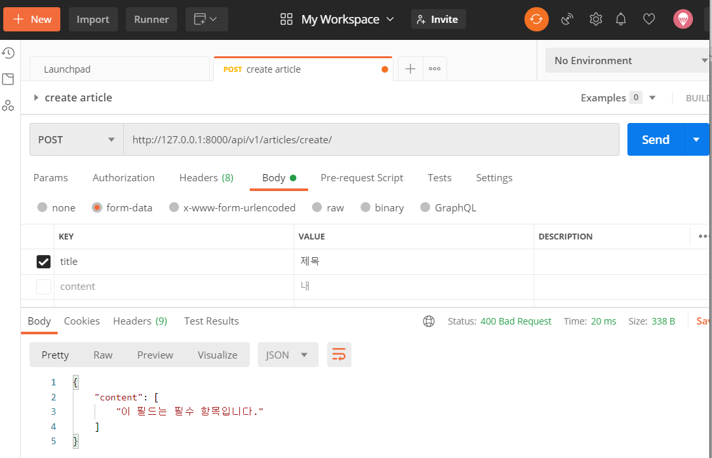
>
> 근데 여기서 하나만 더 추가를 하자면
>
> HTTP상태코드
>
> https://www.django-rest-framework.org/api-guide/status-codes/

```python
from rest_framework import status

@api_view(['POST'])
def create_article(request):
    # print(request.data)
    serializer = ArticleSerializer(data=request.data)
    if serializer.is_valid(raise_exception=True):
        serializer.save()
        #아래 status인자를 추가함!
        return Response(serializer.data,status = status.HTTP_201_CREATED)
```

> 이렇게 상태코드를 알려줌
>
> 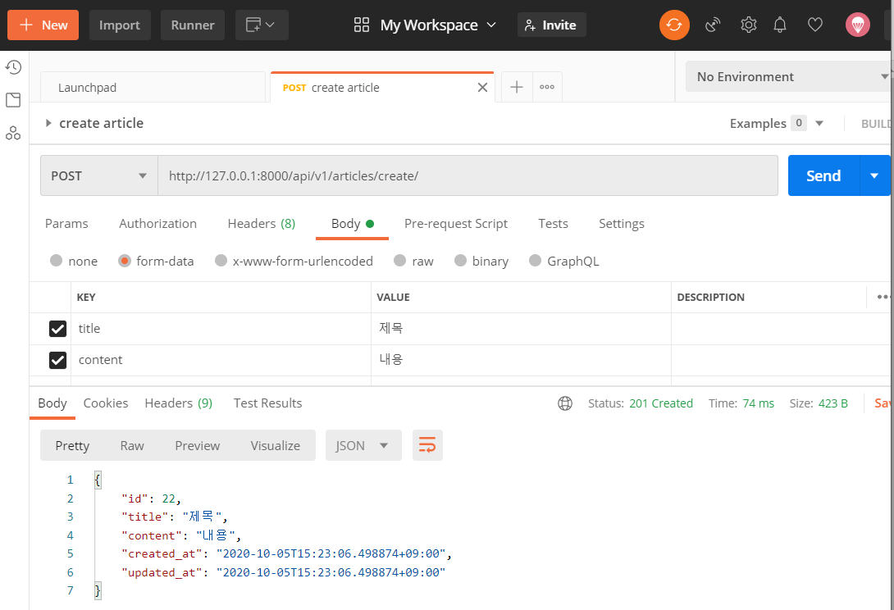
>
> 


#### DELETE

- `articles` > `urls.py`

```python
#구문추가
path('<int:article_pk>/delete/',views.delete_article),
```

- `articles` > `views.py`

```python
@api_view(['DELETE'])
def delete_article(request,article_pk):
    article = get_object_or_404(Article,pk=article_pk)
    article.delete()
    #뭐가 삭제됐는지 알려주려고 id값을 넘겨줌
    #삭제는 제대로 됐는데 우리가 반환해줄건 없어!
    return Response({'id': article_pk }, status = status.HTTP_204_NO_CONTENT)
```

> 204에러를 보여줌!
>
> 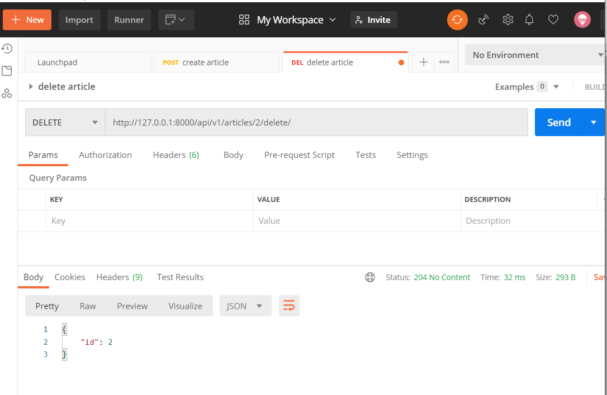
>
> 


#### Update

- `articles` > `urls.py`

```python
path('<int:article_pk>/update/',views.update_article),
```

- `articles` > `views.py`

> create와 로직이 유사함

```python
#업데이트가 가장 복잡!
@api_view(['PUT'])
def update_artice(request,article_pk):
    serializer = ArticleSerializer(article,data=request.data)
    if serializer.is_valid(raise_exception=True):
        serializer.save()
        return Response(serializer.data,status = status.HTTP_201_CREATED)
```

> 게시글이 수정된 것이 아니라 계속 생성됨!
>
> 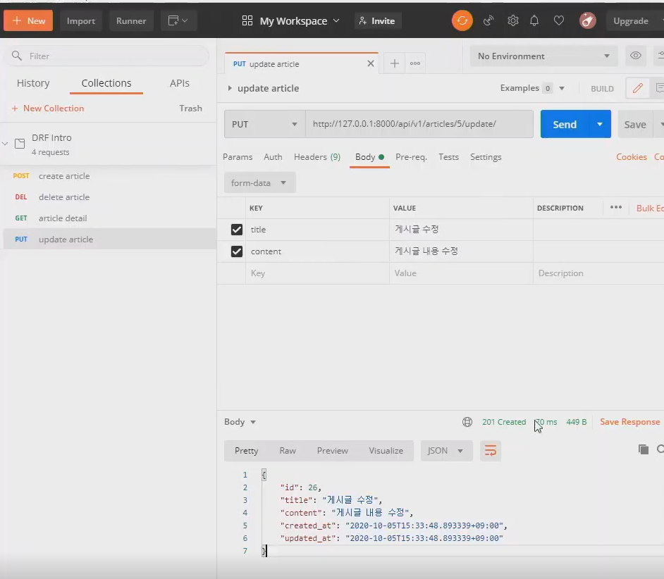
>
> PUT으로 보낸다고 무조건 수정이 되는게 아니라 밑의 로직을 바꿔줘야되는거얌!
> create랑 같은 로직을 쓰면 글이 새로 추가될뿐!
> 위에 PUT을 넣어준건 이런형태로 들어온다는걸 보여준것일 뿐 로직을 짜야됨
> 공식문서,,, update할 때는 instance를 넣어줘야됨

```python
#업데이트가 가장 복잡!
@api_view(['PUT'])
def update_artice(request,article_pk):
    article = get_object_or_404(Article,pk=article_pk)
    #instance로 첫번째 인자로 article을 주면 update가 됨!
    serializer = ArticleSerializer(article,data=request.data)
    if serializer.is_valid(raise_exception=True):
        serializer.save()
        return Response(serializer.data,status = status.HTTP_201_CREATED)
```


### 여기서 urls.py를 봤을 때 행위들이 표현되고 있음(이렇게 써라!!!)

> 행위들이 url에 표현되고있음(불필요한 정보)
>
> 이거를 정리해야겠다!
>
> 어떻게 할거냐면 pk가 있는것과 없는것을 기준으로 나눠봄
>
> 과감히 url을 명시적으로 만들어보자
> 행위는 제외!
> 계층구조도 포함됨(url이 `/articles/<int:article_pk>`이런식으로 적힘)

- `articles` > `urls.py`

```python
from django.urls import path
from . import views 

#templates를 사용하지 않기때문에 app_name없음

urlpatterns = [
    path('',views.article_list_create),
    path('<int:article_pk>/',views.article_detail_update_delete),
]
```

- `articles` > `views.py`

> 이렇게 하면 url에 불필요한 정보를 없앨 수 있음!

```python
@api_view(['GET','POST'])
def article_list_create(request):
    #LIST
    if request.method == 'GET':
        #1. 모델에서 데이터를 가져온다(articles는 쿼리셋)
        articles = Article.objects.all()

        #2. 모델에서 가져온 데이터를 serializing한다.
        #many=True라는 걸 통해 여러개의 데이터가 들어간다는걸 알려줌
        serializer = ArticleListSerializer(articles,many=True)

        #serializer 자체는 data가 아님 serializer.data를 해야됨
        #3. 응답해준다(공식문서 Response)
        return Response(serializer.data)
    
    #GET이 아니라면 POST(create)
    else:
        serializer = ArticleSerializer(data=request.data)
        if serializer.is_valid(raise_exception=True):
            serializer.save()
            return Response(serializer.data,status = status.HTTP_201_CREATED)
        
        
@api_view(['GET','PUT','DELETE'])
def article_detail_update_delete(request,article_pk):
    #GET, PUT, DELETE에 중복으로 계속 article 정보를 불러오기 때문에 한번에 처리
    article = get_object_or_404(Article,pk=article_pk)
    #Detail
    if request.method == 'GET':
        serializer = ArticleSerializer(article)
        return Response(serializer.data)
    #Update
    elif request.method == 'PUT':
        serializer = ArticleSerializer(article,data=request.data)
        if serializer.is_valid(raise_exception=True):
            serializer.save()
            return Response(serializer.data,status = status.HTTP_201_CREATED)

    #Delete
    else:
        article.delete()
        return Response({'id': article_pk }, status = status.HTTP_204_NO_CONTENT)
```

> List
>
> GET 보여줌
>
> 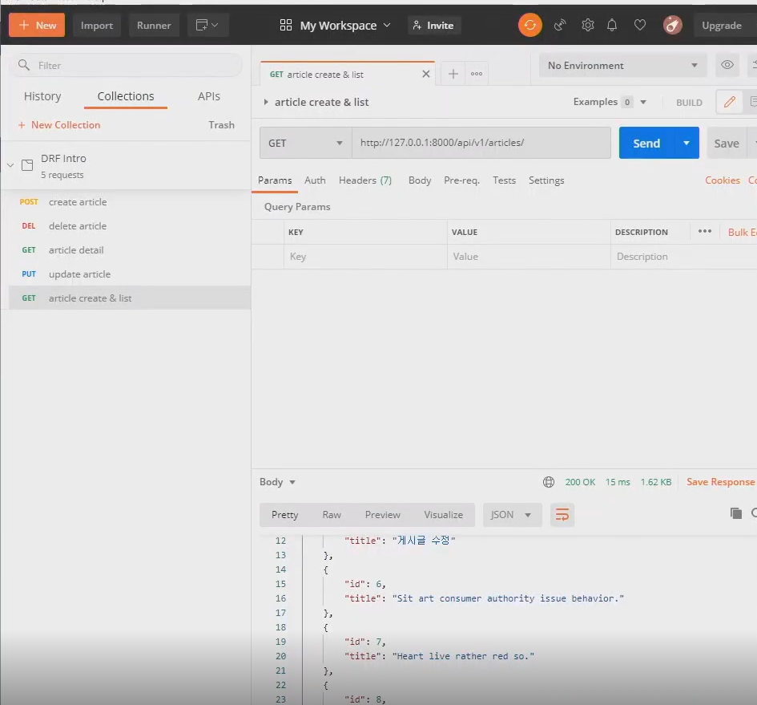
>
> 같은 URL인데 글이 써짐(POST)
>
> 
>
>  article_detail_update_delete
>
> GET(Detail)
>
> 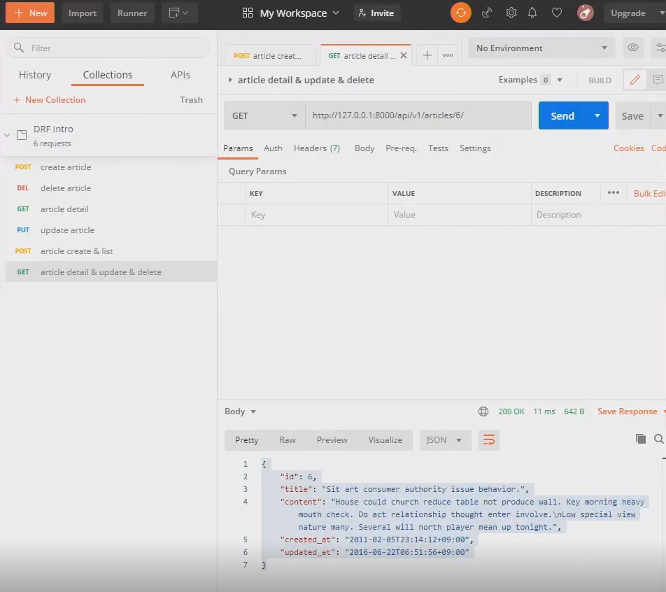
>
> PUT(Update)
>
> 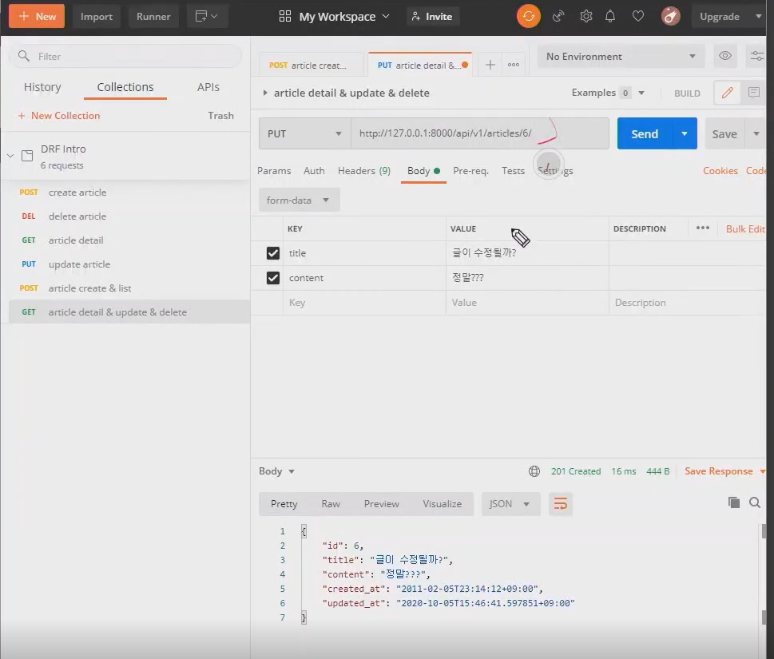
>
> DELETE(delete)
>
> 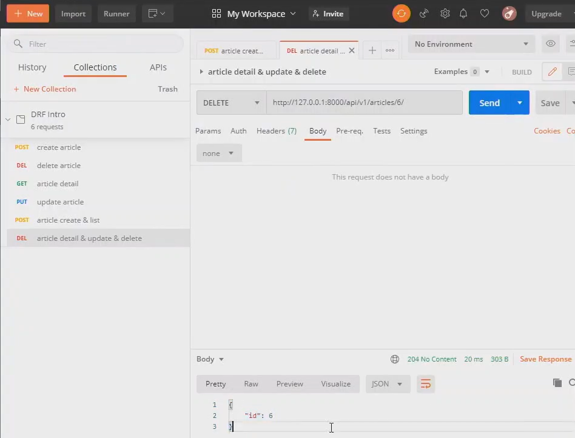


#### Comment


- comment를 만들기 위해 model을 만들어줌
- `articles` >`models.py`

```python
class Comment(models.Model):
    content = models.TextField()
    created_at = models.DateTimeField(auto_now_add=True)
    updated_at = models.DateTimeField(auto_now=True)
    article = models.ForeignKey(Article,on_delete=models.CASCADE)
```

- `articles` > `serializers.py`

```python
from rest_framework import serializers
from .models import Article,Comment

class CommentSerializer(serializers.ModelSerializer):

    class Meta:
        model = Comment
        fields = ('id','content','article',)
```

- `articles` > `urls.py`

```python
#추가
path('<int:article_pk>/comments/',views.comment_list_create),
```


- `articles` > `views.py`

```python
#template없기때문에 render필요없음!
from django.shortcuts import get_object_or_404

#아래모듈 import해옴
from rest_framework import status
from rest_framework.decorators import api_view
from rest_framework.response import Response

from .serializers import ArticleListSerializer,ArticleSerializer,CommentSerializer
from .models import Article,Comment

@api_view(['POST']):
def create_comment(reqeust,article_pk):
    serializer = CommentSerializer(data=request.data)
    if serializer.is_valid(raise_exception=True):
        serializer.save()
        return Response(serializer.data, status=status.HTTP_201_CREATED)
    
@api_view(['GET','POST']):
def comment_list_create(reqeust,article_pk):
    article = get_object_or_404(Article,pk=article_pk)
    if request.method == 'GET':
        #아티클 아이디로 모든 댓글 찾아서
        comments = article.comment_set.all()
        #직렬화해서
        serializer = CommentSerializer(comments,many=True)
        #응답함
        return Response(serializer.data)
    #POST(create)
    else:
        #보낸 데이터를 시리얼라이저에 넣어서
        serializer = CommentSerializer(data=request.data)
        #검증하고
        if serializer.is_valid(raise_exception=True):
            #저장하고
        	serializer.save()
            #응답함
            return Response(serializer.data, status=status.HTTP_201_CREATED)
```

> 댓글..
>
> 이건 article 외래키는 필수항목..
>
> article에 대한 정보를 내가 직접 입력하는게 아니라 원래 적혀져있어야됨..
>
> 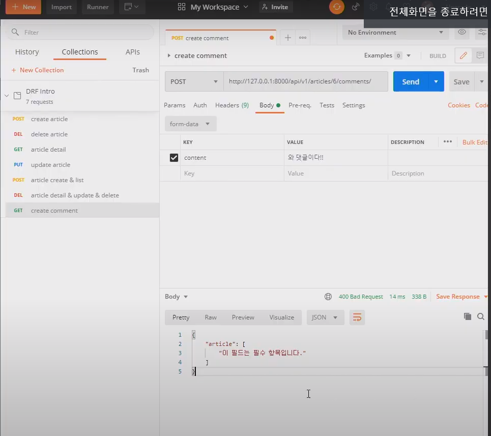
>
> 우리가 이걸 처리할 때 validation으로 처리하지 않도록 읽기전용필드가 있음
>
> 그건 [공식문서참고](https://www.django-rest-framework.org/api-guide/serializers/#specifying-read-only-fields)
>
> read only필드
>
> 디폴트값이 read only임 id는 read only필드라 여태까지 오류가 나지 않았음
>
> 하지만 article은 아님
>
> 그래서 이걸 넣어줘야되는데 어떻게?
>
> read_only_fields = ('article',) 이걸 CommentSerializer밑에 적음

- `articles` > `serializers.py`

```python
class CommentSerializer(serializers.ModelSerializer):

    class Meta:
        model = Comment
        #조회했을때 나올 필드를! read_only_fields를 제외하고(따로 적어주지 않음) create, update등에서 쓰일예정(fields)
        fields = ('id','content','article',)
        #id값은 원래 read_only이기 때문에 오류가 안남, article은 따로 지정해줘야됨
        #튜플이기때문에 str로 인식해서 에러가 남 그래서 ,를 붙여줘야됨
        #is_valid 검증에서 해당 필드가 없더라도 통과가능
        read_only_fields = ('article',) 
```

> 근데 IntegrityError가 남 Null로 넣는거 실패했어 라고 뜸
>
> 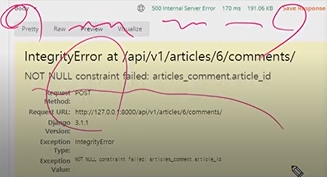
>
> commit = false를 안했을 때 났던 에러가남
>
> url로부터 넘어오는 정보를 drf는 [passing additional attributes to](https://www.django-rest-framework.org/api-guide/serializers/#passing-additional-attributes-to-save)에 나옴

- `articles` > `views.py`

> `serializer.save(article=article)`article필드에 article_pk로 정보를 가져온 article을 넣음!
>
> 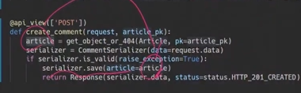
>
> 이렇게 하면 save할때 필수키인 article이 빈값으로 들어가지 않음!

```python
#template없기때문에 render필요없음!
from django.shortcuts import get_object_or_404

#아래모듈 import해옴
from rest_framework import status
from rest_framework.decorators import api_view
from rest_framework.response import Response

from .serializers import ArticleListSerializer,ArticleSerializer,CommentSerializer
from .models import Article,Comment


@api_view(['GET','POST']):
def comment_list_create(reqeust,article_pk):
    article = get_object_or_404(Article,pk=article_pk)
    if request.method == 'GET':
        #아티클 아이디로 모든 댓글 찾아서
        comments = article.comment_set.all()
        #직렬화해서
        serializer = CommentSerializer(comments,many=True)
        #응답함
        return Response(serializer.data)
    #POST(create)
    else:
        #보낸 데이터를 시리얼라이저에 넣어서
        serializer = CommentSerializer(data=request.data)
        #검증하고
        if serializer.is_valid(raise_exception=True):
            #저장하고
            #article필드(필수키)에 article값을 넣어줌
        	serializer.save(article = article)
            #응답함
            return Response(serializer.data, status=status.HTTP_201_CREATED)
```

> 이제는 article값이 바로 들어감!
>
> 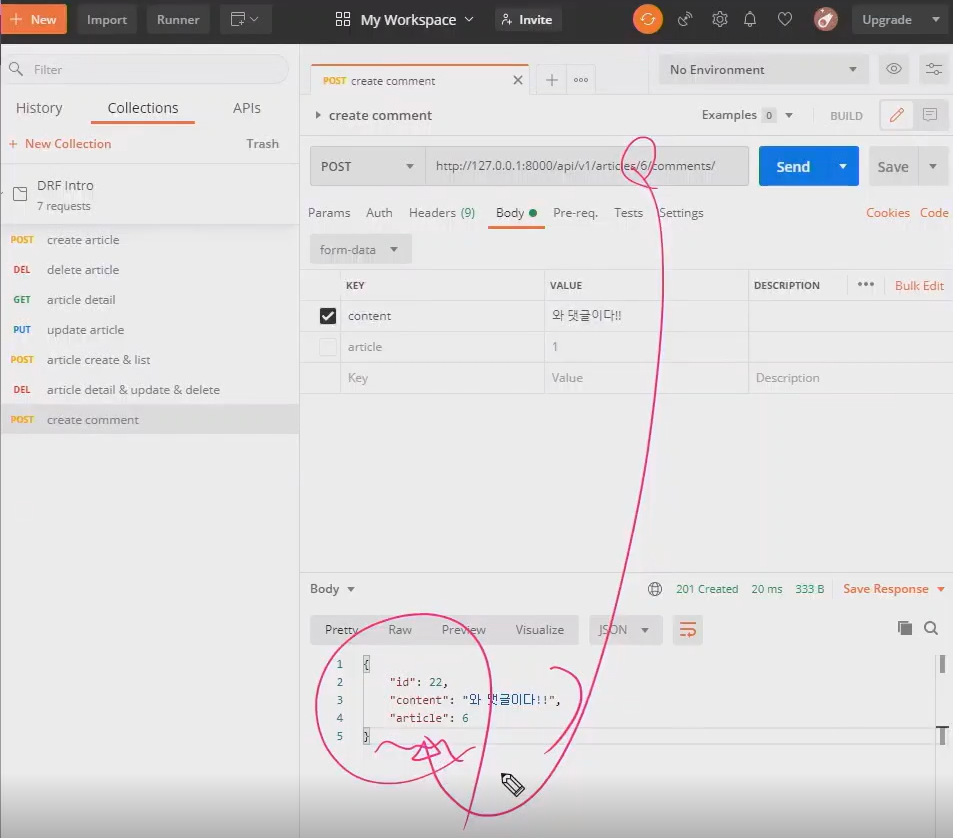

- 한 댓글의 디테일, 수정, 삭제

- `articles` > `urls.py`

```python
#추가
path('comments/<int:comment_pk>/',views.comment_update_delete)
```

- `articles` > `views.py`

```python
@api_view(['GET','PUT','DELETE'])
def comment_update_delete(request,comment_pk):
    comment = get_object_or_404(Comment,pk=comment_pk)
    if request.method =='GET':
        #댓글pk로 comment찾아서
        #직렬화
        #응답
        serializer = CommentSerializer(comment)
        return Response(serializer.data)
    elif request.method == 'PUT':
        #시리얼ㄹ라이저 만들엇
        #data넣어주고,comment넣어주고
        #(검증후)저장한다음
        #응답
        #위치인자로 comment, request.data만 적어도 되는데 그냥 헷갈리지말라고 적어줌
        serializer = CommentSerializer(instance=comment,data=request.data)
        if serializer.is_valid(raise_exception=True):
            serializer.save()
            return Response(serializer.data)
    else:
        #찾은 comment삭제
        #응답
        comment.delete()
        return Response({'id':comment_pk})
```

--------------

#### 관리자 페이지에서 DB반영됐는지 확인하기 위해 작성

- `admin.py`

```python
from django.contrib import admin
from .models import Artist, Comment

admin.site.register(Artist)
admin.site.register(Comment)
```


------------

추가, 이렇게도 할수있다 정도

#### article 디테일 정보에 comment정보도 포함 되게 하고싶다

> **HOW??**
>
> serializers.py를 고쳐야한다!
>
> field를 커스터마이징 해줘야됨

- `articles` > `serializers.py`

> CommentSerializer 밑에 작성

```python
class CommentSerializer(serializers.ModelSerializer):
    class Meta:
        model = Comment
        fields = ('id','content','article',)
        read_only_fields = ('article',) 

class ArticleSerializer(serializers.ModelSerializer):
    #역참조랑 똑같은 이름으로 일부로 함
    comment_set = CommentSerializer(
        many=True,
        read_only=True,
    )
    #장고에서 읽을수없는 이름이라면 어디서 가져올건지 source를 적어줘야됨 source를 적어줘야됨
    # comments = CommentSerializer(many=True,source='comment_set')
    
    comment_count = serializers.IntegerField(
        #위 comment_set에 .count는 serializer에서 쓰는 문법
        source='comment_set.count',
        read_only=True,
    )
    
    #모델폼과 매우 유사함
    class Meta:
        model = Article
        fields = '__all__'
        #장고..customfield를 작성했을 땐 read_only를 하나하나 다 해줘야됨
        # read_only_fields = ('comment_set','comment_count',)
```


-------------

위 코드가 정신없으니 전체 올려봄..

- `api` >`urls.py`

```python
from django.contrib import admin
from django.urls import path, include

urlpatterns = [
    path('admin/', admin.site.urls),
    #api의 버전이라고 생각하면됨, 해당 api의 버전명/articles/...
    path('api/v1/articles/', include('articles.urls')),
]
```

- `articles` > `models.py`

```python
from django.db import models


class Article(models.Model):
    title = models.CharField(max_length=100)
    content = models.TextField()
    created_at = models.DateTimeField(auto_now_add=True)
    updated_at = models.DateTimeField(auto_now=True)


class Comment(models.Model):
    content = models.TextField()
    created_at = models.DateTimeField(auto_now_add=True)
    updated_at = models.DateTimeField(auto_now=True)
    article = models.ForeignKey(Article,on_delete=models.CASCADE)
```

- `articles` > `serializers.py`

```python
from rest_framework import serializers
from .models import Article,Comment

#여러개의 serializer모델을 만들어도됨
#이건 list에서 사용할 serializer이니까 List를 적어둠
class ArticleListSerializer(serializers.ModelSerializer):
    #모델폼과 매우 유사함
    class Meta:
        model = Article
        fields = ('id','title',)


class ArticleSerializer(serializers.ModelSerializer):
    #모델폼과 매우 유사함
    class Meta:
        model = Article
        fields = ('id','title','content','created_at','updated_at',)


class CommentSerializer(serializers.ModelSerializer):

    class Meta:
        model = Comment
        #조회했을때 나올 필드를! read_only_fields를 제외하고 create, update등에서 쓰일예정(fields)
        fields = ('id','content','article',)
        #id값은 원래 read_only이기 때문에 오류가 안남, article은 따로 지정해줘야됨
        #튜플이기때문에 str로 인식해서 에러가 남 그래서 ,를 붙여줘야됨
        #is_valid 검증에서 해당 필드가 없더라도 통과가능
        read_only_fields = ('article',) 
```

- `articles` > `urls.py`

```python
from django.urls import path
from . import views 

#templates를 사용하지 않기때문에 app_name없음

urlpatterns = [
    # path('',views.article_list),
    # path('create/',views.create_article),
    # path('<int:article_pk>/',views.article_detail),
    # path('<int:article_pk>/delete/',views.delete_article),
    # path('<int:article_pk>/update/',views.update_article),
    
    #과감히 url을 명시적으로 만들어보자
    #행위는 제외!
    #계층구조도 포함됨(articles)
    path('',views.article_list_create),
    path('<int:article_pk>/',views.article_detail_update_delete),
    path('<int:article_pk>/comments/',views.comment_list_create),
]
```

- `articles` > `views.py`

```python
#template없기때문에 render필요없음!
from django.shortcuts import get_object_or_404

#아래모듈 import해옴
from rest_framework import status
from rest_framework.decorators import api_view
from rest_framework.response import Response

from .serializers import ArticleListSerializer,ArticleSerializer,CommentSerializer
from .models import Article,Comment

# #DRF에서는 이 데코레이터를 달아주지 않으면 오류가남!
# @api_view(['GET'])
# def article_list(request):
#     #1. 모델에서 데이터를 가져온다(articles는 쿼리셋)
#     articles = Article.objects.all()

#     #2. 모델에서 가져온 데이터를 serializing한다.
#     #many=True라는 걸 통해 여러개의 데이터가 들어간다는걸 알려줌
#     serializer = ArticleListSerializer(articles,many=True)

#     #serializer 자체는 data가 아님 serializer.data를 해야됨
#     #3. 응답해준다(공식문서 Response)
#     return Response(serializer.data)


# #postman 이용, 그냥 홈페이지 요청을 보낼..수있고...저장도 해줘서 여러번 계속 안쳐도됨...?
# #인자가 없는 친구들
# @api_view(['POST'])
# def create_article(request):
#     # print(request.data)
#     serializer = ArticleSerializer(data=request.data)
#     if serializer.is_valid(raise_exception=True):
#         serializer.save()
#         return Response(serializer.data,status = status.HTTP_201_CREATED)


# #아래는 인자가 있는 친구들

# #더미데이터가 있으니 create를 하지않음
# #이제 detail만들어봄
# #상세요청 하나이기 때문에 GET요청
# @api_view(['GET']) #default는 GET 괄호안에 안넣어도됨
# def article_detail(request,article_pk):
#     #결국 모델에 있는데이터를 가져와서 하는건데
#     #위코드와 비슷하지 않을까?
#     #차이점은 pk가 인자로 들어오는것과, 단일 객체이라는것
#     #1. 모델에서 데이터를 가져온다(articles는 쿼리셋)
#     article = get_object_or_404(Article,pk=article_pk)

#     #2. 모델에서 가져온 데이터를 serializing한다.
#     #단일객체 데이터가 들어간다는걸 알려줌
#     serializer = ArticleSerializer(article)

#     #serializer 자체는 data가 아님 serializer.data를 해야됨
#     #3. 응답해준다(공식문서 Response)
#     return Response(serializer.data)

# @api_view(['DELETE'])
# def delete_article(request,article_pk):
#     article = get_object_or_404(Article,pk=article_pk)
#     article.delete()
#     #뭐가 삭제됐는지 알려주려고 id값을 넘겨줌
#     #삭제는 제대로 됐는데 우리가 반환해줄건 없어!
#     return Response({'id': article_pk }, status = status.HTTP_204_NO_CONTENT)


# #업데이트가 가장 복잡!
# @api_view(['PUT'])
# def update_artice(request,article_pk):
#     #create와 로직이 유사함
#     #PUT으로 보낸다고 무조건 수정이 되는게 아니라 밑의 로직을 바꿔줘야되는거얌!
#     #create랑 같은 로직을 쓰면 글이 새로 추가될뿐!
#     #위에 PUT을 넣어준건 이런형태로 들어온다는걸 보여준것일 뿐 로직을 짜야됨
#     #공식문서,,, update할 때는 instance를 넣어줘야됨
#     article = get_object_or_404(Article,pk=article_pk)
#     #instance로 첫번째 인자로 article을 주면 update가 됨!
#     serializer = ArticleSerializer(article,data=request.data)
#     if serializer.is_valid(raise_exception=True):
#         serializer.save()
#         return Response(serializer.data,status = status.HTTP_201_CREATED)


##url 합함.....바뀐코드

@api_view(['GET','POST'])
def article_list_create(request):
    #LIST
    if request.method == 'GET':
        #1. 모델에서 데이터를 가져온다(articles는 쿼리셋)
        articles = Article.objects.all()

        #2. 모델에서 가져온 데이터를 serializing한다.
        #many=True라는 걸 통해 여러개의 데이터가 들어간다는걸 알려줌
        serializer = ArticleListSerializer(articles,many=True)

        #serializer 자체는 data가 아님 serializer.data를 해야됨
        #3. 응답해준다(공식문서 Response)
        return Response(serializer.data)
    
    #GET이 아니라면 POST(create)
    else:
        serializer = ArticleSerializer(data=request.data)
        if serializer.is_valid(raise_exception=True):
            serializer.save()
            return Response(serializer.data,status = status.HTTP_201_CREATED)


@api_view(['GET','PUT','DELETE'])
def article_detail_update_delete(request,article_pk):
    #GET, PUT, DELETE에 중복으로 계속 article 정보를 불러오기 때문에 한번에 처리
    article = get_object_or_404(Article,pk=article_pk)
    #Detail
    if request.method == 'GET':
        serializer = ArticleSerializer(article)
        return Response(serializer.data)
    #Update
    elif request.method == 'PUT':
        serializer = ArticleSerializer(article,data=request.data)
        if serializer.is_valid(raise_exception=True):
            serializer.save()
            return Response(serializer.data,status = status.HTTP_201_CREATED)

    #Delete
    else:
        article.delete()
        return Response({'id': article_pk }, status = status.HTTP_204_NO_CONTENT)


@api_view(['GET','POST']):
def comment_list_create(reqeust,article_pk):
    article = get_object_or_404(Article,pk=article_pk)
    if request.method == 'GET':
        #아티클 아이디로 모든 댓글 찾아서
        comments = article.comment_set.all()
        #직렬화해서
        serializer = CommentSerializer(comments,many=True)
        return Response(serializer.data)
    #POST(create)
    else:
        #보낸 데이터를 시리얼라이저에 넣어서
        #검증하고
        #저장하고
        #응답하자
        serializer = CommentSerializer(data=request.data)
        if serializer.is_valid(raise_exception=True):
            #article필드(필수키)에 article값을 넣어줌
            serializer.save(article = article)
            #응답함
            return Response(serializer.data, status=status.HTTP_201_CREATED)

```


