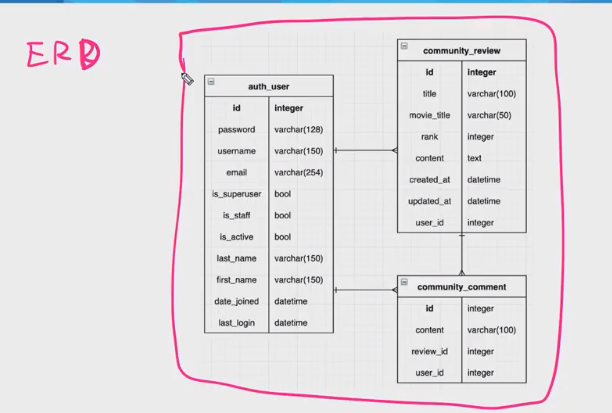

# DB_pjt

>우리가 건드려본적이 없는 파일들(asgi,wsgi -> 통신, 장고가 서버에서 돌아가게 하는 역할)
>
>apps -> accounts의 앱 설정을 하는데 이용됨
>
>`tests.py`를 추가로 다뤄볼거야!
>
>
>
>


## Test

> [공식문서](https://developer.mozilla.org/ko/docs/Learn/Server-side/Django/Testing)
>
> 웹사이트가 성장함에 따라 손으로 일일히 테스트하는 것은 점점 더 어려워진다. 테스트 할 내용이 늘어날 뿐만 아니라, 컴포넌트간의 상호작용도 복잡해지고, 한 쪽의 작은 수정이 다른쪽에 큰 영향을 줄수 있기 때문에, 모든것이 잘 동작할 수 있도록 더 많은 수정이 필요해지며, 그렇게 추가된 수정이 새로운 에러를 유발하지 않도록 확인되어야 한다. 이러한 문제들의 해결책중 하나는, 쉽고 안정적으로 수정사항이 발생할 때마다 실행되는 자동화된 테스트를 작성하는 것이다. 이 튜토리얼은 Django의 테스트 프레임워크를 사용하여 당신의 웹 사이트에 대한 Unit Testing을 자동화하는 방법을 보여줄것이다. 
>
> 게다가, 자동화된 테스트는 당신의 코드의 첫번째 실전 고객으로 역할을 수행하여, 당신의 웹사이트가 어떻게 동작해야하는지 엄격하게 정의하고 문서화하도록 압력을 준다. 종종 이 내용이 당신이 작성하게될 코드 예제나 관련문서의 기초 자료가 된다. 이러한 이유 때문에, 어떤 소프트웨어 개발 프로세스는 테스트 정의와 구현으로 시작되어, 테스트가 요구하는 동작을 충족하도록 코드가 작성되기도 한다. 

### TDD

> 테스트 주도 개발(Test-driven development, **TDD**)은 매우 짧은 개발 사이클을 반복하는 소프트웨어 개발 프로세스 중 하나이다. 우선 개발자는 바라는 향상 또는 새로운 함수를 정의하는 (초기적 결함을 점검하는) 자동화된 테스트 케이스를 작성한다.
>
> 기본적 가이드라인을 미리 그려놔라, 그 선을 따라 개발을 해라


### BDD

> [간략한정리](https://www.popit.kr/bdd-behaviour-driven-development%EC%97%90-%EB%8C%80%ED%95%9C-%EA%B0%84%EB%9E%B5%ED%95%9C-%EC%A0%95%EB%A6%AC/)
>
> BDD는 시나리오를 기반으로 테스트 케이스를 작성하며 함수 단위 테스트를 권장하지 않는다. 이 시나리오는 개발자가 아닌 사람이 봐도 이해할 수 있을 정도의 레벨을 권장


### Test의 종류

> Unit tests (유닛 테스트)
>
> 독립적인 콤포넌트의 (성능이 아닌) 기능적인 동작을 검증한다. 흔히 class나 function 레벨로 수행한다.
>
> Regression tests ( 버그수정 확인 테스트 )
>
> 기존에 보고된 버그들이 재발하는지 테스트한다. 각 테스트는, 먼저 이전에 발생했던 버그가 수정되었는지 체크한 이후에, 버그 수정으로 인해 새롭게 발생되는 버그가 없는지 확인차 재수행하게 된다.
>
> Integration tests ( 통합 테스트 )
>
> 유닛 테스트를 완료한 각각의 독립적인 콤포넌트들이 함께 결합되어 수행하는 동작을 검증한다. 통합 테스트는 콤포넌트간에 요구되는 상호작용을 검사하며, 각 콤포넌트의 내부적인 동작까지 검증할 필요는 없다. 이 테스트는 단지 전체 웹사이트에 걸쳐 각 콤포넌트가 결합하여 수행하는 동작을 대상으로 한다.


### Django가 testing을 위해 제공하는 것

> test가 어떤 역할을 하는지 이름만 보고 알게 해주는 걸 지향
>
> test파일도 원래는 역할별로 분리해서 적음

```python
class YourTestClass(TestCase):
    def setUp(self):
        # Setup run before every test method.
        pass

    def tearDown(self):
        # Clean up run after every test method.
        pass

    def test_something_that_will_pass(self):
        self.assertFalse(False)

    def test_something_that_will_fail(self):
        self.assertTrue(False)
```


### 실제로 TEST를 해보쟈

- pjt로 새로운 프로젝트 생성
- accounts,todos 앱 생성
- `accounts` > `models.py`

> `settings.py`에 `AUTH_USER_MODEL = 'accounts.User'` 적은 뒤, migration함

```python
from django.db import models
from django.contrib.auth.models import AbstractUser
# Create your models here.

class User(AbstractUser):
    phone = models.CharField(max_length=11)

    def __str__(self):
        #Article object(1) / username
        return f'User object ({self.pk})'
```

- `accounts` > `tests.py`

```python
from django.test import TestCase

# Create your tests here.
class AccountTest(TestCase):
    def setUp(self):
        # Setup run before every test method.
        pass

    def tearDown(self):
        # Clean up run after every test method.
        pass

    def test_something_that_will_pass(self):
        self.assertFalse(False)

    def test_something_that_will_fail(self):
        self.assertTrue(False)
```

- test를 하기위해서 gitbash에 아래와 같이 적어주면 

```sh
$ python manage.py test

Creating test database for alias 'default'...
System check identified no issues (0 silenced).
F.
====================================================================== 
#이 test가 실패했다
FAIL: test_something_that_will_fail (accounts.tests.AccountTest)       
----------------------------------------------------------------------
Traceback (most recent call last):
  File "C:\Users\SOOA\Desktop\django\django_test\accounts\tests.py", line 17, in test_something_that_will_fail
    self.assertTrue(False)
 #assert단언하다, 참일거야 라고 했는데, 괄호에 False가 들어있어서 실패했어!
AssertionError: False is not true

---------------------------------------------------------------------- 
#2개의 test가 0.002초만에 돌아갔고
Ran 2 tests in 0.002s
# test1개가 실패했다
FAILED (failures=1)
Destroying test database for alias 'default'...
```

- 그럼 통과를 하려면 `test_something_that_will_fail` 이 함수 괄호에 True를 넣어주면 됨

```python
    def test_something_that_will_fail(self):
        self.assertTrue(True) #여기에 1+1을 넣어줘도 그게 True이기 때문에 True로 적용됨
```

- 그럼, 성공함

```sh
$ python manage.py test
Creating test database for alias 'default'...
System check identified no issues (0 silenced).
..
---------------------------------------------------------------------- 
Ran 2 tests in 0.002s

OK
Destroying test database for alias 'default'..
```


#### Assertion

> [공식문서](https://docs.djangoproject.com/en/3.1/topics/testing/tools/#assertions)

- `assertEqual`

```python
    def test_my_first_test(self):
        #self는 AccountTest를 인스턴스화해서 나온 인스턴스!
        self.assertEqual(1,1+1)#1이랑 1+1이 같니?
```

- assertEqual을 여러개 적더라도 하나라도 실패하면 그 test는 실패!

```sh
$ python manage.py test
Creating test database for alias 'default'...
System check identified no issues (0 silenced).
F
====================================================================== 
FAIL: test_my_first_test (accounts.tests.AccountTest)
---------------------------------------------------------------------- 
Traceback (most recent call last):
  File "C:\Users\SOOA\Desktop\django\django_test\accounts\tests.py", line 21, in test_my_first_test
    self.assertEqual(1,1+1)#1이랑 1+1이 같니?
AssertionError: 1 != 2

---------------------------------------------------------------------- 
Ran 1 test in 0.002s

FAILED (failures=1)
Destroying test database for alias 'default'...
```

- 

```python
 def test_user_model_create(self):
        #user를 생성하는 방법은 암호화과정이 들어가야됨
        #create_user로 생성하는 것을 권장함
        User.objects.create_user(username='testuser',password='password')
        user = User.objects.get(pk=1)
        #이게 같다면 정상적으로 user가 등록된거얌
        self.assertEqual(user.username,'testuser')
```

- 

```sh
$ python manage.py test
Creating test database for alias 'default'...
System check identified no issues (0 silenced).
.
---------------------------------------------------------------------- 
Ran 1 test in 0.094s

OK
Destroying test database for alias 'default'...
```

- `User`model에 적은 `__str__`이 제대로 작동하는지 확인하기 위한 test

```python
   def test_user_str_method(self):
        User.objects.create_user(username='testuser',password='password')
        user = User.objects.get(pk=1)
        self.assertEqual(str(user),'User object (1)')
```

- 제대로 들어감

```sh
$ python manage.py test
Creating test database for alias 'default'...
System check identified no issues (0 silenced).
..
---------------------------------------------------------------------- 
Ran 2 tests in 0.186s

OK
Destroying test database for alias 'default'...
```

- User의 폰번호 길이가 11자인지 확인하는 test

```python
    def test_user_phone_field_max_length(self):
        User.objects.create_user(username='testuser',password='password')
        user = User.objects.get(pk=1)
        max_length = user._meta.get_field('phone').max_length
        self.assertEqual(max_length,11)
```

- 성공

```sh
$ python manage.py test
Creating test database for alias 'default'...
System check identified no issues (0 silenced).
...
---------------------------------------------------------------------- 
Ran 3 tests in 0.267s

OK
Destroying test database for alias 'default'...
```

- 중복된 코드 합치기

> setUp 함수 이용
>
> 모든 test가 실행되기전에 한번씩 계속 실행됨
> 모든 test에 필요한 중복된 코드를 넣어주면 됨(생성을하는 코드는 넣을 수 있지만 변수를 따로 지정해주는건 안됨!

```python
from django.test import TestCase
from .models import User
# Create your tests here.
class AccountTest(TestCase):
    def setUp(self):
         User.objects.create_user(username='testuser',password='password')
        #user은 함수안에서 만들어진 변수이기 때문에 그건 그 함수 내에서만 작동됨!
        #user = User.objects.get(pk=1)


    def test_user_model_create(self):
        #user를 생성하는 방법은 암호화과정이 들어가야됨
        #create_user로 생성하는 것을 권장함
        # User.objects.create_user(username='testuser',password='password')
        user = User.objects.get(pk=1)
        #이게 같다면 정상적으로 user가 등록된거얌
        self.assertEqual(user.username,'testuser')


    def test_user_str_method(self):
        # User.objects.create_user(username='testuser',password='password')
        user = User.objects.get(pk=1)
        self.assertEqual(str(user),'User object (1)')


    def test_user_phone_field_max_length(self):
        # User.objects.create_user(username='testuser',password='password')
        user = User.objects.get(pk=1)
        max_length = user._meta.get_field('phone').max_length
        self.assertEqual(max_length,11)
```

- `base.html` test

```python
    def test_base_template(self):
        #accounts url로 들어감
        response = self.client.get('/accounts/')
        #login에 base에서 작성한 a태그를 그대로 복사해서 넣어도됨
        #지금 요청을 보냈는데, accounts라는 경로에 get요청을 보내고 response에 받아왓는데
        # login값이 있니?라고 물어보는 것
        self.assertContains(response,'<a href="">login</a>')
        #logout은 보여지면 안되니까 확인해봐!
        self.assertNotContains(response,'<a href="">logout</a>')
        #위에 다 적용하고 밑에 적용함, 로그인 시켜줘
        self.client.login(username='testuser',password='password')
        #요청을 다시보냄
        response = self.client.get('/accounts/')
        self.assertContains(response,'<a href="">logout</a>')
        self.assertNotContains(response,'<a href="">login</a>')
```

- `base.html`

```python
<!DOCTYPE html>
<html lang="en">
<head>
  <meta charset="UTF-8">
  <meta name="viewport" content="width=device-width, initial-scale=1.0">
  <title>Document</title>
</head>
<body>
  
    <a href="">logout</a>
  
    <a href="">login</a>
  
  
  
</body>
</html>
```


- 위와 같은 방법으로 todos앱도 test를 해봄

- `todos` >`models.py`

```python
from django.db import models
from django.conf import settings
# Create your models here.
class Todo(models.Model):
    content = models.CharField(max_length=50)
    user = models.ForeignKey(settings.AUTH_USER_MODEL,on_delete=models.CASCADE)
```

- `urls.py`

```python
from django.urls import path
from . import views
app_name='todos'
urlpatterns = [
    path('',views.index,name ='index'),
    path('create/',views.create,name ='create'),
]
```

- `views.py`

```python
from django.shortcuts import render
from .models import Todo
from django.contrib.auth.decorators import login_required
from .forms import TodoForm
# Create your views here.

@login_required
def index(request):
    todos = Todo.objects.all()
    context = {
        'todos':todos,
    }
    return render(request,'todos/index.html',context)

@login_required
def create(request):
    if request.mehtod == 'POST':
        form = TodoForm(request.POST)
        if form.is_valid():
            todo = form.save(commit=False)
            todo.user = request.user
            todo.save()
    else:
        form = TodoForm()
    context = {
        'form':form,
    }
    return render(request,'todos/form.html',context)
```

- `tests.py`

```python
from django.test import TestCase
from accounts.models import User
from todos.models import Todo

# Create your tests here.
class TodoTest(TestCase):
    def setUp(self):
        User.objects.create_user(username='testuser',password='password')

    def test_todo_index(self):
        response = self.client.get('/todos/')
        self.assertEqual(response.status_code,302)
        self.assertEqual(response.url,'/accounts/login/?next=/todos/')

        # User.objects.create_user(username='testuser',password='password')
        self.client.login(username='testuser',password='password')
        response = self.client.get('/todos/')
        #index.html 템플릿을 썼니
        self.assertTemplateUsed(response,'todos/index.html')

    #get요청에 대한 create
    def test_todo_create_get(self):
        self.client.login(username='testuser',password='password')
        #todos경로로 요청함
        response=self.client.get('/todos/create/')
        #todos/form.html이 redering됐는지 확인
        self.assertTemplateUsed(response,'todos/form.html')
        #세세하게 적을수록 더 좋은 test코드가 됨
        self.assertEqual(response.status_code,200)


    #post요청에 대한 create
    def test_todo_create_post(self):
        self.client.login(username='testuser',password='password')
        #데이터가 유효하지 않은 경우
        invalid_data = {
            'content':None
        }
        #다시 그 폼이 있는 위치로 redirect됨
        response = self.client.post('/todos/create/',invalid_data)
        self.assertEqual(response.status_code,200)

        #데이터가 유효한 경우
        valid_data = {
            'content':'test-contnet'
        }
        response = self.client.post('/todos/create/',invalid_data)
        todos = Todo.objects.all()
        #새로운 todo가 생김
        self.assertEqual(len(todos),1)

```


------------

## PJT

> model명과 그 관계를 선으로 표시 1(`|`): N(`<`)
>
> `appname`_`model`이름
>
> auth_user는 기본 User이름, 확장하지 않았단 뜻, 기본유저안에 다 들어가 있음!
>
> 1:N관계를 이용해서 풀면됨!

