# DB

## Database

> 관계형 데이터베이스 관리 시스템
>
> 스키마(schema)
>
> 데이터베이스 구조와 제약 조건(자료의 구조, 표현방법, 관계)에 관련한 전반적인 명세를 기술한 것

- 체계화된 데이터의 모임
- **몇 개의 자료 파일을 조직적으로 통합**하여 **자료 항목의 중복**을 없애고 **자료를 구조화**하여 기억시켜 놓은 자료의 집합체
- RDBMS(관계형 데이터베이스 관리 시스템) : 관계형 모델을 기반으로하는 데이터베이스 관리시스템
  - 종류 : MySQL, SQLite, PostgreSQL, ORACLE, MS SQL
  - 모든 데이터를 2차원 테이블로 표현
  - 테이블은 row(record, tuple)과 column(field, item)으로 이루어진 기본 데이터 저장 단위
  - 상호 관련성을 가진 테이블의 집합
  - 만들거나 이용하기도 비교적 쉽고, 확장이 매우 용이하다.
- 데이터베이스의 이점
  - 데이터 중복 최소화
  - 데이터 무결성 : 정확한 정보를 보장
  - 데이터 일관성
  - 데이터 독립성 : 물리적 독립성과 논리적 독립성
  - 데이터 표준화
  - 데이터 보안 유지

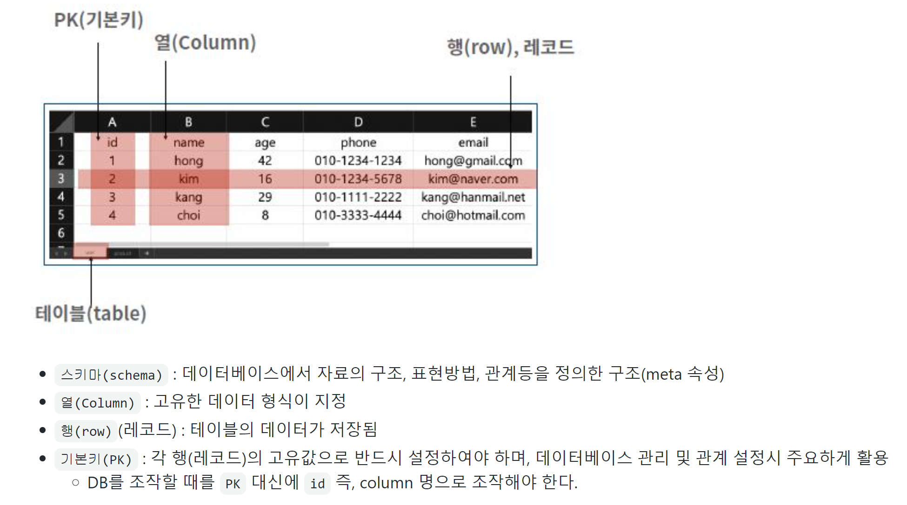

## 1. SQL

> SQL는 관계형 데이터베이스 관리시스템(RDBMS)의 데이터를 관리하기 위해 설계된 특수 목적의 프로그래밍 언어
>
> **sqlite3**
>
> - `.` : sqlite3 프로그램의 기능을 실행하는 것
> - `;` : 세미콜론 까지가 하나의 명령(Query)으로 간주
> - SQL 문법은 소문자로 작성해도 된다. (단, 대문자를 권장)
> - 하나의 DB에는 여러 개의 table이 존재한다.

#### (1) SQL 이란?

- 관계형 데이터베이스 관리시스템(RDBMS)의 데이터를 관리하기 위해 설계된 특수 목적의 프로그래밍 언어
- RDBMS에서 자료의 검색과 관리 데이터베이스 스키마 생성과 수정, 데이터베이스 객체 접근 조정 관리를 위해 고안되었다.


#### (2) SQL 종류

| 언어 | 개념                                       | 예시                                           |
| ---- | ------------------------------------------ | ---------------------------------------------- |
| DDL  | 데이터를 정의하기 위한 언어                | CREATE, DROP, ALTER                            |
| DML  | CRUD와 관련된 언어(저장, 수정, 삭제, 조회) | **INSERT(C), SELECT(R), UPDATE(U), DELETE(D)** |
| DCL  | DB 사용자의 권한 제어를 위해 사용되는 언어 | GRANT, REVOKE, COMMIT, ROLLBAK                 |

```sh
$ sqlite3 tutorial.sqlite3
SQLite version 3.33.0 2020-08-14 13:23:32
Enter ".help" for usage hints. 
sqlite> .databases
main: C:\Users\박수아\Desktop\ssafy\DB\00_sql\tutorial.sqlite3
sqlite> .mode csv
sqlite> .import hellodb.csv examples
sqlite> SELECT * FROM examples;
1,"길동","홍",600,"충청도",010-2424-1232
sqlite> .headers on
sqlite> .mode column
sqlite> SELECT * FROM examples;
id  first_name  last_name  age  country  phone
--  ----------  ---------  ---  -------  -------------
1   길동          홍          600  충청도      010-2424-1232
sqlite> CREATE TABLE classmates (
   ...> id INTEGER PRIMARY KEY,
   ...> name TEXT
   ...> );
sqlite> .tables
classmates  examples
sqlite> DROP TABLE classmates;
sqlite> CREATE TABLE classmates (
   ...> name TEXT,
   ...> age INT,
   ...> adress TEXT
   ...> );
sqlite> INSERT INTO classmates VALUES ('홍길동', 30, '서울'), ('김철수', 23, '대
전'), ('박나래', 23, '광주'), ('이요셉', 33, '구미');
```

`sqlite> SELECT * FROM examples;`examples테이블의 모든 데이터를 가져오세요!


관례 : 이름을 대문자로 씀!

------------------


# SQL과 django ORM

## 기본 준비 사항

```bash
# 폴더구조

TIL
	...
	0X_db
		00_sql # only SQL
			hellodb.csv
			tutorial.sqlite3
			users.csv
		01_sql_orm # SQL + ORM
			...
			users.csv # 해당 디렉토리로 다운로드
```

* django app

  * 가상환경 세팅

  * 패키지 설치

  * migrate

    ```bash
    $ python manage.py sqlmigrate users 0001
    ```

* `db.sqlite3` 활용

  * `sqlite3`  실행

    ```bash
    $ ls
    db.sqlite3 manage.py ...
    $ sqlite3 db.sqlite3
    ```

  * csv 파일 data 로드

    ```sqlite
    sqlite > .tables
    auth_group                  django_admin_log
    auth_group_permissions      django_content_type
    auth_permission             django_migrations
    auth_user                   django_session
    auth_user_groups            auth_user_user_permissions  
    users_user
    sqlite > .mode csv
    sqlite > .import users.csv users_user
    sqlite > SELECT COUNT(*) FROM users_user;
    100
    ```

* 확인

  * sqlite3에서 스키마 확인

    ```sqlite
    sqlite > .schema users_user
    CREATE TABLE IF NOT EXISTS "users_user" ("id" integer NOT NULL PRIMARY KEY AUTOINCREMENT, "first_name" varchar(10) NOT NULL, "last_name" varchar(10) NOT NULL, "age" integer NOT NULL, "country" varchar(10) NOT NULL, "phone" varchar(15) NOT NULL, "balance" integer NOT NULL);
    ```

#### Database 생성

#### sqlite3

```sql
sqlite3 tutorial.sqlite3 -- tutorial.sqlite3 DB 파일 생성 및 조회
.databases -- database 생성
.mode csv -- csv 모드로 변경
.import hellodb.csv examples -- hellodb.csv 파일을 이용한 examples 라는 테이블 생성
```

#### 테이블 전체 조회

```sql
SELECT * FROM examples; -- 테이블 전체 조회
1,"길동","홍",600,"충청도",010-2424-1232
```

#### 출력 형태 변경

```sql
.headers on
.mode column
SELECT * FROM examples;
id          first_name  last_name   age         country     phone
----------  ----------  ----------  ----------  ----------  -------------
1           길동          홍           600         충청도       010-2424-1232
```


-------------

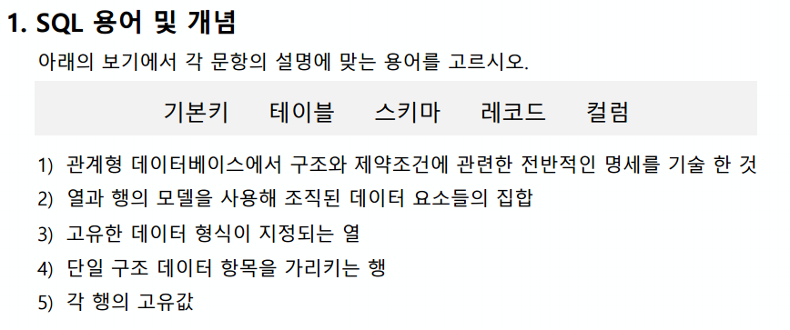

```sh
(1) 스키마 
(2) 테이블 
(3) 컬럼 
(4) 레코드 
(5) 기본키
```


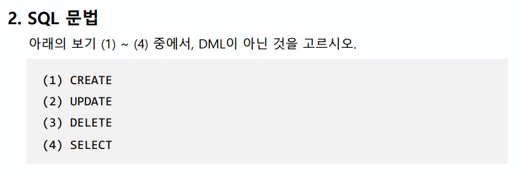

```sh
(1)
```


```sh
RDBMS: 스키마가 있음, 
관계형 데이터 저장, 테이블 관리, 스키마로 규격화되어있기 때문에 탐색이 빠르다 -- MySQL, SQLite

NOSQL: 스키마가 없음, 메모장느낌, 데이터 스키마를 결정짓지 못할 때 사용,
비관계형 데이터 저장(사진, 영상 등에 특화), 컬렉션 관리, 스키마가 없기 때문에 비교적 자유로운 자료 관리가 가능하지만, 규격화된 결과를 얻기 어렵다 -- MongoDB, Cassand, Redis
```

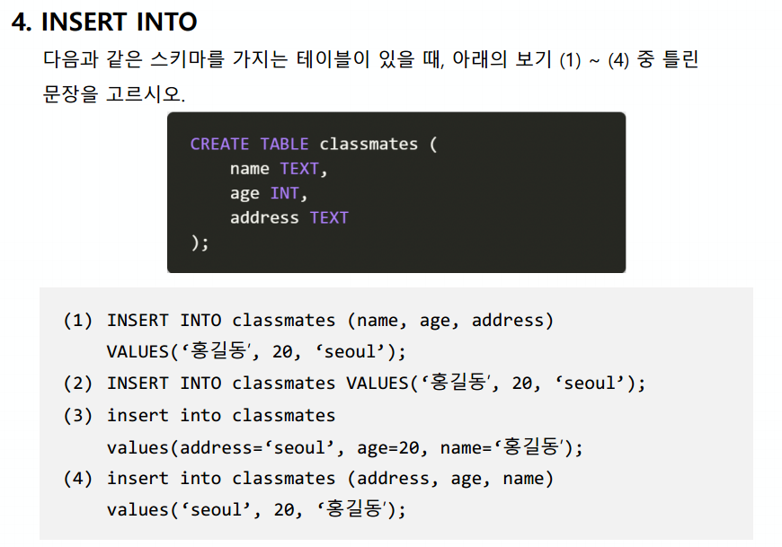

```sh
(3)
```

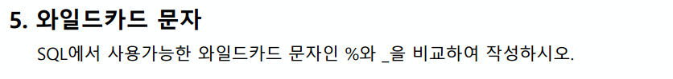

```sh
`%`은 그 자리에 0이상의 문자가 들어감을 의미
`_`는 딱 하나의 문자가 들어간다는 것을 의미한다
```


---------

### SQL 기본

```sql
-- 테이블 생성
CREATE TABLE classmates (
  name TEXT NOT NULL,
  age INT NOT NULL,
  address TEXT NOT Null
);

-- 테이블 삭제
DROP TABLE classmates;

-- 테이블 명 변경
ALTER TABLE classmates RENAME TO news;

-- 컬럼 추가
ALTER TABLE classmates ADD COLUMN created_at TEXT NOT NULL DEFAULT 1;

-- 데이터 생성
INSERT INTO classmates VALUES ('홍길동', 23, '유성구');


-- 데이터 조회

-- 모든 데이터
SELECT * FROM classmates;

-- 특정 컬럼만
SELECT name, age FROM classmates;

-- 개수 제한
SELECT name, age FROM classmates LIMIT 10;

-- 특정 위치에서부터 가져오기
SELECT name, age FROM classmates LIMIT 10 OFFSET 2;

-- 조건을 통해 가져오기
SELECT rowid, name FROM classmates WHERE address='유성구';

-- 중복 없이 가져오기
SELECT DISTINCT age FROM clasmates;

-- 데이터 삭제
DELETE FROM classmates WHERE rowid=4;

-- 데이터 수정
UPDATE classmates SET name='홍길동', address='제주' WHERE rowid=4;


-- WHERE 심화
-- WHERE 조건
SELECT * FROM users WHERE age>=30;
SELECT age, last_name FROM users WHERE age>=30 and last_name='김';

-- 갯수 세기
SELECT COUNT(*) FROM users;

-- 평균 구하기
SELECT AVG(age) FROM users WHERE age>=30;

-- 최소, 최대 : MIN, MAX

-- 와일드카드 LIKE
SELECT * FROM users WHERE age LIKE '2_';
SELECT * FROM users WHERE phone LIKE '02-%';

-- 정렬
SELECT * FROM users ORDER BY age ASC LIMIT 10;
SELECT last_name, first_name FROM users ORDER BY balance DESC LIMIT 10;

-- GROUP BY
SELECT last_name, COUNT(*) AS name_count FROM users GROUP BY last_name;
```


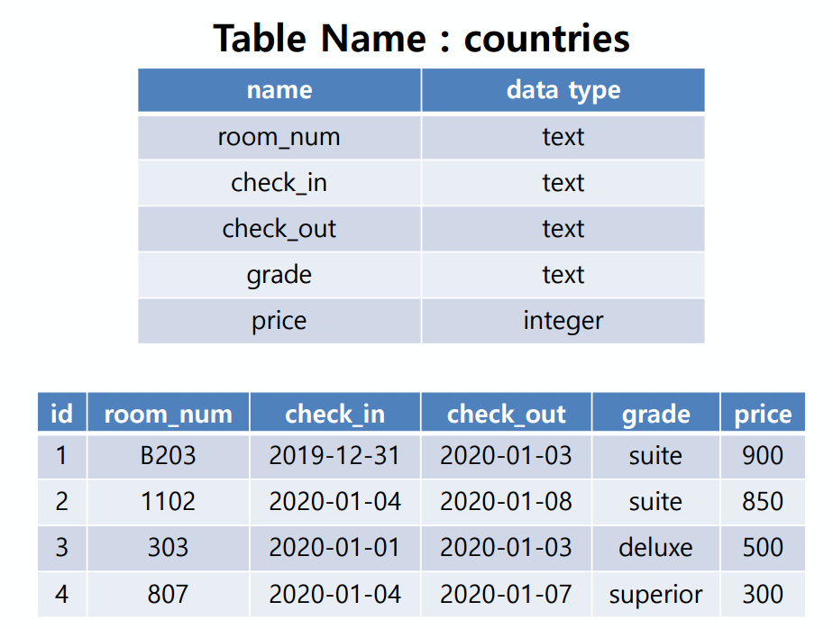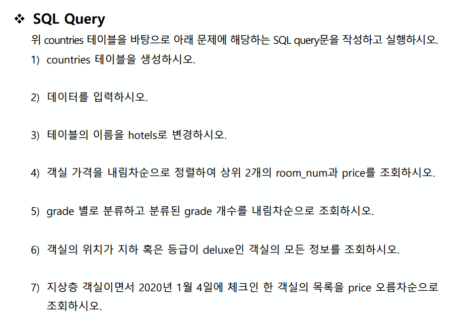

### 1. countries 테이블을 생성하시오

```sqlite
CREATE TABLE countries (
    room_num TEXT NOT NULL,
    check_in TEXT NOT NULL,
    check_out TEXT NOT NULL,
    grade TEXT NOT NULL,
    price INTEGER NOT NULL
);
```


### 2. 데이터를 입력하시오.

```sqlite
INSERT INTO countries VALUES ('B203', '2019-12-31', '2020-01-03', 'suite', 900), 
('1102', '2020-01-04', '2020-01-08', 'suite', 850), 
('303', '2020-01-01', '2020-01-03', 'deluxe', 500, 
('807', '2020-01-04', '2020-01-07', 'superior', 300);
```


### 3. 테이블의 이름을 hotels로 변경하시오.

```sqlite
ALTER TABLE countries RENAME TO hotels
```


### 4. 객실 가격을 내림차순으로 정렬하여 상위 2개의 room_num과 price를 조회하시오.

```sqlite
SELECT room_num, price FROM hotels ORDER BY price DESC LIMIT 2;
B203|900
1102|850
```


### 5. grade 별로 분류하고 분류된 grade 개수를 내림차순으로 조회하시오.

```sqlite
SELECT grade, count(grade) FROM hotels GROUP BY grade ORDER BY count(grade) DESC;
suite|2
superior|1
deluxe|1
```


### 6. 객실의 위치가 지하 혹은 등급이 deluxe인 객실의 모든 정보를 조회하시오.

```sqlite
SELECT * FROM hotels WHERE grade='deluxe' or room_num LIKE 'B%';
B203|2019-12-31|2020-01-03|suite|900
303|2020-01-01|2020-01-03|deluxe|500
```


### 7. 지상층 객실이면서 2020년 1월 4일에 체크인 한 객실의 목록을 price 오름차순으로 조회하시오.

```sqlite
SELECT * FROM hotels WHERE (check_in='2020-01-04') and (room_num NOT LIKE 'B%') ORDER BY price;
807|2020-01-04|2020-01-07|superior|300
1102|2020-01-04|2020-01-08|suite|850
```


## 문제

> 아래의 문제들을 보면서 서로 대응되는 ORM문과 SQL문을 작성하시오.
>
> **vscode 터미널을 좌/우로 나누어 진행하시오. (sqlite / shell_plus)**

`.headers on` 을 켜고 작성해주세요.


### 1. 기본 CRUD 로직

1. 모든 user 레코드 조회

   ```python
   # orm
   User.objects.all()
   ```

      ```sql
   -- sql
   SELECT * FROM users_user;
      ```

2. user 레코드 생성

   ```python
   # orm
   User.objects.create(
      ...: first_name='길동',
      ...: last_name='홍',
      ...: age=100,
      ...: country='제주도',
      ...: phone='1234',
      ...: balance=10000,
      ...: )
   ```

   ```sql
   -- sql
   --모든칼럼 다 쓸때
   INSERT INTO users_user VALUES (102, '길동', '홍', 100, '제주도', '010-1234-4567', 100000);
   --아이디빼고 다른 컬럼을 명시해주게 되면, 그것만 적으면 됨
   INSERT INTO "users_user" ("first_name", "last_name", "age", "country", "phone", "balance")
   VALUES ('길동', '홍', 100, '제주도', '1234', 10000);
   ```

   * 하나의 레코드를 빼고 작성 후 `NOT NULL` constraint 오류를 orm과 sql에서 모두 확인 해보세요.

3. 해당 user 레코드 조회

   - `101` 번 id의 전체 레코드 조회

   ```python
   # orm
   User.objects.get(pk=101)
   ```

   ```sql
   -- sql
   SELECT * FROM users_user WHERE id=101;
   ```

4. 해당 user 레코드 수정

   - ORM: `101` 번 글의 `last_name` 을 '김' 으로 수정
   - SQL: `101` 번 글의 `first_name` 을 '철수' 로 수정

   ```python
   # orm
   user.last_name
   Out[5]: '홍'
   
   In [6]: user.last_name = '김'
   
   In [7]: user.save() #save()했을 떄 한번만 수정됨
   UPDATE "users_user"
      SET "first_name" = '길동',
          "last_name" = '김',
          "age" = 100,
          "country" = '제주도',
          "phone" = '1234',
          "balance" = 10000
    WHERE "users_user"."id" = 101
   ```

      ```sql
   -- sql
   sqlite> INSERT INTO users_user VALUES (102, 
   '길동', '홍', 100, '제주도', '010-1234-4567', 100000);
   sqlite> UPDATE users_user SET last_name=' ' 
        WHERE id=101;
   sqlite> SELECT * FROM users_user WHERE id=0 
   1;
   id,first_name,last_name,age,country,phone,balance
   101,"길동","홍",100,"제주도",1234,10000     
   sqlite>
      ```

5. 해당 user 레코드 삭제

   - ORM: `101` 번 글 삭제
   - `SQL`:  `101` 번 글 삭제 (ORM에서 삭제가 되었기 때문에 아무런 응답이 없음)

   ```python
   # orm
    user = User.objects.get(pk=101)     
   SELECT "users_user"."id",
          "users_user"."first_name",
          "users_user"."last_name",
          "users_user"."age",
          "users_user"."country",
          "users_user"."phone",
          "users_user"."balance"
     FROM "users_user"
    WHERE "users_user"."id" = 101
    LIMIT 21
   
   Execution time: 0.001000s [Database: default]
   
   In [9]: user.delete()
   DELETE
     FROM "users_user"
    WHERE "users_user"."id" IN (101)
   
   Execution time: 0.099942s [Database: default]
   Out[9]: (1, {'users.User': 1})
   ```

   ```sql
   -- sql
   DELETE FROM users_user WHERE id=101
   ```


---


### 2. 조건에 따른 쿼리문

1. 전체 인원 수 

   - `User` 의 전체 인원수

   ```python
   # orm
    len(User.objects.all())
   ```

   ```sql
   -- sql
   SELECT COUNT(*) FROM users_user;
   ```

2. 나이가 30인 사람의 이름

   - `ORM` : `.values` 활용
     - 예시: `User.objects.filter(조건).values(컬럼이름)`

   ```python
   # orm
   User.objects.filter(age=30).values('first_name')
   ```

      ```sql
   -- sql
    SELECT first_name FROM users_user WHERE age=30;
      ```

3. 나이가 30살 이상인 사람의 인원 수

   -  ORM: `__gte` , `__lte` , `__gt`, `__lt` -> 대소관계 활용

   | 키워드           | 설명                                  | 사용예시                                                     |
   | ---------------- | ------------------------------------- | ------------------------------------------------------------ |
   | `__lt` /` __gt`  | 보다 작다 / 보다 크다                 | id가 1보다 큰 자료 검색<br />`Department.objects.filter(id__gt=1)` |
   | `__lte`/ `__gte` | 같거나 보다 작다/ 같거나 보다 크다    | x                                                            |
   | `__in`           | 주어진 리스트 안에 존재하는 자료 검색 | id가 2,3,5,인 자료 검색<br />`Department.objects.filtr(id__in=[2,3,5])` |

   ```python
   # orm
   User.objects.filter(age__gte=30).count()
   ```

      ```sql
   -- sql
   SELECT COUNT(*) FROM users_user WHERE age>=30;
      ```

4. 나이가 20살 이하인 사람의 인원 수 

   ```python
   # orm
   User.objects.filter(age__lte=20).count()
   ```

   ```sql
   -- sql
   SELECT COUNT(*) FROM users_user WHERE age<=20;
   ```

5. 나이가 30이면서 성이 김씨인 사람의 인원 수

   ```python
   # orm
   User.objects.filter(age=30, last_name='김').count()
   ```

      ```sql
   -- sql
   SELECT COUNT(*) FROM users_user WHERE age=30 AND last_name='김';
      ```

6. 나이가 30이거나 성이 김씨인 사람?

   ```python
   # orm
   from django.db.models import Q
   User.objects.filter(Q(age=30)|Q(last_name='김')).count()
   ```

   ```sql
   -- sql
   SELECT COUNT(*) FROM users_user WHERE age=30 OR last_name='김';
   ```

7. 지역번호가 02인 사람의 인원 수

   - `ORM`: `__startswith` 

   ```python
   # orm
   User.objects.filter(phone__startswith='02-').count()
   ```

      ```sql
   -- sql
   SELECT COUNT(*) FROM users_user WHERE phone LIKE '02-%';
      ```

8. 거주 지역이 강원도이면서 성이 황씨인 사람의 이름

   ```python
   # orm
   USer.pbjects.filter(country='강원도', last_name='황').values('first_name')
   ```

   ```sql
   -- sql
      SELECT first_name FROM users_user WHERE country='강원도' AND last_name='황';
   ```

   


---


### 3. 정렬 및 LIMIT, OFFSET

1. 나이가 많은 사람순으로 10명

   ```python
   # orm #내림차순 정렬하고 싶다면 앞에 '-'붙이면 됨
   User.objects.order_by('-age')[:10]
   ```

      ```sql
   -- sql
   SELECT * FROM users_user ORDER BY age DESC LIMIT 10;
      ```

2. 잔액이 적은 사람순으로 10명

   ```python
   # orm
   User.objects.order_by('balance')[:10]
   ```

      ```sql
   -- sql
   SELECT * FROM users_user ORDER BY balance ASC LIMIT 10;
      ```

3. 잔고는 오름차순, 나이는 내림차순으로 10명?

   ```python
   # orm
   User.objects.order_by('balance','-age')[:10]
   ```

   ```sql
    -- sql
      SELECT * FROM users_user ORDER BY balance ASC, age DESC LIMIT 10;
   ```

   

4. 성, 이름 내림차순 순으로 5번째 있는 사람

   ```python
   # orm
   User.objects.order_by('-last_name','-first_name')[4]
   ```

   ```sql
   -- sql
      SELECT * FROM users_user ORDER BY last_name DESC, first_name DESC LIMIT 1 OFFSET 4;
   ```

   


---


### 4. 표현식

> ORM: `aggregate` 사용
>
> https://docs.djangoproject.com/en/2.2/topics/db/aggregation/#aggregation
>
> - '종합', '합계' 등의 사전적 의미
> - 특정 필드 전체의 합, 평균 등을 계산할 때 사용

1. 전체 평균 나이

   ```python
   # orm
   from django.db.models import Avg
   User.objects.aggregate(AVG('age'))
   ```

      ```sql
   -- sql
   SELECT AVG(age) FROM users_user;
      ```

2. 김씨의 평균 나이

   ```python
   # orm
   User.objects.filter(last_name='김').aggregate(AVG('age'))
   ```

      ```sql
   -- sql
   SELECT AVG(age) FROM users_user WHERE last_name='김';
      ```

   

3. 강원도에 사는 사람의 평균 계좌 잔고

   ```python
   # orm
   User.objects.filter(country='강원도').aggregate(AVG('balance'))
   ```

   ```sql
   -- sql
   SELECT AVG(balance) FROM users_user WHERE country='강원도';
   ```

4. 계좌 잔액 중 가장 높은 값

   ```python
   # orm
   from django.db.models import Max
   User.objects.aggregate(Max('balance'))
   #aggregate말고 다르게 적는다면
   user = USER.objects.order_by('-balance').first() #or [0]
   ```

      ```sql
   -- sql
   SELECT MAX(balance) FROM users_user;
      ```

5. 계좌 잔액 총액

   ```python
   # orm
   from django.db.models import Sum
   User.objects.aggregate(Sum('balance'))
   ```

      ```sql
   -- sql
   SELECT SUM(balance) FROM users_user;
      ```


------------

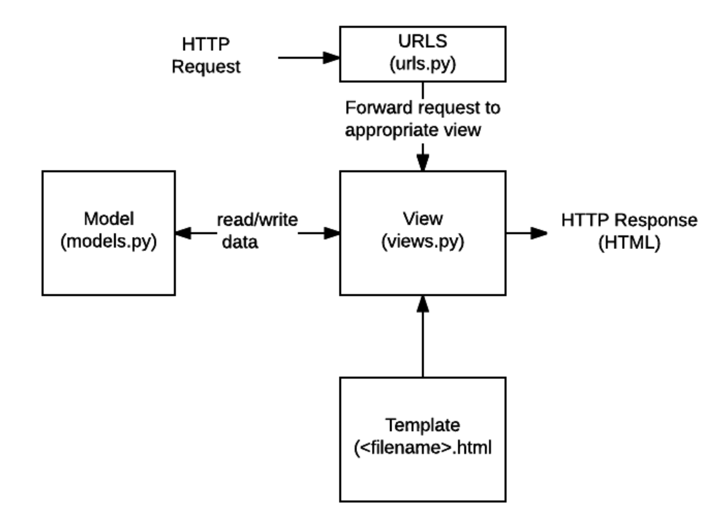

## Model

- 데이터에 대한 단 하나의 정보 소스
- 저장된 데이터베이스의 구조를 의미
- 장고는 모델을 통해 데이터에 접속하고 관리
- 사용자가 저장하는 데이터들의 필수적인 필드들과 동작들을 포함
- 일반적으로 각각의 모델은 하나의 데이터베이스 테이블에 매핑

- 모델은 데이터베이스와 다른 것이다


## 데이터베이스

- 체계화된 데이터의 모임

- 기본구조

- 스키마(뼈대)

  - 데이터베이스의 구조와 제약조건(자료의 구조, 표현 방법, 관계)에 관련한 전반적인 명세를 기술한 것

- 테이블

  - 열(컬럼/필드)과 행(레코드/값)의 모델을 사용해 조작된 데이터 요소들의 SQL데이터베이스에서는 테이블을 관계라고도 함

  - 필드/컬럼/속성/열 : 고유한 데이터 형식이 지정됨 ex) int, text, null(값이 없음)

  - 레코드/행/튜플 : 테이블의 데이터는 행에 저장

  - PK(기본키) : 각 행(레코드)의 고유값으로 Primary Key로 불림, 반드시 설정하여야 하며, 데이터베이스 관리 및 관계 설정시 주요하게 활용(데이터의 무결성)

    

## 쿼리

- 데이터를 조회하기 위한 명령어

- 조건에 맞는 데이터를 추출하거나 조작하는 명령어


## ORM

> 'object-Relational-Mapping'은 객체 지향 프로그래밍 언어를 사용하여 호환되지 않는 유형의 시스템간에(Django-SQL)데이터를 변환하는 프로그래밍 기술
>
> 이것은 프로그래밍 언어에서 사용할 수 있는 가상 객체 데이터베이스를 만들어 사용함
>
> 장고는 파이썬을 이용하고 데이터베이스는 SQL을 사용하는데 이것을 변환하여 사용할 수 있게 장고가 ORM을 통해 DB를 조작할 수 있음!


- 장점
  - SQL을 잘 알지 못해도 DB조작이 가능
  - SQL의 절차적 접근(순서중요)이 아닌 객체 지향적 접근으로 인한 높은 생산성
- 단점
  - ORM만으로 완전한 서비스를 구현하기 어려운 경우가 있음
  - 규모가 커지거나 복잡해질 때.
- 현대 웹 프레임워크의 요점은 웹 개발의 속도를 높이는 것(생산성)
- 데이터베이스를 객체로 사용하기 위해 ORM을 사용한다!

## Migrations

> 장고가 모델에 생긴 변화를 반영하는 법

- django가 model에 생긴 변화(필드를 추가했다던가 모델을 삭제했다던가 등)을 반영하는 방법

- 마이그레이션 실행 및 DB 스키마를 다루기 위한 몇가지 명령어

- `makemigrations`, `migrate`가 중요 필수!!

- 우리가 만든 클래스로 migrations를 만들고, migrate로 DB를 만듦

- `makemigrations`

  - model을 변경한 것에 기반한 새로운 마이그레이션(설계도)을 만들 때 사용
  - 모델을 활성화 하기 전에 DB설계도를 작성
  - 생성된 마이그레이션 파일은 데이터베이스 스키마를 위한 버전 관리 시스템이라고 생각
  - 모델의 변경사항을 기록을 해두는 역사라고 생각하면 됨
  - 데이터베이스가 비어있음(migrate를 해야 채워짐)

  ```sh
  $ python manage.py makemigrations
  Migrations for 'articles':
    articles\migrations\0001_initial.py
      - Create model Article
  
  $ python manage.py makemigrations
  Migrations for 'articles':
    articles\migrations\0002_article_updated_at.py
      - Add field updated_at to article
  ```

  

- `migrate`

  - 작성된 마이그레이션 파일들을 기반으로 실제 DB에 반영
  - `db.sqlite3`라는 데이터베이스 파일에 테이블을 생성
  - 모델에서의 변경 사항들과 DB의 스키마가 동기화를 이룸
  - 빈 DB를 채워줌

  ```sh
  $ python manage.py migrate
  
  테이블이 만들어짐(기존에 있는 것들 + 우리가 만든 것들)
  --
  Running migrations:
    Applying contenttypes.0001_initial... OK
    Applying auth.0001_initial... OK
    Applying admin.0001_initial... OK
    Applying admin.0002_logentry_remove_auto_add... OK
    Applying admin.0003_logentry_add_action_flag_choices... OK
    Applying articles.0001_initial... OK
    Applying articles.0002_article_updated_at... OK
    Applying contenttypes.0002_remove_content_type_name... OK
    Applying auth.0002_alter_permission_name_max_length... OK
    Applying auth.0003_alter_user_email_max_length... OK
    Applying auth.0004_alter_user_username_opts... OK
    Applying auth.0005_alter_user_last_login_null... OK
    Applying auth.0006_require_contenttypes_0002... OK
    Applying auth.0007_alter_validators_add_error_messages... OK
    Applying auth.0008_alter_user_username_max_length... OK
    Applying auth.0009_alter_user_last_name_max_length... OK
    Applying auth.0010_alter_group_name_max_length... OK
    Applying auth.0011_update_proxy_permissions... OK
    Applying auth.0012_alter_user_first_name_max_length... OK
    Applying sessions.0001_initial... OK
  ```

  - `appname_classname`으로 테이블들이 만들어짐

  - 테이블과  그 아래엔 스키마가 있다

  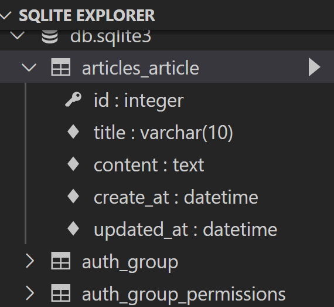

- sqlmigrate

  - 마이그레이션에 대한 SQL구문을 보기 위해 사용
  - 해당 마이그레이션 파일이 SQL문으로 어떻게 해석되어서 동작할지 미리 확인 하기 위한 명령어

  ```sh
  $ python manage.py sqlmigrate articles 0001
  --
  db의 sql문을 보여줌
  
  BEGIN;
  --
  -- Create model Article
  --
  CREATE TABLE "articles_article" ("id" integer NOT NULL PRIMARY KEY AUTOINCREMENT, "title" varchar(10) NOT NULL, "content" text NOT NULL, "create_at" datetime NOT NULL);
  COMMIT;
  ```

- showmigrations

  - 프로젝트 전체의 마이그레이션과 각각의 상태를 확인하기 위해 사용
  - 마이그레이션 파일들의 migrate 여부를 확인하기 위한 명령어
  - migration이 안됐다면 체크됨

  ```sh
  $ python manage.py showmigrations
  admin
   [X] 0001_initial
   [X] 0002_logentry_remove_auto_add
   [X] 0003_logentry_add_action_flag_choices
  articles
   [X] 0001_initial
   [X] 0002_article_updated_at
  auth
   [X] 0001_initial
   [X] 0002_alter_permission_name_max_length
   [X] 0003_alter_user_email_max_length
   [X] 0004_alter_user_username_opts
   [X] 0005_alter_user_last_login_null
   [X] 0006_require_contenttypes_0002
   [X] 0007_alter_validators_add_error_messages       
   [X] 0008_alter_user_username_max_length
   [X] 0009_alter_user_last_name_max_length
   [X] 0010_alter_group_name_max_length
   [X] 0011_update_proxy_permissions
   [X] 0012_alter_user_first_name_max_length
  contenttypes
   [X] 0001_initial
   [X] 0002_remove_content_type_name
  sessions
   [X] 0001_initial
  ```

  ## Model의 중요 3단계

  > 가장 중요한 핵심

  1. models.py : 변경사항(작성, 수정, 삭제...) 발생

  `python manage.py makemigrations`

  2. makemigrations : 마이그레이션(설계도) 만들기

  `python manage.py migrate`

  3. migrate : DB에 적용

## DB API

- django가 기본적으로 ORM을 제공함에 따른 것으로 DB를 편하게 조작할 수 있도록 도와줌
- Model을 만들면 django는 객체들을 만들고 읽고 수정하고 지울 수 있는(CRUD) database-abstract API를 자동으로 만듦


#### DB API 구문-Making Queries


- Article(Class Name)
- objects(Manager)
  - 중간소통역할
  - 명령어 고정, article과 all만 원하는 것에 따라 바뀜
  - django 모델에 데이터베이스 query작업이 제공되는 인터페이스
  - 기본적으로 모든 django 모델 클래스에 objects라는 manager를 추가
- all(QuerySet API)
  - 데이터베이스로부터 전달받은 `객체` 목록
  - queryset 안의 객체는 0개, 1개 혹은 여러 개일 수 있음
    - 전달받는게 없을지라도 데이터타입은 queryset이다!
  - 데이터베이스로부터 조회, 필터, 정렬 등을 수행 할 수 있음
  - 데이터베이스 조작을 위한 다양한 QuerySet API method들은 해당 공식문서를 반드시 참고!

## CRUD

> create, read, update, delete

- 대부분 컴퓨터 소프트웨어가 가지는 기본적인 데이터 처리 기능인 Create(생성), Read(읽기), Update(갱신), Delete(삭제)를 묶어서 일컫는 말

### CREATE

> 데이터를 작성하는 3가지 방법

1. 첫번째 방법
   - `article = Article()`: 모델 클래스로부터 인스턴스 생성
   - article 인스턴스로 클래스 변수에 접근해 해당 인스턴스 변수를 변경(`article.title = 'first'`)
   - 여기까진 아직 데이터베이스에 저장이 안됨
   - `article.save()`메서드 호출 -> db에 실제로 저장이 끝

2. 두번째 방법
   - 클래스로 인스턴스 생성 시 keyword인자를 함께 작성
   - `article = Article(title='second', content='django!')`
   - `article.save()`메서드 호출-> db에 실제로 저장이 끝
3. 세번째 방법
   - `create()`메서드를 사용하면 쿼리셋 객체를 생성하고 save하는 로직이 한번의 step으로 가능
   - `Article.objects.create(title='third', content='django!!')`

> CRUD를 하기 위해 DB API를 하고 있음

```sh
$ pip install ipython django-extensions
```

- 설치 후 `settings.py`에 추가해줌(`ipython`은 추가안해도 됨)

```python
INSTALLED_APPS = [
    'articles',
    'django_extensions',
```

- 필요한 모듈이 자동으로 import됨
  - `shell`만 치면 import를 직접 쳐서 불러옴

```sh
$ python manage.py shell_plus
```

- `.all()`: 전체를 조회, 전부 다 보여줘

```sh
In[1]: Article.objects.all()
Out[1]: <QuerySet []>
```

#### 첫 번째 방법

``` sh
#게시글 작성이라고 생각하면 됨
In [2] : article = Article() #인스턴스를 만들어줌
In [3]: article
Out[3]: <Article: Article object (None)> #None은 PK값 아직 값이 없기 때문
In [4] : article.title = 'first'
In [5]: article.content = 'django!'
In [7]: article
Out[7]: <Article: Article object (None)>
In [8]: article.save() #이거를 반드시 적어줘야됨 그래야 저장이 됨
In [9]: article
Out[9]: <Article: Article object (1)> #PK가 1이됨
```

#### 두 번째 방법

- 키워드인자로 한번에 침

```sh
In [1]: article = Article(title='second', content='django!')
In [2]: article
Out[2]: <Article: Article object (None)>
In [3]: article.save()
In [4]: article
Out[4]: <Article: Article object (2)> #아까 1을 만들어서 자동을 2번이 됨

In [5]: article.pk #장고에서는 id보다는 pk로 쓰는것을 권장(article.id = article.pk 같은 것이다)
Out[5]: 2

In [6]: article.title
Out[6]: 'second'

In [7]: article.content
Out[7]: 'django!
```

#### 3번째 방법

```sh
In [8]: Article.objects.create(title='third', content='django!!')
Out[8]: <Article: Article object (3)>
```


- CRUD를 하기 위해 DB를 object로 관리한다
- 저장된 object를 볼 수 있다

```sh
In [9]: Article.objects.all()
Out[9]: <QuerySet [<Article: Article object (1)>, <Article: Article object (2)>, <Article: Article object (3)>]>
```

- object를 사람이 읽을 수 있는 문자열로 바꿔보자!
  - `articles`폴더의 `models.py`에 들어가 `class` 안에 함수(`__str__`)를 만들어줌
  - 이건 makemigrations 해도 변경사항이 없다
  - 보통은 인스턴스의 첫번째 클래스변수로 지정, 편한대로 해도됨
  - `return f'{self.pk}번글의 제목은 {self.title}'` 이렇게 해도됨

```python
class Article(models.Model):
    title = models.CharField(max_length=10)
    content = models.TextField()
    create_at = models.DateTimeField(auto_now_add=True) 
    updated_at = models.DateTimeField(auto_now=True) 
	def __str__(self):
        return self.title 
```

- 만든 뒤 shell_plus를 껐다가(`exit`) 다시 켜야 됨
- object들이 구별할 수 있게 각 title로 변경됨

```sh
In [1]: Article.objects.all()
Out[1]: <QuerySet [<Article: first>, <Article: second>, <Article: third>]>
```

### READ

### `all()`

- `QuerySet` return
- 리스트는 아니지만 리스트와 거의 비슷하게 동작(조작할 수 있음)

### `get()`

- `QuerySet` return아님 
- 객체가 없으면 `DoesNotExist`에러가 발생
- 객체가 여러개일 경우는 `MultipleObjectReturned` 에러가 발생
- 위와 같은 특징을 가지고 있기 때문에 unique한 값(`ex) pk`) 혹은 Not Null 특징을 가지고 있으면 사용할 수 있다.
- 쿼리셋이 아니라 하나의 object로 리턴함(리턴이 있는 건 변수에 할당이 가능하다는 말)

### `filter()`

- 지정된 조회 매개 변수와 일치하는 객체를 포함하는 `QuerySet`을 return
- 값이 없어도 `None`을 return하는 것이 아니라 빈 `QuerySet`을 return함

```sh
In [2]: Article.objects.get(pk=1)
Out[2]: <Article: first>
#Null 값일 때 뜨는 오류
DoesNotExist: Article matching query does not exist
#값이 여러 개일 때 뜨는 오류
MultipleObjectsReturned: get() returned more than one Article -- it returned 2!
#여러 개일 때 조회하려면 filter()사용-찾는게 없어도 무조건 쿼리셋
In [7]: Article.objects.filter(content='django!')
Out[7]: <QuerySet [<Article: first>, <Article: second>]>
#조회하려는 값이 없어도 퀴리셋 리턴!!!
In [8]: Article.objects.filter(content='django!!!!!')
Out[8]: <QuerySet []> 
```


### Update

> 수정이 가장 어려움...

- 1번글 선택

```sh
#1번글 선택
In [10]: article = Article.objects.get(pk=1)
#선택됐는지 확인
In [11]: article.pk
Out[11]: 1
In [12]: article
Out[12]: <Article: first>
In [13]: article.title
Out[13]: 'first'
```

- 제목 값 수정
  - `save()`를 해주지 않는다면 DB에서 수정되지 않음!!!

```sh
#제목수정
In [14]: article.title = 'byebye'
#저장을 꼭 해줘야 됨 그렇지 않으면 DB에서 바뀌지 않음!!
In [15]: article.save()
#수정 됐는지 확인
In [16]: article.title
Out[16]: 'byebye'
```


### Delete

> 가장 간단함

- 삭제할 object를 선택하고 `delete()`를 해주면 됨

```sh
#delete할 object를 선택
In [18]: article = Article.objects.get(pk=1)
#삭제
In [19]: article.delete()
Out[19]: (1, {'articles.Article': 1})
#삭제한 것 찾아보기, 없는값이라고 오류남
In [20]: Article.objects.get(pk=1)
---------------------------------------------------------------------------
DoesNotExist                              Traceback (most recent call last)
<ipython-input-20-00adbda49bfd> in <module>
----> 1 Article.objects.get(pk=1)

~\AppData\Local\Programs\Python\Python37\lib\site-packages\django\db\models\manager.py in manager_method(self, *args, **kwargs)
     83         def create_method(name, method):
     84             def manager_method(self, *args, **kwargs):
---> 85                 return getattr(self.get_queryset(), name)(*args, **kwargs)
     86             manager_method.__name__ = method.__name__
     87             manager_method.__doc__ = method.__doc__

~\AppData\Local\Programs\Python\Python37\lib\site-packages\django\db\models\query.py in get(self, *args, **kwargs)
    429             raise self.model.DoesNotExist(
    430                 "%s matching query does not exist." %
--> 431                 self.model._meta.object_name
    432             )
    433         raise self.model.MultipleObjectsReturned(

DoesNotExist: Article matching query does not exist.
# object를 전체 출력하면 삭제한 것은 사라짐
In [22]: Article. objects.all()
Out[22]: <QuerySet [<Article: second>, <Article: third>]>
```

- 삭제된 pk는 재사용하지 않음(권장)
- 그다음 게시물을 추가하면 pk가 4로 들어감

```sh
#새로운 게시글 추가
In [23]: Article. objects.create(title='fourth', content='django!!!!')
Out[23]: <Article: fourth>
#전체 조회
In [24]: Article. objects.all()
Out[24]: <QuerySet [<Article: second>, <Article: third>, <Article: fourth>]>
#새로 만든 것 변수에 할당해서 pk 확인
In [25]: article = Article.objects.get(content='django!!!!')
In [26]: article.pk
Out[26]: 4
```


## admin 관리자페이지 user등록

- 반드시 DB구축하고(migrate 작업 끝난 뒤) createsuperuser를 만들기!!!
- 그렇지 않으면 등록한 것들이 저장이 안됨

```sh
$ python manage.py createsuperuser
사용자 이름 (leave blank to use 'sooa'): admin
이메일 주소: #옵션값이라 등록안하고 엔터치면 다음으로 넘어감
Password: #비밀번호 admin1234를 쳤지만 보안상 보여주지 않음
Password (again): 
#유효성 검사를 장고 스스로 하고 알려줌
비밀번호가 사용자 이름와 너무 유사합니다.
비밀번호가 너무 일상적인 단어입니다.     
Bypass password validation and create user anyway? [y/N]: y
Superuser created successfully.
```

- `auth_user`테이블에 계정정보를 적어둠
  - 장고도 우리의 비밀번호를 알지 못함
  - 비밀번호 잊는다면 creatsuperuser을 다시 하면됨!

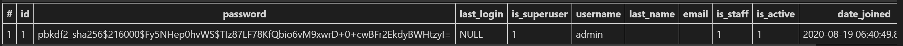

- admin에 Article을 등록 `admin.py`
  - 장고 명시적 상대경로 표현 법 : 같은 위치에 있는 곳을 표현할 때 (.)을 사용
  - `admin.site.register(모델명)` : admin에 site에 등록하겠다(특정모델을) 이렇게 외우면 됨

```python
from django.contrib import admin
from .models import Article #장고 명시적 상대경로 표현법

admin.site.register(Article)
```

- `__str__`을 해놔서 object가 아니라 글로 표현됨

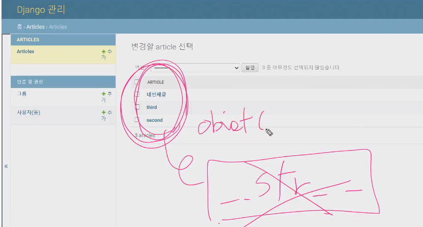

------

## User

> Subsituting a custom User model(커스텀 유저 모델로 대체하기)
>
> 1. user를 대체해서 커스텀 유저 모델로 바꿔서 사용했다(대체하는거 공식문서 찾아보기)
>
> 2. 대체한 이후에 회원가입이 진행안됨. 이유는 회원가입에 대한 유저 크리에이션 폼이 장고가 유저를 대체하기 전에 기본 유저 모델로 만들어진 모델 폼이기 때문에 우리가 만드 커스텀 유저 모델로 바꿔서 확장시켜야 한다.
>
> 3. 뿐만 아니라 유저 체인지 폼도 마찬가지로 확장시켜야 한다.
>
> 4. 또한 유저를 참조하는 방식이 크게 두가지가 있는데 하나는 get_user_model이라는 함수를 통해서 현재 프로젝트에 액티브되어있는 유저모델을 리턴한다. 두번째는 settings.auth_user_model
>
>    둘다 결국 현재 사용하고 있는 유저를 가리키는건 맞는데 사용하는 위치가 다르다. 첫번째는 models.py가 아닌 다른 모든 곳에서 사용하며, models.py에서는 settings에  auth_user_model이라고 하는 문자열로 된 값을 사용해야 한다!
>
>    (장고가 프로젝트가 런이 되는 순간 실행순서 때문이다)

- 일부 프로젝트에서는 Django의 내장 유저 모델이 제공하는 인증 요구사항이 적절하지 않을 수 있다
- 유저 지정 모델을 참조하는 AUTH_USER_MODEL(`settings.py`) 설정 값을 변경해 기본 유저 모델을 재정의(override) 할 수있음
- Django는 새 프로젝트를 시작하는 경우 기본 사용자 모델이 충분하더라도 커스텀 유저 모델을 설정하는 것을 강력하게 권장(**그냥 커스텀유저모델을 사용해라**)
- 커스텀 유저 모델은 기본 유저 모델과 동일하게 동작하지만 필요한 경우 나중에 맞춤 설정할 수 있기 때문
- **(중요!!!!!) 단, 프로젝트의 첫 migrate를 실행하기 전에 완료해야함**


### AUTH_USER_MODEL

> [settings.py_AUTH_USER_MODEL](https://docs.djangoproject.com/en/3.1/ref/settings/)

- User를 나타내는데 사용하는 모델
- 기본값은 'auth.User'
- 주의사항
  - 프로젝트가 진행되는 동안 AUTH_USER_MODEL 값을 변경할 수 없음(종속된 모델을 만들고 마이그레이션 된 후/ 변경하기 위해서는 많은 시간과 절차가 필요)
  - **프로젝트 시작 시 설정**하기 위한 것이고 custom User로 대체하는 법을 [참고(Substituting a custom User model)](https://docs.djangoproject.com/en/3.1/topics/auth/customizing/)해서 설정


### AbstractBaseUser & AbstractUser

- AbstractBaseUser
  - password와 last_login만 기본적으로 제공
  - 자유도가 높지만 다른 필요한 필드는 모두 작성해야 함
- AbstractUser
  - 관리자 권한과 함께 완전한 기능을 갖춘 유저 모델을 구현하는 기본 클래스
  - 여기서 상속받은 User를 사용하고 있었음!(실제로 모든 일을 다함, User는 유저를 표현하기 위한 것일 뿐!)


#### Abstract base classes

- 몇 가지 공통 정보를 여러 다른 모델에 넣을 때 사용하는 클래스
- 데이터베이스 테이블을 만드는 데 사용되지 않으며, 대신 다른 모델의 기본 클래스로 사용되는 경우 해당 필드가 하위 클래스의 필드에 추가됨


### Custom users and the built_in auth forms

- AbstractBaseUser의 모든 subclass와 호환되는 forms
  - AuthenticationForm, SetpasswordForm, PasswordChangeForm, AdminpasswordChangeForm
- User와 연결되어 있어 커스텀 유저모델을 사용하려면 다시 작성하거나 확장해야하는 forms(**다시 커스텀유저모델로 작성할거야!**)
  - UserCreationForm
  - UserChangeForm


### Referencing the User model(유저 모델 참조하기)

- settings.AUTH_USER_MODEL(문자열로됨)

  - 유저 모델에 대한 외래 키 또는 다 대 다 관계를 정의 할 때 사용

  - **즉, models.py에서 유저 모델을 참조할 때 사용**
  - `accounts`에 User모델이 있는데 articles가 끝난다음에 accounts가 실행되기 때문에 오류가 뜰 수 있음, 그래서 모델에서는 객체가 등장하는게 아니라 문자열로 됨 AUTH_USER_MODEL을 써야됨

- get_user_model()

  - django는 유저 모델을 직접 참조하는 대신 get_user_model()을 사용하여 유저 모델을 참조하라고 권장
  - 현재 활성(active) 유저 모델(지정된 커스텀 유저 모델, 그렇지 않은 User)을 반환
  - **즉, models.py가 아닌 다른 모든 곳에서 유저 모델을 참조할 때 사용**


### User - Article 관계(1 : N 관계)

0. `accounts` > `models.py`

> 기본유저 모델을 쓰면 추가를 하거나 대체를 할 수 없기 때문에 프로젝트 시작전에 대체를 먼저 하고 시작함!
> 아래의 기능은 나중에 써도됨, 기존의 User와 기능적으로는 완전히 동일하지만 대체를 해야되는건 나중에 수정 가능하게 하기 위해서

```python
from django.db import models
from django.contrib.auth.models import AbstractUser
# Create your models here.


class User(AbstractUser):
    pass
```

1. `settings.AUTH_USER_MODEL`

> `앱이름.모델이름`-> 장고가 auth모델을 쓰는것이 아니라 대체를 함!
>
> 중간에 바꿀 수 없음, 그렇기 때문에 데이터베이스를 초기화 해야됨 migrations를 다 지우고 db도 다 지움!
>
> 마이그레이션 초기화할때 `__init__`을 지우면안되고 숫자로 돼있는거만 지우고, dbsqlite3파일도 지움!

- `settings.py`

```python
AUTH_USER_MODEL = 'accounts.User'
```

- `articles` > `models.py`
  - `settings.py`에 `AUTH_USER_MODEL`에 대해 나와 있지 않음
  - `AUTH_USER_MODEL = 'auth.User'`가 기본값이기 때문이다.
  - 여기는 `get_user_model`을 참고하지 못하고 `AUTH_USER_MODEL`을 적어야됨, user_id를 defalut를 1로 설정할 수도 있음 

```python
from django.conf import settings

# Article 클래스에 추가
user = models.ForeignKey(settings.AUTH_USER_MODEL, on_delete=models.CASCADE)
```

- `forms.py` > `ArticleForm`

```python
fields = ['title', 'content',] # 구문 수정
```

- `get_user_model()` : return 값이 `class`
- `settings.AUTH_USER_MODEL` : return 값이 `str`

> 중요!!)
>
> **모든 곳**에서 User model을 호출할 때는 **`get_user_model()`**
>
> 단, **`models.py`**에서만 **`settings.AUTH_USER_MODEL`**


- DB는 기본으로 `NOT NULL` 조건을 지켜야 하므로 새로운 컬럼 추가시 현재 이미 만들어져 있는 레코드에 대해 `user_id`의 기본값을 어떻게 설정할지 물어보는 구문이 다음과 같이 표시된다.

### Model relationships(M : N) 

- **User : Article = M : N**
  - User는 여러 개의 Article에 LIKE 할 수 있고
  - Article은 여러 User 로 부터 LIKE 받을 수 있다.

- **모델링은 현실 세계를 최대한 유사하게 반영하기 위해서 해야한다.**

- 일상에 가까운 예시를 통해 db를 모델링하고, 내부에서 일어나는 데이터의 흐름을 어떻게 제어할 수 있는지에 대해 고민

**환자와 의사의 예약 시스템을 구축하라는 프로젝트**

- 모델링(`models.py`)

  ```python
  from django.db import models
  
  class Doctor(models.Model):
      name = models.TextField()
  
      def __str__(self):
          return f'{self.pk}번 의사 {self.name}'
  
  
  class Patient(models.Model):
      name = models.TextField()
      doctor = models.ForeignKey(Doctor, on_delete=models.CASCADE)
  
      def __str__(self):
          return f'{self.pk}번 환자 {self.name}'
  ```


#### 1. 1:N의 한계 (shell_plus로 객체 생성 후 확인)

- 불필요한 필드(같은 환자 이름을 가진 필드)를 또 만들어야 하는 문제점이 발생한다.
- 수정을 할 수 없고 계속 추가해야됨!
- 문제점
  - 방문 예약을 바꾸는 것이 불가능(새로운 객체 생성)
  - 다른 의사를 방문한 기록을 남길 수 없음

- `python manage.py shell_plus`

```sh
In [1]: doctor1 = Doctor.objects.create(name='justin')

In [2]: doctor2 = Doctor.objects.create(name='eric')

In [3]: patient1 = Patient.objects.create(name='tony', doctor=doctor1)

In [4]: patient2 = Patient.objects.create(name='harry', doctor=doctor2)

In [5]: doctor1
Out[5]: <Doctor: 1번 의사 justin>

In [6]: doctor2
Out[6]: <Doctor: 2번 의사 eric>

In [7]: patient1
Out[7]: <Patient: 1번 환자 tony>

In [8]: patient2
Out[8]: <Patient: 2번 환자 harry>

#환자가 의사를 바꾸고싶은데 수정을 못하고 다시 추가로 만들어줘야됨!
In [9]: patient3 = Patient.objects.create(name='tony', doctor=doctor2)

In [10]: patient3
Out[10]: <Patient: 3번 환자 tony>

In [11]: patient3.doctor.name
Out[11]: 'eric'

In [12]: patient4 = Patient.objects.create(name='harry', doctor=doctor1)

#하나의 patient가 여러 의사를 지정받을 수 없음!
In [13]: patient4 = Patient.objects.create(name='harry', doctor=doctor1, doctor=doctor2)
  File "<ipython-input-13-2775590f4f3f>", line 1
    patient4 = Patient.objects.create(name='harry', doctor=doctor1, doctor=doctor2)
                                                                   ^
SyntaxError: keyword argument repeated
```


#### 2. 중개모델 생성 - `models.py`에 Reservation model 추가

[](https://user-images.githubusercontent.com/52685250/67262400-9c610880-f4df-11e9-9904-a8ebb314966b.JPG)

- 1 : N 의 한계점을 해결하기 위해 중개모델을 생성하여 어느 의사가 어느 환자와 매칭되는지 알 수 있다.
- `hospitals` > `models.py`

```python
class Reservation(models.Model):
    doctor = models.ForeignKey(Doctor, on_delete=models.CASCADE)
    patient = models.ForeignKey(Patient, on_delete=models.CASCADE)

    def __str__(self):
        return f'{self.doctor_id}번 의사의 {self.patient_id}번 환자'
```

- 기존의 `db.sqlite3`, `0001_initial.py` 삭제 후(`__init__`이건 삭제하면 안됨) 다시 migration 과정 진행

- 중개 모델이 생겼으므로 `doctor = models.ForeignKey(Doctor, on_delete=models.CASCADE)` 이 구문은 필요가 없게 된다.

```sh
In [1]: doctor1 = Doctor.objects.create(name='justin')

In [3]: patient1 = Patient.objects.create(name='tony')

#진료예약을 하나 만든것과 같은 것
In [4]: reservation1 = Reservation.objects.create(doctor=doctor1, patient=patient1)

IN[5] : reservation1
Out[5]: <Reservation: 1번 의사의 1번 환자>

#역참조 '_set.all()'
In [6]: doctor1.reservation_set.all()
Out[6]: <QuerySet [<Reservation: 1번 의사의 1번 환자>]>

In [7]: patient1.reservation_set.all()
Out[7]: <QuerySet [<Reservation: 1번 의사의 1번 환자>]>

In [8]: patient2 = Patient.objects.create(name='harry')

In [9]: reservation2 = Reservation.objects.create(doctor=doctor1, patient=patient2)

IN[10]: reservation2
Out[10]: <Reservation: 1번 의사의 2번 환자>

#오늘 내 환자 몇명이었지?
In [11]: doctor1.reservation_set.all()
Out[11]: <QuerySet [<Reservation: 1번 의사의 1번 환자>, <Reservation: 1번 의사의 2번 환자>]>

In [12]: for reservation in doctor1.reservation_set.all():
    ...:     print(reservation.patient.name)
    ...: 
tony
harry
```


#### (3) 중개 모델을 직접 거치지 않고 바로 가져오기 - `Through` option

- `Through option`
  - 중개 모델을 거치지 않고 직접 서로 테이블을 참조하는 option
  - `ManyToManyField`는 **실제적인 물리적인 필드가 DB에 생기는 것이 아니다.**
    - 보통 복수형을 적는다! (외래키는 보통 단수형)
- `models.py`

```python
class Patient(models.Model):
    name = models.TextField()
    doctors = models.models.ManyToManyField(Doctor,through='Reservation')
    def __str__(self):
        return f'{self.pk}번 환자 {self.name}'
```

- `shell_plus`

```sh
In [1]: patient1 = Patient.objects.get(pk=1)

In [2]: patient1
Out[2]: <Patient: 1번 환자 tak>

#진료를 조회함
In [3]: patient1.reservation_set.all()
Out[3]: <QuerySet [<Reservation: 1번 의사의 1번 환자>]>

#의사만 출력, 내가 진료받는 의사로 patient에서 바로 접근(through option을 통해!)
In [4]: patient1.doctors.all()
Out[4]: <QuerySet [<Doctor: 1번 의사 justin>]>

In [5]: doctor2 = Doctor.objects.create(name='eric')

In [6]: Reservation.objects.create(doctor=doctor2, patient=patient1)
Out[6]: <Reservation: 2번 의사의 1번 환자>

In [7]: patient1.reservation_set.all()
Out[7]: <QuerySet [<Reservation: 1번 의사의 1번 환자>, <Reservation: 2번 의사의 1번 환자>]>

#나를 진료해주는 의사가 누구인지 바로 조회
In [8]: patient1.doctors.all()
Out[8]: <QuerySet [<Doctor: 1번 의사 justin>, <Doctor: 2번 의사 eric>]>

In [10]: doctor2
Out[10]: <Doctor: 2번 의사 eric>

In [11]: doctor2.patient_set.all()
Out[11]: <QuerySet [<Patient: 1번 환자 tony>]>
```


#### 4. Doctor도 patients 를 참조할 수 없을까? - `related_name` option

> 역참조! 필드가 있는곳에서 참조하는건 참조, 필드가 없는 곳에서 자기를 참조하는 것을 참조하는 것이 역참조!

- `related_name`

  - 참조되는 대상이 참조하는 대상을 찾을 때(역참조), 어떻게 불러 올지에 정의한다.
  - MTOM(ManyToMany) 필드가 없는 테이블이 있는 테이블을 참조할 때 사용한다.
  - 필수적으로 사용하는 건 아니지만 필수적인 상황이 발생할 수 있다.

  ```python
  doctors = models.ManyToManyField(Doctor, related_name='patients') # 구문 추가
  # through='reservation'는 삭제
  ```

- `models.py` 

  ```python
  class Doctor(models.Model):
      name = models.TextField()
  
      def __str__(self):
          return f'{self.pk}번 의사 {self.name}'
  
  
  class Patient(models.Model):
      name = models.TextField()
      #through='Reservation'(삭제)->중개모델을 지웠기 때문에 없앰
      #역참조 related_name인자가 있다->중개모델 클래스 지워도 괜춘
      doctors = models.ManyToManyField(Doctor, related_name='patients')
  
      def __str__(self):
          return f'{self.pk}번 환자 {self.name}'
  
  '''
  Doctor가 Patient참조 역참조
  중개모델을 앞으로는 직접만들지 않을거야!
  '''
  
  # class Reservation(models.Model):
  #     doctor = models.ForeignKey(Doctor, on_delete=models.CASCADE)
  #     patient = models.ForeignKey(Patient, on_delete=models.CASCADE)
      
  #     def __str__(self):
  #         return f'{self.doctor.pk}번 의사의 {self.patient.pk}번 환자'
  ```

- shell_plus로 확인

  ```sh
  In [1]: doctor1 = Doctor.objects.create(name='justin')
  
  In [3]: patient1 = Patient.objects.create(name='tony')
  
  In [4]: doctor1
  Out[4]: <Doctor: 1번 의사 justin>
  
  In [5]: patient1
  Out[5]: <Patient: 1번 환자 tony>
  
  In [6]: doctor1.patients.add(patient1)
  
  In [8]: doctor1.patients.all()
  Out[8]: <QuerySet [<Patient: 1번 환자 tony>]>
  
  In [9]: patient1.doctors.all()
  Out[9]: <QuerySet [<Doctor: 1번 의사 justin>]>
  
  In [10]: patient1.doctors.remove(doctor1)
  
  In [11]: patient1.doctors.all()
  Out[11]: <QuerySet []>
  
  In [12]: doctor1.patients.all()
  Out[12]: <QuerySet [<Patient: 1번 환자 tony>,<Patient: 2번 환자 harry>]>
  ```

- 위와 같은 상황일 때 `manytomany_patient_doctors` 테이블이 새로 생성된다.

- 중개 모델을 생성하지 않고 `doctor`에서는 `patients.all()`로, `patients`에서는 `doctors.all()`로 서로 접근할 수 있다.(ManytoMany 필드의 특징!)


- 그렇다면 중개모델은 필요가 없는가??? => **아님!!!!**
  - 예약한 시간 정보를 담는다거나 하는 경우(= 추가적인 필드가 필요한 경우)에는 반드시 중개모델을 만들어서 진행을 해야되는 상황도 있다.
  - 다만 그럴 필요가 없는 경우 위와 같이 해결할 수 있다.

## A many-to-many relationship

> [공식문서](https://docs.djangoproject.com/en/3.1/ref/models/fields/#manytomanyfield)


> 한계 : 환자가 다른 의사한테 또 진료를 받고 싶다면 필드를 한번 더 사용해야되고, harry라는 환자가 두명의 의사한테 동시에 진료를 받을 수 없었음!
>
> 그래서 중개모델을 작성!


> 각각의 모델과 1:N의 관계를 맺음, 지금 1번의사한테 두명의 환자가 예약되어있는 것을 보여줌 
>
> 데이터를 조회할 때 아래와 같이 shell_plus에 입력했음
>
> 


> 의사가 환자들을 조회를 하고 싶다!
>
> 환자도 내가 진료를 받을 의사들을 조회하고 싶다!
>
> 여기서 ManyToManyField가 등장
>
> 두 모델간 종속관계가 없어 둘중 어느 모델에 써도 관계 없음! Doctor에 적어도 상관없음
>
> 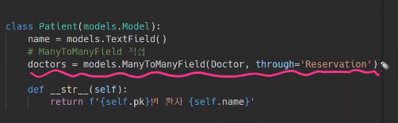
>
> 참조되는 모델의 복수형으로 적으면 됨!
>
> 조회할때의 명령어는 이렇게 씀!
>
> 
>
> 1번환자를 조회하고
>
> 1번환자의 모든 예약을 역참조로 불러옴
>
> 내가 오늘 진료를 받을 의사만 보여줌! Patient가 바로 의사를 참조하는 것처럼 보이게 함 
>
> 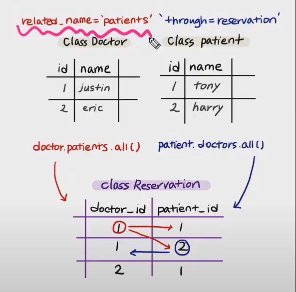
>
> 하지만 여전히 Doctor는 Reservation을 통해서만 Patient를 참조할 수 있음!
>
> ManyToManyField는 종속관계는 없지만 역참조를 하면 Doctor도 patient를 참조할 수 있음!
>
> 
>
> `related_name=`역참조시 사용하는 `manager`를 변경함
>
> 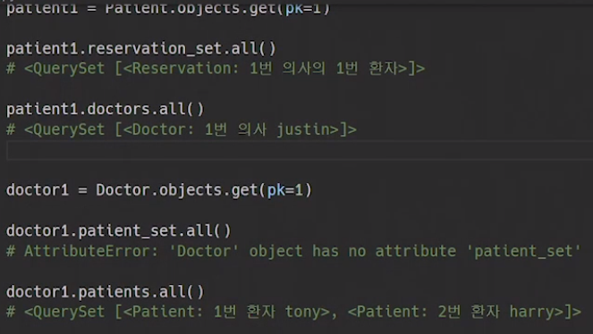
>
> `related_name`을 설정하고 나면 이전에 사용했던 명령어 `patient_set`은 쓸 수 없음!


>


## ManyToManyField

> [Django공식문서](https://docs.djangoproject.com/en/3.1/ref/models/fields/#manytomanyfield)

- M:N관계를 나타내기 위해 사용하는 필드
- 하나의 필수 위치 인자(M:N 관계로 설정할 모델 클래스)가 필요하다

> 데이터베이스에서의 표현

- django는 M:N관계를 나타내는 **중개 조인 테이블**(intermediary join table)을 만든다
- 테이블 이름은 ManyToManyField의 이름과 이를 포함하는 모델의 이름을 조합하여 생성함
- `db_table` 옵션을 사용하여 조인 테이블의 이름을 변경할 수도 있다.

> Arguments

- 모두 optional 하며 관계가 작동하는 방식을 제어함

- `related_name`

  - ForeignKey의 related_name과 동일

- `through`

  - django는 다대다 관계를 관리하는 중개 테이블을 자동으로 생성
  - 중개 테이블을 **직접** 작성하려는 경우 지정
  - 일반적으로 **추가 데이터**를 M:N 관계와 연결하려는 경우에 사용

- `symmetrical`(대칭적임)

  - ManyToManyField가 동일한 모델(self)을 가리키는 정의에서만 사용
  - 재귀적 정의(대댓글 관계)

  

  - 예시처럼 동일한 모델을 가리키는 경우 Person 클래스에 person_set 매니저를 추가 하지 않는다.
  - 대신 대칭적(`symmetrical`)이라고 간주하며, source인스턴스(참조하는)가 target 인스턴스(참조되는)를 참조하면 target 인스턴스도 source인스턴스를 참조하게 됨
  - 즉, 내가 당신의 친구라면 당신도 내 친구가 됨
  - self와 M:N관계에서 대칭을 원하지 않는 경우 **`symmetrical`를 `False`로 설정함**(기본값이 True)
  - Folllow도 마찬가지! 내가 팔로우 한다고 상대도 팔로우 되는게 아님! 그래서 False로 바꿔야됨!

- etc.....


**중개 테이블 필드 생성 규칙**

1. 소스(source model) 및 대상(target model) 모델이 다른 경우
   - id
   - `<containing_model>_id`
   - `<other_model>_id`
2. ManyToManyField가 동일한 모델을 가리키는 경우
   - id
   - `from_<model>_id`
   - `to_<model>_id`


## LIKE(좋아요) 구현

> 하나의 article에는 여러user가 좋아요를 할 수 있다
>
> 한명의 user는 여러 article에 좋아요를 누를 수 있다
>
> Article - User M:N관계!

- `articles` > `models.py`

> `like_users` : ManyToManyField를 맺는 첫번째 필수인자, user(user모델 참조는 models.py에서는 `settings.AUTH_USER_MODEL`) 나머지 인자는 옵션인데 역참조 명령어를 `related_name='like_article'`로 줌!
>
> 그냥 like_users도 users, related_name도 원래 기본대로 할래! 라고 했을 때 아래와 같은 역참조시 충돌됐다는 오류가 남!
>
> 
>
> related_name을 더해라! 이상황에서는 이 인자가 필수가 돼버림!
>
> WHY??
>
> **1:N**
>
> Article은 User랑 이미 1:N 관계가 설정 돼있음!
>
> -  article이  user를 참조할 때 / `article.user`
> -  article이 user를  역참조할때 / `user.article_set`(유저가 작성한 게시글들 조회)
>
> **M:N**
>
> 여기서 M대 N관계가 `users`라는 필드명으로 추가됨!
>
> - article이 user를 참조할 때 / `article.users`
> - article이 user를 역참조할 때/ `user.article_set`(유저가 좋아요한 게시글들 조회)
>
> 의도는 다른데 역참조 명령어가 겹쳐서 충돌이 일어남!!
>
> ERROR HINT대로 related_name을 필수로 바꿔줘야되는 상황이 생김!
>
> **M:N 필드명 수정!**
>
> - article이 user를 참조할 때 users-> like_users/ `article.like_users`(이 게시글에 좋아요를 누른 유저들을 조회)
> - article이 user를 역참조할 때 `related_name = 'like_articles'`/ `user.like_articles`(유저가 좋아요한 게시글들 조회)
>
> M:N관계 필드를 추가해 models.py가 변경이 됐으니 migration해줌! 이거는 필드값이 추가된것처럼 보이지만 1:N관계필드를 추가했을 때는 default값을 물어보는게 나왔었는데, ManyToManyField는 실제 물리적 필드가 아니기 때문에 Article과 User에 필드가 새로 생기는 것이 아니라 테이블 하나가 더 생기는 것일 뿐!
>
> 이것은 핵심이 중개모델을 만드는 것! 그래서 필드의 변화가 없고 그래서 defalut값이 필요없다!
>
> 이 중개 테이블의 이름 규칙 `articles_article_like_users(앱이름_그 필드가 참조하는 모델의 이름_그모델에 작성된 필드 이름)` 각각의 모델에 대한 외래키를 가지고 있음!
>
> 

```python
from django.db import models
from django.conf import settings

# Create your models here.
class Article(models.Model):
    user = models.ForeignKey(settings.AUTH_USER_MODEL, on_delete=models.CASCADE)
    #like_users 키 추가
    like_users = models.ManyToManyField(settings.AUTH_USER_MODEL, related_name='like_articles')
    title = models.CharField(max_length=10)
    content = models.TextField()
    created_at = models.DateTimeField(auto_now_add=True)
    updated_at = models.DateTimeField(auto_now=True)
    
    def __str__(self):
        return self.title
```


**이제 사용 가능한 ORM 명령어는 다음과 같다.**

- `article.user` : 게시글을 작성한 유저 - 1:N
- `article.like_users` : 게시글을 좋아요한 유저 - M:N
- `user.article_set`: 유저가 작성한 게시글들 → 역참조 - 1:N
- `user.like_articles`: 유저가 좋아요한 게시글들 → 역참조 - M:N


- `articles` > `views.py`

> DB의 테이블값에 변화가 있음,  중개모델 테이블이 달라지기 때문!
>
> 그래서 POST로 데이터를 받음!
>
> `add`와 `remove`를 통해 추가와 삭제를 할 수 있음
>
> (참고) 삭제된 pk는 재사용되지 않는다
>
> `article.like_users.filter(pk=request.user.pk).exists()`
>
> 장고는 in(포함)의 개념보다는 존재하는지(`exists()`) 묻는 것을 더 권장함! 전체에서 하나를 찾아야되는 상황에서 `exixts()`를 사용해라!(in보다 내부적으로 더 빠르게 잘 작동할 수 있음)
>
> WHY! `.get()`이 아니라 왜 `.filter()`를 썼냐?
>
> > https://docs.djangoproject.com/en/3.1/ref/models/querysets/#filter
> >
> > https://docs.djangoproject.com/en/3.1/ref/models/querysets/#django.db.models.query.QuerySet.exists
>
> - `filter()` 
>   - 조건에 맞는 여러 행을 출력한다. (조건에만 맞는다면 전부 가져온다.)
> - `exists()`
>   - 최소한 하나의 레코드가 존재하는지 여부를 확인하여 알려 준다. 
> - `.get` 이 아닌 `.filter` 를 사용하는 이유 → 데이터가 없는 경우의 오류 여부
>   - `.get()` 은 유일한 값을 꺼낼 때 사용한다.(ex. pk) 유일한 값을 꺼낸다는 것은 해당 데이터가 존재하지 않는 경우가 없다는 뜻이다. **값이 없으면 에러(DoesNoetExist error) 가 발생**하기 때문에 무조건 존재하는 값에 접근할 때 사용한다.
>   - `.filter()` 의 경우 조건에 맞는 여러 개의 데이터를 가져온다. 이때 데이터가 1개도 없어도 빈 쿼리셋을 반환한다. (몇 개인지 보장할 수 없을 때)

```python
@require_POST
def like(request, article_pk):
    # 인증된 사용자만 가능
    if request.user.is_authenticated:
        article = get_object_or_404(Article, pk=article_pk)
        # user가 article에 좋아요를 눌렀는지 안눌렀는지
        
        # 1-1. user가 article을 좋아요 누른 전체유저에 포함이 되어있는지 안되어있는지.
        # if request.user in article.like_users.all():
        
        
        #1-2가 장고가 권장한대로 작성한 것!
        # 1-2. user가 article을 좋아요 누른 전체유저에 존재하는지.
        # 해당 게시글에 좋아요를 누른 사람들 중에서 현재 접속유저가 있다면 좋아요를 취소
        if article.like_users.filter(pk=request.user.pk).exists():
            # 좋아요 취소(중개테이블에서 좋아요를 빼겠다)
            article.like_users.remove(request.user)
        else:
            # 좋아요
            article.like_users.add(request.user)
        return redirect('articles:index')
    return redirect('accounts:login')
```


### Follow

- `accounts` > `models.py`

> follow는 우리가 custom한 User에 적을거야! 그래서 프젝 처음 시작부터 User대체 작업을 해놔야 필드를 추가하기 편하다!
>
> 내가 팔로잉을 했을 때 상대방도 팔로잉 하게 대칭되지 않게 `symmetrical=False`로 인자를 줌
>
> `related_name='followers'`와 필드이름 `followings`는 이름이 어차피 `self`같은 것을 참조하기 때문에 바꿔 적어도 상관없지만 생각하기 편하게 내가 참조할때는 following이라는 단어를 쓰는게 편하니까 이렇게 적음
>
> 이렇게 하면 User에 followings라는 필드가 생가나요?
>
> -> 아니요! ManyToManyField이기 때문에 아예 새로운 중개테이블이 생기는 것이지 필드가 추가되는 것은 아님!!
>
> 아래는 Like의 중개모델 
>
> **만약 source모델과 target모델이 다르다면** 필드는 아래처럼 만들어짐
>
> `source_id`->`target_id`
>
> 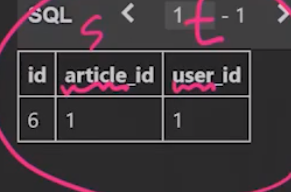
>
> 그럼 Followings의 중개모델은? source와 target모델이 같음!
>
> **만약 source와 target이 같은 경우라면?**
>
> `from_모델_id`,` to_모델_id`
>
> id는 기본적으로 있음
>
> ManyToManyField가 정의된 필드가 먼저 나옴
>
> 그리고 target모델이름이 뒤쪽에 other_model로 나옴 
>
> self를 참조하는 경우 아래와 같이 중개테이블이 만들어짐
>
> | id   | `from_user_id` | `to_user_id` |
> | ---- | -------------- | ------------ |
> |      | 1              | 2            |
> |      | 2              | 1            |
>
> 1번유저가 2번유저를 참조(첫번째 줄)
>
> 만약 맞팔이 되려면 2 1도 새로 추가돼야함(2번째 줄)
>
> User모델이 변경됐기 때문에 migration해야됨!
>
> 

```python
from django.db import models
from django.contrib.auth.models import AbstractUser

# Create your models here.
class User(AbstractUser):
    followings = models.ManyToManyField('self', symmetrical=False, related_name='followers')
```

