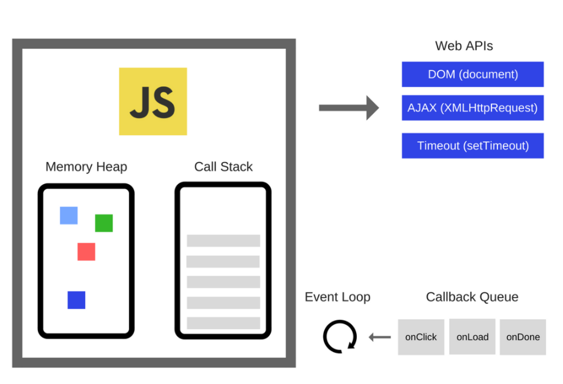
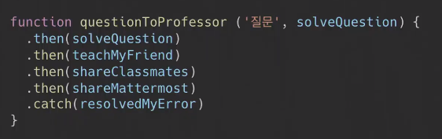
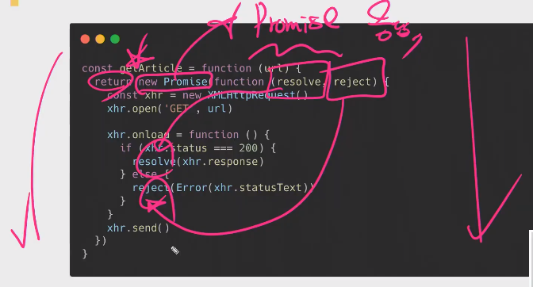
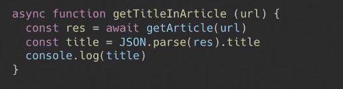
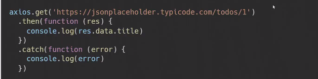

# JavaScript 심화

[toc]

## ECMAScript

> 이전 [TIL](https://github.com/irissooa/irissooa-TIL/blob/master/web/1013_JS(grammer).md)보기!

### ASI(Automatic Semicolon Insertion)

> 문장의 끝이라고 생각되는 부분에 `;`을 찍음(개발자들 `;` 찍자 vs 찍지말자로 논쟁중)
>
> 우리는 안찍고 갈거다! 여러 이유가 있지만 지금 당장 개념적으로 아는게 중요하지 찍어야되냐 말아야되냐는 현재는 중요하지 않다.


## Coding Style Guide

> [JavaScript Standard Guide](https://standardjs.com/readme-kokr.html)

- **2칸 공백을 사용합니다.** 

  - 들여쓰기

- **문자열에 작은 따옴표를 사용합니다.** 

  - 누락된 곳은 제외

- **사용되지 않는 변수가 없어야 합니다.** 
-  이 것은 대량의 버그를 초래하는 원인
  
- **세미콜론이 없어야 합니다.** 

  -  [It's](http://blog.izs.me/post/2353458699/an-open-letter-to-javascript-leaders-regarding) [fine.](http://inimino.org/~inimino/blog/javascript_semicolons) [Really!](https://www.youtube.com/watch?v=gsfbh17Ax9I)

- `(`, `[`, or ```과 같이 라인을 시작하면 안됨

  - 세미콜론 생략시 반드시 문제가 생길 수 있음 
    - *자동으로 체크할 수 있도록 준비되어 있음.*
  - [More details](https://standardjs.com/rules-kokr.html#semicolons)

- **키워드 뒤에 공백을 사용**

  - `if (condition) { ... }`

- **함수명 뒤에 공백을 사용** 

  - `function name (arg) { ... }`

- 항상 `==` 대신 `===`을 사용

  - 단, `null || undefined`는 `obj == null`로 확인

- node.js에서 err 파라미터는 항상 처리해야 됨

- 항상 브라우저 전역에 `window` 접두사를 붙임 

  - `document`와 `navigator`는 괜찮음

  - `open`, `length`, `event`, `name` 등 불분명하게 브라우저 전역을 우연히 사용하는 것을 방지함

- **[더 많은 장점](https://standardjs.com/rules-kokr.html#javascript-standard-style)** - *`standard`를 시도해보세요!*


## 동기식 처리 모델과 비동기식 처리 모델

### **동기식 처리 모델(Synchronous)**

- 직렬적으로 테스크를 수행
- 테스크는 순차적으로 실행되며 어떤 작업이 수행중이면 다음 작업은 대기
- 예) 서버에서 데이터를 가져와서 화면에 표시하는 작업을 수행할 때, 데이터가 응답될 때까지 이후 테스크들은 **블로킹(blocking)**된다.


### **비동기식 처리 모델(Asynchronous)**

- 병렬적으로 테스크를 수행
- 테스크는 종료되지 않는 상태라 하더라도 대기하지 않고 다음 테스크를 실행
- 예) 서버에서 데이터를 가져와서 화면에 표시하는 작업을 수행할 때, 데이터가 응답될 때까지 **기다리지 않고(non-blocking)** 즉시 다음 테스크를 수행
- JS 대부분의 DOM 이벤트와 Timer 함수, Ajax 요청은 비동기식 처리 모델로 동작


## AJAX(Asynchronous JavaScript And XML)

### AJAX

> JavaScript를 사용한 비동기 통신, 클라이언트와 서버간에 XML 데이터를 주고받는 기술

- 비동기 자바스크립트와 XML을 말함
- **서버와 통신하기 위해 XML객체를 사용하는 것**
- JSON, XML, HTML 그리고 일반 텍스트 형식 등을 포함한 다양한 포맷을 주고 받을 수 있음
- 페이지 전체를 **리프레쉬 하지 않고서도 수행 되는 `비동기성`**임
- 이러한 비동기성을 통해 사용자의 Event가 있으면 **전체 페이지가 아닌 일부분만을 업데이트 **할 수 있게 해줌
- 주요 특징
  - **페이지 새로고침 없이(reload 없이) 서버에 요청**
  - **서버로부터 데이터를 받고 작업을 수행**


#### async (비동기)방식

-  웹페이지를 리로드하지 않고 데이터를 불러오는 방식
- 장점
  - 페이지 리로드의 경우 전체 리소스를 다시 불러와야하는데 
  - 이미지, 스크립트 , 기타 코드등을 모두 재요청할 경우 불필요한 리소스 낭비가 발생하게 되지만 
  - 비동기식 방식을 이용할 경우 필요한 부분만 불러와 사용할 수 있음!


#### 왜 사용하는가?

- 기본적으로 HTTP프로토콜은 클라이언트쪽에서 Request를 보내고 Server쪽에서 Response를 받으면 이어졌던 연결이 끊김
- 화면의 내용을 갱신하기 위해서는 다시 request를 하고 response를 하면서 페이지 전체를 갱신함
- 페이지의 일부분만 갱신할 경우에도 페이지 전체를 다시 로드해야하는데 엄청난 자원낭비와 시간낭비
- BUT!! ajax는 html 페이지 전체가 아닌 일부분만 갱신할수 있도록 XML HttpRequest객체를 통해 서버에 request
- 이 경우 **Json이나 xml형태로 필요한 데이터만 받아 갱신하기 때문에** 그만큼의 자원과 시간을 아낄 수 있다.


#### AJAX 장점

1. 웹페이지의 속도향상
2. 서버의 처리가 완료 될때까지 기다리지 않고 처리 가능하다.
3. 서버에서 Data만 전송해면 되므로 전체적인 코딩의 양이 줄어든다.
4. 기존 웹에서는 불가능했던 다양한 UI를 가능하게 해준다.  사진공유 사이트 Flickr의 경우 사진의 제목이나 태그를 페이지 리로드 없이 수정할 수 있다.


#### AJAX 단점

1. 히스토리 관리가 안 된다. (보안에 좀 더 신경을 써야한다.)

2. 연속으로 데이터를 요청하면 서버 부하가 증가할 수 있다.

3. XMLHttpRequest를 통해 통신을 하는 경우사용자에게 아무런 진행 정보가 주어지지 않는다.  그래서 아직 요청이 완료되지 않았는데 사용자가 페이지를 떠나거나 오작동할 우려가 발생하게 된다. 


### XHR(XML Http Request)

- XHR객체는 서버와 상호작용하기 위하여 사용됨
- **전체 페이지이의 새로고침 없이**도 URL로부터 데이터를 받아올 수 있음
- **사용자가 하고 있는 것을 방해하지 않으면서 페이지의 일부를 업데이트** 할 수 있음
- AJAX프로그래밍에 주로 사용됨
- 브라우저는 `XMLHttpRequest` 객체를 이용하여 Ajax 요청을 생성하고 전송
- 서버가 브라우저의 요청에 대해 응답을 반환하면 같은 XHR 객체가 그 결과를 처리
- (참고) 단, IE 5, 6 에서는 `ActiveXobject` 를 사용해야 한다.


### How JavaScript Works

> 1. Asynchronous : 기다려주지 않음
> 2. Single Thread : 혼자서 일 하나의 일만 처리할 수 있음
> 3. Event Loop : 이 메커니즘으로 일을 함

#### 1. Asynchronous

> JavaScript는 기다려주지 않음
>
> WHY?? 혼자서 일을 하기 떄문에(`Single Thread`) 기다리는 동안 다른 일을 하지 않으면 낭비가 심함


#### 2. Single Thread

> 혼자 일을 해서 한번에 하나의 일만 할 수 있음


#### 3. Event Loop

> JavaScript는 Event Loop 메커니즘으로 일을 함!
>
> **자바스크립트를 단일 스레드 프로그래밍 언어라 한번에 하나씩 밖에 실행할 수 없다.
> 그러나 Web API, Callback Queue, Event Loop 덕분에 멀티 스레드 처럼 보여진다.** 
>
> 
>
> - 자바스크립트 엔진은 ***Memory Heap*** 과 ***Call Stack*** 으로 구성되어 있다.(그림 왼쪽!)
> - 가장 유명한 것이 구글의 V8 Engine이다.
> - 자바스크립트는 ***단일 스레드 (sigle thread) 프로그래밍*** 언어
>   - 이 의미는 ***Call Stack이 하나*** 라는 이야기이다.
>   - *(멀티가 되지 않고, 하나씩 하나씩 처리한다는 의미!)*
>   - `Memory Heap` : 메모리 할당이 일어나는 곳
>     (ex, 우리가 프로그램에 선언한 변수, 함수 등이 담겨져 있음)
>   - `Call Stack` : 코드가 실행될 때 쌓이는 곳. stack 형태로 쌓임.
>     - `Stack(스택)` : 자료구조 중 하나, 선입후출(LIFO, Last In First Out)의 룰을 따른다
> - V8 엔진에서 코드가 실행되면, Call Stack에 쌓인다.
> - Stack의 선입후출의 룰에 따라 제일 마지막에 들어온 함수가 먼저 실행되며, Stack에 쌓여진 함수가 모두 실행된다.
>
>   - 비동기함수가 실행된다면, Web API가 호출된다.
> - Web API는 비동기함수의 콜백함수를 Callback Queue에 밀어넣는다.
>   - Event Loop는 Call Stack이 빈 상태가 되면 Callback Queue에 있는 첫번째 콜백을 Call Stack으로 이동시킨다.
>   - 이러한 반복적인 행동을 이벤트 루프에서 `틱(tick)`이라 한다.
>

##### 1st. Call Stack

- 요청이 들어올 때마다 해당 요청을 순차적으로 처리하는 Stack(LIFO)형태의 자료 구조

- 함수 호출 기록

- 만약 콜스택이 비어 있으면 이벤트 루프는 콜백큐에서 첫 번째 이벤트를 가져다가 콜스택에 밀어 넣고, 결과적으로 해당 이벤트가 실행된다.

  

##### 2nd. Web API(Browser API)

- JavaScript 엔진이 아닌 브라우저 영역에서 제공하는 API
- 그림의 오른쪽에 있는 Wep API는 JS Engine의 밖에 그려져 있다.
- 이벤트 루프는 호스팅 환경(브라우저 or nodejs)에 내장된 메커니즘
- 즉, 자바스크립트 엔진이 아니다.
- ***Web API*** 는 ***브라우저에서 제공하는 API*** 로, DOM, Ajax, Timeout 등이 있다.
- Call Stack에서 실행된 비동기 함수는 Web API를 호출하고, 
- Web API는 콜백함수를 Callback Queue에 밀어 넣는다.


##### 3rd. Task Queue

- 콜백 함수가 대기하는 Queue(FIFO) 형태의 자료구조
- ***비동기적으로 실행된 콜백함수가 보관*** 되는 영역이다.
- 예를 들어 setTimeout에서 타이머 완료 후 실행되는 함수(1st 인자),
- addEventListener에서 click 이벤트가 발생했을 때 실행되는 함수(2nd 인자) 등이 보관된다.
  - Queue(큐) : 자료 구조 중 하나, 선입선출(FIFO, Frist In Frist OUT)의 룰을 따른다.


##### 4th. Event Loop

- 단 한가지 **콜스택**과 **콜백큐**를 감시하는 역할만 한다.

- Call Stack에 현재 실행 중인 Task가 없는지 확인하고 Task Queue에 Task가 있는지 확인
- Event Loop는 Call Stack과 Callback Queue의 상태를 체크하여,***Call Stack이 빈 상태가 되면, Callback Queue의 첫번째 콜백을 Call Stack으로 밀어넣는다.***
- 이러한 반복적인 행동을 ***틱(tick)*** 이라 부른다.
- 이것은 시간의 흐름에 따라 코드의 수행을 처리하며 그 때마다 JS 엔진을 작동 시킨다.


## **Callback Function**

> 다른 함수에 인자로 넘어가는 함수
>
>  **JS 함수는 `일급객체`** (cf. 파이썬도 `일급객체`)
>
> ***일급 객체가 되기 위한 3가지 조건***
>
> 1) 변수에 담을 수 있다.
>
> 2) 인자로 전달할 수 있다. `콜백함수`
>
> 3) 반환값으로 전달할 수 있다. `return n => n + 1`
>
> ex) python(map), JavaScript(map, addEventListener), Django(urls.py)

- 인수로 다른 함수에 전달된 함수
- 명시적으로 호출하는 방식이 아니라 **특정 이벤트가 발생했을 때** 시스템에 의해 호출되는 함수
  - 다른 함수의 실행이 끝나고 난 뒤에 실행되는 함수. 
  - '나중에 너 실행 끝나면 나 좀 호출해줘.'
- 함수의 호출권한을 내가 아닌 시스템이 가진다.


###### `setTimeout(mycallback, msecs)`

- callback 함수가 1초 뒤에 실행될 것이다 라는 의미가 아니다.
- **1초 후에 콜백 큐에 추가될 것이라는 의미**
- 만약에 콜백 큐에 mycallback 보다 먼저 추가된 이벤트가 있을수도 있기 때문에 실제 1초보다 더 오랜시간이 걸릴수도 있다.

- 비동기식 처리 순서 연습(1)

```javascript
console.log('Hi')

setTimeout(function ssafy() {
  console.log('ssafy')
}, 5000)
// [주의!] 5000이든 0이든 출력은 동일 - 이 시간은 콜백큐로 가는 시간이다. 비동기 처리가 모두 끝나야 출력된다!

console.log('bye')
```

- 비동기식 처리 순서 연습(2)

```javascript
function printHello() {
  console.log('hello from baz')
}

function baz() {
  setTimeout(printHello, 3000)
}

function bar() {
  baz()
}

function foo() {
  bar()
}

foo()
```

- callback 함수 연습

```javascript
// 배열로 이루어진 숫자들을 모두 더하는 함수
const numberAddEach = numbers => {
  let sum = 0
  for (const number of numbers) {
    sum += number
  }
  return sum
}

// 배열로 이루어진 숫자들을 모두 뺴는 함수
const numberSubEach = numbers => {
  let sub = 0
  for (const number of numbers) {
    sub -= number
  }
  return sub
}

// 배열로 이루어진 숫자들을 모두 곱하는 함수
const numberMulEach = numbers => {
  let mul = 1
  for (const number of numbers) {
    mul *= number
  }
  return mul
}
```

```javascript
// 그런데 매번 이렇게 함수를 새로 정의해야 되나...?
// 공통점 : 수사로 이루어진 배열의 요소들을 각각 [???] 한다.
// [???] 를 callback 함수에서 처리하는 일로 바꿔보자.
```

```javascript
// base 템플릿 역할
const numbersEach = (numbers, callback) => {
  let acc
  for (const number of numbers) {
    acc = callback(number, acc)
  }
  return acc
}

// 더한다
const addEach = (number, acc = 0) => {
  return acc + number
}

// 뺀다
const subEach = (number, acc = 0) => {
  return acc - number
}

// 곱한다
const mulEach = (number, acc = 1) => {
  return acc * number
}

const NUMBERS = [1, 2, 3, 4, 5,]
console.log(numbersEach(NUMBERS, addEach)) // 15
console.log(numbersEach(NUMBERS, subEach)) // -15
console.log(numbersEach(NUMBERS, mulEach)) // 120
```

```javascript
// 그런데 addEach, subEach, mulEach 얘네들 다시 사용 안할 것 같은데??
// numbersEach 이후의 제어를 함수 정의 없이 매번 자유롭게 하려면 어떻게 해야 할까?
// 익명함수로 쓰자
console.log(numbersEach(NUMBERS, (number, acc=0) => acc + number))
console.log(numbersEach(NUMBERS, (number, sub=0) => sub - number))
console.log(numbersEach(NUMBERS, (number, mul=1) => mul * number))
```


## **Promise**

> 1. sync :기다린다
> 2. async : 기다리면서 다른 일을  한다
> 3. Callback Function : 교수님한테 질문하면 뭘하고, 질문 답이오면 뭘 하고
> 4.  Callback Hell
>
> : 질문하기 -> 답장 도착하면 문제 해결 -> 해결되면 친구에게 알려주기 ->... 뭘하면 뭘하고 뭘하면 뭘하고! 콜백 지옥 
>
> 디버깅 힘들고, 스스로도 본인의 코드를 못 읽을 수 있다.
>
> 
>
> 그래서 Promise가 나옴


### Promise

- **Promise객체는 비동기 작업이 맞이할 미래의 완료 또는 실패와 그 결과 값**을 나타냄
- **Promise는 비동기 작업의 최종 완료 또는 실패를 나타내는 객체**
- 위 코드를 아래와 같이 바꿀 수 있음
- `.then(doSomething)`
  - 성공하면! 할 일(Callback function)을 적음
- `.catch(doSomething)`
  - 실패하면! 할 일(Callback function) -> 에러를 잡자!



- 지금 몰라도 되지만 이런식으로 쓰인다는 것 알기!
- Promise가 있고, 성공, 실패 했을 때 어떻게(`.then`, `.catch`) 된다라는 코드!




#### async & await(ES8+)

> 최근에 많이 쓰임!

- promise를 base로 비동기를 좀 더 cleaner한 style로 가능하게 해줌

- **Syntactic Sugar**
  - 문법이 너무 어렵고 복잡해서 사용하기 어려워 문법적으로 개발자들이 사용하기 쉽게 만들어 놓음!



- 결과적으로 왜 쓰냐?
  - **동기적으로** 코드를 짤 수 있음!!
  - 우리가 볼 때는 직관적으로 코드를 보이게 해줌


#### **Axios**

> **Promise** based HTTP client for the **browser and node.js**
>
> 편하게(직관적으로) promise를 기반(`.then`,`.catch`)으로 한 요청을 보내자!
>
> ```javascript
> //기본 틀
> const axios = require('axios') // JS에서 import하는 방법
> 
> axios.get('http://jsonplaceholder.typicode.com/posts')
>   .then(response => {
>     console.log(response)
>   })
>   .catch(err => { // 요청이 잘못되었을 때
>     console.log(err)
>   })
> ```

- `axiosXHR`을 요청으로 보내고 응답 받은 결과를 `Promise 객체`로 반환 해주는 라이브러리
- axios는 현재 JS 에서 가장 HOT한 라이브러리 중 하나이며 프론트엔드 프레임워크(react, vue)에서 데이터를 주고 받을 때 필수적으로 사용되고 있음(프론트엔드 프레임워크와 API 서버 간의 데이터를 주고 받을 때!)
- `npm install axios` 로 axios 라이브러리 설치

- Get 요청을 보냄




##### Like 기능 비동기적으로 구현(axios 적용) 