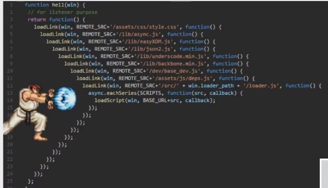
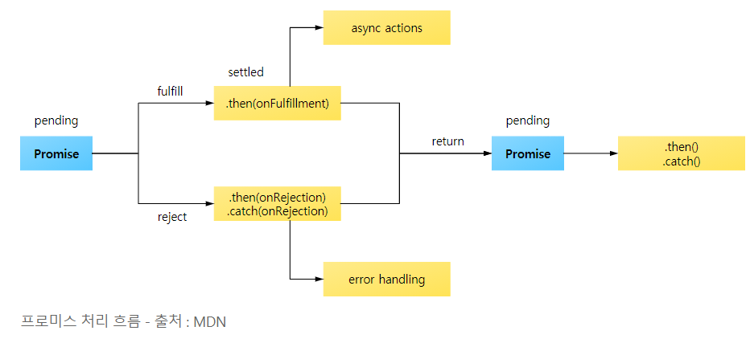
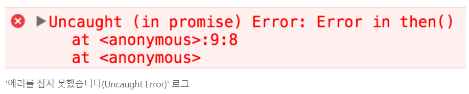
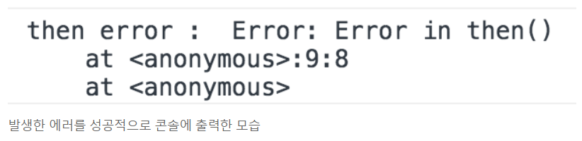
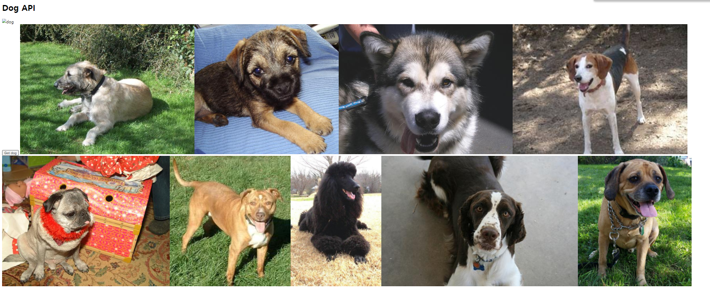

# JavaScript 심화

[toc]

## ECMAScript

> 이전 [TIL](https://github.com/irissooa/irissooa-TIL/blob/master/web/1013_JS(grammer).md)보기!

### ASI(Automatic Semicolon Insertion)

> 문장의 끝이라고 생각되는 부분에 `;`을 찍음(개발자들 `;` 찍자 vs 찍지말자로 논쟁중)
>
> 우리는 안찍고 갈거다! 여러 이유가 있지만 지금 당장 개념적으로 아는게 중요하지 찍어야되냐 말아야되냐는 현재는 중요하지 않다.


## Coding Style Guide

> [JavaScript Standard Guide](https://standardjs.com/readme-kokr.html)

- **2칸 공백을 사용합니다.** 

  - 들여쓰기

- **문자열에 작은 따옴표를 사용합니다.** 

  - 누락된 곳은 제외

- **사용되지 않는 변수가 없어야 합니다.** 
-  이 것은 대량의 버그를 초래하는 원인
  
- **세미콜론이 없어야 합니다.** 
-  [It's](http://blog.izs.me/post/2353458699/an-open-letter-to-javascript-leaders-regarding) [fine.](http://inimino.org/~inimino/blog/javascript_semicolons) [Really!](https://www.youtube.com/watch?v=gsfbh17Ax9I)
  
- `(`, `[`, or ```과 같이 라인을 시작하면 안됨

  - 세미콜론 생략시 반드시 문제가 생길 수 있음 
    - *자동으로 체크할 수 있도록 준비되어 있음.*
  - [More details](https://standardjs.com/rules-kokr.html#semicolons)

- **키워드 뒤에 공백을 사용**

  - `if (condition) { ... }`

- **함수명 뒤에 공백을 사용** 

  - `function name (arg) { ... }`

- 항상 `==` 대신 `===`을 사용

  - 단, `null || undefined`는 `obj == null`로 확인

- node.js에서 err 파라미터는 항상 처리해야 됨

- 항상 브라우저 전역에 `window` 접두사를 붙임 

  - `document`와 `navigator`는 괜찮음

  - `open`, `length`, `event`, `name` 등 불분명하게 브라우저 전역을 우연히 사용하는 것을 방지함

- **[더 많은 장점](https://standardjs.com/rules-kokr.html#javascript-standard-style)** - *`standard`를 시도해보세요!*


## 동기식 처리 모델과 비동기식 처리 모델

### **동기식 처리 모델(Synchronous)**

- 직렬적으로 테스크를 수행
- 테스크는 순차적으로 실행되며 어떤 작업이 수행중이면 다음 작업은 대기
- 예) 서버에서 데이터를 가져와서 화면에 표시하는 작업을 수행할 때, 데이터가 응답될 때까지 이후 테스크들은 **블로킹(blocking)**된다.


### **비동기식 처리 모델(Asynchronous)**

- 병렬적으로 테스크를 수행
- 테스크는 종료되지 않는 상태라 하더라도 대기하지 않고 다음 테스크를 실행
- 예) 서버에서 데이터를 가져와서 화면에 표시하는 작업을 수행할 때, 데이터가 응답될 때까지 **기다리지 않고(non-blocking)** 즉시 다음 테스크를 수행
- JS 대부분의 DOM 이벤트와 Timer 함수, Ajax 요청은 비동기식 처리 모델로 동작


## AJAX(Asynchronous JavaScript And XML)

> [출처 : 이론참고!! joshua1988's github](https://joshua1988.github.io/web-development/javascript/promise-for-beginners/)

### AJAX

> 비동기 처리의 가장 흔한 사례는 제이쿼리의 ajax
>
> JavaScript를 사용한 비동기 통신, 클라이언트와 서버간에 XML 데이터를 주고받는 기술

- 비동기 자바스크립트와 XML을 말함
- **서버와 통신하기 위해 XML객체를 사용하는 것**
- JSON, XML, HTML 그리고 일반 텍스트 형식 등을 포함한 다양한 포맷을 주고 받을 수 있음
- 페이지 전체를 **리프레쉬 하지 않고서도 수행 되는 `비동기성`**임
- 이러한 비동기성을 통해 사용자의 Event가 있으면 **전체 페이지가 아닌 일부분만을 업데이트 **할 수 있게 해줌
- 주요 특징
  - **페이지 새로고침 없이(reload 없이) 서버에 요청**
  - **서버로부터 데이터를 받고 작업을 수행**


#### AJAX 코드 첫 번째 사례

```javascript
function getData() {
	var tableData;
	$.get('https://domain.com/products/1', function(response) {
		tableData = response;
	});
	return tableData;
}

console.log(getData()); // undefined
```

-  `$.get()`이 ajax 통신을 하는 부분
- `https://domain.com` 에다가 HTTP GET 요청을 날려 1번 상품(product) 정보를 요청하는 코드
- 지정된 URL에 ‘데이터를 하나 보내주세요’ 라는 요청을 날리는 것과 같음
- 그렇게 서버에서 받아온 데이터는 `response` 인자에 담김
- `tableData = response;` 코드로 받아온 데이터를 `tableData`라는 변수에 저장함
- 그럼 이제 이 `getData()`를 호출하면  어떻게 될까? 
- 받아온 데이터가 뭐든 일단 뭔가 찍혀야되는데, 결과는 `undefined`!! 
- WHY???
  - `$.get()`로 데이터를 요청하고 받아올 때까지 기다려주지 않고 다음 코드인 `return tableData;`를 실행했기 때문
  - 따라서, `getData()`의 결과 값은 초기 값을 설정하지 않은 tableData의 값 `undefined`를 출력

- **이렇게 특정 로직의 실행이 끝날 때까지 기다려주지 않고 나머지 코드를 먼저 실행하는 것이 비동기 처리** 

##### **자바스크립트에서 비동기 처리가 필요한 이유!!**

> 화면에서 서버로 데이터를 요청했을 때 서버가 언제 그 요청에 대한 응답을 줄지도 모르는데 마냥 다른 코드를 실행 안 하고 기다릴 순 없기 때문
>
> 위에선 간단한 요청 1개만 보냈는데 만약 100개 보낸다고 생각해보자.
>
> 비동기 처리가 아니고 동기 처리라면 코드 실행하고 기다리고, 실행하고 기다리고.. 아마 웹 애플리케이션을 실행하는데 수십 분은 걸림


#### AJAX 코드 두 번째 사례

> 또 다른 비동기 처리 사례는` setTimeout()`
>
> setTimeout()은 Web API의 한 종류
>
> 코드를 바로 실행하지 않고 지정한 시간만큼 기다렸다가 로직을 실행

```javascript
// #1
console.log('Hello');
// #2
setTimeout(function() {
	console.log('Bye');
}, 3000);
// #3
console.log('Hello Again');
```

- 비동기 처리에 대한 이해가 없는 상태에서 위 코드를 보면
  - ‘Hello’ 출력
  - 3초 있다가 ‘Bye’ 출력
  - ‘Hello Again’ 출력

- 그런데 실제 결과 값!!
  - ‘Hello’ 출력
  - ‘Hello Again’ 출력
  - 3초 있다가 ‘Bye’ 출력

- `setTimeout()` 역시 비동기 방식으로 실행되기 때문에 3초를 기다렸다가 다음 코드를 수행하는 것이 아니라 일단 `setTimeout()`을 실행하고 나서 바로 다음 코드인 `console.log('Hello Again');`으로 넘어감.
- 따라서, `‘Hello’, ‘Hello Again’`를 먼저 출력하고 `3초`가 지나면 `‘Bye’`가 출력


##### setTimeout(mycallback, msecs)

- callback 함수가 1초 뒤에 실행될 것이다 라는 의미가 아니다.
- **1초 후에 콜백 큐에 추가될 것이라는 의미**
- 만약에 콜백 큐에 mycallback 보다 먼저 추가된 이벤트가 있을수도 있기 때문에 실제 1초보다 더 오랜시간이 걸릴수도 있다.

- 비동기식 처리 순서 연습(1)

```javascript
console.log('Hi')

setTimeout(function ssafy() {
  console.log('ssafy')
}, 5000)
// [주의!] 5000이든 0이든 출력은 동일 - 이 시간은 콜백큐로 가는 시간이다. 비동기 처리가 모두 끝나야 출력된다!

console.log('bye')
```


#### async (비동기)방식

-  웹페이지를 리로드하지 않고 데이터를 불러오는 방식
- 장점
  - 페이지 리로드의 경우 전체 리소스를 다시 불러와야하는데 
  - 이미지, 스크립트 , 기타 코드등을 모두 재요청할 경우 불필요한 리소스 낭비가 발생하게 되지만 
  - 비동기식 방식을 이용할 경우 필요한 부분만 불러와 사용할 수 있음!


#### 왜 사용하는가?

- 기본적으로 HTTP프로토콜은 클라이언트쪽에서 Request를 보내고 Server쪽에서 Response를 받으면 이어졌던 연결이 끊김
- 화면의 내용을 갱신하기 위해서는 다시 request를 하고 response를 하면서 페이지 전체를 갱신함
- 페이지의 일부분만 갱신할 경우에도 페이지 전체를 다시 로드해야하는데 엄청난 자원낭비와 시간낭비
- BUT!! ajax는 html 페이지 전체가 아닌 일부분만 갱신할수 있도록 XML HttpRequest객체를 통해 서버에 request
- 이 경우 **Json이나 xml형태로 필요한 데이터만 받아 갱신하기 때문에** 그만큼의 자원과 시간을 아낄 수 있다.


#### AJAX 장점

1. 웹페이지의 속도향상
2. 서버의 처리가 완료 될때까지 기다리지 않고 처리 가능하다.
3. 서버에서 Data만 전송해면 되므로 전체적인 코딩의 양이 줄어든다.
4. 기존 웹에서는 불가능했던 다양한 UI를 가능하게 해준다.  사진공유 사이트 Flickr의 경우 사진의 제목이나 태그를 페이지 리로드 없이 수정할 수 있다.


#### AJAX 단점

1. 히스토리 관리가 안 된다. (보안에 좀 더 신경을 써야한다.)

2. 연속으로 데이터를 요청하면 서버 부하가 증가할 수 있다.

3. XMLHttpRequest를 통해 통신을 하는 경우사용자에게 아무런 진행 정보가 주어지지 않는다.  그래서 아직 요청이 완료되지 않았는데 사용자가 페이지를 떠나거나 오작동할 우려가 발생하게 된다. 


### XHR(XML Http Request)

- XHR객체는 서버와 상호작용하기 위하여 사용됨
- **전체 페이지이의 새로고침 없이**도 URL로부터 데이터를 받아올 수 있음
- **사용자가 하고 있는 것을 방해하지 않으면서 페이지의 일부를 업데이트** 할 수 있음
- AJAX프로그래밍에 주로 사용됨
- 브라우저는 `XMLHttpRequest` 객체를 이용하여 Ajax 요청을 생성하고 전송
- 서버가 브라우저의 요청에 대해 응답을 반환하면 같은 XHR 객체가 그 결과를 처리
- (참고) 단, IE 5, 6 에서는 `ActiveXobject` 를 사용해야 한다.


### How JavaScript Works

> 1. Asynchronous : 기다려주지 않음
> 2. Single Thread : 혼자서 일 하나의 일만 처리할 수 있음
> 3. Event Loop : 이 메커니즘으로 일을 함

#### 1. Asynchronous

> JavaScript는 기다려주지 않음
>
> WHY?? 혼자서 일을 하기 떄문에(`Single Thread`) 기다리는 동안 다른 일을 하지 않으면 낭비가 심함


#### 2. Single Thread

> 혼자 일을 해서 한번에 하나의 일만 할 수 있음


#### 3. Event Loop

> JavaScript는 Event Loop 메커니즘으로 일을 함!
>
> **자바스크립트를 단일 스레드 프로그래밍 언어라 한번에 하나씩 밖에 실행할 수 없다.
> 그러나 Web API, Callback Queue, Event Loop 덕분에 멀티 스레드 처럼 보여진다.** 
>
> 
>
> - 자바스크립트 엔진은 ***Memory Heap*** 과 ***Call Stack*** 으로 구성되어 있다.(그림 왼쪽!)
> - 가장 유명한 것이 구글의 V8 Engine이다.
> - 자바스크립트는 ***단일 스레드 (sigle thread) 프로그래밍*** 언어
>   - 이 의미는 ***Call Stack이 하나*** 라는 이야기이다.
>   - *(멀티가 되지 않고, 하나씩 하나씩 처리한다는 의미!)*
>   - `Memory Heap` : 메모리 할당이 일어나는 곳
>     (ex, 우리가 프로그램에 선언한 변수, 함수 등이 담겨져 있음)
>   - `Call Stack` : 코드가 실행될 때 쌓이는 곳. stack 형태로 쌓임.
>     - `Stack(스택)` : 자료구조 중 하나, 선입후출(LIFO, Last In First Out)의 룰을 따른다
> - V8 엔진에서 코드가 실행되면, Call Stack에 쌓인다.
> - Stack의 선입후출의 룰에 따라 제일 마지막에 들어온 함수가 먼저 실행되며, Stack에 쌓여진 함수가 모두 실행된다.
>
>   - 비동기함수가 실행된다면, Web API가 호출된다.
> - Web API는 비동기함수의 콜백함수를 Callback Queue에 밀어넣는다.
>   - Event Loop는 Call Stack이 빈 상태가 되면 Callback Queue에 있는 첫번째 콜백을 Call Stack으로 이동시킨다.
>   - 이러한 반복적인 행동을 이벤트 루프에서 `틱(tick)`이라 한다.
>

##### 1st. Call Stack

- 요청이 들어올 때마다 해당 요청을 순차적으로 처리하는 Stack(LIFO)형태의 자료 구조

- 함수 호출 기록

- 만약 콜스택이 비어 있으면 이벤트 루프는 콜백큐에서 첫 번째 이벤트를 가져다가 콜스택에 밀어 넣고, 결과적으로 해당 이벤트가 실행된다.

  

##### 2nd. Web API(Browser API)

- JavaScript 엔진이 아닌 브라우저 영역에서 제공하는 API
- 그림의 오른쪽에 있는 Wep API는 JS Engine의 밖에 그려져 있다.
- 이벤트 루프는 호스팅 환경(브라우저 or nodejs)에 내장된 메커니즘
- 즉, 자바스크립트 엔진이 아니다.
- ***Web API*** 는 ***브라우저에서 제공하는 API*** 로, DOM, Ajax, Timeout 등이 있다.
- Call Stack에서 실행된 비동기 함수는 Web API를 호출하고, 
- Web API는 콜백함수를 Callback Queue에 밀어 넣는다.


##### 3rd. Task Queue

- 콜백 함수가 대기하는 Queue(FIFO) 형태의 자료구조
- ***비동기적으로 실행된 콜백함수가 보관*** 되는 영역이다.
- 예를 들어 setTimeout에서 타이머 완료 후 실행되는 함수(1st 인자),
- addEventListener에서 click 이벤트가 발생했을 때 실행되는 함수(2nd 인자) 등이 보관된다.
  - Queue(큐) : 자료 구조 중 하나, 선입선출(FIFO, Frist In Frist OUT)의 룰을 따른다.


##### 4th. Event Loop

- 단 한가지 **콜스택**과 **콜백큐**를 감시하는 역할만 한다.

- Call Stack에 현재 실행 중인 Task가 없는지 확인하고 Task Queue에 Task가 있는지 확인
- Event Loop는 Call Stack과 Callback Queue의 상태를 체크하여,***Call Stack이 빈 상태가 되면, Callback Queue의 첫번째 콜백을 Call Stack으로 밀어넣는다.***
- 이러한 반복적인 행동을 ***틱(tick)*** 이라 부른다.
- 이것은 시간의 흐름에 따라 코드의 수행을 처리하며 그 때마다 JS 엔진을 작동 시킨다.


## **Callback Function**

> 다른 함수에 인자로 넘어가는 함수
>
>  **JS 함수는 `일급객체`** (cf. 파이썬도 `일급객체`)
>
> ***일급 객체가 되기 위한 3가지 조건***
>
> 1) 변수에 담을 수 있다.
>
> 2) 인자로 전달할 수 있다. `콜백함수`
>
> 3) 반환값으로 전달할 수 있다. `return n => n + 1`
>
> ex) python(map), JavaScript(map, addEventListener), Django(urls.py)

- 인수로 다른 함수에 전달된 함수
- 명시적으로 호출하는 방식이 아니라 **특정 이벤트가 발생했을 때** 시스템에 의해 호출되는 함수
  - 다른 함수의 실행이 끝나고 난 뒤에 실행되는 함수. 
  - '나중에 너 실행 끝나면 나 좀 호출해줘.'
- 함수의 호출권한을 내가 아닌 시스템이 가진다.


### Callback함수로 비동기 처리 방식의 문제점 해결!

> 앞에서 자바스크립트 비동기 처리 방식에 의해 야기될 수 있는 문제들을 살펴봄
>
> 이러한 문제들은 어떻게 해결할 수 있을까?
>
> 바로 `콜백(callback) 함수를 이용`하는 것
>
> ***Ajax 첫번째 사례*** 에서 살펴본 ajax 통신 코드를 콜백 함수로 개선

```javascript
function getData(callbackFunc) {
	$.get('https://domain.com/products/1', function(response) {
		callbackFunc(response); // 서버에서 받은 데이터 response를 callbackFunc() 함수에 넘겨줌
	});
}

getData(function(tableData) {
	console.log(tableData); // $.get()의 response 값이 tableData에 전달됨
});
```


### Callback hell

- 콜백 지옥은 비동기 처리 로직을 위해 콜백 함수를 연속해서 사용할 때 발생하는 문제
- 웹 서비스를 개발하다 보면 서버에서 데이터를 받아와 화면에 표시하기까지 인코딩, 사용자 인증 등을 처리해야 하는 경우가 있다
- 만약 이 모든 과정을 비동기로 처리해야 한다고 하면 위와 같이 콜백 안에 콜백을 계속 무는 형식으로 코딩
- 이러한 코드 구조는 가독성도 떨어지고 로직을 변경하기도 어렵
- 이와 같은 코드 구조를 *콜백 지옥* 이라고 함




### Callback hell 해결하는 방법

- `Promise`나 `Async`를 사용하는 방법이 편함!
- 코딩 패턴으로만 콜백 지옥 해결하려면 콜백 함수 분리

```javascript
function parseValueDone(id) {
	auth(id, authDone);
}
function authDone(result) {
	display(result, displayDone);
}
function displayDone(text) {
	console.log(text);
}
$.get('url', function(response) {
	parseValue(response, parseValueDone);
});
```


## **Promise**

> 여기서 자바스크립트의 **비동기 처리**란 ‘특정 코드의 실행이 완료될 때까지 기다리지 않고 다음 코드를 먼저 수행하는 자바스크립트의 특성’을 의미

- **Promise는 비동기 작업의 최종 완료 또는 실패를 나타내는 객체**
- **Promise객체는 비동기 작업이 맞이할 미래의 완료 또는 실패와 그 결과 값**을 나타냄


### Promise가 왜 필요한가?

- 프로미스는 주로 서버에서 받아온 데이터를 화면에 표시할 때 사용
- 일반적으로 웹 애플리케이션을 구현할 때 서버에서 데이터를 요청하고 받아오기 위해 아래와 같은 API를 사용

```javascript
$.get('url 주소/products/1', function(response) {
  // ...
});
```

- 위 API가 실행되면 서버에다가 `‘데이터 하나 보내주세요’` 라는 요청을 보냄.
- 그런데 여기서 데이터를 받아오기도 전에 마치 데이터를 다 받아온 것 마냥 화면에 데이터를 표시하려고 하면 오류가 발생하거나 빈 화면이 뜸.
- 이와 같은 문제점을 해결하기 위한 방법 중 하나가 `Promise`


### Promise 기초

- 아래 코드는 간단한 ajax 통신 코드

```javascript
function getData(callbackFunc) {
  $.get('url 주소/products/1', function(response) {
    callbackFunc(response); // 서버에서 받은 데이터 response를 callbackFunc() 함수에 넘겨줌
  });
}

getData(function(tableData) {
  console.log(tableData); // $.get()의 response 값이 tableData에 전달됨
});
```

- 위 코드는 제이쿼리의 ajax 통신 API를 이용하여 지정된 url에서 1번 상품 데이터를 받아오는 코드
- 비동기 처리를 위해 프로미스 대신에 콜백 함수를 사용

- 위 코드에 프로미스를 적용하면 아래와 같은 코드가 됨

```javascript
function getData(callback) {
  // new Promise() 추가
  return new Promise(function(resolve, reject) {
    $.get('url 주소/products/1', function(response) {
      // 데이터를 받으면 resolve() 호출
      resolve(response);
    });
  });
}

// getData()의 실행이 끝나면 호출되는 then()
getData().then(function(tableData) {
  // resolve()의 결과 값이 여기로 전달됨
  console.log(tableData); // $.get()의 reponse 값이 tableData에 전달됨
});
```

- 콜백 함수로 처리하던 구조에서 `new Promise()`, `resolve()`, `then()`와 같은 프로미스 API를 사용한 구조로 바뀜
- 여기서 `new Promise()`는 좀 이해가 가겠는데 `resolve()`, `then()`은 뭐 하는 애들일까?


### Promise의 3가지 states

> 프로미스를 사용할 때 알아야 하는 가장 기본적인 개념
>
> 여기서 말하는 상태(`states`)란 프로미스의 처리 과정을 의미
>
> `new Promise()`로 프로미스를 생성하고 종료될 때까지 3가지 상태를 가짐
>
> - Pending(대기) : 비동기 처리 로직이 아직 완료되지 않은 상태
> - Fulfilled(이행) : 비동기 처리가 완료되어 프로미스가 결과 값을 반환해준 상태
> - Rejected(실패) : 비동기 처리가 실패하거나 오류가 발생한 상태
>
> 

#### Pending(대기)

- 먼저 아래와 같이 `new Promise()` 메서드를 호출하면 대기(Pending) 상태가 됨

```javascript
new Promise();
```

- `new Promise()` 메서드를 호출할 때 콜백 함수를 선언할 수 있고, 콜백 함수의 인자는 `resolve`, `reject`

```javascript
new Promise(function(resolve, reject) {
  // ...
});
```


#### Fulfilled(이행)

> 프로미스의 '이행' 상태를 좀 다르게 표현해보면 '완료' 

- 여기서 콜백 함수의 인자 `resolve`를 아래와 같이 실행하면 이행(Fulfilled) 상태가 됨

```javascript
new Promise(function(resolve, reject) {
  resolve();
});
```

- 그리고 이행 상태가 되면 아래와 같이 `then()`을 이용하여 처리 결과 값을 받을 수 있음!

```javascript
function getData() {
  return new Promise(function(resolve, reject) {
    var data = 100;
    resolve(data);
  });
}

// resolve()의 결과 값 data를 resolvedData로 받음
getData().then(function(resolvedData) {
  console.log(resolvedData); // 100
});
```


#### Rejected(실패)

- `new Promise()`로 프로미스 객체를 생성하면 콜백 함수 인자로 `resolve`와 `reject`를 사용할 수 있다
- 여기서 `reject`를 아래와 같이 호출하면 실패(Rejected) 상태가 됨.

```javascript
new Promise(function(resolve, reject) {
  reject();
});
```

- 그리고, 실패 상태가 되면 실패한 이유(실패 처리의 결과 값)를 `catch()`로 받을 수 있음.

```javascript
function getData() {
  return new Promise(function(resolve, reject) {
    reject(new Error("Request is failed"));
  });
}

// reject()의 결과 값 Error를 err에 받음
getData().then().catch(function(err) {
  console.log(err); // Error: Request is failed
});
```


### Promise 코드 예제

> ajax 통신 예제 코드에 프로미스를 적용

```javascript
function getData() {
  return new Promise(function(resolve, reject) {
    $.get('url 주소/products/1', function(response) {
      if (response) {
        resolve(response);
      }
      reject(new Error("Request is failed"));
    });
  });
}

// 위 $.get() 호출 결과에 따라 'response' 또는 'Error' 출력
getData().then(function(data) {
  console.log(data); // response 값 출력
}).catch(function(err) {
  console.error(err); // Error 출력
});
```

- 위 코드는 서버에서 제대로 응답을 받아오면 `resolve()` 메서드를 호출
- 응답이 없으면 `reject()` 메서드를 호출
- 호출된 메서드에 따라 `then()`이나 `catch()`로 분기하여 응답 결과 또는 오류를 출력


### Promise Chaining

> 여러 개의 프로미스 연결하기

- 프로미스의 또 다른 특징은 여러 개의 프로미스를 연결하여 사용할 수 있다는 점
- 앞 예제에서 `then()` 메서드를 호출하고 나면 새로운 프로미스 객체가 반환됨
- 따라서, 아래와 같이 코딩이 가능

```javascript
function getData() {
  return new Promise({
    // ...
  });
}

// then() 으로 여러 개의 프로미스를 연결한 형식
getData()
  .then(function(data) {
    // ...
  })
  .then(function() {
    // ...
  })
  .then(function() {
    // ...
  });
```


#### Promise Chaining 예시

> 비동기 처리 예제에서 가장 흔하게 사용되는 [setTimeout() API](https://developer.mozilla.org/en-US/docs/Web/API/WindowOrWorkerGlobalScope/setTimeout)를 사용

```javascript
new Promise(function(resolve, reject){
  setTimeout(function() {
    resolve(1);
  }, 2000);
})
.then(function(result) {
  console.log(result); // 1
  return result + 10;
})
.then(function(result) {
  console.log(result); // 11
  return result + 20;
})
.then(function(result) {
  console.log(result); // 31
});
```

- 위 코드는 프로미스 객체를 하나 생성하고 `setTimeout()`을 이용해 2초 후에 `resolve()`를 호출하는 예제
- `resolve()`가 호출되면 프로미스가 대기 상태에서 이행 상태로 넘어가기 때문에 첫 번째 `.then()`의 로직으로 넘어감
  1. 첫 번째 `.then()`에서는 이행된 결과 값 1을 받아서 10을 더한 후 그다음 `.then()` 으로 넘겨줌
  2. 두 번째 `.then()`에서도 마찬가지로 바로 이전 프로미스의 결과 값 11을 받아서 20을 더하고 다음 `.then()`으로 넘겨줌
  3. 마지막 `.then()`에서 최종 결과 값 31을 출력


### Promise 에러 처리 방법

- 실제 서비스를 구현하다 보면 네트워크 연결, 서버 문제 등으로 인해 오류가 발생할 수 있음
- 에러 처리 방법에는 다음과 같이 2가지 방법이 있다.

1. `then()`의 두 번째 인자로 에러를 처리하는 방법

```javascript
getData().then(
  handleSuccess,
  handleError
);
```

2. `catch()`를 이용하는 방법

```javascript
getData().then().catch();
```

- 위 2가지 방법 모두 프로미스의 `reject()` 메서드가 호출되어 실패 상태가 된 경우에 실행됨
- 간단하게 말해서 프로미스의 로직이 정상적으로 돌아가지 않는 경우 호출

```javascript
function getData() {
  return new Promise(function(resolve, reject) {
    reject('failed');
  });
}

// 1. then()의 두 번째 인자로 에러를 처리하는 코드
getData().then(function() {
  // ...
}, function(err) {
  console.log(err);
});

// 2. catch()로 에러를 처리하는 코드
getData().then().catch(function(err) {
  console.log(err);
});
```


#### promise 에러 처리는 가급적 `catch()`를 사용

> `catch()`로 에러를 처리하는 게 더 효율적

```javascript
// then()의 두 번째 인자로는 감지하지 못하는 오류
function getData() {
  return new Promise(function(resolve, reject) {
    resolve('hi');
  });
}

getData().then(function(result) {
  console.log(result);
  throw new Error("Error in then()"); // Uncaught (in promise) Error: Error in then()
}, function(err) {
  console.log('then error : ', err);
});
```

- `getData()` 함수의 프로미스에서 `resolve()` 메서드를 호출하여 정상적으로 로직을 처리했지만, `then()`의 첫 번째 콜백 함수 내부에서 오류가 나는 경우 오류를 제대로 잡아내지 못함
- 따라서 코드를 실행하면 아래와 같은 오류가 남



- 하지만 똑같은 오류를 `catch()`로 처리하면 다른 결과가 나옵니다.

```javascript
// catch()로 오류를 감지하는 코드
function getData() {
  return new Promise(function(resolve, reject) {
    resolve('hi');
  });
}

getData().then(function(result) {
  console.log(result); // hi
  throw new Error("Error in then()");
}).catch(function(err) {
  console.log('then error : ', err); // then error :  Error: Error in then()
});
```




### async & await(ES8+)

> 최근에 많이 쓰임!

- async와 await는 자바스크립트의 비동기 처리 패턴 중 가장 최근에 나온 문법
- 기존의 비동기 처리 방식인 콜백 함수와 프로미스의 단점을 보완하고 개발자가 읽기 좋은 코드를 작성할 수 있게 도와줌
- **Syntactic Sugar**
  - 문법이 너무 어렵고 복잡해서 사용하기 어려워 문법적으로 개발자들이 사용하기 쉽게 만들어 놓음!


- 결과적으로 왜 쓰냐?
  - **동기적으로** 코드를 짤 수 있음!!
  - 우리가 볼 때는 직관적으로 코드를 보이게 해줌


#### async & await 기본 문법

```javascript
async function 함수명() {
  await 비동기_처리_메서드_명();
}
```

- 먼저 함수의 앞에 `async` 라는 예약어를 붙임
- 그러고 나서 함수의 내부 로직 중 HTTP 통신을 하는 비동기 처리 코드 앞에 `await`를 붙임
- 여기서 주의 할 점은 비동기 처리 메서드가 꼭 프로미스 객체를 반환해야 `await`가 의도한 대로 동작함
- 일반적으로 `await`의 대상이 되는 비동기 처리 코드는 [Axios](https://github.com/axios/axios) 등 프로미스를 반환하는 API 호출 함수


#### async & await 예제

```javascript
function fetchItems() {
  return new Promise(function(resolve, reject) {
    var items = [1,2,3];
    resolve(items)
  });
}

async function logItems() {
  var resultItems = await fetchItems();
  console.log(resultItems); // [1,2,3]
}
```

- 먼저 `fetchItems()` 함수는 프로미스 객체를 반환하는 함수
- 프로미스는 `자바스크립트 비동기 처리를 위한 객체`
- `fetchItems()` 함수를 실행하면 프로미스가 이행(Resolved)되며 결과 값은 `items` 배열이 됨
- `logItems()` 함수를 실행하면 `fetchItems()` 함수의 결과 값인 `items` 배열이 `resultItems` 변수에 담김
- 따라서, 콘솔에는 `[1,2,3]`이 출력됨
- `await`를 사용하지 않았다면 데이터를 받아온 시점에 콘솔을 출력할 수 있게 콜백 함수나 `.then()`등을 사용해야됨
- 하지만 `async await 문법` 덕택에 비동기에 대한 사고를 하지 않아도 됨


#### async & await 예외 처리

- [try catch](https://developer.mozilla.org/en-US/docs/Web/JavaScript/Reference/Statements/try...catch)
- 프로미스에서 에러 처리를 위해 `.catch()`를 사용했던 것처럼 async에서는 `catch {}` 를 사용하면 됨.

```javascript
async function logTodoTitle() {
  try {
    var user = await fetchUser();
    if (user.id === 1) {
      var todo = await fetchTodo();
      console.log(todo.title); // delectus aut autem
    }
  } catch (error) {
    console.log(error);
  }
}
```

- 위의 코드를 실행하다가 발생한 네트워크 통신 오류뿐만 아니라 간단한 타입 오류 등의 일반적인 오류까지도 `catch`로 잡아낼 수 있음
- 발견된 에러는 `error` 객체에 담기기 때문에 에러의 유형에 맞게 에러 코드를 처리하면 됨


### **Axios**

> [공식문서](https://github.com/axios/axios)
>
> **Promise** based HTTP client for the **browser and node.js**
>
> 편하게(직관적으로) promise를 기반(`.then`, `.catch`)으로 한 요청을 보내자!
>
> - `axiosXHR`을 요청으로 보내고 응답 받은 결과를 `Promise 객체`로 반환 해주는 라이브러리
>
> - axios는 현재 JS 에서 가장 HOT한 라이브러리 중 하나이며 프론트엔드 프레임워크(react, vue)에서 데이터를 주고 받을 때 필수적으로 사용되고 있음(프론트엔드 프레임워크와 API 서버 간의 데이터를 주고 받을 때!)

#### Axios 가져오기

1. 라이브러리를 가져옴
   - `npm install axios` 로 axios 라이브러리 설치
2. 브라우저를 사용하는 경우 CDN을 사용하여 스크립트를 가져올 수 있음

```html
<!--axios CDN가져옴 script 위에 붙임 -->
<script src="https://cdn.jsdelivr.net/npm/axios/dist/axios.min.js"></script>
```

#### Axios 기본 틀

```html
<script>
//기본 틀
    const axios = require('axios') // JS에서 import하는 방법

    axios.get('http://jsonplaceholder.typicode.com/posts')
    .then(response => {
     console.log(response)
    })
    .catch(err => { // 요청이 잘못되었을 때
     console.log(err)
    })
</script>
```


#### Get 요청을 보냄

- Axios로 첫 번째 요청을 보냄
- `GET`일반적으로 데이터를 검색하는 데 사용 요청
- 블로그 게시물 목록을 보내는 외부 API에 HTTP 요청함
- `.then` : 데이터를 받으면 내용을 콘솔에 기록
- `.catch` : 오류가 발생하면 로그도 기록


- [실습] 랜덤 강아지 이미지 가져오기 - `04_dogs_and_cats.html`
  - 강아지 사진 매수 보여주기 기능도 추가함

```html
<!DOCTYPE html>
<html lang="ko">
<head>
  <meta charset="UTF-8">
  <meta name="viewport" content="width=device-width, initial-scale=1.0">
  <meta http-equiv="X-UA-Compatible" content="ie=edge">
  <title>Document</title>
  <style>
    img {
      width: 300px;
      height: 300px;
    }
  </style>
</head>
<body>
  <h1>Random Dog & Cat Image</h1>
  <button id="dog-button">Dog Image On!</button> <span id="dogCount">0</span>장 &nbsp;
  <button id="cat-button">Cat Image On!</button> <span id="catCount">0</span>장 <br>
  <hr>
  <div class="animals"></div>
  <script src="https://unpkg.com/axios/dist/axios.min.js"></script>
  <script>
    const getDogImage = function () {
      // axios가 비동기 함수로 구동되고 있다.
      // 중요한건 누르는 순서가 아닌 내부적으로 처리되는 순서로 사진이 출력되므로
      // 우리가 원하는 대로 출력되지 않을 수도 있다.
      axios.get('https://dog.ceo/api/breeds/image/random')
        .then(response => { // () 안에 있는게 통째로 callback 함수이므로
          // 먼저 response를 consle로 찍어서 URL이 어디에 있는지 확인하자!
          const imgUrl = response.data.message
          // img tag 만들기
          const imgTag = document.createElement('img')
          // imgTag 의 src에 imgUrl 넣기
          imgTag.src = imgUrl
          // .animals 라는 div 의 자식요소로 imgTag 를 붙이자.
          document.querySelector('.animals').append(imgTag)
        })
        .catch(error => console.log(error))
    }
    const dogButton = document.querySelector('#dog-button')
    const dogCnt = document.querySelector('#dogCount')
    let dogCount = 0
    // dogButton.addEventListener('click', getDogImage)
    dogButton.addEventListener('click', function() {
      getDogImage()
      dogCount += 1
      dogCnt.innerText = dogCount
    })
  
  </script>
</body>
</html>
```




#### Like 기능 비동기적으로 구현(axios 적용) 

1. `base.html` >  `head 태그` 

   - `axios CDN` 추가

2. `articles `> `index.html` 수정

   - a 태그 삭제 -> 자바스크립트로 요청을 보내므로 필요 없음
   - 조건문을 `i 태그` 클래스 안에 삽입
   - 어떠한 article에 대한 버튼인지 하트에 정보를 더 추가해야함 (고유 클래스 부여)
     - `like-button` 클래스 속성(자바스크립트에서 클래스를 찾기 위한 용도)
     - 자바스크립트는 `data-id`를 통해 개별적인 오브젝트에 접근 가능
   - `data-id` 는 [HTMLElement.dataset](https://developer.mozilla.org/ko/docs/Web/API/HTMLElement/dataset) 속성을 활용한 것으로 HTML 이나 DOM 요소의 커스텀 데이터 속성(data-*)에 대한 읽기와 쓰기 접근을 허용시킴.
   - 어떤 게시글의 좋아요인지 알기 위해 `index.html`에 `data-id` 속성을 추가한다.

   - **`data-id`를 통해 각 객체에 접근할 수 있다.**

   - 구별할 수 있는 `article.pk`를 빌려와 사용한다.

```html
<i class="fas fa-heart like-button" style="color: crimson;" data-id="{{ article.pk }}"></i>
<i class="fas fa-heart like-button" style="color: black;" data-id="{{ article.pk }}"></i>
```

- `dataset` 을 통해 개별적인 객체에 접근이 가능하다.
  - 콘솔창에서 id가 새로 생성됨을 확인할 수 있다.

```sh
dataset: DOMStringMap {id: "4"}
```


3. Like button

```html
<script>
    const likebuttons = document.querySelectorAll('.like-button')
    likebuttons.forEach(function(button){
        button.addEventListener('click', function(event){
            // console.log(event)
            const articleId = event.target.dataset.id
            axios.get(`/articles/${articleId}/like/`)
            		.then(function(response){
                		console.log(response)
            		})
        })
    })
</script>
```

- 버튼이 한개만 있는 것이 아니므로 (각 article 별로 좋아요 버튼이 있음)

- 모든 버튼을 다 가지고 와야함.
-  `document.querySelectorAll` 을 이용하여 모든 데이터를 가져오며, 반복문을 통해 개별적인 버튼에 대한 `addEventListentListener` 구현.
- 이때 querySelectorAll의 인자로 i 태그 클래스 내에서 정의한 클래스명인 `like-button`를 사용
- `event` 오브젝트 객체 안, 정확히는 `event.target.dataset.id`의 value에는 data-id의 값인 `{{article.id}}`이 저장되어있으며, 이를 좋아요 기능에 대한 url 주소를 불러올 variable routing값으로 쓰임.
- urlpattern에 따라 좋아요의 url 주소는 `<int:article_id>/like/` 와 같이 정의 되어 있으며, 이 주소를 `axios.get`의 인자로 넘김.
- 요청에 대한 응답(`.then` 메서드)으로, response 객체의 반환 값으로 views.py를 통해 redirect된 list.html 전체가 반환됨. 우리는 “좋아요” 기능만 구현하면 되므로, HTML 문서 전체를 반환할 필요가 없음. 이는 불필요한 응답이므로 views.py 수정이 필요함


4. `articles` > `views.py`

> 기존 redirect 로 인해 `index.html` 로 페이지가 로딩되는 것이 아닌 JSON 형태로 응답결과를 반환 받기로 변경한다.
>
> JSON 데이터에 liked 변수를 만들어서 template 에서 좋아요를 취소할지 추가할지를 판단할 수 있도록 한다.
>
>  liked 변수는 False로, 반대의 경우(좋아요를 누르는 경우)는 liked 변수에 True 값
>
> 그래서 True False 값을 통해 좋아요 버튼의 style 값(여기서는 버튼의 색깔)을 변경한다.

```python
from django.http import JsonResponse

@require_POST
def like(request, article_pk):
    if request.user.is_authenticated:
        article = get_object_or_404(Article, pk=article_pk)
        user = request.user

        if article.like_users.filter(pk=user.pk).exists():
        # if user in article.like_users.all():
            article.like_users.remove(user)
            liked = False
        else:
            article.like_users.add(user)
            liked = True
            
		#앞으로는 json 파일에 담아서 같이 보낸다.
        like_status = {
            'liked': liked,
            'count': article.like_users.count(),
        }
        #추가
        return JsonResponse(like_status)
        # return redirect('articles:index')
    return redirect('accounts:login')
```


5.  좋아요 색 변경

> `event` > `target` > `style` > `color`에 색깔 정보가 있다.

- `articles` > `index.html`

> 좋아요 버튼 누를 때마다 버튼의 색깔만 바뀌고 좋아요 개수는 아직 변하지 않는다.

```html
<script>
  // 1. 각 게시글별로 좋아요 버튼이 있으니 모두 선택해야 한다.
  const likebuttons = document.querySelectorAll('.like-button')

  // 2. forEach를 사용해서 각각의 좋아요 버튼을 클릭
  likebuttons.forEach(button => {
    button.addEventListener('click', function (event) {
      // 항상 처음에는 console로 function의 인자를 찍어보고 어디로 들어가야 하는지 반드시 파악하자
      // console.log(event)

      // event.target.dataset.id 의 value는 data-id 값이 들어 있다.
      const articleId = event.target.dataset.id // 이와 같이 사용하기 위해 console로 찍어서 경로를 확인해야 한다!
      axios.get(`/articles/${articleId}/like/`) // 해당 상세 게시글의 좋아요 요청을 보낸다.(url주소는 urls.py 참고)
        .then(response => {
          // console.log(response) // 반드시 console로 먼저 확인
          if (response.data.liked) {
            // 좋아요 색깔을 빨갛게
            event.target.style.color = 'crimson'
          } else {
            // 좋아요 색깔을 까맣게
            event.target.style.color = 'black'
          }
        })
        .catch(error => console.log(error)) // 반드시 console로 먼저 확인)
    })
  })
</script> 
```

6. 좋아요 개수도 함께 출력

- `like` view 함수의 `context` 안에 `'count': article.like_users.count(),` 추가
- `index.html` 

> span 태그로 숫자 부분만 감싸고 id 속성을 추가한다.
>
> 각각이 다른 id 값을 가져야 하므로 id 작성시 article.pk 이용

```html
<!-- before -->
<b>{{ article.like_users.all|length }}</b>명이 이 글을 좋아합니다. 

<!-- after -->
<b><span id="like-count-{{ article.pk }}">{{ article.like_users.all|length }}</span></b>명이 이 글을 좋아합니다. 
```

- `index.html`

> `.then` 구문 안에 다음과 같은 구문 추가
>
> id 속성에 접근하므로 `.querySelector` 안에 작성시 `#`을 꼭 붙여준다.

```javascript
document.querySelector(`#like-count-${articleId}`).innerText = response.data.count
```

- `index.html` - `post` 방식으로 보내기

> `axios.get(~)`을 `axios.post(~)`로 바꾸면 403 error(forbidden)가 발생한다.

```javascript
// before
axios.get(`/articles/${articleId}/like/`) 

// after
axios.post(`/articles/${articleId}/like/`) 
```

> 이를 해결하기 위해 쿠키에 `csrf`를 담아서 보내줘야 한다. [(공식 문서)](https://docs.djangoproject.com/en/2.2/ref/csrf/#setting-the-token-on-the-ajax-request)

```javascript
// axios.post(~) 이전에 아래 두 줄 추가
axios.defaults.xsrfCookieName = 'csrftoken'
axios.defaults.xsrfHeaderName = 'X-CSRFToken'
```


7. 요청이 ajax 요청일 때만 받아들이게 하기

```python
# views.py

from django.http import JsonResponse, HttpResponseBadRequest

@login_required
def like(request, article_pk):
    if request.is_ajax(): # if문으로 분기
        article = get_object_or_404(Article, pk=article_pk)
        if article.like_users.filter(pk=request.user.pk).exists():
            article.like_users.remove(request.user)
            liked = False
        else:
            article.like_users.add(request.user)
            liked = True
        context = {'liked': liked, 'count': article.like_users.count(),}
        return JsonResponse(context)
    else:
        return HttpResponseBadRequest()
```

- 하지만 현재 상황은 django가 ajax 요청인지 아직 모른다.

- django측에 ajax 요청임을 알려줘야 한다.

- axios 공식 문서의 `Request Config`에서 `headers: {'X-Requested-With': 'XMLHttpRequest'},` 구문을 찾아 `index.html`에 붙여넣어야 한다. [(공식 문서)](https://github.com/axios/axios#request-config)

- 추가로 `.headers.common`도 붙여줘야 한다. [(공식 문서)](https://github.com/axios/axios#global-axios-defaults)

```javascript
const articleId = event.target.dataset.id

// ajax 요청임을 알려주는 구문 (이거 추가)
axios.defaults.headers.common['X-Requested-With'] = 'XMLHttpRequest' 

// POST 요청임을 알려주는 구문1 (이거 추가)
axios.defaults.xsrfCookieName = 'csrftoken' 

// POST 요청임을 알려주는 구문2 (이거 추가)
axios.defaults.xsrfHeaderName = 'X-CSRFToken' 
axios.post(`/articles/${articleId}/like/`)
...
```


## 출처

[wally-wally's TIL](https://github.com/wally-wally/TIL/blob/master/06_js/%5BSSAFY%5DJavascript_%231.md)

[joshua1988.github.io](https://joshua1988.github.io/web-development/javascript/js-async-await/)

[좋아요기능 참고](https://tothefullest08.github.io/javascript/2019/07/03/JS05_JS_in_Django_like_function/)