# Git 협업

## Feature Branch Workflow
- Feature Branch Workflow의 핵심 컨셉은 기능별 브랜치를 만들어서 작업하는 것이다.
- 다수의 팀 구성원이 메인 코드 베이스(master)를 중심으로 해서 안전하게 새로운 기능을 개발할 수 있다.
- Feature Branch Workflow와 풀 리퀘스트를 결합하면 팀 구성원간에 변경 내용에 대한 소통을 촉진해서 코드 품질을 높일 수 있다.
- 유연성이 큰 협업 방법
- 소규모 인원의 프로젝트에서 사용하는 협업 방법


## 저장소

- 중앙 원격(remote) 저장소
  - 인터넷이나 네트워크 어딘가에 있는 저장소
  - 여러 명이 같은 프로젝트를 관리하는 데 사용하는 그룹 계정의 중립된 원격 저장소
    - Organization을 만드는 방법은 GitHub 페이지 오른쪽 위에 있는 “+” 아이콘을 클릭하고 메뉴에서 “New organization”을 선택하면 된다.
    - Organizatoin의 사용자와 저장소는 팀으로 관리되고 저장소의 권한 설정도 팀으로 관리한다.

- 자신의 원격(remote) 저장소
  - remote repository 라고 불린다.
  - 파일이 GitHub 전용 서버에서 관리되는 원격 저장소
- 로컬(local) 저장소
  - local repository 라고 불린다.
  - 내 PC에 파일이 저장되는 개인 전용 저장소, 지역 저장소
    


## 1. Clone

> 프로젝트 참여자는 git clone 명령으로 로컬 저장소를 만듦

- git clone 명령으로 중앙 원격 저장소(remote repository)를 복제하여 자신의 로컬 저장소(local repository)를 만들 수 있다. 
- 프로젝트 참여자는 이 로컬 저장소에서 작업을 수행

```bash
// 터미널에서 자신의 원하는 디렉터리 이동한 후 아래의 명령어를 입력
/**
해당 디렉터리
  --하위--> remote repository와 동일한 이름의 디렉터리 생성
**/

$ git clone [중앙 remote repository URL]
https://gmlwjd9405.github.io/2017/10/27/how-to-collaborate-on-GitHub-1.html
```

- git clone 명령은 아래 명령들을 포함한 작업임

```bash
//해당 디렉터리를 빈 Git 저장소로 만드는 작업
$ git init

// 현재 작업 중인 Git 저장소에 팀의 중앙 원격 저장소를 추가한다. 이름을 origin으로 짓고 긴 서버 주소(URL) 대신 사용한다.
$ git remote add origin [중앙 remote repository URL]

// 중앙 원격 저장소(origin)의 master 브랜치 데이터를 로컬에 가져오기만 하는 작업
$ git fetch origin master
https://gmlwjd9405.github.io/2017/10/27/how-to-collaborate-on-GitHub-1.html
```


### fetch와 pull의 차이

- fetch: 원격 저장소의 데이터를 로컬에 가져오기만 하기
- pull: 원격 저장소의 내용을 가져와 자동으로 병합 작업을 실행
- 즉, 단순히 원격 저장소의 내용을 확인만 하고 로컬 데이터와 병합은 하고 싶지 않은 경우에는 fetch 명령어를 사용한다.
- pull = fetch + merge

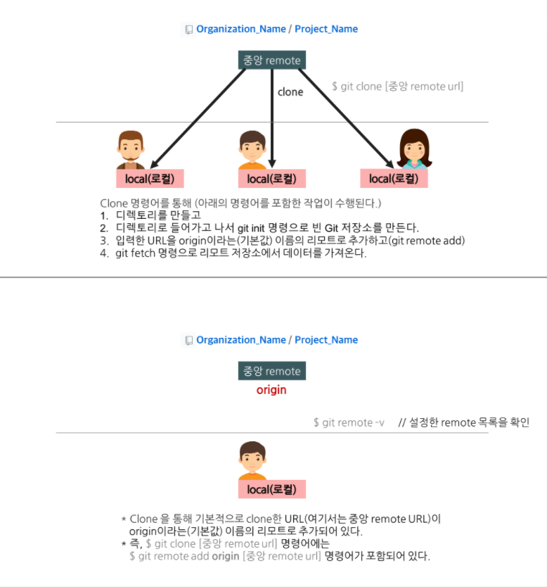


## 2. Branch

**1) 설명을 위해 현재 로컬에서 작업 중인 branch 위치를 표시한다.**

> 중앙 원격 저장소에는 master branch가 있고, 자신의 로컬 저장소에는 master branch와 로그인 기능을 구현할 feature/login branch(아래에서 설명)가 있다고 가정한다.
> 또한 현재 master branch에서 작업 중이라고 가정하고 아래와 같이 작업 중인 위치를 표시

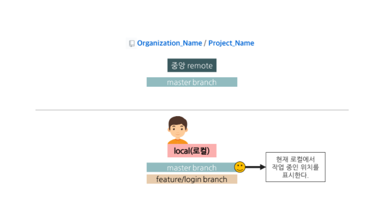

**2) 새로운 기능 개발을 위해 격리된 branch를 만든다.**

> 로컬 저장소에서 branch를 따고, 코드를 수정하고, 변경 내용을 커밋한다.

```bash
$ git checkout -b [branch name]

# 위의 명령어는 아래의 두 명령어를 합한 것
$ git branch [branch name]
$ git checkout [branch name]
https://gmlwjd9405.github.io/2017/10/27/how-to-collaborate-on-GitHub-1.html
```

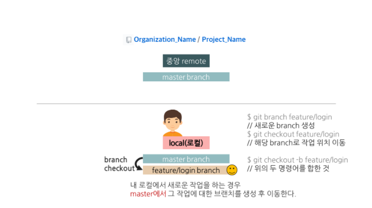


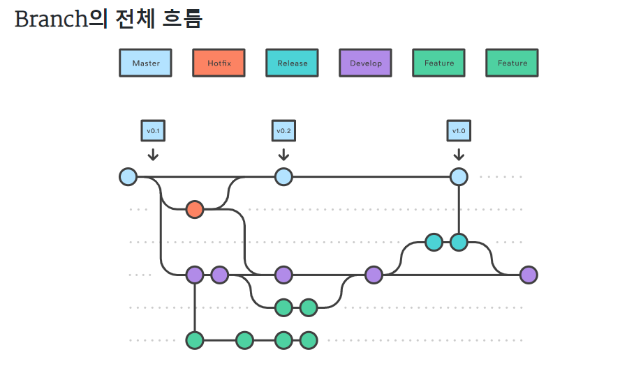

### Git branch 종류

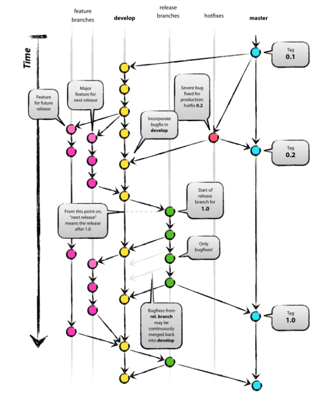

- master : 제품으로 출시될 수 있는 브랜치
- develop : 다음 출시 버전을 개발하는 브랜치
- feature : 기능을 개발하는 브랜치
- release : 이번 출시 버전을 준비하는 브랜치
- hotfix : 출시 버전에서 발생한 버그를 수정 하는 브랜치


#### 1. Master Branch

> 제품으로 출시될 수 있는 브랜치
> 배포(Release) 이력을 관리하기 위해 사용. 즉, 배포 가능한 상태만을 관리한다.

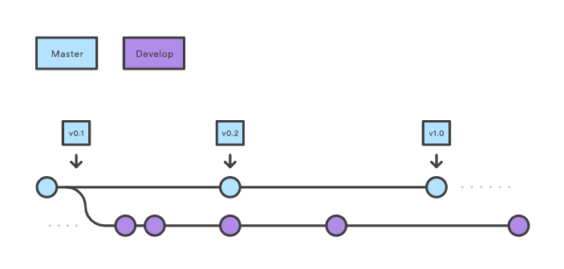

#### 2. Develop Branch

> 다음 출시 버전을 개발하는 브랜치
> 기능 개발을 위한 브랜치들을 병합하기 위해 사용. 즉, 모든 기능이 추가되고 버그가 수정되어 배포 가능한 안정적인 상태라면 develop 브랜치를 ‘master’ 브랜치에 병합(merge)한다.
> 평소에는 이 브랜치를 기반으로 개발을 진행한다.

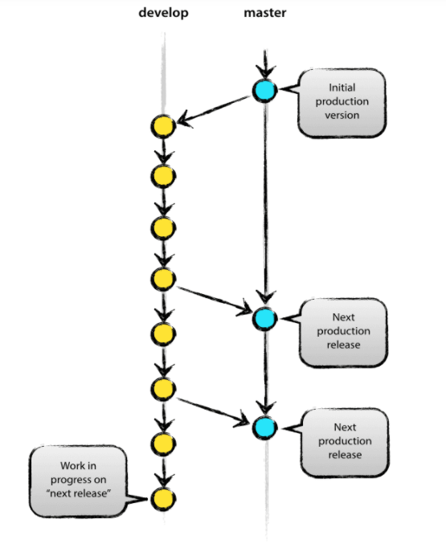

#### 3. Feature branch

> 기능을 개발하는 브랜치
> feature 브랜치는 새로운 기능 개발 및 버그 수정이 필요할 때마다 ‘develop’ 브랜치로부터 분기한다. feature 브랜치에서의 작업은 기본적으로 공유할 필요가 없기 때문에, 자신의 로컬 저장소에서 관리한다.
> 개발이 완료되면 ‘develop’ 브랜치로 병합(merge)하여 다른 사람들과 공유한다.

1. ‘develop’ 브랜치에서 새로운 기능에 대한 feature 브랜치를 분기한다.
2. 새로운 기능에 대한 작업 수행한다.
3. 작업이 끝나면 ‘develop’ 브랜치로 병합(merge)한다.
4. 더 이상 필요하지 않은 feature 브랜치는 삭제한다.
5. 새로운 기능에 대한 ‘feature’ 브랜치를 중앙 원격 저장소에 올린다.(push)

- feature 브랜치 이름 정하기
  - master, develop, release-(RB_), or hotfix- 제외
  - [feature/기능요약] 형식을 추천 EX) feature/login

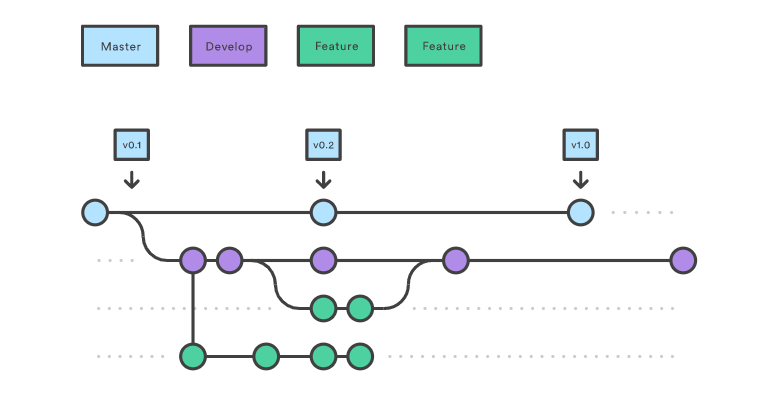

- feature 브랜치 생성 및 종료 과정

```bash
// feature 브랜치(feature/login)를 'develop' 브랜치('master' 브랜치에서 따는 것이 아니다!)에서 분기
$ git checkout -b feature/login develop

/* ~ 새로운 기능에 대한 작업 수행 ~ */

/* feature 브랜치에서 모든 작업이 끝나면 */
// 'develop' 브랜치로 이동한다.
$ git checkout develop

// 'develop' 브랜치에 feature/login 브랜치 내용을 병합(merge)한다.
# --no-ff 옵션: 아래에 추가 설명
$ git merge --no-ff feature/login

// -d 옵션: feature/login에 해당하는 브랜치를 삭제한다.
$ git branch -d feature/login

// 'develop' 브랜치를 원격 중앙 저장소에 올린다.
$ git push origin develop
https://gmlwjd9405.github.io/2018/05/11/types-of-git-branch.html
```


- `--no-ff` 옵션
  - 새로운 커밋 객체를 만들어 ‘develop’ 브랜치에 merge 한다.
  - 이것은 ‘feature’ 브랜치에 존재하는 커밋 이력을 모두 합쳐서 하나의 새로운 커밋 객체를 만들어 ‘develop’ 브랜치로 병합(merge)하는 것이다.

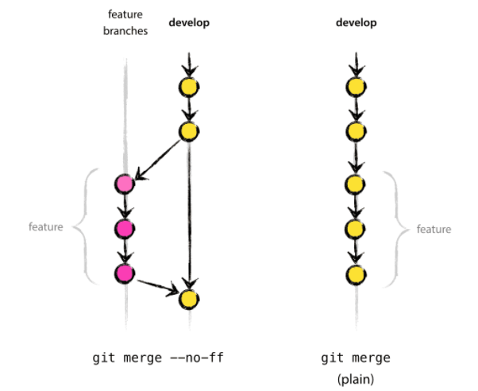

#### 4. Release Branch

> 이번 출시 버전을 준비하는 브랜치
>
> 배포를 위한 전용 브랜치를 사용함으로써 한 팀이 해당 배포를 준비하는 동안 다른 팀은 다음 배포를 위한 기능 개발을 계속할 수 있다.
>
> 즉, 딱딱 끊어지는 개발 단계를 정의하기에 아주 좋다.
>
> 예를 들어, ‘이번 주에 버전 1.3 배포를 목표로 한다!’라고 팀 구성원들과 쉽게 소통하고 합의할 수 있다는 말이다.

1. develop’ 브랜치에서 배포할 수 있는 수준의 기능이 모이면 또는 정해진 배포 일정이 되면, release 브랜치를 분기한다.

- release 브랜치를 만드는 순간부터 배포 사이클이 시작된다.
- release 브랜치에서는 배포를 위한 최종적인 버그 수정, 문서 추가 등 릴리스와 직접적으로 관련된 작업을 수행한다.

- 직접적으로 관련된 작업들을 제외하고는 release 브랜치에 새로운 기능을 추가로 병합(merge)하지 않는다.

2. ‘release’ 브랜치에서 배포 가능한 상태가 되면(배포 준비가 완료되면),

- 배포 가능한 상태: 새로운 기능을 포함한 상태로 모든 기능이 정상적으로 동작 하는 상태
  1. ‘master’ 브랜치에 병합한다. (이때, 병합한 커밋에 Release 버전 태그를 부여!)
  2. 배포를 준비하는 동안 release 브랜치가 변경되었을 수 있으므로 배포 완료 후 ‘develop’ 브랜치에도 병합한다.
- 이때, 다음 번 배포(Release)를 위한 개발 작업은 ‘develop’ 브랜치에서 계속 진행해 나간다.
- release 브랜치 이름 정하기
  - release-RB_* 또는 release-* 또는 release/* 처럼 이름 짓는 것이 일반적인 관례
  - [release-* ] 형식을 추천 EX) release-1.2


- release 브랜치 생성 및 종료 과정

```bash
/* release 브랜치에서 배포 가능한 상태가 되면 */
// 'master' 브랜치로 이동한다.
$ git checkout master

// 'master' 브랜치에 release-1.2 브랜치 내용을 병합(merge)한다.
# --no-ff 옵션: 위의 추가 설명 참고
$ git merge --no-ff release-1.2

// 병합한 커밋에 Release 버전 태그를 부여한다.
$ git tag -a 1.2

/* 'release' 브랜치의 변경 사항을 'develop' 브랜치에도 적용 */
// 'develop' 브랜치로 이동한다.
$ git checkout develop

// 'develop' 브랜치에 release-1.2 브랜치 내용을 병합(merge)한다.
$ git merge --no-ff release-1.2

// -d 옵션: release-1.2에 해당하는 브랜치를 삭제한다.
$ git branch -d release-1.2
https://gmlwjd9405.github.io/2018/05/11/types-of-git-branch.html
```


#### 5. Hotfix Branch

> 출시 버전에서 발생한 버그를 수정 하는 브랜치
>
> 배포한 버전에 긴급하게 수정을 해야 할 필요가 있을 경우, ‘master’ 브랜치에서 분기하는 브랜치이다.
>
>  ‘develop’ 브랜치에서 문제가 되는 부분을 수정하여 배포 가능한 버전을 만들기에는 시간도 많이 소요되고 안정성을 보장하기도 어려우므로 바로 배포가 가능한 ‘master’ 브랜치에서 직접 브랜치를 만들어 필요한 부분만을 수정한 후 다시 ‘master’브랜치에 병합하여 이를 배포해야 하는 것이다.

1. 배포한 버전에 긴급하게 수정을 해야 할 필요가 있을 경우,

- ‘master’ 브랜치에서 hotfix 브랜치를 분기한다. (‘hotfix’ 브랜치만 master에서 바로 딸 수 있다.)

2. 문제가 되는 부분만을 빠르게 수정한다.

- 다시 ‘master’ 브랜치에 병합(merge)하여 이를 안정적으로 다시 배포한다.
- 새로운 버전 이름으로 태그를 매긴다.

3. hotfix 브랜치에서의 변경 사항은 ‘develop’ 브랜치에도 병합(merge)한다.

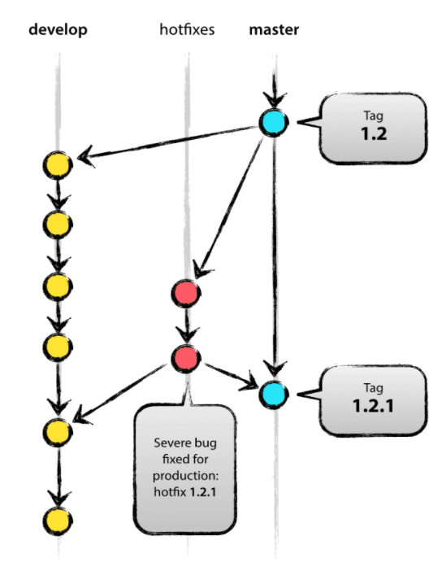

- 버그 수정만을 위한 ‘hotfix’ 브랜치를 따로 만들었기 때문에, 다음 배포를 위해 개발하던 작업 내용에 전혀 영향을 주지 않는다.
-  ‘hotfix’ 브랜치는 master 브랜치를 부모로 하는 임시 브랜치라고 생각하면 된다.

- hotfix 브랜치 이름 정하기
  - [hotfix-* ] 형식을 추천 EX) hotfix-1.2.1
- hotfix 브랜치 생성 및 종료 과정

```bash
// release 브랜치(hotfix-1.2.1)를 'master' 브랜치(유일!)에서 분기
$ git checkout -b hotfix-1.2.1 master

/* ~ 문제가 되는 부분만을 빠르게 수정 ~ */

/* 필요한 부분을 수정한 후 */
// 'master' 브랜치로 이동한다.
$ git checkout master

// 'master' 브랜치에 hotfix-1.2.1 브랜치 내용을 병합(merge)한다.
$ git merge --no-ff hotfix-1.2.1

// 병합한 커밋에 새로운 버전 이름으로 태그를 부여한다.
$ git tag -a 1.2.1

/* 'hotfix' 브랜치의 변경 사항을 'develop' 브랜치에도 적용 */
// 'develop' 브랜치로 이동한다.
$ git checkout develop

// 'develop' 브랜치에 hotfix-1.2.1 브랜치 내용을 병합(merge)한다.
$ git merge --no-ff hotfix-1.2.1
https://gmlwjd9405.github.io/2018/05/11/types-of-git-branch.html
```


## 로컬 저장소의 새로운 기능 브랜치를 중앙 원격 저장소(remote repository)에 푸시

>새로 만든 브랜치(feature/login branch)에 새로운 기능에 대한 내용을 커밋한다

```bash
$ git commit -a -m "Write commit message"

# 위의 명령어는 아래의 두 명령어를 합한 것
$ git add . # 변경된 모든 파일을 스테이징 영역에 추가
$ git add [some-file] # 스테이징 영역에 some-file 추가
$ git commit -m "Write commit message" # local 작업폴더에 history 하나를 쌓는 것
https://gmlwjd9405.github.io/2017/10/27/how-to-collaborate-on-GitHub-1.html
```

> 커밋을 완료했다면, 내가 작업한 내용을 포함한 브랜치(feature/login branch)를 중앙 원격 저장소에 올린다.
> 이는 로컬 저장소의 백업 역할을 할 뿐만 아니라, 다른 팀 구성원들이 나의 작업 내용과 진도를 확인할 수도 있어 좋은 습관이라 할 수 있다.

```bash
# -u 옵션: 새로운 기능 브랜치와 동일한 이름으로 중앙 원격 저장소의 브랜치로 추가한다.

// 로컬의 기능 브랜치를 중앙 원격 저장소 (origin)에 올린다.
$ git push -u origin feature/login branch

// -u 옵션으로 한 번 연결한 후에는 옵션 없이 아래의 명령만으로 기능 브랜치를 올릴 수 있다.
$ git push -origin feature/login branch
https://gmlwjd9405.github.io/2017/10/27/how-to-collaborate-on-GitHub-1.html
```

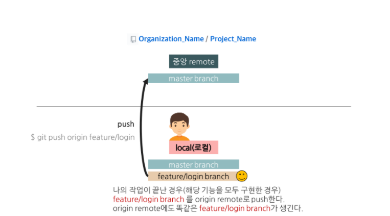


##  프로젝트 관리자(소규모 팀에서는 모두가 관리자가 될 수 있음)에게 자신의 기여분을 반영해 달라는 풀 리퀘스트를 던진다.


## References

[Git branch](https://gmlwjd9405.github.io/2018/05/11/types-of-git-branch.html)