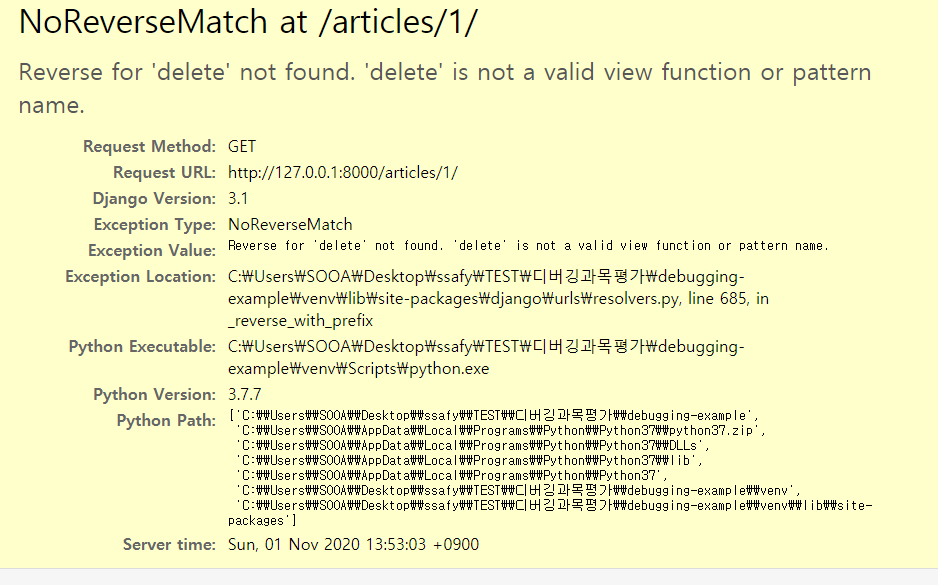

# Debugging

[toc]

## NoReverseMatch

### not found

> 'delete' is not a valid function or pattern name



- `articles` > `urls.py` 에 name 값을 쓰지 않고,  detail templates에 ``와 같이 `앱이름:urls.py에 준 name값`을 썼기 때문에 에러 발생!!

```python
#before
path('<int:pk>/delete/', views.delete),

#after
path('<int:pk>/delete/', views.delete,name='delete'),
```


## 새로운 게시물은 작성되었지만 /articles/ 경로에서 전체 글 목록을 확인 할 수 없습니다

- `articles` > `views.py`에 쓰인 context 딕셔너리의 `key` 값으로 `index.html`에서 정보를 받아오는데, `index.html`에는 `articles`라고 쓰는데, `views.py`에는 `article`이라고 적혀있어서 목록을 확인 할 수 없었다!

```python
def index(request):
    articles = Article.objects.order_by('-pk')
    #articles 라는 키 값으로 index.html에서 다룰수 있다!
    context = {
        'articles': articles,
    }
    return render(request, 'articles/index.html', context)
```

- `articles`>`index.html`

```html

    <p><b>작성자 : <a href="">{{ article.user }}</a></b></p>
    <p>글 번호: {{ article.pk }}</p>
    <p>글 제목: {{ article.title }}</p>
    <p>글 내용: {{ article.content }}</p>
```

