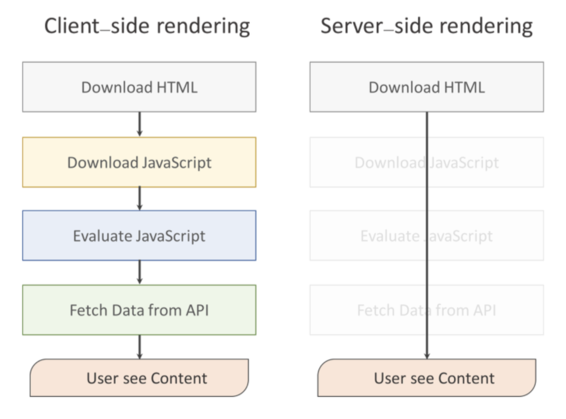
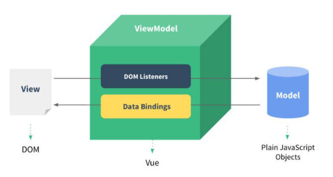
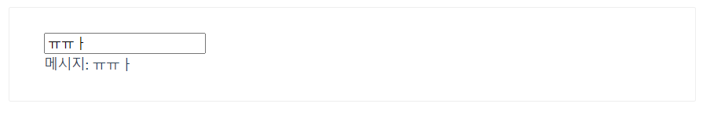

# Vue.js

[toc]

## Hello Vue.js ?

**Front-End Development**

> "프론트 엔드 개발은 HTML, CSS, JavaScript를 활용해서 데이터를 눈으로 볼 수 있게 만들어 준다.  결과적으로 사용자는 데이터를 직접 눈으로 보며 소통하고 상호작용 할 수 있다."

- Front-End Framework 3대장
  - React
  - Angular
  - Vue.js


## Rendering

> 렌더링은 요청받은 내용을 브라우저 화면에 표시하는 것



### CSR(Client Side Rendering)

- Server에서 비어있는 HTML을 제공하면 Client에서 최종적인 내용물을 채워서 렌더링
- Vue.js로 구현

- 클라이언트 사이드 렌더링은 SPA로, 클라이언트 사이드에서 HTML을 반환한 후에, JS가 동작하면서 데이터만을 주고 받아서 클라이언트에서 렌더링을 진행하는 것
- 점점 더 복잡해지는 웹페이지를 구현하기 위해서 전통적인 방식의 SSR보다는 CSR로 웹을 구현하는 경우가 많아짐

- 동작과정 : HTML 다운로드-> JS 다운로드 -> JS 실행 -> DATA 서버로부터 받기 -> Content 확인가능

#### CSR의 장점

- 클라이언트 사이드 렌더링은 사용자의 행동에 따라 필요한 부분만 다시 읽어들이기 때문에 SSR 보다 조금 더 빠른 인터랙션이 가능
- page 전체를 요청하지 않고 페이지에 필요한 부분만 변경하게 하기 때문에, 모바일 네트워크에서도 빠른 속도로 렌더링이 가능
- lazy loading을 지원해줌
  - *lazy loading이란 ? 페이지 로딩 시 중요하지 않은 리소스의 로딩을 늦추는 기술
    (Ex. 스크롤 내려야만 해당 이미지 보이게 하는 것)*
- 서버사이드 렌더링이 따로 필요하지 않기때문에 일관성있는 코드를 작성할 수 있음

#### CSR의 단점

- Googlebot과 Searchconsole에 검색 노출이 되지 않음 (브라우저가 없기때문에, html만 가져와서 검색에는 뜨지 않음)
- 페이지를 읽고, 자바스크립트를 읽은 후 화면을 그리는 시간까지 모두 마쳐야 콘텐츠가 사용자에게 보여지기 때문에 초기구동 속도가 느림


### Server Side Rendering

- Server에서 완성된 결과물을 제공하면 Client는 그 결과물을 렌더링
- Django로 구현 

- 서버에서 렌더링을 작업하는 렌더링 방식, 
- 전통적인 웹 어플리케이션 렌더링 방식으로 사용자가 웹 페이지에 접근할 때, 서버에 각각의 페이지에 대한 요청을 하며 서버에서 html, js 파일 등을 다 다운로드해서 화면에 렌더링하는 방식

#### SSR의 장점

- 사용자가 처음으로 컨텐츠를 볼 수 있는 시점을 앞당길 수 있음
- 검색엔진 최적화(SEO) 적용이 용이

#### SSR의 단점

- 모든 요청에 관해 필요한 부분만 수정하는 것이 아닌, 완전히 새페이지를 로딩하고 렌더해줌(새로고침)
- 전체를 로딩하다보니 CSR보다 느리고, bandwitdh를 많이 쓰고, 사용자 경험 좋지 않음
  (사용자가 처음으로 컨텐츠를 볼 수는 있으나, 화면단에는 html요소들이 나오나 js파일이 다 다운로드 되지않아서 버튼이 클릭되지않는 등의 현상이 있을 수 있음)


## SPA(Single Page Application)

> [(참고 문서)](https://poiemaweb.com/js-spa)

- 단일 페이지 어플리케이션, 서버로부터 완전한 새로운 페이지를 불러오지 않고 현재의 페이지를 동적으로 다시 작성함으로써 특정 부분만 사용자와 소통하는 웹 애플리케이션이나 웹 사이트
- 서버로부터 최초로 응답 받은 HTML 문서 안에서 (거의) 모든 것을 한다.
  - 데이터를 가져오거나 가공하는 행위 나아가 동적인 조작까지 가능하다.

- HTML 문서 전체를 새로 갱신하지 않아도 되므로 부드러운 퍼포먼스를 보여준다. 
  - 이는 결과적으로 사용자 경험(UX)의 향상으로 이어진다.
  - SPA의 가장 중요한 목표이자 핵심가치는 **사용자 경험(UX) 향상**이다.
  - 부가적으로 속도의 향상도 기대할 수 있다.

- Django를 사용해서 작성한 좋아요, 팔로우 로직은 응답 받은 페이지 내에서 AJAX 요청을 통해 페이지 갱신 없이 데이터를 조작하여 DOM을 변화 시켰기 때문에 SPA를 일부 활용했다고 할 수 있다.

- 초기 구동 속도가 다소 느리다는 단점이 있다.
  - 웹 애플리케이션에 필요한 모든 정적 리소스를 최초에 한번 다운로드하므로 초기 구동 속도가 상대적으로 느리다.
- 같은 페이지에서 필요한 부분만 변경되기 때문에 URL 주소가 변경되지 않는다.
- 페이지 전환이 없고 전체 렌더링이 아닌 특정 부분만 동적으로 변한다.
  - link tag를 사용하는 전통적인 웹 방식은 새로운 페이지 요청 시마다 정적 리소스가 다운로드되고 전체 페이지를 다시 렌더링하는 방식을 사용하므로 새로고침이 발생되어 사용성이 좋지 않다.
  - 그리고 변경이 필요없는 부분를 포함하여 전체 페이지를 갱신하므로 비효율적이다.


## Why Vue.js ?

**모던 웹의 특징**

- 한 페이지 내에 수많은 데이터가 존재한다. 
  - 페이스북, 인스타그램
- 각 데이터의 변화 상황을 추적 & 관리하기 매우 까다로운 구조

- 순수한 JavaSript를 활용한 구현은 모든 데이터를 선택 & 변경하기 어렵고 규모가 큰 서비스의 경우 매우 큰 비용이 발생한다. 


**Vue.js의 특징**

- Vue.js는 data의 변경 사항에 집중할 수 있도록 DOM은 data의 변화에 따라 알아서 re-rendering 하도록 구현

- DOM과 data가 연결되어 있기 때문에 data 자체에 집중하여 서비스를 개발할 수 있다.


## Vue.js의 `MVVM` 패턴

> Model/View/ViewModel
>
> 1. Vue에서 Model은 JavaScirpt Object다
>
> 2. Vue에서 View는 DOM(HTML)이다
>
> 3. Vue에서 ViewModel은 모든 Vue Instance이다.
>
> - Model
>   - Plain JavaScript Object
>   - Vue Instance 내부에 있으면 반응형이 된다.
> - View
>   - DOM(HTML)
>   - Vue Instance에 의해 관리된다.
>
> - ViewModel
>   - 모든 Vue Instance는 ViewModel이다.
>   - Model과 View 사이의 중개자 역할을 한다. View와 Model 사이를 동기화 시킨다.
>
> 



### 용어

- `View` : 사용자에게 보이는 화면
- `DOM` : HTML 문서에 들어가는 요소의 정보를 담는 데이터트리
- `ViewModel` : View와 Model을 연결해주는(바인딩 해주는) 중개자 역할
- `DOM Listener` : DOM의 변경내역에 대해 즉각적으로 반응하여 특정 로직을 수행하는 장치
- `Data Binding` : View에 표시되는 내용과 Model의 데이터 동기화
- `Model` : 데이터를 담는 용기 역할을 하며, 보통은 서버에서 가져온 데이터를 자바스크립트 객체 형태로 저장


### MVVM 패턴의 특징

- Backend 로직과 Client의 마크업 & 데이터 표현단을 분리하기 위한 구조로 전통적인 MVC 패턴의 방식에서 기인했다.
- 화면 앞단의 회면 동작 관련 로직과 뒷단의 DB 데이터 처리 및 서버 로직을 분리하고, 뒷단에서 넘어온 데이터를 Model 에 담아 View 로 넘어주는 중간 지점이라고 보면 된다.
- **데이터 바인딩**과 화면 단위를 컴포넌트 형태로 제공하며, 관련 API를 지원하는데에 궁극적인 목적
- Angular에서 지원하는 **양방향 데이터 바인딩** 을 동일하게 제공
- 하지만 **컴포넌트 간 통신**의 기본 골격은 React의 **단방향 데이터 흐름(부모 -> 자식)**을 사용
- 다른 프런트엔드 프레임워크(Angular, React)와 [비교](https://vuejs.org/v2/guide/comparison.html)했을 때 상대적으로 가볍고 빠름.
- 문법이 단순하고 간결하여 **초기 학습 비용이 낮고 누구나 쉽게 접근 가능**


### Vue 시작하기

1. CDN(Content Delivery Network)

- 웹 콘텐츠를 제공하는 서버를 의미하는 것으로 원본 서버(origin)가 가지고 잇는 컨텐츠를 분산해서 활용할 수 할 수 있도록 한다.
- 본 서버와 물리적인 거리 때문에 발생하는 속도 저하 문제도 방지하고 본 서버로 요청이 몰려 서버 장애가 발생하는 이슈도 막을 수 있다.
- Bootstrap, Lodash, Vue.js 등 많은 라이브러리, 프레임워크를 CDN을 통해 사용할 수 있다.
- CDN을 통한 개발이 가능한지 여부는 Network Tab에서 해당 서버에 대한 요청 응답 코드가 200으로 왔는지 확인하면 된다.

```html
<!-- 개발버전, 도움되는 콘솔 경고를 포함. -->
<script src="https://cdn.jsdelivr.net/npm/vue/dist/vue.js"></script>

<!--또는-->

<!-- 상용버전, 속도와 용량이 최적화됨. -->
<script src="https://cdn.jsdelivr.net/npm/vue"></script>
```

2. 공식문서 Quick Start

- 많은 프레임워크, 라이브러리에서는 해당 도구를 사용하는 간단한 방법(tutorial)을 제공한다.
- Vue.js도 Quick Start를 통해 빠르게 프레임 워크 맛보기를 해볼 수 있다. 
- 아래의 코드는 Vue.js 공식 문서의 '시작하기' 코드를 한 파일 내에서 확인할 수 있게 가공한 것이다.

3. Vetur & Chrome Dev Tools 설치

- Vetur
  - 기본적으로 vs code를 통해 개발을 Vue.js 개발을 하는 경우 Extenstion 중 'Vetur'를 많이 사용한다. 
  - 600만건 이상의 다운로드가 이루어졌으며 단축 문법, 자동 완성 등의 편의 기능을 제공한다.

- Chrome Vue Dev Tools
  - Vue.js 개발 환경에서 data, event, vuex와 같은 핵심 로직의 변화를 관찰하고 디버깅 할 수 있는 도구다.
  - 크롬 익스텐션으로 설치가 가능하며 파일과 시크릿 모드에서 사용하려는 경우에는 **익스텐션의 세부정보**에서 기능에 대한 버튼을 활성화 해야한다.(중요)


### Vue 기본

```html
<!DOCTYPE html>
<html lang="ko">
<head>
  <meta charset="UTF-8">
  <meta name="viewport" content="width=device-width, initial-scale=1.0">
  <title>Vue Quick Start</title>
</head>
<body>
  <!-- 2. 선언적 렌더링 -->
  <h2>선언적 렌더링</h2>
  <div id="app">
    {{ message }}
  </div>
  <hr>

  <!-- 3. 엘리멘트 속성 바인딩 -->
  <h2>Element 속성 바인딩</h2>
  <div id="app-2">
    <span v-bind:title="message">
      내 위에 잠시 마우스를 올리면 동적으로 바인딩 된 title을 볼 수 있습니다!
    </span>
  </div>
  <hr>

  <!-- 4. 조건 -->
  <h2>조건</h2>
  <div id="app-3">
    <p v-if="seen">이제 나를 볼 수 있어요</p>
  </div>
  <hr>

  <!-- 5. 반복 -->
  <h2>반복</h2>
  <div id="app-4">
    <ol>
      <li v-for="todo in todos">
        {{ todo.text }}
      </li>
    </ol>
  </div>
  <hr>

  <!-- 6. 사용자 입력 핸들링 -->
  <h2>사용자 입력 핸들링</h2>
  <div id="app-5">
    <p>{{ message }}</p>
    <button v-on:click="reverseMessage">메시지 뒤집기</button>
  </div>
  <hr>

  <div id="app-6">
    <p>{{ message }}</p>
    <input v-model="message">
  </div>
  <hr>

  <!-- 1. Vue CDN -->
  <script src="https://cdn.jsdelivr.net/npm/vue/dist/vue.js"></script>
  <script>
    // 2. 선언적 렌더링
    var app = new Vue({
      el: '#app',
      data: {
        message: '안녕하세요 Vue!'
      }
    })

    // 3. 엘리먼트 속성 바인딩
    var app2 = new Vue({
      el: '#app-2',
      data: {
        message: '이 페이지는 ' + new Date() + ' 에 로드 되었습니다'
      }
    })

    // 4. 조건
    var app3 = new Vue({
      el: '#app-3',
      data: {
        seen: true // false로 토글 가능
      }
    })

    //5. 반복
    var app4 = new Vue({
      el: '#app-4',
      data: {
        todos: [
          { text: 'JavaScript 배우기' },
          { text: 'Vue 배우기' },
          { text: '무언가 멋진 것을 만들기' }
        ]
      }
    })

    //6. 사용자 입력 핸들링
    var app5 = new Vue({
      el: '#app-5',
      data: {
        message: '안녕하세요! Vue.js!'
      },
      methods: {
        reverseMessage: function () {
          this.message = this.message.split('').reverse().join('')
        }
      }
    })

    var app6 = new Vue({
      el: '#app-6',
      data: {
        message: '안녕하세요 Vue!'
      }
    })
  </script>
</body>
</html>
```


### 1. Vue Instance

https://kr.vuejs.org/v2/guide/instance.html

1. 가장 기본 요소이자 Vue의 중심이 되는 요소
2. Vue Instance는 ViewModel이다.
3. View와 Model 사이의 중개자 역할을 한다.


#### Vue 인스턴스 만들기

- Vue 인스턴스와 DOM 을 연결(마운트, mount) 하는 옵션

- View - View Model 을 연결 시킨다.

- Vue 인스턴스 초기화에서 `.$mount()`로 대체 가능하다.

- HTML의 id 나 class 와 마운트가 가능하다.

  `el: '.myClass'` : `myClass` 클래스와 마운트 / `el: '#app'` : `app` id와 마운트

모든 Vue 앱은 `Vue` 함수로 새 **Vue 인스턴스**를 만드는 것부터 시작한다.

```js
const vm = new Vue({
  // 옵션
})
```

엄격히 [MVVM 패턴](https://en.wikipedia.org/wiki/Model_View_ViewModel)과 관련이 없지만 관례적으로, Vue 인스턴스를 참조하기 위해 종종 변수 `vm`(ViewModel의 약자)을 사용함.

Vue 인스턴스를 생성할 때는 **options 객체**를 전달해야 한다. 


#### Data 메소드

> - Vue 인스턴스의 데이터 객체, 인스턴스의 `속성` 이라고도 부름
> - 데이터 객체는 반드시 기본 객체 (`{ }`) 여야 함.
> - Vue 인스턴스가 최초 생성되면, `data` 객체 안의 모든 값들을 반응 시스템에 등록한다.
> - 이 `data` 객체에 등록된 key에 대해서만 value 수정에 대하여 반응하므로, 최초 생성시 할당할 값이 없다면 `''`, `[]`, `{}`, `0`과 같은 값으로 초기화 해야 한다.
> - 객체 내부의 아이템들은 value 로써 모든 타입의 객체를 가질 수 있다. (object, string, integer, array...)
> - **Vue는 `data`가 변경되면 기본적으로 DOM을 다시 렌더링 한다.**(단, `v-once` 같은 디렉티브는 예외)
> - 정의된 속성은 인터폴레이션(`{{ }}`)을 통해서 View 에서 렌더링 가능
> - data 에서도 이벤트리스너와 비슷한 이유로 **화살표 함수를 작성해서는 안 된다.**

Vue 인스턴스가 생성될 때 `data` 객체에 있는 모든 속성이 Vue의 **반응형 시스템**에 추가됨

각 속성값이 변경될 때 뷰가 “반응”하여 새로운 값과 일치하도록 업데이트됨.

```js
// 데이터 객체
var data = { a: 1 }

// Vue인스턴스에 데이터 객체를 추가합니다.
var vm = new Vue({
  data: data
})

// 인스턴스에 있는 속성은
// 원본 데이터에 있는 값을 반환합니다.
vm.a === data.a // => true

// 인스턴스에 있는 속성값을 변경하면
// 원본 데이터에도 영향을 미칩니다.
vm.a = 2
data.a // => 2

// ... 반대로 마찬가지입니다.
data.a = 3
vm.a // => 3
```

데이터가 변경되면 화면은 다시 렌더링됨. 유념할 점은, `data`에 있는 속성들은 인스턴스가 생성될 때 존재한 것들만 **반응형**이다. 

.어떤 속성이 나중에 필요하다는 것을 알고 있으며, 빈 값이거나 존재하지 않은 상태로 시작한다면 아래와 같이 초기값을 지정.

```js
data: {
  newTodoText: '',
  visitCount: 0,
  hideCompletedTodos: false,
  todos: [],
  error: null
}
```

Vue 인스턴스는 데이터 속성 이외에도 유용한 인스턴스 속성 및 메소드를 제공함. 다른 사용자 정의 속성과 구분하기 위해 `$` 접두어를 붙임.

예:

```js
var data = { a: 1 }
var vm = new Vue({
  el: '#example',
  data: data
})

vm.$data === data // => true
vm.$el === document.getElementById('example') // => true

// $watch 는 인스턴스 메소드 입니다.
vm.$watch('a', function (newVal, oldVal) {
  // `vm.a`가 변경되면 호출 됩니다.
})
```


### template 문법

Vue.js는 렌더링 된 DOM을 기본 Vue 인스턴스의 데이터에 선언적으로 바인딩 할 수있는 HTML 기반 템플릿 구문을 사용한다. 모든 Vue.js 템플릿은 스펙을 호환하는 브라우저 및 HTML로 구문 분석 할 수있는 유효한 HTML이다.

내부적으로 Vue는 템플릿을 가상 DOM 렌더링 함수로 컴파일 한다. 반응형 시스템과 결합된 Vue는 앱 상태가 변경 될 때 최소한으로 DOM을 조작하고 다시 적용할 수 있는 최소한의 컴포넌트를 지능적으로 파악할 수 있다.

### 2. Vue Data Binding(속성)

https://kr.vuejs.org/v2/guide/syntax.html#%EB%B3%B4%EA%B0%84%EB%B2%95-Interpolation

1. data object는 Vue Instance 내부에 들어가면 DOM과 반응형으로 연결된다. 
2. 데이터 바인딩의 가장 기본 형태는 콧수염 태그(`{{ }}`)를 사용한 텍스트 보간법이다.
3. DOM에서 `{{ }}` 태그를 활용해 data의 특정 속성값을 보여줄 수 있다. 
4. data가 변화하면 DOM이 다시 렌더링된다.

Mustaches(`{{ }}`)는 HTML 속성에서 사용할 수 없다. 대신 [v-bind 디렉티브](https://kr.vuejs.org/v2/api/#v-bind)를 사용한다:

```js
<div v-bind:id="dynamicId"></div>
```

boolean 속성을 사용할 때 단순히 `true`인 경우 `v-bind`는 조금 다르게 작동한다.

```js
<button v-bind:disabled="isButtonDisabled">Button</button>
```

`isButtonDisabled`가 `null`, `undefined` 또는`false`의 값을 가지면 `disabled` 속성은 렌더링 된`<button>`엘리먼트에 포함되지 않다.


**선언적 렌더링**

이제 데이터와 DOM이 연결되었으며 모든 것이 **반응형**이 되었다.

더 이상 HTML과 직접 상호작용할 필요가 없다. Vue 앱은 단일 DOM 요소(우리의 경우 `#app`)에 연결되어 DOM 요소를 제어한다. HTML는 엔트리 포인트일뿐 다른 모든 것은 새롭게 생성된 Vue 인스턴스 내에서 발생한다.


### 디렉티브

디렉티브는 `v-` 접두사가 있는 특수 속성이다. 디렉티브 속성 값은 **단일 JavaScript 표현식** 이 된다. (`v-for`는 예외) 디렉티브의 역할은 표현식의 값이 변경될 때 사이드이펙트를 반응적으로 DOM에 적용하는 것이다.

```js
<p v-if="seen">이제 나를 볼 수 있어요</p>
```

여기서, `v-if` 디렉티브는 `seen` 표현의 진실성에 기반하여 `<p>` 엘리먼트를 제거 또는 삽입한다.


### 리스트렌더링

### 3. `v-for`

https://kr.vuejs.org/v2/guide/list.html

1. 기본적인 반복문으로 사용한다. 
2. `key` 설정이 필요하다.(반복되는 DOM 내용이 단순한 경우나 의도적인 성능 향상을 위해 기본 동작에 의존하지 않는 경우를 제외하면, 가능하면 언제나 `v-for`에 `key`를 추가하는 것이 좋다)
3. `v-for`를 사용하여 객체의 속성을 반복할 수도 있다.
4. 키에 대한 두번째 전달 인자를 제공할 수도 있다.
5. 그리고 또 인덱스도 제공

`v-for` 디렉티브를 사용하여 배열을 기반으로 리스트를 렌더링 할 수 있다. `v-for` 디렉티브는 `item in items` 형태로 특별한 문법이 필요하다. 여기서 `items`는 원본 데이터 배열이고 `item`은 반복되는 배열 엘리먼트의 **별칭** .

```html
<ul id="example-1">
  <li v-for="item in items">
    {{ item.message }}
  </li>
</ul>
```

```js
const example1 = new Vue({
  el: '#example-1',
  data: {
    items: [
      { message: 'Foo' },
      { message: 'Bar' }
    ]
  }
})
```

결과

- Foo
- Bar

`v-for` 블록 안에는 부모 범위 속성에 대한 모든 권한이 있다. `v-for`는 또한 현재 항목의 인덱스에 대한 두 번째 전달인자 옵션을 제공

```html
<ul id="example-2">
  <li v-for="(item, index) in items">
    {{ parentMessage }} - {{ index }} - {{ item.message }}
  </li>
</ul>
```

```js
const example2 = new Vue({
  el: '#example-2',
  data: {
    parentMessage: 'Parent',
    items: [
      { message: 'Foo' },
      { message: 'Bar' }
    ]
  }
})
```

결과

- Parent-0-Foo
- Parent-1-Bar

`in` 대신에 `of`를 구분자로 사용할 수 있다. 그래서 JavaScript의 이터레이터에 대한 자바스크립트 구문과 유사하다.

```html
<div v-for="item of items"></div>
```


동일한 노드에 두가지 모두 있다면, `v-for`가 `v-if`보다 높은 우선순위를 갖는다. 즉, `v-if`는 루프가 반복될 때마다 실행된다. 이는 *일부* 항목만 렌더링 하려는 경우 유용하다.

```js
<li v-for="todo in todos" v-if="!todo.isComplete">
  {{ todo }}
</li>
```


### 4. `v-if `

https://kr.vuejs.org/v2/guide/conditional.html

1. 기본적인 조건문으로 사용한다.
2. `v-else-if`와 `v-else` 구문을 사용할 수 있다.

3. `v-show`와 비교하여 필요한 상황에 더 적절한 디렉티브를 사용하면 된다.

- `v-if` 디렉티브는 조건에 따라 블록을 렌더링하기 위해 사용된다. 블록은 디렉티브의 표현식이 true 값을 반환할 때만 렌더링된다.

**key를 이용한 재사용이 가능한 엘리먼크 제어**

Vue는 가능한 한 효율적으로 엘리먼트를 렌더링하려고 시도하며 종종 처음부터 렌더링을 하지않고 다시 사용한다. Vue를 매우 빠르게 만드는데 도움이 되는 것 이외에 몇가지 유용한 이점이 있다. 예를 들어 사용자가 여러 로그인 유형을 트랜지션할 수 있도록 허용하는 경우

```html
<template v-if="loginType === 'username'">
  <label>사용자 이름</label>
  <input placeholder="사용자 이름을 입력하세요">
</template>
<template v-else>
  <label>이메일</label>
  <input placeholder="이메일 주소를 입력하세요">
</template>
```

위 코드에서 `loginType`을 바꾸어도 사용자가 이미 입력한 내용은 지워지지 않는다. 두 템플릿 모두 같은 요소를 사용하므로 `<input>`은 대체되지 않고 단지 `placeholder`만 변경된다.

이것은 항상 바람직하지는 않다. 때문에 “이 두 엘리먼트는 완전히 별개이므로 다시 사용하지 마십시오.”라고 알리는 방법을 제공합니다. 유일한 값으로 `key` 속성을 추가

`<label>` 엘리먼트는 `key` 속성이 없기 때문에 여전히 효율적으로 재사용됨

```html
<template v-if="loginType === 'username'">
  <label>사용자 이름</label>
  <input placeholder="사용자 이름을 입력하세요" key="username-input">
</template>
<template v-else>
  <label>이메일</label>
  <input placeholder="이메일 주소를 입력하세요" key="email-input">
</template>
```


### 5. `v-bind`

https://kr.vuejs.org/v2/guide/class-and-style.html

1. HTML 표준 속성 바인딩

2. class 바인딩

3. 하위 컴포넌트에게 데이터를 내려 줄 때 활용

4. shortcut 

   https://kr.vuejs.org/v2/guide/syntax.html#v-bind-%EC%95%BD%EC%96%B4

   - `v-bind` -> `:`

**전달인자**

일부 디렉티브는 콜론`(:)`으로 표시되는 “전달인자”를 사용할 수 있다. 예를 들어, `v-bind` 디렉티브는 반응적으로 HTML 속성을 갱신하는데 사용된다.

```js
<a v-bind:href="url"> ... </a>
```

여기서 `href`는 전달인자로, 엘리먼트의 `href` 속성을 표현식 `url`의 값에 바인드하는 `v-bind` 디렉티브에게 알려준다.

또 다른 예로 DOM 이벤트를 수신하는 `v-on` 디렉티브다.

```js
<a v-on:click="doSomething"> ... </a>
```


### 6. `v-on` & methods(이벤트핸들링)

https://kr.vuejs.org/v2/guide/events.html

`v-on`

1. 이벤트 리스너의 역할을 하는 디렉티브

2. `.`을 통해 여러 이벤트를 연결할 수 있다.

3. shorcut

   https://kr.vuejs.org/v2/guide/syntax.html#v-bind-%EC%95%BD%EC%96%B4

   - `v-on` -> `@`

```html
<div id="example-1">
  <button v-on:click="counter += 1">Add 1</button>
  <p>위 버튼을 클릭한 횟수는 {{ counter }} 번 입니다.</p>
</div>
```

```js
const example1 = new Vue({
  el: '#example-1',
  data: {
    counter: 0
  }
})
```


**methods**([메소드 이벤트 핸들러](https://kr.vuejs.org/v2/guide/events.html#메소드-이벤트-핸들러))

> 많은 이벤트 핸들러의 로직은 더 복잡할 것이므로, JavaScript를 `v-on` 속성 값으로 보관하는 것은 간단하지 않다. 이 때문에 `v-on`이 호출하고자 하는 메소드의 이름을 받는 이유.
>
> - Vue 인스턴스에 추가할 메소드(사용할 다양한 함수들)를 정의하는 곳
> - (주의) **메소드를 정의하는데에 화살표 함수를 사용해서는 안 된다.**
> - 만약 함수를 화살표 함수로 작성하면 `undefined`로 뜨면서 숫자가 카운팅되지 않는다.이 때 화살표 함수가 가리키는 곳은 가장 최상위 객체인 `window`를 가리킨다.

1. Vue에서 활용하는 기본적인 함수를 정의하는 곳이다.

```html
<div id="example-2">
  <!-- `greet`는 메소드 이름으로 아래에 정의되어 있습니다 -->
  <button v-on:click="greet">Greet</button>
</div>
```

```js
const example2 = new Vue({
  el: '#example-2',
  data: {
    name: 'Vue.js'
  },
  // 메소드는 `methods` 객체 안에 정의합니다
  methods: {
    greet: function (event) {
      // 메소드 안에서 사용하는 `this` 는 Vue 인스턴스를 가리킵니다
      alert('Hello ' + this.name + '!')
      // `event` 는 네이티브 DOM 이벤트입니다
      if (event) {
        alert(event.target.tagName)
      }
    }
  }
})

// 또한 JavaScript를 이용해서 메소드를 호출할 수 있습니다.
example2.greet() // => 'Hello Vue.js!'
```


**일반함수 vs 화살표함수**

- this는 어느 스코프 안에 있는지에 따라 출력되는 값이 달라진다.

  - function 표현식 : 함수호출 또는 함수 내 함수에서 호출하는 경우 window 객체가 뜬다.

    ```js
    const greeting = function() {
      console.log(this)
    }
    
    greeting() // 호출되는 위치가 전역쪽이라 전역 객체인 window가 나옴
    // Window {parent: Window, postMessage: ƒ, blur: ƒ, focus: ƒ, close: ƒ, …}
    ```

  - 메서드 호출 : 해당 객체가 뜬다.

    ```js
    const you = {
      name: 'kim',
      greeting
    }
    
    you.greeting() // 여기서 this는 해당 오브젝트(객체)
    // {name: "kim", greeting: ƒ}
    ```

  - arrow function : 함수 내 함수에서 사용한다.

    arrow에서 this는 호출 위치와 상관없이 상위 스코프 this를 가리킨다. (참고용어. lexical this)

    따라서, 메소드 선언을 arrow 함수로 하게 되면, 해당 오브젝트의 상위 스코프인 전역 객체 window 가 바인딩(binding) 된다.

    ```js
    const arrowGreeting = () => console.log(this)
    const me = {
      name: 'tak',
      arrowGreeting
    }
    
    arrowGreeting() // window / Window {parent: Window, postMessage: ƒ, blur: ƒ, focus: ƒ, close: ƒ, …}
        
    // 그렇다면 arrow 를 언제 활용? - 함수 내의 함수!
    const num = {
      numbers: [1],
      print: function() {
        console.log(this) // num 객체 / {numbers: Array(1), print: ƒ}
        console.log(this.numbers) // [1]
        this.numbers.forEach(function(num) {
          console.log(num) // 1
          console.log(this) // '1. function 표현식'에 의해 window가 뜬다. / Window {parent: Window, postMessage: ƒ, blur: ƒ, focus: ƒ, close: ƒ, …}
        })
      }
    }
    num.print()
    
    const num2 = {
      numbers: [1],
      print: function() {
        console.log(this) // num2 객체 / {numbers: Array(1), print: ƒ}
        console.log(this.numbers) // [1]
        this.numbers.forEach(num => {
          console.log(num) // 1
          console.log(this) // num2 객체 / {numbers: Array(1), print: ƒ} -- 이거만 위와 바뀜
          // 여기서 console.log(this) 때문에 arrow를 사용한다.
        })
      }
    }
    num2.print()
    ```

- 이벤트 리스너로 돌아와서 이벤트 리스너에서의 콜백 함수는 특별하게 function 키워드의 경우에는 이벤트 리스너를 호출한 대상(event.target)을 뜻한다.

  따라서, 호출한 대상을 원하면 this 를 사용할 수 있다.

  다만 arrow function 에 경우 상위 스코프를 지칭하기 때문에 window 객체가 출력된다.


**이벤트수식어**

```html
<!-- 클릭 이벤트 전파가 중단됩니다 -->
<a v-on:click.stop="doThis"></a>

<!-- 클릭 이벤트는 최대 한번만 트리거 됩니다. -->
<a v-on:click.once="doThis"></a>

<!-- 제출 이벤트가 페이지를 다시 로드 하지 않습니다 -->
<form v-on:submit.prevent="onSubmit"></form>

<!-- 수식어는 체이닝 가능합니다 -->
<a v-on:click.stop.prevent="doThat"></a>

<!-- 단순히 수식어만 사용할 수 있습니다 -->
<form v-on:submit.prevent></form>

<!-- 이벤트 리스너를 추가할 때 캡처모드를 사용합니다 -->
<!-- 즉, 내부 엘리먼트를 대상으로 하는 이벤트가 해당 엘리먼트에서 처리되기 전에 여기서 처리합니다. -->
<div v-on:click.capture="doThis">...</div>


<!-- event.target이 엘리먼트 자체인 경우에만 트리거를 처리합니다 -->
<!-- 자식 엘리먼트에서는 안됩니다 -->
<div v-on:click.self="doThat">...</div>
```


**왜 HTML로 된 리스너를 사용할까? **

- 이 모든 이벤트 청취 접근 방법이 관심사의 분리(“separation of concerns”)에 대한 오래된 규칙을 어긴다고 생각할 수 있다. 모든 뷰 핸들러 함수와 표현식은 현재 뷰 처리 하는 ViewModel에 엄격히 바인딩 되기 때문에 유지보수가 어렵지 않다. 실제로 `v-on`을 사용하면 몇가지 이점이 있다.

1. HTML 템플릿을 간단히 하여 JavaScript 코드 내에서 핸들러 함수 구현을 찾는 것이 더 쉽다.
2. JavaScript에서 이벤트 리스너를 수동으로 연결할 필요가 없으므로 ViewModel 코드는 순수 로직과 DOM이 필요하지 않다. 
3. ViewModel이 파기되면 모든 이벤트 리스너가 자동으로 제거 된다. 이벤트 제거에 대한 걱정이 필요 없어진다.


### 7. `v-model`(폼입력바인딩)

https://kr.vuejs.org/v2/guide/forms.html

1. 폼 input과 textarea 그리고 select와 같은 HTMl Element에 양방향 데이터 바인딩을 할 수 있다. 
2. `v-bind`와 `v-on`을 사용해서 구현하는 양방향 바인딩을 한번에 처리할 수 있다.

- `v-model` 디렉티브를 사용하여 폼 input과 textarea 엘리먼트에 양방향 데이터 바인딩을 생성할 수 있다. 
- 입력 유형에 따라 엘리먼트를 업데이트 하는 올바른 방법을 자동으로 선택한다.
-   `v-model`은 기본적으로 사용자 입력 이벤트에 대한 데이터를 업데이트하는 “syntax sugar”이며 일부 경우에 특별한 주의를 해야합니다.

- `v-model`은 모든 form 엘리먼트의 초기 `value`와 `checked` 그리고 `selected` 속성을 무시한다.
- 항상 Vue 인스턴스 데이터를 원본 소스로 취급한다.
- 컴포넌트의 `data` 옵션 안에 있는 JavaScript에서 초기값을 선언해야한다.

- `v-model`은 내부적으로 서로 다른 속성을 사용하고 서로 다른 입력 요소에 대해 서로 다른 이벤트를 전송한다 :
  - text 와 text area 태그는 `value`속성과 `input`이벤트를 사용.
  - 체크박스들과 라디오버튼들은 `checked` 속성과 `change` 이벤트를 사용.
  - Select 태그는 `value`를 prop으로, `change`를 이벤트로 사용.

**문자열**

> 텍스트 영역의 보간 (`<textarea>{{ text }}</textarea>`)은 작동하지 않는다. 대신 `v-model`를 사용.

```html
<input v-model="message" placeholder="여기를 수정해보세요">
<p>메시지: {{ message }}</p>
```



**여러줄을 가진 문장**

```html
<span>여러 줄을 가지는 메시지:</span>
<p style="white-space: pre-line">{{ message }}</p>
<br>
<textarea v-model="message" placeholder="여러줄을 입력해보세요"></textarea>
```


**체크박스**

> 하나의 체크박스는 단일 boolean 값을 가짐

```html
<input type="checkbox" id="checkbox" v-model="checked">
<label for="checkbox">{{ checked }}</label>
```

**여러개의 체크박스**

```html
<div id='example-3'>
  <input type="checkbox" id="jack" value="Jack" v-model="checkedNames">
  <label for="jack">Jack</label>
  <input type="checkbox" id="john" value="John" v-model="checkedNames">
  <label for="john">John</label>
  <input type="checkbox" id="mike" value="Mike" v-model="checkedNames">
  <label for="mike">Mike</label>
  <br>
  <span>체크한 이름: {{ checkedNames }}</span>
</div>
```

```js
new Vue({
  el: '#example-3',
  data: {
    checkedNames: []
  }
})
```

`true-value` 와 `false-value` 속성은 폼 전송시 체크되지 않은 박스를 포함하지 않기 때문에 입력의 `value` 속성에 영향을 미치지 않는다. 두 값 중 하나가 폼을 통해 전송 되려면 (예 : '예' 또는 '아니요') 라디오를 대신 사용.

```html
<input
  type="checkbox"
  v-model="toggle"
  true-value="yes"
  false-value="no"
>
```

```js
// 체크된 경우
vm.toggle === 'yes'
// 체크 되지 않은 경우
vm.toggle === 'no'
```

**라디오**

```html
<input type="radio" v-model="pick" v-bind:value="a">
```

```js
// 체크 하면:
vm.pick === vm.a
```


```html
<my-checkbox
  :checked="foo"
  @change="val => { foo = val }"
  value="some value">
</my-checkbox>

<!--위와같은 내용을 아래와 같이 바인딩 + v-on을 한번에 해줌!-->
<my-checkbox v-model="foo" value="some value"></my-checkbox>
```


**셀렉트**

> `v-model` 표현식의 초기 값이 어떤 옵션에도 없으면, `<select>` 엘리먼트는 "선택없음" 상태로 렌더링됨
>
>  iOS에서는 이 경우 변경 이벤트가 발생하지 않아 사용자가 첫 번째 항목을 선택할 수 없게된다. 따라서 위 예제처럼 사용하지 않는 옵션에 빈 값을 넣는 것이 좋다.

```html
<select v-model="selected">
  <option v-for="option in options" v-bind:value="option.value">
    {{ option.text }}
  </option>
</select>
<span>Selected: {{ selected }}</span>
```

```js
new Vue({
  el: '...',
  data: {
    selected: 'A',
    options: [
      { text: 'One', value: 'A' },
      { text: 'Two', value: 'B' },
      { text: 'Three', value: 'C' }
    ]
  }
})
```


**값 바인딩하기**

라디오, 체크박스 및 셀렉트 옵션의 경우, `v-model` 바인딩 값은 보통 정적인 문자열(또는 체크 박스의 boolean) .

그러나 때로 값을 Vue 인스턴스에 동적 속성에 바인딩 해야할 수 있다.

 `v-bind`를 사용할 수 있다. `v-bind`를 사용하면 입력 값을 문자열이 아닌 값에 바인딩 할 수도 있다.

```html
<!-- `picked` 는 선택시 문자열 "a" 입니다 -->
<input type="radio" v-model="picked" value="a">

<!-- `toggle` 는 true 또는 false 입니다 -->
<input type="checkbox" v-model="toggle">

<!-- `selected`는 "ABC" 선택시 "abc" 입니다 -->
<select v-model="selected">
  <option value="abc">ABC</option>
</select>
```


### 8. `v-text`, `v-html`

https://kr.vuejs.org/v2/guide/syntax.html#%EC%9B%90%EC%8B%9C-HTML

1. `v-text`는 우리가 사용하는 가장 기본 텍스트 보간법인 `{{ }}`과 같다.
2. `v-html`은 원시 HTML을 DOM에 렌더링 한다. 
   - 신뢰하지 않는 외부의 입력을 받는 경우 '절대' 사용하면 안된다.

#### 보간법(Interpolation)

##### 문자열

데이터 바인딩의 가장 기본 형태는 “Mustache” 구문(이중 중괄호)을 사용한 텍스트 보간.

```js
<span>메시지: {{ msg }}</span>
```

Mustache 태그는 해당 데이터 객체의 `msg` 속성 값으로 대체된다. 또한 데이터 객체의 `msg` 속성이 변경될 때 마다 갱신됨.

[v-once 디렉티브](https://kr.vuejs.org/v2/api/#v-once)를 사용하여 데이터 변경 시 업데이트 되지 않는 일회성 보간을 수행할 수 있지만, 같은 노드의 바인딩에도 영향을 미친다는 점을 유의.

```js
<span v-once>다시는 변경하지 않습니다: {{ msg }}</span>
```


이중 중괄호(mustaches)는 HTML이 아닌 일반 텍스트로 데이터를 해석한다. 실제 HTML을 출력하려면 `v-html` 디렉티브를 사용해야 한다.

```js
<p>Using mustaches: {{ rawHtml }}</p>
<p>Using v-html directive: <span v-html="rawHtml"></span></p>
```

`span`의 내용은 `rawHtml`로 대체된다. 이 때 데이터 바인딩은 무시된다. Vue는 문자열 기반 템플릿 엔진이 아니기 때문에 `v-html`을 이용해 템플릿을 사용할 수 없다. 이와 달리 컴포넌트는 UI 재사용 및 구성을 위한 기본 단위로 사용하는 것을 추천한다.


### 9. `v-show`

https://kr.vuejs.org/v2/guide/conditional.html

1. `display: none;` 의 스타일을 적용하여 렌더링은 되지만 가시적으로 볼 수 없게 만든다. 

2. `v-if` 디렉티브와 렌더링 & 토글 비용을 비교해서 적절한 순간에 활용할 수 있어야 한다.

   - 렌더링이 자주 되지 않는 경우는 `v-if`가 유리하고 자주 토글되는 환경에서는 `v-show`가 유리하다.

   | 디렉티브 | 렌더링 비용 | 토글 비용 |
   | -------- | ----------- | --------- |
   | v-if     | 낮다.       | 높다.     |
   | v-show   | 높다.       | 낮다.     |

   

### 10.  `filters`

https://kr.vuejs.org/v2/guide/filters.html

1. 텍스트의 형식화를 적용할 수 있는 필터를 지원한다. 
2. 중괄호 보간법 혹은 `v-bind`에서 사용할 수 있다.
3. `|` 심볼을 사용하고 이전의 데이터가 필터링 로직으로 작성된 함수의 인자로 넘어온다.
4. 여러 개의 필터 요소를 chaining하여 사용할 수 있다.

5. Django의 Template filter와 유사하다.

```html
<!-- 중괄호 보간법 -->
{{ message | capitalize }}

<!-- v-bind 표현 -->
<div v-bind:id="rawId | formatId"></div>
```

```js
filters: {
  capitalize: function (value) {
    if (!value) return ''
    value = value.toString()
    return value.charAt(0).toUpperCase() + value.slice(1)
  }
}
```

```js
//다음과 같이 Vue 인스턴스를 생성하기 전에 전역 필터를 정의
Vue.filter('capitalize', function (value) {
  if (!value) return ''
  value = value.toString()
  return value.charAt(0).toUpperCase() + value.slice(1)
})

new Vue({
  // ...
})
```


## lodash

1. 상대적으로 Pure JavaScript만으로 순수한 프로그래밍 언어의 로직을 작성하기 어려운 경우가 있다.

   - 또한, 자주 사용하지만 구현되어 있지 않은 API가 있다.

   ```javascript
   console.log('-----------------1. reverse---------------')
   //1. reverse - Vanilla O
   // Vanilla
   const array1 = [1, 2, 3, 4]
   const reversedArray1 = array1.reverse()
   console.log(reversedArray1)
   
   // Lodash~
   const array2 = [1, 2, 3, 4]
   const reversedArray2 = _.reverse(array2)
   console.log(reversedArray2) // [4, 3, 2, 1]
   
   
   console.log('-----------------2. sort---------------')
   //2. sort - Weird Operation in Vanilla 
   // Vanilla 
   const numbers1 = [10, 1, 3, 7, 4]
   // numbers1.sort()
   // console.log(numbers1)
   
   numbers1.sort(function (num1, num2) {
     return num1 - num2
   })
   console.log(numbers1)
   
   // Lodash
   const numbers2 = [10, 1, 3, 7, 4]
   const sortedNumbers2 = _.sortBy(numbers2)
   console.log(sortedNumbers2)
   
   
   console.log('-----------------3-1. range---------------')
   //3. range - Vanilla X
   // Lodash
   const nums1 = _.range(4)
   const nums2 = _.range(1, 5)
   const nums3 = _.range(1, 7, 2)
   
   console.log(nums1) // [0, 1, 2, 3]
   console.log(nums2) // [1, 2, 3, 4]
   console.log(nums3) // [1, 3, 5]
   
   console.log('-----------------3-2. random---------------')
   //3-2. random - Vanilla ?
   const randomNum1 = _.random(0, 5)
   const randomNum2 = _.random(5)
   const randomNum3 = _.random(1.2, 5.2)
   
   console.log(randomNum1)
   console.log(randomNum2)
   console.log(randomNum3)
   
   
   console.log('-----------------3-3. sampleSize---------------')
   //3-3. sampleSize - Vanilla ?
   const result = _.sampleSize([1, 2, 3, 4, 5, 6, 7, 8, 9, 10], 6)
   console.log(result)
   
   // 정렬까지
   const sortedResult = _.sortBy(result)
   console.log(sortedResult)
   ```

2. 이러한 것을 쉽게 사용할 수 있도록 해당 기능을 미리 구현 해놓은 라이브러리가 lodash다.

   https://lodash.com/

   - CDN을 활용해 사용해보자
   - `<script src="CDN을 붙여넣으세요."></script>` 

   - src 속성에 CDN 주소를 넣어서 사용하면 된다.
   - 공식 문서를 보면서 어떠한 API가 존재하는지 확인해보고 한번씩 사용해보자.

3. 최종적으로 점심 메뉴 추천과 로또 번호 추천 로직을 작성해보자

   - 코드는 gitlab 원격 저장소를 확인해주세요.


## practice

```html
<!DOCTYPE html>
<html lang="en">
<head>
  <meta charset="UTF-8">
  <meta name="viewport" content="width=device-width, initial-scale=1.0">
  <title>Document</title>
</head>
<body>
  <div id="app">
    <h1>Cat Image</h1>
    
    <br>
    <button @click='getCatImgUrl'>Get Cat</button>
  </div>
  <script src="https://unpkg.com/axios/dist/axios.min.js"></script>
  <!-- 개발버전, 도움되는 콘솔 경고를 포함. -->
  <script src="https://cdn.jsdelivr.net/npm/vue/dist/vue.js"></script>
  <script>
    const app = new Vue({
      el:'#app',
      data:{
        // 초기데이터를 넣어줘도됨, 예를들어 다른 고양이 사진 주소복붙
        catImage:''
      },
      methods:{
        getCatImgUrl: function (){
      // 1. 랜덤으로 고양이 이미지 url을 만든다 
      // 2. api에다가 요청보내서 응답받은 데이터안에 있는 url을 꺼낸다
      // 3. img에 요청받은 url을 넣는다
        
          // 변수 만들어서 넣어도 되고, 아니면 바로 적어도 됨
          // const API_URL = 'https://api.thecatapi.com/v1/images/search'
          // 요청을 보내서
          axios.get('https://api.thecatapi.com/v1/images/search').then((res)=>{
            // 데이터가 어떻게 생겼는지 먼저 확인을 해야됨!
            console.log(res.data)
            // console.log(this)
            // 왜 화살표함수? function일 때 this는 window라는 전역객체로 출력이 되고 있다.
            //  근데 화살표함수로 바꾼 뒤 this는 vue라는 인스턴스로 표시 됨 
            // 그렇기 때문에 화살표함수를 써야 뷰인스턴스의 data의 catimag에 할당이 되는데 
            // function이라고 쓰면 window전역객체이기때문에 할당이 되지 않는다.
              // 1. function키워드로 선언하는경우 -> 2번이 아닌 모든 경우 => 이렇게 써봤더니 this가 window? 화살표함수 써야됨
              // 2. 화살표 함수 - > 익명함수(콜백)를 쓸 떄 사용(모든경우가 그렇다고 말하기힘듦) -> 이렇게 써봤더니 this가 window? function키워드 써야됨
              // 중요한차이가 있는 경우 -> this를 함수안에서 쓸때(console.log를 했을 때 vue인스턴스로 나와야됨) 문제가 발생함 그렇지 않을때는 1,2번 상관없음
            this.catImage = res.data[0].url
          })
          // 받은 응답 중 url을 찾는다

          }
        }
    })
  </script>
</body>
</html>
```


## workshop

```html
<!DOCTYPE html>
<html lang="en">
<head>
  <meta charset="UTF-8">
  <meta name="viewport" content="width=device-width, initial-scale=1.0">
  <title>Document</title>
  <style>
    .completed {
      text-decoration: line-through;
    }
  </style>
</head>
<body>
  <div id="app">
    <select v-model='filter'>
      <option value="all">ALL</option>
      <option value="done">COMPLETED</option>
      <option value="in progress">IN PROGRESS</option>
    </select>
    <!-- v-model input값에 변화가 있을때 바인딩과 동시에 할당도 해줌! -->
    <!-- <input type="text" :value='newTodo' @keyup="changeNewTodo" @keyup.enter='addTodo'> -->
    
    <!--??? 사용자가 input에 입력한거를 vmodel이 js에 있는 data의 newtodo에 바인딩(js=>html),할당(html=>js) (연결한다는 자체가 할당아닌가?ㅜㅜ) -->
    <input type="text" v-model='newTodo' @keyup.enter='addTodo'>
    <button @click='addTodo'>+</button>
    <ul>
      <!-- v-for를 쓰면 옆에 적은 태그 자체가 반복됨! 그래서 li를 계속 반복시킬거니까 li에 적어줌 -->
      <!-- todo.isCompleted가 트루면  키값인 completed가 클래스에 남게되고 false면 없어지게된다(토글)-->
      <!-- filter all , filter ing면서 todo가 iscomplete가 true or flase, filter done이면서 iscom trueorflase일때 -->
      <!--todo.completed가 true일때는 completed클래스가 적용, 그리고 아닐때는 적용안됨-->
      <li 
        v-for='todo in filteredTodos' 
        :class='{ completed:todo.completed }'
        >
        <!-- <!v-if="filter==='all' || (filter==='in progress' && !todo.isCompleted) || (filter==='done' && todo.isCompleted)" -->
        <!--v-model은 토글할때 completed의 값이 true, false바뀜-->

        <!--??? 처음에 기본값이 f인데 사용자가 t로 바뀌거나 그러면 이 값을 js랑 연결,할당-->
        <input type="checkbox" v-model="todo.completed"><span>{{ todo.content }}</span>
      </li>
    </ul>
    <button @click="removeTodo">완료된 할 일 지우기</button>
  </div>
  
  <!-- 개발버전, 도움되는 콘솔 경고를 포함. -->
  <script src="https://cdn.jsdelivr.net/npm/vue/dist/vue.js"></script>
  <script>
    const app = new Vue({
      el:'#app',
      //html으로 넘겨줄 데이터 
      data :{
        newTodo:'',
        todos:[{content:'hello',completed:true}],
        filter:'all'
      },
      //
      methods:{
        // changeNewTodo: function(event){
        //   this.newTodo = event.target.value
        // },
        //사용자가 입력한 값을 userInput에다가 할당
        addTodo: function () {
          // if (this.newTodo.length !== 0) {
          //data에 있는 키값을 가져올떄 쓰는게 this.
          this.todos.push({
          content:this.newTodo,
          completed:false,
            })
            // console.log(this.newTodo)
            this.newTodo = ''
          // }
        },
        removeTodo: function() {

          // const newTodo = []
          // this.todos.forEach(todo => {
          //   if (!todo.completed) {
          //     newTodo.push(todo)
          //   }
          // })
          // this.todos = newTodo
          //todos에 필터를 할건데 completed 안된애들만 보여주려고()
          this.todos = this.todos.filter((todo)=>{
            // false
            return !todo.completed
          })
        }
    
        // doneTodo:function() {
          
        // },
      },
      computed:{
        //
        //todos(data)에 있는 녀석을 가지고 뭔가를 만들어 낼때 사용하는 속성이 computed!
        filteredTodos: function() {
          //filter값에 따라 filtering된 todos를 만들겁니다.
          const filteredArray= this.todos.filter(todo=>{
            //모든 todo가 필터를 통과해야함
            if (this.filter === 'all'){
              return true
            }else if (this.filter === 'in progress'){
              //진행중, 즉 todo.iscompleted가 false인애들만 필터 통과
              return !todo.completed
    
            }else{
              //완료된 것들만 출력, 즉 todoiscompleted가 true만,
              //애들민 필터 통과
              return todo.completed
            }  
          })
          //filteredarray
          return filteredArray
        },
      },
    })
    //메서드는 호출될때마다 실행되고 computed는 속성들이 변경되자않는한 원래의 값을 유지한다.그래서 효율적인 동작만들어냄
    
  </script>
</body>
</html>
```


---------------

## Reference

https://kr.vuejs.org/v2/guide/index.html

https://velog.io/@haileyself/SPA-Client-Side-Rendering-%EA%B7%B8%EB%A6%AC%EA%B3%A0-Server-Side-Rendering-90k4ar8is1

https://github.com/wally-wally/TIL/blob/master/07_vue/%5BSSAFY%5DVue_%231.md

https://kr.vuejs.org/v2/guide/index.html