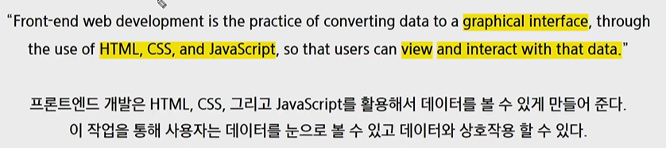
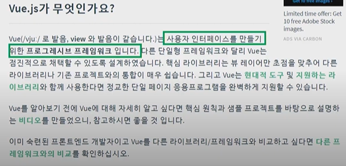
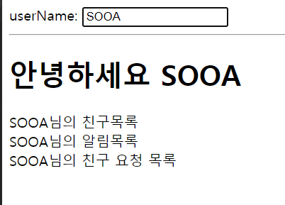

# Vue.js_grammer

[toc]





## CSR(Client Side Rendering)

## SPA(Single Page Application)

> [(참고 문서)](https://poiemaweb.com/js-spa)

- 서버로부터 완전한 새로운 페이지를 불러오지 않고 현재의 페이지를 동적으로 다시 작성함으로써 특정 부분만 사용자와 소통하는 웹 애플리케이션이나 웹 사이트
- SPA의 가장 중요한 목표이자 핵심가치는 **사용자 경험(UX) 향상**이다.
  - 부가적으로 속도의 향상도 기대할 수 있다.
- 초기 구동 속도가 다소 느리다는 단점이 있다.
  - 웹 애플리케이션에 필요한 모든 정적 리소스를 최초에 한번 다운로드하므로 초기 구동 속도가 상대적으로 느리다.
- 같은 페이지에서 필요한 부분만 변경되기 때문에 URL 주소가 변경되지 않는다.
- 페이지 전환이 없고 전체 렌더링이 아닌 특정 부분만 동적으로 변한다.
  - link tag를 사용하는 전통적인 웹 방식은 새로운 페이지 요청 시마다 정적 리소스가 다운로드되고 전체 페이지를 다시 렌더링하는 방식을 사용하므로 새로고침이 발생되어 사용성이 좋지 않다.
  - 그리고 변경이 필요없는 부분를 포함하여 전체 페이지를 갱신하므로 비효율적이다.


## Vue.js의 `MVVM` 패턴

> Model/View/ViewModel
>
> 1. Vue에서 Model은 JavaScirpt Object다
>
> 2. Vue에서 View는 DOM(HTML)이다
>
> 3. Vue에서 ViewModel은 모든 Vue Instance이다.


### 용어

- `View` : 사용자에게 보이는 화면
- `DOM` : HTML 문서에 들어가는 요소의 정보를 담는 데이터트리
- `ViewModel` : View와 Model을 연결해주는(바인딩 해주는) 중개자 역할
- `DOM Listener` : DOM의 변경내역에 대해 즉각적으로 반응하여 특정 로직을 수행하는 장치
- `Data Binding` : View에 표시되는 내용과 Model의 데이터 동기화
- `Model` : 데이터를 담는 용기 역할을 하며, 보통은 서버에서 가져온 데이터를 자바스크립트 객체 형태로 저장


### MVVM 패턴의 특징

- Backend 로직과 Client의 마크업 & 데이터 표현단을 분리하기 위한 구조로 전통적인 MVC 패턴의 방식에서 기인했다.
- 화면 앞단의 회면 동작 관련 로직과 뒷단의 DB 데이터 처리 및 서버 로직을 분리하고, 뒷단에서 넘어온 데이터를 Model 에 담아 View 로 넘어주는 중간 지점이라고 보면 된다.
- **데이터 바인딩**과 화면 단위를 컴포넌트 형태로 제공하며, 관련 API를 지원하는데에 궁극적인 목적
- Angular에서 지원하는 **양방향 데이터 바인딩** 을 동일하게 제공
- 하지만 **컴포넌트 간 통신**의 기본 골격은 React의 **단방향 데이터 흐름(부모 -> 자식)**을 사용
- 다른 프런트엔드 프레임워크(Angular, React)와 [비교](https://vuejs.org/v2/guide/comparison.html)했을 때 상대적으로 가볍고 빠름.
- 문법이 단순하고 간결하여 **초기 학습 비용이 낮고 누구나 쉽게 접근 가능**


## Vue Grammer

```html
<!DOCTYPE html>
<html lang="ko">
<head>
  <meta charset="UTF-8">
  <meta name="viewport" content="width=device-width, initial-scale=1.0">
  <title>Vaniila JavaScript</title>
</head>
<body>
  <label for="inputArea">userName: </label>
  <input type="text" id="inputArea">
  <hr>

  <h1>안녕하세요 <span id="userName1"></span></h1>

  <div>
    <span id="userName2"></span>님의 친구목록
  </div>

  <div>
    <span id="userName3"></span>님의 알림목록
  </div>

  <div>
    <span id="userName4"></span>님의 친구 요청 목록
  </div>

  <script>
    //1. 선택 
    const inputArea = document.querySelector('#inputArea')
    const userName1 = document.querySelector('#userName1')
    const userName2 = document.querySelector('#userName2')
    const userName3 = document.querySelector('#userName3')
    const userName4 = document.querySelector('#userName4')

    userName1.innerText = 'Unknown'
    userName2.innerText = 'Unknown'
    userName3.innerText = 'Unknown'
    userName4.innerText = 'Unknown'

    //2. 이벤트 등록
    inputArea.addEventListener('change', function (event) {
      const newUserName = event.target.value

      //3. 변경
      userName1.innerText = newUserName
      userName2.innerText = newUserName
      userName3.innerText = newUserName
      userName4.innerText = newUserName
    })
  </script>
</body>
</html>

```



#### (1) binding

```html
<!DOCTYPE html>
<html lang="ko">
<head>
  <meta charset="UTF-8">
  <meta name="viewport" content="width=device-width, initial-scale=1.0">
  <meta http-equiv="X-UA-Compatible" content="ie=edge">
  <title>Document</title>
</head>
<body>
  <div id="app"> <!-- View 요소 -->
    {{ message }} <!-- 문자열 표현식 => {{ }} : string interpolation(보간법) -->
  </div>
  <script src="https://cdn.jsdelivr.net/npm/vue/dist/vue.js"></script>
  <!-- 기본적으로 vue는 html에서도 작성할 수 있다. -->
  <script> // view model
    const app = new Vue({
      el: '#app', // view model과 id가 app인 view와 binding됐다는 의미
      data: {
        message: 'Hello Vue!'
      }
    })
  </script>
</body>
</html>
```


## Reference

https://github.com/wally-wally/TIL/blob/master/07_vue/%5BSSAFY%5DVue_%231.md

https://kr.vuejs.org/v2/guide/index.html