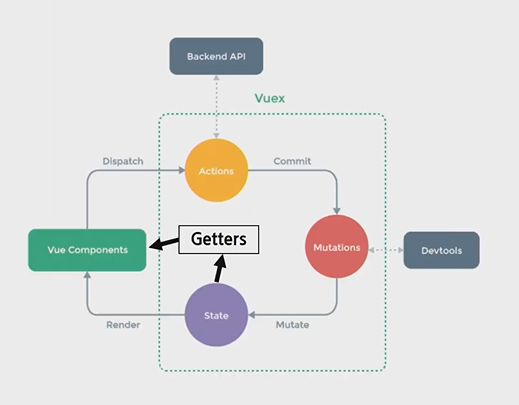
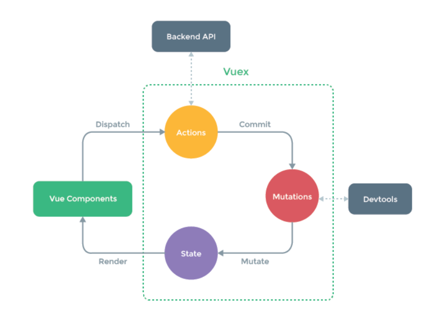

# Vuex

[toc]

> Vuex는 Vue.js애플리케이션에 대한 **상태(state->data)관리패턴+라이브러리**다. 애플리케이션의 모든 컴포넌트에 대한 **중앙 집중식 저장소** 역할을 하며 예측 가능한 방식으로 상태를 변경할 수 있다. 또한 Vue의 공식 devtools확장프로그램과 통합되어 설정 시간이 필요 없는 디버깅 및 상태 스냅 샷 내보내기/가져오기와 같은 고급기능 제공함
>
> Vue.js에서 부모, 자식 컴포넌트 관계는 **props는 아래로, events 위로**라고 요약할 수 있다. **부모는 props를 통해 자식에게 데이터를 전달**하고 **자식은 events를 통해 부모에게 메시지를 보낸다.**


## Vuex Core Concept

> 


### State

- (중앙에서 관리하는) 모든 데이터(===상태)
- data


### Getters

- 저장소의 상태를 기준으로 계산해야 하는 값
- 실제 상태(data)를 변경하지 않는다.
- computed와 유사하다


### Mutations

- state를 변경하는 로직
- 동기적인 작업
- 첫번째 인자로 항상 state를 받고 commit을 통해 호출한다.


### Actions

- state를 직접 변경하지 않고 mutations에 정의된 메서드를 호출해서 변경한다.
- 데이터 fetch및 처리 & 가공, 비동기 작업
- 첫번째 인자로 항상 context를 받고 dispatch로 mutations의 메서드를 호출한다.





### 언제 Vuex사용하나?

- 공유된 상태관리를 처리하는 데 유용하지만, 개념에 대한 이해와 시작하는 비용도 함께 든다. 그것은 단기간과 장기간 생산성 간의 기회비용이 있다.
- 대규모 SPA를 구축하지 않고 Vuex로 바로 뛰어 들었다면, 시간이 오래 걸림
- **앱이 단순하다면 Vuex없이는 괜찮음**
- 그러나 **중대형 규모의 SPA**를 구축하는 경우 Vue컴포넌트 외부의 상태를 보다 잘 처리할 수 있고, Vuex는 자연스럽게 선택할 수 있는 단계가 됨


### "상태 관리 패턴"이란

```js
new Vue({
  // 상태
  data () {
    return {
      count: 0
    }
  },
  // 뷰
  template: `
    <div>{{ count }}</div>
  `,
  // 액션
  methods: {
    increment () {
      this.count++
    }
  }
})
```


첫번째 문제의 경우, 지나치게 중첩된 컴포넌트를 통과하는 prop는 장황할 수 있으며 형제 컴포넌트에서는 작동하지 않는다.

두번째 문제의 경우 직접 부모/자식 인스턴스를 참조하거나 이벤트를 통해 상태의 여러 복사본을 변경 및 동기화 하려는 등의 해결 방법을 사용해야 한다. 이러한 패턴은 모두 부서지기 쉽고 유지보수가 불가능한 코드로 빠르게 변경된다.

또한 상태 관리 및 특정 규칙 적용과 관련된 개념을 정의하고 분리함으로써 코드의 구조와 유지 관리 기능을 향상시킨다.




---------

이정도는 눈에 익혀두기!(JS)


## 구조분해할당(비구조화, destructuring)

> 배열이나 객체의 속성을 해체하여 그 값을 개별 변수에 담을 수 있게 하는 js표현식. 객체나 배열을 분해하는 것.

```js
const [c, ,d] = [1, 2, 3];
console.log(c); // 1
console.log(d); // 3

const obj2 = {
  h: 'Eich',
  i: {
    j: 'Jay'
  }
}
const { h, i: { j }, k } = obj2;
console.log(h, j, k); // 'Eich', 'Jay', undefined
```


### 인자에서의 비구조화

```js
function hello(context){
    console.log(context.foo)
}
// undefined
hello({foo:'hello'})
//hello
hello('hello')
//undefined


//인자에서의 비구조화
//이런식으로 함수를 작성하면 코드를 작성하기 힘들어짐.. 애초에 context자체를 비구조화해서 받는게 좋다. -> 코드 길이가 줄어듦
function wordl({foo}){
    console.log(foo)
}
world({foo:'hello'})
//hello
```


## 스프레드(spread) 오퍼레이터 

```js
const slime = {
  name: '슬라임'
};

const cuteSlime = {
  name: '슬라임',
  attribute: 'cute'
};

const purpleCuteSlime = {
  name: '슬라임',
  attribute: 'cute',
  color: 'purple'
};

console.log(slime);
console.log(cuteSlime);
console.log(purpleCuteSlime);
```

이 코드에서 먼저 slime이라는 객체 선언, 이후에 slime객체를 건들지 않고 새로운 객체를 만든다!

위 코드에서의 핵심은 기존의 것을 건들이지 않고, 새로운 객체를 만듦!

이런 상황에서 사용할 수 있는 문법 **spread 연산자**

```js
const slime = {
  name: '슬라임'
};

const cuteSlime = {
  ...slime,
  attribute: 'cute'
};

const purpleCuteSlime = {
  ...cuteSlime,
  color: 'purple'
};

console.log(slime);
console.log(cuteSlime);
console.log(purpleCuteSlime);
```

**spread 연산자는 배열에서도 사용할 수 있음**

```js
const animals = ['개', '고양이', '참새'];
const anotherAnimals = [...animals, '비둘기'];
console.log(animals);
console.log(anotherAnimals);


const numbers = [1, 2, 3, 4, 5];

const spreadNumbers = [...numbers, 1000, ...numbers];
console.log(spreadNumbers); // [1, 2, 3, 4, 5, 1000, 1, 2, 3, 4, 5]
```


## map(호출될때 대상 요소의 값, 그 요소의 인덱스, map을 호출한 원본 배열)

>`**map()**` 메서드는 배열 내의 모든 요소 각각에 대하여 주어진 함수를 호출한 결과를 모아 새로운 배열을 반환

```js
const array1 = [1, 4, 9, 16];

// pass a function to map
const map1 = array1.map(x => x * 2);

console.log(map1);
// expected output: Array [2, 8, 18, 32]
```

- map은 **callback함수**를 각각의 요소에 대해 한번씩 순서대로 불러 그 함수의 반환값으로 새로운 배열을 만듦
- **callback함수는(undefined도 포함해서)** 배열 값이 들어있는 인덱스에 대해서만 호출됨
- 즉, 값이 삭제되거나 아직 값이 할당/정의되지 않은 인덱스에 대해서는 호출되지 않음

- `map`은 호출한 배열의 값을 변형하지 않다. 단, `callback` 함수에 의해서 변형될 수는 있다.

- 호출한 배열의 중간이 비어있는 경우, 결과 배열 또한 동일한 인덱스를 빈 값으로 유지


### map예시

> `map`에 하나의 인자(순회하는 원소)만 받는 콜백을 사용하는 경우가 많다. 그러나 어떤 함수는 대개 하나의 인자로 호출하지만 두 개 이상의 인자를 사용하는 경우도 있다. 이로 인해 어떤 경우 혼란스러울 수도 있다.

```js
// 아래 라인을 보면...
['1', '2', '3'].map(parseInt);
// 결과를 [1, 2, 3] 으로 기대할 수 있다.
// 그러나 실제 결과는 [1, NaN, NaN] 이다.

// parseInt 함수는 보통 하나의 인자만 사용하지만, 두 개를 받을 수 있다.
// 첫 번째 인자는 변환하고자 하는 표현이고 두 번째는 숫자로 변환할 때 사용할거다.
// Array.prototype.map은 콜백에 세 가지 인자를 전달한다.
// 배열의 값, 값의 인덱스, 그리고 배열
// 세 번째 인자는 parseInt가 무시하지만 두 번째 인자는 아니다.
// 따라서 혼란스러운 결과를 도출할 수 있다.

function returnInt(element) {
  return parseInt(element, 10);
}

['1', '2', '3'].map(returnInt); // [1, 2, 3]
// 실제 결과가 예상한 대로 배열의 숫자와 같다.

// 위와 같지만 더 간단한 화살표 표현식
['1', '2', '3'].map(str => parseInt(str));

// 더 간단하게 해결할 수 있는 방법
['1', '2', '3'].map(Number); // [1, 2, 3]
// 그러나 `parseInt`와 달리 float이나 지수표현도 반환한다.
['1.1', '2.2e2', '3e300'].map(Number); // [1.1, 220, 3e+300]
```

--------

## Vuex 실습

- app.vue

```html
<template>
  <div>
    <todo-form/>
    <todo-list/>
  </div>
</template>

<script>
import TodoForm from './components/TodoForm.vue'
import TodoList from './components/TodoList.vue'
export default {
  components: { TodoForm, TodoList },
  name: 'App',
}
</script>

<style>
#app {
  font-family: Avenir, Helvetica, Arial, sans-serif;
  -webkit-font-smoothing: antialiased;
  -moz-osx-font-smoothing: grayscale;
  text-align: center;
  color: #2c3e50;
  margin-top: 60px;
}
</style>
```


- index.js

```js
import Vue from 'vue'
import Vuex from 'vuex'

Vue.use(Vuex)


export default new Vuex.Store({
  // 데이터를 정의하는 곳대바
   state: {
    // id값은 나중에 for문에 줄 key값
    todos:[
      {content:'입실 체크',isCompleted:true, id:1,},
      {content:'퇴실 체크',isCompleted:false, id:2,},
    ],
  },
  // 데이터를 수정하는 곳
  // state변경하는 정도는 mutations에서만 해도됨
  mutations: {
    // state를 변경할 수 있는 함수를 정의
    UPDATE_TODO_STATUS(state,todoItem){
      //받은 todoItem으로 state에 있는 todos를 업데이트
      // state의 todos의 completed만 바꾸면 안됨! 바꾸려면 전체를 바꿔야됨!(state.todos[0].isCompleted = ~ 이런식으로 적으면 안됨! state.todos로 전체를 바꾸자!)
      state.todos = state.todos.map((todo)=>{
        if (todo.id === todoItem.id) {
          // todo를 수정해서 리턴!
          return todoItem
        }else{
          return todo
        }
      })
    }, 
    // Date.now()-> 생성될때만 나타나는 숫자!
    ADD_TODO(state,userInput) {
      const newTodo = {
        content:userInput,
        isCompleted:false,
        id:Date.now()
      }
      state.todos.push(newTodo)
    }, 
  },
  // 비동기적인 요청을 할때 많이 씀 동작!
  actions: {
    // 현재 actions는 없어도 되긴한데 이렇게 쓸수도 있다는걸 보여줌!
    addTodo({commit}, userInput){
      // 우리 서버에 userInput을 가지고 검색한 데이터를 가져와서
      // 그거를 토대로 ADD_TODO 를 해야한다.
      commit('ADD_TODO',userInput)

    }
  },
  // computed속성과 유사
  getters: {
    // component의 computed와 비슷한일을 state로 하는 역할!

  }
})
```

- TodoForm.vue

```html
<template>
  <div>
    <input type="text" v-model='userInput' @keyup.enter='addTodo'>
    <button @click='addTodo'>등록</button>
  </div>
</template>

<script>
export default {
  data() {
    return {
      userInput:'',
    }
  },
  methods: {
    // uerInput을 가지고 store의 state에 있는 todos에 추가
    addTodo(){
      this.$store.commit('ADD_TODO',this.userInput)
      this.userInput = ''
    }
  },
}
</script>

<style>

</style>
```

- TodoList.vue

```html
<template>
  <div>
    <ul>
      <!-- <Todo v-for='vuex state에서 가져온 todos'/> -->
      <Todo 
      v-for='todo in $store.state.todos' 
      :todo='todo' 
      :key='todo.id'/>
    </ul>
  </div>
</template>

<script>
import Todo from './Todo.vue'
export default {
  components: { Todo },

}
</script>

<style>

</style>
```

- Todo.vue

```html
<template>
  <li>
    <!-- checked는 T/F인데 T일때 체크됨 -->
    <input type="checkbox" :checked='todo.isCompleted' @change='onChange'>
    <span>{{todo.content}}</span>
  </li>
</template>

<script>
export default {
  props:{
    todo:Object,
  },
  methods:{
    onChange(){
      // store의 mutations의 update함수를 불러와서 실행!
      // script에서 쓸때는 this.을 써야됨
      // 새 객체를 만들어 전달!(변경된 todo값을 전달해야됨)
      this.$store.commit('UPDATE_TODO_STATUS',{
        // isCompleted를 제외한 나머지는 그대로 주겠다,,?
      ...this.todo,
      // id:this.todo.id,
      // content:this.todo.content,
      // 토글을 해야되니까 앞에 ! 붙여줌
      isCompleted:!this.todo.isCompleted,
    })
    },
  }
}
</script>

<style>

</style>
```


----------

## Reference

https://learnjs.vlpt.us/useful/07-spread-and-rest.html

https://vuex.vuejs.org/kr/

https://developer.mozilla.org/ko/docs/Web/JavaScript/Reference/Global_Objects/Array/map