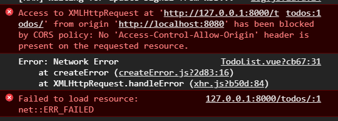
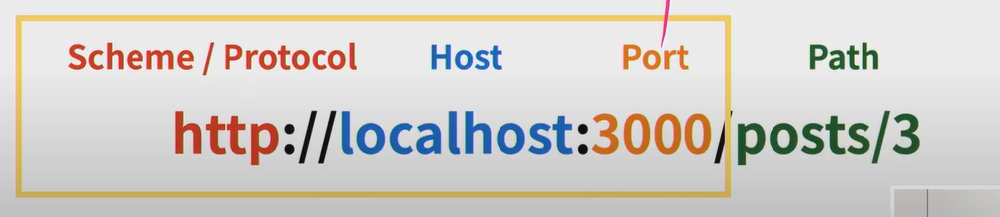
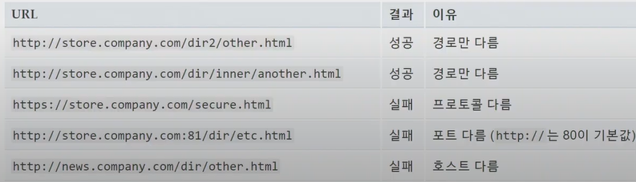
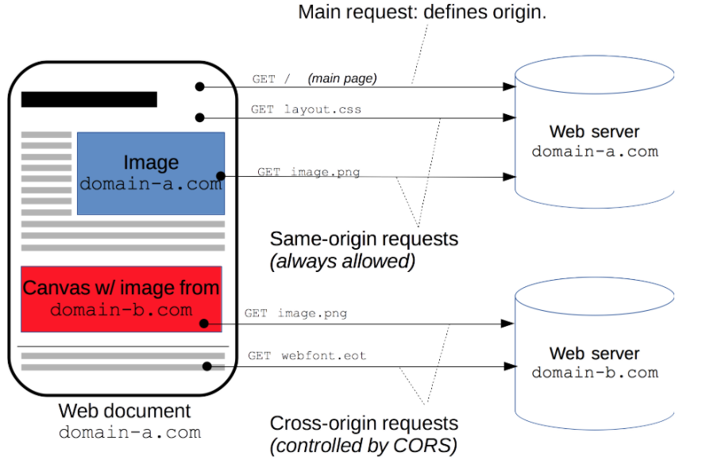
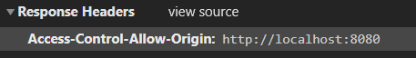
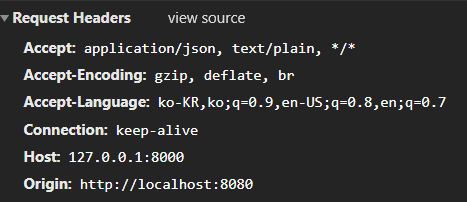
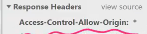
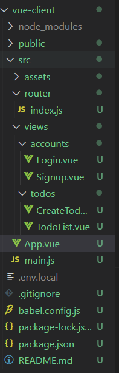

# Vue_API

[toc]

## Server & Client

### Server(DRF) : 정보제공

> 서버는 클라이언트에게 네트워크를 통해 **정보**나 **서비스**를 제공하는 컴퓨터 시스템

### Client(Vue.js) : 정보 요청 & 표현

> 클라이언트는 네트워크를 통하여 서버라는 다른 컴퓨터 시스템 상의 원격 서비스에 접속할 수 있는 응용 프로그램이나 서비스를 말한다.(중략) **서버에서 그 서버가 맞는 서비스를 요청**하고 서비스 요청하고 서비스 요청을 위해 필요한 인자를 서버가 원하는 방식에 맞게 제공하며, 서버로부터 반환되는 응답에 사용자에게 적절한 방식으로 표현하는 기능을 가진 프로그램이나 시스템이다.

### CORS(Cross-Origin Resource Sharing)

> SOP(Same-Origin Policy) 동일 출처 정책 : 같은 출처에서만 리소스를 공유
>
> CORS(교차출처자원공유) : 다른 출처에서 온 리소스를 공유
>
> CORS Policy 다른 출처에서 온 리소스를 공유하는 것에 대한 정책 -> SOP의 예외사항
>
> 

- Same origin : 이 세가지가 같으면 같은 출처라고 함(Port 생략가능)



#### 출처

- 두 URL의 프로토콜, 포트(명시한경우),호스트가 모두 같아야 동일한 출처라고 말함



CORS는 추가 **HTTP헤더를 사용**하여, 한 출처에서 실행 중인 웹 애플리케이션이 다른 출처의 선택한 **자원에 접근할 수 있는 권한을 부여하도록 브라우저에 알려주는 체제**다. 웹 애플리케이션은 리소스가 자신의 출처(도메인, 프로토콜,포트)와 다를 때 교차 출처 HTTP요청을 실행한다.

교차 출처 요청의 예시 : `https://domain-a.com`의 프론트 엔드 JavaScript코드가 `XMLHttpRequest`를 사용하여 `https://domain-b.com/data.json`을 요청하는 경우

**보안 상의 이유로, 브라우저는 스크립트에서 시작한 교차 출처 HTTP요청을 제한**한다. 예를 들어, `XMLHttpRequest`와 FetchAPI는 동일출처정책(SOP)을 따른다. 즉, 이 API를 사용하는 웹 애플리케이션은 **자신의 출처와 동일한 리소스만 불러올 수 있으며, 다른 출처의 리소스를 불러오려면 그 출처에서 올바른 CORS헤더를 포함한 응답을 반환해야 한다.**



#### 교차 출처 접근 허용하기

- CORS를 사용해 교차 출처 접근을 허용
- CORS는 HTTP의 일부로, 어떤 호스트에서 자신의 콘텐츠를 불러갈 수 있는지 서버에 지정할 수 있는 방법

**브라우저(+웹 어플리케이션) 보호**

- 요청에 대한 응답으로 받는 자원에 대한 최소한의 검증
- 서버는 정상적으로 응답하지만 브라우저에서 받지 않고 차단


#### django-cors-headers

**HOW??**

**Client**  Origin :  `https://lab.ssafy.com`

**Server** Access-Control-Allow-Origin : `https//lab.ssafy.com` or Access-Control-Allow-Origin : `*`

`*` 이렇게 적어도 되지만 정확하게 주소를 명시를 해주는것이 좋음

**방법**

```sh
python -m pip install django-cors-headers
```

- settings.py

```python
INSTALLED_APPS = [
    ...
    'corsheaders',
    ...
]

MIDDLEWARE = [
    ...
    'corsheaders.middleware.CorsMiddleware',
     ...
]


# Access-Control-Allow-Origin: * 

# 특정 Origin만 선택적으로 허용
CORS_ALLOWED_ORIGINS = [
    'http://localhost:8080',
]

# 모든 Origin 허용(*) 전부를 다 허용해줌
# CORS_ORIGIN_ALLOW_ALL = True
```

- 특정 Origin만 선택적으로 허용





-  모든 Origin 허용(*) 전부를 다 허용해줌
  - 이거는 위험함




정리

서버와 클라이언트가 만남

서버는 정보 제공(서비스 제공)

클라이언트는 정보 요청(서비스 요청) + 받은 정보 표현

클라이언트 서버가 원하는 방식으로 요청(GET,POST,PUT,DELETE 요청 날림)

서버는 요청 받고 xml,html,json 데이터 정보로 클라이언트에게 응답

클라이언트는 받은 정보를 사용자에게 보여줌 (interaction)

CORS policy -> 장고 header를 이용해서 이문제 처리함


### Authentication & Authorization

 #### Authentication(인증)

- 자신이라고 주장하는 유저 확인
- Credentials(비밀번호, 얼굴인식) 검증
- django-> 게시판 서비스 로그인
- 인증 이후에 획득하는 권한(생성, 수정,삭제)

#### Autorization(권한/허가)

- 유저가 자원에 접근할 수 있는지 여부 확인
- 규칙/규정에 의해 접근할 수 있는지 확인
- Django ->일반 유저 vs 관리자 유저
- 인증 이후에 부여되는 권한
- 예시 - 로그인 글 작성 여부

#### Session/ Token Based Authentication

> Json Web Token(JWT)이용

|                         | Session         | JWT                  |
| ----------------------- | --------------- | -------------------- |
| 인증 수단의 저장 위치   | Server          | Client               |
| 인증 수단의 정보 민감성 | Low(session id) | High(self-contained) |
| 유효기간                | Y               | Y                    |

JWT 토큰받기

```sh
$ pip install djangorestframework-jwt
```

- settings.py

```python
REST_FRAMEWORK = {
    # 로그인 여부를 확인하는 클래스
    'DEFAULT_PERMISSION_CLASSES': (
        'rest_framework.permissions.IsAuthenticated',
    ),
    # 인증 여부를 확인하는 클래스
    'DEFAULT_AUTHENTICATION_CLASSES': (
        'rest_framework_jwt.authentication.JSONWebTokenAuthentication',
        'rest_framework.authentication.SessionAuthentication',
        'rest_framework.authentication.BasicAuthentication',
    ),
}
```

그 아래에 `JWT_AUTH` 내용 추가

```python
import datetime # 최상단에 반드시 작성

JWT_AUTH = {
    # JWT를 encrypt 함. 이 부분은 절대 외부 노출 금지.
    'JWT_SECRET_KEY': SECRET_KEY, # 배포 시에는 이 부분을 가려서 올려야 한다.
    # 토큰 해싱 알고리즘 (default: HS256)
    'JWT_ALGORITHM': 'HS256',
    # 7일간 유효한 토큰
    # (처음에 seconds=300 이라고 되어있었는데 이는 300초간 유효한 토큰을 의미했음)
    'JWT_EXPIRATION_DELTA': datetime.timedelta(days=7),
    # 토큰 갱신 허용 여부
    'JWT_ALLOW_REFRESH': True,
    # 28일 마다 토큰이 갱신(유효기간 연장시)
    'JWT_REFRESH_EXPIRATION_DELTA': datetime.timedelta(days=28),
}
```

- accounts > urls.py

```python
from django.urls import path
from . import views

from rest_framework_jwt.views import obtain_jwt_token

urlpatterns = [
    path('signup/', views.signup),
    # 알아서 token이 실행됨,  # user 한테 jwt 토큰을 발급해 주는 곳
    path('api-token-auth/', obtain_jwt_token),
]
```


---------

## SERVER_CLIENT

### `drf_server`(Back)

#### server 프로젝트명

- `settings.py`

```python
"""
Django settings for server project.

Generated by 'django-admin startproject' using Django 3.1.3.

For more information on this file, see
https://docs.djangoproject.com/en/3.1/topics/settings/

For the full list of settings and their values, see
https://docs.djangoproject.com/en/3.1/ref/settings/
"""

from pathlib import Path

import datetime

# Build paths inside the project like this: BASE_DIR / 'subdir'.
BASE_DIR = Path(__file__).resolve().parent.parent


# Quick-start development settings - unsuitable for production
# See https://docs.djangoproject.com/en/3.1/howto/deployment/checklist/

# SECURITY WARNING: keep the secret key used in production secret!
SECRET_KEY = '#####'

# SECURITY WARNING: don't run with debug turned on in production!
DEBUG = True

ALLOWED_HOSTS = []


# Application definition

INSTALLED_APPS = [
    # app
    'todos',
    'accounts',

    'django.contrib.admin',
    'django.contrib.auth',
    'django.contrib.contenttypes',
    'django.contrib.sessions',
    'django.contrib.messages',
    'django.contrib.staticfiles',

    # drf 
    'rest_framework',

    # django cors
    'corsheaders',
]

MIDDLEWARE = [
    # django cors middleware setting
    'corsheaders.middleware.CorsMiddleware',
    
    'django.middleware.security.SecurityMiddleware',
    'django.contrib.sessions.middleware.SessionMiddleware',
    'django.middleware.common.CommonMiddleware',
    'django.middleware.csrf.CsrfViewMiddleware',
    'django.contrib.auth.middleware.AuthenticationMiddleware',
    'django.contrib.messages.middleware.MessageMiddleware',
    'django.middleware.clickjacking.XFrameOptionsMiddleware',
]

# Access-Control-Allow-Origin: * 

# 특정 Origin만 선택적으로 허용
CORS_ALLOWED_ORIGINS = [
    'http://localhost:8080',
]

# 모든 Origin 허용(*) 전부를 다 허용해줌
# CORS_ORIGIN_ALLOW_ALL = True


ROOT_URLCONF = 'server.urls'

TEMPLATES = [
    {
        'BACKEND': 'django.template.backends.django.DjangoTemplates',
        'DIRS': [],
        'APP_DIRS': True,
        'OPTIONS': {
            'context_processors': [
                'django.template.context_processors.debug',
                'django.template.context_processors.request',
                'django.contrib.auth.context_processors.auth',
                'django.contrib.messages.context_processors.messages',
            ],
        },
    },
]

WSGI_APPLICATION = 'server.wsgi.application'


# Database
# https://docs.djangoproject.com/en/3.1/ref/settings/#databases

DATABASES = {
    'default': {
        'ENGINE': 'django.db.backends.sqlite3',
        'NAME': BASE_DIR / 'db.sqlite3',
    }
}


# Password validation
# https://docs.djangoproject.com/en/3.1/ref/settings/#auth-password-validators

AUTH_PASSWORD_VALIDATORS = [
    {
        'NAME': 'django.contrib.auth.password_validation.UserAttributeSimilarityValidator',
    },
    {
        'NAME': 'django.contrib.auth.password_validation.MinimumLengthValidator',
    },
    {
        'NAME': 'django.contrib.auth.password_validation.CommonPasswordValidator',
    },
    {
        'NAME': 'django.contrib.auth.password_validation.NumericPasswordValidator',
    },
]


# Internationalization
# https://docs.djangoproject.com/en/3.1/topics/i18n/

LANGUAGE_CODE = 'ko-kr'

TIME_ZONE = 'Asia/Seoul'

USE_I18N = True

USE_L10N = True

USE_TZ = True


# Static files (CSS, JavaScript, Images)
# https://docs.djangoproject.com/en/3.1/howto/static-files/

STATIC_URL = '/static/'

# custom user model
AUTH_USER_MODEL = 'accounts.User'

# JWT addtional settings

JWT_AUTH = {
    # 원래는 seconds 인데 수업이라 하루동안으로 바꿈
    'JWT_EXPIRATION_DELTA': datetime.timedelta(days=1),
}

# REST_FRAMEWORK = {
#     'DEFAULT_PERMISSION_CLASSES': (
#         # 인증된 사용자가 요청을 보냈는지 검정
#         'rest_framework.permissions.IsAuthenticated',
#     ),
#     'DEFAULT_AUTHENTICATION_CLASSES': (
#         # jwt가 유효한지 검정
#         'rest_framework_jwt.authentication.JSONWebTokenAuthentication',
#     ),
# }
```

- urls.py

```python
from django.contrib import admin
from django.urls import path, include

urlpatterns = [
    path('admin/', admin.site.urls),
    path('todos/', include('todos.urls')),
    path('accounts/', include('accounts.urls')),
]
```


#### todos app

- models.py

```python
from django.db import models
from django.conf import settings

class Todo(models.Model):
    user = models.ForeignKey(settings.AUTH_USER_MODEL,on_delete=models.CASCADE,related_name='todos')
    title = models.CharField(max_length=50)
    # completed는 t/f만 있음, 처음에 default값은 f, 이렇게 하면 만들어주지 않아도 자동으로 f로 작성됨
    completed = models.BooleanField(default=False)
```

- serializers.py

```python
from rest_framework import serializers
from .models import Todo

# queryset model instance 직렬화 -> json으로 만들어주는 것
class TodoSerializer(serializers.ModelSerializer):
    
    class Meta:
        model = Todo
        fields = ('id', 'title', 'completed',)
```

- urls.py

```python
from django.urls import path
from . import views

# restful하게 보여주려고 
urlpatterns = [
    path('', views.todo_list_create),
    path('<int:todo_pk>/', views.todo_update_delete),
]
```

- views.py

```python
from django.shortcuts import get_object_or_404

from rest_framework import status
from rest_framework.response import Response
from rest_framework.decorators import api_view

from rest_framework.decorators import authentication_classes, permission_classes
from rest_framework.permissions import IsAuthenticated
from rest_framework_jwt.authentication import JSONWebTokenAuthentication

from .serializers import TodoSerializer
from .models import Todo


@api_view(['GET', 'POST'])
# api_view보다 위에 적으면 안됨!
@authentication_classes([JSONWebTokenAuthentication])
@permission_classes([IsAuthenticated])
def todo_list_create(request):
    if request.method == 'GET':
        todos = Todo.objects.all()
        # todos 쿼리셋을 json으로 만들어줌, many=true라는옵션이 반드시 필요!(원래는 모델인스턴스만 serialize하기때문에 이건 쿼리셋이니까 적어줘야됨)
        # serializer = TodoSerializer(todos, many=True)
        # 요청을 보낸 유저의 글만 보여줌! 역참조 user.todos이용
        serializer = TodoSerializer(request.user.todos, many=True)
        return Response(serializer.data)
    else:
        #client에서 준 데이터
        serializer = TodoSerializer(data=request.data)
        if serializer.is_valid(raise_exception=True):
            # user는 필수키이기 때문에 저장할때 같이 저장해줘야됨!
            serializer.save(user=request.user)
            # 요청된거 잘 처리됐다고 201을 같이 보여줌
            return Response(serializer.data, status=status.HTTP_201_CREATED)


@api_view(['PUT', 'DELETE'])
@authentication_classes([JSONWebTokenAuthentication])
@permission_classes([IsAuthenticated])
def todo_update_delete(request, todo_pk):
    todo = get_object_or_404(Todo, pk=todo_pk)
    
    # 내가쓴 글만 지우게 함!, 내가쓴 글이 아니면 권한이 없다고 뜬다.
    if not request.user.todos.filter(pk=todo_pk).exists():
        return Response({'detail':'권한이 없습니다.'})

    if request.method == 'PUT':
        serializer = TodoSerializer(todo, data=request.data)
        if serializer.is_valid(raise_exception=True):
            serializer.save()
            return Response(serializer.data)
    else:
        todo.delete()
        return Response({ 'id': todo_pk })
```


#### accounts app

- models.py

```python
from django.db import models
from django.contrib.auth.models import AbstractUser
# Create your models here.

class User(AbstractUser):
    pass
```

- serializers.py

```python
from rest_framework import serializers
from django.contrib.auth import get_user_model

# Model을 제외한 곳에서는 모두 get_user_model로 user정보를 가져옴
User = get_user_model()

class UserSerializer(serializers.ModelSerializer):
    # 쓰기전용, 직렬화가 돼서 json으로나오긴하지만 표현하지 않는다. 응답을 하지 않는다 readonly의 반대,
    password = serializers.CharField(write_only=True)
    class Meta:
        model = User
        fields = ('username','password',)
```

- urls.py

```python
from django.urls import path
from . import views

from rest_framework_jwt.views import obtain_jwt_token

urlpatterns = [
    path('signup/', views.signup),
    # 알아서 token이 실행됨
    path('api-token-auth/', obtain_jwt_token),
]
```

- views.py

```python
from rest_framework import status
from rest_framework.decorators import api_view
from rest_framework.response import Response
from .serializers import UserSerializer


@api_view(['POST'])
def signup(request):
	#1-1. Client에서 온 데이터를 받아서
    password = request.data.get('password')
    password_confirmation = request.data.get('passwordConfirmation')
		
	#1-2. 패스워드 일치 여부 체크
    if password != password_confirmation:
        return Response({'error': '비밀번호가 일치하지 않습니다.'}, status=status.HTTP_400_BAD_REQUEST)
		
	#2. UserSerializer를 통해 데이터 직렬화
    serializer = UserSerializer(data=request.data)
    
	#3. validation 작업 진행 -> password도 같이 직렬화 진행
    if serializer.is_valid(raise_exception=True):
        user = serializer.save()
        #4. 비밀번호 해싱 후 
        # set_password를 통해 password를 암호화해서 저장
        user.set_password(request.data.get('password'))
        user.save()
    # password는 직렬화 과정에는 포함 되지만 → 표현(response)할 때는 나타나지 않는다.
    return Response(serializer.data, status=status.HTTP_201_CREATED)

```


### Vue-client(front)



> **Vue Router**
>
> Vue 다음에 `vue-router`를 포함하면 자동으로 설치됨.
>
> ```html
> <script src="/path/to/vue.js"></script>
> <script src="/path/to/vue-router.js"></script>
> ```
>
> NPM
>
> ```bash
> npm install vue-router
> ```
>
> 모듈 시스템에서 사용하면 `Vue.use()`를 통해 명시적으로 라우터를 추가해야한다.
>
> ```js
> import Vue from 'vue'
> import VueRouter from 'vue-router'
> 
> Vue.use(VueRouter)
> ```
>
> 전역 스크립트 태그를 사용할 때는 이 작업을 하지 않아도 된다.
>
> - html
>
> ```html
> <script src="https://unpkg.com/vue/dist/vue.js"></script>
> <script src="https://unpkg.com/vue-router/dist/vue-router.js"></script>
> 
> <div id="app">
>   <h1>Hello App!</h1>
>   <p>
>     <!-- 네비게이션을 위해 router-link 컴포넌트를 사용합니다. -->
>     <!-- 구체적인 속성은 `to` prop을 이용합니다. -->
>     <!-- 기본적으로 `<router-link>`는 `<a>` 태그로 렌더링됩니다.-->
>     <router-link to="/foo">Go to Foo</router-link>
>     <router-link to="/bar">Go to Bar</router-link>
>   </p>
>   <!-- 라우트 아울렛 -->
>   <!-- 현재 라우트에 맞는 컴포넌트가 렌더링됩니다. -->
>   <router-view></router-view>
> </div>
> ```
>
> - javascript
>
> ```js
> // 0. 모듈 시스템 (예: vue-cli)을 이용하고 있다면, Vue와 Vue 라우터를 import 하세요
> // 그리고 `Vue.use(VueRouter)`를 호출하세요
> 
> 
> // 1. 라우트 컴포넌트를 정의하세요.
> // 아래 내용들은 다른 파일로부터 가져올 수 있습니다.
> const Foo = { template: '<div>foo</div>' }
> const Bar = { template: '<div>bar</div>' }
> 
> // 2. 라우트를 정의하세요.
> // Each route should map to a component. The "component" can
> // 각 라우트는 반드시 컴포넌트와 매핑되어야 합니다.
> // "component"는 `Vue.extend()`를 통해 만들어진
> // 실제 컴포넌트 생성자이거나 컴포넌트 옵션 객체입니다.
> const routes = [
>   { path: '/foo', component: Foo },
>   { path: '/bar', component: Bar }
> ]
> 
> // 3. `routes` 옵션과 함께 router 인스턴스를 만드세요.
> // 추가 옵션을 여기서 전달해야합니다.
> // 지금은 간단하게 유지하겠습니다.
> const router = new VueRouter({
>   routes // `routes: routes`의 줄임
> })
> 
> // 4. 루트 인스턴스를 만들고 mount 하세요.
> // router와 router 옵션을 전체 앱에 주입합니다.
> const app = new Vue({
>   router
> }).$mount('#app')
> 
> // 이제 앱이 시작됩니다!
> ```
>
> 라우터를 주입하였으므로 `this.$router`와 현재 라우트를 `this.$route`로 접근할 수 있다.
>
> `<router-link>`는 현재 라우트와 일치할 때 자동으로 `.router-link-active` 클래스가 추가e됨
>
> ```js
> // Home.vue
> export default {
>   computed: {
>     username () {
>       // 곧 `params` 확인할 수 있습니다.
>       return this.$route.params.username
>     }
>   },
>   methods: {
>     goBack () {
>       window.history.length > 1
>         ? this.$router.go(-1)
>         : this.$router.push('/')
>     }
>   }
> }
> ```

#### App.vue

> `<router-link>`를 클릭 할 때 내부적으로 호출되는 메소드이므로 `<router-link :to="...">`를 클릭하면 `router.push(...)`를 호출하는 것과 같다.
>
> 이름을 가진 라우트에 링크하려면, 객체를 `router-link`, 컴포넌트의 `to` prop로 전달할 수 있다
>
>  `<router-view>`는 최상위 outlet이다. 최상위 경로와 일치하는 컴포넌트를 렌더링한다. 비슷하게 렌더링 된 컴포넌트는 자신의 중첩 된 `<router-view>`를 포함 할 수도 있다

```vue
<template>
  <div id="app">
    <div id="nav">
      <span v-if='login'>
        <!-- 컴포넌트로 이동한다고 해서 새로고침이 일어나지 않음! 그냥 그자리에 컴포넌트가 들어갈수있도록 만들었기 때문 -->
          <!--<router-link to="/">TodoList</router-link> |
      	<router-link to="/create">AddTodo</router-link> 이렇게도 적을 수 있음-->
        <router-link :to="{ name: 'TodoList' }">Todo List</router-link> | 
        <router-link :to="{ name: 'CreateTodo' }">Create Todo</router-link> |
        <!-- to값이 없으면 보이지 않음, 랜더링이 안됨 그래서 그냥 #붙여줌 -->
        <!-- 본연의 click이란 이벤트를 받아야되는 상황이면 click.native라고 붙여줌 -->
        <!-- 왜냐면 click만 적으면 새로고침이 되는것뿐..그래서 native를 붙여줌 -->
        <router-link @click.native='logout' to="#">Logout</router-link> |
      </span>
      <span v-else>
        <router-link :to="{ name: 'Signup' }">Signup</router-link> |
        <router-link :to="{ name: 'Login' }">Login</router-link> 
      </span>
    </div>
    <!-- 로그인이 됐다고 알려주면, login값을 true로 바꿔줌, 이게 vuex를 쓰는 이유..이런식으로 알려주지 않으려고 -->
    <router-view @login='login = true/>
  </div>
</template>

<script>
export default {
  name: 'App',
  data: function () {
    return {
      login:false,
    }
  },
  methods: {
    logout : function(){
      localStorage.removeItem('jwt')
      // 값을 알려줘야 이게 반응을해서 false로 변경시켜줌
      this.login = false
      this.$router.push({name:'login'})
    }
  },
  created: function () {
    // 토큰이 있으면 localstorage 안에 있는 토큰을 확인하고 토큰이 있으면 true없으면 false
    // getItem은 저장한 이름을 가져옴
    const token = localStorage.getItem('jwt')
    if (token) {
      this.login = true
    }
  }
}
</script>


<style>
#app {
  font-family: Avenir, Helvetica, Arial, sans-serif;
  -webkit-font-smoothing: antialiased;
  -moz-osx-font-smoothing: grayscale;
  text-align: center;
  color: #2c3e50;
}

#nav {
  padding: 30px;
}

#nav a {
  font-weight: bold;
  color: #2c3e50;
}

#nav a.router-link-exact-active {
  color: #42b983;
}
</style>
```

#### src > router > index.js

```js
import Vue from 'vue'
import VueRouter from 'vue-router'
import TodoList from '@/views/todos/TodoList'
import CreateTodo from '@/views/todos/CreateTodo'
import Signup from '@/views/accounts/Signup'
import Login from '@/views/accounts/Login'

Vue.use(VueRouter)

// 2. 라우트를 정의하세요.
// Each route should map to a component. The "component" can
// 각 라우트는 반드시 컴포넌트와 매핑되어야 합니다.
// "component"는 `Vue.extend()`를 통해 만들어진
// 실제 컴포넌트 생성자이거나 컴포넌트 옵션 객체입니다.
const routes = [
  {
    path: '/todos',
    name: 'TodoList',
    component: TodoList,
  },
  {
    path: '/todos/create',
    name: 'CreateTodo',
    component: CreateTodo,
  },
  {
    path: '/accounts/signup',
    name: 'Signup',
    component: Signup,
  },
  {
    path: '/accounts/login',
    name: 'Login',
    component: Login,
  },
]


// 3. `routes` 옵션과 함께 router 인스턴스를 만드세요.
// 추가 옵션을 여기서 전달해야합니다.
// 지금은 간단하게 유지하겠습니다.
const router = new VueRouter({
  mode: 'history',
  base: process.env.BASE_URL,
  routes
})

export default router

```

#### .env.local

> 환경변수

```sh
VUE_APP_SERVER_URL=http://127.0.0.1:8000
```

#### views > todos

##### TodoList.vue

```vue
<template>
  <div>
    <ul>
      <li v-for="(todo, idx) in todos" :key="idx">
        <!-- todo.completed가 true이면 completed클래스가 적용됨 -->
        <span @click="updateTodoStatus(todo)" :class="{ completed: todo.completed }">{{ todo.title }}</span>
        <button @click="deleteTodo(todo)" class="todo-btn">X</button>
      </li>
    </ul>
    <!-- created를 이용해 바로 볼수있게 해서 버튼 필요없음 -->
    <!-- <button @click="getTodos">Get Todos</button> -->
  </div>
</template>

<script>
import axios from 'axios'

const SERVER_URL = process.env.VUE_APP_SERVER_URL

export default {
  name: 'TodoList',
  data: function () {
    return {
      todos: [],
    }
  },
  methods: {
    setToken:function(){
      const token = localStorage.getItem('jwt')
      const config = {
        // token넣는데 JWT와 공백이 있어야됨!
        // 이렇게 만든 이유는 axios에 어떤 요청을 날리는데 get,delete요청일땐 config, put,post는 url,data,config이렇게 순서가 됨
        // 우리가 넘겨줘야되는건 토큰! 그래서  
        headers: {
          Authorization: `JWT ${token}`
        }
      }
      return config
    },
    getTodos: function () {
      const config = this.setToken()
      axios.get(`${SERVER_URL}/todos/`,config)
        .then((res) => {
          console.log(res)
          this.todos = res.data
        })
        .catch((err) => {
          console.log(err)
        })
    },
    deleteTodo: function (todo) {
      const config = this.setToken()
      axios.delete(`${SERVER_URL}/todos/${todo.id}/`,config)
        .then((res) => {
          console.log(res)
          // 서버에서만 지워진것이라 아래코드들이 없으면 새로고침해야보여짐
          // delete요청이 왔을때 data값이 지워졌을때 front에서도 지워줘야 바로 지워지는게 보여짐
          const targetTodoIdx = this.todos.findIndex((todo) => {
            return todo.id === res.data.id
          })
          // 특정값을 몇번째 인덱스부터 몇개를 지울지 splice를 사용
          this.todos.splice(targetTodoIdx, 1)
        })
        .catch((err) => {
          console.log(err)
        })
    },
    updateTodoStatus: function (todo) {
      const config = this.setToken()
      const todoItem = {
        // ...이건 spread문법 어떤 오브젝트안에서 특정한 필드에 해당하는 값만 바꾸고 싶을때 사용!
        ...todo,
        completed: !todo.completed
      }
      // 수정(put)이나 삭제(post)는 두번째 값으로 어떤 데이터인지 같이 보내줘야됨!
      axios.put(`${SERVER_URL}/todos/${todo.id}/`, todoItem,config)
        .then(() => {
          // console.log(res)
          // 서버에서는 이미 반영이 됐는데 아래의 코드가 없으면 보여지지 않음 front에서도 반영을 해줘야됨!
          todo.completed = !todo.completed
        })
      },
    },
    // TodoList를 열자마자 Todo들을 볼수있게 함!
    // created는 data초기화하는 행위(가져오는행위), mounted는 dom과 관련된일
    // (주의!!) 메서드 안에 들어가있으면 안됨!! 같은 위치에 있어야됨
  created: function () {
    // 로그인해야지만 들어올수 있게함
    if (localStorage.getItem('jwt')) {
      this.getTodos()
    }else{
      this.$router.push({name:'login'})
    }
  }
}
</script>

<style scoped>
  .todo-btn {
    margin-left: 10px;
  }

  .completed {
    text-decoration: line-through;
    color: rgb(112, 112, 112);
  }
</style>
```


##### CreateTodo.vue

```vue
<template>
  <div>
    <!-- inputdata에 공백제거함 trim -->
    <input type="text" v-model.trim="title" @keypress.enter="createTodo">
    <button @click="createTodo">+</button>
  </div>
</template>

<script>
import axios from'axios'

// VUE_APP이건 필수 이거를 설정하면 반드시 서버를껐다 켜야됨
const SERVER_URL = process.env.VUE_APP_SERVER_URL

export default {
  name: 'CreateTodo',
  data: function () {
    return {
      title: '',
    }
  },
  methods: {
    setToken:function(){
      const token = localStorage.getItem('jwt')
      const config = {
        // token넣는데 JWT와 공백이 있어야됨!
        // 이렇게 만든 이유는 axios에 어떤 요청을 날리는데 get,delete요청일땐 config 두번째 위치, put,post는 url,data,config이렇게 순서가 됨
        // 우리가 넘겨줘야되는건 토큰! 그래서  
        headers: {
          Authorization: `JWT ${token}`
        }
      }
      return config
    },
    createTodo: function () {
      // 위의 config를 가져옴
      const config = this.setToken()
      const todoItem = {
        title: this.title,
        // completed는 default값으로 False라서 안적어도됨(장고 model에 적어둠)
      }
      // axios post요청 보낼때 url을 첫번째,data(써야되는글)를 두번째 인자로 보내줌!
      if (todoItem.title) {
        axios.post(`${SERVER_URL}/todos/`, todoItem,config)
        // 응답을 받음(res)
          .then(() => {
            // console.log(res)
            // object안에 name(별명)이라는 속성이 TodoList인 곳으로 보내줌
            // 글을 쓰면 바로 TodoList컴포넌트로 이동시켜줌
            this.$router.push({ name: 'TodoList' })
          })
          .catch((err) => {
            console.log(err)
          })
        }
    },
  }
}
</script>
```

#### views > accounts

##### Signup.vue

```vue
<template>
  <div>
    <h1>Signup</h1>
    <div>
      <label for="username">사용자 이름:</label>
      <input type="text" id='username' v-model='credentials.username'>
    </div>
    <div>
      <label for="password">비밀번호:</label>
      <input type="text" id='password' v-model='credentials.password'>
    </div>
    <div>
      <label for="passwordConfirmation">비밀번호 확인:</label>
      <input 
      type="text" 
      id='passwordConfirmation' 
      v-model='credentials.passwordConfirmation'
      @keypress.enter="signup">
    </div>
    <button @click='signup'>회원가입</button>
  </div>
</template>

<script>
import axios from 'axios'

const SERVER_URL = process.env.VUE_APP_SERVER_URL

export default {
  name: 'Singup',
  data: function () {
    return {
      credentials : {
        username:'',
        password:'',
        passwordConfirmation:'',
      }
    }
  },
  methods: {
    signup: function () {
      // post에 두번째로 들어가는게 request.body에 들어감
      axios.post(`${SERVER_URL}/accounts/signup/`,this.credentials)
      .then((res)=>{
        console.log(res)
      })
      .catch((err)=>{
        console.log(err)
      })
    }
  }
}
</script>
```

##### Login.vue

```vue
<template>
  <div>
    <h1>Signup</h1>
    <div>
      <label for="username">사용자 이름:</label>
      <input type="text" id='username' v-model='credentials.username'>
    </div>
    <div>
      <label for="password">비밀번호:</label>
      <input 
      type="text" 
      id='password' 
      v-model='credentials.password'
      @keypress.enter="login"
      >
    </div>
    <button @click='login'>로그인</button>
  </div>
</template>

<script>
import axios from 'axios'

const SERVER_URL = process.env.VUE_APP_SERVER_URL

export default {
  name: 'Login',
  data: function () {
    return {
      credentials : {
        username:'',
        password:'',
        passwordConfirmation:'',
      }
    }
  },
  methods: {
    login: function () {
      // post에 두번째로 들어가는게 request.body에 들어감
      axios.post(`${SERVER_URL}/accounts/api-token-auth/`,this.credentials)
      .then((res)=>{
        // console.log(res)
        // window객체 생략가능, res의 data의 token을 jwt라는 이름으로 저장
        localStorage.setItem('jwt',res.data.token)
        // 부모한테 로그인됐다고 알려줘야됨
        this.$emit('login')
        // 저장을 했으면 name이 TodoList인 곳으로 가라
        this.$router.push({name:'Todolist'})

      })
      .catch((err)=>{
        console.log(err)
      })
    }
  }
}
</script>
```


------------

서비스 최종 프로젝트

시작하는 단계부터 차근차근 하나씩

1. 뭘만들건지? -> 아이디어
2. 화면 먼저 생각 (디자인) -> 로그인 화면, todolist가 보여질 화면, todolist가 추가될 화면, input적고 엔터버튼만 추가해서 등등 다양한 디테일들을 쭉 써내려감, 정리 -> 기획부서가 하는 일
3. 디자인 부서- > 이 아이디어에 맞게끔 디자인을 함,우리는 처음엔 간단하게, 기능개발완료 후 추가 디자인, 근데 실제회사에서는 디자인을 완성시키고 나서 개발을 시작함
4. 나온 디자인/기획안을 갖고 개발자가 개발을 시작함

개발을 할때는 프론트/백엔드가 나뉘어져 있음

프론트/ 백엔드 각자 따로 일을 해야됨

처음에 뭘 만드냐? API문서를 만든다.

예, 고양이 api

프론트

버튼을 눌렀을때 서버에 랜덤 고양이 이미지 데이터를 요청 -> 받아서 img태그에 삽입

서버

요청이 왔을떄, 내가 가지고 있는 고양이 이미지 url중에서 랜덤한 값을 뽑아내 응답


예를 들어, 투두 추가 화면에서 인풋창에 입력후 엔터를 누르면 서버에 입력한 todo가 추가되는 기능이 있다

프론트

사용자가 입력한 데이터(todo content)를 서버에 전송

서버

프론트가 보낸 데이터를 db에 저장 -> 적절한 응답을 함(저장잘됨)


프론트->{'content': '할일1'} -> json데이터를 서버로 보냄

서버 ->{'body':'할일1'}일거라고 예상하고 코드를 작성해 놓음

서로 간 합의가 되지 않음, 이러면 당연히 제대로 작동하지 않음

작성하기 전에! 합의를 하는 것이 API문서를 만든다고 함

이 약속(표,API)만 보고 프론트, 서버가 나뉘어져 코드작성! 이런식으로 명세를 작성해놓고! 작업하면 편하다 습관으로 만들기!!

| 기능     | url or uri | method | request시 전달할 데이터  | response에 담기는 데이터                            |
| -------- | ---------- | ------ | ------------------------ | --------------------------------------------------- |
| todo추가 | /todo      | POST   | {'content':'추가될내용'} | {'id':1,'content':'추가될내용','isCompleted':False} |

프론트 - /todo, POST방식으로 data(Body)에 content를 담아서 요청

->만약에 저렇게 생긴 응답이 오면-> 저 데이터를 화면에 추가

서버 - request에 content가 있을것이라 예상하고 코드 작성

-> 저장이 잘 되면 저 내용을 응답으로 쏴준다


개발시 순서

1. 기능에 따라 요청과 응답 양식을 정해야한다.
2. front/ back개발
3. 합친다

서버 개발은

url-view-template였는데 이젠 templates는 안해도됨 url-view-(model,serializer)작성

------------

| 기능           | url or uri | method | request시 전달할 데이터  | response에 담기는 데이터                                     |
| -------------- | ---------- | ------ | ------------------------ | ------------------------------------------------------------ |
| todo list 조회 | /todos/    | GET    | 없음                     | {'todos':[{'id','content','completed'},]}<br />axios().then(res.data)의 data에 이 배열이 담김 |
| todo추가       | /todos/    | POST   | {'content':'추가될내용'} | {'id':1,'content':'추가될내용','completed':False}            |


--------

npm node -> front

pytohn ,pip ->back


프론트개발

디자인

1. template
2. data
3. method


1. 지금은 서버가 개발되어 있는 상태
2. 프/백 나눠서 작업을 하면 백이 먼저 완성해줄거라는 보장이 없음


1. todos api를 찔러서
2. todos 데이터를 가져와서
3. TodoList에다가 뿌려준다