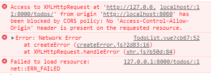

# Vue_TodoList

[toc]

## TodoList명세

1. 기능 정리 - 기획
2. 디자인(간소)
3. API

| 기능        | url                             | method | req                                                          | res                                               |
| ----------- | ------------------------------- | ------ | ------------------------------------------------------------ | ------------------------------------------------- |
| todo 조회   | /todos/                         | GET    |                                                              | [{id,content,completed},...]                      |
| todo추가    | /todos/                         | POST   | {content}<br />나머지는 default값                            | {id,content,completed}                            |
| todo삭제    | /todos/:id/<br />`:`는 동적표현 | DELETE |                                                              | {id}<br />해당 id만 return                        |
| todo update | /todos/:id/                     | PUT    | {id,content,completed}                                       | 수정된{id,content,completed}                      |
| signup      | /accounts/signup/               | POST   | {username,password}<br />서버에서는 password일치여부 확인안하고 front에서만 하기로함 | {username}<br />signup이 잘되면 username을 return |


##  JWT(JSON Web Token)

> [JWT site](https://jwt.io/)

### JWT 구조

>   `xxxx.yyyy.zzzz`

- `xxxx` : 헤더(header), `yyyy` : 내용(payload), `zzzz` : 서명(signature)
- Header : token의 type과 사용된 알고리즘, 여기서 정의한 알고리즘은 시그니처에서 다시 사용된다.
- Payload : 토큰에 담길 정보가 들어있는 곳(claim - key:value)
- Signature : 헤더와 payload를 기반으로 이 둘을 조합해서 만든 비밀키로 hashing


#### 정보(Payload)

- registered claim (등록된 클레임)
  - 토큰에 대한 정보들을 담기 위해 이름이 이미 정해진 클레임들.
  - 클레임의 사용은 모두 선택적이다.
- public claim
  - 공개 클레임은 충돌이 되지 않는 이름을 가지고 있어야 함.
  - 보통 충돌을 방지하기 위해 key 값을 URI 형태로 만든다.
  - ex) `apple` (X), `'https://test.co.kr/jwt_token': true` (O)
- private claim
  - 등록된 클레임도 아니고 공개 클레임도 아님.
  - 클라이언트와 서버간에 협의하에 사용되는 클레임들.
  - key 값이 중복되서 충돌이 될 수 있으니 유의해서 사용.
  - ex) `{"username": "admin"}` (Django에서 사용되는 field 값들과 같은 경우)

#### 서명(signature)

- HEADER의 인코딩 값과, PAYLOAD의 인코딩 값을 합친 후 주어진 비밀키로 해시(hash)를 생성한 값


###  JWT의 특징

- 정보를 안전하게 JSON 객체로 전송하기 위한 간결하고 독립적인 방법
- 서로 다른 웹 프레임워크 간 데이터를 주고 받을 때 검증을 위해 사용
- JWT 용도 : `Authorization`(회원 인증), `Information Exchanges`(정보 교환)
- 세션/쿠키와 함께 모바일과 웹의 인증을 책임지는 대표 기술 중 하나.
- 세션/쿠키의 정보 전달 방식과 유사하게 사용자는 Access Token (JWT Token) 을 HTTP header 에 실어서 서버로 요청을 보냄.
- 세션/쿠키 방식과 가장 큰 차이점은 세션/쿠키는 세션 저장소에 유저의 정보를 넣지만, JWT 는 토큰 안에 유저의 정보를 넣는다.
- **Client 의 입장에서는 HTTP header에 세션ID와 토큰을 실어서 보낸다는 점은 동일하지만, Server 입장에서는 인증을 위해 암호화(JWT 방식) 를 하냐 혹은 별도의 저장소(세션/쿠키 방식)를 이용하느냐의 차이**

- 두 개체에서 JSON 객체를 사용하여 가볍고 자가 수용적인(self-contained; 필요한 모든 정보를 자체적으로 지님) 방식으로 정보를안정성 있게 전달.
- 세션 상태를 저장하는 것이 아니라 필요한 정보를 JWT에 저장해서 사용자가 가지고 있게 하고, 해당 JWT를 증명서처럼 사용하는 방식.(즉, 매번 주민등록증을 내는 것과 같다고 생각하면 된다.)


#### JWT 장점

- 세션/쿠키처럼 별도의 저장소 관리가 필요 없고 발급한 이후에 검증만 하면 된다.
- 토큰을 기반으로 한 다른 인증시스템에 접근이 용이하기 때문에 확장성이 뛰어나다.
- 모바일 환경에 적합 (쿠키와 같은 데이터로 인증할 필요가 없기 때문) (세션/쿠키 방식은 모바일 환경에서 부적합)
- Python, JS, Ruby, Go 등 주류 프로그래밍 언어에서 대부분 지원된다.


#### JWT 단점

- 이d미 발급된 JWT는 유효기간이 완료될 때까지 계속 사용하기 때문에 악용될 가능성이 있다.(한 번 발급된 토큰은 값을 수정하거나 폐기할 수 없으므로 계속 같은것을 사용하는 것이다.)
  - 그래서 이 문제는 Access Token의 유효기간(expire time) 을 짧게하고 Refresh Token 등을 이용해서 중간중간 새로운 토큰을 재발행 해줌으로써 해결할 수 있다.
- 세션/쿠키 방식에 비해 claim 데이터(payload)가 많아진다면 JWT 토큰의 길이가 길어지기 때문에 인증 요청이 많아 질수록 네트워크의 대역폭이 낭비될 수 있다.(= 요청량이 너무 많아 네트워크에 과부하가 걸릴 수 있다는 의미)
  - API 호출 시 매 호출마다 헤더에 붙여서 전달하기 때문이다.


### JWT 사용 상황

- 회원 인증(Authorization)
  - 서버가 유저 정보에 기반한 토큰(JWT)을 발급해 유저에게 전달하고, 유저는 서버에 요청을 보낼 때마다 JWT를 포함하여 전달.
  - 서버는 세션을 유지할 필요 없이 유저의 요청정보 안에 있는 JWT 만 확인하면 된다. (서버 자원 아낄 수 있음)
- 정보 교환(Information Exchanges)
  - 정보가 서명되어 있기 때문에 정보를 보낸 사람의 정보 혹은 정보가 조작여부 확인 등이 가능




cors정책때문에 나타나는 에러

내 서버의 자원을 아무나 가져가서 사용할 수 없게 막는 보안정책


인증? 클라이언트가 누구인지를 서버에서 아는것

보안상 문제가 되는 상황 : 내가 아닌 다른 사람이 나인척하는것!이 문제

쿠키기반인증

id, password를 적어둠, 그래서 이방식은 전혀 사용되지 않는다.


세션기반인증에서 막는법

1. login을 한다
2. 서버에서 로그인정보를 가지고 랜덤한 어떤 값(세션아이디)을 만들고, 서버에 저장하고 클라이언트에 세션 아이디를 줌

단점, 규모가 커질수록 서버가 관리해야되는 자원도 많아짐 


토큰기반인증?

1. 로그인 요청
2. 토큰을 발급해줌, 토큰(user가 누구인지를 써서 만듦)
3. 서명(서버만 알고있는 비밀키)

클라이언트가 토큰을 보냄 -> 데이터부분을 나만 알고있는 비밀키로 서명해서 -> 서명이 일치하는지 확인함

만약 다른사람이 data부분을 바꾼다고하더라도 서버가 그걸 받으면 그 payload를 서명해서 붙어있는 서명값이랑 같은지를 비교

서버는 따로 관리해야될 자원이 없음

어차피 토큰에 유저정보가 담겨있음

장점-확장성_유저가 몇명이 접속하든 괜찮음

google로그인, 페이스북로그인 jwt기반 인증


---------------

# TodoList Code

## DRF

### server

- settings.py

```python
"""
Django settings for server project.

Generated by 'django-admin startproject' using Django 3.1.3.

For more information on this file, see
https://docs.djangoproject.com/en/3.1/topics/settings/

For the full list of settings and their values, see
https://docs.djangoproject.com/en/3.1/ref/settings/
"""

from pathlib import Path

# Build paths inside the project like this: BASE_DIR / 'subdir'.
BASE_DIR = Path(__file__).resolve().parent.parent


# Quick-start development settings - unsuitable for production
# See https://docs.djangoproject.com/en/3.1/howto/deployment/checklist/

# SECURITY WARNING: keep the secret key used in production secret!
SECRET_KEY = '####'

# SECURITY WARNING: don't run with debug turned on in production!
DEBUG = True

ALLOWED_HOSTS = []


# Application definition

INSTALLED_APPS = [
    'accounts',
    'todos',
    # cors
    'corsheaders',
    'django.contrib.admin',
    'django.contrib.auth',
    'django.contrib.contenttypes',
    'django.contrib.sessions',
    'django.contrib.messages',
    'django.contrib.staticfiles',
    'rest_framework',
]

MIDDLEWARE = [
    # cors
    'corsheaders.middleware.CorsMiddleware',
    'django.middleware.security.SecurityMiddleware',
    'django.contrib.sessions.middleware.SessionMiddleware',
    'django.middleware.common.CommonMiddleware',
    'django.middleware.csrf.CsrfViewMiddleware',
    'django.contrib.auth.middleware.AuthenticationMiddleware',
    'django.contrib.messages.middleware.MessageMiddleware',
    'django.middleware.clickjacking.XFrameOptionsMiddleware',
]

ROOT_URLCONF = 'server.urls'

TEMPLATES = [
    {
        'BACKEND': 'django.template.backends.django.DjangoTemplates',
        'DIRS': [],
        'APP_DIRS': True,
        'OPTIONS': {
            'context_processors': [
                'django.template.context_processors.debug',
                'django.template.context_processors.request',
                'django.contrib.auth.context_processors.auth',
                'django.contrib.messages.context_processors.messages',
            ],
        },
    },
]

WSGI_APPLICATION = 'server.wsgi.application'


# Database
# https://docs.djangoproject.com/en/3.1/ref/settings/#databases

DATABASES = {
    'default': {
        'ENGINE': 'django.db.backends.sqlite3',
        'NAME': BASE_DIR / 'db.sqlite3',
    }
}


# Password validation
# https://docs.djangoproject.com/en/3.1/ref/settings/#auth-password-validators

AUTH_PASSWORD_VALIDATORS = [
    {
        'NAME': 'django.contrib.auth.password_validation.UserAttributeSimilarityValidator',
    },
    {
        'NAME': 'django.contrib.auth.password_validation.MinimumLengthValidator',
    },
    {
        'NAME': 'django.contrib.auth.password_validation.CommonPasswordValidator',
    },
    {
        'NAME': 'django.contrib.auth.password_validation.NumericPasswordValidator',
    },
]


# Internationalization
# https://docs.djangoproject.com/en/3.1/topics/i18n/

LANGUAGE_CODE = 'en-us'

TIME_ZONE = 'UTC'

USE_I18N = True

USE_L10N = True

USE_TZ = True


# Static files (CSS, JavaScript, Images)
# https://docs.djangoproject.com/en/3.1/howto/static-files/

STATIC_URL = '/static/'

CORS_ALLOW_ALL_ORIGINS = True

AUTH_USER_MODEL = 'accounts.User'

import datetime
JWT_AUTH = {
    # 토큰 1일 짜리로 바뀜
    'JWT_EXPIRATION_DELTA': datetime.timedelta(days=1)
}
```


- urls.py

```python
from django.contrib import admin
from django.urls import path,include

urlpatterns = [
    path('admin/', admin.site.urls),
    path('todos/',include('todos.urls')),
    path('accounts/',include('accounts.urls')),
]
```


### Accounts

- models.py

```python
from django.db import models
from django.contrib.auth.models import AbstractUser
# Create your models here.

class User(AbstractUser):
    pass
```

- serializers.py

```python
from rest_framework import serializers
from django.contrib.auth import get_user_model

# 모델을 직접적으로 건들이는 일을 최소화하고 serializer를 통해 다룸
class UserSerializer(serializers.ModelSerializer):
    # password부분을 덮어씀, write_only=True는 인스턴스를 업데이트하거나 생성할때는 쓰지만, serializing을 표현할때는 포함되지 않는다.
    # read_only=True는 반대로 표현할때만쓰고 인스턴스를 serializing을 생성하거나 업데이트할때는 사용되지 않음
    password = serializers.CharField(write_only=True)
    class Meta:
        model = get_user_model()
        fields = ('username', 'password')
```

- urls.py

```python
from django.urls import path
from rest_framework_jwt.views import obtain_jwt_token

from . import views

urlpatterns = [
    path('signup/',views.signup),
    # jwt가 대신 login해줌...
    path('api-token-auth/',obtain_jwt_token),
]

```

- views.py

```python
from django.shortcuts import render
from rest_framework.decorators import api_view
from rest_framework.response import Response

from .serializers import UserSerializer
from .models import User

# Create your views here.
@api_view(['POST'])
def signup(request):
    # 클라이언트가 username과 password를 보낼건데
    # user를 만들어 저장 -> serializer를 통해서!
    # 저장한 user를 리턴
    serializer = UserSerializer(data=request.data)
    # signup조건이 맞지않으면 여기서 다 걸러서 오류를 내보냄
    if serializer.is_valid(raise_exception=True):
        # 이대로 저장되면 password도 같이 저장됨! 그러면 안됨!
        user = serializer.save()
        # 그걸 방지하는게 set_password를 사용자가 보낸 data중 password를 비밀번호로 hash한 값을 data에 넣어줌
        user.set_password(request.data.get('password'))
        user.save()
        # user는 데이터베이스 orm객체라 이걸보내주면 인식을 못함
        return Response(serializer.data)
```


### Todo

- models.py

```python
from django.db import models
from django.conf import settings

# Create your models here.
class Todo(models.Model):
    # 누가썼는지 저장
    user = models.ForeignKey(
        settings.AUTH_USER_MODEL,
        on_delete=models.CASCADE,
        related_name='todos',
    )
    content = models.CharField(max_length = 100)
    # 생성될때 false로 작성하려고
    completed = models.BooleanField(default = False)
```

- serializers.py

```python
from rest_framework import serializers
from .models import Todo
# 설치된거를 settings.py의 installed_apps애 등록해야됨
class TodoSerializer(serializers.ModelSerializer):
    class Meta:
        model = Todo
        # 어차피 내가쓴것만 나올거니까 user가 누군지 알필요없음
        # all로하면 모델의 모든 필드가 검증대상이됨
        # fields = '__all__'
        fields = ('id','content','completed')
```

- urls.py

```python
from django.urls import path
from . import views

urlpatterns = [
    path('',views.todo_list_create),
    path('<int:todo_id>/',views.todo_update_delete),
]
```


- views.py

```python
from django.shortcuts import get_object_or_404
from rest_framework.decorators import api_view
from rest_framework.response import Response

from rest_framework.decorators import authentication_classes, permission_classes
from rest_framework.permissions import IsAuthenticated
from rest_framework_jwt.authentication import JSONWebTokenAuthentication

from .models import Todo
from .serializers import TodoSerializer

# Create your views here.
@api_view(['GET','POST'])
@authentication_classes([JSONWebTokenAuthentication]) #도착한 토큰이 정상적인지 검사
@permission_classes([IsAuthenticated]) #토큰이 담겨있는지 아닌지 검사
def todo_list_create(request):
    # auclass,permclasses 한 뒤,요청한 유저가 로그인을 했을때 request.user에 해당 user가 담기게 된다
    if request.method == 'GET':
        # todo database에서 todo모두(내꺼만!) 가져와 json응답해주기 -> 모델필요
        # model ->queryset -> dict, string -> json응답은 쉬운데
        # queryset -> json으로 바로 가는건 어렵다! 그래서 q -> dict,string으로 바뀌는 과정이 필요함! 이 과정을 serializer가 대신 해준다!
        # todossms 쿼리셋 형태
        # todos = Todo.objects.all()
        # many=True라고 하는 건 쿼리셋형태니까 여러개가 들어가기 때문에 many=True라고 적어줘야됨
        # todo = Todo.objects.get(pk=1) 이건 하나인 인스턴스만 가져와서 many=True라고 안적어도됨! 하나의 object이기 떄문
        # serializer에 데이터를 넣을때 쿼리셋형태면 many=true라고 적고, 하나의 객체만 잇으면 안적어도됨!
        # request.user.todos -> TODO모델의 필드명 user의 역참조 이름이 todos
        serializer = TodoSerializer(request.user.todos,many=True)
        # 이렇게 하면 쿼리셋형태를 dict,string ->  json으로 만듦!
        return Response(serializer.data)
    # CREATE
    else:
        # request.data에 json응답이 들어옴, 
        serializer = TodoSerializer(data=request.data)
        # raise_exception=true라고 적으면 에러가 날때 내가 뭘 잘못했는지에 대한 응답이 들어옴
        if serializer.is_valid(raise_exception=True):
            # 저장을 할때 user에 request.user를 담아서 저장함
            serializer.save(user=request.user)
            return Response(serializer.data)


@api_view(['PUT','DELETE'])
@authentication_classes([JSONWebTokenAuthentication]) #도착한 토큰이 정상적인지 검사
@permission_classes([IsAuthenticated]) #토큰이 담겨있는지 아닌지 검사
def todo_update_delete(request,todo_id):
    # 삭제할 것을 가져옴
    # 없는 것을 가져올 것을 방지해서 get_object_or_404씀
    todo = get_object_or_404(Todo,pk=todo_id)
    if request.method == 'PUT':
        # 수정할땐 원래값도 가져와서 보여줘야됨
        serializer = TodoSerializer(instance=todo,data=request.data)
        if serializer.is_valid(raise_exception=True):
            serializer.save()
            return Response(serializer.data)
    else:
        todo.delete()
        # 삭제한 것의 id만 보여줄 것이기 때문
        # return Response() #이렇게만 적어줘도됨, id저거 적어준거는 그냥 보여주려고...front에서 res.data에 담긴다.
        return Response({'id':todo_id})
```


## vue

> login
>
> 1. 처음 이 페이지에 접속했을때
>    - localStorage를 확인해서 jwt값이 있는지 없는지에 따라 로그인 여부 설정
> 2. 로그인 되었을때
> 3. 로그아웃했을때
>
> 
>
> 서버는 정상적인 토큰이 담긴 요청만 받도록 수정해 놓음
>
> 프론트에서는 요청할때 토큰을 담아서 요청하도록 변경해야됨!
>
> 

### App.vue

```vue
<template>
  <div id="app">
    <div id="nav">
      <!-- login상태일때만 보여줄 컴포넌트들 -->
      <span v-if='login'>
        <router-link to="/">TodoList</router-link> |
        <router-link to="/create">AddTodo</router-link> |
        <!-- 어디로 가진않고 logout만 해줄거라 #만 표시 -->
        <!-- click event가 router에 설정된대로 바껴있기 때문에 click.native라고 해줘야 원래의 click이벤트처럼 됨 -->
        <!-- 결론 : router에 click이벤트를 쓰고 싶으면 click.native라고 써줘야 쓸 수 있다. -->
        <router-link @click.native='logout' to="#">Logout</router-link> 
      </span>
      <span v-else>
        <router-link to="/login">Login</router-link> |
        <router-link to="/signup">Signup</router-link> 
      </span>
    </div>
    <!-- 나중에 login.vue가 router-view에 들어오니까 여기에 적어줌 -->
    <!-- login이벤트가 발생하면 setLogin 메소드 실행 -->
    <router-view @login='setLogin'/>
  </div>
</template>

<script>
export default {
  //login상태를 보여줌
  data() {
    return {
      // login상태를 보여줌
      login:false,
    }
  },
  methods:{
    setLogin(){
      this.login = true
    },
    // logout햇을때
    logout(){
      this.login = false
      localStorage.removeItem('jwt')
      // logout됐을때 login화면으로 보냄
      this.$router.push('/login')
    },
  },
  // 처음 이 페이지에 접속했을때
// - localStorage를 확인해서 jwt값이 있는지 없는지에 따라 로그인 여부 설정
  created() {
  // localStorage에서 item가져올땐 getItem 없는 값을 가져온다면 null! 잇으면 login된것
  if (localStorage.getItem('jwt')){
    this.login = true
  }

  },
}
</script>

<style>
#app {
  font-family: Avenir, Helvetica, Arial, sans-serif;
  -webkit-font-smoothing: antialiased;
  -moz-osx-font-smoothing: grayscale;
  text-align: center;
  color: #2c3e50;
}

#nav {
  padding: 30px;
}

#nav a {
  font-weight: bold;
  color: #2c3e50;
}

#nav a.router-link-exact-active {
  color: #42b983;
}
</style>
```

### index.js

```js
import Vue from 'vue'
import VueRouter from 'vue-router'
import TodoList from '../views/TodoList.vue'
import CreateTodo from '../views/CreateTodo.vue'
import Login from '../views/Login.vue'
import Signup from '../views/Signup.vue'

Vue.use(VueRouter)

const routes = [
  {
    path: '/',
    name: 'TodoList',
    component: TodoList
  },
  {
    path: '/create',
    name: 'createTodo',
    component: CreateTodo
  },
  {
    path: '/login',
    name: 'Login',
    component: Login
  },
  {
    path: '/signup',
    name: 'Signup',
    component: Signup
  },
]

const router = new VueRouter({
  mode: 'history',
  base: process.env.BASE_URL,
  routes
})

export default router
```

- TodoList.vue

```vue
<template>
  <div>
    <ul>
      <!-- todos를 반복시킴, 배열로 v-for을 이용해 반복시킴 -->
      <!-- v-for쓸때 key값을 할당해야됨 -->
      <li v-for='todo in todos' :key='todo.id'>
        <!-- todo의 배열이 어떤지 알고있기 떄문에 이렇게 id, completed, content를 쓸 수 있음 그래서 명세를 먼저 만들어야됨 -->
        <input 
        type="checkbox" 
        :checked='todo.completed'
        @change='updateTodo(todo)'
        >
        <span @click='updateTodo(todo)'>{{todo.content}}</span>
        <!-- 여기서 바로 실행시킬 수 도 있음, todo를 넘겨주고 있으니까 todo.id를 바로 인자로받게함 -->
        <button @click='deleteTodo(todo.id)'>X</button>
      </li>
    </ul>
  </div>
</template>

<script>
import axios from 'axios'
// 환경변수로 url을 관리하는 이유? 우리가 로컬 컴퓨터에서 작업을하고 있을때는 서버 url이 이렇게 생겨야되지만
//  이걸 배포를 하게 되면 서버url이 이렇게 돼있으면 안되고 배포된 서버 주소에 맞게 최신화가 돼야한다 
// 서버 url은 서버가 저장된 컴퓨터의 주소. 
// 배포가 됐을 떄는 그 컴퓨터의 url을 쓰기위해 환경변수를 쓰는것!
// const SERVER_URI = process.env.VUE_APP_URL
export default {
  data(){
    return {
      todos:[],
    }
  },
  methods:{
    deleteTodo(id){
      // 서버에 해당 todo삭제하는 요청 보내고
      // 서버에서 지워졌더라도 새로고침 없이 삭제된것을 사람들한테 보여줘야됨!
      // 삭제된 내용 화면에 반영
      axios({
        url:`http://127.0.0.1:8000/todos/${id}/`,
        method:'DELETE',
        headers:{
        // 철자 틀리면 안됨!! JWT라는 문자열이 붙고 한칸 띄우고! 우리가 가진 토큰값을 적음
        // 서버에서 보내준 토큰 만료기간이 5분!{'detail':'Signature has expired.'}라고 뜸! -> 상황에 맞춰서 수명늘여줌
        Authorization:`JWT ${localStorage.getItem('jwt')}`}
      }).then(()=>{
        // todos최신화(방법2가지),1)서버에 todos요청해서 갱신(서버와 동기화하는게 중요할때 사용) 2)서버에 요청없이 id가지고 todos갱신
        // return문이 한개니까 중괄호도 생략 가능함, id가 같지 않은것만 살아남아서 보여줄거야
        // return이 참이어야 결과를 담는다.
        // 2.서버에 요청없이 id값으로 갱신
        this.todos = this.todos.filter((todo)=>todo.id!==id)
 
        // 1.방법 서버에 todos요청해서 갱신!
        // axios({
        //   url:'http://127.0.0.1:8000/todos/',
        //   method:'GET',
        // }).then(res=>{
        //   // 여기서 console.log(this)를 해보고 window면 function을 써야됨!
        //   // todos data에 입력받은 값 할당
        //   this.todos = res.data
        // }).catch(err=>{
        //   console.error(err)
        // })
      }).catch((err)=>{
        console.error(err)
      })
    },
    updateTodo(todo){
      // 서버에다가 update요청을 보내고
      // 받은 결과로 화면을 갱신함
     axios({
        url:`http://127.0.0.1:8000/todos/${todo.id}/`,
        method:'PUT',
        data:{
          // id:todo.id,
          // content:todo.content,
          // 스프레드 operator, 바꿀것을 제외하고는 그대로 써줌
          ...todo,
          // completed상태를 바꿔서 보내줘야됨
          completed:!todo.completed,
        },
        headers:{
          // 모든 요청을 보낼때 headers값으로 토큰을 같이 보냄!!
        // 철자 틀리면 안됨!! JWT라는 문자열이 붙고 한칸 띄우고! 우리가 가진 토큰값을 적음
        // 서버에서 보내준 토큰 만료기간이 5분!{'detail':'Signature has expired.'}라고 뜸! -> 상황에 맞춰서 수명늘여줌
        Authorization:`JWT ${localStorage.getItem('jwt')}`}
      }).then((res)=>{
        // 받은결과로 화면갱신, 바뀐 comlpeted갱신
        // res.data는 서버에서 응답받은 data
        todo.completed = res.data.completed
      }).catch((err)=>{
        console.error(err)
      })
    },
  },
  // todolist라는 컴포넌트가 만들어지고나서 바로 실행됨!
  created() {
    // todos를 api를 찔러서 가져와서(api서버에 요청을 보냄) 
    // data의 todos에 할당해준다
    // 데이터가 바뀌면 dom도 바뀜! 바뀐 데이터를 갱신(?)
    // data를 가져오는 척 할거다
    // const receivedTodos = [
    //   {
    //     id:1,
    //     content : '할일1',
    //     completed:false,
    //   },
    //   {
    //     id:2,
    //     content : '할일2',
    //     completed:true,
    //   },
    // ]
    // 할당해줌
    // this.todos = receivedTodos

    //실제로는 아래와 같이 씀
    axios({
      url:'http://127.0.0.1:8000/todos/',
      method:'GET',
      // login했다고 알려줘야됨
      headers:{
        // 철자 틀리면 안됨!! JWT라는 문자열이 붙고 한칸 띄우고! 우리가 가진 토큰값을 적음
        // 서버에서 보내준 토큰 만료기간이 5분!{'detail':'Signature has expired.'}라고 뜸! -> 상황에 맞춰서 수명늘여줌
        Authorization:`JWT ${localStorage.getItem('jwt')}`
      },
    }).then(res=>{
      // 여기서 console.log(this)를 해보고 window면 function을 써야됨!
      // todos data에 입력받은 값 할당
      this.todos = res.data
    }).catch(err=>{
      console.error(err)
    })
  },
}
</script>

<style>

</style>
```

- CreateTodo.vue

```vue
<template>
<!-- form으로 쓰면 버튼,input에 클릭,enter 이벤트 처리하지 않더라도 폼에 적어두면 한번에 처리 가능함! -->
<!-- 1. submit이란 이벤트를 적으면 한번에 처리가능! -->
<!-- 2. input에 keydown.enter, button에 click이벤트를 다는 것과 같음 -->
<!-- form의 기본 동작인 새로고침이 일어남->event.preventDefault를 해줘야됨 -->
  <form @submit="onSubmit">
    <!-- input에 사용자가 칠 data가 필요함 -->
    <!-- content로 바인딩과 할당을 함(양방향) -->
    <input type="text" v-model="content">
    <button>ADD</button>
  </form>
</template>

<script>
import axios from 'axios'
export default {
  data(){
    return {
      content:'',
    }
  },
  methods: {
    onSubmit(event) {
      // 기본 submit이벤트의 동작을 막는다.
      event.preventDefault()
      // data의 content를 우리 api서버에 post로 요청함(axios)
      // 잘보내졌으면? -> todolist로 페이지이동
      axios({
        url:'http://127.0.0.1:8000/todos/',
        method:'POST',
        data:{
          content:this.content,
        },
        headers:{
        // 철자 틀리면 안됨!! JWT라는 문자열이 붙고 한칸 띄우고! 우리가 가진 토큰값을 적음
        // 서버에서 보내준 토큰 만료기간이 5분!{'detail':'Signature has expired.'}라고 뜸! -> 상황에 맞춰서 수명늘여줌
        Authorization:`JWT ${localStorage.getItem('jwt')}`}
      }).then(()=>{
        // 가고자하는 path를 적어줌!
        // 왜 push? history에 배열처럼 들어감
        this.$router.push('/')
      }).catch(err=>{
        console.error(err)
      })
    },
  },
}
</script>

<style>

</style>
```

- Signup.vue

```vue
<template>
  <form @submit='signup'>
    <div>
      <!-- for username 글자를 클릭하면 id가 username인게 클릭됨 -->
      <label for="username">username: </label>
      <input 
      type="text" 
      id='username' 
      v-model="username"
      >
    </div>
    <div>
      <label for="password">password: </label>
      <input 
      type="password" 
      id='password' 
      v-model="password"
      >
    </div>
    <div>
      <label for="passwordConfirmation">passwordConfirmation: </label>
      <input 
      type="password" 
      id='passwordConfirmation' 
      v-model="passwordConfirmation"
      >
    </div>
   <button>Signup</button>
  </form>
</template>

<script>
import axios from 'axios'
export default {
  data(){
    return {
      // credentials:{},로 아래의 세개를 넣어줘서 객체들로 data를 관리해도됨
      username:'',
      password:'',
      passwordConfirmation:'',
    }
  },
  methods:{
    signup(event){
      event.preventDefault()
      // password, passwordConfirmation 두개 비교, 빈칸은 아닌지 확인(지금은안함)
      if (this.password !== this.passwordConfirmation){
        alert('비밀번호가 일치하지 않습니다!')
      }else{
        //서버에 회원가입 요청! 이 url로 data가 담겨서 post요청보냄
        axios({
          url:'http://127.0.0.1:8000/accounts/signup/',
          method:'POST',
          data:{
            username:this.username,
            password:this.password,
          },
        }).then((res)=>{
          // server에서 응답으로 username이 올건데 안써도 됨
          console.log(res.data)
          // login페이지로 보내줌
          this.$router.push('/login')
        }).catch((err)=>{
          console.error(err)
          // err 안의 data보여줌
          // console.dir(err)
          // console.dir(err.response.username)
          // 이미 있는 이름이라 회원가입이 안된다면 이유를 보여줌
          if (err.response.data.username){
            alert('이미 사용된 이름입니다.')
          }
        })
      }
    },
  },
}
</script>

<style>

</style>
```

- Login.vue

```vue
<template>
  <form @submit='login'>
    <div>
      <!-- for username 글자를 클릭하면 id가 username인게 클릭됨 -->
      <label for="username">username: </label>
      <input 
      type="text" 
      id='username' 
      v-model="username"
      >
    </div>
    <div>
      <label for="password">password: </label>
      <input 
      type="password" 
      id='password' 
      v-model="password"
      >
    </div>
   <button>Login</button>
  </form>
</template>

<script>
import axios from 'axios'
export default {
  data(){
    return {
      // credentials:{},로 아래의 세개를 넣어줘서 객체들로 data를 관리해도됨
      username:'',
      password:'',
    }
  },
  methods: {
    login(event){
      event.preventDefault()
      // if (this.username.trim() ===''){
      //   alert('입력하세요')
      // }
      // 서버에 로그인 요청 보낼거다!
      // 서버가 로그인을 하면 토큰을 줌, 서버가 준 토큰을 내가 서ㅓㅂ에 요청을 보낼때마다 다시 토큰을 담아서 요청을 보냄
      // 서버는 토큰을 응답으로 줄거고,ㅡ
      // 난 그 토큰을 어딘가에 저장함(나중에 쓰려고!)
      axios({
        // api-token-auth라고 안적고 login이라고 정해도됨, 내가 정하기나름
        url:'http://127.0.0.1:8000/accounts/api-token-auth/',
        // session방식 인증은 post
        method:'POST',
        data:{
          username:this.username,
          password:this.password,
        },
      }).then((res)=>{
        // key, value 값이 인자로 들어가는 데 둘다 string값이 들어가야됨! 만약에 배열이 들어가야된다면 json파일로 ---해서 넣어줘야됨
        // localStorage에 저장된 jwt는 이건 새로고침, 브라우저를 껏다 켜도 안없어짐,
        localStorage.setItem('jwt',res.data.token)
        // App(부모)에다가 login바꾸라고 요청
        this.$emit('login')
        // login되면 todolist로 이동
        this.$router.push('/')
      }).catch((err)=>{
        console.error(err)
      })
    },
  },
}
</script>

<style>

</style>
```


-----------

## Reference

https://github.com/wally-wally/TIL/blob/master/07_vue/%5BSSAFY%5DVue_%232.md