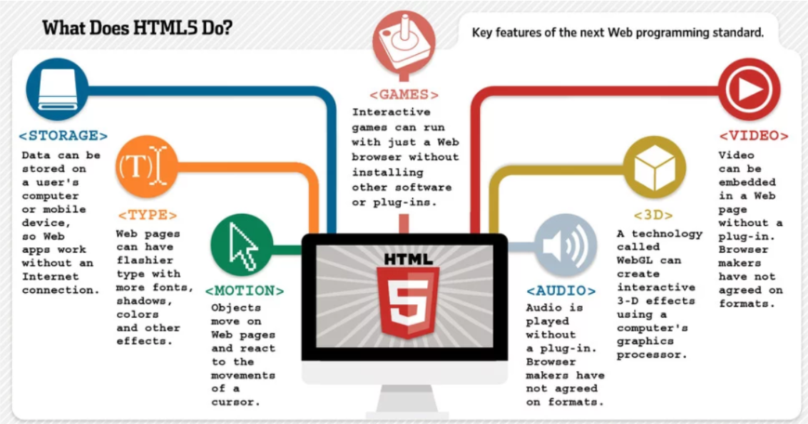

# HTML VS HTML5

> [HTML vs HTML5 출처](https://brenden.tistory.com/43)

[toc]

## HTML?

> HTML(HyperText Markup Language)
>
> HT : 문서와 문서가 링크로 연결됨
>
> M : 태그로 이루어짐
>
> L : 언어

- 기본형태

```html
<html>
    <head>
      head는 화면에 보여질 추가적인 정보인 메타정보를 담고 있는 부분이다.
    </head>
    <body>
      body는 화면에 보여지는 부분
    </body>
</html>
```


## HTML5?

> 1. 차세대 웹 표준으로 HTML이 멀티미디어 등 다양한 애플리케이션까지 제공하도록 진화한 **웹 표준 프로그래밍 언어**
> 2. *Client Side Technology* **기술의 중심이 되는 마크업 언어**
> 3.  **모바일 웹에서의 핵심 기술**

- 특징 
  - 클라이언트와 서버와의 통신이 가능
  - 외부 Active-X와 같은 플러그인을 사용하지 않고도 웹 서비스를 제공할 많은 기능이 추가됨
  - CSS, JS를 통한 기능의 확장과 결합으로 외부 플러그인의 의존도를 줄여 **웹 표준, 접근성을 높였다.**

- 주요 기능
  - **Device AccessDEVICE ACCESS** : 카메라, 동작센서 등의 H/W 기능을 웹에서 직접적으로 제어
  - **CONNECTIVITY (Web Socket)** : 웹(클라이언트)에서 서버 측과 직접적인 양방향 통신 가능
  - **3D, GRAPHICS & EFFECTS** : 다양한 2차원 및 3차원 그래픽 기능을 지원
  - **Styling Effects (CSS3)** : 글씨체, 색상, 배경 등 다양한 스타일 및 이펙트 기능 제공
  - **MULTIMEDIA** : 비디오 및 오디오 기능을 자체적으로 지원
  - **OFFLINE & STORAGE** : 네트워크 미지원 환경에서도 웹 이용을 가능하게 함
  - **Geo-Location** : GPS 없이도 단말기의 지리적인 위치 정보를 제공
  - **SEMANTICS** : 웹 자료에 의미를 부여하여 사용자 의도에 맞는 맟춤형 검색 제공

