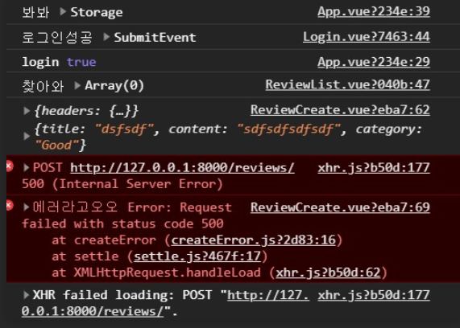
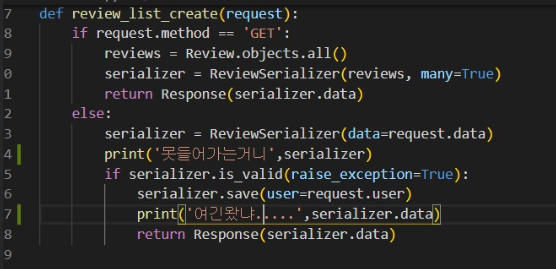
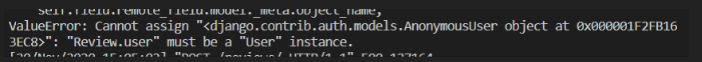
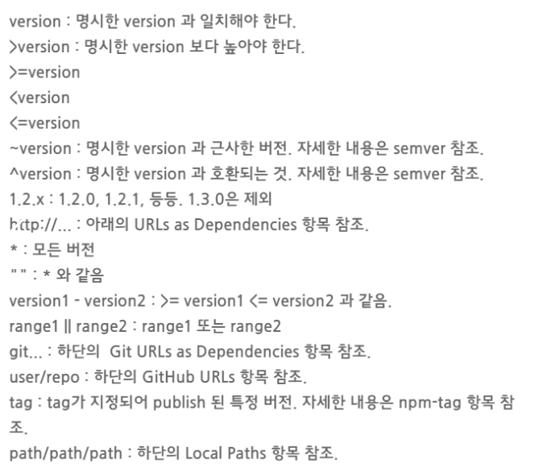
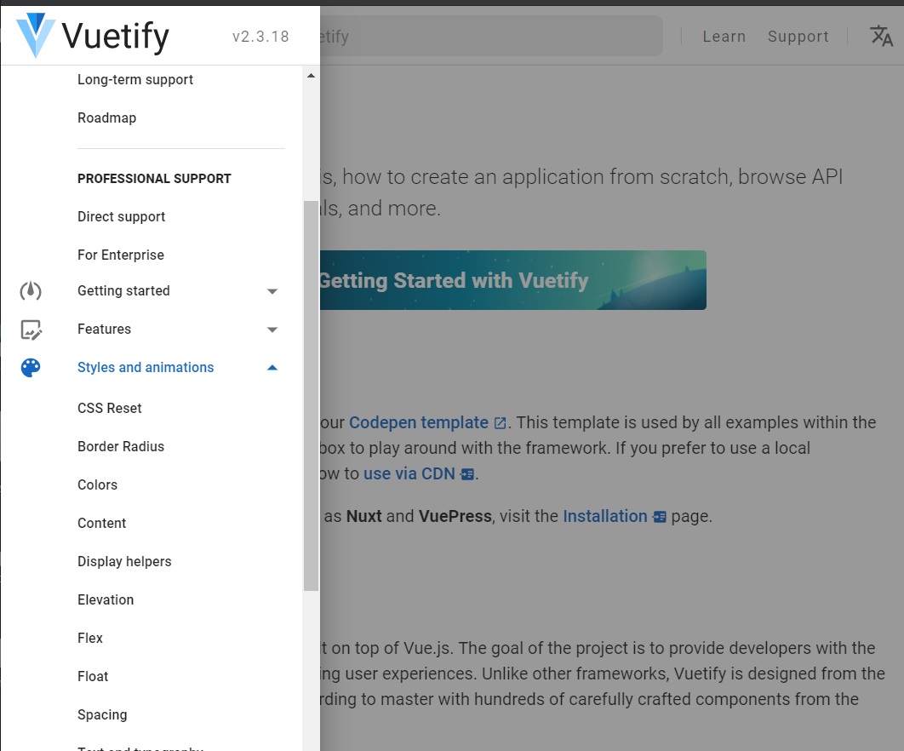
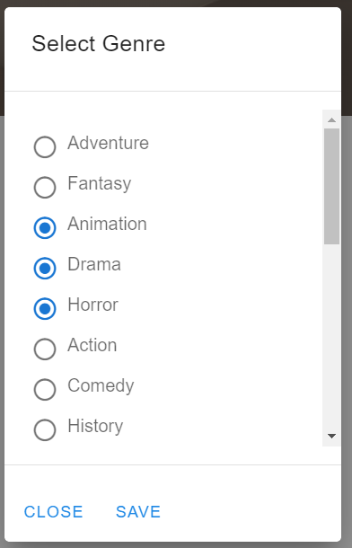
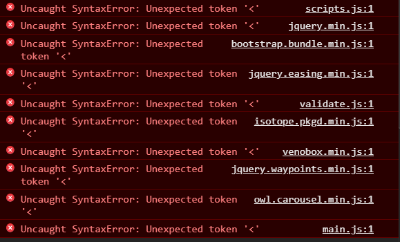

# final_pjt

[toc]


> 온갖 에러를 다 본 날......ㅎ

### 문제1. router 

- router를 깔았는데 `main.js`에 router가 import 되어있지 않아서 오류가 났다
- `npm install router` -> `vue add router`도 했는데 왜 안적혀있을깡....

```js
import Vue from 'vue'
import App from './App.vue'
// router등록하려면 적혀있어야됨
import router from './router'

Vue.config.productionTip = false

new Vue({
  // router등록하려면 적혀있어야됨
  router,
  render: h => h(App),
}).$mount('#app')
```


### summernote

> [Summernote](https://summernote.org/getting-started/#requires-html5-doctype) 이거 구현...이따 시간나면 해보자...ㅠ 안된당....퓨

```css
<!-- include libraries(jQuery, bootstrap) -->
<link href="https://stackpath.bootstrapcdn.com/bootstrap/3.4.1/css/bootstrap.min.css" rel="stylesheet">
<script src="https://code.jquery.com/jquery-3.5.1.min.js"></script>
<script src="https://stackpath.bootstrapcdn.com/bootstrap/3.4.1/js/bootstrap.min.js"></script>

<!-- include summernote css/js -->
<link href="https://cdn.jsdelivr.net/npm/summernote@0.8.18/dist/summernote.min.css" rel="stylesheet">
<script src="https://cdn.jsdelivr.net/npm/summernote@0.8.18/dist/summernote.min.js"></script>
```


### User오류 왜 자꾸 날까?

> 로그인도 되고, User db에도 데이터가 있는데 CreateReview를 하려고 하면 자꾸 User가 Anonymous라고 뜬다....ㅠ -> JWT토큰문제!!!








### package.json

> 

```json
{
  "name": "todo-vue-cli",
  "version": "0.1.0",
  "private": true,
  "scripts": {
    "serve": "vue-cli-service serve",
    "build": "vue-cli-service build",
    "lint": "vue-cli-service lint"
  },
  "dependencies": {
    "core-js": "^3.3.2",
    "vue": "^2.6.10"
  },
  "devDependencies": {
    "@vue/cli-plugin-babel": "^4.0.0",
    "@vue/cli-plugin-eslint": "^4.0.0",
    "@vue/cli-service": "^4.0.0",
    "babel-eslint": "^10.0.3",
    "eslint": "^5.16.0",
    "eslint-plugin-vue": "^5.0.0",
    "vue-template-compiler": "^2.6.10"
  },
  "eslintConfig": {
    "root": true,
    "env": {
      "node": true
    },
    "extends": [
      "plugin:vue/essential",
      "eslint:recommended"
    ],
    "rules": {},
    "parserOptions": {
      "parser": "babel-eslint"
    }
  },
  "postcss": {
    "plugins": {
      "autoprefixer": {}
    }js
  },
  "browserslist": [
    "> 1%",
    "last 2 versions"
  ]
}
```

------

- `npm init`으로 설정을 모두 완료하면 `package.json`이 새로 생긴다.
- 또는 vue-cli 모듈 설치 후 vue 프로젝트를 생성(ex. `vue create todo-vue-cli`)하면 `package.json` 파일이 생긴다.

1. `name`

- 프로젝트의 이름을 적는 곳
- 만약 node package에 직접 만든 패키지를 등록하려고 한다면 version과 마찬가지로 필수 입력해줘야 한다.
- 다만 그렇지 않다면 해당 값은 선택값이다.
- `version` 과 `name`은 함께 해당 프로젝트의 `unique`한 값이다.
- `name`은 점(.)이나 언더스코어(_)로 시작될 수 없고 대문자를 포함하면 안 된다.

2. `version`

- 만약 해당 모듈을 npm에 올릴 계획이 있다면 `name`과 `version`은 필수인자이다.
- 다만 그렇지 않다면 해당 값은 선택값이다.

3. `private`

- 만약 해당 옵션을 `true`로 설정한다면, 해당 모듈을 npm에 올릴 수 없다.
- 개발자가 실수로 private한 모듈을 올리더라도 올린 모듈에 대해 배포를 막을 수 있는 방법 중 하나이다.

4. `scripts`

- 패키지의 다양한 생명주기 동안 실행되는 명령어를 포함하고 있다.
- key는 생명주기 이벤트를 나타내면, value는 해당 생명주기에 실행되는 명령어를 나타낸다.
- 개발자가 직접 정의한 script의 경우, run과 함께 사용하면 되고, 기본적으로 npm에서 제공되는 명령어는 그냥 해당 명령어만 실행시켜주면 된다.

5. `devDependencies`

- 이 안에 있는 모듈들은 프로젝트의 루트에서 `npm install` 이나 `npm link`를 실행하게 되면 설치 된다.

6. `description`

- 프로젝트에 대한 설명을 문자열로 입력
- `npm search` 명령어를 사용했을 때, 사람들로 하여금 해당 모듈을 찾을 수 있게 도와준다.

7. `Author`

```json
{
  "author": {
    "name" : "Martin",
    "email" : "martin@within.com",
    "url" : "http://blog.martinwork.co.kr/"
  }
}
```

- 해당 값은 한 명의 사람에 대해서 나타낸다.
- 대신 `contributors` 값은 array 형태로 여려 명을 기입할 수 있다.
- 그리고 그 하나의 Person에 대해서는 name을 입력할 수 있으며, 선택값으로 email과 url을 입력할 수 있다.

8. `license`

- 해당 모듈에 대한 라이센스에 대한 정보를 기술하는 영역
- 해당 모듈이 npm에 올라갔을 경우 해당 모듈을 사용할 수 있는 권한에 대한 내용을 기술하는 영역

9. `browserslist`

```json
{
"browserslist": [
    "> 1%",
    "last 2 versions",
    "not ie <= 8"
  ]
}
```

- `browserslist` 라이브러리에 대한 옵션으로서, 서로 다른 front-end 둘 간에 브라우저의 타겟을 공유하기 위해 사용한다.
- 위의 예시와 같은 경우 다음을 의미한다.
  - 전 세계 사용 통계 속에서 상위 1% 이상 선택(사용)된 브라우저
  - 각 브라우저의 최신 버전 2개
  - Internet Explorer 8 이하의 버전은 호환하지 않음


### Webpack

> [출처](https://github.com/wally-wally/TIL/blob/master/07_vue/%5BSSAFY%5DVue_%231.md)

> | 요소    | 내용                                                         |
> | ------- | ------------------------------------------------------------ |
> | entry   | 여러 js 파일들의 시작점 => 웹팩이 파일을 읽어 들이기 시작하는 부분전체 애플리케이션 설치, 필요 라이브러리를 로딩하는 로직을 포함웹팩으로 빌드(변환)할 대상 파일을 지정 |
> | module  | 웹팩은 JS 만 변환 가능하기 때문에 HTML, CSS 등은 모듈을 통해서 웹팩이 이해할 수 있도록 변환이 필요하다.변환 내용을 담는 곳 |
> | plugins | 웹팩을 통해 번들된 결과물을 추가로 처리하는 부분ex) 결과물의 사이즈를 줄이거나 결과물(기본적으로 JS)을 기타 CSS, HTML 파일로 분리하는 기능 등이 있음 |
> | output  | 여러 js 파일을 **하나로 만들어 낸 결과물**결과물의 위치, 파일명 등 세부 옵션을 설정 |

- `webpack.config.js`

  ```json
  // webpack 설정 파일
  const VueLoaderPlugin = require('vue-loader/lib/plugin')
  const path = require('path')
  
  module.exports = {
    entry: {
      // __dirname : 최상위 위치(entry point) - Django 에서 BASE_DIR 역할과 동일
      // 여기서 __dirname은 '02_vue_webpack'이다.
      app: path.join(__dirname, 'src', 'main.js')
      // 경로 설정 (src(entry의 시작 파일)는 vue-cli의 기본값임)
      // main.js가 entry 역할을 한다.
    },
    module: {
      rules: [ // rules는 배열로 선언
        {
          test: /\.vue$/, // 정규 표현식 : '.vue' 확장자를 가진 모든 파일을 test 한다는 의미
          use: 'vue-loader',
        }
      ]
    },
    plugins: [ // plugins는 배열로 선언
      new VueLoaderPlugin(),
    ],
    output: {
      filename: 'app.js',
      path: path.join(__dirname, 'dist'), // (dist는 vue-cli의 기본값임)
    },
  }
  ```

- `package.json`

  ```json
  {
    "name": "02_vue_webpack",
    "version": "1.0.0",
    "description": "",
    "main": "module.js",
    "scripts": {
      "build": "webpack" // 기존의 test 구문 삭제
    },
    "author": "",
    "license": "ISC",
    "dependencies": {
      "vue": "^2.6.10"
    },
    "devDependencies": {
      "vue-loader": "^15.7.2",
      "vue-template-compiler": "^2.6.10",
      "webpack": "^4.41.2",
      "webpack-cli": "^3.3.10"
    }
  }
  ```

- `src` > `main.js`

  `main.js`가 entry 역할을 한다.

  ```js
  // Vue 인스턴스를 최종으로 만드는 파일
  
  // 1. 설치된 vue를 추가
  // (내가 만든 파일 아닌 경우) 현재 위치에서 vue 이름을 가진 폴더가 없음 => 자동으로 node_modules 에서 가져옴
  import Vue from 'vue'
  
  // 2. 최상위 컴포넌트 추가(App.vue)
  // (내가 만든 파일인 경우) 상대 경로 표시를 해야 함
  import App from './App.vue'
  
  new Vue({
    render: h => h(App)// 보통 createElement를 h로 줄인다.
  }).$mount('#app') // .$mount('#app')는 el: '#app'과 유사한 역할 수행
  ```

- `App.vue`

  ```vue
  <template>
    <h1>여기는 최상위 컴포넌트 입니다.</h1>
  </template>
  
  <script>
  
  </script>
  
  <style>
  
  </style>
  ```

- `npm install vue-loader vue-template-compiler -D`

  - 웹팩은 js 코드만 이해 가능하기 때문에 vue파일(`vue-loader`) 및 html, css 파일(`vue-template-compiler`) 등을 변환하기 위하여 모듈을 설치

- `npm run build` : webpack 만드는 구문

- `dist` 폴더가 새로 생기고 이 안에 `app.js` 파일이 생성됨을 볼 수 있다.

- `public` > `index.html`

  ```html
  <!DOCTYPE html>
  <html lang="ko">
  <head>
    <meta charset="UTF-8">
    <meta name="viewport" content="width=device-width, initial-scale=1.0">
    <meta http-equiv="X-UA-Compatible" content="ie=edge">
    <title>Document</title>
  </head>
  <body>
    <div id="app">
  
    </div>
    <script src="../dist/app.js">
  
    </script>
  </body>
  </html>
  ```

- 하지만 현재 상황에서 chrome 에서 vue 창을 열 수 없다. 그래서 `webpack.config.js`에 `mode: 'development',`를 추가하고 다시 `npm run build`를 수행하면 chorme 창에서 vue 창을 볼 수 있다.

  ```js
  // webpack.config.js
  
  module.exports = {
    mode: 'development',
    entry: {
      ...
    }
    ...
  }
  ```


### router 컴포넌트에 props전달

> [참고문헌](https://router.vuejs.org/kr/guide/essentials/passing-props.html)
>
> 컴포넌트에서 `$route`를 사용하면 특정 URL에서만 사용할 수 있는 컴포넌트의 유연성을 제한하는 라우트와 강한 결합을 만든다.
>
> 컴포넌트와 라우터 속성을 분리하려면 다음과 같이 하십시오.
>
> **$route에 의존성 추가**
>
> ```js
> const User = {
>   template: '<div>User {{ $route.params.id }}</div>'
> }
> const router = new VueRouter({
>   routes: [
>     { path: '/user/:id', component: User }
>   ]
> })
> ```
>
> **속성에 의존성 해제**
>
> ```js
> const User = {
>   props: ['id'],
>   template: '<div>User {{ id }}</div>'
> }
> const router = new VueRouter({
>   routes: [
>     { path: '/user/:id', component: User, props: true },
>   ]
> })
> ```
>
> 이를 통해 어디서나 컴포넌트를 사용할 수 있으므로 컴포넌트 재사용 및 테스트하기가 더 쉽습니다.
>
> ### Boolean 모드
>
> `props`를 `true`로 설정하면 `route.params`가 컴포넌트 `props`로 설정됩니다.
>
> ### 객체 모드
>
> `props`가 객체일때 컴포넌트 `props`가 있는 그대로 설정됩니다. `props`가 정적일 때 유용합니다.
>
> ```js
> const router = new VueRouter({
>   routes: [
>     { path: '/promotion/from-newsletter', component: Promotion, props: { newsletterPopup: false } }
>   ]
> })
> ```
>
> ### 함수 모드
>
> `props`를 반환하는 함수를 만들 수 있습니다. 이를 통해 전달인자를 다른 타입으로 캐스팅하고 적정인 값을 라우트 기반 값과 결합됩니다.
>
> ```js
> const router = new VueRouter({
>   routes: [
>     { path: '/search', component: SearchUser, props: (route) => ({ query: route.query.q }) }
>   ]
> })
> ```
>
> `/search?q=vue`는 `{query: "vue"}`를 `SearchUser` 컴포넌트에 전달합니다.
>
> 라우트 변경시에만 평가되므로 `props` 함수는 상태를 저장하지 않도록 합니다. `props`를 정의할 상태가 필요한 경우 래퍼 컴포넌트를 사용하면 상태가 변경될 때마다 응답할 수 있습니다.

공식문서를 참고해서 해봤다! 

reviewList에서 reviewItem으로 갈때 id값으로 router가 이동은 되지만 해당 reviewItem에서 data를 쓰려면 props로 넘겨줘야되는데 방법을 몰라서 구글링을 했더니, 위와 같은 여러 방법들이 있는데 나는 그중에 함수로 전달하는 것을 해봤다.

✔️ **props로 전달하지 않아도 id값을 받는 방법**

```vue
template>
  <div class="product">
    <h1>상품 정보</h1>
    <p>이 페이지는 ID.{{ $route.params.id }}의 상세를 출력합니다.</p>
  </div>
</template>
```

`{{ $route.params.id }}` 이거로 props로 전달하지 않아도 id값을 받을 수 있지만 type을 찍어봤더니 `String`값이 나왔다.

reviews를 get방식으로 서버에서 불러온다고 해도, review.id는 number라 `==`동등연산자로 계산하면 굳이 props로 전달하지 않고 아래와 같이 쓸수 있지만, 나는 `===`일치연산자를 쓰고 싶어서  props로 id값을 Number로 받아왔다.

✔️ **`{{ $route.params.id }}` 사용해서 review data가져오는 법 **

> id값을 이용해 reviews에서 id값이 동등(숫자와 문자이지만 숫자형 문자는 같다고 인식함)하는 것을 가져옴!

```vue
<script>
import axios from 'axios'
export default {
  data(){
    return {
      review:{}
    }
  },
  created(){
    const reviewId = this.$route.params.id
    axios.get('http://127.0.0.1:8000/reviews/')
      .then((res) => {
        res.data.forEach((review)=>{
          if (review.id == reviewId){
            this.review = review
          }
        })
      })
      .catch((err) => {
        console.log(err)
      })
  },
}
</script>
```


✔️ **매개 변수를 props로 컴포넌트에 전달하기 **

`router > index.js`

```js
...
const routes = [
 ...
  {
    path: '/reviews/:id',
    name: 'ReviewItem',
    component: ReviewItem,
    //아래 내용 추가, 해당 route에 props로 id값을 Number type으로 넘겨줌
    // 함수로 지정하면 첫 번째 매개변수로 현재 라우트 객체를 사용할 수 있음
    props: route => ({
      id: Number(route.params.id)
    })
...
```

- `views > ReviewItem.vue`

> id값을 이용해 reviews에서 id값이 일치하는 것을 가져옴!
>
> 동등연산자는 언제 오류가 날지 모르니 일치 연산자로 확실하게 하기위해 이렇게 했다!

```vue
<script>
import axios from 'axios'
export default {
  // id를 라우터로 보낸 props
  props:{
    id:Number,
  },
  data(){
    return {
      review:{}
    }
  },
  created(){
    const reviewId = this.$route.params.id
    console.log(reviewId)
    axios.get('http://127.0.0.1:8000/reviews/')
      .then((res) => {
        res.data.forEach((review)=>{
          if (review.id === this.id){
            this.review = review
          }
        })
      })
      .catch((err) => {
        console.log(err)
      })
  },
}
```


###  Vuetify 이용

> **Vue CLI 와 Vuetify.js 소개**
>
> Vue CLI 는 Vue.js 를 생성, 관리, 실행할 수 있는 Command Line Interface 이다.
>
> Vue CLI 를 사용하면 Webpack, Babel, Lint, TypeScript, Vue Router, Vuex 등의 다양한 피쳐들을 선택해서 프로젝트를 생성할 수 있다.
>
> 이번 프로젝트는 Vue CLI 를 사용해서 SPA(Single Page Application)을 생성하고 빌드하도록 한다.
>
> Vuetify는 Vue.js를 위한 개발된 디자인 프레임워크이다.
>
> Vue.js로 프로젝트를 진행할때 Vuetify 를 사용하면 손쉽게 아름다운 디자인을 적용할 수 있다.
>
> Vuetify는 머터리얼 디자인 스펙 (Material Design Spec) 을 준수한다.

```sh
vue add vuetify
```

**선택옵션에서는 “Default”를 선택하도록 한다**

```sh
? Choose a preset: (Use arrow keys)
❯ Default (recommended) 
Prototype (rapid development) 
Configure (advanced) 
```


**[vuetify 홈페이지](https://vuetifyjs.com/ko/components/api-explorer)에서 추가하고 싶은 Component를 찾기**




[출처](http://blog.weirdx.io/post/60376)

**그리드시스템**

`v-container`는 전체 너비를 기준으로 화면에 출력될 컨테이너를 중앙에 배치한다. `v-layout`은 섹션을 구분하는데 사용하고 `v-flex`를 포함한다. 대부분의 경우 `v-layout`의 `row`와 `column`을 주로 사용한다. `v-flex`의 내부에는 `div` 태그를 사용해서 필요한 내용을 추가한다.


**Typography**

일반적으로 가장 많이 사용하는 폰트 관련 내용이다. Vuetify는 Roboto Font를 사용한다. `.display-4`는 `h1` 태그에 적합하고, `.title`은 `h6`에 잘 어울린다. `.body-1`은 일반적인 본문에 어울리고, 중요한 본문 내용은 `.body-2`를 사용한다. `font-weight-{thin, light, regular, medium, bold, black}`등을 사용하여 폰트를 설정할 수 있다. 색상의 경우 `{배경 글자}`형태로 구성되며, `{배경색, 배경색 밝기, 글자, 글자색 밝기}` 형태로 구성된다. 좀 더 자세한 내용은 [Application typography — Vuetify.js](https://vuetifyjs.com/en/framework/typography)를 참고하자.

```html
<p class="red white--text">Eleates de ferox quadra, promissio onus!Cur elevatus studere?Cur abactus tolerare?Cum extum studere, omnes vitaes magicae pius, castus amores.Eheu, luna!</p>
<p class="pink lighten-4 red--text text--darken-4">Audax agripetas ducunt ad poeta.Nunquam imitari fluctui.Cobaltums sunt armariums de placidus poeta.Ubi est pius olla?Lanista experimentums, tanquam lotus hibrida.</p>
<h1 class="display-1">Brevis gallus hic imperiums racana est.</h1>
<h4 class="display-4">Nunquam attrahendam bulla.Caesium de bi-color lumen, resuscitabo parma!</h4>
<p class="headline">Fuga, axona, et mortem.Superbus mensa nunquam tractares tumultumque est.Heu.</p>
<p class="subheading font-weight-bold">Sunt plasmatores transferre salvus, emeritis mensaes.</p>
<p class="caption">Sunt rectores transferre castus, germanus fermiumes.</p>
```


**Button and Icon**

`flat`은 그림자와 배경이 없는 버튼을 생성하고, `depressed`는 그림자가 없으며, `fab`는 동그란 형태의 버튼을 생성한다. 대부분의 경우 아래 예제에서 손쉽게 사용할 수 있었으며, 좀 더 자세한 사항은 [Button Component — Vuetify.js](https://vuetifyjs.com/en/components/buttons)을 참고하자.

```html
<v-btn class="pink white--text">Click ME</v-btn>
<v-btn depressed color="pink">Click ME</v-btn>
<v-btn flat color="blue">Click ME</v-btn>

<v-btn depressed class="pink white--text">
  <v-icon left>email</v-icon>
  <span>E-mail me</span>
</v-btn>

<v-btn depressed small class="pink white--text">
  <v-icon left small>email</v-icon>
  <span>E-mail me</span>
</v-btn>

<v-btn depressed large class="pink white--text">
  <span>E-mail me</span>
  <v-icon right small>email</v-icon>
</v-btn>

<v-btn depressed small dark class="purple">
  <v-icon>favorite</v-icon>
</v-btn>

<v-btn fab depressed small dark class="purple">
  <v-icon>favorite</v-icon>
</v-btn>
```


**Visibility**

뷰포트에 따라서 해당 요소를 출력하거나 숨길 수 있는 요소이다. `only`, `and-down`,`and-up`등으로 뷰포트 범위를 지정한다. 자세한 사항은 [Display helpers — Vuetify.js](https://vuetifyjs.com/ko/framework/display)를 참고하자.

```html
<v-btn class="hidden-md-and-down">click me1</v-btn>
<v-btn class="hidden-md-and-up">click me2</v-btn>
<v-btn class="hidden-sm-only">click me3</v-btn>
```


**Toolbar and Drawer**

일반적으로 사이트를 탐색하는 가장 중요한 방법 중 하나인 `Toolbar`와 `Drawer` 사용법은 아래와 같다. [Toolbars — Vuetify.js](https://vuetifyjs.com/en/components/toolbars#toolbar), [Navigation drawer — Vuetify.js](https://vuetifyjs.com/en/components/navigation-drawers#navigation-drawer)를 참고하자.

```html
<template>
    <nav>
        <v-toolbar flat app>
            <v-toolbar-side-icon @click="drawer = !drawer" class="grey--text"></v-toolbar-side-icon>
            <v-toolbar-title class="text-uppercase grey--text">
                <span class="font-weight-light">Todo</span>
                <span>Ninja</span>
            </v-toolbar-title>
            <v-spacer></v-spacer>
            <v-btn flat color="grey">
                <span>Sign Out</span>
                <v-icon right>exit_to_app</v-icon>
            </v-btn>
        </v-toolbar>

        <v-navigation-drawer app v-model="drawer" class="indigo">
            <p>test</p>
        </v-navigation-drawer>
    </nav>
</template>

<script>
    export default {
        data() {
            return {
                drawer: false
            }
        }
    }
</script>
```


**Theme**

`theme`는 색상을 쉽게 변경하는 방법을 제공한다. 자세한 사항은 [Application theming — Vuetify.js](https://vuetifyjs.com/en/framework/theme#theme)를 참고하자.

```html
Vue.use(Vuetify, {
  iconfont: 'md',
  theme: {
    primary: '#9652ff',
    success: '#3cd1c2',
    info: '#ffaa2c',
    error: '#f83e70'
  }
})
```


**Lists**

목차등의 정보를 표현하는데 사용한다. 리스트는 [List Component — Vuetify.js](https://vuetifyjs.com/en/components/lists#list)를 참고하자

```html
<v-list-tile v-for="link in links" :key="link.text" router :to="link.route">
    <v-list-tile-action>
        <v-icon class="white--text">{{ link.icon }}</v-icon>
    </v-list-tile-action>
    <v-list-tile-content>
        <v-list-tile-title class="white--text">{{ link.text }}</v-list-tile-title>
    </v-list-tile-content>
</v-list-tile>
```


**Spacing**

`m`은 margin, `p`는 padding을 뜻하며, `x`는 `*-left, *-right`이다. 아래 예제에서 `4`는 `$spacer * 1.5` 간격을 뜻 한다. 자세한 사항은 [Spacing helpers — Vuetify.js](https://vuetifyjs.com/en/framework/spacing)을 참고하자.

```html
<v-content class="mx-4 mb-4">
    <router-view></router-view>
</v-content>
```


**Card**

card 요소는 다양한 구성를 조합해서 사용할 수 있다. 기본적으로 `v-card-media`, `v-card-title`, `v-card-text`, `v-card-actions`으로 구성된다. [Cards — Vuetify.js](https://vuetifyjs.com/en/components/cards#card) 링크에 있는 예제를 잘 활용하자.

```html
<v-card flat class="text-xs-center ma-3">
    <v-responsive class="pt-4">
        image here
    </v-responsive>
    <v-card-text>
        <div class="subheading">{{ person.name }}</div>
        <div class="grey--text">{{ person.role }}</div>
    </v-card-text>
    <v-card-actions>
        <v-btn flat color="grey">
            <v-icon small left>message</v-icon>
            <span class="">Message</span>
        </v-btn>
    </v-card-actions>
</v-card>
```


✔️  **MovieGenre 선택**



```vue
 <v-card-title>Select Genre</v-card-title>
        <v-divider></v-divider>
        <v-card-text style="height: 300px;">
          <v-radio-group
            v-model="dialogm1"
            column
            multiple
          >
            <v-radio
              label="Adventure"
              value="adventure"
            ></v-radio>
            <v-radio
              label="Fantasy"
              value="fantasy"
            ></v-radio>
              
              ...
```


✔️[Vuetify로 Markdown이용하기](https://github.com/miaolz123/vue-markdown)

✔️[Vuetify로 Youtube이용하기](https://github.com/kaorun343/vue-youtube-embed)

> https://github.com/anteriovieira/vue-youtube
>
> https://developers.google.com/youtube/iframe_api_reference
>
> https://github.com/andrewvasilchuk/vue-lazy-youtube-video

- install

```sh
// NPM
npm i -S vue-youtube-embed
```

```js
import Vue from 'vue'
import VueYouTubeEmbed from 'vue-youtube-embed'
Vue.use(VueYouTubeEmbed)
// if you don't want install the component globally
Vue.use(VueYouTubeEmbed, { global: false })
// if you want to install the component globally with a different name
Vue.use(VueYouTubeEmbed, { global: true, componentId: "youtube-media" })
```


✔️ Vuetify로 별점 표시

> ```vue
> <v-rating
>   empty-icon="$mdiStarOutline"
>   full-icon="$mdiStar"
>   half-icon="$mdiStarHalfFull"
>   hover
>   length="5"
>   size="64"
>   value="3"
> ></v-rating>
> ```
>
> 


###  User오류 왜 자꾸 날까?

> 로그인도 되고, User db에도 데이터가 있는데 CreateReview를 하려고 하면 자꾸 User가 Anonymous라고 뜬다....ㅠ


&#9989; 고쳤다!!!! `ReviewCreate.vue`에서 data를 넘겨줄 때 배열에 담아서 넘겨줬는데  server에서도 serializer고침(user 뺌..) 

원래는 headers를 config로 줬는데 일단 바로 주는 거로 바꾸고, serializer도 고치고 하니까 작성이 잘 됐다! 근데 문제가 작성이 되고 router로 id를 params로 전달해줘야되는데 전달이 잘 안되고 NAN으로 뜬다..그래서 그냥 ReviewList로 넘김

```js
addReview(event){
      event.preventDefault()
      // const config = this.setToken()
      // console.log('컨피그다',config)
      axios({
        url:'http://127.0.0.1:8000/reviews/',
        method:'POST',
        data:{
            title:this.title,
            content : this.content,
            category : this.category,
        },
        headers:{
          Authorization:`JWT ${localStorage.getItem('jwt')}`
        },
      }).then((res)=>{
        console.log('reviewCreatet성공?',res.data)
        this.$router.push({name:'ReviewList'})

      }).catch((err)=>{
        console.error('에러라고오오',err)
      })
```


&#9989; 여기서 아직도 review생성시 바로 해당 review의 id로 가는걸 못하겠따,,,


### Uncaught SyntaxError:Unexpected token '<'



이 에러가 자꾸나서 구글링 해보니까 `index.html` headers밑에 `<base href="/" /> `를 넣어주면 오류가 해결됨,,,


### jwt_decode

> 토큰안에 userid가 같이 들어있음

```js
import jwt_decode from "jwt-decode"
...
const token = localStorage.getItem('jwt')
        // console.log(jwt_decode(token))
        const user = jwt_decode(token).user_id
```


